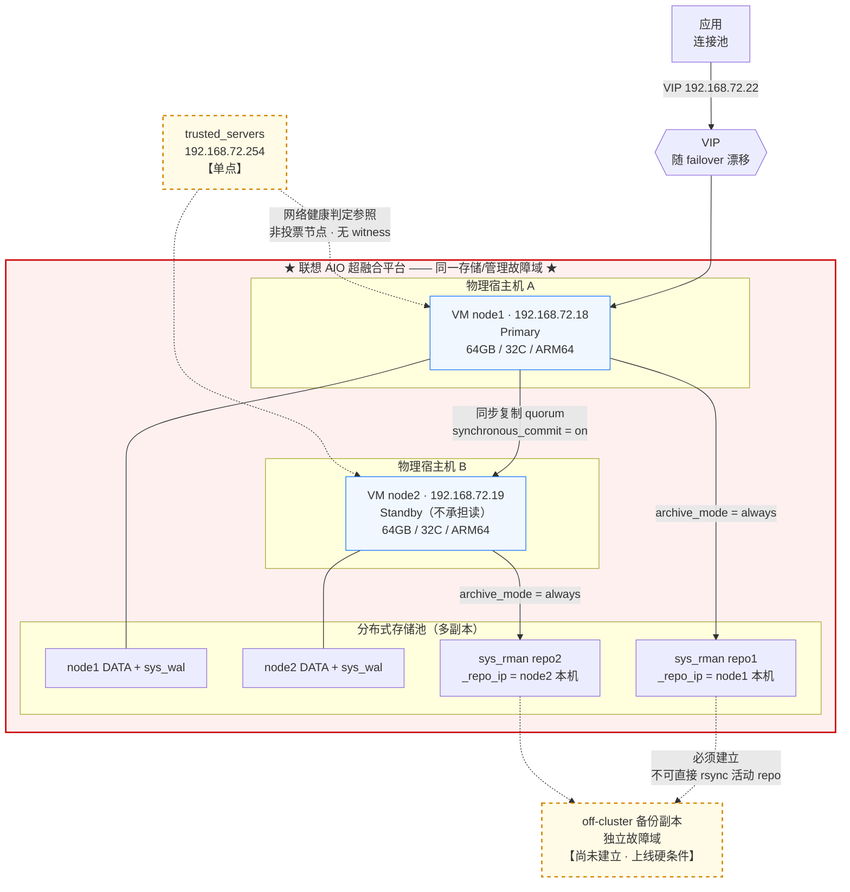

# KingbaseES V8R6 集群环境说明与参数配置基线

**主现场：64GB / 32C / ARM64 / Kylin V10 · 一主一备数据守护集群（DG）**
**附录含四套完整参数清单，覆盖 64G-32C 与 32G-16C 在 ARM64 / x86_64 下的组合**

| 项 | 内容 |
| --- | --- |
| 文档版本 | **v1.3.27（上线候选版 · 解冻中 · 五项冻结前提未全部完成）** |
| 首次编制日期 | 2026-09-03 |
| 当前修订日期 | 2026-09-13（v1.3.27 同日修订） |
| 适用集群 | 192.168.72.18（node1）/ 192.168.72.19（node2） |
| 数据库版本 | KingbaseES V8R6，V008R006C009B0014，Aarch64 |
| 集群形态 | **金仓数据守护集群（`ha_running_mode='DG'`）**，repmgr + kbha，1 Primary + 1 Standby，`synchronous=quorum`，**无 kingbasecluster 中间件层，应用经 VIP 直连数据库** |
| 承载平台 | 联想 AIO 超融合（多物理主机） |
| 当前状态 | **系统尚未上线**，数据库已部署但参数未调优 |
| 配套文档 | 《KingbaseES V8R6 集群安装指南》<br>**《KingbaseES V8R6 集群部署文档》v1.1.17**<br>**`kb_collect_all.sh` v1.2.5** 现场取证脚本（见附录 E）<br>**巡检与备份脚本集 `kb_scripts` v1.1.7**（`kb_backup_check.sh` / `kb_ha_watch.sh` / `kb_offcluster_copy.sh` / `kb_log_cleanup.sh` / `kb_lib.sh` / `backup8.conf`） |

> ⚠️ **本版为「上线候选版」，不是签发版。** 自 v1.2.1 起标题一直写作「上线签发版」，但文档自身规定的签发前置条件从未满足，属表述失当，本版更正。
>
> **转为正式签发版的条件（须全部满足）：**
>
> 1. 第 **7.0** 的 **21 项 P0 上线阻断项**全部关闭并签字
> 2. **2.2.5** 厂商巡检基线差异表的「厂商参考值 / 来源版本」两列填写完成
> 3. 附录 **C** 全部检查项完成并签字
> 4. A / B / C 三类故障演练完成，业务方对停顿时长与残留风险书面确认

---

## 0. 变更摘要

本版依据**历次技术评审**（最新一轮见第 0 章末尾的变更小节）并并入 **v1.3.2 现场 TCP 直连复测**结果修订，并已并入两节点 `repmgr.conf`、工具权限与 capability、HA 进程与端口、sysctl、THP、crontab、备份计划、网络时延、存储与 LVM 布局的现场实测值（汇总见**附录 D**）。**若手上是 v1.2.1 及以前版本，以下条目必须替换，不可混用。**

- **0.1 ~ 0.2**：v1.0 → v1.1
- **0.3**：v1.1 → v1.2
- **0.4**：v1.2 → v1.2.1
- **0.5**：v1.2.1 → v1.2.2
- **0.6**：v1.2.2 → v1.2.3
- **0.7**：v1.2.3 → v1.2.4
- **0.8**：v1.2.4 → v1.2.5
- **0.9**：v1.2.5 → v1.2.6
- **0.10**：v1.2.6 → v1.2.7
- **0.11**：v1.2.7 → v1.2.8
- **0.12**：v1.2.8 → v1.2.9
- **0.13**：v1.2.9 → v1.2.10
- **0.14**：v1.2.10 → v1.2.11
- **0.15**：v1.2.11 → v1.2.12
- **0.16**：v1.2.12 → v1.2.13
- **0.17**：v1.2.13 → v1.2.14
- **0.18**：v1.2.14 → v1.2.15
- **0.19**：v1.2.15 → v1.2.16
- **0.20**：v1.2.16 → v1.2.17
- **0.21**：v1.2.17 → v1.2.18
- **0.22**：v1.2.18 → v1.3.0
- **0.23**：v1.3.0 → v1.3.1
- **0.24**：v1.3.1 → v1.3.2
- **0.25**：v1.3.2 → v1.3.3
- **0.26**：v1.3.3 → v1.3.4
- **0.27**：v1.3.4 → v1.3.5
- **0.28**：v1.3.5 → v1.3.6
- **0.29**：v1.3.6 → v1.3.7
- **0.30**：v1.3.7 → v1.3.8
- **0.31**：v1.3.8 → v1.3.9
- **0.32**：v1.3.9 → v1.3.10
- **0.33**：v1.3.10 → v1.3.11
- **0.34**：v1.3.11 → v1.3.12
- **0.35**：v1.3.12 → v1.3.13
- **0.36**：v1.3.13 → v1.3.14
- **0.37**：v1.3.14 → v1.3.15
- **0.38**：v1.3.15 → v1.3.16
- **0.39**：v1.3.16 → v1.3.17
- **0.40**：v1.3.17 → v1.3.18
- **0.41**：v1.3.18 → v1.3.19
- **0.42**：v1.3.19 → v1.3.20
- **0.43**：v1.3.20 → v1.3.21
- **0.44**：v1.3.21 → v1.3.22
- **0.45**：v1.3.22 → v1.3.23
- **0.46**：v1.3.23 → v1.3.24
- **0.47**：v1.3.24 → v1.3.25
- **0.48**：v1.3.25 → v1.3.26
- **0.49**：v1.3.26 → v1.3.27 ★ 本版

### 0.1 参数取值变更（v1.0 → v1.1）

| 参数 | v1.0 | v1.1 | 原因 |
| --- | --- | --- | --- |
| `net.ipv4.tcp_mem` | 保留历史值 | **删除** | 值不满足内核要求的 `low < pressure < max`，且 64KB 页下折合数 TB，系模板转抄错误 |
| `net.ipv4.tcp_max_tw_buckets` | 保留历史值 6000 | **删除** | 远低于内核默认，超限后 TIME_WAIT 被直接销毁 |
| `net.ipv4.tcp_max_orphans` | 保留历史值 3276800 | **删除** | 单个 orphan socket 最坏占约 64KB 不可换出内存，该值不合理 |
| `net.ipv4.tcp_wmem` / `tcp_rmem` | 保留历史值（max 仅 873KB） | **按金仓 HA 推荐值** | 读写分离集群网络传输量大，需增大 socket buffer |
| `bgwriter_lru_maxpages` / `_multiplier` | 500 / 3.0 | **100 / 2.0（默认）** | 无生产负载数据时激进 bgwriter 会增加总 I/O（同页在检查点间被反复写出） |
| `vm.dirty_background_bytes` / `dirty_bytes` | 高优先级新增 64MB / 512MB | **降为 UAT 候选项** | 机制成立但取值需实测；在超融合虚拟盘上过激的回写阈值可能适得其反 |
| `effective_cache_size`（x86） | 建议放宽至 44~48GB | **与 ARM64 同值** | 原放宽理由基于未验证的架构差异，已撤销 |
| `wal_sync_method` | 未涉及 | **新增测试与确认流程** | `sys_test_fsync` 的实际用途即为该参数选值提供依据 |

### 0.2 表述与流程变更（v1.0 → v1.1）

| 条目 | v1.0 表述 | v1.1 修正 |
| --- | --- | --- |
| 同步降级窗口 | `reconnect_attempts × interval = 60秒` 即同步降级窗口 | **删除。** 二者是不同机制：`reconnect_*` 管故障判定重试，同步→异步由 repmgrd 监控循环（约 2 秒）驱动。演练拆为 A/B/C 三类 |
| `recovery` 与 `auto_cluster_recovery_level` | 将原主 rejoin 归给 `auto_cluster_recovery_level=1` | **修正。** 原主重新上线后的 rejoin 由 `recovery=automatic` 处理；`auto_cluster_recovery_level=1` 用于全集群节点均停止后的集群级恢复 |
| 超融合 VM HA | 建议关闭 | **改为：演练后决定。** 验证前不得假定两套 HA 可安全叠加，也不得假定必须关闭。新增"数据库启动控制链"验证 |
| `effective_cache_size` 理由 | 称 ARM64 64KB 页 backend 开销高于 x86 | **修正。** 与 1.3 节自相矛盾——64KB 页的页表开销显著**低于** 4KB 页。改为保守估计，不以页表为依据 |
| 超过 rejoin 窗口 | "必须重做基础备份" | **改为：** 可尝试经 sys_rman 归档补齐 WAL（`sys_rewind` 支持 `restore_command`），能否补齐取决于归档仓库实际保留范围 |
| `max_connections` 下调 | 计划后续下调 | **改为上线阻断项。** 金仓 FAQ 记录：读写分离集群中调小主节点 `max_connections` 后备库无法启动。不在文档中给出下调操作路径 |
| 并行参数关系 | 称不存在求和约束 | **改为：** 按金仓《SQL 调优指南》给出的关系执行，标注为厂商调优建议而非引擎启动硬限制 |
| `max_parallel_maintenance_workers` | "不额外吃内存" | **改为：** `maintenance_work_mem` 是整条命令的总预算按 worker 切分（与并行查询语义相反）；但 worker 进程自身仍有内存开销并增加 CPU/IO |
| OOM 保护 | 断言 backend 会被调回普通值 | **改为：** 需现场实测确认。若全进程树继承 -1000，OOM killer 可能转而杀 repmgrd/kbha |
| `sys_test_fsync` 阈值 | 表述近似验收标准 | **标注为项目经验参考值，非金仓官方验收标准** |
| 备份异地副本 | 待规划 | **上线硬条件。** 且不采用对活动 repo 直接 rsync |
| WAL 速率测量 | `ls -l sys_wal \| grep mtime` | **改为 LSN diff。** WAL 段循环复用与预创建会使 mtime 失真 |
| fio 校准方法 | 8K/QD1 随机 对比 1M/QD32 顺序 | **重做。** 原方法同时改变 block size 与 queue depth，比值不具可比性 |
| `use_check_disk` | 记录现状 off | **列入上线前待决策项**，需经存储故障演练确定 |

---

### 0.3 v1.1 → v1.2 变更

第三轮评审发现 2 个 P0 与 2 个 P1，均已修订。

| 级别 | 问题 | v1.1 | v1.2 |
| --- | --- | --- | --- |
| **P0** | 大页"预留"与"启用"被拆开表述，照做会白白锁住 23GB 内存（当时称 ARM64 需重启才能取回，**该说法已由 v1.2.1 更正**，见 0.4） | 2.4.2 表中 ARM64 行同时出现"数量 46"与 `huge_pages=off`；附录 B.1 抬头写"预留 46，首轮 off" | **首轮明确不预留、不启用**；表格改为「首轮 / 后续」两列；新增"预留与启用必须成对"警告；附录 B 四套抬头与配置注释同步修正 |
| **P0** | `sys_file_settings` 验收判据错误 | 要求 `error IS NOT NULL OR applied=false` 为 0 行 | **拆为三条**：(a) `error IS NOT NULL` 要求 0 行；(b) `applied=false AND error IS NULL` 不要求 0 行、逐项解释；(c) `pending_restart` 检查。**⚠️ 当时把"待重启"也归入 (b)，该归类已由 v1.2.1 更正——待重启属 (a) 或 (c)，见 0.4** |
| **P1** | WAL 容量降级表内部矛盾 | `<60GB → 4GB/1024`，即 16GB < 8×4GB=32GB，违反自身引用的 8 倍规则；且正文"≥80GB"与表格"≥100GB"口径冲突 | **删除该档**，改为「< 72GB 不提供降级方案，列为扩容项」；统一口径为**规划目标 100GB / 绝对下限 72GB**，表中增加 8 倍规则校验列 |
| **P1** | Oracle 兼容属性无验收项 | 检查表只覆盖性能参数 | 新增 **5.2.1 Oracle 兼容参数基线**（全量 `ora_*` 查询 + 变更前后 diff）与检查表 3a/3b/3c；明确"附录 B 不含 Oracle 兼容 GUC，性能调整不得覆盖它们" |
| P1 | 删除 sysctl 行 ≠ 运行值恢复 | 只写"删除并 `sysctl -p`" | 明确**需重启 OS** 后内核才按内存重算默认值；P0 关闭标准同步改为"重启后确认运行值" |
| P1 | A 类演练结论又引回 `reconnect_*` | 与前文"二者不是同一机制"矛盾 | 改为按 `monitor_interval_secs` / `wal_sender_timeout` / 同步策略评估，并显式禁止仅凭 A 类结果调 `reconnect_*` |
| P1 | fio 结果直接映射 planner cost | `random_page_cost ≈ 延迟比` | 改为**只用于缩小候选区间**，最终由真实 SQL 的 `EXPLAIN (ANALYZE, BUFFERS)` 决定；新增测试文件预写步骤，测试集由 4GB 增至 16GB（避免全部落入平台缓存） |
| P1 | "不能调小"被泛化 | 称 `max_wal_senders` / `max_replication_slots` 也不能调小 | 仅 `max_connections` 有厂商明确规则；其余表述为 recovery-sensitive、需核查主备约束并走原厂流程 |
| P2 | 复制槽验收要求 `active=true` | 未考虑集群可能根本没有槽 | **未启用槽时 0 行为正常**；查询增加 `retained_wal_mb` |
| P2 | 归档验收要求 `failed_count=0` | 累计计数器，历史临时失败会永久阻断 | 改为 `last_failed_time IS NULL` 或 `last_archived_time > last_failed_time` 且持续推进 |
| P2 | RPO 表无前提条件 | 直接写 `on` / `remote_apply` RPO=0 | 加注"同步备库健康且 `synchronous_standby_names` 非空时"，并说明自动降级后 RPO 不再为 0 |
| P2 | `remote_apply`"纯亏损"、`hot_standby_feedback`"只会造成膨胀" | 表述过于绝对 | 补充 `remote_apply` 可压低 replay lag 从而略降 failover RTO；`hot_standby_feedback` 改为"收益低 + 有膨胀风险"的权衡表述 |
| P2 | 日志要求"不同物理盘" | 超融合下无明确意义 | 改为**独立文件系统 / 虚拟盘 / 容量配额**，目标是日志涨满不挤占 DATA/WAL |
| P2 | 缺少与厂商巡检基线的差异说明 | — | 新增 **2.2.5 现场值与厂商巡检基线差异说明表** |

> **v1.2 未采纳的一条：** 评审提到"现场原有 `ora_input_emptystr_isnull = on` / `ora_integer_div_returnfloat = on`"。这两个参数**不在现有安装文档中**，无证据支持。v1.2 按"以现网 `SHOW` 结果建立基线"处理，不将未经确认的参数名与取值写入验收表。同理 `SHOW database_mode` 的确切 GUC 名需现场核对。

### 0.4 v1.2 → v1.2.1 变更

第四轮评审发现 1 个 P0 与 4 个 P1，均已修订。

| 级别 | 问题 | v1.2 | v1.2.1 |
| --- | --- | --- | --- |
| **P0** | 数据库服务开机自启只要求"记录"，未要求禁用 | 5.1 与 C.1-16 仅"记录启动控制链" | **升为上线阻断项 7.0-7 与检查表 C.1-16**：`systemctl is-enabled kingbased` 必须为 `disabled`。金仓读写分离集群的部署约束要求集群节点停止 `kingbased` 并注销开机自启，数据库启动/恢复交由集群 HA 控制链管理。**这是部署前提，不是演练结论**——与"VM HA 是否开启由 B 类演练决定"明确分开。同时新增 C.1-16b：不得误禁 kbha / repmgr |
| **P1** | ARM64 大页数量与自身公式不符 | 公式写 `×1.1÷大页尺寸`，但 ARM 取 46/24（公式值为 44/22），x86 取 11264/5632（严格符合公式），等于两套算法 | **显式写出余量**：基数 = `ceil(shared_buffers×1.1÷大页尺寸)`，ARM64 另加 2 页（1GB）——因为 512MB 粒度下预留不足会导致 `huge_pages=on` 时数据库无法启动。新增基数/最终值对照表 |
| **P1** | "512MB 大页运行期无法释放"表述错误 | 称误配后必须重启才能取回 | **更正**：只要大页未被占用，缩减 `vm.nr_hugepages` 即可归还普通内存池。ARM64 的真实限制是「运行期分配易因物理内存碎片失败」与「GRUB 参数不删则重启后重新预留」，而非不可逆 |
| **P1** | `sys_file_settings` 将"待重启"归入 `applied=false / error=NULL` | 称该状态有两种正常成因 | **修正归类**：参数因"不能在启动后改变"而未生效时，引擎在 `error` 中记录原因，属 (a)；待重启由 (c) 的 `pending_restart` 专管。(b) 只负责"被后续同名项覆盖"，验收标准改为"每行都能指出被哪一行覆盖" |
| **P1** | 72GB/36GB 称"绝对下限"，推导不成立 | `64GB + 8GB = 72GB` 作为物理硬下限 | **改为工程参考值**。`max_wal_size` 是软限制，高写入/归档失败/slot 滞留时实际 WAL 可超过该值，且它并非与 `wal_keep_segments` 相互独立的固定占用，该加法不成立。100GB/50GB 规划目标保留 |
| **P1** | 附录 B 四套模板存在 v1.1 遗留 | 四套版本号仍为 v1.1；B.2（64G x86）容量注释仍为 80GB；B.4（32G x86）仍为 45GB | **全部同步**。此前的回归脚本只比对 `参数 = 值` 行、未检查注释，导致漏检；本轮已补上注释一致性核对 |
| P2 | 2.4.2 表格重复表头 | 旧五列表头与新三列表头并存，Markdown 渲染异常 | 删除旧表头 |
| P2 | "x86 大页是必配项"过绝对 | — | 改为"强烈建议配置显式大页……属性能基线建议，非引擎强制要求" |
| P2 | B.1 标"可直接使用"与"待实测"矛盾 | — | 改为"可作为上线候选基线，P0 关闭且定值完成后落地"；待实测项由 5 项增至 6 项（补 `max_wal_size`） |
| P2 | 巡检差异表缺来源标注 | 只有"厂商基线值"一列 | 增加**来源/版本**列——金仓部署基线、HA 最佳实践、日常巡检基线的推荐值未必一致，必须记录取自哪一份 |
| P2 | 变更记录顺序错乱 | v1.0 → v1.2 → v1.1 | 改为时间顺序 |
| 新增 | — | — | **7.2.1 故障域关系图**：以图示说明主备 VM 与两份 sys_rman repo 同处一个超融合存储域、反亲和与仲裁单点三项风险 |

### 0.5 v1.2.1 → v1.2.2 变更

第五轮评审发现 1 个 P0、3 个 P1 与 4 处回归，均已修订。

| 级别 | 问题 | v1.2.1 | v1.2.2 |
| --- | --- | --- | --- |
| **P0** | `running_under_failure_trusted_servers` 全文未出现 | 只把 `trusted_servers` 记为"单点风险"，未记录决定其后果的参数 | **升为上线阻断项 7.0-8 与检查表 3d**。该参数决定 trusted_server 不可达时数据库是**继续运行**（`on`，官方默认）还是**被关闭**（`off`）——同一件事两种相反后果。1.4 环境表新增该行并要求以 `repmgr.conf` 实测值为准；C 类演练改为记录"实测值 / 实际行为 / 是否相符 / 业务方可否接受"四项。**新增分析：单 trusted_server 下 `on` 与 `off` 各有明确缺陷，取值应与"增加 trusted_servers 数量"一并决策** |
| **P1** | 日志有 rotation 无 retention | 称"新增轮转设置，解决撑爆磁盘风险" | **新增 3.12.1「轮转 ≠ 清理」**。`log_truncate_on_rotation` 只在时间轮转产生同名文件时才覆盖，而本配置文件名含 `%Y-%m-%d_%H%M%S`，每次都是新名字，**没有任何文件会被删除**。改为「Kingbase 管轮转 + OS 管保留」分工，给出清理命令与容量告警要求。⚠️ **清理必须同时匹配 `.csv`**——`log_destination='csvlog'` 实际产出 `.csv`，只按 `*.log` 清理会漏掉真正占空间的文件 |
| **P1** | `sys_test_fsync` 测试文件写进活动 `sys_wal` 目录 | `-f .../data/sys_wal/fsynctest` | 官方只要求**同一存储设备**，非同一目录。改为先 `findmnt -T` 定位挂载点，在同一文件系统、PGDATA 之外建专用测试目录 |
| **P1** | 巡检差异表漏 `fs.file-max` / `fs.aio-max-nr` | 表中无这两项 | 补入两行（厂商 HA 基线明确检查项），并给出补测命令。**新增提示**：厂商基线的 `net.core.*mem_max` 若低于现场 16MB 不应据此改小——`*mem_max` 限制的是 `SO_RCVBUF` 显式设置值，`tcp_rmem[2]`/`tcp_wmem[2]` 的自动调优上限不受其约束 |
| P2 | 2.4.3 残留"ARM64 上必须重启才能取回" | 与 2.4.2 已更正的内容矛盾 | 删除并改为与 2.4.2 一致的表述。**该处上一轮漏检的原因是自查脚本搜"需重启才能取回"、正文写的是"必须重启才能取回"** |
| P2 | C.2-1b 仍写"被覆盖/待重启项" | 与正文已修正的三分逻辑不符 | 改为"被后续同名参数覆盖的条目"，并注明待重启属 1c |
| P2 | C.1-11 仍写"下限 72/36GB" | 与正文"工程参考值"不符 | 改为"规划目标 …（72/36GB 仅为工程参考，非理论下限）" |
| P2 | 附录 A 大页公式漏 `+2 页` | 读者按公式会算出 44/22 而非 46/24 | 补全 ARM64 与 x86 各自的完整算式，并新增"余量策略"行 |
| P2 | 故障域图称"单一故障域"过绝对 | 低估了 AIO 内部的多宿主机 / 多副本 / 节点容错 | 改为"**同一存储/管理故障域**"，说明表同步改为"四份数据没有跨出同一保护域"，并区分"单点硬件故障"与"跨越整个保护域的事件" |

### 0.6 v1.2.2 → v1.2.3 变更

本轮取得了 node1 `repmgr.conf` 的**实测内容**，同时第六轮评审发现 1 个 P0 回归与若干一致性问题。

| 级别 | 问题 | v1.2.2 | v1.2.3 |
| --- | --- | --- | --- |
| **P0** | 0.5 声称 `running_under_failure_trusted_servers` 已落到 1.4 / 7.0-8 / C.2-3d，**实际三处均未落地** | 该参数只出现在 6.3 与 7.3-1a | **真正落地**：新增 **1.4.1 repmgr.conf 运行态 HA 参数（现场实测）**；7.0 补 **#8**；检查项归入 **C.4 故障演练**（该参数是集群 HA 配置项、非数据库 GUC，放 C.2 位置不当，故不设 3d）。**根因：上一轮编辑脚本中途断言失败未写回文件，而回归检查只验证字符串存在、未验证所在章节** |
| **新增** | — | — | **`running_under_failure_trusted_servers = 'on'` 现场值已确认**（node1）。含义、本现场取 `on` 的利弊、以及「改 `off` 的前提是先配多个 trusted_servers」均已写入 1.4.1 |
| **新增** | 集群形态定性有误 | 全文按「读写分离集群」表述 | **实测 `ha_running_mode='DG'`——是数据守护集群，无 kingbasecluster 中间件层**。已修正集群形态描述；`max_connections` 不可调小那条 FAQ 补注「来源属读写分离集群场景，与本形态不完全对应，结论保留但下调须原厂确认」；并明确**连接池只能由应用侧提供** |
| **新增** | `ping_path` / `arping_path` 未验证 | 未提及 | 升为 **P0 #10**。`arping_path='/opt/kes/bin'` 与安装目录不一致，疑为模板默认值；缺失会导致 VIP 漂移后 ARP 不刷新、**failover「半成功」**。`ping` 缺失则使 trusted_servers 检测静默失效，而 `on` 恰好掩盖该失效 |
| **新增** | 演练期观测性 | 未提及 | `monitoring_history='no'`，演练期缺少可回溯的复制延迟曲线，建议演练窗口内临时开启 |
| **新增** | HA 日志轮转 | 未提及 | `etc/logrotate_ha.conf` 已覆盖 `hamgr.log` / `kbha.log`；**数据库日志仍需 3.12.1 的独立保留策略** |
| **P1** | `trusted_servers` 被表述为「仲裁」 | 1.4 与故障域图均称「仲裁依赖 / 仲裁参照」 | 改为**网络健康判定的外部参照**（能 ping 通任一即认为本机网络正常），明确其**不参与投票**。图中标注同步改为「网络健康判定参照 · 非投票节点」。7.3-1 补充「多个 trusted_servers 应选不同设备 / 不同故障路径，同一交换机上的两个 IP 只是形式上的多个」 |
| **P1** | `%a` 轮转的理由不准确 | 称「会丢失同日内的历史」 | 改为准确表述：`log_truncate_on_rotation` 只对**时间轮转**生效，仅按星期命名时**同日内的尺寸轮转拿不到唯一文件名，200MB 切分目标失效**；并说明当前 `%H%M%S` 已满足官方「加入更细时间粒度」的建议 |
| **P1** | 日志 retention 的 P0/P1 定级三处不一致 | 0.5 记 P1、C.1 标 P0、7.0 无此项 | **统一升为 P0**，补入 7.0 **#9** |
| P2 | 5.2 标题仍写「拆成两条」 | 实为三类 | 改为「拆成三类」 |
| P2 | 0.3 历史条目保留已被推翻的 `applied=false` 说明 | 顺读会被误导 | 加注「该归类已由 v1.2.1 更正，见 0.4」 |
| P2 | 7.2 正文仍写「故障域上是一份」 | 与已修正的图示矛盾 | 统一为「四份均未跨出同一 AIO 存储/管理保护域；内部冗余可承受部分硬件故障，但不能替代 off-cluster 备份」 |
| P2 | C.1 编号 15/16/16b/15c/16c 混乱 | 签字文档不宜 | **重编为连续整数** |
| P2 | `sys_test_fsync` 脚本无防呆 | 手工填挂载点易出错 | 改为 `findmnt -n -o TARGET` 自动取值 + 非空校验 + 变量加引号 + `rm -rf --` |

> **仍未完成（非文档缺陷，属现场取值）：** 2.2.5 厂商参考值 / 来源两列仍为空白，按文档自身规定**必须在签发前填完**。

### 0.7 v1.2.3 → v1.2.4 变更

本轮取得两节点 `repmgr.conf`、VIP 工具权限、HA 进程与端口的实测数据，**关闭 2 项 P0**，同时第七轮评审发现 2 个 P0 与 6 个 P1。

| 级别 | 事项 | v1.2.4 处理 |
| --- | --- | --- |
| ✅ **闭环** | **P0-8**：node2 `repmgr.conf` 与 node1 逐项一致（仅 node_id / node_name / conninfo host / net_device_ip 按节点不同） | 1.4.1 node2 列已填实 |
| ✅ **闭环** | **P0-10 文件存在部分**：`/bin/ping`、`/sbin/ip`、`/opt/kes/bin/arping` 三项均存在 | 新增 **1.4.2 VIP / 网络检测工具链实测** |
| ✅ **更正** | v1.2.3 曾怀疑 `arping_path='/opt/kes/bin'` 是模板残留 | **不是**。`sys_securecmdd -f /opt/kes/etc/securecmdd_config` 证明 `/opt/kes` 是真实 KES 安装路径 |
| **P0（新）** | **`/bin/ping` 权限为 755、无 setuid，而 `sudo -u kingbase test -x` 只验证可执行位，证明不了 kingbase 能真正发出 ICMP** | 非特权 ping 依赖 `cap_net_raw+ep` 或 `ping_group_range`，二者 `ls -l` 均看不出。若不可用 → trusted_servers 恒判失败 → **repmgrd 关闭、HA 静默降级**。P0-10 扩展为「命令 + 权限 + 功能」三层验证，新增 `getcap` / `sysctl ping_group_range` / `sudo -u kingbase ping` |
| **P0（新）** | 两节点无 witness 的 1:1 网络分区**多主风险**，原表述「其他机制兜底」过于乐观 | **撤销该措辞**。明确 VIP、`connection_check_type=mix`、`trusted_servers` **都不是严格 fencing**；官方资料明确该拓扑存在多主风险。新增 **P0-11 架构风险确认项**，业务方三选一签字 |
| **P1** | `running_under_failure_trusted_servers='on'` 只写「数据库继续运行」，**漏了 repmgrd 会关闭、HA 能力丧失** | 补入「静默降级」说明；C 类演练由 4 项扩到 9 项（含 repmgrd/kbha 存活、`repmgr service status`、此时能否自动 failover、恢复方式）；新增 **P0-12：repmgrd/kbha 纳入独立监控** |
| **P1** | `arping` 失败后果描述与官方升主流程不符 | 官方顺序为「检查 trusted_servers → 停旧主 → 挂 VIP → arping → promote」，**VIP/arping 失败会放弃 promote**。风险形态改为「VIP 已挂载但数据库仍是 standby / 只读」，而非「已切换只是 ARP 没刷新」 |
| **P1** | 全文残留「读写分离集群」定性 | 主标题、四套附录模板、2.2.2 等已清理。B.1 改为「数据守护集群（DG）」，B.2~B.4 改为通用表述 + 「集群形态需按目标现场 `ha_running_mode` 确认」 |
| **P1** | `net.core.*mem_max` 与 `tcp_*mem[2]` 关系解释错误 | 原写「后者不受前者约束」不准确——内核文档明确 `tcp_rmem` max「does not override net.core.rmem_max」。改为中性表述并说明本现场二者均 16MB、无冲突 |
| **P1** | `rmem_default`/`wmem_default = 8MB` 的「配套」理由不成立 | 厂商基线 default 为 256KB 量级，无此配套要求。标记为**待验证的历史偏离值**，无压测证据时倾向恢复基线 |
| **P1** | SCRAM「历史账号无需重置」过于绝对 | `password_encryption` 只影响新建/重置密码时的算法。新增 **5.2.2 口令哈希类型核查**（查 `sys_authid`），结论改为按实测判定 |
| **P1** | `use_scmd` / `scmd_options` 未纳入基线 | 补入 1.4.1（含 8890 端口）与附录 D.6（进程与监听实测） |
| **P1** | `max_slot_wal_keep_size` 被直接断言不存在 | 改为对目标补丁 `SHOW` 实测后再下结论 |
| P2 | `sys_file_settings` (b) 小标题仍写「或待重启」 | 改为「被后续同名参数覆盖的条目」 |
| **新增** | 按要求汇总所有截图实测数据 | **新增附录 D：现场实测环境快照与建议值**（D.1 硬件/D.2 OS/D.3 版本形态/D.4 repmgr 参数与建议/D.5 工具链/D.6 HA 进程端口/D.7 待取值汇总），每项给出建议值与动作 |
| **新增** | 精确版本号 | 由进程路径读出 **`V008R006C009B0014PS062`**（含 PS062 补丁级），比 install.conf 更精确 |

> **仍未完成：** 2.2.5 厂商参考值 / 来源两列空白（签发前置）；P0 现为 12 项，其中 P0-7 / P0-10 功能验证 / P0-11 可由现场在数小时内关闭。

### 0.8 v1.2.4 → v1.2.5 变更

本轮取得 `getcap` / `ping_group_range` / 实际 ping / `systemctl` / `sysctl` / THP / crontab / `rc.local` 的两节点实测数据。**关闭 2 项 P0，改写 1 项 P0 的性质，新增 3 项 P0。**

| 级别 | 事项 | v1.2.5 处理 |
| --- | --- | --- |
| ✅ **闭环** | **P0-10 命令与权限部分**：`/bin/ping` 虽 755 无 setuid，但带 `cap_net_admin,cap_net_raw+p`；`ping_group_range` 为 `1 0`（空区间，未启用）；`sudo -u kingbase ping` 两节点均 0% 丢包 | 非特权 ping 走 **capability** 路径，v1.2.4 担心的「HA 静默降级」不成立。**保留提示**：`ls -l` 看不出 capability，升级/重装/还原可能丢失，建议 `getcap /bin/ping` 入巡检 |
| ✅ **闭环** | 五项 sysctl 与厂商 HA 基线完全吻合：`fs.file-max=7672460`、`fs.aio-max-nr=1048576`、`vm.min_free_kbytes=512000`、`vm.vfs_cache_pressure=200`、`net.core.somaxconn=4096` | 2.2.5 偏离表据此收窄——真正需要论证的仅剩 `kernel.sem`、`vm.swappiness`、`net.core.*mem_default/max`、`tcp_max_syn_backlog` 四项 |
| **改写性质** | **P0-7**：`kingbased.service` **根本不存在**，数据库不由 systemd 管理 | 新增 **1.4.3 启动控制链与定时任务**：实际由 **kingbase crontab `*/1 * * * *` 拉起 kbha**；`/etc/rc.local` 仅默认模板；root 无 crontab。P0-7 由「必须 disabled」改为「**已查明 + 是否保留该 cron 自启需决策**」 |
| **改写** | **6.2 B 类演练的性质随之改变** | 老主库 VM 恢复后，cron 会在 **≤60 秒内**自动拉起 kbha 并依 `recovery='automatic'` 尝试回归——**该过程必然发生且无人干预**。演练要验证的不是「会不会自动起来」，而是「起来后是否正确识别新主、是否 rewind/rejoin、是否出现双主窗口」。若需人工决策点，唯一途径是注释该 cron 行（非 `systemctl disable`） |
| **P0-13（新）** | THP 现场实测为 **`madvise`**，非要求的 `never` | 升为 P0；需改并 GRUB 持久化后复验 |
| **P0-14（新）** | 备份窗口重叠与 cron 表达式缺陷 | `0 2 * * *`（逻辑备份）与 `0 2 */7 * *`（物理全备）在每月 1/8/15/22/29 日**同时启动**，建议错开；且 `*/7` 在「日」字段并非「每 7 天」（实为 1/8/15/22/29 日，月末间隔仅 2~3 天），若意图为每周应改星期表达式 |
| **P0-15（新）** | **两节点到网关 RTT 相差 18 倍** | node1 `0.811/0.823/0.835 ms`，node2 `13.414/15.406/17.398 ms`，同网段同网关，且 node2 两包**都**慢（非首包 ARP 伪影）。本网段网关正常应 <1ms。影响：node2 升主后即为业务网络特性；同步复制提交延迟；trusted_servers 检测超时判定。给出 `ping` / `ethtool` 排查命令，并需超融合侧确认两 VM 的宿主机与上联口 |
| **新增** | 按要求补充本轮实测数据 | 附录 D 新增 **D.8 启动控制链与定时任务**（crontab 逐行 + 建议）；D.2 补 THP 实测与五项 sysctl；D.5 补 capability、`ping_group_range` 与两节点 RTT 对比；D.6 更正 `kingbased.service` 状态；D.7 待办表标注已闭环项 |
| **新增** | off-cluster 副本复制窗口 | 备份时间表已明确，副本复制应安排在全备完成之后（⚠️ **该结论已由 v1.2.11 更正——全备完成 ≠ repo 静止**，见 0.14） |

> **P0 现为 15 项**，其中 P0-13 / P0-14 可由现场在数十分钟内关闭；P0-15 需网络与超融合侧配合。

### 0.9 v1.2.5 → v1.2.6 变更

本轮取得 20 包网络时延、`df -h`、`SHOW max_slot_wal_keep_size` 的两节点实测。**撤销 1 项误判，关闭 1 项验证，新增 1 项 P0。**

| 级别 | 事项 | v1.2.6 处理 |
| --- | --- | --- |
| ⛔ **撤销误判** | v1.2.5 据 2 包样本判断「node2 网络路径慢、会拖高同步复制提交延迟」 | **该结论错误，已撤销。** 20 包实测：节点间 RTT node1→node2 `0.309ms`、node2→node1 `0.269ms`，mdev 仅 0.04~0.05ms、0% 丢包，**链路质量优秀**。抖动来自网关自身且两节点表现一致（node1 也测得 max 14.792ms、mdev 7.029ms）。同一台 node1 先后两次 2 包样本为 `0.811/0.835` 与 `0.733/14.8`——**2 包样本无法表征链路，这是取样方法错误** |
| **P0-15 改写** | 由「node2 RTT 异常排查」改为「**trusted_servers 目标可靠性确认与扩充**」 | 抖动是网络设备处理「发往自身」ICMP 的典型特征（软件慢路径 + 限速）。**判定标准是丢包而非延迟**——目前 0% 丢包、14.8ms 对秒级 ping 超时够用，故尚不能断定实际风险，须以 `ping -c 300` 确认丢包率。**选型要求升级：trusted_servers 不得再选网关**，应选同网段内对 ICMP 响应稳定的普通服务器；由「建议多个」升级为**必须 2~3 个** |
| **P0-15（新）** | **存储无任何隔离** | `df -h` 实测：除 `/boot` 外**只有一个文件系统 `/`（1.1T，已用 2%）**，数据、WAL、归档、sys_rman 仓库与规划中的日志目录**全部同盘**。本文档自 v1.1 起反复要求的容量隔离**一条都未落实**。新增 **1.4.4 存储布局实测**，给出 LVM 扩展 / 加虚拟盘 / project quota 三档方案。**空间不缺（仅用 2%），缺的是隔离**；本机为虚拟机且未上线，加盘是分钟级操作，此时处理成本最低 |
| ✅ **闭环** | `max_slot_wal_keep_size` 是否存在 | **实测确认不存在**（`ERROR: unrecognized configuration parameter`）。该版本无任何引擎侧 slot WAL 滞留上限保护。⚠️ **与单一文件系统叠加后风险放大**——slot 滞留撑满的是同时承载数据、归档与备份的那个 `/`，因此 **slot 监控由建议项改为强制项** |
| **新增** | 授权与版本信息 | `ksql` 横幅显示**授权类型 SALES-企业版 V8R6**，已记入 D.3 |
| **新增** | 附录 D | 新增 **D.7b 存储布局**；D.5 网络行改为节点间 / 网关两行对照；D.3 补授权类型与 `max_slot_wal_keep_size` 结论；D.7 标注已闭环项 |
| **联动修订** | 3.12 日志容量隔离 | 补注「现状不满足该要求」，说明必须先完成 1.4.4 的存储拆分，`log_directory` 配置才具备防护意义 |
| **联动修订** | 7.0-5 容量告警 | 补注当前告警对象即 `/`，且 slot 监控为强制项 |

> **P0 现为 16 项。** P0-15（存储隔离）与 P0-13（THP）、P0-14（备份窗口）同属现场可自主关闭的一类；P0-15 需网络侧配合确认丢包率并选定新的 trusted_servers 目标。

### 0.10 v1.2.6 → v1.2.7 变更

本轮取得 300 包网关时延与 `lvs` / `vgs` / `lsblk` 两节点实测。**解除 1 项 P0 的功能风险，细化 1 项 P0 的处置方案，新增 1 项 P0。**

| 级别 | 事项 | v1.2.7 处理 |
| --- | --- | --- |
| ✅ **风险解除** | **P0-15**：300 包长样本 **两节点均 0% 丢包** | node1 `0.645/9.129/164.247` mdev 23.594；node2 `1.712/9.091/151.903` mdev 18.505。**零丢包是关键判据**（余量口径已由 v1.2.9 统一为按 `ping -c3 -w2` 的 2 秒 deadline 计算，约 4 倍；当时所写「6 倍」已废止）。P0-15 由「必须排查」降级为两条非紧急动作：补到 2~3 个 trusted_servers（单点问题仍在）、长尾抖动纳入监控。**若将来出现丢包须立即重评** |
| **P0-15 细化** | **发现未挂载的 `klas-backup` LV（23.1G）** | `lvs` 显示该 LV 属性为 `-wi-a-----`（active 但未 open），**已创建却从未挂载**——存储隔离规划做了一半，最后一步没做，因此备份目前全部写在 `/` 上。处置改为两步并行：第一步格式化并挂载至 `/data`（⚠️ 当时所写「可立即执行、不需停机」**已由 v1.2.10 撤销**）；第二步因 **VFree = 0** 必须请超融合加虚拟盘后扩容 |
| **补充实测** | LVM / 块设备拓扑 | `vgs` VFree **= 0**（无剩余 extent，扩容必须先加盘）；`klas-root` 1.05T **横跨 vda3(78.4G) 与 vdb(1T) 两个 PV** 线性拼接，超融合上不额外增加风险但 vdb 无法单独摘除；`klas-swap` 8G 与此前 `free -m` 的 8191MB 一致 |
| **P0-16（新）** | **预计数据量未知，无法完成容量规划** | 23.1G 的备份卷是否够用取决于真实数据量——`_repo_retention_full_count=2` 需容纳 2 个全备及其间 WAL 归档，而 `/` 当前仅用 20G（含 OS、数据库软件、空库），据此无法判定。该数值同时决定 `/` 上 WAL 与数据空间是否充足、以及 off-cluster 副本的存储需求 |
| **新增** | 附录 D | D.5 网关行更新为 300 包结果并标注风险解除；D.7b 补 `klas-backup` / `klas-swap` / VG VFree / 块设备拓扑四行；D.7 待办表补三项 |

> **P0 现为 18 项。**（⚠️ 其中「第一步可立即执行」的表述已由 **v1.2.10 撤销**——必须先完成第 0 阶段确认并在受控窗口执行，见 0.13。）

### 0.11 v1.2.7 → v1.2.8 变更

第八轮评审（针对 v1.2.6，其所列问题在 v1.2.7 中均仍存在）发现 **2 个文档级 P0 与 5 项回归**，全部修订。

| 级别 | 问题 | v1.2.8 处理 |
| --- | --- | --- |
| **P0（文档）** | **验收项永远无法通过**：正文已确认 `kingbased.service` 不存在，5.1 与 C.1 却仍要求 `systemctl is-enabled kingbased` = **`disabled`**——现场实际返回 `No such file or directory`，按附录 C 根本无法完成签字 | 5.1 改为**启动控制链五点确认**：① `kingbased.service` 不存在（预期即 `No such file`）② `/etc/rc.local` 无启动项 ③ root crontab 无启动项 ④ kingbase crontab 仅一条生效 kbha 路径 ⑤ cron 自启保留与否已书面决策。C.1-16 同步改写；C.1-17 新增「删除已注释的旧 kbha cron 行」；C.1-20 改为以进程存活验收 |
| **P0（文档）** | **「trusted_servers 不得再选网关」是过度纠正，已撤销** | 三点理由：① 与金仓官方指引相反——官方**推荐填写网关地址**，集群手册直接将其定义为集群内部网络的网关设备地址；② 本现场实测**不支持**该结论（300 包 0% 丢包）；③ 延迟本非判据——官方探测近似 `ping -c3 -w2`，**2 秒预算**对实测最大单包 164ms 有约 **4 倍余量**，且需所有 trusted_server 均异常并重试后才判定故障。**保留 `192.168.72.254`** |
| **新增论证** | 此前双方均未点明的判定逻辑 | trusted_servers 判定为「**任一可达即认为正常**」，故增加目标**降低误判、却提高漏判**——同二层域内的服务器在上联口故障时可能仍可达，**反而掩盖真实隔离**。由此得出正确选型原则：**目标应在「本节点真正被隔离时恰好不可达」**。按此标准**网关反而是合理选择**——ping 不通自己的网关基本等同于真的被隔离，而同网段普通服务器不具备该性质。7.3-1a 据此重写 |
| **P1** | **P0-15 未覆盖 `sys_wal` 隔离** | 仅拆 `/data` 只解决「日志与备份挤占根盘」，而**复制槽滞留 / 归档失败导致的 WAL 堆积**其载体 `sys_wal` 仍在 `/` 上，叠加已实测不存在的 `max_slot_wal_keep_size`，该路径无任何拦截。关闭标准改为覆盖**三个容量域**：① 系统/DATA ② **`sys_wal`（理想为独立 LV；否则须有 WAL 扩张的容量控制与强告警并记录为残留风险）** ③ backup + log |
| **P1** | 建议 project quota 前未确认文件系统类型 | 新增 `findmnt -no SOURCE,FSTYPE,OPTIONS` 前置步骤——此前只记录 `df -h`，**未记录 FSTYPE**；XFS project quota 需 FS 为 XFS 且挂载启用 `prjquota` |
| **P1（回归）** | 1.4.1 仍写 `ping_path`「权限存疑」 | 已闭环，改为「带 `cap_net_raw`，kingbase 实测 ping 成功」 |
| **P1（回归）** | 7.3 仍有「`ping_path` / `arping_path` 未验证」行，且编号 `1b` 重复 | 改为已闭环表述；7.3 编号整理为 1 / 1a / 1b / 1c |
| **P1（回归）** | D.7 仍写「node2 网关 RTT 15ms 排查」 | 改为「trusted_servers 长样本可达率与冗余确认」并标注已降级 |
| **P1（回归）** | 7.2.1 故障域图说明仍写「须靠其他机制兜底并实测」 | 与「均非 fencing」的结论矛盾，改为「仍存在多主风险，须由 P0-11 的 witness / 外部 fencing / 风险接受策略解决」 |
| **P1** | 附录 C 未承接 P0-15 / 16 / 17 的签字闭环 | C.5 新增三行签字项（trusted_servers 冗余与选型、存储三容量域、预计数据量与容量规划） |
| P2 | P0 编号顺序为 1~10、13~17、11~12 | **调整行序**为 1~17（保持编号不变以免破坏全文交叉引用） |
| P2 | `SHOW database_mode` 仍带「若 GUC 名不同以现场为准」 | 金仓 V8 FAQ 已确认该 GUC 名，去掉该保留语 |

> **评审同时确认两处保持不变**：并行参数的**求和关系**有金仓《SQL 调优指南》官方依据（继续标注为厂商调优建议、非解析器硬限制）；`SHOW database_mode` 有 FAQ 依据。

### 0.12 v1.2.8 → v1.2.9 变更

第九轮评审发现 **3 个文档级 P0 与 5 项 P1/P2**，全部修订。**其中第一项是本文档迄今最严重的错误——一段照抄执行会导致数据丢失的操作步骤。**

| 级别 | 问题 | v1.2.9 处理 |
| --- | --- | --- |
| **P0（严重）** | **`klas-backup` 迁移步骤存在格式化、数据遮蔽与活动 repo 一致性三重风险** | 三处均为实质错误：<br>① **`lvdisplay` 的 `-wi-a-----` 只能证明「当前无进程打开」，证明不了「为空」**——据此给出 `mkfs.xfs` 是用不充分推断论证不可逆的破坏性操作；<br>② **先 `mount /data` 再迁移 `/data` 内容，顺序错误**——挂载会遮住原目录，之后根本看不到要迁的数据；<br>③ **「不需停机」与本文档 7.2「禁止直接复制活动 sys_rman repo」自相矛盾**——`archive_mode=always` 下 WAL 归档持续写入 repo，不只凌晨备份时段。<br><br>**1.4.4 整段重写为三阶段**：**第 0 阶段安全确认**（`lsblk -f` / `blkid` / `wipefs -n` / `file -sL` / `findmnt` / `fuser`，**检测到文件系统则禁止 mkfs**，先只读挂载检查）；**第 1 阶段两条路径**——**路径 A（推荐）**：当前为空库、repo 无保留价值，按 `sys_backup.sh` 支持流程**重建 repo**，直接绕开活动 repo 复制问题；**路径 B**：确需保留时，先挂临时目录 → 停止写入 → `rsync -aHAX` → 校验 → 旧目录改名保留回退 → 正式挂载；**第 2 阶段扩容**补 `xfs_growfs` |
| **P0（文档）** | **P0-7 允许「保留 / 注释 cron」二选一，验收却强制「恰好 1 条生效 kbha」** | 与上一轮 `kingbased.service` 是同一毛病——**把策略选择项写成唯一固定结果**，导致合法选择无法通过验收。5.1 与 C.1 改为**条件化验收**：自动回归 → 恰好 1 条生效（路径须为 PS062）；人工回归 → 生效 0 条 + **人工启动/恢复 SOP 已归档并演练**。新增 C.1-16a / 16b 两个分支行 |
| **P0（签发）** | **文档自称「上线签发版」，但 2.2.5 规定的签发前置条件从未满足，且 16 项 P0 未关** | 标题更正为 **v1.2.9（上线候选版 / 待现场验收）**，并在首页明列**转正式签发版的四项条件**（P0 全关、2.2.5 两列填完、附录 C 签字、三类演练与业务方书面确认） |
| **P1** | P0-15 已标「已降级为非紧急」，却仍留在「全部关闭才能上线」的 P0 表与 C.5 P0 中 | **移出 P0 表**，并入 **7.3-1** 作为上线建议项；C.5-13 改标 **P1（非阻断）**。P0 表重新编号为 1~16（原 16→15、17→16，交叉引用已同步）。**脑裂风险仍由 P0-11 独立承担，不与 trusted_servers 数量混为一谈** |
| **P1** | 同一组数据同时出现「6 倍余量」与「4 倍余量」 | 统一为按官方探测 `ping -c3 -w2` 的 **2 秒 deadline** 计算：三个同级长尾累计约 0.5 秒，**余量约 4 倍**。删除全部「6 倍」表述 |
| **P1** | 「300 包 0% 丢包 → 功能风险解除」过于绝对 | 300 包约 5 分钟，只能证明**该窗口内未丢包且长尾显著低于 deadline**。改为：**「当前长样本未发现会触发 trusted_servers 误判的证据；原『node2 网络异常』问题关闭；保留可达率监控」**。「网关长尾是固有表现」降级为「**表现符合**网络设备控制面 ICMP 慢路径/限速**特征**（未取得网关侧诊断数据）」 |
| **P1** | C.5 称「三容量域隔离已落地」却允许 `sys_wal` 仅「记录残留风险」 | 改名为「三容量域**处置方案**已落地」，并写明闭环条件：域③已独立 **AND**（域② `sys_wal` 已独立 **OR** WAL 容量硬控制 + 三级告警 + slot retained_wal 告警 + 恢复 SOP + 书面接受残留风险） |
| **P1** | 「挂上 23.1G 即获得保护」与后文自相矛盾 | 改为：仅消除日志/备份**直接增长**占满根盘的路径；`sys_wal` 未隔离时，**repo 满 → 归档失败 → WAL 堆积 → `/` 写满**这条**间接链路仍然存在**，属第一阶段缓解 |
| P2 | 扩 LV 后漏了扩文件系统 | 补 `xfs_growfs /data`，并要求前后各执行 `lvs` / `df -hT` / `xfs_info` 比对 |
| P2 | D.7b 仍写「已创建但从未挂载 → 建议立即格式化」 | 改为「当前未挂载；是否存在历史文件系统尚未确认，须先完成第 0 阶段」 |
| P2 | 5.2.2 排在 5.2.1 之前 | 保留原有编号语义，正文中已按 5.2.1 → 5.2.2 顺序呈现 |

> **评审确认可保持不动**：撤销「不得选网关」是正确修正；Oracle / 大小写不敏感验收逻辑正文与检查表已同步；P0-16（现 P0-15）由「只拆 `/data`」提升到三容量域的思路正确；附录 C 对 P0 的签字承接已真正落地。

### 0.13 v1.2.9 → v1.2.10 变更

第十轮评审发现 **2 个执行级 P0、3 处文档回归、2 处技术表述需收紧**，全部修订。

| 级别 | 问题 | v1.2.10 处理 |
| --- | --- | --- |
| **P0（执行）** | **7.0-15 仍写「第一步挂载 `klas-backup` 至 `/data` 可立即执行」**，与已重写的 1.4.4「必须受控窗口、不存在立即执行」直接矛盾 | 现场整改时 DBA 往往**先看第 7 章 P0 清单**而非逐字重读第 1 章，这一句足以把已修正的安全流程绕过去。该行重写：明确「仅确认当前未挂载，历史文件系统与数据状态须先完成第 0 阶段确认」「**禁止未经确认直接格式化或挂载**」「无立即执行选项」；标题同步改为与 C.5-14 一致的「**三容量域处置方案落地**」 |
| **P0（执行）** | **路径 B 逻辑缺口**：第 0 阶段允许「无文件系统签名 → 进入第 1 阶段」，而路径 B 首步即 `mount`，**无文件系统时 mount 必然失败**；且路径 B 缺 `/etc/fstab` 持久化 | 缺 fstab 的后果很实际：人工 mount 成功 → 备份开始写新 LV → **服务器重启后 `/data` 静默回落为根盘上的普通目录** → 备份与日志重新写 `/`，正是本次整改要消除的状态 |
| **结构性修订** | 两条路径各写一套步骤，导致「改了 B 忘了 A」 | **1.4.4 第 1/2 阶段整段重写为「公共骨架 + 两个差异点」**：路径 A/B 仅在「是否迁移旧数据（2.4）」与「是否重建 repo（2.8）」两处不同，其余 2.1~2.10 完全共用。从结构上消除单边修改的可能 |
| **P1** | **路径 A 直接 `mount` 到已有 `/data`**，会遮住旧 `dump` / `rman`——文件未消失、仍占 `/` 空间、且丧失回退 | 新增 **2.5 步骤：`mv /data /data.old`（★ 两条路径都做）**，并在 2.10 要求稳定一个回退周期、确认新全备成功后才删除。即使「现在是空库」，也不为省一次 rename 而放弃回退路径 |
| **P1** | 路径 B 校验强度不足（`du -sh` + 文件名 `diff`） | 改为**以二次 `rsync --dry-run --itemize-changes` 输出为空为准**，辅以字节级 `du -sb`；并明确 repo 静止方式（停库，或经原厂确认的归档静止方式） |
| **P1（回归）** | **D.7b 仍原文写着「已创建但从未挂载 → 建议立即格式化」，而 0.12 声称已改** | 该处未修改成功。**根因：v1.2.9 的编辑脚本中途断言失败未写回文件，重跑时遗漏了前半段；而回归检查只验证「新内容存在」，未验证「旧内容在目标章节已消失」。** 本版已改，并将核对方式改为**双向验证** |
| **P1（回归）** | D.7 待办表仍写 `P0-15（已降级）`（trusted_servers 已改为 7.3-1）、`klas-backup → DBA（可立即执行）` | 三行全部更新；0.10 变更表中的「可立即执行」历史表述加注已撤销 |
| **P1（命名）** | `4096 × 16 ÷ 4 = 16GB` 被命名为「**本地 WAL 窗口**」 | 公式无误，但名称易被误读为「本地只保留 16GB WAL」——实际保留量是 `wal_keep_segments × 16MB = **64GB**`。全文更名为 **`down_wal_size` 设计上限**（官方公式中「备库故障期间主库产生的 WAL 量」的上限）；32G 现场对应 8GB |
| **P1（措辞）** | 5.3.3「备库最长可离线分钟数」偏绝对 | 官方措辞为超出后「**可能**无法恢复」，且本现场 `archive_mode=always` + sys_rman 在位仍可经归档补齐。改为「**按本地 WAL 自动恢复 sizing 条件估算的离线设计时长**」，并注明非硬性上限 |
| **新增** | 2.6 `nofail` 取舍、2.7 属主与写入验证 | `nofail` 的两种选择各自后果明确列出（**不加**：挂载失败进 emergency，故障可见；**加**：`/data` 静默回落根盘）。2.7 新增 `chown -R kingbase:kingbase /data`——新格式化的 XFS 属主为 root，**否则 sys_rman 无法写入**，这是易漏项 |
| P2 | 「repo 自 8 月下旬建立」无证据承接 | 补出依据（`ps -ef` 显示 HA 进程均自 8 月 28 日启动、`arping` 文件时间同为 8/28），并注明 **repo 具体创建时间未直接取证**，执行前以 `ls -l` 核实 |

> **评审确认参数主体无需再改**：内存、并行、WAL、`max_connections` 的处理方式，以及 trusted_servers 降为 P1、脑裂风险由 P0-11 独立承担的风险分层，均予保留。

### 0.14 v1.2.10 → v1.2.11 变更

第十一轮评审发现 **3 个执行级 P0、6 项 P1、4 项 P2**，全部修订。**核心问题是存储迁移 / 备份 SOP 的执行顺序与前置条件，参数主体未变。**

| 级别 | 问题 | v1.2.11 处理 |
| --- | --- | --- |
| **P0-1（顺序错误）** | **`sys_backup.sh init` 被排在起库之前** | 官方明确 `init` **依赖数据库实例正常运行**——它会检查未归档 WAL、修改各 DB 节点 `archive_command`、reload 数据库、创建 stanza 并执行首次全备；停库状态下执行必然失败。**顺序更正为：起库并确认 Primary+Standby online（2.8）→ init（2.9）**。另明确 `single-pro` 形态的规则：**整个集群只 `init` 一次，`start` 逐节点执行**——「每节点独立 repo」不等于「两节点分别 init」 |
| **P0-2（逻辑漏洞）** | **off-cluster 副本仍把「全备完成」当作可复制窗口** | 本文档已认定 `archive_mode=always` 下 repo **持续**接收 WAL 归档，却又在三处写「错开 full/incr cron 后复制」——**全备完成 ≠ repo 静止**。7.2 重写为三条合法路径：**A** 官方 repo 复制/多仓库机制；**B** 存储级一致性快照后复制**快照副本**（强调复制对象不是活动 repo）；**C** 受控窗口内真正停写后复制。1.4.3 与 D.8 的对应表述同步更正 |
| **P0-3（回归）** | 1.4.4 末尾情形表仍写「已可挂载 → **立即执行第一步**」 | 正是 v1.2.10 声称已消除的措辞。现场 DBA 若从容量处置表进入，仍可能绕开前面的安全骨架。改为「第 0 阶段已通过且确认可用于 `/data` → **纳入受控维护窗口按路径 A/B 执行，不得脱离公共骨架单独 `mount`，无「立即执行」选项**」 |
| **P1-1** | 「第 2 阶段」出现两次；且把 `VFree=0` 误推为「必须扩容」 | 扩容段改为**第 3 阶段**；并澄清 `VFree=0` 的含义仅是「**如果**需要扩容，必须先加虚拟盘」，**不能推出「一定要扩容」**——23.1G 是否够用取决于仍未确认的 P0-16（预计数据量） |
| **P1-2** | 路径 B 用 `rsync --numeric-ids` 保留 uid/gid 后，公共步骤又 `chown -R kingbase` | 两个动作互相抵消。**2.7 拆成两条分支**：路径 A（全新空 FS）设置属主并创建必要目录；路径 B **不执行递归 chown**，改为用 `find -printf '%p %u:%g %m'` 与 `getfattr -Rd` 校验 uid/gid/权限/xattr 一致性 |
| **P1-3** | 路径 A 的新 `/data` 未创建必要目录 | `REPO-NEW` 跳过数据复制，`/data` 是空文件系统，而 `log_directory='/data/kingbase/log'` 与逻辑备份的 `dump` 目录**必须在起库前存在**，否则日志采集器启动失败、`backup8.sh` 报错。2.7 补建这两个目录并设属主；**`rman` 目录不手工伪造，交由 `sys_backup.sh init` 创建** |
| **P1-4** | 「注释 cron」不足以证明 repo 静止 | 注释 cron 只阻止下一次任务，**不停止正在运行的备份进程**。2.1 新增 `pgrep -af 'sys_rman\|backup8\.sh'` 与 `fuser -vm`，并给出「repo 静止」的三条同时成立的判定标准 |
| **P1-5** | **P0-14 手工改 cron 与 `sys_backup.sh start` 自动生成 cron 存在回写冲突** | `start` 会依据 `_crond_full_days` 重新生成 cron，官方示例 `_crond_full_days=7` 生成的正是 `0 2 */7 * *`——**恰为 P0-14 要修的那条**。因此「手工改成 `0 2 * * 0`」不构成永久闭环。2.10 要求**明确调度配置的唯一真源**并二选一记录：① 接受自动生成的 `*/7` 语义（P0-14 仅保留 02:00 错开）；② 采用经原厂确认的自定义周调度，并写入「每次 `start` 后必须重新校验 cron」的运维规程 |
| **P1-6（回归）** | D.5 仍写「功能风险解除 / 固有特征」 | 与正文已软化的结论不一致，同步为「当前长样本未发现会触发误判的证据」「**表现符合**网络设备控制面 ICMP 慢路径/限速**特征**（未取得网关侧诊断数据）」 |
| P2 | 3.5 命名说明自相矛盾 | 原文写成「前几版称其为『`down_wal_size` 设计上限』易被误读」——**这是 v1.2.10 做全文替换时把解释性文字里的旧名字也一并替换掉的误伤**。更正为「前几版称其为『本地 WAL 窗口』，易被误解成本地只保留 16GB」 |
| P2 | C.3 仍写「备库可离线时长」 | 同步为「按本地 WAL 自动恢复 sizing 估算的**离线设计时长**」，并注明非硬性上限 |
| P2 | fstab 写入非幂等 | `echo >> /etc/fstab` 重复执行会产生重复行，改为 `grep -q ... \|\| echo ...` |
| P2 | 2.9 shell 与 SQL 混写 | 分块标注，SQL 与 shell 命令分开 |

> **评审确认参数主体保持不变**：内存、并行、WAL（含 `down_wal_size` 口径）、`max_connections` 处理方式、`synchronous_commit=on` + `hot_standby_feedback=off` 及其 RPO=0 前提，均予保留。

### 0.15 v1.2.11 → v1.2.12 变更

第十二轮评审发现 **4 个执行级 P0、4 项 P1、1 项 P2**，全部修订。**参数主体未动。**

| 级别 | 问题 | v1.2.12 处理 |
| --- | --- | --- |
| **P0-1（最严重）** | **维护窗口直接「停库」，未先冻结 HA 控制面** | 本文档 1.4.3 已记录 `failover='automatic'`、`recovery='automatic'`、**kbha 由 cron 每分钟自动拉起**，却在 2.1 写了一句「停库」——**在会主动干预数据库状态的 HA 控制面里手工停主库会被判为故障并可能触发 failover**；即使两库都停，60 秒内 cron 又把 kbha 拉起，整个过程不具确定性。2.1 重写为官方停机顺序：**盘点调度真源 → `repmgr service pause`（确认 Paused=yes）→ 注释 kbha 自启 cron → 停备份调度 → 停 kbha/repmgrd → 停数据库 → ★ 停库之后再次确认 repo 静止**。最后一步的位置很关键——数据库仍运行时做的 `pgrep`/`fuser` 不足为凭，`archive_command` 可能在两次检查之间再次触发 |
| **结构性新增** | 「关了忘了开」类缺陷靠人记不住 | 新增 **维护窗口「冻结 / 解冻」对照表（F1~F6）**：每一项冻结都有对应的解冻动作与漏做后果。2.1 逐项执行左列，2.10 逐项执行右列并打勾。**从表结构上堵住「注释的 cron 没恢复」「`pause` 忘了 `unpause`」这一类 bug** |
| **P0-2** | **cron 真源未理顺，且 2.10 名为「恢复」实则只「看」** | 三个问题：① 现场实测物理备份在 **kingbase 用户 crontab**，而官方 `sys_backup.sh start` 写入 **`/etc/cron.d/KINGBASECRON`**——差异未解释；② 2.10 只有 `crontab -l`，**没有任何恢复动作**；③ 路径 B 跳过 init/start，2.1 注释的三行**根本无人恢复**，结果是「数据库正常、备份静默停了」。2.1 增加**两个位置的调度盘点**；2.10 重写为**逐项解冻清单**，并要求「**每个计划任务恰好一份生效**」——两处并存 = 重复备份，两处皆无 = 无备份 |
| **P0-3** | **P0-14 关闭标准与 2.10 的两个合法分支矛盾** | 2.10 允许「接受 `*/7` 语义」或「周调度 + 每次 start 后复验」，而 7.0-14 仍写死「改为按周表达式」——选分支 A 则永远验收不过。**这是「策略二选一却只认一种验收结果」第三次出现**（前两次为 P0-7、`kingbased`）。P0-14 关闭标准改为四条 + 二选一分支；附录 C 新增 12a/12b/12c 三行分支验收 |
| **P0-4** | **Path A/B 差异表步骤号错误** | v1.2.11 重编号后 **2.8=启动数据库、2.9=init**，但差异表仍写「Path A 执行 2.8 / Path B 跳过 2.8」——**等于告诉路径 B 跳过起库**，照表执行会直接出事。已更正为 2.9，并显式标注「2.8 两条路径都必须执行」 |
| **P1** | 未写明 2.2~2.7 需两节点分别执行 | `single-pro` 每节点独立 repo，补充：**2.2~2.7 在 node1、node2 分别完成；任一节点未完成 `/data` 挂载、fstab、权限与目录处理，不得进入 2.8** |
| **P1** | 第 3 阶段 `lvextend -l +100%FREE` 与拆分 `sys_wal` 冲突 | P0-15 把独立 `sys_wal` LV 列为容量域②优先方案，而 `+100%FREE` 会把新盘 extent 一次性吃光，**将来无空间再建 sys_wal LV**。改为先完成容量规划、按 `-L +<规划容量>` 分别分配，并**禁止在方案确定前使用 `+100%FREE`** |
| **P1** | 路径 B 缺 sys_rman 层面的验证 | 文件级校验只能证明「复制得像不像」，不能证明 **sys_rman 认为仓库健康**。新增 **2.9b**：`sys_rman info` + `sys_rman verify`，形成「文件级一致 + 元数据可读 + 备份集校验通过 + 归档持续推进」的完整验收链 |
| **P1（回归）** | D.7 仍写「超融合加盘 → P0-15 第 2 阶段」 | 正文已是**第 3 阶段**，且是否扩容由 P0-16 容量规划决定。已更正，并把「为拆分 `sys_wal` 而加盘」单独立为一行（P0-15 容量域②），不与容量扩充混为一事 |
| P2 | fstab 幂等判断不够严格 | `grep -q "UUID=$UUID"` 可能被注释行或其他挂载点误命中，改为排除注释行并同时匹配挂载点 `/data` |

> **评审确认本轮已修好、无需回改**：off-cluster 复制的三条合法路径、D.5 网络措辞、C.3 离线设计时长命名、路径 A/B 的 chown 冲突、路径 A 建目录、扩容阶段编号与 `VFree=0 ≠ 必须扩容`。**参数主体（内存 / 并行 / WAL / `synchronous_commit` / `hot_standby_feedback`）继续保持。**

### 0.16 v1.2.12 → v1.2.13 变更

第十三轮评审发现 **3 个执行级 P0、5 项 P1、2 项 P2**，全部修订。**参数主体未动。**

| 级别 | 问题 | v1.2.13 处理 |
| --- | --- | --- |
| **P0-1（根因级）** | **F6 的完成判据写成「执行了 `sys_backup.sh stop`」，而非「达成了某状态」** | 官方 `stop` 移除的是**系统 crontab**（`/etc/cron.d/KINGBASECRON`）中的条目，而本现场实测 full/incr 位于**用户 crontab**——`stop` 可能一条都没动，维护窗口内 02:00/04:00 照常触发，**直接破坏 repo 静止的前提**。<br>**冻结/解冻表整体改为状态判据式**：每行给出「目标状态 + 观测命令」，不再是「做什么」。F6 的完成条件改为「**两个 cron 域中均不存在活动的 sys_rman / backup8 任务**」；2.1 第四步按 2.1 第一步查明的真源分支执行（A：注释 user crontab 三行；B：逐节点 `sys_backup.sh stop`），两分支收敛到同一个状态判据 |
| **P0-2** | **2.10 的 F6 只「检查」不「恢复」** | v1.2.12 声称已修，实际命令块仍只有 `crontab -l` / `cat` / `grep`。对**路径 B** 尤其危险——2.1 停掉的调度 + 路径 B 跳过 init/start，结果是「数据库正常、主备正常、归档暂时正常，但此后 scheduled full/incr 再也不跑」。2.10 重排为**先恢复、再验证**，并给出两条真正的恢复分支（A：逐节点 `sys_backup.sh start` 并清理 user crontab 重复行；B：从 2.1 备份恢复 full/incr 并确认 KINGBASECRON 无重复） |
| **P0-3** | **验证命令写错，会静默永远通过** | 2.10 的 `grep -Rn 'sys_rman|backup8\.sh' ...` **未加 `-E` 且用了未转义的 `|`**——BRE 中**未转义的 `|` 是普通字符**（转义后的 `\|` 才是 GNU 的 alternation，2.1 用的正是这种可工作的写法），因此命令实际在找字面串 `sys_rman|backup8.sh`，**永远返回 0 行**；而现场极易把 0 行读成「没有重复，一切正常」。**一条永远通过的验证命令比没有验证更危险。** 全文统一为 `grep -REn`，并在 2.1 / 2.10 各加一处显式警示 |
| **P1（接近 P0）** | 集群启停只有动作描述、没有可执行命令 | 2.1 第五步与 2.8 补齐**两种方案的实际命令**（A：`sys_monitor.sh stop/start`；B：手工 `pkill kbha` → `pkill repmgrd` → `sys_ctl stop`，启动则反序 `sys_ctl start` → `repmgrd` → `kbha`），并要求**全程只用一种、不得混用**；同时提示**采用方案 A 前须先实测 `sys_monitor.sh` 对 user crontab / KINGBASECRON 的副作用** |
| **P1** | F4 状态机重复 | 数据库在 **2.8** 已启动（`sys_backup.sh init` 与 `sys_rman verify` 都要求实例运行），2.10 不应再写一次「启动数据库」。F4 / F3 的解冻动作改为「已在 2.8 完成，此处只复验」 |
| **P1** | 2.9b 未写明双节点 | `single-pro` 每节点独立 repo，标题改为「**仅路径 B，node1 / node2 分别执行**」，并注明**两个 repo 都必须 `info` + `verify` 通过** |
| **P1（回归）** | 6.2 B 类演练又出现「本地窗口（16GB）」 | 3.5 已专门更正过该口径。演练步骤改为「记录故障期间主库新增 WAL 量，与 `down_wal_size` 设计上限（16GB）比较；若超出**本地实际保留量 64GB**，再验证归档补齐路径」，并加一句禁止使用旧表述 |
| **P1（回归）** | 6.2 残留「`kingbased` 禁用是部署前提」 | 与本现场「该 unit 不存在」的事实矛盾，会让现场 DBA 去找一个不存在的服务禁用。改为「**本现场不执行任何 `systemctl disable kingbased`**；部署前提是除已决策的 kbha 控制链外不得存在第二条自动启动链」，通用现场经验降级为括注 |
| **P1** | 7.5 仍写「备库最长允许故障时间」 | 改为「**业务可接受的备库故障期间 WAL 设计量**」，并注明非绝对离线期限 |
| P2 | Path B 的 xattr 比对必然假阳性 | `getfattr -Rd /data.old` 与 `/data` 的输出含不同路径前缀（`# file: data.old/...` vs `# file: data/...`），**数据相同也会 diff 出差异**。改为 `( cd /data.old && getfattr -Rd -m- . )` 形式，并补 `getfacl -R` 单独比对 ACL |
| P2 | 2.9 又把 shell 与 SQL 混在同一代码块 | 拆为 shell / SQL 分块（该问题上一版已修过一次，属回归） |

> **评审确认无需回改**：Path A/B 步骤号、HA 冻结方向、P0-14 分支验收、双节点执行范围、`+100%FREE` 禁用、Path B `sys_rman verify`、D.7 阶段号。**参数主体继续保持。**

### 0.17 v1.2.13 → v1.2.14 变更

第十四轮评审发现 **2 个执行级 P0、5 项 P1、2 项 P2**，全部修订。**参数主体未动。**

| 级别 | 问题 | v1.2.14 处理 |
| --- | --- | --- |
| **P0-1** | **2.1 与 2.10 的 cron「分支 A/B」含义完全相反** | 2.1 定义「分支 A = 用户 crontab」，2.10 却写成「分支 A = KINGBASECRON」——**照 SOP 执行会走错恢复路径**：现场若在 2.1 记录「走分支 A」，退出维护窗口时会把真源从用户 crontab 切成官方 cron.d。<br>**根因是标签污染**：同一节里已同时存在四组「A/B」（repo 路径、启停方案、cron 真源、P0-14 策略）。**全部改为不会重名的标识**：`REPO-NEW` / `REPO-KEEP`、`CRON-U` / `CRON-S`、`START-MANUAL` / `START-ONEKEY`，并在第 1 阶段前置一张标识对照表；2.1 增加「本次决策写下来」的勾选位，要求 2.10 使用同一标识 |
| **P0-2** | **手工起库前缺少官方要求的单主状态检查** | 2.8 直接进入 `sys_ctl start`，缺少防脑裂前置门。官方要求先检查各节点 data 目录：存在 `standby.signal` 者为备库，**集群只能存在一个主库状态节点，发现多个主库不得贸然启动**。已在 2.8 最前面增加该检查及三种结果的处置表（1 主 → 可继续；2 主 → **立即停止**，与 P0-11 多主风险直接相关；全备 → 停止查因） |
| **P1** | `REPO-NEW` 在 2.9 已 `start`，2.10 又 `start`——F6 提前解冻且重复执行 | `init` 本身已创建 stanza 并完成首次全备，`start` 的作用是**恢复定时备份调度**，属 F6 的解冻动作。**2.9 移除 `start`**，定时备份的恢复统一放到 2.10，由 `CRON-U` / `CRON-S` 决策**唯一一次**完成 |
| **P1** | `START-ONEKEY` 与手工方案被并列为等价可选 | v1.2.13 已注明「须先实测副作用」，却仍把它放进正式执行块。改为：**本现场当前唯一批准路径是 `START-MANUAL`**；`START-ONEKEY` 需完成一次非生产实测、确认不会擅自改变 `CRON-U`/`CRON-S` 决策并经评审后，方可转为批准路径。代码块中以注释形式保留、不作为可选项 |
| **P1** | 新增大量可执行命令后未标注执行身份 | 同一流程混有 root 操作（`mkfs`/`mount`/`fstab`/`chown`/`crontab -u`）与 kingbase 操作（`repmgr`/`sys_ctl`/`repmgrd`/`kbha`/`sys_backup.sh`/`sys_rman`）。**全部命令加 `[root]` / `[kingbase]` 前缀**——现场最典型的失败就是「命令没错，用户错了」 |
| **P1** | kbha cron 验收未过滤注释行 | 本现场 crontab 中**本就存在一条已注释的旧 kbha 行**，直接 `grep kbha` 永远有输出，使「活动行 = 0」这一判据（人工回归分支）**根本无法判定**。统一改为**活动行计数**：`grep -Ev '^[[:space:]]*(#\|$)' \| grep -Fc 'kbha -A daemon'`，自动回归 = 1、人工回归 = 0；F6 的备份 cron 检查同样采用该原则。附录 C 的 16a/16b 同步 |
| **P1** | 64GB 被写成「本地**实际**保留量」 | `wal_keep_segments` 的官方定义是**最小预留 xlog 文件个数**，64GB 是**最低预留规模**而非精确边界；实际可用历史 WAL 受回收行为影响。B 类演练步骤也改为「**先直接验证本地 WAL 是否足以 rejoin，不足再验归档补齐**」，而不是先拿 64GB 做阈值判断 |
| P2 | 5.3.3 仍写「备库最长允许故障时间」 | 同步为「可接受的备库故障期间 WAL 设计量」（7.5 已于 v1.2.13 改过，此处漏改） |
| P2 | 首页仍写「依据七轮技术评审修订」 | 该句自 v1.2.4 起未更新，改为「十四轮」，并补齐已并入的实测数据种类 |

> **评审确认无需回改**：F6 状态判据、2.10 恢复动作、`grep -E`、启停命令补全、F4 去重、`REPO-KEEP` 双节点 `info`/`verify`、B 类 WAL 口径与 `kingbased` 表述。**参数主体继续保持。**

### 0.18 v1.2.14 → v1.2.15 变更

第十五轮评审发现 **1 个执行级 P0、5 项 P1、2 项 P2**，全部修订。**参数主体未动，本轮全部为执行性修订。**

| 级别 | 问题 | v1.2.15 处理 |
| --- | --- | --- |
| **P0（自伤）** | **`[root]` / `[kingbase]` 被写在命令行首——不是合法 Shell 语法** | bash 会把 `[root]` 当作命令名并报 `command not found`，**其后的真实命令根本不会执行**。而这些标签恰好加在**冻结 HA、停备份、起库、恢复备份**等关键步骤上：DBA 以为执行过 `sys_backup.sh stop`，实际什么也没发生，随后继续迁移 repo，**把上一轮刚修好的「维护窗口 repo 不静止」重新引回**。<br>**这是 v1.2.14 为「让 SOP 可执行」而引入、反而使其不可执行的改动。** 20 处行内标签**已全部移除**，代码块恢复为纯 Shell；执行身份改为**按步骤规定**（新增对照表），并给出从 root 会话执行的正确写法 `sudo -iu kingbase -- <命令>` |
| **P1** | 0.17 声称「全部命令加身份前缀」，实际大量关键命令未标 | cron 盘点、`repmgr service pause`、`pgrep`/`fuser`、`mkfs`/`mount`/`fstab`/`chown`/`rsync`/`mv`、`repmgr cluster show`、`sys_backup.sh init`、`sys_rman info/verify`、`repmgr service unpause` 均未标注。**逐行打标签既易漏又引发语法问题**，改为**步骤级身份对照表**（2.1 各步 / 2.2~2.7 root / 2.8~2.9b kingbase / 2.10 分块 / 2.11 root） |
| **P1** | 手工启动可能被理解成「按节点逐台启完」 | 官方顺序是**集群级分阶段**：先启动所有节点的数据库 → 再所有节点 repmgrd → 再所有节点 kbha。若按 `node1: DB→repmgrd→kbha` 再 `node2: ...`，node1 的 repmgrd 会在 node2 数据库尚未起来时运行，可能触发非预期判定。2.8 改写为**阶段 A/B/C/D** 四段展开，消除解释空间 |
| **P1** | F6 最终验收退回原始 `grep`，只「展示内容」不「验证状态」 | 本版新增的活动行计数只出现在提示框中，2.10 的最终验证仍是三条展示命令。改为**计数断言**：合并 `CRON-U` + `CRON-S` 两个域后只统计活动行，逐项输出 `kbha` / `backup8.sh` / `sys_rman full` / `sys_rman incr` 的行数，并给出断言表（kbha = 0 或 1 按 P0-7 决策；其余各 = 1）。**任一项 = 0 → 备份静默停止；≥ 2 → 重复备份，两种极端都不通过** |
| **P1** | `mv /data /data.old` 无重入保护 | 一次成功执行无问题，但**维护失败后二次执行**会把第二轮的 `/data` 塞进已有的 `/data.old`，打乱真正的第一份回退副本。2.5 增加硬门：`[ -e /data.old ] && exit 1`，并说明风险 |
| **P1** | 「`sys_backup.sh start` 全流程只执行一次」是错的 | 实际次数取决于标识：**`CRON-U` = 0 次**（直接恢复 user crontab），**`CRON-S` = 2 次**（single-pro 逐节点）。正文自身就是这么写的，该断言与之矛盾。已改为次数对照表，并把准确表述定为「**定时调度的恢复只在 2.10 进行一次流程**」。2.9 标题中「逐节点 start」一并移除 |
| P2 | D.7 待办仍写「受控窗口执行路径 A/B」 | 改为 `REPO-NEW` / `REPO-KEEP`（历史变更记录中的 A/B 保留，那是在描述历史版本） |
| P2 | 6.2 第 5 步语义重复 | v1.2.14 补写新句时未删除旧从句，出现「随后验证 rejoin……随后直接验证 rejoin」。已收为一句 |

> **评审确认已真正落地、无需回改**：`CRON-U`/`CRON-S`/`REPO-NEW`/`REPO-KEEP`/`START-*` 标识体系、单主 `standby.signal` 启动硬门、`START-ONEKEY` 降为未批准、2.9 移除 `start`、WAL 64GB 口径、5.3.3 业务口径、首页评审轮次。**参数主体（内存 / 并行 / WAL / 同步复制）不再需要架构级评审。**

### 0.19 v1.2.15 → v1.2.16 变更（文档技术版本冻结）

第十六轮评审**未发现新的 P0**，5 项 P1 + 2 项 P2 全部修订。**参数主体、HA 风险模型、WAL/备份容量模型与演练框架不再需要架构级重审。**

| 级别 | 问题 | v1.2.16 处理 |
| --- | --- | --- |
| **P1（安全）** | **`mount -o ro` 并不保证不写盘** | ext4 即使以 `ro` 挂载也可能 **replay journal** 而写入介质，需 `ro,noload`；XFS 对应 `ro,norecovery`。第 0 阶段声称「查明内容之前绝不修改介质」，给的命令却做不到。新增**按 FSTYPE 分支的安全只读检查**流程（`blkid` 取类型 → `case` 选挂载选项 → 未知类型直接终止 → 留证 → `umount` 后重新 `findmnt` / `fuser` 确认释放） |
| **P1（安全）** | **`mkfs.xfs` 在检测到已有文件系统时会拒绝执行，而正文写法会诱导现场顺手加 `-f`** | 该拒绝是 `mkfs.xfs` 唯一的自动防护。2.2 改为**破坏性块**：`-f` 只在五项前置条件逐条打勾（只读检查完成并留证 / 书面授权 / `umount` 完成 / `findmnt` 与 `fuser` 无输出 / 设备名二次确认）后才允许启用，并显式标注「不可逆」 |
| **P1（完整性）** | **有回退副本，但没有回退 SOP** | 此前只做了 `/data.old`、重入保护与删除时机，**从未写「失败时怎么回退」**。新增 **2.R 维护失败时的回退路径**（触发条件 → 重回冻结 → `umount` → **★ 撤销 fstab 条目** → 保存失败现场并恢复原目录 → 按 2.10 解冻验证 → 回退后核对表）。<br>⚠️ **其中 fstab 撤销最易漏，漏了回退就是假的**——只换回目录而不撤 fstab，**下次重启新 LV 会再次盖到 `/data` 上**，业务在无感知情况下又写回新卷 |
| **P1（一致性）** | B 类演练仍写「老主库恢复后**一定**自动回归」，与 P0-7 的人工回归分支冲突 | P0-7 已承认两种合法策略（自动回归 kbha cron = 1 / 人工回归 = 0 + 人工 SOP）。1.4.3 与 6.2 改为**按决策分支**：自动回归验证「是否识别新主 / rewind-rejoin / 多主或 VIP 异常窗口」；人工回归验证「确实未自启」并**记录人工恢复 RTO**；若本次演练用于决定 P0-7，则先按现状跑一次再定 |
| **P1（一致性）** | 2.10 与 5.3.1 仍把 root 与 kingbase 命令混在同一可复制块 | 虽不像 v1.2.14 的行内标签那样直接报语法错，但**从 root shell 整块复制会让 `sys_backup.sh start` / `sys_test_fsync` 以 root 身份运行**。两处均按身份拆块，并给出 `sudo -iu kingbase -- <命令>` 写法；`sys_test_fsync` 的目录准备改用 `install -d -o kingbase -g kingbase` |
| P2 | 2.2 残留一处「路径 B」 | 改为 `REPO-KEEP`（历史变更章节中的 A/B 保留） |
| P2 | `mount -a` 范围过大；最终断言命名不精确 | `mount -a` 会尝试挂载 fstab 中**所有**未挂载条目，对受控变更范围过大，改为 `mount /data` + `findmnt /data`（`mount -a` 降为维护结束后的独立健康检查）。断言标题改为「**2.10 最终控制链与调度唯一性断言**」——`kbha` 属 **F2**、`backup8.sh`/`sys_rman` 属 **F5/F6**，原「四项全部满足才算 F6 完成」的说法不精确；判定改为「`backup8`/`full`/`incr` 任一 = 0 不通过；`kbha` 按 P0-7 决策为 0 或 1；任一 ≥ 2 不通过」 |

> ⚠️ **v1.2.16 曾在此宣布「文档技术版本冻结」，该声明已由 v1.2.17 撤回**——当时执行章节仍存在 5 项 P1（含一处逻辑死锁与一处双节点遗漏），在这些问题未闭环时宣布冻结属判断过早。冻结声明改置于 0.20。

### 0.20 v1.2.16 → v1.2.17 变更（执行闭环版）

第十七轮评审**未发现数据库架构级 P0**，5 项 P1 + 3 项 P2 全部修订。**参数主体不变。**

| 级别 | 问题 | v1.2.17 处理 |
| --- | --- | --- |
| **P1（逻辑死锁）** | **2.2 破坏性块的五项前置在「无文件系统签名」分支自相矛盾** | 第一项要求「只读检查已完成并留证」，但**该分支根本没有文件系统可检查**——按正文严格执行，这条分支永远通不过自己的前置门。v1.2.16 把两种状态合用了一张 checklist，而它们的前置条件本就不同。**拆为【A】无文件系统签名（5 项，`mkfs.xfs` 不带 `-f`）与【B】检测到历史文件系统（6 项，方可 `-f`）两套** |
| **P1（双节点遗漏）** | **2.10 的 `CRON-U` 与最终断言未标注「两节点分别执行」** | `CRON-S` 已明确 node1/node2 各一次，`CRON-U` 与最终计数断言却只写「root 执行」。本现场 `single-pro` 两节点各有本地 repo 与本地调度，**最坏情况是 node1 恢复完、断言全绿、判定维护结束，而 node2 的 full/incr 仍停在维护期注释状态——备份永久静默停止**。两处均补「node1 / node2 分别执行」，断言表增加双节点实测列，并写明「任一节点不通过，整个维护窗口不得关闭」 |
| **P1（分支未贯通）** | **6.2 加了人工回归分支，但演练步骤仍按自动回归写死** | 标题写「不做任何人工干预」、步骤 4 写「预期 ≤60 秒 cron 启动 kbha…是否 rewind/rejoin」，**对人工回归分支不成立，会把正确的人工回归行为判成故障**。标题改为「故障接管阶段不做人工干预；老主 VM 恢复后按 P0-7 决策分支执行」，步骤 4 展开为双列对照表（自动回归：记录 kbha 启动时间、验证识别新主与 rewind/rejoin；人工回归：观察 ≥2 个 cron 周期确认**未自启是预期行为**、完成单主状态检查、按 `START-MANUAL` 人工回归并**记录人工恢复 RTO**） |
| **P1（顺序错误）** | **2.R 回退的解冻顺序与正常 2.10 相反，且漏了 F2** | v1.2.16 把「恢复调度」排在启动数据库之前；若维护窗口跨过 02:00 / 04:00，**备份任务会在数据库尚在恢复过程中被触发**。且漏了 **F2（kbha cron）** 的恢复——正常 2.10 中它是独立验收状态。第 ⑤ 步重排为：`START-MANUAL` 三阶段 → `cluster show` → **F2** → **F1 unpause** → **F5/F6 调度** → 双节点断言 → 归档与应用验证 |
| **P1（论证错误）** | **「`ping -c3 -w2` 约 4 倍余量」的计算方法不成立** | 该算法把「三个 RTT 相加」当成命令耗时，但 **`-w` 是整条命令的 wall-clock deadline，不是 RTT 累计预算**；且 `ping` 默认包间隔 **1 秒**，2 秒 deadline 内本就发不满三个包。**结论撤销**，改为：300 包样本只证明「该窗口内 0% 丢包、单包长尾 150~164ms」；trusted_servers 的最终可用性**直接复现 repmgr 的 `ping -c3 -w2` 探测并统计退出码失败率**（给出 200 次循环脚本，判据为失败 0 次） |
| P2 | `sys_test_fsync` 拆块后引入人工占位符 | v1.2.16 拆成三块并写 `<上一步输出的 TESTDIR>`——整行复制不会替换变量；清理块又依赖前一块 root shell 的 `$TESTDIR`。**合并为单个 root shell 块**，`sudo` 前由 root shell 展开变量，无需人脑补 |
| P2 | 2.R 的 `findmnt /data` 验收不成立 | 回退后 `/data` 只是普通目录、**不再是 mountpoint**，而 `findmnt /data` 按 mountpoint 精确匹配、此时通常**无输出**——无输出既可能是「已回落」也可能是「没匹配上」。改为 `mountpoint -q /data` 反向断言 + `findmnt -T /data -o TARGET,SOURCE,FSTYPE`（预期 `TARGET=/`、`SOURCE=/dev/mapper/klas-root`） |
| P2 | `logrotate_ha.conf`「已覆盖 hamgr/kbha」缺证据 | 现有证据只能确认**两个文件存在**，未读取过配置内容——**不能由「文件存在」推出「覆盖关系」**。改为待测项，给出 `grep -nE 'hamgr\.log\|kbha\.log' logrotate_ha.conf` 并要求输出记入附录 D |
| — | v1.2.16 的「文档技术版本冻结」声明 | **撤回。** 在上述 5 项 P1（含一处逻辑死锁、一处双节点遗漏）未闭环时宣布冻结，属判断过早 |

> ⚠️ **v1.2.17 的冻结声明由 v1.2.18 撤回**（当时仍有 2 项执行级 P0）。冻结声明改置于 0.21。

> ~~文档技术版本自 v1.2.17 起冻结。~~ 后续不再进行参数架构迭代与文字级评审——**决定能否上线的已不是文档，而是：16 项 P0 的现场证据、2.2.5 厂商基线来源填表、A/B/C 三类演练与 restore 验证、附录 C 全部签字。**

### 0.21 v1.2.17 → v1.2.18 变更（并入现场实测 · 文档技术版本冻结）

第十八轮评审发现 **2 个执行级 P0、3 项 P1、2 项 P2**，全部修订；同时并入一批现场实测，**关闭 4 个悬置项**。

**一、现场实测并入（4 项悬置关闭）**

| 项 | 实测结果 | 影响 |
| --- | --- | --- |
| **第 0 阶段结果** | `lsblk -f` / `blkid` / `wipefs -n` 一致显示 **`klas-backup` 上存在 XFS 文件系统，LABEL=`KYLIN-BACKUP`，UUID=fbb9097a-…** | **确定走分支【B】**：须先 `mount -o ro,norecovery` 只读检查；`mkfs.xfs` 不加 `-f` 会被拒绝，`-f` 仅在**八项**前置逐条打勾后启用。标签提示可能是装机预留的空卷，但**「很可能」不能替代只读挂载确认** |
| **cron 调度真源** | `grep -REn ... /etc/cron.d /var/spool/cron` 全部命中均在 `/var/spool/cron/kingbase`，**`/etc/cron.d/KINGBASECRON` 不存在** | **确定为 `CRON-U`**。活动行状态正好是目标态：kbha=1（第 3 行 PS062；第 1 行为已注释旧路径）、backup8=1、full=1、incr=1。前几版的「现场差异待解释」关闭 |
| **`logrotate_ha.conf` 覆盖关系** | 第 2 行 `kbha.log`、第 11 行 `hamgr.log` | 此前由「文件存在」推出覆盖关系，**现已有实证**，P2 关闭 |
| **集群运行状态** | `repmgr service status`：node1 primary / node2 standby，repmgrd 均 running，**两节点 `Paused = no`** | 不存在遗留 pause，自动 failover 处于启用状态 |

**二、评审问题修订**

| 级别 | 问题 | v1.2.18 处理 |
| --- | --- | --- |
| **P0-1** | **2.1 冻结阶段缺双节点边界** | v1.2.17 只给 2.2~2.7 与 2.10 标了双节点，**2.1 除 `CRON-S` 的 `sys_backup.sh stop` 外全部遗漏**。后果很具体：**node1 注释了 kbha cron、node2 没注释 → 两节点 pkill 后，node2 的 `*/1` cron 在 ≤60 秒内把 kbha 重新拉起 → 冻结状态被破坏且现场毫无察觉**。已在 2.1 标题下增加**双节点执行边界**说明，并逐步标注（第一/三/四/六步均须两节点分别完成；仅第二步 `repmgr service pause` 为集群级命令） |
| **P0-2** | **F6 状态表的 `grep` 转义又写反** | 写作 `grep -REn 'sys_rman\|backup8\.sh'`——**加了 `-E` 却用 `\|`**，而 ERE 中 `\|` 是**字面竖线**，又是一条可能返回**假 0 行**的验证；讽刺的是 2.1 的正文命令块反而是对的，形成「权威状态表错、执行命令对」的最坏组合。**这是该转义问题第三次以不同形式出现**（BRE 未转义 → 已修 → ERE 误加转义）。F6 不再使用裸 `grep`，统一收敛为**活动行断言**（先过滤注释与空行再匹配），并要求两节点均无输出 |
| **P1** | cron 备份文件名只精确到日期 | 同一天二次进入维护会**覆盖原始备份**，而第二次保存的可能已是「cron 被注释后的半冻结状态」——2.10 就会恢复出错误状态。改为 `TS=$(date +%Y%m%d_%H%M%S)` 并要求**记入维护记录**，2.10 只能恢复该 `TS` 对应备份，**禁止按「当天最新文件」猜**。与 `/data.old` 的重入保护同类 |
| **P1** | trusted_servers 等价探测未指定执行身份 | kbha / repmgrd 以 **kingbase** 运行，非特权 ping 依赖 `/bin/ping` 的 file capability。若 capability 因升级/重装丢失，**root 跑成功、kingbase 跑失败**，「200/200 成功」就不能代表 HA 会成功。改为 `sudo -u kingbase /bin/ping -c 3 -w 2 …`，并前置 `getcap` 复核，**node1 / node2 分别执行** |
| **P1** | 2.10 的 `CRON-S` root 清理与 `backup8.sh` 恢复缺双节点 | 两处补「node1 / node2 分别执行」，与已修好的 `CRON-U`、`sys_backup.sh start`、最终断言保持一致 |
| P2 | 6.2 双分支表后残留 3 条自动回归专属 bullet | 表中「自动回归」列已包含，表后重复出现会变成对两个分支的通用要求。**已删除** |
| P2 | 「2 秒内本就发不满三个包」表述过度 | 该结论依赖具体 iputils 调度边界行为，无必要。改为「`-w` 是整条命令的 wall-clock deadline，且 `-c` 与 deadline 同时给出时、到期 reply 少于 count 退出码亦为 1；**实际行为以目标主机上 `ping -c3 -w2` 的退出码为准**」。同时把「失败 0/200」标注为**项目侧保守验收标准，非金仓官方规定的样本量** |

> ⚠️ **该冻结声明已由 v1.3.0 撤回。** v1.3.0 并入现场参数导出后，发现此前未知的 `es_rep.conf` 配置加载链、WAL 参数缺陷与新的 P0 项，技术评审因此重新开启；P0 总数已由 16 增至 **18**。以下为历史原文：
>
> > **文档技术版本自 v1.2.18 起冻结。** 后续不再进行参数架构迭代与文字级评审——**决定能否上线的已不是文档，而是：16 项 P0 的现场证据、2.2.5 厂商基线来源填表、A/B/C 三类演练与 restore 验证、附录 C 全部签字。**

### 0.22 v1.2.18 → v1.3.0 变更（新增第 8 章：现场实际参数）

本版依据 `kb_dump_config.sh` 在两节点的实测导出，**新增第 8 章「现场实际参数（实测基线）」**，并据此关闭 7 项待确认、新增 4 项待办。**第 1~7 章与附录的参数目标未变。**

**⚠️ 三个改变判断的发现：**

| # | 发现 | 影响 |
| --- | --- | --- |
| **1** | **存在此前完全未知的配置文件 `es_rep.conf`**，经 `kingbase.conf:773` 的 `include_if_exists` 在文件末尾引入，**覆盖 `kingbase.conf` 的同名参数** | **第 3 章的参数落地方式必须调整**——直接改 `kingbase.conf` 可能被静默覆盖。实测已发生：`shared_buffers` 24GB→被 16GB 覆盖、`work_mem` 32MB→10MB、`max_wal_size` 1GB→64GB、`timezone` Asia/Shanghai→PRC。且 `kingbase.conf:237` 残留 `archive_command = exit 0`（空操作），目前靠 `es_rep.conf` 覆盖才没生效——**若 include 行被删除，归档会静默丢弃** |
| **2** | **现行 WAL 配置违反金仓 8 倍规则 64 倍**：`max_wal_size=64GB` 而 `wal_keep_segments=512`（8GB ≪ 512GB） | `down_wal_size` 设计上限仅 **2GB**——主库产生超过约 2GB WAL，故障备库就不保证能仅靠本地 WAL 自动 rejoin。**新增 P0，并入 P0-15 容量规划** |
| ~~3~~ | ~~`tcp_keepalives_*` 在数据库层实测均为 0~~ | ⛔ **该结论错误，已由 v1.3.1 撤销。** `sys_file_settings` 显示 `es_rep.conf:25~28` 写的正是 **2/2/3/9000 且 `applied=t`**；运行值 0 是这四个 GUC 的 show hook 对 **Unix socket 会话**返回 0 所致（采集脚本未带 `-h`）。**第 3.7 节与附录 B 本来就正确，无需修改**。详见 8.3.3 |

**关闭 3 项待确认：** 口令哈希（5 角色全 scram-sha-256）、Oracle 兼容基线（8.7）、同步复制真实生效（`synchronous_standby_names` 非空 + `sync_state=quorum`）。<br>⚠️ 原第 4 项「无库级/角色级覆盖」**已于 2026-09-09 失效**：实测 `sys_db_role_setting` 有 2 行，见 8.9。

**新增 4 项待办：** ① **`superuser_reserved_connections` 配置未生效** → **已立为 P0-17**；② **WAL 8 倍规则违反** → **已并入 P0-15 的关闭条件③**；③ **`es_rep.conf` 覆盖链** → **已立为 P0-18**；④ `max_connections=2000` 与目标 300 的差距（P1，与 P0-2 一并决策）。

**一处更正：** v1.2.4 曾判断 `ora_input_emptystr_isnull` / `ora_integer_div_returnfloat`「不在安装文档中、无证据支持」并拒绝写入验收表。**实测证明二者确由配置文件显式设置为 `on`**——当时提出该点的评审意见是对的，本文档的否定判断有误，现已纳入 8.7 基线。

**一处印证：** `superuser_reserved_connections` 的失败形态（`applied=f` + `error` 非空 + 非 `pending_restart`）**印证了 v1.2.11 对 `sys_file_settings` 三分逻辑的修正**——未能应用的原因写在 `error` 列，而非表现为「`applied=false` 且 `error` 为空」。

### 0.23 v1.3.0 → v1.3.1 变更（第 8 章勘误与 P0 闭环）

第十九轮评审针对新增的第 8 章，发现 **3 个文档级 P0、4 项 P1、3 项 P2**，全部修订。**第 1~7 章的参数目标未变。**

| 级别 | 问题 | v1.3.1 处理 |
| --- | --- | --- |
| **P0-1（误读）** | **8.3.3 的 TCP 结论与导出原文矛盾** | v1.3.0 据 `sys_settings` 运行值 0 断定「`es_rep.conf` 中就是 0」，并推出「2/2/3/9000 只存在于 repmgr 的 conninfo」。**同一份导出的 `sys_file_settings` 明确显示 `es_rep.conf:25~28` = 2/2/3/9000 且 `applied=t`——我只看了一张表，没看另一张。**<br>**但补救方式与评审建议不同：** 评审主张「列为待查、暂不把 2/2/3/9000 标为基线」，**那会把错误固化进基线**。实际有明确解释——这四个 GUC 带 **show hook**，`SHOW` 返回当前会话 socket 的实际值，**对 Unix domain socket 一律返回 0**；而采集脚本 `ksql -U system -p 54321 -d test` **未带 `-h`**，走的正是本地 socket。**因此配置值 2/2/3/9000 是生效的，0 是显示假象；第 3.7 节与四套附录 B 本来正确，不作修改。** 8.3.3 整段重写，并给出 TCP 连接复测方法与脚本盲点提示 |
| **P0-2（治理）** | **第 8 章新增的 P0 未进入 7.0 总表** | 会形成「7.0 的 16 项全打勾、8.8 仍有 P0」的制度漏洞。已：新增 **P0-17**（`superuser_reserved_connections` 未生效）与 **P0-18**（`es_rep.conf` 覆盖链），并给出各自关闭标准；**P0-15 的关闭条件新增第 ③ 条**——「最终 WAL 参数组合满足 8 倍规则并以 `SHOW`/`sys_settings` 复验」；首页签发门槛由「16 项」改为「**18 项**」 |
| **P0-3（评审建议未采纳）** | 评审要求同步修改 3.7 与四套附录 B 的 TCP 取值 | **不采纳，并说明理由**：如 P0-1 所述，那四项配置本就正确，改动反而会引入错误。文档中已注明该判断依据 |
| **P1** | 「84 项非默认参数」数字错误 | 两节点导出均为 **86 行记录**（v1.3.0 的 84 源于 ini 解析漏掉 2 行含特殊字符的值）。8.3、8.4 均改为 86 |
| **P1** | 「已一致的 9 项」实际列了 12 项 | 改为 **12 项** |
| **P1** | 由 `max_prepared_transactions=100` 推出「现场使用 XA」 | **撤回。** 该值 > 0 只证明**数据库被配置为允许两阶段事务**，不证明业务在用——**本文档 3.15 自己就规定应向开发确认**，本条违反了自身规则。同理 `max_locks_per_transaction=1024` 只证明「已调高」，不证明确需 1024。两项均退回待确认 |
| **P1** | 「`repmgr_slot_1/2` 都在用」超出证据 | **改窄。** node1 上 `repmgr_slot_2` `active=t`、滞留 0.0MB；**node2 的 `sys_replication_slots` 为 0 行**。`primary_slot_name` 是配置值，不等于两个本地槽都已创建。结论限于「node1 上确有一个在用的槽且无滞留」 |
| P2 | Oracle GUC 数量写错 | 共 18 个 `ora_*`（2 个 configuration file + **16 个 default**），v1.3.0 写「其余 14 个」。已改，并注明该查询共 20 行 |
| P2 | `superuser_reserved_connections` 行号只写 node1 | 补为 **node1:66 / node2:67**，并提示按文档定位 node2 会错一行 |
| P2 | 8.6 只汇总 node1 | 补入 node2：`archived_count=53`、**`failed_count=6`**、`last_failed_time = 2026-08-28 12:13:40`、`last_archived_time = 2026-09-05 04:00:28`。**该 6 次失败为部署当天的历史累计，按 C.2-11「`failed_count` 为累计值、不作必须为 0 的门槛」判据仍属健康**——这条实测数据同时印证了该判据的必要性 |

> **本轮关闭数由 7 项修正为 4 项**（口令哈希、Oracle 兼容基线、同步复制真实生效、无库级/角色级覆盖），另 3 项改窄或撤回。

### 0.24 v1.3.1 → v1.3.2 变更

**单项更新：TCP 参数经 TCP 连接复测确认。**

| 项 | 内容 |
| --- | --- |
| 8.3.3 由「待复测」改为「**已复测确认**」 | 现场以 `ksql -h 192.168.72.18` 复测：`tcp_keepalives_idle = 2`、`tcp_user_timeout = 9000`，与 `es_rep.conf:25 / :28` 一致。**show hook 对 Unix socket 返回 0 的解释得到实证**，v1.3.0 的「服务端未设置」确为误读 |
| 结论 | 第 3.7 节与四套附录 B 的 2/2/3/9000 **保持原值，无需修改**；评审建议的「暂不标为基线」若照做会固化一个已被证伪的判断 |
| 剩余 | `tcp_keepalives_interval`（预期 2）、`tcp_keepalives_count`（预期 3）为确认性验证，机制已明确 |

### 0.25 v1.3.2 → v1.3.3 变更（签字闭环）

第二十轮评审确认 **TCP 问题已可关闭**，另发现 **1 个文档治理级 P0、1 个 P1 回归、3 个 P2**，全部修订。

| 级别 | 问题 | v1.3.3 处理 |
| --- | --- | --- |
| **P0（治理）** | **7.0 已扩到 18 项 P0，但附录 C 未同步** | P0-15 新增的关闭条件③（WAL 8 倍规则）与新立的 P0-18（`es_rep.conf` 配置源收敛）**在附录 C 中都没有对应签字格**。而首页把「18 项 P0 全部关闭」与「附录 C 全部完成」并列为签发条件，会出现**「附录 C 全签完、但 P0-18 仍未关闭」**的漏洞。<br>C.2 新增两行：<br>**12d（P0-18）** 配置源已明确 / `es_rep.conf` 内部 7 处同名重复已清理 / `kingbase.conf:237` 的 `archive_command = exit 0` 已删除或经批准记录为受控残留 / `sys_file_settings` 无无法解释的覆盖<br>**12e（P0-15③）** `wal_keep_segments × wal_segment_size ≥ 8 × max_wal_size`，并填入最终 `SHOW` 值 |
| **P1（回归）** | **8.4 仍保留「复制槽确实在用、疑问关闭」的旧结论** | v1.3.1 已在 **8.6 与 8.8** 把该结论改窄，**唯独漏了 8.4**——又一次「改了两处、忘了第三处」。8.4 已改为：node1 实测存在 `repmgr_slot_2`（`active=t`、滞留 0.0MB）；**node2 本地 `sys_replication_slots` 为 0 行**；`primary_slot_name` 仅证明配置中指定了槽名，**不能断言两节点同时存在本地槽**；原疑问**只在 node1 一侧得到解答** |
| P2 | 首页仍写「依据十八轮技术评审」 | 0.23 已是第十九轮，v1.3.2 又追加了一次现场复测。改为「**十九轮技术评审 + v1.3.2 现场 TCP 直连复测**」 |
| P2 | 变更记录中 v1.3.0 行仍完整保留已被推翻的 TCP 结论 | 历史记录本身无错（当时确实那么判断），但全文搜索 `tcp_keepalives` 时易被当成现行结论。已在该行行首加注「⚠️ 本行第 ③ 项的 TCP 判断已由 v1.3.1 / v1.3.2 撤销，现行结论见 8.3.3」 |
| P2 | 8.3.3 的证据强度表述偏强 | 原写「至此 show hook 的解释得到实证：配置值一直生效」。**TCP 复测直接确认的只有 `tcp_keepalives_idle` 与 `tcp_user_timeout` 两项**；`interval` / `count` 仍为「`applied=t` + 同机制推断」。已改为分层表述，并给出补做确认性复测的命令 |

> **评审同时确认可关闭：** TCP 参数不再是阻断项；评审此前提出的「暂缓认定 2/2/3/9000 为服务端基线」由其本人撤回——第 3.7 节与四套附录 B 保持原值正确。v1.3.1 的其余修订（86 项、12 项、XA 撤回、locks 改窄、`ora_*` 16 个、`superuser_reserved_connections` 双节点行号）均已确认落地。

### 0.26 v1.3.3 → v1.3.4 变更（签字责任归位）

第二十一轮评审发现 **1 个治理级 P0、1 个 P1、3 个 P2**，全部修订。**核对时发现该 P0 的实际范围比评审所指更大。**

| 级别 | 问题 | v1.3.4 处理 |
| --- | --- | --- |
| **P0（治理）** | **0.25 声称把 P0-18 / P0-15③ 加到 C.2，实际加到了 C.5** | C.5 的标题明写「**系统管理员签字**」，而 P0-18（`es_rep.conf`、`sys_file_settings`）与 P0-15③（`wal_keep_segments` / `max_wal_size`）在 7.0 中的责任方是 **DBA**——**等于要求系统管理员签署数据库配置项**，与上一版要消灭的「P0 表与签字入口不一致」是同一问题的变形。<br><br>⚠️ **核对后发现范围更大：** `12a` / `12b` / `12c`（备份调度真源 / 策略 / 唯一性）是 **v1.2.12** 加入的，锚点同样落在 C.5——**五行（12a~12e）全部错置**，评审只发现了后两行。<br><br>**五行一并移入 C.2，重编号为 13~17**，C.2 标题加注「**DBA 签字**」并说明本次修正；C.5 标题改为「**系统管理员签字**；标注「DBA 共同确认」者除外」，C.5-14（存储容量域）标注为「系统管理员 + DBA 共同确认，WAL 参数部分见 C.2-14」，C.5-15 标注为「业务方 + DBA」 |
| **P1** | P0-15 / P0-18 的交叉引用不完整 | P0-15 原只指向 `C.5-14`，而该行不含 WAL 8 倍规则，现场按引用跳转会漏掉关闭条件③。已改为 **`1.4.4 / C.5-14（存储容量域）/ C.2-14（WAL 参数）`**；P0-18 由无签字引用改为 **`8.2 / 8.5.2 / C.2-13`** |
| P2 | 首页写「十九轮」，0.25 与变更记录已是「第二十轮」 | 改为「**二十轮**技术评审，并并入 v1.3.2 现场 TCP 直连复测结果」 |
| P2 | 0.21 的「文档技术版本自 v1.2.18 起冻结 / 16 项 P0」仍为现行式表述 | 该声明已被 v1.3.0 起的事实推翻（新增第 8 章、两轮技术评审、P0 由 16 增至 18）。按 v1.2.16 / v1.2.17 冻结声明的同样处理方式，**加注「已由 v1.3.0 撤回」并将原文降为历史引用** |
| P2 | 首页「编制日期 2026-09-03」与 v1.3.4 的修订日期口径不清 | 拆为 **首次编制日期 2026-09-03** / **当前修订日期 2026-09-05** |

> **评审确认已修好、无需回改：** 8.4 的复制槽结论已与 8.6 / 8.8 一致；8.3.3 的 TCP 证据强度已分层（idle 与 user_timeout 为 TCP 直测，interval / count 仍为推断并附补测命令）；v1.3.0 的错误 TCP 历史结论已加撤销标注；7.0 的 18 项 P0 治理框架完整。
>
> ⚠️ **仍不能转正式签发版**：2.2.5 的「厂商参考值 / 来源版本」两列仍大量空白，文档自身规定这是签发前置条件。

### 0.27 v1.3.4 → v1.3.5 变更（文档结构冻结）

第二十二轮评审**未发现新的 P0**，2 项 P1 + 2 项 P2 全部修订。

| 级别 | 问题 | v1.3.5 处理 |
| --- | --- | --- |
| **P1** | P0-14 的签字入口已搬到 C.2-15~17，但 7.0-14 未同步交叉引用 | P0-15 / P0-18 都已指向各自签字格，唯独 P0-14 没有，追踪方式不统一。7.0-14 末尾补 **「签字闭环见 C.2-15 / C.2-16 / C.2-17」**，三项 P0 的追踪链自此一致：**7.0 总表 → 技术依据章节 → 附录 C 签字格** |
| **P1** | 签字责任的「例外规则」表述留有解释空间 | C.5 标题写「标注『DBA 共同确认』者除外」，而 C.5-15 实际写的是「业务方 + DBA」——字面不匹配；C.2 标题写「DBA 签字」，而 C.2-16 需业务方共同签字。**改为统一的「行内优先」规则**：小节标题给出**默认签字方**，**行内另标责任方或共同签字方的以行内为准**；并在 C.2 前置一段说明。后续新增跨团队事项按此标注，不再修改小节标题 |
| P2 | 首页评审轮次**连续三版落后一轮** | v1.3.2 写「十八轮」（实为十九）、v1.3.3 写「十九轮」（实为二十）、v1.3.4 写「二十轮」（实为二十一）——每次都按当轮修订、下一轮又落后。**根治方式：首页不再写死轮次**，改为「依据历次技术评审（最新一轮见第 0 章末尾的变更小节）」 |
| P2 | 文末 v1.3.3 记录仍以事实句写「C.2 新增 12d / 12e」 | 该说法已由 v1.3.4 证伪（实际落在 C.5）。仿 v1.3.0 TCP 历史记录的处理，在该行行首加注**「为当时的整改声明；实际误落在 C.5，已由 v1.3.4 更正并迁至 C.2-13~17」** |

> **评审确认已修好：** C.2 / C.5 签字责任错位（含 v1.2.12 埋下的 `12a`~`12c`）、P0-15 / P0-18 交叉引用、v1.2.18 冻结声明的历史化处理、首页日期口径。

---

## ★ 冻结状态：**已解冻**（第二十四轮评审触发）

> ⚠️ **本文档当前处于解冻状态。** v1.3.6 交付的 `kb_collect_all.sh` **v1.0** 被查出 5 个「假 PASS」执行级缺陷（见 0.29 与附录 E.2b），其中 WAL 8 倍规则的单位换算错误会把**现场真实的 FAIL 判成 PASS**。
>
> **这是强制解冻条款第一次实际生效，且生效在本文档自己新增的交付物上。** 处置：脚本升 v1.1（四态 fail-closed）、部署文档升 v1.0.1（修 6 项回归）、本文档升 v1.3.7。
>
> ✅ **该前提已于 2026-09-07 完成**：`kb_collect_all.sh` **v1.2.2** 在两节点实跑，输出 SHA256 与批准值一致，真实结果见 **附录 F**。
>
> ⚠️ **但脚本随后又发现 SQL 换行缺陷（见 F.19），已升 v1.2.3。** 重新冻结前须以 **v1.2.3** 复采一次。
>
> **重新冻结的前提（现行）：** `kb_collect_all.sh` **v1.2.5** 须在 node1 / node2 实际跑过一次，**输出中的版本号与 SHA256 须与下方批准值一致**：
>
> ```
> 批准版本   ：kb_collect_all.sh v1.2.5
> 批准 SHA256：5c04873b750c5a74f64ddae73b8b946116ddadf30f68e746a445243f4ba80d5c
> ```
>
> **v1.3.14 追加的第三项前提：`kb_collect_all.sh` v1.2.5 对【相对 `log_directory`】的解析方式必须先核对。**
> 现场 `log_directory` 的真值是相对路径 **`sys_log`**。若 v1.2.5 按 shell 的当前工作目录解析（而非相对 DATA），
> 它给出的域③ 判定**不能作为 P0-15 的关闭证据**，届时必须升级采集脚本，
> **而采集脚本一旦升版，上面「批准版本 = v1.2.5 + 固定 SHA256」这条前提本身也要改写**。
> **因此这项核对必须排在复采之前、也排在文档修订之前**（详见 1.4.4「三、可执行判据」下方的核对表）。
>
> **v1.3.15 追加的第五项前提：若选择拆分域②，`max_wal_size` / `wal_keep_segments` / `syswal` 容量三个数字必须先一起定死**（第 0b 阶段 0b.1，受 8 倍规则约束）。
> 现场 `max_wal_size = 64GB` 时，8 倍规则要求的 WAL 稳态上限约 **512GB**，而此前示例值是 100G —— **差一个量级**。
> **三个数字不是三次独立决策，缺任一项，块设备准备阶段不得开始。**
>
> **v1.3.14 追加的第四项前提：域② `sys_wal` 的处置方式必须先书面选定** ——
> 走 **1.4.4 的 2.S**（独立 LV，完整接入 SOP），还是走 P0-15 的补偿分支（容量硬控制 + 三级告警 + slot 告警 + 恢复 SOP + 书面接受残留风险）。两者都合法，但必须选一个并签字。
>
> **v1.3.13 追加的第二项前提：存储方案必须先书面定案。**
> 本版把三容量域的实施方案拆成 **`MNT-SITE`（现场环境版）** 与 **`MNT-MOVE`（建议版）** 两套（见 **1.4.4**）。
> v1.3.12 及以前给出的方案**在本现场拓扑下不成立**（把 backup+log 的独立卷挂到整个 `/data`，而 PGDATA 恰在 `/data` 树下，
> 执行后 DATA 与 backup/log 仍然同盘，`REPO-NEW` 分支甚至会让 DATA 路径消失）。**未完成方案选择并记录，P0-15 不得关闭。**

---

## ★ 文档结构的【受控冻结】规则（重新冻结后生效）

**正常情况下，后续版本只记录三类内容，不改动参数架构、执行流程与文档结构：**

1. **现场 P0 关闭证据**
2. **2.2.5 厂商参考值 / 来源版本**的填写结果
3. **A / B / C 三类演练与 restore 验证**的实测记录

### ⚠️ 冻结例外（强制解冻条款）

> **若后续现场取证、A/B/C 演练、restore 验证、厂商正式文档或补丁版本核验，发现现有参数架构、执行流程或验收判据存在事实错误、安全风险或新的 P0 / P1，则必须解除冻结并重新进入技术评审。不得以「文档已冻结」为由拒绝修正。**

**这不是理论条款——本文档已经历过一次：** v1.2.18 曾宣布技术版本冻结，v1.3.0 并入现场参数导出后发现此前未知的 `es_rep.conf` 加载链、WAL 参数缺陷与新的 P0，评审因此重新开启，P0 由 16 增至 18。**「正常冻结、证据推翻前提时解冻」才是可执行的治理规则。**

### 转正式签发版的条件

21 项 P0 全部关闭并签字 · 2.2.5 两列填写完成 · 附录 C 全部签字 · A/B/C 三类演练完成且业务方书面确认。

> **P0 的完整状态以第 7.0 节为唯一权威清单。** 本节不再重复列举「当前阻断项」——一个 P0 清单只应有一个真源，两个入口迟早不一致。

### 0.28 v1.3.5 → v1.3.6 变更（受控冻结 + 配套交付物）

第二十三轮评审**未发现新 P0**，2 项 P1 全部修订；同时按现场要求新增配套交付物。

| 级别 | 事项 | v1.3.6 处理 |
| --- | --- | --- |
| **P1** | **「结构冻结」写得过于绝对，缺少解冻例外** | 现场取证本身可能发现新事实从而必须改参数模型——**这不是理论风险，本文档已发生过一次**：v1.2.18 宣布冻结后，v1.3.0 并入参数导出即发现 `es_rep.conf`、WAL 缺陷与新 P0，评审重新开启、P0 由 16 增至 18。若再写绝对冻结，大概率是第四次被推翻。**改为「受控冻结」并新增强制解冻条款**：发现事实错误、安全风险或新 P0/P1 时必须解冻，**不得以「文档已冻结」为由拒绝修正** |
| **P1** | **冻结段落的「当前阻断签发事项」只列 4 项，与 7.0 的实际状态不一致** | 7.0 中 P0-1~P0-18 大多尚未关闭（sysctl 重启复验、连接池、演练、off-cluster、告警、反亲和、kbha cron 决策、VIP 全链路、脑裂签字、THP、备份调度、数据量……），只列 4 项易被读成「真正卡上线的只有这三个 P0」。**采纳评审更推荐的方案：直接删除该摘要**，改为「**P0 完整状态以第 7.0 节为唯一权威清单**」——一个 P0 清单只应有一个真源 |
| **新增** | 现场要求：把取证脚本与结果并入文档 | 新增 **附录 E：现场取证脚本与执行结果**（E.1 两个脚本的定位与差异对照 / E.2 自动判定 13 项 / E.3 使用方法 / E.4 本现场结果与三个关键发现 / E.5 配套文档） |
| **新增** | 现场要求：更完整的取证脚本 | 交付 **`kb_collect_all.sh`**——`kb_dump_config.sh` 的超集。**新增覆盖**：TCP 会话复测 socket GUC（补上 `tcp_keepalives_*` 恒显示 0 的盲点）、include 链解析、HA 集群状态（含 `Paused`、`standby.signal`、VIP）、`sys_rman info` 与**双 cron 域活动行计数**、LVM 与未挂载卷签名只探测、`getcap` + **以 kingbase 身份实测 ping**、NUMA/大页/THP/OOM/时间同步，以及**13 类验收判据的自动 PASS/FAIL 判定** |
| **新增** | 现场要求：部署文档 | 交付 **《KingbaseES V8R6 集群部署文档》**v1.1.2** —— 前置条件、OS 准备、`install.conf` 选型说明、安装执行、**配置文件加载链**、备份体系部署顺序、安装后验证、常见坑与排查、交付物清单、可打印装机 checklist，并内嵌 **14 条现场教训**（均为该现场实际踩到或差点踩到的问题） |

> **三份交付物的分工：** 部署文档 = 怎么装起来；参数基线文档 = 装起来后怎么调、怎么验收；`kb_collect_all.sh` = 现状取证与自动判定。

### 0.29 v1.3.6 → v1.3.7 变更（★ 强制解冻条款首次生效）

第二十四轮评审在**新交付的 `kb_collect_all.sh` v1.0** 中查出 **5 个执行级 P0**，另有部署文档 6 项回归。**按 v1.3.6 刚写入的强制解冻条款，本轮正式触发解冻。**

#### 一、脚本的 5 个「假 PASS」缺陷（根因同一个：fail-open）

| # | 缺陷 | 现场后果 |
| --- | --- | --- |
| **P0-1** | **WAL 8 倍规则单位换算错误**：`max_wal_size` 的 unit 是 **MB**（setting=65536 即 64GB），脚本误按 `shared_buffers` 的 8kB 块乘 8192 → 算成 512MB → need=4GB → `8GB ≥ 4GB` → **PASS** | **现场真实状态是 FAIL 差 64 倍，脚本报 PASS** |
| **P0-2** | 同步复制只看 `synchronous_standby_names` 非空，未区分角色 | 备库上该值同样非空（`ANY 1(node1)`）但 `sys_stat_replication` 为 0 行 → **假 PASS** |
| **P0-3** | cron 判定用 `-le 1` | `backup8.sh = 0`（**备份已静默停止**）被判 **PASS** |
| **P0-4** | 容量域只比较 DATA 与 backup、**未查 `sys_wal`**；`findmnt` 取不到值时走 PASS | 三域判定名不副实，且「没采到值」被解释成「隔离成功」 |
| **P0-5** | 采集命令失败时默认走 PASS 分支 | `repmgr` 不存在 / 权限错 / 输出为空 → grep 不到 `yes` → **PASS「所有节点 Paused=no」** |

> **这五项是同一个错误的五种表现：默认值取在 PASS 一侧。** 而本文档自 v1.2.13 起反复强调「**一条永远通过的验证命令，比没有验证更危险**」——却把这个毛病写进了验证工具本身。
>
> **v1.1 的修正**：引入 **PASS / FAIL / WARN / ERROR 四态**，`qv()` 严格区分「查询失败」与「结果为 0」，**取不到证据一律不 PASS**；WAL 换算改由 SQL 依 `sys_settings.unit` 归一到 byte；同步复制按 primary / standby 分别判定；cron 按每类任务精确期望（`kbha` 因取决于 P0-7 书面决策而一律 WARN）；容量域覆盖三个且 fail-closed；`trusted_servers` 改为从 `repmgr.conf` 解析后逐个探测。另加 `EUID` 校验、`umask 077`、`NODE_IP` 从 conninfo 解析、修正 fsync 测试目录说明。

#### 二、部署文档的 6 项回归（v1.0 → v1.0.1）

**均为凭记忆重写时写回了基线已纠正过的旧说法**——这些修正当初只存在于基线的变更记录里，没有进入默认表述：

| # | 回归内容 | 更正 |
| --- | --- | --- |
| 1 | ARM64 大页「必须重启才能取回」 | 缩减 `vm.nr_hugepages` 即可归还；ARM64 的实际困难是运行期分配易失败 + GRUB 参数不删会重新预留 |
| 2 | 72GB 称「下限」 | 改为**工程参考值**，说明 `max_wal_size` 是软限制、不能简单相加 |
| 3 | 自动回归「必然发生」 | 按 **P0-7 双策略**分支，P0-7 仍为待决策 |
| 4 | RPO=0 缺前提 | 补回「**同步备库健康且 `synchronous_standby_names` 非空**」，说明降级为异步后结论失效 |
| 5 | 「故障域上是一份」 | 改为「未跨出同一保护域」，说明 AIO 内部仍有多宿主机/多副本/节点级容错 |
| 6 | `cache=writeback` 的绝对判断 | 改为「**不以 cache mode 名称为唯一判据**，须确认 guest flush/FUA 能传递到持久介质」 |

另修 3 项 P2：`max_slot_wal_keep_size` 限定为**本现场 PS062 实测**、C 类演练不再称「仲裁」、防火墙/SELinux 改为「按策略放通」并把关闭命令降为需书面批准的可选项。

#### 三、本文档修订

| 项 | 处理 |
| --- | --- |
| 冻结状态 | 改为**已解冻**，写明触发原因与**重新冻结前提**——脚本 v1.1 须两节点实跑，以**真实输出**作为附录 E 证据，**不以预期输出写文档** |
| 附录 E | 新增 **E.2a 脚本覆盖边界**（全 PASS ≠ 18 项 P0 关闭）与 **E.2b v1.0 的 5 个假 PASS 缺陷**；配套文档更新为脚本 v1.1 / 部署文档 v1.0.1 |
| 0.28 的「未发现新 P0」 | **该结论已不成立**——新交付物中存在 5 个执行级 P0，本节予以更正 |

> **值得记录：** 受控冻结机制在引入后的第一轮就捕获到了问题，且捕获的是本文档自己新增的交付物。若仍是 v1.3.5 的绝对冻结，面对这个 WAL 假 PASS 只能第四次撤销冻结声明；受控冻结则允许直接走「发现新执行级 P0 → 按规则解冻 → 修完再冻」。

### 0.30 v1.3.7 → v1.3.8 变更（脚本 v1.2 + 判据加强）

第二十五轮评审在 `kb_collect_all.sh` **v1.1** 中查出 **2 个新的执行级 P0**（均为上一轮修复过程中引入），另有 6 项 P1、3 项 P2。**仍处于解冻状态。**

#### 一、脚本 v1.1 → v1.2 的 2 个 P0

| # | 缺陷 | 后果 |
| --- | --- | --- |
| **P0-1** | **`async` 字符串包含 `sync`** —— v1.1 用 `grep -E 'quorum\|sync'` 判 `sync_state`，主库挂异步备库时 `async` 照样命中 | **`sync_state=async` 被判 PASS**。刚把角色分支修对，又在同一处埋了子串匹配的假 PASS。v1.2 改为 SQL 精确枚举：`state='streaming' AND sync_state IN ('sync','quorum')`；Standby 侧也改为显式判断 `status='streaming'` |
| **P0-2** | 容量域② `sys_wal` 未独立被**硬判 FAIL**，与 P0-15 的**合法备选分支**冲突 | P0-15 允许「已独立 **或** 容量硬控制+三级告警+slot 告警+SOP+书面接受风险」。脚本无法知道业务方是否签字，**这类判据本就该是 WARN 转人工**。v1.2 改为：域③（backup+log）同盘仍 FAIL，域② 未独立判 **WARN** 并列出须人工确认的五项补偿措施 |

> ⚠️ **P0-2 是「策略允许二选一、验收只认一种」第四次出现**（前三次：`kingbased` 验收、P0-14 备份调度、C.2/C.5 签字责任）。

#### 二、脚本其余修订（P1）

| 项 | 修订 |
| --- | --- |
| `trusted_servers` 语义 | v1.1 要求「全部可达」才 PASS，而 repmgr 的判定是「**任一可达即认为网络正常**」。改为分级：**全部可达 PASS / 部分可达 WARN（功能正常但冗余下降）/ 0 个可达 FAIL** |
| 归档判据 | 单次快照不能证明「持续推进」，PASS 文案收窄为「**当前快照无未恢复的失败**」，并注明 C.2-11 的持续性要求需两次采集比较或纳入监控 |
| 复制槽阈值 | 1024MB 并非基线正式阈值，改为**可配置**（`SLOT_WARN_MB`）且超阈值判 **WARN** 而非 FAIL，并明确标注为项目自定义 |
| 容量域③ | P0-15 定义的是 **backup + log**，v1.1 只查了 backup。v1.2 从 `sys_settings.log_directory` 解析实际日志路径一并核对 |

#### 三、文档修订

| 文档 | 修订 |
| --- | --- |
| **附录 E.2** | **整表按 v1.2 实际逻辑重写**（旧表仍是 v1.0 语义）。特别更正第 12 项：原写「两 cron 域活动行计数**各为 1**」，字面意思是 1+1=2 条重复任务——正确表述是「**合并两个域后**每类任务恰好 1 条」 |
| **附录 E.2b** | 补入 v1.1 的 2 个 P0，标题改为「v1.0 的 5 个 + v1.1 的 2 个」 |
| **附录 E.3** | `sh kb_collect_all.sh` → **`bash kb_collect_all.sh`**（脚本 shebang 已是 bash，且比对示例用了 `<(...)` 进程替换） |
| **附录 C.2-5** | **判据加强**：原只要求 `SHOW synchronous_standby_names` 非空——**而备库上该值同样非空**，是弱判据。改为按角色分列三条硬判据，与脚本 v1.2 和 8.6 的证据链一致 |
| **6.3 标题** | 「网络与仲裁故障」→「**网络健康判定与 trusted_servers 故障**」（正文早已明确 `trusted_servers` 不是投票/仲裁节点，标题残留） |
| **部署文档 v1.0.2** | ① 安装后验证改为**四态**并列出各态处置；② **最终 checklist 由「无 FAIL 项」改为「FAIL=0 且 ERROR=0，且所有 WARN 均有人工结论」**——原写法在 `ERROR=3` 时仍然成立，等于把刚在脚本里消灭的 fail-open 又放回了 checklist；③ `max_connections`「不得常规调小」补上适用范围限定（厂商案例来源于读写分离集群，与 DG 不同形） |

> **重新冻结的前提不变：** `kb_collect_all.sh` **v1.2.5** 须在 node1 / node2 实际跑过一次，以**真实输出**作为附录 E 的证据。**本版仍不写「预期会输出 FAIL=N」。**

### 0.31 v1.3.8 → v1.3.9 变更（脚本 v1.2.1 + 消除游离 P0）

第二十六轮评审在脚本 v1.2 与本文档中查出 **3 个 P0、3 个 P1、2 个 P2**，全部修订。**仍处于解冻状态。**

#### 一、3 个 P0

| # | 问题 | 处理 |
| --- | --- | --- |
| **P0-1（证据链）** | **脚本版本身份不一致**：头部标 `v1.2`，第 83 行输出却写 **`v1.1`** | 重新冻结的前提是「**v1.2 在两节点实跑**」，而输出文件会自称 v1.1 —— **即使真跑也无法满足冻结证据链**。同时 E.2b 仍写「务必确认使用的是 **v1.1**」，而下一段又说明 v1.1 自身有 2 个 P0，**直接自相矛盾**。<br>已统一为 **v1.2.1**，并在输出中增加 **`脚本SHA256`**：**版本号 + 文件哈希双证据**，不再只靠手写字符串。新增附录 **E.2c 脚本身份证据** |
| **P0-2（判定级别）** | Primary 的 `synchronous_standby_names` 为空时判 **WARN** | 本现场设计为 `synchronous=quorum`，**异步不是可人工解释关闭的合法状态**。原判定会产出 `FAIL=0 / ERROR=0 / WARN=1`，进而落入「无 FAIL，仅需人工确认」——但这项没有可确认的合法解释。已改为 **FAIL**（并注明若将来要做成通用脚本，需引入「期望拓扑」参数，不能把异步永远判 WARN） |
| **P0-3（治理）** | **C.2-5 被标成 `P0`，却不在 7.0 中** | v1.3.8 在加强判据时给 C.2-5 加了 `**P0**` 标签，而 7.0 是 18 项、首页也写 18 项 —— **凭空多出一个游离在唯一真源之外的 P0**。这是「双真源」问题的新变种：**不是重复列表，而是附录自行创造 P0**。<br>处理：**去掉 `P0` 标签，保留已加强的三条硬判据**。理由是附录 C 本身即签发硬门，C.2-5 不通过则附录 C 无法签完、同样不能签发；且现场同步复制已有实证正常，不构成新增阻断项。**7.0 = 18 项 P0 唯一真源的规则得以保持** |

#### 二、3 个 P1

| 项 | 处理 |
| --- | --- |
| `log_directory` 取证未彻底 fail-closed | 查询失败时会**静默回退到猜测路径** `/data/kingbase/log`，若该路径恰在独立盘上就可能得到 PASS。且原逻辑可同时输出「WARN：log 部分未判定」与「PASS：域③ 已分离」两句**互相矛盾**的结论。已改为：查询失败或 SOURCE 取不到 → **ERROR**，且**证据不全时绝不给域③ PASS** |
| `SLOT_WARN_MB` 文档称可环境变量覆盖、代码却是硬编码 | 脚本写 `SLOT_WARN_MB=1024`（无条件覆盖环境变量），改为 `SLOT_WARN_MB="${SLOT_WARN_MB:-1024}"` |
| 部署文档可打印 checklist 的同步判据仍是弱版 | 只写「`synchronous_standby_names` 非空」——**而备库上该值同样非空**。已同步为 Primary 两条 + Standby 一条。**全文最常被现场直接使用的就是这张表，不能停留在弱判据**（部署文档升 **v1.0.3**） |

#### 三、2 个 P2

| 项 | 处理 |
| --- | --- |
| 首页修订日期 | 更新为 **2026-09-06** |
| WAL 差距倍数用整数除法 | 1.5 倍会显示「差 1 倍」。改为 `awk` 保留一位小数（本现场为 64.0 倍，不影响当前判断） |

> **重新冻结的前提（该版当时的表述，现行版本见 0.32）：** `kb_collect_all.sh` **v1.2.1** 须在两节点实跑，归档时同时保留版本号与 SHA256。

### 0.32 v1.3.9 → v1.3.10 变更（并入两节点实跑结果 + 配置文件原文）

本版并入 **`kb_collect_all.sh v1.2.2` 两节点实跑结果**、**附录 F 现场参数清单**、以及 `b.log` / `backup8.sh` / `backup8-edit.conf` / 官方《集群安装指南》四份新材料，并处理上一轮评审的 2 项 P0。**P0 由 18 项增至 21 项。**

#### 一、上一轮评审 P0 的处理

| # | 问题 | 处理 |
| --- | --- | --- |
| **P0-1** | **当前生效的「重新冻结前提」仍写 `v1.2`**（首页、E.2b、E.2c、0.31 都已是 v1.2.1，唯独主规则漏改） | 该处已更新：记录 **v1.2.2 已于 2026-09-07 两节点实跑完成**；因随后发现 SQL 换行缺陷（F.19），现行前提改为 **v1.2.3**，并**固化批准 SHA256**：`5c04873b750c5a74f64ddae73b8b946116ddadf30f68e746a445243f4ba80d5c` |
| **P0-2** | `repmgr service status` 的 Paused 解析 fail-open | 脚本已修至 v1.2.3。⚠️ **实测中发现问题比评审所指更严重**：`Paused?` 是**第 8 列**，而脚本自 v1.0 起一直取 `$7`（PID 列）——**PID 永不等于 `yes`，该判定在任何情况下都必然 PASS**。改为**从表头定位列号**，并要求 `yes`+`no` 覆盖全部节点行。E.2 表第 9 项同步更新 |
| P2 | SHA256 未固化为批准值 | E.2c 新增「批准版本 + 批准 SHA256」对照表，两节点输出须同时满足 |

#### 二、新增附录

| 附录 | 内容 |
| --- | --- |
| **F**（F.1~F.19） | 现场实测参数清单：**F.17 现场参数集合（纯 key=value + 含义注释）**、**F.18 推荐参数集合（纯 key=value，可直接落地）**、F.15.1 配置源核查三条干净 SQL、F.16 六项 FAIL 及**执行顺序依赖**、F.19 脚本 SQL 缺陷 |
| **G**（G.1~G.13） | **此前从未取得的配置文件原文**：`es_rep.conf` 全文、`repmgr.conf` 全文、`sys_rman.conf`、`logrotate_ha.conf`、`sys_hba.conf`；以及由此发现的 8 项新问题 |

#### 三、新增 3 项 P0（7.0 由 18 项 → 21 项）

| # | 内容 | 为何是 P0 |
| --- | --- | --- |
| **P0-19** | **License 为 90 天试用授权**（「官方网站试用授权」，浮动基准 + 有效期 90） | **优先级高于多数参数类 P0** —— license 到期时数据库能否继续服务，比参数调优根本得多。此前完全未被识别 |
| **P0-20** | **口令以明文 / base64 落盘** —— `backup8-edit.conf` 明文 `password=`；`all_nodes_tools.conf` 为 base64（**编码不是加密**），均为 system 超级用户口令 | 数据库侧口令哈希全部合规（scram-sha-256），**问题在运维脚本侧** |
| **P0-21** | **`sys_hba.conf` 对全网开放 replication**（`0.0.0.0/0` 与 `::0/0`） | 复制权限对任意来源开放，等保场景通常不被接受 |

#### 四、其他重要更正与新发现

| 项 | 内容 |
| --- | --- |
| **`es_rep.conf` 重复由 7 处更正为 12 处** | 取得全文后可见其为**两段拼接**（部署工具生成 + 人工追加）。`sys_file_settings` 只列出参与解析的条目，故此前统计偏少 |
| **新发现 `statement_timeout = 60min`** | `es_rep.conf` 下半段引入，**全局生效**——任何超过 60 分钟的语句会被强杀，含在线建索引、大批量导入、大表 VACUUM FULL。此前从未出现在本文档任何章节，**必须与业务确认**；运维作业须显式 `SET statement_timeout = 0`。同段还有 `idle_in_transaction_session_timeout = '2h'` |
| **逻辑备份配置疑未适配**（G.9） | `backup8-edit.conf` 中 `kdb_home="/home/kingbase/ES/V8/Server"` 为**单机版路径**，与本现场 `/home/kingbase/cluster/kingbase` 不符；且 `kdb_list` 写作 `${kdb_home}/bin/ksql`，拼出 `.../Server/bin/bin/ksql`。**若 cron 读的就是这份配置，逻辑备份可能每天都在失败**——而这从归档状态、repmgr 状态、脚本自动判定中**都看不出来**（只检查 cron 行存在，不检查执行结果）。**列为最高优先级取证项** |
| **`sys_monitor.sh` 首次取得实跑证据**（G.11） | 停启顺序与本文档 `START-MANUAL` 三阶段一致（DB→repmgrd→kbha，按组件层而非按节点），并会主动 ping trusted_servers 与 VIP。⚠️ **但实测发现它会重写 `logrotate_ha.conf`**（文件头时间戳即本次执行时刻）——**具有改写配置文件的行为**。是否也改写 cron 仍未验证，故 `START-ONEKEY` **维持未批准**，并给出补测方法 |
| **HA 日志保留期首次取得**（G.4） | `logrotate_ha.conf`：`weekly` + `maxsize 100M` + `rotate 3` → 约保留 3 周 |
| **`sys_rman.conf` 两点须评估**（G.3） | `compress-type=none`（不压缩，空间需求翻倍）；`repo-disk-warn=16384MB`（对 23.1G 的 `klas-backup` 卷，该阈值几乎一挂载即触发） |
| **官方安装指南是三处坏值的源头**（G.12） | `nole` 拼写、`tcp_mem`/`tcp_max_tw_buckets`/`tcp_max_orphans` 三个坏值**均出自厂商官方指南**，非现场随手写。⚠️ **另发现第四项**：指南含 `net.ipv4.tcp_tw_recycle = 1`，该参数在 **Linux 4.12+ 已移除**，NAT 环境下会导致连接被静默丢弃 |
| `scmd_options` 更正 | 1.4.1 此前记录缺少各项前的 `-o` 与开头的 `-q`，已按 `repmgr.conf` 原文更正 |
| **`superuser_reserved_connections` 已实证关闭** | 2026-09-07 客户端复验 `error IS NOT NULL` 返回 **0 行**，附录 C.2-1 通过。此前的 `column "sourcefile" does not exist` 系脚本换行缺陷所致，**非列缺失**（F.15 记录了两条旁证） |

#### 五、当时的重新冻结前提（★ 已被后续版本取代，仅保留历史）

> ⚠️ **本小节是 v1.3.10 当时的记录，不是现行规则。** v1.3.14 起明确标注：
> **现行冻结前提只有一处真源 —— 第 0 章开头的「★ 冻结状态」小节**。
> 下面两点都已过期：G.13 的待补取证已清账为 **4 项**（见 G.13）；《集群部署文档》也早已更新（现为 **v1.1.4**）。

```
批准版本   ：kb_collect_all.sh v1.2.5
批准 SHA256：5c04873b750c5a74f64ddae73b8b946116ddadf30f68e746a445243f4ba80d5c
```

须在 node1 / node2 实跑，**输出中的版本号与 SHA256 必须与上表一致**；并完成 G.13 的 7 项待补取证（其中第 1 项「逻辑备份是否真在运行」可能改变 G.9 的定级）。*（以上为当时表述，7 项已清账为 4 项。）*

> **《KingbaseES V8R6 集群部署文档》本轮不更新**，待通知后再并入 G.12 的「官方指南需修正项」等内容。*（当时表述，现已不成立。）*

### 0.33 v1.3.10 → v1.3.11 变更（并入 v1.2.4/v1.1.5 两节点实跑 + 修三个文档级 P0）

本版并入 **2026-09-09 两节点实跑结果**（采集脚本 v1.2.4、巡检脚本 v1.1.5），并处理遗留的三个文档级 P0。

#### 一、★ 撤销一项 FAIL：trusted_servers 是脚本的探测判据错误

| 项 | 内容 |
| --- | --- |
| 原结论 | 附录 F **FAIL #4「trusted_servers 全部 1 个不可达」**（2026-09-07 采集） |
| **实际根因** | **采集脚本的判据错误，非现场问题。** `ping -c 3 -w 2` 在默认 **1 秒**包间隔下只能发出 2 个包（t=0、t=1，t=2 即 deadline），**count 永远凑不满 3**；iputils 规则为「同时指定 count 与 deadline 时，deadline 前收到的包少于 count 也返回 1」→ **退出码恒为 1**。现场手工 `ping` 两节点均 `2 packets transmitted, 2 received, 0% packet loss`，node1 RTT 仅 0.686~0.731ms |
| **连带更正** | v1.3.9 曾把它改判为「RTT 长尾触碰 deadline」——**该解释同样错误**，与 RTT 无关，是包数结构性凑不满 |
| 处置 | 脚本 v1.2.5 改判据为**收到回包数 > 0**（仿真复现由 FAIL 转 PASS）。**仅保留 `trusted_servers` 单点这一项 P1 建议**（7.3-1），不再是 FAIL |
| 补充事实 | `hamgr.log` 实测显示 **repmgrd 正常状态下不做该探测**（只有每 5 分钟的 normal state 记录），只在察觉连接异常时触发。故该项属「**故障时可用性预检**」，非「当前正在失败」的告警 |

#### 二、一项此前的结论失效

| 项 | 内容 |
| --- | --- |
| 原结论 | 「无库级/角色级覆盖（`sys_db_role_setting` 0 行）」——曾作为已关闭项 |
| 实测 | 2026-09-09 有 **2 行**：`data_view` 与 `data_view_newdata` 两个角色各有 `search_path=<同名>` |
| 意义 | 新建库时一并做的 `ALTER ROLE ... SET`，操作本身合理。但**这类设置不在任何配置文件中**，仅比对 `kingbase.conf`/`es_rep.conf` 的审计会完全漏掉。新增 **8.9**，并建议纳入变更管理 |

#### 三、新增实测章节

| 节 | 内容 |
| --- | --- |
| **8.9** | 库级/角色级参数覆盖（2 条 `search_path`） |
| **8.10** | **容量域实测复核**：`data` 是指向 `/data/kingbase/data` 的**软链**，且 `/data` **并非独立挂载点** —— 五个路径 `df` 全部为 `/dev/mapper/klas-root` on `/`。**软链改变了路径，但未改变结论**。<br>⚠️ 新事实：**`log_directory` 落在 `.../data/sys_log`，即数据目录内部**，比「同盘」更紧。<br>⚠️ 教训：**仅看目录名会得出错误结论**，须 `readlink -f` + `findmnt -T` 双重确认 |
| **8.11** | **逻辑备份按库核对，确认无缺口**：`kingbase` 为 `backup8.conf` 显式排除；`data_view`/`data_view_newdata` 为当天新建；其余三库正常。<br>⚠️ **本轮最重要的实证**：`esrep` 仅 **914B**、`test` 仅 **683B**、9/3 空库时 `dataassets` 仅 **618B** —— **绝对字节阈值这一判据从根本上不成立**，正确代理指标是 **`gzip -t` 完整性**（与库大小无关）。<br>⚠️ 每次备份同时产出 `backup_log_<db>_<ts>.tar.gz`（约 184B，mtime 更晚），按最新取会误取到它 —— 这正是早先「最新产物仅 184B」FAIL 的成因 |
| **8.12** | 两节点自动判定汇总：node1 `PASS=10 FAIL=5 WARN=4 ERROR=0`；node2 `PASS=9 FAIL=5 WARN=5 ERROR=0`。**5 项 FAIL 中 1 项为假报警（已撤销），4 项真实**：WAL 8 倍规则（差 64.0 倍，`down_wal_size` 上限 2GB）、THP=madvise、容量域③ backup 与 log 各一条 |

#### 四、修三个文档级 P0

| # | 问题 | 处理 |
| --- | --- | --- |
| **P0-1** | 配套版本指向过期（仍写部署文档 v1.0.x） | 统一指向 **《集群部署文档》v1.1.2**、采集脚本 **v1.2.5**、巡检脚本 **v1.1.5** |
| **P0-2** | **C.2-13 写「原 7 处重复」，而取得 `es_rep.conf` 全文后实为 12 处** | ⚠️ 按数量打勾会造成**假关闭**（清完 7 处即打勾，实际还剩 5 处）。**改为不依赖数量的结构性判据**：「`es_rep.conf` 内任何同名参数只保留一个有效定义，以 SQL 自动枚举 `HAVING count(*)>1` **结果必须为 0 行**」。12 处历史项降为**整改前快照，仅供比对，不作打勾依据** |
| **P0-3** | P0-19/20/21 已入 7.0，但附录 C 无签字格 | C.2 新增 **18/19/20** 三行。同时**收紧 P0-19 关闭标准**：删除「或已书面确认到期行为与续期时间表」这一分支 —— **到期后能否服务是未知数，书面确认不构成技术保障**；关闭标准仅「正式商用 license 已到位并加载」一条 |

#### 五、重新冻结的前提（更新）

```
批准版本   ：kb_collect_all.sh v1.2.5
批准 SHA256：5c04873b750c5a74f64ddae73b8b946116ddadf30f68e746a445243f4ba80d5c
```

> ⚠️ **v1.2.5 尚未在现场跑过。** 本版并入的是 **v1.2.4** 的真实输出；v1.2.5 相对 v1.2.4 只修了 trusted_servers 的两处 ping 缺陷（第 10 节判定漏改 + 7.4 解析被改坏），**不影响本版其余任何结论**。重新冻结前须以 v1.2.5 复采一次，确认 `trusted_servers` 由 FAIL 转 PASS、7.4 能正常列出探测明细，**预期 FAIL 由 5 项降为 4 项**。

### 0.34 v1.3.11 → v1.3.12 变更（消除"文档会把已修好的参数改坏"）

第二十六轮评审按**完整发布包**交叉核对了基线、部署文档、README、5 个 shell 与 `backup8.conf` 的版本/语义/相互引用，定级 **P0×5、P1×6、P2×4**。**经逐条核对全部成立**，无一条需要反驳。本版处理其中属于基线的部分。

#### 一、★ P0-2：文档在推荐一个会把现场改坏的值

| 位置 | v1.3.11 的值 | 性质 |
| --- | --- | --- |
| F.15（现场实测） | **3** | 正确，且已记录「原值 5 系人为误改、已恢复」 |
| F.18（推荐集合） | **3** | 正确 |
| **§3.1（正文基线）** | **5** | ❌ |
| **附录 B.1~B.4 四套模板** | **5** ×4 | ❌ |
| **7.0 的 P0-17** | 称「配置 5、实际 3、C.2-1 当前不通过」 | ❌ 状态已过期 |

> **这不是"漏改"，是文档在主动制造回归**：现场早在 2026-09-07 就把 5 改回 3 并通过复验，而照 §3.1 或附录 B 落地会**把已修好的参数重新写回 5**。
>
> **处置**：五处 `= 5` 全部统一为 **3** 并加溯源注释；**P0-17 标为 ✅ 已关闭**（保留编号与关闭依据）。若日后确需用 5，须**重新打开论证**，不得在模板中留存。

#### 二、P0-3：冻结证据链此前逻辑上不可满足

同一份文档里并存「现行前提 **v1.2.3**」「前提不变 **v1.2**」，而批准 SHA 是 **v1.2.5** 的 —— **审计人员无从判断到底要证明哪一版**。现已统一：**现行规则只保留 v1.2.5**，历史版本仅存于变更记录。

```
重新冻结批准采集脚本：kb_collect_all.sh v1.2.5
批准 SHA256：5c04873b750c5a74f64ddae73b8b946116ddadf30f68e746a445243f4ba80d5c
状态：尚未完成两节点正式复采
```

#### 三、P0-4：配套版本再次漂移

基线首页与 E.5 仍指向部署文档 **v1.1.0**，而实际交付已是 **v1.1.2**。更值得记的是：0.33 曾把「统一指向 v1.1.0」列为**已修好的文档 P0**，一轮之后该"修复"自己就过期了。全文已统一指向 **《集群部署文档》v1.1.2**。

> **这是版本漂移第 N 次咬人。** 根因是同一信息存在多个副本而无同步机制 —— 部署文档 v1.1.2 已从结构上处理（附录 B 不再内嵌脚本源码，改为「批准版本 + SHA256」索引）。

#### 四、P1：两处自相矛盾的旧判据

| 项 | 问题 | 处置 |
| --- | --- | --- |
| **F.15.1** | 同一份 v1.3.11，前面刚论证「不能用 `ping` 退出码判可达」，F.15.1 的 200 次复测却仍在用 `\|\| fail=$((fail+1))` —— **按它执行大概率得到 200/200 失败** | 改判**收到回包数 > 0**，并注明退出码恒为 1 的机制 |
| **F.16** | 执行顺序仍写「收敛 `es_rep.conf` 内部 **7 处**同名重复」，而本文档已确认实为 **12 处**，且 C.2-13 已专门改为不依赖数量的结构性判据 | 改为「收敛**所有**同名重复定义，最终 `HAVING count(*)>1` 必须 0 行」—— **不再写 7 或 12**，避免第三次数量漂移 |

#### 五、评审确认已修好、不要回改的部分

- `kb_ha_watch.sh` v1.1.5 的「同版本两份内容」已关闭（包内 SHA256 `34f2f1dd…` 与评审核对值一致）
- 逻辑备份改为**排除 `backup_log_*` + 按库检查 + `gzip -t` + 相对趋势**，方向正确
- **C.2-13 不再靠「7 处/12 处」数量打勾**、P0-19/20/21 已有正式签字入口 —— 保留

#### 六、本版未处理、留给脚本集 v1.1.6 的

| 项 | 说明 |
| --- | --- |
| **P0-5** | `kb_offcluster_copy.sh` 把 `lsof rc=1` 解释为「确认无占用」，而 `lsof` 扫描不完整时同样返回 1 —— **属 fail-open，违反本套交付物自己的原则**。该脚本**当前不批准用于正式容灾复制** |
| P1-1 | 凭据方案：`KINGBASE_PASSFILE`（非 `KBPASSFILE`）；**`-w` 与 `-W` 相反**，现场证据只否定了 `-W`，推不出 `-w` 不可用；连接须显式带 `-h`。部署文档 v1.1.2 已更正，脚本侧待同步 |
| P1-3 | HA 巡检对 trusted_servers 失败后 repmgr 行为的结论过强，应收窄为「等价预检失败，实际行为以 B/C 类演练及 `hamgr`/`kbha` 日志为准」 |
| P1-4 | offcluster 的 `REFRESH_MODE` marker 会被自身 `--delete` 删除，需 `--exclude` |
| P1-5 | `MAX_DUMP_AGE_H` / `SHRINK_PCT` 等数值参数缺入口校验 |
| P2 | `kb_ping_ok` 需固定 `LC_ALL=C`；脚本包需附 `SHA256SUMS`；README 中「`sys_rman info` 未经 PS062 验证」已过时（9/9 两节点已成功解析 full/incr） |

---

### 0.35 v1.3.12 → v1.3.13 变更（★ 修掉「域③其实没分开」的执行级 P0）

本版依据**第二十七轮评审**（基线 v1.3.12 + 部署文档 v1.1.2 + 脚本包实际 v1.1.6 的整包交叉核对）修订。评审结论：**P0×3 / P1×6 / P2×3，经复核全部成立**。其中 P0-2 / P0-3 属部署文档与脚本包，已分别由《集群部署文档》**v1.1.3** 与 `kb_scripts` **v1.1.7** 处理；本文档处理的是 **P0-1 与全部 6 项 P1 中与本文档相关的 4 项**。

#### 一、★ P0-1：三容量域的实施方案本身不成立（本轮最严重）

| 项 | 内容 |
| --- | --- |
| **现象** | 1.4.4 规定「域③ = backup + log，挂载点 `/data`」，同时又记录了现场事实「`$KB_HOME/data` 是指向 `/data/kingbase/data` 的软链」。**两句话并存即自相矛盾**：PGDATA 就在 `/data` 树下，把独立卷挂到整个 `/data`，只是把 DATA + backup + log 一起搬到新卷 |
| **后果（`REPO-KEEP`）** | `rsync -aHAX /data/ /mnt/klas-backup/` 把 PGDATA 一并搬进备份卷 → **DATA 与 backup/log 仍同盘**，域③ 从未分开 |
| **后果（`REPO-NEW`）** | `mv /data /data.old` → `mount /data` → 只建 `log` 与 `backup/dump`，**不重建 `/data/kingbase/data`** → `$KB_HOME/data` 成为悬空软链 → 2.8 的 `standby.signal` 判据恒为假 → 两节点都被判成「PRIMARY candidate」，**现场会误读为脑裂**；若临时把 DATA 复制回来，又回到同盘 |
| **性质** | 不是措辞问题，而是 **P0-15 的关闭方案不成立**：其余 P0 全部签完，「域③已独立」的验收结论仍然是假的 |

**修法（1.4.4 整体重写）：**

1. **新增「★ 三容量域的定义、判据与两版实施方案」**，把三条现场事实、旧方案为什么不成立、可执行判据、两版方案、决策记录位、落地后必须同步的七项配套，一次讲清；
2. **存储挂载升为独立决策轴**，与 repo 轴正交：
   - **`MNT-SITE`（现场环境版）** —— 新 LV 挂 `/data/kingbase/backup`，**完全不动 PGDATA**，日志改到 `/data/kingbase/backup/log`；
   - **`MNT-MOVE`（建议版）** —— 先经新增的 **2.3b** 把 DATA 迁出 `/data`（解除软链、同文件系统 `mv`，**零拷贝**），`/data` 整卷成为纯域③，`repo` / `dump` / `log_directory` / cron / `backup8.conf` **一律不改**；
3. **判据由「目测目录名」改为 SOURCE 比较**：`findmnt -no SOURCE -T` 取得的 repo 与 `log_directory` 所在设备均须 ≠ DATA（`readlink -f` 解链后）所在设备，**任一取不到值即 ERROR，不得判通过**；
4. **新增 2.7b「容量域独立性断言」**（起库前）与 **2.10 第五项断言**（起库后用 `SHOW log_directory` 的运行值复跑）；
5. **新增 2.8 启动前硬门 ⓪「DATA 路径完好性」** —— 专门捕捉悬空软链，避免它伪装成「2 个主库候选」；
6. **2.4 / 2.5 / 2.6 / 2.7 / 2.R / 2.11 全部改为按 `$MNT` 参数化**，`REPO-KEEP` 的 rsync 源加了「源中不得包含 PGDATA」的前置检查；**2.R 增加 ④b**（`MNT-MOVE` 的 DATA 回迁）；
7. **7.0-15 / C.5-14 同步**：关闭条件新增「⓪ 方案已书面选定」，并把①改写为可执行判据 + 要求附断言输出。

> ⚠️ **同一过程不再维护两份可执行文本**：《集群部署文档》第 2 章自 v1.1.3 起只保留容量规划与判据，执行步骤指向本文档 1.4.4。这与 v1.1.2「附录 B 不再内嵌脚本源码」是同一条治理原则。

#### 二、P1：三处旧事实未清账（同一章节并存两个相反结论）

| # | 位置 | 问题 | 修法 |
| --- | --- | --- | --- |
| 1 | **8.5.1 / 8.8** | 7.0 与 F.15 已把 **P0-17** 标为「2026-09-07 关闭」，而 8.5.1 标题仍写「存在 1 条未生效配置、C.2-1 当前不通过」，8.8 新增待办第 1 项仍把它列为 P0 —— 验收人员无从判断是否要重新处置 | 8.5.1 改为**历史快照**（保留原始证据，标注已关闭）；8.8 第 1 项划掉并标 ✅ |
| 2 | **8.5.3** | 仍写「`sys_db_role_setting` 0 行、不存在角色级覆盖」，而 8.9 已实测**有 2 行** | 8.5.3 改为历史记录并指向 **8.9 为唯一真源** |
| 3 | **G.13** | 7 项待补取证中，#1（逻辑备份是否真在运行）、#4（data 路径关系）、#6（`sys_rman info` 输出）**均已取得**，却仍列为缺口 | 三项标 ✅ 并写明依据（8.11 / 8.10 / PS062 两节点验证）；**实际待补收敛为 4 项**（#2 / #3 / #5 / #7） |

#### 三、P2

| # | 位置 | 问题 | 修法 |
| --- | --- | --- | --- |
| 1 | **E.2** | 标题已是 `kb_collect_all.sh v1.2.5`，说明与表头却仍写「按 v1.2.3 实际逻辑」，而 v1.2.5 的 `trusted_servers` 判据已改为分级 | 统一为 **v1.2.5** |
| 2 | 首页 / 变更历史 | `**《集群部署文档》**v1.1.2**` 粗体符号错位 | 已清理 |

#### 四、配套版本同步

| 配套物 | v1.3.12 指向 | v1.3.13 指向 |
| --- | --- | --- |
| 集群部署文档 | v1.1.2 | **v1.1.3** |
| 采集脚本 `kbdc.sh` | v1.2.5（SHA `5c04873b…0d5c`） | **v1.2.5，不变** |
| 巡检脚本集 `kb_scripts` | v1.1.5（实际交付已是 v1.1.6） | **v1.1.7** |

> **`kb_scripts` v1.1.7 与本文档相关的两处**：① `kb_log_cleanup.sh` 的固定白名单已同时覆盖两版方案的日志路径；② `kb_offcluster_copy.sh` 的 `EXPECT_REPO_MOUNT` 取值随方案不同（见 1.4.4「五、配套项」第 3 行）。

#### 五、本版未处理、留给下一轮的

- G.13 仍缺的四项取证（License 到期日、`sys_monitor.sh` 是否改写 cron、node2 配置文件原文、`kingbase.conf` 非注释行全文）；
- `kb_collect_all.sh` **v1.2.5 的两节点复采**（重新冻结的第一前提，本版未执行）；
- 存储方案的**书面选定**（重新冻结的第二前提，须由现场决策）。

### 0.36 v1.3.13 → v1.3.14 变更（补上域② 断在半路的执行链）

本版依据**第二十八轮评审**（基线 v1.3.13 + 部署文档 v1.1.3 + `kb_scripts` v1.1.7 整包交叉核对）修订。
评审同时确认了两件事：**「现场环境版 + 推荐配置版」两套存储方案并存是正确设计，不应强制收敛成一套**；
**脚本集 v1.1.7 通过静态审核，本轮无需再升版**。评审结论 **P0×1 / P1×5 / P2×2**，经复核全部成立（其中一项定级下调、一项定性调整）。

#### 一、★ P0：域② `sys_wal` 只有「创建 + 格式化」，没有「接入」

| 项 | 内容 |
| --- | --- |
| **现象** | 全新装机流程会 `lvcreate -n syswal` + `mkfs.xfs`，但后续 fstab / mount / 属主 / 目录步骤**只处理域③**；基线 1.4.4 里关于 `sys_wal` 的全部内容，只有第 3 阶段一行**被注释掉的** `# lvcreate -L <规划容量> -n syswal klas` |
| **后果** | 照抄执行得到的是**一块格式化完、从此没挂上的 LV**，而真正的 `$PGDATA/sys_wal` 仍在 DATA 盘上 —— **域② 从未独立**，还白占 100G |
| **定性（本版调整）** | ⚠️ **这不会造成 P0-15 假关闭**：采集脚本对域② 给的是 **WARN 不是 PASS**，C.5-14 的③ 也需人工打勾。真正的问题是**执行链断在半路**，以及由此产生的「已经做过存储隔离」的错觉 |
| **为什么不能简单补一句 `mount`** | initdb 后 `sys_wal` 已有 WAL 段与 `archive_status`，**直接挂载会把原内容整个遮住**；且这是**跨文件系统复制**，不是域③ `MNT-MOVE` 那种零拷贝 rename |

**修法：1.4.4 新增 `2.S` —— 域② `sys_wal` 独立 LV 接入 SOP。** 覆盖：
① 停库硬门（含 repmgrd / kbha）与现场形态确认 → ② 临时挂载 + `rsync -aHAX --numeric-ids` 迁移 + 二次 dry-run 校验（字节数按普通文件累计，不用 `du -sb`）→ ③ `${WALDIR}.old` 回退副本 + 重入保护 → ④ fstab 与正式挂载 → ⑤ 内容恢复 + **三条断言**（`SOURCE(sys_wal) ≠ SOURCE(DATA)`、二次 dry-run 为空、属主 `kingbase:kingbase` 权限 `700`）→ ⑥ 回退（含撤销 fstab）。

**另外写进 2.S 的三点执行事实：**

1. **「在 initdb 之后、首次启动之前挂载」这个窗口，在本安装方式下基本不存在** —— `V8R6_cluster_install.sh` 一次性完成 initdb、建备库并把集群拉起。因此这**永远是「已有内容的迁移」场景**；
2. **两节点都要做**，备库的 `sys_wal` 同样在 DATA 盘上；
3. **域② 一律禁止 `nofail`**。域③ 加 `nofail` 挂载失败只是备份/日志写回根盘（`df` 能看出来）；**域② 加 `nofail` 挂载失败是 WAL 静默写回根盘 —— 库照常跑、复制照常、备份照常，没有任何现象，隔离已经没了却无人知晓**。

> **域② 与存储轴、repo 轴都正交**：`MNT-SITE` / `MNT-MOVE` 下 DATA 都在根盘，`sys_wal` 也都在根盘，2.S 对两版方案完全相同。
> **现场若选择 P0-15 的补偿分支（不拆独立 LV），可以整节跳过** —— 两条都是基线本来就允许的合法路径。

#### 二、P1：两版方案**都**必须改 `log_directory`，不存在「不改」的那一版

v1.3.13 的方案表写 `MNT-MOVE` 下 `log_directory` 「与现有文本一致，不变」，优点栏更写成「一律不改」——
**那是把第 3 章的目标值误当成了现场的当前值**。现场当前值是**相对路径 `sys_log`**，它跟着 DATA 走：

```
改造前：$KB_HOME/data → /data/kingbase/data     ⇒ 实际日志 = /data/kingbase/data/sys_log
执行 2.3b 后：$KB_HOME/data 已是根盘实体目录     ⇒ 实际日志 = $KB_HOME/data/sys_log（回到根盘）
```

而同一节的「五、配套项」第 1 行又确实把 `log_directory` 列为两版都要设置的项 —— **1.4.4 自身自相矛盾**。

**修法**：方案表改为两版都写「**必须改**」，删除优点栏的「一律不改」；**新增 2.7c 配置同步硬门**（起库前把 `log_directory` 改成域③ 内的绝对路径、**改在 `es_rep.conf`**、静态核对生效行恰好 1 条且为绝对路径）；7.0-15 与 C.5-14 增加对应的关闭条件与证据位。

#### 三、P1：SOURCE 判据对相对 `log_directory` 的解析方式是错的

v1.3.13 的取证命令写 `LOGD=$(readlink -f "$(… SHOW log_directory)")` —— 对绝对路径没问题，但现场真值是 `sys_log`，
**数据库语义下它相对 DATA 解析，而 shell 相对当前工作目录解析**。这条命令是 **P0-15 关闭条件② 的取证命令本身**。

**修法**：1.4.4「三」与 2.10 第五项断言统一改为先取配置值、再 `case` 判绝对/相对、相对则拼到 `$DATA/` 之下，最后才 `readlink -f`；2.10 另加一条「运行值仍是相对路径 → 直接判不通过（2.7c 未落地）」。

> ⚠️ **同一缺陷可能存在于 `kb_collect_all.sh` v1.2.5 —— 已列为冻结前提之一。**
> 若 v1.2.5 也按 cwd 解析，它给出的域③ 判定不能作为关闭证据，届时必须升 collector，
> **而 collector 一旦升版，「批准版本 = v1.2.5 + 固定 SHA256」这条冻结前提本身也要改写**。
> 因此该核对必须排在复采之前、也排在文档修订之前。

#### 四、P1：第 3 阶段扩容仍只支持 `MNT-MOVE`

前半程的迁移 SOP 已全面 `$MNT` 参数化，扩容尾段却仍写死 `xfs_growfs /data` / `df -hT /data` / `xfs_info /data`。
**修法**：整段按 `$MNT` 参数化，并写明「LV 名与挂载点是两回事」（域③ 的 LV 始终是 `klas-backup`，变的只是挂载点）；同时在该处点明「只 `lvcreate` + `mkfs` 不等于域② 已独立，必须继续执行 2.S」。

#### 五、P1：各处「可直接复制」的块默认了**不同**的方案

| 位置 | v1.3.13 的 active 值 |
| --- | --- |
| 基线 3.12 正文 | `<按 1.4.4 所选存储方案取值>`（**占位符，复制即得到非法值**） |
| 基线 附录 B 四套模板 | `/data/kingbase/log`（MNT-MOVE） |
| 部署文档 §7.2 / 附录 B.4 cron | `/data/kingbase/backup/log`（MNT-SITE） |

两套方案都合法，但**一旦现场选定其一，所有可复制块必须服从同一个决策**；否则从基线模板抄参数、从部署文档抄 cron，会得到混搭结果。

**修法**：全文统一 **active = `MNT-SITE`**（与部署文档现状一致，改动最小），四套模板文件头加**存储方案标记行**，配置行统一为「active 一行 + 注释掉的另一方案一行」。

> ⚠️ **没有采纳「两行都注释、决策后再启用」的建议**：附录 B 四套模板是标注「可整段复制」的完整配置，
> 两行全注释会让复制者拿到一份**没有 `log_directory`** 的配置 —— 回落默认值正是相对的 `sys_log`，**又掉回 DATA 内部**。

#### 六、P2 ×2（其中一项由 P1 下调）

| # | 项 | 处置 |
| --- | --- | --- |
| 1 | 0.32 仍有第二个自称「重新冻结的前提（**现行**）」的标题，且写着「G.13 **7 项**待补取证」「部署文档本轮不更新」 | 标题改为「**当时的**重新冻结前提（★ 已被后续版本取代，仅保留历史）」，原文保留并加过期标注。**由评审的 P1 下调为 P2**：它位于明确标注的历史小节内，且首页冻结块已是唯一权威 |
| 2 | 交付文件数量口径混乱（「7 个文件」有三种不同含义） | 属《集群部署文档》范围，由 **v1.1.4** 统一为「tar 内 8 个文件」 |

#### 七、脚本集与采集脚本

| 配套物 | 结论 |
| --- | --- |
| `kb_scripts` | **v1.1.7 保持不变** —— 评审静态复核：`sha256sum -c` 全 OK、5 个 shell `bash -n` 全 OK、`-w` 已落地、活动代码无 `du -sb`、`find \| head` 已改 `-print -quit`、白名单覆盖两版日志路径、版本标识一致 |
| `kb_collect_all.sh` | **v1.2.5 暂不变**，但须先完成上文「三」的相对路径解析核对；核对结果决定它是否必须升版 |
| 《集群部署文档》 | → **v1.1.4** |

#### 八、本版未处理、留给下一轮的

- G.13 仍缺的四项取证（License 到期日、`sys_monitor.sh` 是否改写 cron、node2 配置文件原文、`kingbase.conf` 非注释行全文）；
- **四项冻结前提**：v1.2.5 两节点复采、存储方案书面选定、**collector 相对路径解析核对**、**域② 处置方式书面选定**。

### 0.37 v1.3.14 → v1.3.15 变更（修 2.S 的执行时序，不改架构）

本版依据**第二十九轮评审**（基线 v1.3.14 + 部署文档 v1.1.4 + `kb_scripts` v1.1.7）修订。
评审确认：**上一轮的 P0×1 / P1×5 / P2×2 修订内容已真正落地**，不是只写在变更记录里；
**双方案架构（`MNT-SITE` / `MNT-MOVE`）保留正确，未出现"两个合法方案却只认一个"的回归**；
**`kb_scripts` v1.1.7 本轮仍不需升版**。本轮新计 **P0×1 / P1×3 / P2×0**，复核后全部成立，其中一项定级上调。

> **本轮的性质**：修的是**执行顺序与 fail-close**，不是重做架构。上一轮补 2.S 时，
> 没有检查它依赖的块设备在时间轴上什么时候出现 —— 属于典型的局部修复代价。

#### 一、★ P0：2.S 写完整了，但按文档顺序**根本走不到**

| 项 | 内容 |
| --- | --- |
| **现象** | **2.S 在第 2 阶段**，其中直接 `mount /dev/klas/syswal`；而 `syswal` 的 `pvcreate` / `vgextend` / `lvcreate` / `mkfs` **仍留在第 3 阶段**，排在 2.S **之后**。本现场 `vgs` 的 **`VFree = 0`**，新建 LV 必须先加盘 |
| **后果** | 严格照序执行必然停在「设备尚未创建」：`2.1 冻结 → 2.S → mount → 失败 → …一直到第 3 阶段才告诉你去创建它`。**确定性执行链错误**，不是措辞问题 |
| **更实际的理由** | **加虚拟盘是超融合侧动作，有自己的变更审批与排期** —— 留在第 3 阶段等于把一条跨团队审批链塞进按分钟计的停机窗口 |

**修法：新增「第 0b 阶段：块设备准备（维护窗口之前）」**，位于第 0 阶段与第 1 阶段之间：

- **0b.1 容量定值** —— ⚠️ **三个数字必须一起定死**：`max_wal_size`、`wal_keep_segments`、`syswal` LV 容量，受本文档 8 倍规则（`wal_keep_segments × 16MB ≥ 8 × max_wal_size`）约束。**现场 `max_wal_size = 64GB` 时该规则要求的稳态上限约 512GB，而此前示例值是 100G —— 差一个量级**；
- **0b.2** 如需扩容：超融合加盘 → `pvcreate` / `vgextend`；
- **0b.3** `lvcreate` + `mkfs`，**只到块设备为止，不挂任何 PGDATA 路径**；
- **0b.4** 出场检查四项（块设备存在、FSTYPE=xfs、UUID 非空、未挂载在别处）。

**同时明确两件事**：① **新建的 `syswal` 走本阶段简化路径，已有文件系统的 `klas-backup` 仍必须走第 0 阶段**的只读检查与授权（两类动作不可混用，反过来更危险）；② **2.S 本体位置不变** —— 它仍在第 2 阶段、且必须排在 **2.3b 之后**（要用 `readlink -f` 取真实 DATA 路径）。前移的只是块设备准备。

**第 3 阶段随之瘦身**为「**已挂载卷的后续扩容**」，不再承担新建职责。

#### 二、P1：2.S ② 是多余的一次全量拷贝，而且 fail-open（★ 由评审 P1 上调后合并处理）

v1.3.14 的 ② 是「临时挂载 + 把 `sys_wal` 全量拷进 LV」，而 ③④⑤ 本身已经是完整闭环（`mv` → `mkdir` → `mount` → 从 `.old` 复制回来）。

- **代价**：同一份 WAL 被完整复制两次，**维护窗口时间直接翻倍**；
- **更严重**：② **没有检查 `mount` 的返回码**。挂载失败时 `/mnt/klas-syswal` 仍是根盘上的空目录，
  后续 `rsync` 会成功、两侧字节数会相等、`umount` 报错也没人拦 —— **整份 WAL 被静默复制到根盘**，
  还给出「迁移已完成」的假象。**这与 v1.1.6 的 `lsof rc=1` 是同一类 fail-open。**

**修法**：**② 降级为纯预检，不挂载、不写入任何数据**，只做设备身份与容量硬门（`[ -b ]`、`findmnt` 占用检查、`FSTYPE=xfs`、`UUID` 非空、目标卷 > 现有用量 ×1.2），并把验证过的 `$SYSWAL_UUID` 交给 ④ 复用（④ 原先自己重取 UUID 且**无非空检查**，取空会往 fstab 写出坏行）。**真正的复制只在 ⑤ 发生一次。**

#### 三、P1：2.S 的「验证」文字上是硬门，Shell 实际没有 fail-close

v1.3.14 的 ⑤ 只有断言 1 是 `[ … ] || exit`；断言 2（二次 dry-run）与断言 3（权限）**只是打印**，
即使内容仍有差异、权限不是 700，后面照样输出「✓ 域② 已独立」。正文表格写着「不通过不得起库」，
但**可复制的命令本身不会停** —— 与全文「ERROR 与 FAIL 同样阻断」的原则冲突。

**修法**：三项断言全部改机器判定（dry-run 输出重定向到临时文件后判 `-s`，并区分「无差异」与「命令没跑成」；权限用 `[ "$PERM" = "kingbase:kingbase 700" ]`），**新增断言 4 `archive_status` 存在**，`✓` 移到所有断言之后；④ 的 `mount` 与 `mountpoint` 也补上 `|| exit`。

#### 四、P1：部署文档缺 2.S 的执行时间点

部署文档第 2 章排在第 5 章集群安装**之前**，而 2.S 要求 `$PGDATA/sys_wal` 已存在；v1.1.4 又正确写了「安装脚本一次性拉起、不存在干净窗口」—— 两句合起来，现场顺序阅读会卡住。
**该项由《集群部署文档》v1.1.5 处理**（§2.3 注明「此处仅准备块设备、不执行 2.S」，§5.4 之后加跳转点；并考虑把第 2 章拆成 2A 块设备准备 / 2B 存储接入）。

#### 五、本版另外补的一条（评审未提）：fstab 路径与存储方案绑死

2.S ④ 写进 fstab 的是**解链后的真实路径**：`MNT-SITE` → `/data/kingbase/data/sys_wal`；`MNT-MOVE` → `$KB_HOME/data/sys_wal`。
**日后从 SITE 切到 MOVE，这条 fstab 不会自动跟着走**，而域② 又禁止 `nofail`：旧路径不存在则**重启进 emergency**；旧路径还在但已不是 PGDATA，则 `sys_wal` 挂到无关目录，**更难发现**。
已在 **2.S ④**、**2.3b**、**2.R ④b** 各加警示与命令，**C.5-14 增加 ③c 勾选项**（含「不得含 `nofail`」）。

#### 六、冻结前提增至五项

新增：**若选择拆分域②，0b.1 的三个数字必须先一起定死**。其余四项不变（v1.2.5 两节点复采、存储方案书面选定、collector 相对 `log_directory` 解析核对、域② 处置方式书面选定）。

### 0.38 v1.3.15 → v1.3.16 变更（第二次执行 / 异常路径 / 证据绑定）

本版依据**第三十轮评审**（基线 v1.3.15 + 部署文档 v1.1.5 + `kb_scripts` v1.1.7）修订。
评审确认上一轮 P0×1 / P1×3 的主体已关闭（0b 前移、2.S 目标设备预检与 UUID 硬门、四条机器断言、部署文档 2A/2B 与 §5.5 跳转）；
本轮新计 **P0×4 / P1×4 / P2×1**，复核后**全部成立**，其中一条由本版另行加重。
**`kb_scripts` v1.1.7 本轮仍不需升版。**

> **本轮问题的共同特征**：它们**只在"出过一次错再重来"的路径上暴露**。
> 前几轮评审走的都是"一次成功"的主路径，所以这些缺陷一直没被触发。

#### 一、★ P0-1：只修了 2.S 的 fail-open，域③ 的 2.4 / 2.6 / 2.R 原样留着

v1.3.15 刚刚把旧 2.S 的「`mount` 不判返回码 → 数据被静默复制到根盘临时目录 → 报告"迁移完成"」定性为 fail-open 并修掉，
**而同一份 1.4.4 里的 2.4 仍是**：`mkdir -p … && mount …` 后直接 `rsync`，二次 dry-run 只 `tee` 不判空，两侧字节数只 `echo` 不比较，`umount` 不判；
**2.6 仍是**：`UUID=$(blkid …)` 无非空检查，`mount "$MNT"` / `findmnt "$MNT"` 都没有硬门。

**修法：不再逐处打补丁，抽出「M-SEQ 挂载接入通用校验序列」**（1.4.4「六」，七个函数 M1~M7，存为 `/root/kb_mseq.sh`），
**2.4 / 2.6 / 2.S / 2.R 一律引用它**。逐处打补丁的结果是下一轮还会在某处漏；抽成公共序列之后，"域③ 什么时候也补"不再是一件需要记住的事。

#### 二、★ P0-2：回退后重试，目标端残留可被判成"完全一致"

`rsync --dry-run` **不带 `--delete` 时，目标端独有的文件根本不出现在输出里**。而 v1.3.15 的 ⑥ 回退**只卸载、撤 fstab、恢复 `.old`，从不清空目标卷**：

```
第一次 2.S 已向新卷写过数据 → 某条断言失败 → ⑥ 回退（卷未清空）
→ 数据库恢复运行，源 sys_wal 继续变化 → 第二次重试
→ 新文件覆盖同名文件，旧残留原样留着 → 旧校验输出为空 → 假 PASS
```

后果并不温和：陈旧的 `archive_status/*.ready` 会让 `archive_command` 反复失败，**归档停滞 → WAL 无法回收 → 堆积**，恰恰是拆域② 要防的故障。

**修法**：① 断言 2 改为 **`--delete` 语义**（M6 的 `mode=delete`）；② 新增 **⑦「重试前必须先把目标卷清干净」**，给出 `mkfs` 重建 / 中转点清空两个方案。
⚠️ **`--delete` 必须排在 M5 之后** —— 若那一刻目标不是预期设备的挂载点，删掉的就是活着的 WAL。

#### 三、★ P0-3：签字规划容量没有绑定实际 LV，可造成验收假 PASS

0b.4 只查"存在 / FSTYPE / UUID / 未挂载"，**完全不看容量**；2.S 的容量门也只要求"> 当前用量 ×1.2"，而当前 `sys_wal` 往往只有几 GB。于是：

```
0b.1 签字 600G → 照部署文档可复制块建成 100G（示例值）
→ 0b.4 全 PASS（不看容量）→ 1.2 倍门也 PASS
→ C.5-14 填「规划 600G + 全绿」→ 实际仍是 100G，全程无人发现
```

**根因是 C.5-14 记录的是【规划值】，全程没有一处记录【实际设备容量】。**

**修法**：0b.1 产出可执行的 `/root/kb_plan.env`（`SYSWAL_SIZE_GB` 必须纯数字，留空即 STOP）→ `SYSWAL_PLAN_BYTES`；
**0b.4 与 2.S ② 各加一条 M2 断言**（实际 `blockdev --getsize64` ≥ 规划值）；**C.5-14 新增"实际设备证据"格**（两节点各记实际字节数与 UUID）。

#### 四、★ P0-4：没有证明"挂上的就是刚验证过的那一块"

v1.3.15 的 fstab 写法只查「正确 UUID + 该挂载点」这一对是否存在。**若 fstab 里已有一条同挂载点、错 UUID 的活动行**，它查不到 → **追加**一条正确行 → 而 `mount <target>` 取的是**第一条**：

```
挂上错误的卷 → mountpoint PASS → SOURCE ≠ DATA PASS（错卷同样不是 DATA）
→ rsync PASS → 权限 PASS → archive_status PASS → 打印「✓ 域② 已独立」
```

旧断言只能证明"挂了**某块**独立卷"，**证明不了挂的是哪一块**。

**修法**：**M3**（同挂载点活动行必须 0 或 1 条、为 1 条时 UUID 必须匹配、域② 额外断言选项不含 `nofail`）+ **M5**（挂载后用 `findmnt SOURCE` → `blkid UUID` 复核实际 UUID = 预期 UUID）；2.S ④ 与 **2.6 同时改**；⑤ 增加断言 5 再核一次；C.5-14 增 **③d** 证据格。

#### 五、★ 本版另行加重的一条：回退步骤自身会吞掉唯一的回退副本

v1.3.15 的 ⑥ 第一行是裸的 `umount "$WALDIR"`，**不判返回码**。卸载失败时：
`rmdir` 非空失败 → `mv` 移挂载点 `EBUSY` 失败 → **但流程继续** → 此时 `$WALDIR` 仍存在 →
最后一行 `mv -- "${WALDIR}.old" "$WALDIR"` **把 `.old` 搬进了那个挂载卷里面** —— **唯一的原始 WAL 副本就此丢失**。

**同样的两段 `mv` 也在 2.R ②/④（域③ 回退）里**，结构一模一样。
**修法**：两处都改为 `kb_umount_verify` 硬门 + "恢复 `.old` 之前必须断言目标路径已不存在"。
**回退路径出错，代价比主路径出错更大** —— 本版起回退步骤与主路径同等要求 fail-close。

#### 六、P1

| # | 项 | 修法 |
| --- | --- | --- |
| 1 | **2.10 对域② 的最终复验仍只是 `echo`** —— 正文表格却写"不通过维护窗口不得关闭" | 改为机器断言（`SOURCE ≠ DATA` + `mountpoint` + **选项不含 `nofail`**），并用 `DOMAIN2_SPLIT` 开关让补偿分支自动跳过 |
| 2 | **0b.3 的 `lvcreate -L <0b.1 定值>` 会被 shell 误解释** —— `<` `>` 是重定向符，该行等价于"从名为 `0b.1` 的文件读入、把 stdout 写进名为 `-n` 的文件"，**而且 `bash -n` 查不出来（语法完全合法）** | 改为 `SYSWAL_SIZE_GB` 变量 + 纯数字校验 + 未填写即 STOP。**本版起：可执行代码块内一律不得出现 `<…>` 尖括号占位符** |
| 3 | 部署文档 §2B 仍在描述 v1.3.14 的旧 2.S（"临时挂载 + rsync 迁移 → 三条断言"） | 归《集群部署文档》**v1.1.6** —— 摘要也是一种副本，建议删掉步骤摘要，只写"唯一执行真源为基线 2.S" |
| 4 | 首页把**五项**冻结前提缩写成"待 v1.2.5 复采后重新冻结" | 标题改为「**解冻中 · 五项冻结前提未全部完成**」，详细条件仍以「★ 冻结状态」块为唯一真源 |

#### 七、P2

部署文档 §2B 写"§5.4 末尾有跳转点"，实际是 **§5.5** —— 归 v1.1.6 处理。

#### 八、本版的一条方法论修正

P1-2 暴露了此前校验方式的盲区：**每轮都跑 `bash -n`，而 `-L <0b.1 定值>` 在语法上是合法的重定向，所以一路绿灯 —— 语法检查验不了语义。**
本版起，出文档前除 `bash -n` 外**另加一条机械扫描：可执行代码块内禁止出现 `<…>` 占位符**。

### 0.39 v1.3.16 → v1.3.17 变更（修复引入的反向缺陷 + 数据保护门）

本版依据**第三十一轮评审**（基线 v1.3.16 + 部署文档 v1.1.6 + `kb_scripts` v1.1.7）修订。
评审确认上一轮 P0×4 全部真正关闭（容量绑定、M3+M5 的 UUID 绑定、`--delete` 重试语义、回退 fail-close）；
本轮新计 **P0×3 / P1×4 / P2×3**，复核后**全部成立**。**`kb_scripts` v1.1.7 仍不需升版。**

> **本轮最值得记住的一条教训**：**修复本身也会引入缺陷，而且往往引到刚修好的那条路的反面。**
> 上一轮把"卸载必须成功"立成硬门（因为裸 `umount` 会吞掉 `.old`）；这一轮它就在"本来就没挂上"
> 这个**最常见的回退触发场景**里把回退卡死了。

#### 一、★ P0-1：M7 不幂等 —— 回退在最该生效的场景里卡死

`kb_umount_verify` 第一句就是 `umount "$target" || return 1`。而 2.S ④ `mount` 失败**正是回退的合法触发场景之一**：
此时 `.old` 已生成、空 `$WALDIR` 已建立，**目标根本没挂上** → 回退第一步 `umount: not mounted` → **STOP → `.old` 恢复不回去**。
域③ 的 2.R 更直白：触发条件里明写着「新挂载点无法挂载」，下一步却无条件卸载。（真机复现：对未挂载路径调用返回 `rc=1`。）

**根因**：**主路径的断言语义（"这一步必须成功"）不能直接搬到回退路径（"必须达成某个终态"）。**

**修法**：M-SEQ 新增 **M7b `kb_umount_idempotent`** —— 未挂载 = 终态已达成，直接通过；只有"仍挂载且卸不掉"才判失败（并打印持有者）。
**主路径用 M7、回退路径一律用 M7b**，两条路径用两个函数、不共用；2.S ⑥ 与 2.R ② 同时改。

#### 二、★ P0-2：只读检查 fail-open —— 它就站在 `mkfs -f` 前面

第 0 阶段的 `mount -o ro,norecovery …` **不判返回码、不做 `mountpoint` 确认、`umount` 也不判**。挂载失败时：

```
ls -laR 无输出、du -sh 显示 4.0K（看的是根盘上刚 mkdir 的空目录）
  → 结论"盘上没东西、内容可丢弃" → 六项前置逐条打勾 → mkfs.xfs -f
  → 把一个从未真正看过的卷格式化掉
```

**这是全文唯一一道数据保护门，而它自 v1.2.16 起活了十四个版本** —— 因为每轮评审走的都是"挂载成功"的路径。

**修法**：新增 **M8 `kb_ro_inspect`** + **M9 `kb_dev_released`**，并把结论从"一段目测"变成**三个必须记录的值**：

| 判定 | 处置 |
| --- | --- |
| `EMPTY`（挂载成功、来源设备已核对、普通文件数 = 0） | 可进破坏性分支 |
| `NONEMPTY` | ⛔ 不得 `mkfs`，先查明归属并书面授权 |
| **`INDETERMINATE`** | ⛔ `norecovery` / `noload` 下内核提示存在未回放日志 —— **看到的内容不完整，"看不到" ≠ "没有"** |

B 分支的前置由六项改为**八项**，其中"只读检查完成"被替换为 **`KB_RO_VERDICT` / `KB_RO_FILES` / `KB_RO_BYTES` 三个必须填数字的格**；
`mkfs.xfs -f` 之前另加**执行时硬门**（变量必须来自刚才那次 `kb_ro_inspect`，且 `VERDICT=EMPTY`、`FILES=0`）。
**"空"必须是一个数字，不能是一段目测** —— 目测分不清"盘是空的"和"根本没挂上"。

#### 三、P0-3（归部署文档 v1.1.7）

部署文档 §2.3 全新装机的域③ 挂载块仍是 `UU1=$(blkid)` → grep/echo fstab → 裸 `mount` → 裸 `findmnt`，
**绕过 M-SEQ，保留着上一轮刚在基线 2.6 定性为 P0 的旧写法**。基线侧无需改动，由 v1.1.7 接入 M-SEQ。

#### 四、P1

| # | 项 | 修法 |
| --- | --- | --- |
| 1 | **`REPO-KEEP` 第二次执行仍可能漏掉目标端残留** ——2.4 用 `nodelete`，理由"目标是空的新文件系统"**只对第一次成立**；2.R 回退不清空 backup LV。另外 2.7 的属主/xattr/ACL 三处 `diff` 全是裸命令 | 2.4 执行前**先判断目标卷是否非空**（非空 = 重试 → 要求先清空或改用 `delete` 口径）；2.7 三处 `diff` 全部加 `\|\| exit`，并补齐采集失败的分支 |
| 2 | **0b.1 声称"8 倍规则机器判定"，实际只有 `echo`** | `MAX_WAL_SIZE` 改为**纯 MB 数字** `MAX_WAL_SIZE_MB`（带单位就只能靠人工换算），改为**真比较 + `exit 1`**，并增加一条"`syswal` 规划容量 ≥ WAL 稳态上限"的自洽判定 |
| 3 | **M-SEQ 已是破坏性维护的关键依赖，却无交付身份** | 纳入受控交付：**`KB_MSEQ_VERSION="1.1"`** + 固定 SHA256 + 安装位置 `/root/kb_mseq.sh`（600，两节点各一份）+ **M10 `kb_mseq_selfcheck`**（两节点哈希必须相同且与批准值一致）；C.5-14 增 **③f** 证据格。⚠️ 它**不进 `$BKS`、不进 cron** —— 是 root 维护 SOP 的一部分，不是巡检脚本集成员 |
| 4 | **"禁止 `<…>` 占位符"的新纪律没执行到底** | F.18 自称"纯 key = value，可直接落地"却含活动行 `max_connections = <待定>`，整段复制会让数据库**配置解析报错**。改为**注释掉 + 显式写明"未定值不得上线"**；复验 SQL 的 `'<参数名>'` 改为 `:param` |

> ⚠️ **P1-4 暴露了上一版扫描的盲区**：v1.3.16 的占位符扫描只覆盖 ` ```bash ` 块，而 `<待定>` 在 ` ```ini ` 里。
> 本版起扫描范围改为**全部代码块**，并区分两类处置：**shell 块里的 `<…>` 是重定向风险**（改成变量），
> **配置块里的 `<…>` 是解析错误风险**（改成注释掉的示例 + 硬要求）。

#### 五、P2

| # | 项 | 处置 |
| --- | --- | --- |
| 1 | 2.S 已有五条断言，说明却仍写"以上四条" | 改为"以上五条" |
| 2 | "2A 出场检查四项全 ✅"口径已过期（v1.1.6 已加 M2） | 归部署文档 v1.1.7 |
| 3 | 四套参数模板版本戳停在 `v1.3.14` | 同步为 **`v1.3.17`** |

#### 六、下一轮我打算主动扫的

本轮 P0-1 提示了一种系统性排查方式：**给每一条 `|| exit` 硬门都问一句"它在失败路径上的入口状态是什么"**。
下一轮按这条线扫全部硬门，预计仍会在 2.7c（`es_rep.conf` 的 `.bak.时间戳` 越积越多、且没有一步断言当前生效值来自哪一份）附近有收获。

### 0.40 v1.3.17 → v1.3.18 变更（新加的安全门，自身的异常路径没被同等对待）

本版依据**第三十二轮评审**（基线 v1.3.17 + 部署文档 v1.1.7 + `kb_scripts` v1.1.7）修订。
评审确认上一轮整改**已真正进入可执行代码**（部署文档 §2.3 改用 M1/M3/M4/M5、8 倍规则真比较、2.7 三处 `diff` fail-close、占位符清理、四套模板版本戳同步），
并**逐字节复算了 M-SEQ 的批准 SHA256，与文档登记值一致**。本轮新计 **P0×4 / P1×4 / P2×2**，复核后全部成立。
**`kb_scripts` v1.1.7 仍不需升版；M-SEQ 由 v1.1 升 v1.2**（M7b / M8 / M9 / M10 实质改代码，两个批准哈希随之更新）。

> **本轮的性质**：四个 P0 里**有三个出自上一版新加的 M-SEQ 安全门自身**。
> 上一轮的教训是"修复会引到刚修好那条路的反面"；这一轮是它的延伸 ——
> **新加的门只被审视了"它要挡住什么"，没有被审视"它自己会怎么失败"**（工具缺失、命令失败、输出为空、跨会话状态丢失）。

#### 一、★ P0-1：`REPO-KEEP` 的重试硬门放在了复制与卸载【之后】

v1.3.17 把这道门写在整个代码块**后面的说明里**，于是两重失效：
① 它**没挡在危险动作之前**；② 等它执行时 `$TMP` 已经 `umount`，`find` 查的是**根盘上的空挂载点目录** → 必然 `N=0`
→ **把一次真正的重试误判成"第一次"** → `nodelete` 看不到目标端残留 → 假 PASS 依旧存在。**上一轮的 P1-1 实际没有关闭。**

**修法**：硬门移进可执行块，**紧跟 `mountpoint -q "$TMP"` 之后、`kb_rsync_sync` 之前**（卷还挂着的时候查）。

#### 二、★ P0-2：M8 能把有内容的盘判成 `EMPTY`（两条入口，均已实测复现）

| 入口 | 实测 | 后果 |
| --- | --- | --- |
| **非普通文件** | 盘上只有 `important_dir/` + 一个软链时：`KB_RO_FILES=0`、`KB_RO_BYTES=0`，而**实际条目数 = 2** | 判 `EMPTY` → 直通 `mkfs.xfs -f` |
| **`find` 失败被管道吞掉** | 模拟 `find` rc=2：`N=0`、`pipeline rc=0` | 同样判 `EMPTY` —— **证据采集失败被解释成"没有数据"** |

**修法**：`EMPTY` 的主判据改为 **`KB_RO_ENTRIES`（`find -mindepth 1` 的全部条目数）**，
且 `find` 输出重定向到文件、**显式判返回码**，不再经管道；`KB_RO_FILES` / `KB_RO_BYTES` 降级为辅助证据。

**同时换掉 `INDETERMINATE` 的信号源**：v1.3.17 用 `dmesg | grep` 猜 —— **不按设备过滤**（别的设备报错会误挡），
且**环形缓冲区会滚掉**（真提示被冲走 → 漏判 → 走向 `EMPTY`，危险方向）。
现按 FSTYPE 分开：**XFS 日志脏时本就会拒绝 `norecovery` 挂载**（捕获 `mount` stderr 判定）；
**ext3/4 用 `dumpe2fs -h` 的 `Filesystem state`**，取不到即 `INDETERMINATE`，缺 `dumpe2fs` 即 STOP。

**另一处本版自行补的（评审未提）**：`KB_RO_*` 只活在同一个 shell 会话，而现场节奏是"检查 → 找人签字 → 过一阵子回来 `mkfs`"，
多半已是另一个终端 → 硬门必然 STOP → **操作员会发现"手动 `export KB_RO_VERDICT=EMPTY` 就过了"**，这道门从此形同虚设。
因此新增 **M11 `kb_ro_evidence_ok`** 与证据文件 `/root/kb_ro_evidence.env`，校验
**设备一致 + UUID 未变 + 未超期（默认 24h）+ 判定 `EMPTY` + 条目数 0**，跨会话可用，并挡住"拿昨天别的盘的结论格今天这块盘"。

#### 三、★ P0-3：M7b 自动 `umount -l`，把 busy 异常变成了成功

v1.1 的 M7b 写的是 `umount … || umount -l …`。lazy unmount 只把挂载点从目录树摘掉，
**原先持有该文件系统的进程仍可能继续持有引用**；在数据库 / WAL / repo 的回退链上，这等于把 EBUSY"变成"成功。
（实测：普通 `umount` rc=1 → lazy rc=0 → `mountpoint` false → M7b 返回 0 并打印 OK。）

**修法**：**删掉 `umount -l`**。幂等只覆盖"本来没挂"这一种入口状态，**不等于"自动强制卸"** ——
未挂载 → PASS；正常卸载成功 → PASS；**卸不掉 → STOP 并打印持有者**。
⚠️ **M8 内部也调用 M7b**，所以这条缺陷同时污染了只读检查路径，本次一并验证。

#### 四、★ P0-4：M9 缺 `fuser` 时直接宣告"已完全释放"

`if command -v fuser; then … fi` 之后无条件 `echo OK` —— **缺工具 = 不查 = 通过**，而 M9 紧贴 `mkfs -f`。
部署文档的依赖预检列表里也**没有 `fuser`**，不能假设它一定存在。
**修法**：**缺 `fuser` 即 STOP**（提示安装 `psmisc`）。"没查"不等于"没人持有"。

#### 五、P1

| # | 项 | 修法 |
| --- | --- | --- |
| 1 | **M8 用设备路径字符串比较** —— device-mapper 同一设备有 `/dev/klas/backup` 与 `/dev/mapper/klas-backup` 两种别名，**本现场是 LVM，几乎必然触发假 FAIL** | 新增 **M0 `kb_same_dev`**（`readlink -f` + `major:minor` 双重判定），M8 与 M11 都改用它。⚠️ 这条**必须与 P0-2 同轮出**：若只修 P0-2 而留着假 FAIL，现场第一次执行就会被挡，操作员多半会把断言注释掉 —— **那就把刚修好的 P0-2 一起废了** |
| 2 | **2.7c 名为"配置同步硬门"，静态检查却只是展示** | 改为机器断言：生效行**恰好 1 条**（0 条 / 多条分别报错并列出行号）、**值为绝对路径**、**值 = 本次 `$LOGD`**；并顺带提示 `kingbase.conf` 中的残留行 |
| 3 | **`kb_mseq.sh` 宣称受控交付，却不在发布 ZIP 里** | 归《集群部署文档》**v1.1.8**：ZIP 口径与 B.2 的 `install` 步骤。**一边说受控交付、一边要求现场从 Markdown 手抄代码块，是说不通的** |
| 4 | **M10 名为 selfcheck，实际只打印** | 内置 `KB_MSEQ_APPROVED_SHA256` 做**真比较**。自引用问题的解法：**把承载哈希的那一行排除在计算范围外** —— 于是"本体哈希"可自洽计算、可机器判定；"整文件哈希"仍用于交付清单与两节点比对 |

#### 六、P2

"六项前置"四处改**八项**；0b.1 下方 `MAX_WAL_SIZE 带单位、换算留给人工核对` 的旧说明删除，改为"四个值都必须是纯数字整数、单位写在注释里"。

#### 七、下一轮我要改的检查方式

上一轮我说要按"每条 `\|\| exit` 的入口状态"扫；本轮证明还不够。**再加一条：每新增一个函数/安全门，必须显式列出它自己的失败模式** ——
工具缺失、命令执行失败、输出为空、跨会话状态丢失、别名/等价形式、以及"它调用的其他门是否也带着同类缺陷"。
本轮四个 P0 里有三个正是这五类中的前四类。

### 0.41 v1.3.18 → v1.3.19 变更（安全门自身仍 fail-open / 证据过期）

本版依据**第三十三轮评审**修订。评审确认上一轮 4 个 P0 的直接修法**已全部进入代码**，
并逐字节复算了 M-SEQ v1.2 的两个批准哈希与文档登记值一致、`bash -n` 通过。
本轮新计 **P0×4 / P1×3 / P2×3**，其中 **P0-1 我对评审的事实依据提出异议、但采纳其结论**（见下）。
**`kb_scripts` v1.1.7 仍不需升版；M-SEQ 由 v1.2 升 v1.3。**

> **本轮四个 P0 的共同点**：`EMPTY` / `released` / `first-run` 这三个"决定是否允许不可逆操作"的安全事实，
> 仍然存在把**历史事实、工具错误或不完整的文件系统视图**当成**当前安全状态**的路径。

#### 一、★ P0-1：XFS 的 `norecovery` 前提 —— 事实存疑，但结论成立

评审的论据是 `mount(8)` 对 `norecovery` 的描述（"可能不一致、某些文件可能不可访问"），据此认为
"脏日志 → 挂载成功 → 枚举到 0 条目 → 判 EMPTY → `mkfs -f`"这条链成立。

**这一点我的判断不同**：XFS 内核代码里有一道显式拒绝 —— 日志脏且带 `norecovery` 时，
`xlog_recover()` 会打出 "Filesystem has valuable metadata changes in a log which needs to be replayed…"
并返回 `-EINVAL`，**挂载失败**。所以在现代内核上这条链大概率走不通。

**但评审的结论我完全同意，而且理由更强：**

1. **那是从"没有报错"反推"日志干净"** —— 间接推理，不是正面证据。一道站在 `mkfs -f` 前面的门不该建立在
   "我认为内核会拒绝"之上，尤其现场是 Kylin V10 的 4.19 内核、厂商打过大量补丁，**这个行为我们从未在现场验证过**；
2. 就算内核真会拒绝，v1.3.18 的实现还**依赖匹配内核提示文案** —— 文案换一次或被本地化一次匹配就失效，**而失效方向是放行**；
3. `xfs_repair -n` 是**正面、直接、有定义**的检查，显然更该用。

**修法**：新增 **M8a `kb_fs_clean`**（XFS → `xfs_repair -n`；ext → `dumpe2fs -h` 的 `Filesystem state`），
**并把它排在只读挂载之前** —— 日志不干净时只读视图本身就可能不完整，那时数出的 0 条目毫无意义。

> ⚠️ **`xfs_repair -n` 的退出码不写死**：M8a 一律按**"非 0 即不干净、即阻断"**处理，不依赖 1/2 的具体语义
> （各版本 xfsprogs 的码值须现场实测，而"非 0 即阻断"在任何版本上都安全）。
> 只有在**打印原因**时才去匹配 `dirty log` 之类字样，匹配失败只影响措辞、不影响判定。
> 现场仍须实测一次并记录，目的是**知道会看到什么**，不是去调判据。

#### 二、★ P0-2：M11 的 24 小时证据存在直接 TOCTOU

**`blkid` 的 UUID 不会因为写入文件而变化**，所以 v1.3.18 的五项校验挡不住这条：

```
10:00  M8 判 EMPTY，写证据（UUID=U，entries=0）
10:30  另一名管理员 mount rw、写入 important.db、umount   ← UUID 仍然是 U
11:00  M11 五项全过 + M9 也过（此刻确实没人占用）→ mkfs -f → 10:30 的数据被格式化
```

它证明的是"**这块盘在过去 24 小时内曾经为空**"，不是"**此刻仍然为空**"。
评审另指出：**M8 失败时没有先作废旧证据**，于是上一轮成功产生的 EMPTY 证据可能继续留在盘上被误用。

**修法**：M11 重写为 **"即时复验 + 与历史证据比对"** —— 重新只读挂载并枚举，条目数必须为 0 **且与证据记录一致**，
不一致即判"期间有人写入过"并打印两侧数值；历史证据降级为**审计与比对基准**，有效期由 24h 压到 **1h**；
**M8 入口先作废旧证据**（转存 `.superseded.<epoch>`），只有本次完整成功才重新生成。

> **为什么不干脆"`mkfs` 前重做完整 M8"**：那样 M11 的存在意义只剩审计，而**跨会话问题会原样回来**
> （重做 M8 仍要挂载、仍要在某个终端里跑，变量又回到"在哪个 shell"）。
> 现在的形态两头都要：**授权来自本次即时枚举，跨会话能力来自证据文件做比对基准。**

#### 三、★ P0-3：M9 把 `fuser` 的 fatal error 当成"无人持有"

`fuser` 的官方语义是**只有找到至少一个持有者才返回 0**；非 0 既可能是"没有"，也可能是 fatal error。
v1.3.18 把所有非 0 统一解释为"无人持有"，还丢掉了 stderr。**这与当年 `lsof rc=1` 是同一类，而 M9 紧贴 `mkfs`。**

**本版另补一条评审未提的**：同一函数里 `findmnt` 那行也一样 —— 它失败时输出同样为空 → `where` 为空 → 判"未挂载"。
**同一个函数里两条探针，两条都把"没查成"当成"没事"。**

**修法**：新增 **M-1 `kb_probe3`** 三分探针，`findmnt` 与 `fuser` 都走它。
`fuser` **不能加 `-s`**（会把错误信息一并吞掉），改按「stdout 有 PID → busy / stdout 空且 stderr 除 banner 外无内容 → free / 其余 → ERROR」，
另加 `lsof` 作可选第二探针。

> ⚠️ **开发时实测踩到的坑**：banner 剔除最初用 `grep -vF "$dev:"`，结果把 `fuser: /dev/x: Permission denied`
> 这类**错误行也一起滤掉**（它含 `/dev/x:` 子串），ERROR 又变回 free。必须用 **`grep -vxF` 整行精确匹配**。
> 三组注入实测：busy → rc=1、free → rc=0、err → rc=1。

#### 四、★ P0-4：REPO-KEEP 硬门位置对了，语义没对

v1.3.18 把重试判定移到了 rsync 前（位置正确），但代码仍是 `N=$(find … 2>/dev/null | wc -l)` ——
`find` 失败（rc=2）时输出为空、管道 rc=0，于是 `N=0` → 打印"目标卷为空，确认是首次执行" → 继续 `nodelete`。
**这正是同一版刚在 M8 里修掉的缺陷：证据采集失败 ≠ 没有数据。**

**修法**：抽出 **M6b `kb_enum_entries`**（显式判 `find` 的 rc、不经管道），`kb_ro_inspect` 与 2.4 共用。

#### 五、P1

| # | 项 | 修法 |
| --- | --- | --- |
| 1 | **M10 能发现随手改动，但不能证明"这是批准发布版"** —— 批准常量就在脚本自己里，改内容时把常量一起改掉，自检照样 `rc=0` | 保留为**内部一致性检查**并**降级表述**（函数注释与输出都写明）；外部信任锚是部署文档 B.1 的**整文件哈希**，由 B.2 的 `sha256sum -c` **机器校验**（归 v1.1.9） |
| 2 | **M-SEQ 源码正前方仍留着旧治理口径**："不需要 SHA256 批准 —— 它只是本 SOP 的可复制片段"，与紧随其后的受控交付表**直接矛盾**，且就摆在执行入口前，**会诱导操作者手抄** | **删除**，统一为"本代码块是唯一源码真源；现场不得手抄，必须使用发布 ZIP 中经整文件 SHA256 机器校验的实体文件" |
| 3 | **M8 未在入口清空全局状态** —— 残留的 `INDETERMINATE` 会让下一块正常空盘假 FAIL | 入口 `unset KB_RO_VERDICT / ENTRIES / FILES / BYTES` |

#### 六、P2 与工具预检

M-SEQ 头部 `# 版本：v1.1` 的注释残留已随 v1.3 重写消除（⚠️ 改注释也改字节，两个哈希已重算）。
另两项（部署 checklist 写 v1.3.17、§2.4 标"八项"实为 10 个 checkbox）归 **v1.1.9**。
第 0 阶段新增**工具预检**（`xfs_repair` / `dumpe2fs` / `fuser` / `lsof` / `mountpoint` / `blkid` / `blockdev` / `findmnt`）——
**在破坏性维护窗口里临时发现缺工具，代价是整段窗口作废。**

#### 七、必须如实记下的两条边界

1. **`xfs_repair -n` 与 `fuser` 的真实行为，本轮仍然只在桩环境验证过**（容器里既没有 XFS 卷也没有 psmisc）。
   设计上已用"非 0 即阻断"和"按 stderr 内容判定"绕开对具体 rc 的依赖，但**现场首次执行仍需实测确认**，
   尤其 `fuser` 的 banner 形态（本版按 `<dev>:` 整行处理）。
2. **M11 的即时复验路径需要真实挂载**，本轮的验证是桩环境下的行为确认（TOCTOU 两个场景均按预期：
   无写入 → 放行；期间写入 `important.db` → 拦截并打印两侧数值），**不等于在真机 XFS 上跑通过**。

### 0.42 v1.3.19 → v1.3.20 变更（新抽象的公共层，自己又成了 fail-open 的入口）

本版依据**第三十四轮评审**修订。评审对实体 `kb_mseq.sh v1.3` 做了完整一致性验证
（整文件 / 本体双哈希、`bash -n`、文档内嵌块 vs 实体逐字节、部署文档 B.1 登记值）**全部一致**，
并确认上一轮的 M11 TOCTOU、REPO-KEEP 目标端 first-run、XFS 间接推理三条 P0 已真正关闭。
本轮新计 **P0×3 / P1×4 / P2×3**，**全部成立**（四条我做了函数级复现）。
**`kb_scripts` v1.1.7 仍不需升版；M-SEQ 由 v1.3 升 v1.4。**

> **本轮的性质，与上一轮又不同**：上一轮是"新加的门没审视自己会怎么失败"；
> 这一轮是**我为了修那个问题而抽出来的公共层，自己成了新的 fail-open 入口**。
> 三个 P0 里有两个直接出在 M-1 与 M8a 上。

#### 一、★ P0-1：M-1「三分探针」的规则本身不成立

上一版为修 `fuser` 的 rc 歧义抽了个公共探针，并规定：

```
rc != 0 且 stderr 为空  →  判定为"确实没有"
```

**这条规则证明不了任何语义上的"没有"。** 更糟的是它让调用处的 `*) ERROR` 分支
**在 stderr 为空时永远不可达** —— 我以为设了三道口，实际只有两道，而漏掉的恰好是「命令明确失败但没说话」。

| 注入 | v1.3 实测结果 |
| --- | --- |
| `findmnt` rc=2、stderr 为空 | `kb_dev_unmounted` **返回 0**（判"未挂载"），`KB_P3_RC=2` |
| `TMPDIR` 不可写 → 两个 `mktemp` 失败（**都没判 rc**） | 命令根本没跑，M9 仍打印 **"OK 已完全释放"** |

评审还指出一个更根本的事实：**`findmnt` 把"没匹配到""路径不存在""其它错误"都归到 1**，
根本不存在我假设的那种三分 API —— **我按一个不存在的协议写了通用层。**

**修法**：
1. **M-1 退回成纯采集器并改名 `kb_run`**（改名是故意的：旧名自带"三分"语义，会让调用者以为公共层替自己做了分类）。
   契约改为：返回 0 = 命令跑完、rc 交调用者按**那条命令自己的协议**解释；返回 2 = **采集设施失败**。`mktemp` 全判 rc；
2. **M1b 换实现**：完整读 `/proc/self/mountinfo` + 按 **major:minor** 匹配 —— 这样"读成功但没有"与"没读成"才是两件可分的事。
   （实测：`/dev/vda`(254:0) 正确报出"已挂载在 /"；未挂载的块设备正确返回 0。）

> ⚠️ 这也意味着**上一轮的 P0-3 并未真正关闭**：原来的 `fuser` 直通 PASS 没了，但我换的那层又开了一条同型通道。

#### 二、★ P0-2：M8a 的 ext 分支吞掉 `dumpe2fs` 的 rc

`state=$(dumpe2fs -h "$dev" 2>/dev/null | sed …)` —— **rc 被管道吃掉**。
实测注入「输出 `Filesystem state: clean` 但 rc=2」：函数返回 0 并打印"OK ext 文件系统 clean"，**完整假 PASS**。
而 M8a 是 `mkfs -f` 前的正面证据，M11 还会再复用同一路径。

**修法**：与 XFS 分支同构 —— **先判 `dumpe2fs` 的 rc，再取 `Filesystem state`**。

#### 三、★ P0-3：REPO-KEEP 的"源不得含 PGDATA"检查同型

目标端的 first-run 判定上一轮已改好，但**同一个代码块前面**的源身份检查仍是：

```bash
if find "$SRC" … | grep -q .; then STOP; fi
```

实测 `find` rc=2 且无输出 → `grep` 返回 1 → `if` 判假 → **被解释成"源中没有 PGDATA"并继续迁移**。
在 `MNT-MOVE` 下尤其危险：`SRC=/data/` 的合法前提是 **2.3b 已经把 DATA 搬出去**，而这条门是该前提的唯一校验。

**修法**：改为 `mktemp` 落文件 + 显式判 `find` 的 rc + 判 `-s`，不再经管道接 `grep -q`。

#### 四、P1

| # | 项 | 修法 |
| --- | --- | --- |
| 1 | **M7b 混淆 `mountpoint` 的 1 与 32** —— `mountpoint(1)`：0 = 是挂载点 / **32 = 不是** / **1 = 权限或系统错误**，旧写法把错误打印成"本就未挂载" | 新增 **M0c `kb_is_mountpoint`** 三态，全库 7 处调用点统一改用 |
| 2 | **M3 的 `awk \| wc -l`** —— `awk` 失败 → `n=0` → "fstab 尚无条目" → 去追加，可能造出重复行 | 去掉返回码遮蔽，扫描失败即 STOP |
| 3 | **2.7 的属主/权限 `diff` 是假硬门** —— 上一轮我给它加了 `\|\| exit`，**加在了一个永远不会失败的比较上**：两侧 `find` 同时失败 → 两个空输出 → **`diff` 返回 0** → 打印"属主/权限一致" | 新增 **M6c `kb_meta_snapshot` / `kb_files_equal`**：先各自采集并判 rc（**空清单也算采集失败**），两侧都成功才允许比较。xattr / ACL 两项也一并改用（它们此前只判了采集命令的 rc，没判输出是否为空） |
| 4 | **外部信任锚只在安装路径机器化** | 归《集群部署文档》**v1.1.10**：`kbdc.sh` 与 8 个脚本也要有外部批准值的 `sha256sum -c` 硬门；存储维护入口每次重校验 |

#### 五、P2

"八项前置"的残留清完（现行处一律改为"**全部前置项**"，不再维护手工项数）；
REPO-KEEP 的辅助字节校验由 `find \| awk` 改为 M6b 采集后再求和（否则两侧同时失败会各得 0，"相等"又是一个假 PASS）；
`lsof` 由"可选第二探针"**提为必需**（M9 紧贴破坏性操作，单探针不够），顺带消除了文档里"必需/可选"两处口径打架。

#### 六、这个模式已经换过六种外形

```
lsof rc=1          → 扫描失败被当成"无占用"
find | wc -l       → 遍历失败被当成"目录为空"
du -sb / dmesg     → 取不到证据被当成"没问题"
dumpe2fs | sed     → 命令失败被当成"文件系统 clean"
kb_probe3          → 命令失败且不说话被当成"确实没有"
diff <(f) <(f)     → 两侧都采集失败被当成"完全一致"
```

**最后一个尤其值得记**：它是**两个错误互相抵消成一个 PASS**。
上一轮我给它加了 `|| exit`，加在比较那一步 —— **而比较本身永远成功**。
**给一个假硬门加返回码判断，得到的是一个看起来更可信的假硬门。**

因此本版在 M-SEQ 头部立了第 4 条原则（**采集与解释分离**）与**比较类断言的铁律**：
凡是"比较两个采集结果"的断言，**必须先各自确认采集成功，再比较**。

#### 七、边界（与上一轮相同，仍未消除）

`xfs_repair` / `dumpe2fs` / `fuser` / `lsof` 的真实行为**本轮仍只在桩环境验证**（容器里没有 XFS 卷也没有 psmisc）；
`kb_dev_unmounted` 的 mountinfo 路线用真实块设备验了正反两向。**现场首次执行仍需实测确认。**

### 0.43 v1.3.20 → v1.3.21 变更（修了上游，下一层仍把错误吃掉）

本版依据**第三十五轮评审**修订。评审对实体 `kb_mseq.sh v1.4` 的四项一致性
（整文件 / 本体双哈希、`bash -n`、基线代码块 vs 实体逐字节 **31695 bytes**、部署文档 B.1 登记值）**全部验证通过**，
并确认上一轮 M8a ext 分支、REPO 源 PGDATA 检查、M3、2.7 双 `find`、`lsof` 口径等条目已真正关闭。
本轮新计 **P0×4 / P1×4 / P2×3**，**全部成立**（五条我做了函数级/命令级复现）。
**`kb_scripts` v1.1.7 仍不需升版；M-SEQ 由 v1.4 升 v1.5。**

> **本轮的共同模式**：**修了上游，下一层仍把错误吃掉。**
> 公共采集层已经改成"只采集不解释"，但**调用层的解释逻辑、以及解析器（`awk` / `wc`）那一层**还留着旧毛病。

#### 一、★ P0-1：M9 仍可假 PASS（两个入口）

| 入口 | 实测 |
| --- | --- |
| `fuser` rc=2 且 **stdout/stderr 全空** + `lsof` rc=1 全空 | `kb_dev_released` **返回 0**，打印"已完全释放" |
| mountinfo **读成功**、只让 `awk` rc=2 | **已挂载的 `/dev/vda` 被判"未挂载"**，返回 0 |

`fuser(1)` 的返回码协议**本身就不提供"证明无人持有"这个能力** —— "没有进程访问"与 fatal error 都返回非零。
v1.4 靠 stderr 文本去区分，被"rc=2 且什么都不说"直接打穿。

**修法**：新增 **M9a `kb_dev_holders`** —— 扫 `/proc/<pid>/fd/*`，把 fd 解引用后的 rdev 与目标设备的
major:minor 比对；**"扫描成功"与"没找到"是两件天然可分的事**（0 = 找到 / 1 = 完整且没有 / **2 = 扫描不完整即 ERROR**）。
`fuser` / `lsof` **降为佐证**：只能把结论从 free 升级为 busy，**非零时不作为任何方向的证据**。

> ⚠️ **复核时请注意**：拿同一组注入跑 v1.5，结果**仍然是 `rc=0`「已完全释放」**。
> 但依据不同 —— v1.4 是"没人抱怨所以放行"，v1.5 是"正向枚举完整且没找到"。**表面同样是 0，证据来源换了。**
> 该枚举做过真实验证：`exec 9</dev/loop0` 开一个 fd 后，正确报出 `517 bash -> /dev/loop0`；关闭后报"49 个进程全部可读，未发现持有者"。

#### 二、★ P0-2：M6b 修了 `find`，`wc` 又把"非空卷"变成"空卷"

实测：目录里**确有文件**，`find` 成功、只让 `wc` rc=2 → `KB_ENUM_N` 为空 →
调用方的 `[ "$KB_ENUM_N" -gt 0 ]` 返回 2 → `if` 当成"条件不成立" →
**打印"目标卷为空，确认是首次执行"并继续 `nodelete`** —— 正好重新打开了前几版反复修的那条重试假 PASS。

**修法**：判 `wc` 的 rc，**并校验 `KB_ENUM_N` 是数字**。

#### 三、★ P0-3：已经有 M0c，2.S 的破坏性路径却仍绕过它

实测注入 `mountpoint` rc=1（权限/系统错误）：`mountpoint -q "$WALDIR" && STOP` 的 `&&` 不触发 →
**`MKFS_WOULD_RUN -f /dev/klas/syswal`，FINAL_RC=0**。即"**无法判断是否挂载**"照样到达 `mkfs -f`。

**修法**：**2.S / 2.R / 2.4 / 2.10 的七处 `mountpoint -q` 全部改走 M0c**，并立下纪律：
**破坏性 / 回退路径一律不得直接调用 `mountpoint -q`。** `mkfs` 前那一处另加 `kb_dev_released`（M9）。

#### 四、★ P0-4（归部署文档 v1.1.11）：`/tmp` manifest 可被预置文件绕过

B.2 为把 8 个脚本从"人眼比对"升级成机器硬门而写的 `cat > /tmp/kb_approved.sha256 <<EOF`，
**没有检查写入是否成功**。评审以非 root 身份复现：预置的同名文件不可覆盖 → `cat` 失败 → 脚本不停 →
`sha256sum -c` 读了**攻击者预置的旧清单** → 篡改过的 `kb_lib.sh` 得到 `OK`。
我在容器里以 `setpriv --reuid=65534` 复跑，确认 `cat rc=2`、`CHECK_RC=0`、篡改文件被放行。

**这是我上一版引入的缺陷**：为了修"人眼比对"，把修法写成了一个可被绕过的形式。
修法是**不要经过临时文件**：`sha256sum -c - <<'EOF'` 直接喂。

#### 五、P1

| # | 项 | 修法 |
| --- | --- | --- |
| 1 | **time-of-use 哈希门写进了部署文档，却没写进真正的执行真源** —— 2B 要求操作者直接跳到基线 **2.S**，而 2.S 开头只有 `. /root/kb_mseq.sh` | **2.S 入口加外部批准值校验**。外部哈希门必须放在**每一个存储维护流程的公共入口**，不能只放在部署文档某一节 |
| 2 | **tar 先解包后验证，且 tar 自身不在机器硬门内** —— 我上一版写的"11 个交付对象全部有机器硬门"**不准确，实际是 10 个** | 归 v1.1.11：**先验包、再解包** |
| 3 | **`kb_files_equal` 对 xattr 反向误伤**："没有扩展属性"是合法状态，两个合法空文件被判 STOP | 新增 **M6d** 带 sentinel 的快照函数；**不给铁律开例外**。依赖 `getfattr` / `getfacl` 已加入工具预检 |
| 4 | **2.10 的 `nofail` 验收是 pipeline fail-open**：`findmnt` 失败 → 无输出 → `grep` rc=1 → `&&` 不触发 → 打印"无 nofail" | 先 `kb_run` 判采集成功，再解析 options |

#### 六、P2

M8 的辅助统计（`KB_RO_FILES` / `KB_RO_BYTES`）也纳入判 rc；
M-SEQ 头部契约改为"成功 0 / 失败非 0，细分返回码见各函数契约"（`kb_run` 的 2 与旧表述冲突）；
部署 checklist 的版本残留归 v1.1.11。

#### 七、边界

`kb_dev_holders` 的"fd 目录读不了 → ERROR"分支**在容器里以 root 跑无法复现**（root 能读所有 `/proc`）——
现场若以非 root 执行会走到它，**这正是要挡的情况，但没实测过**。
`xfs_repair` / `dumpe2fs` / `fuser` / `lsof` 的真实行为仍是桩。

### 0.44 v1.3.21 → v1.3.22 变更（把纪律换成可机械验证的规则）

本版依据**第三十六轮评审**修订。评审对实体 `kb_mseq.sh v1.5` 的一致性四项**全部验证通过**，
并确认上一轮的 `/tmp` manifest 绕过、tar 先验后解、M6b 的 `wc`、M1b 的 `awk`、2.S 的 `mountpoint` 等条目已真正关闭。
本轮新计 **P0×3 / P1×4 / P2×2**，**全部成立**（三个 P0 我都注入复现）。
**`kb_scripts` v1.1.7 仍不需升版；M-SEQ 由 v1.5 升 v1.6。**

> **本轮的决定**：不再逐点补。第 5 条原则（解析器也是取证链的一环）**已被连续五轮违反**，
> 每轮换一个位置：`find` → `wc` → `sed` → `awk` → `stat`。
> **逐点打补丁已经证明会一直漏，所以本版把它变成一条能跑出来的规则。**

#### 一、★ 三条 P0（均已注入复现）

| 项 | 实测 |
| --- | --- |
| **M8a 的 `sed` 未受控** | `dumpe2fs` rc=0 + `sed` **输出 `clean` 之后才返回 rc=2** → 函数返回 0，打印"OK ext 文件系统 clean"。而 M8a 是 `mkfs -f` 前的正面证据 |
| **M3 的第二层 `awk` 未受控** | fstab 行**确实含 `nofail`**，只让取 `$4` 的 `awk` 失败 → `opts` 变空 → `case` 不匹配 → **真实的 `nofail` 被解析没了并 PASS**。域② 的 `nofail` 风险是"WAL 静默回落根盘"，所以这不是普通 P1 |
| **M9a 的 `stat \|\| continue`** | fd 目录可读 ≠ 每个 fd 都真查成了。fd 全部 `stat` 失败时，仍打印"N 个进程全部可读，未发现持有者"并返回 1（=无持有者）。而 M9a 是"无人持有"的**主证据** |

#### 二、修法：`kb_parse` + 全库清零 + 机械扫描

1. 新增 **M-2 `kb_parse` / `kb_parse_str`** —— 所有解析的唯一入口，**既判 rc 又判输出形态**
   （`number` / `majmin` / `single` / `nonempty` / `any`）。
   **判形态是必需的**：上面那个 `sed` 是"先吐出合法值、再失败"，只看结果会放行；
   反过来 parser 半途失败也可能吐一个"看起来合法"的短值。两头都要挡。
2. **全库裸解析清零**：M8a 的 `sed`、M3 的四层、M2 的 `used`、M9 的 `tr`、M10 的哈希链、
   M6c/M6d 的展示用 `wc` 全部改走 `kb_parse`（展示用的也不留例外 —— 否则很容易被复制去做真正的判定）。
3. 新增 **M12 `kb_mseq_scan_parsers`** —— 把规则固化成自检：**未登记命中数必须为 0**，
   并写进 C.5-14 与交付 checklist。**"有没有漏"从此不依赖谁记得。**

**M9a 的 race 区分**：`stat` 失败后复查 fd 是否仍存在 —— 仍在 = 扫描不完整 → ERROR；已消失 = 合法 race → 跳过。
现在报：`STOP: 有 43 个仍存在的 fd 取不到设备号 —— 扫描不完整，无法证明无人持有`。

> ⚠️ **全库唯一的一处豁免**：`kb_fd_majmin` 在"进程 × fd"双重热循环里，繁忙库可能有数万个 fd，
> 走 `kb_parse` 就是十万次文件操作，会把枚举拖到分钟级 —— **反而逼现场去跳过这道门**。
> 豁免的前提是**不违反原则的意图**：它每步都有显式 `|| return 1`，由调用方区分 race 与扫描不完整。
> M12 **强制豁免行必须带失败分支**，并**每次把豁免连同理由打印出来** ——
> 豁免是最容易被后人扩大的东西，所以让它始终可见，而不是藏进白名单。

#### 三、P1-1：E-GATE —— 外部哈希门真正覆盖"每一个入口"

上一版只把门加在 **2.S**。但已投产环境的 DBA 完全可能**直接进入 2.4 / 2.6 / 2.R 做维护**，
那条路径既不经过部署文档 §2.3、也不经过 2.S。

**修法**：1.4.4 新增 **E-GATE**（外部哈希门 + 加载 + `kb_mseq_selfcheck` + `kb_mseq_scan_parsers`），
**哈希只在此处定义一次**；2.S / 2.4 / 2.6 / 2.R / 第 0 阶段各自在第一行断言"E-GATE 已执行"，未执行即 STOP。

> ⚠️ **不在每节复制哈希**，是因为复制出来的字面量一旦升版就会漏改 —— 本文档在版本号上已经栽过两次。
> ⚠️ **同时必须承认一个引导限制**：总得有某个东西先被信任。这里的边界是 ——
> **本文档及其内嵌的批准哈希是信任根**；本文档自身的真伪由《集群部署文档》B.1/B.2 的交付链负责。

#### 四、其余 P1 / P2

| # | 项 | 处置 |
| --- | --- | --- |
| P1-2 | M2 的 `used=$(… \| awk …)` 未判 rc | 改走 `kb_parse`（parser 半途失败可能吐出偏小数字，据此算出的"用量×1.2"会让偏小的卷通过） |
| P1-3 | **`fuser`/`lsof` 的文档口径与代码相反** —— 代码已是"佐证、可跳过"，部署 checklist 仍写"均为必需" | 归《集群部署文档》**v1.1.12**，**两套安全模型必须二选一** |
| P1-4 | 2.10 的 `nofail` 只修到采集层，解析层的 `tr` 仍是裸的 | 改调 **M3b `kb_opts_no_nofail`**（取 OPTIONS 与解析 OPTIONS 两层都受控）—— 又一次"修一个命令、留下后一个"，本版一并收掉 |
| P2-1 | **实体脚本头部仍写 `v1.4` 和旧契约** —— 上一轮列了修法却没改到实体 | 已改（v1.6 / 成功 0 失败非 0 / 五条原则）。**这是"文档说改了、代码没改"，正是我们一直在批评的那类问题，这次是我自己犯的** |
| P2-2 | M6c/M6d 的展示性 `wc` | 一并改走 `kb_parse`，不留例外 |

#### 五、本版自测中发现的三个新缺陷（不在评审清单内）

写完 v1.6 后跑功能回归，抓到**三个我自己新引入的调用错误**：
`kb_dev_majmin` 里两处该用 `kb_parse` 却写成了 `kb_parse_str`（导致 `printf` 被当成输入串、`%d` 被 bash 当作 job spec），
`kb_dev_unmounted` 里一处漏传输入串。

**这三个 `bash -n` 和 M12 扫描都发现不了** —— 语法合法、也不是裸解析。
只有跑正向用例才暴露。所以本版除扫描外补了一组功能回归：
`/dev/vda` 判已挂载、`/dev/loop0` 判未挂载、`exec 9</dev/loop0` 后正确报出持有者、关闭后判无持有者、
`kb_enum_entries` 计数正确、自检 rc=0。**静态规则和功能回归各管一半，缺一不可。**

#### 六、边界（未变）

`kb_dev_holders` 的"fd 目录读不了 → ERROR"分支在容器内以 root 跑不到；
`xfs_repair` / `dumpe2fs` / `fuser` / `lsof` 的真实行为仍是桩。**现场首次执行仍需实测确认。**

### 0.45 v1.3.22 → v1.3.23 变更（公共层地基 + 设备语义 + 入口不可绕过）

本版依据**第三十七轮评审**修订。评审对实体 `kb_mseq.sh v1.6` 的一致性**全部验证通过**，
并确认上一轮 M8a 的 `sed`、M3 的 `$4`、M9a 的 `stat || continue`、M2 的 `used`、2.10 的 `tr`、头部契约等条目**已真正关闭**。
本轮新计 **P0×3 / P1×5 / P2×2**，**全部成立**，四条我做了命令级复现。
**`kb_scripts` v1.1.7 仍不需升版；M-SEQ 由 v1.6 升 v1.7。**

> **本轮三个 P0 都不在"某个 `awk`"这一级**，而在：**公共采集层的地基**、**设备号语义**、**入口能否被绕过**。

#### 一、★ P0-1：`kb_run` 能把"证据读取失败"变成空结果 PASS

`KB_RUN_OUT=$(cat "$outf" 2>/dev/null)` —— **两个 `cat` 都没判 rc**。
命令执行成功（`KB_RUN_RC=0`）、只要回读失败，输出就变空；而 `kb_parse` 在 `shape=any` 下**把空值当合法**。

实测：已挂载设备的 `awk` 跑成功、只让回读失败 → `kb_dev_unmounted` **返回 0（判"未挂载"）**。

**这是所有 `kb_parse` 的共同地基。** 上一版收口了"parser 是否成功"，**却漏了"parser 输出是否成功读回"**。
**修法**：两个 `cat` 判 rc，失败返回 2。一句话：**执行成功 ≠ 证据采集完成。**

#### 二、★ P0-2：M9a 比较错了设备字段（本轮技术含量最高的一条）

`stat` 的 `%t/%T` 取的是 **`st_rdev` 的主/次号**，**只对设备特殊文件有意义**。实测数字：

```
普通文件 fd  →  st_dev=65024  st_rdev=0:0
块设备  fd  →  st_dev=6      st_rdev=7:0
```

于是 v1.6 的 M9a **只能发现"打开了设备文件"的进程**，
**发现不了"在这个文件系统里打开普通文件"的进程** —— 而它宣称的是"证明设备无人持有"，
并且它是 `mkfs -f` 前的**主证据**。

**修法**：新增 `kb_fd_devnums` 同时取 `st_dev` 与 `st_rdev`，**两者任一命中都算持有**；
改用 `%r`（十进制）避免自己换算十六进制 —— 顺带修掉 `kb_same_dev` fallback 把十六进制喂给 `majmin`（只收 `[0-9:]`）形态的 bug（P2-1）。

**验证了新能力**：打开 `/tmp/ordinary.txt` 后，`kb_dev_holders /dev/vda` 正确报出 `… -> /tmp/ordinary.txt`；v1.6 对这个 fd 只会得到 `0:0`。

**M1b 必须一起改**：`/proc/self/mountinfo` 只反映当前 mount namespace，
**M1b 与 M9a 在这一点上是同一个盲区**。现在遍历全部 `/proc/<pid>/mountinfo`，任一 namespace 命中即判已挂载，
**遍历不完整一律 ERROR**。实测：`/dev/vda` 正确报出已挂载并列出命中来源；`/dev/loop0` 报"在全部 50 个进程的 mountinfo 中均未出现"。

> ⚠️ **风险边界**：单 namespace 内这个缺口不易触发 —— 正常 `umount` 成功的文件系统上不可能还有打开的普通文件（否则 EBUSY）。
> 真正能踩到的是**别的 namespace 里还挂着**、**之前被 `umount -l` 懒卸载过**。
> ⚠️ **`lsns -t mnt` 一条命令就能确定这套防护是必要还是过度**，**至今没人跑过**。

#### 三、★ P0-3：E-GATE 宣称"覆盖每个入口"，实际仍可绕过

两个问题叠在一起：

1. **全文仍有五处裸 `. /root/kb_mseq.sh`**（0b.4、2.S ②、2.S ⑥、`mkfs` 前一行、第 0 阶段）。
   **在 E-GATE 之后再次 source，等于把刚验证过的函数用"当前磁盘上的字节"重新覆盖一遍** —— 期间文件被改，验证就白做了；
2. **标准断言只检查"变量非空 + 有 `kb_parse` 函数"**，这只能证明"以前跑过 E-GATE"，
   **证明不了此刻磁盘上的 `/root/kb_mseq.sh` 仍是批准版**。**声称能力 > 实际能力。**

**修法**：① 五处裸 source 全部清除（全文只剩 E-GATE 自身那一处）；
② 标准断言升级为**重新校验整文件哈希**（用 E-GATE 导出的 `$KB_MSEQ_SHA`，不复制字面量），
并新增 `KB_EGATE_OK` 运行态标记；③ 明确写入纪律：**E-GATE 之后禁止再次裸 source**。
一次 `sha256sum` 是毫秒级，而它守的是 `mkfs -f` 这一侧。

#### 四、P1 / P2

| # | 项 | 处置 |
| --- | --- | --- |
| P1-1 | **M12 的实际扫描范围 < 它宣称的范围** —— 只识别 `$(...)` 形式，独立语句如 `awk '{print $1}' f >/dev/null` 扫不到 | **改名 `kb_mseq_scan_known_patterns`**（旧名保留别名）并**降级表述**，输出里每次声明局限。v1.6 叫它"全库裸解析清零证明"，**这正是本文档一直批评的"声称能力 > 实际能力"** |
| P1-2 | **M6b 正常路径先打印一条 `STOP`** —— `wc -l <文件>` 输出是"N 文件名"，`number` 形态下**必然先失败**再走 fallback | 删掉 `wc` 分支，直接 `awk 'END{print NR}'`。实测现在 `STOP 行数=0` |
| P1-3 | `fuser`/`lsof` 的依赖预检仍是硬依赖，与代码相反 | 归《集群部署文档》**v1.1.13** —— **上一轮只改了说明与 checklist，没改可复制代码** |
| P1-4 | 部署 §2.3 的两个 `findmnt` 相等比较（都失败 → `"" = ""` → PASS） | 归 v1.1.13 |
| P1-5 | **两份文档本身不在 B.1 的批准清单内** —— E-GATE 自称"文档是信任根、其真伪由 B.1/B.2 负责"，而 B.1 根本没覆盖文档 | 归 v1.1.13：新增 **`RELEASE_SHA256SUMS`**（覆盖两份文档 + `kb_mseq.sh` + `kbdc.sh` + tar），ZIP 对象 11 → 12 |
| P2-2 | M8 写证据文件不判 rc 却打印"OK" | 已改：写入失败即 `kb_die`，并检查非空 |

#### 五、边界（未变，且越来越关键）

`kb_dev_holders` 的"fd 目录读不了 → ERROR"与 M1b 的"mountinfo 读不了 → ERROR"，
**在容器内以 root 都走不到** —— 现场非 root 才会触发，而那正是要挡的情况。
`xfs_repair` / `dumpe2fs` / `fuser` / `lsof` 的真实行为仍是桩。

### 0.46 v1.3.23 → v1.3.24 变更（外层受控、内层仍吞错误）

本版依据**第三十八轮评审**修订。评审确认上一轮 `kb_run` 回读、M9a 的 `st_rdev` 语义、E-GATE 裸 source、
M12 降级、M6b 的 `wc`、`fuser`/`lsof` 口径、`kb_same_dev` 的十六进制、M8 证据写入等条目**已真正关闭**，
并确认**双方案存储架构、2.S 主迁移逻辑、M8/M11 即时授权、UUID 绑定、容量绑定均无架构级回归**。
本轮新计 **P0×2 / P1×5 / P2×2**，**全部成立**，两个 P0 我都做了命令级复现。
**`kb_scripts` v1.1.7 仍不需升版；M-SEQ 由 v1.7 升 v1.8。**

#### 一、★ P0-1：M1b 跨 namespace 的"外层受控，内层仍吞错误"

上一版为修 namespace 盲区，把 M1b 改成遍历全部 `/proc/<PID>/mountinfo`，方向正确；
但实现写成 `sh -c 'for …; do awk … ; done; echo "#SCANNED=…"'` ——
**循环内每个 `awk` 的 rc 完全没判，而最后那条 `echo` 成功就让整个 `sh -c` 返回 0。**

实测（拿当前系统真实存在的 `254:0` 做目标，只把内层 `awk` 注入成 rc=2）：

```
外层 sh rc=0
OUT=#SCANNED=50 #UNREAD=0
```

**"所有解析都失败"被包装成"扫描了 50 个进程、0 个不可读、没有命中"**，上层据此判"未挂载"。

> ⚠️ 最值得记的一点：**M9a 是同一轮改的、就在隔壁，并且已经有了"race 与扫描不完整"的正确模型** ——
> 而 M1b 没有用同一个模型。**同一版里，一个函数修对了，隔壁函数换了个写法又犯一次。**

**修法：换实现，不是补 `||`。** 嵌套 shell 的内层 rc 本就难以可靠传出，补几个 `||` 只会让那段更难读、
并留下下一处遗漏。改为**单次受控 `awk`**：一个进程读完所有 mountinfo，其 rc 由 `kb_parse` 判定；
每个文件的读取失败由 `getline` 的返回值（`<0`）显式产出 `UNREAD` 行，
再由 shell 复查该文件是否仍存在 —— **仍在 = 扫描不完整 → ERROR；已消失 = 合法 race → 跳过**。

三组验证：awk 整体失败 → 阻断；`UNREAD` 指向仍存在的文件 → `parsefail=1` → ERROR；
指向已消失的 → 跳过；并用 `setpriv --reuid=65534` 读不可读文件确认 `getline` 确实返回 `-1`。

#### 二、★ P0-2（归部署文档 v1.1.14）：`lvcreate → mkfs` 先决条件失败仍继续

§2.3 的四行破坏性命令之间**没有任何 `|| exit 1`，也没有 `set -e`**。实测（两个 `lvcreate` 注入 rc=5）：

```
MOCK lvcreate FAIL …   ×2
MOCK MKFS CALLED: /dev/klas/syswal
MOCK MKFS CALLED: /dev/klas/kbbackup
FINAL_RC=0
```

> ⚠️ **这不是新引入的缺陷，而是从 v1.1.0 一路活到现在的原始写法。**
> 我们用十几轮把 M-SEQ 打磨到"连解析器都要判 rc"，**而部署文档里最朴素的四行破坏性命令连 `|| exit 1` 都没有** ——
> 注意力全被新抽象层吸走，**没有人回头扫一遍老代码块**。v1.1.14 除修这一处外，**须回头扫全文其它破坏性命令**。

#### 三、P1

| # | 项 | 处置 |
| --- | --- | --- |
| 1 | **M1 的 `blkid TYPE` 未判 rc** —— 输出 `xfs` 但 rc≠0 时照样通过 | 改走 `kb_parse … single`（M-SEQ v1.8） |
| 2 | **2.S 最终五断言绕过 `kb_parse`** —— `S_WAL=$(findmnt …)` / `PERM=$(stat …)` / `S_UUID=$(blkid …)` 只看输出值。**迁移主链早已统一到 `kb_parse`，最终验收链却还停在旧语义** | 五条全部改走 `kb_parse`，让两条链用同一种失败语义 |
| 3 | **REPO-KEEP 字节比对两侧 `awk` 未判 rc** —— 两边同时失败 → `"" = ""` → PASS | 两侧分别 `kb_parse … number` 后再比较（`kb_rsync_verify` 是主门，故不升 P0） |
| 4 | **`RELEASE_SHA256SUMS` 与"ZIP 根目录 12 对象"互相矛盾** —— 清单说覆盖两份 Markdown，而计数里根本没有它们，照 B.2 执行会直接报找不到 | 归 v1.1.14：重新定义为 **14 个对象** |
| 5 | **RELEASE 校验的位置不是"解包后第一步"** —— 它排在"已经信任了这份部署文档并解完 tar"之后，信任链顺序不闭合 | 归 v1.1.14：移到 B.2 第 0 步最前 |

#### 四、P2

M9a 的成功文案改为"全部**可见 fd** 均取证成功…⚠️ 未覆盖 cwd/root/exe/mmap"——**文案不得强于实际扫描范围**；
依赖预检的 STOP 文案不再把 `fuser` 列为需补齐项（归 v1.1.14）。

#### 五、一句必须写下来的话

**这套跨 namespace 逻辑的复杂度，是在为一个我们尚不知是否存在的场景买单。**
`lsns -t mnt` 一条命令、十秒钟就能确定现场有几个 mount namespace：
若只有一个（两台独立 VM、无容器、systemd 未开 PrivateMounts，属大概率），
M1b 可以退回"读 `/proc/self/mountinfo` + 显式判 rc" —— **十几行变三行，也不会再长出这类嵌套错误**。

**本轮的 P0-1 正是：在一段为假想场景写的嵌套逻辑里，又犯了一次同类错误。**

### 0.47 v1.3.24 → v1.3.25 变更（改了一处，没同步镜像面）

本版依据**第三十九轮评审**修订。评审复算了两份文档与实体的哈希、`bash -n`、`kb_mseq_selfcheck`，
并把 1.4.4 内嵌的 M-SEQ 代码块与实体逐字节比对（**52112 bytes，完全一致**）——**实体一致性通过**。
上一轮的两个 P0（M1b 内层 `awk` 吞 rc、部署 §2.3 的 `lvcreate → mkfs`）**确认关闭**。
本轮新计 **P0×2 / P1×4 / P2×1**，**全部成立**，两个 P0 我都做了复现。
**`kb_scripts` v1.1.7 仍不需升版；M-SEQ 由 v1.8 升 v1.9。**

> **本轮三个问题同源：改了一处，没有同步它的镜像面。**
> ① 部署文档修了 `lvcreate → mkfs`，**基线真源没修**；
> ② M9a 的函数内文案降级了，**调用者仍宣布"已完全释放"**；
> ③ 回扫纪律立在部署文档 B.5 里，**风险更高的基线从未跑过**。

#### 一、★ P0-1：M9a 漏掉 cwd / root / exe / mmap 引用

v1.8 的 M9a **只遍历 `/proc/<PID>/fd/*`**，而 `cwd` / `root` / `exe` / `mmap` 是与 fd 并列的持有形式
（`fuser` 自己就把访问类型分成 `c` / `r` / `e` / `m` / `f`）。复现：

```
起一个 cwd 位于目标文件系统、不打开其中任何 fd 的进程
仅扫 fd ：found=0     ← M9a 报"无人持有"
扫 cwd  ：命中 82 -> /dev/shm/kb_cwd_hold
```

⚠️ **为什么这在 `mkfs` 前是要命的**：正常 `umount` 会因 cwd 而 EBUSY，挡得住；
但 **`umount -l`（懒卸载）是例外** —— 它立刻把挂载从 mountinfo 摘掉，底层引用要等不再 busy 才清理。于是：

```
曾执行 umount -l → M1b 在 mountinfo 里看不到（PASS）
→ M9a 只扫 fd 也看不到（PASS）→ fuser/lsof 只是可选佐证
→ "已完全释放" → 进入 mkfs 前置链
```

**更该记的是另一半**：v1.8 的 M9a **已经诚实写明"未覆盖 cwd/root/exe/mmap"**，
**而调用者 `kb_dev_released` 仍照样打印"已完全释放"** —— 函数诚实、调用者夸大，
**比单纯文案过头更糟：局限写在那里，反而让人以为已经处理过了。**

**修法（M-SEQ v1.9）**，覆盖范围**分层且如实标注**：

| 范围 | 处理 |
| --- | --- |
| `fd/* + cwd + root + exe` | **硬覆盖** —— 都是单次 `stat`，权限要求与 fd 相同 |
| `map_files/*` | **尽力而为** —— 实测非 root 读 `/proc/1/map_files` 直接 `rc=2`。做成硬门会在**现场最可能的非 root 场景下把整道门焊死**，反而逼人绕过。因此：能读就查，读不了**如实记为覆盖缺口**（`KB_MMAP_COVERED=no`），不伪装成已排除 |

并新增**破坏性授权模式** `kb_dev_released <dev> destroy`，两条显式前置：
**① `--no-lazy-umount`** —— 懒卸载是"挂载表看不到、引用却仍在"的唯一现实入口，
而 `umount -l` 之后 mountinfo 里本就查不到，**工具无法自证这段历史，只能由人声明**；
**② mmap 缺口时需 `--accept-mmap-risk`**。2.2 的 `mkfs -f` 前置链已改调 `destroy` 模式。

#### 二、★ P0-2：基线 0b.3 仍是裸 `lvcreate` + `mkfs`

部署 v1.1.14 已把同一条链补成五段 fail-close，**而本文档作为"存储执行唯一真源"没改** ——
形成 **"部署副本安全、基线真源危险"**。注入复现：`lvcreate` rc=5 → `mkfs.xfs` 照常被调用、`FINAL_RC=0`。

**修法**：0b.3 同步部署文档的模型（同名 LV 预先存在即 STOP、逐条 `|| exit 1`、格式化前 `-b` 与**实际容量 ≥ 签字规划**）；
2.2 的两条 `mkfs` 入口也一并加守卫并改用 `destroy` 授权。

#### 三、★ P1-1：回扫纪律只跑了一半

部署 B.5 的回扫规则很好，**但只应用到了部署 Markdown**。照同一套规则扫本文档活动 SOP：

```
基线活动 SOP 破坏性/状态变更命令：35 条
其中无守卫：32 条
```

涉及 `pvcreate` / `vgextend` / `lvcreate` / 三处 `mkfs.xfs`（含 `-f`）/ 多处 `mv --` / `rm -rf` /
`lvextend` / `xfs_growfs` / 一批 `chown`、`chmod`、`mkdir -p`、`ln -s`、`install`。
**本版逐条加守卫，复扫结果：35 条，无守卫 0。**

并把**回扫**与**镜像面检查**写进本文档自己的改版纪律（见 1.4.4 开头），与部署 B.5 **用同一套规则、同一个脚本**跑。

#### 四、P1-3：2.7b / 2.10 的最终签字证据仍是旧语义

2.S 的五条断言上一轮已统一到 `kb_parse`，**而同属 P0-15 的 2.7b / 2.10 还是裸 `$(findmnt)` + 只判非空**。
评审注入"三次 `findmnt` 都输出看起来正确的不同 SOURCE、随后 `exit 2`" → 非空成立、互不相等也成立 → **整块 PASS**。
**有输出 ≠ 命令成功**，而 2.7b 正是 P0-15 的现场关闭证据。本版两处全部改走 `kb_parse`。

#### 五、其余（归《集群部署文档》v1.1.15）

| # | 项 |
| --- | --- |
| P1-2 | B.1 四处冲突：首段仍未含两份 Markdown、manifest 示例仍是 `v1_3_23`/`v1_1_13` 旧文件名、示例只列 5 项却称"覆盖全部"、checklist 仍留"11 个对象"旧口径。并需明确 **14 = 独立渠道验 manifest 自身 1 + manifest 验其余 13** —— manifest 不可能验证自身 |
| P1-4 | **M-SEQ 文件头"用法"与 E-GATE 纪律正好相反**（已在 v1.9 改掉）：原文"每个步骤开头 `. /root/kb_mseq.sh`"，现场单独拿脚本照做正好重开 v1.3.23 关闭的 TOCTOU |
| P2-1 | 部署 §2.3 的 `chown kingbase:kingbase "$MNT"` 仍无守卫 |

#### 六、边界（未变）

`map_files` 不可读的完整路径**只有非 root 才走得到**，而容器内以非 root 跑会更早卡在 `/proc` 读取上 ——
因此该分支**只验证了判定块本身，未端到端跑通**。
`kb_dev_holders` / M1b 的"读不了 → ERROR"分支同样如此。四个外部命令的真实行为仍是桩。

> ⚠️ **现场只需多加一条命令**：确认 `/proc/<PID>/map_files` 在 kingbase 用户下是否可读 ——
> 它决定现场跑 M9 时 mmap 分支是自动覆盖，还是每次都要人工接受残余风险。

### 0.48 v1.3.25 → v1.3.26 变更（机制建好了，但只接上了一条入口）

本版依据**第四十轮评审**修订。评审复算了两份文档与实体哈希、`bash -n`，
并把 1.4.4 内嵌 M-SEQ 与实体逐字节比对（**56045 bytes 完全一致**）——**实体一致性通过**；
上一轮的基线 0b.3 五层门、全文回扫纪律、2.7b/2.10 改 `kb_parse`、RELEASE 14/13 信任链**均确认关闭**。
本轮新计 **P0×2 / P1×3 / P2×1**，**全部成立**。
**`kb_scripts` v1.1.7 仍不需升版；M-SEQ 由 v1.9 升 v1.10。**

#### 一、★ P0-1：`map_files` 的"目录可读"被等价成"所有 mmap 都查成了"

v1.9 的 M9a 只在**整个 `map_files` 目录不可读**时 `mmap_unread++`；
**单个 `map_files/*` 取证失败只有一句 `continue`** —— 既不计数、也不影响 `KB_MMAP_COVERED`。

实测（`fd/cwd/root/exe` 全部正常，只让所有 `map_files/*` 的 `stat` 失败）：
函数仍打印"map_files 全部可读，mmap 引用亦已覆盖"、`COVERED=yes`、`MMAP_UNREAD=0`，
随后 `destroy` 模式据此**免去人工确认** —— 完整假 PASS。

> ⚠️ **根因值得单独记**：v1.9 刚给 fd 建立了"对象仍存在 = 扫描不完整 / 已消失 = 合法 race"的模型，
> **而 `map_files` 分支还停在旧的 `|| continue`** —— **同一个函数里两套失败标准**。
> 这是同型错误的第三次：① M1b 没沿用 M9a 的模型；② 部署文档修了而基线真源没改；③ 这次缩到了同一个函数内部。
> 因此 M-SEQ v1.10 把它立成**第 6 条原则：同一类证据只能有一套失败模型**，新增分支必须沿用该函数既有模型。

**修法**：`map_files` 单项取证失败后复查该映射是否仍存在 —— 仍在 → `mmap_failed++` → `KB_MMAP_COVERED=no`；已消失 → 合法 race。
只有"目录全可读 **且** 每个仍存在的映射都取证成功"才允许声称 mmap 已覆盖。
实测注入：`COVERED=no、MMAP_FAILED=54`；不注入：`COVERED=yes、FAILED=0`。

#### 二、★ P0-2：`destroy` 授权只接上了一条 `mkfs` 链

v1.3.25 的变更记录写着"2.2 的 `mkfs` 前置链已改调 destroy 模式"，**而实际只有一条成立**。
全部入口与当时的授权状态：

| 位置 | v1.3.25 的前置 |
| --- | --- |
| 基线 0b.3（新建 syswal） | **无任何 M9/M11 调用** |
| 基线 2.2 A 分支（无文件系统签名） | **无任何 M9/M11 调用**，只靠人工勾 `findmnt` / `fuser` |
| 基线 2.2 B 分支 | `destroy` ✅ |
| 基线 2.S ⑦（重建 syswal） | `kb_dev_released`（**普通 check**） |
| 部署 §2.3（新建两个 LV，两条） | **无** |
| 部署 §2.4 | `kb_dev_released`（**普通 check**） |

**七个入口，一个接上了。** 安全机制存在 ≠ 已接入真实不可逆入口。

**A 分支不能例外**：**"盘上没有文件系统签名"证明不了没人正在直接打开这个块设备，
也证明不了不存在历史 `umount -l` 遗留的 cwd/root/exe/mmap 引用** —— 这两类恰好是 M9a 要查的；
而它原本依赖的人工判据（`fuser` 无输出）本文档自己早已否定。

**0b.3 / 部署 §2.3 也不例外**：那里虽是刚 `lvcreate` 出来的新设备、前面还有"同名 LV 必须不存在"的硬门，
看起来不可能有持有者 —— **但"理论上不可能"正是本套 SOP 反复翻车的地方**
（"正常 `umount` 会 EBUSY 挡住"就被 `umount -l` 绕开过），而授权检查的代价只有几秒。

**本版基线侧四处全部接上**（0b.3 / 2.2 A / 2.2 B / 2.S ⑦），并新增纪律：
**所有 `mkfs*` / `wipefs` / `lvremove` 之前必须 `kb_dev_released "$DEV" destroy`，普通 `check` 不得作为破坏性授权。**

**本版接入后的清单（机械扫描结果，直接贴出）：**

```
4259: mkfs.xfs "/dev/$VG/syswal"     ← kb_dev_released "/dev/$VG/syswal" destroy
4570: mkfs.xfs /dev/klas/backup      ← kb_dev_released /dev/klas/backup destroy
4608: mkfs.xfs -f /dev/klas/backup   ← kb_dev_released /dev/klas/backup destroy
4989: mkfs.xfs -f /dev/klas/syswal   ← kb_dev_released /dev/klas/syswal destroy
```

#### 三、P1 / P2

| # | 项 | 处置 |
| --- | --- | --- |
| P1-1 | **基线正文仍指导"每个步骤开头 `. /root/kb_mseq.sh`"** —— 与内嵌 v1.9 脚本头部的 E-GATE 纪律**正好相反**。按正文执行就会用当前磁盘字节覆盖已验证函数，重开 v1.3.23 关闭的 TOCTOU。**脚本头部上一轮改了、基线正文没跟 —— 又是镜像面** | 改为 E-GATE 口径：首次由 E-GATE 校验后 source，之后禁止裸 source，只做标准入口断言 |
| P1-2 | **基线工具预检仍把 `fuser`/`lsof` 当硬依赖**，而部署 v1.1.15 与 M9 v1.9 已是"仅佐证、缺失可跳过" —— 跨文档行为相反 | 同步分层：硬依赖组缺即 STOP；`fuser`/`lsof` 缺失只告警 |
| P1-3 | **`purpose` 拼错静默降级**：`[ "$purpose" = destroy ] \|\| return 0` 使 `destory` 直接走普通 check | M-SEQ v1.10 改为白名单 `check\|destroy`，未知即 `kb_die`。**通用安全 API 的默认必须是"未知即拒绝"** |
| P2-1 | 部署 §2.4 / checklist 仍是旧 M9 描述（"未挂载 + 无进程持有"） | 归《集群部署文档》v1.1.16：改为记录**实际证据项**（M1b / M9a 四类引用 / `KB_MMAP_COVERED` / destroy 授权）。⚠️ 这也顺带堵住 P0-1 那类问题 —— **"mmap 被错标成已覆盖"正是藏在"无进程持有"这句笼统结论后面的** |

#### 四、新增的第 0 条改版纪律

**破坏性授权接入检查**：扫全文每个 `mkfs*` / `wipefs` / `lvremove`，**逐条列出它前面有没有 `destroy` 授权**，清单贴进变更记录。

> 立这条的原因很具体：上一版我在变更记录里写了"都改调 destroy 了"，而实际只接了七分之一。
> **凡是会在变更记录里写"都改了"的地方，都必须有一个能跑出来的清单。**
> 这与"全文破坏性命令回扫"是同一种做法 —— **把自我声明换成机器输出。**

#### 五、边界（未变）

`map_files` 不可读的完整路径**只有非 root 才走得到**；`kb_dev_holders` / M1b 的"读不了 → ERROR"分支同理。
四个外部命令的真实行为仍是桩。

> ⚠️ **现场那条命令现在更要紧了**：`/proc/<PID>/map_files` 在 kingbase 用户下是否可读 ——
> 若读不到，`KB_MMAP_COVERED=no` 将是**常态**，于是**每一次 `destroy` 都要人工签 `KB_ACCEPT_MMAP_RISK`**。
> 这个操作负担会出现在每一张破坏性维护签字表上，值得提前知道。

### 0.49 v1.3.26 → v1.3.27 变更（`test -e` 会跟随 symlink —— 修法本身也带坑）

本版依据**第四十一轮评审**修订。评审复算两份文档与实体哈希、`bash -n`，
并把 1.4.4 内嵌 M-SEQ 与实体逐字节比对（**58565 bytes 完全一致**）——**实体一致性通过**；
上一轮的 `destroy` 接入全部 `mkfs` 入口、`purpose` 白名单、基线每步 source、`fuser`/`lsof` 分层**均确认关闭**。
本轮新计 **P0×1 / P1×3 / P2×2**，**全部成立**。
**`kb_scripts` v1.1.7 仍不需升版；M-SEQ 由 v1.10 升 v1.11。**

#### 一、★ P0-1：`test -e` 在 `stat` 之前就把取证失败吞掉了

v1.10 为修 `map_files` 的假 PASS，在取证失败后加了"对象仍存在 → 计为不完整"。
**但它前面还有一层 `[ -e "$obj" ] || continue`** —— 而 `/proc/<PID>/…` 这些是特殊 symlink，
**`test -e` 会跟随它们**；跟不动（ptrace / 权限受限）时 `-e` 自己就先返回 false，直接 `continue`，
**根本到不了新加的计数**。漏洞从"`stat` 之后的 continue"**前移到了"`stat` 之前的预过滤"**。

实测（以 nobody 观察 root 进程）：

```
/proc/1/cwd : -L=true  -e=false  readlink=失败  stat -L=Permission denied
```

**修法**：五类对象（`fd/*` / `cwd` / `root` / `exe` / `map_files/*`）的存在性判定**统一改用 `-L`**。

> ⚠️⚠️ **但修法本身也带坑，值得记下来。** 第一版改完立刻在**完全正常的系统**上 ERROR，
> 报"有 68 个仍存在的 fd/cwd/root/exe 取不到设备号" —— 原因是**内核线程**：
> 它们的 `exe`/`cwd`/`root` symlink 存在但**无目标**，`-e` 时代被静默跳过，换成 `-L` 后全部落进"取证失败"。
> **若不查这一步，这一版会在正常系统上把门焊死。**
>
> 因此取证函数改为**三态**：`0` = 取证成功；`1` = **有可解析目标却取不到设备号**（真正的取证不完整）；
> `2` = **没有可解析目标**（内核线程 / 已消失，按 race 跳过）。用 `readlink` 能否拿到目标来分流。
> 评审复现的正是"readlink 成功、`-e` 为 false、`stat -L` 被拒"，落在 `1`；内核线程落在 `2`。
> 权限受限的进程另有兜底：它们的 fd 目录本就读不了，上一层的 `unreadable` 计数已判扫描不完整。

**★ 对本条影响面的更正（复核时请以此为准）**：

评审报告的端到端场景是"不同 UID 的 cwd 持有者 → 返回『无人引用』"。**这一条我没能重现** ——
以 nobody 实跑得到的是 `rc=2`，因为 `/proc/<PID>/fd` 的可读性与 `cwd` 的 `stat` **要求同一个权限**，
fd 目录先读不了就已经 ERROR 了（矩阵场景③ 实测）。

**真正能触发的是评审第一个复现给的那种**：`map_files` 的权限要求**比 fd 更严** ——
于是 fd 可读、不提前 ERROR，而 mmap 覆盖缺口被 `-e` 吞掉、`KB_MMAP_COVERED=yes`。
**所以缺陷属实、定级 P0 维持，但影响面是"mmap 覆盖被错标"（上一轮那个 P0 没修干净），
而不是"cwd 持有者被整个漏掉"。** 描述写准很重要 —— 否则下一轮按错误描述去验证，
会得出"修了但复现不了"的混乱结论。

**procfs 权限 / race 矩阵回归**（评审建议的专项，结果直接贴出）：

```
① root / 对象正常                 rc=1  COVERED=yes  FAILED=0
② cwd 持有者存在                  命中 ✓
③ 不同 UID（symlink 不可跟随）    rc=2（扫描不完整 ERROR）
④ 对象不存在 / 已消失             rc=2（按 race 跳过）
⑤ 内核线程 exe（symlink 无目标）  45 例按 race 跳过（首版误判为取证失败 68 例）
⑥ map_files 可列但取证被拒        rc=1  COVERED=no  FAILED=70
```

#### 二、P1-1：破坏性授权的两项声明改为调用参数

v1.10 用的是环境变量 `KB_NO_LAZY_UMOUNT` / `KB_ACCEPT_MMAP_RISK` —— **那是会话级开关**：
既不绑定当前设备、成功后也不清除。实测为 `/dev/A` 声明一次后，
**对 `/dev/B` 调用 `destroy` 直接继承授权**；而文案写的却是"本设备从未被懒卸载"。
部署文档恰好存在连续两个设备的调用（`syswal` / `kbbackup`），声明只写在二者共同的注释上。

**修法**：改为 `kb_dev_released <dev> destroy [--no-lazy-umount] [--accept-mmap-risk]` ——
天然一次性、天然绑定本次调用。**旧环境变量不再识别**，沿用旧写法会停在"缺少前置声明"（fail-closed）。

```
无声明 → rc=1     --no-lazy-umount → rc=0     未知参数 → rc=1
旧环境变量写法 → rc=1     为 A 声明后对 B 调用 → rc=1（不继承）
```

本文档四处 `destroy` 调用点已同步为参数形式（接入清单见下）。

#### 三、P1-2 / P1-3 / P2-1（归《集群部署文档》v1.1.17）

| # | 项 |
| --- | --- |
| P1-2 | **checklist 仍要求 `kb_mseq.sh v1.8` 与旧哈希 `8869ec8b…84fc`**，而 B.1 与 E-GATE 都是当前版本 —— 签字链三方打架，**且 v1.8 恰是已知带 P0 的版本**。E-GATE 的哈希门会在运行时拦住，故非运行时 P0，但签字表必须统一 |
| P1-3 | **"三个容量域的 LV 已划分【并已挂载】"与合法的补偿分支互相矛盾** —— 选补偿分支时域② 本就没有独立 LV，该项永远勾不上。改为条件式，并删掉"3 个 LV 全部挂载"这种只适用于推荐架构的通用句 |
| P2-1 | checklist 仍写"以基线 0b.4 为准，**v1.3.21 为**…" —— 删掉具体版本号，改"以当前配套基线 0b.4 为准" |

#### 四、P2-2：注释引用了不存在的函数

v1.10 的 `map_files` 修复注释写"统一到同一模型（见 `kb_ref_probe`）"，
**而实体里没有这个函数** —— 那是我当时打算抽、最后没抽的名字。
已删除该悬空引用；同时把 `kb_fd_devnums` 改名 **`kb_proc_ref_devnums`**（它取的是任意 `/proc` 引用对象，不只是 fd），
旧名保留为别名以免既有调用断链。

#### 五、本版的破坏性授权接入清单（纪律 0，机器输出）

```
4410: mkfs.xfs "/dev/$VG/syswal"     ← kb_dev_released … destroy --no-lazy-umount
4721: mkfs.xfs /dev/klas/backup      ← kb_dev_released … destroy --no-lazy-umount
4759: mkfs.xfs -f /dev/klas/backup   ← kb_dev_released … destroy --no-lazy-umount
5140: mkfs.xfs -f /dev/klas/syswal   ← kb_dev_released … destroy --no-lazy-umount
```

（`wipefs -n` 为只读探测，不在授权范围，已在纪律 0 的条目里写明。）

#### 六、边界（未变）

`map_files` 在非 root 下的完整路径仍**只在桩与矩阵注入中验证**，未在真实受限环境端到端跑通。
四个外部命令的真实行为仍是桩。**现场暂不可访问，这些条目保持挂起。**

---

## 目录

1. [环境信息](#1-环境信息)
2. [操作系统参数](#2-操作系统参数)
3. [KingbaseES 参数配置基线](#3-kingbasees-参数配置基线)
4. [禁止手工设置的参数](#4-禁止手工设置的参数)
5. [上线前验收](#5-上线前验收)
6. [故障演练](#6-故障演练)
7. [待确认事项与上线阻断项](#7-待确认事项与上线阻断项)
8. [**现场实际参数（实测基线）**](#8-现场实际参数实测基线)
- [附录 A：架构与规格差异总表](#附录-a架构与规格差异总表)
- [附录 B：四套完整参数清单](#附录-b四套完整参数清单)
- [附录 C：上线检查表](#附录-c上线检查表)
- [附录 D：现场实测环境快照与建议值](#附录-d现场实测环境快照与建议值)
- [附录 E：现场取证脚本与执行结果](#附录-e现场取证脚本与执行结果)
- [**附录 F：现场实测参数清单（可复制）**](#附录-f现场实测参数清单可复制)
- [**附录 G：配置文件原文与新增发现**](#附录-g配置文件原文与新增发现2026-09-07-现场取证)

> 故障域关系图见 [7.2.1](#721-故障域关系图)。

---

## 1. 环境信息

### 1.1 硬件与虚拟化

两节点配置完全一致，以下为 `lscpu` / `free -m` / `numactl` 实测：

| 项 | 实测值 |
| --- | --- |
| Architecture | `aarch64` |
| CPU op-mode(s) | 32-bit, 64-bit |
| Byte Order | Little Endian |
| CPU(s) | 32（On-line 0-31） |
| Thread(s) per core | 1（无 SMT） |
| Core(s) per socket | 32 |
| Socket(s) | 1 |
| **NUMA node(s)** | **1**（node0 = CPU 0-31，size 64012 MB，distance 10） |
| Vendor ID | Phytium（飞腾） |
| Model name | `virt-5.0` |
| Stepping | 0x0 |
| BogoMIPS | 2000.00 |
| 内存 | 64012 MB |
| Swap | 8191 MB |
| 指令集 | fp asimd evtstrm aes pmull sha1 sha2 crc32 atomics fphp asimdhp cpuid asimdrdm lrcpc dcpop sha3 sm3 sm4 asimddp sha512 |

**虚拟化判定依据：** `Model name: virt-5.0` 为 QEMU aarch64 虚拟机型号标识；BogoMIPS 为整数 2000.00（虚拟化 generic timer 特征）；单 socket、单 NUMA。**两节点均为虚拟机**，承载于联想 AIO 超融合平台（多物理主机组成）。

物理主机规格、虚拟机资源分配与放置策略：**待系统管理员答复**（第 7 节 P0 项）。

**CPU 漏洞缓解状态：**

| 漏洞 | 状态 |
| --- | --- |
| Itlb multihit / L1tf / Mds / Meltdown / Mmio stale data | Not affected |
| Spectre v2 / Srbds / Tsx async abort | Not affected |
| Spec store bypass | Mitigation; Speculative Store Bypass disabled via prctl |
| Spectre v1 | Mitigation; \_\_user pointer sanitization |

> **【x86 现场差异】** 飞腾平台多数投机执行漏洞为 Not affected，缓解开销可忽略。x86_64（尤其 Intel）平台上 Meltdown / Spectre / MDS 缓解通常带来 5%~30% 性能损失，且**系统调用密集**型的数据库负载受影响最明显。x86 现场需 `lscpu | grep -i vulnerab` 记录实际状态。不建议为性能关闭缓解，但应在容量规划中预留该开销。

### 1.2 操作系统

| 项 | 实测值 |
| --- | --- |
| 发行版 | Kylin Linux Advanced Server V10 (GFB) |
| ID / VERSION_ID | kylin / V10 |
| 内核 | `4.19.90-52.23.v2207.gfb08.ky10.aarch64` |
| 内核构建 | Tue Apr 23 18:20:01 CST 2024 |

### 1.3 关键系统属性实测

| 项 | 命令 | 实测值 | 说明 |
| --- | --- | --- | --- |
| 基础页大小 | `getconf PAGESIZE` | **65536**（64KB） | Kylin V10 arm64 特征值 |
| 默认大页尺寸 | `grep -i hugepagesize /proc/meminfo` | **524288 kB（512MB）** | 由 64KB 基础页在 PMD 级决定 |
| NUMA 节点数 | `numactl --hardware` | **1** | 无需 interleave |
| kingbase soft nofile | `su - kingbase -c 'ulimit -Sn'` | **300000** | 登录会话层已生效 |

**页表开销对照**（每 backend 映射 20GB shared_buffers）：

| 页大小 | 每 backend 页表 | × 300 backend |
| --- | ---: | ---: |
| 4KB（x86_64） | ~42 MB | **~12.6 GB** |
| 64KB（本现场） | ~2.6 MB | ~786 MB |
| 大页 | 可忽略 | 可忽略 |

> **结论：x86_64 大内存现场强烈建议配置显式大页**（不配将浪费数 GB 内存），本现场则属可选优化项（仅约 800MB）。
>
> 需要说明的是，这是**性能基线建议，不是引擎运行的强制要求**——`huge_pages = off` 时数据库照常工作。 这是本文档最重要的架构差异，配置方法见 [2.4 节](#24-透明大页与大页)。

### 1.4 集群部署信息

摘自部署时 `install.conf`（口令已脱敏）：

| 参数 | 值 | 对数据库参数的影响 |
| --- | --- | --- |
| `all_ip` | 192.168.72.18 / .19 | 两节点 |
| `witness_ip` | **空** | 无 witness 节点；`trusted_servers` 是**节点网络健康判定的外部参照**，不参与投票，见 1.4.1 |
| `trusted_servers` | 192.168.72.254 | **单点**；失败后的数据库行为由 `running_under_failure_trusted_servers` 决定，见 1.4.1 |
| `virtual_ip` | 192.168.72.22/24 | 应用通过 VIP 接入 |
| `net_device` | enp18s0 / enp18s0 | VIP 绑定网卡 |
| `install_dir` | /home/kingbase/cluster | — |
| `db_port` | 54321 | → `port` |
| `db_mode` | **oracle** | → `shared_preload_libraries` 需含 Oracle 兼容模块 |
| `db_case_sensitive` | no | Oracle 式大小写不敏感 |
| `db_auth` | scram-sha-256 | → `password_encryption`。**该 GUC 只决定新建/重置密码时的算法，不能据此断定所有现有账号的口令哈希均为 SCRAM**，见 5.2.2 |
| `db_checksums` | yes | data checksums 已开启 |
| `encoding` / `locale` | UTF8 / en_US.UTF-8 | → `lc_*` 系列 |
| `archive_mode` | **always** | 主备均归档，**禁止改回 on** |
| `synchronous` | **quorum** | 同步复制**真实生效**，决定 `synchronous_commit` 取值 |
| `recovery` | automatic | 故障数据库/原主自动恢复与 rejoin |
| `auto_cluster_recovery_level` | 1 | **全集群节点均停止后**的集群级自动恢复 |
| `reconnect_attempts` / `reconnect_interval` | 10 / 6 | 故障判定的重连次数与间隔（**不等于同步降级窗口**） |
| `deploy_by_sshd` / `use_scmd` | 0 / 1 | 走 sys_securecmdd，非 SSH |
| `use_check_disk` | off | **待决策**，见 7.1 |

#### 1.4.1 repmgr.conf 运行态 HA 参数【现场实测】

以下取自两节点 `/home/kingbase/cluster/kingbase/etc/repmgr.conf` 实际内容，**非 install.conf 推导值**。

> ✅ **集群运行状态实测（`repmgr service status`）：**
>
> ```
> ID | Name  | Role    | Status    | Upstream | repmgrd | Paused? | Upstream last seen
> 1  | node1 | primary | * running |          | running | no      | n/a
> 2  | node2 | standby |   running | node1    | running | no      | 1 second(s) ago
> ```
>
> **两节点 `Paused = no`** —— 不存在遗留的 `repmgr service pause`，自动 failover 处于启用状态；repmgrd 两节点均在运行；复制正常（Upstream last seen 1 秒内）。
>
> ✅ **P0-8 已闭环：node2 与 node1 逐项一致**，仅 `node_id`(1/2)、`node_name`、`conninfo` 的 host、`net_device_ip` 按节点不同，符合预期。

| 参数 | node1 实测值 | node2 实测值 | 说明 |
| --- | --- | --- | --- |
| `ha_running_mode` | **`DG`** | **`DG`** ✓ | **数据守护集群**（非读写分离集群，无 kingbasecluster 中间件层） |
| `trusted_servers` | `192.168.72.254` | `192.168.72.254` ✓ | 网络健康判定的外部参照，单点 |
| **`running_under_failure_trusted_servers`** | **`on`** | **`on`** ✓ | 全部 trusted_server 不可达时**数据库继续运行** |
| `failover` | `automatic` | `automatic` ✓ | 自动故障转移 |
| `recovery` | `automatic` | `automatic` ✓ | 故障库/原主自动恢复与 rejoin |
| `auto_cluster_recovery_level` | `1` | `1` ✓ | 全集群停止后的集群级恢复 |
| `synchronous` | `quorum` | `quorum` ✓ | 同步复制生效，一主一备下展开为 `ANY 1` |
| `connection_check_type` | `mix` | `mix` ✓ | 节点健康检查方式 |
| `reconnect_attempts` / `reconnect_interval` | `10` / `6` | `10` / `6` ✓ | failover 判定链路，**非同步降级窗口** |
| `monitoring_history` | `no` | `no` ✓ | 见下方观测性提示 |
| `use_check_disk` | `off` | `off` ✓ | 待决策，见 7.1 |
| `virtual_ip` | `192.168.72.22/24` | `192.168.72.22/24` ✓ | 直接绑定数据库节点网卡 |
| `net_device` / `net_device_ip` | `enp18s0` / `192.168.72.18` | `enp18s0` / `192.168.72.19` ✓ | node2 应为各自本机 IP |
| `ignore_vip_failure` | `off` | `off` ✓ | VIP 操作失败不被忽略（正确取值） |
| `use_scmd` | `on` | `on` ✓ | 控制通道走 sys_securecmdd，非 SSH |
| `scmd_options` | `ConnectTimeout=10` `StrictHostKeyChecking=no` `-p 8890` `ServerAliveInterval=2` `ServerAliveCountMax=3` | 同 ✓ | 见 1.4.2 |
| `ping_path` | `/bin` | `/bin` ✓ | ✅ 已闭环：带 `cap_net_raw`，kingbase 实测 ping 成功，见 1.4.2 |
| `ipaddr_path` | `/sbin` | `/sbin` ✓ | `/sbin/ip` 存在且为 setuid root |
| `arping_path` | `/opt/kes/bin` | `/opt/kes/bin` ✓ | 存在且为 setuid root。**`/opt/kes` 是真实 KES 安装路径**（`sys_securecmdd -f /opt/kes/etc/securecmdd_config`），非模板残留 |
| 精确版本 | `KESRealPro/V008R006C009B0014**PS062**` | 同 ✓ | 由 `sys_securecmdd` 进程路径读出，比 install.conf 更精确 |
| 当前 VIP 归属 | **node1**（`inet 192.168.72.22/24 scope global secondary enp18s0`） | node2 无 VIP | node1 为当前主库 |
| `conninfo` keepalives | `idle=2 interval=2 count=3` `tcp_user_timeout=9000` | 同 ✓ | 与数据库层 `tcp_*` 一致 |

> ⚠️ **`running_under_failure_trusted_servers = 'on'` —— 现场取值已确认。**
>
> | 取值 | 无法 ping 通任一 trusted_server 时 |
> | --- | --- |
> | **`on`（本现场，也是官方默认）** | 数据库**继续正常运行** |
> | `off` | 集群**关闭数据库**，以避免数据分歧 |
>
> ⚠️⚠️ **「数据库继续运行」不等于「HA 仍然正常」——这是最容易被误读的一点。**
>
> 金仓高可用最佳实践进一步说明：所有节点都 ping 不通信任网关后，会认为网关失联，**repmgrd 会关闭，集群失去自动故障切换等高可用能力；数据库服务本身不受影响**。
>
> 也就是说取 `on` 时的真实状态是：
>
> ```
> trusted_server 全不可达
>     → 数据库继续对外服务（业务无感）
>     → 但 repmgrd 关闭，自动 failover 能力丧失
>     → 此后若主库真的故障，没有组件会执行切换
> ```
>
> **这是一个"静默降级"**：监控如果只看数据库端口，什么都发现不了，直到真正需要 failover 的那一刻。因此必须把 **repmgrd / kbha 进程存活**纳入独立监控项，而不能只监控数据库。C 类演练必须验证该行为链（见 6.3-2）。

> **本现场取 `on` 的取舍：** 192.168.72.254 不可达（网关重启、路由变更）**不会导致停库**，可用性优先。代价是上述 HA 静默降级，以及在**真实网络分区**下的多主风险（见 7.0-11 架构风险确认项）。
>
> **不建议在当前拓扑下改为 `off`：** 单个 trusted_server 时，`off` 意味着网关一次重启就可能整集群停库。**若要考虑 `off`，前提是先配置多个位于不同设备/不同故障路径的 trusted_servers**（见 7.3-1）。

#### 1.4.2 VIP / 网络检测工具链实测

三个工具的存在性与权限已实测（两节点一致）：

| 工具 | 路径 | 权限 | setuid | kingbase 可执行 | 结论 |
| --- | --- | --- | --- | --- | --- |
| `ping` | `/bin/ping` | `-rwxr-xr-x` 755 | 否，但有 **`cap_net_admin,cap_net_raw+p`** | ✅ **实际 ping 成功** | ✅ 已闭环 |
| `ip` | `/sbin/ip` | `-rwsr-xr-x` **4755** | 是 | `test -x` 通过 | ✅ |
| `arping` | `/opt/kes/bin/arping` | `-rwsr-xr-x` **4755** | 是 | `test -x` 通过 | ✅ |

> ✅ **P0-10 功能验证已闭环。** `/bin/ping` 虽为 755 无 setuid，但带有 file capability：
>
> ```
> getcap /bin/ping           → /bin/ping = cap_net_admin,cap_net_raw+p
> sysctl net.ipv4.ping_group_range → 1  0     （start > end，空区间，未启用）
> id -g kingbase             → 1000
> sudo -u kingbase ping -c 2 -W 2 192.168.72.254 → 0% packet loss（两节点均成功）
> ```
>
> 即非特权 ping 走的是 **file capability** 路径，`ping_group_range` 未启用不影响。repmgrd 的 trusted_servers 检测可正常工作。
>
> **保留提示：** `ls -l` 看不出 capability，日后若因升级、重装 iputils、或从备份还原导致 capability 丢失，`ping` 会静默失效并触发 repmgrd 关闭。**建议把 `getcap /bin/ping` 纳入巡检脚本。**

#### 1.4.2.1 网络时延实测与 trusted_servers 目标选型

**20 包样本实测结果：**

| 链路 | rtt min / avg / max / mdev | 丢包 | 判断 |
| --- | --- | --- | --- |
| node2 → node1（192.168.72.18） | 0.181 / **0.269** / 0.385 / **0.051** ms | 0% | ✅ 极稳定 |
| node1 → node2（192.168.72.19） | 0.227 / **0.309** / 0.386 / **0.039** ms | 0% | ✅ 极稳定 |
| node1 → 网关（192.168.72.254） | 0.733 / 7.762 / **14.792** / **7.029** ms | 0% | ⚠️ 抖动 |
| node2 → 网关（192.168.72.254） | 5.674 / 7.293 / 8.913 / 1.619 ms | 0% | ⚠️ 抖动 |

> ✅ **节点间链路质量优秀（mdev 0.04~0.05ms），同步复制的提交延迟不受网络路径拖累。**
>
> ⚠️ **抖动来自网关本身，与节点无关——两台机器表现一致。** 这是网络设备的典型特征：交换机 / 路由器 / 防火墙对「发往自身」的 ICMP 通常走软件慢路径并做速率限制，**转发流量快而 ping 设备自身慢且抖**。
>
> **本文档前一版曾据 2 包样本判断「node2 网络路径慢」，该结论已撤销**——同一台 node1，2 包样本先后测得 `0.811/0.835` 与 `0.733/14.8`，说明 2 包样本无法表征链路。

> ⚠️ **这一发现使 `trusted_servers` 单点问题从「最佳实践建议」升级为「必要措施」。**
>
> repmgr 的网络健康判定就是 ping 这个网关，而当前**唯一的判定参照物对 ICMP 响应不稳定**：
>
> ```
> 唯一健康判定参照 = 对 ICMP 响应不稳定的设备
>       ↓  某次 ping 超时
> 节点判定自身网络失联
>       ↓  running_under_failure_trusted_servers='on'
> repmgrd 关闭 → HA 能力静默丧失（数据库照常运行，无人察觉）
> ```
>
> **判定标准是丢包，不是延迟。**

✅ **300 包长样本已完成，结论：两节点均 0% 丢包，长尾显著低于探测 deadline。**

| 节点 | 丢包 | rtt min / avg / max / mdev |
| --- | --- | --- |
| node1 | **0%**（300/300） | 0.645 / **9.129** / **164.247** / 23.594 ms |
| node2 | **0%**（300/300） | 1.712 / **9.091** / **151.903** / 18.505 ms |

> **零丢包是关键判据。**
>
> ⚠️ **v1.2.17 撤销「约 4 倍余量」这一论证。** 该算法把「三个 RTT 相加」当成 `ping -c3 -w2` 的时间消耗，但 **`-w` 是整条命令的 wall-clock deadline，不是三个 RTT 的累计预算**（且当同时给出 `-c` 与 deadline 时，到期若收到的 reply 少于 count，退出码也会是 1）。因此不能由 `2s ÷ (164ms × 3)` 推出任何倍数——**实际行为以目标 Kylin 主机上 `ping -c3 -w2` 的退出码为准**。
>
> **300 包样本能证明的是：该采样窗口内 0% 丢包，单包 RTT 长尾约 150~164ms。**
>
> **trusted_servers 的最终可用性应直接复现 repmgr 使用的探测方式，统计命令退出码的失败率**（这才是 HA 实际依赖的判据）：
>
> ⚠️ **必须以 kingbase 身份执行**——kbha / repmgrd 都以 kingbase 运行，而非特权 ping 依赖 `/bin/ping` 的 file capability。若 capability 因升级/重装丢失，**root 跑 ping 仍成功、kingbase 跑会失败**，那么「200/200 成功」完全不能代表 HA 会成功。
>
> ```bash
> # 前置确认（node1 / node2 分别执行）
> getcap /bin/ping
> sudo -u kingbase /bin/ping -c 3 -w 2 192.168.72.254
>
> # 等价探测（node1 / node2 分别执行）
> fail=0
> for i in $(seq 1 200); do
>     # ★ 判据为【收到回包数 > 0】，不是退出码（见 F.16 FAIL#4 的撤销说明）
>     sudo -u kingbase /bin/ping -c 3 -w 2 192.168.72.254 2>/dev/null \
>         | grep -qE '[1-9][0-9]* *(packets )?received' || fail=$((fail+1))
>     sleep 1
> done
> echo "探测失败次数 = $fail / 200"
> ```
>
> **判据：失败 0 次。** ⚠️ **这是本项目侧的保守验收标准，样本数与「必须 0 失败」并非金仓官方规定**——官方给出的是探测命令与故障判定链，未规定样本量。出现失败即须重新评估 trusted_servers 目标与冗余（见 7.3-1 / 7.3-1a）。
>
> ⚠️ **表述边界：** 300 包约 5 分钟样本，能证明的是**该窗口内未出现丢包、且长尾显著低于探测 deadline**；**不能**证明网关将来不会重启、ICMP 不会被限速、链路永不丢包。因此结论表述为：
>
> > **当前长样本未发现会触发 trusted_servers 误判的证据；原「node2 网络异常」问题关闭；保留可达率监控。**
>
> 该样本同时刻画了网关特征：均值 ~9ms、mdev 18~24ms、偶发尖峰至 150~164ms 的长尾，两节点数值高度一致，与节点无关。**表现符合网络设备控制面 ICMP 慢路径 / 限速的特征**（未取得网关侧诊断数据，故不作为确定结论）。
>
> **由此，trusted_servers 相关事项降级为两条非阻断动作（移入 7.3，不再列为 P0）：**
>
> 1. trusted_servers 补到 2~3 个（**单点问题依然存在**，只是不再紧急）
> 2. 将网关延迟长尾纳入监控；**若将来出现丢包，须立即重新评估**
>
> ⚠️ **v1.2.8 更正：前一版「trusted_servers 不得再选网关」这一硬结论已撤销。**
>
> 该结论存在三个问题：① 与金仓官方指引相反——官方明确**推荐填写网关地址**（也支持配置多个 IP），集群使用手册直接将其定义为集群内部网络的网关设备地址；② 本现场实测数据**不支持**该结论（300 包 0% 丢包）；③ 延迟本就不是判据——官方探测逻辑近似 `ping -c3 -w2`，且需**所有** trusted_server 均异常并经重试后才判定网络故障。（⚠️ 此前据此推出的「约 4 倍余量」计算方法**已由 v1.2.17 撤销**：`-w` 是整条命令的 wall-clock deadline，不是 RTT 累计预算，见 1.4.2.1）
>
> **更关键的是一个此前被忽略的逻辑：** trusted_servers 的判定是「**任一可达即认为网络正常**」。因此增加目标只会**降低误判（false positive）**，却会**提高漏判（false negative）**——若新增目标位于同一二层域内，上联口故障时它可能仍然可达，节点便误认为网络正常，**反而掩盖了真实的隔离**。
>
> **由此得出正确的选型原则：**
>
> > **trusted_servers 应当在「本节点真正被隔离时恰好不可达」。**
>
> 按这个标准，**网关其实是合理选择**——ping 不通自己的网关，基本等同于真的被隔离；而同网段的一台普通服务器不具备这一性质。
>
> **修订后的建议（对应 7.3-1）：**
>
> 1. **保留 `192.168.72.254`**，不因 10~15ms 的 ICMP 响应延迟否定它
> 2. **增加冗余至 2~3 个**，判据是长期 ICMP 可达率与故障演练结果，而非延迟数值
> 3. 新增目标应满足上述「隔离时恰好不可达」原则，且需评估其**自身可用性、维护窗口与 ICMP 策略**是否会成为新的判定噪声源
> 4. 持续监控网关延迟长尾；**若出现丢包，须立即重新评估**

```bash
# 补充排查（如出现丢包）
ethtool enp18s0 | grep -E 'Speed|Duplex'
ethtool -S enp18s0 | grep -Ei 'err|drop|discard'
```

**VIP 操作链的失败后果（按官方升主流程）：**

官方升主顺序是 `检查 trusted_servers → 尝试停止旧主 → 挂载 VIP → arping → promote`。**VIP 或 arping 失败会导致升主流程放弃**，因此风险形态是：

| 失效点 | 后果 |
| --- | --- |
| `arping` 失败 | VIP/ARP 更新链断裂 → **promote 被放弃** → 可能出现「VIP 已挂载但数据库仍是 standby / 只读」的中间状态：业务经 VIP 连得上，但写不了 |
| `ip` 失败 | VIP 无法挂载 → 同样中止升主 |
| `ping` 对 kingbase 不可用 | trusted_servers 恒判失败 → repmgrd 关闭 → 根本不会进入升主流程 |

> 这三种形态都**不是**「数据库已切换、只是 ARP 没刷新」。必须通过 B 类演练验证 VIP 卸载 → 挂载 → arping → 客户端 ARP 更新 → promote 的完整链路。

> **观测性提示：`monitoring_history = 'no'`** —— repmgrd 不会周期性记录复制状态历史。日常运行无影响，但 **A/B/C 三类演练期间缺少可回溯的复制延迟曲线**。建议在演练窗口内临时改为 `yes`，或用外部采集补足，演练结束后视负载决定是否恢复。

> **HA 组件日志的轮转配置：** `etc/` 目录下**存在** `logrotate_ha.conf` 与 `logrotate_status`，且 kingbase crontab 中有每日 `logrotate` 任务。
>
> ✅ **覆盖关系已实测确认：**
>
> ```
> grep -nE 'hamgr\.log|kbha\.log' /home/kingbase/cluster/kingbase/etc/logrotate_ha.conf
> 2:/home/kingbase/cluster/kingbase/log/kbha.log {
> 11:/home/kingbase/cluster/kingbase/log/hamgr.log {
> ```
>
> `logrotate_ha.conf` **确实覆盖 `kbha.log`（第 2 行）与 `hamgr.log`（第 11 行）**。此前由「文件存在」推出的覆盖关系，现已有实证。
>
> **数据库日志（3.12.1）与 HA 日志仍是两套机制，数据库日志的保留策略需单独落地。**

**备份现状：**

| 类型 | 工具 | 路径 | 保留策略 |
| --- | --- | --- | --- |
| 逻辑备份 | backup8.sh（定时任务） | /data/kingbase/backup/dump | 7 天 |
| 物理备份 | sys_backup.sh + sys_rman | /data/kingbase/backup/rman | `_repo_retention_full_count=2` |

`_target_db_style="single-pro"`，主备各自持有本机 repo（`_repo_ip` 指向本机）。**两份 repo 与两台数据库 VM 同处一个超融合存储故障域**，见 7.1。

#### 1.4.3 启动控制链与定时任务【现场实测】

**关键事实：数据库与 HA 组件不由 systemd 管理。**

```
systemctl is-enabled kingbased
→ Failed to get unit file state for kingbased.service: No such file or directory
```

`kingbased.service` **不存在**，`/etc/rc.local` 也只有默认模板内容（仅 `touch /var/lock/subsys/local`）。真正的启动控制链在 **kingbase 用户的 crontab** 中：

| cron 表达式 | 作用 | 说明 |
| --- | --- | --- |
| `*/1 * * * *` | `kbha -A daemon -f .../KESRealPro/V008R006C009B0014PS062/kingbase/bin/../etc/repmgr.conf` | **每分钟拉起 kbha —— 这就是启动控制链** |
| ~~`*/1 * * * *`~~ | ~~kbha（旧路径 `.../cluster/kingbase/bin/../etc/repmgr.conf`）~~ | **已注释**，与上一行并存，注意勿误启用 |
| `0 0 * * *` | `logrotate -s .../logrotate_status .../logrotate_ha.conf` | HA 日志每日轮转；**具体覆盖哪些日志文件待读取 `logrotate_ha.conf` 内容确认** |
| `0 2 * * *` | `backup8.sh` → `logical_backup.log` | 逻辑备份，每日 02:00 |
| `0 2 */7 * *` | `sys_rman --type=full backup` | 物理全备，见下方提示 |
| `0 4 */1 * *` | `sys_rman --type=incr backup` | 物理增备，每日 04:00 |

root 用户无 crontab（`no crontab for root`）。

> ⚠️⚠️ **这一发现直接改变 6.2（B 类演练）的性质。**
>
> ```
> 超融合 HA 拉起老主库 VM
>       ↓  【仅当 P0-7 决策为「自动回归」，即 kbha cron 生效时】
>       ↓  ≤ 60 秒（cron 周期）
> cron 启动 kbha
>       ↓
> kbha 依据 recovery='automatic' 尝试把本节点拉回集群
>
> 【若决策为「人工回归」，kbha cron = 0，此链路不触发，数据库保持停止】
> ```
>
> ⚠️ **老主库 VM 恢复后的行为取决于 P0-7 的最终决策，不是无条件「一定会自动回归」：**
>
> | P0-7 决策 | VM 恢复后的预期行为 | B 类演练验证重点 |
> | --- | --- | --- |
> | **自动回归**（kbha cron = 1） | ≤60 秒内由 cron 启动 kbha，依 `recovery='automatic'` 尝试 rejoin | 不做人工干预，验证：是否正确识别新主、是否 rewind/rejoin、是否出现多主或 VIP 异常窗口 |
> | **人工回归**（kbha cron = 0） | 数据库**不得**自行拉起 | 验证确实未自启；随后由 DBA 完成单主状态确认（见 1.4.4 步骤 2.8），按 `START-MANUAL` 人工回归，并**记录人工恢复 RTO** |
>
> **若本次演练正是用于决定 P0-7**，则先按现状（自动回归）完整跑一次，再据结果确定最终策略。
>
> **若需要保留人工决策点**，唯一途径是注释掉该 kbha cron 行（而非 `systemctl disable`）。这是 7.1-2「平台 VM HA 是否关闭」之外的第二个可选控制手段，应在演练后一并决策。

> ⚠️ **备份计划有两处需要调整：**
>
> 1. **02:00 窗口重叠**：`0 2 * * *`（逻辑备份）与 `0 2 */7 * *`（物理全备）在每月 1/8/15/22/29 日**同时启动**，物理全备叠加逻辑导出会互相挤占 IO 与 CPU。建议错开为 02:00 / 03:00。
> 2. **`*/7` 在「日」字段不是「每 7 天」**，而是 1、8、15、22、29 日；29 号到下月 1 号只隔 2~3 天，间隔不均匀。若设计意图是「每周全备」，应改为星期字段写法（如 `0 2 * * 0`）。
>
> ⚠️ **该时间表不能直接用来确定 off-cluster 副本的复制窗口。** `archive_mode=always` 下 repo 在备份时段之外仍持续接收 WAL 归档，**「错开 full/incr cron」不等于 repo 静止**。合法的复制方式见 **7.2**（官方 repo 复制机制 / 存储级一致性快照副本 / 受控窗口内真正停写）。

#### 1.4.4 存储布局实测【重要】

`df -h` 实测（两节点一致）：

| 文件系统 | 容量 | 已用 | 可用 | 已用% | 挂载点 |
| --- | ---: | ---: | ---: | ---: | --- |
| `/dev/mapper/klas-root` | **1.1T** | 20G | 1.1T | **2%** | **`/`** |
| `/dev/vda2` | 1014M | 188M | 827M | 19% | `/boot` |
| `/dev/vda1` | 599M | 6.5M | 593M | 2% | `/boot/efi` |
| devtmpfs / tmpfs ×5 | 32G / 6.3G | — | — | — | `/dev`、`/dev/shm`、`/run`、`/sys/fs/cgroup`、`/tmp`、`/run/user/*` |

> ⚠️⚠️ **没有 `/data` 分区，没有独立的日志或备份分区——除 `/boot` 外只有一个文件系统 `/`。**
>
> ```
> /home/kingbase/cluster/.../data      ┐   ★ 实为软链 → /data/kingbase/data
> /home/kingbase/cluster/.../sys_wal   ├── 全部位于同一文件系统 /（1.1T）
> /data/kingbase/backup/rman           │
> /data/kingbase/log（3.12 规划位置）   ┘
> ```
>
> ⚠️⚠️ **注意第一行：`$KB_HOME/data` 是指向 `/data/kingbase/data` 的软链 —— PGDATA 本身就在 `/data` 目录树下面**（见 8.10 实测）。
> 这一条事实决定了「把 backup+log 的独立卷挂到整个 `/data`」这个做法**在本现场不成立**，详见下方「★ 三容量域的定义、判据与两版实施方案」。
>
> **本文档自 v1.1 起反复要求的「日志与 DATA/sys_wal 容量隔离」「归档目录独立挂载」「日志写满不得挤占数据库」，在当前环境下一条都未落实**——物理上不具备隔离条件。
>
> **空间总量不缺（1.1T 仅用 20G），缺的是隔离。** 后果链：
>
> | 触发 | 后果 |
> | --- | --- |
> | 数据库日志涨满 | `/` 写满 → **主库宕机** |
> | 归档失败导致 WAL 堆积 | `/` 写满 → 主库宕机，且备份仓库同时不可写 |
> | sys_rman 仓库持续增长 | 挤占 WAL 与数据空间 |
> | 复制槽滞留 | 同上；且 **`max_slot_wal_keep_size` 已实测不存在**（见 3.6），无任何引擎侧保护 |
>
**LVM / 块设备实测（两节点一致）：**

```
lvs:
  LV      VG    Attr        LSize
  backup  klas  -wi-a-----  <23.10g     ← 存在，但【未挂载】(a=active, 无 o=open)
  root    klas  -wi-ao----  <1.05t
  swap    klas  -wi-ao----    8.00g

vgs:
  VG    #PV #LV #SN Attr   VSize   VFree
  klas    2   3   0 wz--n- <1.08t  【0】   ← 无剩余 extent

lsblk:
  vda  80G  ├─vda1 600M /boot/efi  ├─vda2 1G /boot  └─vda3 78.4G ┐
  vdb  1T   ──────────────────────────────────────────────────────┤
            ├─ klas-root    1T    /
            ├─ klas-swap    8G    [SWAP]
            └─ klas-backup  23.1G （无挂载点）
```

> ⚠️ **关键发现：存在一个 23.1G 的 `klas-backup` 逻辑卷，当前未挂载。**
>
> 属性 `-wi-a-----` 中 `a` 为 active、无 `o`（open），**只能说明当前没有进程打开它**。
>
> ⚠️⚠️ **不能据此推断该 LV 为空、从未使用、或可以安全格式化。** 无 `o` 标志与「无文件系统签名」「无历史数据」是三件不同的事。是否可格式化必须经下方**第 0 阶段**实测确认。
>
> 从 `/data/kingbase/backup` 当前落在 `/` 上这一事实看，存储隔离规划**大概率是做了一半没做完**，但这是推测，不是结论。
>
> **另两点：**
> - **VG 无剩余空间（VFree = 0）**，无法直接再划新卷，扩容必须先加盘
> - **`klas-root` 横跨两块虚拟盘**（vda3 78.4G + vdb 1T）线性拼接。超融合上两盘本就落在同一存储池，不额外增加风险，但意味着 vdb 无法单独摘除

---

**★ 三容量域的定义、判据与两版实施方案（v1.3.13 重写）**

> **本小节是 P0-15 的方案真源。** 部署文档第 2 章只保留容量规划与判据，**执行步骤以本节为准，不再另行维护一份可执行变体**。

**一、三条必须同时成立的现场事实**

| # | 事实 | 取证 |
| --- | --- | --- |
| 1 | `$KB_HOME/data` 是**软链**，指向 `/data/kingbase/data` —— **PGDATA 在 `/data` 树内** | `readlink -f`，见 8.10 |
| 2 | `/data` **不是**独立挂载点，五个路径 `df` 全为 `klas-root on /` | `findmnt -T`，见 8.10 |
| 3 | `log_directory` 当前落在 `.../data/sys_log`，即**数据目录内部** | 见 8.10 / 8.3 |

**二、v1.3.12 及以前的方案为什么不成立（本版修正的执行级错误）**

旧方案把新 LV 挂到**整个 `/data`**，并称其为「域③」。但由事实 1，`/data` 里同时装着 DATA：

```
新 /data 文件系统
├── kingbase/data          ← 数据库 DATA（域①的内容）
├── kingbase/backup/rman   ← 物理备份
├── kingbase/backup/dump   ← 逻辑备份
└── kingbase/log           ← 数据库日志
```

结果只是**把 DATA + backup + log 一起从根盘搬到了一个新卷**，并没有实现文档自己规定的「backup+log 与 DATA 分离」。两个 repo 分支还各有后果：

| 分支 | 旧写法 | 后果 |
| --- | --- | --- |
| `REPO-KEEP` | `rsync -aHAX /data/ /mnt/klas-backup/` | 把整个 `/data`（含 PGDATA）搬进新卷 → **DATA 与 backup/log 仍同盘** |
| `REPO-NEW` | `mv /data /data.old` → `mount /data` → 只建 `log` 与 `backup/dump` | **不重建 `/data/kingbase/data`** → `$KB_HOME/data` 成为悬空软链 → 2.8 的 `standby.signal` 硬门直接挡下，起库失败；若现场为"解决"问题临时把 DATA 复制回来，又回到同盘 |

> **这不是措辞问题，而是关闭方案本身不成立**：即使其余 P0 全部签完，「域③已独立」的验收结论仍然是假的。

**三、可执行判据（替代「目测目录名」）**

> 原关闭条件只写「域③已独立」，无法执行也无法验收。**v1.3.13 起统一为 SOURCE 比较**：

> ⚠️⚠️ **v1.3.14 更正：`log_directory` 可能是【相对路径】，必须相对 DATA 解析。**
> 现场实测值就是相对路径 **`sys_log`**（见 8.3 / 附录 G 的配置原文）。数据库语义下它相对**数据目录**解析，
> 而 `readlink -f sys_log` 在 shell 里是相对**当前工作目录**解析 —— v1.3.13 的写法检查的根本不是 `$DATA/sys_log`。
> 这条命令是 **P0-15 关闭条件② 的取证命令本身**，写错则证据不成立（多数情况下表现为 ERROR 或假 FAIL，但不能作为冻结证据）。

```bash
# root 执行；DATA 必须先 readlink -f 解开软链
KB_HOME=/home/kingbase/cluster/kingbase
DATA=$(readlink -f "$KB_HOME/data")
WAL=$(readlink -f "$DATA/sys_wal")
REPO=$(readlink -f /data/kingbase/backup/rman)

# ★ log_directory：先取配置值，再【按 DATA 解析相对路径】，最后才 readlink -f
LOG_CFG=$(sudo -u kingbase "$KB_HOME/bin/ksql" -h 127.0.0.1 -p 54321 \
          -U system -d test -w -Atc 'SHOW log_directory')
[ -n "$LOG_CFG" ] || { echo "STOP: 取不到 log_directory —— 证据缺失，不得判通过"; exit 1; }
case "$LOG_CFG" in
  /*) LOGD="$LOG_CFG" ;;                 # 绝对路径，直接用
  *)  LOGD="$DATA/$LOG_CFG" ;;           # ★ 相对路径 → 相对 DATA，不是相对 cwd
esac
LOGD=$(readlink -f "$LOGD")
echo "log_directory 配置值=$LOG_CFG   实际路径=$LOGD"

for x in "$DATA" "$WAL" "$REPO" "$LOGD"; do
    printf '%-50s %s\n' "$x" "$(findmnt -no SOURCE -T "$x")"
done
```

> ⚠️ **数据库未启动时**（2.7b 的场景）取不到运行值，此时代入**本次方案规定的目标路径**即可；
> 但**起库后必须用上面这段以运行值复跑一次**（2.10 第五项），两者都通过才算数。

| 判据 | 结论 |
| --- | --- |
| `SOURCE(REPO)` ≠ `SOURCE(DATA)` **且** `SOURCE(LOGD)` ≠ `SOURCE(DATA)` | 域③ 已独立 ✅ |
| 任一相等 | 域③ **未**独立 ❌ —— 与目录名、挂载点名称无关 |
| `SOURCE(WAL)` ≠ `SOURCE(DATA)` | 域② 已独立（否则走 P0-15 的补偿分支） |
| 任一 `SOURCE` 取不到 | **ERROR，不得判通过**（证据缺失 ≠ 通过） |

> 采集脚本 `kb_collect_all.sh` v1.2.5 的第 13 项判定与本判据同义（比较 SOURCE，不硬编码路径），**因此更换挂载点本身不需要升级采集脚本**。
>
> ⚠️⚠️ **但复采前必须先核对一件事（v1.3.14 新增，列为冻结前提）**：v1.2.5 在解析 `log_directory` 时，
> 是否也犯了上面那个「相对路径按 cwd 解析」的错误。**本现场的真值恰好就是相对路径 `sys_log`**，
> 若脚本写法与 v1.3.13 相同，则它给出的域③ 判定不能作为 P0-15 的关闭证据。
>
> | 核对结果 | 处置 |
> | --- | --- |
> | v1.2.5 已按 DATA 解析相对路径 | ✅ collector 保持 v1.2.5 不动，冻结前提不变 |
> | v1.2.5 按 cwd 解析（或未处理相对路径） | ⛔ **必须升 collector**，且「批准版本 = v1.2.5 + 固定 SHA256」这条冻结前提要同步改写 —— **这件事必须在动文档之前查清楚**，否则本轮修订可能白做 |

**四、两版实施方案（★ 必须二选一并书面记录）**

| | **`MNT-SITE` —— 现场环境版（最小改动）** | **`MNT-MOVE` —— 建议版（结构最干净）** |
| --- | --- | --- |
| 新 LV 挂载点 | **`/data/kingbase/backup`** | **`/data`**（沿用原骨架） |
| DATA 处置 | **完全不动**：`$KB_HOME/data` → 软链 → `/data/kingbase/data`，留在根盘 = 域① | **先迁出 `/data`**：解除软链，`$KB_HOME/data` 恢复为根盘上的实体目录 = 域①（见 **2.3b**，同文件系统 `mv`，**零拷贝**） |
| repo 路径 | `/data/kingbase/backup/rman`（不变） | `/data/kingbase/backup/rman`（不变） |
| dump 路径 | `/data/kingbase/backup/dump`（不变） | `/data/kingbase/backup/dump`（不变） |
| `log_directory` | **必须改为 `/data/kingbase/backup/log`** | **必须改为 `/data/kingbase/log`** |
| 迁移范围（`REPO-KEEP`） | 只迁 `/data/kingbase/backup/` | 迁整个 `/data/`（此时 DATA 已迁出，`/data` 下只剩 backup + log） |
| 回退对象 | `/data/kingbase/backup.old` | `/data.old` |
| 优点 | **不触碰 PGDATA**，风险面最小；不需要动软链 | `repo` / `dump` / `backup8.conf` / `sys_rman.conf` 路径均不变；域③ 定义天然成立；`/data` 语义干净 |
| 代价 | 日志清理 cron 路径要改；挂载点名为 `backup` 却也装 log | 需要在停库状态下动一次 PGDATA 的路径形态（虽是零拷贝 rename，但属高风险操作，必须有 2.8 的断言兜底） |

> ⚠️⚠️ **v1.3.14 更正：两版方案【都】必须显式修改 `log_directory`，不存在「不改」的那一版。**
> v1.3.13 的本表曾写 `MNT-MOVE` 下 `log_directory` 「与现有文本一致，不变」、优点栏更写成「一律不改」——
> 那是把**第 3 章的目标值**（`/data/kingbase/log`）误当成了**现场的当前值**。
> **现场当前值是相对路径 `sys_log`**，它跟着 DATA 走：
>
> ```
> 改造前：$KB_HOME/data → /data/kingbase/data     ⇒ 实际日志 = /data/kingbase/data/sys_log
> 执行 2.3b 后：$KB_HOME/data 已是根盘实体目录     ⇒ 实际日志 = $KB_HOME/data/sys_log（回到根盘！）
> ```
>
> 即：`MNT-MOVE` 若不改 `log_directory`，**日志会跟着 DATA 一起回到根盘**，域③ 的 log 部分从未独立。
> 因此本版新增 **2.7c 配置同步硬门**，要求在起库前完成修改并核对。
| `EXPECT_REPO_MOUNT`（`kb_offcluster_copy.sh`） | `/data/kingbase/backup` | `/data` |

> **两套方案都能让上面的 SOURCE 判据成立**；差别只在「动 PGDATA 的路径形态」与「动 `log_directory` 的取值」之间二选一。
> ⚠️ **`MNT-SITE` 更保守，`MNT-MOVE` 更彻底；本文档不替现场做这个决定，但要求把决定写下来。**

**★ 本次决策记录（执行前填写，2.10 与 C.5-14 使用同一标识）**

```
存储挂载方案：  ☐ MNT-SITE      ☐ MNT-MOVE
repo 处置：     ☐ REPO-NEW      ☐ REPO-KEEP
决策人：____________   日期：____________
```

**五、方案落地后必须同步修改的配套项（漏一项即为半成品）**

| # | 项目 | `MNT-SITE` | `MNT-MOVE` |
| --- | --- | --- | --- |
| 1 | `log_directory`（**改在 `es_rep.conf`**，见 8.2 覆盖链 / P0-18；3.12、附录 B 四套模板、F.5 为目标值来源） | **必须改**为 `/data/kingbase/backup/log` | **必须改**为 `/data/kingbase/log` |
| 2 | `kb_log_cleanup.sh` 的 cron 路径参数 | `/data/kingbase/backup/log` | `/data/kingbase/log` |
| 3 | `kb_offcluster_copy.sh` 的 `EXPECT_REPO_MOUNT` | `/data/kingbase/backup` | `/data` |
| 4 | `sys_rman.conf` 的 `repo1-path` | 不变 | 不变 |
| 5 | `backup8.conf` 的 `kdbback_dest` | 不变 | 不变 |
| 6 | `repo-disk-warn`（当前 16384MB） | 须与所选卷实际容量匹配（`klas-backup` 仅 23.1G，**16GB 阈值几乎一挂载即触发**） | 同左 |
| 7 | 《集群部署文档》第 2 章 | 只保留容量规划与判据，执行步骤指向本节 | 同左 |
| 8 | **域② `sys_wal`**（v1.3.14 新增） | 与存储轴无关，**单独决策**：走 **2.S** 的独立 LV，或走 P0-15 的补偿分支 | 同左 |

> ⚠️ **第 1 行必须落在 `es_rep.conf`。** 本现场 `kingbase.conf` 被 `es_rep.conf` 经 include 覆盖（见 8.2），
> 改 `kingbase.conf` 会被静默吃掉 —— 这正是 **P0-18**。改完须 reload 并以 `SHOW` 复验。

---

**六、★ 挂载接入通用校验序列（M-SEQ）—— v1.3.16 新增，域② / 域③ 共用**

> **为什么要抽出来**：v1.3.15 只把 **2.S** 改成了 fail-close，而**同一份 1.4.4 里的 2.4 / 2.6 / 2.R 仍保留着它刚刚定性为 fail-open 的写法** ——
> `mount` 不判返回码、二次 dry-run 只 `tee` 不判空、`umount` 不判、`UUID` 不判非空。
> 逐处打补丁的结果是**下一轮还会在某处漏**。因此本版把这套校验抽成一组函数，**所有涉及挂载或复制的步骤一律引用它**。
>
> **落地方式**：发布 ZIP 中随包交付 `kb_mseq.sh`（两节点各一份，装 `/root`、权限 600）。
> ⚠️⚠️ **加载方式（v1.3.26 更正 —— 此前这里写的"每个步骤开头 `. /root/kb_mseq.sh`"与 E-GATE 纪律正好相反）**：
> · **首次进入维护流程**：执行本节下方的 **E-GATE**，由它先用外部批准哈希校验本文件，通过后才 `source`；
> · **E-GATE 成功之后：禁止再次裸 `. /root/kb_mseq.sh`** —— 各步骤只做标准入口断言
> 　（重新校验磁盘文件哈希 + 确认函数已加载），继续使用已加载的函数。
> 　按旧写法在每个步骤重新 source，等于用**当前磁盘上的字节**覆盖 E-GATE 已验证过的函数，
> 　正好重新打开 v1.3.23 才关闭的那条 TOCTOU。
> **下面的代码块是它的唯一源码真源** —— 现场不得手抄，落地后须经整文件 SHA256 机器校验（见部署文档 B.2）。

```bash
# ===== M-SEQ 挂载接入通用校验序列 —— 基线 1.4.4，域② / 域③ 共用 =====
# 版本：v1.11
# 用法（★ v1.9 更正：此前这一行与基线的 E-GATE 纪律【正好相反】）：
#   · 首次进入维护流程：必须执行《环境说明与参数基线》1.4.4 的 **E-GATE** ——
#     由 E-GATE 先用外部批准哈希校验本文件，校验通过后才 `. /root/kb_mseq.sh`。
#   · **E-GATE 成功之后：禁止再次裸 `. /root/kb_mseq.sh`。**
#     各后续步骤只做标准入口断言（重新校验磁盘文件哈希 + 确认函数已加载），继续使用已加载的函数。
#   ⚠️ 为什么这不只是注释问题：现场若单独拿到本脚本、照旧写法在每个步骤开头重新 source，
#      就会用【当前磁盘上的字节】覆盖 E-GATE 已验证过的函数 ——
#      正好重新打开基线 v1.3.23 才关闭的那条 TOCTOU。
# 约定：所有函数**成功返回 0；失败返回非 0** 并打印 STOP 原因。调用方一律接 "|| exit 1"。
#       个别函数有细分返回码，以各自契约注释为准：
#         kb_run          2 = 采集设施失败（mktemp/重定向）
#         kb_is_mountpoint 1 = 不是挂载点 / 2 = 无法判定
#         kb_dev_holders   1 = 扫描完整且无持有者 / 2 = 扫描不完整
#
# ★ 六条贯穿全库的原则（都是被事故换来的）：
#   1) 证据取不到 ≠ 没有问题。任何探针"没跑成"一律判 ERROR 并阻断，
#      不得与"跑成了且结果为空"共用一个分支（源头：kb_offcluster_copy.sh 的 lsof rc=1）。
#   2) 主路径与回退路径的断言语义不同：主路径是"这一步必须成功"，
#      回退路径是"必须达成某个终态"。两者用两个函数，不共用（M7 / M7b）。
#   3) 不可逆操作的授权依据必须是【本次即时证据】，不能是历史记录。
#      历史证据只作审计比对基准（M8 / M11）。
#   4) **采集与解释分离**：公共层只负责可靠采集 rc/stdout/stderr，不做语义分类；
#      "这条 rc 是什么意思"由调用者按【那条命令自己的协议】解释。
#   5) **解析器也是取证链的一环**。`awk` / `sed` / `wc` / `tr` / `stat` 失败同样等于"证据没拿到"。
#
# ★★ v1.6 把第 5 条从"纪律"升级为"**可机械验证的规则**"：
#    历史上它被反复违反 —— 每修好一层，下一层的解析器又冒出来（find→wc→sed→awk→stat，
#    连着五轮，每轮换一个位置）。逐点打补丁的方式已经证明会一直漏。
#    因此本版：
#      · 所有解析统一走 **kb_parse**（判 rc + **判输出形态**）；
#      · 全库**不得出现裸的命令替换解析**（`$(... | ...)` 或 `$(awk/sed/wc/tr/stat/grep/head ...)`）；
#      · 该规则由 **kb_mseq_scan_known_patterns**（M12）自检，**未登记命中数必须为 0**。
#    ⚠️ **但要诚实标注它的边界**：M12 是正则模式匹配，**只覆盖命令替换形式**，
#       独立语句形式的裸解析（如 `awk '{print $1}' f >/dev/null`）扫不到。
#       它是"已知危险模式扫描"，**不是"全库裸解析清零证明"** ——
#       v1.6 用了后一个名字，那是"声称能力 > 实际能力"，本版改名并写明局限。
#       真正的机械证明需要 shell 语法分析，不是继续打正则补丁。
#
#   6) ★ v1.10 新增：**同一类证据只能有一套失败模型**。
#      v1.9 的 M9a 里，fd 已经用"对象仍存在 = 扫描不完整 / 已消失 = 合法 race"，
#      而 map_files 还停在旧的 `|| continue` —— **同一个函数内两套标准**，
#      结果"所有映射都没查成"被打印成"mmap 已覆盖"，destroy 据此免去人工确认。
#      新增一类引用/一个分支时，必须**沿用该函数既有的失败模型**，不得另起一套。
#      （历史上同型错误已出现三次：M1b 没沿用 M9a 的模型、map_files 没沿用 fd 的模型、
#        部署文档修了而基线真源没改。）
#
# ★ 比较类断言的铁律：凡是"比较两个采集结果"的断言，**必须先各自确认采集成功，再比较**。
#   `diff <(find …|sort) <(find …|sort)` 在两侧 find 都失败时，两个空输出会让 diff 返回 0 ——
#   **两个错误互相抵消成一个 PASS**。给这种比较加 "|| exit" 只会得到一个更可信的假硬门。
#   ⚠️ 但这条铁律**不能套错对象**："没有扩展属性"是合法状态，其输出天然为空；
#      解法是让采集器产出永不为空的结构（见 kb_xattr_snapshot 的 sentinel），而不是给铁律开例外。
KB_MSEQ_VERSION="1.11"
# ★ 本体哈希（= 本文件【排除本行】后的 sha256）。M10 用它做机器判定。
#   ⚠️ 它只能证明"本文件内部自洽、未被随手改动"，【不能】单独证明"这是批准发布版" ——
#      外部信任锚是《集群部署文档》B.1 登记的【整文件 SHA256】，由 B.2 用 sha256sum -c 机器校验。
KB_MSEQ_APPROVED_SHA256="052b7cfb8610f310ebb6fc38ea687fdb62e0641e7ce653dc8d64758c46d3cb2b"

KB_NL='
'

kb_die(){ echo "STOP: $*" >&2; return 1; }

# ------------------------------------------------------------------
# M-1 采集器 —— **只采集，不解释**
#     用法：kb_run <描述> <命令...>
#       可选：先设 KB_RUN_IN=<字符串> 作为该命令的 stdin（用完自动清除）
#     返回 0 = 命令已执行完毕（它自己的返回码在 KB_RUN_RC，由调用者按该命令协议解释）
#     返回 2 = **采集设施本身失败**（mktemp / 重定向），调用者必须当 ERROR 处理
#     输出：KB_RUN_RC / KB_RUN_OUT / KB_RUN_ERR
# ------------------------------------------------------------------
kb_run(){
    local what=$1; shift
    local errf outf inf rc
    errf=$(mktemp 2>/dev/null) || { kb_die "[$what] mktemp 失败 —— 无法采集证据（/tmp 满？inode 用尽？权限？）"; return 2; }
    outf=$(mktemp 2>/dev/null) || { rm -f "$errf"; kb_die "[$what] mktemp 失败 —— 无法采集证据"; return 2; }
    if ! : >"$outf" 2>/dev/null || ! : >"$errf" 2>/dev/null; then
        rm -f "$outf" "$errf"; kb_die "[$what] 临时文件不可写 —— 无法采集证据"; return 2
    fi
    if [ -n "${KB_RUN_IN+x}" ]; then
        inf=$(mktemp 2>/dev/null) || { rm -f "$outf" "$errf"; kb_die "[$what] mktemp 失败"; return 2; }
        printf '%s' "$KB_RUN_IN" >"$inf" 2>/dev/null \
            || { rm -f "$outf" "$errf" "$inf"; unset KB_RUN_IN; kb_die "[$what] 写入 stdin 暂存失败"; return 2; }
        unset KB_RUN_IN
        "$@" <"$inf" >"$outf" 2>"$errf"; rc=$?
        rm -f "$inf"
    else
        "$@" >"$outf" 2>"$errf"; rc=$?
    fi
    KB_RUN_RC=$rc
    # ★★ v1.7：回读证据也必须判 rc —— 这是所有 kb_parse 的共同地基。
    #   v1.6 写成 `KB_RUN_OUT=$(cat "$outf" 2>/dev/null)`：命令明明执行成功（KB_RUN_RC=0），
    #   只要回读失败，KB_RUN_OUT 就变空，而 kb_parse 在 shape=any 下把空值当合法 ——
    #   实测：已挂载设备的 awk 跑成功、只让回读失败 → kb_dev_unmounted 返回 0（判"未挂载"）。
    #   **执行成功 ≠ 证据采集完成。**
    if ! KB_RUN_OUT=$(cat "$outf" 2>/dev/null); then
        rm -f "$outf" "$errf"; kb_die "[$what] 读取 stdout 证据失败 —— 采集未完成"; return 2
    fi
    if ! KB_RUN_ERR=$(cat "$errf" 2>/dev/null); then
        rm -f "$outf" "$errf"; kb_die "[$what] 读取 stderr 证据失败 —— 采集未完成"; return 2
    fi
    rm -f "$outf" "$errf"
    KB_RUN_WHAT=$what
    return 0
}

# 采集到的 stderr 摘要（打印用；自身也受控）
kb_run_err1(){ printf '%s' "${KB_RUN_ERR:-}" | tr '\n' ' '; }

# ------------------------------------------------------------------
# M-2 受控解析 —— ★ v1.6 新增，第 5 条原则的唯一入口
#     用法：kb_parse <描述> <期望形态> <命令...>
#       形态：number    结果必须是纯十进制数字
#             majmin    结果必须形如 数字:数字
#             single    结果必须是恰好一行且非空
#             nonempty  结果非空即可
#             any       不校验形态（仅判 rc）
#       可选：先设 KB_RUN_IN=<字符串> 把它作为解析命令的 stdin
#     成功：结果在 KB_PARSE_OUT，返回 0
#     失败：解析命令 rc≠0，或输出形态不符 —— 一律 kb_die 并返回 1
#     ⚠️ 为什么要判"形态"而不只判 rc：实测过一种组合 ——
#        sed 输出 "clean" 之后才返回 rc=2；若只看结果、不看 rc，就是完整假 PASS；
#        反过来，parser 半途失败也可能吐出一个"看起来合法"的短值。两者都要挡。
# ------------------------------------------------------------------
kb_parse(){
    local what=$1 shape=$2; shift 2
    kb_run "$what" "$@" || return 1
    [ "$KB_RUN_RC" -eq 0 ] \
        || { kb_die "[$what] 解析失败（rc=$KB_RUN_RC $(kb_run_err1)）—— 解析器也是取证链的一环"; return 1; }
    KB_PARSE_OUT=$KB_RUN_OUT
    case "$shape" in
      number)
        case "$KB_PARSE_OUT" in
          ''|*[!0-9]*) kb_die "[$what] 期望纯数字，实得 '$KB_PARSE_OUT'"; return 1 ;;
        esac ;;
      majmin)
        case "$KB_PARSE_OUT" in
          ''|*[!0-9:]*) kb_die "[$what] 期望 主:次 形态，实得 '$KB_PARSE_OUT'"; return 1 ;;
        esac
        case "${KB_PARSE_OUT%%:*}" in ''|*[!0-9]*) kb_die "[$what] 主设备号非法：'$KB_PARSE_OUT'"; return 1 ;; esac
        case "${KB_PARSE_OUT##*:}" in ''|*[!0-9]*) kb_die "[$what] 次设备号非法：'$KB_PARSE_OUT'"; return 1 ;; esac
        [ "${KB_PARSE_OUT%%:*}:${KB_PARSE_OUT##*:}" = "$KB_PARSE_OUT" ] \
            || { kb_die "[$what] 形态非法：'$KB_PARSE_OUT'"; return 1; } ;;
      single)
        [ -n "$KB_PARSE_OUT" ] || { kb_die "[$what] 解析结果为空"; return 1; }
        case "$KB_PARSE_OUT" in
          *"$KB_NL"*) kb_die "[$what] 期望恰好一行，实得多行"; return 1 ;;
        esac ;;
      nonempty)
        [ -n "$KB_PARSE_OUT" ] || { kb_die "[$what] 解析结果为空"; return 1; } ;;
      any) : ;;
      *) kb_die "[$what] 未知形态 '$shape'"; return 1 ;;
    esac
}

# 从字符串解析的便捷封装：kb_parse_str <描述> <形态> <输入> <命令...>
kb_parse_str(){
    local what=$1 shape=$2 input=$3; shift 3
    KB_RUN_IN=$input
    kb_parse "$what" "$shape" "$@"
}

# ------------------------------------------------------------------
# M0 两个设备路径是否指向同一块设备（dm 别名：/dev/klas/backup 与 /dev/mapper/klas-backup）
# ------------------------------------------------------------------
kb_same_dev(){
    local a=$1 b=$2 ra rb ma mb
    ra=$(readlink -f "$a" 2>/dev/null); rb=$(readlink -f "$b" 2>/dev/null)
    [ -n "$ra" ] && [ -n "$rb" ] || return 1
    [ "$ra" = "$rb" ] && return 0
    # ★ v1.7：改用 %r（十进制 st_rdev）。v1.6 用 %t:%T（**十六进制**）却套 majmin 形态校验
    #   （只接受 [0-9:]），遇到 'fd:0' 这类合法十六进制会直接判非法 —— fallback 分支本身是错的。
    kb_parse "取 $ra 的 rdev" number stat -c '%r' "$ra" || return 1
    ma=$KB_PARSE_OUT
    kb_parse "取 $rb 的 rdev" number stat -c '%r' "$rb" || return 1
    mb=$KB_PARSE_OUT
    [ "$ma" = "$mb" ]
}

# M0b 取块设备的 major:minor（十进制）
#     stat 的 %t/%T 是十六进制，/proc/self/mountinfo 第 3 字段是十进制，必须换算
#     ★ v1.6：两个 stat 都走 kb_parse 并校验形态 —— 此前是裸 stat，取空会让 KB_MAJMIN 变成
#       畸形值，导致后续所有 major:minor 比对全部失配（挂载表里明明有它也匹配不上）
kb_dev_majmin(){
    local dev=$1 rdev t T
    rdev=$(readlink -f "$dev" 2>/dev/null) || { kb_die "解析 $dev 的真实路径失败"; return 1; }
    [ -n "$rdev" ] && [ -b "$rdev" ] || { kb_die "$dev 不是块设备"; return 1; }
    kb_parse "取 $rdev 主设备号" nonempty stat -c '%t' "$rdev" || return 1
    t=$KB_PARSE_OUT
    kb_parse "取 $rdev 次设备号" nonempty stat -c '%T' "$rdev" || return 1
    T=$KB_PARSE_OUT
    kb_parse "换算主设备号" number printf '%d' "0x$t" || return 1
    KB_MAJ=$KB_PARSE_OUT
    kb_parse "换算次设备号" number printf '%d' "0x$T" || return 1
    KB_MIN=$KB_PARSE_OUT
    KB_MAJMIN="$KB_MAJ:$KB_MIN"
    # ★ v1.7 另取十进制 st_rdev：fd 比对用它，避免再做十六进制换算
    kb_parse "取 $rdev 的 rdev(十进制)" number stat -c '%r' "$rdev" || return 1
    KB_RDEV=$KB_PARSE_OUT
}

# ------------------------------------------------------------------
# M1b 设备当前是否未被挂载
#     完整读取 /proc/self/mountinfo（读取成功与否是明确的）+ 按 major:minor 匹配；
#     **不用"过滤查询的退出码"证明未挂载**（findmnt 把"没匹配到""路径不存在""其它错误"都归为 1）
# ------------------------------------------------------------------
kb_dev_unmounted(){
    local dev=$1 mi files hit unread_list scanned parsefail f
    kb_dev_majmin "$dev" || return 1
    # ★★ v1.8 重写实现（v1.7 的 P0）：
    #   v1.7 把遍历写成 `sh -c 'for … ; do awk … ; done; echo "#SCANNED=…"'` ——
    #   **循环内每个 awk 的 rc 完全没判**，而最后那条 echo 成功就让整个 sh -c 返回 0。
    #   实测：拿真实存在的 254:0 做目标、把内层 awk 全注入成 rc=2 →
    #   外层 rc=0、输出 "#SCANNED=50 #UNREAD=0"，**"所有解析都失败"被包装成"扫描完整且无命中"**。
    #   这正是本库第 5 条原则要消灭的东西，只是位置藏进了嵌套 shell 的内层。
    #
    #   本版改为【单次受控 awk】：一个 awk 进程读完所有 mountinfo，
    #   它自己的 rc 由 kb_parse 判定；每个文件的读取失败由 awk 用 getline 的返回值
    #   （<0 = 读失败）显式记录成 UNREAD 行，再由 shell 复查该文件是否仍存在 ——
    #   **仍存在 = 扫描不完整 → ERROR；已消失 = 合法 race → 跳过**，与 M9a 同一模型。
    [ -d /proc ] && [ -r /proc ] || { kb_die "/proc 不可读 —— 无法判断 $dev 是否已挂载"; return 1; }
    files=""
    for mi in /proc/[0-9]*/mountinfo; do
        [ -e "$mi" ] || continue
        files="${files}${mi}${KB_NL}"
    done
    [ -n "$files" ] || { kb_die "没有扫到任何 /proc/<PID>/mountinfo —— 证据不可信"; return 1; }

    KB_RUN_IN=$files
    kb_parse "跨 namespace 扫描 mountinfo" any awk -v mm="$KB_MAJMIN" '
        {
            f=$0; scanned++
            while ((r = (getline line < f)) > 0) {
                split(line, a, " ")
                if (a[3] == mm) print "HIT\t" f "\t" a[5]
            }
            if (r < 0) print "UNREAD\t" f
            close(f)
        }
        END { printf "#SCANNED=%d\n", scanned }' || return 1
    KB_SCAN_RAW=$KB_PARSE_OUT

    kb_parse_str "取扫描进程数" number "$KB_SCAN_RAW" \
        awk -F'=' '/^#SCANNED=/{print $2}' || { kb_die "扫描未产出统计行 —— 结果不可信"; return 1; }
    scanned=$KB_PARSE_OUT
    [ "$scanned" -gt 0 ] || { kb_die "扫描进程数为 0 —— 证据不可信"; return 1; }

    # 读取失败的文件：仍存在 = 扫描不完整（ERROR）；已消失 = 进程退出的合法 race
    kb_parse_str "取读取失败清单" any "$KB_SCAN_RAW" awk -F'\t' '$1=="UNREAD"{print $2}' || return 1
    unread_list=$KB_PARSE_OUT
    parsefail=0
    if [ -n "$unread_list" ]; then
        for f in $unread_list; do
            [ -e "$f" ] && parsefail=$(( parsefail + 1 ))
        done
    fi
    [ "$parsefail" -eq 0 ] \
        || { kb_die "有 $parsefail 个仍存在的 mountinfo 读取失败 —— 扫描不完整，无法证明 $dev 未挂载"; return 1; }

    kb_parse_str "取挂载命中" any "$KB_SCAN_RAW" awk -F'\t' '$1=="HIT"{print $2" "$3}' || return 1
    hit=$KB_PARSE_OUT
    if [ -n "$hit" ]; then
        printf '%s\n' "$hit" | head -5 | sed 's/^/    /'
        kb_die "$dev（$KB_MAJMIN）已挂载（可能在其它 mount namespace 中）"; return 1
    fi
    echo "  OK $dev（$KB_MAJMIN）在全部 $scanned 个进程的 mountinfo 中均未出现（读取全部成功）"
    return 0
}

# M0c mountpoint 三态
#     mountpoint(1)：0 = 是挂载点；32 = 不是挂载点；1 = 权限/系统错误/调用错误
#     返回 0 = 是挂载点 / 1 = 不是 / 2 = ERROR（不得与"不是"混为一谈）
kb_is_mountpoint(){
    local d=$1
    kb_run "mountpoint $d" mountpoint -q "$d" || return 2
    case "$KB_RUN_RC" in
      0)  return 0 ;;
      32) return 1 ;;
      *)  echo "  [mountpoint $d] rc=$KB_RUN_RC $(kb_run_err1)"; return 2 ;;
    esac
}

# ------------------------------------------------------------------
# M1 设备身份：存在 / 是块设备 / 未挂在别处 / FSTYPE / UUID 非空
# ------------------------------------------------------------------
kb_dev_ready(){
    local dev=$1 want=${2:-xfs} fstype uuid
    [ -b "$dev" ] || { kb_die "$dev 不存在或不是块设备"; return 1; }
    kb_dev_unmounted "$dev" || return 1
    # ★ v1.8：此前是 kb_run + 只看输出值 —— blkid 输出 "xfs" 但 rc≠0 时照样通过，
    #   违反第一原则"命令没跑成，不得因为输出碰巧像正确答案而 PASS"。
    kb_parse "取 $dev 的 FSTYPE" single blkid -s TYPE -o value "$dev" || return 1
    fstype=$KB_PARSE_OUT
    [ "$fstype" = "$want" ] || { kb_die "$dev FSTYPE=$fstype，预期 $want"; return 1; }
    kb_parse "取 $dev 的 UUID" single blkid -s UUID -o value "$dev" || return 1
    uuid=$KB_PARSE_OUT
    KB_DEV_UUID=$uuid
    echo "  OK 设备就绪 $dev  FSTYPE=$fstype  UUID=$uuid"
}

# ------------------------------------------------------------------
# M2 容量：实际字节数 >= 0b.1 规划值；给出源目录时再要求 >= 源用量 x1.2
# ------------------------------------------------------------------
kb_dev_capacity(){
    local dev=$1 plan=$2 src=${3:-} actual need used
    case "$plan" in ''|*[!0-9]*) kb_die "规划容量未填或非数字（见 0b.1）"; return 1;; esac
    kb_parse "取 $dev 容量" number blockdev --getsize64 "$dev" || return 1
    actual=$KB_PARSE_OUT
    [ "$actual" -ge "$plan" ] || { kb_die "实际容量 ${actual}B 小于 0b.1 规划 ${plan}B —— LV 建小了"; return 1; }
    if [ -n "$src" ]; then
        kb_run "du -sb $src" du -sb "$src" || return 1
        [ "$KB_RUN_RC" -eq 0 ] || { kb_die "统计 $src 用量失败（rc=$KB_RUN_RC $(kb_run_err1)）"; return 1; }
        # ★ v1.6：这一层解析此前是裸 awk —— parser 半途失败可能吐出一个偏小的数字，
        #   据此算出的 "用量×1.2" 会让一块偏小的卷通过附加容量门
        kb_parse_str "解析 du 输出" number "$KB_RUN_OUT" awk '{print $1}' || return 1
        used=$KB_PARSE_OUT
        need=$(( used * 12 / 10 ))
        [ "$actual" -ge "$need" ] || { kb_die "实际容量 ${actual}B 小于现有用量x1.2=${need}B"; return 1; }
    fi
    KB_DEV_BYTES=$actual
    echo "  OK 容量 实际=${actual}B >= 规划=${plan}B"
}

# ------------------------------------------------------------------
# M3 fstab：同一挂载点的活动行必须 0 或 1 条；为 1 条时设备必须是预期 UUID
#     第三参数 forbid_nofail=yes 时，额外断言挂载选项不含 nofail
#     ★ v1.6：扫描、计数、取设备字段、取选项字段 —— **四层全部受控**。
#       此前只判了第一层扫描的 awk；实测：fstab 行确实含 nofail，只让取 $4 的 awk 失败，
#       opts 变空 → case 不匹配 → **真实的 nofail 被解析没了并 PASS**。
# ------------------------------------------------------------------
kb_fstab_check(){
    local target=$1 uuid=$2 forbid=${3:-no} n line first opts
    [ -r /etc/fstab ] || { kb_die "读不到 /etc/fstab"; return 1; }
    kb_parse "扫描 fstab" any awk -v t="$target" '$0 !~ /^[[:space:]]*#/ && NF>=2 && $2==t' /etc/fstab || return 1
    line=$KB_PARSE_OUT
    if [ -z "$line" ]; then
        n=0
    else
        kb_parse_str "统计 fstab 活动行数" number "$line" awk 'END{print NR}' || return 1
        n=$KB_PARSE_OUT
    fi
    [ "$n" -le 1 ] || { kb_die "/etc/fstab 中挂载点 $target 有 $n 条活动行 —— mount 只用第一条"; return 1; }
    if [ "$n" -eq 1 ]; then
        kb_parse_str "取 fstab 设备字段" single "$line" awk '{print $1}' || return 1
        first=$KB_PARSE_OUT
        [ "$first" = "UUID=$uuid" ] || { kb_die "fstab 现有行设备为 $first，预期 UUID=$uuid"; return 1; }
        kb_parse_str "取 fstab 挂载选项" single "$line" awk '{print $4}' || return 1
        opts=$KB_PARSE_OUT
        if [ "$forbid" = yes ]; then
            case ",$opts," in *,nofail,*) kb_die "该挂载点不得含 nofail：$line"; return 1;; esac
        fi
        echo "  OK fstab 已有 1 条正确条目：$line"
    else
        echo "  OK fstab 尚无 $target 条目（扫描成功且无匹配），将由 kb_fstab_add 追加"
    fi
    KB_FSTAB_N=$n
}

# M4 追加 fstab（仅当 kb_fstab_check 判定为 0 条时调用）
kb_fstab_add(){
    local target=$1 uuid=$2 fs=${3:-xfs}
    [ -n "$uuid" ] || { kb_die "UUID 为空，拒绝写入 fstab"; return 1; }
    printf 'UUID=%s  %s  %s  defaults  0 0\n' "$uuid" "$target" "$fs" >> /etc/fstab \
        || { kb_die "写入 /etc/fstab 失败"; return 1; }
    echo "  OK 已追加：UUID=$uuid  $target  $fs  defaults  0 0"
}

# M3b 解析挂载选项并断言不含 nofail（2.10 等验收处共用）
#     用法：kb_opts_no_nofail <挂载点>
kb_opts_no_nofail(){
    local target=$1 opts
    kb_parse "取 $target 的挂载选项" single findmnt -no OPTIONS -T "$target" || return 1
    kb_parse_str "整理挂载选项" nonempty "$KB_PARSE_OUT" tr -d '[:space:]' || return 1
    opts=$KB_PARSE_OUT
    case ",$opts," in
      *,nofail,*) kb_die "$target 的挂载选项含 nofail —— 域② 禁止"; return 1 ;;
    esac
    echo "  OK $target 挂载选项不含 nofail（opts=$opts）"
}

# ------------------------------------------------------------------
# M5 挂载并验证"挂上的确实是那一块"
# ------------------------------------------------------------------
kb_mount_verify(){
    local target=$1 uuid=$2 src got
    mount "$target" || { kb_die "挂载 $target 失败"; return 1; }
    kb_is_mountpoint "$target"
    case $? in
      0) : ;;
      1) kb_die "$target 不是挂载点"; return 1 ;;
      *) kb_die "无法判定 $target 是否为挂载点（证据缺失）"; return 1 ;;
    esac
    kb_parse "取 $target 的挂载来源" single findmnt -no SOURCE -T "$target" || return 1
    src=$KB_PARSE_OUT
    kb_parse "取 $src 的 UUID" single blkid -s UUID -o value "$src" || return 1
    got=$KB_PARSE_OUT
    [ "$got" = "$uuid" ] || { kb_die "$target 实际挂的是 $src(UUID=$got)，预期 UUID=$uuid —— 挂错卷"; return 1; }
    echo "  OK $target 已挂载 SOURCE=$src UUID=$got（与预期一致）"
}

# ------------------------------------------------------------------
# M6 复制与校验；mode=delete 时目标端多余文件也算差异
# ------------------------------------------------------------------
kb_rsync_sync(){
    local src=$1 dst=$2 mode=${3:-nodelete} opt=""
    [ "$mode" = delete ] && opt="--delete"
    rsync -aHAX --numeric-ids $opt "$src" "$dst" || { kb_die "rsync 复制失败 src=$src dst=$dst"; return 1; }
    echo "  OK 复制完成 $src -> $dst"
}
kb_rsync_verify(){
    local src=$1 dst=$2 mode=${3:-nodelete} opt="" out
    [ "$mode" = delete ] && opt="--delete"
    out=$(mktemp 2>/dev/null) || { kb_die "mktemp 失败，无法校验"; return 1; }
    if ! rsync -aHAX --numeric-ids $opt --dry-run --itemize-changes "$src" "$dst" >"$out"; then
        rm -f "$out"; kb_die "rsync 校验命令未跑成（这是 ERROR，不是「无差异」）"; return 1
    fi
    if [ -s "$out" ]; then
        echo "  差异明细："; cat "$out"; rm -f "$out"
        kb_die "$src 与 $dst 内容不一致"; return 1
    fi
    rm -f "$out"
    echo "  OK 内容一致（口径：${mode}）"
}

# ------------------------------------------------------------------
# M6b 目录条目枚举 —— find 与计数两层都受控
# ------------------------------------------------------------------
kb_enum_entries(){
    local dir=$1 depth=${2:-0} lst errf rc
    lst=$(mktemp 2>/dev/null) || { kb_die "mktemp 失败，无法枚举 $dir"; return 1; }
    errf=$(mktemp 2>/dev/null) || { rm -f "$lst"; kb_die "mktemp 失败，无法枚举 $dir"; return 1; }
    if [ "$depth" -gt 0 ]; then
        find "$dir" -xdev -mindepth 1 -maxdepth "$depth" -printf '%y\t%s\t%P\n' >"$lst" 2>"$errf"; rc=$?
    else
        find "$dir" -xdev -mindepth 1 -printf '%y\t%s\t%P\n' >"$lst" 2>"$errf"; rc=$?
    fi
    if [ "$rc" -ne 0 ]; then
        kb_run "读取 find 错误输出" head -2 "$errf"
        echo "  find stderr：$KB_RUN_OUT"
        rm -f "$lst" "$errf"
        kb_die "遍历 $dir 失败（rc=$rc）—— 无法判断是否为空（证据采集失败 ≠ 没有数据）"; return 1
    fi
    rm -f "$errf"
    # ★ v1.7：删掉 wc 分支。`wc -l <文件>` 的输出是 "N 文件名"，在 number 形态下**必然先失败**，
    #   于是正常路径也会先打印一行 STOP、再走 fallback —— 函数返回 0 却留下 STOP 日志，
    #   会污染现场判断、自动日志采集与签字证据。这里根本不需要 fallback。
    kb_parse "统计 $dir 条目数" number awk 'END{print NR}' "$lst" || { rm -f "$lst"; return 1; }
    KB_ENUM_N=$KB_PARSE_OUT
    case "$KB_ENUM_N" in
      ''|*[!0-9]*) rm -f "$lst"; kb_die "$dir 的条目数不是有效数字：'$KB_ENUM_N'"; return 1 ;;
    esac
    KB_ENUM_LIST=$lst
}

# ------------------------------------------------------------------
# M6c 元数据快照 + 比较
# ------------------------------------------------------------------
kb_meta_snapshot(){
    local dir=$1 out=$2 errf rc
    errf=$(mktemp 2>/dev/null) || { kb_die "mktemp 失败"; return 1; }
    ( cd "$dir" 2>/dev/null && find . -printf '%p %u:%g %m\n' ) >"$out" 2>"$errf"; rc=$?
    if [ "$rc" -ne 0 ]; then
        kb_run "读取采集错误输出" head -2 "$errf"; echo "  采集 stderr：$KB_RUN_OUT"; rm -f "$errf"
        kb_die "采集 $dir 的属主/权限清单失败（rc=$rc）"; return 1
    fi
    rm -f "$errf"
    [ -s "$out" ] || { kb_die "采集 $dir 的清单为空 —— 目录不存在或不可读，证据不可信"; return 1; }
    sort -o "$out" "$out" || { kb_die "排序 $out 失败"; return 1; }
    kb_parse "统计清单行数" number awk 'END{print NR}' "$out" || return 1
    echo "  OK 已采集 $dir 的清单（$KB_PARSE_OUT 行）"
}
kb_files_equal(){
    local a=$1 b=$2 what=${3:-清单}
    [ -s "$a" ] && [ -s "$b" ] || { kb_die "$what 比较的两侧至少一侧为空 —— 采集未成功，不得据此判定一致"; return 1; }
    diff "$a" "$b" || { kb_die "$what 不一致（见上方 diff）"; return 1; }
    echo "  OK $what 一致"
}

# ------------------------------------------------------------------
# M6d xattr / ACL 快照 —— 带 sentinel 首行
#     "没有扩展属性"是合法状态、输出天然为空；sentinel 让"采集成功且集合为空"仍产出非空文件，
#     于是 kb_files_equal 的铁律无需开例外。
# ------------------------------------------------------------------
kb_xattr_snapshot(){
    local dir=$1 out=$2 errf rc
    command -v getfattr >/dev/null 2>&1 || { kb_die "缺少 getfattr（attr 包）"; return 1; }
    errf=$(mktemp 2>/dev/null) || { kb_die "mktemp 失败"; return 1; }
    { echo '# KB_XATTR_SNAPSHOT_V1'; ( cd "$dir" 2>/dev/null && getfattr -Rd -m- . ); } >"$out" 2>"$errf"; rc=$?
    if [ "$rc" -ne 0 ]; then
        kb_run "读取采集错误输出" head -2 "$errf"; echo "  采集 stderr：$KB_RUN_OUT"; rm -f "$errf"
        kb_die "采集 $dir 的 xattr 失败（rc=$rc）"; return 1
    fi
    rm -f "$errf"
    kb_parse "统计 xattr 行数" number awk 'END{print NR-1}' "$out" || return 1
    echo "  OK 已采集 $dir 的 xattr（$KB_PARSE_OUT 行，0 行表示无扩展属性，属合法状态）"
}
kb_acl_snapshot(){
    local dir=$1 out=$2 errf rc
    command -v getfacl >/dev/null 2>&1 || { kb_die "缺少 getfacl（acl 包）"; return 1; }
    errf=$(mktemp 2>/dev/null) || { kb_die "mktemp 失败"; return 1; }
    { echo '# KB_ACL_SNAPSHOT_V1'; ( cd "$dir" 2>/dev/null && getfacl -R . ); } >"$out" 2>"$errf"; rc=$?
    if [ "$rc" -ne 0 ]; then
        kb_run "读取采集错误输出" head -2 "$errf"; echo "  采集 stderr：$KB_RUN_OUT"; rm -f "$errf"
        kb_die "采集 $dir 的 ACL 失败（rc=$rc）"; return 1
    fi
    rm -f "$errf"
    kb_parse "统计 ACL 行数" number awk 'END{print NR-1}' "$out" || return 1
    echo "  OK 已采集 $dir 的 ACL（$KB_PARSE_OUT 行）"
}

# ------------------------------------------------------------------
# M7 卸载并验证 —— 主路径用
# ------------------------------------------------------------------
kb_umount_verify(){
    local target=$1
    umount "$target" || { kb_die "卸载 $target 失败（有进程持有？）"; return 1; }
    kb_is_mountpoint "$target"
    case $? in
      1) echo "  OK $target 已卸载" ;;
      0) kb_die "$target 仍是挂载点"; return 1 ;;
      *) kb_die "卸载后无法判定 $target 状态（证据缺失）"; return 1 ;;
    esac
}

# ------------------------------------------------------------------
# M7b 幂等卸载 —— 回退路径专用
#     未挂载 = 已达成终态；只有"仍挂载且卸不掉"才是失败。**不自动 umount -l**。
# ------------------------------------------------------------------
kb_umount_idempotent(){
    local target=$1
    kb_is_mountpoint "$target"
    case $? in
      1) echo "  OK $target 本就未挂载（回退终态已达成）"; return 0 ;;
      0) : ;;
      *) kb_die "无法判定 $target 是否为挂载点 —— 禁止在状态不明时继续回退"; return 1 ;;
    esac
    if ! umount "$target"; then
        command -v fuser >/dev/null 2>&1 && fuser -vm "$target" 2>&1 | head -20
        kb_die "$target 正常卸载失败（EBUSY?）—— 禁止继续；请先清掉持有者，不要用 umount -l 绕过"
        return 1
    fi
    kb_is_mountpoint "$target"
    case $? in
      1) echo "  OK $target 已卸载" ;;
      *) kb_die "$target 卸载后仍是挂载点或状态不明"; return 1 ;;
    esac
}

# ------------------------------------------------------------------
# M8a 文件系统"日志干净"的【正面证据】
#     xfs ：xfs_repair -n，**rc 一律按"非 0 即不干净"处理**，不依赖 1/2 的具体语义
#     ext ：dumpe2fs -h 的 Filesystem state 必须是 clean
#     ★ v1.6：ext 分支的 **sed 解析也受控** —— 此前只判了 dumpe2fs 的 rc；
#       实测"dumpe2fs rc=0、sed 输出 clean 后返回 rc=2"时，函数返回 0 并打印 OK（完整假 PASS）。
# ------------------------------------------------------------------
kb_fs_clean(){
    local dev=$1 fstype=$2 state
    case "$fstype" in
      xfs)
        command -v xfs_repair >/dev/null 2>&1 \
            || { kb_die "缺少 xfs_repair，无法取得 XFS 日志干净的正面证据（xfsprogs）"; return 1; }
        kb_run "xfs_repair -n" xfs_repair -n "$dev" || return 1
        printf '%s\n%s\n' "$KB_RUN_OUT" "$KB_RUN_ERR" | tail -5 | sed 's/^/    /'
        if [ "$KB_RUN_RC" -ne 0 ]; then
            if printf '%s%s' "$KB_RUN_OUT" "$KB_RUN_ERR" | grep -qiE 'dirty log|needs to be replayed|valuable metadata'; then
                kb_die "XFS 日志未回放（xfs_repair -n rc=$KB_RUN_RC）—— 内容不可判定，不得当作空盘"
            else
                kb_die "xfs_repair -n rc=$KB_RUN_RC —— 文件系统不干净或检查未完成，一律阻断"
            fi
            return 1
        fi
        echo "  OK XFS 一致性检查通过（xfs_repair -n rc=0）"
        ;;
      ext4|ext3)
        command -v dumpe2fs >/dev/null 2>&1 \
            || { kb_die "缺少 dumpe2fs，无法判定 ext 文件系统是否 clean（e2fsprogs）"; return 1; }
        kb_run "dumpe2fs -h" dumpe2fs -h "$dev" || return 1
        [ "$KB_RUN_RC" -eq 0 ] \
            || { echo "  dumpe2fs stderr：$(kb_run_err1)"; kb_die "dumpe2fs 检查失败（rc=$KB_RUN_RC）—— 内容不可判定"; return 1; }
        kb_parse_str "解析 Filesystem state" single "$KB_RUN_OUT" \
            sed -n 's/^Filesystem state:[[:space:]]*//p' || return 1
        state=$KB_PARSE_OUT
        echo "  ext Filesystem state：$state"
        case "$state" in
          clean) echo "  OK ext 文件系统 clean" ;;
          *)     kb_die "ext 文件系统状态为 '$state'（非 clean）—— 内容不可判定，不得当作空盘"; return 1 ;;
        esac
        ;;
      *) kb_die "未支持的文件系统类型：$fstype"; return 1 ;;
    esac
}

# ------------------------------------------------------------------
# M8 安全只读检查 —— 在 mkfs 之前判断"盘上有没有别人的数据"
#     KB_RO_ENTRIES（全部条目数）是 EMPTY 的唯一主判据；FILES / BYTES 为辅助证据
#     证据文件只是审计与比对基准，**不构成 mkfs 授权** —— 授权见 M11
# ------------------------------------------------------------------
KB_RO_EVIDENCE=${KB_RO_EVIDENCE:-/root/kb_ro_evidence.env}

kb_ro_inspect(){
    local dev=$1 mnt=$2 log=$3 fstype opts src uuid

    unset KB_RO_VERDICT KB_RO_ENTRIES KB_RO_FILES KB_RO_BYTES
    if [ -e "$KB_RO_EVIDENCE" ]; then
        mv -f "$KB_RO_EVIDENCE" "${KB_RO_EVIDENCE}.superseded.$(date +%s)" 2>/dev/null \
            || rm -f "$KB_RO_EVIDENCE"
        echo "  旧证据已作废（本次成功后才会重新生成）"
    fi

    [ -b "$dev" ] || { kb_die "$dev 不存在或不是块设备"; return 1; }
    kb_run "blkid TYPE" blkid -s TYPE -o value "$dev" || return 1
    [ "$KB_RUN_RC" -eq 0 ] || { kb_die "blkid 探测 $dev 失败（rc=$KB_RUN_RC $(kb_run_err1)）—— 不得据此断定为空"; return 1; }
    fstype=$KB_RUN_OUT
    case "$fstype" in
      xfs)        opts="ro,norecovery" ;;
      ext4|ext3)  opts="ro,noload" ;;
      "")         kb_die "$dev 上未探测到文件系统（blkid 无输出）—— 不得据此断定为空"; return 1 ;;
      *)          kb_die "未支持的文件系统类型：$fstype，停止自动处置"; return 1 ;;
    esac
    kb_parse "取 $dev 的 UUID" single blkid -s UUID -o value "$dev" || return 1
    uuid=$KB_PARSE_OUT
    kb_dev_unmounted "$dev" || return 1

    # ★ 先取"日志干净"的正面证据，再去看内容 —— 顺序不能反
    kb_fs_clean "$dev" "$fstype" || { KB_RO_VERDICT=INDETERMINATE; return 1; }

    mkdir -p "$mnt"
    kb_is_mountpoint "$mnt"
    case $? in
      0) kb_die "$mnt 已被占用，先清理"; return 1 ;;
      1) : ;;
      *) kb_die "无法判定 $mnt 状态，拒绝挂载"; return 1 ;;
    esac
    mount -o "$opts" "$dev" "$mnt" \
        || { kb_die "只读挂载 $dev 失败 —— 禁止把未挂载的空目录当成「盘上没东西」"; return 1; }
    kb_is_mountpoint "$mnt"
    case $? in
      0) : ;;
      *) kb_die "$mnt 不是挂载点或状态不明"; return 1 ;;
    esac
    kb_parse "取 $mnt 的挂载来源" single findmnt -no SOURCE -T "$mnt" || { kb_umount_idempotent "$mnt"; return 1; }
    src=$KB_PARSE_OUT
    kb_same_dev "$src" "$dev" \
        || { kb_umount_idempotent "$mnt"; kb_die "$mnt 实际来源是 $src，与预期 $dev 不是同一块设备"; return 1; }

    kb_enum_entries "$mnt" || { kb_umount_idempotent "$mnt"; return 1; }
    KB_RO_ENTRIES=$KB_ENUM_N
    kb_parse "统计普通文件数" number awk -F'\t' 'BEGIN{n=0} $1=="f"{n++} END{print n}' "$KB_ENUM_LIST" \
        || { rm -f "$KB_ENUM_LIST"; kb_umount_idempotent "$mnt"; return 1; }
    KB_RO_FILES=$KB_PARSE_OUT
    kb_parse "统计字节合计" number awk -F'\t' '$1=="f"{s+=$2} END{printf "%d\n", s+0}' "$KB_ENUM_LIST" \
        || { rm -f "$KB_ENUM_LIST"; kb_umount_idempotent "$mnt"; return 1; }
    KB_RO_BYTES=$KB_PARSE_OUT
    { echo "== kb_ro_inspect $(date -Is) dev=$dev fstype=$fstype uuid=$uuid"; cat "$KB_ENUM_LIST"; } > "$log" 2>&1
    rm -f "$KB_ENUM_LIST"
    echo "  条目数=$KB_RO_ENTRIES  普通文件=$KB_RO_FILES  字节=$KB_RO_BYTES  留证=$log"

    if [ "$KB_RO_ENTRIES" -eq 0 ]; then KB_RO_VERDICT=EMPTY; else KB_RO_VERDICT=NONEMPTY; fi
    kb_umount_idempotent "$mnt" || return 1

    umask 077
    # ★ v1.7：写入失败不得再打印 OK
    if ! cat > "$KB_RO_EVIDENCE" <<EOF
KB_RO_DEV="$dev"
KB_RO_UUID="$uuid"
KB_RO_FSTYPE="$fstype"
KB_RO_EPOCH="$(date +%s)"
KB_RO_WHEN="$(date -Is)"
KB_RO_VERDICT="$KB_RO_VERDICT"
KB_RO_ENTRIES="$KB_RO_ENTRIES"
KB_RO_FILES="$KB_RO_FILES"
KB_RO_BYTES="$KB_RO_BYTES"
KB_RO_LOG="$log"
EOF
    then
        kb_die "写入证据文件 $KB_RO_EVIDENCE 失败 —— 本次只读检查不得记为完成"; return 1
    fi
    [ -s "$KB_RO_EVIDENCE" ] || { kb_die "证据文件为空 —— 写入未完成"; return 1; }
    echo "  OK 只读检查结束：VERDICT=$KB_RO_VERDICT  证据=$KB_RO_EVIDENCE"
    echo "  ⚠️ 证据仅供审计与比对；mkfs 授权必须由 M11 在同一执行块内即时复验"
}

# ------------------------------------------------------------------
# M11 破坏性操作授权 —— 【即时复验 + 与历史证据比对】
#     授权依据是本次即时枚举；历史证据只作比对基准（UUID 不会因写入文件而变化）
# ------------------------------------------------------------------
kb_ro_evidence_ok(){
    local dev=$1 mnt=${2:-/mnt/kb-recheck} maxage=${3:-3600}
    local now age uuid_now fstype opts src n_now
    [ -r "$KB_RO_EVIDENCE" ] || { kb_die "找不到只读检查证据 $KB_RO_EVIDENCE —— 未执行 kb_ro_inspect"; return 1; }
    . "$KB_RO_EVIDENCE"
    kb_same_dev "${KB_RO_DEV:-}" "$dev" || { kb_die "证据记录的设备是 ${KB_RO_DEV:-(空)}，本次要操作的是 $dev"; return 1; }
    kb_parse "取 $dev 的 UUID" single blkid -s UUID -o value "$dev" || return 1
    uuid_now=$KB_PARSE_OUT
    [ "$uuid_now" = "${KB_RO_UUID:-}" ] \
        || { kb_die "设备 UUID 已变化（证据 ${KB_RO_UUID:-(空)} → 现在 ${uuid_now:-(空)}）"; return 1; }
    now=$(date +%s); age=$(( now - ${KB_RO_EPOCH:-0} ))
    [ "$age" -ge 0 ] && [ "$age" -le "$maxage" ] || { kb_die "证据已过期（${age}s > ${maxage}s，采集于 ${KB_RO_WHEN:-?}）"; return 1; }
    [ "${KB_RO_VERDICT:-}" = EMPTY ] || { kb_die "证据判定为 ${KB_RO_VERDICT:-(空)}，只有 EMPTY 才允许破坏性操作"; return 1; }
    [ "${KB_RO_ENTRIES:-}" = 0 ] || { kb_die "证据条目数为 ${KB_RO_ENTRIES:-(空)}，不是空盘"; return 1; }

    fstype=${KB_RO_FSTYPE:-}
    [ -n "$fstype" ] || { kb_die "证据中缺 FSTYPE"; return 1; }
    case "$fstype" in
      xfs)        opts="ro,norecovery" ;;
      ext4|ext3)  opts="ro,noload" ;;
      *)          kb_die "未支持的文件系统类型：$fstype"; return 1 ;;
    esac
    kb_dev_unmounted "$dev" || return 1
    kb_fs_clean "$dev" "$fstype" || return 1

    mkdir -p "$mnt"
    kb_is_mountpoint "$mnt"
    case $? in
      0) kb_die "$mnt 已被占用，先清理"; return 1 ;;
      1) : ;;
      *) kb_die "无法判定 $mnt 状态，拒绝挂载"; return 1 ;;
    esac
    mount -o "$opts" "$dev" "$mnt" || { kb_die "即时复验：只读挂载 $dev 失败"; return 1; }
    kb_is_mountpoint "$mnt"
    case $? in
      0) : ;;
      *) kb_die "即时复验：$mnt 不是挂载点或状态不明"; return 1 ;;
    esac
    kb_parse "取 $mnt 的挂载来源" single findmnt -no SOURCE -T "$mnt" || { kb_umount_idempotent "$mnt"; return 1; }
    src=$KB_PARSE_OUT
    kb_same_dev "$src" "$dev" || { kb_umount_idempotent "$mnt"; kb_die "即时复验：$mnt 来源 $src 与 $dev 不是同一块设备"; return 1; }

    if ! kb_enum_entries "$mnt"; then kb_umount_idempotent "$mnt"; return 1; fi
    n_now=$KB_ENUM_N
    if [ "$n_now" -ne 0 ]; then
        echo "  本次枚举到的条目："; head -20 "$KB_ENUM_LIST" | sed 's/^/    /'
    fi
    rm -f "$KB_ENUM_LIST"
    kb_umount_idempotent "$mnt" || return 1

    [ "$n_now" -eq 0 ] || { kb_die "即时复验：设备上现在有 $n_now 个条目（证据记录为 ${KB_RO_ENTRIES}）—— 期间有人写入过，禁止破坏性操作"; return 1; }
    [ "$n_now" = "${KB_RO_ENTRIES}" ] || { kb_die "即时复验结果($n_now)与证据(${KB_RO_ENTRIES})不一致"; return 1; }

    echo "  OK 授权通过：$dev 证据(${KB_RO_WHEN}，${age}s 前) + 本次即时复验，条目数均为 0"
}

# ------------------------------------------------------------------
# M9a 进程引用枚举：谁在引用这块设备 / 这个文件系统
#     返回 0 = 扫描完整且【找到】引用者（明细在 KB_HOLDERS）
#          1 = 扫描完整且【没有】引用者
#          2 = **扫描不完整** → ERROR
#     输出：KB_HOLDERS / KB_MMAP_COVERED（yes|no）/ KB_MMAP_UNREAD（不可读的进程数）
#
# ★★ v1.9 扩展（上一版的 P0）：v1.8 只遍历 /proc/<PID>/fd/*，
#    **cwd / root / exe / mmap 这四类引用完全没查**，而它们是与 fd 并列的持有形式
#    （fuser 自己就把访问类型分成 c=cwd / r=root / e=exe / m=mmap / f=fd）。
#    实测：起一个 cwd 位于目标文件系统、但不打开其中任何 fd 的进程 →
#    仅扫 fd 得 found=0（"无人持有"），而扫 cwd 立刻命中。
#
#    ⚠️ 为什么这在 mkfs 前是要命的：正常 umount 会因 cwd 而 EBUSY，挡得住；
#       但 **umount -l（懒卸载）是例外** —— 它立刻把挂载从 mountinfo 摘掉，
#       底层引用要等不再 busy 才真正清理。于是存在这条组合路径：
#         曾执行 umount -l → M1b 在 mountinfo 里看不到挂载（PASS）
#         → M9a 只扫 fd 也看不到（PASS）→ fuser/lsof 只是可选佐证
#         → "已完全释放" → 进入 mkfs 前置链
#
#    ★ 覆盖范围的取舍（诚实说明，不做成"看起来全覆盖"）：
#      · fd/* + cwd + root + exe → **硬覆盖**：都是单次 stat，开销可忽略，
#        权限要求与 fd 相同（能读 /proc/<PID>/fd 就能读这三个）。
#      · map_files/* → **尽力而为**：读取它需要 PTRACE_MODE_READ，
#        实测非 root 读 /proc/1/map_files 直接失败（rc=2）。
#        若做成硬门，在现场最可能的【非 root 执行】场景下会把整道门焊死，
#        反而逼现场绕过。因此：能读就查；读不了**如实记为覆盖缺口**，
#        由调用方（M9）决定是否接受该残余风险，而不是在这里假装查过。
# ------------------------------------------------------------------
kb_dev_holders(){
    local dev=$1 pid obj mm found=0 unreadable=0 statfail=0 scanned=0
    local mmap_unread=0 mmap_failed=0 mf
    kb_dev_majmin "$dev" || { kb_die "取不到 $dev 的 major:minor"; return 2; }
    KB_HOLDERS=""; KB_MMAP_COVERED=yes; KB_MMAP_UNREAD=0; KB_MMAP_FAILED=0
    [ -d /proc ] && [ -r /proc ] || { kb_die "/proc 不可读 —— 无法枚举引用者"; return 2; }
    for pid in /proc/[0-9]*; do
        [ -d "$pid" ] || continue
        scanned=$(( scanned + 1 ))

        # ① fd/*：st_dev 命中 = 该文件系统内的普通文件；st_rdev 命中 = 直接打开设备文件
        if [ ! -r "$pid/fd" ]; then
            [ -d "$pid/fd" ] && unreadable=$(( unreadable + 1 ))
        else
            for obj in "$pid"/fd/*; do
                # ★★ v1.11（v1.10 的 P0）：用 -L 而不是 -e。
                #   `/proc/<PID>/fd/*` 是特殊 symlink，**`test -e` 会跟随它**；
                #   跟不动（ptrace/权限受限）时 `-e` 自己就先返回 false，于是直接 continue，
                #   **根本到不了后面新加的"取证失败"计数** —— 漏洞从"stat 之后"前移到了"stat 之前"。
                #   实测（nobody 看 root 进程）：-L=true、-e=false、stat -L=Permission denied。
                [ -L "$obj" ] || continue
                mm=$(kb_proc_ref_devnums "$obj"); case $? in
                  0) : ;;
                  1) statfail=$(( statfail + 1 )); continue ;;   # 有目标却取不到设备号 = 取证不完整
                  *) continue ;;                                  # 无可解析目标 = race / 内核线程
                esac
                if [ "${mm%% *}" = "$KB_RDEV" ] || [ "${mm##* }" = "$KB_RDEV" ]; then
                    KB_HOLDERS="${KB_HOLDERS}${pid#/proc/} fd -> $(readlink "$obj" 2>/dev/null)
"
                    found=1
                fi
            done
        fi

        # ② cwd / root / exe：与 fd 同等硬覆盖
        for obj in cwd root exe; do
            [ -L "$pid/$obj" ] || continue          # ★ v1.11：同上，不能用 -e
            mm=$(kb_proc_ref_devnums "$pid/$obj"); case $? in
              0) : ;;
              1) statfail=$(( statfail + 1 )); continue ;;
              *) continue ;;
            esac
            if [ "${mm%% *}" = "$KB_RDEV" ] || [ "${mm##* }" = "$KB_RDEV" ]; then
                KB_HOLDERS="${KB_HOLDERS}${pid#/proc/} $obj -> $(readlink "$pid/$obj" 2>/dev/null)
"
                found=1
            fi
        done

        # ③ map_files/*：尽力而为；**但"尽力"不等于"失败可以当没发生"**
        #    ★★ v1.10 修正（v1.9 的 P0）：此前只有【整个目录不可读】才计入 mmap_unread，
        #    单个 map_files/* 取证失败只是一句 `continue` —— 既不计数、也不影响 KB_MMAP_COVERED。
        #    实测：让 fd/cwd/root/exe 全部正常、**只让所有 map_files/* 的 stat 失败** →
        #    函数仍打印"map_files 全部可读，mmap 引用亦已覆盖"、COVERED=yes、MMAP_UNREAD=0，
        #    随后 destroy 模式据此认为无需人工确认 —— **完整假 PASS**。
        #    根因是同一个函数里用了两套失败模型：fd 已经用"对象仍存在 = 扫描不完整"，
        #    而 map_files 还停在旧的 `|| continue`。本版统一到同一模型（统一由 kb_proc_ref_devnums 取证）。
        if [ -d "$pid/map_files" ]; then
            if [ ! -r "$pid/map_files" ]; then
                mmap_unread=$(( mmap_unread + 1 ))
            else
                for mf in "$pid"/map_files/*; do
                    [ -L "$mf" ] || continue        # ★ v1.11：同上，不能用 -e
                    mm=$(kb_proc_ref_devnums "$mf"); case $? in
                      0) : ;;
                      1) mmap_failed=$(( mmap_failed + 1 )); continue ;;   # 映射仍可解析却取不到设备号
                      *) continue ;;                                       # 映射已消失
                    esac
                    if [ "${mm%% *}" = "$KB_RDEV" ] || [ "${mm##* }" = "$KB_RDEV" ]; then
                        KB_HOLDERS="${KB_HOLDERS}${pid#/proc/} mmap -> $(readlink "$mf" 2>/dev/null)
"
                        found=1
                    fi
                done
            fi
        fi
    done

    KB_MMAP_UNREAD=$mmap_unread
    KB_MMAP_FAILED=$mmap_failed
    # ★ 只有"目录全可读"且"每一个仍存在的映射都取证成功"，才允许声称 mmap 已覆盖
    { [ "$mmap_unread" -eq 0 ] && [ "$mmap_failed" -eq 0 ]; } || KB_MMAP_COVERED=no

    [ "$scanned" -gt 0 ] || { kb_die "/proc 下没有扫到任何进程 —— 枚举不可信"; return 2; }
    if [ "$unreadable" -gt 0 ]; then
        kb_die "有 $unreadable 个进程的 fd 目录读不了（权限/namespace）—— 扫描不完整，无法证明无人引用"
        return 2
    fi
    if [ "$statfail" -gt 0 ]; then
        kb_die "有 $statfail 个仍存在的 fd/cwd/root/exe 对象取不到设备号 —— 扫描不完整"
        return 2
    fi
    if [ "$found" -eq 1 ]; then
        printf '%s' "$KB_HOLDERS" | head -10 | sed 's/^/    /'
        return 0
    fi
    echo "  OK 引用枚举完成（$scanned 个进程；已覆盖 fd / cwd / root / exe）"
    if [ "$KB_MMAP_COVERED" = no ]; then
        echo "  ⚠️ mmap 覆盖缺口：$mmap_unread 个进程的 map_files 不可读（需 PTRACE_MODE_READ）；"
        echo "     另有 $mmap_failed 个【仍存在的】映射取证失败"
        echo "     —— 本次【未能】排除 mmap 形式的引用，是否接受由调用方决定"
    else
        echo "  （map_files 全部可读，且每个仍存在的映射均取证成功 —— mmap 引用亦已覆盖）"
    fi
    return 1
}

# 取单个 /proc 引用对象（fd / cwd / root / exe / map_files 项）的 st_dev 与 st_rdev
#     输出 "<st_dev> <st_rdev>"，失败返回 1（不打印，由调用方区分 race）
#     ★ v1.11 改名为 kb_proc_ref_devnums —— 它取的是任意 /proc 引用对象，不只是 fd；
#       旧名 kb_fd_devnums 保留为别名，避免既有调用断链。
#
# ★ %t/%T 只是 st_rdev，对普通文件与目录恒为 0:0 —— 必须同时取 st_dev（%d），
#   否则"在这个文件系统里的引用"永远匹配不上（v1.7 修正过的同一件事）。
kb_proc_ref_devnums(){
    local obj=$1 out tgt
    # ★★ v1.11 三态返回，理由见下：
    #   0 = 取证成功，输出 "<st_dev> <st_rdev>"
    #   1 = **有可解析目标、但取设备号失败** → 调用方必须记为"取证不完整"
    #   2 = **没有可解析目标**（内核线程的 exe/cwd/root、或对象已消失）→ 调用方按 race 跳过
    #
    #   为什么不能只看 stat 成败：把 `-e` 换成 `-L` 之后，**内核线程**的 exe/cwd/root
    #   也会进入判定（它们的 symlink 存在但无目标），若一律计为"取证失败"就会
    #   在完全正常的系统上把 M9a 变成永远 ERROR —— 实测首版改完确实出现 68 例。
    #   用 readlink 是否拿得到目标来分流：拿得到目标却 stat 不了 = 真正的取证失败
    #   （评审复现的正是这种：readlink 成功、-e 为 false、stat -L = Operation not permitted）。
    #   ⚠️ 权限受限的情形另有兜底：那种进程的 fd 目录本就读不了，
    #      在上一层已由 unreadable 计数判成扫描不完整（矩阵场景③ 实测 rc=2）。
    tgt=$(readlink "$obj" 2>/dev/null) || return 2
    [ -n "$tgt" ] || return 2
    out=$(stat -L -c '%d %r' "$obj" 2>/dev/null) || return 1   # KB_SCAN_EXEMPT: 热循环，见函数头；失败已显式 return
    case "$out" in
      ''|*[!0-9\ ]*) return 1 ;;
    esac
    printf '%s' "$out"
}

# 兼容旧名
kb_fd_devnums(){ kb_proc_ref_devnums "$@"; }

# ------------------------------------------------------------------
# M9 设备引用检查（只读检查 / 破坏性操作之前）
#     用法：kb_dev_released <设备> [purpose]
#            purpose=destroy 时进入【破坏性授权模式】，见下方附加条件
#     主证据 = M9a 进程引用枚举；fuser / lsof 为佐证：
#     只在 rc=0（明确找到持有者）时升级为阻断，返回非零时不作为任何方向的证据。
#
# ★★ v1.9 调整授权表述（上一版的 P0 的另一半）：
#    v1.8 的 M9a 已诚实写明"未覆盖 cwd/root/exe/mmap"，
#    **而调用者仍照样打印"$dev 已完全释放"** —— 函数诚实、调用者夸大，
#    比单纯文案过头更糟：局限写在那里，反而让人以为已经处理过了。
#    本版：文案只陈述**实际覆盖到的范围**，并把"能否据此做不可逆操作"交给显式条件判断。
# ------------------------------------------------------------------
#     ★★ v1.11：破坏性授权的两项声明**改为本次调用的显式参数**（v1.10 的 P1）：
#         kb_dev_released <dev> destroy [--no-lazy-umount] [--accept-mmap-risk]
#       v1.10 用的是环境变量 KB_NO_LAZY_UMOUNT / KB_ACCEPT_MMAP_RISK ——
#       **那是会话级开关**：既不绑定当前设备，成功后也不清除。实测：为 /dev/A 声明一次之后，
#       紧接着对 /dev/B 调用 destroy **直接继承授权**。而文案写的却是"本设备从未被懒卸载"。
#       部署文档恰好存在连续两个设备的调用（syswal / kbbackup），声明只写在二者共同的注释上。
#       改成调用参数后：天然一次性、天然绑定本次调用，不会粘到下一个设备。
#       ⚠️ 旧的环境变量**不再被识别** —— 沿用旧写法会停在"缺少前置声明"，方向是 fail-closed。
kb_dev_released(){
    local dev=$1 purpose=${2:-check} pids
    local decl_no_lazy=no decl_accept_mmap=no _a
    if [ $# -ge 2 ]; then shift 2; else shift $#; fi
    for _a in "$@"; do
        case "$_a" in
          --no-lazy-umount)   decl_no_lazy=yes ;;
          --accept-mmap-risk) decl_accept_mmap=yes ;;
          *) kb_die "未知参数 '$_a'（只接受 --no-lazy-umount | --accept-mmap-risk）"; return 1 ;;
        esac
    done
    # ★★ v1.10（v1.9 的 P1）：purpose 必须白名单校验。
    #   此前是 `[ "$purpose" = destroy ] || return 0` —— **destroy 之外的任何字符串都当普通检查**，
    #   于是 `destory` 这类拼写错误会【静默跳过全部破坏性授权条件】。
    #   通用安全 API 的默认必须是"未知即拒绝"，不能是"未知即宽松"。
    case "$purpose" in
      check|destroy) : ;;
      *) kb_die "未知 purpose='$purpose'（只接受 check | destroy）—— 拒绝以不确定的安全等级继续"; return 1 ;;
    esac
    kb_dev_unmounted "$dev" || return 1

    kb_dev_holders "$dev"
    case $? in
      0) kb_die "$dev 仍被进程引用（见上方明细）"; return 1 ;;
      1) : ;;
      *) return 1 ;;
    esac

    # —— 佐证探针：只能把结论从 free 升级为 busy，不能反过来证明 free ——
    if command -v fuser >/dev/null 2>&1; then
        kb_run "fuser -m $dev" fuser -m "$dev" || return 1
        if [ "$KB_RUN_RC" -eq 0 ]; then
            kb_parse_str "整理 fuser 输出" any "$KB_RUN_OUT" tr -d '[:space:]' || return 1
            pids=$KB_PARSE_OUT
            if [ -n "$pids" ]; then
                fuser -vm "$dev" 2>&1 | head -20
                kb_die "$dev 仍被进程持有（fuser 佐证，PID: $pids）"; return 1
            fi
        else
            echo "  注：fuser rc=$KB_RUN_RC（其协议无法区分「没有」与「出错」，本次不作为证据）"
        fi
    else
        echo "  注：未安装 fuser，跳过佐证探针（主证据为进程引用枚举）"
    fi

    if command -v lsof >/dev/null 2>&1; then
        kb_run "lsof $dev" lsof -- "$dev" || return 1
        if [ "$KB_RUN_RC" -eq 0 ] && [ -n "$KB_RUN_OUT" ]; then
            printf '%s\n' "$KB_RUN_OUT" | head -10
            kb_die "$dev 被进程打开（lsof 佐证）"; return 1
        fi
        [ "$KB_RUN_RC" -eq 0 ] || echo "  注：lsof rc=$KB_RUN_RC（同上，本次不作为证据）"
    else
        echo "  注：未安装 lsof，跳过佐证探针"
    fi

    # ★ 只陈述实际覆盖范围，不再宣布"已完全释放"
    echo "  OK $dev：未发现 fd / cwd / root / exe 形式的引用"
    if [ "${KB_MMAP_COVERED:-no}" = yes ]; then
        echo "     （mmap 亦已覆盖：全部 map_files 可读）"
    else
        echo "     ⚠️ 残余风险：$KB_MMAP_UNREAD 个进程的 map_files 不可读，**mmap 形式的引用未能排除**"
    fi

    [ "$purpose" = destroy ] || return 0

    # ===== 破坏性授权模式：以下两项必须显式满足 =====
    # ① 懒卸载声明：这是"挂载表看不到、引用却仍在"的唯一现实入口。
    #    M1b 查的是 mountinfo，umount -l 之后那里本来就查不到 —— 工具无法自证，只能由人声明。
    if [ "$decl_no_lazy" != yes ]; then
        kb_die "破坏性授权缺少前置声明：请确认本设备/文件系统【从未被 umount -l 懒卸载过】，
        确认后在本次调用上加 --no-lazy-umount 再执行（v1.11 起不再识别环境变量写法）。
        原因：懒卸载会立刻把挂载从 mountinfo 摘掉，而 cwd/root/exe/mmap 引用仍可能存在，
        M1b 与 M9a 都无法从现场状态反推这段历史。"
        return 1
    fi
    # ② mmap 覆盖缺口：未覆盖时必须显式接受
    if [ "${KB_MMAP_COVERED:-no}" != yes ] && [ "$decl_accept_mmap" != yes ]; then
        kb_die "破坏性授权被拒：mmap 引用未能排除（$KB_MMAP_UNREAD 个进程的 map_files 不可读，另有 $KB_MMAP_FAILED 个仍存在的映射取证失败）。
        二选一：① 以 root 重跑本检查使 map_files 可读；
                ② 确认可接受该残余风险后，在本次调用上加 --accept-mmap-risk。"
        return 1
    fi
    echo "  OK 破坏性授权条件满足（无懒卸载声明 + mmap 覆盖或已显式接受残余风险）"
}

# ------------------------------------------------------------------
# M10 自身完整性（内部一致性检查）
#     ⚠️ 只能发现"随手改动"，【不能】证明"这是批准发布版"。
#        外部信任锚 = 部署文档 B.1 的整文件 SHA256，由 B.2 用 sha256sum -c 机器校验。
# ------------------------------------------------------------------
kb_mseq_selfcheck(){
    local self=${1:-/root/kb_mseq.sh} body got full rc
    [ -r "$self" ] || { kb_die "读不到 $self"; return 1; }
    body=$(mktemp 2>/dev/null) || { kb_die "mktemp 失败"; return 1; }
    grep -v '^KB_MSEQ_APPROVED_SHA256=' "$self" >"$body"; rc=$?
    [ "$rc" -le 1 ] || { rm -f "$body"; kb_die "剔除批准行失败（grep rc=$rc）"; return 1; }
    [ -s "$body" ] || { rm -f "$body"; kb_die "本体内容为空 —— 证据不可信"; return 1; }
    kb_parse "计算本体哈希" single sha256sum "$body" || { rm -f "$body"; return 1; }
    kb_parse_str "取本体哈希值" single "$KB_PARSE_OUT" awk '{print $1}' || { rm -f "$body"; return 1; }
    got=$KB_PARSE_OUT
    rm -f "$body"
    kb_parse "计算整文件哈希" single sha256sum "$self" || return 1
    kb_parse_str "取整文件哈希值" single "$KB_PARSE_OUT" awk '{print $1}' || return 1
    full=$KB_PARSE_OUT
    echo "  kb_mseq.sh 版本=${KB_MSEQ_VERSION}"
    echo "  整文件 SHA256=$full   ← ★ 外部信任锚，须与部署文档 B.1 机器校验一致"
    echo "  本体   SHA256=$got"
    [ "$got" = "$KB_MSEQ_APPROVED_SHA256" ] \
        || { kb_die "本体哈希与内置批准值不符（批准 $KB_MSEQ_APPROVED_SHA256）—— 文件已被改动"; return 1; }
    echo "  OK 内部自洽；★ 是否为批准发布版，以 B.2 的 sha256sum -c 结果为准"
}

# ------------------------------------------------------------------
# M12 已知危险模式扫描 —— ★ v1.7 改名并**降级表述**
#     用法：kb_mseq_scan_known_patterns [文件，默认 /root/kb_mseq.sh]
#     （旧名 kb_mseq_scan_parsers 保留为别名，避免既有 SOP 断链）
#
#     ⚠️⚠️ **它能证明什么、不能证明什么，必须说清楚**：
#       能：发现【命令替换形式】的裸解析 —— `$(... | ...)` 或 `$(stat|awk|sed|wc|tr|grep|head|cut|sort ...)`
#       **不能**：它是正则模式匹配，不是语法分析。**独立语句形式的裸解析扫不到**，例如
#                `awk '{print $1}' /etc/passwd >/dev/null` —— 完全符合"裸调用解析器"的定义，却不会命中。
#     v1.6 把它叫作"全库裸解析清零证明"，**这是给了一个比实际能力更强的名字** ——
#     而"声称能力 > 实际能力"正是本套文档反复批评的那类问题。本版改名并写明局限。
#     若要真正做到"机械证明"，需要 shell 语法分析（ShellCheck / AST），不是继续打正则补丁。
# ------------------------------------------------------------------
kb_mseq_scan_known_patterns(){
    local self=${1:-/root/kb_mseq.sh} mk
    [ -r "$self" ] || { kb_die "读不到 $self"; return 1; }
    # ★ 标记串在运行时拼出来，使本函数自身的源码不含该字面量 —— 否则扫描器会扫到自己
    mk="KB_SCAN""_EXEMPT"
    # ① 已登记豁免的行：必须带标记【且】有显式 || 失败分支，否则算违规
    kb_parse "列出已登记豁免" any awk -v mk="$mk" '
        index($0, mk) > 0 {
            ok = ($0 ~ /\|\|/)
            printf "%d: %s  [%s]\n", NR, $0, (ok ? "有失败分支" : "缺失败分支!")
        }' "$self" || return 1
    if [ -n "$KB_PARSE_OUT" ]; then
        echo "  已登记豁免（每次打印，交付 checklist 须逐条复核）："
        printf '%s\n' "$KB_PARSE_OUT" | sed 's/^/    /'
        case "$KB_PARSE_OUT" in
          *"缺失败分支!"*) kb_die "有豁免行缺少显式失败分支 —— 豁免的前提是不吞掉失败"; return 1 ;;
        esac
    fi
    # ② 未登记的裸解析：命中数必须为 0
    kb_parse "扫描已知危险模式" any awk -v mk="$mk" '
        {
            line=$0
            sub(/#.*$/,"",line)
            if (line ~ /kb_run|kb_parse/) next
            if (index($0, mk) > 0) next
            if (line ~ /\$\([^)]*\|/ || line ~ /\$\((stat|awk|sed|wc|tr|grep|head|cut|sort)[ \t]/)
                printf "%d: %s\n", NR, $0
        }' "$self" || return 1
    if [ -n "$KB_PARSE_OUT" ]; then
        printf '%s\n' "$KB_PARSE_OUT" | head -20 | sed 's/^/    /'
        kb_parse_str "统计命中数" number "$KB_PARSE_OUT" awk 'END{print NR}' || return 1
        kb_die "发现 $KB_PARSE_OUT 处【未登记】的命令替换式裸解析 —— 必须改走 kb_parse 或登记豁免"; return 1
    fi
    echo "  OK 已知危险模式扫描：未登记命中 0 处"
    echo "  ⚠️ 本扫描只覆盖【命令替换形式】，独立语句形式的裸解析扫不到 —— 它不是全库证明"
}
# 兼容旧名（既有 SOP / checklist 里写的是它）
kb_mseq_scan_parsers(){ kb_mseq_scan_known_patterns "$@"; }
```

> **★ M-SEQ 受控交付（v1.3.27 起为 v1.11）**
>
> **它不是巡检脚本集的一部分**，不进 `$BKS`、不进 cron —— 它是 root 存储维护 SOP 的执行依赖。
> 但 `fstab` 判定、UUID 绑定、`rsync --delete`、`mount` / `umount`、`mkfs` 前的只读检查与授权**都在它里面**，
> 所以它**纳入受控交付、有批准版本与哈希，并随发布 ZIP 交付实体文件**。
>
> ⚠️⚠️ **v1.3.18 及以前此处曾写着「不需要 SHA256 批准 —— 它只是本 SOP 的可复制片段」，v1.3.19 已删除。**
> 那句话与紧随其后的受控交付表**直接矛盾**，而且它就摆在执行入口前面，会**诱导操作者从 Markdown 手抄**。
> **本代码块是唯一源码真源；现场不得手抄，必须使用发布 ZIP 中经【整文件 SHA256 机器校验】的实体文件。**
>
> | 项 | 值 |
> | --- | --- |
> | 版本 | **`KB_MSEQ_VERSION="1.11"`** |
> | 安装位置 | `/root/kb_mseq.sh`（**两节点各一份**） |
> | 权限 | `600`（root） |
> | **整文件 SHA256**（★ 外部信任锚，交付核对用） | `35a77ded102cd87a7cfb68c946a93f3db1cc75a7fcf9a16c8b234ff81188b969` |
> | **本体 SHA256**（M10 内置，内部自洽判定用） | `052b7cfb8610f310ebb6fc38ea687fdb62e0641e7ce653dc8d64758c46d3cb2b` |
>
> **为什么是两个哈希**：M10 要在脚本内部断言"我没被改过"，而批准值又写在脚本自己里面，
> 直接对整文件算哈希会**自引用**；把承载哈希的那一行排除在计算范围外，本体哈希就能自洽计算。
>
> ⚠️⚠️ **但必须清楚 M10 能证明什么**：它只是**内部一致性检查** —— 改内容时把内置常量一起改掉，自检照样通过。
> **"这是不是批准发布版"只能由外部信任锚回答**：由《集群部署文档》B.2 用 `sha256sum -c` 对**整文件哈希**做机器校验。
>
> ```bash
> # [root][两节点]
> . /root/kb_mseq.sh && kb_mseq_selfcheck     # 内部自洽（改动即报错）
> sha256sum /root/kb_mseq.sh                  # 与上表整文件值核对；机器校验见部署文档 B.2
> ```
>
> ⚠️ **本块内容若有任何改动（哪怕只改注释），必须重算两个哈希并同时更新上表与内置常量。**

**★ 本文档自身的改版纪律（v1.3.25 新增，与《集群部署文档》B.5 对称）**

> 本轮有三个问题同源，都是**"改了一处、没同步它的镜像面"**：
> 部署文档修了 `lvcreate → mkfs`、**基线真源没修**；M9a 的函数内文案降级了、**调用者仍宣布"已完全释放"**；
> 回扫纪律立在部署文档 B.5 里、**风险更高的基线从未跑过**（首次跑出 35 条中 32 条裸写法）。
> **这类错误靠记性防不住，写成纪律并每版执行。**
>
> | # | 每次改版必做 |
> | --- | --- |
> | 0 | **★ 破坏性授权接入检查（v1.3.26 新增）**：扫全文每个 `mkfs*` / `wipefs`（**`wipefs -n` 是只读探测，不在范围**）/ `lvremove`，**逐条列出它前面有没有 `kb_dev_released … destroy`**，清单贴进变更记录。⚠️ 立这条的原因：v1.3.25 的变更记录写了"2.2 的 mkfs 前置链已改调 destroy"，而实际**七个 mkfs 入口只有一个接上了** —— **凡是会在变更记录里写"都改了"的地方，都必须有一个能跑出来的清单**。⚠️ **普通 `check` 不得作为破坏性授权** |
> | 1 | **全文破坏性命令机械回扫**：`mkfs` / `lvcreate` / `lvremove` / `lvextend` / `pvcreate` / `vgextend` / `wipefs` / `dd` / `rm -rf` / `mv --` / `chown` / `chmod` / `mkdir -p` / `install` / `xfs_growfs` / `ln -s` —— **每条都必须有 `\|\|` 守卫或等价处理**，结果贴进变更记录。与部署文档 B.5 第 7 条**用同一套规则、同一个脚本**跑 |
> | 2 | **镜像面检查**：凡修改**同时存在于两份文档的同一段 SOP**（0b.3 与部署 §2.3、2.2 与部署 §2.4、E-GATE 与部署 §2.3 前置……），**必须同时改、同时记录**；只改一侧即视为未关闭 |
> | 3 | **文案与能力一致**：函数/步骤打印的结论不得强于它实际验证的范围（M9a 的"已完全释放"、M12 的"全库证明"都是反例） |
> | 4 | **内嵌块一致性**：1.4.4 的 M-SEQ 代码块与交付实体必须逐字节相同，两个哈希与治理表一致 |

---

**★ E-GATE：所有存储维护流程的统一入口前置（v1.3.22 新增）**

> **上一版把外部哈希门只加在了 2.S。** 但已投产环境的 DBA 完全可能**直接进入 2.4 / 2.6 / 2.R 做维护**，
> 那条路径既不经过部署文档 §2.3、也不经过 2.S —— 仍会 `source` 一个数天前可能被编辑过的 `/root/kb_mseq.sh`。
> **治理原则说"每一个公共入口"，就必须真的每一个。**
>
> ⚠️ **为什么不在每节复制那串哈希**：复制出来的字面量一旦升版就会漏改（本文档在版本号上已经栽过两次）。
> 因此哈希**只在本处定义一次**，各节只做"是否已执行过 E-GATE"的断言。
> ⚠️ **必须承认一个引导限制**：总得有某个东西先被信任。这里的边界是 ——
> **本文档（及其内嵌的批准哈希）是信任根**，`/root/kb_mseq.sh` 的真伪由它判定；
> 本文档自身的真伪，由《集群部署文档》B.1/B.2 的交付链负责，不在本节范围内。

```bash
# [root]  ★ 每次进入任何存储维护流程（2.S / 2.4 / 2.6 / 2.7 / 2.R / 第 0 阶段 / 0b）之前执行一次
#   —— 本块是全文唯一定义 M-SEQ 批准哈希的地方
export KB_MSEQ_SHA=35a77ded102cd87a7cfb68c946a93f3db1cc75a7fcf9a16c8b234ff81188b969

printf '%s  %s\n' "$KB_MSEQ_SHA" /root/kb_mseq.sh | sha256sum -c - \
    || { echo "STOP: /root/kb_mseq.sh 不是批准发布版（整文件哈希不符）"; exit 1; }
. /root/kb_mseq.sh || { echo "STOP: 缺少 /root/kb_mseq.sh"; exit 1; }
kb_mseq_selfcheck            || { echo "STOP: kb_mseq.sh 内部自检不通过"; exit 1; }
kb_mseq_scan_known_patterns  || { echo "STOP: 已知危险模式扫描未通过"; exit 1; }   # M12
export KB_EGATE_OK="${KB_MSEQ_SHA}:${KB_MSEQ_VERSION}"
echo "✓ E-GATE 通过：M-SEQ 已验证并加载（$KB_EGATE_OK）"
```

> ⚠️⚠️ **E-GATE 之后【禁止】再次裸 `. /root/kb_mseq.sh`。**
> 那等于把刚验证过的函数用"当前磁盘上的字节"重新覆盖一遍 —— 若期间文件被改，验证就白做了。
> 本文档 v1.3.22 里还残留五处这样的写法，v1.3.23 已全部清除。

**各节入口的标准断言（粘在每个存储维护步骤的第一行）：**

```bash
# ★★ v1.3.23：断言从"变量存在"升级为【重新校验当前文件哈希】。
#   v1.3.22 的写法只检查 `KB_MSEQ_SHA` 非空 + 当前 shell 里有 kb_parse 函数 ——
#   它只能证明"以前跑过 E-GATE"，**证明不了此刻磁盘上的 /root/kb_mseq.sh 仍是批准版**；
#   E-GATE 与实际动手之间可能隔着很久，TOCTOU 窗口就在这里。
[ -n "${KB_MSEQ_SHA:-}" ] && [ -n "${KB_EGATE_OK:-}" ] \
    || { echo "STOP: 未执行 1.4.4 的 E-GATE —— 请先回到该节执行入口前置"; exit 1; }
printf '%s  %s\n' "$KB_MSEQ_SHA" /root/kb_mseq.sh | sha256sum -c - \
    || { echo "STOP: /root/kb_mseq.sh 已与批准值不符（E-GATE 之后被改动过）"; exit 1; }
command -v kb_parse >/dev/null 2>&1 \
    || { echo "STOP: M-SEQ 未加载 —— 请重新执行 E-GATE（不要在此裸 source）"; exit 1; }
```

> ⚠️ **为什么每次都要重算哈希**：这是**唯一**能把"E-GATE 之后被改动"挡住的手段。
> 一次 `sha256sum` 的代价是毫秒级，而它守的是 `mkfs -f` 这一侧。
> ⚠️ **仍然承认引导限制**：本断言信任的是 `$KB_MSEQ_SHA` 这个变量值，而它来自本文档的 E-GATE；
> **本文档自身的真伪由《集群部署文档》的 `RELEASE_SHA256SUMS` 负责**（v1.1.13 新增）。

---

**M-SEQ 的调用次序（任何挂载接入一律按此顺序）**

| 序 | 函数 | 挡住什么 |
| --- | --- | --- |
| M1 | `kb_dev_ready` | 设备不存在 / 不是块设备 / 已挂在别处 / FSTYPE 不对 / **UUID 取空** |
| M2 | `kb_dev_capacity` | **LV 建小了** —— 实际容量必须 ≥ 0b.1 的签字规划值（不是"装得下现在"就行） |
| M3 | `kb_fstab_check` | **同一挂载点多条活动行**（`mount` 只用第一条，"旧错行在前、新正确行在后"会挂错卷）、现有行 UUID 不符、域② 误加 `nofail` |
| M4 | `kb_fstab_add` | UUID 为空时拒绝写入（否则会产生 `UUID=  /path …` 的坏行） |
| M5 | `kb_mount_verify` | 挂载失败、不是挂载点、**实际挂上的设备 UUID ≠ 预期** |
| M6 | `kb_rsync_sync` / `kb_rsync_verify` | 复制失败、内容不一致、**校验命令本身没跑成**（ERROR 与 FAIL 同样阻断） |
| M7 | `kb_umount_verify` | **主路径**：卸载失败、卸载后仍是挂载点 |
| M7b | `kb_umount_idempotent` | **回退路径专用**：未挂载视为终态已达成；正常 `umount` 失败即 STOP。⚠️ **v1.2 删除了 v1.1 的 `\|\| umount -l` 自动兜底** |
| M8 | `kb_ro_inspect` | **`mkfs` 之前判断盘上有没有别人的数据**：只读挂载失败、挂错设备、`blkid` 无输出、遍历失败、ext 文件系统非 clean。**v1.2 起 `EMPTY` 的主判据是【全部条目数 = 0】** |
| M11 | `kb_ro_evidence_ok` | **破坏性操作授权 —— v1.3 重写为「即时复验 + 与历史证据比对」**：证据缺失 / 设备不符 / UUID 已变 / 超期 / 历史判定非 `EMPTY`，**以及本次重新枚举的条目数 ≠ 0 或与证据不一致** |
| M9 | `kb_dev_released <dev> [destroy] [--no-lazy-umount] [--accept-mmap-risk]` | 举证责任由 M9a 承担；`fuser` / `lsof` 为**佐证**（只能 free→busy，非零时不作为证据）。不宣布"已完全释放"，只陈述实际覆盖范围；**`destroy` 模式的两条前置自 v1.11 起是【调用参数】**（此前的环境变量是会话级开关，会粘到下一个设备，已不再识别） |
| M10 | `kb_mseq_selfcheck` | 本节点文件与内置批准哈希不符（**v1.2 起为机器判定**；两节点整文件哈希相同仍由检查表人工比对） |
| M0 | `kb_same_dev` | 设备别名造成的假 FAIL（`/dev/klas/backup` 与 `/dev/mapper/klas-backup` 是同一块设备） |
| **M-1** | `kb_run` | **采集器**：只可靠采集 `rc/stdout/stderr`，**不做任何语义分类**。返回 0 = 命令跑完（rc 在 `KB_RUN_RC`）/ 返回 2 = **采集设施本身失败**（`mktemp` 等），调用者必须当 ERROR |
| **M-2** | `kb_parse` / `kb_parse_str` | **受控解析（v1.6 新增）—— 第 5 条原则的唯一入口**：既判解析命令的 rc，**又判输出形态**（`number` / `majmin` / `single` / `nonempty` / `any`）。全库所有解析一律走它 |
| **M3b** | `kb_opts_no_nofail` | 取挂载选项并断言不含 `nofail` —— **取 OPTIONS 与解析 OPTIONS 两层都受控**，2.10 等验收处共用 |
| **M12** | `kb_mseq_scan_known_patterns`<br>（旧名 `kb_mseq_scan_parsers` 保留为别名） | **已知危险模式扫描**：未登记命中数必须为 **0**；已登记豁免**每次打印**并强制带失败分支。⚠️ **v1.7 降级表述** —— 它是正则模式匹配，**只覆盖命令替换形式**，独立语句形式的裸解析扫不到，**不是"全库裸解析清零证明"** |
| **M9a-2** | `kb_fd_devnums` | 取单个 fd 的 **`st_dev` 与 `st_rdev`**（v1.7）——`%t/%T` 只是 `st_rdev`，对普通文件恒为 `0:0`，用它做判定会漏掉"在这个文件系统里打开普通文件"的进程 |
| **M0b** | `kb_dev_majmin` | 取块设备的 major:minor（十进制；`stat` 的 `%t/%T` 是十六进制，须换算） |
| **M0c** | `kb_is_mountpoint` | `mountpoint(1)` 的**三态**：0 = 是挂载点 / **32 = 不是** / **1 = 权限或系统错误**。后两者不得混为一谈 |
| **M6c** | `kb_meta_snapshot` / `kb_files_equal` | **比较类断言的护栏**：先各自采集并判 rc（空清单也算采集失败），两侧都成功才允许比较 |
| **M6d** | `kb_xattr_snapshot` / `kb_acl_snapshot` | **带 sentinel 首行的快照（v1.5 新增）**：让"采集成功且集合为空"仍产出非空文件 —— 否则合法的"无扩展属性"会被铁律误判为采集失败 |
| **M9a** | `kb_dev_holders` | **进程引用枚举**：**v1.9 起覆盖 `fd/* + cwd + root + exe`（硬覆盖）+ `map_files`（尽力而为）**。0 = 找到 / 1 = 扫描完整且没有 / **2 = 扫描不完整（ERROR）**；`map_files` 不可读时如实记为覆盖缺口（`KB_MMAP_COVERED=no`），不伪装成已排除 |
| **M1b** | `kb_dev_unmounted` | 设备是否已挂在别处 —— 遍历**全部 `/proc/<PID>/mountinfo`**（`/proc/self/mountinfo` 只反映当前 mount namespace）。**v1.8 改为单次受控 `awk`**：读取失败由 `getline` 返回值显式产出 `UNREAD` 行，再由 shell 复查该文件是否仍存在 —— **仍在 = 扫描不完整 → ERROR，已消失 = 合法 race** |
| **M6b** | `kb_enum_entries` | 目录条目枚举，**显式判 `find` 的 rc、不经管道**。`kb_ro_inspect` 与 2.4 的重试硬门共用 |
| **M8a** | `kb_fs_clean` | **文件系统"日志干净"的正面证据**：XFS 用 `xfs_repair -n`、ext 用 `dumpe2fs -h` 的 `Filesystem state` |

> ⚠️⚠️⚠️ **v1.3.24（M-SEQ v1.8）：M1b 的跨 namespace 遍历"外层受控、内层仍吞错误"。**
>
> | 项 | v1.7 的缺陷 | v1.8 的修法 |
> | --- | --- | --- |
> | **M1b 内层 `awk` 失败被吞** | 实现写成 `sh -c 'for …; do awk … ; done; echo "#SCANNED=…"'` —— **循环内每个 `awk` 的 rc 完全没判**，而最后那条 `echo` 成功就让整个 `sh -c` 返回 0。实测：拿真实存在的 `254:0` 做目标、把内层 `awk` 全注入 rc=2 → 外层 rc=0、输出 `#SCANNED=50 #UNREAD=0`，**"所有解析都失败"被包装成"扫描完整且无命中"** | **换实现，不是补 `\|\|`**：改为**单次受控 `awk`** —— 一个进程读完所有 mountinfo，它自己的 rc 由 `kb_parse` 判；每个文件的读取失败由 `getline` 的返回值（`<0`）显式产出 `UNREAD` 行，再由 shell 复查该文件是否仍存在：**仍在 = 扫描不完整 → ERROR，已消失 = 合法 race**，与 M9a 同一模型 |
> | **M1 的 `blkid TYPE` 未判 rc** | `kb_run` 之后只看输出值 —— blkid 输出 `xfs` 但 rc≠0 时照样通过 | 改走 `kb_parse … single`。实测注入"输出 xfs、rc=2"现在阻断 |
> | **M9a 文案强于实际范围** | 打印"全部 fd 均取证成功"，而它只枚举 `/proc/<PID>/fd/*`，**未覆盖 `cwd` / `root` / `exe` / mmap** | 改为"全部**可见 fd**…⚠️ 未覆盖 cwd/root/exe/mmap，请结合 M1b 的挂载判定一起看"。**文案不得强于实际扫描范围** —— 与 M12 被降级是同一条纪律 |
>
> ⚠️ **为什么"换实现"而不是"补 `\|\|`"**：嵌套 shell 的内层 rc 本来就难以可靠传出，
> 补几个 `\|\|` 只会让那段更难读、并留下下一处遗漏。单次受控 `awk` 把"有没有读成功"变成 awk 内部可判定的事实。
>
> ⚠️⚠️ **这套跨 namespace 逻辑的复杂度，是在为一个我们尚不知是否存在的场景买单。**
> **`lsns -t mnt` 一条命令、十秒钟**就能确定现场有几个 mount namespace：
> 若只有一个（两台独立 VM、无容器、systemd 未开 PrivateMounts，属大概率），
> M1b 可以退回"读 `/proc/self/mountinfo` + 显式判 rc"——**十几行变三行，也不会再长出这类嵌套错误**。
> 现版本能正确工作，但**它是按最坏情况写的**。

> ⚠️⚠️⚠️ **v1.3.23（M-SEQ v1.7）：三条 P0 都在"公共层与语义"这一级，不是某个 `awk`。**
>
> | 项 | v1.6 的缺陷 | v1.7 的修法 |
> | --- | --- | --- |
> | **`kb_run` 的回读未判 rc** | `KB_RUN_OUT=$(cat "$outf" 2>/dev/null)` —— **命令执行成功（`KB_RUN_RC=0`）但回读失败时，输出变空**，而 `kb_parse` 在 `shape=any` 下把空值当合法。实测：已挂载设备的 `awk` 跑成功、只让回读失败 → `kb_dev_unmounted` 返回 0（判"未挂载"）。**这是所有 `kb_parse` 的共同地基** | 两个 `cat` 都判 rc，失败返回 2。**执行成功 ≠ 证据采集完成** —— v1.6 只收了前半句 |
> | **M9a 比较错了设备字段** | `%t/%T` 取的是 **`st_rdev`**，**只对设备特殊文件有意义**。实测：普通文件 fd 得到 `0:0`（而 `%d` = 65024），块设备 fd 才是 `7:0`。于是 M9a **只能发现"打开了设备文件"的进程，发现不了"在这个文件系统里打开普通文件"的进程** —— 而它宣称的是"证明设备无人持有" | 新增 **`kb_fd_devnums`** 同时取 `st_dev` 与 `st_rdev`，**两者任一命中都算持有**；并改用 `%r`（十进制）避免自己换算十六进制（顺带修掉 `kb_same_dev` fallback 把十六进制喂给十进制形态的 bug） |
> | **M1b 只看当前 namespace** | `/proc/self/mountinfo` **只反映当前进程的 mount namespace**：别的 namespace 里可能仍挂着同一块设备。**M1b 与 M9a 在这一点上是同一个盲区，修一个不修另一个没有意义** | **遍历全部 `/proc/<pid>/mountinfo`**，任一 namespace 命中即判已挂载；**遍历不完整（有 pid 读不了）一律 ERROR** |
>
> ⚠️ **风险边界要说清楚**：单 namespace 内这个缺口其实不易触发 ——
> 正常 `umount` 成功的文件系统上不可能还有打开的普通文件（否则 `umount` 会 EBUSY）。
> 真正能踩到的是两种：**别的 mount namespace 里还挂着**、**之前被 `umount -l` 懒卸载过、fd 还吊着**。
> 这也正是 M1b 必须一起改成跨 namespace 遍历的原因。
>
> ⚠️ **现场只需一条命令就能确定这套防护是必要还是过度**：`lsns -t mnt`。
> 若现场只有一个 mount namespace，跨 namespace 遍历就是纯保险；若有多个，它是必需的。**这条至今没人跑过。**

> ⚠️⚠️⚠️ **v1.3.22（M-SEQ v1.6）：不再逐点补，改成把规则机械化。**
>
> 第 5 条原则（解析器也是取证链的一环）**被连续五轮违反**，每轮换一个位置：
> `find` → `wc` → `sed` → `awk` → `stat`。逐点打补丁已经证明会一直漏，所以本版做了三件事：
>
> | # | 动作 |
> | --- | --- |
> | 1 | 新增 **M-2 `kb_parse`** —— 所有解析的唯一入口，**既判 rc 又判输出形态**。判形态是必需的：实测过的那个 `sed` 是"先吐出 `clean`、再返回 rc=2"，只看结果会放行；反过来 parser 半途失败也可能吐一个看起来合法的短值 |
> | 2 | **全库裸解析清零**：M8a 的 `sed`、M3 的四层（扫描/计数/设备字段/选项字段）、M2 的 `used`、M9 的 `tr`、M10 的哈希链、M6c/M6d 的展示用 `wc` 全部改走 `kb_parse` |
> | 3 | 新增 **M12 `kb_mseq_scan_parsers`** —— 把规则固化成自检，**未登记命中数必须为 0**，写进交付 checklist。**"有没有漏"从此不依赖谁记得，而是能跑出来** |
>
> **本轮修掉的三条 P0（均已注入复现）**：
>
> | 项 | v1.5 的缺陷 | 实测 |
> | --- | --- | --- |
> | **M8a 的 `sed`** | 只修了 `dumpe2fs` 的 rc，没修解析 `Filesystem state` 的 `sed` | `dumpe2fs` rc=0 + `sed` 输出 `clean` 后 rc=2 → **返回 0 并打印"OK ext 文件系统 clean"** |
> | **M3 的第二层 `awk`** | 第一层扫描判了 rc，取 `$1`/`$4` 的两个 `awk` 是裸的 | fstab 行**确实含 `nofail`**，只让取 `$4` 的 `awk` 失败 → `opts` 变空 → `case` 不匹配 → **真实的 `nofail` 被解析没了并 PASS** |
> | **M9a 的 `stat \|\| continue`** | fd 目录可读 ≠ 每个 fd 都真的查成了 | fd 全部 `stat` 失败 → 仍打印"N 个进程全部可读，未发现持有者"并返回 1（=无持有者） |
>
> **M9a 的修法要区分 race**：`stat` 失败后复查 fd 是否仍存在 —— 仍在 = 扫描不完整 → ERROR；已消失 = 合法 race → 跳过。
> 实测现在报：`STOP: 有 43 个仍存在的 fd 取不到设备号 —— 扫描不完整，无法证明无人持有`。
>
> ⚠️ **关于全库唯一的一处豁免**：`kb_fd_majmin` 在"进程 × fd"双重热循环里，一台繁忙库可能有数万个 fd，
> 走 `kb_parse` 意味着十万次文件操作，会把枚举拖到分钟级，**反而逼现场去跳过这道门**。
> 豁免的前提是**不违反原则的意图**：它每步都有显式 `|| return 1`，由调用方区分 race 与扫描不完整。
> M12 **强制豁免行必须带失败分支**，并**每次把豁免连同理由打印出来** ——
> 豁免是最容易被后人扩大的东西，所以让它始终可见，而不是藏进白名单。

> ⚠️⚠️⚠️ **v1.3.21（M-SEQ v1.5）修的四条 —— 这轮的共同点是"修了上游，下一层仍把错误吃掉"：**
>
> | 项 | v1.4 的缺陷 | v1.5 的修法 |
> | --- | --- | --- |
> | **M9 仍能假 PASS** | 公共层已改成"只采集不解释"，但 **M9 的调用层仍在用 `fuser` 的 stderr 去区分"没有"与"出错"**。实测注入「`fuser` rc=2 且 **stdout/stderr 全空**」+「`lsof` rc=1 全空」→ **`kb_dev_released` 返回 0，打印"已完全释放"**。`fuser(1)` 的协议本就**不提供"证明无人持有"这个能力** | 新增 **M9a `kb_dev_holders`**：扫 `/proc/<pid>/fd/*`，把 fd 解引用后的 rdev 与目标设备的 major:minor 比对 —— **"扫描成功"与"没找到"天然可分**，不依赖任何工具的 rc 语义（0 = 找到 / 1 = 完整且没有 / **2 = 扫描不完整即 ERROR**）。`fuser` / `lsof` **降为佐证**：只能把结论从 free 升级为 busy，**非零时不作为任何方向的证据** |
| **M1b 的解析器未判 rc** | 挂载表改成完整读取（方向对），但 `printf … \| awk … \| head` **没判 awk 的 rc**。实测：mountinfo 读成功、`awk` rc=2 → `hit` 为空 → **已挂载的 `/dev/vda` 被判"未挂载"** | 解析也走 `kb_run` 并判 rc |
| **M6b 的 `wc` 未判 rc** | `find` 的 rc 判了，`wc` 没判、也没校验结果是数字。实测：目录里**确有文件**，`find` 成功、`wc` rc=2 → `KB_ENUM_N` 为空 → 调用方 `[ "" -gt 0 ]` 返回 2 → `if` 判假 → **打印"目标卷为空，确认是首次执行"并继续 `nodelete`** | 判 `wc` 的 rc **并校验 `KB_ENUM_N` 是数字** |
| **kb_files_equal 反向误伤** | 上一版立的铁律"两侧任一为空即判采集失败"**套错了对象**："没有扩展属性"是**合法状态**，两个合法空文件被判 STOP —— **假 FAIL** | 新增 **M6d** 带 sentinel 首行的快照函数，让"采集成功且集合为空"仍产出非空文件。**不给铁律开例外** —— 下一个人只会看到例外、看不到理由 |
>
> ⚠️ **由此立的第 5 条原则**：**解析器也是取证链的一环**。`awk` / `wc` / `sed` / `tr` 失败同样等于"证据没拿到"，
> 而它们恰恰最容易写成管道、最容易吞掉 rc —— 上面两条 P0 就是同一件事的两个位置。

> ⚠️⚠️⚠️ **v1.3.20（M-SEQ v1.4）修的四条，全部出在"新抽象的公共层自己"：**
>
> | 项 | v1.3 的缺陷 | v1.4 的修法 |
> | --- | --- | --- |
> | **M-1 三分探针** | 上一版为了修 `fuser` 的 rc 歧义，抽了个公共探针出来并规定「**rc≠0 且 stderr 为空 = 确实没有**」。**这条规则不成立** —— "非零 + 不说话"证明不了任何语义上的"没有"。更糟的是它让调用处的 `*) ERROR` 分支**在 stderr 为空时永远不可达**：实测注入 `findmnt` rc=2 且 stderr 空 → `kb_dev_unmounted` **返回 0（判"未挂载"）**。另外两个 `mktemp` **完全没判返回码**：`TMPDIR` 不可写时命令根本没跑，M9 仍然打印"OK 已完全释放" | **退回成纯采集器 `kb_run`**（改名是故意的：旧名自带"三分"语义，会让调用者以为公共层替自己做了分类）。契约改为：返回 0 = 命令跑完、rc 交调用者按**那条命令自己的协议**解释；返回 2 = **采集设施失败**。两个 `mktemp` 都判 rc，另加可写性探测 |
| **M1b 用 `findmnt` 的退出码证明未挂载** | `findmnt` 把"没匹配到""路径不存在""其它错误"**都归到 1**，根本不存在可依赖的三分 API —— 我按一个不存在的协议写了通用层 | 改为**完整读 `/proc/self/mountinfo`（读取成功与否是明确的）+ 按 major:minor 匹配**。这样"读成功但没有"与"没读成"才是两件可分的事。⚠️ `stat` 的 `%t/%T` 是十六进制、mountinfo 是十进制，已做换算 |
| **M8a 的 ext 分支** | `state=$(dumpe2fs -h dev 2>/dev/null \| sed …)` —— **rc 被管道吃掉**。实测"输出 `Filesystem state: clean` 但 rc=2"时，函数返回 0 并打印 OK（完整假 PASS），而它是 `mkfs -f` 前的正面证据 | 与 XFS 同构：**先判 `dumpe2fs` 的 rc，再取 state** |
| **M7b 混淆 `mountpoint` 的 1 与 32** | `if ! mountpoint -q` 把 **32（不是挂载点）** 与 **1（权限/系统错误）** 并成一类，错误状态被打印成"本就未挂载" | 新增 **M0c `kb_is_mountpoint`** 三态，全库 7 处调用点统一改用 |
| **M3 的 `awk \| wc -l`** | `awk` 失败 → `n=0` → "fstab 尚无条目" → 去追加，可能造出重复行 | 去掉返回码遮蔽，扫描失败即 STOP 并明说"不得据此认为没有条目" |
>
> ⚠️ **v1.4 另把 `lsof` 由"可选第二探针"提为必需**：M9 紧贴破坏性操作，单探针不够；这也消除了文档里"必需/可选"两处口径打架的问题。

> ⚠️⚠️⚠️ **v1.3.19（M-SEQ v1.3）又修了四条 —— 全部是"安全门自身仍然 fail-open / 证据过期"：**
>
> | 项 | v1.2 的缺陷 | v1.3 的修法 |
> | --- | --- | --- |
> | **M8 的 XFS 前提** | 建立在"XFS 日志脏时 `norecovery` 挂载会被拒绝"这个**间接推理**上：只要 `mount` 成功就去枚举内容。⚠️ 现代内核确实有这道拒绝（`xlog_recover` 返回 `-EINVAL`），**但这是从"没有报错"反推"日志干净"**，而且实现还依赖**匹配内核提示文案** —— 文案换一次或被本地化一次，匹配就失效，**失效方向是放行** | 新增 **M8a `kb_fs_clean`** 取**正面证据**：XFS 用 `xfs_repair -n`、ext 用 `dumpe2fs -h`。⚠️ **rc 一律按「非 0 即不干净」处理，不依赖具体码值** —— 各版本 xfsprogs 的 1/2 语义须现场实测，而"非 0 即阻断"在任何版本上都安全。**顺序也改了**：先取日志干净的证据，再挂载枚举 —— 日志不干净时只读视图本身就可能不完整，那时数出的 0 条目毫无意义 |
| **M11 的 24h 证据** | 存在**直接 TOCTOU**：`blkid` 的 UUID **不会因为写入文件而变化**。`10:00 判 EMPTY → 10:30 别人挂上写入数据 → 11:00 五项校验全过 → mkfs 格掉`。它证明的是"这块盘在过去 24 小时内曾经为空"，不是"此刻仍为空" | **授权依据改为本次即时复验**：重新只读挂载并枚举，条目数必须为 0 **且与证据记录一致**，不一致即判定"期间有人写入过"并打印两侧数值。历史证据降级为**审计与比对基准**，有效期由 24h 压到 **1h**。另外 **M8 入口先作废旧证据**（转存 `.superseded.<epoch>`），只有本次完整成功才重新生成 |
| **M9 的 `fuser`** | 只解决了"没有 fuser 程序"。但 `fuser` 的 rc **天生无法区分"无人持有"与 fatal error**（两者都非 0），旧写法把所有非 0 统一解释为"无人持有"，还把 stderr 丢掉了。**这与当年 `lsof rc=1` 是同一类，而 M9 紧贴 `mkfs`** | 两个探针**都**改：`findmnt`（它失败时输出同样为空 → 旧写法判"未挂载"）与 `fuser` 一起走三分。`fuser` **不能加 `-s`**（会把错误信息一并吞掉），改按「stdout 有 PID → busy / stdout 空且 stderr 除 banner 外无内容 → free / 其余 → ERROR」；另加 `lsof` 作可选第二探针 |
| **M10 的信任根** | 批准常量就写在 `kb_mseq.sh` 自己里面，改内容时把常量一起改掉，自检照样 `rc=0` 并打印"与批准版一致" | 保留为**内部一致性检查**，函数注释与输出都**明确降级表述**；"是否批准发布版"交给外部信任锚（部署文档 B.2 的 `sha256sum -c` 机器校验） |
| **M8 的状态残留** | 未在入口清空全局量：上一轮留下的 `INDETERMINATE` 会让下一块正常空盘**假 FAIL** | 入口 `unset KB_RO_VERDICT / ENTRIES / FILES / BYTES` |
>
> ⚠️ **开发本版时实测踩到的一个坑**（已写进代码注释）：`fuser` 的 banner 剔除最初用 `grep -vF "$dev:"`，
> 结果把 `fuser: /dev/x: Permission denied` 这类**错误行也一起滤掉**（它含 `/dev/x:` 子串），ERROR 又变回 free。
> 必须用 **`grep -vxF` 整行精确匹配**。

> ⚠️⚠️⚠️ **v1.3.18 对 M7b / M8 / M9 / M10 做了实质修改 —— 它们是 v1.3.17 新加的安全门，而【新加的门自身的异常路径】没有被同等对待：**
>
> | 函数 | v1.1 的缺陷 | v1.2 的修法 |
> | --- | --- | --- |
> | **M7b** | 为了"幂等"自动执行 `umount -l` —— **把 busy 异常变成了成功**。lazy unmount 只把挂载点从目录树摘掉，原先持有该文件系统的进程仍可能继续持有引用；在 WAL / repo 的回退链上这是危险的 | **删掉 `umount -l`**。幂等只覆盖"本来没挂"这一种入口状态，**不等于"自动强制卸"**：未挂载 → PASS；正常卸载成功 → PASS；**卸不掉 → STOP 并打印持有者** |
> | **M8** | `EMPTY` 被定义成"没有**普通文件**" —— 盘上只有目录与软链时 `KB_RO_FILES=0`、`KB_RO_BYTES=0`，**判 EMPTY 后直通 `mkfs -f`**；两处 `find` 又都在管道里，`find` 失败（rc≠0）被吞掉，同样得到 0 并判 EMPTY（**证据采集失败被解释成"没有数据"**） | `EMPTY` 的主判据改为 **`KB_RO_ENTRIES`（`find -mindepth 1` 的全部条目数）**，且 **`find` 必须成功**（输出重定向到文件、显式判 rc，不经管道）。`KB_RO_FILES` / `KB_RO_BYTES` 降级为辅助证据 |
> | **M8**（判 `INDETERMINATE`） | 用 `dmesg \| grep` 猜 —— **不按设备过滤**，且**环形缓冲区会滚掉**（真提示被冲走 → 漏判 → 走向 EMPTY） | 按 FSTYPE 分开判：**XFS 日志脏时本来就会拒绝 `norecovery` 挂载**，捕获 `mount` 的 stderr 直接判 `INDETERMINATE`；**ext3/4 用 `dumpe2fs -h` 的 `Filesystem state`**，取不到即 `INDETERMINATE`，且缺 `dumpe2fs` 即 STOP |
> | **M9** | `if command -v fuser; then … fi` 之后无条件 `echo OK 已完全释放` —— **缺工具 = 不查 = 通过**，而它紧贴 `mkfs -f` | **缺 `fuser` 即 STOP**。"没查"不等于"没人持有" |
> | **M10** | 名为 selfcheck，实际只 `echo`，一个 `\|\| return 1` 都没有 | 内置 `KB_MSEQ_APPROVED_SHA256` 做**真比较**；自引用问题用"排除承载哈希那一行"解决 |
> | **M1 / M8** | 设备比较用**路径字符串**，而 device-mapper 同一设备有多个别名 → **假 FAIL**（本现场是 LVM，几乎必然触发） | 新增 **M0 `kb_same_dev`**：`readlink -f` + `major:minor` 双重判定 |
>
> ⚠️ **M8 内部也调用 M7b**，所以 `umount -l` 那条缺陷同时污染了只读检查路径 —— 修 M7b 时这条链要一起验。

> ⚠️⚠️ **M7 与 M7b 的区别是 v1.3.17 引入的一条设计修正（上一轮 P0-1）。**
> v1.3.16 把"裸 `umount` 不判返回码"定为 P0（它会吞掉 `.old`），于是 M7 写成了「卸载失败即 STOP」。
> 但**回退路径的入口状态本就不确定** —— 2.S ④ `mount` 失败正是回退的合法触发场景之一，
> 此时 `.old` 已生成、空 `$WALDIR` 已建立，而目标**根本没挂上**；
> 回退第一步却无条件 M7 → `umount: not mounted` → **STOP → 回退卡死，`.old` 恢复不回去**。
> 域③ 的 2.R 更直白：触发条件里明写着「新挂载点无法挂载」，下一步却无条件卸载。
>
> **主路径的断言语义（"这一步必须成功"）不能直接搬到回退路径（"必须达成某个终态"）。**
> 本版起：**主路径用 M7，回退路径一律用 M7b**，两条路径用两个函数，不共用。

> ⚠️⚠️ **M5 是本版最关键的一条新断言。** v1.3.15 只断言了 `SOURCE(sys_wal) ≠ SOURCE(DATA)` ——
> 它只能证明"挂了**某块**独立卷"，**不能证明挂的是刚才验证过的那一块**。
> 若 fstab 里已有一条**同挂载点、错 UUID** 的活动行，旧写法的 `grep` 查不到「正确 UUID + 该挂载点」这一对，
> 于是**追加**一条正确行；而 `mount <target>` 取的是**第一条** —— 结果是：`mountpoint` 通过、
> `SOURCE ≠ DATA` 通过、`rsync` 通过、权限通过、`archive_status` 通过，**最后打印「✓ 域② 已独立」，而 WAL 落在了错误的卷上**。
> M3 + M5 合起来堵住这条路径。

> ⚠️ **`--delete` 的使用边界（M6 的 `mode` 参数）**：
> · **域② `sys_wal` 用 `delete`** —— 它是**专用 WAL 文件系统**，目标端不应存在任何"源没有的文件"；
> · **域③ 的 off-cluster 目标用 `nodelete` 加 marker 排除**（见巡检脚本 `kb_offcluster_copy.sh`，边界不同）；
> · ⚠️⚠️ **`delete` 必须排在 M5 之后**：若那一刻目标不是预期设备的挂载点（挂载失败或挂错卷），
> 　`--delete` 删的就是**活着的 WAL**。**先证明挂对了，再允许删。**

---

**处置步骤（⚠️ 必须按序执行，不得跳过第 0 阶段）**

---

**第 0 阶段：安全确认 —— 在任何破坏性操作之前**

```bash
lsblk -f /dev/klas/backup            # 有无 FSTYPE / UUID / LABEL
blkid /dev/klas/backup               # 有无文件系统签名
wipefs -n /dev/klas/backup || { echo "STOP: wipefs 探测失败 —— 证据缺失"; exit 1; }   # -n 仅探测，不写入
file -sL /dev/klas/backup
findmnt /dev/klas/backup             # 是否已挂载在别处
fuser -vm /dev/klas/backup           # 有无进程持有
```

> ✅ **本现场第 0 阶段已实测完成，结果为「检测到已有文件系统」——即分支【B】：**
>
> ```
> lsblk -f  → klas-backup  xfs  LABEL=KYLIN-BACKUP  UUID=fbb9097a-45e6-4c63-94b4-c152af43a0db
> blkid     → TYPE="xfs"  LABEL="KYLIN-BACKUP"  BLOCK_SIZE="512"
> wipefs -n → backup 0x0  xfs  fbb9097a-...  KYLIN-BACKUP
> ```
>
> **因此必须走【B】流程**：先按 XFS 使用 `mount -o ro,norecovery` 完成安全只读检查，`mkfs.xfs` **不加 `-f` 会被拒绝**，`-f` 只能在**下方全部前置项**逐条打勾后启用。
>
> ⚠️ 标签 `KYLIN-BACKUP` 提示这很可能是装机时预留的备份卷、内容为空——**但「很可能」不能替代只读挂载确认**，仍须完整执行【B】。

| 结果 | 处置 |
| --- | --- |
| **无任何文件系统签名** | 可进入第 1 阶段 |
| **检测到已有文件系统** | ⛔ **禁止 `mkfs`**。按下方「安全只读检查」查验内容，确认可丢弃并留证后，方可进入 2.2 的破坏性块 |
| **有进程持有 / 已挂载别处** | ⛔ 停止操作，先查明用途 |

**安全只读检查（仅在检测到已有文件系统时执行；root 执行）**

> ⚠️⚠️ **`mount -o ro` 并不保证不写盘。** ext4 即使以 `ro` 挂载也可能 **replay journal** 从而写入介质，需 `ro,noload` 才真正禁止；XFS 对应选项是 `ro,norecovery`（须与只读挂载同用）。本阶段的目标是「查明内容之前绝不修改介质」，因此必须**先识别 FSTYPE，再选挂载选项**。

> ⚠️⚠️⚠️ **v1.3.17 重写本段 —— 这是全文最危险的一处 fail-open（P0-2）。**
>
> 旧写法是 `case … mount -o ro,norecovery … esac` 后直接 `ls -laR` / `du -sh`，**`mount` 不判返回码、不做 `mountpoint` 确认、`umount` 也不判**。
> 于是只要挂载失败（设备名写错、已被占用、FSTYPE 探测失败……），后面看的就是**根盘上那个刚 `mkdir` 出来的普通空目录**：
>
> ```
> mount 失败（无人发现）
>   → ls -laR 无输出、du -sh 显示 4.0K
>   → 结论"盘上没东西、内容可丢弃"
>   → B 分支六项前置逐条打勾
>   → mkfs.xfs -f  ← 把一个从未真正看过的卷格式化掉
> ```
>
> **它就站在 `mkfs -f` 前面，是唯一一道数据保护门。** 这段写法自 v1.2.16 起活了十四个版本 —— 因为每一轮评审走的都是"挂载成功"的路径。
>
> **本版改用 M-SEQ 的 `kb_ro_inspect`（M8）**，并把结论从"一段目测"变成**三个必须记录的值**。

> ⚠️⚠️ **v1.3.19 又改了一处前提（P0-1）**：v1.3.18 依赖"XFS 日志脏时 `norecovery` 挂载会被拒绝"来判 `INDETERMINATE`。
> 现代内核确实有这道拒绝，**但那是从"没有报错"反推"日志干净"**，而且实现还依赖**匹配内核提示文案** ——
> 文案换一次或被本地化一次匹配就失效，**失效方向是放行**。
> 本版改为先用 **M8a `kb_fs_clean` 取正面证据**（XFS → `xfs_repair -n`；ext → `dumpe2fs -h`），
> **通过之后才挂载枚举** —— 日志不干净时只读视图本身就可能不完整，那时数出的 0 条目毫无意义。

**★ 先跑工具预检（v1.3.19 新增）**

```bash
# [root][两节点]  —— M8a / M9 缺工具时会直接 STOP（这是预期行为），
#   但在破坏性维护窗口里临时发现缺工具，代价是整段窗口作废。
miss=0
# ★★ v1.3.26：`fuser` / `lsof` 移出硬依赖（与《集群部署文档》v1.1.15 及 M9 v1.9 起的模型一致）。
#   举证责任早已改由 M9a 的进程引用枚举承担；`fuser`/`lsof` 只能把结论从 free 升级为 busy，
#   返回非零时不作为任何方向的证据 —— 把它们列为"缺失即 STOP"换不来任何证明力。
#   ⚠️ 本文档此前仍按硬依赖处理，与部署文档**行为相反**，属跨文档冲突。
for c in xfs_repair dumpe2fs mountpoint blkid blockdev findmnt stat readlink awk \
         getfattr getfacl sha256sum wc sed tr; do
    command -v "$c" >/dev/null 2>&1 || { echo "★ 缺少 $c（硬依赖）"; miss=1; }
done
# 佐证工具：缺失只告警，不阻断
for c in fuser lsof; do
    command -v "$c" >/dev/null 2>&1 || echo "注：未安装 $c（佐证探针，将被跳过；强烈建议安装）"
done
[ "$miss" -eq 0 ] || { echo "STOP: 先补齐上述【硬依赖】再继续（xfs_repair→xfsprogs，dumpe2fs→e2fsprogs，getfattr→attr，getfacl→acl）"; exit 1; }
```

> ⚠️ **`xfs_repair -n` 的退出码须在现场那套 xfsprogs 上先实测一次**（干净 / 脏日志 / 损坏 三种各跑一遍并记录 rc）。
> M8a 的实现**不依赖具体码值**——一律"非 0 即阻断"，所以即使版本差异也安全；
> 实测的目的是**知道现场会看到什么**，而不是去调整判据。

```bash
# [root]  —— 需要 M-SEQ：先执行 1.4.4 的 E-GATE，本处做标准断言（含重新校验哈希）
[ -n "${KB_MSEQ_SHA:-}" ] && [ -n "${KB_EGATE_OK:-}" ] \
    || { echo "STOP: 未执行 1.4.4 的 E-GATE"; exit 1; }
printf '%s  %s\n' "$KB_MSEQ_SHA" /root/kb_mseq.sh | sha256sum -c - \
    || { echo "STOP: /root/kb_mseq.sh 已与批准值不符（E-GATE 之后被改动过）"; exit 1; }
command -v kb_parse >/dev/null 2>&1 \
    || { echo "STOP: M-SEQ 未加载 —— 请重新执行 E-GATE（不要在此裸 source）"; exit 1; }

DEV=/dev/klas/backup
MNT=/mnt/klas-inspect
LOG=~/klas-backup-inspect.$(date +%F).log

kb_dev_released "$DEV"            || exit 1     # M9：动它之前必须先确认没人在用
kb_ro_inspect   "$DEV" "$MNT" "$LOG" || exit 1  # M8：安全只读检查（内部已含幂等卸载）

echo "===== 只读检查结论（必须抄进授权单）====="
echo "  设备      : $DEV"
echo "  判定      : $KB_RO_VERDICT     # EMPTY / NONEMPTY / INDETERMINATE"
echo "  条目总数  : $KB_RO_ENTRIES     # ★ EMPTY 的主判据（目录/软链/设备文件都算）"
echo "  普通文件数: $KB_RO_FILES       # 辅助证据"
echo "  字节合计  : $KB_RO_BYTES       # 辅助证据"
echo "  留证日志  : $LOG"
echo "  证据文件  : $KB_RO_EVIDENCE    # ★ mkfs 前的硬门读它，不读内存变量"

kb_dev_released "$DEV"            || exit 1     # 检查完毕，再次确认已完全释放
```

**三种判定的处置（★ 只有 `EMPTY` 能进入破坏性分支）**

| `KB_RO_VERDICT` | 含义 | 处置 |
| --- | --- | --- |
| **`EMPTY`** | 只读挂载成功、来源设备已核对（按同一块设备判定，非路径字符串）、**全部条目数 = 0** | 可进入 2.2 的破坏性块（仍需**下方全部前置项**逐条打勾） |
| **`NONEMPTY`** | 盘上确有数据（文件数 > 0） | ⛔ **不得 `mkfs`**。先查明归属、取得书面授权并留证，再单独决策 |
| **`INDETERMINATE`** | **v1.3.19 起由 M8a 取正面证据判定**：XFS `xfs_repair -n` 返回非 0（含脏日志）；ext3/4 `dumpe2fs -h` 的 `Filesystem state` 非 `clean` 或取不到 | ⛔ **不得 `mkfs`，也不得判为空**。"看不到" ≠ "没有"。需在另一套环境正常挂载回放后再判，或直接按"有数据"处理 |

> ⚠️ **这条判据换过两次，值得记一笔**：v1.3.17 用 `dmesg \| grep` 猜（不按设备过滤、环形缓冲区会滚掉 → **漏判走向 EMPTY**）；
> v1.3.18 改为靠"挂载是否被拒绝"（**从没有报错反推日志干净**，且依赖文案匹配）；
> **v1.3.19 才改成取正面证据**（`xfs_repair -n` / `dumpe2fs -h`）。
> 前两版的共同毛病是：**用"没观察到异常"代替"观察到正常"** —— 在 `mkfs -f` 前面，这两者不是一回事。

> ⚠️ **为什么"空"必须是一个数字**：B 分支的勾选项原本写的是"只读检查完成、内容可丢弃"，
> 而支撑它的证据只有一句 `ls` 的目测。**目测无法区分"盘是空的"和"根本没挂上"**。
>
> ⚠️⚠️ **v1.3.18 又修正了两处（本节是 `mkfs -f` 前唯一的门，值得逐条说清）**：
>
> 1. **`EMPTY` 的主判据由"普通文件数"改为"全部条目数"。** 盘上只有 `important_dir/` 与一个软链时，
> 　 "普通文件数 = 0、字节数 = 0"，v1.3.17 会判 **EMPTY 并直通 `mkfs -f`**。实测该组合：
> 　 `KB_RO_FILES=0 / KB_RO_BYTES=0`，而实际条目数 = 2。**目录和软链也是别人的数据。**
> 2. **硬门改读证据文件，不再依赖内存变量。** `KB_RO_*` 只活在同一个 shell 会话里，而现场真实节奏是
> 　"跑完只读检查 → 拿结果找人签字 → 过一阵子回来执行 `mkfs`"，多半已经是**另一个终端**。
> 　那时变量为空 → 硬门报 STOP → **操作员会发现"手动 `export KB_RO_VERDICT=EMPTY` 就过了"**，
> 　这道门从此形同虚设，而他还觉得自己是在绕过文档的 bug。
> 　现在由 `kb_ro_inspect` 写出 `/root/kb_ro_evidence.env`，`kb_ro_evidence_ok`（M11）负责授权。
>
> 3. **★ v1.3.19：M11 的授权依据由"读历史证据"改为"即时复验"。** v1.3.18 的五项校验
> 　（设备 / UUID / 24h 时效 / 历史判定 EMPTY / 历史条目数 0）存在**直接 TOCTOU** ——
> 　**`blkid` 的 UUID 不会因为写入文件而变化**：
>
> ```
> 10:00  M8 判 EMPTY，写证据（UUID=U，entries=0）
> 10:30  另一名管理员 mount rw、写入 important.db、umount   ← UUID 仍然是 U
> 11:00  M11 五项全过（同设备✓ UUID✓ 1 小时内✓ 历史 EMPTY✓ 历史 entries=0✓）
>        M9 也过（此刻确实没人占用）→ mkfs -f → 10:30 写入的数据被格式化
> ```
>
> 　它证明的是"**这块盘在过去 24 小时内曾经为空**"，不是"**此刻仍然为空**"。
> 　v1.3 的 M11 会**重新只读挂载并枚举**，条目数必须为 0 **且与证据记录一致**；不一致即判定"期间有人写入过"
> 　并打印两侧数值。历史证据降级为**审计与比对基准**，有效期压到 **1 小时**；
> 　同时 **M8 入口先作废旧证据**（转存 `.superseded.<epoch>`），只有本次完整成功才重新生成。

---

**第 0b 阶段：块设备准备 —— ★ v1.3.15 新增，必须在【维护窗口之前】完成**

> **为什么要单独拆一个阶段（本版修的 P0）**：v1.3.14 把域② 的接入 SOP（**2.S**）放进了第 2 阶段，
> 而 `syswal` LV 的 `pvcreate` / `vgextend` / `lvcreate` / `mkfs` 却仍留在**第 3 阶段**——排在 2.S **之后**。
> 本现场 `vgs` 的 **`VFree = 0`**，新建 LV 必须先加盘。严格照 SOP 执行必然变成：
>
> ```
> 2.1 冻结集群 → 2.S → mount /dev/klas/syswal → 设备尚未创建，失败
>                                              → 一直到第 3 阶段才告诉你去创建它
> ```
>
> 这是**确定性的执行链错误**，不是措辞问题。
>
> ⚠️ **更实际的理由**：**加虚拟盘是超融合侧的动作，有自己的变更审批与排期**。
> 把它留在第 3 阶段，等于把一条跨团队审批链塞进一个按分钟计的数据库停机窗口。
> 因此本阶段的定位是：**在维护窗口开始之前，把所有块设备准备到"随时可挂"的状态，但一个也不挂到 PGDATA 上。**

**★ 本阶段与第 0 阶段的分工（不可混用）**

| 对象 | 性质 | 走哪条 |
| --- | --- | --- |
| `klas-backup`（域③） | **已存在、且已实测有 XFS 文件系统** | **必须走第 0 阶段**的安全只读检查与授权流程；本阶段不重复 |
| `syswal`（域②） | **本轮全新创建** | 走本阶段的简化路径；**不要**对它套用第 0 阶段的 `wipefs -n` / 只读挂载确认（那是针对"盘上可能有别人的数据"的流程） |

> ⚠️ 反过来更危险：**不要因为本阶段有简化路径，就把 `klas-backup` 也当成"新 LV"处理** —— 它上面有 `LABEL=KYLIN-BACKUP` 的既有文件系统。

**0b.1 容量定值（★ 先有数字，再有 `lvcreate`）**

> ⚠️⚠️ **不要照抄任何示例容量。** `syswal` 的尺寸由 **P0-16 容量规划**与本文档采用的 **8 倍规则**共同决定：
>
> ```
> wal_keep_segments × 16MB ≥ 8 × max_wal_size
> ```
>
> 现场当前 `max_wal_size = 64GB`、`wal_keep_segments = 512`（8GB），**违反该规则 64 倍**（见 8.3.2）。
> 这意味着 **`syswal` 的容量不能脱离 WAL 参数单独拍板**：
>
> | 若最终参数 | WAL 稳态上限（约） | 100G 的示例值是否够 |
> | --- | --- | --- |
> | `max_wal_size=8GB` + `wal_keep_segments=4096`（64GB） | ≈ 64GB + 检查点余量 | 勉强够，余量不厚 |
> | 维持 `max_wal_size=64GB` | 8 倍规则要求 ≈ 512GB | **差一个量级，远不够** |
>
> **因此 0b.1 的输出必须是三个一起定死的数字**：`max_wal_size`、`wal_keep_segments`、`syswal` LV 容量。
> 任何一个没定，本阶段不得继续。

```
本次定值（执行前填写）：
  max_wal_size        = __________ MB   （填纯 MB 数字，如 8192）
  wal_keep_segments   = __________      （× 16MB = __________ MB，须 ≥ 8 × max_wal_size）
  syswal LV 容量      = __________   （≥ WAL 稳态上限 + 归档积压余量 + 20% 安全垫）
  域③ LV 容量        = __________   （按 §2.2 估算；klas-backup 现为 23.1G）
  决策人：__________   日期：__________
```

**★ 定值必须变成一个【可执行变量】，否则它只是纸面数字（v1.3.16 新增）**

> **为什么**：v1.3.15 的 0b.4 只检查"块设备存在 / FSTYPE / UUID / 未挂载"，**完全不看容量**；
> 2.S 的容量门也只要求"大于当前 `sys_wal` 用量 × 1.2"。于是存在一条完整的**验收假 PASS** 路径：
>
> ```
> 0b.1 签字：syswal 规划 600G
>   → 操作者照部署文档的可复制块建成 100G（那是个示例值）
>   → 0b.4 四项全 PASS（它不看容量）
>   → 当前 sys_wal 只有几 GB，2.S 的 1.2 倍门也 PASS
>   → C.5-14 填「规划 600G + 0b.4 全绿」
>   → 实际 LV 仍然是 100G，而且没有任何一步发现过
> ```
>
> **根因是 C.5-14 记录的是【规划值】，全程没有一处记录【实际设备容量】。**

*把签字值写进一个所有后续步骤都会读的文件，两节点各一份：*

```bash
# [root][两节点]  —— 由 0b.1 的签字值填写，之后 0b.4 / 2.S ② 都读它
cat > /root/kb_plan.env <<'EOF'
# 0b.1 签字定值（填写后不得再改；改动须重新签字）
SYSWAL_SIZE_GB=          # 域② 规划容量，例：600   ← 必须是纯数字，留空即 STOP
BACKUP_SIZE_GB=          # 域③ 规划容量，例：300   ← 纯数字；本现场沿用既有 klas-backup 时，
                         #   填【扩容后的目标容量】（现为 23.1G，见 §2.2 估算）
MAX_WAL_SIZE_MB=         # 例：8192  ← ★ v1.3.17 改为【纯 MB 数字】，单位写在注释里，
                         #   因为它要参与 8 倍规则的机器比较，带单位就只能靠人工换算
WAL_KEEP_SEGMENTS=       # 例：4096
EOF
vi /root/kb_plan.env

# 读取并换算成字节，供 M2 使用
. /root/kb_plan.env
case "${SYSWAL_SIZE_GB:-}" in
  ''|*[!0-9]*) echo "STOP: SYSWAL_SIZE_GB 未填写或非纯数字 —— 0b.1 未完成"; exit 1 ;;
esac
SYSWAL_PLAN_BYTES=$(( SYSWAL_SIZE_GB * 1024 * 1024 * 1024 ))
echo "规划容量 = ${SYSWAL_SIZE_GB}G = ${SYSWAL_PLAN_BYTES}B"

# ★ v1.3.17：8 倍规则改为【真比较 + exit】。v1.3.16 这里只 echo 了一行提示，
#   而正文却写着"三个数字一起定死、缺一不得继续" —— 声称的判定并不存在。
case "${MAX_WAL_SIZE_MB:-}"   in ''|*[!0-9]*) echo "STOP: MAX_WAL_SIZE_MB 未填或非纯数字"; exit 1 ;; esac
case "${WAL_KEEP_SEGMENTS:-}" in ''|*[!0-9]*) echo "STOP: WAL_KEEP_SEGMENTS 未填或非纯数字"; exit 1 ;; esac

KEEP_MB=$(( WAL_KEEP_SEGMENTS * 16 ))
NEED_MB=$(( MAX_WAL_SIZE_MB * 8 ))
echo "wal_keep_segments × 16MB = ${KEEP_MB}MB ；8 × max_wal_size = ${NEED_MB}MB"
[ "$KEEP_MB" -ge "$NEED_MB" ] || {
    echo "STOP: 违反 8 倍规则 —— 需 wal_keep_segments ≥ $(( NEED_MB / 16 ))（当前 ${WAL_KEEP_SEGMENTS}）"
    echo "      或把 max_wal_size 降到 ≤ $(( KEEP_MB / 8 ))MB。两者必须一起定，见 8.3.2"
    exit 1; }

# WAL 稳态上限（粗估）：keep 段 + 一个 max_wal_size 的检查点余量
WAL_PEAK_MB=$(( KEEP_MB + MAX_WAL_SIZE_MB ))
PLAN_MB=$(( SYSWAL_SIZE_GB * 1024 ))
echo "WAL 稳态上限约 ${WAL_PEAK_MB}MB ；syswal 规划 ${PLAN_MB}MB"
[ "$PLAN_MB" -ge "$WAL_PEAK_MB" ] || {
    echo "STOP: syswal 规划容量小于 WAL 稳态上限 —— 建了也会被撑满"; exit 1; }
echo "✓ 三个数字互相自洽"
```

> ⚠️ **`MAX_WAL_SIZE_MB` / `WAL_KEEP_SEGMENTS` / `SYSWAL_SIZE_GB` / `BACKUP_SIZE_GB` 四个值都必须是纯数字整数**，因为它们全部参与机器断言（8 倍规则与容量自洽判定）。**单位一律写在注释里，不要写进取值。**
>
> **本文件是跨文档的唯一定值来源**：基线的 0b.3 / 0b.4 / 2.S ② 读它，
> 《集群部署文档》v1.1.6 §2.3 的 `lvcreate` 与 §2A 出场检查也读它 —— **两边不再各写各的示例值**。

**0b.2 如需扩容：超融合加盘 → `pvcreate` / `vgextend`（★ 走超融合侧变更流程）**

```bash
# [root][两节点]  —— VFree=0 时必需；VFree 足够则跳过本步
vgs                                   # 先确认 VFree 到底够不够
pvcreate /dev/vdX      || { echo "STOP: pvcreate 失败"; exit 1; }
vgextend klas /dev/vdX || { echo "STOP: vgextend 失败"; exit 1; }
vgs                                   # 复核 VFree 已增加
```

> ⚠️ **`VFree = 0` 不等于「一定要扩容」**，它的含义只是：**如果**需要新建 LV 或扩容，必须先加盘。
> 是否加盘、加多大，由 0b.1 的定值决定。

**0b.3 创建并格式化 LV —— ★ 只到块设备为止，不挂任何 PGDATA 路径**

> ⚠️⚠️ **v1.3.16 修正一处会被 shell 误解释的写法**：v1.3.15 这里写的是 `lvcreate -L <0b.1 定值> -n syswal "$VG"`。
> **`<` 和 `>` 在 shell 里是重定向符，不是视觉占位符** —— 该行会被解释成「从名为 `0b.1` 的文件读入、把 stdout 重定向到名为 `-n` 的文件」，
> 而不是报错退出。**`bash -n` 也查不出来，因为它语法完全合法。**
> 本版起：**可执行代码块内一律不得出现 `<…>` 尖括号占位符**，改用变量 + 未填写即 STOP。

```bash
# [root][两节点]
VG=klas

# ★ 读 0b.1 的签字定值（未填写会在这里直接 STOP）
. /root/kb_plan.env
case "${SYSWAL_SIZE_GB:-}" in
  ''|*[!0-9]*) echo "STOP: SYSWAL_SIZE_GB 未填写或非纯数字 —— 回到 0b.1"; exit 1 ;;
esac

# 域②（仅当决定拆独立 sys_wal 时创建；否则整段跳过，走 P0-15 补偿分支）
# ★★ v1.3.25：本段此前是裸 `lvcreate` + 裸 `mkfs.xfs`（P0-2）。
#   《集群部署文档》v1.1.14 已把同一条链补成 fail-close，**而本文档作为"存储执行唯一真源"却没改** ——
#   形成"部署副本安全、基线真源危险"。注入复现：lvcreate rc=5 → mkfs.xfs 照常被调用、FINAL_RC=0。
#   危险场景：**重跑现场 /dev/$VG/syswal 已存在 → lvcreate 因同名失败 → 紧接着 mkfs 那个设备**，
#   而那上面可能正是上一轮留下的数据。⚠️ 不能指望"mkfs.xfs 恰好识别出签名并拒绝"。

# ① 创建前：目标 LV 必须尚不存在
if [ -e "/dev/$VG/syswal" ]; then
    echo "STOP: /dev/$VG/syswal 已存在 —— 这是重跑现场。"
    echo "      请先按 2.2 的安全只读检查确认其内容归属，不得直接重建/格式化"
    exit 1
fi

# ② 创建：失败即停
lvcreate -L "${SYSWAL_SIZE_GB}G" -n syswal "$VG" \
    || { echo "STOP: syswal LV 创建失败"; exit 1; }

# ③ 格式化前：设备存在 + 实际容量 ≥ 签字规划
[ -b "/dev/$VG/syswal" ] || { echo "STOP: /dev/$VG/syswal 不存在或不是块设备"; exit 1; }
kb_parse "取 syswal 实际容量" number blockdev --getsize64 "/dev/$VG/syswal" || exit 1
[ "$KB_PARSE_OUT" -ge $(( SYSWAL_SIZE_GB * 1024 * 1024 * 1024 )) ] \
    || { echo "STOP: syswal 实际容量 ${KB_PARSE_OUT}B 小于签字规划 ${SYSWAL_SIZE_GB}G"; exit 1; }

# ④ 破坏性授权（★ v1.3.26：所有 mkfs 之前一律要求 destroy 授权，不留"这里显然安全"的例外）
#    ⚠️ 这里的 LV 是刚 lvcreate 出来的新设备、上面还有"同名 LV 必须不存在"的硬门，
#      看起来不可能有持有者 —— 但"理论上不可能"正是本套 SOP 反复翻车的地方
#      （"正常 umount 会 EBUSY 挡住"就被 umount -l 绕开过）。授权检查的代价只有几秒。
#    ⚠️⚠️ **v1.3.27：两项声明改为【本次调用的参数】**（M-SEQ v1.11）——
#      v1.10 用的是环境变量 KB_NO_LAZY_UMOUNT / KB_ACCEPT_MMAP_RISK，那是**会话级开关**：
#      既不绑定当前设备、成功后也不清除。实测为 /dev/A 声明一次后，对 /dev/B 调用 destroy
#      **直接继承授权** —— 而文案写的却是"本设备从未被懒卸载"。改成参数后天然一次性、绑定本次调用。
#      ⚠️ 旧的环境变量写法**不再被识别**，沿用旧写法会停在"缺少前置声明"（fail-closed）。
#      · --no-lazy-umount    确认本设备/文件系统从未被 umount -l 懒卸载过
#      · --accept-mmap-risk  仅当 mmap 覆盖有缺口（KB_MMAP_COVERED=no）时才补
kb_dev_released "/dev/$VG/syswal" destroy --no-lazy-umount || exit 1

# ⑤ 格式化：失败即停
mkfs.xfs "/dev/$VG/syswal" || { echo "STOP: syswal 格式化失败"; exit 1; }

# 域③：本现场沿用【已存在】的 klas-backup，不新建、不在此格式化
#   —— 它的破坏性处置在 2.2，且必须先完成第 0 阶段授权
lvs ; vgs
blkid /dev/$VG/syswal || { echo "STOP: 读取 syswal 的 FSTYPE/UUID 失败"; exit 1; }   # 2.S ② 会复核
```

> ⚠️⚠️ **本阶段到此为止。** 绝对不要在这里 `mount` 到 `$PGDATA/sys_wal` —— 那里已有内容，直接挂载会把原内容整个遮住（理由见 2.S）。
> **接入动作一律在维护窗口内、由 2.S 执行。**

**0b.4 出场检查（下面四项全 ✅ 才能开维护窗口）**

```bash
# [root][两节点]  —— ★ 先执行 1.4.4 的 E-GATE，本处仅做标准断言
[ -n "${KB_MSEQ_SHA:-}" ] && [ -n "${KB_EGATE_OK:-}" ] \
    || { echo "STOP: 未执行 1.4.4 的 E-GATE"; exit 1; }
printf '%s  %s\n' "$KB_MSEQ_SHA" /root/kb_mseq.sh | sha256sum -c - \
    || { echo "STOP: /root/kb_mseq.sh 已与批准值不符（E-GATE 之后被改动过）"; exit 1; }
command -v kb_parse >/dev/null 2>&1 \
    || { echo "STOP: M-SEQ 未加载 —— 请重新执行 E-GATE（不要在此裸 source）"; exit 1; }
. /root/kb_plan.env
SYSWAL_DEV=/dev/klas/syswal

case "${SYSWAL_SIZE_GB:-}" in
  ''|*[!0-9]*) echo "STOP: SYSWAL_SIZE_GB 未填写 —— 0b.1 未完成"; exit 1 ;;
esac
SYSWAL_PLAN_BYTES=$(( SYSWAL_SIZE_GB * 1024 * 1024 * 1024 ))

kb_dev_ready    "$SYSWAL_DEV" xfs                     || exit 1   # M1
kb_dev_capacity "$SYSWAL_DEV" "$SYSWAL_PLAN_BYTES"    || exit 1   # M2 ★ 实际容量 vs 签字规划

echo "✓ syswal 块设备就绪：UUID=$KB_DEV_UUID  实际容量=${KB_DEV_BYTES}B（尚未接入 PGDATA）"
echo "★ 把上面这两个值抄进 C.5-14 的证据格 —— 记录规划值不构成证据。"
```

| 项 | 要求 |
| --- | --- |
| 0b.1 三个数字已定并签字，且已写入 `/root/kb_plan.env` | 缺任一项 → 不得开窗口 |
| **M2 通过：实际设备容量 ≥ 签字规划值** | ⚠️ **这是本版新增的门** —— 只查"存在/格式化"会放过"建小了" |
| `syswal` LV 已创建并格式化（如决定拆） | **两节点都要有**，两节点的实际容量都要记录 |
| **未挂载到任何 PGDATA 路径** | 挂了 = 已经出事，回退后重来 |
| 域③ 的第 0 阶段授权已取得 | 见上方第 0 阶段 |

> **2.S 的位置不变**：它仍在第 2 阶段、且必须排在 **2.3b 之后**（`MNT-MOVE` 下它要用 `readlink -f $KB_HOME/data` 取真实 DATA 路径）。
> **本阶段前移的只是"块设备准备"，不是 2.S 本体。**

---

**★ 本节使用的四组标识（v1.2.14 起不再使用 A/B，避免串线）**

> ⚠️ **v1.2.13 及以前，本节同时存在四组「A/B」**——repo 的路径 A/B、启停的方案 A/B、cron 真源的分支 A/B、P0-14 调度策略的 A/B。**且 2.1 与 2.10 的 cron 分支 A/B 含义正好相反**，照 SOP 执行会走错恢复路径。现统一为不会重名的标识：

| 维度 | 标识 | 含义 |
| --- | --- | --- |
| **存储挂载（v1.3.13 新增）** | **`MNT-SITE`** | 现场环境版：新 LV 挂 `/data/kingbase/backup`，**不动 PGDATA** |
| | **`MNT-MOVE`** | 建议版：先把 DATA 迁出 `/data`（2.3b），新 LV 挂 `/data` |
| repo 处置 | **`REPO-NEW`** | 重建 repo（推荐，适用于当前空库） |
| | **`REPO-KEEP`** | 保留并迁移现有 repo |
| cron 真源 | **`CRON-U`** | **U**ser —— kingbase 用户 crontab 为唯一真源（本现场实测形态） |
| | **`CRON-S`** | **S**ystem —— `/etc/cron.d/KINGBASECRON` 为唯一真源（官方 `sys_backup.sh` 的标准位置） |
| 集群启停 | **`START-MANUAL`** | `sys_ctl` + `repmgrd` + `kbha` 手工按序 —— **本现场当前唯一批准路径** |
| | **`START-ONEKEY`** | `sys_monitor.sh` —— **待实测，尚未批准**，见 2.1 第五步 |

**2.1 记录的 `CRON-U` / `CRON-S` 决策，必须在 2.10 使用同一标识执行恢复。**

**`MNT-SITE` / `MNT-MOVE` 是与 repo 处置相互独立的一个轴**，四种组合都合法；它影响 **2.3b / 2.4 / 2.5 / 2.6 / 2.7 / 2.R / 2.11**，其余步骤两版完全相同。

---

**第 1 阶段：选择差异点（repo 轴两处不同；存储挂载轴见上方 1.4.4「四、两版实施方案」）**

> ⚠️ **关键约束：`/data/kingbase/backup/rman` 是活动的 sys_rman 仓库，且 `archive_mode=always` 意味着 WAL 归档持续写入（不只是凌晨备份时段）。** 本文档 7.2 已明令**禁止直接复制活动 repo**。因此**两条路径都需要受控维护窗口，不存在「立即执行、不需停机」的选项**。

| | **`REPO-NEW` —— 重建 repo（推荐）** | **`REPO-KEEP` —— 保留现有 repo** |
| --- | --- | --- |
| 适用 | 当前为空库、repo 自集群部署时才建立（依据：`ps -ef` 显示 repmgrd / kbha / sys_securecmdd 均自 **8 月 28 日**启动，`/opt/kes/bin/arping` 文件时间亦为 8 月 28 日；**repo 具体创建时间未直接取证**，执行前请以 `ls -l /data/kingbase/backup/rman` 核实）、无生产价值 | repo 确有保留价值 |
| 差异点 ① | **跳过 2.4**（不复制旧数据） | **执行 2.4**（临时挂载 + rsync + 校验） |
| 差异点 ② | **执行 2.9**（按 `sys_backup.sh` 支持流程**重建 repo**） | **跳过 2.9**（repo 已随数据迁入），改为执行 **2.9b**（`sys_rman info` / `verify` 验证迁移后的仓库） |

> ⚠️ **步骤号已随 v1.2.12 更正。** v1.2.11 此表误将 repo 初始化写作「2.8」，而 **2.8 是「启动数据库集群」——两条路径都必须执行**。照旧表执行会让路径 B 跳过起库。
| 优点 | 完全绕开「活动 repo 一致性」问题；一次成功全备即验证结果可用 | 保留历史备份 |

**其余步骤两条路径完全相同（2.8 起库两条路径都必须执行）。**

> ⚠️ **本节 2.2 ~ 2.7b 须在 node1、node2 两节点分别完成。** `single-pro` 形态下每节点持有独立 repo，**任何一个节点未完成挂载、fstab、权限、目录处理与 2.7b 容量域断言，不得进入 2.8**。

---

**第 2 阶段：执行（公共骨架，按序执行）**

**★ 执行身份对照表（按步骤规定，代码块内保持纯 Shell）**

> ⚠️ **v1.2.14 曾把 `[root]` / `[kingbase]` 写在命令行首——那不是合法 Shell 语法**：bash 会把 `[root]` 当作命令名并报 `command not found`，**其后的真实命令根本不会执行**。这些标签又恰好加在冻结 HA、停备份、起库、恢复备份等关键步骤上，会造成「以为执行过、实际没执行」。**行内标签已全部移除**，改为按步骤规定身份。

| 步骤 | 执行身份 | 说明 |
| --- | --- | --- |
| 2.1 第一步（cron 盘点） | **root** | 需读 `/etc/cron.d` 与 `crontab -u kingbase` |
| 2.1 第二步（`repmgr service pause`） | **kingbase** | — |
| 2.1 第三、四步（编辑 crontab / `sys_backup.sh stop`） | **root** 编辑 crontab；**kingbase** 执行 `sys_backup.sh` | 混合，见步内标注 |
| 2.1 第五、六步（停集群 / 静止验证） | **kingbase** | `pkill` / `sys_ctl` / `pgrep` 以 kingbase 身份 |
| **第 0b 阶段（窗口前）** | **root** + 超融合管理员 | `pvcreate` / `vgextend` / `lvcreate` / `mkfs` / `blkid`；加盘动作由超融合侧执行，走其自身变更流程 |
| **2.2 ~ 2.7b** | **root** | `mkfs` / `mount` / `fstab` / `chown` / `blkid` / `rsync` / `mv` / `findmnt` 均需 root（含 **2.3b** DATA 迁出、**2.S** sys_wal 接入、**2.7b** 容量域断言） |
| **2.7c** | **kingbase** | 编辑 `es_rep.conf` 并静态核对 —— 配置文件属 kingbase |
| **2.8 ~ 2.9b** | **kingbase** | `sys_ctl` / `repmgrd` / `kbha` / `repmgr` / `sys_backup.sh` / `sys_rman`；2.8 的**硬门 ⓪** 用 root |
| 2.10 | 分块标注 | 编辑 crontab 用 root；`sys_backup.sh start` / `repmgr service unpause` 用 kingbase；**第五项断言**用 root（内含一次 `sudo -u kingbase ksql`） |
| 2.11 | **root** | `rm -rf "${MNT}.old"`（`MNT-SITE` → `/data/kingbase/backup.old`；`MNT-MOVE` → `/data.old`） |

> **若从 root 会话执行 kingbase 身份的命令**，请使用：
> ```bash
> sudo -iu kingbase -- <命令>
> ```
> 例如 `sudo -iu kingbase -- sys_backup.sh stop`。**不要**在命令前加 `[kingbase]` 之类的标记。

**★ 维护窗口「冻结 / 解冻」状态表**

> ⚠️ **本表的判据是「达成了什么可观测状态」，不是「执行了什么命令」。**
> v1.2.12 曾把 F6 的完成条件写成「执行 `sys_backup.sh stop`」——但官方 `stop` 移除的是**系统 crontab**（`/etc/cron.d/KINGBASECRON`）中的条目，而本现场实测 full/incr 位于**用户 crontab**，`stop` 可能一条都没动。**执行过命令 ≠ 达成了状态。**

| # | 冻结目标状态（2.1） | 观测命令 | 解冻目标状态（2.10） | 漏做后果 |
| --- | --- | --- | --- | --- |
| F1 | HA 自动切换已暂停 | `repmgr service status` → 所有节点 **Paused = yes** | **Paused = no** | 自动 failover 永久禁用，集群看着健康却无 HA |
| F2 | kbha 自启 cron 不再触发 | **活动行计数**（见下方命令）→ **0** | 恢复为与 P0-7 决策一致的状态 | VM 重启后无人拉起数据库 |
| F3 | kbha / repmgrd 进程不存在 | `pgrep -af 'kbha\|repmgrd'` → 无输出 | 两节点进程均在 | 同上 |
| F4 | 数据库已停止 | `repmgr cluster show` / `pgrep kingbase` | **在 2.8 已完成启动**，2.10 只复验不重复执行 | — |
| F5 | 逻辑备份不再触发 | 见 F6 的合并检查 | `backup8.sh` cron 已恢复 | 逻辑备份静默停止 |
| **F6** | **两个 cron 域中均不存在活动的 sys_rman / backup8 任务** | 见下方「活动行断言」→ **两节点均无输出** | **每类任务恰好一份生效**（见 2.10） | 迁移窗口内备份突然触发，破坏 repo 静止；或维护后备份静默停止 |

> ⚠️⚠️ **F6 的验证必须用「活动行断言」，不要用裸 `grep`。**
> v1.2.17 此处曾写 `grep -REn 'sys_rman\|backup8\.sh' ...`——**加了 `-E` 却用 `\|`**，而 ERE 中 `\|` 是**字面竖线**，命令会去找字符串 `sys_rman|backup8.sh`，又是一条可能返回**假 0 行**的验证。本文档自己写过：「一条永远通过的验证命令，比没有验证更危险」。**这是该转义问题第三次以不同形式出现**（BRE 未转义 → 已修 → ERE 又误加转义），因此统一收敛到下面这一种写法：
>
> ```bash
> ACTIVE=$( { crontab -l -u kingbase 2>/dev/null
>             cat /etc/cron.d/KINGBASECRON 2>/dev/null; } \
>           | grep -Ev '^[[:space:]]*(#|$)' )
>
> printf '%s\n' "$ACTIVE" | grep -E 'sys_rman|backup8\.sh'
> # 冻结状态预期：无输出（node1 / node2 分别执行，两节点都必须无输出）
> ```

---

**2.1 进入维护窗口 —— 冻结 HA 控制面，再停库**

> ⚠️⚠️ **双节点执行边界**（此前仅在 `CRON-S` 的 `sys_backup.sh stop` 上标注了逐节点，其余遗漏）：
>
> 除**第二步 `repmgr service pause`** 按集群命令执行一次并确认所有节点 `Paused=yes` 外，
> **第一步（调度盘点）、第三步（F2 停 kbha cron）、第四步（`CRON-U` / `CRON-S` 处置，含 `backup8.sh` 注释）、第六步（repo 静止验证）均须在 node1、node2 分别完成。任一节点未完成，不得进入 2.2。**
>
> **漏做 node2 的后果很具体：**
>
> ```
> node1 注释了 kbha / 备份 cron，node2 没注释
>       ↓ 两节点 pkill kbha / repmgrd
> node2 仍有 */1 kbha cron
>       ↓ ≤60 秒
> kbha 被重新拉起 → 冻结状态被破坏，而现场可能毫无察觉
> ```

> ⚠️⚠️ **不能直接「停库」。** 本集群 `failover='automatic'`、`recovery='automatic'`，且 **kbha 由 kingbase crontab 每分钟自动拉起**（见 1.4.3）。人工停主库会被 HA 判为故障并可能触发 failover；即使两库都停掉，60 秒内 cron 又会把 kbha 拉起来。

**第一步：盘点调度真源（★ 必须查两个位置；root，node1 / node2 分别执行）**

```bash
# ★ 备份文件名必须带【时分秒】：仅精确到日期时，同一天二次进入维护流程会覆盖原始备份，
#   而第二次保存的可能已是「cron 被注释后的半冻结状态」——2.10 就会恢复出错误状态
TS=$(date +%Y%m%d_%H%M%S)

crontab -l -u kingbase                    > "$HOME/crontab.kingbase.$TS.bak"
cat /etc/cron.d/KINGBASECRON 2>/dev/null  > "$HOME/KINGBASECRON.$TS.bak"
chmod 600 "$HOME/crontab.kingbase.$TS.bak" "$HOME/KINGBASECRON.$TS.bak" 2>/dev/null || true   # 备份文件可能不存在，属正常

echo "★ 本次维护备份标识 TS=$TS —— 记入维护记录；2.10 只能恢复该 TS 对应的备份"

grep -REn 'sys_rman|backup8\.sh|kbha' /etc/cron.d /var/spool/cron 2>/dev/null
```

> ⚠️ **2.10 恢复时只能使用本次维护开始记录的 `TS`，禁止按「当天最新文件」猜。** 这与 `/data.old` 的重入保护是同一类防护。

> ⚠️ **`grep` 必须加 `-E`。** 不加 `-E` 时 `|` 在 BRE 中是**普通字符**，命令会去找字面串 `sys_rman|backup8.sh`，**永远返回 0 行**——而现场极易把 0 行读成「没有重复，一切正常」。**一条永远通过的验证命令，比没有验证更危险。**

> ✅ **本现场已实测确定：调度真源为 `CRON-U`。**
>
> ```
> grep -REn 'sys_rman|backup8\.sh|kbha' /etc/cron.d /var/spool/cron
> → 全部命中均在 /var/spool/cron/kingbase；/etc/cron.d 无任何输出
>   （即 /etc/cron.d/KINGBASECRON 不存在）
> ```
>
> **实测活动行状态（正好是目标态）：** kbha = 1（第 3 行 PS062 路径；第 1 行为已注释的旧路径）、`backup8.sh` = 1、`sys_rman --type=full` = 1、`sys_rman --type=incr` = 1。
>
> **因此第四步走 `CRON-U`，2.10 亦按 `CRON-U` 恢复。** 前几版记录的「现场差异待解释」至此关闭。

**第二步：F1 暂停 HA 自动切换**

```bash
repmgr service pause
repmgr service status          # ★ 确认所有节点 Paused = yes
```

**第三步：F2 停止 kbha 自启 cron —— root，★ node1 / node2 分别执行**

```bash
crontab -e -u kingbase         # 注释 */1 * * * * ... kbha 那一行
```

**第四步：F5 / F6 停止备份调度 —— 按第一步查明的真源分支**

**CRON-U：真源为 kingbase 用户 crontab（本现场实测形态）** —— *root，★ node1 / node2 分别执行*

```bash
crontab -e -u kingbase
# 同时注释：backup8.sh、sys_rman --type=full、sys_rman --type=incr 三行
```

**CRON-S：真源为 `/etc/cron.d/KINGBASECRON`**

*kingbase 执行（single-pro 需逐节点：node1、node2）：*

```bash
sys_backup.sh stop
```

*root，★ node1 / node2 分别执行（逻辑备份 backup8.sh 仍需单独注释）：*

```bash
crontab -e -u kingbase
```

> **★ 把本次决策写下来：本次维护采用 ☐ `CRON-U`  ☐ `CRON-S` ——2.10 必须使用同一标识执行恢复。**

**无论走哪条分支，F6 的完成判据都是同一个状态：**

```bash
grep -REn 'sys_rman|backup8\.sh' /etc/cron.d /var/spool/cron 2>/dev/null
# 逐行确认：不存在任何仍会被触发的物理/逻辑备份任务
```

**第五步：F3 / F4 停止集群 —— 使用 `START-MANUAL`**

> ⚠️ **本现场当前唯一批准路径为 `START-MANUAL`。**
> `START-ONEKEY`（`sys_monitor.sh`）虽为官方支持方式，但**本现场的启动 cron 位置已偏离官方标准，其对 user crontab / KINGBASECRON 的副作用尚未实测**。在完成一次非生产环境实测、确认它不会擅自改变 `CRON-U` / `CRON-S` 决策之前，**不得用于本次维护**。届时经评审后方可转为批准路径。

```bash
# ══ START-MANUAL（cron → kbha/repmgrd → 数据库；前三步已完成 cron 部分）
pkill -f 'kbha -A daemon'                   # 停 kbha（两节点）
pkill -f 'repmgrd -d -v -f'                 # 停 repmgrd（两节点）
sys_ctl -D /home/kingbase/cluster/kingbase/data -m fast stop   # 停数据库（先备后主）

# 冻结结果验证（两节点均执行）
pgrep -af 'kbha|repmgrd|kingbase'           # F3/F4：应无相关进程
```

```bash
# ══ START-ONEKEY —— 暂不批准，仅作记录
# sys_monitor.sh stop
```

**第六步：★ 停库之后再次确认 repo 真正静止（node1 / node2 分别执行）**

```bash
pgrep -af 'sys_rman|backup8\.sh'          # 预期无输出
fuser -vm /data/kingbase/backup/rman      # 预期无进程持有
```

> ⚠️ **这一步必须在数据库停止之后执行。** 数据库仍运行时做的检查不足为凭——`archive_command` 可能在两次检查之间再次触发 `archive-push`。

> ⚠️ **kbha / 备份 cron 的验收必须只统计「活动行」。** 本现场 crontab 中本就存在一条**已注释的旧 kbha 行**，直接 `grep kbha` 永远有输出，会使「活动行 = 0」这个判据无法判定：
>
> ```bash
> crontab -l -u kingbase | grep -Ev '^[[:space:]]*(#|$)' | grep -Fc 'kbha -A daemon'
> crontab -l -u kingbase | grep -Ev '^[[:space:]]*(#|$)' | grep -Ec 'sys_rman|backup8\.sh'
> ```
>
> F6 的最终检查同样采用该原则——**不要靠人眼从输出里区分「这行是注释」。**

**「repo 静止」判定（四条同时成立）：** F1 已 pause **AND** 数据库已停止 **AND** 无 `sys_rman` / `backup8.sh` 进程 **AND** repo 目录无写入进程持有。

**2.2 准备新 LV —— 依据第 0 阶段结果分支**

| 第 0 阶段结果 | 处置 |
| --- | --- |
| **无文件系统签名** | 经书面授权后执行下方**破坏性块**（`mkfs.xfs` 无需 `-f`） |
| **检测到已有文件系统** | 已完成第 0 阶段**安全只读检查**、内容确认可丢弃、证据已留存、**书面授权已取得**后，方可执行破坏性块（此时需 `-f`） |
| **内容需保留** | ⛔ 另行处置，**不得进入本流程** |

> ⚠️ **`REPO-KEEP` 同样需要这一步。** 若 LV 无文件系统而直接 `mount`，命令会失败。

> ⚠️⚠️ **关于 `mkfs.xfs -f`：** `mkfs.xfs` 在检测到已有文件系统时**会拒绝执行**——这是它唯一的自动防护。**不要因为报错就顺手加 `-f`**；`-f` 只应在下列前置条件逐条成立后使用。

**破坏性块 —— 不可逆。两种状态的前置条件不同，按第 0 阶段结果选用对应 checklist（root 执行）**

> ⚠️ **v1.2.16 曾把两种状态合用一张 checklist，其第一项要求「只读检查已完成并留证」——但「无文件系统签名」分支根本没有文件系统可检查，该分支因此永远无法通过自己的前置门。** 现拆分为 A / B 两套。

**【A】确认无文件系统签名**

```
☐ lsblk -f / blkid / wipefs -n / file -sL 均确认【无】文件系统签名
☐ findmnt /dev/klas/backup 无输出（未挂载在任何位置）
☐ fuser -vm /dev/klas/backup 无进程持有
☐ 书面授权已取得（授权人：______  日期：______）
☐ 设备名已二次确认为 /dev/klas/backup（非其他 LV）
```

```bash
# ★ 不可逆
# ★★ v1.3.26：A 分支此前**完全没有调用 M9**，只靠人工勾"findmnt 无输出 / fuser 无进程"就直接 mkfs。
#   ⚠️ **"盘上没有文件系统签名"证明不了两件事**：没人正在直接打开这个块设备；
#      以及不存在历史 `umount -l` 遗留的 cwd/root/exe/mmap 引用。这两类恰好是 M9a 要查的。
#   ⚠️ 而人工勾选的那两条判据，本文档自己早已否定：`fuser` 的非零/无输出**不能证明无人持有**。
kb_dev_released /dev/klas/backup destroy --no-lazy-umount || exit 1
mkfs.xfs /dev/klas/backup || { echo "STOP: 格式化失败"; exit 1; }
```

**【B】检测到历史文件系统**

```
☐ 已用 M-SEQ 的 kb_ro_inspect 完成安全只读检查（M8），且函数返回 0
☐ ★ 判定 KB_RO_VERDICT = EMPTY        （NONEMPTY / INDETERMINATE 一律不得继续）
☐ ★ 条目总数 KB_RO_ENTRIES = ______   （**主判据**，必须为 0；目录与软链也计入）
☐ ★ 普通文件数 KB_RO_FILES = ______    （辅助证据；必须填数字，填不出说明没真正挂上）
☐ ★ 字节合计 KB_RO_BYTES  = ______    （辅助证据）
☐ ★ 证据文件 /root/kb_ro_evidence.env 已生成，且 mkfs 前 kb_ro_evidence_ok（M11）通过
☐ 内容已留证（~/klas-backup-inspect.*.log）并确认可丢弃
☐ 书面授权已取得（授权人：______  日期：______）
☐ kb_dev_released /dev/klas/backup 通过（M9：未挂载 + 无进程持有）
☐ 设备名已二次确认为 /dev/klas/backup（非其他 LV）
```

```bash
# ★ 不可逆；-f 仅在上述【全部前置项】成立时启用
# ★ v1.3.18：执行时硬门改为读【证据文件】，不再依赖上一段留在内存里的变量
# ★★ v1.3.23：这里曾是裸 `. /root/kb_mseq.sh` —— 在 mkfs 前一行用"当前磁盘字节"
#   重新覆盖刚验证过的函数，等于把 E-GATE 作废。改为标准断言（含重新校验哈希）。
[ -n "${KB_MSEQ_SHA:-}" ] && [ -n "${KB_EGATE_OK:-}" ] \
    || { echo "STOP: 未执行 1.4.4 的 E-GATE"; exit 1; }
printf '%s  %s\n' "$KB_MSEQ_SHA" /root/kb_mseq.sh | sha256sum -c - \
    || { echo "STOP: /root/kb_mseq.sh 已与批准值不符（E-GATE 之后被改动过）"; exit 1; }
command -v kb_parse >/dev/null 2>&1 \
    || { echo "STOP: M-SEQ 未加载 —— 请重新执行 E-GATE（不要在此裸 source）"; exit 1; }
# ★ v1.3.19：M11 已重写为【即时复验 + 与历史证据比对】—— 授权依据是本次枚举，不是历史记录
kb_ro_evidence_ok /dev/klas/backup /mnt/kb-recheck 3600 || exit 1   # M11
# ★★ 破坏性授权模式，destroy 下有两条显式前置（v1.3.27 起以【调用参数】给出）：
#   ① --no-lazy-umount —— 懒卸载是"挂载表看不到、引用却仍在"的唯一现实入口，
#      而 umount -l 之后 mountinfo 里本就查不到，**工具无法自证这段历史，只能由人声明**；
#   ② --accept-mmap-risk —— 仅当 mmap 覆盖有缺口（KB_MMAP_COVERED=no）时才需要补上。
#   ⚠️ 环境变量写法（v1.10 及以前）已不再被识别，沿用旧写法会停在"缺少前置声明"。
kb_dev_released   /dev/klas/backup destroy --no-lazy-umount || exit 1   # M9（破坏性授权）

mkfs.xfs -f /dev/klas/backup || { echo "STOP: 格式化失败"; exit 1; }
```

**2.3 记录新 LV 的 UUID**

```bash
blkid /dev/klas/backup        # 记下 UUID=xxxx
```

**2.3b 【仅 `MNT-MOVE`】把 DATA 迁出 `/data` —— ★ 本版新增，必须在停库状态执行**

> **目的**：让 `/data` 变成纯粹的域③。做法是解除软链、把 PGDATA 放回根盘上的实体目录 `$KB_HOME/data`。
> **两侧都在 `/` 上，`mv` 是同一文件系统内的 rename —— 零拷贝、瞬时完成，不搬运数据块。**
>
> ⚠️⚠️ **前置条件（缺一不可）**：① 2.1 已完成冻结、两节点数据库与 HA 组件**均已停止**；② 本步骤 node1 / node2 **分别执行**；③ 执行前确认 `$KB_HOME/data` 确实是软链（若已是实体目录，说明本步骤已做过或现场形态不同，**直接跳过，不要 `rm`**）。

*root 执行：*

```bash
KB_HOME=/home/kingbase/cluster/kingbase

# ① 身份确认：必须是软链，且目标必须是 /data/kingbase/data
ls -ld "$KB_HOME/data"
readlink -f "$KB_HOME/data"          # 预期 /data/kingbase/data
[ -L "$KB_HOME/data" ] || { echo "STOP: $KB_HOME/data 不是软链，本步骤不适用"; exit 1; }

# ② 确认数据库确实已停（有任何 kingbase 进程都不得继续）
pgrep -x kingbase && { echo "STOP: 数据库仍在运行"; exit 1; }

# ③ 留证
ls -l /data/kingbase/ ; du -sh /data/kingbase/data

# ④ 解除软链并迁移（同一文件系统内 rename，零拷贝）
rm -f "$KB_HOME/data"                # ★ 只删软链本身，不是 rm -rf
mv -- /data/kingbase/data "$KB_HOME/data" || { echo "STOP: DATA 迁移失败"; exit 1; }

# ⑤ 断言：现在必须是实体目录，且不再位于 /data 之下
[ -d "$KB_HOME/data" ] && [ ! -L "$KB_HOME/data" ] || { echo "STOP: 迁移结果不是实体目录"; exit 1; }
case "$(readlink -f "$KB_HOME/data")" in /data/*) echo "STOP: DATA 仍在 /data 下"; exit 1;; esac
ls -ld "$KB_HOME/data" ; ls -l /data/kingbase/
```

> ⚠️ **属主必须仍为 kingbase**（`mv` 保留属主，但仍要核对）：`stat -c '%U:%G' "$KB_HOME/data"` 预期 `kingbase:kingbase`。
> ⚠️ **不要改 `repmgr.conf` / `sys_rman.conf` 里的路径**：它们记录的一直是 `$KB_HOME/data` 这个字符串，本步骤没有改变它，只改变了它背后的真实位置。
>
> ⚠️⚠️ **但 `/etc/fstab` 里的 `sys_wal` 条目必须改（v1.3.15 新增）**：若此前已按 2.S 把 `sys_wal` 挂成独立卷，
> fstab 里记录的是**解链后的真实路径**（`MNT-SITE` 下为 `/data/kingbase/data/sys_wal`）。
> 本步骤把 DATA 搬走之后，那条路径**不再存在**，而域② 禁止 `nofail` —— **重启会直接进 emergency**。
>
> ```bash
> grep -n 'sys_wal' /etc/fstab       # 有条目则必须改成新的真实路径
> # 新值：$(readlink -f "$KB_HOME/data")/sys_wal
> ```

---

**2.S 【仅当域② 决定拆独立 LV】把 `sys_wal` 接入独立卷 —— ★ v1.3.14 新增**

> **本节补的是一个断在半路的执行链。** v1.3.13 及《集群部署文档》v1.1.3 的全新装机流程都会
> `lvcreate -n syswal` + `mkfs.xfs`，但**后续的 fstab / mount / 属主 / 目录步骤只处理域③** ——
> 照抄执行的结果是：**一块格式化完、从此再没挂上的 LV**，而真正的 `$PGDATA/sys_wal` 仍在 DATA 盘上，域② 从未独立。
>
> ⚠️ **这不会造成 P0-15 假关闭**（采集脚本对域② 给的是 WARN 不是 PASS，C.5-14 的③ 也要人工打勾），
> 但它会让「已经做过存储隔离」成为一种错觉，且白占 100G。

**★ 先确认这一步到底要不要做**

| 决策 | 处置 |
| --- | --- |
| **域② 拆独立 LV**（推荐配置版的选择） | 执行本节 |
| **域② 不拆**，走 P0-15 的合法补偿分支 | **跳过本节**，但必须落实：WAL 容量硬控制 + 70/80/90 三级告警 + slot `retained_wal` 告警 + 恢复 SOP + 架构/业务方**书面接受残留风险**（C.5-14 ③ 的第二个勾） |

> **域② 与存储轴（`MNT-SITE` / `MNT-MOVE`）无关**：两版方案下 DATA 都在根盘，`sys_wal` 也都在根盘，
> 本节对两版方案完全相同。它与 repo 轴同样无关。

**★ 前提：这几乎总是「已有内容的迁移」，不是「挂一个空目录」**

> ⚠️⚠️ **不要照字面理解「在 initdb 之后、数据库首次启动之前挂载」。**
> 本现场用 `V8R6_cluster_install.sh` 一次性完成 initdb、建备库并把集群拉起（安装完成时 kbha cron 已生成），
> **那个"干净窗口"在这套安装方式下基本不存在**。因此 `$PGDATA/sys_wal` 里一定已经有 WAL 段与 `archive_status`，
> **直接 `mount /dev/klas/syswal $PGDATA/sys_wal` 会把原内容整个遮住** —— 库要么起不来，要么丢掉未归档的 WAL。
>
> ⚠️ **与域③ 的 `MNT-MOVE` 不同，本节是【跨文件系统复制】，不是零拷贝 rename。** WAL 越多耗时越长，须计入维护窗口。

**★ 两节点分别执行。** 备库的 `sys_wal` 同样在 DATA 盘上，只做主库等于只做了一半。

*以下均由 root 执行：*

**① 硬门：实例必须已停**

> ⚠️⚠️ **本节开头必须先做 M-SEQ 的外部批准值校验（v1.3.21 新增，P1-1）。**
> 《集群部署文档》的 2B 明确把**本节**称为唯一执行真源、要求操作者直接跳到这里；
> 而部署文档 §2.3 的 time-of-use 校验在那条路径上**根本不会被执行到** ——
> 安装时校验过一次，数天后被编辑过的 `/root/kb_mseq.sh` 仍会被 `source`。
> **外部哈希门必须放在每一个存储维护流程的公共入口，而不是只放在部署文档的某一节。**

```bash
# [root][两节点]  —— ★ 进入本节前的强制前置（哈希在 1.4.4 的 E-GATE 里统一定义）
[ -n "${KB_MSEQ_SHA:-}" ] && [ -n "${KB_EGATE_OK:-}" ] \
    || { echo "STOP: 未执行 1.4.4 的 E-GATE"; exit 1; }
printf '%s  %s\n' "$KB_MSEQ_SHA" /root/kb_mseq.sh | sha256sum -c - \
    || { echo "STOP: /root/kb_mseq.sh 已与批准值不符（E-GATE 之后被改动过）"; exit 1; }
command -v kb_parse >/dev/null 2>&1 \
    || { echo "STOP: M-SEQ 未加载 —— 请重新执行 E-GATE（不要在此裸 source）"; exit 1; }
```

```bash
KB_HOME=/home/kingbase/cluster/kingbase
DATA=$(readlink -f "$KB_HOME/data")
WALDIR="$DATA/sys_wal"

pgrep -x kingbase && { echo "STOP: 数据库仍在运行"; exit 1; }
pgrep -af 'repmgrd|kbha' && { echo "STOP: HA 组件仍在运行（应已在 2.1 停止）"; exit 1; }

[ -d "$WALDIR" ] && [ ! -L "$WALDIR" ] || { echo "STOP: $WALDIR 不存在或是软链，需人工确认现场形态"; exit 1; }
kb_is_mountpoint "$WALDIR"
case $? in
  0) echo "STOP: $WALDIR 已经是独立挂载点，本节已做过"; exit 1 ;;
  1) : ;;
  *) echo "STOP: 无法判定 $WALDIR 是否为挂载点 —— 状态不明，不得继续"; exit 1 ;;
esac
echo "✓ DATA=$DATA   sys_wal=$WALDIR"
du -sh "$WALDIR" ; ls -l "$WALDIR" | head ; ls -l "$WALDIR/archive_status" | head
```

**② 目标设备身份与容量预检 —— ★ v1.3.15 重写：本步【不迁移任何数据】**

> **v1.3.14 的 ② 是"临时挂载 + 把 sys_wal 全量拷进 LV"，这一步其实是多余的**：
> ③④⑤ 已经是完整闭环（`mv` 原目录为 `.old` → 建空目录 → 挂载 → 从 `.old` 复制回来）。
> 保留 ② 的结果是**同一份 WAL 被完整复制两次，维护窗口时间直接翻倍**。
>
> ⚠️⚠️ **更严重的是它 fail-open**：v1.3.14 的 ② 没有检查 `mount` 的返回码。挂载失败时
> `/mnt/klas-syswal` 仍是**根盘上的一个空目录**，后面的 `rsync` 会成功、两侧字节数会相等、
> `umount` 报错也没人拦 —— **结果是把整份 WAL 静默复制到了根盘**，还给出"迁移已完成"的假象。
> 这与 v1.1.6 的 `lsof rc=1` 是同一类错误（证据取不到却被解释成通过）。
>
> **因此 ② 降级为纯预检：只读取设备属性、不挂载、不写入。真正的复制只在 ⑤ 发生一次。**

```bash
[ -n "${KB_MSEQ_SHA:-}" ] && [ -n "${KB_EGATE_OK:-}" ] \
    || { echo "STOP: 未执行 1.4.4 的 E-GATE"; exit 1; }
printf '%s  %s\n' "$KB_MSEQ_SHA" /root/kb_mseq.sh | sha256sum -c - \
    || { echo "STOP: /root/kb_mseq.sh 已与批准值不符（E-GATE 之后被改动过）"; exit 1; }
command -v kb_parse >/dev/null 2>&1 \
    || { echo "STOP: M-SEQ 未加载 —— 请重新执行 E-GATE（不要在此裸 source）"; exit 1; }
. /root/kb_plan.env
SYSWAL_DEV=/dev/klas/syswal

case "${SYSWAL_SIZE_GB:-}" in
  ''|*[!0-9]*) echo "STOP: SYSWAL_SIZE_GB 未填写 —— 0b.1 未完成，不得继续"; exit 1 ;;
esac
SYSWAL_PLAN_BYTES=$(( SYSWAL_SIZE_GB * 1024 * 1024 * 1024 ))

# M1：设备身份（0b.4 已查过一次；此处在停库后再查一次 —— 中间隔了整个准备期）
kb_dev_ready "$SYSWAL_DEV" xfs                                   || exit 1
SYSWAL_UUID=$KB_DEV_UUID

# M2：容量 —— ★ 同时对【0b.1 签字规划值】与【现有用量 ×1.2】设门
kb_dev_capacity "$SYSWAL_DEV" "$SYSWAL_PLAN_BYTES" "$WALDIR"     || exit 1
echo "✓ 预检通过：UUID=$SYSWAL_UUID  实际容量=${KB_DEV_BYTES}B  规划=${SYSWAL_PLAN_BYTES}B"
```

> ⚠️⚠️ **v1.3.16 补上了容量门的另一半。** v1.3.15 这里只要求"大于当前 `sys_wal` 用量 ×1.2" ——
> 而当前 `sys_wal` 往往只有几 GB，所以**一块建小了的 LV 照样能通过**。
> 现在 M2 同时断言 **实际容量 ≥ 0b.1 的签字规划值**，把"纸面规划"和"盘上事实"绑在一起。

> ⚠️ **`archive_status` 子目录必须一并迁移**（⑤ 的 `rsync -a` 已覆盖）。它记录哪些 WAL 已归档；丢了会导致重复归档或归档状态错乱。
> ⚠️ **XFS 没有 `lost+found`，这正是这里选 XFS 的一个实际好处**；若改用 ext4，`lost+found` 会直接出现在 `$PGDATA/sys_wal` 内部，属于数据目录里的异物。

**③ 保留回退副本（★ 与 2.5 同构，含重入保护）**

```bash
if [ -e "${WALDIR}.old" ]; then
    echo "STOP: ${WALDIR}.old 已存在 —— 上一次维护未走完，勿继续"; exit 1
fi
mv -- "$WALDIR" "${WALDIR}.old" || { echo "STOP: 改名保留回退副本失败"; exit 1; }
mkdir -p "$WALDIR"              || { echo "STOP: 重建 sys_wal 目录失败"; exit 1; }
chown kingbase:kingbase "$WALDIR" || { echo "STOP: 设置 sys_wal 属主失败"; exit 1; }
chmod 700 "$WALDIR"               || { echo "STOP: 设置 sys_wal 权限失败"; exit 1; }
```

> ⚠️ **`${WALDIR}.old` 占用的是根盘空间**，须纳入 `/` 的容量核算；删除时机见 2.11。

**④ 写入 fstab 并正式挂载 —— ★ 这里【禁止】用 `nofail`**

```bash
# ★ 直接复用 ② 已经验证过非空的 UUID，不要在这里重新取一次
[ -n "${SYSWAL_UUID:-}" ] || { echo "STOP: SYSWAL_UUID 为空 —— 请先执行 ②"; exit 1; }

# M3：同一挂载点的活动行必须 0 或 1 条；为 1 条时设备必须是预期 UUID；★ 域② 禁止 nofail
kb_fstab_check "$WALDIR" "$SYSWAL_UUID" yes                  || exit 1
[ "$KB_FSTAB_N" -eq 0 ] && { kb_fstab_add "$WALDIR" "$SYSWAL_UUID" xfs || exit 1; }   # M4

# M5：挂载，并断言【实际挂上的设备 UUID = 预期 UUID】
kb_mount_verify "$WALDIR" "$SYSWAL_UUID"                     || exit 1

findmnt "$WALDIR"
chown kingbase:kingbase "$WALDIR" || { echo "STOP: 设置 sys_wal 属主失败"; exit 1; }
chmod 700 "$WALDIR"               || { echo "STOP: 设置 sys_wal 权限失败"; exit 1; }
ls -ld "$WALDIR"
```

> ⚠️⚠️ **M3 + M5 堵住的是一条完整的假 PASS 路径（v1.3.16 新增）**：
> v1.3.15 的 `grep` 只查「正确 UUID + 该挂载点」这一对是否存在。若 fstab 里**已有一条同挂载点、错 UUID 的活动行**，
> 它查不到 → 追加一条正确行 → 而 `mount <target>` 取的是**第一条** → **挂上了错误的卷**。
> 此后 `mountpoint` 通过、`SOURCE(sys_wal) ≠ SOURCE(DATA)` 也通过（错卷同样不是 DATA），
> `rsync`、权限、`archive_status` 一路全绿，最后打印「✓ 域② 已独立」—— **而 WAL 落在了错误的设备上**。
> 旧断言只能证明"挂了某块独立卷"，**证明不了挂的是刚才验证过的那一块**。

> ⚠️⚠️ **fstab 里写进去的是【解链后的真实路径】，它与存储方案绑死（v1.3.15 新增警示）**：
>
> | 方案 | 写进 fstab 的 `$WALDIR` |
> | --- | --- |
> | `MNT-SITE` | `/data/kingbase/data/sys_wal` |
> | `MNT-MOVE` | `/home/kingbase/cluster/kingbase/data/sys_wal` |
>
> **日后若从 `MNT-SITE` 切换到 `MNT-MOVE`（这正是本文档鼓励的演进方向），这条 fstab 不会自动跟着走。**
> 而域② 又明确禁止 `nofail`，后果是：
> · 旧路径已不存在 → **重启进 emergency 模式**；
> · 旧路径还在、但已经不是 PGDATA 了 → **`sys_wal` 挂到一个无关目录**，更难发现。
>
> **因此：任何一次存储方案切换（含 2.3b 的执行或回退），都必须同步检查并改写这条 fstab。**
> 已在 2.3b、2.R ④b 与 C.5-14 各加了对应提示与勾选项。

> ⚠️⚠️ **`nofail` 在域② 比在域③ 危险得多，本节明确禁止使用。**
>
> | 位置 | 加了 `nofail` 且挂载失败 |
> | --- | --- |
> | 域③（backup+log） | 备份与日志静默写回根盘 —— 坏，但可从 `df` 看出来 |
> | **域②（`sys_wal`）** | **WAL 静默写回根盘**，数据库照常运行、复制照常、备份照常，**没有任何现象** —— 隔离已经没了却无人知晓 |
>
> 因此域② 一律**不加 `nofail`**：挂载失败时启动进入 emergency 模式，**故障必须响亮可见**。
> 并把 `findmnt -T "$WALDIR"` 纳入**开机后巡检项**。

**⑤ 恢复内容并断言**

> ⚠️⚠️ **v1.3.15 重写：三项断言全部改为机器判定，`✓` 移到所有断言之后。**
> v1.3.14 只有断言 1 是 `[ … ] || exit`，断言 2（dry-run）与断言 3（权限）**只是打印** ——
> 即使内容仍有差异、权限不是 700，后面照样会打印「✓ 域② 已独立」。
> 这与全文坚持的「**ERROR 与 FAIL 同样阻断**」直接冲突：正文表格写了"不通过不得起库"，
> 但**可复制的命令本身没有 fail-close**，照抄执行不会停。

```bash
# ★ 唯一一次全量复制；★ v1.3.16 起用 --delete（理由见下方"重试"说明）
#   前置条件已满足：④ 的 M5 刚刚断言过"挂上的就是预期那块卷"，此时 --delete 的作用域是明确的
kb_rsync_sync "${WALDIR}.old/" "$WALDIR/" delete || exit 1      # M6
chown -R kingbase:kingbase "$WALDIR" || { echo "STOP: 递归设置 sys_wal 属主失败"; exit 1; }
chmod 700 "$WALDIR"                  || { echo "STOP: 设置 sys_wal 权限失败"; exit 1; }

# ★★ v1.3.24：五条断言全部改走 kb_parse（P1-2）。
#   此前是 `S_WAL=$(findmnt …)` / `PERM=$(stat …)` / `S_UUID=$(blkid …)` —— **只看输出值、不看命令 rc**。
#   例如 blkid 输出了正确 UUID 之后才返回 rc=2，旧写法照样 PASS。
#   迁移主链早已统一到 kb_parse，而**最终验收链还停在旧语义** —— 两条链用两套失败语义，
#   等于把最后一道签字证据留在了低一档的标准上。

# 断言 1：已是独立挂载点，且 SOURCE ≠ DATA
kb_parse "取 sys_wal 的 SOURCE" single findmnt -no SOURCE -T "$WALDIR" || exit 1
S_WAL=$KB_PARSE_OUT
kb_parse "取 DATA 的 SOURCE"    single findmnt -no SOURCE -T "$DATA"   || exit 1
S_DATA=$KB_PARSE_OUT
[ "$S_WAL" != "$S_DATA" ] || { echo "STOP: sys_wal 与 DATA 仍同盘 —— 域②未独立"; exit 1; }

# 断言 2：内容与回退副本完全一致 —— ★ 必须带 --delete，否则目标端多余文件看不见
kb_rsync_verify "${WALDIR}.old/" "$WALDIR/" delete || exit 1    # M6

# 断言 3：属主与权限
kb_parse "取 sys_wal 的属主与权限" single stat -c '%U:%G %a' "$WALDIR" || exit 1
PERM=$KB_PARSE_OUT
[ "$PERM" = "kingbase:kingbase 700" ] || { echo "STOP: sys_wal 属主/权限异常：$PERM"; exit 1; }

# 断言 4：archive_status 必须存在（归档状态目录丢失会导致重复归档）
[ -d "$WALDIR/archive_status" ] || { echo "STOP: archive_status 缺失"; exit 1; }

# 断言 5：实际挂载设备 UUID 仍等于 ② 验证过的那一块（防中途被他人改动）
kb_parse "取实际挂载设备的 UUID" single blkid -s UUID -o value "$S_WAL" || exit 1
S_UUID=$KB_PARSE_OUT
[ "$S_UUID" = "$SYSWAL_UUID" ] || { echo "STOP: 实际设备 UUID=$S_UUID，预期 $SYSWAL_UUID"; exit 1; }

# ★ 成功提示放在所有断言之后
echo "✓ 域② 已独立：DATA=$S_DATA   sys_wal=$S_WAL(UUID=$S_UUID)   权限=$PERM"
```

> ⚠️⚠️ **为什么断言 2 必须带 `--delete`（v1.3.16 修正的假 PASS）**
>
> 不带 `--delete` 时，`rsync --dry-run` **只报告"源有而目标没有/不同"的文件，目标端独有的文件根本不出现在输出里**。
> 于是"输出为空"被当成了"完全一致"，而实际上可能是：
>
> ```
> 源（.old）：000000010000000000000001
> 目标（新卷）：000000010000000000000001
>              0000000100000000000000FF   ← 上一次尝试留下的残留
> 不带 --delete 的 dry-run 输出：空        → 判定"完全一致" ✗
> 带 --delete 的 dry-run 输出：*deleting 0000000100000000000000FF → 正确判出差异 ✓
> ```
>
> **这不是理论风险，重试路径就会踩到**：第一次 2.S 已向新卷写过数据 → 某条断言失败 → 执行 ⑥ 回退
> （v1.3.15 的 ⑥ **只卸载、撤 fstab、恢复 `.old`，从不清空目标卷**）→ 数据库恢复运行、源 `sys_wal` 继续变化
> → 第二次重试时新文件覆盖同名文件、**旧残留原样留着** → 旧校验输出为空 → **假 PASS**。
>
> 残留的后果并不温和：陈旧的 `archive_status/*.ready` 会让 `archive_command` 反复对不存在或已归档的段做归档，
> **归档停滞 → WAL 无法回收 → 堆积**，而这恰恰是拆分域② 本来要防的故障。
>
> ⚠️ **`--delete` 的安全前提**：它作用在 `$WALDIR` 上，若那一刻这里**不是**预期设备的挂载点（挂载失败或挂错卷），
> 删掉的就是**活着的 WAL**。所以 ④ 的 **M5 断言必须先通过** —— 顺序不可颠倒。

| 断言 | 不通过时 |
| --- | --- |
| `SOURCE(sys_wal)` ≠ `SOURCE(DATA)` | ⛔ 挂载未生效或挂错位置，**不得起库** |
| 二次 dry-run **输出文件为空** | ⛔ 内容未完整恢复，**不得起库**，走下方回退。⚠️ 注意区分「dry-run 无差异」与「dry-run 没跑成」——后者是 ERROR，同样阻断 |
| 属主 `kingbase:kingbase`、权限 `700` | ⛔ 数据库会拒绝启动或无法写 WAL |
| `archive_status` 目录存在 | ⛔ 归档状态丢失，会导致重复归档或归档状态错乱 |

> **以上五条在脚本里都是 `|| exit 1`，不是提示。** 「取不到证据」与「证据显示失败」一样阻断 —— 这是全文第 2 条实现原则。

**⑥ 回退（本节失败时，★ 与 2.R 同构）**

> ⚠️⚠️ **v1.3.16 修掉了回退步骤自身的一个严重缺陷。** v1.3.15 的第一行是裸的 `umount "$WALDIR"`，**不判返回码**。
> 若卸载失败（有进程持有、或本来就没挂上），`$WALDIR` 仍是挂载点，于是：
> `rmdir` 因非空失败 → `mv` 移挂载点报 `EBUSY` 也失败 → **但没有 `|| exit`，流程继续** →
> 此时 `$WALDIR` 仍然存在，最后一行 `mv -- "${WALDIR}.old" "$WALDIR"` 便不是"恢复"，
> 而是**把 `.old` 整个搬进那个挂载卷里面** —— **唯一的原始 WAL 副本就此被吞掉**，随后卷一卸载就再也找不到。
> **回退路径出错，代价比主路径出错更大。**

```bash
[ -n "${KB_MSEQ_SHA:-}" ] && [ -n "${KB_EGATE_OK:-}" ] \
    || { echo "STOP: 未执行 1.4.4 的 E-GATE"; exit 1; }
printf '%s  %s\n' "$KB_MSEQ_SHA" /root/kb_mseq.sh | sha256sum -c - \
    || { echo "STOP: /root/kb_mseq.sh 已与批准值不符（E-GATE 之后被改动过）"; exit 1; }
command -v kb_parse >/dev/null 2>&1 \
    || { echo "STOP: M-SEQ 未加载 —— 请重新执行 E-GATE（不要在此裸 source）"; exit 1; }

# ① 达成"未挂载"这个终态 —— ★ v1.3.17 改用【幂等】卸载（M7b）
#   回退的合法触发场景之一就是"④ mount 根本没成功"：那时目标本来就没挂上。
#   若这里用主路径的 kb_umount_verify，会因为 "umount: not mounted" 直接 STOP，
#   回退在最该生效的场景里卡死，.old 恢复不回去。
kb_umount_idempotent "$WALDIR" || { echo "STOP: 仍挂载且卸不掉，禁止继续回退（继续会吞掉 .old）"; exit 1; }

# ② 撤销 fstab 条目（人工编辑；★ 最容易漏的一步）
grep -n "$WALDIR" /etc/fstab
vi /etc/fstab
grep -n "$WALDIR" /etc/fstab          # 复核：应无本次新增行

# ③ 移开失败现场 —— ★ 必须确认 $WALDIR 已不存在，才允许恢复 .old
if [ -e "$WALDIR" ]; then
    rmdir "$WALDIR" 2>/dev/null || mv -- "$WALDIR" "${WALDIR}.failed.$(date +%Y%m%d%H%M%S)" \
        || { echo "STOP: 无法移开 $WALDIR，禁止继续（继续会把 .old 搬进它里面）"; exit 1; }
fi
[ -e "$WALDIR" ] && { echo "STOP: $WALDIR 仍存在，禁止恢复 .old"; exit 1; }

# ④ 恢复原目录
mv -- "${WALDIR}.old" "$WALDIR" || { echo "STOP: 恢复 .old 失败"; exit 1; }
kb_is_mountpoint "$WALDIR"
case $? in
  1) : ;;
  0) echo "STOP: 仍是独立挂载点"; exit 1 ;;
  *) echo "STOP: 回退后无法判定 $WALDIR 状态"; exit 1 ;;
esac
stat -c '%U:%G %a' "$WALDIR"
echo "✓ 已回退到 DATA 盘上的 sys_wal"
```

**⑦ ★ 重试前必须先把目标卷清干净（v1.3.16 新增）**

> 上面的回退**只卸载、不清空** —— 新卷里留着第一次尝试写入的 WAL。
> 若不处理就直接重试，就会踩到 ⑤ 说明里那条假 PASS 路径。**重试前二选一：**

```bash
# 方案 A（推荐，最干净）：重新格式化，回到 0b.3 的状态
# ★★ v1.3.21：此前是 `mountpoint -q "$WALDIR" && STOP` —— **`mountpoint` 的 rc=1（权限/系统错误）
#   与 rc=32（不是挂载点）被并成一类**，`&&` 不触发，于是"无法判断是否挂载"**照样到达 mkfs -f**。
#   实测注入 rc=1：`MKFS_WOULD_RUN -f /dev/klas/syswal`，FINAL_RC=0。
#   本版起纪律：**破坏性 / 回退路径一律不得直接调用 `mountpoint -q`，统一走 M0c。**
kb_is_mountpoint "$WALDIR"
case $? in
  1) : ;;                                              # 确认不是挂载点，可以格
  0) echo "STOP: $WALDIR 仍挂载中"; exit 1 ;;
  *) echo "STOP: 无法判定 $WALDIR 是否挂载 —— 禁止在状态不明时 mkfs"; exit 1 ;;
esac
# ★★ v1.3.26：此前是普通 check —— **普通 check 不得作为破坏性授权**（它不查懒卸载声明、
#   也不管 mmap 覆盖缺口）。改为 destroy 模式。
kb_dev_released /dev/klas/syswal destroy --no-lazy-umount || exit 1   # M9：破坏性授权
mkfs.xfs -f /dev/klas/syswal || { echo "STOP: 重建 syswal 文件系统失败"; exit 1; }   # ★ 不可逆
blkid /dev/klas/syswal                # ★ UUID 会变，2.S ② 要重新取

# 方案 B：临时挂到中转点清空（适合不想换 UUID 的场景）
mkdir -p /mnt/klas-syswal || { echo "STOP: 创建中转挂载点失败"; exit 1; }
mount /dev/klas/syswal /mnt/klas-syswal || { echo "STOP: 临时挂载失败"; exit 1; }
kb_is_mountpoint /mnt/klas-syswal
case $? in
  0) : ;;
  *) echo "STOP: /mnt/klas-syswal 不是挂载点或状态不明 —— 拒绝删除"; exit 1 ;;
esac
rm -rf /mnt/klas-syswal/* /mnt/klas-syswal/.[!.]* 2>/dev/null || true   # 空目录时无匹配属正常
[ -z "$(ls -A /mnt/klas-syswal 2>/dev/null)" ] || { echo "STOP: 目标卷未清空"; exit 1; }
kb_umount_verify /mnt/klas-syswal || exit 1
```

> ⚠️ **方案 A 会改变 UUID**：重试时 `/etc/fstab` 里若还留着旧 UUID 的行，M3 会直接判不通过（这是预期行为）——
> 先把旧行清掉，再从 ② 重新开始。

**2.4 【仅 `REPO-KEEP`】临时挂载并迁移**

> ⚠️ **迁移源随存储方案不同（v1.3.13 更正）**：
> · **`MNT-SITE`** → 源为 **`/data/kingbase/backup/`**，**绝对不能 `rsync /data/`**（那会把 PGDATA 一并搬进备份卷，正是本版要修掉的错误）
> · **`MNT-MOVE`** → 源为 **`/data/`**，但**必须在 2.3b 完成之后**（此时 `/data` 下只剩 backup 与 log）

> ⚠️⚠️ **v1.3.16：本步骤改用 M-SEQ（见 1.4.4「六」）。**
> v1.3.15 这里是 `mkdir -p … && mount …` 后直接 `rsync`，**`mount` 不判返回码** ——
> 挂载失败时 `/mnt/klas-backup` 仍是**根盘上的空目录**，`rsync` 照样成功、二次 dry-run 只 `tee` 不判空、
> `umount` 也不判，于是**整份 repo 被静默复制到根盘**却报告"迁移完成"。
> **这正是本文档在 2.S 里已经定性为 fail-open 的同一种故障模式** —— 当时只修了 2.S，域③ 留在原地。

```bash
# ★ v1.3.22：本节此前直接 `. /root/kb_mseq.sh`，没有外部哈希门 ——
#   已投产环境的 DBA 可能【直接从这一节开始维护】，那条路径既不过部署 §2.3 也不过 2.S。
[ -n "${KB_MSEQ_SHA:-}" ] && [ -n "${KB_EGATE_OK:-}" ] \
    || { echo "STOP: 未执行 1.4.4 的 E-GATE"; exit 1; }
printf '%s  %s\n' "$KB_MSEQ_SHA" /root/kb_mseq.sh | sha256sum -c - \
    || { echo "STOP: /root/kb_mseq.sh 已与批准值不符（E-GATE 之后被改动过）"; exit 1; }
command -v kb_parse >/dev/null 2>&1 \
    || { echo "STOP: M-SEQ 未加载 —— 请重新执行 E-GATE（不要在此裸 source）"; exit 1; }
. /root/kb_plan.env 2>/dev/null || true

DEV=/dev/klas/backup
TMP=/mnt/klas-backup

# ★ SRC 按方案取值，下面所有 rsync / 校验统一使用该变量
SRC=/data/kingbase/backup/      # MNT-SITE
# SRC=/data/                    # MNT-MOVE（2.3b 已完成）

# ★ 执行前再确认一次：源中不得包含 PGDATA
# ★★ v1.3.20：此前写成 `find … | grep -q .` —— find 失败(rc=2)时无输出、grep 返回 1、
#    if 判假，于是**被解释成"源中没有 PGDATA"并继续迁移**。与 M8 / M6b 修过的是同一个缺陷，
#    而这条门恰恰是 MNT-MOVE 下"SRC=/data/ 的合法前提（2.3b 已把 DATA 搬出）"的唯一校验。
PROBE=$(mktemp) || { echo "STOP: mktemp 失败，无法做 SRC 安全扫描"; exit 1; }
if ! find "$SRC" -maxdepth 3 \( -name 'sys_wal' -o -name 'global' \) -print -quit >"$PROBE" 2>&1; then
    echo "STOP: SRC 安全扫描失败（find 未跑成）—— 不得据此认为源中没有 PGDATA"
    head -3 "$PROBE"; rm -f "$PROBE"; exit 1
fi
if [ -s "$PROBE" ]; then
    echo "STOP: SRC=$SRC 中发现 PGDATA 迹象："; cat "$PROBE"; rm -f "$PROBE"; exit 1
fi
rm -f "$PROBE"
echo "✓ SRC 安全扫描通过（扫描成功且未发现 sys_wal/global）"

mkdir -p "$TMP" || { echo "STOP: 创建临时挂载点失败"; exit 1; }
kb_dev_ready "$DEV" xfs          || exit 1     # M1：存在/未挂别处/FSTYPE/UUID
mount "$DEV" "$TMP"              || { echo "STOP: 临时挂载 $DEV 失败"; exit 1; }
kb_is_mountpoint "$TMP"
case $? in
  0) : ;;
  *) echo "STOP: $TMP 不是挂载点或状态不明 —— 拒绝向根盘写入"; exit 1 ;;
esac

# ★★ v1.3.18：重试判定硬门【必须在这里】—— 卷已挂上、复制尚未开始
#   v1.3.17 把这段写在整个代码块【之后】的说明里，于是：
#     ① 它没能挡在危险动作之前；
#     ② 等它执行时 $TMP 已被 umount，find 查的是根盘上的空挂载点目录 → 必然 N=0
#        → 把一次真正的重试误判成"第一次" → nodelete 看不到目标端残留 → 假 PASS 依旧
# ★★ v1.3.19：改用 M6b —— 它显式判 find 的 rc，不经管道。
#   v1.3.18 这里写的是 `N=$(find … 2>/dev/null | wc -l)`：find 失败(rc=2)时输出为空、
#   管道 rc=0，于是 N=0 → 打印"目标卷为空，确认是首次执行" → 继续用 nodelete。
#   这正是同一版刚在 M8 里修掉的缺陷：**证据采集失败 ≠ 没有数据**。
kb_enum_entries "$TMP" 1 || exit 1
if [ "$KB_ENUM_N" -gt 0 ]; then
    echo "STOP: 目标卷非空（$KB_ENUM_N 个顶层条目）—— 这是【重试】，不是第一次。"
    sed 's/^/        /' "$KB_ENUM_LIST" | head -10
    rm -f "$KB_ENUM_LIST"
    echo "      二选一：① 参照 2.S ⑦ 先把目标卷清干净后重来；"
    echo "              ② 确认目标卷内容可丢弃后，把下面两处 nodelete 改为 delete"
    echo "      ⚠️ 不要直接继续：nodelete 的 dry-run 看不到目标端多余文件，会给出假 PASS"
    exit 1
fi
rm -f "$KB_ENUM_LIST"
echo "✓ 目标卷为空（枚举成功且条目数为 0），确认是首次执行，可用 nodelete 口径"

kb_rsync_sync   "$SRC" "$TMP/" nodelete || exit 1     # M6：复制（带返回码判定）

# 校验：二次 dry-run 的输出必须是【空文件】——由 M6 机器判定，不再只 tee
kb_rsync_verify "$SRC" "$TMP/" nodelete || exit 1

# 字节级对比：★ 只累计【普通文件】，不要用 du -sb
# ★ v1.3.20：改用 M6b 采集（显式判 find 的 rc），不再 `find | awk` ——
#   否则两侧 find 同时失败会各得 0，"相等"变成一个假 PASS。
# ★★ v1.3.24：两侧的求和 awk 也各自判 rc（P1-3）。
#   此前 `SB=$(awk …)` / `DB=$(awk …)` 都是裸的 —— 两边同时失败时 SB="" 且 DB=""，
#   `[ "$SB" = "$DB" ]` 成立 → **又是"两个错误互相抵消成一个 PASS"**。
#   （`kb_rsync_verify` 是主一致性硬门，所以这条不升 P0；但既然有 kb_parse 就不该留。）
kb_enum_entries "$SRC" || exit 1
kb_parse "统计源端字节合计" number awk -F'\t' '$1=="f"{s+=$2} END{printf "%d\n", s+0}' "$KB_ENUM_LIST" \
    || { rm -f "$KB_ENUM_LIST"; exit 1; }
SB=$KB_PARSE_OUT; rm -f "$KB_ENUM_LIST"
kb_enum_entries "$TMP" || exit 1
kb_parse "统计目标端字节合计" number awk -F'\t' '$1=="f"{s+=$2} END{printf "%d\n", s+0}' "$KB_ENUM_LIST" \
    || { rm -f "$KB_ENUM_LIST"; exit 1; }
DB=$KB_PARSE_OUT; rm -f "$KB_ENUM_LIST"
echo "源 ${SB}B   目标 ${DB}B"
[ "$SB" = "$DB" ] || { echo "STOP: 字节数不一致（源 $SB / 目标 $DB）"; exit 1; }

kb_umount_verify "$TMP" || exit 1                     # M7：卸载并复核
echo "✓ 域③ 内容已迁入新卷并校验通过"
```

> ⚠️⚠️ **为什么必须判"这是第几次"（v1.3.17 提出、v1.3.18 才放对位置）**
>
> `nodelete` 的前提是"临时目标是空的新文件系统" —— 这句话**只对第一次成立**。
> 2.R 的回退只卸载、撤 fstab、恢复 `.old`，**从不清空 backup LV**，卷里留着上一次写入的 repo 文件。
> 此时 `nodelete` 的 dry-run **看不到目标端多余文件**，"输出为空"又一次被当成"完全一致" ——
> 与 2.S 修过的那条假 PASS 完全同型。
>
> ⚠️ **v1.3.17 把这道门写在了代码块之后的说明里，等于没设**：它既没挡在危险动作之前，
> 而且等它执行时 `$TMP` 已经 `umount`，`find` 查的是**根盘上的空挂载点目录**，必然 `N=0`。
> **硬门必须写进可执行块、并且紧跟在 `mountpoint` 之后** —— 已按此修正。
>
> ⚠️ `delete` 口径同样只能在**确认挂对了卷之后**使用（M1 + `mountpoint` 已在上方通过）。

> `du -sh` + 文件名 `diff` 的校验强度不足。以**二次 dry-run 输出为空**为准，辅以字节级比对。
>
> ⚠️ **不要用 `du -sb` 做这个比对（v1.3.13 更正）**：`du` 会把**目录自身的 apparent size** 计入，而两侧文件系统、目录项数量不同，该值本就不保证相等 —— 会得到「数据完全一致却报字节数不符」的**假 FAIL**。同一问题已在巡检脚本 `kb_offcluster_copy.sh` v1.1.7 中一并修正。

**2.5 旧目录改名保留回退（★ `REPO-NEW` / `REPO-KEEP` 都做；对象随存储方案不同）**

> ⚠️ **v1.3.13 更正**：改名对象不再一律是 `/data`。
> · **`MNT-SITE`** → 改名对象是 **`/data/kingbase/backup`**（`/data` 本身不动，PGDATA 原地不受影响）
> · **`MNT-MOVE`** → 改名对象是 **`/data`**（此时 2.3b 已把 DATA 迁出，`/data` 下只剩 backup 与 log）

*root 执行：*

```bash
# ★ 按方案二选一，并在后续 2.6 / 2.7 / 2.R / 2.11 中保持同一取值
MNT=/data/kingbase/backup       # MNT-SITE
# MNT=/data                     # MNT-MOVE

# ★ MNT-MOVE 的额外硬门：此时 /data 下不得再有 PGDATA
if [ "$MNT" = /data ]; then
    [ -e /data/kingbase/data ] && { echo "STOP: /data/kingbase/data 仍存在——2.3b 未完成"; exit 1; }
fi

# ★ 重入保护：.old 已存在说明上一次维护未走完，二次执行会破坏第一份回退副本
if [ -e "${MNT}.old" ]; then
    echo "STOP: ${MNT}.old 已存在——请先确认上一次维护的结果，勿继续"
    exit 1
fi

mv -- "$MNT" "${MNT}.old" || { echo "STOP: 改名保留回退副本失败"; exit 1; }   # 不要直接在原路径上挂载
mkdir -p "$MNT"           || { echo "STOP: 重建挂载点失败"; exit 1; }
```

> ⚠️ **不加这道门的风险**：第一次执行后 `$MNT → $MNT.old`、新目录已建立；若维护失败、次日从 2.5 重新开始，再执行一次 `mv` 会**把第二轮的目录塞进已有的 `.old` 里**，真正的第一份回退副本位置被打乱。

> ⚠️ **直接 `mount` 到已有目录会把旧的 `dump` / `rman` 遮住**：文件并未消失，仍占用 `/` 空间，却再也看不到，同时丧失回退路径。**`REPO-NEW` 也必须执行本步骤。**

**2.6 写入 fstab 并正式挂载（幂等写法）**

> ⚠️⚠️ **v1.3.16：本步骤改用 M-SEQ。** v1.3.15 这里有两个缺陷，与 2.S ④ 同源：
> ① `UUID=$(blkid …)` **没有非空检查**，取空会往 fstab 写出 `UUID=  /path xfs defaults 0 0` 这样的坏行；
> ② `grep` 只查「正确 UUID + 该挂载点」这一对是否存在 —— 若 fstab 里已有一条**同挂载点、错 UUID** 的活动行，
> 它查不到，于是**追加**一条正确行；而 `mount <target>` 用的是**第一条**，结果是**挂了错误的卷**，
> 而后续只断言 `SOURCE ≠ DATA`，照样全绿。

```bash
# ★ 沿用 2.5 的 MNT 取值（MNT-SITE=/data/kingbase/backup；MNT-MOVE=/data）
[ -n "${KB_MSEQ_SHA:-}" ] && [ -n "${KB_EGATE_OK:-}" ] \
    || { echo "STOP: 未执行 1.4.4 的 E-GATE"; exit 1; }
printf '%s  %s\n' "$KB_MSEQ_SHA" /root/kb_mseq.sh | sha256sum -c - \
    || { echo "STOP: /root/kb_mseq.sh 已与批准值不符（E-GATE 之后被改动过）"; exit 1; }
command -v kb_parse >/dev/null 2>&1 \
    || { echo "STOP: M-SEQ 未加载 —— 请重新执行 E-GATE（不要在此裸 source）"; exit 1; }
DEV=/dev/klas/backup

kb_dev_ready "$DEV" xfs                          || exit 1   # M1 → KB_DEV_UUID
kb_fstab_check "$MNT" "$KB_DEV_UUID"             || exit 1   # M3 活动行 0/1 且 UUID 必须匹配
[ "$KB_FSTAB_N" -eq 0 ] && { kb_fstab_add "$MNT" "$KB_DEV_UUID" xfs || exit 1; }   # M4

# 只挂载本次变更的目标；不要用 mount -a（会顺带尝试挂载 fstab 中所有未挂载条目）
kb_mount_verify "$MNT" "$KB_DEV_UUID"            || exit 1   # M5 ★ 实际 UUID 必须等于预期
findmnt "$MNT"
```

> ⚠️ **`MNT-SITE` 的额外前置**：挂载点 `/data/kingbase/backup` 必须**先存在**（2.5 的 `mkdir -p "$MNT"` 已建立），且其父目录 `/data/kingbase` 属主须为 kingbase。

> `mount -a` 可作为**独立的 fstab 全局健康检查**在维护结束后单独执行，但**不应作为本次迁移的必要动作**。

> ⚠️ 直接 `echo >> /etc/fstab` **不幂等**——重复执行会产生重复行。务必先 `grep -q` 判断。

> **关于 `nofail` 的取舍（需明确决策并记录）：**
>
> | 选择 | 后果 |
> | --- | --- |
> | **不加 `nofail`**（推荐） | 挂载失败时启动进入 emergency 模式——**故障响亮可见** |
> | 加 `nofail` | 不阻塞启动，但挂载点会**静默回落成根盘上的普通目录**，备份与日志重新写 `/` |
>
> 无论选哪个，都必须把 `findmnt "$MNT"` 纳入开机后的巡检项。

**2.7 挂载验证 + 属主处理（★ 两条 repo 路径处理方式不同，不可混用）**

```bash
findmnt "$MNT"                    # 确认 SOURCE 为 /dev/mapper/klas-backup
df -hT "$MNT"
```

**`REPO-NEW`（全新空文件系统）—— 建立必要目录并设属主：**

```bash
# 新格式化的 XFS 属主为 root，不改则数据库与备份脚本均无法写入
chown kingbase:kingbase "$MNT" || { echo "STOP: 设置挂载点属主失败"; exit 1; }

# ★ 目录布局随存储方案不同，二选一：
# MNT-SITE（$MNT=/data/kingbase/backup）——日志并入备份卷
mkdir -p /data/kingbase/backup/log /data/kingbase/backup/dump \
    || { echo "STOP: 创建 log/dump 目录失败"; exit 1; }
chown -R kingbase:kingbase /data/kingbase/backup \
    || { echo "STOP: 设置 log/dump 属主失败"; exit 1; }

# MNT-MOVE（$MNT=/data）——沿用原路径
# mkdir -p /data/kingbase/log /data/kingbase/backup/dump
# chown -R kingbase:kingbase /data/kingbase
```

> ⚠️ **`log_directory` 指向的目录与逻辑备份的 `dump` 目录必须在起库前存在**，否则日志采集器启动失败、`backup8.sh` 报错。
> **`log_directory` 的取值随方案不同**：`MNT-SITE` = `/data/kingbase/backup/log`；`MNT-MOVE` = `/data/kingbase/log`。**须与 3.12 / 附录 B 模板中的实际落地值一致**。
> **`rman` 目录不要手工伪造结构**——交由 `sys_backup.sh init` 按官方流程创建。

**`REPO-KEEP`（rsync 迁移）—— 不执行递归 chown，改为校验一致性：**

```bash
# ⛔ 不要执行 chown -R：2.4 的 rsync --numeric-ids 刚刚原样保留了 uid/gid，
#    递归 chown 会把这些语义全部抹掉
OLD="${MNT}.old"

# ★★ v1.3.20：属主/权限比对改用 M6c —— 此前写成
#      diff <(cd OLD && find … | sort) <(cd MNT && find … | sort) || exit
#    看似是硬门，实则**两侧 find 同时失败时各得空输出，diff 返回 0**，
#    屏幕上照样打印"属主/权限一致"。**给一个假硬门加 `|| exit`，得到的是更可信的假硬门。**
#    M6c 的 kb_meta_snapshot 会显式判采集 rc（空清单也算失败），
#    kb_files_equal 则在任一侧为空时直接拒绝比较。
kb_meta_snapshot "$OLD" ~/meta.old || exit 1
kb_meta_snapshot "$MNT" ~/meta.new || exit 1
kb_files_equal   ~/meta.old ~/meta.new "属主/权限" || exit 1

# ★ 必须 cd 后对 . 执行，否则输出中的两侧路径名不同，
#   会导致「数据相同但 diff 有差异」的假阳性
# ★★ v1.3.21：xattr / ACL 改用带 sentinel 的快照函数。
#   上一版直接把 getfattr 的输出喂给 kb_files_equal，而"没有扩展属性"是**合法状态**、输出天然为空，
#   kb_files_equal 的"两侧任一为空即判采集失败"会把它判成 STOP —— **假 FAIL**。
#   解法不是给铁律开例外，而是让采集器产出永不为空的结构（固定 sentinel 首行 + 判采集 rc）。
kb_xattr_snapshot "$OLD" ~/xattr.old || exit 1
kb_xattr_snapshot "$MNT" ~/xattr.new || exit 1
kb_files_equal    ~/xattr.old ~/xattr.new "xattr" || exit 1
kb_acl_snapshot   "$OLD" ~/acl.old || exit 1
kb_acl_snapshot   "$MNT" ~/acl.new || exit 1
kb_files_equal    ~/acl.old ~/acl.new "ACL" || exit 1
echo "✓ 属主 / 权限 / xattr / ACL 三项比对一致（三项的采集均已判 rc）"
```

> ⚠️ **这两项的判据修过两次**：最早只判"采集命令的 rc"、没判输出是否为空（两侧都空时 `diff` 返回 0）；
> v1.3.20 改用 `kb_files_equal` 后**又反向误伤** —— "没有扩展属性"是合法状态，合法空集被判成采集失败。
> **v1.3.21 用带 sentinel 的快照函数解决**：采集成功且集合为空时文件仍非空，铁律无需开例外。
> ⚠️ 依赖：`getfattr`（attr 包）、`getfacl`（acl 包），已加入工具预检。

**共同的写入验证：**

```bash
sudo -u kingbase touch "$MNT/.wtest" && rm -f "$MNT/.wtest" && echo "写入 OK"
```

**2.7b ★ 容量域独立性断言（v1.3.13 新增，起库前必做，两节点分别执行）**

> **这是 P0-15 关闭条件②的现场取证动作**，也是唯一能挡住「域③其实没分开」的一道门。判据见 1.4.4「三、可执行判据」。
> 此时数据库尚未启动，`log_directory` 取不到运行值，**用本次方案规定的目标路径代入**即可。
>
> ⚠️⚠️ **必须清楚本断言检查的是什么（v1.3.14 补充）**：它代入的是**方案规定的目标路径**，
> 所以它验证的是「**方案意图**能否成立（那个位置确实在独立卷上）」，**不是**「数据库**实际**会往哪写」。
> 若 `log_directory` 配置没改（现场当前值是相对路径 `sys_log`），**本断言照样通过，而实际日志仍在 DATA 内部**。
> 这个空档由 **2.7c 配置同步硬门**（起库前改配置）与 **2.10 第五项断言**（起库后用运行值复跑）共同封住，三者缺一不可。

```bash
KB_HOME=/home/kingbase/cluster/kingbase
DATA=$(readlink -f "$KB_HOME/data")
REPO_P=/data/kingbase/backup/rman
LOG_P=/data/kingbase/backup/log        # MNT-SITE
# LOG_P=/data/kingbase/log             # MNT-MOVE

# ★★ v1.3.25：三次采集改走 kb_parse（P1-3）。此前是裸 `$(findmnt …)` + 只判非空 ——
#   **有输出 ≠ 命令成功**：注入"三次 findmnt 都输出看起来正确的不同 SOURCE、随后 exit 2"，
#   旧写法非空成立、互不相等也成立 → 整块 PASS。而 2.7b 正是 P0-15 的现场关闭证据。
kb_parse "取 DATA 的 SOURCE" single findmnt -no SOURCE -T "$DATA"   || exit 1
S_DATA=$KB_PARSE_OUT
kb_parse "取 REPO 父目录"    single dirname "$REPO_P"               || exit 1
kb_parse "取 REPO 的 SOURCE" single findmnt -no SOURCE -T "$KB_PARSE_OUT" || exit 1
S_REPO=$KB_PARSE_OUT
kb_parse "取 LOG 的 SOURCE"  single findmnt -no SOURCE -T "$LOG_P"  || exit 1
S_LOG=$KB_PARSE_OUT
printf 'DATA=%s\nREPO=%s\nLOG =%s\n' "$S_DATA" "$S_REPO" "$S_LOG"
[ "$S_REPO" != "$S_DATA" ] || { echo "STOP: 域③(repo) 与 DATA 同盘 —— 方案未生效"; exit 1; }
[ "$S_LOG"  != "$S_DATA" ] || { echo "STOP: 域③(log) 与 DATA 同盘 —— 方案未生效"; exit 1; }
echo "✓ 域③ 已与 DATA 分离"
```

| 断言 | 不通过时 |
| --- | --- |
| 三个 `SOURCE` 均取得 | ⛔ 证据缺失，**不得判通过**，查明后重试 |
| `SOURCE(repo)` ≠ `SOURCE(DATA)` | ⛔ 方案未生效：最可能是挂载点选错（把卷挂到了包含 PGDATA 的目录上） |
| `SOURCE(log)` ≠ `SOURCE(DATA)` | ⛔ 日志路径未随方案改到域③内 |

> **本断言在 2.10 起库之后必须再跑一次**，第二次用 `SHOW log_directory` 的**运行值**代入，确保配置与实际一致。

> **若本次同时执行了 2.S（域② 拆独立 LV）**，在这里一并核对 `SOURCE(sys_wal) ≠ SOURCE(DATA)`（2.S ⑤ 的断言 1）。

**2.7c ★ 配置同步硬门 —— 起库前把 `log_directory` 改到域③ 内（v1.3.14 新增）**

> **为什么必须单独设一道门**：1.4.4「四」已说明，**两版方案都要改 `log_directory`**，现场当前值是**相对路径 `sys_log`**，
> 它跟着 DATA 走 —— `MNT-SITE` 下仍在 DATA 内部，`MNT-MOVE` 下会跟着 DATA 一起回到根盘。
> v1.3.13 的 SOP 只说了「目标值是什么」，**没有一步要求「在这里把它改掉」**，于是改配置这个动作没有归属步骤。

**① 改在 `es_rep.conf`，不是 `kingbase.conf`**

> ⚠️⚠️ 本现场 `kingbase.conf` 被 `es_rep.conf` 经 include 覆盖（见 **8.2**）。**改 `kingbase.conf` 会被静默吃掉** —— 这正是 **P0-18**。

*kingbase 执行，两节点分别执行：*

```bash
KB_HOME=/home/kingbase/cluster/kingbase
DATA=$(readlink -f "$KB_HOME/data")
CONF="$DATA/es_rep.conf"

cp -a "$CONF" "$CONF.bak.$(date +%Y%m%d%H%M%S)"

# ★ LOGD 按本次方案取值，二选一
LOGD=/data/kingbase/backup/log      # MNT-SITE
# LOGD=/data/kingbase/log           # MNT-MOVE

# 先看现状（预期会看到相对值 sys_log）
grep -nE "^[[:space:]]*log_directory" "$CONF" "$DATA/kingbase.conf"
```

**② 人工编辑 `es_rep.conf`，把 `log_directory` 改为上面的绝对路径**

```
log_directory = '/data/kingbase/backup/log'     # 或 MNT-MOVE 的 /data/kingbase/log
```

> ⚠️ **不要 `sed -i` 盲改**：`log_directory` 在两个文件里都可能出现，且 `es_rep.conf` 本身是两段拼接、存在同名重复（见 8.2 / P0-18）。
> **每个参数只保留一次**，改完再 `grep` 复核。

**③ 起库前的静态核对（此时还不能用 `SHOW`）**

> ⚠️⚠️ **v1.3.18：本段此前只是 `grep` 展示 + 表格里写"必须恰好 1 行"，并没有任何机器断言（P1-2）。**
> 严格照复制块执行时，**0 行 / 2 行 / 值仍是旧路径 / 值不等于本次 `$LOGD`**，都不会在这里停下来。
> 2.10 的 `SHOW` 只能挡住"最终运行值不对"，**挡不住"重复定义仍在、只是最后一条恰好取对"** —— 那正是 P0-18 的配置源污染。

```bash
# 目标目录必须已存在、属主正确（2.7 已建）
[ -d "$LOGD" ] || { echo "STOP: 日志目录 $LOGD 不存在（2.7 未执行？）"; exit 1; }
OWN=$(stat -c '%U:%G' "$LOGD")
[ "$OWN" = "kingbase:kingbase" ] || { echo "STOP: $LOGD 属主为 $OWN，预期 kingbase:kingbase"; exit 1; }

# ★ 配置文件里必须【恰好 1 条】生效的 log_directory，且值 = 本次方案的 $LOGD
CNT=$(grep -cE "^[[:space:]]*log_directory[[:space:]]*=" "$CONF")
case "$CNT" in
  1) : ;;
  0) echo "STOP: $CONF 中没有生效的 log_directory —— 本步未完成"; exit 1 ;;
  *) echo "STOP: $CONF 中有 $CNT 条生效的 log_directory —— 重复定义必须先清理（P0-18）"
     grep -nE "^[[:space:]]*log_directory[[:space:]]*=" "$CONF"; exit 1 ;;
esac

VAL=$(grep -E "^[[:space:]]*log_directory[[:space:]]*=" "$CONF" \
      | sed -E "s/^[^=]*=[[:space:]]*//; s/[[:space:]]*(#.*)?$//; s/^'//; s/'$//")
case "$VAL" in
  /*) : ;;
  *)  echo "STOP: log_directory = '$VAL' 不是绝对路径（现场原值就是相对的 sys_log）"; exit 1 ;;
esac
[ "$VAL" = "$LOGD" ] || { echo "STOP: log_directory = '$VAL'，与本次方案的 '$LOGD' 不一致"; exit 1; }

# ★ 顺带确认没有改错文件：kingbase.conf 里若也有生效行，会被 es_rep.conf 覆盖，但容易误导后人
K=$(grep -cE "^[[:space:]]*log_directory[[:space:]]*=" "$DATA/kingbase.conf" 2>/dev/null || echo 0)
[ "$K" -eq 0 ] || echo "⚠ 注意：kingbase.conf 中还有 $K 条 log_directory（会被 es_rep.conf 覆盖，建议一并清理）"

echo "✓ 静态核对通过：$CONF 中 log_directory = $VAL（恰好 1 条、绝对路径、与方案一致）"
```

| 核对项 | 要求 |
| --- | --- |
| 生效行条数 | **恰好 1 条**（重复定义会让「改了却不生效」重演） |
| 取值 | **绝对路径**，且等于本次方案规定的 `$LOGD` |
| 目录 | 已存在、属主 kingbase |
| 文件 | 改的是 **`es_rep.conf`**，不是 `kingbase.conf` |

> **起库后须在 2.10 第五项以 `SHOW log_directory` 复验运行值** —— 静态核对只能证明「写对了」，不能证明「生效了」。

**2.8 启动数据库集群并确认状态（★ 必须在 2.9 之前）**

**★ 启动前硬门 ⓪：DATA 路径完好性（v1.3.13 新增，两节点分别执行）**

> **为什么要加这道门**：v1.3.12 的 `REPO-NEW` 分支在挂载新卷后只重建了 `log` 与 `backup/dump`，**没有重建 `/data/kingbase/data`**，而 `$KB_HOME/data` 仍是指向该路径的软链 —— 起库时会遇到一个**悬空软链**。
> 悬空软链的表现很隐蔽：`test -f .../standby.signal` 恒为假，于是每个节点都被判成「PRIMARY candidate」，**下一道门会报「2 个主库候选」这种看起来完全无关的错误**，现场很容易误判成脑裂。先用本门把真正的原因暴露出来。

```bash
KB_HOME=/home/kingbase/cluster/kingbase
D=$(readlink -f "$KB_HOME/data" 2>/dev/null)

[ -n "$D" ] && [ -d "$D" ] || { echo "STOP: $KB_HOME/data 解析失败或目标不存在（悬空软链？）"; exit 1; }
[ -f "$D/sys_control" ] || [ -d "$D/global" ] || { echo "STOP: $D 不像是 PGDATA"; exit 1; }
[ "$(stat -c '%U' "$D")" = kingbase ] || { echo "STOP: $D 属主不是 kingbase"; exit 1; }
echo "✓ DATA 实际位置：$D   所在设备：$(findmnt -no SOURCE -T "$D")"
```

| 结果 | 处置 |
| --- | --- |
| 解析成功、是 PGDATA、属主正确 | ✅ 可进入硬门 ① |
| 解析失败 / 目标不存在 | ⛔ **不得启动**。`MNT-MOVE` 下检查 2.3b 是否执行完整；`MNT-SITE` 下检查是否误把卷挂到了 `/data` |
| 所在设备与 repo 相同 | ⚠️ 回到 **2.7b**：域③ 未独立，方案未生效 |

**★ 启动前硬门 ①：单主状态检查（两节点分别执行，未通过不得启动）**

```bash
# 存在 standby.signal 者为备库候选，不存在者为主库候选
test -f /home/kingbase/cluster/kingbase/data/standby.signal \
             && echo "$(hostname -s): STANDBY candidate" \
             || echo "$(hostname -s): PRIMARY candidate"
```

| 检查结果 | 处置 |
| --- | --- |
| 恰好 **1 个** PRIMARY candidate + 其余为 STANDBY candidate | ✅ 可继续 |
| 出现 **2 个** PRIMARY candidate | ⛔ **立即停止，不得执行 `sys_ctl start`**。这是防脑裂的启动前置门，须先查明原因（与 P0-11 的多主风险直接相关） |
| 全部为 STANDBY candidate | ⛔ 停止，查明原因 |

**启动（`START-MANUAL`）—— ★ 必须按「组件层」分三阶段推进，不是「按节点」逐台启完**

> ⚠️ **官方顺序是集群级分阶段：先启动所有节点的数据库，再启动所有节点的 repmgrd，最后启动所有节点的 kbha。**
> **不是** `node1: DB→repmgrd→kbha` 然后 `node2: DB→repmgrd→kbha`——那样 node1 的 repmgrd 会在 node2 数据库尚未起来时运行，可能触发非预期判定。

*以下均由 kingbase 执行：*

**阶段 A —— 数据库层（先主后备）**

```bash
# node1（主库候选）
sys_ctl -D /home/kingbase/cluster/kingbase/data start
# node2（备库候选）
sys_ctl -D /home/kingbase/cluster/kingbase/data start
```

```bash
# 确认两节点数据库均已就绪后，再进入阶段 B
sys_ctl -D /home/kingbase/cluster/kingbase/data status
```

**阶段 B —— repmgrd 层（两节点先后执行，DB 全部就绪之后）**

```bash
/home/kingbase/cluster/kingbase/bin/repmgrd -d -v -f /home/kingbase/cluster/kingbase/etc/repmgr.conf
```

**阶段 C —— kbha 层（两节点先后执行，repmgrd 全部就绪之后）**

```bash
/home/kingbase/cluster/kingbase/bin/kbha -A daemon -f /home/kingbase/cluster/kingbase/etc/repmgr.conf
```

**阶段 D —— cron 恢复：不在此处，统一放到 2.10。**

```bash
# START-ONEKEY —— 暂不批准，仅作记录
# sys_monitor.sh start
```

**验证（shell）：**

```bash
repmgr cluster show                 # 确认 Primary + Standby 均 online
pgrep -af 'repmgrd|kbha'            # 两节点进程均在
```

**验证（SQL）：**

```sql
SHOW archive_mode;                  -- 预期 always
SELECT * FROM sys_stat_replication; -- 确认复制正常
```

> ⚠️⚠️ **顺序不可颠倒。** `sys_backup.sh init` **依赖数据库实例正常运行**——它会检查未归档 WAL、修改各 DB 节点的 `archive_command`、reload 数据库、创建 stanza，并直接执行第一次全备。**在数据库停止状态下执行 init 会失败。** v1.2.10 曾把 init 排在起库之前，该顺序已由 v1.2.11 更正。

**2.9 【仅 `REPO-NEW`】初始化 repo —— 全集群只 `init` 一次；定时调度统一在 2.10 恢复**

**① init —— 整个集群只执行一次（shell）：**

```bash
sys_backup.sh init
```

**② 确认结果（SQL）：**

```sql
SELECT * FROM sys_stat_archiver;    -- last_archived_time 应推进，failed_count 无新增
```

同时核对两节点的 repo 结构与 `archive_command`。

> ⚠️ **本步骤【不执行】`sys_backup.sh start`。**
> `init` 本身已创建 stanza 并完成首次全备；而 `start` 的作用是**恢复定时备份调度**，属于 **F6 的解冻动作**——若在此执行，F6 会**提前解冻**，且会与 2.10 的恢复分支**重复执行**。定时备份的恢复统一放到 **2.10**，由 `CRON-U` / `CRON-S` 决策唯一一次完成。

> ⚠️ **不要把「每节点独立 repo」理解成「两节点分别 init」。** 官方对 `_target_db_style="single-pro"` 的规定是**整个集群只 init 一次、`start` 逐节点执行**。
>
> ⚠️ **`archive_command` 由 sys_backup 管理，禁止手工修改 `kingbase.conf`**（见第 4 章）。

**2.9b 【仅 `REPO-KEEP`，node1 / node2 分别执行】起库后验证迁移的 repo**

文件级校验（2.4 的 rsync dry-run、uid/gid、xattr）只能证明**复制得像不像**，不能证明 **sys_rman 认为仓库是健康的**。必须补：

```bash
sys_rman --config=/data/kingbase/backup/rman/sys_rman.conf --stanza=kingbase info
sys_rman --config=/data/kingbase/backup/rman/sys_rman.conf --stanza=kingbase          --log-level-console=info verify
```

**`REPO-KEEP` 的完整验收链（★ 两个节点的 repo 都必须通过，不能只验其中一个）：** 文件级迁移一致 **AND** `sys_rman info` 元数据可读 **AND** `verify` 备份集校验通过 **AND** 归档持续推进（`sys_stat_archiver.last_archived_time`）。

**2.10 退出维护窗口 —— 逐项解冻（★ 对照 2.1 的冻结表）**

**逐项对照 2.1 的冻结表执行，每项打勾：**

> ⚠️ **顺序：先执行恢复动作，再做唯一性验证。** v1.2.12 的 2.10 只有检查命令、**没有任何恢复动作**——对**路径 B** 尤其危险：2.1 停掉的备份调度加上路径 B 跳过的 init/start，会导致「数据库正常、主备正常、归档暂时正常，但此后 scheduled full/incr 再也不跑」。

| # | 目标状态 | 恢复动作 | 验证 |
| --- | --- | --- | --- |
| F4 | 数据库运行中 | **已在 2.8 完成，此处不重复执行** | `repmgr cluster show` → Primary + Standby online |
| F3 | kbha / repmgrd 运行中 | 同上（2.8 已启动） | `pgrep -af 'repmgrd\|kbha'` 两节点均在 |
| F2 | kbha cron 与 P0-7 决策一致 | 从 2.1 备份恢复该行 | **活动行计数**（见 2.1） |
| F1 | **Paused = no** | `repmgr service unpause` | `repmgr service status` |
| F5 | 逻辑备份已恢复 | 从 2.1 备份恢复 `backup8.sh` 行 | 见 F6 合并检查 |
| F6 | **每类任务恰好一份生效** | 见下方分支（**必须真正执行**） | 见下方最终验证 |

**以下由 kingbase 执行：**

```bash
repmgr service unpause
repmgr service status               # ★ 必须确认 Paused = no
```

> ⚠️⚠️ **忘记 `unpause` 的后果是静默的**：集群状态看着完全正常，但**自动 failover 一直处于禁用状态**，直到真正需要切换时才发现。这与本文档记录的其他「静默降级」风险（`running_under_failure_trusted_servers='on'` 时 repmgrd 关闭）属同一类，必须纳入巡检。

**F6 恢复 —— 使用 2.1 记录的同一标识执行（★ 必须真正执行恢复，不能只检查）：**

> ⚠️ **v1.2.13 的 2.1 与 2.10 两处「分支 A/B」含义正好相反**，照旧文执行会把真源切成另一种。现统一为 `CRON-U` / `CRON-S`，与 2.1 一一对应。

**`CRON-U` —— root 执行，★ node1 / node2 分别执行**

```bash
crontab -e -u kingbase    # 从 ~/crontab.kingbase.$TS.bak 恢复 full / incr 两行（TS = 2.1 记录的标识）
cat /etc/cron.d/KINGBASECRON 2>/dev/null   # 确认其中无重复的 sys_rman 任务
```

**`CRON-S` —— kingbase 执行，node1 与 node2 各一次**

```bash
sys_backup.sh start
```

> 若当前为 root 会话：`sudo -iu kingbase -- sys_backup.sh start`

**`CRON-S` —— 随后由 root 在 node1、node2 分别执行**

```bash
crontab -e -u kingbase    # 删除或保持注释 user crontab 中重复的 sys_rman 行
```

> `REPO-NEW` 下 2.9 已执行 `init`（含首次全备）但**未执行 `start`**，定时备份的恢复统一在此完成。
>
> ⚠️ **`sys_backup.sh start` 的实际执行次数取决于标识，不是「全流程只执行一次」：**
>
> | 标识 | `sys_backup.sh start` 次数 | 说明 |
> | --- | --- | --- |
> | `CRON-U` | **0 次** | 直接从备份恢复 user crontab 的 full / incr 两行 |
> | `CRON-S` | **2 次**（node1 各一次、node2 各一次） | `single-pro` 要求逐节点执行 |
>
> 准确的表述是：**定时调度的恢复只在 2.10 进行一次流程，不在其他步骤重复。**

**逻辑备份恢复（两分支通用，★ node1 / node2 分别执行）：** 从本次维护记录的 `TS` 对应 cron 备份中恢复 `backup8.sh` 行。

**2.10 最终控制链与调度唯一性断言 —— ★「计数断言」，不是「展示内容」** *（root 执行，**node1 / node2 分别执行**）*

> ⚠️⚠️ **本断言必须在两个节点分别执行；任一节点不通过，整个维护窗口不得关闭。**
> 本现场为 `single-pro`，两节点各有本地 repo 与本地调度。若只在 node1 验证通过就判定维护结束，**node2 的 full/incr 可能仍停在维护期的注释状态——备份永久静默停止**。

> ⚠️ 仅把三处内容 `cat` / `grep` 出来给人看，**不构成对「恰好一份生效」的验证**——现场已知本就存在一条已注释的旧 kbha 行，靠人眼在输出里区分注释正是要消除的环节。

```bash
# 合并 CRON-U + CRON-S 两个域，只统计活动行
ACTIVE=$( { crontab -l -u kingbase 2>/dev/null;
            cat /etc/cron.d/KINGBASECRON 2>/dev/null; } \
          | grep -Ev '^[[:space:]]*(#|$)' )

echo "kbha          = $(echo "$ACTIVE" | grep -Fc 'kbha -A daemon')"
echo "backup8.sh    = $(echo "$ACTIVE" | grep -Fc 'backup8.sh')"
echo "sys_rman full = $(echo "$ACTIVE" | grep -Ec 'sys_rman.*--type=full')"
echo "sys_rman incr = $(echo "$ACTIVE" | grep -Ec 'sys_rman.*--type=incr')"
```

**验收断言（四项全部满足，才算 2.10 控制链与调度解冻完成）：**

| 任务 | 活动行数 | node1 实测 | node2 实测 | 说明 |
| --- | :---: | :---: | :---: | --- |
| `kbha` | **0 或 1** | ____ | ____ | 按 P0-7 的决策：自动回归 = 1，人工回归 = 0 |
| `backup8.sh` | **1** | ____ | ____ | 逻辑备份 |
| `sys_rman --type=full` | **1** | ____ | ____ | 物理全备 |
| `sys_rman --type=incr` | **1** | ____ | ____ | 物理增备 |

> - `backup8.sh` / `sys_rman full` / `sys_rman incr` **任一 = 0 → 不通过**（备份静默停止）
> - `kbha` 按 **P0-7 的决策**应为 **0 或 1**，不适用「必须为 1」
> - **任一项 ≥ 2 → 不通过**（重复备份）
>
> 注：`kbha` 属 **F2**，`backup8.sh` / `sys_rman` 属 **F5 / F6**——本断言同时覆盖控制链与调度两类解冻项。 两个位置同时存在同一任务会导致**重复备份**；两个位置都没有则是**无备份**——两种极端都必须排除。

**★ 第五项断言（v1.3.13 新增）：容量域独立性复跑 —— 用运行值，不用规划值**

```bash
KB_HOME=/home/kingbase/cluster/kingbase
DATA=$(readlink -f "$KB_HOME/data")

# 此时数据库已启动，改用 SHOW 的运行值
LOG_CFG=$(sudo -u kingbase "$KB_HOME/bin/ksql" -h 127.0.0.1 -p 54321 \
          -U system -d test -w -Atc 'SHOW log_directory')
[ -n "$LOG_CFG" ] || { echo "STOP: 取不到 log_directory —— 证据缺失"; exit 1; }

# ★ v1.3.14：相对路径必须【相对 DATA】解析，不是相对当前工作目录
case "$LOG_CFG" in
  /*) LOGD="$LOG_CFG" ;;
  *)  LOGD="$DATA/$LOG_CFG" ;;
esac
LOGD=$(readlink -f "$LOGD")
echo "log_directory 运行值=$LOG_CFG   实际路径=$LOGD"

# ★ 运行值仍是相对路径 = 2.7c 没做或没生效，直接不通过
case "$LOG_CFG" in
  /*) : ;;
  *)  echo "STOP: log_directory 仍是相对路径（$LOG_CFG）—— 2.7c 未落地"; exit 1 ;;
esac

# ★★ v1.3.25：同 2.7b，改走 kb_parse —— 运行态复验是最终签字证据，不能停在"只看输出值"
kb_parse "取 DATA 的 SOURCE" single findmnt -no SOURCE -T "$DATA" || exit 1
S_DATA=$KB_PARSE_OUT
kb_parse "取 REPO 的 SOURCE" single findmnt -no SOURCE -T /data/kingbase/backup/rman || exit 1
S_REPO=$KB_PARSE_OUT
kb_parse "取 LOG 的 SOURCE"  single findmnt -no SOURCE -T "$LOGD" || exit 1
S_LOG=$KB_PARSE_OUT
printf 'DATA=%s\nREPO=%s\nLOG =%s\n' "$S_DATA" "$S_REPO" "$S_LOG"
[ "$S_REPO" != "$S_DATA" ] || { echo "STOP: repo 与 DATA 同盘"; exit 1; }
[ "$S_LOG"  != "$S_DATA" ] || { echo "STOP: 实际日志目录与 DATA 同盘"; exit 1; }
echo "✓ 域③ 已与 DATA 分离（按运行值复验）"

# ★ 若本次执行了 2.S，一并复验域② —— v1.3.16 改为机器断言，不再只 echo
#   未拆 LV（走 P0-15 补偿分支）时把 DOMAIN2_SPLIT 设为 no，本段自动跳过
DOMAIN2_SPLIT=yes                      # yes = 本次拆了独立 sys_wal
WALDIR="$DATA/sys_wal"
if [ "$DOMAIN2_SPLIT" = yes ]; then
    S_WAL=$(findmnt -no SOURCE -T "$WALDIR")
    [ -n "$S_WAL" ] || { echo "STOP: 取不到 sys_wal 的 SOURCE —— 证据缺失"; exit 1; }
    [ "$S_WAL" != "$S_DATA" ] || { echo "STOP: sys_wal 与 DATA 同盘 —— 域②未独立"; exit 1; }
    kb_is_mountpoint "$WALDIR"
    case $? in
      0) : ;;
      *) echo "STOP: $WALDIR 不是挂载点或状态不明"; exit 1 ;;
    esac
    # 挂载选项不得含 nofail（域② 专属要求）
    # ★★ v1.3.22：改调 M3b —— **取 OPTIONS 与解析 OPTIONS 两层都受控**。
    #   这条判据修过两次：最早 `findmnt … | tr | grep -qx nofail && STOP`（findmnt 失败即打印"无 nofail"）；
    #   v1.3.21 补了采集层，**解析层的 `tr` 仍是裸的** —— 又一次"修一个命令、留下后一个"。
    kb_opts_no_nofail "$WALDIR" || exit 1
    echo "✓ 域② 复验通过：sys_wal=$S_WAL（≠ DATA=$S_DATA），无 nofail"
else
    echo "（本次未拆域②，按 P0-15 补偿分支验收：容量硬控制 + 三级告警 + slot 告警 + SOP + 风险签字）"
fi
```

| 断言 | 说明 |
| --- | --- |
| `log_directory` 运行值为**绝对路径**，且 = 本次方案规定的 `$LOGD` | 配置改了没 reload、或改进了 `kingbase.conf` 被 `es_rep.conf` 覆盖，都会停在这里 |
| `SOURCE(实际日志目录)` ≠ `SOURCE(DATA)` | **这一项用的是运行值**，才是「数据库实际往哪写」的证据；2.7b 用的是规划值，只证明方案意图 |
| `SOURCE(repo)` ≠ `SOURCE(DATA)` | 同上 |
| 域② 已拆 LV 时：`SOURCE(sys_wal)` ≠ `SOURCE(DATA)`、是挂载点、**选项不含 `nofail`** | **v1.3.16 起为机器断言**（此前只是 `echo`，与表格声称的"不通过不得关闭窗口"不符）。未拆则不在本断言范围，按 P0-15 补偿分支走签字 |
| 以上任一不通过 | **维护窗口不得关闭**，且 P0-15 关闭条件② 不成立 |

> ⚠️⚠️ **`sys_backup.sh start` 会依据 `_crond_full_days` 等配置重新生成 cron。** 官方示例 `_crond_full_days=7` 生成的正是 `0 2 */7 * *`——**也就是 P0-14 要求修正的那条表达式**。因此「现场手工改成 `0 2 * * 0`」不构成永久闭环，一次 re-init / start 就可能被改回去。
>
> **必须确定调度配置的唯一真源，二选一并记录：**
>
> | 方案 | 做法 |
> | --- | --- |
> | **① 接受 sys_backup 自动生成** | 采纳 `*/7` 语义，在文档中说明其实际含义（1/8/15/22/29 日，月末间隔 2~3 天），P0-14 仅保留「02:00 窗口错开」一项 |
> | **② 自定义周调度** | 经原厂确认后采用；并写入运维规程：**每次执行 `sys_backup.sh start` 之后必须重新校验并修正 cron** |

**2.R 维护失败时的回退路径（★ 不在正常流程序列中，触发即跳转至此）**

> ⚠️ **本文档此前只做了回退副本（`${MNT}.old`）、加了重入保护、规定了删除时机，却从未写「怎么回退」——有保险箱而没有开箱说明。** 本节补齐。
>
> ★ 本节所有命令沿用 2.5 记录的 `MNT` 取值；`MNT-MOVE` 若已执行 2.3b，另见 **④b**。

**触发条件（任一成立即考虑回退）：**

- 新 `/data` 无法挂载，或挂载后写入验证失败
- 起库失败，且确认与新 `/data` 相关
- `sys_backup.sh init` / `sys_rman verify` 失败，决定放弃本次迁移

**回退步骤：**

**① 重新回到冻结状态 —— kingbase 执行**

```bash
# 若数据库/HA 已启动，按 2.1 第二~五步重新冻结（pause → 停 kbha/repmgrd → 停库）
repmgr service pause
repmgr service status
```

**② 卸载新挂载点 —— root 执行**

> ★ `MNT` 取 2.5 记录的值：`MNT-SITE` = `/data/kingbase/backup`；`MNT-MOVE` = `/data`。

```bash
[ -n "${KB_MSEQ_SHA:-}" ] && [ -n "${KB_EGATE_OK:-}" ] \
    || { echo "STOP: 未执行 1.4.4 的 E-GATE"; exit 1; }
printf '%s  %s\n' "$KB_MSEQ_SHA" /root/kb_mseq.sh | sha256sum -c - \
    || { echo "STOP: /root/kb_mseq.sh 已与批准值不符（E-GATE 之后被改动过）"; exit 1; }
command -v kb_parse >/dev/null 2>&1 \
    || { echo "STOP: M-SEQ 未加载 —— 请重新执行 E-GATE（不要在此裸 source）"; exit 1; }
# ★ v1.3.17 改用【幂等】卸载（M7b）：本节的触发条件里明写着"新挂载点无法挂载"，
#   那种情况下目标根本没挂上，用主路径的 kb_umount_verify 会直接 STOP，回退无法进行。
kb_umount_idempotent "$MNT" || { echo "STOP: 仍挂载且卸不掉，禁止继续回退"; exit 1; }
findmnt "$MNT"         # 预期无输出
```

> ⚠️ **v1.3.16 这里原本是裸的 `umount "$MNT"` 加一句注释「预期无输出」** —— 卸载失败时后面的两次 `mv` 会把 `${MNT}.old` 搬进仍挂载着的目录里，**回退副本被吞掉**。
> **v1.3.17 又发现了反向的坑**：改成"卸载必须成功"之后，"本来就没挂上"这种最常见的触发场景反而过不去。
> 两个方向都踩过，所以本版把语义区分写进了 M-SEQ：**主路径 M7 / 回退路径 M7b**。

**③ ★ 撤销本次新增的 fstab 条目 —— root 执行**

> ⚠️⚠️ **这一步最容易漏，漏了回退就是假的。** 只把目录换回来而不撤销 fstab，**下次重启新 LV 会再次盖到 `/data` 上**，业务在毫不知情的情况下又写回新卷。

```bash
grep -n "$MNT" /etc/fstab         # 人工确认后编辑，不做盲目 sed
vi /etc/fstab                      # 注释或删除本次新增的 UUID=... $MNT 行
grep -n "$MNT" /etc/fstab         # 复核
```

**④ 保存失败现场并恢复原目录 —— root 执行**

```bash
# ★ 必须确认 $MNT 已不存在，才允许恢复 .old（否则 .old 会被搬进 $MNT 里面）
if [ -e "$MNT" ]; then
    mv -- "$MNT" "${MNT}.failed.$(date +%Y%m%d%H%M%S)" \
        || { echo "STOP: 无法移开 $MNT，禁止继续"; exit 1; }
fi
[ -e "$MNT" ] && { echo "STOP: $MNT 仍存在，禁止恢复 .old"; exit 1; }

mv -- "${MNT}.old" "$MNT" || { echo "STOP: 恢复 .old 失败"; exit 1; }   # 恢复原始目录
ls -ld "$MNT" ; du -sh "$MNT"
```

**④b 【仅 `MNT-MOVE`】把 DATA 放回 `/data`（撤销 2.3b）—— root 执行**

> ⚠️ **只有在决定彻底放弃本次迁移、且要求现场形态与维护前完全一致时才做。**
> 若打算择日重试，**建议保留 2.3b 的结果**（DATA 已在根盘实体目录、软链已解除）——那本身是更健康的形态，重试时可直接从 2.5 继续。

```bash
KB_HOME=/home/kingbase/cluster/kingbase
pgrep -x kingbase && { echo "STOP: 数据库仍在运行"; exit 1; }
[ -L "$KB_HOME/data" ] && { echo "STOP: 已是软链，2.3b 未生效或已回退"; exit 1; }

# ★ 若 sys_wal 已挂成独立卷，必须先卸载，否则 mv 会失败或留下跨挂载点的残缺目录
kb_is_mountpoint "$KB_HOME/data/sys_wal"
case $? in
  0) kb_umount_idempotent "$KB_HOME/data/sys_wal" || exit 1 ;;
  1) : ;;
  *) echo "STOP: 无法判定 sys_wal 挂载状态 —— 不得在状态不明时移动 DATA"; exit 1 ;;
esac

mv -- "$KB_HOME/data" /data/kingbase/data || { echo "STOP: DATA 回迁失败"; exit 1; }
ln -s /data/kingbase/data "$KB_HOME/data"  || { echo "STOP: 重建软链失败"; exit 1; }
ls -ld "$KB_HOME/data" ; readlink -f "$KB_HOME/data"

# ★ 同步改回 fstab 里的 sys_wal 路径，并重新挂载
grep -n 'sys_wal' /etc/fstab        # 人工改为 /data/kingbase/data/sys_wal 后再挂
```

**⑤ 解冻并验证 —— ★ 顺序必须与正常 2.10 一致：先稳住数据库与 HA 控制面，再恢复周期任务**

> ⚠️ **v1.2.16 的 2.R 把「恢复调度」排在了启动数据库之前，与正常流程相反。** 若维护窗口恰好跨过 02:00 / 04:00，先恢复 cron 会让备份任务在数据库尚在恢复过程中被触发。且原文漏了 **F2（kbha cron）** 的恢复——正常 2.10 中它是独立的验收状态。

```
1. START-MANUAL 三阶段启动
     阶段 A：所有节点数据库
     阶段 B：所有节点 repmgrd
     阶段 C：所有节点 kbha

2. repmgr cluster show
     → Primary + Standby 均 online

3. 【F2】按 P0-7 决策恢复 kbha cron
     自动回归 → 恢复为 1 条生效
     人工回归 → 保持 0 条

4. 【F1】repmgr service unpause
     → repmgr service status 所有节点 Paused = no

5. 【F5 / F6】按 2.1 记录的 CRON-U / CRON-S 恢复物理备份调度
     → 并恢复 backup8.sh 逻辑备份

6. node1 / node2 分别执行「2.10 最终控制链与调度唯一性断言」

7. 验证 sys_stat_archiver 归档持续推进、sys_rman 状态、应用连通性
```

**⑥ 回退后核对**

> ⚠️ **回退完成后 `/data` 只是 `/` 上的普通目录、不再是 mountpoint**，而 `findmnt /data` 按 mountpoint 精确匹配、此时通常**无输出**——无输出既可能是「已回落」也可能是「命令没匹配上」，不足以作为验收。正确写法：

```bash
kb_is_mountpoint "$MNT"
case $? in
  1) : ;;
  0) echo "STOP: $MNT 仍是独立挂载点"; exit 1 ;;
  *) echo "STOP: 无法判定 $MNT 状态"; exit 1 ;;
esac
findmnt -T "$MNT" -o TARGET,SOURCE,FSTYPE
# 预期 TARGET=/ ，SOURCE=/dev/mapper/klas-root

# ★ MNT-MOVE 若执行了 ④b，再确认 DATA 已回到软链形态
readlink -f /home/kingbase/cluster/kingbase/data
```

| 项 | 预期 |
| --- | --- |
| `$MNT` 已回落到根文件系统 | 见上方命令，**不能只用 `findmnt "$MNT"`** |
| `/etc/fstab` | 本次新增条目已撤销 |
| `${MNT}.failed.*` | 已保留，纳入容量核算 |
| 备份调度 | 四项断言通过 |
| `repmgr service status` | Paused = no |

---

**2.11 稳定运行一个回退周期后，再删除 `${MNT}.old`**

```bash
du -sh "${MNT}.old"    # 确认其占用的 / 空间，纳入容量核算
# 确认新卷上已产生并验证过至少一次完整全备后，方可 rm -rf "${MNT}.old"
#   MNT-SITE → /data/kingbase/backup.old
#   MNT-MOVE → /data.old
```

> ⚠️ **`MNT-MOVE` 额外提醒**：2.3b 迁出的 PGDATA **不在** `${MNT}.old` 里（它已经在 `$KB_HOME/data`），**删除 `.old` 不会影响数据库**；但删除前仍应 `ls` 确认一次，不要凭印象。

> ⚠️ **若执行过 2.S，还有第二份回退副本 `$PGDATA/sys_wal.old`，它占的是【根盘】空间。**
> 删除条件更严：**必须在新 `sys_wal` 上跑过一个完整的归档周期**（`sys_stat_archiver` 持续推进、
> 且期间至少完成一次全备 + 一次增备）之后再删。
>
> ```bash
> du -sh "$(readlink -f /home/kingbase/cluster/kingbase/data)/sys_wal.old"
> # 确认归档持续推进且已完成一次全备后，方可 rm -rf .../sys_wal.old
> ```

---

**第 3 阶段：按 P0-16 容量规划决定是否扩容**

> ⚠️ **`VFree = 0` 不等于「一定要扩容」。** 它的含义仅是：**如果**需要扩容，现有 VG 已无剩余 extent，**必须先由超融合增加虚拟盘**。
>
> **23.1G 是否够用取决于 P0-16（预计数据量），该项目前仍未确认。** 只有在容量规划判定不足时，才执行本阶段。

若确认需要扩容，请超融合加一块虚拟盘：

> ⚠️ **禁止在容量方案确定前使用 `-l +100%FREE`。** P0-15 同时把「独立 `sys_wal` LV」列为容量域②的优先方案；若把新盘的全部 extent 一次性划给 backup，**将来就没有空间再建 `sys_wal` LV**。

**正确顺序：**

```
先完成 P0-16 容量规划
  → 明确 backup LV 目标容量
  → 明确 sys_wal 是否单独拆 LV 及其容量
  → 按规划分别分配，不使用 +100%FREE
```

> ⚠️ **v1.3.14 更正：本段此前写死 `/data`，只对 `MNT-MOVE` 成立。** 前半程的迁移 SOP 已全面 `$MNT` 参数化，
> 扩容这一步若仍写死 `/data`，在 `MNT-SITE` 现场会扩错对象（或 `xfs_growfs` 直接报「不是挂载点」）。
> **`$MNT` 沿用 2.5 记录的取值。**

> ⚠️⚠️ **v1.3.15 改变本阶段定位：这里只做【已挂载卷的后续扩容】。**
> 新建 LV、加盘、`pvcreate` / `vgextend` / `lvcreate` / `mkfs` **全部前移到第 0b 阶段**（维护窗口之前）。
> 原因见 0b 开头：v1.3.14 把 `syswal` 的创建留在本阶段，而它的接入（2.S）却在第 2 阶段，
> 顺序上**永远走不到**；且加盘属于超融合侧的变更流程，不该塞进数据库停机窗口。

```bash
# ★ MNT 取值：MNT-SITE=/data/kingbase/backup ； MNT-MOVE=/data
MNT=/data/kingbase/backup
# MNT=/data

# 前提：VG 已有剩余 extent（不够则回到 0b.2 走加盘流程，不要在本阶段临时加盘）
vgs

# 按【规划容量】扩，不要 +100%FREE
# ★ LV 名与挂载点是两回事：本现场域③ 的 LV 始终是 klas-backup，变的只是挂载点
# ★ v1.3.16：此处原为 `-L +<规划增量>` —— 尖括号在 shell 里是重定向符，不是占位符
EXTEND_GB=            # 例：200   ← 必须是纯数字，留空即 STOP
case "${EXTEND_GB:-}" in
  ''|*[!0-9]*) echo "STOP: EXTEND_GB 未填写或非纯数字"; exit 1 ;;
esac
lvextend -L "+${EXTEND_GB}G" /dev/klas/backup || { echo "STOP: lvextend 失败"; exit 1; }
xfs_growfs "$MNT" || { echo "STOP: xfs_growfs 失败 —— 扩了 LV 但文件系统未扩"; exit 1; }

lvs ; vgs ; df -hT "$MNT" ; xfs_info "$MNT"   # 前后各执行一次比对
```

> **`sys_wal` 的扩容同理**：`lvextend /dev/klas/syswal` + `xfs_growfs "$WALDIR"`（`$WALDIR` 为解链后的真实路径）。
> **但首次创建与接入不在本阶段** —— 创建见 **0b.3**，接入见 **2.S**。

> ⚠️⚠️ **只 `lvcreate` + `mkfs` 不等于域② 已独立。** 那只会得到一块格式化完、从此没挂上的 LV，
> 而真正的 `$PGDATA/sys_wal` 仍在 DATA 盘上。**块设备就绪（0b.4）之后，必须在维护窗口内执行 2.S 才算接入。**

---

> ⚠️ **挂载新卷之后，容量故障链并未完全隔离。** 它消除的是「日志与备份文件**直接增长**占满根文件系统」这一条路径；但 `sys_wal` 仍在 `/` 上，因此：
>
> ```
> 备份卷 (23.1G) 写满 → archive_command 失败 → WAL 无法回收
>                     → sys_wal 在 / 上持续增长 → / 写满 → 数据库仍可能宕机
> ```
>
> **这只是 P0-15 的第一阶段缓解，不代表容量故障链已完全隔离。**

> ⚠️ **23.1G 大概率不够，但目前无法判定。** `_repo_retention_full_count=2` 需容纳 2 个全备及其间的 WAL 归档；而 `/` 当前仅用 20G（含操作系统、数据库软件、空库），**真实数据量尚不可知**。
>
> **新增待确认项：预计数据量是多少？** 该数值决定三件事——`/data` 的容量规划、`/` 上留给 WAL 与数据的空间是否充足、以及 off-cluster 副本的存储需求。

> ⚠️ **仅拆出 `/data` 不构成 P0-15 的完全闭环。** 挂载 `klas-backup` 只解决「日志与备份挤占根文件系统」，而本文档最强调的另一条风险——**复制槽滞留 / 归档失败导致的 WAL 堆积**——其载体是 `.../data/sys_wal`，**仍然留在 `/` 上**。叠加已实测不存在的 `max_slot_wal_keep_size`（无引擎侧上限保护），这条路径没有任何拦截。
>
> **因此关闭标准应覆盖三个容量域：**
>
> | 容量域 | 内容 | 目标（v1.3.13 按方案分列） | 当前 |
> | --- | --- | --- | --- |
> | ① 系统 / DATA | OS + 数据库软件 + 数据文件 | `/`（两版方案都一样：**DATA 留在根盘**） | 全部混在一起 |
> | ② **`sys_wal`** | WAL + 复制槽滞留 | **独立 LV / 虚拟盘（理想）—— 接入 SOP 见 2.S** | ❌ 在 `/` 上 |
> | ③ backup + log | sys_rman 仓库 + 数据库日志 | `MNT-SITE` → **`/data/kingbase/backup`**<br>`MNT-MOVE` → **`/data`**（须先经 2.3b 把 DATA 迁出） | ❌ 在 `/` 上（`klas-backup` 未挂载） |
>
> ⚠️ **域③ 的目标不能再笼统写成「`/data`」**：本现场 PGDATA 就在 `/data` 树下，直接挂 `/data` 会把域① 与域③ 装进同一个文件系统。判据以 **SOURCE 比较**为准，见 1.4.4「三、可执行判据」。
>
> 若平台确实不允许把 `sys_wal` 单独拆出，则**必须有能真正限制 WAL 故障扩张范围的容量控制与强告警**，并在文档中记录为已知残留风险。

**先确认文件系统类型（决定能否用 project quota）：**

```bash
findmnt -no SOURCE,FSTYPE,OPTIONS /
findmnt -no SOURCE,FSTYPE,OPTIONS /home/kingbase/cluster/kingbase/data/sys_wal
```

> 本文档此前只记录了 `df -h`，**未记录 FSTYPE**。XFS project quota 需文件系统为 XFS 且挂载时启用 `prjquota`，必须先确认再据此制定方案。

| 情形 | 处理 |
| --- | --- |
| 第 0 阶段已通过、确认可用作域③ | **纳入受控维护窗口，按第 1/2 阶段执行（存储轴 `MNT-SITE` / `MNT-MOVE` × repo 轴 `REPO-NEW` / `REPO-KEEP`）；不得脱离公共骨架单独 `mount`。无「立即执行」选项** |
| 需要更大容量 / 拆分 `sys_wal` | 加虚拟盘 → 扩 VG → 新建 LV（VFree=0，必经之路） |
| 确实无法拆分 | **退而求其次**：确认 FSTYPE 支持后设置 project quota + 70/80/90% 三级告警。这是补偿措施，**不等价于隔离**，须记录为残留风险 |

无论采用哪种，`/` 的容量告警都必须先配上。

### 1.5 当前运行状态

`free -m` 显示两节点 `shared` 均约 1.1GB，说明 **shared_buffers 仍为部署默认值，本文档参数尚未应用**。这是应用配置的最佳时机——无业务数据、可自由重启、可做破坏性演练。

---

## 2. 操作系统参数

### 2.1 /etc/security/limits.conf

现网 `ulimit -Sn` 实测 300000，登录会话层已生效。安装文档中存在一处笔误且缺 memlock 项，**建议按下表校正后重新下发**（安装文档同步修订，避免错误模板扩散到其他现场）：

```conf
root            soft            core            unlimited
root            hard            core            unlimited
root            soft            nproc           unlimited
root            hard            nproc           unlimited
root            soft            nofile          300000
root            hard            nofile          300000

kingbase        soft            core            unlimited
kingbase        hard            core            unlimited
kingbase        soft            nproc           unlimited
kingbase        hard            nproc           unlimited
kingbase        soft            nofile          300000        # 安装文档中误写为 nole
kingbase        hard            nofile          300000

# 新增：为启用大页做准备
kingbase        soft            memlock         unlimited
kingbase        hard            memlock         unlimited
```

> **`limits.conf` 只对登录会话生效。** 若数据库由 systemd 拉起，实际限制来自 unit 的 `LimitNOFILE`。权威校验：
> ```bash
> grep -E 'Max open files|Max locked memory' /proc/$(pgrep -o kingbase)/limits
> ```

### 2.2 /etc/sysctl.conf

#### 2.2.1 必须删除的历史模板值【P0】

以下三项系从旧环境模板继承，与本机规格无关，**必须删除并回落内核默认值**：

```conf
# ---- 删除以下三行 ----
# net.ipv4.tcp_mem = 94500000 91500000 92700000
# net.ipv4.tcp_max_tw_buckets = 6000
# net.ipv4.tcp_max_orphans = 3276800
```

| 参数 | 问题 |
| --- | --- |
| `tcp_mem` | 内核要求 `low < pressure < max`，该值为 `94500000 > 91500000 < 92700000`，不满足单调性。疑为通行模板值 `94500000 915000000 927000000` 转抄时 pressure/max 各少一位。单位是**页**，64KB 页下折合约 5.7TB，对 64GB 虚机无意义 |
| `tcp_max_tw_buckets` | 该值是防 DoS 上限，6000 远低于内核按内存自动计算的默认值；超限后 TIME_WAIT 会被直接销毁 |
| `tcp_max_orphans` | 单个 orphan socket 最坏可占约 64KB 不可换出内存，3276800 折合约 200GB |

⚠️ **从 `/etc/sysctl.conf` 删除这三行不会让运行中的内核值自动恢复默认。** 已经通过 `sysctl -p` 写入 `/proc/sys/` 的值会一直保留到下次重启或被显式覆盖。

由于系统尚未上线，**采用重启路径**（最干净，内核会按机器内存重新计算默认值）：

```
编辑 /etc/sysctl.conf 删除三行
  → 重启 OS
  → 读取并记录恢复后的运行值作为基线
```

```bash
sysctl net.ipv4.tcp_mem net.ipv4.tcp_max_tw_buckets net.ipv4.tcp_max_orphans
ss -s
```

若因故无法重启，则必须先查明该 Kylin 内核在本机内存下的正确默认值，再用 `sysctl -w` 显式写回——**不能只删配置文件了事**。

#### 2.2.2 按金仓 HA 推荐值调整【P0】

KingbaseES HA 流复制链路网络传输量较大，socket buffer 需增大：

```conf
net.ipv4.tcp_wmem = 8192 65536 16777216
net.ipv4.tcp_rmem = 8192 87380 16777216
```

现有 `net.core.rmem_max` / `wmem_max` 已为 16777216（16MB），与上述 max 值匹配，无需再放大。

#### 2.2.3 保留的现有配置

```conf
kernel.sem = 50100 64128000 50100 1280

net.ipv4.tcp_syncookies = 1
net.ipv4.tcp_tw_reuse = 1
#net.ipv4.tcp_tw_recycle = 1        # 正确：该参数在 4.12+ 内核已移除，保持注释
net.ipv4.tcp_timestamps = 1
net.ipv4.tcp_fin_timeout = 30
net.ipv4.tcp_keepalive_time = 1200
net.ipv4.tcp_keepalive_probes = 3
net.ipv4.tcp_keepalive_intvl = 30
net.ipv4.ip_local_port_range = 10000 65000
net.ipv4.tcp_max_syn_backlog = 65536
net.ipv4.tcp_synack_retries = 2
net.ipv4.tcp_syn_retries = 2
net.ipv4.route.gc_timeout = 100

net.core.netdev_max_backlog = 32768
net.core.wmem_default = 8388608
net.core.rmem_default = 8388608
net.core.rmem_max = 16777216
net.core.wmem_max = 16777216

vm.swappiness = 1
```

> OS 层 `tcp_keepalive_time = 1200` 与数据库层 `tcp_keepalives_idle = 2` 不冲突——后者是 per-socket 设置，对数据库连接生效。

#### 2.2.4 UAT 候选项（首轮不设置）

```conf
# ---- 脏页控制：首轮不设置，压测后决定 ----
# vm.dirty_background_bytes = 67108864     # 64MB
# vm.dirty_bytes           = 536870912     # 512MB
```

**机制说明（避免误解）：** `vm.dirty_*` 控制的是**内核 page cache 的脏页回写**，不直接决定 shared_buffers 中有多少脏 buffer。其与检查点的关联路径是：

```
检查点 → PG 将脏 buffer write() 进 page cache（快）
       → 检查点末尾 fsync（慢）
              ↑
       此时 page cache 中积压的脏页越多，这一次 fsync 的尾延迟越长
```

这是 PG 系数据库的 checkpoint fsync storm，压低 `dirty_bytes` 是标准缓解手段。但 64MB/512MB 在 64GB 机器上属于**非常积极**的回写阈值，在超融合虚拟盘上可能造成更频繁的后台写回。且本现场 `checkpoint_completion_target = 0.9` 已将写入摊平。

**首轮不动。** 压测时观察下列指标后再定：`checkpoint write time` / `checkpoint sync time`（来自 `log_checkpoints`）、`iostat` 的 await 与 %util、`vmstat` 的 dirty/writeback、`sys_stat_bgwriter`。

#### 2.2.5 现场值与厂商巡检基线的差异说明

金仓的集群运行环境检查有一套推荐基线，现场出于专用数据库 VM 的考虑做了若干**有意偏离**。建议维护下表，**这样原厂巡检脚本报 WARN 时，现场 DBA 能立刻分辨这是有意为之还是配置遗漏**，而不用每次重新论证。

> ⚠️ **「厂商参考值」与「来源/版本」两列必须在签发前填完，且以现行版本的官方文档为准。**
> 金仓不同用途的文档（部署基线 / HA 最佳实践 / 日常巡检基线）给出的推荐值未必一致，**因此必须记录取自哪一份、哪个版本**，否则下次巡检又要重新争论。本文档不预填任何未经核实的数字。

| 参数 | 现场值 | 厂商参考值 | 来源 / 版本 | 偏离理由 |
| --- | --- | --- | --- | --- |
| `vm.swappiness` | 1 | ______ | ______ | 专用数据库 VM，尽量避免 shared_buffers 被换出 |
| `kernel.sem` | 50100 64128000 50100 1280 | ______ | ______ | 沿用部署基线，未观察到信号量不足 |
| `net.core.rmem_default` / `wmem_default` | 8388608 | ______ | ______ | ⚠️ **待验证的历史偏离值**——原记「与 16MB max 配套」的理由不成立；无压测证据时倾向恢复厂商基线 |
| `net.core.rmem_max` / `wmem_max` | 16777216 | ______ | ______ | 匹配 `tcp_wmem` / `tcp_rmem` 的 16MB 上限 |
| `net.ipv4.tcp_max_syn_backlog` | 65536 | ______ | ______ | 沿用部署基线 |
| `fs.file-max` | **7672460** | 7672460 | ______ | ✅ **与厂商 HA 基线一致，非偏离** |
| `fs.aio-max-nr` | **1048576** | 1048576 | ______ | ✅ **与厂商 HA 基线一致，非偏离** |
| `net.core.somaxconn` | **4096** | 4096 | ______ | ✅ **与厂商 HA 基线一致，非偏离** |
| `vm.min_free_kbytes` | **512000** | ~512000 | ______ | ✅ **与厂商 HA 基线一致，非偏离** |
| `vm.vfs_cache_pressure` | **200** | 200 | ______ | ✅ **与厂商 HA 基线一致，非偏离** |
| `vm.dirty_background_bytes` / `dirty_bytes` | 未设置 | ______ | ______ | 见 2.2.4，UAT 后决定 |

> ✅ **补测结果：`fs.file-max`、`fs.aio-max-nr`、`vm.min_free_kbytes`、`vm.vfs_cache_pressure`、`net.core.somaxconn` 五项现场值与厂商 HA 基线完全吻合**，说明部署时已按基线配置，不属于偏离项。
>
> **真正需要在「来源/版本 + 偏离理由」两列上完成论证的，收窄为四项：** `kernel.sem`、`vm.swappiness`、`net.core.*mem_default` / `*mem_max`、`net.ipv4.tcp_max_syn_backlog`。

补测命令：

```bash
sysctl fs.file-max fs.aio-max-nr vm.min_free_kbytes vm.vfs_cache_pressure net.core.somaxconn
```

> **填表时注意两个容易出错的点：**
>
> **(1) `net.core.*mem_max` 与 `tcp_*mem[2]` 的关系不要写成「互不相干」。** `tcp_rmem[2]` / `tcp_wmem[2]` 是 TCP 自动调优的最大目标值，`net.core.rmem_max` / `wmem_max` 是更通用的 socket buffer 上限；内核文档对 `tcp_rmem` max 的说明是「This value does not override net.core.rmem_max」，**不能把 TCP 的 max 简单视为独立于 core max**。
>
> 本现场二者均为 **16MB**，因此**不存在上限冲突**，无需为此调整。若将来按厂商基线把 `*mem_max` 调到 4MB，须重新评估与 `tcp_*mem` 16MB 上限的关系。
>
> **(2) `net.core.rmem_default` / `wmem_default = 8MB` 目前缺少充分依据。** 之前记的理由是「与 HA 推荐的 16MB max 配套」，但厂商基线并没有这种配套要求（其 default 推荐值为 256KB 量级）。该项应标记为**待验证的历史偏离值**；无压测证据支持时，倾向恢复厂商基线或 OS 默认。

生效：`sysctl -p`

> **【x86 现场差异】**
> - TCP 与 `vm.dirty_*`、`vm.swappiness` 与架构无关，取值相同。
> - x86 多路服务器通常有 **2 个以上 NUMA node**，需确认 `numactl --hardware`，并增加 `vm.zone_reclaim_mode = 0`（避免跨 node 回收造成的延迟抖动）。本现场 NUMA=1，无此需求。
> - `kernel.shmmax` / `kernel.shmall`：V8R6 使用 POSIX 共享内存，两架构均无需调整。

### 2.3 systemd

```bash
# /etc/systemd/system.conf
DefaultTasksAccounting=no

# /etc/systemd/logind.conf
RemoveIPC=no
```

生效：

```bash
systemctl daemon-reload && systemctl daemon-reexec
systemctl restart systemd-logind
```

### 2.4 透明大页与大页

#### 2.4.1 THP 必须关闭（所有现场，所有架构）

> ⚠️ **现场实测：`always [madvise] never` —— 当前为 `madvise`，不是要求的 `never`。**
> `madvise` 比 `always` 好（只对显式请求的区域启用），但 PG 系数据库的建议仍是 `never`，本项属**未完成项**。

```bash
cat /sys/kernel/mm/transparent_hugepage/enabled
cat /sys/kernel/mm/transparent_hugepage/defrag

echo never > /sys/kernel/mm/transparent_hugepage/enabled
echo never > /sys/kernel/mm/transparent_hugepage/defrag

# 永久：/etc/default/grub 的 GRUB_CMDLINE_LINUX 追加 transparent_hugepage=never
# grub2-mkconfig -o /boot/grub2/grub.cfg && reboot
```

> x86 发行版多数默认 `always`，khugepaged 的内存规整会造成不可预测的停顿，**x86 现场此项优先级更高**。

#### 2.4.2 大页配置：四种组合

**计算公式：**

```
基数 = ceil(shared_buffers × 1.1 ÷ 大页尺寸)        # 1.1 覆盖 wal_buffers、锁表等其他共享内存
ARM64 另加 2 页（1GB）安全余量
```

| 现场 | 基数计算 | 基数 | 最终取值 |
| --- | --- | ---: | ---: |
| 64G ARM64 | 20GB × 1.1 ÷ 512MB | 44 | **46**（+2 页 = 1GB 余量） |
| 32G ARM64 | 10GB × 1.1 ÷ 512MB | 22 | **24**（+2 页 = 1GB 余量） |
| 64G x86_64 | 20GB × 1.1 ÷ 2MB | 11264 | **11264**（无需额外余量） |
| 32G x86_64 | 10GB × 1.1 ÷ 2MB | 5632 | **5632**（无需额外余量） |

> **为什么只有 ARM64 加余量：** 512MB 粒度下，实际共享内存哪怕只超出 1 字节也要多占整整一页；而 `huge_pages = on` 时预留不足会导致**数据库无法启动**。x86 的 2MB 粒度足够细，按公式取整即可。
>
> 最终数量应在专项大页测试中以实际 `HugePages_Free` 的下降量复核。

| 现场 | 首轮上线 | 后续启用大页时 |
| --- | --- | --- |
| **64G/32C ARM64**（本现场） | **不预留**（grub 不加 `hugepages=`）+ `huge_pages = off` | 预留 512MB × **46** + `huge_pages = on` |
| **32G/16C ARM64** | **不预留** + `huge_pages = off` | 预留 512MB × **24** + `huge_pages = on` |
| **64G/32C x86_64** | `vm.nr_hugepages = 11264` + `huge_pages = on` | — |
| **32G/16C x86_64** | `vm.nr_hugepages = 5632` + `huge_pages = on` | — |

> ⚠️⚠️ **"预留"与"启用"必须成对，任何情况下不得只做其中一半。**
>
> 预留了大页而 `huge_pages = off`，数据库不会使用这块内存，但它已被内核从普通内存池中划走：
>
> ```
> 64GB VM − 46 × 512MB (23GB) ≈ 41GB 可用
> 而 shared_buffers 仍需 20GB → 留给 backend 与 page cache 的空间被严重挤压
> ```
>
> **回收方式（两个架构都适用）：** 只要大页尚未被占用，缩减 `vm.nr_hugepages`（或 `/sys/kernel/mm/hugepages/hugepages-<size>kB/nr_hugepages`）即可把空闲大页归还普通内存池。
>
> **但 ARM64 有两点额外麻烦：**
>
> 1. 512MB 大页**推荐在启动期预留**，因为运行期分配常因连续物理内存不足而失败——回收容易，再想加回来未必成功。
> 2. 若 GRUB 中配置了 `hugepages=`，**必须同时删除该启动参数**，否则下次重启又会重新预留。
>
> 因此误配的代价不是"不可逆"，而是"回收后想恢复不一定成功，且必须两处一起改"。

**ARM64（512MB 大页，需重启）—— 仅在正式做大页改造时执行，首轮不做：**

```bash
# /etc/default/grub 的 GRUB_CMDLINE_LINUX 追加：
#   default_hugepagesz=512M hugepagesz=512M hugepages=46
grub2-mkconfig -o /boot/grub2/grub.cfg && reboot
grep -i hugepages /proc/meminfo
```

**x86_64（2MB 大页，运行期可设）：**

```bash
echo 'vm.nr_hugepages = 11264' >> /etc/sysctl.conf
sysctl -p
grep -i hugepages /proc/meminfo      # 确认 HugePages_Total 达到目标值
```

⚠️ **x86 现场顺序不可颠倒：必须先设置并验证 `vm.nr_hugepages`，再将 `huge_pages` 改为 `on`。** 若大页未预留而 `huge_pages = on`，数据库将**无法启动**。

#### 2.4.3 本现场首轮的完整立场

**首轮上线：既不预留大页，也不启用大页。**

```bash
# GRUB 中【不要】添加下面这行：
#   default_hugepagesz=512M hugepagesz=512M hugepages=46
```

```ini
huge_pages = off
```

三点理由：

1. **不用 `try`：** `try` 在大页不足时**静默回退**，造成"看着配了其实没有"的假象。用 `off` 显式表达"本轮不启用"。
2. **不预留：** 见上方警告——预留而不启用等于白白锁掉 23GB。空闲大页可通过缩减 `vm.nr_hugepages` 回收，但需**同步删除 GRUB 启动参数**，否则下次重启会再次预留；且 ARM64 运行期重新分配未必成功。
3. **收益有限：** 64KB 基础页已提供相当于 x86 4KB 页 16 倍的 TLB 覆盖，缺大页仅损失约 800MB 页表（见 1.3）。而 512MB 粒度的大页需要内存独占，与超融合的内存气球、热迁移存在冲突。首轮上线不引入该变量。

**后续大页改造的完整顺序（作为一次独立变更执行）：**

```
确认平台侧已关闭 ballooning 并完成 VM 内存预留
  → limits.conf 已配 memlock
  → GRUB 添加 default_hugepagesz=512M hugepagesz=512M hugepages=46
  → 重启 OS
  → 验证 grep HugePages_Total /proc/meminfo 为 46
  → kingbase.conf 改 huge_pages = on（用 on 而非 try，失败时暴露问题）
  → 重启 Kingbase
  → 验证 HugePages_Free 相应减少
```

> x86 现场同理：`vm.nr_hugepages` 与 `huge_pages = on` 必须在同一次变更中一起落地，不得只设其一。

### 2.5 进程级 OOM 保护【需实测后定稿】

```bash
echo -1000 > /proc/$(pgrep -o kingbase)/oom_score_adj
```

⚠️ **上线前必须实测子进程的实际继承行为，不可直接采用：**

```bash
# postmaster
cat /proc/$(pgrep -o kingbase)/oom_score_adj
# 任取若干 backend
ps -ef | grep kingbase
BACKEND_PID=          # 填入目标 backend 的 pid，留空即 STOP
case "${BACKEND_PID:-}" in ''|*[!0-9]*) echo "STOP: BACKEND_PID 未填写"; exit 1 ;; esac
cat "/proc/${BACKEND_PID}/oom_score_adj"
# HA 组件
cat /proc/$(pgrep -o repmgrd)/oom_score_adj
cat /proc/$(pgrep -o kbha)/oom_score_adj
```

**风险：** 若整个进程树都继承 -1000，OOM killer 在内存压力下会转而选择 **repmgrd / kbha / sys_securecmdd** 等关键进程——这比杀掉一个 backend 严重得多。目标状态是 `postmaster = -1000`、`backend = 普通值`，实测确认能达到该状态后方可写入启动脚本。

---

## 3. KingbaseES 参数配置基线

> **本节是「增量基线」，不是完整的 kingbase.conf 替换件。** 集群由 `cluster_install.sh` 部署，部分参数由 repmgr / sys_backup 自动维护，整体覆盖会破坏已部署内容。
>
> 四套现场的完整清单见 **附录 B**，可直接取用。

**主备参数同步规则：** `max_connections`、`max_worker_processes`、`max_wal_senders`、`max_replication_slots`、`max_locks_per_transaction`、`max_prepared_transactions` 如需**调大**，顺序必须是**先改备库、再改主库**，否则备库拒绝启动。

⚠️ **调小方向不提供操作路径。** 金仓高可用 FAQ 记录了「调小主节点 `max_connections` 后备库无法启动」的案例。

> **来源适用性提示：** 该 FAQ 描述的现象包含 `show pool_nodes` 显示备库 down，属**读写分离集群**（含 kingbasecluster 中间件）场景；而本集群是**数据守护集群**（`ha_running_mode='DG'`，无 pooler 层），场景不完全对应。
>
> **但结论仍然保留**——底层的主备参数约束（备库值需 ≥ 主库）在两种集群形态下同样存在，且系统尚未上线、一次性定准的成本最低。**如将来确需缩小，请向金仓原厂确认 DG 形态下的具体流程，不要照搬本文档或该 FAQ。**

这正是下一节将 `max_connections` 列为上线阻断项的原因。

### 3.1 连接【含上线阻断项】

```ini
listen_addresses = '*'
port = 54321
max_connections = 300          # ⚠️ 上线阻断项，见下
superuser_reserved_connections = 3        # ★ v1.3.12 由 5 更正为 3（现场实测值，见 F.15）
password_encryption = scram-sha-256
```

> ⚠️ **上线阻断项：在应用侧连接池 `maxTotal` 汇总完成前，`max_connections = 300` 仅作为容量上界建议，不得作为最终实施值落地。**
>
> 最终取值 ≈ **实际峰值连接数 × 1.2**。系统尚未上线，正是一次性定值成本最低的时机。
>
> 例：确认所有应用连接池最大总连接为 140 → 直接设 `max_connections = 180`，而非先设 300 再计划下调。

**容量参考：** 32 核的合理**活跃**连接约 70~80（经验公式：核数 × 2 + 有效磁盘数），16 核约 35~40。

> ⚠️ **本集群为数据守护形态，链路上没有 kingbasecluster 之类的中间件做连接复用**（`repmgr.conf` 中 VIP 直接绑定数据库节点网卡，应用经 VIP 直连）。**这意味着连接池只能由应用侧提供。** 若应用未使用连接池，引入连接池的收益大于本文档全部参数调整之和。

`password_encryption` 与部署时一致。

> ⚠️ **不要由此推出「历史账号无需重置」。** `password_encryption` 决定的是 `CREATE ROLE` / `ALTER ROLE` **设置密码时**采用的算法；已存在的 MD5 口令不会自动升级为 SCRAM，必须由用户重新设置密码。上线前须实际检查现有账号的哈希类型，见 5.2.2。

### 3.2 内存

```ini
shared_buffers        = 20GB
effective_cache_size  = 40GB
work_mem              = 8MB
maintenance_work_mem  = 2GB
autovacuum_work_mem   = 512MB
temp_buffers          = 8MB
max_stack_depth       = 2MB
dynamic_shared_memory_type = posix
huge_pages            = off        # x86 现场为 on，见 2.4.2
```

| 参数 | 依据 |
| --- | --- |
| `shared_buffers` | 物理内存约 1/3 |
| `effective_cache_size` | **仅为优化器提示，不实际分配。** 40GB 为保守估计，考虑 shared_buffers 之外的数据库进程内存、虚拟化层占用，并为 OS page cache 留安全余量。**不以页表开销为依据——ARM64 64KB 页的页表开销低于 x86 4KB 页。** 上线后结合 `free`、`/proc/meminfo` 与实际 page cache 使用复核 |
| `work_mem` | **每个排序/哈希节点**一份，非每连接一份；并行 worker 是独立进程，各自按此值计算。全局压到 8MB |
| `maintenance_work_mem` | `CREATE INDEX` / `VACUUM` 等 |
| `autovacuum_work_mem` | 防止 `autovacuum_max_workers × maintenance_work_mem` 打爆内存 |

大内存需求走角色级设置，不动全局值：

```sql
ALTER ROLE report_user SET work_mem = '64MB';
ALTER ROLE etl_user    SET work_mem = '128MB';
```

### 3.3 会话保护

```ini
idle_in_transaction_session_timeout = '15min'
statement_timeout = 0
```

`statement_timeout` 全局保持 0，对具体业务用户用 `ALTER ROLE` 单独设置。

### 3.4 WAL 与数据安全

```ini
wal_level        = replica
fsync            = on
full_page_writes = on
wal_log_hints    = on
wal_compression  = on

synchronous_commit = on
# wal_sync_method  = <实测后确定，见 5.3.1>
```

**`synchronous_commit = on`（原基线为 `remote_apply`）——本次调整中收益最大的一处。**

`install.conf` 中 `synchronous='quorum'`，repmgr 会写入非空的 `synchronous_standby_names`，**同步复制真实生效**。一主一备下 `quorum` 实际展开为 `ANY 1 (node2)`。同步模式下各级别：

**下表的 RPO 仅在"同步备库健康且 `synchronous_standby_names` 非空"时成立：**

| 级别 | 主库等到什么 | RPO（同步备库健康时） | 额外收益 |
| --- | --- | :---: | --- |
| `on` | 备库 **fsync 落盘** | **0** | — |
| `remote_write` | 备库 OS 缓冲（未落盘） | 备机 OS 宕机可能丢 | — |
| `remote_apply` | 备库 **重放完成** | **0** | 备库读一致性 + replay lag ≈ 0 |

> ⚠️ **本集群配置了自动同步降级**（备库故障时 repmgr 会将 `synchronous_standby_names` 置空）。**进入 async 状态后，`synchronous_commit = on` 只保证本地 WAL 落盘，RPO 不再为 0。** 上表不可理解为"集群在任何故障状态下始终 RPO=0"，向业务方说明时必须带上这个前提。

`on` 与 `remote_apply` 的 **RPO 相同——二者的差异不在 WAL 持久性上。**

`remote_apply` 多出的"等重放"带来两项收益：备库读一致性，以及 **replay lag 趋近于 0**。后者在 failover 时确有意义：备库 promote 后无需追赶剩余 WAL，可略微降低 RTO。

但对当前**不承担读流量**的纯 HA 备库而言，读一致性收益为零，而 replay lag 收益（通常在亚秒到秒级）**通常不足以抵消它对 OLTP commit latency 的持续影响**——那是每一笔事务都要付的成本。因此基线采用 `on`。

> 若 6.2 的 B 类演练显示 promote 后的 WAL 追赶时间显著（远超预期），可重新评估该权衡。

若将来备库对外提供读服务且业务要求"写完立刻可见"，再改回 `remote_apply`。

`wal_log_hints`：部署时 `db_checksums="yes"`，`sys_rewind` 的前提条件（`wal_log_hints=on` 或 initdb 启用 data checksums）已由后者满足，此项保留无害。

> `synchronous_standby_names` 由 repmgr / kbha 依据 `repmgr.conf` 的 `synchronous=quorum` 自动维护。**严禁在 kingbase.conf 中手工设置。**

### 3.5 检查点与 WAL 容量

```ini
checkpoint_timeout           = 15min
checkpoint_completion_target = 0.9
max_wal_size                 = 8GB
min_wal_size                 = 2GB
wal_keep_segments            = 4096
```

**`max_wal_size = 8GB` 的依据：** 对于 32 核、SSD、预计写入吞吐较高的现场，8GB 作为上线前的保守基线，可降低因 WAL 快速增长而触发频繁 requested checkpoint 的风险。最终取值取决于**实际 WAL 产生速率**与检查点统计，需按 5.3.3 实测后复核。

**`wal_keep_segments = 4096` 依据金仓官方读写分离集群要求：**

```
wal_keep_segments × wal_segment_size >= 8 × max_wal_size
4096 × 16MB = 64GB >= 8 × 8GB = 64GB     ✓
```

**备库自动 rejoin 的 sizing 上限**（由官方公式 `wal_keep_segments >= 4 × down_wal_size / wal_segment_size` 反解）：

```
down_wal_size 设计上限 = 4096 × 16MB ÷ 4 = 16GB
```

> ⚠️ **命名澄清（v1.2.10 更正）：** 这 16GB 是官方公式中 **`down_wal_size`（备库故障期间主库产生的 WAL 量）的设计上限**，**不是「本地只保留 16GB WAL」**——`wal_keep_segments × 16MB = 64GB` 是配置的**最低预留规模**（官方定义为「最小预留 xlog 文件个数」）；实际可用的历史 WAL 范围受回收行为影响，不宜当作精确边界。前几版称其为「**本地 WAL 窗口**」，容易被误解成「本地只保留 16GB WAL」，故更名为 `down_wal_size` 设计上限。

> **超过该窗口不等于必须重做备库。** 本现场 `archive_mode=always` + sys_rman 在位，`sys_rewind` 支持通过 `restore_command` 从 WAL 归档补齐缺失日志。准确表述为：
>
> 超过该 sizing 上限后，不再保证仅依靠在线 WAL 自动完成 rejoin（官方措辞为「**可能**无法恢复」，非必然）；若所需 WAL 仍在 sys_rman 归档中，可尝试经归档恢复补齐；**能否补齐取决于归档仓库的实际保留范围**（受 `repo-retention-full`、archive retention、`expire` 执行策略与定时任务共同决定，必须核查 sys_rman 配置确认，不能假定归档永久可用）。无法取得所需 WAL 时才需重做备库。

⚠️ **前置条件：`sys_wal` 所在分区规划目标 ≥ 100GB 可用。**

| sys_wal 可用空间 | max_wal_size | wal_keep_segments | 校验 8 倍规则 | `down_wal_size` 设计上限 |
| --- | ---: | ---: | --- | ---: |
| **≥ 100GB（规划目标）** | 8GB | 4096 | 64GB ≥ 64GB ✓ | 16GB |
| 72~100GB（工程参考区间） | 4GB | 2048 | 32GB ≥ 32GB ✓ | 8GB |
| < 72GB | — | — | — | **不提供降级方案，列为扩容项** |

> **为什么删掉了 v1.1 的 `4GB / 1024` 一档：** 该组合为 `1024 × 16MB = 16GB`，而 `8 × 4GB = 32GB`，**违反上方引用的金仓 8 倍规则**。若要保住 `wal_keep_segments=1024`，`max_wal_size` 须压到 2GB——对 32 核 OLTP 现场过小，不予采用。
>
> **72GB 的由来与性质：** `wal_keep_segments(4096) × 16MB = 64GB` 常驻 + `max_wal_size 8GB`。
>
> ⚠️ **这是项目工程最低容量参考，不是理论硬下限。** `max_wal_size` 是**软限制**——在高写入、归档失败或复制槽滞留时，实际 WAL 占用可以超过该值；它也不是一块与 `wal_keep_segments` 相互独立、固定占用 8GB 的空间。因此"64+8=72 即物理下限"这个加法并不成立。
>
> **100GB 是规划值**，用于覆盖 replication slot 滞留、归档失败导致的 WAL 堆积、检查点波动、业务 WAL 峰值。低于规划目标时，必须结合实测 WAL 峰值、slot 滞留量、归档失败可能占用的空间与运维恢复窗口重新评估，而不是套用 72GB 这个数字。 实际容量还须覆盖：replication slot 滞留、归档失败导致的 WAL 堆积、检查点延迟、业务 WAL 峰值。必须配置磁盘告警：**70% warning / 80% high / 90% critical**。

**注意：** 官方文档算例使用 `checkpoint_completion_target = 0.5`，本现场为 0.9，公式中 `max_wal_size / (1 + cct)` 的下界不同，**不要直接套用文档示例数字**。

### 3.6 HA 与流复制

```ini
max_wal_senders          = 32
max_replication_slots    = 32
hot_standby              = on
hot_standby_feedback     = off
wal_receiver_status_interval = 2s
wal_sender_timeout       = 30000
wal_receiver_timeout     = 30000
```

**`hot_standby_feedback = off`（原基线为 `on`）。**

该参数的作用是让备库把 xmin 反馈给主库，以避免备库上的长查询被主库的 vacuum 清理所中断。**纯故障接管的备库没有业务长查询需要保护，因此收益很低。** 反过来，若备库上存在长事务或长查询（包括监控脚本、巡检工具发起的），反馈的 xmin 会延迟主库的 vacuum 回收并增加表膨胀风险。权衡后基线关闭。

若将来备库跑查询，改回 `on`，并同时配置 `max_standby_streaming_delay` 与主库膨胀监控。

⚠️ **`max_slot_wal_keep_size` 在本现场已实测确认不存在：**

```
test=# show max_slot_wal_keep_size;
ERROR:  unrecognized configuration parameter "max_slot_wal_keep_size"
```

**结论：该版本（`V008R006C009B0014PS062`）不提供任何引擎侧的 slot WAL 滞留上限保护，被遗弃的复制槽可以无限撑满磁盘。**

⚠️ **与 1.4.4 的单一文件系统叠加后风险被放大**——slot 滞留撑满的不只是 WAL 空间，而是同时承载数据、归档与备份仓库的那个 `/`。因此 slot 监控**不是可选项**——**光看 `active` 不够，要看每个槽实际滞留了多少 WAL**：

```sql
SELECT slot_name, active, restart_lsn,
       CASE WHEN restart_lsn IS NOT NULL
            THEN round(sys_wal_lsn_diff(sys_current_wal_lsn(), restart_lsn)/1024/1024, 1)
       END AS retained_wal_mb
FROM sys_replication_slots;
```

> **`max_replication_slots = 32` 只表示"最多允许 32 个槽"，不代表集群一定创建了槽。** repmgr 是否使用复制槽取决于 `repmgr.conf` 的相应配置。**若本集群未启用复制槽，该查询返回 0 行是正常的**，不构成故障。

`max_wal_senders = 32` / `max_replication_slots = 32` 对一主一备属过量配置，但共享内存开销极小，保留以便将来扩展。

> **注意不要把 `max_connections` 的规则泛化到这两个参数。** 金仓明确写明"只能增大不能减小"的是 `max_connections`；`max_wal_senders` / `max_replication_slots` 等属于 recovery-sensitive 参数（备库值需 ≥ 主库），随意缩小可能造成恢复问题，但没有同等的厂商禁止声明。若需缩小，必须核查主备约束并按原厂支持流程执行——**本文档不提供任何在线缩小流程**。

### 3.7 TCP 与故障检测

```ini
tcp_keepalives_idle     = 2
tcp_keepalives_interval = 2
tcp_keepalives_count    = 3
tcp_user_timeout        = 9000
```

**保持金仓官方 HA 基线组合，不做修改。** 三层是叠加而非竞争关系：

| 机制 | 作用对象 |
| --- | --- |
| `tcp_keepalives_*` | 完全空闲的连接 |
| `tcp_user_timeout` | 有未确认数据在途的连接 |
| `wal_*_timeout` | 复制协议层应用级心跳 |

仅在跨机房 / 链路抖动导致误断连时才考虑放宽。

> ⚠️ **不要把这组值与故障切换时间直接换算。** 实际 failover 时间同时受 `reconnect_attempts` / `reconnect_interval`、repmgrd 的 `monitor_interval_secs`、`trusted_servers` 判定、VIP timeout、TCP connection timeout、standby disconnect 等多项影响，必须按 6.2 实测。

### 3.8 后台写进程

```ini
bgwriter_delay          = 200ms
bgwriter_lru_maxpages   = 100
bgwriter_lru_multiplier = 2.0
```

**首轮保持默认值。** 加强 bgwriter 会增加**总 I/O**——同一页面可能在两次检查点之间被反复写出。当前系统无生产负载统计，先默认。

压测/UAT 后依据下列指标决定是否上调：

```sql
SELECT buffers_backend, buffers_clean, maxwritten_clean,
       checkpoint_write_time, checkpoint_sync_time
FROM sys_stat_bgwriter;
```

若 `buffers_backend` 占比高（backend 频繁自行刷脏页），再逐级调至 `200 / 2.5` 或 `500 / 3.0`。

### 3.9 Autovacuum

```ini
autovacuum                      = on
autovacuum_max_workers          = 6
autovacuum_naptime              = 30s
autovacuum_vacuum_threshold     = 50
autovacuum_analyze_threshold    = 50
autovacuum_vacuum_scale_factor  = 0.05
autovacuum_analyze_scale_factor = 0.05
autovacuum_vacuum_cost_delay    = 2ms
autovacuum_vacuum_cost_limit    = 2000
```

**`autovacuum_vacuum_cost_limit = 2000` 为新增项。** 原先未设置即 `-1`，继承 `vacuum_cost_limit`（200），而这 200 是**所有 worker 按比例分摊**的——6 个 worker 各拿约 33，配合 2ms 延迟，大表 vacuum 追不上 OLTP 的产生速度。给 2000 后每 worker 约 330。

> `autovacuum_vacuum_cost_delay = 2ms` **就是 V8R6 的默认值**，不是调优手段。

若存储为共享 SAN 且 IO 延迟敏感，2000 需观察 read/write latency、iowait、检查点写入与业务 SQL 延迟后再确认。上线后依据 `log_autovacuum_min_duration` 输出判断是否继续上调。

### 3.10 并行查询

```ini
max_worker_processes             = 32
max_parallel_workers             = 16
max_parallel_workers_per_gather  = 2
max_parallel_maintenance_workers = 4
```

**参数关系**（按金仓《SQL 调优指南》建议，标注为**厂商调优建议**，不表述为数据库配置解析器的启动硬限制）：

```
max_parallel_workers_per_gather + max_parallel_maintenance_workers
    <= max_parallel_workers
    <= max_worker_processes
```

本现场：`2 + 4 = 6 <= 16 <= 32` ✓

| 参数 | 取值依据 |
| --- | --- |
| `max_worker_processes` | 按核数给满。这只是**上限池**，不预启动进程，共享内存开销仅几十 KB |
| `max_parallel_workers` | 只放一半给并行。OLTP 主体是短事务，并行查询抢核会直接拉高短事务响应时间 |
| `max_parallel_workers_per_gather` | **每个 Gather 节点**的上限，非每查询。OLTP 保持 2 |
| `max_parallel_maintenance_workers` | 仅影响 `CREATE INDEX` 等维护命令。`maintenance_work_mem` 是**整条维护命令的总预算**按 worker 切分（与并行查询"每 worker 各一份"的语义相反）；但 worker 进程自身仍有内存开销，并会增加 CPU 与 I/O |

报表类用户单独放开：

```sql
ALTER ROLE report_user SET max_parallel_workers_per_gather = 4;
```

### 3.11 查询规划器【存储相关，需实测校准】

```ini
random_page_cost         = 1.2
effective_io_concurrency = 128
```

**本节为全新增项——原基线完全没有这两个参数，这是对执行计划影响最大的遗漏。** 默认 `random_page_cost = 4.0` 按机械盘假设，会系统性压制索引扫描、偏向全表扫描，在 OLTP 库上是方向性错误。

⚠️ **当前取值按物理 SSD 给出，但本现场是超融合分布式存储**——Guest 看到的是虚拟盘，每次 I/O 需跨节点同步多副本。**必须按 5.3.2 实测后校准。** 参考区间：

| 存储类型 | random_page_cost | effective_io_concurrency |
| --- | ---: | ---: |
| HDD | 3 ~ 4 | 1 ~ 4 |
| 普通 SAN | 1.5 ~ 2.5 | 16 ~ 64 |
| 企业 SSD | 1.2 ~ 1.5 | 64 ~ 128 |
| NVMe | 1.1 ~ 1.3 | 128 ~ 200 |
| **全闪超融合** | **1.2 ~ 1.5（实测定）** | **128 ~ 200（实测定）** |

> 官方明确说明：没有一种通用方法可以得出理想的 cost 值，应按具体系统测试确定。最终必须用真实 SQL 的 `EXPLAIN (ANALYZE, BUFFERS)` 验证索引扫描/全表扫描的计划选择是否符合预期。

### 3.12 日志

```ini
log_destination        = 'csvlog'
logging_collector      = on
# ===== 存储方案二选一：本文档全篇以 MNT-SITE 为 active =====
log_directory          = '/data/kingbase/backup/log'    # MNT-SITE（现场环境版）
# log_directory        = '/data/kingbase/log'           # MNT-MOVE（推荐配置版，选则用本行替换上行）
# ★ v1.3.14：不再使用 <占位符> —— 占位符被整段复制会得到非法值；
#   也不要两行都注释：缺失时 log_directory 回落默认的相对值 sys_log，
#   那正好又落回 DATA 内部（现场当前就是这个状态）。
# ★ 无论取哪个，都必须与 DATA 不在同一文件系统（判据见 1.4.4「三、可执行判据」），
#   且必须改在 es_rep.conf（见 8.2 / P0-18），并在 2.7c 完成、2.10 第五项复验。
log_filename           = 'kingbase-%Y-%m-%d_%H%M%S.log'
log_rotation_age       = '1d'
log_rotation_size      = '200MB'
log_truncate_on_rotation = on

log_min_duration_statement = 2000
log_line_prefix        = '%t [%p]: user=%u,db=%d,app=%a,client=%h '
log_timezone           = 'Asia/Shanghai'

log_checkpoints            = on
log_lock_waits             = on
log_replication_commands   = on
log_connections            = on
log_disconnections         = on
log_temp_files             = 10240
log_autovacuum_min_duration = 1000
log_error_verbosity        = default
```

**两处关键改动：**

1. `log_directory` 由相对路径 `'sys_log'`（数据目录下）改为绝对路径。原配置下日志与数据同盘，日志涨满会拖垮数据盘。
   ⚠️ 目录需**提前创建并 `chown kingbase`**。

   > **在超融合环境下，"不同物理盘"这个要求本身没有明确意义**——所有虚拟盘最终都落在同一个分布式存储池。日志分离的真实目标是**容量隔离**：日志空间耗尽不得挤占数据库与 WAL 空间。
   >
   > ⚠️⚠️ **现状不满足该要求。** `df -h` 实测显示除 `/boot` 外只有一个文件系统 `/`（1.1T），数据、WAL、归档、备份仓库与规划中的日志目录**全部同盘**。必须先按 **1.4.4** 完成存储拆分（或至少配置 project quota + 容量告警），本节的 `log_directory` 配置才真正具备防护意义。
2. **新增轮转设置**。原基线完全没有 `log_rotation_*`。⚠️ **但轮转只解决"单文件无限增长"，不解决"目录无限增长"**——清理策略见 3.12.1，二者缺一不可。

#### 3.12.1 轮转 ≠ 清理【必须补齐】

⚠️ **上述 `log_rotation_*` 只保证"单个日志文件不会无限长"，不保证"日志目录总容量有上限"。**

`log_truncate_on_rotation = on` 只在**基于时间的轮转产生了与已有文件同名的新文件**时才覆盖旧文件——这是为 `server_log.%a`（周一到周日固定 7 个文件名）这类循环命名设计的。本配置的文件名是：

```
kingbase-%Y-%m-%d_%H%M%S
```

**每次轮转都是一个全新的名字，没有任何文件会被覆盖或删除。** 叠加 `log_rotation_size = '200MB'`，高日志量的一天可以产生多个文件，日积月累必然写满日志文件系统。

**为什么不改成 `%a` 七日循环：** 本现场同时启用了 200MB 的**尺寸轮转**，而 `log_truncate_on_rotation` 只对**时间轮转**生效。仅按星期命名时，同一天内因尺寸触发的轮转无法获得唯一文件名，**200MB 的文件切分目标会失效**（新文件名与当前文件同名，通常变成继续追加）。

> 官方对此的建议是：同时使用时间与尺寸轮转时，可在 `log_filename` 中加入 `%M` 等更细的时间粒度，使尺寸轮转也能得到不同文件名。本配置的 `%H%M%S` 已经满足这一点。

**因此保留当前含完整时间戳的命名与 200MB 轮转，把保留与清理交给操作系统。**

**分工：**

| 层 | 职责 |
| --- | --- |
| KingbaseES | 按时间 / 大小轮转（已配置） |
| 操作系统 | 保留 N 天、删除历史文件、容量告警 |

**清理任务示例（保留 30 天，天数按审计要求定）：**

```bash
# ★ 必须同时匹配 .csv —— log_destination = 'csvlog' 实际产出的是 .csv 文件，
#   只按 *.log 清理会漏掉真正占空间的那些。上线前先 ls 确认实际产出了哪些后缀。
# ★ LOGDIR 按 1.4.4 所选方案取值：MNT-SITE=/data/kingbase/backup/log；MNT-MOVE=/data/kingbase/log
LOGDIR=/data/kingbase/log
find "$LOGDIR" -name 'kingbase-*.csv' -mtime +30 -delete
find "$LOGDIR" -name 'kingbase-*.log' -mtime +30 -delete
```

> 当前正在写入的日志文件 mtime 是最新的，不会被 `-mtime +30` 命中，因此该写法不会误删活动文件。但**不要用按大小或按数量的粗暴清理**——删除仍被 collector 持有 fd 的文件不会释放空间。

**同时必须配置日志文件系统的容量告警（70% / 80% / 90%）**，与 `sys_wal`、`/data` 同一套标准。

---

`log_checkpoints = on` 是本轮的关键观测点——`max_wal_size` 是否偏小、bgwriter 是否需要加强，都靠它输出的 checkpoint write/sync time 判断。

`log_connections` / `log_disconnections` 上线初期保持 `on` 便于排查；若应用无连接池、短连接频繁，日志量会很大，稳定后改为 `off`。

### 3.13 统计与 KWR

```ini
track_counts        = on
track_io_timing     = on
track_sql           = on
track_instance      = on
track_wait_timing   = on
track_functions     = 'all'
sys_stat_statements.track = 'top'
```

⚠️⚠️ **`shared_preload_libraries` 绝对不要照抄任何模板。**

本集群是 Oracle 兼容模式（`db_mode="oracle"`），预加载列表包含 Oracle 兼容、闪回、调试器、KWR 等一整套模块。覆盖或漏项会导致功能缺失甚至无法启动。

**正确做法：**

```sql
SHOW shared_preload_libraries;
```

把**实际返回值**原样填入配置，只做追加、绝不删减。

**关于静默失效：** 不认识的参数名会导致数据库**启动失败**（不是静默忽略）。但**带点号的自定义变量**（如 `sys_stat_statements.track`）即使对应模块未预加载也**不会报错，只是不生效**——因此上述 `track_*` 必须用 `SHOW` 逐项验证，并配合 `sys_file_settings` 检查（见 5.2）。

`track_functions = 'all'` 对重 PL/SQL 负载有额外开销，如无需要可降为 `'pl'`。

### 3.14 本地化

```ini
datestyle = 'iso, ymd'
intervalstyle = 'sql_standard'
timezone = 'Asia/Shanghai'
lc_messages = 'en_US.UTF-8'
lc_monetary = 'en_US.UTF-8'
lc_numeric  = 'en_US.UTF-8'
lc_time     = 'en_US.UTF-8'
default_text_search_config = 'pg_catalog.english'
```

**`datestyle` 由 `'iso, mdy'` 改为 `'iso, ymd'`。** `mdy` 是美式日期解析，`'01/02/2026'` 会被当成 1 月 2 日。同时建议应用侧统一传 `YYYY-MM-DD`。

`lc_*` 与 initdb 的 `en_US.UTF-8` 一致，不可随意改动（`lc_collate` / `lc_ctype` 在 initdb 时即固定）。

若有中文全文检索需求，`pg_catalog.english` 无法对中文分词，需另装中文分词插件。

### 3.15 保持默认但需确认的参数

| 参数 | 默认值 | 需要调整的条件 |
| --- | ---: | --- |
| `max_locks_per_transaction` | 64 | 库中有分区表，或单事务涉及大量对象时调大。**不要无理由调高**（该值影响共享内存分配） |
| `max_prepared_transactions` | 0 | 仅当应用真正使用 XA / `PREPARE TRANSACTION` / JTA 两阶段提交时才需 > 0 |
| `wal_sync_method` | 平台默认 | 见 5.3.1，实测后确定 |

> **`max_prepared_transactions` 的正确确认方式**是问开发"**有没有使用 XA / 两阶段提交**"，而不是问"有没有用 Seata"——Seata 的 AT / TCC / Saga 模式并不走数据库 XA，只有 XA 模式才需要。

---

## 4. 禁止手工设置的参数

### 4.1 归档相关【最高优先级】

```ini
# archive_mode    = ...    ← 禁止设置
# archive_command = ...    ← 禁止设置
```

`install.conf` 中 `archive_mode="always"`，主备两节点均已执行 `sys_backup.sh start`，物理备份走 `sys_rman`。金仓官方规定 **single-pro 每节点独立 repo 场景需要 `archive_mode=always`**，且 `sys_backup.sh init` 会自动维护 `archive_command`。

若在 kingbase.conf 中手工写入：

| 误操作 | 后果 |
| --- | --- |
| `archive_mode = on` | 备库停止归档，备节点 sys_rman 仓库失效 |
| 自定义 `archive_command` | 归档从 sys_rman 切走，指向不存在的目录 → 归档立刻失败 → WAL 滞留 sys_wal → **数据盘写满 → 主库宕机** |

**必须配套的监控（缺失即为高危）：**

```sql
SELECT archived_count, last_archived_wal, last_archived_time,
       failed_count, last_failed_wal, last_failed_time
FROM sys_stat_archiver;
```

**判定标准：** `last_failed_time IS NULL`，或 `last_archived_time > last_failed_time`（即最近一次失败之后已恢复正常），且在持续产生 WAL 时 `last_archived_time` 持续推进。

> `failed_count` 是**累计计数器**——一次历史上的临时失败会让它永久大于 0。它适合做趋势监控与告警，**不适合作为"必须为 0"的健康门槛**。

外加 `sys_wal` 与 `/data` 分区的容量告警（70/80/90%）。

### 4.2 同步复制相关

```ini
# synchronous_standby_names = ...    ← 禁止设置
```

由 repmgr / kbha 依据 `repmgr.conf` 的 `synchronous=quorum` 自动维护。集群同步策略（`async` / `sync` / `quorum` / `all` / `custom`）在 `repmgr.conf` 中决定，不在 kingbase.conf。

---

## 5. 上线前验收

### 5.1 系统层检查

```bash
# ---- 架构与内存 ----
lscpu | head -25
lscpu | grep -i vulnerab
getconf PAGESIZE                               # ARM64/Kylin V10 预期 65536
grep -i hugepagesize /proc/meminfo             # ARM64 预期 524288 kB；x86 预期 2048 kB
grep -i hugepages_total /proc/meminfo
numactl --hardware                             # 本现场预期 1 node
free -m

# ---- 文件句柄与内存锁（两个层面都要查）----
su - kingbase -c 'ulimit -Sn'                  # 预期 300000
grep -E 'Max open files|Max locked memory' /proc/$(pgrep -o kingbase)/limits

# ---- THP 必须为 never ----
cat /sys/kernel/mm/transparent_hugepage/enabled

# ---- TCP 基线（确认历史值已删除）----
sysctl net.ipv4.tcp_mem net.ipv4.tcp_max_tw_buckets net.ipv4.tcp_max_orphans
sysctl net.ipv4.tcp_wmem net.ipv4.tcp_rmem
ss -s

# ---- 磁盘布局与容量 ----
df -h /home/kingbase/cluster/kingbase/data
df -h /home/kingbase/cluster/kingbase/data/sys_wal
df -h /data/kingbase/backup
# LOGDIR 按 1.4.4 所选存储方案取值：
#   MNT-SITE → /data/kingbase/backup/log      MNT-MOVE → /data/kingbase/log
LOGDIR=/data/kingbase/log
df -h "$LOGDIR"
lsblk

# ---- 时间同步（主备时间偏差影响日志分析与故障判定）----
timedatectl status
chronyc sources 2>/dev/null || ntpq -p

# ---- 启动控制链【P0-7】----
# ⚠️ 本现场已实测：kingbased.service 不存在，数据库不由 systemd 管理。
#    验收标准【不是】is-enabled=disabled，而是下列五点全部成立。

# 1) kingbased.service 不存在 —— 与现场部署形态一致
systemctl is-enabled kingbased 2>&1     # 预期：No such file or directory
systemctl list-unit-files | grep -Ei 'kingbase|kbha|repmgr|sys_monitor'

# 2) /etc/rc.local 无数据库启动项
cat /etc/rc.local

# 3) root crontab 无数据库启动项
crontab -l -u root                      # 预期：no crontab for root

# 4) kingbase crontab 中的 kbha 行状态 —— 预期值取决于第 5 点的决策
crontab -l -u kingbase | grep -n kbha
#    决策=【自动回归】：恰好 1 条生效（路径须为当前 PS062），旧路径行已删除
#    决策=【人工回归】：生效条数 = 0，所有 kbha 行已删除，人工启动 SOP 已归档并演练

# 5) 是否保留该 cron 自动拉起机制，已完成书面决策（见 7.0-7）
```

### 5.2 数据库层验收 SQL

```sql
-- 连接与内存
SHOW max_connections;
SHOW shared_buffers;
SHOW effective_cache_size;
SHOW work_mem;
SHOW maintenance_work_mem;
SHOW huge_pages;

-- WAL 与检查点
SHOW wal_level;
SHOW wal_log_hints;
SHOW wal_sync_method;
SHOW max_wal_size;
SHOW min_wal_size;
SHOW wal_keep_segments;
SHOW wal_segment_size;
SHOW checkpoint_completion_target;

-- 复制与 HA
SHOW max_wal_senders;
SHOW max_replication_slots;
SHOW synchronous_commit;
SHOW synchronous_standby_names;      -- 应由 repmgr 填充，非空
SHOW hot_standby;
SHOW hot_standby_feedback;

-- 归档（应由 sys_backup 配置）
SHOW archive_mode;                   -- 预期 always
SHOW archive_command;                -- 预期指向 sys_rman

-- 预加载与统计
SHOW shared_preload_libraries;
SHOW track_sql;
SHOW track_wait_timing;

-- 并行与 autovacuum
SHOW max_worker_processes;
SHOW max_parallel_workers;
SHOW max_parallel_workers_per_gather;
SHOW max_parallel_maintenance_workers;
SHOW autovacuum_max_workers;
SHOW autovacuum_vacuum_cost_limit;

-- 存储相关
SHOW random_page_cost;
SHOW effective_io_concurrency;

-- ★ Oracle 兼容属性（initdb 期决定，事后最难修改，必须验收）
SHOW database_mode;                  -- 预期 oracle（金仓 V8 FAQ 已确认该 GUC 名）
SHOW enable_ci;                      -- 大小写不敏感，对应 db_case_sensitive="no"
SELECT 'A' = 'a' AS ci_test;         -- enable_ci 生效时预期 t

-- 运行时状态
SELECT * FROM sys_stat_replication;
SELECT slot_name, active, xmin, restart_lsn FROM sys_replication_slots;
SELECT * FROM sys_stat_archiver;
SELECT * FROM sys_stat_bgwriter;
```

**最关键的一组——检查配置文件中未生效的项。必须拆成三类，判定标准各不相同：**

**（a）配置错误【P0，要求 0 行】**

```sql
SELECT sourcefile, sourceline, name, setting, applied, error
FROM sys_file_settings
WHERE error IS NOT NULL;
```

**（b）被后续同名参数覆盖的条目【不要求 0 行，但必须逐项解释】**

```sql
SELECT sourcefile, sourceline, name, setting, applied, error
FROM sys_file_settings
WHERE applied = false AND error IS NULL
ORDER BY name, sourcefile, sourceline;
```

> ⚠️ **`applied = false` 不等于配置故障。** 明确属于正常的场景是：**同名参数被后面的条目覆盖**——前一条 `applied=false`、`error=NULL`。本集群由 `cluster_install`、repmgr、sys_backup 以及手工编辑共同维护 kingbase.conf，同一参数出现两次并不罕见（`grep max_connections kingbase.conf` 返回两行是常见现象）。
>
> **不要把"待重启"归到这一类。** 参数因"不能在服务器启动后改变"而未生效时，引擎会在 `error` 中记录原因，属于 (a) 的范畴；待重启状态另有 (c) 的 `pending_restart` 专门判定。三条各管一件事，不要互相解释。
>
> 因此 (b) 的验收标准是**每一行都能指出是被哪一行覆盖的**，而不是行数为 0。若某行找不到覆盖它的后续条目，就是问题。

**（c）待重启项【要求 0 行，或完成重启后复验】**

```sql
SELECT name, setting, source, sourcefile, sourceline, pending_restart
FROM sys_settings
WHERE pending_restart = true;
```

> 若该补丁版本的 `sys_settings` 无 `pending_restart` 字段，跳过本条并在检查表中注明。

#### 5.2.2 口令哈希类型核查

```sql
SELECT rolname,
       CASE WHEN rolpassword IS NULL               THEN '(无口令)'
            WHEN rolpassword LIKE 'SCRAM-SHA-256%' THEN 'scram-sha-256'
            WHEN rolpassword LIKE 'md5%'           THEN 'md5'
            ELSE 'other' END AS pwd_type
FROM sys_authid ORDER BY 2, 1;
```

**判定：** 若全部为 `scram-sha-256`（本集群为新建、账号均在初始化后创建时通常如此），则无需重置；**若存在 `md5`，相关账号必须重新设置密码**。同时确认客户端 / JDBC 驱动版本支持 SCRAM，并核对 `sys_hba.conf` 的认证方式。

---

#### 5.2.1 Oracle 兼容参数基线【重要】

现场部署为 `db_mode="oracle"` + `db_case_sensitive="no"`，这两项在 **initdb 阶段确定**，事后修改代价极高或不可行，必须纳入验收。

> ⚠️ **附录 B 名为"完整参数清单"，但它只覆盖性能与 HA 相关参数，不含 Oracle 兼容 GUC。**
> **性能参数调整不得覆盖或删除任何 Oracle 兼容参数。**

**做法：以现网 `SHOW` 的实际结果建立基线并归档，而不是照抄任何模板。**

```sql
-- 1) 列出实例上所有 Oracle 兼容相关 GUC 的当前值，全量归档
SELECT name, setting, source, boot_val
FROM sys_settings
WHERE name LIKE 'ora\_%' OR name IN ('database_mode','enable_ci')
ORDER BY name;
```

将输出保存为参数基线文件，**变更前后各取一次做 diff**，确认性能调整没有动到任何一项。

常见需要关注的项（**以现场 `SHOW` 结果为准，本表不代表现场一定存在这些参数**）：

| 参数 | 含义 | 现场实测值 |
| --- | --- | --- |
| `database_mode` | Oracle / PG 兼容模式 | ______ |
| `enable_ci` | 大小写不敏感 | ______ |
| `ora_input_emptystr_isnull` | 空串按 NULL 处理 | ______ |
| 其他 `ora_*` 参数 | 见上述查询输出 | ______ |

集群状态：

```bash
repmgr cluster show
repmgr service status
```

### 5.3 必须实测的四项

#### 5.3.1 提交延迟与 `wal_sync_method`

`sys_test_fsync` 的官方定位是**比较当前系统不同 `wal_sync_method` 的表现，为该参数选值提供参考**；其结果与真实数据库吞吐量存在差异。

官方要求只是**测试文件与 `sys_wal` 位于同一存储设备**，并未要求放进 `sys_wal` 目录。**不要往活动 WAL 目录里塞测试文件**——先定位 `sys_wal` 所在文件系统，在同一文件系统上另建测试目录：

**在 root shell 中整段执行**（`sudo` 之前由 root shell 展开 `$TESTDIR`，无需人工替换；`sys_test_fsync` 本身以 kingbase 身份运行）：

```bash
MP=$(findmnt -n -o TARGET -T /home/kingbase/cluster/kingbase/data/sys_wal)
test -n "$MP" || { echo "findmnt 失败，终止"; exit 1; }

TESTDIR="${MP%/}/kingbase_fsynctest"
install -d -o kingbase -g kingbase "$TESTDIR" || { echo "STOP: 创建测试目录失败"; exit 1; }

sudo -iu kingbase -- \
  /home/kingbase/cluster/kingbase/bin/sys_test_fsync \
  -f "$TESTDIR/fsynctest"

rm -rf -- "$TESTDIR" || { echo "STOP: 清理测试目录失败"; exit 1; }
```

> ⚠️ **不要拆成三个块。** v1.2.16 曾拆块并引入 `<上一步输出的 TESTDIR>` 这样的人工占位符——整行复制不会替换变量；且清理块依赖前一块 root shell 中的 `$TESTDIR` 仍然存在。合成单块后不再需要人脑补。

> 测试结果不受影响——关键是**同一虚拟盘 / 同一存储策略**，而非同一目录。

**判定（项目经验参考值，非金仓官方验收标准）：**

| `fdatasync` ops/sec | 判断 |
| --- | --- |
| > 5000 | 正常 |
| 1000 ~ 5000 | 偏慢但可接受，需监控提交延迟 |
| < 1000 | 需排查超融合存储配置（缓存策略、副本数、是否全闪） |

⚠️ **不要按"哪个方法 ops/sec 最高就选哪个"直接落地。** 官方明确提醒：默认方法不一定最优，但选择时除性能外**必须确保 crash-safe**。本现场的 I/O 路径是 `Guest 虚拟盘 → 联想 AIO 超融合 → 分布式全闪 → 多副本/缓存层`，方法选择必须同时满足：

1. `sys_test_fsync` 性能表现
2. Linux / ARM64 是否支持该方法
3. 虚拟磁盘缓存模式
4. 超融合存储是否真正保证 flush / FUA 语义
5. 缓存层是否有掉电保护（BBU / 超级电容）

**流程：** `SHOW wal_sync_method` 记录现状 → `sys_test_fsync` 比较各方法 → 向平台侧确认 flush 语义与掉电保护 → UAT 事务提交延迟测试 → 必要时才修改。

#### 5.3.2 随机/顺序读 —— 校准 `random_page_cost` 与 `effective_io_concurrency`

⚠️ **测试文件必须落在数据库数据盘上。** 先用 `df` / `lsblk` 确认 `/data` 与数据目录是否同一虚拟磁盘/存储策略；若不同，测试路径改到数据目录所在文件系统。

**（a）`random_page_cost` —— 保持 block size 与 queue depth 一致，只变 I/O pattern：**

**（0）先创建并预写测试文件——不可省略：**

```bash
TESTFILE=/data/fiotest      # 确认与数据盘同存储策略后使用

# 全闪超融合上 4GB 很可能完全落入平台缓存，测出的是缓存而非存储
# 按可用空间取 16~32GB，并预先写满，避免 read benchmark 读到稀疏/未分配块
fio --name=prepare --filename=$TESTFILE --size=16G --bs=1M --rw=write \
    --direct=1 --ioengine=libaio --iodepth=32
sync
```

```bash
fio --name=seq8k --filename=$TESTFILE --size=16G --bs=8k --rw=read \
    --ioengine=libaio --direct=1 --iodepth=1 --runtime=60 --time_based

fio --name=rand8k --filename=$TESTFILE --size=16G --bs=8k --rw=randread \
    --ioengine=libaio --direct=1 --iodepth=1 --runtime=60 --time_based
```

> ⚠️ **不要把延迟比值直接当作 `random_page_cost` 的取值。** 官方明确说明：planner cost 不是单纯的物理介质延迟，**没有一种通用方法能从测试直接算出理想 cost**，它是针对整个安装与查询集合的平均估计，仅凭少量测试直接改动存在风险。
>
> fio 的正确用途是**缩小候选区间**：
>
> | 随机 vs 顺序延迟 | 判断 | 候选区间 |
> | --- | --- | --- |
> | 接近（比值 ≈ 1~1.5） | 存储确实呈全闪特征 | 1.1 ~ 1.5 |
> | 明显差异（比值 > 2） | 存在寻道/缓存未命中惩罚 | 向上取，需重新评估存储 |
>
> 最终取值由 (c) 的真实 SQL 执行计划验证决定。

**（b）`effective_io_concurrency` —— 固定 8K 随机读，扫描 queue depth 找饱和点：**

```bash
for QD in 1 8 32 64 128 256; do
  fio --name=qd$QD --filename=$TESTFILE --size=16G --bs=8k --rw=randread \
      --ioengine=libaio --direct=1 --iodepth=$QD --runtime=30 --time_based \
      --group_reporting | grep -E 'IOPS|lat \(usec|lat \(msec'
done
rm -f $TESTFILE
```

取吞吐开始饱和处的 QD 作为 `effective_io_concurrency` 的**参考值**。

> 两者**不是严格一一对应关系**。最终仍需用真实的 bitmap heap scan / 大范围扫描 SQL 验证效果。建议同时记录 warm-cache 与 cache-miss 两种表现，测试报告才可信。

**（c）最终验证：** 用真实业务 SQL 执行 `EXPLAIN (ANALYZE, BUFFERS)`，确认索引扫描/全表扫描的计划选择符合预期。**计划正确比 cost 数值本身更重要。**

#### 5.3.3 高峰 WAL 速率 —— 决定 `wal_keep_segments`

系统未上线，**必须在压测/UAT 窗口采集**。

⚠️ **不要用 `ls -l sys_wal | grep 时间` 统计。** WAL 段会循环复用（重命名时 mtime 被刷新），且存在预创建段，mtime 无法准确代表该时段的 WAL 产生量。**使用 LSN 差值：**

```sql
-- 单次采样（间隔 60 秒）
SELECT sys_current_wal_lsn();                          -- 记为 L0，等待 60s
SELECT sys_wal_lsn_diff(sys_current_wal_lsn(), 'L0') / 1024 / 1024 AS wal_mb_per_min;
```

**连续采样脚本（建议在压测全程运行 30~60 分钟）：**

```bash
PREV=$(ksql -U system -p 54321 -d test -Atc "SELECT sys_current_wal_lsn();")
while true; do
  sleep 60
  CUR=$(ksql -U system -p 54321 -d test -Atc "SELECT sys_current_wal_lsn();")
  ksql -U system -p 54321 -d test -Atc \
    "SELECT now()::timestamp(0), round(sys_wal_lsn_diff('$CUR','$PREV')/1024/1024, 1) || ' MB/min';"
  PREV=$CUR
done
```

取 **P95 与峰值**（不是平均值）用于容量设计：

```
按本地 WAL 自动恢复 sizing 条件估算的【离线设计时长】
    = (wal_keep_segments × 16 ÷ 4) ÷ (峰值 MB/min)
    = 16384 ÷ (峰值 MB/min)          # wal_keep_segments = 4096
```

> ⚠️ **这是「设计时长」，不是硬性上限。** 官方措辞为超出后「**可能**无法恢复」；且本现场 `archive_mode=always` + sys_rman 在位，超出后仍可能经归档补齐 WAL（见 3.5）。其用途是与业务方确认的「**可接受的备库故障期间 WAL 设计量**」比对，不足则上调 `wal_keep_segments` 并同步扩容 sys_wal 分区。

#### 5.3.4 OOM 继承行为

见 2.5 节。**实测确认 backend 与 repmgrd / kbha 的 `oom_score_adj` 实际取值后**，方可将 postmaster 的 -1000 设置写入启动脚本。

---

## 6. 故障演练

上线前必须完成。**这三类演练决定这套 HA 是否真的有意义**，且系统未上线正是做破坏性演练成本最低的时机。

### 6.1 A 类：备库故障 → 同步降级

**目的：** 测出同步提交暂停时长与 sync → async 转换时间。

> ⚠️ **`reconnect_attempts × reconnect_interval = 60秒` 不是同步降级窗口。** `reconnect_*` 是故障判定后的重连次数与间隔；同步→异步的模式转换由 repmgrd 的监控循环（`monitor_interval_secs`，默认约 2 秒）依据 `sys_stat_replication` 与同步配置判定，同时还受 `wal_sender_timeout` 与 walsender 状态影响。二者必须分别测量。

```sql
-- 主库上循环执行，观察卡顿时长
\timing on
CREATE TABLE IF NOT EXISTS t_probe(ts timestamptz);
INSERT INTO t_probe VALUES (now());
```

操作步骤：

1. 主库上启动上述探针循环
2. kill 掉备库数据库进程
3. 记录：**提交开始卡顿的时刻**、**恢复写入的时刻**
4. 从 repmgrd 日志确认 `synchronous_standby_names` 被置空的时刻
5. 恢复备库，确认自动重新纳入同步

**产出指标：** 同步降级窗口（秒）。

⚠️ **该秒数必须由业务方书面确认能否接受。**

不能接受时的评估方向是 **`monitor_interval_secs`、`wal_sender_timeout` 与同步复制策略**（`repmgr.conf` 的 `synchronous` 是否改为 `async`——等于放弃 RPO=0，同样需签字）。

> **不要仅凭 A 类结果去调 `reconnect_attempts` / `reconnect_interval`。** 这两个参数属于 B 类（主库故障 → failover）的判定链路，与备库故障时的同步→异步转换不是同一机制。二者混用正是 v1.0 的错误，见第 0 章。

### 6.2 B 类：主库故障 → failover 与启动控制链

**目的：** 测出数据库 failover RTO、VIP 漂移时间、应用恢复时间，并验证超融合 VM HA 与 repmgr 的交互。

**背景：当前存在两套独立的 HA 机制**

| 层级 | 机制 | 时间窗口 |
| --- | --- | --- |
| 数据库层 | repmgr + kbha | 由 `reconnect_*` + `monitor_interval_secs` + `trusted_servers` 共同决定 |
| 平台层 | 联想 AIO 超融合 VM HA | 通常 2 ~ 5 分钟 |

**风险场景：**

```
T+0      宿主机故障，主库 VM 消失
T+x      repmgr 判定失联，提升备库为新主库，VIP 漂移
T+y      超融合 HA 在其他宿主机上拉起【老主库 VM】
         ↓
         老主库 VM 启动后，数据库是否自动起来？由谁拉起？
         ↓
         启动前是否识别到集群已有新主？是否先 rewind/rejoin？
         ↓
         是否出现双主 / VIP 双重状态窗口？
```

> **关键认知修正：** 原主重新上线后的 rejoin 由 **`recovery=automatic`** 处理；**`auto_cluster_recovery_level=1`** 用于**全集群所有节点均停止后**的集群级恢复（要求网络正常、集群中只存在一个主库状态节点）。二者不是一回事，v1.0 曾混用。

**演练步骤** —— ⚠️ **故障接管阶段不做任何人工干预；老主 VM 恢复后的操作按 P0-7 决策分支执行**（v1.2.16 此处写死为「全程不做人工干预」，会把**正确的人工回归行为判成故障**）：

1. **前置：** 记录演练前的启动控制链。⚠️ **已查明本现场无 `kingbased.service`，数据库由 kingbase crontab 拉起 kbha（见 1.4.3），无法通过 `systemctl` 干预。** 演练前确认该 cron 行处于与 P0-7 决策一致的状态（**启用 = 自动回归 / 注释 = 人工回归**），并按下表选择对应的验证重点
2. 直接断开主库所在物理宿主机（硬断电，非优雅关机）
3. 记录：备库 promote 完成时刻、VIP 漂移完成时刻、应用恢复时刻
4. 等待超融合 HA 拉起老主库 VM，**不做任何操作**，观察：
   **按 P0-7 决策分支执行：**

   | P0-7 = **自动回归**（kbha cron = 1） | P0-7 = **人工回归**（kbha cron = 0） |
   | --- | --- |
   | VM 恢复后**不做任何人工操作** | VM 恢复后**至少观察 2 个 cron 周期（≥2 分钟）** |
   | 记录 kbha 实际启动时间（预期 ≤60 秒） | 确认 **kbha 与数据库均未自动拉起** —— 这是**预期行为，不是故障** |
   | 验证：是否正确识别新主、是否 rewind/rejoin | 完成**单主状态检查**（见 1.4.4 步骤 2.8 的 `standby.signal` 硬门） |
   | 记录是否出现多主或 VIP 异常窗口 | 按 `START-MANUAL` 三阶段人工回归，**记录人工恢复 RTO** |

   > 若本次演练正是用于**决定** P0-7，则先按现状（自动回归）完整跑一次，再据结果确定最终策略。
5. **记录故障期间主库新增的 WAL 量**，与 `down_wal_size` 的 sizing 参考值（本现场 16GB）比较；随后**直接验证本地 WAL 是否足以完成 rejoin**；**若本地 WAL 不足**，再验证经 sys_rman 归档补齐的路径是否可用

   > ⚠️ 不要先拿 64GB 当精确边界再决定是否测归档。`wal_keep_segments=4096` 的官方定义是**最小预留 xlog 文件个数**（约 64GB 的**最低预留规模**），`sys_wal` 中实际可用的历史 WAL 范围受回收行为影响，**应以现场文件/LSN 与 rejoin 的实际结果为准**

   > ⚠️ 不要使用「本地窗口 16GB」这一表述——16GB 是 `down_wal_size` 的设计上限，**不是**本地保留量，见 3.5
6. 确认 sys_rman 备份链是否延续

**决策：** 演练结果出来之前，**不得假定两套 HA 可安全叠加，也不得假定必须关闭平台 HA**。演练后在下列方案中选择：

- **方案 1：** 关闭平台 VM HA，故障接管完全交给 repmgr
- **方案 2：** 保留平台 VM HA，配套反亲和 + 延迟/受控拉起 + 数据库启动防护（不随 VM 开机自启）+ 完整 fencing/rejoin 验证

> 真正决定会不会出现双主的，是**老主库的数据库服务由谁在什么时机拉起**，而不是"VM HA 开还是关"这个二选一。

> ⚠️ **本现场 `kingbased.service` 已实测不存在，因此不执行任何 `systemctl disable kingbased` 操作。**
>
> 本现场的部署前提是：**除已决策的 kbha HA 控制链（kingbase crontab）之外，不得存在第二条独立的数据库自动启动链**。演练验证的是「VM 被拉起后由谁、在什么条件下启动数据库」，见 7.0-7 与 C.1-16a / 16b。
>
> *（通用说明：其他现场若确实存在 `kingbased.service`，需先 `systemctl list-unit-files` 确认实际 unit 名，禁用数据库自身服务但**不得**连同 kbha / repmgr / sys_monitor 一起禁用——否则故障后无人拉起数据库。）*

### 6.3 C 类：网络健康判定与 trusted_servers 故障

**目的：** 验证 `trusted_servers` 单点与无 witness 拓扑下的行为。

> `trusted_servers` 是**网络健康判定的外部参照**（能 ping 通任一即认为本机网络正常），不是投票节点。全部不可达后的行为由 `running_under_failure_trusted_servers` 决定，本现场为 `on`（继续运行）。

演练项：

1. 断开两节点之间的心跳网络（保留各自到 `trusted_servers` 的连通性）→ 观察是否出现双主
2. 使 `trusted_servers`（192.168.72.254）不可达 → 观察行为是否与 `running_under_failure_trusted_servers` 的实测取值相符

   ⚠️ **不能只记录"数据库是否还活着"** —— 取 `on` 时数据库照常运行，但 **repmgrd 会关闭、自动 failover 能力丧失**。必须逐项验证：

   | # | 记录项 | 值 |
   | --- | --- | --- |
   | 1 | `running_under_failure_trusted_servers` 实测值 | `on`（已确认） |
   | 2 | 数据库进程是否继续运行 | ______ |
   | 3 | **repmgrd 是否继续运行** | ______ |
   | 4 | **kbha 是否继续运行** | ______ |
   | 5 | `repmgr service status` 输出 | ______ |
   | 6 | **此时人为 kill 主库，是否还能自动 failover** | 能 / 不能：______ |
   | 7 | trusted_server 恢复后，HA 组件是否自动恢复 | 自动 / 需人工：______ |
   | 8 | 若需人工恢复，具体步骤 | ______ |
   | 9 | 业务方能否接受该行为链 | ______ |

   > 第 3~6 项是本演练的核心——它们决定应急预案里"网关故障期间集群处于什么状态"这一段怎么写。

3. 模拟存储 I/O 抖动/断盘 → **用于决定 `use_check_disk` 是否开启**（当前为 `off`；官方最佳实践推荐 `on`，开启后检测到存储故障会关闭故障数据库避免损坏扩大；但超融合虚拟存储的短暂抖动可能造成误判，需实测权衡，并同时确定 mount_check 重试次数）

---

## 7. 待确认事项与上线阻断项

### 7.0 上线阻断项【P0，全部关闭前不具备正式上线条件】

| # | 阻断项 | 责任方 | 关闭标准 |
| --- | --- | --- | --- |
| 1 | 删除 `tcp_mem` / `tcp_max_tw_buckets` / `tcp_max_orphans` 历史值，`tcp_wmem` / `tcp_rmem` 调整到金仓 HA 推荐基线 | DBA | **完成节点重启后**确认三项运行值已恢复为内核计算值，且 wmem/rmem 为新值 |
| 2 | 应用连接池规模确认后一次性定下 `max_connections` | 应用/开发 + DBA | 不以 300 作为最终值直接落地 |
| 3 | 完成 A / B / C 三类故障演练，验证 VM 重启后的数据库启动控制链 | DBA + 系统管理员 | 三份演练记录 + 业务方对停顿时长的书面确认 |
| 4 | 建立至少一份**独立于联想 AIO 存储域**的物理备份副本，并完成恢复验证 | DBA + 系统管理员 | 完成一次实际 restore 演练 |
| 5 | `sys_wal` / archive / replication slot 的容量告警与恢复路径落地 | DBA + 监控 | 70/80/90% 三级告警可触发。⚠️ **当前为单一文件系统，告警对象即 `/`；且 `max_slot_wal_keep_size` 实测不存在，slot 监控为强制项** |
| 6 | 两台数据库 VM 的反亲和策略确认 | 系统管理员 | 平台侧书面确认 + 放置截图 |
| 7 | **启动控制链已确认并决策** | DBA | ✅ 已查明：`kingbased.service` **不存在**，数据库不由 systemd 管理；实际由 **kingbase crontab 每分钟拉起 kbha**（见 1.4.3）。**待决策：是否保留该 cron 自启**，与 7.1-2 的平台 VM HA 策略一并确定。⚠️ **两个分支各有独立验收标准（C.1-16a / 16b），不得以单一固定结果验收**：自动回归 → 恰好 1 条生效；人工回归 → 生效 0 条 + SOP 已归档并演练 |
| 8 | `running_under_failure_trusted_servers` 取值与策略已确认 | DBA + 业务方 | node1 实测 `on`（见 1.4.1）；**node2 值已核对且与 node1 一致**；C 类演练行为与该取值相符；trusted_servers 数量/独立性已决策；业务方签字 |
| 9 | 数据库日志 retention 与容量告警已落地 | DBA | 保留策略已配置（覆盖 `.csv` 与 `.log`）；日志文件系统 70/80/90% 三级告警可触发。见 3.12.1 |
| 10 | `ping_path` / `ipaddr_path` / `arping_path` 的**命令、权限与 VIP 操作链**验证 | DBA | ✅ **命令与权限部分已闭环**（见 1.4.2）：三文件均存在，`ip`/`arping` 为 setuid root，`ping` 带 `cap_net_raw` 且 `sudo -u kingbase ping` 实测成功。**剩余：B 类演练完成 VIP 卸载→挂载→arping→客户端 ARP 更新→promote 全链路** |
| 11 | **架构风险确认：两节点无 witness 的网络分区多主风险**，业务方书面选择处置策略 | 架构 + 业务方 | 见 7.3-2；三选一并签字：□ 接受风险 □ 增加 witness / 外部 fencing □ 调整 HA 架构 |
| 12 | repmgrd / kbha 进程存活纳入独立监控 | DBA + 监控 | 不能只监控数据库端口——`running_under_failure_trusted_servers='on'` 下 HA 会静默降级，见 1.4.1 |
| 13 | THP 由 `madvise` 改为 `never` | DBA | 现场实测为 `madvise`；需改并写入 GRUB 持久化后复验 |
| 14 | 备份调度整改（**含两个合法分支**） | DBA + 业务方 | **关闭标准（四条全部成立）**：<br>① 逻辑备份与物理全备的启动窗口不重叠（当前均为 02:00）<br>② 物理备份调度的**唯一真源已明确**（user crontab vs `/etc/cron.d/KINGBASECRON`，见 1.4.4 步骤 2.1）<br>③ **二选一并记录**：**A.** 保留 `sys_backup.sh` 自动生成的 `*/7`，业务方书面接受其实际日期语义（1/8/15/22/29 日，月末间隔 2~3 天）；**B.** 采用经原厂确认的周调度，并将「每次 `sys_backup.sh start` 后复验 cron」写入运维规程<br>④ user crontab 与 `/etc/cron.d/KINGBASECRON` **不存在重复任务**（每个计划任务恰好一份生效）<br>⚠️ **不得以「必须改成周表达式」作为唯一验收结果**——分支 A 同样合法。<br>**签字闭环见 C.2-15 / C.2-16 / C.2-17。** |
| 15 | **存储三容量域处置方案落地 + WAL 参数合规** | DBA + 系统管理员 | 现状为单一文件系统 `/`（1.1T）。已发现 `klas-backup` LV（23.1G）**上存在 XFS 文件系统（LABEL=KYLIN-BACKUP）**，第 0 阶段结果为分支【B】。⚠️ **禁止未经确认直接格式化或挂载；不存在「立即执行」选项**，须在受控维护窗口按「存储轴 `MNT-SITE` / `MNT-MOVE` × repo 轴 `REPO-NEW` / `REPO-KEEP`」执行。<br>⚠️⚠️ **v1.3.13 更正**：**不得把新卷挂到整个 `/data`**（PGDATA 就在 `/data` 树下，那样域① 与域③ 仍同盘），两版合法方案与判据见 **1.4.4**。<br>**关闭条件（须全部成立）**：**⓪ 存储方案已书面选定并记录（`MNT-SITE` / `MNT-MOVE`）**；① 域③已独立 —— **判据为 SOURCE 比较**：`findmnt -no SOURCE -T` 取得的 repo 与 `log_directory` 所在设备**均不等于** DATA（`readlink -f` 解链后）所在设备，任一取不到值即 ERROR 不得通过。**⚠️ `log_directory` 须按【运行值】取证，且相对路径必须相对 DATA 解析**（现场真值是相对路径 `sys_log`，按 cwd 解析会取证到错误位置；见 1.4.4「三」与 2.10 第五项断言）；**①b `log_directory` 已改为域③ 内的绝对路径并落在 `es_rep.conf`**（见 2.7c，两版方案都必须改）；② 域②（`sys_wal`）：**走 1.4.4 的 2.S 完成独立 LV 接入**（⚠️ 仅 `lvcreate` + `mkfs` 不算，必须完成 fstab / 挂载 / 内容迁移 / 属主 / SOURCE 断言）**或** WAL 容量硬控制 + 三级告警 + slot retained_wal 告警 + 恢复 SOP + 书面接受残留风险；③ **★ 最终 WAL 参数组合满足本文档采用的 8 倍规则（`wal_keep_segments × 16MB ≥ 8 × max_wal_size`），并以 `SHOW` / `sys_settings` 复验**——现状 `max_wal_size=64GB` 对 `wal_keep_segments=512` **违反该规则 64 倍**，见 8.3.2。见 1.4.4 / **C.5-14（存储容量域，系统管理员+DBA）** / **C.2-14（WAL 参数，DBA）** |
| 16 | 预计数据量确认（用于容量规划） | 业务方 + DBA | 决定 `/data` 容量、`/` 上 WAL 与数据空间是否充足、off-cluster 副本存储需求。当前 `/` 仅用 20G（含 OS 与空库），无法据此判定 23.1G 备份卷是否足够 |
| ~~17~~ | ✅ **已关闭** —— ~~`superuser_reserved_connections` 配置未生效~~ | DBA | **2026-09-07 关闭**：原值 5 系人为误改，已恢复为 **3**；`sys_file_settings WHERE error IS NOT NULL` 复验返回 **0 行**，**附录 C.2-1 已通过**（见 F.15）。<br>⚠️ **v1.3.12 连带更正**：正文 §3.1 与附录 B.1~B.4 四套模板此前仍写 `= 5`，**现场照模板落地会把已修好的参数重新写回错误值**；五处已全部统一为 **3**。<br>若日后确需改回 5，须**重新打开论证**，不得在模板中留存 |
| 18 | **参数落地必须处理 `es_rep.conf` 覆盖链** | DBA | `kingbase.conf:773` 的 `include_if_exists = 'es_rep.conf'` 使 `es_rep.conf` 覆盖同名参数，对 `kingbase.conf` 的修改可能**静默不生效**。关闭标准：① 每个待调参数已确认落在正确文件；② `kingbase.conf:237` 的 `archive_command = exit 0` 残留已清除或明确记录为受控残留；③ `es_rep.conf` 内部重复定义已收敛为每参数一次；④ 落地后以 `sys_file_settings` 复验 `applied` 状态。见 8.2 / 8.5.2 / **C.2-13** |
| 19 | **License 为 90 天试用授权** | 项目经理 + 原厂 | 实测 license 为「官方网站试用授权」，浮动基准 + 有效期 90 天（见 G.6）。**关闭标准（仅一条）**：**正式商用 license 已到位并加载**。⚠️ 原「或已书面确认到期行为与续期时间表」这一分支**已删除** —— 到期后能否服务是未知数，书面确认不构成技术保障。签字见 **C.2-18**。**现状：采购流程进行中**。⚠️ **该项优先级高于多数参数类 P0** —— license 到期时数据库能否服务，比参数调优根本 |
| 20 | **口令以明文 / base64 落盘** | DBA + 安全 | `backup8-edit.conf` 明文 `password=`；`all_nodes_tools.conf` 为 base64（编码非加密），二者均为 system 超级用户口令（见 G.7）。**关闭标准**：改用受控凭据方式，文件权限收敛，口令已轮换。⚠️ **改用 `.kbpass` 前须先在现场验证可行**——现场注释记录「R6 逻辑备份不能加 `-W` 参数否则报错」。签字见 **C.2-19** |
| 21 | **`sys_hba.conf` 对全网开放 replication** | DBA + 安全 | `host replication all 0.0.0.0/0` 与 `::0/0`（见 G.8）。**关闭标准**：收敛为两节点 IP；`host all all 0.0.0.0/0` 按业务实际来源网段收敛，经安全方确认。签字见 **C.2-20** |

### 7.1 超融合平台侧（联想 AIO）——【系统管理员】

| # | 事项 | 要求 | 风险 |
| --- | --- | --- | --- |
| 1 | **两台数据库 VM 的物理主机放置** | 必须配置**反亲和/互斥策略**，且负载均衡不得将其重新调度到同一节点 | 同宿主机 = HA 完全失效，所有参数讨论归零 |
| 2 | **平台 VM HA** | 按 6.2 演练结果决定开/关及配套措施 | 与 repmgr failover 交互可能产生双主窗口 |
| 3 | **自动迁移（DRS）** | 建议关闭，仅维护窗口手工迁移 | 热迁移停顿 → 备库不响应 → 同步提交挂起 |
| 4 | **内存气球（Ballooning）** | 必须关闭，做内存预留/独占 | shared_buffers 被回收 → 性能塌陷；且与大页冲突 |
| 5 | **vCPU 超分比** | 生产库建议 1:1 不超分，或做 CPU 预留 | 超分 → 随机延迟毛刺 → 同步复制下被放大 |
| 6 | **存储 flush / FUA 语义** | 确认平台是否真正保证 flush 语义 | 直接决定 `fsync = on` 与 `synchronous_commit = on` 的承诺是否成立 |
| 7 | **缓存层掉电保护** | 确认 SSD 缓存层有 BBU / 超级电容，机柜 UPS 覆盖 | 掉电可能丢失已确认的事务 |
| 8 | **存储副本数** | 记录实际副本数 | 影响写放大与提交延迟预期 |
| 9 | **虚拟磁盘布局与快照原子性** | 若 data 与 sys_wal 在不同虚拟盘，快照必须**跨盘原子** | 非原子快照不可恢复，且平时看不出来 |
| 10 | 物理主机规格 | 型号、CPU、内存、存储配置 | 容量规划依据 |

> **平台的 VM 备份不能替代 sys_rman。** VM 备份无法做 PITR（恢复到任意时间点），已配置的 sys_rman 不可停用。

### 7.2 备份与容灾【上线硬条件】

**当前故障域分析：**

```
主库 VM ───┐
备库 VM ───┼── 同一个联想 AIO 超融合存储域
主库 repo ─┤
备库 repo ─┘
```

逻辑上有主库、备库及两个 sys_rman repo 共四份数据，但**四份均未跨出同一个 AIO 存储/管理保护域**。AIO 内部的多宿主机、多副本与节点容错可以承受**部分硬件故障**，但无法替代跨保护域的 off-cluster 备份。"已有主备 + 两个 sys_rman repo，所以有多副本"是**错误的安全感**。以下情形可能导致四份同时丢失：存储域逻辑损坏、控制器/元数据严重故障、误删除 VM/LUN、勒索软件、平台管理员误操作。

**要求：在具备至少一份 off-cluster 物理备份副本之前，本集群不具备正式生产上线条件。**

⚠️⚠️ **「全备完成之后」并不等于「repo 已静止」——这是本文档前几版的逻辑错误，v1.2.11 更正。**

`archive_mode = always` 意味着 `archive_command → sys_rman archive-push` **持续**向 repo 写入 WAL 归档，**不只是凌晨 full / incr backup 的时段**。因此「与 sys_backup 定时任务错开」**不能**证明 repo 可以安全复制。

⚠️ **不要对活动中的 sys_rman repo 直接 rsync。** 只有以下三条是合法路径：

| # | 方案 | 说明 |
| --- | --- | --- |
| **A** | 金仓受支持的 **repo 复制 / 多仓库机制** | 首选。由产品保证一致性 |
| **B** | 对活动 repo 做**存储级一致性快照**，然后复制**快照产生的静态副本** | ⚠️ 复制对象是**快照副本**，不是活动 repo 本身 |
| **C** | **受控维护窗口**内**真正停止 repo 写入**后再复制 | 判定标准同 1.4.4 步骤 2.1：数据库已停止 **AND** 无 `sys_rman` / `backup8.sh` 进程 **AND** repo 目录无写入进程持有 |

> **不存在「错开 cron 即可 rsync」这条路径。** 若采用方案 B，文档与作业脚本中必须写明**复制的是快照副本**，否则现场人员极易直接 `rsync /data/kingbase/backup/rman`。

无论哪种，必须同时满足：**独立故障域 + 独立账号/权限 + 定期 restore 验证**。**能恢复才叫备份。**

### 7.2.1 故障域关系图



**这张图要说明的三件事：**

| # | 事实 | 后果 | 对应条目 |
| --- | --- | --- | --- |
| 1 | **主库 VM、备库 VM、repo1、repo2 四份数据都没有跨出同一个超融合存储/管理保护域** | AIO 内部有多宿主机、多副本、磁盘与节点容错，**并非任何单点硬件故障都会四份全丢**；但存储域逻辑损坏、控制器/元数据故障、误删 VM/LUN、勒索软件、平台管理员误操作这类**跨越整个保护域**的事件，可能让四份同时失效 | 7.2 上线硬条件 |
| 2 | **两台 VM 是否落在不同物理宿主机，取决于反亲和策略** | 若落在同一宿主机，整套 HA 归零——同步复制、failover、WAL 保留窗口的全部设计失去意义 | 7.0-6 / 7.1-1 |
| 3 | **网络健康判定只有 `trusted_servers` 一个外部参照，无 witness 节点** | 它是"我这台机器网络是否正常"的判据，**不是投票/仲裁节点**。该 IP 不可达时两节点都失去外部参照；本现场 `running_under_failure_trusted_servers='on'`，此时**数据库继续运行**——可用性优先。⚠️ **真实网络分区下仍存在多主风险**，VIP / `connection_check_type=mix` / trusted_servers **均非 fencing**，须由 **P0-11** 的 witness / 外部 fencing / 风险接受策略解决 | 1.4.1 / 7.3-1 |

> **图中虚线框（off-cluster 备份）是当前缺失、且必须在上线前补齐的部分。** 它是唯一一条能跨出这个故障域的路径。

### 7.3 网络与基础设施

> **⚠️ 架构风险专述：两节点无 witness 的网络分区多主风险**
>
> 本集群拓扑为 `node1 ↔ node2`，**无 witness**，`trusted_servers` 仅 `192.168.72.254`，且 `running_under_failure_trusted_servers='on'`。
>
> 金仓高可用最佳实践对这一故障模型的描述非常直接：**备库无法连接主库、但仍能 ping 通网关，因此认为自身正常而升主，结果产生多主。**
>
> **必须澄清一个措辞：`VIP`、`connection_check_type='mix'`、`trusted_servers` 都不是严格意义上的 fencing 机制。** 本文档此前使用的"其他机制兜底"表述过于乐观，已撤销。对于无 witness 的两节点 1:1 网络分区，**官方资料明确存在多主风险**。
>
> **C 类演练的作用是确认本现场的具体行为，而不是证明该架构在理论上不会脑裂。**
>
> **业务方必须书面确认处置策略（P0-11）：**
>
> ```
> 已知风险：两节点无 witness 拓扑，在特定网络分区场景下可能出现多主。
>
> 处置策略（三选一）：
>   □ 接受风险（记录补偿措施：监控告警 / 人工介入流程 / RTO 预期）
>   □ 增加 witness 节点 或 外部 fencing 机制
>   □ 调整 HA 架构
>
> 业务方签字：__________   日期：__________
> ```


| # | 事项 | 说明 |
| --- | --- | --- |
| 1 | `trusted_servers` 冗余不足（**原 P0-15，已降级为上线建议项**） | 当前仅 192.168.72.254 一个网络健康判定参照，**建议增加至 2~3 个**。判据是长期 ICMP 可达率与故障演练结果，**不是延迟数值**。这同时是将来安全选用 `running_under_failure_trusted_servers=off` 的前提 |
| 1a | **trusted_servers 选型原则** | **目标应在「本节点真正被隔离时恰好不可达」**。判定逻辑为「任一可达即认为正常」，故增加目标降低误判、但会提高漏判——同二层域内的服务器在上联口故障时可能仍可达，反而掩盖真实隔离。**按此标准网关是合理选择，`192.168.72.254` 予以保留**（金仓官方亦推荐网关地址）。新增目标需评估其自身可用性、维护窗口与 ICMP 策略。见 1.4.2.1 |
| 1b | `running_under_failure_trusted_servers` = `on`（已实测） | 网关不可达不停库（可用性优先）；真实网络分区下的双主防护须在 C 类演练中验证。取值调整应与 trusted_servers 数量一并决策。见 1.4.1 |
| 1c | ~~`ping_path` / `arping_path` 未验证~~ | ✅ **已闭环**：三工具均存在，`ip`/`arping` 为 setuid root，`ping` 带 `cap_net_raw` 且 kingbase 实测 ping 成功。剩余仅 B 类演练的 VIP 全链路验证。见 1.4.2 |
| 2 | **无 witness 节点 —— 网络分区多主风险【P0 架构确认项】** | 见下方专门说明 |
| 3 | 主备时间同步 | 确认 chrony/ntp 正常，主备偏差应在秒级以内 |

### 7.4 应用/开发侧

| # | 事项 | 影响参数 |
| --- | --- | --- |
| 1 | 连接池配置（是否有池、`maxTotal` 之和）【阻断项】 | `max_connections` |
| 2 | 是否使用 XA / 两阶段提交 | `max_prepared_transactions` |
| 3 | 是否使用分区表 | `max_locks_per_transaction` |
| 4 | 备库是否需要承担读流量 | `synchronous_commit`、`hot_standby_feedback` |
| 5 | 日期字符串格式是否统一为 `YYYY-MM-DD` | `datestyle` |
| 6 | 是否需要中文全文检索 | `default_text_search_config` |

### 7.5 业务方确认【需书面】

| # | 事项 | 来源 |
| --- | --- | --- |
| 1 | 备库故障时主库写事务停顿时长是否可接受 | 6.1 实测值 |
| 2 | 数据库 failover RTO 与应用恢复时间是否可接受 | 6.2 实测值 |
| 3 | **业务可接受的备库故障期间 WAL 设计量**（用于反推 `wal_keep_segments`；**非绝对离线期限**，超出后仍可能经 sys_rman 归档补齐） | 见 3.5 / 5.3.3 |
| 4 | 若选择 `synchronous=async`，确认接受主库故障时的数据丢失风险 | — |
---

## 8. 现场实际参数（实测基线）

> **本章为 `kb_dump_config.sh` 在两节点导出的实测结果，是「当前真实运行状态」的权威记录。**
> 采集时间：node1 `2026-09-05 20:20:18`、node2 `2026-09-05 19:23:01`；数据库 `test`，连接用户 `system`。
> **与第 3 章的区别：第 3 章是「目标基线（待实施）」，本章是「现状（已运行）」。两者当前存在大量差异，见 8.3。**

### 8.1 节点识别与实例信息

导出文件主机名均为 `localhost`，按 `is_standby` 与复制方向识别：

| 导出文件 | 节点 | `is_standby` | 角色依据 |
| --- | --- | --- | --- |
| `kbconf_localhost_20260905_202018.txt` | **node1（192.168.72.18）** | `f` | `sys_stat_replication` 显示 node2 从 192.168.72.19 流式复制过来 |
| `kbconf_localhost_20260905_192301.txt` | **node2（192.168.72.19）** | `t` | 无下游、`transaction_read_only = on` |

| 项 | 实测值 |
| --- | --- |
| 版本 | `KingbaseES V008R006C009B0014PS062 on aarch64-unknown-linux-gnu`，gcc 4.8.5（NeoKylin） |
| `server_version` | **12.1**（确认内核为 PG 12 基线，与本文档全篇假设一致） |
| `data_directory` | `/home/kingbase/cluster/kingbase/data` |
| `config_file` | `.../data/kingbase.conf` |
| `hba_file` | `.../data/sys_hba.conf` |

---

### 8.2 ★ 配置文件加载链与覆盖关系（本章最重要的一节）

**实测确定的加载链：**

```
kingbase.conf          27865 B   修改于 2026-09-03 09:42
   └── 第 773 行:  include_if_exists = 'es_rep.conf'
          └── es_rep.conf      1647 B   修改于 2026-08-28 12:13   ← 后加载，覆盖前面
kingbase.auto.conf      366 B   修改于 2026-08-28 12:03           ← 由 repmgr 维护，优先级最高
   （primary_conninfo / primary_slot_name / synchronous_standby_names）
initdb.conf             372 B                                     （initdb 期属性）
无 conf.d 目录
```

> ⚠️⚠️ **`es_rep.conf` 此前从未出现在本文档中。** 它由集群部署工具生成，通过 `kingbase.conf` 第 773 行的 `include_if_exists` 在**文件末尾**引入，因此**它的取值覆盖 `kingbase.conf` 中的同名参数**。
>
> **直接后果：任何对 `kingbase.conf` 的调优修改，只要该参数也出现在 `es_rep.conf` 中，就会被静默覆盖、不生效。**
>
> `kingbase.conf` 的 mtime 是 **9 月 3 日 09:42**（近期有人编辑过），而 `es_rep.conf` 是 **8 月 28 日**（部署时生成）——**部分调优很可能已经写进去了却没有生效**。实测证据：

| 参数 | `kingbase.conf` 中的值 | `es_rep.conf` 中的值 | **实际生效** |
| --- | --- | --- | --- |
| `shared_buffers` | `:122` = **24GB** | `:41` = **16GB** | **16GB** ← kingbase.conf 的 24GB 被覆盖 |
| `work_mem` | `:132` = **32MB** | `:35` = **10MB** | **10MB** |
| `max_wal_size` | `:227` = **1GB** | `:38` = **64GB** | **64GB** |
| `timezone` | `:658` = **Asia/Shanghai** | `:24` = **PRC** | **PRC** |
| `archive_command` | `:237` = **`exit 0`** | `:10` = sys_rman archive-push | sys_rman ✅ |

> ⚠️ **注意 `archive_command`：`kingbase.conf:237` 写的是 `exit 0`——一条「假装归档成功」的空操作。** 所幸 `es_rep.conf` 后加载并覆盖了它。**若日后有人删除或改动 `include_if_exists` 行，归档会立刻变成静默丢弃且无任何报错。** 这一行应作为高风险项记录。

**因此本文档第 3 章的参数落地方式必须调整：**

> **不要直接改 `kingbase.conf`。** 应确认每个待调参数是否出现在 `es_rep.conf` 中：出现则改 `es_rep.conf`（或统一收敛到一处），未出现才改 `kingbase.conf`。落地后**必须用 `sys_file_settings` 复验 `applied` 状态**，不能只看文件内容。

---

### 8.3 现场生效值 vs 第 3 章目标基线

> **结论：目标基线尚未实施。** **86 项**非默认参数（两节点均为 86 行记录）中，与第 3 章目标一致的为 **12 项**。

**8.3.1 差异显著、且需重点决策的项**

| 参数 | **现场实测** | 第 3 章目标 | 说明 |
| --- | --- | --- | --- |
| `max_connections` | **2000** | 300（上界候选） | ⚠️ **相差 6.7 倍**。64GB / 32C 上 2000 个后端进程的调度与锁管理开销极大；且与 P0-2「按连接池峰值 ×1.2 一次性定值」直接冲突。**注意：金仓规则不得常规调小**（见 3.0），此值一旦沿用即难以回退 |
| `shared_buffers` | **16GB** | 20GB | 差异不大，可沿用或按目标调整 |
| `effective_cache_size` | **32GB** | 40GB | — |
| `work_mem` | **10MB** | 8MB | 与 2000 连接叠加时风险显著 |
| `maintenance_work_mem` | 1GB | 2GB | — |
| **`max_wal_size`** | **64GB** | 8GB | ⚠️ 见 8.3.2 的 8 倍规则校验 |
| **`wal_keep_segments`** | **512** | 4096 | ⚠️ 同上 |
| `min_wal_size` | 80MB | 2GB | — |
| `checkpoint_timeout` | **1200s（20min）** | 15min | — |
| `synchronous_commit` | **`remote_apply`** | `on` | 与 install.conf 一致；第 3.4 节论证了备库不承担读时改 `on` 的收益 |
| `hot_standby_feedback` | **`on`** | `off` | 备库不读，建议关闭 |
| `log_destination` | **`stderr`** | `csvlog` | ⚠️ **不是 csvlog**——`es_rep.conf:45` 的 `stderr` 覆盖了 `:16` 的 `csvlog`。3.12.1 的日志清理脚本按 `.csv` + `.log` 双匹配的设计**仍然正确**，但当前实际只产出 `.log` |
| `log_directory` | `sys_log`（数据目录下相对路径） | **域③ 内的目录**（`MNT-SITE` → `/data/kingbase/backup/log`；`MNT-MOVE` → `/data/kingbase/log`） | 与 P0-15 存储隔离直接相关；**判据是与 DATA 不同盘，不是路径长什么样** |
| `timezone` | **`PRC`** | `Asia/Shanghai` | 二者等价，但建议统一 |
| `lc_messages` | **`C`** | `en_US.UTF-8` | — |
| `log_min_duration_statement` | 1000 | 2000 | 现场更严格，可沿用 |
| `tcp_keepalives_idle/interval/count` | **0 / 0 / 0** | 2 / 2 / 3 | ⚠️ 见 8.3.3 |
| `tcp_user_timeout` | **0** | 9000 | ⚠️ 见 8.3.3 |
| `max_locks_per_transaction` | **1024** | 默认 64（待确认） | ⚠️ 已显式调高；**是否确需 1024 仍待与开发确认** |
| `max_prepared_transactions` | **100** | 默认 0（待确认） | ⚠️ 仅说明**允许**两阶段事务，**不证明业务在用**；3.15 待确认项保留 |

**未设置（仍为默认值）的目标参数：** `autovacuum_work_mem`、`autovacuum_max_workers`、`autovacuum_naptime`、`autovacuum_vacuum_cost_limit`、`max_worker_processes`、`max_parallel_workers`、`max_parallel_workers_per_gather`、`max_parallel_maintenance_workers`、`random_page_cost`、`effective_io_concurrency`、`bgwriter_*`、`huge_pages`、`datestyle`。

**已一致的 12 项：** `wal_level=replica`、`wal_log_hints=on`、`wal_compression=on`、`checkpoint_completion_target=0.9`、`max_wal_senders=32`、`max_replication_slots=32`、`hot_standby=on`、`wal_sender_timeout=30000`、`wal_receiver_timeout=30000`、`archive_mode=always`、`password_encryption=scram-sha-256`、`port=54321`。

**8.3.2 ⚠️ 现行 WAL 配置严重违反金仓 8 倍规则**

```
现场：wal_keep_segments = 512   →  512 × 16MB = 8GB
      max_wal_size      = 64GB  →  8 × 64GB   = 512GB

要求：wal_keep_segments × wal_segment_size ≥ 8 × max_wal_size
实际：8GB  ≥  512GB   ❌  相差 64 倍
```

（`wal_segment_size` 实测 16777216 B = 16MB，与全文假设一致。）

**换算成备库自动 rejoin 的 sizing 上限：**

```
down_wal_size 设计上限 = 512 × 16MB ÷ 4 = 2GB
```

即**主库只要产生超过约 2GB 的 WAL，故障备库就不再保证能仅依赖本地 WAL 自动 rejoin**——而 `max_wal_size` 却允许两次检查点之间累积 64GB。这两个值的比例关系严重失衡。

> **这是本次采集发现的最实质的配置缺陷。** 两种收敛方向：
> - **按第 3 章目标**：`max_wal_size = 8GB` + `wal_keep_segments = 4096`（64GB ≥ 64GB ✓），需 sys_wal 空间 ≥ 100GB
> - **保留 64GB max_wal_size**：则 `wal_keep_segments` 须 ≥ 32768（= 512GB），**空间上不可行**
>
> 因此实际只有第一条路。该项应并入 P0-15 的容量规划一并决策。

**8.3.3 ⚠️ `tcp_keepalives_*` 显示为 0 —— v1.3.0 的结论有误，本节更正**

**v1.3.0 曾据 `sys_settings` 的运行值 0 断定「`es_rep.conf` 中这四项就是 0」，并进一步推出「2/2/3/9000 只存在于 repmgr 的 conninfo，不是服务端设置」。该结论错误。**

**同一份导出的 `sys_file_settings` 明确显示配置文件写的是 2/2/3/9000，且已应用：**

| 文件 | 行 | 参数 | 值 | `applied` |
| --- | ---: | --- | ---: | :---: |
| `es_rep.conf` | 25 | `tcp_keepalives_idle` | **2** | **t** |
| `es_rep.conf` | 26 | `tcp_keepalives_interval` | **2** | **t** |
| `es_rep.conf` | 27 | `tcp_keepalives_count` | **3** | **t** |
| `es_rep.conf` | 28 | `tcp_user_timeout` | **9000** | **t** |

而 `sys_settings` 的运行值为 `0 / 0 / 0 / 0`。**两者并非「异常分歧」，而是这四个 GUC 的显示语义决定的：**

> 这四个参数带有 **show hook**，`SHOW` 返回的是**当前会话所在 socket 的实际取值**；对 **Unix domain socket** 连接，一律返回 **0**。
>
> 而 `kb_dump_config.sh` 的连接方式是 `ksql -U system -p 54321 -d test`——**未带 `-h`，走的正是本地 Unix socket**，因此这四项必然显示 0。

**结论：配置值 2/2/3/9000 是生效的，运行值 0 是本地 socket 会话的显示假象。第 3.7 节与四套附录 B 的取值本来就正确，无需修改。**

**✅ 已用 TCP 连接复测确认（2026-09-05）：**

```bash
ksql -h 192.168.72.18 -p 54321 -U system -d test \
     -c "SHOW tcp_keepalives_idle; SHOW tcp_user_timeout;"
```

| 参数 | `es_rep.conf` 配置 | TCP 会话 `SHOW` | 本地 socket 会话 `SHOW` |
| --- | --- | :---: | :---: |
| `tcp_keepalives_idle` | `:25` = 2 | **2** ✅ | 0（显示假象） |
| `tcp_user_timeout` | `:28` = 9000 | **9000** ✅ | 0（显示假象） |

**证据强度说明：** TCP 直连复测**直接确认了 `tcp_keepalives_idle` 与 `tcp_user_timeout` 存在「连接类型相关的显示差异」**（本地 socket 显示 0、TCP 会话显示配置值）。结合 `sys_file_settings.applied = t`，**v1.3.0 关于「服务端未设置」的判断可以撤销**。

> `tcp_keepalives_interval`（预期 2）与 `tcp_keepalives_count`（预期 3）目前仍为「配置文件 `applied=t` + 同机制推断」，**尚未取得 TCP 会话的直接实证**；可按同一方法补做确认性复测，届时 2/2/3/9000 四项即全部有现场 TCP 实证。

> 该实测同时说明：评审建议的「在确认前不把 2/2/3/9000 标为基线」若照做，会把一个已被证伪的判断固化进基线。**第 3.7 节与四套附录 B 保持原值是正确的。**
>
```bash
# 补做确认性复测（可选）
ksql -h 192.168.72.18 -p 54321 -U system -d test \
     -c "SHOW tcp_keepalives_interval; SHOW tcp_keepalives_count;"
# 预期 2 / 3
```

> ⚠️ **`kb_dump_config.sh` 的已知盲点：** 不带 `-h` 采集时，这四个参数在「非默认参数」区永远显示 0，容易被误读为「服务端未设置」。**脚本应加 `-h <本机 IP>`，或在导出结果中注明该限制。**

### 8.4 两节点参数一致性

**两节点各 86 项非默认参数，仅 4 项不同，且全部为预期的节点特有值：**

| 参数 | node1 | node2 |
| --- | --- | --- |
| `primary_conninfo` | `host=192.168.72.19 ... application_name=node1` | `host=192.168.72.18 ... application_name=node2` |
| `primary_slot_name` | `repmgr_slot_1` | `repmgr_slot_2` |
| `synchronous_standby_names` | `ANY 1( node2)` | `ANY 1( node1)` |
| `transaction_read_only` | `off` | `on` |

> ✅ **`synchronous_standby_names = 'ANY 1( node2)'` 实测非空，且 `sys_stat_replication.sync_state = quorum`** —— 本文档 3.4 节关于「同步复制真实生效、`synchronous_commit` 的选择有实际意义」的判断，至此有了直接证据。
>
> ⚠️ **复制槽结论（v1.3.3 更正，此前此处与 8.6 / 8.8 的改窄结论冲突）：**
>
> node1（当前 Primary）实测存在 `repmgr_slot_2`，`active = t`、`retained_wal_mb = 0.0`；**node2（当前 Standby）本地 `sys_replication_slots` 查询为 0 行**。
>
> `primary_slot_name = repmgr_slot_1 / repmgr_slot_2` 仅证明 **failover / recovery 配置中已指定相应槽名**，**不能据此断言两个节点上同时存在本地复制槽**。原「`max_replication_slots=32` 只是上限、未必真的创建了槽」的疑问，**只在 node1 一侧得到解答**。

---

### 8.5 配置错误与重复定义

**8.5.1 ✅ 历史问题：曾存在 1 条未生效的配置（已于 2026-09-07 关闭，保留原始证据）**

> **本节是历史快照，不是当前状态。** 下方记录的是 2026-09-05 采集时的原始现场证据；该问题已作为 **P0-17** 处理并于 **2026-09-07 关闭**（见 7.0-17 与 0.34）：五处 `superuser_reserved_connections = 5` 已统一改为 **3**，与实际生效值一致。
> **验收人员不需要对本节重新处置**；附录 C.2-1 的当前状态以 **7.0 与附录 C 的签字证据**为准。

```
sourcefile: kingbase.conf   line: node1 = 66 / node2 = 67   ← ★ 两节点行号不同
name:       superuser_reserved_connections
setting:    5
applied:    f
error:      setting could not be applied
```

> ⚠️ **两节点行号不一致**（node1:66、node2:67），现场按文档定位 node2 时会错一行。

**实际生效值为 3（默认值），配置文件写的 5 没有生效。** 而 `pending_restart` 查询为 0 行，说明它不是「待重启」状态。

> 这条同时提供了一个此前争论过的判据的**现场证据**：**未能应用的配置项，其原因写在 `error` 列，而不是表现为「`applied=false` 且 `error` 为空」**——本文档 v1.2.11 对 `sys_file_settings` 三分逻辑的修正得到印证。
>
> **附录 C.2-1 要求「`error IS NOT NULL` 为 0 行」。** 上述证据采集时不通过；**原因已查明并关闭**（配置写 5、引擎实际取 3，文档与模板已统一为 3）。
> ⚠️ **重新冻结前须以 `kb_collect_all.sh` v1.2.5 复采一次**，确认该行已消失 —— 这属于取证确认，不属于待处置问题。

**8.5.2 重复定义：15 个参数，19 条被覆盖**

| 参数 | 定义次数 | 被忽略的位置 | 生效位置 |
| --- | :---: | --- | --- |
| `listen_addresses` | 3 | `es_rep.conf:1`、`kingbase.conf:59` | `es_rep.conf:32` |
| `max_connections` | 3 | `es_rep.conf:7`(=100)、`kingbase.conf:64` | `es_rep.conf:34`(=2000) |
| `shared_buffers` | 3 | `es_rep.conf:22`(=512MB)、`kingbase.conf:122`(=24GB) | `es_rep.conf:41`(=16GB) |
| `logging_collector` | 3 | `es_rep.conf:15`、`kingbase.conf:429` | `es_rep.conf:44` |
| `archive_command` | 2 | `kingbase.conf:237`(=**`exit 0`**) | `es_rep.conf:10` |
| `archive_mode` / `lc_messages` / `log_checkpoints` / `log_directory` / `maintenance_work_mem` / `port` | 各 2 | — | 值相同，无实际影响 |
| `log_destination` | 2 | `es_rep.conf:16`(=csvlog) | `es_rep.conf:45`(=**stderr**) |
| `max_wal_size` | 2 | `kingbase.conf:227`(=1GB) | `es_rep.conf:38`(=**64GB**) |
| `timezone` | 2 | `kingbase.conf:658`(=Asia/Shanghai) | `es_rep.conf:24`(=**PRC**) |
| `work_mem` | 2 | `kingbase.conf:132`(=32MB) | `es_rep.conf:35`(=**10MB**) |

> **`es_rep.conf` 内部自身也有重复**（`listen_addresses` 1/32、`port` 2/33、`shared_buffers` 22/41、`max_connections` 7/34、`logging_collector` 15/44、`log_checkpoints` 17/53、`log_destination` 16/45）——该文件疑似由两段模板拼接生成。**建议在参数落地时一并清理，收敛为每个参数只出现一次。**

**8.5.3 库级 / 角色级覆盖：⚠️ 本节结论已失效，以 8.9 为准**

> **2026-09-05 采集时** `sys_db_role_setting` 查询返回 **0 行**，据此曾得出「不存在 `ALTER DATABASE ... SET` / `ALTER ROLE ... SET`、`SHOW` 看到的即全局值」的结论。
>
> ⚠️ **2026-09-09 实测该结论已不成立**：`sys_db_role_setting` **有 2 行**（`data_view` / `data_view_newdata` 的 `search_path`）。
> **当前事实以 8.9 为唯一真源**，本节仅保留为历史记录。同一「现场实际参数」章节不应并存两个相反的现状结论。

**8.5.4 待重启参数：无**

`sys_settings WHERE pending_restart` 返回 **0 行**。

---

### 8.6 运行时状态实测

| 项 | 两节点实测 | 判定 |
| --- | --- | --- |
| 复制状态 | node2 `streaming`，`sync_state = quorum`，`sync_priority = 1`<br>`write_lag` 0.4ms / `flush_lag` 3.1ms / `replay_lag` 3.5ms | ✅ 同步复制生效，延迟极低 |
| 复制槽 | **node1**：`repmgr_slot_2` `active = t`，**`retained_wal_mb = 0.0`**<br>**node2**：`sys_replication_slots` **0 行** | ✅ node1 无滞留；node2 无本地槽（备库侧），**不能据此说「两个槽都在用」** |
| 归档 | **node1**：`archived_count = 77`、`failed_count = **0**`、`last_failed_time` 为空、`last_archived_time = 2026-09-05 04:00:09`<br>**node2**：`archived_count = 53`、**`failed_count = 6`**、`last_failed_wal = 00000003…000D`、`last_failed_time = **2026-08-28 12:13:40**`、`last_archived_time = 2026-09-05 04:00:28` | ✅ 均健康。node2 的 6 次失败是**部署当天（8/28）的历史累计**，此后 `last_archived_time` 远晚于 `last_failed_time`——**正符合 C.2-11「`failed_count` 为累计值、不作为必须为 0 的门槛」的判据** |
| 口令哈希 | `system` / `esrep` / `sao` / `sso` / `dataassets` 均为 **`scram-sha-256`**；`kcluster` 无口令 | ✅ **5.2.2 的口令核查通过，无 md5 账号，无需重置** |
| `sys_hba.conf` | `local` / `127.0.0.1/32` / `::1/128` 均为 `scram-sha-256` | ✅ 与 `password_encryption` 一致 |

---

### 8.7 Oracle 兼容 GUC 实测基线

| 参数 | 值 | 来源 | 默认值 |
| --- | --- | --- | --- |
| `database_mode` | **`oracle`** | override（initdb 期） | `db_unknown` |
| `enable_ci` | **`on`** | override（initdb 期） | `off` |
| `data_checksums` | **`on`** | override | — |
| `lc_collate` / `lc_ctype` | `en_US.UTF-8` | override | — |
| **`ora_input_emptystr_isnull`** | **`on`** | **configuration file** | on |
| **`ora_integer_div_returnfloat`** | **`on`** | **configuration file** | on |
| 其余 **16 个** `ora_*` | 均为默认值 | default | — |

> 该查询共 20 行：18 个 `ora_*`（2 个来自 configuration file、16 个 default）+ `database_mode` + `enable_ci`。

> ✅ **5.2.1 的 Oracle 兼容基线至此建立完毕**，本表即基线，变更前后按此 diff。
>
> ⚠️ **一处更正：** 本文档 v1.2.4 曾判断「`ora_input_emptystr_isnull` / `ora_integer_div_returnfloat` 不在现有安装文档中，无证据支持」并拒绝写入验收表。**实测证明这两项确实由配置文件显式设置**——当时提出该点的评审意见是对的，本文档的否定判断有误。二者现已纳入 8.7 基线。

---

### 8.8 本次采集关闭 / 新增的事项

**关闭（4 项）· 改窄或撤回（3 项）**

| # | 事项 | 依据 |
| --- | --- | --- |
| 1 | 口令是否存在 md5 账号（5.2.2） | 5 个角色全部 `scram-sha-256` |
| 2 | Oracle 兼容 GUC 基线（5.2.1 / C.2-3c） | 见 8.7 |
| ~~3~~ | ~~`max_prepared_transactions` 是否需 > 0~~ | ⚠️ **撤回，仍为待确认**。实测 100 只证明**数据库被配置为允许两阶段事务**，不证明业务实际在用。3.15 明确要求向开发确认「有没有使用 XA / `PREPARE TRANSACTION` / JTA」——**本条曾违反本文档自己的规则** |
| ~~4~~ | ~~`max_locks_per_transaction` 是否需调大~~ | ⚠️ **改窄**。实测 1024 只证明**已被调高**，不证明业务确需 1024（是否存在分区表仍须向开发确认） |
| 5 | 复制槽是否真的创建（3.6） | ⚠️ **改窄**：node1（primary）上 `repmgr_slot_2` `active=t`、滞留 **0.0MB**；**node2（standby）的 `sys_replication_slots` 为 0 行**。`primary_slot_name` 是**配置值**，不等于两个本地槽都已创建。结论限于「node1 上确有一个在用的槽且无滞留」 |
| 6 | 同步复制是否真实生效（3.4） | `synchronous_standby_names` 非空 + `sync_state=quorum` |
| ~~7~~ | ~~是否存在库级/角色级覆盖~~ | ⚠️ **结论已失效**：2026-09-09 实测 `sys_db_role_setting` **有 2 行**（见 8.9） |

**新增待办（原 4 项，现 3 项待办 + 1 项已关闭）**

| # | 事项 | 级别 | 说明 |
| --- | --- | --- | --- |
| ~~1~~ | ~~**`superuser_reserved_connections` 配置未生效**~~ | **✅ P0-17 已于 2026-09-07 关闭** | 原始证据见 8.5.1（历史快照）。五处 `= 5` 已统一为 **3**，与引擎实际取值一致；**不再是待办**，重新冻结时以 v1.2.5 复采确认 `error` 行消失即可 |
| 2 | **WAL 配置违反 8 倍规则 64 倍** | **→ 已并入 P0-15 关闭条件 ③** | `max_wal_size=64GB` vs `wal_keep_segments=512`；`down_wal_size` 设计上限仅 2GB |
| 3 | **参数落地必须处理 `es_rep.conf` 覆盖链** | **→ P0-18（已入 7.0）** | 改 `kingbase.conf` 可能被静默覆盖；`kingbase.conf:237` 的 `archive_command = exit 0` 为高风险残留 |
| 4 | `max_connections = 2000` 与目标 300 的巨大差距 | P1 | 与 P0-2 连接池定值一并决策；注意金仓规则不得常规调小 |


---

## 附录 A：架构与规格差异总表

### A.1 随 CPU 架构变化的项

| 参数/项 | ARM64 / Kylin V10 | x86_64 | 原因 |
| --- | --- | --- | --- |
| 基础页大小 | 64KB（实测 65536） | 4KB | 架构与内核编译选项 |
| 大页尺寸 | 512MB（实测 524288 kB） | 2MB | 由基础页大小决定 |
| **`huge_pages`** | **`off`**（首轮） | **`on`**（强烈建议，非强制） | 4KB 页下不配大页浪费数 GB 页表；64KB 页下仅约 800MB |
| 大页预留方式 | 内核 cmdline：`default_hugepagesz=512M hugepagesz=512M hugepages=N` | sysctl：`vm.nr_hugepages = N` | 512MB 页无法运行期可靠分配 |
| 大页数量 N（20GB shared_buffers） | **46** | **11264** | ARM64：`ceil(20GB × 1.1 ÷ 512MB) + 2 页` = 44 + 2<br>x86：`ceil(20GB × 1.1 ÷ 2MB)` = 11264 |
| 大页数量 N（10GB shared_buffers） | **24** | **5632** | ARM64：`ceil(10GB × 1.1 ÷ 512MB) + 2 页` = 22 + 2<br>x86：`ceil(10GB × 1.1 ÷ 2MB)` = 5632 |
| 余量策略 | **+2 页（1GB）** | 无需额外余量 | 512MB 粒度下预留不足会导致 `huge_pages=on` 时数据库无法启动 |
| `vm.zone_reclaim_mode` | 无需设置（NUMA=1） | **建议 `0`** | x86 多路服务器通常 NUMA ≥ 2 |
| NUMA 策略 | 无需（单 node） | 需 `numactl --hardware` 评估，多 node 时考虑 interleave | — |
| THP | 必须关闭 | **必须关闭（优先级更高）** | x86 发行版多数默认 `always` |
| CPU 漏洞缓解开销 | 可忽略（多数 Not affected） | **5% ~ 30%**，需在容量规划中预留 | 数据库为系统调用密集型负载 |

> **`effective_cache_size` 不随架构变化。** v1.0 曾建议 x86 放宽至 44~48GB，该建议基于未验证的架构内存开销差异，v1.1 已撤销——两架构同值，均为保守估计，上线后按实测复核。

### A.2 随内存/CPU 规格变化的项

| 参数 | 64GB / 32C | 32GB / 16C |
| --- | ---: | ---: |
| `max_connections`（上界建议） | 300 | 250 |
| `shared_buffers` | 20GB | 10GB |
| `effective_cache_size` | 40GB | 20GB |
| `maintenance_work_mem` | 2GB | 1GB |
| `autovacuum_work_mem` | 512MB | 256MB |
| `autovacuum_max_workers` | 6 | 5 |
| `autovacuum_vacuum_cost_limit` | 2000 | 1000 |
| `max_worker_processes` | 32 | 16 |
| `max_parallel_workers` | 16 | 8 |
| `max_wal_size` | 8GB | 4GB |
| `min_wal_size` | 2GB | 1GB |
| `wal_keep_segments` | 4096 | 2048 |
| sys_wal 分区规划目标（工程参考） | ≥ 100GB（72GB） | ≥ 50GB（36GB） |
| `down_wal_size` 设计上限 | 16GB | 8GB |

### A.3 四套现场均相同的项

`work_mem`(8MB)、`temp_buffers`、`max_stack_depth`、`port`、`superuser_reserved_connections`、`password_encryption`、`idle_in_transaction_session_timeout`、`statement_timeout`、全部 `wal_*` 安全参数、`synchronous_commit`、`checkpoint_*`、`max_wal_senders`、`max_replication_slots`、`hot_standby*`、全部 `tcp_*`、`bgwriter_*`、`autovacuum` 阈值与 scale factor、`max_parallel_workers_per_gather`、`max_parallel_maintenance_workers`、`random_page_cost`、`effective_io_concurrency`、全部 `log_*`、全部 `track_*`、全部本地化参数。


---

## 附录 B：四套完整参数清单
> **四套清单的共同前提（不满足则不可直接套用）：**
>
> 1. **`synchronous_commit = on` 与 `hot_standby_feedback = off` 依赖两个现场性前提**——集群为同步复制（`repmgr.conf` 中 `synchronous` 非 `async`），且**备库不承担读流量**。若目标现场任一条件不同，这两个参数必须重新判定，见 3.4 / 3.6。
> 2. **第 8 节归档参数保持注释**的前提是该现场同样使用 `archive_mode="always"` + `sys_backup.sh` / `sys_rman`。若是手工配置的 `archive_command`，必须自行补齐归档清理策略与失败告警。
> 3. **`shared_preload_libraries` 必须用目标现场 `SHOW` 的实际结果填入**，Oracle 兼容模式与非兼容模式的列表不同。
> 4. `max_connections`、`random_page_cost`、`effective_io_concurrency`、`wal_sync_method`、`wal_keep_segments`、`max_wal_size` 六项均为**待实测定值**，清单中的数字是起点而非结论。（`max_wal_size` 需按实际 WAL 产生速率与 checkpoint 统计复核，见 3.5）
>
> **`max_connections` 在已建成的集群中按金仓规则不得常规调小**（见 3.0），因此务必一次性定准。其他 recovery-sensitive 参数（`max_worker_processes`、`max_wal_senders`、`max_replication_slots`、`max_locks_per_transaction`、`max_prepared_transactions`）若需缩小，须核查主备约束并按原厂流程执行，本文档不提供在线缩小流程。

### B.1 64GB / 32C / ARM64

**本现场（192.168.72.18 / .19）。** 环境已实测确认，`install.conf` 已核对。

**可作为本现场的上线候选基线**——但需在 7.0 的 P0 阻断项全部关闭、且下述待实测项完成定值后方可正式落地，不是"拿来即用"。

**大页：** 首轮**不预留、不启用**（grub 不加 `hugepages=`，`huge_pages = off`）。后续改造时预留 512MB × 46 并同时改为 `huge_pages = on`，见 2.4.3

```ini
# ==============================================================
# KingbaseES V8R6 (Oracle 兼容模式)
# 64GB / 32C / ARM64
# 1 Primary + 1 Standby, KingbaseES 数据守护集群 (ha_running_mode='DG'), repmgr + kbha
# 备库定位: 纯故障接管, 不承担读流量
# 文档版本: v1.3.17
# ★★ 存储方案标记：本清单按 【MNT-SITE（现场环境版）】 填写
#    若现场选定 MNT-MOVE（推荐配置版），需替换 1 处：log_directory（见「13. 日志」段）
#    方案定义与判据见《环境说明与参数基线》1.4.4
# ==============================================================

# ---- 1. 连接 ----
listen_addresses = '*'
port = 54321
max_connections = 300                    # 上线阻断项: 按连接池峰值 x 1.2 一次性定值
superuser_reserved_connections = 3        # ★ v1.3.12 由 5 更正为 3（现场实测值，见 F.15）
password_encryption = scram-sha-256

# ---- 2. 内存 ----
shared_buffers = 20GB
effective_cache_size = 40GB                  # 保守估计, 上线后按实测复核
work_mem = 8MB                                # 大内存需求走 ALTER ROLE
maintenance_work_mem = 2GB
autovacuum_work_mem = 512MB
temp_buffers = 8MB
max_stack_depth = 2MB
dynamic_shared_memory_type = posix
# ★ 首轮: 不预留大页, 且 huge_pages = off —— 二者必须成对
#   若 grub 预留了 46 x 512MB 却保持 off, 这块内存被划走但数据库不用(可缩减 nr_hugepages 回收,
#   但需同时删除 GRUB 参数, 且运行期重新分配未必成功) —— 见 2.4.2
huge_pages = off                              # 后续改造: 预留 512MB x 46 并同时改为 on, 见 2.4.3

# ---- 3. 会话保护 ----
idle_in_transaction_session_timeout = '15min'
statement_timeout = 0

# ---- 4. WAL / 数据安全 ----
wal_level = replica
fsync = on
full_page_writes = on
wal_log_hints = on
wal_compression = on
synchronous_commit = on                       # 备库不承担读时优于 remote_apply
# wal_sync_method = <实测后确定, 见 5.3.1>
# synchronous_standby_names 由 repmgr 管理, 禁止设置

# ---- 5. 检查点 / WAL 容量 ----
checkpoint_timeout = 15min
checkpoint_completion_target = 0.9
max_wal_size = 8GB
min_wal_size = 2GB
wal_keep_segments = 4096                     # 4096 x 16MB = 64GB >= 8 x 8GB
                                              # `down_wal_size` 设计上限 = 16GB
                                              # 前置: sys_wal 规划 >= 100GB (工程参考 72GB)

# ---- 6. HA / 流复制 ----
max_wal_senders = 32
max_replication_slots = 32
hot_standby = on
hot_standby_feedback = off                    # 纯接管备库无长查询需保护, 收益低而有膨胀风险
wal_receiver_status_interval = 2s
wal_sender_timeout = 30000
wal_receiver_timeout = 30000

# ---- 7. TCP / 故障检测（金仓官方 HA 基线，勿改）----
tcp_keepalives_idle = 2
tcp_keepalives_interval = 2
tcp_keepalives_count = 3
tcp_user_timeout = 9000

# ---- 8. 归档：由 sys_backup.sh 管理，禁止设置 ----
# archive_mode = ...
# archive_command = ...

# ---- 9. 后台写进程（首轮保持默认，压测后调）----
bgwriter_delay = 200ms
bgwriter_lru_maxpages = 100
bgwriter_lru_multiplier = 2.0

# ---- 10. Autovacuum ----
autovacuum = on
autovacuum_max_workers = 6
autovacuum_naptime = 30s
autovacuum_vacuum_threshold = 50
autovacuum_analyze_threshold = 50
autovacuum_vacuum_scale_factor = 0.05
autovacuum_analyze_scale_factor = 0.05
autovacuum_vacuum_cost_delay = 2ms            # 即 V8R6 默认值
autovacuum_vacuum_cost_limit = 2000                # 原为 -1, 继承 200 由多 worker 平摊

# ---- 11. 并行 ----
# 金仓 SQL 调优指南建议(厂商建议, 非引擎硬限制):
#   per_gather + maintenance <= max_parallel_workers <= max_worker_processes
#   本配置: 2 + 4 = 6 <= 16 <= 32
max_worker_processes = 32
max_parallel_workers = 16
max_parallel_workers_per_gather = 2
max_parallel_maintenance_workers = 4

# ---- 12. 查询规划器（SSD 起点值，必须按 5.3.2 实测校准）----
random_page_cost = 1.2
effective_io_concurrency = 128

# ---- 13. 日志 ----
log_destination = 'csvlog'
logging_collector = on
# ---- 存储方案二选一（本模板 active = MNT-SITE，见文件头方案标记）----
log_directory = '/data/kingbase/backup/log'   # MNT-SITE（现场环境版）
# log_directory = '/data/kingbase/log'        # MNT-MOVE（推荐配置版：用本行替换上行）
#   ★ 目录须提前创建并 chown kingbase；★ 必须与 DATA 不同盘（判据见 1.4.4）
#   ★ 落地位置是 es_rep.conf，不是 kingbase.conf（见 8.2 / P0-18）
                                              # 须与 DATA/sys_wal 容量隔离(独立文件系统或配额)
log_filename = 'kingbase-%Y-%m-%d_%H%M%S.log'
log_rotation_age = '1d'
log_rotation_size = '200MB'
log_truncate_on_rotation = on
log_min_duration_statement = 2000
log_line_prefix = '%t [%p]: user=%u,db=%d,app=%a,client=%h '
log_timezone = 'Asia/Shanghai'
log_checkpoints = on                          # 关键观测点
log_lock_waits = on
log_replication_commands = on
log_connections = on                          # 稳定后可改 off
log_disconnections = on
log_temp_files = 10240
log_autovacuum_min_duration = 1000
log_error_verbosity = default

# ---- 14. 统计 / KWR ----
# shared_preload_libraries = '<<< 必须填入现网 SHOW 的实际结果，只追加不删减 >>>'
track_counts = on
track_io_timing = on
track_sql = on
track_instance = on
track_wait_timing = on
track_functions = 'all'                       # 重 PL/SQL 负载可降为 'pl'
sys_stat_statements.track = 'top'

# ---- 15. 本地化 ----
datestyle = 'iso, ymd'
intervalstyle = 'sql_standard'
timezone = 'Asia/Shanghai'
lc_messages = 'en_US.UTF-8'
lc_monetary = 'en_US.UTF-8'
lc_numeric = 'en_US.UTF-8'
lc_time = 'en_US.UTF-8'
default_text_search_config = 'pg_catalog.english'

# ---- 16. 保持默认但需确认 ----
# max_locks_per_transaction  (默认 64)  有分区表或单事务涉及大量对象时调大
# max_prepared_transactions  (默认 0)   仅真正使用 XA / 两阶段提交时 > 0
```

### B.2 64GB / 32C / x86_64

⚠️ **适用前必须确认：** 该现场的 OS 发行版与内核、NUMA 节点数、存储类型、以及 `install.conf` 中的 `db_mode` / `archive_mode` / `synchronous` / `db_checksums`。

**大页：** 2MB 大页 x 11264（`vm.nr_hugepages`，`huge_pages=on`）

```ini
# ==============================================================
# KingbaseES V8R6 (Oracle 兼容模式)
# 64GB / 32C / x86_64
# 1 Primary + 1 Standby HA
# ★ 集群形态需按目标现场 repmgr.conf 的 ha_running_mode 确认
# 备库定位: 纯故障接管, 不承担读流量
# 文档版本: v1.3.17
# ★★ 存储方案标记：本清单按 【MNT-SITE（现场环境版）】 填写
#    若现场选定 MNT-MOVE（推荐配置版），需替换 1 处：log_directory（见「13. 日志」段）
#    方案定义与判据见《环境说明与参数基线》1.4.4
# ==============================================================

# ---- 1. 连接 ----
listen_addresses = '*'
port = 54321
max_connections = 300                    # 上线阻断项: 按连接池峰值 x 1.2 一次性定值
superuser_reserved_connections = 3        # ★ v1.3.12 由 5 更正为 3（现场实测值，见 F.15）
password_encryption = scram-sha-256

# ---- 2. 内存 ----
shared_buffers = 20GB
effective_cache_size = 40GB                  # 保守估计, 上线后按实测复核
work_mem = 8MB                                # 大内存需求走 ALTER ROLE
maintenance_work_mem = 2GB
autovacuum_work_mem = 512MB
temp_buffers = 8MB
max_stack_depth = 2MB
dynamic_shared_memory_type = posix
# ★ vm.nr_hugepages = 11264 与本项必须在同一次变更中一起落地:
#   先设 sysctl 并验证 HugePages_Total, 再设本项为 on, 顺序不可颠倒
#   (只设 sysctl 不设 on = 白白锁住内存; 只设 on 不预留 = 数据库无法启动)
huge_pages = on

# ---- 3. 会话保护 ----
idle_in_transaction_session_timeout = '15min'
statement_timeout = 0

# ---- 4. WAL / 数据安全 ----
wal_level = replica
fsync = on
full_page_writes = on
wal_log_hints = on
wal_compression = on
synchronous_commit = on                       # 备库不承担读时优于 remote_apply
# wal_sync_method = <实测后确定, 见 5.3.1>
# synchronous_standby_names 由 repmgr 管理, 禁止设置

# ---- 5. 检查点 / WAL 容量 ----
checkpoint_timeout = 15min
checkpoint_completion_target = 0.9
max_wal_size = 8GB
min_wal_size = 2GB
wal_keep_segments = 4096                     # 4096 x 16MB = 64GB >= 8 x 8GB
                                              # `down_wal_size` 设计上限 = 16GB
                                              # 前置: sys_wal 规划 >= 100GB (工程参考 72GB)

# ---- 6. HA / 流复制 ----
max_wal_senders = 32
max_replication_slots = 32
hot_standby = on
hot_standby_feedback = off                    # 纯接管备库无长查询需保护, 收益低而有膨胀风险
wal_receiver_status_interval = 2s
wal_sender_timeout = 30000
wal_receiver_timeout = 30000

# ---- 7. TCP / 故障检测（金仓官方 HA 基线，勿改）----
tcp_keepalives_idle = 2
tcp_keepalives_interval = 2
tcp_keepalives_count = 3
tcp_user_timeout = 9000

# ---- 8. 归档：由 sys_backup.sh 管理，禁止设置 ----
# archive_mode = ...
# archive_command = ...

# ---- 9. 后台写进程（首轮保持默认，压测后调）----
bgwriter_delay = 200ms
bgwriter_lru_maxpages = 100
bgwriter_lru_multiplier = 2.0

# ---- 10. Autovacuum ----
autovacuum = on
autovacuum_max_workers = 6
autovacuum_naptime = 30s
autovacuum_vacuum_threshold = 50
autovacuum_analyze_threshold = 50
autovacuum_vacuum_scale_factor = 0.05
autovacuum_analyze_scale_factor = 0.05
autovacuum_vacuum_cost_delay = 2ms            # 即 V8R6 默认值
autovacuum_vacuum_cost_limit = 2000                # 原为 -1, 继承 200 由多 worker 平摊

# ---- 11. 并行 ----
# 金仓 SQL 调优指南建议(厂商建议, 非引擎硬限制):
#   per_gather + maintenance <= max_parallel_workers <= max_worker_processes
#   本配置: 2 + 4 = 6 <= 16 <= 32
max_worker_processes = 32
max_parallel_workers = 16
max_parallel_workers_per_gather = 2
max_parallel_maintenance_workers = 4

# ---- 12. 查询规划器（SSD 起点值，必须按 5.3.2 实测校准）----
random_page_cost = 1.2
effective_io_concurrency = 128

# ---- 13. 日志 ----
log_destination = 'csvlog'
logging_collector = on
# ---- 存储方案二选一（本模板 active = MNT-SITE，见文件头方案标记）----
log_directory = '/data/kingbase/backup/log'   # MNT-SITE（现场环境版）
# log_directory = '/data/kingbase/log'        # MNT-MOVE（推荐配置版：用本行替换上行）
#   ★ 目录须提前创建并 chown kingbase；★ 必须与 DATA 不同盘（判据见 1.4.4）
#   ★ 落地位置是 es_rep.conf，不是 kingbase.conf（见 8.2 / P0-18）
                                              # 须与 DATA/sys_wal 容量隔离(独立文件系统或配额)
log_filename = 'kingbase-%Y-%m-%d_%H%M%S.log'
log_rotation_age = '1d'
log_rotation_size = '200MB'
log_truncate_on_rotation = on
log_min_duration_statement = 2000
log_line_prefix = '%t [%p]: user=%u,db=%d,app=%a,client=%h '
log_timezone = 'Asia/Shanghai'
log_checkpoints = on                          # 关键观测点
log_lock_waits = on
log_replication_commands = on
log_connections = on                          # 稳定后可改 off
log_disconnections = on
log_temp_files = 10240
log_autovacuum_min_duration = 1000
log_error_verbosity = default

# ---- 14. 统计 / KWR ----
# shared_preload_libraries = '<<< 必须填入现网 SHOW 的实际结果，只追加不删减 >>>'
track_counts = on
track_io_timing = on
track_sql = on
track_instance = on
track_wait_timing = on
track_functions = 'all'                       # 重 PL/SQL 负载可降为 'pl'
sys_stat_statements.track = 'top'

# ---- 15. 本地化 ----
datestyle = 'iso, ymd'
intervalstyle = 'sql_standard'
timezone = 'Asia/Shanghai'
lc_messages = 'en_US.UTF-8'
lc_monetary = 'en_US.UTF-8'
lc_numeric = 'en_US.UTF-8'
lc_time = 'en_US.UTF-8'
default_text_search_config = 'pg_catalog.english'

# ---- 16. 保持默认但需确认 ----
# max_locks_per_transaction  (默认 64)  有分区表或单事务涉及大量对象时调大
# max_prepared_transactions  (默认 0)   仅真正使用 XA / 两阶段提交时 > 0
```

### B.3 32GB / 16C / ARM64

⚠️ **适用前必须确认：** 该现场的 OS 发行版与内核（大页尺寸随之而定）、存储类型、以及 `install.conf` 中的 `db_mode` / `archive_mode` / `synchronous` / `db_checksums`。

**大页：** 首轮**不预留、不启用**（grub 不加 `hugepages=`，`huge_pages = off`）。后续改造时预留 512MB × 24 并同时改为 `huge_pages = on`，见 2.4.3

```ini
# ==============================================================
# KingbaseES V8R6 (Oracle 兼容模式)
# 32GB / 16C / ARM64
# 1 Primary + 1 Standby HA
# ★ 集群形态需按目标现场 repmgr.conf 的 ha_running_mode 确认
# 备库定位: 纯故障接管, 不承担读流量
# 文档版本: v1.3.17
# ★★ 存储方案标记：本清单按 【MNT-SITE（现场环境版）】 填写
#    若现场选定 MNT-MOVE（推荐配置版），需替换 1 处：log_directory（见「13. 日志」段）
#    方案定义与判据见《环境说明与参数基线》1.4.4
# ==============================================================

# ---- 1. 连接 ----
listen_addresses = '*'
port = 54321
max_connections = 250                    # 上线阻断项: 按连接池峰值 x 1.2 一次性定值
superuser_reserved_connections = 3        # ★ v1.3.12 由 5 更正为 3（现场实测值，见 F.15）
password_encryption = scram-sha-256

# ---- 2. 内存 ----
shared_buffers = 10GB
effective_cache_size = 20GB                  # 保守估计, 上线后按实测复核
work_mem = 8MB                                # 大内存需求走 ALTER ROLE
maintenance_work_mem = 1GB
autovacuum_work_mem = 256MB
temp_buffers = 8MB
max_stack_depth = 2MB
dynamic_shared_memory_type = posix
# ★ 首轮: 不预留大页, 且 huge_pages = off —— 二者必须成对
#   若 grub 预留了 24 x 512MB 却保持 off, 这块内存被划走但数据库不用(可缩减 nr_hugepages 回收,
#   但需同时删除 GRUB 参数, 且运行期重新分配未必成功) —— 见 2.4.2
huge_pages = off                              # 后续改造: 预留 512MB x 24 并同时改为 on, 见 2.4.3

# ---- 3. 会话保护 ----
idle_in_transaction_session_timeout = '15min'
statement_timeout = 0

# ---- 4. WAL / 数据安全 ----
wal_level = replica
fsync = on
full_page_writes = on
wal_log_hints = on
wal_compression = on
synchronous_commit = on                       # 备库不承担读时优于 remote_apply
# wal_sync_method = <实测后确定, 见 5.3.1>
# synchronous_standby_names 由 repmgr 管理, 禁止设置

# ---- 5. 检查点 / WAL 容量 ----
checkpoint_timeout = 15min
checkpoint_completion_target = 0.9
max_wal_size = 4GB
min_wal_size = 1GB
wal_keep_segments = 2048                     # 2048 x 16MB = 32GB >= 8 x 4GB
                                              # `down_wal_size` 设计上限 = 8GB
                                              # 前置: sys_wal 规划 >= 50GB (工程参考 36GB)

# ---- 6. HA / 流复制 ----
max_wal_senders = 32
max_replication_slots = 32
hot_standby = on
hot_standby_feedback = off                    # 纯接管备库无长查询需保护, 收益低而有膨胀风险
wal_receiver_status_interval = 2s
wal_sender_timeout = 30000
wal_receiver_timeout = 30000

# ---- 7. TCP / 故障检测（金仓官方 HA 基线，勿改）----
tcp_keepalives_idle = 2
tcp_keepalives_interval = 2
tcp_keepalives_count = 3
tcp_user_timeout = 9000

# ---- 8. 归档：由 sys_backup.sh 管理，禁止设置 ----
# archive_mode = ...
# archive_command = ...

# ---- 9. 后台写进程（首轮保持默认，压测后调）----
bgwriter_delay = 200ms
bgwriter_lru_maxpages = 100
bgwriter_lru_multiplier = 2.0

# ---- 10. Autovacuum ----
autovacuum = on
autovacuum_max_workers = 5
autovacuum_naptime = 30s
autovacuum_vacuum_threshold = 50
autovacuum_analyze_threshold = 50
autovacuum_vacuum_scale_factor = 0.05
autovacuum_analyze_scale_factor = 0.05
autovacuum_vacuum_cost_delay = 2ms            # 即 V8R6 默认值
autovacuum_vacuum_cost_limit = 1000                # 原为 -1, 继承 200 由多 worker 平摊

# ---- 11. 并行 ----
# 金仓 SQL 调优指南建议(厂商建议, 非引擎硬限制):
#   per_gather + maintenance <= max_parallel_workers <= max_worker_processes
#   本配置: 2 + 4 = 6 <= 8 <= 16
max_worker_processes = 16
max_parallel_workers = 8
max_parallel_workers_per_gather = 2
max_parallel_maintenance_workers = 4

# ---- 12. 查询规划器（SSD 起点值，必须按 5.3.2 实测校准）----
random_page_cost = 1.2
effective_io_concurrency = 128

# ---- 13. 日志 ----
log_destination = 'csvlog'
logging_collector = on
# ---- 存储方案二选一（本模板 active = MNT-SITE，见文件头方案标记）----
log_directory = '/data/kingbase/backup/log'   # MNT-SITE（现场环境版）
# log_directory = '/data/kingbase/log'        # MNT-MOVE（推荐配置版：用本行替换上行）
#   ★ 目录须提前创建并 chown kingbase；★ 必须与 DATA 不同盘（判据见 1.4.4）
#   ★ 落地位置是 es_rep.conf，不是 kingbase.conf（见 8.2 / P0-18）
                                              # 须与 DATA/sys_wal 容量隔离(独立文件系统或配额)
log_filename = 'kingbase-%Y-%m-%d_%H%M%S.log'
log_rotation_age = '1d'
log_rotation_size = '200MB'
log_truncate_on_rotation = on
log_min_duration_statement = 2000
log_line_prefix = '%t [%p]: user=%u,db=%d,app=%a,client=%h '
log_timezone = 'Asia/Shanghai'
log_checkpoints = on                          # 关键观测点
log_lock_waits = on
log_replication_commands = on
log_connections = on                          # 稳定后可改 off
log_disconnections = on
log_temp_files = 10240
log_autovacuum_min_duration = 1000
log_error_verbosity = default

# ---- 14. 统计 / KWR ----
# shared_preload_libraries = '<<< 必须填入现网 SHOW 的实际结果，只追加不删减 >>>'
track_counts = on
track_io_timing = on
track_sql = on
track_instance = on
track_wait_timing = on
track_functions = 'all'                       # 重 PL/SQL 负载可降为 'pl'
sys_stat_statements.track = 'top'

# ---- 15. 本地化 ----
datestyle = 'iso, ymd'
intervalstyle = 'sql_standard'
timezone = 'Asia/Shanghai'
lc_messages = 'en_US.UTF-8'
lc_monetary = 'en_US.UTF-8'
lc_numeric = 'en_US.UTF-8'
lc_time = 'en_US.UTF-8'
default_text_search_config = 'pg_catalog.english'

# ---- 16. 保持默认但需确认 ----
# max_locks_per_transaction  (默认 64)  有分区表或单事务涉及大量对象时调大
# max_prepared_transactions  (默认 0)   仅真正使用 XA / 两阶段提交时 > 0
```

### B.4 32GB / 16C / x86_64

⚠️ **适用前必须确认：** 该现场的 OS 发行版与内核、NUMA 节点数、存储类型、以及 `install.conf` 中的 `db_mode` / `archive_mode` / `synchronous` / `db_checksums`。

**大页：** 2MB 大页 x 5632（`vm.nr_hugepages`，`huge_pages=on`）

```ini
# ==============================================================
# KingbaseES V8R6 (Oracle 兼容模式)
# 32GB / 16C / x86_64
# 1 Primary + 1 Standby HA
# ★ 集群形态需按目标现场 repmgr.conf 的 ha_running_mode 确认
# 备库定位: 纯故障接管, 不承担读流量
# 文档版本: v1.3.17
# ★★ 存储方案标记：本清单按 【MNT-SITE（现场环境版）】 填写
#    若现场选定 MNT-MOVE（推荐配置版），需替换 1 处：log_directory（见「13. 日志」段）
#    方案定义与判据见《环境说明与参数基线》1.4.4
# ==============================================================

# ---- 1. 连接 ----
listen_addresses = '*'
port = 54321
max_connections = 250                    # 上线阻断项: 按连接池峰值 x 1.2 一次性定值
superuser_reserved_connections = 3        # ★ v1.3.12 由 5 更正为 3（现场实测值，见 F.15）
password_encryption = scram-sha-256

# ---- 2. 内存 ----
shared_buffers = 10GB
effective_cache_size = 20GB                  # 保守估计, 上线后按实测复核
work_mem = 8MB                                # 大内存需求走 ALTER ROLE
maintenance_work_mem = 1GB
autovacuum_work_mem = 256MB
temp_buffers = 8MB
max_stack_depth = 2MB
dynamic_shared_memory_type = posix
# ★ vm.nr_hugepages = 5632 与本项必须在同一次变更中一起落地:
#   先设 sysctl 并验证 HugePages_Total, 再设本项为 on, 顺序不可颠倒
#   (只设 sysctl 不设 on = 白白锁住内存; 只设 on 不预留 = 数据库无法启动)
huge_pages = on

# ---- 3. 会话保护 ----
idle_in_transaction_session_timeout = '15min'
statement_timeout = 0

# ---- 4. WAL / 数据安全 ----
wal_level = replica
fsync = on
full_page_writes = on
wal_log_hints = on
wal_compression = on
synchronous_commit = on                       # 备库不承担读时优于 remote_apply
# wal_sync_method = <实测后确定, 见 5.3.1>
# synchronous_standby_names 由 repmgr 管理, 禁止设置

# ---- 5. 检查点 / WAL 容量 ----
checkpoint_timeout = 15min
checkpoint_completion_target = 0.9
max_wal_size = 4GB
min_wal_size = 1GB
wal_keep_segments = 2048                     # 2048 x 16MB = 32GB >= 8 x 4GB
                                              # `down_wal_size` 设计上限 = 8GB
                                              # 前置: sys_wal 规划 >= 50GB (工程参考 36GB)

# ---- 6. HA / 流复制 ----
max_wal_senders = 32
max_replication_slots = 32
hot_standby = on
hot_standby_feedback = off                    # 纯接管备库无长查询需保护, 收益低而有膨胀风险
wal_receiver_status_interval = 2s
wal_sender_timeout = 30000
wal_receiver_timeout = 30000

# ---- 7. TCP / 故障检测（金仓官方 HA 基线，勿改）----
tcp_keepalives_idle = 2
tcp_keepalives_interval = 2
tcp_keepalives_count = 3
tcp_user_timeout = 9000

# ---- 8. 归档：由 sys_backup.sh 管理，禁止设置 ----
# archive_mode = ...
# archive_command = ...

# ---- 9. 后台写进程（首轮保持默认，压测后调）----
bgwriter_delay = 200ms
bgwriter_lru_maxpages = 100
bgwriter_lru_multiplier = 2.0

# ---- 10. Autovacuum ----
autovacuum = on
autovacuum_max_workers = 5
autovacuum_naptime = 30s
autovacuum_vacuum_threshold = 50
autovacuum_analyze_threshold = 50
autovacuum_vacuum_scale_factor = 0.05
autovacuum_analyze_scale_factor = 0.05
autovacuum_vacuum_cost_delay = 2ms            # 即 V8R6 默认值
autovacuum_vacuum_cost_limit = 1000                # 原为 -1, 继承 200 由多 worker 平摊

# ---- 11. 并行 ----
# 金仓 SQL 调优指南建议(厂商建议, 非引擎硬限制):
#   per_gather + maintenance <= max_parallel_workers <= max_worker_processes
#   本配置: 2 + 4 = 6 <= 8 <= 16
max_worker_processes = 16
max_parallel_workers = 8
max_parallel_workers_per_gather = 2
max_parallel_maintenance_workers = 4

# ---- 12. 查询规划器（SSD 起点值，必须按 5.3.2 实测校准）----
random_page_cost = 1.2
effective_io_concurrency = 128

# ---- 13. 日志 ----
log_destination = 'csvlog'
logging_collector = on
# ---- 存储方案二选一（本模板 active = MNT-SITE，见文件头方案标记）----
log_directory = '/data/kingbase/backup/log'   # MNT-SITE（现场环境版）
# log_directory = '/data/kingbase/log'        # MNT-MOVE（推荐配置版：用本行替换上行）
#   ★ 目录须提前创建并 chown kingbase；★ 必须与 DATA 不同盘（判据见 1.4.4）
#   ★ 落地位置是 es_rep.conf，不是 kingbase.conf（见 8.2 / P0-18）
                                              # 须与 DATA/sys_wal 容量隔离(独立文件系统或配额)
log_filename = 'kingbase-%Y-%m-%d_%H%M%S.log'
log_rotation_age = '1d'
log_rotation_size = '200MB'
log_truncate_on_rotation = on
log_min_duration_statement = 2000
log_line_prefix = '%t [%p]: user=%u,db=%d,app=%a,client=%h '
log_timezone = 'Asia/Shanghai'
log_checkpoints = on                          # 关键观测点
log_lock_waits = on
log_replication_commands = on
log_connections = on                          # 稳定后可改 off
log_disconnections = on
log_temp_files = 10240
log_autovacuum_min_duration = 1000
log_error_verbosity = default

# ---- 14. 统计 / KWR ----
# shared_preload_libraries = '<<< 必须填入现网 SHOW 的实际结果，只追加不删减 >>>'
track_counts = on
track_io_timing = on
track_sql = on
track_instance = on
track_wait_timing = on
track_functions = 'all'                       # 重 PL/SQL 负载可降为 'pl'
sys_stat_statements.track = 'top'

# ---- 15. 本地化 ----
datestyle = 'iso, ymd'
intervalstyle = 'sql_standard'
timezone = 'Asia/Shanghai'
lc_messages = 'en_US.UTF-8'
lc_monetary = 'en_US.UTF-8'
lc_numeric = 'en_US.UTF-8'
lc_time = 'en_US.UTF-8'
default_text_search_config = 'pg_catalog.english'

# ---- 16. 保持默认但需确认 ----
# max_locks_per_transaction  (默认 64)  有分区表或单事务涉及大量对象时调大
# max_prepared_transactions  (默认 0)   仅真正使用 XA / 两阶段提交时 > 0
```

---

## 附录 C：上线检查表

> ⚠️ **关于表格中命令的竖线：** 本文档表格单元格内的命令，其 `|` 按 markdown 语法写作 `\|`（否则会截断表格）。**渲染后显示的是正确的 `|`，请从渲染视图复制；若直接从 markdown 源码复制，须自行把 `\|` 改回 `|`。**
>
> 涉及 `grep -E` 的命令尤其要注意——ERE 中 `\|` 是**字面竖线**而非 alternation，复制错会得到一条**永远返回 0 行、看似通过**的验证命令（该问题在本文档历史上出现过三次，见 0.16 / 0.21）。**成套的验证命令请优先从 1.4.4 的代码块取用。**


按顺序执行，每项留签字位。**P0 项全部通过前不得正式上线。**

### C.1 操作系统层

| # | 检查项 | 命令/依据 | 预期 | 结果 | 签字 |
| --- | --- | --- | --- | --- | --- |
| 1 | 架构与页大小 | `getconf PAGESIZE` | ARM64: 65536 / x86: 4096 | | |
| 2 | 大页尺寸 | `grep -i hugepagesize /proc/meminfo` | ARM64: 524288 kB / x86: 2048 kB | | |
| 3 | 大页预留（x86 必查） | `grep HugePages_Total /proc/meminfo` | 达到 A.1 计算值 | | |
| 4 | THP 已关闭 | `cat /sys/kernel/mm/transparent_hugepage/enabled` | `[never]` | | |
| 5 | NUMA | `numactl --hardware` | 记录节点数 | | |
| 6 | soft nofile（登录层） | `su - kingbase -c 'ulimit -Sn'` | 300000 | | |
| 7 | 进程实际句柄限制 | `grep 'Max open files' /proc/$(pgrep -o kingbase)/limits` | 300000 | | |
| 8 | memlock | `grep 'Max locked memory' /proc/$(pgrep -o kingbase)/limits` | unlimited | | |
| 9 | **P0** 历史 TCP 值已删除 | `sysctl net.ipv4.tcp_mem ...`（**重启后**读取） | 为内核计算的默认值 | | |
| 10 | **P0** socket buffer 已调整 | `sysctl net.ipv4.tcp_wmem net.ipv4.tcp_rmem` | max = 16777216 | | |
| 11 | sys_wal 分区容量 | `df -h .../sys_wal` | 规划目标：64G 现场 ≥100GB / 32G 现场 ≥50GB（72/36GB **仅为工程参考，非理论下限**） | | |
| 12 | 日志目录已建且属主正确，**且与 DATA 不同盘**（取 `SHOW log_directory` 的**运行值**；相对路径须相对 DATA 解析） | `findmnt -no SOURCE -T "$LOGD"`（`$LOGD` 见 1.4.4「三」的解析写法） | owner=kingbase；SOURCE ≠ DATA 所在设备；**运行值必须是绝对路径** | | |
| 13 | 日志与 DATA/sys_wal 容量隔离 | `lsblk` + `df` | 独立文件系统 / 虚拟盘 / 配额 | | |
| 14 | 时间同步正常 | `chronyc sources` / `timedatectl` | 主备偏差 < 1s | | |
| 15 | OOM 继承行为已实测 | 见 2.5 | postmaster=-1000, backend=普通值 | | |
| 16 | **P0** 启动控制链五点确认 | 见 5.1 | ① `kingbased.service` **不存在**（预期即 `No such file`，**不是 disabled**）② `/etc/rc.local` 无启动项 ③ root crontab 无启动项 ④ **kbha cron 状态与 ⑤ 的决策一致**（见 16a/16b）⑤ 是否保留 cron 自启已书面决策 | | |
| 16a | 决策 = **自动回归** 时 | 活动行计数（见 1.4.4-2.1） | 输出 **= 1**，且路径为当前 PS062 | | |
| 16b | 决策 = **人工回归** 时 | 同上 | 输出 **= 0**；**人工启动/恢复 SOP 已归档并演练** | | |
| 17 | 旧路径 kbha cron 行已删除 | `crontab -l -u kingbase` | 无论何种决策，PS062 之前的旧路径行都不应残留 | | |
| 18 | **P0** 日志保留策略已落地 | `crontab -l` / systemd timer | 保留 ___ 天，清理任务覆盖 `.csv` 与 `.log` | | |
| 19 | 日志文件系统容量告警 | 监控平台 | 70/80/90% 三级 | | |
| 20 | HA 组件以进程存活为准 | `ps -ef \| grep -E 'repmgrd\|kbha\|securecmdd'` | 本现场无对应 systemd unit，验收以进程与 8890 监听为准 | | |

### C.2 数据库层（**DBA 签字；行内另标共同签字方的，以行内标注为准**）

> **签字责任的统一规则：** 各小节标题给出的是**默认签字方**；**任何行内另行标注了责任方或共同签字方的，以行内标注为准**（例如 C.2-16 需业务方共同签字、C.5-14 为系统管理员 + DBA 共同确认、C.5-15 为业务方 + DBA）。后续新增跨团队事项按此规则标注，不再修改小节标题。

> ⚠️ **v1.3.4 修正：** 原 `12a`~`12e` 五项（备份调度真源 / 策略 / 唯一性、`es_rep.conf` 配置加载链、WAL 8 倍规则）曾被放在 **C.5「平台与容灾（系统管理员签字）」** 下，**要求系统管理员签署数据库配置项**，与 7.0 中这些 P0 的责任方（DBA）不符。现全部移入本节，编号为 **13~17**。

| # | 检查项 | 命令 | 预期 | 结果 | 签字 |
| --- | --- | --- | --- | --- | --- |
| 1 | **P0** 无配置错误 | `sys_file_settings WHERE error IS NOT NULL` | **0 行** | | |
| 1b | **被后续同名参数覆盖**的条目已逐项解释 | `sys_file_settings WHERE applied=false AND error IS NULL` | 每行都能指出被哪一行覆盖（**不要求 0 行**；待重启不属于此类，见 1c） | | |
| 1c | 无待重启项 | `sys_settings WHERE pending_restart=true` | 0 行，或重启后复验 | | |
| 2 | `shared_preload_libraries` 完整 | `SHOW shared_preload_libraries` | 含 Oracle 兼容 + KWR 模块 | | |
| 3 | 统计项已生效 | `SHOW track_sql / track_wait_timing` | on | | |
| 3a | **Oracle 模式** | `SHOW database_mode` | oracle | | |
| 3b | **大小写不敏感** | `SHOW enable_ci` + `SELECT 'A'='a'` | 与 `db_case_sensitive=no` 一致 | | |
| 3c | Oracle 兼容 GUC 基线已归档 | 5.2.1 全量查询 | 变更前后 diff 无差异 | | |
| 4 | **P0** `max_connections` 为最终值 | `SHOW max_connections` | 按连接池峰值 ×1.2 | | |
| 5 | 同步复制真实生效（**强判据**） | 见右列三条 | **Primary**：① `SHOW synchronous_standby_names` 非空 ② `sys_stat_replication` 中存在 `state='streaming'` 且 `sync_state IN ('sync','quorum')` 的备库<br>**Standby**：`sys_stat_wal_receiver.status = 'streaming'`<br>⚠️ **仅「`synchronous_standby_names` 非空」不足以判定**——备库上该值同样非空 | | |
| 6 | `synchronous_commit` | `SHOW synchronous_commit` | on | | |
| 7 | `hot_standby_feedback` | `SHOW hot_standby_feedback` | off | | |
| 8 | 归档由 sys_backup 管理 | `SHOW archive_mode / archive_command` | always / 指向 sys_rman | | |
| 9 | `wal_sync_method` 已确认 | `SHOW wal_sync_method` | 经 5.3.1 确认 | | |
| 10 | 复制槽状态 | 3.6 节的 retained_wal_mb 查询 | 若启用槽：应用中的槽 active=true、无长期 inactive 槽、retained_wal_mb 在预期内；**若未启用槽，0 行为正常** | | |
| 11 | 归档健康 | `SELECT * FROM sys_stat_archiver` | `last_failed_time IS NULL` **或** `last_archived_time > last_failed_time`，且 `last_archived_time` 随 WAL 产生持续推进。**`failed_count` 为累计值，用于趋势告警，不作为必须为 0 的条件** | | |
| 12 | 集群状态 | `repmgr cluster show` | 主备均 running | | |
| 13 | **P0-18** 配置加载链已收敛 | 见 8.2 / 8.5.2 / F.15.1 | ⚠️ **判据不依赖数量**（原写「原 7 处」，而取得 `es_rep.conf` 全文后实为 **12 处**，按数量打勾会造成假关闭）：<br>① 所有目标参数的配置源已明确（`kingbase.conf` / `es_rep.conf` 二选一）□<br>② **`es_rep.conf` 内任何同名参数只保留一个有效定义** —— 以下 SQL 结果**必须为 0 行** □<br>&nbsp;&nbsp;`SELECT name, count(*) FROM sys_file_settings GROUP BY name HAVING count(*)>1;`<br>③ `kingbase.conf:237` 的 `archive_command = exit 0` **已删除**，或已批准并记录为受控残留（批准人：______）□<br>④ 落地后 `sys_file_settings` 无无法解释的覆盖条目（F.15.1 第 ③ 条 SQL）□<br>**整改前快照（12 处，仅供比对，不作为打勾依据）**：`shared_buffers` 512MB/16GB、`max_connections` 100/2000、`log_destination` csvlog/stderr、`listen_addresses` ×2、`port` ×2、`logging_collector` ×2、`log_checkpoints` ×2 | |
| 14 | **P0-15③** WAL 参数组合合规 | `SHOW` / `sys_settings` | `wal_keep_segments × wal_segment_size ≥ 8 × max_wal_size`<br>最终 `wal_keep_segments` = ______、`max_wal_size` = ______、`wal_segment_size` = ______<br>校验：______ ≥ ______ □<br>⚠️ 现状 `512 × 16MB = 8GB` vs `8 × 64GB = 512GB`，**违反 64 倍**，见 8.3.2 | |
| 15 | **P0-14** 备份调度真源已明确 | 7.0-14 / 1.4.4-2.1 | user crontab □ / `/etc/cron.d/KINGBASECRON` □ / 两处并存已消除 □ | |
| 16 | **P0-14** 备份调度策略已二选一（**业务方共同签字**） | 7.0-14 | □ A：接受 `*/7` 语义（业务方签字 ____）<br>□ B：周调度 + 「每次 start 后复验 cron」已入规程 | |
| 17 | **P0-14** 每个计划任务恰好一份生效（node1 / node2 分别执行） | 两处 cron 比对 | 无重复、无缺失 | |
| 18 | **P0-19** License 为正式商用授权 | 第 1 章 / G.6 | ⚠️ **关闭标准仅一条**：**正式商用 license 已到位并加载**，`license.dat` 中「用户名称/项目名称」为正式项目名、「有效期间」为 0 或长期、「数据守护集群」为启用 □<br>实测值：用户名称 ______、有效期间 ______ 天、加载日期 ______<br>⚠️ 现场为「官方网站试用授权 / 浮动基准 / 90 天」，采购流程进行中<br>**不接受「已书面确认到期行为与续期计划」作为替代关闭条件** | |
| 19 | **P0-20** system 超级用户凭据不再以不受控形式暴露 | G.7 / 第 9.2 节 | ① `backup8.conf` 中不再有明文 `password=` □（⚠️ **改用 `.kbpass` 前须先在现场验证可行**：现场注释记录「R6 逻辑备份不能加 `-W` 参数否则报错」）<br>② `all_nodes_tools.conf` 的 base64 口令已处置 □（**base64 是编码不是加密**）<br>③ 相关文件权限已收敛为 600 □<br>④ 口令已完成一次轮换 □ | |
| 20 | **P0-21** `sys_hba.conf` 已收敛 | G.8 / 第 9.1 节 | ① `replication` 不再对 `0.0.0.0/0` 与 `::0/0` 开放，收敛为两节点 IP □<br>② `host all all 0.0.0.0/0` 已按业务实际来源网段收敛 □<br>③ 经安全方确认并签字（确认人：______）□<br>④ `SELECT * FROM sys_hba_file_rules;` 无 error 行 □ | |

### C.3 实测项

| # | 项目 | 依据 | 结果记录 | 签字 |
| --- | --- | --- | --- | --- |
| 1 | 提交延迟 / `wal_sync_method` | 5.3.1 | ops/sec = ____，选定方法 ____ | |
| 2 | `random_page_cost` 校准 | 5.3.2(a) | 顺序 ___ / 随机 ___ → 定值 ___ | |
| 3 | `effective_io_concurrency` 校准 | 5.3.2(b) | 饱和 QD = ___ → 定值 ___ | |
| 4 | 执行计划验证 | 5.3.2(c) | `EXPLAIN (ANALYZE, BUFFERS)` 计划符合预期 | |
| 5 | 高峰 WAL 速率 | 5.3.3 | P95 ___ MB/min，峰值 ___ MB/min | |
| 6 | 按本地 WAL 自动恢复 sizing 估算的**离线设计时长** | 5.3.3 换算 | ___ 分钟（**非硬性上限**，超出后仍可能经归档补齐；业务方确认：____） | |

### C.4 故障演练

| # | 演练 | 依据 | 结果记录 | 业务方签字 |
| --- | --- | --- | --- | --- |
| 1 | **P0** A 类：备库故障 → 同步降级 | 6.1 | 写事务停顿 ___ 秒 | |
| 2 | **P0** B 类：主库故障 → failover | 6.2 | promote ___ s / VIP ___ s / 应用恢复 ___ s | |
| 3 | **P0** B 类：老主库启动控制链 | 6.2 步骤 4 | 由 ____ 拉起；是否出现双主：____ | |
| 4 | B 类：老主库 rejoin | 6.2 步骤 5 | 本地 WAL 内 rejoin / 经归档补齐 / 需重做 | |
| 5 | C 类：心跳网络中断 | 6.3-1 | 是否双主：____ | |
| 6 | C 类：`trusted_servers` 不可达（数据库行为） | 6.3-2 | 数据库是否继续运行 ____ | |
| 6b | **C 类：trusted_servers 全失联后的 HA 能力** | 6.3-2 表第 3~7 项 | repmgrd ____；kbha ____；自动 failover 能力 有/无 ____；恢复方式 ____ | |
| 7 | C 类：存储抖动 → `use_check_disk` 决策 | 6.3-3 | 决定 on / off：____ | |

### C.5 平台与容灾（**系统管理员签字；行内另标责任方或共同确认方的，以行内标注为准**）

| # | 事项 | 依据 | 确认结果 | 签字 |
| --- | --- | --- | --- | --- |
| 1 | **P0** 两 VM 反亲和策略已配置 | 7.1-1 | | |
| 2 | 平台 VM HA 策略已定 | 7.1-2 + 6.2 演练 | 开 / 关 + 配套措施 | |
| 3 | 自动迁移已关闭 | 7.1-3 | | |
| 4 | 内存气球已关闭、内存已预留 | 7.1-4 | | |
| 5 | vCPU 未超分 / 已预留 | 7.1-5 | 超分比 ___ | |
| 6 | 存储 flush / FUA 语义确认 | 7.1-6 | | |
| 7 | 缓存层掉电保护确认 | 7.1-7 | BBU / 超级电容 / UPS | |
| 8 | 存储副本数 | 7.1-8 | ___ 副本 | |
| 9 | 虚拟磁盘布局与快照原子性 | 7.1-9 | | |
| 10 | **P0** off-cluster 备份副本已建立 | 7.2 | 方案：____ | |
| 11 | **P0** 已完成一次实际 restore 演练 | 7.2 | 恢复耗时 ___ | |
| 12 | **P0** sys_wal / archive / slot 三级告警已上线 | 7.0-5 | 70/80/90% | |
| 13 | **P1（上线建议项，非阻断）** trusted_servers 冗余与选型 | 7.3-1 / 1.4.2.1 | 长样本可达率 ____；已配置 ___ 个；选型符合「隔离时恰好不可达」原则 | |
| 14 | **P0** 存储三容量域**处置方案**已落地（**系统管理员 + DBA 共同确认**；WAL 参数部分见 **C.2-14**） | 7.0-15 / 1.4.4 | 关闭条件（须全部成立）：<br>① FSTYPE 已确认 ____，1.4.4 第 0 阶段安全确认已完成 □<br>**①b 存储方案已书面选定：☐ `MNT-SITE` ☐ `MNT-MOVE`；决策人 ____ 日期 ____**<br>② 容量域③（backup+log）已独立 □ —— **须附 2.7b / 2.10 第五项断言的输出**：<br>　　`SOURCE(DATA)` = ____________<br>　　`SOURCE(repo)` = ____________（≠ DATA）<br>　　`SOURCE(log_directory 运行值)` = ____________（≠ DATA）<br>**②b `log_directory` 已改为绝对路径、落在 `es_rep.conf`、且 `SHOW` 运行值 = ____________ □**（2.7c + 2.10 第五项；⚠️ 现场原值是相对路径 `sys_log`，**两版方案都必须改**）<br>③ 容量域②（`sys_wal`）：**已按 1.4.4 的 2.S 完成独立 LV 接入 □**，`SOURCE(sys_wal)` = ____________（≠ DATA）<br>　　_或_ **WAL 容量硬控制 + 三级告警 + slot retained_wal 告警 + 恢复 SOP + 架构/业务方书面接受残留风险 □**<br>　　⚠️ **只 `lvcreate` + `mkfs` 不构成「已独立」** —— 必须有挂载、内容迁移与 SOURCE 断言<br>**③b 第 0b 阶段已在维护窗口【之前】完成 □**：0b.1 三个定值（`max_wal_size` = ______ / `wal_keep_segments` = ______ / `syswal` **规划**容量 = ______，满足 8 倍规则）已签字并写入 `/root/kb_plan.env`；0b.4 出场检查全 ✅<br>　　**★ 实际设备证据（v1.3.16 新增；只填规划值不构成证据）**：<br>　　　node1：`blockdev --getsize64` = ____________ B　UUID = ____________<br>　　　node2：`blockdev --getsize64` = ____________ B　UUID = ____________<br>　　　⚠️ 实际容量 **必须 ≥ 规划值**（M2 已机器断言）；两节点分别记录<br>**③e 只读检查证据（M8 + M11；`mkfs -f` 的唯一前置）□**：`KB_RO_VERDICT` = ________（必须 EMPTY）、**`KB_RO_ENTRIES` = ______（主判据，必须 0）**、`KB_RO_FILES` = ______、`KB_RO_BYTES` = ______<br>　　⚠️ 填不出数字 = 没真正挂上；`INDETERMINATE`**不得**当作空盘；**"只有目录和软链"也不是空盘**<br>　　证据文件 `/root/kb_ro_evidence.env` 已生成 □<br>　　**★ `mkfs` 前 M11 的【即时复验】通过 □** —— 本次重新枚举条目数 = ______（须为 0，且与证据记录一致）<br>　　⚠️ **历史证据本身不构成授权**：UUID 不会因为写入文件而变化，只读历史记录挡不住"期间有人写入"<br>　　M8a 正面证据 □：`xfs_repair -n` rc = ______（须 0）_或_ `dumpe2fs` `Filesystem state` = ________（须 clean）<br>**③g E-GATE 已在本次维护开始时执行 □**（1.4.4）：`sha256sum -c` 通过、`kb_mseq_selfcheck` 通过、**`kb_mseq_scan_known_patterns` 未登记命中 = 0 □**<br>　　**③g-2 每个存储维护步骤入口的标准断言均已生效 □** —— 断言含**重新校验 `/root/kb_mseq.sh` 的整文件哈希**（不是只看环境变量存在）；全文已无 E-GATE 之外的裸 `. /root/kb_mseq.sh`<br>　　已登记豁免复核：共 ______ 条，逐条确认理由成立 □（M12 每次都会打印）<br>**③f `/root/kb_mseq.sh` 两节点一致 □**（M10）：本节点机器自检通过 □；node1 整文件 SHA256 = ____________，node2 = ____________，两者相同且与 1.4.4「六」批准值一致<br>**③d 实际挂载设备与预期一致 □**（M5）：`findmnt -no SOURCE -T <sys_wal>` = ____________ ，其 `blkid UUID` = ____________ **= 上面记录的 UUID**<br>　　⚠️ 只断言 `SOURCE ≠ DATA` **证明不了挂的是哪一块** —— 同挂载点若存在错 UUID 的旧 fstab 行，会挂上错误的卷而一路全绿<br>**③c `/etc/fstab` 的 `sys_wal` 条目与当前存储方案一致 □**（记录的是**解链后的真实路径**；`MNT-SITE` → `/data/kingbase/data/sys_wal`，`MNT-MOVE` → `$KB_HOME/data/sys_wal`）<br>　　⚠️ **域② 的 fstab 条目不得含 `nofail`** □ —— 挂载失败必须响亮可见，而不是让 WAL 静默写回根盘<br>④ `/` 容量告警已配 □<br>⑤ 1.4.4「五、配套项」**八项**已逐项同步 □ | |
| 15 | **P0** 预计数据量已确认，容量规划完成（**业务方 + DBA**） | 7.0-16 | 数据量 ____；`/data` 规划 ____；`/` 上 WAL+DATA 余量 ____ | |

---

## 附录 D：现场实测环境快照与建议值

> **本附录汇总所有现场实测数据（`lscpu` / `free` / `getconf` / `numactl` / `ulimit` / `repmgr.conf` / `ip a` / 工具权限 / 进程 / 端口），并对每项给出建议值与动作。**
> 「建议值」列中：**保持** = 现状合理无需改动；**待验证** = 需现场补测后定；**建议调整** = 有明确理由应改。

### D.1 硬件与虚拟化

| 项 | 实测值（两节点一致） | 建议值 | 动作 |
| --- | --- | --- | --- |
| Architecture | `aarch64`（Phytium 飞腾） | 保持 | — |
| Model name | `virt-5.0`（QEMU 虚拟机） | 保持 | 承载于联想 AIO 超融合 |
| CPU(s) / Socket / Thread per core | 32 / 1 / 1（无 SMT） | 保持 | 并行参数按 32 核配置 |
| NUMA node(s) | **1** | 保持 | 无需 interleave，无需 `zone_reclaim_mode` |
| 内存 | 64012 MB | 保持 | `shared_buffers = 20GB`（约 1/3） |
| Swap | 8191 MB | 保持 | 配合 `vm.swappiness = 1` |
| CPU 漏洞缓解 | 多数 `Not affected` | 保持 | 缓解开销可忽略，容量规划无需额外预留 |
| vCPU 超分比 | **未知** | **1:1 不超分或做 CPU 预留** | 待系统管理员答复（7.1-5） |

### D.2 操作系统

| 项 | 实测值 | 建议值 | 动作 |
| --- | --- | --- | --- |
| 发行版 | Kylin Linux Advanced Server V10 (GFB) | 保持 | — |
| 内核 | `4.19.90-52.23.v2207.gfb08.ky10.aarch64` | 保持 | — |
| `getconf PAGESIZE` | **65536**（64KB） | 保持 | 决定大页尺寸为 512MB |
| `Hugepagesize` | **524288 kB（512MB）** | 保持 | — |
| `HugePages_Total` | 0（未预留） | **保持 0** | 首轮 `huge_pages = off`，见 2.4.3 |
| THP | **`always [madvise] never` → 当前 madvise** | **`never`** | ⚠️ **P0-13：需改并 GRUB 持久化** |
| kingbase `ulimit -Sn` | **300000** | 保持 | ✅ 已生效；但需另查进程级 `/proc/<pid>/limits` |
| `memlock` | 未配置 | 配置 `unlimited` | 为后续大页改造预留（2.1） |
| `fs.file-max` / `fs.aio-max-nr` | **7672460 / 1048576** | 保持 | ✅ 与厂商基线一致 |
| `vm.min_free_kbytes` / `vfs_cache_pressure` / `somaxconn` | **512000 / 200 / 4096** | 保持 | ✅ 与厂商基线一致 |

### D.3 数据库版本与形态

| 项 | 实测值 | 说明 |
| --- | --- | --- |
| 精确版本 | **`KESRealPro/V008R006C009B0014PS062`** | 由 `sys_securecmdd` 进程路径读出，比 install.conf 的 `B0014` 更精确 |
| 授权类型 | **SALES-企业版 V8R6** | `ksql` 登录横幅显示 |
| `max_slot_wal_keep_size` | **不存在**（实测 `unrecognized configuration parameter`） | 无引擎侧 slot WAL 上限保护，slot 监控为强制项 |
| `ha_running_mode` | **`DG`** | **数据守护集群**，无 kingbasecluster 中间件层 |
| KES 安装根 | `/opt/kes`（`securecmdd_config`、`arping`） | 与集群目录 `/home/kingbase/cluster` 并存，均为真实路径 |

### D.4 repmgr.conf 运行态参数与建议

| 参数 | node1 / node2 实测 | 建议值 | 理由 |
| --- | --- | --- | --- |
| `synchronous` | `quorum` / `quorum` | **保持** | 一主一备下展开为 `ANY 1`，与 `synchronous_commit = on` 配合达成 RPO=0 |
| `failover` / `recovery` | `automatic` / `automatic` | **保持** | — |
| `auto_cluster_recovery_level` | `1` / `1` | **保持** | 全集群停止后的集群级恢复 |
| `running_under_failure_trusted_servers` | **`on`** / **`on`** | **保持（但需业务方知情）** | 网关不可达不停库；代价是 **repmgrd 关闭、HA 静默降级**。改 `off` 的前提是先配多个 trusted_servers |
| `trusted_servers` | `192.168.72.254`（单个） | **建议调整：增加到 2~3 个** | 应选**不同设备、不同故障路径**的稳定地址；同一交换机上的两个 IP 只是形式上的多个 |
| `connection_check_type` | `mix` / `mix` | **保持** | — |
| `reconnect_attempts` / `interval` | `10` / `6` | **待验证** | 决定 failover 判定窗口（约 60s），须由 B 类演练实测后与业务方确认 |
| `monitoring_history` | `no` / `no` | **演练期临时改 `yes`** | 否则 A/B/C 演练缺少可回溯的复制延迟曲线；演练后视负载决定是否恢复 |
| `use_check_disk` | `off` / `off` | **待验证** | 需经存储抖动/断盘演练决定（6.3-3） |
| `virtual_ip` | `192.168.72.22/24` | **保持** | 当前挂在 node1 |
| `ignore_vip_failure` | `off` / `off` | **保持** | 正确取值——VIP 失败不应被忽略 |
| `use_scmd` / `scmd_options` | `on` / `-p 8890 ConnectTimeout=10 ServerAliveInterval=2 ServerAliveCountMax=3` | **保持** | 先记录，B/C 演练验证后再谈调整 |
| `net_device` / `net_device_ip` | `enp18s0` / 各自本机 IP | **保持** | — |

### D.5 VIP / 网络工具链

| 项 | 实测值 | 建议值 | 动作 |
| --- | --- | --- | --- |
| `/bin/ping` | 755 无 setuid，但 `getcap` = **`cap_net_admin,cap_net_raw+p`** | 保持 | ✅ `sudo -u kingbase ping` 实测成功。**建议把 `getcap /bin/ping` 纳入巡检**——升级/重装/还原可能丢失 capability 且 `ls -l` 看不出 |
| `net.ipv4.ping_group_range` | `1  0`（空区间，未启用） | 保持 | 非特权 ping 走 capability 路径，此项无需调整 |
| **节点间 RTT**（20 包） | node1→node2 **0.309ms** / node2→node1 **0.269ms**，mdev 0.04~0.05，0% 丢包 | 保持 | ✅ 链路优秀，同步复制不受网络拖累 |
| **网关 RTT**（300 包） | node1 `0.645/9.129/**164.247**` mdev 23.594，**0% 丢包**；node2 `1.712/9.091/**151.903**` mdev 18.505，**0% 丢包** | — | ✅ **当前长样本未发现会触发 trusted_servers 误判的证据**；原「node2 网络异常」问题关闭。长尾**表现符合**网络设备控制面 ICMP 慢路径/限速**特征**（未取得网关侧诊断数据）。剩余：补 trusted_servers、长尾入监控。**若出现丢包须立即重评** |
| `/sbin/ip` | `-rwsr-xr-x` **4755** root:root | 保持 | ✅ |
| `/opt/kes/bin/arping` | `-rwsr-xr-x` **4755** root:root | 保持 | ✅ |
| `sudo -u kingbase test -x` 三项 | 全部通过 | — | 仅证明可执行位；功能验证见上方 ping 实测 |
| VIP 当前归属 | node1 `192.168.72.22/24 secondary enp18s0` | — | node1 为当前主库 |

### D.6 HA 进程与端口

| 项 | node1 | node2 | 建议 |
| --- | --- | --- | --- |
| `sys_securecmdd` | root，`-f /opt/kes/etc/securecmdd_config` | 同 | 保持；纳入进程监控 |
| `repmgrd` | kingbase，`-d -v -f .../repmgr.conf` | 同 | **保持；必须纳入独立监控**（P0-12） |
| `kbha` | kingbase，`-A daemon -f .../repmgr.conf` | 同 | **保持；必须纳入独立监控**（P0-12） |
| 8890 监听 | `LISTEN 0.0.0.0:8890` + `[::]:8890` | 同 | 保持；双向控制通道需在演练中验证 |
| `kingbased.service` | **不存在** | **不存在** | 数据库不由 systemd 管理，见 D.8 |

### D.7b 存储布局

| 文件系统 | 容量 | 已用 | 挂载点 | 建议 |
| --- | ---: | ---: | --- | --- |
| `/dev/mapper/klas-root` | **1.1T** | 20G (2%) | **`/`** | ⚠️ **P0-15**：数据 / WAL / 归档 / 备份 / 日志**全部同盘** |
| `klas-backup`（LV） | **23.1G** | — | **当前未挂载** | ⚠️ 无 `o` 标志**仅说明当前无进程打开**，**不能推断为空或可格式化**。须先完成 1.4.4 第 0 阶段（`lsblk -f` / `blkid` / `wipefs -n` / `file -sL` / `findmnt` / `fuser`）；**检测到文件系统则禁止 mkfs**。无「立即执行」选项 |
| `klas-swap`（LV） | 8G | — | `[SWAP]` | 保持 |
| VG `klas` | VSize <1.08t | — | **VFree = 0** | 无剩余 extent，扩容**必须先加虚拟盘** |
| 块设备 | vda 80G（vda3 78.4G）+ vdb 1T | — | — | `klas-root` 横跨两 PV 线性拼接；vdb 无法单独摘除 |
| `/dev/vda2` | 1014M | 188M (19%) | `/boot` | 保持 |
| `/dev/vda1` | 599M | 6.5M (2%) | `/boot/efi` | 保持 |
| tmpfs `/dev/shm` | 32G | 320K | `/dev/shm` | 保持（POSIX 共享内存充足） |

> 空间总量充裕（1.1T 仅用 2%），**缺的是隔离而非容量**。详见 1.4.4。

### D.8 启动控制链与定时任务（kingbase crontab）

| cron | 命令 | 用途 | 建议 |
| --- | --- | --- | --- |
| `*/1 * * * *` | `kbha -A daemon -f .../PS062/.../repmgr.conf` | **启动控制链** | **保持或注释，需决策**（P0-7）。保留 = VM 恢复后自动回归；注释 = 保留人工决策点 |
| ~~`*/1 * * * *`~~ | ~~kbha（旧路径）~~ | 已注释 | **建议删除**，避免与上一行混淆误启用 |
| `0 0 * * *` | `logrotate ... logrotate_ha.conf` | HA 日志轮转 | 保持。⚠️ **覆盖范围待读取配置内容确认**；无论如何数据库日志仍需 3.12.1 的独立保留策略 |
| `0 2 * * *` | `backup8.sh` | 逻辑备份 | **建议调整**：与物理全备同为 02:00，错开到 03:00 |
| `0 2 */7 * *` | `sys_rman --type=full` | 物理全备 | **建议调整**：`*/7`（日）= 1/8/15/22/29 日，间隔不均；若意图为每周，改 `0 2 * * 0` |
| `0 4 */1 * *` | `sys_rman --type=incr` | 物理增备（每日 04:00） | 保持 |
| root crontab | 无 | — | — |
| `/etc/rc.local` | 仅默认模板 | — | 无启动脚本 |

> ⚠️ 该时间表**不能**直接用作 off-cluster 副本的复制窗口——`archive_mode=always` 下 repo 持续接收 WAL 归档。合法复制方式见 **7.2**。

### D.7 仍待现场取值的项目汇总

| # | 项目 | 命令 / 来源 | 阻塞 |
| --- | --- | --- | --- |
| 1 | ~~`ping` 对 kingbase 的可用性~~ | ✅ **已闭环**（capability + 实测成功） | — |
| 2 | ~~`kingbased` 开机自启状态~~ | ✅ **已查明**：unit 不存在，实为 cron 拉起 kbha | 转 **P0-7 决策项** |
| 3 | THP 由 `madvise` 改为 `never` | `/sys/kernel/mm/transparent_hugepage/enabled` + GRUB | **P0-13** |
| 3b | trusted_servers 冗余与选型 | ✅ 300 包 0% 丢包，**当前长样本未发现会触发误判的证据**；剩余：补至 2~3 个 + 长尾入监控 | **7.3-1（P1 建议项，非阻断）** |
| 3c | 备份窗口重叠与 `*/7` 修正 | kingbase crontab | **P0-14** |
| 4 | ~~`fs.file-max` / `fs.aio-max-nr` 等~~ | ✅ **已测，与厂商基线一致** | — |
| 5 | 厂商巡检基线值与来源 | 金仓官方运行环境手册 | 2.2.5 签发前置 |
| 6 | ~~`max_slot_wal_keep_size` 是否存在~~ | ✅ **已实测：不存在**（`unrecognized configuration parameter`） | slot 监控转为强制项 |
| 7 | 口令哈希类型 | 5.2.2 SQL | 3.1 |
| 8 | Oracle 兼容 GUC 基线 | 5.2.1 SQL | C.2-3c |
| 9 | sys_wal / 日志 / 备份分区容量 | `df -h` + `lsblk` | 3.5 / 3.12 |
| 10 | 连接池 `maxTotal` 之和 | 应用侧 | **P0-2** |
| 11 | 超融合平台 10 项 | 系统管理员 | **P0-6** / 7.1 |
| 12 | 六个待实测数据库参数 | UAT / 压测窗口 | 最终定值 |
| 13 | **预计数据量** | 业务方 | **P0-16**：决定 `/data` 容量与 WAL 空间规划 |
| 14 | `klas-backup` 处置：第 0 阶段确认 → 受控窗口执行 `REPO-NEW` / `REPO-KEEP` | DBA，**须受控维护窗口，无立即执行选项** | **P0-15** |
| 15 | 超融合加虚拟盘扩 VG（VFree=0） | 系统管理员 | **P0-16 / 1.4.4 第 3 阶段**；⚠️ **仅在容量规划判定需要扩容时执行** |
| 15b | 若为拆分 `sys_wal` 而加盘 | 系统管理员 + DBA | **P0-15 容量域②整改**，与上一行分别立项，不要混为一件事 |


---

## 附录 E：现场取证脚本与执行结果

> **本附录供其他现场直接复用。** 参数基线（附录 B）是「目标值」，本附录的脚本产出的是「现状」，两者 diff 即为待整改项。

### E.1 两个脚本的定位与差异

| | `kb_dump_config.sh` | **`kb_collect_all.sh` v1.2.5** |
| --- | --- | --- |
| 定位 | 数据库参数导出与覆盖分析 | **全现场取证 + 自动判定** |
| 执行身份 | `kingbase` | `root`（内部按需 `sudo -iu kingbase`） |
| 数据库参数 / 覆盖分析 | ✅ | ✅ |
| **TCP 会话复测 socket GUC** | ❌ **盲点** | ✅ **`-h` 走 TCP，避免 `tcp_keepalives_*` 恒显示 0** |
| include 链解析 | 部分 | ✅ 含 `es_rep.conf` 等被 include 的文件 |
| **HA 集群状态** | ❌ | ✅ `repmgr cluster show` / `service status`（Paused）/ 进程 / 8890 / `standby.signal` / VIP |
| **备份与双 cron 域** | ❌ | ✅ `sys_rman info` / 两个 cron 域 / **活动行计数** / `logrotate_ha.conf` |
| **LVM 与未挂载卷签名** | 仅 `df`/`lsblk` | ✅ `pvs`/`vgs`/`lvs` + 对未挂载 LV 做 `blkid`/`wipefs -n` 只探测 |
| **VIP 工具链与 ping capability** | ❌ | ✅ `getcap` + **以 kingbase 身份实测 `ping -c3 -w2`** |
| NUMA / 大页 / THP / OOM / 时间同步 | 部分 | ✅ |
| **自动判定** | ❌ | ✅ **13 类判据 + 四态 PASS/FAIL/WARN/ERROR（fail-closed）** |

### E.2 `kb_collect_all.sh` v1.2.5 的自动判定项

> **本表按脚本 v1.2.5 的实际判定逻辑列出**（v1.3.7 的旧表仍是 v1.0 语义，已作废；v1.3.12 及以前此处误写为 v1.2.3，而 v1.2.5 的 `trusted_servers` 判据已改为分级，与 v1.2.3 不同）。判定为**四态**：**PASS** 满足 / **FAIL** 不满足 / **WARN** 需人工确认 / **ERROR** 证据缺失。**FAIL 与 ERROR 同样阻断验收。**

| # | 判据（v1.2.5 实际逻辑） | 对应条目 |
| --- | --- | --- |
| 1 | `sys_file_settings` 无 `error` 行 | C.2-1 |
| 2 | 无 `pending_restart` 参数（否则 WARN） | C.2-1c |
| 3 | 无库级 / 角色级覆盖（否则 WARN） | 5. 节 |
| 4 | **WAL 8 倍规则**：`wal_keep_segments × wal_segment_size ≥ 8 × max_wal_size`，三值均**按 `sys_settings.unit` 归一到 byte**；并输出 `down_wal_size` 设计上限 | P0-15③ / C.2-14 |
| 5 | **同步复制（按角色分支）**：<br>**Primary** — `synchronous_standby_names` **为空即 FAIL**（本现场设计为 `synchronous=quorum`，异步不是可人工解释关闭的合法状态）；非空则要求存在 `state='streaming' AND sync_state IN ('sync','quorum')` 的备库（**SQL 精确枚举**）<br>**Standby** — `sys_stat_wal_receiver.status = 'streaming'` | C.2-5 |
| 6 | 归档：**当前快照无未恢复的失败**（`last_failed_time` 为空或早于 `last_archived_time`）。<br>⚠️ 单次快照**不能**证明「持续推进」，该要求需两次采集比较或纳入监控 | C.2-11 |
| 7 | 复制槽滞留 < `SLOT_WARN_MB`（默认 1024MB，**项目自定义阈值，非基线正式阈值**，可用环境变量覆盖）；超阈值判 **WARN** 转人工 | C.2-10 |
| 8 | 无 md5 口令账号 | 5.2.2 |
| 9 | `repmgr service status`：**从表头定位 `Paused?` 列**（不硬编码列号），要求 `yes`+`no` 覆盖全部节点行且 `yes`=0 才 PASS；出现空值/`unknown`/大小写变化/列偏移/命令失败 → **ERROR** | 1.4.4 F1 |
| 10 | THP = `never` | P0-13 |
| 11 | **trusted_servers 分级**（对齐 repmgr「**任一可达即认为网络正常**」）：<br>全部可达 → PASS ｜ **部分可达 → WARN**（功能仍正常但冗余度下降）｜ **0 个可达 → FAIL** ｜ 仅配 1 个 → 附加 WARN | P0-10 / 7.3-1 |
| 12 | **合并两个 cron 域后**的活动行计数：`backup8.sh` / `sys_rman full` / `sys_rman incr` **各恰好 1 条**（=0 判 FAIL「备份已静默停止」，≥2 判 FAIL「重复备份」）；`kbha` 的期望值取决于 **P0-7 书面决策**，脚本无法自动判定，**一律 WARN** | P0-14 / C.2-15~17 |
| 13 | **三个容量域**：<br>**域③（backup + log，含实际 `log_directory`）** 与 DATA 同盘 → **FAIL**；`log_directory` 查询失败或其 SOURCE 取不到 → **ERROR**（不再回退到猜测路径，也不会在 log 未判定时给域③ PASS）<br>**域②（`sys_wal`）** 已独立 → PASS；**未独立 → WARN**（这是 P0-15 的**合法备选分支**，须人工确认容量硬控制 + 三级告警 + slot 告警 + 恢复 SOP + 书面接受风险）<br>任一 SOURCE 取不到 → **ERROR** | P0-15 / C.5-14 |

> ⚠️ **第 12 项容易读错**：要求的是「**合并两个 cron 域之后**每类任务恰好 1 条」，**不是**「每个域各 1 条」——后者意味着两域并存共 2 条，正是重复备份。

### E.2a ⚠️ 脚本覆盖边界（必读）

> **`kb_collect_all.sh` 全部 PASS ≠ 21 项 P0 已关闭。**
>
> 本脚本只自动判定其覆盖的**技术子项**。**无法由单机脚本关闭**的 P0 至少包括：A/B/C 三类演练、restore 验证、off-cluster 副本、VM 反亲和、内存气球与 vCPU 预留、预计数据量确认、**P0-7 的回归策略选择**、VIP 全链路、告警平台的实际触发验证、脑裂风险的业务方书面签字、2.2.5 厂商基线来源填表。
>
> **P0 最终状态以第 7.0 节 + 附录 C 的人工 / 实测 / 签字证据为准**（与「7.0 单一真源」原则一致）。

### E.2b 脚本历史缺陷（v1.0 的 5 个 + v1.1 的 2 个，均已在 v1.2 修正）

> **务必确认使用的是 v1.2.5。** v1.0 的自动判定存在 5 个 fail-open 缺陷，会把**当前真实的 FAIL 判成 PASS**：

| # | 缺陷 | 后果 |
| --- | --- | --- |
| 1 | **WAL 8 倍规则单位换算错误** —— `max_wal_size` 的 unit 是 **MB**，v1.0 误按 8kB 块乘 8192 | 现场真实的「差 64 倍 FAIL」被算成 **PASS** |
| 2 | 同步复制判定未区分角色 | 备库上 `synchronous_standby_names` 同样非空、`sys_stat_replication` 却为 0 行 → **假 PASS** |
| 3 | cron 判定用 `-le 1` | `backup8 = 0`（备份已静默停止）→ **PASS** |
| 4 | 容量域只比较 DATA 与 backup、未查 `sys_wal`；取不到值时判 PASS | 三域判定名不副实 + **fail-open** |
| 5 | 采集命令失败时默认走 PASS 分支 | `repmgr` 执行失败 → grep 不到 `yes` → **PASS「所有节点 Paused=no」** |

> **v1.0 五项的根因是同一个：默认值取在 PASS 一侧。** v1.1 引入四态判定，取不到证据一律不 PASS。

**v1.1 在修复过程中又引入 2 个 P0（v1.2 已修）：**

| # | 缺陷 | 后果 |
| --- | --- | --- |
| 6 | **`async` 字符串包含 `sync`** —— v1.1 用 `grep -E 'quorum\|sync'` 判 `sync_state`，主库挂异步备库时照样命中 | `sync_state=async` → **假 PASS**。v1.2 改为 SQL 精确枚举 `sync_state IN ('sync','quorum')` |
| 7 | 容量域② `sys_wal` 未独立被**硬判 FAIL** | 与 P0-15 的**合法备选分支**（补偿措施 + 书面接受风险）冲突——**「策略允许二选一、验收只认一种」第四次出现**。脚本无法知道业务方是否签字，v1.2 改为 **WARN 转人工** |

> **另修**：`trusted_servers` 语义对齐 repmgr 的「任一可达即正常」（0 可达=FAIL / 部分=WARN / 全部=PASS）；归档 PASS 文案收窄为「当前快照无未恢复失败」；复制槽 1024MB 明确标注为**项目自定义阈值**；域③ 补入实际 `log_directory`。

### E.2c ★ 脚本身份证据（冻结证据链要求）

> 重新冻结的前提是「**v1.2.5 在两节点实跑**」。为使输出文件能自证身份，脚本头部会打印：
>
> ```
> 脚本      : kb_collect_all.sh v1.2.5（fail-closed 四态判定）
> 脚本SHA256: <文件哈希>
> ```
>
> **归档时须同时保留版本号与 SHA256**——仅靠手写版本字符串不足以证明执行的是哪一版。
>
> **★ 批准值（v1.3.10 固化，两节点输出必须同时满足）：**
>
> | 项 | 批准值 |
> | --- | --- |
> | 版本 | `kb_collect_all.sh v1.2.5` |
> | SHA256 | `5c04873b750c5a74f64ddae73b8b946116ddadf30f68e746a445243f4ba80d5c` |
>
> ```bash
> sha256sum kbdc.sh     # 落地后先核对，对不上说明传输过程改动了文件
> ```
>
> ⚠️ **经 Windows 中转会带 CRLF 行尾，哈希必然变化且脚本无法执行**（实测报 `$'\r': 未找到命令` / `umask: 八进制数越界` / 续行符失效）。v1.2.3 已内置 CRLF 自检并给出修复命令；仍建议用 `scp` 直传。
>
> ⚠️ v1.2 曾出现头部标 `v1.2`、输出却写 `v1.1` 的不一致，导致**即使真跑也无法满足冻结证据链**。

### E.3 使用方法

```bash
# 两节点分别执行（root）
bash kb_collect_all.sh test
# 输出：/root/kbcollect_<主机名>_<时间戳>.txt

# 两节点比对非默认参数（预期仅 4 项差异：primary_conninfo /
# primary_slot_name / synchronous_standby_names / transaction_read_only）
diff <(sed -n '/2.2 非默认参数 ini/,/2.3 /p' node1.txt) \
     <(sed -n '/2.2 非默认参数 ini/,/2.3 /p' node2.txt)
```

> ⚠️ 脚本全部为**只读采集**；唯一的写操作是可选的 `sys_test_fsync`，默认关闭（`RUN_IO_TEST=0`），需维护窗口才开启。

### E.4 本现场的执行结果

本现场以 `kb_dump_config.sh` 采集的两节点结果，已整理进 **第 8 章「现场实际参数（实测基线）」**，其中经该次采集发现的三个关键事实：

1. **`es_rep.conf` 覆盖链**（8.2）——此前完全未知，且导致部分调优静默不生效
2. **WAL 违反 8 倍规则 64 倍**（8.3.2）
3. **`kingbase.conf:237` 残留 `archive_command = exit 0`**（8.2）

**这三项靠阅读配置文件和终端截图都发现不了，必须由 `sys_settings` + `sys_file_settings` 交叉比对得出。** 建议将取证脚本固化进日常巡检，并在任何参数变更前后各跑一次做 diff。

### E.5 配套文档

| 文档 | 定位 |
| --- | --- |
| 《KingbaseES V8R6 环境说明与参数基线》（本文档） | 参数目标值、验收判据、P0 闭环 |
| **《KingbaseES V8R6 集群部署文档》**v1.1.2** | 装机前置条件、`install.conf`、执行顺序、配置加载链、14 条现场教训 |
| `kb_collect_all.sh` **v1.2** | 现场取证与四态自动判定（**必须使用 v1.2.5**，见 E.2b） |

---

## 附录 F：现场实测参数清单（可复制）

**采集依据**

| 项 | 内容 |
| --- | --- |
| 脚本 | `kb_collect_all.sh v1.2.2`（现场文件名 `kbdc.sh`）→ **现行批准版本为 v1.2.5**（v1.2.3 修 SQL 换行，见 F.19；v1.2.4 补容量域/按库核对；v1.2.5 修 ping 判据两处漏改） |
| SHA256 | v1.2.2：`acb3aeb6…b053`（两节点输出一致，证据链完整）<br>v1.2.3：`5c04873b750c5a74f64ddae73b8b946116ddadf30f68e746a445243f4ba80d5c` |
| ⚠️ 采集完整性 | **v1.2.2 的 2.4 / 2.5 / 2.6 等 10 个小节因 SQL 换行被 `sudo -i` 吞掉而未取到数据**（见 F.17）。**本附录中依赖这些小节的内容取自更早的 `kb_dump_config.sh` 采集，需以 v1.2.3 重采后复核** |
| node1 | 192.168.72.18（PRIMARY）`kbcollect_localhost_20260907_120958.txt` |
| node2 | 192.168.72.19（STANDBY）`kbcollect_localhost_20260907_121012.txt` |
| 采集时间 | 2026-09-07 12:09:58 / 12:10:12 CST |
| 环境 | 64GB / 32C / ARM64 / Kylin V10 / KESRealPro V008R006C009B0014PS062 / DG 一主一备 |

**本附录的记法**

```ini
# ⚠️ 建议值：key = <推荐值>   ← 理由
key = 现场实测值              ← 不合理项才有上方备注；无备注即为可直接沿用
```

> **两节点差异仅 4 项**（`primary_conninfo` / `primary_slot_name` / `synchronous_standby_names` / `transaction_read_only`），均为节点角色特有值，**不属于配置漂移**。以下清单取自 node1。

---

## F.1 内存与连接

```ini
# ⚠️ 建议值：max_connections = 300（按连接池峰值 ×1.2 一次性定值）
#    2000 个后端进程在 64GB/32C 上调度与锁管理开销极大；且与 work_mem 叠加时
#    最坏内存占用不可控。注意：调小需原厂确认（厂商案例源自读写分离集群）
max_connections = 2000

# ⚠️ 建议值：shared_buffers = 2621440   （= 20GB，占 64GB 的 31%）
#    现值 2097152 × 8kB = 16GB。差异不大，可沿用；如按基线收敛则用建议值
shared_buffers = 2097152

# ⚠️ 建议值：effective_cache_size = 5242880  （= 40GB）
#    现值 4194304 × 8kB = 32GB。仅为优化器提示，不实际分配内存
effective_cache_size = 4194304

# ⚠️ 建议值：work_mem = 8192   （= 8MB）
#    现值 10MB；与 max_connections=2000 叠加时风险显著，应与连接数一并收敛
work_mem = 10240

# ⚠️ 建议值：maintenance_work_mem = 2097152   （= 2GB）
maintenance_work_mem = 1048576

max_locks_per_transaction = 1024
max_prepared_transactions = 100
max_stack_depth = 3072
wal_buffers = 2048
```

> `max_prepared_transactions = 100` 仅说明**数据库允许两阶段事务**，**不证明业务在用 XA**——是否真的需要，仍须向开发确认。`max_locks_per_transaction = 1024` 同理，只说明已调高。

---

## F.2 WAL 与检查点 ★ 存在硬性不合规

```ini
# ⚠️⚠️ 建议值：max_wal_size = 8192   （= 8GB）
#    ★ 现值 65536MB(64GB) 与 wal_keep_segments=512 组合【违反金仓 8 倍规则 64 倍】：
#         保留 512 × 16MB = 8GB   <   需要 8 × 64GB = 512GB
#      反解出 down_wal_size 设计上限仅 2GB —— 主库产生超过约 2GB WAL，
#      故障备库就不再保证能仅靠本地 WAL 自动 rejoin
max_wal_size = 65536

# ⚠️⚠️ 建议值：wal_keep_segments = 4096   （× 16MB = 64GB ≥ 8 × 8GB ✓）
#    与上一项【必须成对修改】，改完须 SHOW 复验；并同步扩容 sys_wal 分区至 ≥100GB
wal_keep_segments = 512

# ⚠️ 建议值：min_wal_size = 2048   （= 2GB）
min_wal_size = 80

# ⚠️ 建议值：checkpoint_timeout = 900   （= 15min）
checkpoint_timeout = 1200

checkpoint_completion_target = 0.9
wal_level = replica
wal_log_hints = on
wal_compression = on
wal_segment_size = 16777216
segment_size = 131072
block_size = 8192
fsync = on
full_page_writes = on
```

**改前改后必须复验（两节点分别执行）：**

```sql
SELECT (SELECT setting::bigint FROM sys_settings WHERE name='wal_keep_segments')
     * (SELECT setting::bigint FROM sys_settings WHERE name='wal_segment_size') AS keep_bytes,
       8 * (SELECT setting::bigint*1048576 FROM sys_settings WHERE name='max_wal_size') AS need_bytes;
-- keep_bytes ≥ need_bytes 才算合规
```

---

## F.3 复制与高可用

```ini
# ⚠️ 建议值：synchronous_commit = on
#    备库不承担读时，remote_apply 多出的「等重放」买不到 RPO 收益（同步模式下
#    on 与 remote_apply 的 RPO 都是 0），却每笔事务都要付延迟
synchronous_commit = remote_apply

# ⚠️ 建议值：hot_standby_feedback = off
#    备库不承担读，开启只会在主库上造成膨胀
hot_standby_feedback = on

hot_standby = on
max_wal_senders = 32
max_replication_slots = 32
wal_sender_timeout = 30000
wal_receiver_timeout = 30000
wal_receiver_status_interval = 2
archive_mode = always

# 由 sys_backup 管理，禁止手工修改
archive_command = export TZ=Asia/Shanghai;/home/kingbase/cluster/kingbase/bin/sys_rman --config /data/kingbase/backup/rman/sys_rman.conf --stanza=kingbase archive-push %p

# ---- 以下 4 项为节点角色特有值，两节点不同属正常 ----
synchronous_standby_names = ANY 1( node2)      # node2 上为 ANY 1( node1)
primary_slot_name = repmgr_slot_1              # node2 上为 repmgr_slot_2
transaction_read_only = off                    # node2 上为 on
primary_conninfo = user=esrep connect_timeout=10 host=192.168.72.19 port=54321 keepalives=1 keepalives_idle=2 keepalives_interval=2 keepalives_count=3 tcp_user_timeout=9000 application_name=node1
```

---

## F.4 TCP（数据库服务端）

```ini
# 说明：这四项在【本地 socket 会话】中恒显示 0，属 show hook 行为，不是未配置。
#      es_rep.conf:25~28 实际配置为 2 / 2 / 3 / 9000 且 applied=t，
#      经 TCP 连接（ksql -h <本机IP>）复测确认生效。此处保留实测显示值。
tcp_keepalives_idle = 0
tcp_keepalives_interval = 0
tcp_keepalives_count = 0
tcp_user_timeout = 0
```

> 复制链路的 TCP 参数由 `repmgr.conf` 的 `conninfo` / `primary_conninfo` 保证（2/2/3/9000），与服务端全局设置是两个层次。

---

## F.5 日志

```ini
# ⚠️ 建议值：log_directory = <1.4.4 所选方案对应的域③ 目录>
#    MNT-SITE → /data/kingbase/backup/log ； MNT-MOVE → /data/kingbase/log
#    现值为数据目录下的相对路径 sys_log，与 DATA 同一文件系统 —— 日志涨满会拖死数据库
log_directory = sys_log

# ⚠️ 建议值：log_destination = csvlog   （便于结构化分析；如沿用 stderr 亦可，
#    但清理脚本需按实际产出的 .log 匹配）
#    注：es_rep.conf:45 的 stderr 覆盖了 :16 的 csvlog
log_destination = stderr

# ⚠️ 建议值：log_min_duration_statement = 2000
#    现值 1000ms 更严格，可沿用；若日志量过大再上调
log_min_duration_statement = 1000

logging_collector = on
log_filename = kingbase-%d.log
log_rotation_age = 1440
log_truncate_on_rotation = on
log_line_prefix = %t [%p]: [%l-1] user=%u,db=%d,app=%a,client=%h
log_checkpoints = on
log_connections = on
log_disconnections = on
log_lock_waits = on
log_statement = ddl
log_temp_files = 0
log_autovacuum_min_duration = 0
log_replication_commands = on
log_timezone = Asia/Shanghai
```

> ⚠️ **`log_truncate_on_rotation = on` 只在按时间轮转且文件同名时覆盖。** 现用 `%d`（按日）会在 31 天后循环覆盖，属于设计内行为；但**轮转 ≠ 保留策略**，OS 侧仍需独立的清理任务。

---

## F.6 Oracle 兼容与实例属性（initdb 期，装完不可改）

```ini
database_mode = oracle
enable_ci = on
data_checksums = on
server_encoding = UTF8
lc_collate = en_US.UTF-8
lc_ctype = en_US.UTF-8
lc_messages = C
lc_monetary = en_US.UTF-8
lc_numeric = en_US.UTF-8
lc_time = en_US.UTF-8
default_text_search_config = pg_catalog.english
ora_input_emptystr_isnull = on
ora_integer_div_returnfloat = on
password_encryption = scram-sha-256
port = 54321
listen_addresses = *
amm = 0
dynamic_shared_memory_type = posix
```

> 其余 16 个 `ora_*` 参数均为默认值。**本表即 Oracle 兼容基线，变更前后按此 diff。**

---

## F.7 预加载库（★ 不要照抄，以现场 `SHOW` 为准）

```ini
shared_preload_libraries = repmgr, synonym, plsql, force_view, kdb_flashback,plugin_debugger, plsql_plugin_debugger, plsql_plprofiler, kdb_ora_expr, sepapower, dblink, sys_kwr, sys_spacequota, sys_stat_statements, backtrace, kdb_utils_function, auto_bmr, sys_squeeze, src_restrict
```

> ⚠️ **Oracle 兼容模式与 PG 模式的预加载列表不同，且随补丁版本变化。** 其他现场务必以 `SHOW shared_preload_libraries` 的实测值为准，**不要从本表复制**。

---

## F.8 未显式设置（仍为默认值）的基线目标参数

以下为基线建议配置但现场**尚未设置**的项，可按需追加：

```ini
autovacuum_work_mem = 524288                 # 512MB
autovacuum_max_workers = 6
autovacuum_naptime = 30s
autovacuum_vacuum_cost_limit = 2000
max_worker_processes = 32
max_parallel_workers = 16
max_parallel_workers_per_gather = 2
max_parallel_maintenance_workers = 4
random_page_cost = 1.2                       # SSD 起点，需 fio 验证
effective_io_concurrency = 128               # 需 QD sweep 验证
huge_pages = off                             # ARM64 首轮；x86 应为 on
datestyle = iso, ymd
```

> 约束关系：`max_parallel_workers_per_gather + max_parallel_maintenance_workers ≤ max_parallel_workers ≤ max_worker_processes`（2+4 ≤ 16 ≤ 32 ✓）。

---

## F.9 操作系统参数（sysctl）

```ini
# ---- 与厂商 HA 基线一致，可直接沿用 ----
fs.file-max = 7672460
fs.aio-max-nr = 1048576
vm.min_free_kbytes = 512000
vm.vfs_cache_pressure = 200
net.core.somaxconn = 4096
vm.swappiness = 1
kernel.sem = 50100	64128000	50100	1280
net.ipv4.tcp_max_syn_backlog = 65536
net.core.rmem_max = 16777216
net.core.wmem_max = 16777216

# ⚠️⚠️ 建议值：删除本行，回落内核默认（删除后【必须重启 OS】复验）
#    ★ 单位是【页】。在 64KB 页的 ARM64 上，94500000 页 ≈ 5.7TB，远超物理内存。
#      且不满足 low < pressure < max 的约束（第 2 值 < 第 1 值）。
#      疑为模板抄写时漏掉一位（原应为 94500000 915000000 927000000）
net.ipv4.tcp_mem = 94500000	91500000	92700000

# ⚠️⚠️ 建议值：删除本行，回落内核默认
#    6000 远低于内核按内存自动计算的默认值，TIME_WAIT 高峰时会丢连接
net.ipv4.tcp_max_tw_buckets = 6000

# ⚠️⚠️ 建议值：删除本行，回落内核默认
#    3276800 个孤儿连接按每个约 64KB 计算折合约 200GB，超出物理内存
net.ipv4.tcp_max_orphans = 3276800

# ⚠️ 建议值：net.ipv4.tcp_rmem = 8192 87380 16777216
#    现值 max 仅 873200(≈850KB)，与 net.core.rmem_max=16MB 不匹配，
#    高延迟/高带宽下会限制流复制吞吐
net.ipv4.tcp_rmem = 32768	436600	873200

# ⚠️ 建议值：net.ipv4.tcp_wmem = 8192 65536 16777216
net.ipv4.tcp_wmem = 8192	436600	873200

# ⚠️ 建议值：net.core.rmem_default = 262144   （厂商基线 256KB）
#    8MB 作为【每 socket 默认】偏大，连接数多时内存放大明显
net.core.rmem_default = 8388608

# ⚠️ 建议值：net.core.wmem_default = 262144
net.core.wmem_default = 8388608

# ⚠️ 建议值：vm.dirty_ratio = 10 ~ 20，vm.dirty_background_ratio = 5
#    40% 脏页在 64GB 上折合约 25GB，集中回刷会造成 IO 尖峰与检查点抖动
vm.dirty_ratio = 40
```

**删除三个错误值后的复验（必须重启 OS）：**

```bash
sysctl net.ipv4.tcp_mem net.ipv4.tcp_max_tw_buckets net.ipv4.tcp_max_orphans
# 应为内核按内存自动计算的默认值，而非上述人为设定值
```

---

## F.10 THP 与大页

```ini
# ⚠️⚠️ 建议值：never
#    现为 madvise。需同时写入 GRUB_CMDLINE_LINUX：transparent_hugepage=never
transparent_hugepage = madvise
```

```
页大小        : 65536 B（64KB，ARM64 Kylin V10）
大页尺寸      : 524288 kB（512MB）
huge_pages    : 未设置（默认 try）→ 首轮建议显式 off
```

> ARM64 的 64KB 基础页已提供相当于 x86 4KB 页 16 倍的 TLB 覆盖，缺大页仅损失约 800MB 页表；**x86 现场则应配大页**。⚠️ **预留与启用必须成对**：预留了大页而 `huge_pages=off`，这块内存被内核划走但数据库不用。

---

## F.11 存储与容量域 ★ 三域未隔离

```
/dev/mapper/klas-root   1.1T   →  /
  ├── DATA      /home/kingbase/cluster/kingbase/data
  ├── sys_wal   .../data/sys_wal                        ← 域②
  ├── 日志       .../data/sys_log                        ← 域③
  └── 备份       /data/kingbase/backup                   ← 域③
klas-backup     23.1G  未挂载，其上存在 XFS（LABEL=KYLIN-BACKUP）
VG klas         VFree = 0
```

| 容量域 | 现状 | 处置 |
| --- | --- | --- |
| ① 系统 / DATA | `/` | — |
| ② `sys_wal` | **与 DATA 同盘** | 独立 LV **或** WAL 容量硬控制 + 三级告警 + slot 告警 + 恢复 SOP + 书面接受风险 |
| ③ backup + log | **与 DATA 同盘** | **必须独立**，无备选分支 |

---

## F.12 集群配置（repmgr.conf）

```ini
ha_running_mode = 'DG'
synchronous = 'quorum'
failover = 'automatic'
recovery = 'automatic'
auto_cluster_recovery_level = '1'
connection_check_type = 'mix'
reconnect_attempts = '10'
reconnect_interval = '6'
virtual_ip = '192.168.72.22/24'
ignore_vip_failure = 'off'
use_scmd = 'on'
monitoring_history = 'no'
use_check_disk = 'off'
ping_path = '/bin'
ipaddr_path = '/sbin'
arping_path = '/opt/kes/bin'

# ⚠️⚠️ 建议值：# ★ 必填项，未取得三个稳定地址前保持注释（未定值不得上线）：
# trusted_servers = '192.168.72.254,192.168.72.1,192.168.72.2'   ← 示例，按现场替换
#    现值单点。★ 2026-09-07 采集时 `ping -c 3 -w 2` 判 FAILED，复查确认
#      【可以 ping 通，只是 time 值偏大】—— 说明并非网关宕机，而是【RTT 长尾
#      触碰到了 -w 2 的 wall-clock deadline】。这一点比"不通"更需要重视：
#      repmgr 的探测就是 `ping -c3 -w2`，超时即判网络故障，而
#      running_under_failure_trusted_servers='on' 时 repmgrd 会关闭 →
#      数据库端口通、监控全绿，但【自动 failover 已静默失效】。
#    ★ 必须量化：连续 200 次复现 repmgr 的探测并统计退出码失败率（见下方命令）
#    判定逻辑为「任一可达即认为网络正常」，故目标应满足「本节点真正被隔离时
#      恰好不可达」；建议 2~3 个且分布在不同故障路径，且【不要都用网关】
trusted_servers = '192.168.72.254'

# ⚠️ 建议值：维持 'on'，但必须把 repmgrd / kbha 进程存活纳入【独立监控】
#    'on' 时全部 trusted_servers 不可达 → 数据库继续运行、但 repmgrd 关闭，
#    HA 能力静默丧失；数据库端口通、监控全绿，直到真正需要切换才发现
running_under_failure_trusted_servers = 'on'
```

---

## F.13 调度（kingbase 用户 crontab）

```cron
# 启动控制链 —— 无 kingbased.service，数据库由此拉起
*/1 * * * *  . /etc/profile;/home/kingbase/cluster/kingbase/bin/kbha -A daemon -f .../PS062/kingbase/bin/../etc/repmgr.conf

# HA 日志轮转（实测覆盖 kbha.log 第2行 / hamgr.log 第11行）
0 0 * * *    . /etc/profile;/usr/sbin/logrotate -s .../logrotate_status .../logrotate_ha.conf

# ⚠️ 建议值：0 3 * * *   （与物理全备的 02:00 错开）
0 2 * * *    sh /home/kingbase/backup_script/backup8.sh >> .../logical_backup.log 2>&1 &

# ⚠️ 建议值：0 2 * * 0   （每周日）—— 但注意 sys_backup.sh start 会按
#    _crond_full_days 回写本行，须先确定「调度配置的唯一真源」
#    ★ */7 在【日】字段不是「每 7 天」，而是 1/8/15/22/29 日，月末间隔仅 2~3 天
0 2 */7 * *  .../sys_rman --config=... --stanza=kingbase --archive-copy --type=full backup

0 4 */1 * *  .../sys_rman --config=... --stanza=kingbase --archive-copy --type=incr backup
```

> **`/etc/cron.d/KINGBASECRON` 不存在**，调度真源确定为 **`CRON-U`（kingbase 用户 crontab）**。活动行计数实测：`kbha`=1、`backup8.sh`=1、`sys_rman full`=1、`sys_rman incr`=1。

---

## F.14 配置文件加载链（★ 参数落地前必读）

```
kingbase.conf              27865 B
   └── 第 773 行: include_if_exists = 'es_rep.conf'    ← 在文件【末尾】
          └── es_rep.conf   1647 B                      ← 后加载 = 覆盖前面
kingbase.auto.conf          366 B                       ← repmgr 维护，优先级最高
```

**实测已发生的覆盖：**

| 参数 | `kingbase.conf` | `es_rep.conf` | 实际生效 |
| --- | --- | --- | --- |
| `shared_buffers` | `:122` = 24GB | `:41` = 16GB | **16GB** |
| `work_mem` | `:132` = 32MB | `:35` = 10MB | **10MB** |
| `max_wal_size` | `:227` = 1GB | `:38` = 64GB | **64GB** |
| `timezone` | `:658` = Asia/Shanghai | `:24` = PRC | **PRC** |
| `archive_command` | `:237` = **`exit 0`** | `:10` = sys_rman | sys_rman |

```ini
# ⚠️⚠️ 建议：删除 kingbase.conf:237 这一行
#    「假装归档成功」的空操作，目前仅靠 es_rep.conf 覆盖才没生效。
#    若日后删除或改动 include_if_exists 行，归档会立刻变成静默丢弃且不报错
archive_command = exit 0
```

> **改参数前先确认它落在哪个文件**，改完必须用 `sys_file_settings` 复验 `applied`，不能只看文件内容：
>
> ```bash
> grep -n '^[[:space:]]*<参数名>' .../data/kingbase.conf .../data/es_rep.conf
> ```

---

## F.15 已关闭：`superuser_reserved_connections`

```ini
# ✅ 已处置（2026-09-07）：原值 5 为人为误改，已恢复为 3。
#    此前表现：kingbase.conf:66（node2 为 :67）applied=f、
#    error="setting could not be applied"、且非 pending_restart，
#    实际生效值一直是默认的 3 —— 即配置文件写 5、运行值为 3。
superuser_reserved_connections = 3
```

**✅ 已实证关闭**：2026-09-07 在客户端直接执行，`error IS NOT NULL` 返回 **0 行**，**附录 C.2-1 通过**。

> **两条旁证说明 `sourcefile` 列一直存在、此前的报错另有原因：**
>
> 1. 客户端首次报 `Unterminated identifier started at position 0 in SQL "` —— 是**语句尾部多带了一个 `"`**（从脚本里连 bash 的闭合引号一起复制），DBeaver 按 `;` 拆句后把它当成第二条语句。`position 0` 即指该第二条语句的首字符，与 `sourcefile` 无关。
> 2. 随后把 `sourcefile` 从 `SELECT` 拿掉、**`ORDER BY sourcefile` 仍保留**，语句正常执行并返回 0 行 —— **列若不存在，`ORDER BY sourcefile` 同样会报错**。
>
> 因此脚本中那句 `column "sourcefile" does not exist`，确系 F.19 所述的换行被吞导致 SQL 失去 `FROM` 子句，非列缺失。

### F.15.1 配置源核查三条 SQL（干净版，可直接粘贴）

> ⚠️ **从脚本复制 SQL 时须去掉首尾的 bash 引号**；以下三条已去除，可直接使用。两节点分别执行。

```sql
-- ① 配置错误【必须 0 行】—— 对应附录 C.2-1
SELECT sourcefile, sourceline, name, setting, applied, error
FROM sys_file_settings
WHERE error IS NOT NULL
ORDER BY sourcefile, sourceline;
```

```sql
-- ② 被重复定义的参数 —— 定位「同一参数写了多次」
SELECT name, count(*) AS n,
       string_agg(sourcefile || ':' || sourceline || ' = ' || setting, ' | '
                  ORDER BY sourcefile, sourceline) AS entries
FROM sys_file_settings
GROUP BY name
HAVING count(*) > 1
ORDER BY name;
```

```sql
-- ③ 被覆盖的条目及其覆盖者 —— ★ 改参数前必看
SELECT f.name,
       f.sourcefile || ':' || f.sourceline AS ignored_at, f.setting AS ignored_val,
       w.sourcefile || ':' || w.sourceline AS winner_at,  w.setting AS winner_val
FROM sys_file_settings f
LEFT JOIN LATERAL (SELECT sourcefile, sourceline, setting
                   FROM sys_file_settings w
                   WHERE w.name = f.name AND w.applied
                   ORDER BY sourceline DESC LIMIT 1) w ON true
WHERE f.applied = false AND f.error IS NULL
ORDER BY f.name;
```

> **第 ③ 条的输出就是 F.14 那张覆盖表的最新版**，会直接告诉你 `kingbase.conf` 中哪些参数被 `es_rep.conf` 盖掉了。**修改 WAL 参数前必须先看它**——改错文件等于没改。

**trusted_servers 的量化复测（两节点分别执行，root）：**

```bash
fail=0
for i in $(seq 1 200); do
    # ★★ 判据为【收到回包数 > 0】，绝不能用退出码 ——
    #    `ping -c 3 -w 2` 在默认 1s 包间隔下只能发出 2 个包（t=0、t=1，t=2 即
    #    deadline），count 永远凑不满 3，退出码恒为 1。用退出码会得到 200/200 失败。
    sudo -u kingbase /bin/ping -c 3 -w 2 192.168.72.254 2>/dev/null \
        | grep -qE '[1-9][0-9]* *(packets )?received' || fail=$((fail+1))
    sleep 1
done
echo "探测失败次数 = $fail / 200"

# 同时看清长尾分布（关注 max 与 mdev，不是 avg）
sudo -u kingbase /bin/ping -c 300 -i 1 192.168.72.254 | tail -3
```

> **判据是「`ping -c3 -w2` 的退出码失败次数」，不是平均延迟。** 只要 `fail > 0`，该地址就不适合作为**唯一**的网络健康判定参照——因为它失效的时刻恰好是真正需要 failover 的时刻。

---

## F.16 采集自动判定结果

| 节点 | PASS | FAIL | WARN | ERROR | 结论 |
| --- | ---: | ---: | ---: | ---: | --- |
| node1（PRIMARY） | 10 | **6** | 3 | 0 | 不通过 |
| node2（STANDBY） | 9 | **6** | 4 | 0 | 不通过 |

**6 项 FAIL（两节点一致）**

| # | FAIL 项 | 对应 | **当前状态（2026-09-07 更新）** |
| --- | --- | --- | --- |
| 1 | `sys_file_settings` 存在 1 条配置错误 | F.15 | ✅ **已实证关闭**（2026-09-07 客户端复验，`error IS NOT NULL` 返回 **0 行**）—— 附录 C.2-1 通过 |
| 2 | WAL 8 倍规则：保留 8GB < 需要 512GB（差 64.0 倍） | F.2 | ⏳ **待处理** |
| 3 | THP 非 never（当前 madvise） | F.10 | ⏳ **待处理** |
| 4 | ~~trusted_servers 探测失败~~ | F.12 | ⛔ **本项撤销 —— 系采集脚本的探测判据错误，非现场问题。**<br>根因：`ping -c 3 -w 2` 在默认 **1 秒**包间隔下只能发出 2 个包（t=0、t=1，t=2 即 deadline），**count 永远凑不满 3**；iputils 规则为「同时指定 count 与 deadline 时，deadline 前收到的包少于 count 也返回 1」，故**退出码恒为 1**。<br>现场手工 `ping` 两节点均为 `2 packets transmitted, 2 received, 0% packet loss`，RTT 仅 0.686~0.731ms（node1）。**与 RTT 长尾无关**——v1.3.9 曾把它归因为「RTT 触碰 deadline」，该解释同样有误。<br>脚本 v1.2.5 已改判据为**收到回包数 > 0**，仿真复现由 FAIL 转 PASS。<br>⚠️ **仅保留一项**：`trusted_servers` 单点（1 个），仍建议增至 2~3 个 —— 属 7.3-1 的 P1 建议项，非 FAIL |
| 5 | 容量域③：backup 与 DATA 同盘 | F.11 | ⏳ **待处理** |
| 6 | 容量域③：日志目录与 DATA 同盘 | F.11 / F.5 | ⏳ **待处理** |

### 待处理四项的执行顺序（★ 有依赖关系，不能任意打乱）

> **必须先做第 5/6 项的存储隔离，再做第 2 项的 WAL 参数。** 因为 `wal_keep_segments` 从 512 提到 4096 会让本地 WAL 常驻量从 8GB 涨到 64GB——**在容量域未隔离时，这等于把根盘写满的风险直接放大 8 倍**。

| 步 | 事项 | 依赖 | 要点 |
| --- | --- | --- | --- |
| **1** | **第 3 项 THP** | 无 | 可立即做。`echo never > .../enabled` 与 `.../defrag`，并写入 `GRUB_CMDLINE_LINUX: transparent_hugepage=never` |
| **2** | **第 5/6 项 存储隔离** | 需维护窗口 | `klas-backup`（23.1G）上**存在 XFS（LABEL=KYLIN-BACKUP）**，走**分支【B】**：先用 M8a 取「文件系统干净」的正面证据（`xfs_repair -n`）、再只读查验内容，**全部前置项**打勾后才可 `mkfs.xfs -f`。⚠️ **VG VFree=0**，扩容须先加虚拟盘。日志目录一并从 `sys_log` 迁到 `/data/kingbase/log` |
| **3** | **第 2 项 WAL 参数** | **依赖第 2 步** | `max_wal_size = 8192` + `wal_keep_segments = 4096` **成对修改**；⚠️ **改在 `es_rep.conf` 里**（`kingbase.conf:227` 的 1GB 已被 `es_rep.conf:38` 覆盖，见 F.14）；改完 `SHOW` 复验并核对 8 倍规则 |
| **4** | 顺带清理 | 与第 3 步同窗口 | 删除 `kingbase.conf:237` 的 `archive_command = exit 0`；收敛 `es_rep.conf` 内所有同名重复定义（**不依赖数量**：最终 `SELECT name,count(*) FROM sys_file_settings GROUP BY name HAVING count(*)>1` 必须返回 0 行） |

---

## F.17 现场参数集合（纯 key = value，含参数含义）

> **本节为 node1 实测生效值的干净汇总**，去掉了所有整改建议，只保留 `key = value` 与含义注释，便于其他现场直接对照。
> 采集自 `kb_collect_all.sh v1.2.2`，node1 = 192.168.72.18（PRIMARY），2026-09-07。
> **⚠️ 这是「现状」不是「推荐值」**——推荐值见 F.18。

```ini
# ===== 内存与连接 =====
max_connections = 2000                    # 最大并发连接数（含 superuser 预留）
superuser_reserved_connections = 3        # 为超级用户预留的连接数
shared_buffers = 2097152                  # 共享缓冲区，单位 8kB → 16GB
effective_cache_size = 4194304            # 优化器可用缓存估计，单位 8kB → 32GB（不实际分配）
work_mem = 10240                          # 每个排序/哈希节点可用内存，单位 kB → 10MB
maintenance_work_mem = 1048576            # VACUUM/CREATE INDEX 可用内存，单位 kB → 1GB
wal_buffers = 2048                        # WAL 缓冲区，单位 8kB → 16MB
max_stack_depth = 3072                    # 单位 kB，服务端最大栈深度
max_locks_per_transaction = 1024          # 每事务锁槽数，分区表/大量对象时需调高
max_prepared_transactions = 100           # 两阶段提交槽数；>0 表示允许 XA
amm = 0                                   # 自动内存管理开关（Oracle 兼容特性）

# ===== WAL 与检查点 =====
wal_level = replica                       # WAL 详细级别，流复制所需
wal_segment_size = 16777216               # 单个 WAL 段大小，单位 B → 16MB（initdb 期固定）
max_wal_size = 65536                      # 检查点间 WAL 软上限，单位 MB → 64GB
min_wal_size = 80                         # WAL 目录收缩下限，单位 MB
wal_keep_segments = 512                   # 为备库最小预留的 WAL 段数 → 512×16MB = 8GB
checkpoint_timeout = 1200                 # 检查点间隔，单位 s → 20min
checkpoint_completion_target = 0.9        # 检查点写出摊平到间隔的比例
wal_log_hints = on                        # 记录 hint bit 变更，sys_rewind 的前提
wal_compression = on                      # 压缩 full page image，降低 WAL 量
full_page_writes = on                     # 检查点后首次修改写整页，防断裂写
fsync = on                                # 事务提交刷盘，生产环境不得关闭
segment_size = 131072                     # 数据文件段大小，单位 8kB → 1GB（编译期固定）
block_size = 8192                         # 数据块大小，单位 B（编译期固定）

# ===== 复制与高可用 =====
hot_standby = on                          # 备库允许只读连接
hot_standby_feedback = on                 # 备库向主库反馈最老快照，抑制查询冲突
synchronous_commit = remote_apply         # 提交等待级别：等备库重放完成
synchronous_standby_names = ANY 1( node2) # 同步备库集合（节点特有值）
max_wal_senders = 32                      # 最大 WAL 发送进程数
max_replication_slots = 32                # 最大复制槽数
wal_sender_timeout = 30000                # 发送端无响应超时，单位 ms
wal_receiver_timeout = 30000              # 接收端无响应超时，单位 ms
wal_receiver_status_interval = 2          # 备库回报位置的间隔，单位 s
primary_slot_name = repmgr_slot_1         # 本节点使用的上游复制槽（节点特有值）
transaction_read_only = off               # 当前事务只读标志（主库 off / 备库 on）
archive_mode = always                     # 归档模式：主备都归档（每节点独立 repo 时必须）
archive_command = export TZ=Asia/Shanghai;/home/kingbase/cluster/kingbase/bin/sys_rman --config /data/kingbase/backup/rman/sys_rman.conf --stanza=kingbase archive-push %p

# ===== TCP（数据库服务端）=====
# ⚠️ 以下四项在【本地 socket 会话】中恒显示 0，属 show hook 行为，非未配置。
#    es_rep.conf:25~28 实配 2/2/3/9000 且 applied=t，经 TCP 连接复测确认生效。
tcp_keepalives_idle = 0                   # 空闲多久后发首个 keepalive，单位 s
tcp_keepalives_interval = 0               # keepalive 重发间隔，单位 s
tcp_keepalives_count = 0                  # 判定断开前的重试次数
tcp_user_timeout = 0                      # 未确认数据的最大存活时间，单位 ms

# ===== 日志 =====
logging_collector = on                    # 启用日志收集进程
log_destination = stderr                  # 日志格式：stderr / csvlog
log_directory = sys_log                   # 日志目录（相对路径 → 数据目录下）
log_filename = kingbase-%d.log            # 文件名模板，%d = 每月第几天
log_rotation_age = 1440                   # 轮转周期，单位 min → 1 天
log_truncate_on_rotation = on             # 时间轮转时覆盖同名文件（配合 %d 形成 31 天循环）
log_line_prefix = %t [%p]: [%l-1] user=%u,db=%d,app=%a,client=%h
log_min_duration_statement = 1000         # 慢 SQL 阈值，单位 ms
log_checkpoints = on                      # 记录检查点，用于诊断 IO 尖峰
log_connections = on                      # 记录连接建立
log_disconnections = on                   # 记录连接断开
log_lock_waits = on                       # 记录超过 deadlock_timeout 的锁等待
log_statement = ddl                       # 记录 DDL 语句
log_temp_files = 0                        # 记录所有临时文件（0 = 全记）
log_autovacuum_min_duration = 0           # 记录所有 autovacuum 动作
log_replication_commands = on             # 记录复制协议命令
log_timezone = Asia/Shanghai              # 日志时区

# ===== Oracle 兼容与实例属性（★ initdb 期固定，装完不可改）=====
database_mode = oracle                    # 数据库兼容模式
enable_ci = on                            # 大小写不敏感
data_checksums = on                       # 数据页校验和
server_encoding = UTF8                    # 服务端字符集
lc_collate = en_US.UTF-8                  # 排序规则
lc_ctype = en_US.UTF-8                    # 字符分类规则
ora_input_emptystr_isnull = on            # 空串按 NULL 处理（Oracle 语义）
ora_integer_div_returnfloat = on          # 整数相除返回浮点（Oracle 语义）

# ===== 其他运行时 =====
listen_addresses = *                      # 监听地址
port = 54321                              # 监听端口
password_encryption = scram-sha-256       # 新建/改密时的口令加密算法
lc_messages = C                           # 服务端消息语言
lc_monetary = en_US.UTF-8                 # 货币格式
lc_numeric = en_US.UTF-8                  # 数字格式
lc_time = en_US.UTF-8                     # 时间格式
default_text_search_config = pg_catalog.english   # 默认全文检索配置
dynamic_shared_memory_type = posix        # 动态共享内存实现
transaction_isolation = read committed    # 默认事务隔离级别
transaction_deferrable = off              # 可延迟只读事务
control_file_copy = /home/kingbase/cluster/kingbase/copy_file   # 控制文件副本路径

# ===== 预加载库（★ 不要照抄，以现场 SHOW 为准）=====
shared_preload_libraries = repmgr, synonym, plsql, force_view, kdb_flashback,plugin_debugger, plsql_plugin_debugger, plsql_plprofiler, kdb_ora_expr, sepapower, dblink, sys_kwr, sys_spacequota, sys_stat_statements, backtrace, kdb_utils_function, auto_bmr, sys_squeeze, src_restrict
```

**操作系统层（sysctl）现场实测值：**

```ini
fs.file-max = 7672460                     # 系统级最大文件句柄数
fs.aio-max-nr = 1048576                   # 异步 IO 最大请求数
vm.swappiness = 1                         # 交换倾向，数据库场景宜低
vm.min_free_kbytes = 512000               # 保留的最小空闲内存
vm.vfs_cache_pressure = 200               # 回收 dentry/inode 缓存的倾向
vm.dirty_ratio = 40                       # 脏页占比上限，超过则同步回刷
vm.overcommit_memory = 0                  # 内存过量提交策略
kernel.sem = 50100 64128000 50100 1280    # 信号量：单组上限/系统总数/每调用上限/组数
net.core.somaxconn = 4096                 # listen 队列上限
net.core.rmem_default = 8388608           # socket 接收缓冲默认值
net.core.wmem_default = 8388608           # socket 发送缓冲默认值
net.core.rmem_max = 16777216              # socket 接收缓冲上限
net.core.wmem_max = 16777216              # socket 发送缓冲上限
net.ipv4.tcp_rmem = 32768 436600 873200   # TCP 接收缓冲：min/default/max
net.ipv4.tcp_wmem = 8192 436600 873200    # TCP 发送缓冲：min/default/max
net.ipv4.tcp_max_syn_backlog = 65536      # SYN 队列长度
net.ipv4.tcp_mem = 94500000 91500000 92700000    # TCP 内存页阈值：low/pressure/max
net.ipv4.tcp_max_tw_buckets = 6000        # TIME_WAIT 连接上限
net.ipv4.tcp_max_orphans = 3276800        # 孤儿连接上限
transparent_hugepage = madvise            # THP 模式（/sys 而非 sysctl）
```

---

## F.18 推荐参数集合（纯 key = value，可直接落地）

> **适用**：64GB / 32C / ARM64 / Kylin V10 / DG 一主一备 / **备库仅故障接管、不承担读**。
> **落地位置**：⚠️ **本现场须写入 `es_rep.conf`**——`kingbase.conf` 中的同名项会被它覆盖（见 F.14）。其他现场先用 F.15.1 的第 ③ 条 SQL 确认自己的覆盖链。
> **落地后必须复验**（把 `:param` 换成实际参数名）：
> `SELECT name, setting, source, sourcefile, sourceline FROM sys_settings WHERE name = :param;`
>
> ⚠️⚠️ **v1.3.17：本清单中【需要外部输入】的项一律注释掉，不再留 `<待定>` 这样的活动占位符（P1-4）。**
> 本节自称"纯 key = value，可直接落地"，而 `max_connections = <待定>` 若被整段复制，
> **数据库启动时会直接报配置解析错误** —— 这与 v1.3.16 刚确立的「可执行/可复制块内禁止 `<…>` 占位符」自相矛盾。
> 现改为：**该行注释掉 + 显式写明"未定值不得上线"**，复制者要么填值、要么明确看见它缺失，不会得到一份坏配置。

```ini
# ===== 内存与连接 =====
# ★★ 必填项，未取得外部输入前【保持注释】，不得凭默认值上线：
#    取值 = 应用连接池 maxTotal 汇总峰值 × 1.2，一次定值（见 3.2 / P0-16）
#    填好后取消注释，并按上方 SQL 复验 source/sourcefile
# max_connections = 500
superuser_reserved_connections = 3
shared_buffers = 20GB
effective_cache_size = 40GB
work_mem = 8MB
maintenance_work_mem = 2GB
autovacuum_work_mem = 512MB
wal_buffers = 16MB
max_locks_per_transaction = 1024
max_prepared_transactions = 100

# ===== WAL 与检查点（★ 两项必须成对修改，满足 8 倍规则）=====
wal_level = replica
max_wal_size = 8GB
min_wal_size = 2GB
wal_keep_segments = 4096
checkpoint_timeout = 15min
checkpoint_completion_target = 0.9
wal_log_hints = on
wal_compression = on
full_page_writes = on
fsync = on

# ===== 复制与高可用 =====
hot_standby = on
hot_standby_feedback = off
synchronous_commit = on
max_wal_senders = 32
max_replication_slots = 32
wal_sender_timeout = 30000
wal_receiver_timeout = 30000
wal_receiver_status_interval = 2
archive_mode = always

# ===== TCP（服务端）=====
tcp_keepalives_idle = 2
tcp_keepalives_interval = 2
tcp_keepalives_count = 3
tcp_user_timeout = 9000

# ===== 自动清理 =====
autovacuum = on
autovacuum_max_workers = 6
autovacuum_naptime = 30s
autovacuum_vacuum_cost_limit = 2000

# ===== 并行（约束：per_gather + maintenance ≤ parallel_workers ≤ worker_processes）=====
max_worker_processes = 32
max_parallel_workers = 16
max_parallel_workers_per_gather = 2
max_parallel_maintenance_workers = 4

# ===== IO（UAT 起点值，需实测调整）=====
random_page_cost = 1.2
effective_io_concurrency = 128

# ===== 大页（ARM64 首轮 off；x86 应为 on 并先设 vm.nr_hugepages）=====
huge_pages = off

# ===== 日志 =====
logging_collector = on
log_destination = csvlog
# 存储方案二选一（active = MNT-SITE，见 1.4.4）
log_directory = /data/kingbase/backup/log     # MNT-SITE
# log_directory = /data/kingbase/log          # MNT-MOVE
log_filename = kingbase-%Y-%m-%d_%H%M%S.log
log_rotation_age = 1d
log_rotation_size = 0
log_truncate_on_rotation = off
log_line_prefix = %m [%p]: [%l-1] user=%u,db=%d,app=%a,client=%h
log_min_duration_statement = 2000
log_checkpoints = on
log_connections = on
log_disconnections = on
log_lock_waits = on
log_statement = ddl
log_temp_files = 0
log_autovacuum_min_duration = 0
log_replication_commands = on
log_timezone = Asia/Shanghai

# ===== 其他 =====
listen_addresses = *
port = 54321
password_encryption = scram-sha-256
timezone = Asia/Shanghai
datestyle = iso, ymd
```

> ⚠️ **`log_filename` 用时间戳形式后文件名永不重复，`log_truncate_on_rotation` 失去作用** —— **必须由 OS 侧独立的清理任务负责保留期**（同时覆盖 `.csv` 与 `.log`）。轮转 ≠ 保留。

**操作系统层推荐值：**

```ini
fs.file-max = 7672460
fs.aio-max-nr = 1048576
vm.swappiness = 1
vm.min_free_kbytes = 512000
vm.vfs_cache_pressure = 200
vm.dirty_ratio = 20
vm.dirty_background_ratio = 5
kernel.sem = 50100 64128000 50100 1280
net.core.somaxconn = 4096
net.core.rmem_default = 262144
net.core.wmem_default = 262144
net.core.rmem_max = 16777216
net.core.wmem_max = 16777216
net.ipv4.tcp_rmem = 8192 87380 16777216
net.ipv4.tcp_wmem = 8192 65536 16777216
net.ipv4.tcp_max_syn_backlog = 65536
transparent_hugepage = never
```

> **`net.ipv4.tcp_mem` / `tcp_max_tw_buckets` / `tcp_max_orphans` 三项刻意不给推荐值——应从 `sysctl.conf` 中【删除】，回落内核按内存自动计算的默认值，删除后必须重启 OS 复验。**

**repmgr.conf 推荐值（差异项）：**

```ini
# ★ 必填项，未取得三个稳定地址前保持注释（未定值不得上线）：
# trusted_servers = '192.168.72.254,192.168.72.1,192.168.72.2'   ← 示例，按现场替换
running_under_failure_trusted_servers = 'on'
```

> `trusted_servers` 选型原则：**目标应在「本节点真正被隔离时恰好不可达」**；判定为「任一可达即认为正常」，故增加目标降低误判、但会提高漏判。配 2~3 个且分布在不同故障路径，**并把 repmgrd / kbha 进程存活纳入独立监控**。

**装机期固定、事后不可改（仅列出供新现场装机参考）：**

```ini
database_mode = oracle
enable_ci = on
data_checksums = on
server_encoding = UTF8
lc_collate = en_US.UTF-8
lc_ctype = en_US.UTF-8
wal_segment_size = 16MB
```

---

## F.19 ⚠️ 采集脚本 v1.2.2 的 SQL 缺陷（v1.2.3 已修）

**现象**：v1.2.2 输出中 2.4 报 `column "sourcefile" does not exist`、2.6 报 `syntax error at or near "sys_file_settings"`。

**根因不是列不存在** —— `sys_file_settings` 确有 `sourcefile` 列，早前的 `kb_dump_config.sh` 正常取到过全量数据。真正原因是：

```
sudo -iu kingbase -- ksql -c "…多行 SQL…"
        ↓ sudo -i 把参数重新拼成 "$SHELL -c ..."，换行被转义成 反斜杠+换行
        ↓ bash 将其视为【续行符并删除】
"...applied, error" + "FROM sys_file_settings..."  →  "...applied, errorFROM sys_file_settings..."
        ↓ SQL 失去 FROM 子句
ERROR: column "sourcefile" does not exist
```

**为什么只坏了一部分**：换行被删后，若下一行**有缩进**（`default_val,` + `       source`）仍然合法；只有**下一行顶格**时才粘连。全脚本共 **10 处**顶格续行：`版本与实例`、`2.1`、`2.3`、`2.4`、`2.5`、`2.6`、`2.8`、`2.9`、`2.11`、`4.9`。

**v1.2.3 的修法**（根治，不逐条改缩进）：

```bash
sql1(){ printf '%s' "$1" | tr '\n' ' '; }        # 传给 ksql 前把换行压成空格
q(){  sub "$1"; sudo -iu kingbase -- $KSQL_LOCAL -c "$(sql1 "$2")" >> "$OUT" 2>&1; }
```

> SQL 中的 `E'\n'` 是两字符转义序列、不是真换行，不受影响。

**影响评估**：受影响的都是**展示型查询**；第 10 节的**自动判定用的是 `qv()` 单行 SQL，未受影响**——所以 `FAIL=6` 的结论仍然成立。但 2.4/2.5/2.6 的覆盖分析数据缺失，**须用 v1.2.3 重采一次**。

```bash
sha256sum kbdc.sh    # 应为 5c04873b750c5a74f64ddae73b8b946116ddadf30f68e746a445243f4ba80d5c
bash kbdc.sh test    # 两节点各一次
```

**WARN（需人工结论）**：`trusted_servers` 仅 1 个；`kbha` cron = 1（取决于 P0-7 决策）；容量域② `sys_wal` 未独立（P0-15 合法备选分支）；node2 无本地复制槽（备库侧正常）。

**PASS 中值得记录的**：`repmgr service` 两节点**全部明确 `Paused=no`**；同步复制实证生效（node1 `sync_state=quorum`，node2 `wal_receiver status=streaming`）；复制槽滞留 0MB；归档无未恢复失败；口令全部 `scram-sha-256`；三类备份 cron 各恰好 1 条；无待重启参数；无库级/角色级覆盖。

---

### 8.9 ★ 库级 / 角色级参数覆盖（2026-09-09 新增，原结论失效）

```sql
SELECT COALESCE(d.datname,'(所有库)'), COALESCE(r.rolname,'(所有角色)'), unnest(s.setconfig)
FROM sys_db_role_setting s
LEFT JOIN sys_database d ON d.oid=s.setdatabase
LEFT JOIN sys_roles r ON r.oid=s.setrole;
```

| 库 | 角色 | 设置 |
| --- | --- | --- |
| `<所有库>` | `data_view` | `search_path=data_view` |
| `<所有库>` | `data_view_newdata` | `search_path=data_view_newdata` |

**这是 2026-09-09 新建两个库时一并做的 `ALTER ROLE ... SET search_path`，操作本身合理。** 但由此产生三点：

1. **本文档此前记录的「无库级/角色级覆盖」结论已失效**，附录 G 的关闭项相应调整（见 8.9 前的更正）。
2. **以这两个角色连接时，`SHOW search_path` 与全局值不同。** 排障时若用 `system` 连接复现问题，可能复现不出来。
3. ⚠️ **这类设置不存在于任何配置文件中**，只能从 `sys_db_role_setting` 查得。**仅比对 `kingbase.conf` / `es_rep.conf` 的参数审计会完全漏掉它们** —— 这正是采集脚本第 2.8 节存在的意义。

> **该项应纳入变更管理**：新建库/角色时若附带 `ALTER ROLE ... SET`，需登记，否则日后无人知晓其存在。

---

### 8.10 ★ 容量域实测复核（软链改变了路径，但未改变结论）

**关键事实：`data` 是软链，且 `/data` 并非独立挂载点。**

```
/home/kingbase/cluster/kingbase/data  ──软链──▶  /data/kingbase/data
/data 本身只是根盘上的目录，不是挂载点
```

```
$ df -hT 五个路径（DATA / sys_wal / 归档 / repo / log）
文件系统                类型   容量  已用  可用 已用% 挂载点
/dev/mapper/klas-root   xfs    1.1T   48G  1.1T    5%  /      ← 五行全部相同
```

| 容量域 | 路径 | 实测所属 | 判定 |
| --- | --- | --- | --- |
| ① 系统 / DATA | `.../data` → `/data/kingbase/data` | `/dev/mapper/klas-root` on `/` | — |
| ② `sys_wal` | `.../data/sys_wal` | 同上 | **WARN**（P0-15 的合法备选分支） |
| ③ backup | `/data/kingbase/backup/rman` | 同上 | **FAIL** 未隔离 |
| ③ **log** | **`.../data/sys_log`** | 同上 | **FAIL** 未隔离，且见下 |

> ⚠️ **`log_directory` 实测落在 `.../data/sys_log`，即数据目录内部** —— 这比「同盘」更紧：日志涨满会直接顶到数据目录。此前文档只记录了「同盘」，未记录「在 DATA 内部」。

> ⚠️ **教训：仅看目录名会得出错误结论。** `/data/kingbase/backup` 这样的路径看起来像独立卷，实际不是。**必须 `readlink -f` + `findmnt -T` 双重确认**，采集脚本 v1.2.4 起已内置该取证（6.4 节）。

**`klas-backup`（23.1G，LABEL=`KYLIN-BACKUP`）仍未挂载**，`lsblk -f` 无 MOUNTPOINT。

**根盘增长需观察**：node1 已用 48G、node2 23G（业务正在灌数据）。**五样东西都在这一个文件系统上**，增长速度应纳入监控。

---

### 8.11 ★ 逻辑备份按库核对结果（澄清此前的疑似缺口）

**结论：逻辑备份无缺口。** 此前「三个库无备份目录」的疑问全部澄清：

| 库 | 状态 | 说明 |
| --- | --- | --- |
| `kingbase` | 不在应备份清单 | `backup8.conf` 显式排除：`not in ('kingbase','template1','template0','security')` |
| `data_view` / `data_view_newdata` | 无 dump 目录 | **2026-09-09 当天新建**，晚于最近一次备份（09-09 02:00），属正常 |
| `dataassets` / `esrep` / `test` | 正常 | 见下表 |

**两节点实测（2026-09-09 20:13 / 20:16）：**

| 库 | 最新产物 | 大小 | 时长 | `gzip -t` | 趋势 |
| --- | --- | ---: | ---: | --- | --- |
| `dataassets` | `dataassets_2026090902.tar.gz` | 4,435,601B | 18h | 完整 | 较上次 +1% |
| `esrep` | `esrep_2026090902.tar.gz` | **914B** | 18h | 完整 | 持平 |
| `test` | `test_2026090902.tar.gz` | **683B** | 18h | 完整 | 持平 |

> ⚠️⚠️ **`esrep` 914B 与 `test` 683B 是本轮最重要的实证：绝对字节阈值这一判据从根本上不成立。**
>
> 采集脚本曾用 `MIN_DUMP_BYTES=10240`，这两个库**本来就小**，会被全部误判为 FAIL。加上 9 月 3 日空库时期 `dataassets` 的合法备份仅 618B，说明**在数据增长期与小库场景下，"备份文件大小"不能作为健康判据**。
>
> **正确的代理指标是 `gzip -t` 完整性**：中途失败的 tar.gz 无论大小都会报错，而空库的小备份再小也能通过 —— **与库大小无关**。脚本 v1.1.5 起已改用「完整性 + 相对趋势（缩减 ≥50% 才 WARN）」。

**每次备份同时产出两类文件**，核对时必须区分：

```
dataassets_2026090902.tar.gz            4.3M   ← 数据
backup_log_dataassets_2026090902.tar.gz  184B  ← 日志归档，mtime 更晚
```

> 按 mtime 取最新会取到**日志归档**，这正是 2026-09-09 早先那次「最新逻辑备份产物仅 184B」FAIL 的成因。**必须显式排除 `backup_log_*`。**

---

### 8.12 采集自动判定结果（v1.2.4，2026-09-09）

| 节点 | PASS | FAIL | WARN | ERROR |
| --- | ---: | ---: | ---: | ---: |
| node1（PRIMARY） | 10 | 5 | 4 | 0 |
| node2（STANDBY） | 9 | 5 | 5 | 0 |

**5 项 FAIL 中，1 项为脚本假报警（已撤销），4 项为真实问题：**

| # | FAIL 项 | 定性 | 对应 |
| --- | --- | --- | --- |
| 1 | WAL 8 倍规则：保留 8GB < 需要 512GB（差 **64.0** 倍），`down_wal_size` 上限 **2GB** | ✅ 真实 | P0-15③ / C.2-14 |
| 2 | THP 非 never（当前 `madvise`） | ✅ 真实 | P0-13 |
| 3 | 容量域③：backup 与 DATA 同盘 | ✅ 真实 | P0-15 |
| 4 | 容量域③：日志目录与 DATA 同盘 | ✅ 真实 | P0-15 |
| 5 | ~~trusted_servers 全部不可达~~ | ⛔ **假报警，已撤销** | 见附录 F FAIL #4 |

**WARN（须人工结论）**：库级/角色级覆盖 2 条（8.9）、`trusted_servers` 仅 1 个、`kbha` cron = 1（取决于 P0-7 决策）、容量域② `sys_wal` 未独立（P0-15 合法备选分支）、node2 无本地复制槽（备库侧正常）。

**PASS 中值得记录**：`sys_file_settings` **无配置错误**（`superuser_reserved_connections` 已修复）、无待重启参数、同步复制双向实证（node1 `sync_state=quorum`；node2 `wal_receiver status=streaming from 192.168.72.18`）、复制槽滞留 0MB、`Paused` 列**从表头定位为第 8 列**且两节点均明确 `no`、三类备份 cron 各 1 条、无 md5 口令。

---

## 附录 G：配置文件原文与新增发现（2026-09-07 现场取证）

> 本附录并入 `b.log`、`backup8.sh`、`backup8-edit.conf`、《KingbaseES V8R6 集群安装指南》四份材料。
> **G.1~G.5 为此前从未取得的配置文件原文；G.6~G.11 为由此新发现的问题。**

### G.1 `es_rep.conf` 全文（★ 覆盖 `kingbase.conf` 的那个文件）

```ini
# ===== 上半段：集群部署工具生成（8月28日 12:13）=====
listen_addresses = '*'
port = 54321
full_page_writes = on
wal_log_hints = on
max_wal_senders = 32
wal_keep_segments = 512
max_connections = 100
wal_level = replica
archive_mode = always
archive_command='export TZ=Asia/Shanghai;/home/kingbase/cluster/kingbase/bin/sys_rman --config /data/kingbase/backup/rman/sys_rman.conf --stanza=kingbase archive-push %p'
control_file_copy = '/home/kingbase/cluster/kingbase/copy_file'
max_replication_slots = 32
hot_standby = on
hot_standby_feedback = on
logging_collector = on
log_destination = 'csvlog'
log_checkpoints = on
log_replication_commands = on
wal_compression = on
synchronous_commit = remote_apply
max_prepared_transactions = 100
shared_buffers = 512MB
fsync = on
timezone = 'PRC'
tcp_keepalives_idle = 2
tcp_keepalives_interval = 2
tcp_keepalives_count = 3
tcp_user_timeout = 9000
wal_sender_timeout = 30000
wal_receiver_timeout = 30000

# ===== 下半段：人工追加（与上半段有 12 处同名参数）=====
listen_addresses='*'
port=54321
max_connections=2000
work_mem =10MB
maintenance_work_mem=1GB
max_locks_per_transaction=1024
max_wal_size=64GB
checkpoint_timeout=20min
checkpoint_completion_target=0.9
shared_buffers=16GB               #RAM指内存，最大设置为64GB
effective_cache_size=32GB         #RAM指内存（free -g）
logging_collector=on
log_destination='stderr'
log_directory='sys_log'
log_filename='kingbase-%d.log'    #日志保留一个月
log_truncate_on_rotation=on
log_rotation_age=1440
log_connections=on
log_disconnections=on
log_statement='ddl'
log_checkpoints=on
log_lock_waits=on
log_autovacuum_min_duration=0
log_temp_files=0
lc_messages='C'
log_min_duration_statement=1000
log_line_prefix='%t [%p]: [%l-1] user=%u,db=%d,app=%a,client=%h'
idle_in_transaction_session_timeout='2h'
statement_timeout=60min
```

> **结构一目了然：上半段由部署工具生成，下半段为人工追加，两段重叠 12 处**（此前从 `sys_file_settings` 只统计到 7 处，因该视图仅列出实际参与解析的条目）。**后出现者胜**，故 `shared_buffers` 生效 16GB（非 512MB）、`max_connections` 生效 2000（非 100）、`log_destination` 生效 `stderr`（非 `csvlog`）。

**12 处重复清单：**

| 参数 | 上半段 | 下半段 | 生效 |
| --- | --- | --- | --- |
| `shared_buffers` | 512MB | **16GB** | 16GB |
| `max_connections` | 100 | **2000** | 2000 |
| `log_destination` | csvlog | **stderr** | stderr |
| `listen_addresses` / `port` / `logging_collector` / `log_checkpoints` | 各 1 次 | 各 1 次 | 值相同，无影响 |

### G.2 `repmgr.conf` 全文（node1）

```ini
use_scmd=on
ha_running_mode='DG'
node_id=1
node_name='node1'
conninfo='host=192.168.72.18 user=esrep dbname=esrep port=54321 connect_timeout=10 keepalives=1 keepalives_idle=2 keepalives_interval=2 keepalives_count=3 tcp_user_timeout=9000'
connection_check_type='mix'
data_directory='/home/kingbase/cluster/kingbase/data'
log_file='/home/kingbase/cluster/kingbase/log/hamgr.log'
kbha_log_file='/home/kingbase/cluster/kingbase/log/kbha.log'
sys_bindir='/home/kingbase/cluster/kingbase/bin'
scmd_options='-q -o ConnectTimeout=10 -o StrictHostKeyChecking=no -p 8890 -o ServerAliveInterval=2 -o ServerAliveCountMax=3'
trusted_servers='192.168.72.254'
running_under_failure_trusted_servers='on'
repmgrd_pid_file='/home/kingbase/cluster/kingbase/etc/hamgrd.pid'
kbha_pid_file='/home/kingbase/cluster/kingbase/etc/kbha.pid'
failover='automatic'
synchronous='quorum'
recovery='automatic'
auto_cluster_recovery_level='1'
monitoring_history='no'
reconnect_attempts=10
reconnect_interval=6
promote_command='/home/kingbase/cluster/kingbase/bin/repmgr standby promote -f /home/kingbase/cluster/kingbase/etc/repmgr.conf'
follow_command='/home/kingbase/cluster/kingbase/bin/repmgr standby follow -f /home/kingbase/cluster/kingbase/etc/repmgr.conf -W --upstream-node-id=%n'
ping_path='/bin'
use_check_disk='off'
virtual_ip='192.168.72.22/24'
ignore_vip_failure='off'
ipaddr_path='/sbin'
arping_path='/opt/kes/bin'
net_device='enp18s0'
net_device_ip='192.168.72.18'
```

> **更正**：本文档 1.4.1 此前记录 `scmd_options` 为 `ConnectTimeout=10 StrictHostKeyChecking=no -p 8890 …`，**实际每项前均带 `-o`**，且开头有 `-q`。已按原文更正。

### G.3 `sys_rman.conf` 全文

```ini
# Genarate by script at 20260828121315, should not change manually
[kingbase]
kb1-path=/home/kingbase/cluster/kingbase/data
kb1-port=54321
kb1-user=esrep
kb2-path=/home/kingbase/cluster/kingbase/data
kb2-port=54321
kb2-user=esrep
kb2-host=192.168.72.19
kb2-host-user=kingbase

[global]
repo1-path=/data/kingbase/backup/rman
repo1-retention-full=2
archive-statistics=n
log-path=/home/kingbase/cluster/kingbase/log
log-level-file=info
log-level-console=info
log-subprocess=y
process-max=4
compress-type=none
compress-level=3
start-fast=y
link-all=y
band-width=0
repo-disk-warn=16384MB
repo-disk-error=1024MB
non-archived-space=1024
archive-timeout=600
backup-from=single-pro
archive-mode-check=n
cmd-ssh=/home/kingbase/cluster/kingbase/bin/sys_securecmd
```

> ⚠️ **两点须评估**（见 G.9）：`compress-type=none`（备份不压缩）与 `repo-disk-warn=16384MB`（对 23.1G 的 `klas-backup` 卷而言，该阈值几乎一挂载即触发）。
> ✅ `backup-from=single-pro` 与本文档一贯假设一致。

### G.4 `logrotate_ha.conf` 全文（★ HA 日志保留期首次取得）

```
# Generate by sys_monitor.sh at 2026年 09月 07日 星期一 15:55:37 CST
/home/kingbase/cluster/kingbase/log/kbha.log {
        weekly            # 每周轮转
        maxsize 100M      # 或达到 100M 即轮转
        su kingbase kingbase
        create 0600 kingbase kingbase
        rotate 3          # ★ 保留 3 份 → 约 3 周
        copytruncate
        dateext
}
/home/kingbase/cluster/kingbase/log/hamgr.log { ...同上... }
```

> ⚠️⚠️ **文件头写着「Generate by sys_monitor.sh」，且时间戳正是本次 `sys_monitor.sh restart` 的时刻** —— **`sys_monitor.sh` 会重新生成该配置文件**。这直接关系到 `START-ONEKEY` 能否转为批准路径，以及 P0-14 的调度真源是否会被它改写（见 G.11）。

### G.5 `sys_hba.conf` 认证策略

```
local   all          all                        scram-sha-256
host    all          all   127.0.0.1/32         scram-sha-256
host    all          all   ::1/128              scram-sha-256
host    all          all   ::0/0                scram-sha-256
local   replication  all                        scram-sha-256
host    replication  all   127.0.0.1/32         scram-sha-256
host    replication  all   ::1/128              scram-sha-256
# 下面的部分是为限制连接的设置(limit to connection)
host    all          all   0.0.0.0/0            scram-sha-256
host    replication  all   0.0.0.0/0            scram-sha-256
host    replication  all   ::0/0                scram-sha-256
```

> ⚠️ 见 **G.8**：`replication` 对 `0.0.0.0/0` 与 `::0/0` 全网开放。

---

### G.6 ★ License 为 90 天试用授权（新增 P0-19）

```
细分版本模板名 --- 启用 --- SALES-企业版 V8R6
用户名称       --- 启用 --- 官方网站试用授权
项目名称       --- 启用 --- 官方网站试用授权
浮动基准日期   --- 启用
有效期间       --- 启用 --- 90
生产日期       --- 启用 --- 2024-08-09
License序列号  --- 6C90579E-55F8-11EF-AACD-000C29CBE49F
MAC地址        --- 启用 --- 00:00:00:00:00:00
最大连接数     --- 启用 --- 0（不限）
```

> **准生产集群使用的是「官方网站试用授权」，浮动 90 天有效期。** 到期后的行为、正式 license 的到位时间均未知。
> **这是一项此前完全未被识别的上线阻断项**，优先级高于多数现有 P0 —— license 到期时数据库能否继续服务，是比参数调优根本得多的问题。

### G.7 ★ 口令以明文与 base64 两种形式落盘（新增 P0-20）

| 文件 | 内容 |
| --- | --- |
| `backup_script/backup8-edit.conf` | `password="12345678ab!"` —— **明文** |
| `cluster/kingbase/etc/all_nodes_tools.conf` | `db_password=MTIzNDU2NzhhYiEK` —— **base64，解开即同一口令** |

> **base64 是编码不是加密。** 两处均为 system 超级用户口令。
> 另：`sys_authid` 中所有角色的口令哈希为 `scram-sha-256`（合规），问题**不在数据库侧，在运维脚本侧**。

### G.8 ★ `sys_hba.conf` 对全网开放 replication（新增 P0-21）

```
host  replication  all  0.0.0.0/0  scram-sha-256
host  replication  all  ::0/0      scram-sha-256
host  all          all  0.0.0.0/0  scram-sha-256
```

> 虽为 `scram-sha-256` 认证，但**复制权限对任意来源地址开放**在等保/安全基线场景下通常不被接受。建议收敛为**仅两节点 IP + VIP 网段**。

### G.9 ★ 逻辑备份配置指向了不存在的路径（须立即核实）

`backup8-edit.conf` 实际内容：

```ini
kdb_home="/home/kingbase/ES/V8/Server"      # ← 单机版路径
kdb_bin="/home/kingbase/ES/V8/Server/bin"   # ← 本现场实为 /home/kingbase/cluster/kingbase/bin
kdbback_dest="/home/kingbase/backup"
kdb_user="system"
password="12345678ab!"
kdb_port="54321"
kdb_host="127.0.0.1"
kdb_list=`${kdb_home}/bin/ksql ...`         # ★ 注意此处是 ${kdb_home}/bin，即 .../Server/bin/bin
keep_time="7"
```

> ⚠️ **路径与本现场不符，疑为未适配的模板。** 若 crontab 中 `0 2 * * * backup8.sh` 读的就是这份配置，**逻辑备份每天都在失败**——而这从 `sys_stat_archiver`、`repmgr` 状态、以及 `kb_collect_all.sh` 的自动判定中**都看不出来**（脚本只检查 cron 行是否存在，不检查它是否执行成功）。
>
> **另注意 `kdb_list` 中写的是 `${kdb_home}/bin/ksql`，而 `kdb_home` 已含 `/Server`，拼出来是 `.../Server/bin/bin/ksql`** —— 即便路径改对，这一行仍可能出错。
>
> **必须立即核实（本附录列为最高优先级取证项）：**
>
> ```bash
> ls -l  /home/kingbase/backup_script/
> cat    /home/kingbase/backup_script/backup8.conf     # 脚本实际读的是 backup8.conf
> tail -50 /home/kingbase/backup_script/logical_backup.log
> ls -lh /home/kingbase/backup/                        # 是否真的有 dmp 产出
> ```

### G.10 `es_rep.conf` 下半段引入的两个超时参数（须与业务确认）

```ini
idle_in_transaction_session_timeout = '2h'   # 空闲事务 2 小时后被终止
statement_timeout = 60min                    # ★ 全局语句超时 60 分钟
```

> ⚠️ **`statement_timeout = 60min` 是全局生效的**：任何运行超过 60 分钟的语句会被强制终止，**包括在线建索引、大批量导入、大表 VACUUM FULL、数据迁移**。
> 该值此前未出现在本文档任何章节。**必须与业务/开发确认**：是有意设置，还是随模板带入。若保留，运维作业须显式 `SET statement_timeout = 0`。

### G.11 `sys_monitor.sh` 首次取得实跑证据

```
2026-09-07 15:54:32 Ready to stop all DB ...        → 停 repmgrd(两节点) → 停 DB(先备后主)
2026-09-07 15:54:52 Ready to start all DB ...       → 起主 → ping trusted_servers → 起备
2026-09-07 15:55:18 Success to load virtual ip [192.168.72.22/24] on primary host
2026-09-07 15:55:24 begin to start repmgrd ...      → 两节点 repmgrd → 两节点 kbha
2026-09-07 15:55:47 Done.
```

**实测证实的三点：**

1. **停启顺序与本文档 1.4.4 的 `START-MANUAL` 三阶段一致**（DB → repmgrd → kbha），且**按组件层推进而非按节点**；
2. **它会主动 ping trusted_servers 与 VIP**；
3. **它会重新生成 `logrotate_ha.conf`**（文件头时间戳即本次执行时刻）。

> ⚠️ **第 3 点意味着 `sys_monitor.sh` 具有改写配置文件的行为。** 本文档一直因「其对 user crontab / `/etc/cron.d/KINGBASECRON` 的副作用未实测」而将 `START-ONEKEY` 列为**未批准路径**——现在有了部分证据，但**仍未验证它是否改写 cron**。
>
> **转为批准路径前须补测：**
>
> ```bash
> crontab -l -u kingbase > /tmp/cron.before
> ls -l /etc/cron.d/ > /tmp/crond.before
> sys_monitor.sh restart
> crontab -l -u kingbase > /tmp/cron.after
> ls -l /etc/cron.d/ > /tmp/crond.after
> diff /tmp/cron.before /tmp/cron.after ; diff /tmp/crond.before /tmp/crond.after
> ```

### G.12 官方《集群安装指南》——三处坏值的源头

本文档多轮定位的 OS 参数问题，**源头就在厂商官方安装指南中**，不是现场随手写的：

| 指南原文 | 问题 |
| --- | --- |
| `kingbase soft nole 300000` | **`nofile` 拼成 `nole`** —— 不报错、直接被忽略，soft nofile 实际未生效 |
| `net.ipv4.tcp_mem = 94500000 91500000 92700000` | 不满足 `low < pressure < max`；64KB 页 ARM64 上折合约 5.7TB |
| `net.ipv4.tcp_max_tw_buckets = 6000` | 远低于内核按内存计算的默认值 |
| `net.ipv4.tcp_max_orphans = 3276800` | 折合约 200GB |
| **`net.ipv4.tcp_tw_recycle = 1`** | ⚠️ **本文档此前未发现的第四项**：该参数在 **Linux 4.12+ 已被移除**；在 NAT 环境下会导致**连接被静默丢弃**。本现场内核 4.19，该行设置无效但会留下误导 |
| `net.ipv4.tcp_wmem = 8192 436600 873200`<br>`net.ipv4.tcp_rmem = 32768 436600 873200` | max 仅约 850KB，与同指南中的 `net.core.*mem_max = 16MB` 不匹配 |

> **这解释了为什么现场会出现这些值**——照指南抄的。**下一个现场若仍照抄同一份指南，会重复全部问题。** 建议在集群部署文档中单列「官方指南需修正项」一节。

### G.13 待补取证清单（v1.3.13 清账：7 项中 3 项已取得，实际待补 4 项）

| # | 缺口 | 取证命令 | 状态 / 影响 |
| --- | --- | --- | --- |
| 1 | ~~逻辑备份是否真在运行~~ | 见 G.9 | ✅ **已取得**：8.11 按库核对确认逐库无缺口（`esrep` 914B / `test` 683B 均为合法备份，判据改用 `gzip -t`）。G.9 的「备份从未成功」推测**不成立** |
| 2 | License 到期日 | 询原厂 / 查授权视图 | ❌ **仍缺**。P0-19 定级 |
| 3 | `sys_monitor.sh` 是否改写 cron | 见 G.11 | ❌ **仍缺**。`START-ONEKEY` 能否批准；P0-14 调度真源 |
| 4 | ~~`/data/kingbase/data` 与 `cluster/kingbase/data` 的关系~~ | `ls -ld` / `readlink -f` / `df -h` 两路径 | ✅ **已取得**：8.10 确认 `$KB_HOME/data` 是指向 `/data/kingbase/data` 的**软链**（不是 bind mount，也不是两套实例）。★ 该结论直接推翻了 v1.3.12 的存储方案，见 1.4.4 |
| 5 | node2 的 `repmgr.conf` / `es_rep.conf` | 同路径 `cat` | ❌ **仍缺**。双节点配置文件一致性（目前只有参数级 diff，无文件级） |
| 6 | ~~`sys_rman info` 输出~~ | `sys_rman --config=... --stanza=kingbase info` | ✅ **已取得**：2026-09-09 在 PS062 两节点现场验证，可正常解析 full / incr 时间戳（见 `kb_scripts` v1.1.7 README 的「已知边界」） |
| 7 | `kingbase.conf` 非注释行全文 | `grep -vE '^\s*(#\|$)' kingbase.conf` | ❌ **仍缺**。被 `es_rep.conf` 覆盖的条目原文 |

> **实际待补：#2 / #3 / #5 / #7 四项。** 重新冻结时按这四项核对，不要再按「7 项」计数。

---

## 变更记录

| 版本 | 日期 | 说明 |
| --- | --- | --- |
| v1.0 | 2026-09-03 | 初版。基于现场实测环境（ARM64 / Kylin V10 / 超融合）与安装文档 `install.conf` 编制 |
| v1.1 | 2026-09-03 | 经两轮技术评审修订。变更明细见第 0 章。主要为：删除错误的历史 TCP 模板值并按金仓 HA 基线调整 socket buffer；`max_connections` 升级为上线阻断项；拆分同步降级 / failover / 仲裁三类演练并修正 `recovery` 与 `auto_cluster_recovery_level` 的职责归属；VM HA 策略改为演练后决定并新增启动控制链验证；`bgwriter` 与 `vm.dirty_*` 回退为默认值 / UAT 候选；新增 `wal_sync_method` 测试流程；重做 fio 与 WAL 速率测量方法；off-cluster 备份升为上线硬条件；新增附录 B 四套完整参数清单与附录 C 上线检查表 |
| v1.2 | 2026-09-03 | 经第三轮技术评审修订。两个 P0：修正大页"预留/启用必须成对"（原表述会白白锁住 23GB；其中"ARM64 需重启才能取回"一句已由 v1.2.1 更正）；修正 `sys_file_settings` 验收判据（`applied=false` 在同名覆盖与待重启时属正常）。两个 P1：删除违反 8 倍规则的 WAL 降级档并统一容量口径为规划 100GB / 下限 72GB；新增 Oracle 兼容参数基线与验收。另修订 sysctl 需重启才恢复默认、A 类演练不得引回 `reconnect_*`、fio 只用于缩小 cost 候选区间并增大测试集、"不能调小"限定于 `max_connections`、复制槽与归档的健康判定标准、RPO 表前提条件、日志容量隔离表述，新增厂商巡检基线差异表。变更明细见 0.3 |
| v1.2.1 | 2026-09-03 | 经第四轮技术评审修订。1 个 P0：将读写分离集群节点的数据库服务（`kingbased`）开机自启禁用升为上线阻断项与检查表项，并与「VM HA 开关由演练决定」明确分开。4 个 P1：修正 ARM64 大页 46/24 的计算依据（显式写出 +1GB 余量，此前与 x86 用了两套算法）；更正「512MB 大页运行期无法释放」这一错误表述；修正 `sys_file_settings` 中「待重启」的归类；将 72GB/36GB 由「绝对下限」改为工程参考值。清理附录 B 四套模板的 v1.1 遗留（版本号 ×4、x86 两套的 80GB/45GB 容量注释）。另修复大页表格重复表头、「x86 必配」措辞降级、B.1「可直接使用」表述、待实测项增加 `max_wal_size`、巡检差异表增加来源/版本列、变更记录改为时间顺序，新增 7.2.1 故障域关系图。变更明细见 0.4 |
| v1.2.2 | 2026-09-03 | 经第五轮技术评审修订。1 个 P0：`running_under_failure_trusted_servers` 未记录——该参数决定 trusted_server 不可达时数据库继续运行还是被关闭，升为上线阻断项，并与「增加 trusted_servers 数量」一并决策。3 个 P1：日志只有轮转没有保留策略（新增 3.12.1，含 `.csv` 清理提示）；`sys_test_fsync` 测试文件移出活动 `sys_wal` 目录；巡检差异表补 `fs.file-max` / `fs.aio-max-nr` 及 `*mem_max` 与 `tcp_*mem` 的语义区分。另清理 4 处回归：2.4.3 大页表述、C.2-1b 标签、C.1-11 容量口径、附录 A 大页公式；故障域图标题改为「同一存储/管理故障域」。变更明细见 0.5 |
| v1.2.3 | 2026-09-03 | 经第六轮技术评审修订，并并入 node1 `repmgr.conf` 实测值。1 个 P0 回归：`running_under_failure_trusted_servers` 上一轮声称已落地实际未落地（编辑脚本中途失败未写回，回归检查只验字符串存在、未验所在章节），本版新增 1.4.1 实测参数表并补 7.0-8；实测确认该参数为 `on`。**并发现集群形态实为数据守护集群（`ha_running_mode='DG'`）而非读写分离集群**，已修正定性、补注 `max_connections` FAQ 的来源适用性、明确连接池只能由应用侧提供。新增 P0-10（`ping_path` / `arping_path` 可执行文件验证，缺失会导致 VIP 漂移后 ARP 不刷新）。P1：`trusted_servers` 由「仲裁」改为「网络健康判定参照」；修正 `%a` 轮转解释；日志 retention 统一升 P0（7.0-9）。P2：5.2 标题、0.3 历史标注、7.2 故障域表述、C.1 连续编号、fsync 脚本防呆。变更明细见 0.6 |
| v1.2.4 | 2026-09-03 | 经第七轮技术评审修订，并并入两节点 `repmgr.conf`、VIP 工具权限、HA 进程与端口实测值。**关闭 P0-8（node2 配置一致）与 P0-10 的文件存在部分**；更正 v1.2.3 对 `arping_path` 的误判（`/opt/kes` 是真实 KES 安装路径）。2 个新 P0：`/bin/ping` 为 755 无 setuid 而 `test -x` 证明不了功能可用（可导致 repmgrd 关闭、HA 静默降级）；两节点无 witness 的网络分区多主风险升为架构确认项并需业务方签字。6 个 P1：补 `running_under_failure_trusted_servers=on` 会关闭 repmgrd 的说明并将 C 类演练扩至 9 项；修正 arping 失败的后果形态（promote 被放弃而非 ARP 未刷新）；清理全文「读写分离集群」定性；修正 `*mem_max` 与 `tcp_*mem` 关系；`rmem_default` 8MB 降为待验证偏离；SCRAM 改为查 `sys_authid`；补 `use_scmd`/`scmd_options`；`max_slot_wal_keep_size` 改为实测。**新增附录 D 现场实测环境快照与建议值**。变更明细见 0.7 |
| v1.2.5 | 2026-09-03 | 并入 `getcap`/`ping_group_range`/实际 ping/`systemctl`/`sysctl`/THP/crontab/`rc.local` 两节点实测。**关闭 P0-10 命令与权限部分**（`/bin/ping` 带 `cap_net_raw`，kingbase 实测 ping 成功，v1.2.4 的「HA 静默降级」担忧不成立）与五项 sysctl 基线核对。**改写 P0-7 性质**：`kingbased.service` 不存在，数据库实由 kingbase crontab 每分钟拉起 kbha，新增 1.4.3 启动控制链与定时任务，并据此改写 6.2 B 类演练的验证目标。**新增 3 项 P0**：THP 实为 `madvise` 需改 `never`；备份窗口 02:00 重叠且 `*/7`（日）非每周；两节点到网关 RTT 相差 18 倍（0.82ms vs 15.4ms）需排查。附录 D 新增 D.8 启动控制链与定时任务并更新 D.2/D.5/D.6/D.7。变更明细见 0.8 |
| v1.2.6 | 2026-09-03 | 并入 20 包网络时延、`df -h`、`SHOW max_slot_wal_keep_size` 两节点实测。**撤销 v1.2.5 的误判**：节点间链路实测优秀（mdev 0.04ms、0% 丢包），抖动源于网关自身且两节点一致，原「node2 网络慢会拖高同步复制延迟」的结论基于 2 包样本，取样方法错误。P0-15 改写为「trusted_servers 目标可靠性确认与扩充」，判定标准为丢包率，且**目标不得再选网关**。**新增 P0-15**：`df -h` 显示除 `/boot` 外仅有单一文件系统 `/`（1.1T），数据/WAL/归档/备份/日志全部同盘，本文档反复要求的容量隔离一条未落实，新增 1.4.4 存储布局实测与三档处置方案。**闭环**：`max_slot_wal_keep_size` 实测不存在，slot 监控改为强制项。补记授权类型 SALES-企业版 V8R6；附录 D 新增 D.7b 存储布局。变更明细见 0.9 |
| v1.2.7 | 2026-09-03 | 并入 300 包网关时延与 `lvs`/`vgs`/`lsblk` 两节点实测。**P0-15 功能风险解除**：两节点均 0% 丢包，max 164ms 距秒级超时有约 6 倍余量（**该口径已由 v1.2.9 统一为按 2 秒 deadline 计算的约 4 倍，且「解除」措辞已软化**），降级为「补 trusted_servers + 长尾入监控」两条非紧急动作。**P0-15 细化**：发现存在未挂载的 `klas-backup` LV（23.1G），存储隔离规划做了一半；处置改为两步并行——立即挂载至 `/data` 取得基本隔离，同时因 VFree=0 须请超融合加盘扩容。补充实测 VG 无剩余 extent、`klas-root` 横跨 vda3/vdb 两 PV。**新增 P0-16**：预计数据量未知导致 `/data` 容量与 WAL 空间无法规划。附录 D 相应更新。变更明细见 0.10 |
| v1.2.8 | 2026-09-03 | 第八轮评审修订。**2 个文档级 P0**：① 5.1 与 C.1 仍要求 `systemctl is-enabled kingbased = disabled`，而现场该 unit 不存在，形成永远无法通过的验收项，改为「启动控制链五点确认」；② **撤销「trusted_servers 不得再选网关」这一过度纠正**——与金仓官方推荐相反、本现场实测（0% 丢包）不支持、且延迟非判据（`ping -c3 -w2` 的 2 秒预算对 164ms 有 4 倍余量）。**新增论证**：判定为「任一可达即正常」，故增加目标降低误判但提高漏判，正确原则是「目标应在节点真正被隔离时恰好不可达」，按此网关反而合理。**P1**：P0-15 关闭标准扩为三个容量域（`sys_wal` 隔离此前未覆盖）；补 `findmnt` 确认 FSTYPE；清理 4 处 v1.2.5 遗留文字（`ping_path` 权限存疑、7.3 未验证行与重复编号、D.7 node2 RTT、7.2.1「兜底」）；附录 C 补 P0-15/16/17 签字项。**P2**：P0 行序整理为 1~17。变更明细见 0.11 |
| v1.2.9 | 2026-09-03 | 第九轮评审修订。**3 个文档级 P0**：① **`klas-backup` 迁移步骤重写**——原步骤存在三重风险（用 `lvdisplay` 无 `o` 标志推断「可格式化」、先挂载后迁移导致数据被遮蔽、「不需停机」与 7.2「禁止复制活动 repo」矛盾），改为三阶段：第 0 阶段安全确认（检测到文件系统禁止 mkfs）、第 1 阶段两条路径（推荐按 sys_backup 流程重建 repo，绕开活动 repo 复制）、第 2 阶段扩容补 `xfs_growfs`；② P0-7 验收条件化为「自动回归 / 人工回归」两个合法分支；③ 标题由「上线签发版」更正为**「上线候选版 / 待现场验收」**并明列转签发版的四项条件。**P1**：P0-15 移出 P0 表并入 7.3 建议项，P0 表重编为 1~16；统一「4 倍余量」口径删除「6 倍」；软化「功能风险解除」与「固有表现」表述；C.5-14 改为「处置方案已落地」并写明闭环条件；澄清挂载 `/data` 只是第一阶段缓解。**P2**：补 `xfs_growfs`、D.7b 降级表述。变更明细见 0.12 |
| v1.2.10 | 2026-09-03 | 第十轮评审修订。**2 个执行级 P0**：① 7.0-15 仍写「可立即执行」，与已重写的 1.4.4 矛盾（DBA 整改时先看 P0 清单，该句足以绕过安全流程），已重写并改名为「三容量域处置方案落地」；② 路径 B 在 LV 无文件系统时直接 `mount` 会失败，且缺 `/etc/fstab` 持久化（重启后 `/data` 会静默回落根盘）。**结构性修订**：1.4.4 第 1/2 阶段重写为「公共骨架 + 两个差异点」，路径 A/B 仅在「是否迁移旧数据」与「是否重建 repo」不同，其余步骤共用，从结构上消除单边修改。**P1**：路径 A 补 `mv /data /data.old` 回退步骤（原直接挂载会遮住旧 repo 且无回退）；校验改为二次 rsync dry-run 为空；**修复 D.7b 与 D.7 三处回归**（根因：编辑脚本中途失败未写回 + 回归检查只验新增不验旧文消失，已改为双向验证）；「本地 WAL 窗口」更名为 **`down_wal_size` 设计上限**（避免误读为保留量，实际保留 64GB）；5.3.3 改为「离线设计时长」并注明非硬上限。**新增**：`nofail` 取舍说明、`chown kingbase` 属主步骤。变更明细见 0.13 |
| v1.2.11 | 2026-09-03 | 第十一轮评审修订，问题集中在存储迁移/备份 SOP，参数主体未变。**3 个执行级 P0**：① **`sys_backup.sh init` 顺序错误**——官方要求实例正常运行才能 init，原排在起库之前，已更正为「起库并确认集群 online → init」，并明确 single-pro 的「全集群只 init 一次、start 逐节点」；② **off-cluster 副本的「全备完成后复制」逻辑不成立**——`archive_mode=always` 下 repo 持续接收 WAL 归档，7.2 重写为三条合法路径（官方 repo 复制机制 / 存储级一致性快照副本 / 受控窗口真正停写）；③ 1.4.4 末尾情形表残留「立即执行第一步」已删除。**P1**：扩容改为第 3 阶段并澄清 `VFree=0` 不等于必须扩容；路径 B 移除与 `--numeric-ids` 冲突的递归 `chown`，改为一致性校验；路径 A 补建 log/dump 目录（rman 交由 init 创建）；2.1 增加运行中备份进程与 repo 持有检查；**明确调度配置唯一真源**（`sys_backup.sh start` 会按 `_crond_full_days` 回写 cron，与 P0-14 冲突）；D.5 措辞同步。**P2**：3.5 命名说明的全局替换误伤、C.3 命名、fstab 幂等、shell/SQL 分块。变更明细见 0.14 |
| v1.2.12 | 2026-09-03 | 第十二轮评审修订，问题集中在维护窗口与备份调度，参数主体未动。**4 个执行级 P0**：① **停库前未冻结 HA 控制面**——本文档自己记录了 `failover/recovery=automatic` 与 kbha 每分钟 cron 自启，却直接写「停库」，2.1 重写为「pause → 注释 kbha cron → 停备份调度 → 停 kbha/repmgrd → 停库 → 停库后再验 repo 静止」；② **cron 真源未理顺且 2.10 只看不恢复**（路径 B 下注释的备份行无人恢复，导致「数据库正常、备份静默停了」），2.1 增加 user crontab 与 `/etc/cron.d/KINGBASECRON` 双位置盘点，2.10 重写为逐项解冻清单并要求「每个计划任务恰好一份生效」；③ P0-14 关闭标准与 2.10 两个合法分支矛盾（同类问题第三次），改为四条关闭标准 + 二选一分支，附录 C 补 12a/12b/12c；④ **Path A/B 差异表步骤号错误**——重编号后 2.8 是起库，表里仍写「路径 B 跳过 2.8」，等于跳过起库。**结构性新增**：维护窗口「冻结/解冻」对照表 F1~F6，每项冻结均有对应解冻与漏做后果。**P1**：补两节点执行范围；`lvextend` 禁用 `+100%FREE` 改按规划容量；路径 B 新增 2.9b（`sys_rman info`/`verify`）；D.7 阶段号回归。变更明细见 0.15 |
| v1.2.13 | 2026-09-03 | 第十三轮评审修订，问题集中在执行动作是否真正闭环，参数主体未动。**3 个执行级 P0**：① **F6 完成判据由「执行了命令」改为「达成了状态」**——官方 `sys_backup.sh stop` 操作系统 crontab，而现场实测备份在用户 crontab，stop 可能一条未动导致维护窗口内备份照常触发；冻结/解冻表整体改为状态判据式，2.1 按真源分支执行；② **2.10 的 F6 只检查不恢复**（路径 B 下会造成「数据库正常但备份此后再不运行」），重排为先恢复后验证并给出两条真正的恢复分支；③ **`grep` 未加 `-E` 导致验证命令永远返回 0 行**——BRE 中 `\|` 为普通字符，0 行会被误读为「无重复一切正常」，全文统一 `grep -REn`。**P1**：补齐集群启停的实际命令（两方案二选一、不得混用，方案 A 需先实测对 cron 的副作用）；F4/F3 解冻改为「2.8 已完成、此处只复验」；2.9b 标注双节点执行；清理 6.2 的「本地窗口 16GB」与 `kingbased` 两处回归；7.5 措辞。**P2**：xattr 比对改为 cd 后对 `.` 执行（原写法必然假阳性）、2.9 shell/SQL 分块。变更明细见 0.16 |
| v1.2.14 | 2026-09-03 | 第十四轮评审修订，问题集中在执行路径标识与启动防呆，参数主体未动。**2 个执行级 P0**：① **2.1 与 2.10 的 cron 分支 A/B 含义相反**，照 SOP 执行会走错恢复路径——根因是同一节存在四组同名 A/B，已全部改为 `REPO-NEW`/`REPO-KEEP`、`CRON-U`/`CRON-S`、`START-MANUAL`/`START-ONEKEY` 并前置标识对照表；② **手工起库前缺单主状态检查**，已在 2.8 增加 `standby.signal` 检查与「发现 2 个主库候选立即停止」的防脑裂硬门。**P1**：2.9 移除 `sys_backup.sh start`（F6 提前解冻且与 2.10 重复），定时备份恢复统一在 2.10 唯一一次完成；`START-ONEKEY` 降为待实测未批准路径；全部命令标注 `[root]`/`[kingbase]` 执行身份；kbha / 备份 cron 验收改为**活动行计数**（现场存在已注释的旧 kbha 行，原 `grep kbha` 使「活动行=0」无法判定）；64GB 由「实际保留量」改为「最低预留规模」。**P2**：5.3.3 措辞、首页评审轮次。变更明细见 0.17 |
| v1.2.15 | 2026-09-03 | 第十五轮评审修订，全部为执行性修订，参数主体未动。**1 个执行级 P0（自伤）**：v1.2.14 为标注执行身份而在命令行首写入的 `[root]`/`[kingbase]` **不是合法 Shell 语法**——bash 会将其当作命令名报错，**其后真实命令根本不执行**，而这些标签恰好位于冻结 HA / 停备份 / 起库 / 恢复备份等关键步骤，会造成「以为执行过、实际没执行」并重新引入 repo 不静止风险。20 处行内标签全部移除，改为**步骤级身份对照表** + `sudo -iu kingbase --` 的正确写法。**P1**：手工启动改为**集群级三阶段**（所有 DB → 所有 repmgrd → 所有 kbha），避免被理解成按节点逐台启完；F6 最终验收由「展示内容」改为**计数断言**（合并两个 cron 域统计活动行，逐项断言 0/1）；2.5 增加 `/data.old` 重入保护；更正「`sys_backup.sh start` 全流程只执行一次」这一错误断言（`CRON-U`=0 次、`CRON-S`=2 次）。**P2**：D.7 路径 A/B 命名、6.2 重复句。变更明细见 0.18 |
| v1.2.16 | 2026-09-03 | 第十六轮评审修订，**未发现新 P0**，5 项 P1 + 2 项 P2 全部修订，**文档技术版本自本版冻结**。**安全类 P1**：① `mount -o ro` 不保证不写盘（ext4 会 replay journal，需 `ro,noload`；XFS 需 `ro,norecovery`），第 0 阶段新增按 FSTYPE 分支的安全只读检查；② `mkfs.xfs` 检测到已有文件系统会拒绝执行（其唯一自动防护），2.2 改为五项前置打勾的**破坏性块**，避免现场因报错顺手加 `-f`。**完整性 P1**：新增 **2.R 失败回退路径**——此前只有回退副本没有回退 SOP，且**撤销 fstab 条目**这一步最易漏（漏则重启后新 LV 再次盖住 `/data`）。**一致性 P1**：B 类演练的「一定自动回归」改为按 P0-7 决策分支（自动 / 人工，各有独立验证重点与 RTO 记录）；2.10 与 5.3.1 按执行身份拆块。**P2**：2.2「路径 B」命名、`mount -a` 收窄为 `mount /data`、最终断言更名并细化判定。变更明细见 0.19 |
| v1.2.17 | 2026-09-03 | 第十七轮评审修订，**未发现架构级 P0**，5 项 P1 + 3 项 P2 全部修订，**文档技术版本自本版冻结**（v1.2.16 的冻结声明因当时仍有 5 项 P1 未闭环而撤回）。**P1**：① 2.2 破坏性块在「无文件系统签名」分支自相矛盾（要求做只读检查却无文件系统可查，形成逻辑死锁），拆为 A/B 两套 checklist；② 2.10 的 `CRON-U` 与最终断言未标双节点执行，最坏会导致 node2 备份永久静默停止；③ 6.2 演练步骤仍按自动回归写死，会把正确的人工回归行为判成故障，改为双列分支对照；④ 2.R 回退的解冻顺序与正常 2.10 相反且漏 F2，已重排；⑤ **撤销「`ping -c3 -w2` 约 4 倍余量」的论证**——`-w` 是 wall-clock deadline 而非 RTT 累计预算、且默认包间隔 1 秒，改为直接复现探测并统计退出码失败率。**P2**：`sys_test_fsync` 合并为单块消除人工占位符；2.R 的 `findmnt /data` 改为 `mountpoint -q` 反向断言；`logrotate_ha.conf` 覆盖关系降为待测项（此前由「文件存在」推出「已覆盖」）。变更明细见 0.20 |
| v1.2.18 | 2026-09-04 | 第十八轮评审修订，并并入一批现场实测，**文档技术版本自本版冻结**（v1.2.17 的冻结声明因当时仍有 2 项执行级 P0 而撤回）。**现场实测关闭 4 个悬置项**：① `klas-backup` 上**存在 XFS 文件系统（LABEL=KYLIN-BACKUP）**，第 0 阶段结果确定为**分支【B】**；② `/etc/cron.d/KINGBASECRON` 不存在，**调度真源确定为 `CRON-U`**，活动行状态正好是目标态；③ `logrotate_ha.conf` 实测覆盖 `kbha.log`/`hamgr.log`；④ `repmgr service status` 两节点 **Paused=no**。**2 个执行级 P0**：① 2.1 冻结阶段缺双节点边界（node2 未注释 kbha cron 会在 ≤60 秒内破坏冻结状态）；② F6 状态表 `-E` 下误用 `\|`，又是一条可能假 0 行的验证——**该转义问题第三次出现**，F6 统一收敛为活动行断言。**P1**：cron 备份文件名加时分秒并要求记录 `TS`；trusted_servers 等价探测改以 kingbase 身份执行并前置 `getcap`；2.10 两处补双节点。**P2**：删除 6.2 残留 bullet；收紧 `ping -c3 -w2` 表述并标注 0/200 为项目侧标准。变更明细见 0.21 |
| v1.3.0 | 2026-09-05 | ⚠️ **本行第 ③ 项的 TCP 判断已由 v1.3.1 / v1.3.2 撤销，现行结论见 8.3.3。** 并入 `kb_dump_config.sh` 两节点实测导出，**新增第 8 章「现场实际参数（实测基线）」**（8.1 节点识别 / 8.2 配置加载链与覆盖 / 8.3 现场值 vs 目标基线 / 8.4 两节点一致性 / 8.5 配置错误与重复定义 / 8.6 运行时状态 / 8.7 Oracle 兼容基线 / 8.8 关闭与新增事项）。**三个改变判断的发现**：① 存在此前未知的 `es_rep.conf`，经 `kingbase.conf:773` 的 `include_if_exists` 覆盖同名参数——对 `kingbase.conf` 的调优可能被静默覆盖，且 `kingbase.conf:237` 残留 `archive_command = exit 0`；② 现行 `max_wal_size=64GB` 与 `wal_keep_segments=512` **违反 8 倍规则 64 倍**，`down_wal_size` 设计上限仅 2GB；③ `tcp_keepalives_*`/`tcp_user_timeout` 数据库层实测为 0，2/2/3/9000 实际只存在于 repmgr 的 conninfo。**关闭 7 项待确认**（口令、Oracle 基线、XA、locks、复制槽、同步复制生效、无库/角色级覆盖），**新增 4 项待办**（`superuser_reserved_connections` 未生效致 C.2-1 不通过、WAL 8 倍规则、`es_rep.conf` 覆盖链、`max_connections=2000`）。**更正** v1.2.4 对两个 `ora_*` 参数「无证据」的判断。变更明细见 0.22 |
| v1.3.1 | 2026-09-05 | 第十九轮评审修订，针对新增的第 8 章。**3 个文档级 P0**：① **8.3.3 的 TCP 结论误读**——只看了 `sys_settings`（运行值 0）未看 `sys_file_settings`（`es_rep.conf:25~28` = 2/2/3/9000 且 `applied=t`）；**但补救方式与评审建议不同**：运行值 0 是这四个 GUC 的 show hook 对 Unix socket 会话返回 0 所致（采集脚本未带 `-h`），**配置值确实生效，第 3.7 节与附录 B 本来正确、不作修改**，评审主张的「暂不标为基线」会把错误固化；② **第 8 章新增 P0 未进入 7.0 总表**，已新增 P0-17（`superuser_reserved_connections` 未生效）、P0-18（`es_rep.conf` 覆盖链），P0-15 关闭条件补入「WAL 组合须满足 8 倍规则并复验」，签发门槛 16→18 项；③ 明确说明不采纳「修改 3.7/附录 B 的 TCP 取值」这条建议及理由。**P1**：84→86、9→12；**撤回**由 `max_prepared_transactions=100` 推出的「现场使用 XA」（违反本文档 3.15 自身规则），`max_locks_per_transaction` 与复制槽结论一并改窄。**P2**：ora_* 14→16、`superuser_reserved_connections` 行号补 node2:67、8.6 补 node2 归档实测（`failed_count=6` 为部署当天历史累计，按 C.2-11 判据仍健康）。变更明细见 0.23 |
| v1.3.2 | 2026-09-05 | TCP 参数经 TCP 连接复测确认：`tcp_keepalives_idle=2`、`tcp_user_timeout=9000`，与 `es_rep.conf:25/:28` 一致。8.3.3 由「待复测」改为「已复测确认」，show hook 对 Unix socket 返回 0 的解释得到实证；第 3.7 节与四套附录 B 保持原值。变更明细见 0.24 |
| v1.3.3 | 2026-09-05 | ⚠️ **本行「C.2 新增 12d / 12e 两行」为当时的整改声明；实际误落在 C.5，已由 v1.3.4 更正并迁至 C.2-13~17。** 第二十轮评审修订，TCP 问题已可关闭。**1 个文档治理级 P0**：7.0 已扩到 18 项，但附录 C 未同步——P0-15③（WAL 8 倍规则）与 P0-18（`es_rep.conf` 配置源收敛）**均无签字格**，会出现「附录 C 全签完但 P0-18 未关闭」的漏洞；C.2 新增 12d / 12e 两行。**1 个 P1 回归**：8.4 仍保留「复制槽确实在用、疑问关闭」的旧结论（v1.3.1 只改了 8.6 与 8.8），已改窄为「node1 一侧得到解答、node2 本地 0 行」。**P2**：首页评审轮次改为「十九轮 + v1.3.2 现场 TCP 复测」；变更记录 v1.3.0 行加注 TCP 判断已撤销；8.3.3 证据强度分层（TCP 直测仅覆盖 idle 与 user_timeout，interval/count 仍为推断）。变更明细见 0.25 |
| v1.3.4 | 2026-09-05 | 第二十一轮评审修订。**1 个治理级 P0**：0.25 声称把 P0-18 / P0-15③ 加入 C.2，实际落在了 **C.5「系统管理员签字」**，等于要求系统管理员签署数据库配置项；**核对发现范围更大——`12a`/`12b`/`12c`（v1.2.12 加入）同样错置，五行全部在 C.5**。五行一并移入 **C.2-13~17** 并加注「DBA 签字」；C.5 标题与相关行补充责任方标注。**P1**：P0-15 的交叉引用原只指向 C.5-14（不含 WAL 8 倍规则），已补为 `C.5-14 / C.2-14`；P0-18 补 `C.2-13`。**P2**：首页轮次十九→二十；0.21 的 v1.2.18 冻结声明加注「已由 v1.3.0 撤回」并降为历史引用；首页日期拆为首次编制 / 当前修订。变更明细见 0.26 |
| v1.3.5 | 2026-09-05 | 第二十二轮评审修订，**未发现新 P0**，**文档结构自本版冻结**。**P1**：① 7.0-14 补「签字闭环见 C.2-15 / C.2-16 / C.2-17」，使 P0-14/15/18 的追踪链统一为「7.0 总表 → 技术依据章节 → 附录 C 签字格」；② 签字责任改为统一的**行内优先**规则（小节标题为默认签字方，行内另标的以行内为准），消除 C.5-15「业务方+DBA」与标题「DBA 共同确认」的字面不匹配。**P2**：③ 首页评审轮次连续三版落后一轮，**根治为不再写死数字**、改为引用第 0 章末尾的最新变更小节；④ 文末 v1.3.3 记录的「C.2 新增 12d/12e」加注为当时的整改声明、实际误落 C.5 并已由 v1.3.4 更正。变更明细见 0.27 |
| v1.3.6 | 2026-09-05 | 第二十三轮评审修订，**未发现新 P0**。**P1**：① 「结构冻结」改为**受控冻结**并新增**强制解冻条款**——本文档已因 v1.2.18 冻结后被 v1.3.0 的现场证据推翻过一次，绝对冻结不可执行；② **删除冻结段落中的「当前阻断事项」摘要**，改为「P0 完整状态以 7.0 为唯一权威清单」，避免一个清单两个真源。**新增交付物**：附录 E（取证脚本定位、两脚本差异、13 项自动判定、使用方法、本现场结果）；**`kb_collect_all.sh`**（`kb_dump_config.sh` 超集，补齐 TCP 会话复测、HA 状态、双 cron 域计数、LVM 签名探测、kingbase 身份 ping 实测，并给出自动 PASS/FAIL）；**《集群部署文档》v1.1.2**（含 14 条现场教训与可打印装机 checklist）。变更明细见 0.28 |
| v1.3.7 | 2026-09-05 | 第二十四轮评审，**强制解冻条款首次生效**。新交付的 `kb_collect_all.sh` v1.0 被查出 **5 个「假 PASS」执行级 P0**，根因同一个 **fail-open**：① **WAL 8 倍规则单位换算错误**（`max_wal_size` 单位是 MB，误按 8kB 块乘 8192），**现场真实的 FAIL 差 64 倍会被判成 PASS**；② 同步复制未区分角色致备库假 PASS；③ cron 用 `-le 1`，`backup8=0`（备份已停）判 PASS；④ 容量域漏查 `sys_wal` 且取不到值判 PASS；⑤ 采集命令失败默认走 PASS。**脚本升 v1.1**（四态含 ERROR、取不到证据不 PASS、WAL 按 unit 归一、trusted_servers 逐个探测）。**部署文档升 v1.0.1**（修 6 项从基线回归的表述 + 3 项 P2）。**本文档**：冻结状态改为已解冻并写明重新冻结前提；附录 E 增 E.2a 覆盖边界与 E.2b 缺陷说明；更正 0.28「未发现新 P0」。变更明细见 0.29 |
| v1.3.8 | 2026-09-05 | 第二十五轮评审。脚本 v1.1 中查出 **2 个新执行级 P0（均为上轮修复时引入）**：① **`async` 含 `sync`** —— `grep -E 'quorum\|sync'` 使 `sync_state=async` 假 PASS，改为 SQL 精确枚举；② 容量域② `sys_wal` 未独立被硬判 FAIL，与 P0-15 的合法备选分支冲突（**「策略二选一、验收只认一种」第四次出现**），改为 WARN 转人工。脚本升 **v1.2**，另修 trusted_servers 语义（任一可达即正常 → 0 可达 FAIL / 部分 WARN / 全部 PASS）、归档文案收窄、slot 阈值可配置且降为 WARN、域③ 补入实际 `log_directory`。**文档**：附录 E.2 整表按 v1.2 重写（更正「两 cron 域各为 1」这一写反的表述）、E.2b 补 v1.1 两项、E.3 `sh`→`bash`、**C.2-5 判据加强**（原只要求 `synchronous_standby_names` 非空，而备库上该值同样非空）、6.3 标题去「仲裁」。**部署文档 v1.0.2**：四态说明、**checklist 由「无 FAIL」改为「FAIL=0 且 ERROR=0 且 WARN 均有结论」**、`max_connections` 适用范围限定。变更明细见 0.30 |
| v1.3.9 | 2026-09-06 | 第二十六轮评审。**3 个 P0**：① **脚本版本身份不一致**——头部标 v1.2、输出却写 v1.1，且 E.2b 仍要求「确认使用 v1.1」（而 v1.1 自身有 2 个 P0），**即使真跑也无法满足冻结证据链**；统一为 **v1.2.1** 并增加 **SHA256 输出**（版本号+哈希双证据），新增 E.2c；② Primary `synchronous_standby_names` 为空判 WARN → 改 **FAIL**（本现场设计为 quorum，异步不是可人工解释关闭的合法状态）；③ **C.2-5 被标 P0 却不在 7.0 中**，凭空造出游离于唯一真源之外的第 19 个 P0——**「双真源」的新变种：附录自行创造 P0**；已去掉 P0 标签、保留强判据，维持 7.0=18 项唯一真源。**P1**：`log_directory` 查询失败不再静默回退（改 ERROR），并消除「WARN 未判定 + PASS 已分离」的矛盾输出；`SLOT_WARN_MB` 改为可环境变量覆盖；**部署文档 v1.0.3** 的可打印 checklist 同步为强判据。**P2**：修订日期、WAL 倍数改小数。变更明细见 0.31 |
| v1.3.10 | 2026-09-07 | 并入 `kb_collect_all.sh v1.2.2` **两节点实跑结果**、**附录 F 现场参数清单**（含 F.17 现场集合 / F.18 推荐集合，均为纯 key=value）、**附录 G 配置文件原文**（`es_rep.conf`/`repmgr.conf`/`sys_rman.conf`/`logrotate_ha.conf`/`sys_hba.conf` 全文首次取得）。**处理上轮 2 项 P0**：① 当前生效的「重新冻结前提」仍写 v1.2，已更新并**固化批准 SHA256**；② Paused 解析 fail-open——**实测发现比评审所指更严重：`Paused?` 是第 8 列而脚本一直取 `$7`（PID 列），该判定必然 PASS**，已改为从表头定位列号。**新增 3 项 P0（18→21）**：License 为 90 天试用授权、口令明文/base64 落盘、`sys_hba` 对全网开放 replication。**其他**：`es_rep.conf` 重复由 7 处更正为 12 处（两段拼接）；新发现全局 `statement_timeout=60min`；逻辑备份配置疑未适配（可能每天都在失败且无告警）；`sys_monitor.sh` 会重写配置文件故维持未批准；官方安装指南证实为三处坏值源头，另发现第四项 `tcp_tw_recycle=1`。变更明细见 0.32 |
| v1.3.11 | 2026-09-09 | 并入 v1.2.4 / v1.1.5 两节点实跑结果，修三个文档级 P0。**撤销附录 F 的 FAIL #4**——`trusted_servers 不可达` 系采集脚本判据错误（`ping -c 3 -w 2` 在 1s 包间隔下 count 凑不满 3、退出码恒为 1），现场实为 `2 received, 0% packet loss`；v1.3.9 归因为「RTT 长尾」的解释同样错误。**一项旧结论失效**：`sys_db_role_setting` 由 0 行变为 2 行（新建库的 `search_path`），新增 8.9。**新增实测章节**：8.10 容量域复核（`data` 为软链、`/data` 非独立挂载、`log_directory` 在 DATA 内部）、8.11 逻辑备份按库核对（**`esrep` 914B / `test` 683B 实证绝对字节阈值不成立**，须改用 `gzip -t` 完整性）、8.12 判定汇总（5 项 FAIL 中 4 项真实）。**三个文档级 P0**：配套版本统一指向部署文档 v1.1.0 / 脚本 v1.2.5；**C.2-13 由「原 7 处」改为不依赖数量的结构性判据**（实为 12 处，按数量打勾会假关闭）；C.2 补 18/19/20 三行签字格，并**收紧 P0-19 关闭标准**为仅「正式 license 已加载」。变更明细见 0.33 |
| v1.3.12 | 2026-09-11 | 第二十六轮评审（整包交叉核对，P0×5/P1×6/P2×4，全部成立）。**★ P0-2 最严重**：F.15/F.18 已写 **3**，而 §3.1 与附录 B.1~B.4 四套模板仍写 **5**、7.0 的 P0-17 也仍称未关闭 —— **文档在主动制造回归**，照模板落地会把现场已修好的参数重新写回 5。五处统一为 **3**，P0-17 标为✅已关闭。**P0-3**：冻结前提并存 v1.2.3/v1.2 而批准 SHA 是 v1.2.5，**逻辑上不可满足**；现行规则统一为仅 **v1.2.5**。**P0-4**：配套指向由部署文档 v1.1.0 更新为 **v1.1.2**（0.33 曾把「指向 v1.1.0」列为已修好的 P0，一轮后即过期）。**P1**：F.15.1 的 200 次复测仍用退出码（按其执行会得 200/200 失败），改判**收包数**；F.16 的「7 处同名重复」改为不依赖数量的结构性判据。**未处理项**（留给脚本集 v1.1.6）：`lsof rc=1` 的 fail-open、凭据 `KINGBASE_PASSFILE`/`-w` 更正、marker `--exclude`、数值入口校验、`LC_ALL=C`、`SHA256SUMS`。变更明细见 0.34 |
| **v1.3.13** | 2026-09-13 | 第二十七轮评审（基线 v1.3.12 + 部署文档 v1.1.2 + 脚本包实际 v1.1.6 整包交叉核对，P0×3 / P1×6 / P2×3，复核后全部成立）。**★ P0-1 最严重且属执行级**：1.4.4 规定「域③ = backup+log，挂 `/data`」，而现场 `$KB_HOME/data` 是指向 **`/data/kingbase/data`** 的软链 —— **PGDATA 就在 `/data` 树下**。照文档执行，`REPO-KEEP` 会把 PGDATA 一并 rsync 进备份卷（**DATA 与 backup/log 仍同盘**），`REPO-NEW` 则因不重建 `/data/kingbase/data` 而留下**悬空软链**，使 `standby.signal` 判据恒为假、两节点都被判成主库候选（**现场极易误读为脑裂**）。**这意味着 P0-15 的关闭方案本身不成立**。<br>**修法**：1.4.4 重写，存储挂载升为与 repo 正交的独立决策轴，给出两版方案 —— **`MNT-SITE`（现场环境版：新 LV 挂 `/data/kingbase/backup`，不动 PGDATA，日志改到 `backup/log`）** 与 **`MNT-MOVE`（建议版：新增 2.3b 零拷贝把 DATA 迁出 `/data`，`/data` 整卷即域③，其余路径一律不改）**；判据由「目测目录名」改为 **`findmnt -no SOURCE -T` 的 SOURCE 比较**（取不到值即 ERROR）；新增 **2.7b 容量域独立性断言**、**2.10 第五项断言**（用 `SHOW log_directory` 运行值复跑）、**2.8 启动前硬门 ⓪ DATA 路径完好性**；2.4/2.5/2.6/2.7/2.R/2.11 按 `$MNT` 参数化，2.R 增 ④b 回迁；7.0-15 与 C.5-14 的关闭条件增加「⓪ 方案已书面选定」并要求附断言输出。<br>**P1（清账）**：8.5.1 改为历史快照、8.8 第 1 项标 ✅（P0-17 已于 2026-09-07 关闭，此前同章节并存「已关闭」与「当前不通过」两个结论）；8.5.3 指向 **8.9** 为唯一真源（`sys_db_role_setting` 实为 2 行）；**G.13 清账**，#1/#4/#6 已取得，实际待补由 7 项收敛为 **4 项**。<br>**P2**：E.2 说明与表头由「按 v1.2.3 实际逻辑」统一为 **v1.2.5**；首页粗体符号修正。<br>**配套**：部署文档 → **v1.1.3**，巡检脚本集 → **v1.1.7**，采集脚本 **v1.2.5 不变**。变更明细见 0.35 |
| **v1.3.14** | 2026-09-13 | 第二十八轮评审（P0×1 / P1×5 / P2×2，全部成立）。评审同时确认：**「现场环境版 `MNT-SITE` + 推荐配置版 `MNT-MOVE`」两套并存是正确设计，不应强制收敛**；**`kb_scripts` v1.1.7 通过静态审核，本轮不升版**。<br>**★ P0：域② `sys_wal` 只有创建没有接入。** 全新装机会 `lvcreate -n syswal` + `mkfs.xfs`，但 fstab / mount / 属主 / 内容迁移全部缺失，基线里关于 `sys_wal` 的内容只有一行**被注释掉的** `lvcreate` —— 照抄得到的是**一块格式化完、从此没挂上的 LV**，`$PGDATA/sys_wal` 仍在 DATA 盘。⚠️ 定性上**不会造成 P0-15 假关闭**（采集脚本对域② 判 WARN 不判 PASS、C.5-14③ 需人工打勾），问题是**执行链断在半路**。**修法**：1.4.4 新增 **2.S** 完整接入 SOP（停库硬门 → 临时挂载 + `rsync -aHAX --numeric-ids` 迁移 + 二次 dry-run 校验 → `.old` 回退副本 + 重入保护 → fstab + 正式挂载 → 内容恢复 + 三条断言 → 回退）。另写明三点执行事实：①「initdb 之后、首次启动之前」这个窗口在本安装方式下**基本不存在**（安装脚本一次性拉起集群），故**永远是已有内容的迁移**；② **两节点都要做**；③ **域② 一律禁止 `nofail`** —— 域③ 挂载失败只是备份/日志写回根盘（`df` 可见），**域② 挂载失败是 WAL 静默写回根盘，库照常跑、没有任何现象**。<br>**P1**：两版方案**都**必须改 `log_directory`（现场真值是**相对路径 `sys_log`**，跟着 DATA 走；`MNT-MOVE` 下会随 DATA 一起回到根盘），删除方案表「一律不改」的错误表述，**新增 2.7c 配置同步硬门**（起库前改在 **`es_rep.conf`**、静态核对生效行恰好 1 条且为绝对路径）。<br>**P1**：SOURCE 判据对相对 `log_directory` 的解析改为**相对 DATA**（原写法按 shell cwd 解析，而这是 P0-15 关闭条件② 的取证命令本身）；2.10 第五项增加「运行值仍是相对路径 → 直接不通过」。**同一缺陷可能存在于 collector v1.2.5，已列为冻结前提**。<br>**P1**：第 3 阶段扩容按 `$MNT` 参数化（原写死 `/data`，只对 `MNT-MOVE` 成立）。<br>**P1**：全文统一 **active = `MNT-SITE`**（3.12 取消尖括号占位符、四套模板加**存储方案标记行**并统一 active 行），消除「从基线抄参数、从部署文档抄 cron 得到混搭结果」。<br>**P2**：0.32 的「重新冻结的前提（现行）」改标题为历史口径并加过期标注（由评审 P1 下调）。<br>**冻结前提增至四项**：v1.2.5 两节点复采、存储方案书面选定、**collector 相对路径解析核对**、**域② 处置方式书面选定**。配套：部署文档 → **v1.1.4**。变更明细见 0.36 |
| **v1.3.15** | 2026-09-13 | 第二十九轮评审（P0×1 / P1×3 / P2×0，全部成立）。评审确认：**上一轮 P0×1 / P1×5 / P2×2 的修订已真正落地**；**双方案架构保留正确，无回归**；**`kb_scripts` v1.1.7 不需升版**。**本轮性质是修执行顺序与 fail-close，不是重做架构。**<br>**★ P0：2.S 写完整了，却按文档顺序走不到。** 2.S 在第 2 阶段直接 `mount /dev/klas/syswal`，而该 LV 的 `pvcreate` / `vgextend` / `lvcreate` / `mkfs` 仍留在**第 3 阶段**（2.S 之后），且现场 `VFree = 0` 必须先加盘 —— 照序执行必然停在「设备尚未创建」。**更实际的问题是：加虚拟盘属超融合侧变更流程，不该塞进按分钟计的停机窗口。**<br>**修法**：新增**第 0b 阶段「块设备准备（维护窗口之前）」**——0b.1 容量定值（★ `max_wal_size` / `wal_keep_segments` / `syswal` 容量**三个数字一起定死**，受 8 倍规则约束；现场 `max_wal_size=64GB` 时要求的稳态上限约 **512GB**，而原示例值 100G **差一个量级**）→ 0b.2 加盘与 `vgextend` → 0b.3 `lvcreate` + `mkfs`（**只到块设备，不挂 PGDATA**）→ 0b.4 出场检查四项。并明确：**新建 LV 走简化路径、已有文件系统的 `klas-backup` 仍必须走第 0 阶段**；**2.S 本体位置不变**（仍在 2.3b 之后）。**第 3 阶段瘦身为「已挂载卷的后续扩容」**。<br>**P1：2.S ② 是多余的一次全量拷贝，且 fail-open。** ③④⑤ 已是完整闭环，② 再拷一遍使**窗口时间翻倍**；且 ② **未检查 `mount` 返回码** —— 挂载失败时 `/mnt/klas-syswal` 仍是根盘空目录，`rsync` 成功、字节数相等，**整份 WAL 被静默复制到根盘**却报告"完成"（与 v1.1.6 的 `lsof rc=1` 同类）。**② 改为纯预检**（设备身份 + 容量硬门，不挂载不写入），`$SYSWAL_UUID` 交 ④ 复用（④ 原先重取 UUID 且无非空检查，取空会写出坏 fstab 行）；**真正的复制只在 ⑤ 发生一次**。<br>**P1：2.S 的验证没有真正 fail-close。** ⑤ 只有断言 1 是 `\|\| exit`，dry-run 与权限**只是打印**，不通过照样输出「✓ 域② 已独立」。三项断言全改机器判定（dry-run 判空文件并区分「无差异」与「命令没跑成」），**新增断言 4 `archive_status` 存在**，`✓` 移到所有断言之后。<br>**P1（归部署文档）**：第 2 章排在集群安装之前，而 2.S 要求 `$PGDATA/sys_wal` 已存在 —— 缺执行时间点，由《集群部署文档》**v1.1.5** 处理。<br>**本版另补（评审未提）**：**fstab 条目与存储方案绑死** —— 写入的是解链后的真实路径，SITE↔MOVE 切换时不会自动跟随，而域② 禁止 `nofail`，后果是重启进 emergency 或 `sys_wal` 挂到无关目录。已在 2.S ④ / 2.3b / 2.R ④b 加警示与命令，C.5-14 增 **③c** 勾选项。<br>**冻结前提增至五项**（新增 0b.1 三个数字先定死）。配套：部署文档 → **v1.1.5**。变更明细见 0.37 |
| **v1.3.16** | 2026-09-13 | 第三十轮评审（P0×4 / P1×4 / P2×1，全部成立，另由本版加重一条）。上一轮 P0×1 / P1×3 已确认关闭。**`kb_scripts` v1.1.7 不需升版。** 本轮问题的共同特征：**只在「出过一次错再重来」的路径上暴露**，前几轮走的都是一次成功的主路径。<br>**★ P0-1：只修了 2.S 的 fail-open，域③ 的 2.4 / 2.6 / 2.R 原样留着**（`mount` 不判返回码、二次 dry-run 只 `tee` 不判空、字节数只 `echo` 不比较、`umount` 不判、`UUID` 不判非空）。**修法：抽出「M-SEQ 挂载接入通用校验序列」**（1.4.4「六」，M1~M7 七个函数，存为 `/root/kb_mseq.sh`），2.4 / 2.6 / 2.S / 2.R **一律引用**，不再逐处打补丁。<br>**★ P0-2：回退后重试，目标端残留可被判成「完全一致」。** `rsync --dry-run` 不带 `--delete` 时**目标端独有文件根本不出现在输出里**，而 ⑥ 回退只卸载、从不清空目标卷 —— 第二次重试时旧残留原样留着却判"一致"。后果是陈旧 `archive_status/*.ready` 让归档反复失败、**WAL 堆积**，恰是拆域② 要防的故障。**修法**：断言 2 改 `--delete` 语义；新增 **⑦「重试前清空目标卷」**（`mkfs` 重建 / 中转点清空二选一）。⚠️ `--delete` 必须排在 M5 之后，否则删的是活着的 WAL。<br>**★ P0-3：签字规划容量没有绑定实际 LV。** 0b.4 完全不看容量，2.S 的门只要求「> 当前用量 ×1.2」（当前 `sys_wal` 只有几 GB），于是「签字 600G、实际建成 100G」可以全程全绿 —— 根因是 C.5-14 记的是**规划值**，全程没有一处记**实际设备容量**。**修法**：0b.1 产出 `/root/kb_plan.env`（`SYSWAL_SIZE_GB` 纯数字校验，留空即 STOP）→ `SYSWAL_PLAN_BYTES`；0b.4 与 2.S ② 各加 M2 断言（实际 `blockdev --getsize64` ≥ 规划值）；**C.5-14 新增实际设备证据格**（两节点各记字节数与 UUID）。<br>**★ P0-4：没有证明「挂上的就是刚验证过的那一块」。** 旧 `grep` 只查「正确 UUID + 该挂载点」这一对；若 fstab 已有**同挂载点、错 UUID** 的活动行，它查不到 → 追加正确行 → 而 `mount <target>` 用**第一条** → **挂了错误的卷**，此后 `mountpoint`、`SOURCE ≠ DATA`、`rsync`、权限、`archive_status` 一路全绿并打印「✓ 域② 已独立」。**修法**：**M3**（同挂载点活动行 0 或 1 条 + UUID 必须匹配 + 域② 断言无 `nofail`）+ **M5**（挂载后 `findmnt SOURCE` → `blkid UUID` 复核实际 UUID = 预期），2.S ④ 与 **2.6 同改**，⑤ 增断言 5，C.5-14 增 **③d** 证据格。<br>**★ 本版加重一条：回退步骤自身会吞掉唯一的回退副本。** ⑥ 首行裸 `umount` 不判返回码 —— 卸载失败时 `rmdir`/`mv` 相继失败但流程继续，最后 `mv .old $WALDIR` **把回退副本搬进了仍挂载的卷里**，卷一卸载副本就没了；**2.R ②/④ 结构完全相同**。两处均改为 `kb_umount_verify` 硬门 + 「恢复 `.old` 前必须断言目标路径已不存在」。**回退路径出错，代价比主路径更大** —— 本版起回退与主路径同等要求 fail-close。<br>**P1**：2.10 对域② 的最终复验由 `echo` 改为机器断言（含选项不含 `nofail`），并用 `DOMAIN2_SPLIT` 开关让补偿分支自动跳过；**0b.3 的 `lvcreate -L <0b.1 定值>` 会被 shell 当成重定向**（且 `bash -n` 查不出 —— 语法完全合法），改为变量 + 纯数字校验，**本版起可执行块内禁止出现 `<…>` 占位符**；首页标题改为「解冻中 · **五项**冻结前提未全部完成」。<br>**P1/P2 归部署文档 v1.1.6**：§2B 仍在描述旧 2.S（"三条断言"）、§2B 引用的 §5.4 应为 §5.5。<br>**方法论修正**：出文档前除 `bash -n` 外，另加「可执行块禁止 `<…>` 占位符」的机械扫描。变更明细见 0.38 |
| **v1.3.17** | 2026-09-13 | 第三十一轮评审（P0×3 / P1×4 / P2×3，全部成立）。上一轮 P0×4 已确认真正关闭。**`kb_scripts` v1.1.7 不需升版。**<br>**★ 本轮最重要的教训：修复本身也会引入缺陷，而且往往引到刚修好的那条路的反面。**<br>**★ P0-1：M7 不幂等，回退在最该生效的场景里卡死。** 上一轮因"裸 `umount` 会吞掉 `.old`"把"卸载必须成功"立成硬门；而 **2.S ④ `mount` 失败正是回退的合法触发场景之一** —— 那时目标根本没挂上，回退第一步 `umount: not mounted` 直接 STOP，`.old` 恢复不回去；域③ 2.R 的触发条件里更明写着「新挂载点无法挂载」。**根因：主路径的断言语义（"这一步必须成功"）不能搬到回退路径（"必须达成某个终态"）。** 修法：M-SEQ 新增 **M7b `kb_umount_idempotent`**（未挂载 = 终态已达成；仅"仍挂载且卸不掉"才失败），**主路径用 M7、回退路径一律用 M7b**，2.S ⑥ 与 2.R ② 同改。<br>**★ P0-2：只读检查 fail-open，而它就站在 `mkfs -f` 前面。** 第 0 阶段 `mount -o ro,norecovery` 不判返回码、无 `mountpoint` 确认、`umount` 也不判 —— 挂载失败时 `ls`/`du` 看的是**根盘上刚 `mkdir` 的空目录**，于是"盘上没东西、内容可丢弃"被打勾，**`mkfs.xfs -f` 格掉一个从未真正看过的卷**。该写法自 v1.2.16 起活了十四个版本（每轮评审走的都是"挂载成功"路径）。修法：新增 **M8 `kb_ro_inspect`** + **M9 `kb_dev_released`**，判定三分（`EMPTY` / `NONEMPTY` / **`INDETERMINATE`** —— 未回放日志下"看不到"≠"没有"）；B 分支前置由六项改**八项**，其中"只读检查完成"替换为 **`KB_RO_VERDICT` / `KB_RO_FILES` / `KB_RO_BYTES` 三个必须填数字的格**；`mkfs -f` 前另加执行时硬门。**"空"必须是一个数字，不能是一段目测。**<br>**P0-3（归部署文档 v1.1.7）**：§2.3 全新装机的域③ 挂载块仍绕过 M-SEQ，保留着上一轮刚定性为 P0 的旧写法。<br>**P1**：① 2.4 的 `nodelete` 前提**只对第一次成立**（2.R 回退不清空 backup LV），执行前增加"目标卷非空即判为重试"的硬门；2.7 的属主/xattr/ACL 三处裸 `diff` 全部改 `\|\| exit`。② **8 倍规则此前只有 `echo` 没有判定** —— `MAX_WAL_SIZE` 改为纯 MB 数字 `MAX_WAL_SIZE_MB`，改真比较 + `exit 1`，并增加"`syswal` 规划容量 ≥ WAL 稳态上限"的自洽判定。③ **M-SEQ 纳入受控交付**：`KB_MSEQ_VERSION="1.1"` + 固定 SHA256 + `/root/kb_mseq.sh`(600，两节点各一份) + **M10 `kb_mseq_selfcheck`**（两节点哈希须一致），C.5-14 增 ③f 证据格；⚠️ 它不进 `$BKS`、不进 cron。④ **F.18 的活动行 `max_connections = <待定>`** 整段复制会让数据库配置解析报错，改为注释掉 + "未定值不得上线"；复验 SQL 的 `'<参数名>'` 改 `:param`。<br>**P2**：2.S 断言说明由"四条"改"五条"；四套模板版本戳由 `v1.3.14` 同步为 `v1.3.17`；"2A 出场检查四项全✅"口径归部署文档。<br>**方法论**：占位符扫描范围由 ` ```bash ` 扩到**全部代码块**，并区分 shell 块（重定向风险）与配置块（解析错误风险）两类处置。变更明细见 0.39 |
| **v1.3.18** | 2026-09-13 | 第三十二轮评审（P0×4 / P1×4 / P2×2，全部成立）。上一轮整改已确认**真正进入可执行代码**，评审并逐字节复算了 M-SEQ 批准 SHA256 与文档登记值一致。**`kb_scripts` v1.1.7 不需升版；M-SEQ 由 v1.1 升 v1.2。**<br>**★ 本轮性质：四个 P0 里有三个出自上一版新加的 M-SEQ 安全门自身** —— 新门只被审视了"要挡住什么"，没被审视"它自己会怎么失败"。<br>**★ P0-1：`REPO-KEEP` 重试硬门放在了复制与卸载【之后】。** 它既没挡在危险动作前，且执行时 `$TMP` 已 `umount`，`find` 查的是**根盘空挂载点目录** → 必然 `N=0` → 把重试误判成首次 → `nodelete` 假 PASS 依旧。**上一轮 P1-1 实际未关闭。** 修法：硬门移进可执行块，紧跟 `mountpoint` 之后、`rsync` 之前。<br>**★ P0-2：M8 能把有内容的盘判成 `EMPTY`（两条入口，均实测复现）。** ① 盘上只有目录与软链时 `KB_RO_FILES=0 / KB_RO_BYTES=0` 而实际条目数 = 2 → 判 EMPTY → 直通 `mkfs -f`；② `find` rc=2 被管道吞掉，同样得 0 → 判 EMPTY（**证据采集失败被解释成"没有数据"**）。修法：`EMPTY` 主判据改为 **`KB_RO_ENTRIES`（全部条目数）**，`find` 显式判 rc、不经管道。**同时换掉 `INDETERMINATE` 的信号源**：`dmesg \| grep` 不按设备过滤且环形缓冲区会滚掉（漏判 → 走向 EMPTY），改为 **XFS 靠 `norecovery` 挂载被拒绝的 stderr、ext3/4 靠 `dumpe2fs -h` 的 `Filesystem state`**。**本版另补**：`KB_RO_*` 只活在同一 shell，而"检查→签字→`mkfs`"多半跨会话 → 硬门必然 STOP → 操作员会发现"手动 `export` 就能过"，门形同虚设；故新增 **M11 `kb_ro_evidence_ok`** + 证据文件 `/root/kb_ro_evidence.env`（校验设备/UUID/时效/判定/条目数）。<br>**★ P0-3：M7b 自动 `umount -l`，把 busy 异常变成成功。** lazy unmount 只摘目录树，持有者仍可能引用该文件系统 —— 在 WAL/repo 回退链上是危险的（实测 M7b 返回 0 并打印 OK）。**删掉 `umount -l`**：未挂载→PASS、正常卸载成功→PASS、**卸不掉→STOP 并打印持有者**。⚠️ M8 内部也调 M7b，该缺陷同时污染只读检查路径。<br>**★ P0-4：M9 缺 `fuser` 时直接宣告"已完全释放"**，而它紧贴 `mkfs -f`，且部署文档依赖预检里根本没有 `fuser`。改为**缺 `fuser` 即 STOP**。<br>**P1**：① **M8 用设备路径字符串比较**，dm 别名（`/dev/klas/backup` vs `/dev/mapper/klas-backup`）会造成假 FAIL，本现场是 LVM 几乎必然触发 —— 新增 **M0 `kb_same_dev`**（`readlink -f` + `major:minor`）；⚠️ 必须与 P0-2 同轮出，否则现场首次执行被挡、操作员注释掉断言就会把 P0-2 一起废掉。② **2.7c 静态检查只展示不断言** → 改为机器判定（生效行恰好 1 条、绝对路径、值 = `$LOGD`，并提示 `kingbase.conf` 残留行）。③ `kb_mseq.sh` 宣称受控交付却不在发布 ZIP 里 → 归部署文档 **v1.1.8**。④ **M10 只打印不判定** → 内置批准哈希做真比较，自引用问题用"排除承载哈希那一行"解决（本体哈希机器判、整文件哈希供交付与两节点比对）。<br>**P2**："六项前置"四处改**八项**；删除 `MAX_WAL_SIZE 带单位、换算留给人工核对` 的旧说明。<br>**方法论**：检查方式再加一条 —— **每新增一个安全门，必须显式列出它自己的失败模式**（工具缺失 / 命令失败 / 输出为空 / 跨会话状态丢失 / 别名等价形式 / 它调用的其他门是否同病）。变更明细见 0.40 |
| **v1.3.19** | 2026-09-13 | 第三十三轮评审（P0×4 / P1×3 / P2×3）。上一轮 4 个 P0 的修法已确认全部进入代码，评审并复算 M-SEQ v1.2 双哈希一致。**`kb_scripts` v1.1.7 不需升版；M-SEQ 升 v1.3**（整文件 `d055a4ba…58ab` / 本体 `ee5b623a…c6d9`）。<br>**★ 本轮四个 P0 的共同点**：`EMPTY` / `released` / `first-run` 这三个决定"是否允许不可逆操作"的安全事实，仍存在把**历史事实、工具错误或不完整的文件系统视图**当成**当前安全状态**的路径。<br>**★ P0-1：XFS `norecovery` 前提 —— 事实存疑，结论采纳。** 评审依据 `mount(8)` 认为脏日志可挂上；**我的判断不同**：内核 `xlog_recover()` 在脏日志 + `norecovery` 时返回 `-EINVAL`，挂载会失败。**但结论仍成立且理由更强**：那是**从"没有报错"反推"日志干净"**，且实现依赖**匹配内核提示文案**（文案变更或本地化即失效，**失效方向是放行**），而现场 4.19 内核的该行为**从未验证过**。修法：新增 **M8a `kb_fs_clean`** 取正面证据（XFS `xfs_repair -n` / ext `dumpe2fs -h`），**并排在只读挂载之前**；★ rc **一律按"非 0 即阻断"**，不依赖 1/2 具体语义。<br>**★ P0-2：M11 的 24h 证据存在直接 TOCTOU。** `blkid` 的 UUID **不会因写入文件而变化**：`10:00 判 EMPTY → 10:30 别人挂上写入数据 → 11:00 五项全过 → mkfs 格掉`。它证明的是"过去 24 小时内曾为空"，不是"此刻仍为空"。修法：M11 重写为**即时复验 + 与证据比对**（条目数须为 0 且与记录一致，不一致即判"期间有人写入过"并打印两侧值），证据降级为审计基准、有效期压到 **1h**；**M8 入口先作废旧证据**（转存 `.superseded.<epoch>`）。<br>**★ P0-3：M9 把 `fuser` 的 fatal error 当成"无人持有"。** `fuser` 只有找到持有者才返回 0，非 0 既可能是"没有"也可能是错误 —— 与当年 `lsof rc=1` 同类，而 M9 紧贴 `mkfs`。**本版另补**：同函数的 `findmnt` 同病（失败时输出也为空 → 判"未挂载"）。修法：新增 **M-1 `kb_probe3`** 三分探针，两者都走它；`fuser` **不加 `-s`**（否则错误信息被吞），按 stdout/stderr 判定，另加 `lsof` 第二探针。⚠️ 实测踩坑：banner 剔除用 `grep -vF` 会把 `fuser: /dev/x: Permission denied` 一起滤掉，必须 **`grep -vxF` 整行精确匹配**。<br>**★ P0-4：REPO-KEEP 硬门位置对了、语义没对。** 仍是 `find … \| wc -l`，`find` rc=2 时 N=0 → 打印"目标卷为空" → 继续 `nodelete`。抽出 **M6b `kb_enum_entries`**（显式判 rc、不经管道），与 M8 共用。<br>**P1**：① **M10 降级表述** —— 批准常量就在脚本自己里，改内容时一并改掉即可骗过，它只是内部一致性检查；外部信任锚交给部署文档 B.2 的 `sha256sum -c` 机器校验。② **删除 M-SEQ 源码正前方的旧治理口径**（"不需要 SHA256 批准…只是可复制片段"），它与受控交付表矛盾且会**诱导手抄**。③ M8 入口 `unset` 全局状态，消除残留 `INDETERMINATE` 造成的假 FAIL。<br>**P2 / 预检**：第 0 阶段新增工具预检（`xfs_repair`/`dumpe2fs`/`fuser`/`lsof`/`mountpoint`/`blkid`/`blockdev`/`findmnt`）。<br>**★ 如实记录的边界**：`xfs_repair -n` 与 `fuser` 的真实行为**本轮仍只在桩环境验证**；M11 的即时复验需真实挂载，桩环境两场景均按预期（无写入放行 / 期间写入拦截），**不等于真机 XFS 跑通**。变更明细见 0.41 |
| **v1.3.20** | 2026-09-13 | 第三十四轮评审（P0×3 / P1×4 / P2×3，**全部成立**，四条已函数级复现）。评审对实体 `kb_mseq.sh v1.3` 的双哈希 / `bash -n` / 文档块 vs 实体 / B.1 登记值**四项一致性全部验证通过**；上一轮 M11 TOCTOU、REPO 目标端 first-run、XFS 间接推理三条 P0 已确认关闭。**`kb_scripts` v1.1.7 不需升版；M-SEQ 升 v1.4**（整文件 `b0059648…2d24` / 本体 `ff72d7c3…1d7c`）。<br>**★ 本轮性质**：上一轮是"新加的门没审视自己会怎么失败"；**这一轮是我为修那个问题而抽出的公共层，自己成了新的 fail-open 入口** —— 三个 P0 有两个直接出在 M-1 与 M8a。<br>**★ P0-1：M-1「三分探针」的规则不成立。** 它规定"rc≠0 且 stderr 为空 = 确实没有" —— **这证明不了任何语义上的"没有"**，还让调用处的 `*) ERROR` 分支**在 stderr 为空时永远不可达**。实测：注入 `findmnt` rc=2 且 stderr 空 → `kb_dev_unmounted` **返回 0（判"未挂载"）**；`TMPDIR` 不可写使两个 `mktemp` 失败（**都没判 rc**）→ 命令根本没跑，M9 仍打印"OK 已完全释放"。更根本的是：**`findmnt` 把"没匹配到""路径不存在""其它错误"都归到 1**，根本没有那种三分 API —— **按一个不存在的协议写了通用层**。修法：M-1 退回**纯采集器并改名 `kb_run`**（返回 0 = 命令跑完、rc 交调用者按该命令协议解释；返回 2 = 采集设施失败；`mktemp` 全判 rc）；**M1b 改为完整读 `/proc/self/mountinfo` + 按 major:minor 匹配**。⚠️ 这意味着**上一轮 P0-3 并未真正关闭** —— 旧的 `fuser` 直通 PASS 没了，换的那层又开了同型通道。<br>**★ P0-2：M8a 的 ext 分支吞掉 `dumpe2fs` 的 rc**（`… 2>/dev/null \| sed`）。实测"输出 `Filesystem state: clean` 但 rc=2" → 返回 0 并打印 OK，**完整假 PASS**，而它是 `mkfs -f` 前的正面证据。改为与 XFS 同构：**先判 rc，再取 state**。<br>**★ P0-3：REPO-KEEP 的"源不得含 PGDATA"检查同型。** `find … \| grep -q .` 在 `find` rc=2 无输出时判假 → **被解释成"源中没有 PGDATA"并继续迁移**；而在 `MNT-MOVE` 下这是"2.3b 已把 DATA 搬出"这一前提的唯一校验。改为落文件 + 判 rc + 判 `-s`。<br>**P1**：① **M7b 混淆 `mountpoint` 的 1（错误）与 32（不是挂载点）** → 新增 **M0c `kb_is_mountpoint`** 三态，全库 7 处统一；② **M3 的 `awk \| wc -l`** 遮蔽返回码 → 扫描失败即 STOP；③ **2.7 的属主/权限 `diff` 是假硬门** —— 上一轮加的 `\|\| exit` **加在了一个永远不会失败的比较上**（两侧 `find` 同时失败 → 两个空输出 → `diff` 返回 0）→ 新增 **M6c `kb_meta_snapshot` / `kb_files_equal`**，空清单一律判采集失败，xattr/ACL 一并改用；④ 外部信任锚的统一治理归部署文档 v1.1.10。<br>**P2**："八项前置"残留清完（改为"全部前置项"，不再维护手工项数）；字节校验改用 M6b 采集后求和；**`lsof` 由可选提为必需**（M9 紧贴破坏性操作，单探针不够），并消除文档内"必需/可选"两处口径打架。<br>**★ 模式记录**：同一错误已换过**六种外形**（`lsof rc=1` / `find\|wc` / `du -sb`、`dmesg` / `dumpe2fs\|sed` / `kb_probe3` / `diff <(f) <(f)`）。最后一种是**两个错误互相抵消成一个 PASS** —— **给假硬门加返回码判断，只会得到更可信的假硬门**。故在 M-SEQ 头部立第 4 条原则（**采集与解释分离**）与**比较类断言铁律**。<br>**边界**：`xfs_repair`/`dumpe2fs`/`fuser`/`lsof` 的真实行为**仍只在桩环境验证**；mountinfo 路线已用真实块设备验正反两向。变更明细见 0.42 |
| **v1.3.21** | 2026-09-13 | 第三十五轮评审（P0×4 / P1×4 / P2×3，**全部成立**，五条已复现）。评审对实体 `kb_mseq.sh v1.4` 的四项一致性全部验证通过（含代码块 vs 实体 **31695 bytes** 逐字节相同）。**`kb_scripts` v1.1.7 不需升版；M-SEQ 升 v1.5**（整文件 `cfb68043…d859d` / 本体 `6b08b842…c9f3`）。<br>**★ 本轮共同模式：修了上游，下一层仍把错误吃掉** —— 公共采集层已"只采集不解释"，但**调用层的解释逻辑与解析器（`awk`/`wc`）那一层**还留着旧毛病。<br>**★ P0-1：M9 仍可假 PASS（两个入口）。** ①「`fuser` rc=2 且 **stdout/stderr 全空** + `lsof` rc=1 全空」→ `kb_dev_released` **返回 0**；② mountinfo **读成功**、只让 `awk` rc=2 → **已挂载的 `/dev/vda` 被判"未挂载"**。根因：`fuser(1)` 的协议**本就不提供"证明无人持有"的能力**，靠 stderr 文本区分被"rc=2 且什么都不说"打穿。**修法**：新增 **M9a `kb_dev_holders`** 正向枚举 `/proc/<pid>/fd/*` 比对 major:minor（0=找到 / 1=完整且没有 / **2=扫描不完整即 ERROR**），`fuser`/`lsof` **降为佐证**（只能 free→busy，非零时不作为任何方向的证据）；M1b 的解析也走 `kb_run` 判 rc。⚠️ 同一注入在 v1.5 仍返回 0，但**依据从"没人抱怨"换成了"正向枚举完整且没找到"**；该枚举已真实验证（`exec 9</dev/loop0` → 正确报出持有者）。<br>**★ P0-2：M6b 的 `wc` 未判 rc。** 目录**确有文件**、`find` 成功、`wc` rc=2 → `KB_ENUM_N` 为空 → `[ "" -gt 0 ]` 返回 2 → `if` 判假 → **"目标卷为空，确认是首次执行"并继续 `nodelete`**，重新打开了反复修过的重试假 PASS。修法：判 `wc` 的 rc **并校验是数字**。<br>**★ P0-3：2.S 破坏性路径绕过 M0c。** 注入 `mountpoint` rc=1 → `&&` 不触发 → **`mkfs -f` 照常到达**（实测 `MKFS_WOULD_RUN`）。修法：**七处 `mountpoint -q` 全改走 M0c**，立纪律"破坏性/回退路径不得直接调用 `mountpoint -q`"，`mkfs` 前另加 `kb_dev_released`。<br>**★ P0-4（归部署文档 v1.1.11）**：B.2 的 `cat > /tmp/kb_approved.sha256` **未判写入是否成功** —— 非 root 下预置的同名文件不可覆盖时，`sha256sum -c` 会读**攻击者预置的旧清单**，篡改文件得到 OK（已用 `setpriv --reuid=65534` 复现）。**这是我上一版引入的缺陷**：为修"人眼比对"而写成了可被绕过的形式。<br>**P1**：① **time-of-use 哈希门加到 2.S 入口** —— 部署文档 2B 把执行真源指向这里，而 §2.3 的校验在那条路径上根本不会执行到；② tar 先验后解、"11 对象全覆盖"的口径更正（实际 10）归 v1.1.11；③ **`kb_files_equal` 对 xattr 反向误伤**（"无扩展属性"是合法状态）→ 新增 **M6d** 带 sentinel 的快照函数，**不给铁律开例外**；④ 2.10 的 `nofail` 验收先判采集成功再解析。<br>**P2**：M8 辅助统计判 rc；头部契约改为"成功 0 / 失败非 0，细分见各函数"。<br>**★ 第 5 条原则**：**解析器也是取证链的一环** —— `awk`/`wc`/`sed`/`tr` 失败同样等于"证据没拿到"，而它们最容易写成管道、最容易吞 rc。<br>**边界**：`kb_dev_holders` 的"fd 目录读不了 → ERROR"分支**以 root 在容器内无法复现**（root 能读所有 `/proc`），现场非 root 才会走到；`xfs_repair`/`dumpe2fs`/`fuser`/`lsof` 仍是桩。变更明细见 0.43 |
| **v1.3.22** | 2026-09-13 | 第三十六轮评审（P0×3 / P1×4 / P2×2，**全部成立**，三个 P0 已注入复现）。**`kb_scripts` v1.1.7 不需升版；M-SEQ 升 v1.6**（整文件 `ad049baf…b275` / 本体 `7694bce9…2f0b`）。<br>**★ 本轮的决定：不再逐点补。** 第 5 条原则（解析器也是取证链的一环）**已被连续五轮违反**，每轮换一个位置：`find` → `wc` → `sed` → `awk` → `stat`。**逐点打补丁已证明会一直漏，本版把它变成一条能跑出来的规则。**<br>**★ 三条 P0**：① **M8a 的 `sed` 未受控** —— `dumpe2fs` rc=0 + `sed` **输出 `clean` 之后才 rc=2** → 返回 0 并打印"OK ext 文件系统 clean"，而它是 `mkfs -f` 前的正面证据；② **M3 的第二层 `awk` 未受控** —— fstab 行**确实含 `nofail`**，只让取 `$4` 的 `awk` 失败 → `opts` 空 → **真实的 `nofail` 被解析没了并 PASS**；③ **M9a 的 `stat \|\| continue`** —— fd 全部 `stat` 失败时仍打印"全部可读、未发现持有者"并返回 1，而 M9a 是"无人持有"的**主证据**。<br>**★ 修法三件事**：新增 **M-2 `kb_parse`**（唯一解析入口，**既判 rc 又判输出形态** —— 判形态是必需的：那个 `sed` 先吐合法值再失败，只看结果会放行）；**全库裸解析清零**（含展示用 `wc`，不留例外）；新增 **M12 `kb_mseq_scan_parsers`** 把规则固化成自检，**未登记命中数必须为 0**，写进 C.5-14 与交付 checklist。M9a 的 `stat` 失败改为**区分 race**（fd 仍在 = 扫描不完整 → ERROR）。⚠️ 全库唯一豁免 `kb_fd_majmin`（热循环，走 kb_parse 会拖到分钟级、反而逼现场跳过），**强制带失败分支且每次打印理由** —— 豁免最容易被后人扩大，所以让它始终可见。<br>**★ P1-1：E-GATE。** 上一版只把外部哈希门加在 2.S，而已投产环境的 DBA 可能**直接从 2.4 / 2.6 / 2.R 开始维护**，那条路径既不过部署 §2.3 也不过 2.S。本版在 1.4.4 新增 **E-GATE**（哈希只定义一次 + 加载 + 自检 + 裸解析扫描），五处入口各自断言"E-GATE 已执行"，未执行即 STOP。⚠️ 不在每节复制哈希，是因为复制的字面量升版必漏改（版本号上已栽过两次）；⚠️ 同时承认**引导限制**：本文档及其内嵌批准哈希是信任根，其自身真伪由部署文档 B.1/B.2 的交付链负责。<br>**P1/P2**：M2 的 `used` 改走 `kb_parse`；**2.10 的 `nofail` 改调 M3b `kb_opts_no_nofail`**（上一版只修采集层、解析层的 `tr` 仍是裸的 —— 又一次"修一个命令、留下后一个"）；**实体脚本头部的 `v1.4` 与旧契约已改对**（上一轮列了修法却没改到实体，**"文档说改了、代码没改"，这次是我自己犯的**）；`fuser`/`lsof` 的文档口径与代码相反，归部署文档 v1.1.12 二选一。<br>**★ 本版自测另抓到三个【新引入】的调用错误**：`kb_dev_majmin` 两处误用 `kb_parse_str`、`kb_dev_unmounted` 漏传输入串。**`bash -n` 与 M12 扫描都发现不了**（语法合法、也不是裸解析），只有功能回归才暴露 —— 故本版补了正向用例组（已挂载/未挂载判定、真实 fd 持有者枚举、条目计数、自检）。**静态规则与功能回归各管一半，缺一不可。**<br>**边界**：`kb_dev_holders` 的"fd 目录读不了"分支容器内以 root 跑不到；四个外部命令的真实行为仍是桩。变更明细见 0.44 |
| **v1.3.23** | 2026-09-13 | 第三十七轮评审（P0×3 / P1×5 / P2×2，**全部成立**，四条已命令级复现）。**`kb_scripts` v1.1.7 不需升版；M-SEQ 升 v1.7**（整文件 `28a122a8…6116` / 本体 `d320ac85…12a1`）。<br>**★ 本轮三个 P0 都不在"某个 `awk`"这一级**，而在：**公共采集层的地基**、**设备号语义**、**入口能否被绕过**。<br>**★ P0-1：`kb_run` 能把"证据读取失败"变成空结果 PASS。** `KB_RUN_OUT=$(cat "$outf" 2>/dev/null)` 两个 `cat` 都没判 rc —— 命令执行成功（`KB_RUN_RC=0`）而回读失败时输出变空，`kb_parse` 在 `shape=any` 下把空值当合法。实测：已挂载设备的 `awk` 跑成功、只让回读失败 → `kb_dev_unmounted` **返回 0（判"未挂载"）**。**这是所有 `kb_parse` 的地基** —— 上一版只收口了"parser 是否成功"，漏了"输出是否成功读回"。**执行成功 ≠ 证据采集完成。**<br>**★ P0-2：M9a 比较错了设备字段（本轮技术含量最高）。** `%t/%T` 是 **`st_rdev`**，只对设备特殊文件有意义 —— 实测普通文件 fd 得 `0:0`（而 `%d`=65024），块设备 fd 才是 `7:0`。于是 M9a **只能发现"打开了设备文件"的进程，发现不了"在这个文件系统里打开普通文件"的进程**，而它是 `mkfs -f` 前的**主证据**。修法：新增 `kb_fd_devnums` 同时取 `st_dev`/`st_rdev`，**任一命中即算持有**，并改用 `%r` 十进制（顺带修掉 `kb_same_dev` fallback 把十六进制喂给 `majmin` 形态的 P2-1）。**已验证新能力**：打开普通文件后 `kb_dev_holders /dev/vda` 正确报出该 fd。**M1b 必须一起改** —— `/proc/self/mountinfo` 只反映当前 mount namespace，两者是同一盲区：现遍历**全部 `/proc/<pid>/mountinfo`**，任一 namespace 命中即判已挂载，**遍历不完整一律 ERROR**。⚠️ 风险边界：单 namespace 内不易触发（正常 `umount` 成功则不可能还有打开的普通文件），真正能踩到的是**别的 namespace 里还挂着**或**曾被 `umount -l` 懒卸载**。⚠️ **`lsns -t mnt` 一条命令即可判定这套防护是必要还是过度，至今没人跑过。**<br>**★ P0-3：E-GATE 仍可绕过。** ① 全文仍有**五处裸 `. /root/kb_mseq.sh`**（0b.4 / 2.S ② / 2.S ⑥ / **`mkfs` 前一行** / 第 0 阶段）—— 在 E-GATE 之后重新 source，等于用"当前磁盘字节"覆盖刚验证过的函数；② 标准断言只查"变量非空 + 有 `kb_parse` 函数"，**只能证明"以前跑过"，证明不了此刻文件仍是批准版** —— 又一次"声称能力 > 实际能力"。修法：五处裸 source 全清（只剩 E-GATE 自身），**断言升级为重新校验整文件哈希**（用 E-GATE 导出的 `$KB_MSEQ_SHA`，不复制字面量）+ `KB_EGATE_OK` 标记，并写入纪律"E-GATE 之后禁止再次裸 source"。<br>**P1/P2**：**M12 改名 `kb_mseq_scan_known_patterns` 并降级表述**（只覆盖命令替换形式，独立语句扫不到；v1.6 叫它"全库裸解析清零证明"**正是本文档一直批评的那类夸大**）；**M6b 删掉 `wc` 分支**（`wc -l <文件>` 输出带文件名，`number` 形态下必然先失败再 fallback，正常路径也留一行 `STOP`，污染签字证据）；M8 写证据文件判 rc 且检查非空。**归部署文档 v1.1.13**：`fuser`/`lsof` 依赖预检仍是硬依赖（**上一轮只改说明没改代码**）、§2.3 两个 `findmnt` 相等比较、**两份文档不在 B.1 清单内**（新增 `RELEASE_SHA256SUMS`，ZIP 对象 11 → 12）。<br>**边界**：`kb_dev_holders` 与 M1b 的"读不了 → ERROR"分支**在容器内以 root 都走不到**，现场非 root 才触发；四个外部命令仍是桩。变更明细见 0.45 |
| **v1.3.24** | 2026-09-13 | 第三十八轮评审（P0×2 / P1×5 / P2×2，**全部成立**，两个 P0 已命令级复现）。评审确认上一轮 `kb_run` 回读、M9a 的 `st_rdev` 语义、E-GATE 裸 source、M12 降级等**已真正关闭**，且**双方案存储架构与 2.S 主迁移逻辑无架构级回归**。**`kb_scripts` v1.1.7 不需升版；M-SEQ 升 v1.8**（整文件 `8869ec8b…84fc` / 本体 `8cad0e26…322a`）。<br>**★ P0-1：M1b 跨 namespace 的"外层受控、内层仍吞错误"。** 实现写成 `sh -c 'for …; do awk …; done; echo "#SCANNED=…"'` —— **循环内每个 `awk` 的 rc 完全没判**，最后那条 `echo` 成功就让整个 `sh -c` 返回 0。实测（真实存在的 `254:0` 做目标、内层 `awk` 全注入 rc=2）：外层 rc=0、输出 `#SCANNED=50 #UNREAD=0`，**"所有解析都失败"被包装成"扫描完整且无命中"**。⚠️ 最值得记的是：**M9a 是同一轮改的、就在隔壁，且已有"race 与扫描不完整"的正确模型，而 M1b 没有用同一个模型** —— 同一版里一个函数修对、隔壁换个写法又犯一次。**修法：换实现而非补 `\|\|`** —— 改为**单次受控 `awk`**（其 rc 由 `kb_parse` 判），每个文件的读取失败用 `getline` 返回值显式产出 `UNREAD` 行，再由 shell 复查文件是否仍存在：**仍在 = 扫描不完整 → ERROR，已消失 = 合法 race**。已验证 `getline` 对不可读文件确返回 -1。<br>**★ P0-2（归部署文档 v1.1.14）：`lvcreate → mkfs` 先决条件失败仍继续。** 四行破坏性命令之间**无任何 `\|\| exit 1`、也无 `set -e`**；实测两个 `lvcreate` 注入 rc=5 后 `mkfs.xfs` 照样被调用、FINAL_RC=0。⚠️ **这不是新引入的，而是从 v1.1.0 活到现在的原始写法** —— 十几轮把 M-SEQ 打磨到"连解析器都判 rc"，**而最朴素的四行破坏性命令连 `\|\| exit 1` 都没有**：注意力全被新抽象层吸走，**没人回头扫老代码块**。<br>**P1**：① M1 的 `blkid TYPE` 改走 `kb_parse`（输出像正确答案但 rc≠0 时不得通过）；② **2.S 最终五断言全部改走 `kb_parse`** —— 迁移主链早已统一，**最终验收链却还停在"只看输出值"的旧语义**，等于把最后一道签字证据留在低一档标准上；③ REPO-KEEP 字节比对两侧分别判 rc（两边同时失败 → `"" = ""` → PASS）；④⑤ `RELEASE_SHA256SUMS` 与"ZIP 12 对象"计数矛盾、RELEASE 校验未置于解包后第一步 —— 均归 v1.1.14。<br>**P2**：M9a 成功文案改为"全部**可见 fd**…⚠️ 未覆盖 cwd/root/exe/mmap"（**文案不得强于实际扫描范围**）；依赖预检 STOP 文案不再列 `fuser`（归 v1.1.14）。<br>**★ 必须写下来的一句**：**这套跨 namespace 逻辑的复杂度，是在为一个尚不知是否存在的场景买单。** `lsns -t mnt` 一条命令即可确定现场有几个 mount namespace；若只有一个，M1b 可退回"读 `/proc/self/mountinfo` + 显式判 rc"，**十几行变三行**。**本轮 P0-1 正是：在一段为假想场景写的嵌套逻辑里，又犯了一次同类错误。**变更明细见 0.46 |
| **v1.3.25** | 2026-09-13 | 第三十九轮评审（P0×2 / P1×4 / P2×1，**全部成立**，两个 P0 已复现）。评审复算两份文档与实体哈希、`bash -n`、`kb_mseq_selfcheck`，并把 1.4.4 内嵌 M-SEQ 与实体逐字节比对（**52112 bytes 完全一致**）——**实体一致性通过**；上一轮两个 P0 确认关闭。**`kb_scripts` v1.1.7 不需升版；M-SEQ 升 v1.9**（整文件 `a74cae75…a8cf` / 本体 `670bcfe0…78f6`）。<br>**★ 本轮三个问题同源：改了一处、没同步镜像面** —— ① 部署修了 `lvcreate → mkfs`、**基线真源没修**；② M9a 函数内文案降级了、**调用者仍宣布"已完全释放"**；③ 回扫纪律立在部署 B.5、**风险更高的基线从未跑过**。<br>**★ P0-1：M9a 漏掉 cwd/root/exe/mmap。** 复现：起一个 cwd 位于目标文件系统、不打开其中任何 fd 的进程 → 仅扫 fd 得 `found=0`（"无人持有"），扫 cwd 立刻命中。⚠️ 正常 `umount` 因 cwd 会 EBUSY 挡得住，**但 `umount -l` 是例外**：挂载立刻从 mountinfo 摘掉、引用仍在 → **M1b PASS + M9a PASS + fuser/lsof 仅佐证 → "已完全释放" → 进入 mkfs 前置链**。**更该记的是**：v1.8 的 M9a 已诚实写明"未覆盖 cwd/root/exe/mmap"，**而调用者照样打印"已完全释放"** —— 函数诚实、调用者夸大，**比文案过头更糟：局限写在那里反而让人以为处理过了**。**修法**：M9a 扩为 `fd/*+cwd+root+exe`**硬覆盖** + `map_files`**尽力而为**（实测非 root 读 map_files `rc=2`，做成硬门会在现场最可能的非 root 场景把门焊死，故读不了即**如实记为覆盖缺口**而非伪装已排除）；新增**破坏性授权模式** `kb_dev_released <dev> destroy`，两条显式前置：`KB_NO_LAZY_UMOUNT=yes`（懒卸载历史**工具无法自证，只能由人声明**）与 mmap 缺口时的 `KB_ACCEPT_MMAP_RISK=yes`；2.2 的 `mkfs -f` 前置链改调 destroy 模式。<br>**★ P0-2：基线 0b.3 仍是裸 `lvcreate` + `mkfs`。** 注入复现 `lvcreate` rc=5 → `mkfs.xfs` 照常调用、`FINAL_RC=0`。已同步部署文档的五段 fail-close（同名 LV 存在即 STOP、逐条 `\|\| exit`、格式化前 `-b` 与**实际容量 ≥ 签字规划**）；2.2 两条 `mkfs` 入口一并加守卫。<br>**★ P1-1：回扫只跑了一半。** 照部署 B.5 同一规则扫本文档活动 SOP：**35 条破坏性/状态变更命令，32 条无守卫**（`pvcreate`/`vgextend`/`lvcreate`/三处 `mkfs`/多处 `mv --`/`rm -rf`/`lvextend`/`xfs_growfs`/`chown`/`chmod`/`mkdir -p`/`ln -s`/`install`）。**逐条加守卫后复扫：35 条、无守卫 0。** 并把**回扫**与**镜像面检查**写进本文档自己的改版纪律（1.4.4 开头），与部署 B.5 **同规则、同脚本**。<br>**P1-3：2.7b / 2.10 仍是旧采集语义。** 2.S 五断言上轮已统一，而同属 P0-15 的这两处还是裸 `$(findmnt)` + 只判非空；注入"三次 findmnt 输出正确值后 exit 2" → 整块 PASS。**有输出 ≠ 命令成功**，而 2.7b 正是 P0-15 的现场关闭证据。两处已改走 `kb_parse`。<br>**归部署文档 v1.1.15**：B.1 四处冲突（首段未含两份 Markdown、manifest 示例仍是旧文件名、示例只列 5 项却称"覆盖全部"、checklist 留"11 个对象"）；**14 = 独立渠道验 manifest 自身 1 + manifest 验其余 13**（manifest 不可能验自身）；§2.3 的 `chown "$MNT"` 无守卫。**P1-4**（M-SEQ 头部"用法"与 E-GATE 相反，现场照做正好重开 v1.3.23 关闭的 TOCTOU）已在 v1.9 改掉。<br>**边界**：`map_files` 不可读的完整路径**只有非 root 才走得到**，容器内非 root 会更早卡在 `/proc`，故**只验证了判定块、未端到端跑通**。⚠️ 现场加一条命令即可确定：`/proc/<PID>/map_files` 在 kingbase 用户下是否可读。变更明细见 0.47 |
| **v1.3.26** | 2026-09-13 | 第四十轮评审（P0×2 / P1×3 / P2×1，**全部成立**）。评审复算两份文档与实体哈希、`bash -n`，并把 1.4.4 内嵌 M-SEQ 与实体逐字节比对（**56045 bytes 完全一致**）；上一轮 0b.3 五层门、全文回扫纪律、2.7b/2.10 改 `kb_parse`、RELEASE 14/13 信任链**均确认关闭**。**`kb_scripts` v1.1.7 不需升版；M-SEQ 升 v1.10**（整文件 `3bd7014a…e5d3` / 本体 `c9d3e09a…c7b7`）。<br>**★ P0-1：`map_files` 的"目录可读"被等价成"所有 mmap 都查成了"。** v1.9 只在**整个目录不可读**时计数，**单项取证失败只有一句 `continue`** —— 实测让 `fd/cwd/root/exe` 全部正常、只让所有 `map_files/*` 的 `stat` 失败 → 仍打印"mmap 引用亦已覆盖"、`COVERED=yes`、`MMAP_UNREAD=0`，`destroy` 据此**免去人工确认**，完整假 PASS。⚠️ **根因**：v1.9 刚给 fd 建立"对象仍存在 = 扫描不完整 / 已消失 = race"的模型，**而 map_files 分支还停在旧的 `\|\| continue`** —— **同一个函数里两套失败标准**。这是同型错误第三次（M1b 没沿用 M9a / 部署改了基线没改 / 这次缩进同一函数）。故 v1.10 立**第 6 条原则：同一类证据只能有一套失败模型**。修法：单项失败后复查映射是否仍存在，仍在即 `COVERED=no`；实测注入 `COVERED=no、FAILED=54`，不注入 `COVERED=yes、FAILED=0`。<br>**★ P0-2：`destroy` 授权只接上了一条 `mkfs` 链。** v1.3.25 的变更记录写"2.2 的 mkfs 前置链已改调 destroy"，**而七个入口只有一个成立**（0b.3 无调用、2.2 A 无调用只靠人工勾 `findmnt`/`fuser`、2.S ⑦ 与部署 §2.4 是普通 check、部署 §2.3 两条无调用）。**安全机制存在 ≠ 已接入真实不可逆入口。** ⚠️ **A 分支不能例外**："无文件系统签名"证明不了没人直接打开该块设备，也证明不了不存在历史 `umount -l` 遗留的 cwd/root/exe/mmap 引用 —— 而它依赖的人工判据（`fuser` 无输出）本文档早已否定。⚠️ **0b.3 也不例外**：虽是刚建的新 LV、前有"同名必须不存在"硬门，但**"理论上不可能"正是本套 SOP 反复翻车处**（"正常 umount 会 EBUSY"就被 `umount -l` 绕开过），代价只有几秒。**基线四处全部接上**，并立纪律：所有 `mkfs*`/`wipefs`/`lvremove` 前必须 `destroy` 授权，**普通 `check` 不得作为破坏性授权**；接入后的机械扫描清单已贴进 0.48。<br>**P1**：① **基线正文仍指导"每个步骤开头 source"**，与内嵌 v1.9 脚本头部的 E-GATE 纪律相反 —— **脚本头上一轮改了、基线正文没跟，又是镜像面**，现改为 E-GATE 口径；② **工具预检仍把 `fuser`/`lsof` 当硬依赖**，与部署 v1.1.15 及 M9 v1.9 的"仅佐证"模型**行为相反**，现同步分层；③ **`purpose` 拼错静默降级**（`destory` 走普通 check）→ v1.10 改白名单，**未知即拒绝**。<br>**P2**：部署 §2.4/checklist 的旧 M9 描述归 v1.1.16，改记**实际证据项** —— 顺带堵住"mmap 被错标成已覆盖藏在『无进程持有』后面"。<br>**★ 新增第 0 条改版纪律：破坏性授权接入检查** —— 扫全文每个 `mkfs*`/`wipefs`/`lvremove` 并逐条列出其 `destroy` 授权，清单贴进变更记录。**凡是会写"都改了"的地方，都必须有一个能跑出来的清单。**<br>**边界**：`map_files` 不可读只有非 root 才走得到，仍未端到端验证。⚠️ 现场须确认 `/proc/<PID>/map_files` 在 kingbase 下是否可读 —— **若读不到，`COVERED=no` 将是常态，每次 destroy 都要人工签 `KB_ACCEPT_MMAP_RISK`**。变更明细见 0.48 |
| **v1.3.27** | 2026-09-13 | 第四十一轮评审（P0×1 / P1×3 / P2×2，**全部成立**）。评审复算两份文档与实体哈希、`bash -n`，并把 1.4.4 内嵌 M-SEQ 与实体逐字节比对（**58565 bytes 完全一致**）；上一轮 `destroy` 接入全部 `mkfs`、`purpose` 白名单、每步 source、`fuser`/`lsof` 分层**均确认关闭**。**`kb_scripts` v1.1.7 不需升版；M-SEQ 升 v1.11**（整文件 `35a77ded…b969` / 本体 `052b7cfb…cb2b`）。<br>**★ P0-1：`test -e` 在 `stat` 之前就把取证失败吞掉。** v1.10 在取证失败后加了"对象仍存在 → 计为不完整"，**但它前面还有 `[ -e "$obj" ] \|\| continue`** —— `/proc` 的是特殊 symlink，**`test -e` 会跟随**，跟不动时自己先返回 false 直接 continue，**根本到不了新加的计数**。漏洞从"`stat` 之后"**前移到了"`stat` 之前"**。实测（nobody 看 root 进程）：`-L=true、-e=false、stat -L=Permission denied`。修法：五类对象（`fd/*`/`cwd`/`root`/`exe`/`map_files/*`）统一改 `-L`。<br>**★ 修法本身也带坑（值得单独记）**：第一版改完在**完全正常的系统**上直接 ERROR，报"68 个仍存在的对象取不到设备号" —— 是**内核线程**：其 `exe`/`cwd`/`root` symlink 存在但**无目标**，`-e` 时代被静默跳过，换 `-L` 后全落进"取证失败"。**不查这一步，这版会在正常系统上把门焊死。** 故取证函数改**三态**：0 成功 / 1 有可解析目标却取不到设备号（真正的不完整）/ 2 无可解析目标（内核线程或已消失，按 race 跳过），用 `readlink` 能否拿到目标分流。<br>**★ 对 P0-1 影响面的更正（复核以此为准）**：评审报告的"不同 UID 的 cwd 持有者 → 返回无人引用"**我没能重现** —— 以 nobody 实跑得 `rc=2`，因为 `/proc/<PID>/fd` 可读性与 `cwd` 的 `stat` **要求同一权限**，fd 目录先读不了就已 ERROR。**真正能触发的是 `map_files`**（权限比 fd 更严）：fd 可读、不提前 ERROR，而 mmap 覆盖缺口被 `-e` 吞掉、`COVERED=yes`。**缺陷属实、P0 维持，但影响面是"mmap 覆盖被错标"，不是"cwd 持有者被整个漏掉"** —— 描述写准，否则下一轮按错误描述验证会得出"修了但复现不了"。<br>**★ procfs 权限/race 矩阵回归**（评审建议的专项，结果贴在 0.49）：① root 正常 rc=1/COVERED=yes；② cwd 持有者命中；③ 不同 UID rc=2；④ 对象消失 rc=2；⑤ 内核线程 exe 45 例按 race 跳过；⑥ map_files 取证被拒 COVERED=no/FAILED=70。<br>**P1-1：破坏性授权的两项声明改为调用参数。** v1.10 的环境变量是**会话级开关**（不绑设备、用完不清），实测为 /dev/A 声明后**对 /dev/B 直接继承授权**，而部署文档恰有连续两个设备的调用。改为 `destroy [--no-lazy-umount] [--accept-mmap-risk]`，天然一次性、绑定本次调用；**旧环境变量不再识别**（fail-closed）。本文档四处调用点已同步，接入清单见 0.49。<br>**P2-2**：删除注释里对**不存在的 `kb_ref_probe`** 的引用（那是当时打算抽、最后没抽的名字）；`kb_fd_devnums` 改名 `kb_proc_ref_devnums`，旧名保留别名。<br>**归部署文档 v1.1.17**：checklist 仍要求 `v1.8` 与旧哈希 `8869ec8b…84fc`（**v1.8 恰是已知带 P0 的版本**，E-GATE 会在运行时拦住故非运行时 P0，但签字链三方打架必须统一）；"三个容量域的 LV 已划分并挂载"与**合法的补偿分支互相矛盾**（选补偿分支时该项永远勾不上），改条件式；checklist 的 `v1.3.21` 版本号删除。<br>**边界**：`map_files` 在非 root 下的完整路径仍只在桩与矩阵注入中验证；**现场暂不可访问，相关条目保持挂起**。变更明细见 0.49 |
