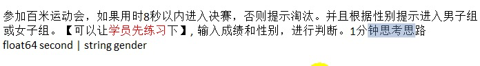

### 1.0.单分支和双分支练习题


```go
#5)

package main

import "fmt"

func main() {
	var x, y int32
	fmt.Println("plz input the first number:")
	fmt.Scanln(&x)
	fmt.Println("plz input the second number:")
	fmt.Scanln(&y)

	if x+y >= 50 {
		fmt.Println("hello world")
	}

}

```


```go
#6)

package main

import "fmt"

func main() {
	var f1, f2 float64
	fmt.Println("plz input the first float number:")
	fmt.Scanln(&f1)

	fmt.Println("plz input the second float number:")
	fmt.Scanln(&f2)

	if f1 > 10.0 && f2 < 20.0 {
		fmt.Println(f1 + f2)
	}

}

```


```go
#7)

package main

import "fmt"

func main() {
	var x, y int32
	fmt.Println("plz input the first int32 number:")
	fmt.Scanln(&x)

	fmt.Println("plz input the second int32 number:")
	fmt.Scanln(&y)

	if (x+y)%3 == 0 && (x+y)%5 == 0 {
		fmt.Printf("x+y = %v, and the sum can be 3 and 5 div...\n", x+y)
	}
}

```


```go
#8)

package main

import "fmt"

func main() {
	var year int
	fmt.Println("plz input a year number:")
	fmt.Scanln(&year)

	if (year%4 == 0 && year%100 != 0) || year%400 == 0 {
		fmt.Printf("the year is %v, and is runNian\v", year)
	} else {
		fmt.Printf("the year is %v, and is not  runNian\v", year)
	}

}

```


### 1.1.多分支流程


```go
package main

import "fmt"

func main() {
	var grade uint8
	fmt.Println("plz input grade:")
	fmt.Scanln(&grade)
	if grade == 100 {
		fmt.Println("BMW")
	} else if 80 < grade && grade <= 99 {
		fmt.Println("iPhone7Plus")
	} else if 60 <= grade && grade <= 80 {
		fmt.Println("iPad")
	} else {
		fmt.Println("nothing!")
	}
}
```

```go
package main

import "fmt"

func main() {
	var succ int
	fmt.Println("plz input a number:")
	fmt.Scanln(&succ)

	switch true {
	case succ == 100:
		fmt.Println("ok, give U BMW")
	case 80 < succ && succ <= 99:
		fmt.Println("ok, give U iphone7")
	case 60 <= succ && succ <= 80:
		fmt.Println("ok, give U iPad")
	default:
		fmt.Println("not ok, give U nothing")
	}
}

```


```go
package main

import (
	"fmt"
	"math"
)

func main() {

	//a*x^2+b*x+c=0
	var a, b, c float64
	fmt.Println("plz input 3 numbers:")
	fmt.Scanln(&a, &b, &c)
	num := b*b - 4*a*c
	fmt.Println(num)
	if num > 0 {
		x1 := (-b + math.Sqrt(num)) / (2 * a)
		x2 := (-b - math.Sqrt(num)) / (2 * a)
		fmt.Printf("第一个解为: %f\n第二个解为: %f\n", x1, x2)
	} else if num == 0 {
		x1 := -b / (2 * a)
		fmt.Printf("只有一个解: %f\n", x1)
	} else {
		fmt.Println("此题无解")
	}
}
```


```go
package main

import (
	"fmt"
)

func main() {
	var hight, money float32
	//var hs string
	var hs bool
	fmt.Println("plz input 3things:")
	fmt.Scanln(&hight, &money, &hs)

	if hight > 180 && money > 1000 && hs {
		fmt.Println("I'll marry him!")
	} else if hight > 180 || money > 1000 || hs {
		fmt.Println("比上不足，比下有余")
	} else {
		fmt.Println("no way")
	}
}
```

### 1.2.嵌套分支流程



```go
package main

import "fmt"

func main() {
	var second float64
	var gender string

	fmt.Println("plz input time and sexy:")
	fmt.Scanln(&second, &gender)

	if second <= 8.0 {
		if gender == "男" {
			fmt.Println("恭喜你进入男子决赛组")
		} else if gender == "女" {
			fmt.Println("恭喜你进入女子决赛组")
		}
	} else {
		fmt.Println("很遗憾，你无缘决赛")
	}

}
```


```go
package main

import "fmt"

func main() {
	var month uint8
	var ticket float32 = 60.0
	var age int16

	fmt.Println("plz input month and age:")
	fmt.Scanln(&month, &age)
	if month >= 4 && month <= 10 {
		if age < 18 {
			fmt.Println(ticket / 2)
		} else if age > 60 {
			fmt.Println(ticket / 3)
		} else {
			fmt.Println(ticket)
		}
	} else {
		if age >= 18 && age <= 60 {
			fmt.Println("淡季成人票价40")
		} else {
			fmt.Println("淡季儿童和老人票价20")
		}
	}
}
```

### 1.3.switch语句


```go
package main

import "fmt"

func main() {
	var key byte
	fmt.Println("plz input a char: a,b,c,d,e,f,g")
	fmt.Scanf("%c", &key)

	switch key {
	case 'a':
		fmt.Println("星期一")
	case 'b':
		fmt.Println("星期二")
	case 'c':
		fmt.Println("星期三")
	case 'd':
		fmt.Println("星期四")
	case 'e':
		fmt.Println("星期五")
	case 'f':
		fmt.Println("星期六")
	case 'g':
		fmt.Println("星期天")
	default:
		fmt.Println("输入有误,请重新输入")
	}
}
```


#code1:
```go
package main

import (
	"fmt"
)

func main() {
	var c1 byte
	fmt.Println("plz input a char:")
	fmt.Scanf("%c", &c1)
	// fmt.Println(c1)

	switch c1 {
	case 'a':
		fmt.Printf("%c\n", c1-32)
		fmt.Println("A")
	case 'b':
		fmt.Printf("%c\n", c1-32)
	case 'c':
		fmt.Printf("%c\n", c1-32)
	case 'd':
		fmt.Printf("%c\n", c1-32)
	case 'e':
		fmt.Printf("%c\n", c1-32)
	default:
		fmt.Println("other")
	}

}
```
#code2
```go
package main

import "fmt"

func main() {
	var score float64
	fmt.Println("plz input a float64")
	fmt.Scanf("%g", &score)

	switch {
	case score >= 60 && score <= 100:
		fmt.Println("合格")
	case score < 60:
		fmt.Println("不合格")
	default:
		fmt.Println("不能大于100")
	}
	//100-120错误
	// switch int(score / 60) {
	// case 1:
	// 	fmt.Println("及格")
	// case 0:
	// 	fmt.Println("不及格")
	// default:
	// 	fmt.Println("输入成绩有误")
	// }
}
```

#code3
```go
package main

import "fmt"

func main() {
	var month byte
	fmt.Println("plz input a month:")
	fmt.Scanln(&month)

	switch month {
	case 3, 4, 5:
		fmt.Println("spring!")
	case 6, 7, 8:
		fmt.Println("summer!")
	case 9, 10, 11:
		fmt.Println("autumn!")
	case 12, 1, 2:
		fmt.Println("Winter!")
	default:
		fmt.Println("输入的不是月份!")
	}
}
```

#code4:
```go
package main

import "fmt"

func main() {
	var date string
	fmt.Println("plz input a weekday")
	fmt.Scanf("%s", &date)
	// fmt.Scanf("%q", &date)

	switch date {
	case "星期一":
		fmt.Println("干煸豆角")
	case "星期二":
		fmt.Println("醋溜土豆")
	case "星期三":
		fmt.Println("红烧狮子头")
	case "星期四":
		fmt.Println("油炸花生米")
	case "星期五":
		fmt.Println("蒜蓉扇贝")
	case "星期六":
		fmt.Println("东北乱炖")
	case "星期日":
		fmt.Println("大盘鸡")
	default:
		fmt.Println("超出星期的范围")
	}
}
```
### 1.4.for循环


```go
package main

import "fmt"

func main() {
	var sum, count int
	var max int = 100

	for i := 1; i <= max; i++ {
		if i%9 == 0 {
			sum += i
			count++
		}
	}
	fmt.Printf("共有%d个被9整除的数,总和为%d\n", count, sum) //count = 11, sum = 594

	var num int
	fmt.Println("plz input a number:")
	fmt.Scanln(&num)

	for i := 0; i <= num; i++ {
		fmt.Printf("%d + %d = %d\n", i, num-i, num)
	}
}
```
### 1.5.嵌套for循环


#code1
```go
package main

import "fmt"

func main() {
	//统计3个班的学生成绩，每个班有5名学生，求出各个班的平均分和所有班级的平均分(学生成绩由键盘输入)
	//编程思想：先易后难----先死后活
	//先易后难，先统计一个班的平均成绩
	//先死后活，写死人数为5人
	// var sum, avg float64
	// for i := 1; i <= 5; i++ {
	// 	var score float64
	// 	fmt.Printf("plz input %d student's score:\n", i)
	// 	fmt.Scanln(&score)
	// 	sum += score
	// }
	// avg = sum / 5
	// fmt.Println("该班的平均分为:", avg)

	//再求出三个班的平均成绩

	// var avg, totalSum float64
	// for j := 1; j <= 3; j++ {
	// 	sum := 0.0
	// 	for i := 1; i <= 5; i++ {
	// 		var score float64
	// 		fmt.Printf("plz input %d 班的第 %d student's score:\n", j, i)
	// 		fmt.Scanln(&score)
	// 		sum += score
	// 	}
	// 	avg = sum / 5
	// 	fmt.Printf("第%d班的平均分为: %v\n", j, avg)
	// 	totalSum += sum
	// }
	// avg = totalSum / 3 / 5
	// fmt.Printf("全部班级的平均分为: %v\n", avg)

	//先死后活，把写死的值改成变量
	//注意数值型变量的强制转换
	var classNum, stuNum int = 3, 5
	var avg, totalSum float64
	for j := 1; j <= classNum; j++ {
		sum := 0.0
		for i := 1; i <= stuNum; i++ {
			var score float64
			fmt.Printf("plz input %d 班的第 %d student's score:\n", j, i)
			fmt.Scanln(&score)
			sum += score
		}
		avg = sum / float64(stuNum)
		fmt.Printf("第%d班的平均分为: %v\n", j, avg)
		totalSum += sum
	}
	avg = totalSum / float64(classNum*stuNum)
	fmt.Printf("全部班级的平均分为: %v\n", avg)
}
```
#code2
```go
package main

import "fmt"

func main() {
	//统计3个班的学生成绩，每个班有5名学生，求出各个班的平均分和所有班级的平均分(学生成绩由键盘输入)
	//编程思想：先易后难----先死后活
	//先易后难，先统计一个班的平均成绩
	// var sum, avg float64
	// for i := 1; i <= 5; i++ {
	// 	var score float64
	// 	fmt.Printf("plz input %d student's score:\n", i)
	// 	fmt.Scanln(&score)
	// 	sum += score
	// }
	// avg = sum / 5
	// fmt.Println("该班的平均分为:", avg)

	//再求出三个班的平均成绩

	// var avg, totalSum float64
	// for j := 1; j <= 3; j++ {
	// 	sum := 0.0
	// 	for i := 1; i <= 5; i++ {
	// 		var score float64
	// 		fmt.Printf("plz input %d 班的第 %d student's score:\n", j, i)
	// 		fmt.Scanln(&score)
	// 		sum += score
	// 	}
	// 	avg = sum / 5
	// 	fmt.Printf("第%d班的平均分为: %v\n", j, avg)
	// 	totalSum += sum
	// }
	// avg = totalSum / 3 / 5
	// fmt.Printf("全部班级的平均分为: %v\n", avg)

	//先死后活，把写死的值改成变量
	//注意数值型变量的强制转换
	var classNum, stuNum, totalpassNum int = 3, 5, 0
	var avg, totalSum float64
	for j := 1; j <= classNum; j++ {
		sum := 0.0
		passNum := 0
		for i := 1; i <= stuNum; i++ {
			var score float64
			fmt.Printf("plz input %d 班的第 %d student's score:\n", j, i)
			fmt.Scanln(&score)
			sum += score
			if score/60.0 >= 1 {
				passNum++
			}
		}
		avg = sum / float64(stuNum)
		fmt.Printf("第%d班的平均分为: %v\n", j, avg)
		fmt.Printf("第%d班的及格人数为: %d\n", j, passNum)
		totalSum += sum
		totalpassNum += passNum
	}
	avg = totalSum / float64(classNum*stuNum)
	fmt.Printf("全部班级的平均分为: %v\n", avg)
	fmt.Printf("全部班级的及格人数为: %d\n", totalpassNum)

}
```
#### 1.5.1.金字塔

#code3

```go
package main

import "fmt"

func main() {
	//打印空心金字塔
	/*
	      *
	     * *
	    *   *
	   *******
	*/

	//先易后难，先死后活
	//首先打印实心的金字塔
	/*
	      *
	     ***
	    *****
	   *******
	*/

	//先易后难1，观察每行*的个数是2n-1个，首先打印出来
	//先死后活1，首先按照4行去打印
	//i为行数，最大为4行，j为每层打印的*个数
	for i := 1; i <= 4; i++ {
		for j := 1; j <= 2*i-1; j++ {
			fmt.Print("*")
		}
		fmt.Println()
	}
	//上面代码效果
	/*
	 *
	 ***
	 *****
	 *******
	 */

	//先易后难2，观察实心金字塔与上面效果的区别，上面代码为每行的*前都缺少了空格，个数为：总行数-所在行数
	//所以修改上面代码，每次先打印空格，再打印*
	for i := 1; i <= 4; i++ {
		for k := 1; k <= 4-i; k++ {
			fmt.Print(" ")
		}
		for j := 1; j <= 2*i-1; j++ {
			fmt.Print("*")
		}
		fmt.Println()
	}
	//上面代码效果为：
	/*
	      *
	     ***
	    *****
	   *******
	*/

	//先易后难3，继续观察实心金字塔和空心金字塔的区别，发现中间部分为首、尾打印*，中间打印空格
	//即j的最小值、最大值打印*，其余值打印空格
	//总行数为4不变，每行都要打印不变，即i不变；每行*前的空格不变，即k不变；所以只需修改j的循环体
	for i := 1; i <= 4; i++ {
		for k := 1; k <= 4-i; k++ {
			fmt.Print(" ")
		}
		for j := 1; j <= 2*i-1; j++ {
			if j == 1 || j == 2*i-1 {
				fmt.Print("*")
			} else {
				fmt.Print(" ")
			}
		}
		fmt.Println()
	}
	//上述代码效果如下：
	/*
	      *
	     * *
	    *   *
	   *     *
	*/

	//上图发现最后一行应该是全部打印*，中间不需要填充空格
	//先易后难4，最后一样全部打印*
	for i := 1; i <= 4; i++ {
		for k := 1; k <= 4-i; k++ {
			fmt.Print(" ")
		}
		for j := 1; j <= 2*i-1; j++ {
			if j == 1 || j == 2*i-1 || i == 4 {
				fmt.Print("*")
			} else {
				fmt.Print(" ")
			}
		}
		fmt.Println()
	}
	//上述代码效果如下：
	/*
	      *
	     * *
	    *   *
	   *******
	*/

	//发现满足空心金字塔的打印要求
	//先死后活2，用变量代替上述代码中写死的行数4
	var totalLevel int
	fmt.Println("plz input a int number:")
	fmt.Scanln(&totalLevel)
	for i := 1; i <= totalLevel; i++ {
		for k := 1; k <= totalLevel-i; k++ {
			fmt.Print(" ")
		}
		for j := 1; j <= 2*i-1; j++ {
			if j == 1 || j == 2*i-1 || i == totalLevel {
				fmt.Print("*")
			} else {
				fmt.Print(" ")
			}
		}
		fmt.Println()
	}
	//上述代码效果如下，满足题目要求
	/*
	   plz input a int number:
	   7
	         *
	        * *
	       *   *
	      *     *
	     *       *
	    *         *
	   *************
	*/
}
```
#code4
```go
package main

import "fmt"

func main() {
	//打印金字塔，如下
	/*
	   *
	  * *
	 * * *
	*/
	//先易后难1---每行的*个数跟所在行数一致，并且后面带空格
	//先死后活1---先打印3行
	for i := 1; i <= 3; i++ {
		for j := 1; j <= i; j++ {
			fmt.Print("* ")
		}
		fmt.Println()
	}
	//上面代码效果如下：
	/*
	 *
	 * *
	 * * *
	 */

	//先易后难2---每行*前面的空格数=总行数-所在的行数，先打印空格，再打印*
	//先死后活1---先打印3行
	for i := 1; i <= 3; i++ {
		for k := 1; k <= 3-i; k++ {
			fmt.Print(" ")
		}

		for j := 1; j <= i; j++ {
			fmt.Print("* ")
		}
		fmt.Println()
	}
	//上面代码的效果如下：
	/*
	     *
	    * *
	   * * *
	*/

	//先易后难2---已经达到效果
	//先死后活2---用一个变量替换掉3
	var lineNum int
	fmt.Println("plz input a line number:")
	fmt.Scanln(&lineNum)

	for i := 1; i <= lineNum; i++ {
		for k := 1; k <= lineNum-i; k++ {
			fmt.Print(" ")
		}
		for j := 1; j <= i; j++ {
			fmt.Print("* ")
		}
		fmt.Println()
	}
	//上面代码的实现效果：
	/*
	   plz input a line number:
	   5
	       *
	      * *
	     * * *
	    * * * *
	   * * * * *
	*/

}
```

#code5-空心金字塔-整立/倒立
```go
package main

import "fmt"

func main() {
	//打印空心三字塔--正立/倒立两种
	/*
	      *
	     * *
	    *   *
	   *******

	   *******
	    *   *
	     * *
	      *
	*/

	//首先考虑正立的实现i++，再实现倒立的实现i--
	//先易后难1，正立实心金字塔打印，每行*之前先打印空格，空格数=总行数-所在行数，*个数=2*所在行数-1
	//先死后活1，暂时用4行实现
	//i表示所在行数；k表示空格数；j表示*个数
	for i := 1; i <= 4; i++ {
		for j := 1; j <= 4-i; j++ {
			fmt.Print(" ")
		}
		for k := 1; k <= 2*i-1; k++ {
			fmt.Print("*")
		}
		fmt.Println()
	}
	//效果如下：
	/*
	     *
	    ***
	   *****
	*/

	//先易后难2，此时打印正立空心金字塔：除最行一行外，每行的*之间为空格
	//每行都要打印，所以i循环不变；每行*之前的空格都要打印，所以j循环不变；修改k的循环体来打印空心
	for i := 1; i <= 4; i++ {
		for j := 1; j <= 4-i; j++ {
			fmt.Print(" ")
		}
		for k := 1; k <= 2*i-1; k++ {
			if k == 1 || k == 2*i-1 || i == 4 {
				fmt.Print("*")
			} else {
				fmt.Print(" ")
			}
		}
		fmt.Println()
	}
	//效果如下：
	/*
	      *
	     * *
	    *   *
	   *******
	*/

	//先易后难满足了正立空心金字塔的打印
	//先易后难3，此时考虑倒立金字塔，相当于先打印正立金字塔的最后一行，然后倒立逐行打印
	//即i = 4开始，然后i--
	for i := 4; i >= 1; i-- {
		for j := 1; j <= 4-i; j++ {
			fmt.Print(" ")
		}
		for k := 1; k <= 2*i-1; k++ {
			if i == 4 || k == 1 || k == 2*i-1 {
				fmt.Print("*")
			} else {
				fmt.Print(" ")
			}
		}
		fmt.Println()
	}
	//效果如下：
	/*
	   *******
	    *   *
	     * *
	      *
	*/

	//先易后难已完成正立、倒立空心金字塔的打印
	//先死后活2，通过变量替换掉原来写死的4行
	var lineLevel int
	fmt.Println("plz input a int number:")
	fmt.Scanln(&lineLevel)

	//首先打印正立空心金字塔
	//lineLevel为总行数，i为当前行数，j为空格数，k为*个数
	for i := 1; i <= lineLevel; i++ {
		for j := 1; j <= lineLevel-i; j++ {
			fmt.Print(" ")
		}
		for k := 1; k <= 2*i-1; k++ {
			if k == 1 || k == 2*i-1 || i == lineLevel {
				fmt.Print("*")
			} else {
				fmt.Print(" ")
			}
		}
		fmt.Println()
	}
	//此处分割两种类型的空心金字塔
	fmt.Println("--------------")

	//打印倒立空心金字塔
	//lineLevel为总行数，i为当前行数，j为空格数，k为*个数
	//相当于首先打印正立空心金字塔的最后一行
	for i := lineLevel; i >= 1; i-- {
		for j := 1; j <= lineLevel-i; j++ {
			fmt.Print(" ")
		}
		for k := 1; k <= 2*i-1; k++ {
			if k == 1 || k == 2*i-1 || i == lineLevel {
				fmt.Print("*")
			} else {
				fmt.Print(" ")
			}
		}
		fmt.Println()
	}
	//最终效果如下：
	/*
	   plz input a int number:
	   5
	       *
	      * *
	     *   *
	    *     *
	   *********
	   --------------
	   *********
	    *     *
	     *   *
	      * *
	       *
	*/
}
```
#code6-空心菱形
```go
package main

import "fmt"

func main() {
	//打印空心菱形
	/*
	     *
	    * *
	   *   *
	    * *
	     *
	*/

	//先易后难1，首先打印实心菱形，可以分为上面是上面+下面的两个三角形组成
	//先死后活1，首先打印边长为3的菱形

	//首先打印上面的三角形
	for i := 1; i <= 3; i++ {
		for j := 1; j <= 3-i; j++ {
			fmt.Print(" ")
		}
		for k := 1; k <= 2*i-1; k++ {
			fmt.Print("*")
		}
		fmt.Println()
	}
	//再打印下面的三角形
	//由于中间一行归属于上面的三角形，所以最中间一行的下面一行开始打印
	for i := 3 - 1; i >= 1; i-- {
		for j := 1; j <= 3-i; j++ {
			fmt.Print(" ")
		}
		for k := 1; k <= 2*i-1; k++ {
			fmt.Print("*")
		}
		fmt.Println()
	}
	//效果如下：
	/*
	     *
	    ***
	   *****
	    ***
	     *
	*/

	//先易后难2，打印空心菱形，用空格代替每行首位*之间的部分

	//正立部分
	//与空心金字塔的区别是：最长边也是空心打印
	for i := 1; i <= 3; i++ {
		for j := 1; j <= 3-i; j++ {
			fmt.Print(" ")
		}
		for k := 1; k <= 2*i-1; k++ {
			if k == 1 || k == 2*i-1 {
				fmt.Print("*")
			} else {
				fmt.Print(" ")
			}
		}
		fmt.Println()
	}
	//倒立部分
	//与空心金字塔的区别是：最长边也是空心打印
	for i := 3 - 1; i >= 1; i-- {
		for j := 1; j <= 3-i; j++ {
			fmt.Print(" ")
		}
		for k := 1; k <= 2*i-1; k++ {
			if k == 1 || k == 2*i-1 {
				fmt.Print("*")
			} else {
				fmt.Print(" ")
			}
		}
		fmt.Println()
	}
	//效果如下：
	/*
	     *
	    * *
	   *   *
	    * *
	     *
	*/

	//先死后活2，用变量替换掉上面写死的边长3
	var lineLen int
	fmt.Println("plz input a int number:")
	fmt.Scanln(&lineLen)

	//正立部分
	for i := 1; i <= lineLen; i++ {
		for j := 1; j <= lineLen-i; j++ {
			fmt.Print(" ")
		}
		for k := 1; k <= 2*i-1; k++ {
			if k == 1 || k == 2*i-1 {
				fmt.Print("*")
			} else {
				fmt.Print(" ")
			}
		}
		fmt.Println()
	}

	//倒立部分
	for i := lineLen - 1; i >= 1; i-- {
		for j := 1; j <= lineLen-i; j++ {
			fmt.Print(" ")
		}
		for k := 1; k <= 2*i-1; k++ {
			if k == 1 || k == 2*i-1 {
				fmt.Print("*")
			} else {
				fmt.Print(" ")
			}
		}
		fmt.Println()
	}

	//效果如下：
	/*
	   plz input a int number:
	   5
	       *
	      * *
	     *   *
	    *     *
	   *       *
	    *     *
	     *   *
	      * *
	       *
	*/
}
```
#code7-九九乘法口诀
```go
package main

import "fmt"

func main() {
	//打印九九乘法口诀
	/*
	   1 * 1 = 1
	   1 * 2 = 2   2 * 2 = 4
	   1 * 3 = 3   2 * 3 = 6   3 * 3 = 9
	*/

	//先易后难1，先打印三行
	//先死后活1，先定在3以内
	// for i := 1; i <= 3; i++ {
	// 	for j := 1; j <= i; j++ {
	// 		fmt.Printf("%d * %d = %d\t", j, i, i*j)
	// 	}
	// 	fmt.Println()
	// }

	//先易后难2，全部打印
	//先死后活2，变量代替3，最高9
	var num int = 9
	for i := 1; i <= num; i++ {
		for j := 1; j <= i; j++ {
			fmt.Printf("%d * %d = %d\t", j, i, j*i)
		}
		fmt.Println()
	}
}
```

### 2.1.函数01


```go
package main

import (
	"fmt"
	"math"
)

func main() {
	//>0/<0/=0
	var num int
	fmt.Println("plz input a int number:")
	fmt.Scanln(&num)

	if num > 0 {
		fmt.Println("this number bigger than 0!")
	} else if num < 0 {
		fmt.Println("this number is litter than 0!")
	} else {
		fmt.Println("this number is 0!")
	}

	//判断年份是否为闰年
	//闰年的概念：四年一闰，百年不闰，400年再闰
	var year1 int
	fmt.Println("plz input a year number:")
	fmt.Scanln(&year1)

	if (year1%4 == 0 && year1%100 != 0) || year1%400 == 0 {
		fmt.Printf("this year: %d is 闰年!\n", year1)
	} else {
		fmt.Printf("this year: %d is not 闰年～\n", year1)
	}

	//判断一个整数是否水仙花数。
	//水仙花数是一个三位数，各位上数字的立方和等于其本身，比如：153=1*1*1+5*5*5+3*3*3
	var flower, i, j, k int
	fmt.Println("plz input 3bit  int number:")
	fmt.Scanln(&flower)

	//通过整数除法运算分别求出百位、十位、个位上的值，然后再做判断
	i = flower / 100
  j = (flower / 10) % 10
	k = flower % 10
	
	fmt.Printf("%d,%d,%d\n", i, j, k)

	if i*i*i+j*j*j+k*k*k == flower {
		fmt.Printf("%d is a flower-number!\n", flower)
	} else {
		fmt.Printf("%d is not a flower-number~\n", flower)
	}

	//求出所有的水仙花数
	for flowerNum := 100; flowerNum <= 999; flowerNum++ {
		l := flowerNum / 100
		m := (flower / 10) % 10
		n := flowerNum % 10

		if l*l*l+m*m*m+n*n*n == flowerNum {
			fmt.Println(flowerNum)
		}
	}

	m, n := 0, 3
	if m > 0 {
		if n > 2 {
			fmt.Println("A")
		} else {
			fmt.Println("B")
		}
	}
	fmt.Println("C")

	var user, passwd string
	fmt.Println("plz input username,password:")
	fmt.Scanf("1:%s 2:%s", &user, &passwd)

	if user == "张三" && passwd == "4321" {
		fmt.Println("登陆成功!")
	} else {
		fmt.Println("登陆失败!")
	}

	var (
		name    string
		age     int
		married bool
	)
	fmt.Scanf("1:%s 2:%d 3:%t", &name, &age, &married)
	fmt.Printf("扫描结果 name:%s age:%d married:%t \n", name, age, married)

	//闰年2月份是29日，平年28天
	var year, month int
	fmt.Println("plz input year: month:")
	fmt.Scanf("%d %d", &year, &month)

	switch month {
	case 1, 3, 5, 7, 8, 10, 12:
		fmt.Printf("this month %d has 31 days!\n", month)
	case 2:
		if (year%4 == 0 && year%100 != 0) || year%400 == 0 {
			fmt.Printf("this month %d has 29 days!\n", month)
		} else {
			fmt.Printf("this month %d has 28 days!\n", month)
		}
	case 4, 6, 9, 11:
		fmt.Printf("this month %d has 30 days!\n", month)
	default:
		fmt.Printf("U have input a wrong month number: %d\n", month)
	}

	//(身高-108)*2=体重，可以有10斤的浮动，观察体重是否合适
	var heigh, weight float64
	fmt.Println("plz input heigh & weight:")
	fmt.Scanf("%v %v", &heigh, &weight)
	wtemp := (heigh - 108) * 2
	if math.Abs(wtemp-weight) <= 10 {
		fmt.Println("U have a good body!")
	} else {
		fmt.Println("u should take off yourself!")
	}

	//判断成绩的等级
	var score float64

	fmt.Println("plz input a score:")
	fmt.Scanln(&score)

	switch true {
	case score >= 90 && score <= 100:
		fmt.Println("U're the best one!")
	case score >= 80 && score <= 89:
		fmt.Println("U're are better!")
	case score >= 70 && score <= 79:
		fmt.Println("U are good!")
	case score >= 60 && score <= 69:
		fmt.Println("U are pass!")
	default:
		fmt.Println("U can't pass~")
	}
}
```


### 2.2.break


#code1
```go
package main

import "fmt"

func main() {
	var sum int
	for i := 1; i <= 100; i++ {
		sum += i
		if sum > 20 {
			fmt.Println(i, sum)
			break
		}
	}
}

```
#code2
```go
package main

import "fmt"

func main() {
	var name, passwd string
	var max, loginChance int = 3, 3
	for i := 1; i <= max; i++ {
		fmt.Println("plz input a name and passwd")
		fmt.Scanf("%s %s", &name, &passwd)
		if name == "张无忌" && passwd == "888" {
			fmt.Println("登陆成功")
			break
		} else {
			loginChance--
			if loginChance == 0 {
				fmt.Println("U dont have chance to login~")
			} else {
				fmt.Printf("only %d changce for U\n", loginChance)
			}
		}
	}
}
```

### 2.3.continu


#code01
```go
package main

import "fmt"

func main() {
	for i := 0; i < 13; i++ {
		if i == 10 {
			continue
		}
		fmt.Println("i=", i)
	}
	/*
	   i= 0
	   i= 1
	   i= 2
	   i= 3
	   i= 4
	   i= 5
	   i= 6
	   i= 7
	   i= 8
	   i= 9
	   i= 11
	   i= 12
	*/

	for i := 0; i < 2; i++ {
		for j := 1; j < 4; j++ {
			if j == 2 {
				continue
			}
			fmt.Println("i=", i, "j=", j)
		}
	}
	/*
	   i= 0 j= 1
	   i= 0 j= 3
	   i= 1 j= 1
	   i= 1 j= 3
	*/

here:
	for i := 0; i < 2; i++ {
		for j := 1; j < 4; j++ {
			if j == 2 {
				continue here
			}
			fmt.Println("i=", i, "j=", j)
		}
	}
	/*
	   i= 0 j= 1
	   i= 1 j= 1
	*/
}
```
#code02
```go
package main

import "fmt"

func main() {
	var sum int
	for i := 1; i <= 100; i++ {
		if i%2 == 0 {
			continue
		}
		sum += i
	}
	fmt.Println(sum)
}
```
#code03
```go
package main

import "fmt"

func main() {
	var num, positiveCount, negativeCount int
	for {
		fmt.Println("plz input a int number:")
		fmt.Scanln(&num)

		if num == 0 {
			break
		}

		if num > 0 {
			positiveCount++
			continue
		}
		negativeCount++
	}
	fmt.Println("positiveCount=", positiveCount, "negativeCount=", negativeCount)
}
```


#code01---break
```go
package main

import "fmt"

func main() {
	var all float32 = 100000
	var sum int
	for {

		if all < 1000 {
			break
		} else if all <= 50000 {
			all -= 1000
		} else {
			all -= all * 0.05
		}
		sum++
		fmt.Println(all, sum)
	}
	fmt.Println("sum", sum)
}
```
#code02---break/continue
```go
package main

import "fmt"

func main() {
	var all float32 = 100000
	var sum, bigSum, littleSum int
	for {

		if all < 1000 {
			break
		}
		if all <= 50000 {
			all -= 1000
			littleSum++
			fmt.Println(all, "littleSum", littleSum)
			continue
		}
		all -= all * 0.05
		bigSum++
		fmt.Println(all, "bigSum=", bigSum)
	}
	sum = bigSum + littleSum
	fmt.Printf("sum= %d, bigSum= %d, littleSum=%d\n", sum, bigSum, littleSum)
}
```

### 2.4.递归函数


#code01-斐波那契数

```go
package main

import "fmt"

//斐波那契数1,1,2,3,5,8,13...

func fbn(n int) int {
	if n == 1 || n == 2 {
		return 1
	} else {
		return fbn(n-1) + fbn(n-2)
	}
	// switch n {
	// case 1, 2:
	// 	return 1
	// default:
	// 	return fbn(n-1) + fbn(n-2)
	// }

}

func main() {
	var num int
	fmt.Println("plz input a int number:")
	fmt.Scanln(&num)
	fmt.Println(fbn(num))
}
```
#code02

```go
package main

import "fmt"

func cal(n int) int {
	if n == 1 {
		return 3
	} else {
		return 2*cal(n-1) + 1
	}
}

func main() {
	var num int
	fmt.Println("plz input n:")
	fmt.Scanln(&num)

	fmt.Println(cal(num))
}
```

### 2.4.1.递归02

#### 2.4.1.1.猴子吃桃


#code-猴子吃桃：每天吃其中的一半和多吃一个，第十天还没吃时只剩下一个，问最初一共多少个？

```go
package main

import (
	"fmt"
)

/*
思路分析：
1.第十天：1个
2.第九天：m-m/2-1=第十天  ====>   2*(第十天+1)
3.第八天：2*(第九天+1)
...
peach(n)=2*(peach(n+1)+1)
*/

func peach(n int) int {
	if n > 10 || n < 1 {
		fmt.Println("输入天数有误...")
		return 0
	}
	if n == 10 {
		return 1
	} else {
		return 2 * (peach(n+1) + 1)
	}
}

func main() {
	for i := 1; i <= 10; i++ {
		fmt.Println(peach(i))
	}

	fmt.Println(peach(1))
	fmt.Println(peach(11))
	fmt.Println(peach(0))
}

//效果如下：
/*
1534
766
382
190
94
46
22
10
4
1
1534
输入天数有误...
0
输入天数有误...
0
*/
```

#阶乘
```go
package main

import "fmt"

func jiecheng(n int) int {
	if n == 1 {
		return 1
	} else {
		return n * jiecheng(n-1)
	}
}

func main() {
	var num int
	fmt.Println("plz input a int number:")
	fmt.Scanln(&num)
	fmt.Printf("%v的阶乘是:%v\n", num, jiecheng(num))
}
```
#### 2.4.1.2.汉诺塔

#汉诺塔

```go
package main

import "fmt"

/*
汉诺塔问题，将上面的n-1个作为一个整体，先挪至中间的塔，
然后将最后一个挪至最后一个塔，再将中间的n-1个挪至最后一个塔

汉诺塔一般步骤：

将 n-1 个圆盘移动到b柱
第 n 个圆盘移动到c柱
前 n-1 个圆盘再移动到c柱
由步骤可得递推式：step(n)=step(n-1)+1+step(n-1)=2*step(n-1)+1 （step[1]=0）
即：step(n) = 2^n - 1。
*/

func sum(n int) int {
	if n == 1 {
		return 1
	} else {
		return 2*sum(n-1) + 1
	}
}

func hnt(n int, from, help, to string) {
	if n == 1 {
		fmt.Printf("%s--->%s\n", from, to)
	} else {
		hnt(n-1, from, to, help)
		fmt.Printf("%s--->%s\n", from, to)
		hnt(n-1, help, from, to)
	}
}

func main() {
	var num int
	var a, b, c string = "A", "B", "C"
	fmt.Println("plz input the number of Hannuota:")
	fmt.Scanln(&num)

	hnt(num, a, b, c)
	fmt.Println("移动次数:", sum(num))
	// hnt(10, "A", "B", "C")
}
/*
tests-mbp:funcdemo10 user$ go run main.go 
plz input the number of Hannuota:
1
A--->C
移动次数: 1
tests-mbp:funcdemo10 user$ go run main.go 
plz input the number of Hannuota:
2
A--->B
A--->C
B--->C
移动次数: 3
tests-mbp:funcdemo10 user$ go run main.go 
plz input the number of Hannuota:


3
A--->C
A--->B
C--->B
A--->C
B--->A
B--->C
A--->C
移动次数: 7
*/
```


```
1)代码01无问题，输出为：
n1 Type = float32
sum = 3
2)代码02有错：fmt.Println(myFunc(b, 1, 2)会报错
  mySum有2个形参，但是sum2有3个形参，不匹配
	cannot use b (variable of type func(n1 int, n2 int, n3 int) int) as mySum value in argument to myFunc
```


```go
package main

import "fmt"

func swap(n1, n2 *int) {
	*n1 += *n2
	*n2 = *n1 - *n2
	*n1 -= *n2
}

func main() {
	var a, b int = 3, 5
	swap(&a, &b)
	fmt.Printf("a=%v,b=%v\n", a, b)

}
```

#对比上面，值传递只改变函数内部，不影响外部的变量
```go
package main

import "fmt"

func swap(n1, n2 *int) {
	*n1 += *n2
	*n2 = *n1 - *n2
	*n1 -= *n2
}

func swap01(n1, n2 *int) {
	t := n1
	n1 = n2
	n2 = t
	fmt.Println("swap02", n1, n2)
}

func main() {
	var a, b int = 3, 5
	swap(&a, &b)
	fmt.Printf("a=%v,b=%v\n", a, b)

	fmt.Println(&a, &b)
	swap01(&a, &b)
	fmt.Printf("a=%v,b=%v\n", a, b)
	fmt.Println(&a, &b)

}
```

### 2.5.闭包


#代码---闭包实现一次传入后缀".jpg"，后面多次复用
```go
package main

import (
	"fmt"
	"strings"
)

func makeSuffix(suffix string) func(string) string {
	return func(str string) string {
		if !strings.HasSuffix(str, suffix) {
			return str + suffix
		} else {
			return str
		}
	}
}

func main() {
	f := makeSuffix(".jpg")
	fmt.Println(f("cat.jpg"))
	fmt.Println(f("dog"))
	fmt.Println(f("fox"))
}

//输出结果如下：
/*
cat.jpg
dog.jpg
fox.jpg
*/
```


### 2.6.函数综合练习题01


#code01-金字塔

```go
package main

import "fmt"

func jzt(n int) {
	for i := 1; i <= n; i++ {
		for j := 0; j <= n-i; j++ {
			fmt.Print(" ")
		}

		for k := 1; k <= 2*i-1; k++ {
			fmt.Print("*")
		}
		fmt.Println()
	}
}

func main() {
	var num int
	fmt.Println("plz input a int number:")
	fmt.Scanln(&num)
	jzt(num)
}

/*
plz input a int number:
5
     *
    ***
   *****
  *******
 *********
*/
```

#code02---九九乘法表
```go
package main

import "fmt"

func jj(n int) {
	if n > 9 || n < 1 {
		fmt.Println("U have input a wrong number, out of 0-9 range~")
	} else {
		for i := 1; i <= n; i++ {
			for j := 1; j <= i; j++ {
				fmt.Printf("%v * %v = %v \t", j, i, j*i)
			}
			fmt.Println()
		}
	}
}

func main() {
	var num int
	fmt.Println("plz input in int number:0--9")
	fmt.Scanln(&num)

	jj(num)
}

/*
plz input in int number:0--9
9
1 * 1 = 1
1 * 2 = 2       2 * 2 = 4
1 * 3 = 3       2 * 3 = 6       3 * 3 = 9
1 * 4 = 4       2 * 4 = 8       3 * 4 = 12      4 * 4 = 16
1 * 5 = 5       2 * 5 = 10      3 * 5 = 15      4 * 5 = 20      5 * 5 = 25
1 * 6 = 6       2 * 6 = 12      3 * 6 = 18      4 * 6 = 24      5 * 6 = 30      6 * 6 = 36
1 * 7 = 7       2 * 7 = 14      3 * 7 = 21      4 * 7 = 28      5 * 7 = 35      6 * 7 = 42      7 * 7 = 49
1 * 8 = 8       2 * 8 = 16      3 * 8 = 24      4 * 8 = 32      5 * 8 = 40      6 * 8 = 48      7 * 8 = 56      8 * 8 = 64
1 * 9 = 9       2 * 9 = 18      3 * 9 = 27      4 * 9 = 36      5 * 9 = 45      6 * 9 = 54      7 * 9 = 63      8 * 9 = 72      9 * 9 = 81


plz input in int number:0--9
2
1 * 1 = 1
1 * 2 = 2       2 * 2 = 4
*/
```


### 2.7.时间和日期函数


```go
package main

import (
	"fmt"
	"strconv"
	"time"
)

func test03() {
	str := ""
	for i := 0; i <= 100000; i++ {
		str += "hello" + strconv.Itoa(i)
		// fmt.Println(str)
	}
}

func main() {
	//time.Now() 返回值类型是Time，而t01.Sub(t02)中的t01/t02必须是Time类型
	//time.Now().UnixNano() 返回值类型是int64，所以可以直接相减
	t01 := time.Now()
	a01 := time.Now().UnixNano()
	test03()
	t02 := time.Now()
	a02 := time.Now().UnixNano()

	num := t02.Sub(t01)
	fmt.Println(num)
	fmt.Println(time.Duration(a02-a01) / time.Nanosecond)
}

//5.770290473s
//5.770197s
```


### 2.8.函数综合练习题02


#code01--循环输入日期，并检查是否正确
```go
package main

import "fmt"

func checkdate() {
	for {
		var year, month, day int
		fmt.Println("请输入年:")
		fmt.Scanln(&year)
		if year <= 0 {
			fmt.Println("输入年份有误,请重新输入!")
			continue
		}

		fmt.Println("请输入月:")
		fmt.Scanln(&month)
		if month <= 0 || month > 12 {
			fmt.Println("输入月份有误,请重新输入!")
			continue
		}

		fmt.Println("请输入日:")
		fmt.Scanln(&day)
		switch month {
		case 1, 3, 5, 7, 8, 10, 12:
			if day <= 0 || day > 31 {
				fmt.Println("输入日期有误,请重新输入!")
				continue
			}
		case 4, 6, 9, 11:
			if day <= 0 || day > 30 {
				fmt.Println("输入日期有误,请重新输入!")
				continue
			}
		case 2:
			if (year%4 == 0 && year%100 != 0) || year%400 == 0 {
				if day <= 0 || day > 29 {
					fmt.Println("输入日期有误,请重新输入!")
					continue
				}
			} else {
				if day <= 0 || day > 28 {
					fmt.Println("输入日期有误,请重新输入!")
					continue
				}
			}
		}
		fmt.Printf("您输入的日期是:%d年%d月%d日\n", year, month, day)
	}
}

func main() {
	checkdate()
}


/*
输入年:
2020
请输入月:
2
请输入日:
29
您输入的日期是:2020年2月29日
请输入年:
2020
请输入月:
2
请输入日:
30
输入日期有误,请重新输入!
请输入年:
*/
```

#code02--guessNum
```go
package main

import (
	"fmt"
	"math/rand"
	"time"
)

func guessNum() {
	var num01 int

	rand.Seed(time.Now().Unix())
	for count := 1; count <= 10; count++ {
		num := rand.Intn(100) + 1
		fmt.Println("plz input a int number:")
		fmt.Scanln(&num01)
		if num != num01 {
			if count <= 9 {
				fmt.Printf("没猜对,继续第%d次\n", count+1)
				continue
			} else {
				fmt.Println("说你点好呢~")
			}

		} else {
			if count == 1 {
				fmt.Println("你真是个天才")
				break
			} else if count == 2 || count == 3 {
				fmt.Println("你很聪明,赶上我了")
				break
			} else if count >= 4 && count <= 9 {
				fmt.Println("一般般啦")
				break
			} else {
				fmt.Println("可算猜对啦")
				break
			}
		}
	}
}

func main() {

	guessNum()
}
```

#code03---aloneNum
```go
package main

import "fmt"

//素数:大于1的自然数中,除了1和自身外，无法被其他自然数整除的数
func aloneNum() {
	var count, sum int
	fmt.Println("100以内的素数为:")
label:
	for i := 2; i <= 100; i++ {
		for j := 2; j < i; j++ {
			if i%j == 0 {
				continue label
			}
		}
		count++
		sum += i
		if count <= 5 {
			fmt.Printf("%d\t", i)
		} else {
			count = 0
			fmt.Println()
		}
	}
	fmt.Println()
	fmt.Printf("100内素数总和为:%d\n", sum)
}

func main() {
	aloneNum()
}

/*
100以内的素数为:
2       3       5       7       11
17      19      23      29      31
41      43      47      53      59
67      71      73      79      83
97
100内素数总和为:1060
*/
```


#### 2.8.1.三天打鱼两天晒网

#code04 三天打鱼两天晒网

```go
package main

import (
	"fmt"
	_ "time"
)

//编写一个函数，判断打鱼还是晒网：
//中国有句俗语叫“三天打鱼两天晒网”,如果从1990年1月1日期开始执行"三天打鱼两天晒网”，
//如何判断在以后的某一天中是“打鱼”还是“晒网”?

//思路:首先检查输入日期对不对，然后计算出以后的某一天距离1990-01-01的日子数，再用days%5，通过余数来判断打鱼还是晒网

var year, month, day, counts, days int

//检查日期输入是否有误
func checkdate() {
	for {

		fmt.Println("请输入年:")
		fmt.Scanln(&year)
		if year < 1990 {
			fmt.Println("输入年份有误,请重新输入!")
			continue
		}

		fmt.Println("请输入月:")
		fmt.Scanln(&month)
		if month <= 0 || month > 12 {
			fmt.Println("输入月份有误,请重新输入!")
			continue
		}

		fmt.Println("请输入日:")
		fmt.Scanln(&day)
		switch month {
		case 1, 3, 5, 7, 8, 10, 12:
			if day <= 0 || day > 31 {
				fmt.Println("输入日期有误,请重新输入!")
				continue
			}
		case 4, 6, 9, 11:
			if day <= 0 || day > 30 {
				fmt.Println("输入日期有误,请重新输入!")
				continue
			}
		case 2:
			if (year%4 == 0 && year%100 != 0) || year%400 == 0 {
				if day <= 0 || day > 29 {
					fmt.Println("输入日期有误,请重新输入!")
					continue
				}
			} else {
				if day <= 0 || day > 28 {
					fmt.Println("输入日期有误,请重新输入!")
					continue
				}
			}
		}
		fmt.Printf("您输入的日期是:%d年%d月%d日\n", year, month, day)
		break
	}
}

//计算出总的日子数
func countdays() int {
	checkdate()
	counts = 0
	for i := 1990; i < year; i++ {
		if (year%4 == 0 && year%100 != 0) || year%400 == 0 {
			counts += 366
		} else {
			counts += 365
		}
	}

	for j := 1; j < month; j++ {
		switch j {
		case 1, 3, 5, 7, 8, 10, 12:
			counts += 31
		case 4, 6, 9, 11:
			counts += 30
		case 2:
			if (year%4 == 0 && year%100 != 0) || year%400 == 0 {
				counts += 29
			} else {
				counts += 28
			}
		}
	}

	days = counts + day
	fmt.Printf("离1990-01-01过去了%d天\n", days)
	return days
}

//判断打鱼还是晒网
func fish() {
	countdays()
	num := days % 5
	switch num {
	case 1, 2, 3:
		fmt.Println("你在打鱼啊,很辛苦...")
	case 0, 4:
		fmt.Println("你在晒网啊,别偷懒...")
	}
}

func main() {
	for {
		fish()
	}
}

/*
请输入年:
1990
请输入月:
10
请输入日:
6
您输入的日期是:1990年10月6日
离1990-01-01过去了285天
你在晒网啊,别偷懒...
请输入年:
1990
请输入月:
10
请输入日:
6
您输入的日期是:1990年10月6日
离1990-01-01过去了285天
你在晒网啊,别偷懒...
请输入年:
*/
```

#code04---改进版

```go
package main

import (
	"fmt"
	_ "time"
)

//编写一个函数，判断打鱼还是晒网：
//中国有句俗语叫“三天打鱼两天晒网”,如果从1990年1月1日期开始执行"三天打鱼两天晒网”，
//如何判断在以后的某一天中是“打鱼”还是“晒网”?

//思路:首先检查输入日期对不对，然后计算出以后的某一天距离1990-01-01的日子数，再用days%5，通过余数来判断打鱼还是晒网

var year, month, day, counts int

func ryear(n int) bool {
	if (n%4 == 0 && n%100 != 0) || n%400 == 0 {
		return true
	} else {
		return false
	}
}

func checkdate() {
	for {

		fmt.Println("请输入年:")
		fmt.Scanln(&year)
		if year < 1990 {
			fmt.Println("输入年份有误,请重新输入!")
			continue
		}

		fmt.Println("请输入月:")
		fmt.Scanln(&month)
		if month <= 0 || month > 12 {
			fmt.Println("输入月份有误,请重新输入!")
			continue
		}

		fmt.Println("请输入日:")
		fmt.Scanln(&day)
		switch month {
		case 1, 3, 5, 7, 8, 10, 12:
			if day <= 0 || day > 31 {
				fmt.Println("输入日期有误,请重新输入!")
				continue
			}
		case 4, 6, 9, 11:
			if day <= 0 || day > 30 {
				fmt.Println("输入日期有误,请重新输入!")
				continue
			}
		case 2:
			if ryear(year) {
				if day <= 0 || day > 29 {
					fmt.Println("输入日期有误,请重新输入!")
					continue
				}
			} else {
				if day <= 0 || day > 28 {
					fmt.Println("输入日期有误,请重新输入!")
					continue
				}
			}
		}
		fmt.Printf("您输入的日期是:%d年%d月%d日\n", year, month, day)
		break
	}
}

func sumdays() int {
	checkdate()
	counts = 0
	//闰年每月的天数
	a := [12]int{31, 29, 31, 30, 31, 30, 31, 31, 30, 31, 30, 31}
	//平年每月的天数
	b := [12]int{31, 28, 31, 30, 31, 30, 31, 31, 30, 31, 30, 31}

	for i := 1990; i < year; i++ {
		if ryear(i) {
			counts += 366
		} else {
			counts += 365
		}
	}
	for j := 0; j < month-1; j++ {
		if ryear(year) {
			counts += a[j]
		} else {
			counts += b[j]
		}
	}

	counts += day
	fmt.Printf("距离1990-01-01有%d天\n", counts)
	return counts
}

func fish() {
	n := sumdays()
	switch n % 5 {
	case 1, 2, 3:
		fmt.Println("正在打鱼,很辛苦...")
	case 0, 4:
		fmt.Println("正在晒网,别偷懒...")
	}
}

func main() {
	for {
		fish()
	}
}
```


#code04--取消全局变量版
```go
package main

import (
	"fmt"
	_ "time"
)

//编写一个函数，判断打鱼还是晒网：
//中国有句俗语叫“三天打鱼两天晒网”,如果从1990年1月1日期开始执行"三天打鱼两天晒网”，
//如何判断在以后的某一天中是“打鱼”还是“晒网”?

//思路:首先检查输入日期对不对，然后计算出以后的某一天距离1990-01-01的日子数，再用days%5，通过余数来判断打鱼还是晒网

// var year, month, day, counts, days int

func ryear(n int) bool {
	if (n%4 == 0 && n%100 != 0) || n%400 == 0 {
		return true
	} else {
		return false
	}
}

func checkdate() (int, int, int) {
	var year, month, day int
	for {

		fmt.Println("请输入年:")
		fmt.Scanln(&year)
		if year < 1990 {
			fmt.Println("输入年份有误,请重新输入!")
			continue
		}

		fmt.Println("请输入月:")
		fmt.Scanln(&month)
		if month <= 0 || month > 12 {
			fmt.Println("输入月份有误,请重新输入!")
			continue
		}

		fmt.Println("请输入日:")
		fmt.Scanln(&day)
		switch month {
		case 1, 3, 5, 7, 8, 10, 12:
			if day <= 0 || day > 31 {
				fmt.Println("输入日期有误,请重新输入!")
				continue
			}
		case 4, 6, 9, 11:
			if day <= 0 || day > 30 {
				fmt.Println("输入日期有误,请重新输入!")
				continue
			}
		case 2:
			if ryear(year) {
				if day <= 0 || day > 29 {
					fmt.Println("输入日期有误,请重新输入!")
					continue
				}
			} else {
				if day <= 0 || day > 28 {
					fmt.Println("输入日期有误,请重新输入!")
					continue
				}
			}
		}
		fmt.Printf("您输入的日期是:%d年%d月%d日\n", year, month, day)
		break
	}
	return year, month, day
}

func sumdays(year, month, day int) int {
	counts := 0
	//闰年每月的天数
	a := [12]int{31, 29, 31, 30, 31, 30, 31, 31, 30, 31, 30, 31}
	//平年每月的天数
	b := [12]int{31, 28, 31, 30, 31, 30, 31, 31, 30, 31, 30, 31}

	for i := 1990; i < year; i++ {
		if ryear(i) {
			counts += 366
		} else {
			counts += 365
		}
		fmt.Println("yeardays=", counts)
	}
	for j := 0; j < month-1; j++ {
		if ryear(year) {
			counts += a[j]
		} else {
			counts += b[j]
		}
		fmt.Println("monthdays=", counts)
	}

	counts += day
	fmt.Printf("日子距离1990-01-01有%d天\n", counts)
	return counts
}

func fish() {
	n := sumdays(checkdate())
	switch n % 5 {
	case 1, 2, 3:
		fmt.Println("正在打鱼,很辛苦...")
	case 0, 4:
		fmt.Println("正在晒网,别偷懒...")
	}
}

func main() {
	for {
		fish()
	}
}
```


#code04---time包版

```go
package main

import (
	"fmt"
	"time"
)

//编写一个函数，判断打鱼还是晒网：
//中国有句俗语叫“三天打鱼两天晒网”,如果从1990年1月1日期开始执行"三天打鱼两天晒网”，
//如何判断在以后的某一天中是“打鱼”还是“晒网”?

//思路:首先检查输入日期对不对，然后计算出以后的某一天距离1990-01-01的日子数，再用days%5，通过余数来判断打鱼还是晒网

// var year, month, day, counts, days int
var year, month, day, counts int

func ryear(n int) bool {
	if (n%4 == 0 && n%100 != 0) || n%400 == 0 {
		return true
	} else {
		return false
	}
}

func checkdate() {
	for {

		fmt.Println("请输入年:")
		fmt.Scanln(&year)
		if year < 1990 {
			fmt.Println("输入年份有误,请重新输入!")
			continue
		}

		fmt.Println("请输入月:")
		fmt.Scanln(&month)
		if month <= 0 || month > 12 {
			fmt.Println("输入月份有误,请重新输入!")
			continue
		}

		fmt.Println("请输入日:")
		fmt.Scanln(&day)
		switch month {
		case 1, 3, 5, 7, 8, 10, 12:
			if day <= 0 || day > 31 {
				fmt.Println("输入日期有误,请重新输入!")
				continue
			}
		case 4, 6, 9, 11:
			if day <= 0 || day > 30 {
				fmt.Println("输入日期有误,请重新输入!")
				continue
			}
		case 2:
			if ryear(year) {
				if day <= 0 || day > 29 {
					fmt.Println("输入日期有误,请重新输入!")
					continue
				}
			} else {
				if day <= 0 || day > 28 {
					fmt.Println("输入日期有误,请重新输入!")
					continue
				}
			}
		}
		fmt.Printf("您输入的日期是:%d年%d月%d日\n", year, month, day)
		break
	}
}

func sumdays() int {
	checkdate()
	inputTime := time.Date(year, time.Month(month), day, 0, 0, 0, 0, time.Local)
	initTime := time.Date(1990, 1, 1, 0, 0, 0, 0, time.Local)
	counts = int(inputTime.Sub(initTime).Hours() / 24)
	fmt.Printf("距离1990-01-01有%d天\n", counts+1)
	return counts + 1
}

func fish() {
	n := sumdays()
	switch n % 5 {
	case 1, 2, 3:
		fmt.Println("正在打鱼,很辛苦...")
	case 0, 4:
		fmt.Println("正在晒网,别偷懒...")
	}
}

func main() {
	for {
		fish()
	}
}
```


#Code05---小小计算器

```go
package main

import "fmt"

func clac_ui() {
	fmt.Println()
	fmt.Println("---------小小计算器---------")
	fmt.Println()
	fmt.Println("1.加法")
	fmt.Println("2.减法")
	fmt.Println("3.乘法")
	fmt.Println("4.除法")
	fmt.Println("0.退出")
}

func clac(n, x, y int) {

	switch n {
	case 1:
		fmt.Printf("%d + %d = %d\n", x, y, x+y)

	case 2:
		fmt.Printf("%d - %d = %d\n", x, y, x-y)

	case 3:
		fmt.Printf("%d * %d = %d\n", x, y, x*y)

	case 4:
		fmt.Printf("%d / %d = %d\n", x, y, x/y)

	case 0:
		fmt.Println("程序退出!")
		return

	default:
		fmt.Println("输入错误,请重新选择")
	}

}

func main() {
	for {
		clac_ui()
		var n int
		fmt.Print("请选择:\t")
		fmt.Scanln(&n)

		clac(n, 10, 5)
		if n == 0 {
			return
		}
	}

}

/*

---------小小计算器---------

1.加法
2.减法
3.乘法
4.除法
0.退出
请选择: 1
10 + 5 = 15

---------小小计算器---------

1.加法
2.减法
3.乘法
4.除法
0.退出
请选择: 2
10 - 5 = 5

---------小小计算器---------

1.加法
2.减法
3.乘法
4.除法
0.退出
请选择: 3
10 * 5 = 50

---------小小计算器---------

1.加法
2.减法
3.乘法
4.除法
0.退出
请选择: 4
10 / 5 = 2

---------小小计算器---------

1.加法
2.减法
3.乘法
4.除法
0.退出
请选择: 5
输入错误,请重新选择

---------小小计算器---------

1.加法
2.减法
3.乘法
4.除法
0.退出
请选择: 0
程序退出!
*/
```


#code06---大、小写字母

```go
package main

import "fmt"

func letters() {

	var i byte
	for i = 97; i <= 122; i++ {
		fmt.Printf("%c ", i)
	}
	fmt.Println()

	for i = 90; i >= 65; i-- {
		fmt.Printf("%v ", string([]byte{i}))
	}
	fmt.Println()

}

func main() {
	letters()
}

/*
a b c d e f g h i j k l m n o p q r s t u v w x y z 
Z Y X W V U T S R Q P O N M L K J I H G F E D C B A
*/
```

