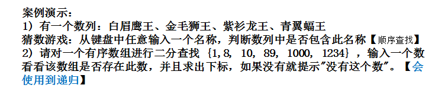

## 0.think
### 0.1.小数点位数的指定
```
var f1 float64 = 3.1415926
//保留两位小数输出
fmt.Printf("f1 = %.2f\n", f1)    //f1 = 3.14

var i1 int = 3
//保留两位的格式
fmt.Printf("i1 = %02d\n", i1) //i1 = 03
```
### 0.2.切片slice指向的地址
```
var baseArr = [...]int{1, 3, 5, 7, 9, 11}
slice01 := baseArr[1:4]  //[3 5 7]
fmt.Printf("slice01 addr=%p, slice01 content=%v\n", slice01, slice01)
fmt.Printf("baseArr[1] addr=%p", &baseArr[1])

//slice01 addr  ?  sliece01[0] addr
```
## 1.学习思路

### 1.1.学习思路
```
1)先整体框架，再细节
2)要用到什么，快速学习什么的能力
3)先知道how，再知道why
4)做中学
5)适当的囫囵吞枣
```

### 1.2.新技能学习路线
```
需求--->新、旧技术分析--->新技术了解：原理/基本语法
--->新技术快速入门案例学习：helloWorld
--->新技术的技术细节：怎么使用更规范/使用陷阱/注意事项

====>新技能的横向(面)和纵向(某一个点的深入)
```

### 1.3.编程思想
```
1.先易后难，即将一个复杂的问题分解成简单的问题，要善于观察总结
2.先死后活，即先在代码中写死成一个固定值，然后再用变量代替
```
### 1.4.编程技巧
```
1.会通过内存、控制台的办法来逐步分析程序的执行
2.修改部分代码后，为了显示有效，将fmt.Println中添加波浪线等加以区别
```
### 1.5.golang包的掌握总结
```
0. builtin
	len(v Type) int  //v: string/array/*array/slice/map
	cap(v Type) int  //v: array/*array/slice/map
	
	append(slice []Type, v1, v2 ...Type) []Type
	append(slice01, slice02...)  []Type
  
  copy(dst, src []Type) int
  
  delete(m map[Type]Type1, key Type)     //map删除单个key
  
  recover() interface{}
  
  panic(v interface{})
  
  new(Type) *Type
  make(v Type, len, cap int) Type

1. fmt
  fmt.Print/Println
  fmt.Printf("%v", abc)     //格式化输出
  fmt.Sprintf("%v", abc)    //格式化，不输出到终端
  
2. unsafe
	unsafe.Sizeof(abc)    //多少字符int32/8

3. math
	math.Pow(x, y float64) float64   //x的y次方
	math.Abs(x float64) float64 //绝对值
	math.MaxInt   //int
	math.MinInt   //int
	math.Sqtr(x float64) float64

4. math/rand
	rand.Seed(time.Now().UnixNano())
	rand.Intn(n)  //[0, n)

5. time
	time.Now()
	time.Now().Unix()
	time.Now().UnixNano()
	
	time.Sleep(d time.Duration)
	
	time.Duration(t2 - t1)
	
	type Duration:
	const( 
			Nanosecond Duration = 1
			Microsecond         = 1000 * Nanosecond
			Millisecond         = 1000 * Microsecond
			Second              = 1000 * Millisecond
			Minute              = 60 * Second
			Hour                = 60 * Minute
    )
    
    time.Now().Format("2016-01-02 15:04:05")
    time.Now().Year()
    time.Now().Month()         //July
    int(time.Now().Month())    //7
    fmt.Printf("%02d\n",time.Now().Month())     //07
    time.Now().Day()
    time.Now().Hour()
    time.Now().Minute()
    time.Now().Second()
    time.Now().Date()          //2022 July 11
    time.Now().Clock()         //18 21 56
    
    time.Now().YearDay()       //192
    time.Now().Weekday()       //Monday
    
 	t2.sub(t1)     //return duration
 	t2.add(d duration)  //时间点
6. strconv
	strconv.FormatInt(int64, base int) string
	strconv.FormatBool(b bool) string
	strconv.FormatFloat(f float64, fmt byte, prec, bitSize int) string
	strconv.Itoa(i int) string
	
	strconv.Parse

7. strings
8. sort
9. 
```

## 2.概述

### 2.1.GO的发展简史
```
1.核心开发人员：
  Robert Griesemer(Java HotSpot)
  Ken Thompson(Unix/Basic/C/GO)
  Rob Pike(Unix/UTF-8/1980年奥运会射箭银牌/天文学家)
2)GO的初衷：简洁高效、风格统一、高计算能力、高并发、高运行、高编译、垃圾收集处理等
```
### 2.2.GO语言的特点
```
静态编译语言的安全和性能+动态语言开发维护的高效率
1)继承C的理念
2)GO语言的一个文件都要归属于一个包(package)
3)垃圾回收机制
4)天然并发---多核高效并发---goroutine/CPS
5)管道通讯channel---goroutine
6)一个函数可返回多个值
7)创新方面：切片slice/延时执行defer等
```
### 2.3.工具选择
```
goland/VSCode/vim/eclipse/...
```
### 2.4.GO语言开发环境搭建
```
1)SDK(software development kit)软件开发工具包
2)官网https://go.dev/dl/
3)go语言中文网https://studygolang.com/dl
4)GO环境变量：
GOROOT--->SDK安装目录
Path--->SDK的bin目录---$GOROOT/bin
GOPATH--->工作目录

windows:
GOROOT---D:\Program Files\Go
Path---;%GOROOT%\bin
GOPATH---D:\goproject

linux:
sudo vi /etc/profile

export GOROOT=/opt/go
export PATH=$PATH:$GOROOT/bin
export GOPATH=$HOME/goproject

sudo source /etc/profile

macos:
sudo vi /etc/profile

export GOROOT=$HOME/go_dev/go
export PATH=$PATH:$GOROOT/bin
export GOPATH=$HOME/goproject

sudo source /etc/profile
```
### 2.5.快速开发
```
#非使用module
$GOPATH/src/go_code/project01
                             /main
                                  /hello.go
                             /package
                   /project02
#hello.go
package main
import "fmt"

func main(){
	fmt.Println("hello,world!")
}

1)生产环境先编译再执行(windows下必须是.exe文件)
go build -o hello-mac hello.go
===>hello-mac

./hello-mac===>hello

2)测试时可以直接go run
go run hello.go
===>hello
```
### 2.6.Go程序开发注意事项
```
1)Go源文件以.go为扩展名
2)Go应用程序的执行入口是main()函数，该函数必须在package main中
3)Go语言严格区分大小写
4)函数中每条语句后面不需要加分号(;)
5)Go编译器是一行一行编译的，每行就写一条语句，不能两条语句写在一行
6)定义的变量和import的包必须有使用，如果没有使用，那么编译不通过
7)大括号必须成对出现，左大括号必须在上一行的后面
```
### 2.7.Go语言转移字符(escape char)
```
1)\t  制表符，实现对齐功能
2)\n  换行符
3)\\  一个\
4)\"  一个"
5)\r  回车，从当前行的最前面开始输出，覆盖掉以前内容

fmt.Println("123456789\rworld")
====>world6789
```
### 2.8.Golang开发常见错误
```
1)文件名或者路径错误
2)语法错误：大括号、引号不配对；单词拼写错误；中文的括号、双引号等
3)通过编译器去查找错误位置，进行修改
```
### 2.9.注释(comment)
```
提高代码阅读性
先将自己的思想通过注释整理出来，再用代码去体现
1)行注释
//abc
//vscode快捷键：ctrl+/(可以选中多行，第二次表示取消注释)
2)块注释(多行注释)
/*
abc
*/

//块注释中不能嵌套块注释，可以包含行注释
```
### 2.10.规范的代码风格
```
1)正确的注释和注释风格
  推荐用行注释来注释整个方法和语句
2)正确的缩进和空白
 Tab往右缩进一次；Shift+Tab往左缩进一次
 yaml文件是通过空格往右缩进
3)可以用gofmt调整格式： gofmt -w hello.go
4)运算符两边习惯性各加一个空格。如： var a = 2 + 3 * 5
5)代码风格：一个问题尽量只有一个解决方法
  左大括号不能单独占一行
  func main() {
  	fmt.Println("hello,go!")
  }
6)行长约定：一行最长不超过80个字符，超过的用换行展示，尽量保持格式优雅\n
```
### 2.11.Go官方编程指南
```
1)官网https://go.dev
2)中文网https://studygolang.com/pkgdoc
```
### 2.12.DOS基本操作
```
---目录操作
1)查看当前目录有什么内容： dir
2)切换到e盘： cd /d e:
3)切换到其他目录：相对路径： cd test001  绝对路径：   cd e:\abc001\test001
4)切换到上一级： cd ..
5)切换到根目录： cd \
6)新建目录： md ok200   (mkdir ok200)
7)新建多个目录： md ok300 ok400
8)删除空目录： rd ok200   (rmdir ok200)
9)删除目录以及下面的子目录和文件，不带询问： rd /q/s ok300
10)删除目录以及下面的子目录和文件，带询问：  rd /s ok400 --->ok400,是否确认<Y/N>? y

---文件操作
1)新建或追加内容到文件： echo hello > d:\ok100\abc.txt
2)复制文件： copy abc.txt \e:\ok200\abc100\abc.txt
3)移动文件： move abc.txt \e:\ok200\abc100\abc123.txt
4)删除文件： del \e:\ok200\abc100\abc123.txt
5)删除所有文本文件： del \e:\ok200\abc100\*.txt

---其它指令
1)清屏： cls
2)退出dos： exit
```
## 3.Golang变量

### 3.1.变量介绍
```
1)变量相当于内存中一个数据存储空间的表示，门牌号---房间===>变量---变量值
2)使用变量的步骤：
  声明变量(定义变量)--->赋值--->使用
3)变量使用三种方式：
  ---指定变量类型，声明后未赋值，使用默认值：int/float64--0，string--""空串，bool--false
  ---根据值自动判定变量类型(类型推导)
  ---在函数中，变量声明可以省略关键字var(非全局变量)，采用:=   name := "tom" 并且该变量为首次声明
4)多变量声明，Golang支持一次性声明多个变量 
  --- var n1, n2, n3 int
  --- var a, name, b1 = 3, "tome", true
  --- a, name, b1 := 3, "tom", true
  --- arr[i], arr[i+1] = arr[i+1], arr[i]
5)一次性声明多个全局变量---函数外部
  var (
      n1 = 33
      name = "jack"
      n2 = 100
  )
6)变量在该区域的数据值可以在同一类型范围内不断变化
7)变量在同一作用域内不能重名
8)变量 = 变量名 + 数据类型 + 值 
```
### 3.2.变量类型(UTF-8)
```
1)基本数据类型：
  数值型：
       整型：int,int8,int16,int32,int64/uint,uint8,uint16,uint32,uint64    byte(uint8)   rune(int32)//unicode码点，存中文
       浮点型：float32,float64
  字符串型string：""
  布尔型bool： true,false     
2)派生/复杂数据类型：
  指针points
  数组array
  切片slice
  结构体struct
  映射map
  接口interface
  函数func
  管道channel
```
#### 3.2.1.整数类型
```
1)分类：
  有符号：(-0归属到负数最大值，末尾是2^0=1)  math.Pow(2,63)-1
         类型---占用存储空间---表述范围
         int8---1字节---(-128~127)
         int16---2字节---(-2^15~2^15-1)
         int32---4字节---(-2^31~2^31-1)
         int64---8字节---(-2^63~2^63-1)
   无符号：(末尾是2^0=1)
         类型---占用存储空间---表述范围
         uint8---1字节---0~255
         uint16---2字节---0~2^16-1
         uint32---3字节---0~2^32-1
         uint64---8字节---0～2^64-1
   其他类型：
        int---32位系统4字节：-2^31~2^31-1/64位系统8字节：-2^63～2^63-1
        uint---32位系统4字节：0~2^32-1/64位系统8字节：0~2^64-1
        rune---与int32一样：-2^31～2^31-1 表示一个Unicade码
        byte---与uint8一样：0～255 存储字符
2)var a = 100 //默认类型是int
3)查看变量的数据类型和所占字节数(byte)
  fmt.Printf("a'type is %T\n a'length is %d\n", a, unsafe.Sizeof(a))
4)使用整型变量时保小不保大，在保证程序正常运行下，尽量使用占用空间小的数据类型
```
#### 3.2.2.浮点型/小数类型
```
1)分类
  单精度float32---4字节---表述范围：-3.403E38~3.403E38
  双精度float64---8字节---表述范围：-1.798E308~1.798E308
2)浮点数在机器中存放形式：浮点数=符号位+指数位+尾数位
  var f1 float32 = 0.0000301 ===> 3.01e-05
  var f2 float64 = 8976543.123 ===>8.976543123e+06
  var f3 float32 = -0.0000301 ===> -3.01e-05
3)浮点数尾数部分可能会丢失，造成精度损失
  -123.0000901
  var f4 float32 = -123.0000901 ===> -123.00009
  var f5 float64 = -123.0000901 ===> -123.0000901

  float64精度比float32要准确，如果我们要保存一个精度高的数，则应该选用float64
4)浮点类型有固定的范围和字段长度，不受具体OS的影响
5)浮点型默认声明为float64，开发中使用float64
6)表示方法：
         十进制： var f6 float64 = 5.12  
                 var f7 float64 = 0.512
         科学计数法： var f8 float64 = 5.12e+02  ===> f8 = 512
                    var f9 float64 = 5.12e-02  ===> f9 = 0.0512
```
#### 3.2.3.字符类型
```
1)Go没有专门的字符类型，用byte来存储单个字符(字母等)--单引号---默认输出是UTF-8码值，想输出对应字符，必须采用格式化输出%c
  var a byte = 'a'
  fmt.Printf("a value is %v , a code is %c", a, a)
  ===>a value is 97 , a code is a

  var b byte = '0'  //字符0，不是数字0
  fmt.Printf("b value is %v , b code is %c", b, b)
  ===>b value is 48 , b code is 0

  // var c byte = '北'  //overflow，码值 > 255
  var d int = '北'
  fmt.Printf("d value is %v , d code is %c", d, d)
  ===>d value is 21271 , b code is 北

  //码值和字符转换
  var e byte = 97
  fmt.Printf("e value is %v , e code is %c\n", e, e)
  ===>e value is 97 , e code is a
2)字符常量是单引号括起来的单个字符
  var c1 byte = 'a'
  var c2 int = '中'
  var c3 byte = '9'
3)UTF-8编码查询：http://www.mytju.com/classcode/tools/encode_utf8.asp
4)Go语言的字符采用UTF-8编码，英文字母---1个字节，汉字---3个字节，再也不会出现编码乱码的问题了
5)字符的本质是一个整数，直接输出时是UTF-8码值，想输出对应字符，必须采用格式化输出%c
6)可以使用转义字符将单个字符转换成特殊字符常量
  var c4 byte = '\n'
  %v===>10
7)字符类型可以进行运算，根据UTF-8码值来运算
  var n1 = 10 + 'a'
  ===> n1 = 107

  // 输出所有字母
	for i := 97; i <= 122; i++ {
		fmt.Printf("%c\n", i)
	}
8)字符在机器中的存储和读取过程
  存储： 字符--->码值--->二进制--->存储
  读取： 二进制--->码值--->字符--->读取
```
#### 3.2.4.bool布尔类型
```
1)bool类型只允许取值true和false，默认为false，不能用0或者非0的整数代替true和false
  var a bool
  ===> a = false

  var b bool =  true
  // b = 1 //错误的写法
2)bool类型占1个字节 unsafe.Size(a1) ===> 1
3)bool类型适于逻辑运算，一般用于程序流程控制if/for
```
#### 3.2.5.string字符串类型
```
1)字符串是一串固定长度的字符连接起来的字符序列，Go的字符串是由单个字节连接起来的，使用UTF-8编码表示Unicode文本
2)字符串一旦赋值了，字符串中的字节内容就不能修改了，即在Go中字符串是不可变的
  var str string = "hello"
  // str[0] = 'm' //wrong!
3)字符串的表示形式：
  双引号"" --- 会识别转义字符
  反引号`` --- 以字符串的原生形式输出，包括换行和特殊字符，可以实现防止攻击、输出源代码等效果
4)字符串的拼接 
  str1 := "hello," + "world"   str1 += "ok"
5)当一个拼接操作很长时，可以分行写，但是+留在上一行末尾
  str2 := "hello" + "world" +
          "hello"
```
#### 3.2.6.基本数据类型的默认值
```
在Go中，默认值又叫零值
1)整型---0
2)浮点型---0
3)bool---false 
4)string---""
```
### 3.3.基本数据类型数值转换
```
1)Go在不同类型的变量之间进行赋值时，必须显式转换。数据类型不能自动转换。
2)表达式T(v)将值v转换成类型T
3)被转换的是变量存储的数据(值)，变量本身的数据类型并没有变化
4)可以表示范围小--->表示范围大，也可以由表示范围大--->表示范围小
5)当范围大的数值超过范围小的数值的范围后，强制转换，编译器不会报错，但会造成溢出，结果不是想得到的结果，因此转换时需要考虑范围
```
#### 3.3.1.基本数据类型转string
```
1)第一种方法：fmt.Sprintf(%参数，表达式)---参数必须与表达式的数据类型相匹配---返回格式化后的字符串，不做输出

  var a int = 100
  var str string
  str = fmt.Sprintf("%d", a)
  fmt.Printf("%q",str)
  ===>"100"

  var str1 string = "hello"
  str = fmt.Sprint("%q", str1)
  fmt.Printf("%q", str1)
  ===>"\"hello\""

  int/uint: %02d
  float32/float64: %.2f/%g/%e
  二进制：%b
  byte: %c
  bool: %t
  string: %s/%q
  pointer: %p
  十六进制：%x %#x
  八进制：	%o %#o

  %v/%T
  fmt.Print---输出到控制台
  fmt.Println---输出到控制台并换行
  fmt.Printf---打印出格式化的字符串，只输出字符串类型的变量，不可以输出别的类型
  fmt.Sprintf---格式化并返回一个字符串而不带任何输出
  fmt.Fprintf---格式化的字符串输出到io.Writers，而不是os.stdout

2)第二种方法：strconv.FormatXxx
  //int ---> string
  //strconv.FormatInt(i int64, base int)  //i必须先转换成int64，后面是base进制
  var a1 int32 = 100
  str := strconv.FormatInt(int64(a1), 10)
  fmt.Printf("%q\n", str)
  ===>"100"

  //int ---> string 缩写
  //strconv.Itoa(i int) string
  //相当于strconv.FormatInt(int64(i), 10)
  a2 := 10
  str1 := strconv.Itoa(a2)
  fmt.Printf("%q\n", str1)
  ===>"10"
  var a3 int16 = 10
  str1 := strconv.Itoa(int(a3))
  fmt.Printf("%q\n", str1)
  ===>"10"

  //float32 ---> string
  //strconv.FormatFloat(f float64, fmt byte, prec, biteSize int) 
  //f先转换成float64，fmt为'f'/'e'/'E'/'g'等，prec为小数点后位数，bitSize为f原来的精度数(32或64)
  var f1 float32 = 100.123
  str := strconv.FormatFloat(float64(f1), 'f', 5, 32)
  fmt.Printf("%q\n", str)
  ===>"100.12300"

  //bool ---> string
  //strconv.FormatInt(b bool) 
  var b1 = true
  str := strconv.FormatInt(b1)
  fmt.Printf("%q\n", str)
  ===>"true"

  //byte ---> string
  //strconv.FormatInt(i uint64, base int)  //i 必须先转换成uint64，后面是base进制
  var c1 byte = 'X'
  str := strconv.FormatInt(uint64(c1), 10)
  fmt.Printf("%q\n", str)
  ===>"88"  //'X'的unicode码值88
```
#### 3.3.2.string转基本类型
```
1)采用strconv.ParseXxx来进行转换

  //string ---> bool
  //strconv.ParseBool(str string) (bool, error)
  //b1, _ 表示忽略第二值
  var str1 string = "true"
  var b1 bool
  b1, _ = strconv.ParseBool(str1)
  fmt.Printf("b1 type is %T, b1 value is %v\n", b1, b1)
  ===>b1 type is bool, b1 value is true

  //string ---> float32
  //strconv.ParseFloat(str string, bitSzie int) (float64, error)
  var str2 string = "123.456"
  var f1 float64
  var f2 float32
  f1, _ = strconv.ParseFloat(str2, 32)
  f2 = float32(f1)
  fmt.Printf("f1 type is %T, f1 value is %v\n", f1, f1)
  fmt.Printf("f2 type is %T, f2 value is %v\n", f2, f2)
  ===>f1 type is float64, f1 value is 123.456001
      f2 type is float32, f2 value is 123.456001

  //string ---> int
  //strconv.ParseInt(str string, base int, bitSzie int) (int64, error) //base进制，bitSzie:0-int 8/16/32/64
  var str3 string = "123456"
  var i1 int64
  var i2 int
  i1, _ = strconv.ParseInt(str3, 10, 0)
  i2 = int(i1)
  fmt.Printf("i1 type is %T, i1 value is %v\n", i1, i1)
  fmt.Printf("i2 type is %T, i2 value is %v\n", i2, i2)
  ===>i1 type is int64, i1 value is 123456
      i2 type is int, i2 value is 123456

  //strint --->int 缩写
  //strconv.Atoi(string)(int,error)
  //相当于strconv.ParseInt(string,10,0)
2)ParseFloat返回的是float64，ParseInt返回的是int64，如果最后希望得到float32或者int32等，必须再次进行强制类型转换
3)在将String转成基本类型时，必须确保String类型能够转成有效的数据，比如不能把"hello"转成int
  var str4 string = "hello"
  var i3 int64
  i3, _ = strconv.ParseInt(str4, 10, 64)
  fmt.Printf("%T,%v\n", i3, i3)
  ===>int64,0   //因为没有转成功，所以采用的int64的默认值0   //float64--->0/bool--->false
```
### 3.4.指针
```
1)基本数据类型，变量存的就是值，也叫值类型
2)获取变量的地址，用&，比如：var num int = 10 那么获取num的地址：&num
3)指针类型，指针变量存的是一个地址，这个地址指向的空间存的才是值，如：var ptr *int = &num //ptr存的是内存地址，8字节
4)获取指针类型所指向的值，使用*ptr，比如：var ptr *int，使用*ptr获取num的值
  //int
  var num1 int = 100
  var ptr1 *int = &num1
  *ptr1 = 200
  ===>num1 = 200

  //float32
  var num2 float32 = 123.111
  var ptr2 *float32 = &num2
  *ptr2 = 111.321
  ===>num1 = 111.321

  //&ptr2
  var ptr3 **float32 = &ptr2
  fmt.Printf("ptr3 type is %T, ptr3 = %v, *ptr3 =%v", ptr3, ptr3, *ptr3)
5)值类型都有对应的指针类型，形式为：*数据类型，比如：int--->*int    float32--->*float32  
  指针的指针  var ptr2 **float32 = &*ptr
```
### 3.5.值类型和引用类型
```
1)值类型：基本数据类型int系列，float系列，bool，string，数组array和结构体struct
2)引用类型：指针、slice切片、map、管道chan、interface等都是引用类型
3)值类型：变量直接存储值，内存通常在栈中分配
4)引用类型：变量存储的是一个地址，这个地址对应的空间才是真正存储数据(值)，内存通常在堆上分配，
          当没有任何变量引用这个地址时，该地址对应的数据空间就成为一个垃圾，由GC来回收
5)堆、栈 逃逸分析
```
### 3.6.标识符
```
1)标识符的命名规则：
  1. 由英文字母大小写、0-9的数字和_组成
  2. 不能由数字开头
  3. 严格区分大小写
  4. 不能有空格
  5. _为空标识符，仅做占位符，不能做标识符，可以用来忽略返回值
  6. 不能用系统保留关键字来做标识符(一共25个)
     系统关键字：
     break case chan const continue default defer else fallthrough for func go goto if import 
     interface map package range return select struct switch type var
     // int/float32等编译运行可以通过，但是不建议使用
2)package的名字和目录保持一致，尽量有意义，不要和标准库冲突，如fmt等
3)变量名、常量名、函数名等采用驼峰法，如xxxYyyZzzz
4)如果变量名、常量名、函数名等首字母大写，则可被其他包访问，若首字母小写，则只能在本包中使用
  Golang中没有public、private、protected等关键字
5)package main中 import "packageB"，两种方式：
  第一种：
         export GO111MODULE="on"
         go mod init modeA
         此时可以在main.go中 import "modeA/packageB"
  第二种：
         export GO111MODULE="off"
         采用GOPATH中的路径，如GOPATH=$HOME/go，包路径为$HOME/go/src/go_code/project1/module
         import "go_code/project1/module"
6)系统保留关键字---25个
  break cas chan const continue default defer else fallthrogh for func go goto if import
  interface map package range return select struct switch type var
7)预定义标识符---36个---基础数据类型和系统内嵌函数
  $GOROOT/src/builtin/builtin.go
  int/int8/int16/int32/int64
  uint/uint8/uint16/uint32/uint64
  float32/float64
  bool/true/false
  byte/string
```
## 4.运算符

### 4.1.基本介绍
```
   包括：算术运算符 赋值运算符 比较运算符/关系运算符 逻辑运算符 位运算符 其他运算符
```
### 4.2.算术运算符
```
1)对数值类型变量进行运算，如加减乘除等。
  + 正号/加/字符串相加
  - 负号/减
  * 乘
  / 除
  % 取模(取余)
  ++ 自增
  -- 自减
2)注意事项：
  如果相除的两个数都是整数，那么结果会舍弃小数部分，只保留整数部分
  如果我们希望保留小数部分，则需要有浮点数参与运算
  var a int = 10/4 ===> a = 2
  var b float32 = 10/4 ===> b = 2
  var c float32 = 10.0/4 ===> c = 2.5
3)取模运算仅用于整数间的运算，公式 a%b = a - a/b *b
  10%3 = 1
  -10%3 = -1
  10%-3 = 1
  -10%-3 = -1
  在Go语言中，%取模运算符的符号和被取模数的符号总是一致的
4)i++ i-- 只能做独立运算，不能再参加赋值运算或比较运算等
  只有i++和i--，没有++i和--i 
  var i int = 10
  var j int
  i++
  j = i
  ===>j = 11
```
### 4.3.关系运算符(比较运算符)
```
1)介绍：
  ==  != > < >= <=
2)结果都是bool型，true或false
3)常用于if结构或循环结构的条件中
```
### 4.4.逻辑运算符
```
1)用来连接多个条件，一般是关系表达式，最终结果是个bool值
2)逻辑与(短路与) A&&B，如果两边的操作数都是True，则为True，否则为false。
  当A为false时，B不再执行判断。
3)逻辑或(短路或) A||B，如果两边的操作数有一个是True，则为True，否则为False。
  当A为True时，B不再执行判断。
4)逻辑非 ! 如果条件为True，则逻辑为False，否则为True。
  取反
```
### 4.5.赋值运算符
```
1)赋值运算符就是将某个运算后的值，赋给指定的变量。
2)分类
  =       C = A + B
  复合运算符
  +=      A += B   ---> A = A + B
  -=      A -= B   ---> A = A - B
  *=      A *= B   ---> A = A * B
  /=      A /= B   ---> A = A / B
  %=      A %= B   ---> A = A % B

  二进制赋值运算符
  <<=   左移后赋值   C <<= 2 ---> C = C << 2
  >>=   右移后赋值   C >>= 2 ---> C = C >> 2
  &=   按位与后赋值   C &= 2 ---> C = C & 2
  |=   按位或后赋值   C |= 2 ---> C = C | 2
  ^=   按位异或后赋值   C ^= 2 ---> C = C ^ 2

3)特点
  运算顺序从右到左
  赋值运算符的左边只能是变量，右边可以是变量、表达式、常量等
```
### 4.6.位运算符---一定要牢记：负数要先转成补码，再做位运算！
```
1)分类
  & 双目运算符，二进制按位与，同时为1，结果为1，否则为0
  | 双目运算符，二进制按位或，有一个为1，结果为1，否则为0
  ^ 双目运算符，二进制按位异或，当二进位不同时，结果为1，否则为0
  <<  双目运算符，左移运算符，把<<左边的运算数的各二进位全部左移若干位，高位丢弃，低位补零
  >>  双目运算符，右移运算符，把>>左边的运算数的各二进位全部右移若干位，符号位不变，并用符号位补溢出的高位
```
### 4.7.其他运算符
```
1)分类
  & 取地址运算符 var i int = 10  &i表示变量i的实际内存地址
  * 取指针指向值的运算符  var ptr *int = &i ---> *ptr = 10
2)Golang不支持三元运算符，通过if/else实现其功能
  if exp {
     n = trueVal
  } else {
     n = falseVal
  }
```
### 4.8.运算符的优先级
```
1)运算符有不同的优先级，所谓优先级就是表达式运算中的运算顺序
2)优先级由高到低顺序如下：
  括号 ++ --    () [] ++ --
  单目运算符     + -  ! type(val1) *ptr &num Sizeof
  算术运算符     * / % + -
  移位运算符     << >>
  关系运算符     < <= > >=  ==  !=
  位运算符       &  ^  |
  逻辑运算符     && ||
  赋值运算符     =  +=  -=  *=  /=  %=  >>=  <<=  &=  ^=  |=
  逗号          ,

3)只有单目运算符、赋值运算符是从右向左运算的
```
### 4.9.求数最大值
```
   //两个数
   func max2Val(a, b int) int {
        if a > b{
           return a
        }
        return b
   }

   //三个数---方法一：先求出两个数的最大值，再跟第三个数对比
   func max3Val(a, b, c int) int {
        return max2Val(max2Val(a, b), c)
   }

   //三个数---方法二：a表示最大值
   func max31Val(a, b, c int) int {
        if a < b {
           a = b
        }
        if a < c {
           a = c
        }
        return a
   }

   //三个数---方法三：通过&&来防止if-else嵌套
   func max32Val(a, b, c int) int {
        if a > b && a > c {
            return a
        } else if b > a && b > c {
            return b
        } else {
            return c
        }

   }
```
### 4.10.键盘输入语句
```
1)编程过程中，需要接收用户输入的数据，可以用键盘输入语句来获取
2)fmt.Scan---在输入过程中，回车视为空白分割，最后输入完数据后的回车才作为输入结束
3)fmt.Scanln---在输入过程中，空格作为空白分割，最后回车视为输入结束
4)fmt.Scanf---在输入过程中，空格作为空白分割，只接收指定格式参数的输入比如：%d %s %t等和空格，不能有其他内容
```
### 4.11.进制
```
1)整数有四种表示方法：
  二进制：0,1 满2进1  Golang中不能直接使用二进制来表示一个整数 ---%b
  十进制：0-9 满10进1 ---%d
  八进制：0-7 满8进1  以0开头 ---%o----%#o
  十六进制：0-9 A-F 满16进1 以0x(0X)开头 其中a-f不区分大小写 ---%x(a-f) %X(A-F)----%#x(0x--a-f) %#X(0x--A-F)

  %b---二进制 %c---该值对应的unicode码值 %d---十进制整数  %o---八进制整数 %x---十六进制a-f  %X---十六进制A-F
  %f---有小数但无指数浮点数  e%---带指数的浮点数1.23e+02  E%---带指数的浮点数1.23E+02  %g根据实际情况采用%f或者%e
  %s---字符串  %q---带双引号的字符串

2)进制的转换
  其它进制转十进制：二进制/八进制/十六进制 转十进制
  十进制转其它进制：十进制转 二进制/八进制/十六进制
  二进制转其它进制：二进制转 八进制/十六进制
  其它进制转二进制：八进制/十六进制 转二进制
3)其它进制转十进制
  二进制--->十进制：从最低位开始(右边的)，将每个位上的数提取出来，乘以2的(位数-1)次方，然后求和
  1011 = 1*2^0 + 1*2^1 + 0*2^2 + 1*2^3 = 1+2+8 = 11

  八进制--->十进制：从最低位开始(右边的)，将每个位上的数提取出来，乘以8的(位数-1)次方，然后求和
  0123 = 3*8^0 + 2*8^1 + 1*8^2 = 3 + 16 + 64 = 83

  十六进制--->十进制：从最低位开始(右边的)，将每个位上的数提取出来，乘以16的(位数-1)次方，然后求和
  0x34A = 10*16^0 + 4*16^1 + 3*16^2 = 10 + 64 + 768 = 842

4)十进制转其它进制
  十进制--->二进制：将该数不断除以2，直到商为0为止，然后将每步得到的余数倒过来，就是对应的二进制
  56 = 11100
  56/2 = 28 余 0
  28/2 = 14 余 0
  14/2 = 7  余 0
  7/2  = 3  余 1
  3/2  = 1  余 1
  1/2  = 0  余 1

  十进制--->八进制：将该数不断除以8，直到商为0为止，然后将每步得到的余数倒过来，就是对应的八进制
  156 = 0234
  156/8 = 19 余 4
  19/8  =  2 余 3
  2/8   =  0 余 2

  十进制--->十六进制：将该数不断除以16，直到商为0为止，然后将每步得到的余数倒过来，就是对应的十六进制
  356 = 0x164
  356/16 = 22 余 4
  22/16  = 1  余 6

5)二进制转其它进制
  二进制--->八进制：将二进制数每三位一组(从低位开始组合)，转成相应的八进制数即可
  11010101 = 11 010 101 = 0325

  二进制--->十六进制：将二进制数每四位一组(从低位开始组合)，转成相应的十六进制数即可
  11010101 = 1101 0101 = 0xD5

6)其它进制转二进制
  八进制--->二进制：将八进制数的每1位，转成对应的一个3位的二进制数即可
  0237 = 10 011 111 = 10011111

  十六进制--->二进制：将十六进制数的每1位，转成相应的一个4位的二进制数即可
  0x237 = 10 0011 0111 = 1000110111
```
### 4.12.位运算
```
1)计算机内的运算是通过二进制的补码运算来完成的
2)原码/反码/补码
  对于有符号的数而言：
  (1)二进制的最高位是符号位，0表示正数，1表示负数
     var i1 int8 = 1  ---> [0000 0001]
     var i2 int8 = -1 ---> [1000 0001]
  (2)正数的原码、反码、补码都一样
  (3)负数的反码 = 原码的符号位不变，其它位取反
  (4)负数的补码 = 反码 + 1
     1 原码[0000 0001]  反码[0000 0001]  补码[0000 0001]
    -1 原码[1000 0001]  反码[1111 1110]  补码[1111 1111]
  (5)0的反码、补码都是0
  (6)在计算机运算的时候，都是以补码的方式来运算的

3)-2 ^ 2 = -4
  -2 原码 1000 0010 
     反码 1111 1101
     补码 1111 1110
   2 补码 0000 0010
  -2^2 补码 1111 1100 
       反码 1111 1011
       原码 1000 0100  ---> -4
4)移位运算符
  右移运算符>>：低位溢出，符号位不变，并用符号位补溢出的高位
  左移运算符<<：符号位不变，低位补0
  1 >> 2 
  0000 0001 >> 2
  0000 0000
  1 >> 2 = 0

  1 << 2
  0000 0001 << 2
  0000 0100
  1 << 2 = 4 

  -1 >> 2
  原码 1000 0001
  反码 1111 1110
  补码 1111 1111
       >> 2
      1111 1111
  反码 1111 1110
  原码 1000 0001    
  -1 >> 2 = -1

  -1 << 2
  原码 1000 0001
  反码 1111 1110
  补码 1111 1111
       << 2
      1111 1100
  反码 1111 1011
  原码 1000 0100
  -1 << 2 = -4
```

## 5.程序流程控制
### 5.1.程序流程控制介绍 
```
三大流程控制语句分为：顺序控制、分支控制、循环控制
```
### 5.2.顺序控制
```
顺序控制：程序从上到下逐行地执行，没有任何判断或者跳转等
Golang中定义变量时使用合法的前向引用
```
#### 5.2.1.顺序控制的一个流程图：


### 5.3.分支控制

```
分支控制分为：单分支、双分支、多分支
```

#### 5.3.1.单分支控制
##### 5.3.1.1.基本语法
```
  if 条件表达式 {
     执行代码块
  }
  //当条件表达式为true时，执行{}中的代码块，{}必须有，就算只写一行代码
```
##### 5.3.1.2.单分支流程图


#### 5.3.2.双分支控制
##### 5.3.2.1.基本语法
```
	if 条件表达式 {
		执行代码块1
	} else {
		执行代码块2
	}
	//当条件表达式为true时执行代码块1，否则执行代码块2，{}必须有
	//双分支只会执行其中的一个分支
```
##### 5.3.2.2.双分支流程图


#### 5.3.3.多分支控制
##### 5.3.3.1.基本语法：
```
	if 条件表达式1 {
		执行代码块1
	} else if 条件表达式2 {
			执行代码块2
	} else if 条件表达式3 {
			执行代码块3
	}
	...
	else {
		执行代码块n
	}
	//先判断条件表达式1是否成立，如果为真，就执行代码块1
	//如果条件表达式1为假，那么去判断条件表达式2是否成立，如果为真，就执行代码块2
	//依次类推
	//如果所有的条件表达式都不成立，那么执行else内的代码块n
	
	//else不是必须的
	//多分支只能有一个执行入口

```
##### 5.3.3.2.多分支流程图


#### 5.3.4.嵌套分支控制
```
在一个分支结构中又完整的嵌套了另一个完成的分支结构，里面的分支结构叫内层分支，外面的分支结构叫外层分支
```
##### 5.3.4.1.基本语法
```
if 条件表达式1 {
	if 条件表达式2 {
		执行表达式2
	} else {
		执行表达式3
	}
}

//嵌套分支不易过多，建议控制在3层内
```
#### 5.3.5.switch语句
##### 5.3.5.1.基本介绍
```
switch语句用于基于不同条件执行不同动作，每个case分支都是唯一的，从上到下逐一测试，直到匹配为止
匹配项后面也不需要再加break
```
##### 5.3.5.2.基本语法
```
switch 条件表达式 {
case 条件表达式1,条件表达式2,...:
		 语句块1
case 条件表达式3,条件表达式4,...:
		 语句块2
//这里可以有多个case语句
default:
		 语句块n
}
```

##### 5.3.5.3.switch语句流程图


```
对流程图的说明：
1.switch语句执行的流程是，先执行表达式，得到值，然后和case的表达式进行比较，如果相等，就匹配到，那么就执行对应的case语句里的代码块，然后退出switch控制；
2.如果switch表达式的值没有和任何case的表达式匹配，那么就执行default的语句块。执行后退出switch的控制；
3.golang的同一个case后的表达式可以有多个，用逗号分开；
4.golang中的case语句不需要写break，默认会有。即在默认情况下，当程序执行完case语句，就直接退出该switch控制结构。
```
##### 5.3.5.4.switch语句使用的注意事项和细节
```
1. switch/case后是一个表达式(即常量值、变量、一个有返回值的函数等都可以)，如果是一个函数，必须是返回一个唯一值的函数
2. case后的各个表达式的值的数据类型，必须和switch表达式的数据类型一致
3. case后面可以带多个表达式，用逗号分开，如case 表达式1,表达式2,表达式3...
4. case后面的表达式如果是常量值(字面量)，则要求不能重复
5. case后面不需要带break，程序匹配到一个case后就会执行对应的代码块，然后退出switch，如果一个都匹配不到，则执行default
6. default语句不是必须的
7. switch后面也可以不加表达式，类似if-else分支来使用，此时case后面表达式的值是bool类型
8. switch后面也可以声明或者定义一个变量，后面加分号，此时case后面表达式的值是bool类型---不推荐
9. switch穿透---fallthrough，如果在case语句块后增加fallthrough，则会继续执行下一个case或default里的语句块，默认只能穿透一层
10. Type Switch: switch语句还可以被用于type-switch来判断某个interface变量中实际指向的变量类型
```
#对应代码
```go
package main

import "fmt"

func sum(x, y int) int {
	return x + y
}

func main() {
	//switch/case后面的是一个表达式，可以是常量、变量、一个有返回值的函数等
	var x, y int
	var f1 float32 = 100.14
	// var i1 int = int(f1)
	fmt.Println("plz input two int-number: x , y:")
	fmt.Scanf("%d %d", &x, &y)

	//switch后面如果表达式是一个函数返回值，那么必须是唯一值
	switch sum(x, y) {
	//case后面可以有多个表达式，用逗号分开，但是如果是常量值，不能重复
	case 50 + 50, 30 + 80:
		fmt.Println("天河之作")
	case 1000:
		fmt.Println("超常发挥")
	//case后表达式的值的数据类型必须跟switch语句表达式的值的数据类型一致
	//case后面的表达式是变量，非常量值时，可以跟前面case后面的值相同，编译会通过，但只会执行前面的case里语句块
	case int(f1):
		fmt.Println("error")
	default:
		fmt.Println("继续加油")
	}

	num := sum(x, y)
	//switch后面可以不加表达式，此时case后面表达式的值是bool类型
	switch {
	case num >= 200:
		fmt.Println("more then 200")
	case num >= 100:
		fmt.Println("less then 200, more then 100")
	default:
		fmt.Println("less then 100")
	}

	//switch后面可以直接声明或者定义一个变量
	switch num1 := 300; {
	case num1 > 100:
		fmt.Println("more then 100")
		fallthrough
	case num1 < 100 && num1 > 0:
		fmt.Println("less then 100")
		fallthrough
	case num1 < 0:
		fmt.Println("less then 0")
		fallthrough
	default:
		fmt.Println("100")
	}
}
```
##### 5.3.5.5.switch与if的比较
```
1.如果判断的具体数值不多，而且符合整数、浮点数、字符、字符串这几种类型，建议使用switch，简洁高效
2.其他情况：对区间判断和结果为bool类型的判断，使用if，if的使用范围更广
```
### 5.4.for循环
#### 5.4.1.for 循环的基本语法
```
for 循环变量初始化;循环条件;循环变量迭代 {
		循环语句(操作)
}
```
#说明
```
for循环执行的顺序：
1)执行循环变量初始化，比如 i := 1
2)执行循环条件，比如 i <= 10
3)如果循环条件为真，就执行循环操作，比如 fmt.Println("hello,golang!", i)
4)执行循环变量迭代，比如 i++
5)反复执行2、3、4步骤，直到循环条件为False，就退出for循环
```
#### 5.4.2.for 循环的流程图


#### 5.4.3.for 循环的注意事项和使用细节

```
循环条件是一个返回bool值的表达式
```
##### 5.4.3.1.for 循环的第二种使用方式
```
循环变量初始化
for 循环条件 {
		循环语句
		循环变量迭代
}
```
#code
```go
i := 1
for i <= 10 {
		fmt.Println("go", i)
		i++
}
```
##### 5.4.3.2.for 循环的第三种使用方式
```
循环变量初始化
for {
		if 循环条件 {
			循环语句
		} else {
			break
		}
		循环变量迭代
}

//相当于for ; ; {} 是一个无限循环，通常需要配合break语句使用
```
#code
```go
k := 1
for {
		if k <= 10 {
			fmt.Println("go~", k)
		} else {
			break
		}
		k++
}
```
##### 5.4.3.3.golang的for-range
```
可以遍历字符串和数组
```
###### 5.4.3.3.1字符串的传统遍历
```go
//English--1 bit按字节来遍历
var str string = "hello,golang"
for i := 0; i < len(str); i++ {
		fmt.Printf("%c\n", str[i])
}
```
#如果含有中文字符会报乱码
```go
//Chinese---utf-8 占3bits
var str string = "hello,golang北京"
for i := 0; i < len(str); i++ {
		fmt.Printf("%c\n", str[i])
}
//--->因为汉字要3bits，所以会打印出乱码
```
#通过将str转成[]rune切片来实现
```go
var str string = "hello,golang北京"
str2 := []rune(str)
for i := 0; i < len(str2); i++ {
		fmt.Printf("%c\n", str2[i])
}
```
###### 5.4.3.3.2字符串的遍历方式2: for-range
```go
var str1 string = "hello,world!"
for index, val := range str1 {
		fmt.Printf("index = %d, val = %c\n", index, val)
}

var str2 string = "hello, world!"
for _, val := range str2 {
		fmt.Printf("%c\n", val)
}

//字符串中含有汉字，不影响使用
var str3 string = "hello, world!北京"
for index, val := range str3 {
		fmt.Printf("index = %d,val = %c\n", index, val)
}

//因为for-range是按照字符来遍历的，不是按照字节来遍历的
```
#### 5.4.4.while/do-while
```
golang没有while和do-while，可以通过以下代码代替其功能
```
#while
```
循环变量初始化
for {
	if 循环条件 {
		break
	}
	循环语句
	循环变量迭代
}

//
```
#do-while
```
循环变量初始化
for {
	循环语句
	循环变量迭代
	if 循环条件 {
		break
	}
}
```
#code
```go
package main

import "fmt"

func main() {

	//while的替代
	var i int = 1
	for {
		if i > 10 {
			break
		}
		fmt.Println("hello,go", i)
		i++
	}

	//do-while的替代
	var j int = 1
	for {
		fmt.Println("hi,golang~", j)
		j++
		if j > 10 {
			break
		}
	}
}
```
#### 5.4.5.多重循环控制
##### 5.4.5.1.基本介绍
```
1.将一个循环放到了另一个循环体内，就形成了嵌套循环。在外边的for循环成为外层循环，在里面的for循环称为内循环。建议一般使用两层，最多不要超过三层。
2.实质上，就是把内存循环当成外层循环的循环体。只有当内层循环的循环条件为Fales时，才会完全跳出内层循环，才可结束外层的当次循环，开始下一次的循环。
3.外层循环次数为m次，内层循环次数为n次，则内层循环体实际上需要执行m*n次
```
##### 5.4.5.2.编程思想
```
1.先易后难，将复杂问题分解成简单的问题
2.先死后活
```
##### 5.4.5.3.嵌套循环案例
###### 5.4.5.3.1.各个班的平均分和所有班级的平均分
#code1
```go
package main

import "fmt"

func main() {
	//统计3个班的学生成绩，每个班有5名学生，求出各个班的平均分和所有班级的平均分(学生成绩由键盘输入)
	//编程思想：先易后难----先死后活
	//先易后难，先统计一个班的平均成绩
	// var sum, avg float64
	// for i := 1; i <= 5; i++ {
	// 	var score float64
	// 	fmt.Printf("plz input %d student's score:\n", i)
	// 	fmt.Scanln(&score)
	// 	sum += score
	// }
	// avg = sum / 5
	// fmt.Println("该班的平均分为:", avg)

	//再求出三个班的平均成绩

	// var avg, totalSum float64
	// for j := 1; j <= 3; j++ {
	// 	sum := 0.0
	// 	for i := 1; i <= 5; i++ {
	// 		var score float64
	// 		fmt.Printf("plz input %d 班的第 %d student's score:\n", j, i)
	// 		fmt.Scanln(&score)
	// 		sum += score
	// 	}
	// 	avg = sum / 5
	// 	fmt.Printf("第%d班的平均分为: %v\n", j, avg)
	// 	totalSum += sum
	// }
	// avg = totalSum / 3 / 5
	// fmt.Printf("全部班级的平均分为: %v\n", avg)

	//先死后活，把写死的值改成变量
	//注意数值型变量的强制转换
	var classNum, stuNum int = 3, 5
	var avg, totalSum float64
	for j := 1; j <= classNum; j++ {
		sum := 0.0
		for i := 1; i <= stuNum; i++ {
			var score float64
			fmt.Printf("plz input %d 班的第 %d student's score:\n", j, i)
			fmt.Scanln(&score)
			sum += score
		}
		avg = sum / float64(stuNum)
		fmt.Printf("第%d班的平均分为: %v\n", j, avg)
		totalSum += sum
	}
	avg = totalSum / float64(classNum*stuNum)
	fmt.Printf("全部班级的平均分为: %v\n", avg)

}
```
###### 5.4.5.3.2.各个班的及格人数和所有班级的及格人数
#code2
```go
//上面案例再求出每个班和所有班的及格人数
package main

import "fmt"

func main() {
	//统计3个班的学生成绩，每个班有5名学生，求出各个班的平均分和所有班级的平均分(学生成绩由键盘输入)
	//编程思想：先易后难----先死后活
	//先易后难，先统计一个班的平均成绩
	//先死后活，学生个数为5
	// var sum, avg float64
	// for i := 1; i <= 5; i++ {
	// 	var score float64
	// 	fmt.Printf("plz input %d student's score:\n", i)
	// 	fmt.Scanln(&score)
	// 	sum += score
	// }
	// avg = sum / 5
	// fmt.Println("该班的平均分为:", avg)

	//再求出三个班的平均成绩

	// var avg, totalSum float64
	// for j := 1; j <= 3; j++ {
	// 	sum := 0.0
	// 	for i := 1; i <= 5; i++ {
	// 		var score float64
	// 		fmt.Printf("plz input %d 班的第 %d student's score:\n", j, i)
	// 		fmt.Scanln(&score)
	// 		sum += score
	// 	}
	// 	avg = sum / 5
	// 	fmt.Printf("第%d班的平均分为: %v\n", j, avg)
	// 	totalSum += sum
	// }
	// avg = totalSum / 3 / 5
	// fmt.Printf("全部班级的平均分为: %v\n", avg)

	//先死后活，把写死的值改成变量
	//注意数值型变量的强制转换
	var classNum, stuNum, totalpassNum int = 3, 5, 0
	var avg, totalSum float64
	for j := 1; j <= classNum; j++ {
		sum := 0.0
		passNum := 0
		for i := 1; i <= stuNum; i++ {
			var score float64
			fmt.Printf("plz input %d 班的第 %d student's score:\n", j, i)
			fmt.Scanln(&score)
			sum += score
			if score/60.0 >= 1 {
				passNum++
			}
		}
		avg = sum / float64(stuNum)
		fmt.Printf("第%d班的平均分为: %v\n", j, avg)
		fmt.Printf("第%d班的及格人数为: %d\n", j, passNum)
		totalSum += sum
		totalpassNum += passNum
	}
	avg = totalSum / float64(classNum*stuNum)
	fmt.Printf("全部班级的平均分为: %v\n", avg)
	fmt.Printf("全部班级的及格人数为: %d\n", totalpassNum)

}
```
###### 5.4.5.3.3.正立空心金字塔
#code3
//打印空心金字塔
```go
package main

import "fmt"

func main() {
	//打印空心金字塔
	/*
	      *
	     * *
	    *   *
	   *******
	*/

	//先易后难，先死后活
	//首先打印实心的金字塔
	/*
	      *
	     ***
	    *****
	   *******
	*/

	//先易后难1，观察每行*的个数是2n-1个，首先打印出来
	//先死后活1，首先按照4行去打印
	//i为行数，最大为4行，j为每层打印的*个数
	for i := 1; i <= 4; i++ {
		for j := 1; j <= 2*i-1; j++ {
			fmt.Print("*")
		}
		fmt.Println()
	}
	//上面代码效果
	/*
	 *
	 ***
	 *****
	 *******
	 */

	//先易后难2，观察实心金字塔与上面效果的区别，上面代码为每行的*前都缺少了空格，个数为：总行数-所在行数
	//所以修改上面代码，每次先打印空格，再打印*
	for i := 1; i <= 4; i++ {
		for k := 1; k <= 4-i; k++ {
			fmt.Print(" ")
		}
		for j := 1; j <= 2*i-1; j++ {
			fmt.Print("*")
		}
		fmt.Println()
	}
	//上面代码效果为：
	/*
	      *
	     ***
	    *****
	   *******
	*/

	//先易后难3，继续观察实心金字塔和空心金字塔的区别，发现中间部分为首、尾打印*，中间打印空格
	//即j的最小值、最大值打印*，其余值打印空格
	//总行数为4不变，每行都要打印不变，即i不变；每行*前的空格不变，即k不变；所以只需修改j的循环体
	for i := 1; i <= 4; i++ {
		for k := 1; k <= 4-i; k++ {
			fmt.Print(" ")
		}
		for j := 1; j <= 2*i-1; j++ {
			if j == 1 || j == 2*i-1 {
				fmt.Print("*")
			} else {
				fmt.Print(" ")
			}
		}
		fmt.Println()
	}
	//上述代码效果如下：
	/*
	      *
	     * *
	    *   *
	   *     *
	*/

	//上图发现最后一行应该是全部打印*，中间不需要填充空格
	//先易后难4，最后一样全部打印*
	for i := 1; i <= 4; i++ {
		for k := 1; k <= 4-i; k++ {
			fmt.Print(" ")
		}
		for j := 1; j <= 2*i-1; j++ {
			if j == 1 || j == 2*i-1 || i == 4 {
				fmt.Print("*")
			} else {
				fmt.Print(" ")
			}
		}
		fmt.Println()
	}
	//上述代码效果如下：
	/*
	      *
	     * *
	    *   *
	   *******
	*/

	//发现满足空心金字塔的打印要求
	//先死后活2，用变量代替上述代码中写死的行数4
	var totalLevel int
	fmt.Println("plz input a int number:")
	fmt.Scanln(&totalLevel)
	for i := 1; i <= totalLevel; i++ {
		for k := 1; k <= totalLevel-i; k++ {
			fmt.Print(" ")
		}
		for j := 1; j <= 2*i-1; j++ {
			if j == 1 || j == 2*i-1 || i == totalLevel {
				fmt.Print("*")
			} else {
				fmt.Print(" ")
			}
		}
		fmt.Println()
	}
	//上述代码效果如下，满足题目要求
	/*
	   plz input a int number:
	   7
	         *
	        * *
	       *   *
	      *     *
	     *       *
	    *         *
	   *************
	*/
}
```
###### 5.4.5.3.4.正立错位金字塔
#code3-1
//打印错位星号的金字塔
```go
package main

import "fmt"

func main() {
	//打印金字塔，如下
	/*
	   *
	  * *
	 * * *
	*/
	//先易后难1---每行的*个数跟所在行数一致，并且后面带空格
	//先死后活1---先打印3行
	for i := 1; i <= 3; i++ {
		for j := 1; j <= i; j++ {
			fmt.Print("* ")
		}
		fmt.Println()
	}
	//上面代码效果如下：
	/*
	 *
	 * *
	 * * *
	 */

	//先易后难2---每行*前面的空格数=总行数-所在的行数，先打印空格，再打印*
	//先死后活1---先打印3行
	for i := 1; i <= 3; i++ {
		for k := 1; k <= 3-i; k++ {
			fmt.Print(" ")
		}

		for j := 1; j <= i; j++ {
			fmt.Print("* ")
		}
		fmt.Println()
	}
	//上面代码的效果如下：
	/*
	     *
	    * *
	   * * *
	*/

	//先易后难2---已经达到效果
	//先死后活2---用一个变量替换掉3
	var lineNum int
	fmt.Println("plz input a line number:")
	fmt.Scanln(&lineNum)

	for i := 1; i <= lineNum; i++ {
		for k := 1; k <= lineNum-i; k++ {
			fmt.Print(" ")
		}
		for j := 1; j <= i; j++ {
			fmt.Print("* ")
		}
		fmt.Println()
	}
	//上面代码的实现效果：
	/*
	   plz input a line number:
	   5
	       *
	      * *
	     * * *
	    * * * *
	   * * * * *
	*/

}
```
###### 5.4.5.3.5.空心菱形待优化版
#code3-2
//打印空心菱形
```go
package main

import "fmt"

func main() {
	//打印空心棱形
	/*
	      *
	     * *
	    *   *
	   *     *
	    *   *
	     * *
	      *
	*/

	//先易后难，首先打印实心菱形
	//先死后活，首先打印边长为3的菱形
	/*
	     *
	    ***
	   *****
	    ***
	     *
	*/

	//先易后难1，首先观察每行的*个数
	//当菱形的边长为3时，总行数为5，1-3行的*个数为2i-1；4-5行的*个数为2*(5-i)+1
	for i := 1; i <= 5; i++ {
		if i <= 3 {
			for j := 1; j <= 2*i-1; j++ {
				fmt.Print("*")
			}
		} else {
			for j := 1; j <= 2*(5-i)+1; j++ {
				fmt.Print("*")
			}
		}
		fmt.Println()
	}
	//上面代码效果如下：
	/*
	 *
	 ***
	 *****
	 ***
	 *
	 */

	//先易后难2，通过上图和实心菱形对比，发现是*前面少了空格
	//空格个数是：1-3行时为3-i个空格，4-5行时为i-3个空格
	for i := 1; i <= 5; i++ {
		if i <= 3 {
			for k := 1; k <= 3-i; k++ {
				fmt.Print(" ")
			}
			for j := 1; j <= 2*i-1; j++ {
				fmt.Print("*")
			}
		} else {
			for k := 1; k <= i-3; k++ {
				fmt.Print(" ")
			}
			for j := 1; j <= 2*(5-i)+1; j++ {
				fmt.Print("*")
			}
		}
		fmt.Println()
	}
	//上面代码效果如下：
	/*
	     *
	    ***
	   *****
	    ***
	     *
	*/

	//先易后难3，此时观察实心菱形和空心菱形，发现中间部分为首、尾为*，其余部分空格
	for i := 1; i <= 5; i++ {
		if i <= 3 {
			for k := 1; k <= 3-i; k++ {
				fmt.Print(" ")
			}
			for j := 1; j <= 2*i-1; j++ {
				if j == 1 || j == 2*i-1 {
					fmt.Print("*")
				}
				fmt.Print(" ")
			}
		} else {
			for k := 1; k <= i-3; k++ {
				fmt.Print(" ")
			}
			for j := 1; j <= 2*(5-i)+1; j++ {
				if j == 1 || j == 2*(5-i)+1 {
					fmt.Print("*")
				}
				fmt.Print(" ")
			}
		}
		fmt.Println()
	}
	//上面代码效果如下：
	/*
	     *
	    *  *
	   *    *
	    *  *
	     *
	*/

	//先死后活2，用变量替换掉写死的3和5：菱边长length，总高度2*length-1
	var length int
	fmt.Println("plz input a int value:")
	fmt.Scanln(&length)

	for i := 1; i <= 2*length-1; i++ {
		if i <= length {
			for k := 1; k <= length-i; k++ {
				fmt.Print(" ")
			}
			for j := 1; j <= 2*i-1; j++ {
				if j == 1 || j == 2*i-1 {
					fmt.Print("*")
				}
				fmt.Print(" ")
			}
		} else {
			for k := 1; k <= i-length; k++ {
				fmt.Print(" ")
			}
			for j := 1; j <= 2*(2*length-i)-1; j++ {
				if j == 1 || j == 2*(2*length-i)-1 {
					fmt.Print("*")
				}
				fmt.Print(" ")
			}
		}
		fmt.Println()
	}
	//上面代码效果如下：
	/*
	   *
	   ***
	   *****
	   ***
	   *
	     *
	    ***
	   *****
	    ***
	     *
	     *
	    *  *
	   *    *
	    *  *
	     *
	   plz input a int value:
	   5
	       *
	      *  *
	     *    *
	    *      *
	   *        *
	    *      *
	     *    *
	      *  *
	       *
	*/
}
//满足题目要求
```
###### 5.4.5.3.6.正立/倒立空心金字塔
#打印正、倒立空心金字塔
```go
package main

import "fmt"

func main() {
	//打印空心三字塔--正立/倒立两种
	/*
	      *
	     * *
	    *   *
	   *******

	   *******
	    *   *
	     * *
	      *
	*/

	//首先考虑正立的实现i++，再实现倒立的实现i--
	//先易后难1，正立实心金字塔打印，每行*之前先打印空格，空格数=总行数-所在行数，*个数=2*所在行数-1
	//先死后活1，暂时用4行实现
	//i表示所在行数；k表示空格数；j表示*个数
	for i := 1; i <= 4; i++ {
		for j := 1; j <= 4-i; j++ {
			fmt.Print(" ")
		}
		for k := 1; k <= 2*i-1; k++ {
			fmt.Print("*")
		}
		fmt.Println()
	}
	//效果如下：
	/*
	     *
	    ***
	   *****
	*/

	//先易后难2，此时打印正立空心金字塔：除最行一行外，每行的*之间为空格
	//每行都要打印，所以i循环不变；每行*之前的空格都要打印，所以j循环不变；修改k的循环体来打印空心
	for i := 1; i <= 4; i++ {
		for j := 1; j <= 4-i; j++ {
			fmt.Print(" ")
		}
		for k := 1; k <= 2*i-1; k++ {
			if k == 1 || k == 2*i-1 || i == 4 {
				fmt.Print("*")
			} else {
				fmt.Print(" ")
			}
		}
		fmt.Println()
	}
	//效果如下：
	/*
	      *
	     * *
	    *   *
	   *******
	*/

	//先易后难满足了正立空心金字塔的打印
	//先易后难3，此时考虑倒立金字塔，相当于先打印正立金字塔的最后一行，然后倒立逐行打印
	//即i = 4开始，然后i--
	for i := 4; i >= 1; i-- {
		for j := 1; j <= 4-i; j++ {
			fmt.Print(" ")
		}
		for k := 1; k <= 2*i-1; k++ {
			if i == 4 || k == 1 || k == 2*i-1 {
				fmt.Print("*")
			} else {
				fmt.Print(" ")
			}
		}
		fmt.Println()
	}
	//效果如下：
	/*
	   *******
	    *   *
	     * *
	      *
	*/

	//先易后难已完成正立、倒立空心金字塔的打印
	//先死后活2，通过变量替换掉原来写死的4行
	var lineLevel int
	fmt.Println("plz input a int number:")
	fmt.Scanln(&lineLevel)

	//首先打印正立空心金字塔
	//lineLevel为总行数，i为当前行数，j为空格数，k为*个数
	for i := 1; i <= lineLevel; i++ {
		for j := 1; j <= lineLevel-i; j++ {
			fmt.Print(" ")
		}
		for k := 1; k <= 2*i-1; k++ {
			if k == 1 || k == 2*i-1 || i == lineLevel {
				fmt.Print("*")
			} else {
				fmt.Print(" ")
			}
		}
		fmt.Println()
	}
	//此处分割两种类型的空心金字塔
	fmt.Println("--------------")

	//打印倒立空心金字塔
	//lineLevel为总行数，i为当前行数，j为空格数，k为*个数
	//相当于首先打印正立空心金字塔的最后一行
	for i := lineLevel; i >= 1; i-- {
		for j := 1; j <= lineLevel-i; j++ {
			fmt.Print(" ")
		}
		for k := 1; k <= 2*i-1; k++ {
			if k == 1 || k == 2*i-1 || i == lineLevel {
				fmt.Print("*")
			} else {
				fmt.Print(" ")
			}
		}
		fmt.Println()
	}
	//最终效果如下：
	/*
	   plz input a int number:
	   5
	       *
	      * *
	     *   *
	    *     *
	   *********
	   --------------
	   *********
	    *     *
	     *   *
	      * *
	       *
	*/
}
```
###### 5.4.5.3.7.空心菱形优化版
```go
package main

import "fmt"

func main() {
	//打印空心菱形
	/*
	     *
	    * *
	   *   *
	    * *
	     *
	*/

	//先易后难1，首先打印实心菱形，可以分为上面是上面(大)+下面(小)的两个三角形组成
	//先死后活1，首先打印边长为3的菱形

	//首先打印上面的三角形
	for i := 1; i <= 3; i++ {
		for j := 1; j <= 3-i; j++ {
			fmt.Print(" ")
		}
		for k := 1; k <= 2*i-1; k++ {
			fmt.Print("*")
		}
		fmt.Println()
	}
	//再打印下面的三角形
	//由于中间一行归属于上面的三角形，所以最中间一行的下面一行开始打印
	for i := 3 - 1; i >= 1; i-- {
		for j := 1; j <= 3-i; j++ {
			fmt.Print(" ")
		}
		for k := 1; k <= 2*i-1; k++ {
			fmt.Print("*")
		}
		fmt.Println()
	}
	//效果如下：
	/*
	     *
	    ***
	   *****
	    ***
	     *
	*/

	//先易后难2，打印空心菱形，用空格代替每行首位*之间的部分

	//正立部分
	//与空心金字塔的区别是：最长边也是空心打印
	for i := 1; i <= 3; i++ {
		for j := 1; j <= 3-i; j++ {
			fmt.Print(" ")
		}
		for k := 1; k <= 2*i-1; k++ {
			if k == 1 || k == 2*i-1 {
				fmt.Print("*")
			} else {
				fmt.Print(" ")
			}
		}
		fmt.Println()
	}
	//倒立部分
	//与空心金字塔的区别是：最长边也是空心打印
	for i := 3 - 1; i >= 1; i-- {
		for j := 1; j <= 3-i; j++ {
			fmt.Print(" ")
		}
		for k := 1; k <= 2*i-1; k++ {
			if k == 1 || k == 2*i-1 {
				fmt.Print("*")
			} else {
				fmt.Print(" ")
			}
		}
		fmt.Println()
	}
	//效果如下：
	/*
	     *
	    * *
	   *   *
	    * *
	     *
	*/

	//先死后活2，用变量替换掉上面写死的边长3
	var lineLen int
	fmt.Println("plz input a int number:")
	fmt.Scanln(&lineLen)

	//正立部分
	for i := 1; i <= lineLen; i++ {
		for j := 1; j <= lineLen-i; j++ {
			fmt.Print(" ")
		}
		for k := 1; k <= 2*i-1; k++ {
			if k == 1 || k == 2*i-1 {
				fmt.Print("*")
			} else {
				fmt.Print(" ")
			}
		}
		fmt.Println()
	}

	//倒立部分
	for i := lineLen - 1; i >= 1; i-- {
		for j := 1; j <= lineLen-i; j++ {
			fmt.Print(" ")
		}
		for k := 1; k <= 2*i-1; k++ {
			if k == 1 || k == 2*i-1 {
				fmt.Print("*")
			} else {
				fmt.Print(" ")
			}
		}
		fmt.Println()
	}

	//效果如下：
	/*
	   plz input a int number:
	   5
	       *
	      * *
	     *   *
	    *     *
	   *       *
	    *     *
	     *   *
	      * *
	       *
	*/
}

```
###### 5.4.5.3.8.空心棱形上下坐标整体打印版
```go
package main

import (
	"fmt"
	"math"
)
//先易后难，先打印实心菱形，把上下看成(n-1)到-(n-1)
//先死后活，以n=3为例
/*
00*     //2
0***    //1
*****   //0
0***    //-1
00*     //-2
*/
//那么行的打印，可以看成是-2  -1   0   1   2
//每行的空格与所在行的绝对值一致2 1 0 1 2
//每行的*为：2*3-1-2*行的绝对值
func lingxing01(n int) {
	n = 3
	for i := -2; i <= 2; i++ {
		for j := 1; j <= int(math.Abs(float64(i))); j++ {
			fmt.Print(" ")
		}
		
		for k := 1; k <= 2*3-1-2*int(math.Abs(float64(i))); k++ {
			fmt.Print("*")
		}
		fmt.Println()
	}
}

//先死后活，3改为n
//先易后难，实心菱形改成空心菱形

func lingx02(n int) {
	for i := -n + 1; i <= n-1; i++ {
		for j := 1; j <= int(math.Abs(float64(i))); j++ {
			fmt.Print(" ")
		}

		for k := 1; k <= 2*n-1-2*int(math.Abs(float64(i))); k++ {
			if k == 1 || k == 2*n-1-2*int(math.Abs(float64(i))) {
				fmt.Print("*")
			}
			fmt.Print(" ")
		}

		fmt.Println()
	}
}

func main() {
	lingxing01(3)
	var num int
	fmt.Println("plz input a int number:")
	fmt.Scanln(&num)
	lingx02(num)
}
/*
plz input a int number:
5
    * 
   *  * 
  *    * 
 *      * 
*        * 
 *      * 
  *    * 
   *  * 
    * 
*/
```

###### 5.4.5.3.9.空性菱形-上下/左右坐标整体打印版
```go
package main

import (
	"fmt"
	"math"
)

//先易后难，打印实心菱形，边长为n
//行i从下到上为-(n-1)到n-1
//列j从左到右为-(n-1)到n-1
//|i| + |j| <= n-1
func lingxing01(n int) {
	for i := -(n - 1); i <= n-1; i++ {
		for j := -(n - 1); j <= n-1; j++ {
			if int(math.Abs(float64(i)))+int(math.Abs(float64(j))) <= n-1 {
				fmt.Print("*")
			} else {
				fmt.Print(" ")
			}
		}
		fmt.Println()
	}
}

//先易后难，打印空心菱形
//当|i| + |j| = n-1 是为*，其余全部为空格
func lingxing02(n int) {
	for i := -(n - 1); i <= n-1; i++ {
		for j := -(n - 1); j <= n-1; j++ {
			if int(math.Abs(float64(i)))+int(math.Abs(float64(j))) == n-1 {
				fmt.Print("*")
			} else {
				fmt.Print(" ")
			}
		}
		fmt.Println()
	}
}

func main() {
	var num int
	fmt.Println("plz input a int number:")
	fmt.Scanln(&num)
	lingxing01(num)
	fmt.Println("===========")
	lingxing02(num)
}
/*
plz input a int number:
5
    *    
   ***   
  *****  
 ******* 
*********
 ******* 
  *****  
   ***   
    *    
===========
    *    
   * *   
  *   *  
 *     * 
*       *
 *     * 
  *   *  
   * *   
    *    
*/
```

###### 5.4.5.3.10.九九乘法口诀
```go
package main

import "fmt"

func main() {
	//打印九九乘法口诀
	/*
	   1 * 1 = 1
	   1 * 2 = 2   2 * 2 = 4
	   1 * 3 = 3   2 * 3 = 6   3 * 3 = 9
	*/

	//先易后难1，先打印三行
	//先死后活1，先定在3以内
	// for i := 1; i <= 3; i++ {
	// 	for j := 1; j <= i; j++ {
	// 		fmt.Printf("%d * %d = %d\t", j, i, i*j)
	// 	}
	// 	fmt.Println()
	// }

	//先易后难2，全部打印
	//先死后活2，变量代替3，最高9
	var num int = 9
	for i := 1; i <= num; i++ {
		for j := 1; j <= i; j++ {
			fmt.Printf("%d * %d = %d\t", j, i, j*i)
		}
		fmt.Println()
	}
}
```

#### 5.4.6.跳转控制语句-break
##### 5.4.6.1.一个随机数案例
```
#随机生成1-100 的一个数，直到生成了99这个数，看看一共用了多少次
```
#代码
```go
//time.Now() time    //返回当前时间
//time.Now().UnixNano() int64    //返回从1970年1月1日零时零分零秒至今的纳秒数
package main

import (
	"fmt"
	"math/rand"
	"time"
)

func main() {
	var totalCount int

	for {
		rand.Seed(time.Now().UnixNano())
		i := rand.Intn(100) + 1
		fmt.Println(i)
		totalCount++
		if i == 99 {
			break
		}
	}
	fmt.Println(totalCount)

}
```
##### 5.4.6.2.break介绍
```
#break语句用于终止某个语句块的执行，用于中断当前for循环或者跳出switch语句
#基本语法
{
	break
}
```
##### 5.4.6.3.for循环使用break的流程图


##### 5.4.6.4.break使用细节
```
1)break语句可以用于嵌套的for循环或者嵌套的switch语句
2)break语句默认会跳出最近的for循环/switch语句
2)break后面可以指定标签，跳出标签对应的for循环/switch语句
3)标签的基本使用
label1: {   .......
label2:     {   ......
label3:          {      ..........
			   					 // break //此时跳出label3，进入label2继续执行
                   break label2  //此时跳出label2，进入label1的语句块继续执行
                        .......
                  }
             }
        }     
4)当break语句出现在多层嵌套的语句块中时，可以通过标签指明要终止的是哪一层语句块
```
#代码1，不指定标签时，跳出最近的for循环
```go
package main

import "fmt"

func main() {
	var count, sum int
	// label2:
	for i := 1; i <= 6; i++ {
		// label1:
		for j := 1; j <= 5; j++ {
			count++
			if j == 3 {
				break
				// break label2
			}
		}
		sum++
		fmt.Println(count, sum)
	}
	fmt.Println(count, sum)
}
//不指定标签时，默认跳出for j的循环
//输出结果为：
	/*
	3 1
	6 2
	9 3
	12 4
	15 5
	18 6
	18 6
	*/
```
#代码2，指定最外层的for循环前面的标签时，直接跳出嵌套循环
```go
package main

import "fmt"

func main() {
	var count, sum int
label2:
	for i := 1; i <= 6; i++ {
		// label1:
		for j := 1; j <= 5; j++ {
			count++
			if j == 3 {
				// break
				break label2
			}
		}
		sum++
		fmt.Println(count, sum)
	}
	fmt.Println(count, sum)

	//break后指定了最外层for前面的标签，直接跳出整个嵌套循环
	//结果为：
	/*
		3 0
	*/
}
```
#### 5.4.7.跳转控制语句-continue
#### 5.4.7.1.基本介绍
```
continue语句用于结束本次循环，继续执行下一次循环
continue语句出现在多次嵌套的循环语句体中时，可以通过标签指明要跳过的是哪一层循环的本次循环，继续执行下一次循环
#基本语法
{
  ......
	continue
	......
}
```

#### 5.4.7.2.continue流程图


#不加label时，continue只结束本次循环
```go
package main

import "fmt"

func main() {
	var sum, count int
	// label1:
	for i := 1; i <= 5; i++ {
		for j := 1; j <= 3; j++ {
			if j == 2 {
				continue
			}
			count++
		}
		sum += count
		fmt.Println("middle:", count, sum)
	}
	fmt.Println("end:", count, sum)
	//结果如下：
	//只跳过j == 2时的count++
	/*
	   middle: 2 2
	   middle: 4 6
	   middle: 6 12
	   middle: 8 20
	   middle: 10 30
	   end: 10 30
	*/
}
```
#continue label1时，跳过到指定的循环
```go
package main

import "fmt"

func main() {
	var sum, count int
label1:
	for i := 1; i <= 5; i++ {
		for j := 1; j <= 3; j++ {
			if j == 2 {
				continue label1
			}
			count++
		}
		sum += count
		fmt.Println("middle:", count, sum)
	}
	fmt.Println("end:", count, sum)
	//结果如下：
	//中间的sum += count 及Println("middle")一直未得到执行
	/*
	   end: 5 0
	*/
}
```
#### 5.4.7.跳转控制语句-goto
##### 5.4.7.1.基本介绍
```
1)GO语言中的goto语句可以无条件地转移到程序中指定的行
2)goto语句通常与条件语句配合使用。可以用来实现条件转移、跳出循环体等功能
  一般不直接使用，否则goto下面的语句会直接报错：unreachable code
3)在GO程序设计中一般不主张使用goto语句，以免造成程序流程的混乱，使理解和调试程序都产生困难
4)基本语法
	goto lable1
	......
	......
	lable1:statement
```
##### 5.4.7.2.goto语句流程图


#goto-code
```go
package main

import "fmt"

func main() {

	var num int = 20
	fmt.Println(num)
	if num > 10 {
		goto label1
	}
	// goto label1
	// 如果没有条件判断，直接使用goto，下面的代码会提示unreachable code
	fmt.Println("ok1")
	fmt.Println("ok2")
label1:
	fmt.Println("ok3")
	fmt.Println("ok4")
}
```
#### 5.4.8.跳转控制语句-return
##### 5.4.7.1.基本介绍
```
1)return使用在函数或者方法中，表示跳出所在的函数或方法
2)如果return是在普通的函数中，表示跳出该函数，即不再执行函数中return后面的代码，也可以理解成终止函数
3)如果return是在main函数中，表示终止main函数，也就是说终止程序
注意与break的区别：break终止循环，return终止函数
```
#code01--break
```go
package main

import "fmt"

func main() {

	for i := 1; i <= 10; i++ {
		if i == 3 {
			// return
			break
		}
		fmt.Println(i)
	}
	fmt.Println("hello,go~")
	/*
	   1
	   2
	   hello,go~
	*/
}
```
#code02--return
```go
package main

import "fmt"

func main() {

	for i := 1; i <= 10; i++ {
		if i == 3 {
			return
			// break
		}
		fmt.Println(i)
	}
	fmt.Println("hello,go~")
	/*
	   1
	   2
	*/
}
```
## 6.函数、包和错误处理
### 6.1.为什么需要函数
#### 6.1.1.传统方式解决问题
```go
package main

import "fmt"

func main() {
	var x, y, result float64
	var operator byte

	fmt.Println("plz input two numbers:")
	fmt.Scanf("%v %v", &x, &y)
	fmt.Println("plz input a operator:")
	fmt.Scanf("%c", &operator)

	// result = x operator y
	switch operator {
	case '+':
		result = x + y
	case '-':
		result = x - y
	case '*':
		result = x * y
	case '/':
		result = x / y
	default:
		fmt.Println("符号错误...")
	}
	fmt.Println("result =", result)
}
```
```
#存在的问题：
1)可以完成功能，但是代码冗余度高
2)同时不利于代码维护
3)函数可以解决这个问题---模块化编程
```
#### 6.1.2.采用函数解决问题
```go
package main

import (
	"fmt"
)

func cal(x, y float64, operator byte) float64 {
	var result float64
	switch operator {
	case '+':
		result = x + y
	case '-':
		result = x - y
	case '*':
		result = x * y
	case '/':
		result = x / y
	default:
		fmt.Println("符号输入错误...")
	}

	return result
}

func main() {
	var x, y float64
	var operator byte

	fmt.Println("plz input two numbers:")
	fmt.Scanf("%v %v", &x, &y)

	fmt.Println("plz input a operator:")
	fmt.Scanf("%c", &operator)

	fmt.Println(cal(x, y, operator))
}
```

#### 6.1.2.函数的基本概念、基本语法
```
1)为完成某一功能的程序指令(语句)的集合，称为函数
2)在GO中，函数分为：自定义函数、系统函数(查看Go编程手册)
3)基本语法：
func 函数名(形参列表) (返回值类型列表) {
		执行语句...
		return 返回值列表
}
//形参列表：表示函数的输入
//函数中的语句：表示为了实现某一功能的代码块
//函数可以有返回值，也可以没有
4)ddd
```
### 6.2.包
#### 6.2.1.包的原理
```
包的本质就是创建不同的文件夹，来存放程序文件
```


#### 6.2.2.包的基本概念

```
GO的每一个文件都是属于一个包的，也就是说go以包的形式管理程序文件和项目目录结构的
```
#### 6.2.3.包的三大作用
```
1)区分相同名字的函数、变量等标识符
2)当程序文件很多时，可以很好的管理项目
3)控制函数、变量等访问范围，即作用域
```
#### 6.2.4.包的基本语法和引用
```
#包的基本语法：
	package 包名
#包的引用：
	//export GO111MODULE="on"
	//go mod init module名
	import "module名/包名"
	//如果不同module，那么在go.mod中添加：
	//require moduleB v0.0.0
	//replace moduleB /Users/User/go/src/go_code/moduleB
	
	
	//export GO111MODULE="off"
	//export GOPATH="/Users/User/go"
	//代码路径为：/Users/User/go/src/go_code/project02/utils/utils.go
  import "包的路径"
  //import "go_code/project02/utils"
```
#### 6.2.5.包使用的注意事项和细节
```
1)包名和文件夹名通常保持一致，一般为小写字母
//package指令在程序第一行
package 包名
2)当一个文件需要使用其它包的函数或者变量时，要先引入对应的包
//import "包名"
import (
	"包名1"
	"包名2"
	//"moduleA/package1"         //模块名/包名
	//"go_code/project02/utils"  //包的路径
)
//使用语法为：
包名1.函数1()
包名2.函数2()
包名2.全局变量1
3)为了让其它包的文件可以访问到本包的函数或全局变量，函数名或全局变量名的首字母必须大写
4)如果包名较长，GO支持给包取别名。此时原来的包名不能再使用，使用别名来访问包的函数和变量
import (
	"fmt"
	util "go_code/project02/utils"
)
5)在同一个包下，即使在不同文件中也不能有相同的函数名(也不能有相同的全局变量名)，否则报重复定义
6)如果要编译成一个可执行文件，必须在package main下，如果是写一个库，那么包名可以自定义
go build -o /Users/User/desktop/hello /Users/User/go/src/go_code/project02/main
```
#使用别名后，原包名不能再使用
```go
package main

import (
	"fmt"
	//export GO111MODULE="on"
	//go.mod---require/replace
	// util "project02/utils"
	// "project03/hello"
	
	//export GO111MODULE="off"
	//别名 “包的路径”
	util "go_code/project02/utils"
	"go_code/project03/hello"
)

func main() {
	var a, b int = 5, 10
	fmt.Println(util.Swap(a, b))
	fmt.Println(util.MaxVal(a, b))
	fmt.Println(hello.Hello())
}
```
### 6.3.函数的调用机制


```
1)在调用一个函数时，会给该函数分配一个新的内存空间，编译器会通过自身的处理让这个新的空间与其它的栈的空间区分开来，栈是先入后出
2)在每个函数对应的栈中，数据空间是独立的，不会混淆
3)当一个函数调用完毕(执行完毕)后，程序会销毁这个函数对应的栈空间
```
### 6.4.return语句
```
Go语言中支持返回多个值
#基本语法：
func 函数名(形参列表) (返回值类型列表) {
		语句
		return 返回值列表
}
//如果返回多个值时，在接收时，希望忽略某个返回值，则使用_符号表示占位忽略
//如果返回值只有一个，那么(返回值类型列表)可以不写小括号()
```
### 6.5.递归调用
```
一个函数在函数体内又调用了本身，我们称为递归调用
```

#### 6.5.1.递归调用分析
#code01---单分支+顺序控制

```go
package main

import "fmt"

func test(n int) {
	if n > 2 {
		n--
		test(n)
	}
	fmt.Println("n=", n)
}

func main() {
	test(4)
}
```
#内存、终端分析：


#code02--双分支控制

```go
package main

import "fmt"

func test2(n int) {
	if n > 2 {
		n--
		test2(n)
	} else {
		fmt.Println("n=", n)
	}
}

func main() {
	test2(4)
}
```


#内存、终端分析：


#### 6.5.3.递归调用的总结
```
1)执行一个函数时，就创建一个新的受保护的独立空间(新函数栈)
2)函数的局部变量是独立的，不会相互影响
3)递归必须向退出递归的条件逼近，否则就是无限递归，成了无限循环调用
4)当一个函数执行完毕，或者遇到return，就会返回，遵守谁调用，就将结果返回给谁，同时当函数执行完毕或者返回时，该函数本身也会被系统销毁
```
#### 6.5.4.递归案例
##### 6.5.4.1.斐波那契数

```go
package main

import "fmt"

//斐波那契数1,1,2,3,5,8,13...

func fbn(n int) int {
	if n == 1 || n == 2 {
		return 1
	} else {
		return fbn(n-1) + fbn(n-2)
	}
	// switch n {
	// case 1, 2:
	// 	return 1
	// default:
	// 	return fbn(n-1) + fbn(n-2)
	// }

}

func main() {
	var num int
	fmt.Println("plz input a int number:")
	fmt.Scanln(&num)

	for i := 1; i <= num; i++ {
		fmt.Printf("%d ", fib(i))
	}
	fmt.Println()
  /*
  for i := 1; i < num; i++ {
		fmt.Printf("%d,", fib(i))
	}
	fmt.Printf("%d\n", fib(num))
	*/
}
/*
plz input a int number:
8
1 1 2 3 5 8 13 21
*/
  
/*
plz input a int number:
8
1,1,2,3,5,8,13,21
*/
```
##### 6.5.4.2.猴子吃桃：每天吃其中的一半和多吃一个，第十天还没吃时只剩下一个，问最初一共多少个？

```go
package main

import (
	"fmt"
)

/*
思路分析：
1.第十天：1个
2.第九天：m-m/2-1=第十天  ====>   2*(第十天+1)
3.第八天：2*(第九天+1)
...
peach(n)=2*(peach(n+1)+1)
*/

func peach(n int) int {
	if n > 10 || n < 1 {
		fmt.Println("输入天数有误...")
		return 0
	}
	if n == 10 {
		return 1
	} else {
		return 2 * (peach(n+1) + 1)
	}
}

func main() {
	for i := 1; i <= 10; i++ {
		fmt.Println(peach(i))
	}

	fmt.Println(peach(1))
	fmt.Println(peach(11))
	fmt.Println(peach(0))
}

//效果如下：
/*
1534
766
382
190
94
46
22
10
4
1
1534
输入天数有误...
0
输入天数有误...
0
*/
```

##### 6.5.4.3.阶乘
```go
package main

import "fmt"

func jiecheng(n int) int {
	if n == 1 {
		return 1
	} else {
		return n * jiecheng(n-1)
	}
}

func main() {
	var num int
	fmt.Println("plz input a int number:")
	fmt.Scanln(&num)
	fmt.Printf("%v的阶乘是:%v\n", num, jiecheng(num))
}
```
##### 6.5.4.4.汉诺塔
```go
package main

import "fmt"

/*
汉诺塔问题，将上面的n-1个作为一个整体，先挪至中间的塔，
然后将最后一个挪至最后一个塔，再将中间的n-1个挪至最后一个塔

汉诺塔一般步骤：

将 n-1 个圆盘移动到b柱
第 n 个圆盘移动到c柱
前 n-1 个圆盘再移动到c柱
由步骤可得递推式：step(n)=step(n-1)+1+step(n-1)=2*step(n-1)+1 （step[1]=1）
即：step(n) = 2^n - 1。
*/

func count(n int) int {
	if n == 1 {
		return 1
	} else {
		return 2*count(n-1) + 1
	}
}

func hnt(n int, from, help, to string) {
	if n == 1 {
		fmt.Printf("%s--->%s\n", from, to)
	} else {
		hnt(n-1, from, to, help)
		fmt.Printf("%s--->%s\n", from, to)
		hnt(n-1, help, from, to)
	}
}

func main() {
	var num int
	var a, b, c string = "A", "B", "C"
	fmt.Println("plz input the number of Hannuota:")
	fmt.Scanln(&num)

	hnt(num, a, b, c)
	fmt.Println("移动次数:", count(num))
	// hnt(10, "A", "B", "C")
}
/*
tests-mbp:funcdemo10 user$ go run main.go 
plz input the number of Hannuota:
1
A--->C
移动次数: 1
tests-mbp:funcdemo10 user$ go run main.go 
plz input the number of Hannuota:
2
A--->B
A--->C
B--->C
移动次数: 3
tests-mbp:funcdemo10 user$ go run main.go 
plz input the number of Hannuota:
3
A--->C
A--->B
C--->B
A--->C
B--->A
B--->C
A--->C
移动次数: 7
*/
```
### 6.6.函数使用的注意事项和细节
```
1)函数的形参列表可以是多个，返回值类型列表也可以是多个
2)形参列表和返回值列表的数据类型可以是值类型和引用类型
3)函数的命名遵循标识符命名规范，首字母大写时，该函数可以被本包或者其它包的文件使用，首字母小写时只能被本包文件使用
4)函数中的变量是局部的，函数外不生效
5)基本数据类型和数组默认都是值传递的，即进行值拷贝。在函数内修改，不会影响到原来的值
6)如果希望函数内的变量能修改函数外的变量(指的是默认以值传递的方式的数据类型)，可以传入变量的地址(&num)，函数内以指针的方式操作变量，从效果上看类似于引用类型
7)GO函数不支持函数重载，会报错：函数重复定义
8)在GO中，函数也是一种数据类型，可以赋值给一个变量，则该变量就是一个函数类型的变量了。通过该变量可以对函数进行调用
9)函数既然是一种数据类型，因此在GO中，函数可以作为形参，并且调用
10)为了简化数据类型定义，GO支持自定义数据类型：
	type 自定义数据类型 数据类型
	typ myInt int--->main.int //自定义数据类型与原数据类型之间必须强制转换
	type mySum func(int,int) int--->mySum(10, 20)    //自定义数据类型为函数
11)支持对函数返回值命名 func test(a, b int) (sum, sub int)
12)使用_标识符，忽略返回值
13)GO支持可变参数，可变参数放在形参列表的最后
	//支持0到多个可变参数
	func totalSum(args ...int) int{
		var sum int
		for i := 0; i< len(args); i++ {
			sum += args[i]
		}
		return sum
	}
	
	//支持1到多个可变参数
	func totalSum01(x int, args ...int) int {
		sum := x
		for i := 0; i< len(args); i++ {
			sum += args[i]
		}
		return sum
	}
	
	//args是切片slice，通过args[index]可以访问到各个值 args[0]....
	//可变参数放在形参列表的最后
```
#code
```
package main

import "fmt"

//通过指针修改函数外变量的值
func modify(ptr *int) {
	*ptr += *ptr
	fmt.Println(*ptr)
}

//值传递不影响函数外变量的值
func modify02(ptr int) {
	ptr += ptr
	fmt.Println(ptr)
}

//带返回值的函数
func test01(n int) int {
	return n * n
}

//测试函数当形参
func getSum(x, y int) int {
	return x + y
}
func test02(myFunc func(int, int) int, x, y int) int {
	return myFunc(x, y)
}

//自定义数据类型为函数
type mySum func(int, int) int
//使用上面的函数类型作为形参
func test03(myFunc01 mySum, x, y int) int {
	return myFunc01(x, y)
}

//可变参数
//支持0到多个可变参数
func totalSum(args ...int) (sum int) {
	for i := 0; i < len(args); i++ {
		sum += args[i]
	}
	return
}

//支持1到多个可变参数
func totalSum01(x int, args ...int) int {
	sum := x
	// for i := 0; i < len(args); i++ {
	// 	sum += args[i]
	// }

	for _, val := range args {
		sum += val
	}
	return sum
}

func main() {
	var num int
	fmt.Println("plz input a int number:")
	fmt.Scanln(&num)   //测试值: 11
	fmt.Println("---------")

	modify(&num)
	modify02(num)
	fmt.Println(num)
	
	// a := modify
	// b := modify02
	// var a func(ptr *int) = modify
	// var b func(ptr int) = modify02
	// a(&num)
	// b(num)
	
	//var c func(int) int = test01
	c := test01
	fmt.Println(c(num))
	fmt.Printf("c的类型%T, test01的类型%T\n", c, test01)
	
	//自定义数据类型与原数据类型之间必须强制转换
	type myInt int
	var d myInt = 10
	var e int = int(d)
	fmt.Printf("d类型%T,数值%v\n", d, d)
	fmt.Printf("e类型%T,数值%v\n", e, e)
	
	res := test02(getSum, 30, 40)
	fmt.Println("res=", res)
	
	res01 := test03(getSum, 50, 50)
	fmt.Println("res01=", res01)
	
	fmt.Println("totalSum=", totalSum(10, 20, 30, 40, 50))
	fmt.Println("totalSum01=", totalSum01(1, 2, 3, 4, 5))
	
}

//效果如下：
/*
plz input a int number:
11
---------
22
44
22
c的类型func(int) int, test01的类型func(int) int
d类型main.myInt,数值10
e类型int,数值20
res= 70
res01= 100
totalSum= 150
totalSum01= 15
*/
```

### 6.7.init函数
#### 6.7.1.基本介绍
```
每一个源文件都可以包含一个init函数，该函数会在main函数执行前，被GO运行框架调用，也就是说init会在main函数前被调用
```
#代码说明
```go
package main

import "fmt"

func init() {
	fmt.Println("init()...")
}

func main() {
	fmt.Println("main()...")
}
//执行结果：
/*
init()...
main()...
*/
```

#### 6.7.2.init函数的注意事项和细节
```
1)如果一个文件同时包含：全局常量、全局变量定义、init()函数、main()函数，
	那么执行流程是：全局常量定义--->全局变量定义--->init()函数--->main()函数
2)init()函数最主要的作用，就是完成一些初始化的工作
3)如果main.go和utils.go的文件中都有常量、全局变量定义和init()函数，那么执行顺序为：
	utils.go中的常量--->utils.go中的全局变量定义--->utils.go中的init()
	--->main.go中的常量--->main.go中的全局变量定义--->main.go中的init()--->main.go中的main()
	
	即：
	引入包中文件的常量--->全局变量定义--->引入包中文件的init()函数
	--->main.go中的常量--->main.go中的全局变量定义--->main.go中的init()--->main.go中的main()
	
	 import –> const –> var –> init() –> main()
```
#代码01---单个main()中的全局变量定义、init()函数、main()函数的执行流程
```go
package main

import "fmt"

var a int = test(3)

func test(n int) int {
	fmt.Println("test", n*n)
	return n * n
}

func init() {
	fmt.Println("init()...")
}

func main() {
	fmt.Println("main()....")
	fmt.Println(a)
}

//执行结果如下：
/*
test 9
init()...
main()....
9
*/
```
#代码02---不同源文件中的全局变量定义、init()函数、main()函数的执行顺序
```bash
mkdir funcdemo
cd funcdemo
go mod init helloinit

mkdir main utils

cd main
touch main.go

cd ../utils
touch utils.go
```
#utils.go
```go
package utils

import "fmt"

var A int = test(3)
var Name string = "tom"

func test(n int) int {
	fmt.Println("utils-test()...")
	return n * n
}

func init() {
	fmt.Println("utils-init()")
	fmt.Println(Name)
	Name = "jacky"
}
```
#main.go
```go
package main

import (
	"fmt"
	// "go_code/chapter06/funcdemo17/utils"
	"helloinit/utils"
)

var b int = add(3)

func add(n int) int {
	fmt.Println("main-add()...")
	return n + n
}

func init() {
	fmt.Println("main-init()...")
}

func main() {
	fmt.Println("main-main()...")
	fmt.Println(b)
	fmt.Println(utils.A)
	fmt.Println(utils.Name)
}
```
#go run main/main.go
```
/*
utils-test()...
utils-init()
tom
main-add()...
main-init()...
main-main()...
6
9
jacky
*/
```


### 6.8.匿名函数
#### 6.8.1.基本介绍
```
GO支持匿名函数，就是没有名字的函数。匿名函数可以只使用一次，也可以多次调用
```
#### 6.8.2.使用方式
##### 6.8.2.1.只调用一次
```
在定义匿名函数时就直接调用，这种方式的匿名函数只能调用一次
```
```go
package main

import "fmt"

func main() {
	var a int = func(x, y int) int {
		return x + y
	}(30, 50)

	fmt.Println(a)

	func(m, n int) {
		fmt.Println(m * n)
	}(3, 5)

	func(args ...int) {
		var sum int
		for i := 0; i < len(args); i++ {
			sum += args[i]
		}
		fmt.Println(sum)
	}(1, 2, 3, 4, 5, 6, 7, 8, 9, 10)
}

//执行结果如下：
/*
80
15
55
*/
```

##### 6.8.2.2.多次调用
```
将匿名函数赋给一个变量(函数变量)，再通过该变量来调用匿名函数
```

```go
package main

import "fmt"

func main() {
	myFunc := func(x, y int) int {
		return x + y
	}

	fmt.Println(myFunc(3, 5))
	fmt.Println(myFunc(10, 20))
}

//执行结果如下：
/*
8
30
*/
```
#### 6.8.3.全局匿名函数
```
如果将匿名函数赋给一个全局变量，那么这个匿名函数就成为一个全局匿名函数，可以在程序有效
```
```go
package main

import "fmt"

var MySum = func(x, y int) int {
	return x + y
}

func main() {
	fmt.Println(MySum(3, 5))
	fmt.Printf("%T\n", MySum)
}

//执行解雇如下：
/*
8
func(int, int) int
*/
```

### 6.9.闭包closure
#### 6.9.1.基本介绍
```
闭包就是一个函数和其相关的引用环境组合的一个整体(实体)
a closure is a record storing a function together with an environment.
```
#### 6.9.2.快速入门案例
```go
package main

import "fmt"

func Add01() func() int{
  num01 := 10
  return func() int {
    return num01 + 1
  }
}

func Add02() func() int{
  num02 := 10
  return func() int {
    num02 += 1
    return num02
  }
}

func AddUpper() func(int) int {
	var n int = 10
	fmt.Printf("first n=%v, &n=%v\n", n, &n)
	return func(x int) int {
		n += x
		fmt.Printf("anomousfunc n=%v, &n=%v", n, &n)
		return n
	}
}

func main() {
  
  f01 := Add01()
  fmt.Printf("the addr of f01: %p\n", f01)
  fmt.Println(f01())
  fmt.Printf("the addr of f01: %p\n", f01)
  fmt.Println(f01())
  fmt.Println()
  
  f02 := Add02()
  fmt.Printf("the addr of f02: %p\n", f02)
  fmt.Println(f02())
  fmt.Printf("the addr of f02: %p\n", f02)
  fmt.Println(f02())
  fmt.Println()
  
	fmt.Println(AddUpper()(1))
	fmt.Println(AddUpper()(2))

	f := AddUpper()
	fmt.Println(f(1))
	fmt.Println(AddUpper()(5))
	fmt.Println(f(2))
	fmt.Println(f(3))
}


//输出结果如下：
/*
the addr of f01: 0x8be4e0
11
the addr of f01: 0x8be4e0        
11

the addr of f02: 0x8be4c0        
11
the addr of f02: 0x8be4c0        
12

first n=10, &n=0xc0000aa0b0      
anomousfunc n=11, &n=0xc0000aa0b0
11
first n=10, &n=0xc0000aa0c0      
anomousfunc n=12, &n=0xc0000aa0c0
12
first n=10, &n=0xc0000aa0d0      
anomousfunc n=11, &n=0xc0000aa0d0
11
first n=10, &n=0xc0000aa0e0
anomousfunc n=15, &n=0xc0000aa0e0
15
anomousfunc n=13, &n=0xc0000aa0d0
13
anomousfunc n=16, &n=0xc0000aa0d0
16
*/
//对上面代码的说明：
/*
1)AddUpper是一个函数，返回的数据类型是func(int) int
2)var n int = 10 和 return func (x int) int {}构成闭包：
	返回的是一个匿名函数，但是匿名函数引用到函数外的n，因此它们构成一个整体---闭包
3)可以这么理解：闭包是类，匿名函数是操作，n是字段。n和使用它的函数构成闭包
4)当我们反复调用f函数时，n是初始化一次，每调用一次就进行累积
5)分析闭包的关键，就是分析出返回的函数使用(引用)到哪些变量
//

*/

//分析：
/*
A:引用局部变量
1）同一个函数分别多次调用，每次调用会给内部变量重新分配内存，对外部变量不产生影响
2）对返回的闭包对象多次调用，每次调用不会重新分配内存，对外面变量产生影响

B:引用全局变量
每一次调用都对外面的全局变量有影响
*/

//go build -gcflags="-m -m -l" 
//因为函数也是一个指针类型，所以匿名函数当作返回值时也发生了逃逸，在匿名函数中使用外部变量n，这个变量n会一直存在直到f被销毁，所以n变量逃逸到了堆上。

//go build -gcflags "-N -l -m" main.go 
/*
# command-line-arguments
./main.go:6:6: moved to heap: n
./main.go:7:12: ... argument does not escape
./main.go:7:13: n escapes to heap
./main.go:8:9: func literal escapes to heap
./main.go:10:13: ... argument does not escape
./main.go:10:14: n escapes to heap
./main.go:17:13: ... argument does not escape
./main.go:17:24: AddUpper()(1) escapes to heap
./main.go:18:13: ... argument does not escape
./main.go:18:24: AddUpper()(2) escapes to heap
./main.go:21:13: ... argument does not escape
./main.go:21:15: f(1) escapes to heap
./main.go:22:13: ... argument does not escape
./main.go:22:24: AddUpper()(5) escapes to heap
./main.go:23:13: ... argument does not escape
./main.go:23:15: f(2) escapes to heap
./main.go:24:13: ... argument does not escape
./main.go:24:15: f(3) escapes to heap
*/
```
```
//分析：
/*
A:引用局部变量
1）同一个函数分别多次调用，每次调用会给内部变量重新分配内存，对外部变量不产生影响
2）对返回的闭包对象多次调用，每次调用不会重新分配内存，对外面变量产生影响

B:引用全局变量
每一次调用都对外面的全局变量有影响
*/
```
#code02---局部变量n
```go
package main

import "fmt"

func AddSum() func() {
	var n int = 20
	return func() {
		n++
		fmt.Println(n)
	}
}

func main() {
	f := AddSum()
	g := AddSum()

	f()
	f()
	f()
	g()
	g()
  
  l := AddSum
	l()()
	l()()
	fmt.Printf("f'type is %T, l'type is %T\n", f, l)
}

//输出结果如下：
/*
21
22
23
21
22
21
21
f'type is func(), l'type is func() func()
*/
```

#code03---全局变量n
```go
package main

import "fmt"

var n int = 30

func AddSum() func() {
	// var n int = 20
	return func() {
		n++
		fmt.Println(n)
	}
}

func main() {
	f := AddSum()
	g := AddSum()

	f()
	f()
	f()
	g()
	g()
}

//输出结果如下：
/*
31
32
33
34
35
*/
```

#code04---指针和值传递
```go
package main

import "fmt"

func foo1(x *int) func() {
	return func() {
		*x += *x
		fmt.Printf("foo1 ... *x = %v\n", *x)
	}
}

func foo2(x int) func() {
	return func() {
		x += x
		fmt.Printf("foo2 ... x= %v\n", x)
	}
}

func main() {
	var num01 int = 10
	fmt.Printf("main... num01 = %v\n", num01)
	foo1(&num01)()
	fmt.Printf("after foo1, main... num01 = %v\n", num01)
	foo1(&num01)()
	fmt.Printf("after second foo1, main... num01 = %v\n", num01)

	f01 := foo1(&num01)
	f01()
	fmt.Printf("after fo1, main... num01= %v\n", num01)
	f01()
	fmt.Printf("after second fo1, main... num01= %v\n", num01)

	foo2(num01)()
	fmt.Printf("after foo2, main... num01= %v\n", num01)
	foo2(num01)()
	fmt.Printf("after second foo2, main... num01= %v\n", num01)

	f02 := foo2(num01)
	f02()
	fmt.Printf("after fo2, main... num01= %v\n", num01)
	f02()
	fmt.Printf("after second fo2, main... num01= %v\n", num01)

	fmt.Println("----------------------------------------")

	num01 = 1000
	fmt.Println("main...num01=", num01)
	f01()
	fmt.Printf("modify num01, after fo1, main... num01= %v\n", num01)
	f01()
	fmt.Printf("modify num01, after second fo1, main... num01= %v\n", num01)
	f02()
	fmt.Printf("modify num01, after fo2, main... num01= %v\n", num01)
	f02()
	fmt.Printf("modify num01, after second fo2, main... num01= %v\n", num01)

}


//输出结果如下：
/*
main... num01 = 10
foo1 ... *x = 20
after foo1, main... num01 = 20       
foo1 ... *x = 40
after second foo1, main... num01 = 40
foo1 ... *x = 80
after fo1, main... num01= 80
foo1 ... *x = 160
after second fo1, main... num01= 160 
foo2 ... x= 320
after foo2, main... num01= 160       
foo2 ... x= 320
after second foo2, main... num01= 160
foo2 ... x= 320
after fo2, main... num01= 160        
foo2 ... x= 640
after second fo2, main... num01= 160
----------------------------------------
main...num01= 1000
foo1 ... *x = 2000
modify num01, after fo1, main... num01= 2000
foo1 ... *x = 4000
modify num01, after second fo1, main... num01= 4000
foo2 ... x= 1280
modify num01, after fo2, main... num01= 4000
foo2 ... x= 2560
modify num01, after second fo2, main... num01= 4000
*/
```
#code05---指针和值传递02
```go
package main

import "fmt"

func foo1(x *int) func() {
	fmt.Println("f001 *x=", *x)
	return func() {
		*x = *x + 1
		fmt.Printf("foo1 val = %d\n", *x)
	}
}
func foo2(x int) func() {
	fmt.Println("f002 x=", x)
	return func() {
		x = x + 1
		fmt.Printf("foo2 val = %d\n", x)
	}
}

func main() {

	// Q1第一组实验
	x := 133
	fmt.Println("main...x = ", x)
	f1 := foo1(&x)
	fmt.Println("main...x = ", x)
	f2 := foo2(x)
	fmt.Println("main...x = ", x)
	f1()
	fmt.Println("main...x = ", x)
	f2()
	fmt.Println("main...x = ", x)
	f1()
	fmt.Println("main...x = ", x)
	f2()
	fmt.Println("main...x = ", x)
	// Q1第二组
	x = 233
	f1()
	f2()
	f1()
	f2()
	fmt.Println("main...x =", x)
	// Q1第三组
	foo1(&x)()
	foo2(x)()
	foo1(&x)()
	foo2(x)()
}

// 输出结果：
/*
main...x =  133
f001 *x= 133
main...x =  133
f002 x= 133
main...x =  133
foo1 val = 134
main...x =  134
foo2 val = 134
main...x =  134
foo1 val = 135
main...x =  135
foo2 val = 135
main...x =  135
foo1 val = 234
foo2 val = 136
foo1 val = 235
foo2 val = 137
main...x = 235
f001 *x= 235
foo1 val = 236
f002 x= 236
foo2 val = 237
f001 *x= 236
foo1 val = 237
f002 x= 237
foo2 val = 238
*/

```

#code06---code05精简版
```go
package main

import "fmt"

func foo1(x *int) func() {
	return func() {
		*x = *x + 1
		fmt.Printf("foo1 val = %d\n", *x)
	}
}
func foo2(x int) func() {
	return func() {
		x = x + 1
		fmt.Printf("foo2 val = %d\n", x)
	}
}

func main() {
	// Q1第一组实验
	x := 133
	f1 := foo1(&x)
	f2 := foo2(x)
	f1()
	f2()
	f1()
	f1()
	f2()
	// Q1第二组
	x = 233
	f1()
	f2()
	f1()
	f2()
	// Q1第三组
	foo1(&x)()
	foo2(x)()
	foo1(&x)()
	foo2(x)()
}

// 输出结果：
/*
foo1 val = 134
foo2 val = 134
foo1 val = 135
foo1 val = 136
foo2 val = 135
foo1 val = 234
foo2 val = 136
foo1 val = 235
foo2 val = 137
foo1 val = 236
foo2 val = 237
foo1 val = 237
foo2 val = 238
*/

```

#通过闭包求斐波那契数
```go
package main

import "fmt"

func fib() func() int {
	a, b := 0, 1
	return func() int {
		a, b = b, a+b
		return b
	}
}

func main() {
	f := fib()

	for x := f(); x < 100; x = f() {
		fmt.Println(x)
	}
  fmt.Println()
}

//输出结果如下：
/*
1 2 3 5 8 13 21 34 55 89
*/
```
#通过闭包求斐波那契数01
```
package main

import "fmt"

func Fbn() func() int {
	a, b := 0, 1
	return func() int {
		tmp := b
		a, b = b, a+b
		return tmp
	}

}

func main() {
	var num int
	fmt.Println("plz :")
	fmt.Scanln(&num)

	if num == 0 {
		return
	}

	f := Fbn()
	for i := 0; i < num; i++ {
		fmt.Printf("%v ", f())
	}
	fmt.Println()
}

//输出结果：
/*
plz :
11
1 1 2 3 5 8 13 21 34 55 89 
*/
```

### 6.10.函数的defer
#### 6.10.1.为什么需要defer
```
在函数中，程序员经常需要创建资源(比如数据库连接、文件句柄、锁等)，为了在程序执行完毕后，及时的释放资源，GO提供了defer(延时机制)
```
#### 6.10.2.快速入门案例
```go
package main

import "fmt"

func sum(x, y int) int {
	defer fmt.Println("x=", x, "ok1")
	defer fmt.Println("y=", y, "ok2")
	x++
	y++
	sum := x + y
	fmt.Println("sum=", sum, "ok3")
	return sum
}

func main() {
	fmt.Println("sum=", sum(3, 4), "ok4")
}

//执行结果如下：
/*
sum= 9 ok3
y= 4 ok2
x= 3 ok1
sum= 9 ok4
*/
```
#code02---defer栈中是先进后出原则
```go
package main

import "fmt"

func main() {
	for i := 0; i <= 3; i++ {
		defer fmt.Println(i)
	}
	fmt.Println("start...")
}

//执行结果如下：
/*
start...
3
2
1
0
*/
```

#code03---先return，函数执行完毕后再执行defer
```go
package main

import "fmt"

func f1() (r int) {
	t := 5
	defer func() {
		t = t + 5
		fmt.Println("defer..", t)
	}()
	fmt.Println("f1()...", t, r)
	return t
}

func main() {
	fmt.Println(f1())
}

/*
f1()... 5 0
defer.. 10
5
*/
```
#code0301---先return，函数执行完毕后再执行defer
```go
package main

import "fmt"

func foo1() (r int) {
	fmt.Println("before closuer r = ", r)
	defer func() {
		r += r
		fmt.Println("closure r =", r)
	}()
	return 1
}

func main() {
	fmt.Println("main...", foo1())
}

/*
before closuer r =  0
closure r = 2
main... 2    
*/
```
#code04---形参和闭包的区别
```go
package main

import "fmt"

func main() {
	x := 1
	//形参
	defer func(a int) {
		fmt.Println("a =", a)
	}(x)

	//闭包
	defer func() {
		fmt.Println("x =", x)
	}()

	x++
}

/*
x = 2
a = 1
*/

//defer 其实是延迟执行。所以执行到 defer 的时候，其实已经加载了状态了，也就是已经传参 x 了。因为这样传参是值复制，所以，在执行的时候，a 的值就是 1 了。

//下面呢是个闭包函数，也就是在函数内的 x 和外面的 x 是同一个变量，地址也是一样的。所以当你改变了 x 的值，里面的 x 也必定是更改了。
```

#code05---闭包+defer
```go
package main

import "fmt"

func foo1() (r int) {
	defer func() {
		r += 10
		fmt.Println("defer ... r= ", r)
	}()
	r++
	fmt.Println("foo1... before return r=", r)
	return r
}

func foo2() int {
	t := 0
	defer func() {
		t += 100
		fmt.Println("defer... t=", t)
	}()
	t++
	fmt.Println("foo2... before return t=", t)
	return t
}

func main() {
	fmt.Println("main... r= ", foo1())
	fmt.Println("main... t= ", foo2())
}

/*
foo1... before return r= 1
defer ... r=  11
main... r=  11
foo2... before return t= 1
defer... t= 101
main... t=  1
*/

```
#### 6.10.3.defer的使用细节
```
1)当GO执行到一个defer时，不会立即执行defer后的语句，而是将defer后的语句压入到一个栈中，然后继续执行函数下一个语句
2)当函数执行完毕后，再从defer栈中，依次从栈顶取出语句执行(遵守栈先入后出的机制)
3)在defer将语句放入到栈时，也会将相关的值拷贝同时入栈
```
#### 6.10.4.defer的最佳实践
```
defer最主要的价值，就是当函数执行完毕后，可以及时的释放函数创建的资源
```
```go
func test() {
	//关闭文件资源
	file = openfile(文件名)
	defer file.Close()
	//其它对文件的操作代码
}

func test01(){
	//释放数据库资源
	connect = openDatabase()
	defer connect.Close()
	//其它代码
}
```
```
1)在函数中创建资源后，比如打开了文件，获取了数据库的链接，或者是锁资源等，可以执行defer file.Close()， defer connect.Close()
2)在defer下面的代码中，可以继续使用创建的资源
3)当函数执行完毕，系统会依次从defer栈中取出语句，关闭资源
4)这种机制非常简洁，不用再为什么时机关闭资源而烦心
```
### 6.11.go内存分配分析
#code01---heap
```go
package main

import (
	"fmt"
)

// func sum(n *int) int {
// 	return *n + *n
// }

func add() *int {
	n := 42
	return &n
}

func main() {
	// var num int = 3
	// res := sum(&num)
	// fmt.Println(res)

	num := add()
	*num++      //43
	fmt.Println(*num / 2)   //21
}
```
```
#go build -gcflags="-m=2 -l" main.go 
# command-line-arguments
./main.go:12:2: n escapes to heap:
./main.go:12:2:   flow: ~r0 = &n:
./main.go:12:2:     from &n (address-of) at ./main.go:13:9
./main.go:12:2:     from return &n (return) at ./main.go:13:2
./main.go:12:2: moved to heap: n
./main.go:23:19: *num / 2 escapes to heap:
./main.go:23:19:   flow: {storage for ... argument} = &{storage for *num / 2}:
./main.go:23:19:     from *num / 2 (spill) at ./main.go:23:19
./main.go:23:19:     from ... argument (slice-literal-element) at ./main.go:23:13
./main.go:23:19:   flow: {heap} = {storage for ... argument}:
./main.go:23:19:     from ... argument (spill) at ./main.go:23:13
./main.go:23:19:     from fmt.Println(... argument...) (call parameter) at ./main.go:23:13
./main.go:23:13: ... argument does not escape
./main.go:23:19: *num / 2 escapes to heap


 go build -gcflags="-m -l" main.go 
# command-line-arguments
./main.go:12:2: moved to heap: n
./main.go:23:13: ... argument does not escape
./main.go:23:14: *num escapes to heap
```

#code02--stack
```go
package main

import (
	"fmt"
)

func sum(n *int) int {
	return *n + *n
}

// func add() *int {
// 	n := 42
// 	return &n
// }

func main() {
	var num int = 3
	res := sum(&num)
	fmt.Println(res)  //6

	// num := add()
	// *num++
	// fmt.Println(*num / 2)
}
```
```
#go build -gcflags="-m=2 -l" main.go 
# command-line-arguments
./main.go:7:10: n does not escape
./main.go:19:13: res escapes to heap:
./main.go:19:13:   flow: {storage for ... argument} = &{storage for res}:
./main.go:19:13:     from res (spill) at ./main.go:19:13
./main.go:19:13:     from ... argument (slice-literal-element) at ./main.go:19:13
./main.go:19:13:   flow: {heap} = {storage for ... argument}:
./main.go:19:13:     from ... argument (spill) at ./main.go:19:13
./main.go:19:13:     from fmt.Println(... argument...) (call parameter) at ./main.go:19:13
./main.go:19:13: ... argument does not escape
./main.go:19:13: res escapes to heap
```


### 6.12.函数参数传递方式
#### 6.12.1.基本介绍
```
值类型参数默认就是值传递，而引用类型参数默认就是引用传递
```
#### 6.12.2.两种传递方式
```
1)值传递
2)引用传递
说明：
其实不管是值传递还是引用传递，传递给函数的都是变量的副本，不同的是，值传递的是值的拷贝，引用传递的是地址的拷贝，一般来说地址拷贝效率高，因为数据量小，而值拷贝决定于拷贝数据的大小，数据越大，效率越低
```
#### 6.12.3.值类型和引用类型
```
1)值类型：基本数据类型int系列、float32/float64、bool、string、数组和结构体struct
2)引用类型：指针、切片slice、map、管道chan、interface等
```
#### 6.12.4.值传递和引用传递的使用特点
```
1)值类型默认是值传递，变量直接存储值，内存通常在栈中分配
2)引用类型默认是引用传递，变量存储的是一个地址，这个地址对应的空间才真正存储数据(值)，内存通常在堆上分配，当没有任何变量引用这个地址时，该地址对应的数据空间就成为一个垃圾，由GC来回收
3)如果希望函数内的变量能够修改函数外的变量，可以传入变量的地址&num，函数内以指针的方式操作变量*&num。从效果上看，类似于引用。
```


### 6.13.变量作用域
```
1)函数内部声明/定义的变量叫局部变量，作用域仅限于函数内
2)函数外部声明/定义的变量叫全局变量，作用域在整个包有效，如果其首字母大写，则作用域在整个程序有效
3)如果变量是在一个代码块，比如for/if中，那么这个变量的作用域就在该代码块
4)如果全局变量和局部变量名称相同(同时声明或者定义)，在函数内编译器采用就近原则
5)如果有了全局变量，而在某个函数里对其进行了修改，那么其他函数再次访问全局变量为修改后的全局变量
6)程序执行流程：全局变量定义--->init()--->main()
```
#code01---全局变量和局部变量都存在时，就近原则
```go
package main

import "fmt"

var (
	a, b int = 10, 20  //全局变量
)

func test() {
	fmt.Println(a, b)
}

func sum(a, b int) int {
	sum := a + b
	return sum
}

func main() {
	// var res int
	test()            //10 20
	fmt.Println(a, b) //10 20
	a, b := 3, 5    //局部变量
	res := sum(a, b)
	fmt.Println(res) //8
	test()           //10 20
}
```
#code02---当在main()修改掉全局变量后，全局生效
```go
package main

import "fmt"

var (
	a, b int = 10, 20 //全局变量
)

func test() {
	fmt.Println(a, b)
}

func sum(a, b int) int {
	sum := a + b
	return sum
}

func main() {
	// var res int
	test()            //10 20
	fmt.Println(a, b) //10 20
	a, b = 3, 5       //修改全局变量
	res := sum(a, b)
	fmt.Println(res) //8
	test()           //3 5
}
```

### 6.14.字符串常用的系统函数


```
1)统计字符串的长度，按字节(bit)，len(str)，一个汉字占3bits
  var str string = "hello上海"
  fmt.Println(len(str)) 
  //11
  str21 := []rune(str)
  fmt.Println(len(str21))
  //7
  
2)字符串遍历，同时处理有中文的问题，先将字符串转成rune切片， r := []rune(str)
	str2 := []rune(str1)
	for i := 0; i < len(str2); i++ {
		fmt.Printf("%c\n", str2[i])
	}
	
3)字符串转整数，strconv.Atoi(str string) (i int, err error)
	str3 := "12"
	//str3 := "dog"  //格式错误 strconv.Atoi: parsing "dog": invalid syntax
	num1, _ := strconv.Atoi(str3)
	num1++
	fmt.Println(num1)

	num2, err := strconv.Atoi(str3)
	if err != nil {
		fmt.Println("格式错误", err)
	} else {
		fmt.Println(num2)
	}
	fmt.Printf("%T\n", err)

	//12
	
	//var err error 
	//type：nil---无错误/*strconv.NumError---错误
	
4)整数转字符串，strconv.Itoa(n int) string
	var num3 int16 = 20
	str4 := strconv.Itoa(int(num3))
	fmt.Println(str4)
	
5)字符串转[]byte，[]byte(str string)
	var str5 string = "abc~上海"
	var bytes = []byte(str5)
	fmt.Printf("%v\n%T\n", bytes, bytes)
	//[97 98 99 126 228 184 138 230 181 183]
	//[]uint8
	//一个汉字占3位
	
6)[]byte转字符串，string([]byte{byte1, byte2 ...})
	//var bytes01 = []byte{97, 98, 99, 228, 184, 138, 230, 181, 183}
	//var str6 string = string(bytes01)
	str6 := string([]byte{97, 98, 99, 228, 184, 138, 230, 181, 183})
	fmt.Println(str6)
	//abc上海
	//一个汉字占3位
	
7)十进制转二进制/八进制/十六进制 strconv.FormatInt(i int64, base int) string
	//base: 2/8/16
	var num4 int16 = 33
	str7 := strconv.FormatInt(int64(num4), 2)
	fmt.Println(str7)
	mt.Printf("%b\n", num4)
	//100001
	//100001
	
	str7 := strconv.FormatInt(int64(num4), 8)
	fmt.Println(str7)
	fmt.Printf("%#o\n", num4)
	//41
	//041
	
	str7 := strconv.FormatInt(int64(num4), 16)
	fmt.Println(str7)
	fmt.Printf("%#x\n", num4)
	//21
	//0x21
	
8)判断子串是否在指定的字符串中
	//strings.Contains(str, substr string) bool
	
	bool1 := strings.Contains("hello,golang", "go")
	fmt.Println(bool1)
	//true

9)判断字符串str1是否含有字符串str2中的任一字符
	//strings.ContainsAny(str1, str2 string) bool
	
	b2 := strings.ContainsAny("gohomeforlunch,gobackforher", "dog")
	fmt.Println(b2)
	//true
	
10)返回字符串s中有几个指定的sep子串，如果没有，则返回0
	//strings.Count(s, sep string) int
	
  fmt.Println(strings.Count("cheese", "e"))
	fmt.Println(strings.Count("five", "")) // before & after each rune
	//3
	//5
	
11)不区分大小写的字符串比较：strings.EqualFold(s, t string) bool
   区分大小写的比较：s == t //bool
   fmt.Println(strings.EqualFold("Go", "gO"))
   //true
   
   fmt.Println("Go" == "gO")
   //false

12)返回子串在字符串第一次出现的index值，不存在则返回-1，第一个位置是0
	//strings.Index(s, sep string) int
	
  fmt.Println(strings.Index("hello,golang", "go"))
	fmt.Println(strings.Index("hello,golang", "dog"))
	//6
	//-1
	
	字符串chars中的任一utf-8码值在s中第一次出现的位置，如果不存在或者chars为空字符串则返回-1
	//func IndexAny(s, chars string) int

	fmt.Println(strings.IndexAny("chicken", "aeiouy"))
	fmt.Println(strings.IndexAny("crwth", "aeiouy"))
	//2
	//-1


13)返回子串在字符串最后一次出现的index值，如果没有则返回-1
	//strings.LastIndex(s, substr string) int

	fmt.Println(strings.LastIndex("golang,gotoschool", "go"))
	//7
	
	字符串chars中的任一utf-8码值在s中最后一次出现的位置，如不存在或者chars为空字符串则返回-1
	//func LastIndexAny(s, chars string) int
	
14)将指定的子串替换成另外一个子串，n可以指定替换多少个，-1为全部替换
	//strings.Replace(s, old, new string, n int) string

	fmt.Println(strings.Replace("hello,go,welcome to goschool~", "go", "Java", 1))
	fmt.Println(strings.Replace("hello,go,welcome to goschool~", "go", "Java", -1))
	
	//hello,Java,welcome to goschool~
	//hello,Java,welcome to Javaschool~
	
	str09 := strings.Replace(str07, "o", "", -1)
	fmt.Println(str09)
	//A gdnews fr yu t g~

	str10 := strings.Replace(str07, "", "X", -1)
	fmt.Println(str10)
	//XAX XgXoXoXdXnXeXwXsX XfXoXrX XyXoXuX XtXoX XgXoX~X
	
15)按照指定的某个字符串为分割标识，将一个字符串分割成字符串数组
	如果sep为空字符，Split会将s切分成每一个unicode码值一个字符串
	//strings.Splite(s, sep string) []string
	
	fmt.Printf("%q\n", strings.Split("a,b,c", ","))
	fmt.Printf("%q\n", strings.Split("a man a plan a canal panama", "a "))
	fmt.Printf("%q\n", strings.Split(" xyz ", ""))
	fmt.Printf("%q\n", strings.Split("", "Bernardo O'Higgins"))
	
	//["a" "b" "c"]
	//["" "man " "plan " "canal panama"]
	//[" " "x" "y" "z" " "]
	//[""]
	
  fmt.Printf("%q\n", strings.Split("aliGO,toali jacky", "ali"))
	fmt.Printf("%q\n", strings.Split("x,y,z", ","))
	//["" "GO,to" " jacky"]
	//["x" "y" "z"]
	
16)将字符串的字母进行大小写的转换
	//strings.ToLower(s string)
	//strings.ToUpper(s string
	
  fmt.Println(strings.ToLower("Go Is GooD~"))
	fmt.Println(strings.ToUpper("Go Is GooD~"))
	
	//go is good~
	//GO IS GOOD~
	
17)将字符串左右两边的空格去掉
	//strings.TrimSpace(s string) string

	fmt.Println(strings.TrimSpace(" \t\n a lone gopher \n\t\r\n"))
	//a lone gopher

18)将字符串左右两边指定的字符都去掉
	返回将s前后端所有cutset包含的utf-8码值都去掉的字符串
	//strings.Trim(s, cutset string) string
	
  fmt.Println(strings.Trim("hh haha,e hh", "a h"))
	fmt.Println(strings.Trim("hh haha,e hh", "h e"))
	//,e
	//aha,

19)将字符串左边指定的字符都去掉
	返回将s前端所有cutset包含的utf-8码值都去掉的字符串
	//strings.TrimLeft(s string, cutset string) string
	
	fmt.Println(strings.TrimLeft("hh haha,e hh", "a h"))
	fmt.Println(strings.TrimLeft("hh haha,e hh", "h e"))
	//,e hh
	//aha,e hh

20)将字符串右边指定的字符都去掉
//strings.TrimRight(s string, cutset string) string

	fmt.Println(strings.TrimRight("hh haha,e hh", "a h"))
	fmt.Println(strings.TrimRight("hh haha,e hh", "h e"))
	//hh haha,e
	//hh haha,
	
21)判断字符串是否以指定的字符串开头
	//strings.HasPrefix(s, prefix string) bool
	
	fmt.Println(strings.HasPrefix("cat is an good pet~", "cat "))
	fmt.Println(strings.HasPrefix("cat is an good pet~", "cat  "))
	//true
	//false
	
  fmt.Println(strings.HasPrefix("ftp://192.168.1.102", "ftp"))
	fmt.Println(strings.HasPrefix("ftp://192.168.1.102", "http"))
	//true
	//false

22)判断字符串是否以指定的字符串结尾
	//strings.Hassuffix(s, suffix string) bool

	fmt.Println(strings.HasSuffix("cat.jpg", "jpg"))
	fmt.Println(strings.HasSuffix("cat.jpg", "JPG"))
	fmt.Println(strings.HasSuffix("cat.JPG", "jpg"))
	//true
	//false
	//false
	
```

### 6.15.时间和日期相关函数
#### 6.15.1.基本介绍
```
在编程中，会经常使用到日期相关的函数，比如：某段代码执行花费的时间等等
1)使用时间和日期的相关函数，需要导入time包：import "time"
2)time.Time类型，用于表示时间
	fmt.Printf("%T", time.Now())
	//time.Time

3)如何获取到其它的日期信息
	now := time.Now()   //func Now() Time
	
	fmt.Println("年:", now.Year())
	fmt.Println("月:", now.Month())
	fmt.Println("月:", int(now.Month()))
	fmt.Printf("月: %d\n", now.Month())
	fmt.Println("日:", now.Day())
	fmt.Println("时:", now.Hour())
	fmt.Println("分:", now.Minute())
	fmt.Println("秒:", now.Second())
	
	fmt.Println(time.Now().YearDay())
	fmt.Println("周:", now.Weekday())
	fmt.Println("周:", int(now.Weekday()))
	
  fmt.Println(now.Date())
	fmt.Println(now.Clock())
}
	/*
		年: 2022
		月: May
		月: 5
		月: 5
		日: 8
		时: 12
		分: 5
		秒: 1
		128
		周: Sunday
		周: 0
		2022 May 8
		17 43 57
	*/

4)格式化日期时间
	方式1：使用Printf或者Sprintf
	
  fmt.Printf("today is %d-%02d-%02d %02d:%02d:%02d\n", now.Year(), now.Month(), now.Day(),
		now.Hour(), now.Minute(), now.Second())
		
	dateStr := fmt.Sprintf("today is %d-%d-%d %d:%d:%d\n", now.Year(), now.Month(), now.Day(),
		now.Hour(), now.Minute(), now.Second())
	fmt.Printf("%v%T\n", dateStr, dateStr)

	/*
		today is 2022-05-08 16:08:07
		today is 2022-5-8 16:8:7
		string
	*/
	
	方式2：使用time的Format()
	func (t Time) Format(layout string) string
	//2006-01-02 15:04:05 字符串中的各个数字是固定的!
	
  fmt.Println(time.Now().Format("2006/01/02 15:04:05"))
	fmt.Println(time.Now().Format("2006-01-02 15:04:05"))
	//2022/05/08 21:06:53
	//2022-05-08 21:06:53
	
	const layout = "Jan 2, 2006 at 3:04pm (MST)"
	t := time.Date(2009, time.November, 10, 15, 0, 0, 0, time.Local)
	fmt.Println(t.Format(layout))
	fmt.Println(t.UTC().Format(layout))
	//Nov 10, 2009 at 3:00pm (CST)
	//Nov 10, 2009 at 7:00am (UTC)
	
5)时间的常量---time包的常量
	type Duration int64
	//Duration类型代表两个时间点之间经过的时间，以纳秒为单位
	//可表示的最长时间段大约290年
	//常用的时间段，没有定义一天或超过一天的单元，以避免夏时制的时区切换的混乱

	const {
		Nanosecond Duration = 1
		Microsecond         = 1000 * Nanosecond
		Millisecond         = 1000 * Microsecond
		Second              = 1000 * Millisecond
		Minute              = 60 * Second
		Hour                = 60 * Minute	
	}

//要将Duration类型值表示为某时间单元的个数，用除法：
	second := time.Second
	fmt.Println(int64(second / time.Millisecond))
	//1000

	//要将整数个某时间单元表示为Duration类型值，用乘法：
	seconds := 10
	fmt.Println(time.Duration(seconds) * time.Second)
	//10s
	
6)time的Sleep()方法
	func Sleep(d Duration)
	//Sleep阻塞当前go程至少d代表的时间段。d<=0时，Sleep会立刻返回
	//d Duration 是int64，所以不能用0.1之类的小数
	time.Sleep(100 * time.Millisecond)

7)time的Sub()方法
	func (t Time) Sub(u Time) Duration
	//返回一个时间段t-u
	//如果结果超出了Duration可以表示的最大值/最小值，将返回最大值/最小值
	//要获取时间点t-d（d为Duration），可以使用t.Add(-d)
	
	t01 := time.Now()
	time.Sleep(100 * time.Millisecond)
	t02 := time.Now()
	fmt.Printf("The program took %v to run.\n", t02.Sub(t01))
	//The program took 101.371723ms to run.

8)time的Unix()和UnixNano()方法
	func (t Time) Unix() int64
	//Unix将t表示为Unix时间
	//即从时间点January 1, 1970 UTC到时间点t所经过的时间（单位秒）
	
	func (t TIme) UnixNano() int64
	//UnixNano将t表示为Unix时间
	//即从时间点January 1, 1970 UTC到时间点t所经过的时间（单位纳秒）
	//如果纳秒为单位的unix时间超出了int64能表示的范围，结果是未定义的
	//注意这就意味着Time零值调用UnixNano方法的话，结果是未定义的

9)time的Equal方法
	func (t Time) Equal(u Time) bool
	//判断两个时间是否相同，会考虑时区的影响，因此不同时区标准的时间也可以正确比较
	//本方法和用t==u不同，这种方法还会比较地点和时区信息

```

#### 6.15.2.案例分析


#code01
```go
package main

import (
	"fmt"
	"strconv"
	"time"
)

func test03() {
	str := ""
	for i := 1; i <= 100000; i++ {
		str += "hello" + strconv.Itoa(i)
	}
}

func main() {
	//time.Now() 返回值类型是Time，而t01.Sub(t02)中的t01/t02必须是Time类型
	//time.Now().UnixNano() 返回值类型是int64，所以可以直接相减
	t01 := time.Now()
	a01 := time.Now().UnixNano()
	test03()
	t02 := time.Now()
	a02 := time.Now().UnixNano()

	num := t02.Sub(t01)
	fmt.Println(num)
	fmt.Println(time.Duration(a02-a01) / time.Nanosecond)
  fmt.Println(time.Duration(a02-a01))
}

//5.770290473s
//5.770197s
//5.770197s
```

### 6.16.内置函数(内建函数)

#### 6.16.1.说明
```
Golang设计者为了编程方便，提供了一些函数，这些函数可以直接使用，我们称为GO的内置函数
文档在https://studygolang.com/pkgdoc   --->builtin
https://pkg.go.dev/builtin
```
#### 6.16.2.常用内置函数
```
1)len---用来求长度
func len(v Type) int
/*
内建函数len返回 v 的长度，这取决于具体类型：

数组array：v中元素的数量
数组指针point：*v中元素的数量（v为nil时panic）
切片slice、映射map：v中元素的数量；若v为nil，len(v)即为零
字符串string：v中字节的数量---一个汉字占3个字节
通道channel：通道缓存中队列（未读取）元素的数量；若v为 nil，len(v)即为零
*/

2)new---用来分配内存
func new(Type) *Type

/*
主要是分配值类型，比如int、float32、struct、array、string、bool，返回的是指针

内建函数new分配内存
其第一个实参为类型，而非值，其返回值为指向该类型的新分配的零值的指针
*/

//code01---new()的使用
package main

import "fmt"

func main() {
	num1 := 10
	num2 := new(int)
	var num3 *int = new(int)

	fmt.Printf("num1 type: %T, num1 = %d, num1 addr = %v\n", num1, num1, &num1)
	fmt.Printf("num2 type: %T, num2 = %v, *num2 = %d\n", num2, num2, *num2)
	fmt.Printf("num3 type: %T, num3 = %v, *num3 = %d\n", num3, num3, *num3)
	fmt.Println("-----------------------")

	*num2 = num1
	num3 = &num1
	*num3++

	fmt.Printf("num1 type: %T, num1 = %d, num1 addr = %v\n", num1, num1, &num1)
	fmt.Printf("num2 type: %T, num2 = %v, *num2 = %d\n", num2, num2, *num2)
	fmt.Printf("num3 type: %T, num3 = %v, *num3 = %d\n", num3, num3, *num3)

}

/*
num1 type: int, num1 = 10, num1 addr = 0xc000096008
num2 type: *int, num2 = 0xc000096010, *num2 = 0
num3 type: *int, num3 = 0xc000096018, *num3 = 0
-----------------------
num1 type: int, num1 = 11, num1 addr = 0xc000096008
num2 type: *int, num2 = 0xc000096010, *num2 = 10
num3 type: *int, num3 = 0xc000096008, *num3 = 11
*/


3)make---用来分配内存
func make(Type, size IntegerType) Type

/*
主要是分配引用类型，比如chan、map、slice等

内建函数make分配并初始化一个类型为切片、映射、或通道的对象。其第一个实参为类型，而非值。make的返回类型与其参数相同，而非指向它的指针。其具体结果取决于具体的类型：

切片：size指定了其长度。该切片的容量等于其长度。切片支持第二个整数实参可用来指定不同的 容量；它必须不小于其长度，因此 make([]int, 0, 10) 会分配一个长度为0，容量为10的切片；

映射：初始分配的创建取决于size，但产生的映射长度为0。size可以省略，这种情况下就会分配 一个小的起始大小；

通道：通道的缓存根据指定的缓存容量初始化。若 size为零或被省略，该信道即为无缓存的。
*/
```


#### 6.16.3.func new(Type) *Type 内存示意图


### 6.17.错误处理
#### 6.17.1.基本说明
```
1)在默认情况下，当发生错误后(panic)，程序就会退出(崩溃)
2)Go中没有try...catch...finally这种处理
3)Go的处理方式为：panic,defer,recover
4)这几个异常的使用场景可以这么简单描述：Go中可以抛出一个panic的异常，然后在defer中通过recover()来捕获这个异常，然后正常处理，并终止恐慌(panic)，使程序继续往下正常执行
func recover() interface{}

```
#### 6.17.2.案例说明
#panic+defer+recover
```go
package main

import "fmt"

func test() {
	defer func() {
		err := recover()
		if err != nil {
			fmt.Printf("err type = %T\nerr=%v", err, err)
		}
	}()
	num1 := 10
	num2 := 0
	res := num1 / num2
	fmt.Println("res=", res)
}

func main() {
	test()
	fmt.Println("go~")
}

/*
err type = runtime.errorString
err=runtime error: integer divide by zero
go~
*/
```

#如果程序执行中没有panic
```go
package main

import "fmt"

func test() {
	defer func() {
		err := recover()
		if err != nil {
			fmt.Printf("err type = %T\nerr=%v", err, err)
		} else {
			fmt.Printf("newerr type = %T\nnewerr=%v\n", err, err)
		}
	}()
	num1 := 10
	num2 := 5
	res := num1 / num2
	fmt.Println("res=", res)
}

func main() {
	test()
	fmt.Println("go~")
}

/*
res= 2
newerr type = <nil>
newerr=<nil>
go~
*/
```
#闭包+defer+recover+panic
```go
package main

import "fmt"

func test() {
	var num1, num2, res int = 5, 6, 7
	defer func() {
		err := recover()
		fmt.Printf("num1=%d,num2=%d,res=%d\n", num1, num2, res)
		fmt.Printf("err type=%T\nerr content=%v\n", err, err)

	}()

	num1 = 10
	num2 = 0
	res = num1 / num2
	fmt.Println("res=", res)
}

func main() {
	test()
	fmt.Println("haha~")
}

/*
num1=10,num2=0,res=7
err type=runtime.errorString
err content=runtime error: integer divide by zero
haha~
*/
```
#闭包+no panic
```go
package main

import "fmt"

func test() {
	var num1, num2, res int = 5, 6, 7
	defer func() {
		err := recover()
		fmt.Printf("num1=%d,num2=%d,res=%d\n", num1, num2, res)
		fmt.Printf("err type=%T\nerr content=%v\n", err, err)

	}()

	num1 = 10
	num2 = 0
	res = num1 / num2
	fmt.Println("res=", res)
}

func main() {
	test()
	fmt.Println("haha~")
}
/*
res= 2
num1=10,num2=5,res=2
err type=<nil>
err content=<nil>
haha~
*/
```
#### 6.17.3.错误处理的好处
```
进行错误处理后，程序不会轻易挂掉，如果加入预警代码，就可以让程序更加的健壮
```
```go
package main

import "fmt"

func test() {
	defer func() {
		if err := recover(); err != nil {
			fmt.Println("err=", err)
			fmt.Println("发送邮件给管理员:admin@sohu.com")
		}
	}()
	num1 := 10
	num2 := 0
	res := num1 / num2
	fmt.Println("res=", res)
}

func main() {
	test()
	fmt.Println("hello,go~")
}
/*
err= runtime error: integer divide by zero
发送邮件给管理员:admin@sohu.com
hello,go~
*/
```
#### 6.17.4.自定义错误
```
Go程序中也支持自定义错误，使用errors.New和panic内置函数
1)errors.New("错误说明")，会返回一个error类型的值，表示一个错误
	func New(text string) error
	
	type error interface {
    Error() string
	}
	//内建error接口类型是约定用于表示错误信息，nil值表示无错误

err := errors.New("emit macho dwarf: elf header corrupted")
if err != nil {
    fmt.Print(err)
}
//emit macho dwarf: elf header corrupted

2)panic内置函数，接收一个interface{}类型的值(也就是任何值)作为参数。可以接收error类型的变量，输出错误信息，并退出程序
	func panic(v interface{})
```
##### 6.17.4.1.自定义错误案例说明
```go
package main

import (
	"errors"
	"fmt"
)

func readConf(name string) (err error) {
	if name == "redis.conf" {
		fmt.Println("redis-cli -a ---> keys *")
		return nil
	} else {
		err = errors.New("读取配置文件错误")
		return err
	}
}

func test() {
	var name string
	fmt.Println("plz input a name:")
	fmt.Scanln(&name)
	err := readConf(name)
	if err != nil {
		panic(err)
	}
	fmt.Println("Continu to work with redis....")
}

func main() {
	test()
	fmt.Println("done...")
}

/*
go run main.go 
plz input a name:
REDIS.CONF

panic: 读取配置文件错误

goroutine 1 [running]:
main.test()
        /Users/User/go/src/go_code/chapter06/funcdemo21-err/err04/main.go:24 +0x11a
main.main()
        /Users/User/go/src/go_code/chapter06/funcdemo21-err/err04/main.go:30 +0x19
exit status 2
*/

/*
go run main.go 
plz input a name:
redis.conf

redis-cli -a ---> keys *
Continu to work with redis....
done...
*/
```

## 7.数组与切片
### 7.1.数组介绍
```
数组可以存放多个同一类型数据。数组也是一种数据类型，在Go中，数组是一种值类型
使用数组，程序可维护性高，也容易扩展
```
### 7.2.数组的定义和内存布局
#### 7.2.1.数组的定义
```
1)数组的定义
	var 数组名 [数组大小]数据类型
	//var a[5]int

2)案例
```
```go
package main

import "fmt"

func main() {
	var a [3]int
	var b = [3]int{1, 2, 3}
	c := [3]float64{1, 0.1, 0.01}
	for i := 0; i < len(a); i++ {
		fmt.Printf("%d \n", a[i])
		fmt.Printf("%02d \n", b[i])
		fmt.Printf("%.2f \n", c[i])
	}
	fmt.Printf("%T\n", a)
	fmt.Printf("%T\n", b)
	fmt.Printf("%T\n", c)
}

/*
0
01
1.00
0
02
0.10
0
03
0.01
[3]int
[3]int
[3]float64
*/
```

#### 7.2.2.数组的内存布局
```
1)数组的地址可以通过数组名来获取： fmt.Printf("%p", &数组名)
	//不能用fmt.Println(&数组名) var a [3]int --->&[0 0 0]
2)数组的第一个元素的地址，就是数组的首地址： &a[0]
3)数组的各个元素的地址间隔是依据数组的数据类型决定：int64--->8, int32--->4，string--->16
```
```go
package main

import "fmt"

func main() {
	var a [3]int
	var b = [3]int16{1, 2, 3}
	c := [3]float32{1, 0.1, 0.01}
	for i := 0; i < len(a); i++ {
		fmt.Printf("%p\t", &a)
		fmt.Printf("a[%d] = %d , a[%d] addr = %v\n", i, a[i], i, &a[i])
	}
	for i := 0; i < len(b); i++ {
		fmt.Printf("%p\t", &b)
		fmt.Printf("b[%d] = %d , b[%d] addr = %v\n", i, b[i], i, &b[i])
	}
	for i := 0; i < len(c); i++ {
		fmt.Printf("%p\t", &c)
		fmt.Printf("c[%d] = %v , c[%d] addr = %v\n", i, c[i], i, &c[i])
	}
}

/*
0xc000014090    a[0] = 0 , a[0] addr = 0xc000014090
0xc000014090    a[1] = 0 , a[1] addr = 0xc000014098
0xc000014090    a[2] = 0 , a[2] addr = 0xc0000140a0
0xc000016082    b[0] = 1 , b[0] addr = 0xc000016082
0xc000016082    b[1] = 2 , b[1] addr = 0xc000016084
0xc000016082    b[2] = 3 , b[2] addr = 0xc000016086
0xc000016090    c[0] = 1 , c[0] addr = 0xc000016090
0xc000016090    c[1] = 0.1 , c[1] addr = 0xc000016094
0xc000016090    c[2] = 0.01 , c[2] addr = 0xc000016098
*/
```
### 7.3.数组的使用
#### 7.3.1.访问数组
```
1)访问数组元素： 数组名[下标]
数组名[0] ....  数组名[len(数组名)-1]
var array1 [3]int--->array1[0] / array1[1] / array1[2]

2)使用案例
	从终端循环输入5个成绩，保存到float64数组，并输出
```
```go
package main

import "fmt"

func main() {
	//从终端循环输入5个成绩，保存到float64数组，并输出
	var score [5]float64
	for i := 0; i < len(score); i++ {
		fmt.Printf("请输入第%d个成绩:\n", i+1)
		fmt.Scanln(&score[i])
	}
	for j := 0; j < len(score); j++ {
		fmt.Printf("score[%d] = %.2f\n", j, score[j])
	}
}

/*
请输入第1个成绩:
66
请输入第2个成绩:
77
请输入第3个成绩:
88
请输入第4个成绩:
99
请输入第5个成绩:
100
score[0] = 66.00
score[1] = 77.00
score[2] = 88.00
score[3] = 99.00
*/
```
#### 7.3.2.数组初始化方式
```
数组的定义
	var 数组名 [数组大小]数据类型
	
数组的初始化
1) var a1 [3]int = [3]int{3, 4, 5}
2) var a2 = [3]int{10, 20, 30}
3) var a3 = [...]int{100, 200, 300}
4) var a4 = [...]int{0:50, 1:60, 2:70}
5) a5 := [...]string{1: "tom", 0: "jack", 2: "lucy"} 
```
```go
package main

import "fmt"

func main() {
	var numArr01 [3]int = [3]int{1, 2, 3}
	fmt.Println(numArr01)

	var numArr02 = [3]int{10, 20, 30}
	fmt.Println(numArr02)

	var numArr03 = [...]int{50, 60, 70}
	fmt.Println(numArr03)

	var numArr04 = [...]int{1: 100, 0: 200, 2: 300}
	fmt.Println(numArr04)

	strArr05 := [...]string{2: "tom", 0: "jack", 1: "lucy"}
	fmt.Println(strArr05)
	
	var arr06 [3]int = [...]int{1, 2, 3}
	fmt.Printf("arr06 type = %T, arr06 = %v\n", arr06, arr06)
}

/*
[1 2 3]
[10 20 30]
[50 60 70]
[200 100 300]
[jack lucy tom]
rr06 type = [3]int, arr06 = [1 2 3]
*/
```
#错误案例
```go
1)
//编译报错，但可以执行
//should merge variable declaration with assignment on next line (S1021)go-staticcheck
	var arr05 [4]int
	arr05 = [...]int{1, 2, 3, 4}
	fmt.Printf("arr05 type = %T, arr05 = %v\n", arr05, arr05)
	//arr05 type = [4]int, arr05 = [1 2 3 4]
	
	2)
	//编译报错，执行报错
	//invalid use of '...'
	var arr06 [...]int = [...]int{1, 2, 3}
	fmt.Printf("arr06 type = %T, arr06 = %v\n", arr06, arr06)
	//use of [...] array outside of array literal
	//改为var arr06 [3]int = [...]int{1, 2, 3} 则正确
```

### 7.4.数组的遍历
#### 7.4.1.方式一：常规遍历
```
	var arr08 = [3]int{100, 200, 300}
	for i := 0; i < len(arr01); i++ {
		fmt.Printf("arr08[%d] = %v\n", i, arr08[i])
	}
	
	/*
	arr08[0] = 100
  arr08[1] = 200
  arr08[2] = 300
	*/
```
#### 7.4.2.方式二：for-range结构遍历
```
基本语法
for index, value := range 数组名 {
	...
}

//说明：
1)第一个变量index是数组的下标
2)第二个变量value是在该下标位置的值
3)他们都是仅在for循环内部可见的局部变量
4)遍历数组元素的时候，如果不想使用下标index，可以直接把下标index标作_
	// for _, value := range arr01 {
				...
		}
5)index和value的名称不是固定的，一般是使用该名称
```
```
	var arr09 = [...]string{"tom", "jack", "lucy", "lily"}
	for index, value := range arr09 {
		fmt.Printf("arr09[%d] = %v\n", index, value)
	}

	/*
	arr09[1] = jack
	arr09[2] = lucy
	arr09[3] = lily
	*/```

```

### 7.5.数组使用的注意事项和细节


```
1)数组是多个相同类型数据的组合，一个数组一旦声明/定义了，其长度是固定的，不能动态变化
	否则会报错：
	var arr01 [3]int
	当使用arr01[3]时：
	invalid argument: index 3 (constant of type int) is out of bounds

2)如果定义数组时，不指定数组大小，那么它就是切片，不是数组
	var arr02 []int
	//arr02是切片，不是数组
	
3)数组中的元素可以是任何数据类型，包括值类型和引用类型，但是不能混用
package main

import "fmt"

func main() {
	var arr01 = [3]int{1, 2, 3}
	fmt.Println(arr01)

	var arr02 [3]*int
	fmt.Println(arr02)

	arr02 = [3]*int{&arr01[0], &arr01[1], &arr01[2]}
	fmt.Println(arr02)

	for _, v := range arr02 {
		fmt.Println(*v)
	}
}

/*
[1 2 3]
[<nil> <nil> <nil>]
[0xc0000b4000 0xc0000b4008 0xc0000b4010]
1
2
3
*/

4)数组创建后，如果没有赋值，就用默认值(零值)
	数值类型数组---0
	字符串数组---""
	bool数组---false
	指针类型数组---<nil>

5)使用数组的步骤：
	1.声明数组并开辟空间
	2.给数组各个元素赋值(默认零值)
	3.使用数组

6)数组的下标是从0开始的，最后的下标是len(数组名) - 1

7)数组的下标必须在指定范围内使用[0, len(数组名)-1]，否则会报错： panic:数组越界

8)Go的数组属于值类型，在默认情况下是值传递，因此会进行值拷贝，数组间不会相互影响
package main

import "fmt"

func test(arr01 [3]int) {
	for _, v := range arr01 {
		v++
		fmt.Println(v)
	}
	arr01[0] = 100
	fmt.Println(arr01)
}

func main() {
	var arr01 = [3]int{10, 20, 30}
	fmt.Println(arr01)

	test(arr01)
	fmt.Println(arr01)
}

/*
[10 20 30]
11
21
31
[100 20 30]
[10 20 30]
*/

9)如想在其它函数中，去修改原来的数组，可以使用引用传递(指针方式)
package main

import "fmt"

func test01(arr01 *[3]int) {
	fmt.Printf("test01 arr01 =%p, %v\n", arr01, arr01)
	fmt.Printf("test01 arr01[0] =%v, test01 (*arr01)[0] =%v\n", arr01[0], (*arr01)[0])
	(*arr01)[0] = 100
	(*arr01)[1] = 200
	(*arr01)[2] = 300

	fmt.Printf("test01...arr01: %v\n", arr01)
	fmt.Printf("test01...*arr01: %v\n", *arr01)
}

func test02(ptr *int) {
	*ptr = 500
	fmt.Printf("test02...ptr: %v\n", ptr)
	fmt.Printf("test02...*ptr: %v\n", *ptr)
}

func main() {
	var numArr01 = [3]int{10, 20, 30}
	fmt.Printf("main numArr01 =%p, %v\n", &numArr01, numArr01)
	test01(&numArr01)
	fmt.Println(&numArr01)
	fmt.Println(numArr01)

	var num int = 400
	test02(&num)
	fmt.Println(&num)
	fmt.Println(num)
}

/*
main numArr01 =0xc000014090, [10 20 30]
test01 arr01 =0xc000014090, &[10 20 30]
test01 arr01[0] =10, test01 (*arr01)[0] =10
test01...arr01: &[100 200 300]
test01...*arr01: [100 200 300]
&[100 200 300]
[100 200 300]
test02...ptr: 0xc0000160e0
test02...*ptr: 500
0xc0000160e0
500
*/

10)长度是数组类型的一部分，在传递函数参数时，需要考虑数组的长度
11)数组指针和指针数组的区别
	注意*与谁结合
	如p *[5]int，*与数组结合说明是数组的指针；
	如p [5]*int，*与int结合，说明这个数组都是int类型的指针，是指针数组


```


#code02---数组指针修改原数组内容

```go
package main

import (
	"fmt"
	"unsafe"
)

func test01(array *[3]string) {
	fmt.Printf("test01 array = %p, %v\n", array, array)
	fmt.Printf("test01 array[0] = %p, %v\n", &array[0], array[0])
	fmt.Printf("test01 array[1] = %p, %v\n", &array[1], (*array)[1])
	fmt.Printf("test01 array[2] = %p, %v\n", &array[2], array[2])

	//数组指针时，寻址运算符可以不写，切片指针时不能这么写
	//[]运算优先级高于*，所以*array必须有小括号
	array[0] = "jerry"
	(*array)[1] = "jacky"

	fmt.Printf("test01 array[0] = %p, %v\n", &array[0], array[0])
	fmt.Printf("test01 array[1] = %p, %v\n", &array[1], (*array)[1])

}

func main() {
	var arr01 = [3]string{"tom", "jack", "lucy"}
	var arr02 = [3]int{1, 2, 3}
	fmt.Println(unsafe.Sizeof(arr01[0]))
	fmt.Println(unsafe.Sizeof(arr02[0]))
	test01(&arr01)
	fmt.Printf("main() arr01 = %v\n", arr01)
}

/*
16
8
test01 array = 0xc00006e180, &[tom jack lucy]
test01 array[0] = 0xc00006e180, tom
test01 array[1] = 0xc00006e190, jack
test01 array[2] = 0xc00006e1a0, lucy
test01 array[0] = 0xc00006e180, jerry
test01 array[1] = 0xc00006e190, jacky
main() arr01 = [jerry jacky lucy]
*/
```
### 7.5.1.数组、数组指针、指针数组
```go
package main

import "fmt"

//数组(值传递)、数组指针(引用传递)、指针数组(引用传递)

//默认数组是值类型，进行值传递
func test01(arr [6]int) {
	for i := 0; i < len(arr); i++ {
		arr[i] += arr[i]
	}
	fmt.Println("test()...arr=", arr)
}

//数组指针：如果函数内想修改外面的数组，必须将该数组的地址传进来
func test02(arr *[6]int) {
	for i := 0; i < len(arr); i++ {
		// (*arr)[i] *= (*arr)[i]
		// 数组指针可以缩写成arr[i]
		arr[i] *= arr[i]
	}
	fmt.Printf("test02()...arr=%p, content=%v\n", arr, *arr)
}

func main() {
	var arr01 = [...]int{1, 2, 3, 4, 5, 6}
	fmt.Println("main()...arr01=", arr01)
	//数组默认值传递
	test01(arr01)
	fmt.Println("main()...arr01=", arr01)
	//数组指针传送数组地址，为引用类型
	fmt.Printf("main()...arr01 addr=%p\n", &arr01)
	test02(&arr01)
	fmt.Println("main()...arr01=", arr01)

	//指针数组，就是数组中存的都是指针
	var arr02 [6]*int
	for i := 0; i < len(arr01); i++ {
		arr02[i] = &arr01[i]
	}
	fmt.Printf("main()...arr02 = %v\n", arr02)
	*(arr02[0]) = 100
	fmt.Println("main()...arr01=", arr01)
}

/*
ain()...arr01= [1 2 3 4 5 6]
test()...arr= [2 4 6 8 10 12]
main()...arr01= [1 2 3 4 5 6]
main()...arr01 addr=0xc0000aa090
test02()...arr=0xc0000aa090, content=[1 4 9 16 25 36]
main()...arr01= [1 4 9 16 25 36]
main()...arr02 = [0xc0000aa090 0xc0000aa098 0xc0000aa0a0 0xc0000aa0a8 0xc0000aa0b0 0xc0000aa0b8]
main()...arr01= [100 4 9 16 25 36]
*/
```

### 7.6.数组的使用案例
```
1)创建一个byte类型的26个元素的数组，分别放置'A'---'Z'。使用for循环访问所有元素并打印出来
```
```go
package main

import "fmt"

func main() {
	var arr01 [26]byte
	for i := 0; i < len(arr01); i++ {
		arr01[i] = 'A' + byte(i)
		//fmt.Printf("%c ", arr01[i])
	}
	// fmt.Println()
	fmt.Printf("%c\n", arr01)
}
```
```
2)请求出一个数组的最大值，并得到对应的下标
```
```go
package main

import "fmt"

func main() {
	// var arr01 = [5]int{13, 8, 20, 33, 7}
	var arr01 [5]int
	fmt.Println("plz input 5 numbers:")
	for i := 0; i < 5; i++ {
		fmt.Scanln(&arr01[i])
	}
	fmt.Println("the array is :", arr01)

	var maxValue = arr01[0]
	var index int = 0
	for i := 1; i < len(arr01); i++ {
		if arr01[i] > maxValue {
			maxValue = arr01[i]
			index = i
		}
	}
	fmt.Printf("the maxValue= %v, the index = %v\n", maxValue, index)
}

/*
plz input 5 numbers:
22
44
100
13
15
the array is : [22 44 100 13 15]
the maxValue= 100, the index = 2
*/
```
```
3)请求出一个数组的和和平均值，用for-range
```
```go
package main

import "fmt"

func main() {
	var arr01 = [5]int{-1, 13, -2, 10, 33}
	var sum int

	for _, v := range arr01 {
		sum += v
	}
	
  fmt.Printf("sum = %v, average = %v\n", sum, sum/len(arr01)
  fmt.Printf("sum = %v, average = %v\n", sum, float64(sum)/float64(len(arr01))
}
//sum = 53, average = 10
//sum = 53, average = 10.6
```

```
4)要求：随机生成5个数，并将其反转打印
```
```go
package main

import (
	"fmt"
	"math/rand"
	"time"
)

func main() {
	// num1 := time.Now().Unix()
	rand.Seed(time.Now().UnixNano())
	// var arr01 [1000000000]int
	var arr01 [10]int
  // len := len(arr01)
	for i := 0; i < len(arr01); i++ {
		arr01[i] = rand.Intn(100)
	}
	fmt.Println(arr01)
	// fmt.Println(arr01[999999999])
	// num2 := time.Now().Unix()
	// fmt.Println(num2 - num1)
	// var tempValue int
	// for i := 0; i < len(arr01)/2; i++ {
	// 	tempValue = arr01[i]
	// 	arr01[i] = arr01[len(arr01)-1-i]
	// 	arr01[len(arr01)-1-i] = tempValue
	// }
	
	//使用Go的多重赋值
	//a, b = b, a
	for i := 0; i < len(arr01)/2; i++ {
		arr01[i], arr01[len(arr01)-1-i] = arr01[len(arr01)-1-i], arr01[i]
	}
	fmt.Println(arr01)
	// fmt.Println(arr01[0])
	// num2 = time.Now().Unix()
	// fmt.Println(num2 - num1)
}

/*
[90 24 92 45 0 12 5 84 44 54]
[54 44 84 5 12 0 45 92 24 90]
*/

```

### 7.7.切片
#### 7.7.1.切片slice的基本介绍
```
1)切片是数组的一个引用，因此切片是引用类型，在进行传递时，遵守引用传递的机制
2)切片的使用和数组类似，遍历切片、访问切片的元素和求切片长度len(slice)都一样
3)切片的长度是可以变化的，因此切片是一个可以动态变化数组
4)切片定义的基本语法
	var 切片名 []类型
	//var a []int
```
#### 7.7.2.快速入门
```go
package main

import "fmt"

func main() {
	var arr01 = [...]int{1, 3, 5, 7, 9, 11}
	slice01 := arr01[1:3]
	var slice02 []int
	fmt.Printf("arr01 type=%T, cap=%v, address=%p, content=%v\n", arr01, cap(arr01), &arr01, arr01)
	fmt.Printf("arr01[1]address=%p, content=%v\n", &arr01[1], arr01[1])
	fmt.Printf("slice01 type =%T, len=%v,cap=%v, address=%p, content=%v\n", slice01, len(slice01), cap(slice01), slice01, slice01)
	fmt.Printf("slice02 type =%T, cap=%v, address=%p, content=%v\n", slice02, cap(slice02), slice02, slice02)

	fmt.Printf("slice01[0] addr=%p, content=%v\n", &slice01[0], slice01[0])
	fmt.Printf("arr01[2]address=%p, content=%v\n", &arr01[2], arr01[2])
	fmt.Printf("slice01[1] addr=%p, content=%v\n", &slice01[1], slice01[1])
	fmt.Printf("slice01 addr = %p\n", &slice01)
	fmt.Printf("&slice01[0] addr = %v\n", &slice01[0])

	slice01[1] = 100
	fmt.Printf("arr01=%v\n", arr01)
	fmt.Printf("slice01=%v\n", slice01)

	slice01 = []int{10, 11, 12, 13, 14, 15, 16}
	fmt.Printf("slice01 type =%T, len=%v, cap=%v, address=%p, content=%v\n", slice01, len(slice01), cap(slice01), slice01, slice01)

}

/*
arr01 type=[6]int, cap=6, address=0xc0000aa060, content=[1 3 5 7 9 11]
arr01[1]address=0xc0000aa068, content=3
slice01 type =[]int, len=2,cap=5, address=0xc0000aa068, content=[3 5]
slice02 type =[]int, cap=0, address=0x0, content=[]
slice01[0] addr=0xc0000aa068, content=3
arr01[2]address=0xc0000aa070, content=5
slice01[1] addr=0xc0000aa070, content=5
slice01 addr = 0xc0000a4018
&slice01[0] addr = 0xc0000aa068
arr01=[1 3 100 7 9 11]
slice01=[3 100]
slice01 type =[]int, len=7, cap=7, address=0xc0000b8040, content=[10 11 12 13 14 15 16]
*/
```
### 7.8.切片的内存布局


```
var arr01 [5]int = [...]int{1, 3, 5, 7, 9}
slice := arr01[1:3]  //[3 5]  len(slice)=2 cap(slice)=4
//
1)slice是一个引用类型
2)从底层来说，slice就是一个结构体struct
	type slice struct {
		array unsafe.Pointer
		len int
		cap int
	}
3)slice是一个引用，所以可以通过切片修改原来数组里的值
	slice[1] = 10
	// arr01 = [1 3 10 7 9]
	//sliece = [3 10]
```
```go
var arr01 [5]int = [...]int{1, 3, 5, 7, 9}
slice := arr01[1:3]
slice[1] = 10
fmt.Printf("arr01=%v", arr01)
fmt.Printf("slice=%v", slice)
```
### 7.9.切片的使用
#### 7.9.1.切片的三种定义方式
```
1)方式一：定义一个切片，然后让切片去引用一个已经创建好的数组
	var arr01 [3]int = [...]int{1, 3, 5}
	var slice01 []int = arr01[1:2]
```
```go
	var arr01 [3]int = [...]int{1, 3, 5}
	var slice01 []int = arr01[1:3]   //[3 5]
	// var slice02 []int = arr01[1:4]
	// index 4 (constant of type int) is out of bounds
	
	// slice01[2] = 10
	// index out of range [2] with length 2
	
	// slice02 := arr01[:]
	// slice02 = [1 3 5]

	fmt.Printf("arr01 addr=%p, content=%v\n", &arr01, arr01)
	fmt.Printf("slice ptr=%p, content=%v,len=%v,cap=%v\n", slice01, slice01, len(slice01), cap(slice01))

/*
arr01 addr=0xc0000b4000, content=[1 3 5]
slice ptr=0xc0000b4008, content=[3 5],len=2,cap=2
*/
```

```
2)方式二：通过make来创建切片
基本语法：
	var 切片名 []type = make([]type, len int, [cap int])
//make(Type, size int) Type
//type：数据类型
//len：大小
//cap：指定切片容量，可选，如果分配了cap，则必须：cap >= len
//如果不指定cap，默认cap=len

1.通过make的方式创建切片，可以指定切片的大小和容量
2.如果没有给切片的各个元素赋值，那么就会使用默认值
	数值型--->0
	bool型--->false
	string型--->""

3.通过make方式创建的切片对应的数组是由make底层维护，对外不可见，即只能通过slice去访问各个元素
```
```go
var slice03 []int = make([]int, 5, 10)
	fmt.Printf("slice03 ptr=%p, content=%v,len=%v,cap=%v\n", slice03, slice03, len(slice03), cap(slice03))

	slice03[1] = 10
	slice03[3] = 20

	fmt.Printf("slice03 ptr=%p, content=%v,len=%v,cap=%v\n", slice03, slice03, len(slice03), cap(slice03))
	
	/*
	   slice03 ptr=0xc000134000, content=[0 0 0 0 0],len=5,cap=10
	   slice03 ptr=0xc000134000, content=[0 10 0 20 0],len=5,cap=10
	*/
```
```
3)方式三：定义一个切片，直接就指定具体数组，使用原理类似make的方式
	var 切片名 []type = []type{内容1,内容2,内容3...}
	//var strSlice01 []string = []string{"tom", "jack", "lucy"}
```
```go
  var slice07 []string = []string{"tom", "jerry", "ducky"}
	var slice08 []string = []string{"tom", "jerry", "ducky"}
	fmt.Printf("slice07 ptr=%p, content=%v,len=%v,cap=%v\n", slice07, slice07, len(slice07), cap(slice07))
	fmt.Printf("slice08 ptr=%p, content=%v,len=%v,cap=%v\n", slice08, slice08, len(slice08), cap(slice08))

	//slice07 ptr=0xc000098180, content=[tom jerry ducky],len=3,cap=3
  //slice08 ptr=0xc0000981b0, content=[tom jerry ducky],len=3,cap=3
```


#### 7.9.nil切片和空切片
```
//空切片和 nil 切片的区别在于，空切片指向的地址不是nil，指向的是一个内存地址，但是它没有分配任何内存空间，即底层元素包含0个元素
```


```go
package main

import "fmt"

func main() {
	//nil切片
	var slice01 []int
	
	//空切片
	slice02 := make([]int, 0)
	slice03 := []int{}

	fmt.Printf("slice01 addr=%p, content=%v, len=%v, cap=%v\n", slice01, slice01, slice01, slice01)
	fmt.Printf("slice02 addr=%p, content=%v, len=%v, cap=%v\n", slice02, slice02, slice02, slice02)
	fmt.Printf("slice03 addr=%p, content=%v, len=%v, cap=%v\n", slice03, slice03, slice03, slice03)
	/*
		slice01 addr=0x0, content=[], len=[], cap=[]
		slice02 addr=0x116be80, content=[], len=[], cap=[]
		slice03 addr=0x116be80, content=[], len=[], cap=[]
	*/
}
```

### 7.10.切片的遍历

```
与数组相同，切片的遍历有两种方式
1)for循环常规方式遍历
2)for-range结构遍历
//for-range切片时，要通过slice[index]修改其中的值，无法通过value来直接修改，因为此时value为值拷贝
```
```go
package main

import "fmt"

func main() {
	var arr01 [6]int = [...]int{10, 20, 30, 40, 50, 60}
	slice01 := arr01[1:4] // 20, 30, 40
	for i := 0; i < len(slice01); i++ {
		fmt.Printf("slice01[%d]=%v\n", i, slice01[i])
	}
	fmt.Println("----------")
   
	for i, v := range slice01 {
		fmt.Printf("slice01[%d]=%v\n", i, v)
	}
}

/*
slice01[0]=20
slice01[1]=30
slice01[2]=40
----------
slice01[0]=20
slice01[1]=30
slice01[2]=40
*/
```
```go
package main

import "fmt"

func main() {
	//for-range切片时，要通过slice[index]修改其中的值，无法通过value来直接修改，因为此时value为值拷贝
	var slice01 = []int{1, 2, 3, 4, 5}
	for i, v := range slice01 {
		fmt.Printf("slice01 add=%p, v addr=%p, slice01[%d] addr=%p, v= %d\n", slice01, &v, i, &slice01[i], v)
	}

	slice02 := []int{10, 20, 30, 40, 50}
	for _, v := range slice02 {
		v += v
	}
	fmt.Println(slice02)

	slice03 := []int{10, 20, 30, 40, 50}
	for i, _ := range slice03 {
		slice03[i] += slice03[i]
	}
	fmt.Println(slice03)

}

/*
slice01 add=0xc0000aa030, v addr=0xc0000b2008, slice01[0] addr=0xc0000aa030, v= 1
slice01 add=0xc0000aa030, v addr=0xc0000b2008, slice01[1] addr=0xc0000aa038, v= 2
slice01 add=0xc0000aa030, v addr=0xc0000b2008, slice01[2] addr=0xc0000aa040, v= 3
slice01 add=0xc0000aa030, v addr=0xc0000b2008, slice01[3] addr=0xc0000aa048, v= 4
slice01 add=0xc0000aa030, v addr=0xc0000b2008, slice01[4] addr=0xc0000aa050, v= 5
[10 20 30 40 50]
[20 40 60 80 100]
*/
```


### 7.11.切片使用的注意事项和细节

```
1)切片初始化时，var slice = arr[startIndex:endIndex]
	//从arr数组下标startIndex开始，取到下标为endIndex的元素(不含arr[endIndex])

2)切片初始化时，仍然不能越界。范围在[0,len(arr)]之间，但是可以动态增长
	var slice = arr[0:end] 可以简写成 var slice = arr[:end]
	var slice = arr[start:len(arr)] 可以简写成 var slice = arr[start:]
	var slice = arr[0:len(arr)] 可以简写成 var slice = arr[:]

3)cap是一个内置函数，用于统计切片的容量，即最大可以存放多少个元素

4)切片定义完后，还不能使用，此时是nil切片，需要让其引用到一个数组，或者make一个空间供切片来使用
	//注意nil切片和空切片的区别
	var slice []int             //nil切片
	var slice = make([]int, 0)  //空切片
	var slice = []int{}         //空切片
	
5)切片可以继续切片
	var arr01 = [...]int{1, 3, 5, 7, 8, 10, 12}
	var slice01 []int = arr01[1:5]  //[3 5 7 8]
	var slice02 = slice01[0:6]  //[3 5 7 8 10 12]
	
	slice02的访问范围：slice01[0---cap(slice010)]

6)用内置函数append，可以对切片进行动态追加
func append(slice []Type, elems ...Type) []Type
内建函数append将元素追加到切片的末尾。若它有足够的容量，其目标就会重新切片以容纳新的元素。否则，就会分配一个新的基本数组。append返回更新后的切片，因此必须存储追加后的结果。

slice = append(slice, elem1, elem2)
slice = append(slice, anotherSlice...)

作为特例，可以向一个字节切片append字符串，如下：
slice = append([]byte("hello "), "world"...)

7)切片的拷贝操作copy
	切片使用内置函数copy完成拷贝
	func copy(dst, src []Type) int
内建函数copy将元素从来源切片复制到目标切片中，也能将字节从字符串复制到字节切片中。copy返回被复制的元素数量，它会是 len(src) 和 len(dst) 中较小的那个。来源和目标的底层内存可以重叠。
	dst和src两个切片的数据空间是独立的，只是复制其中的元素
	var arr01 = [5]int{1, 2, 3, 4, 5}
	slice01 := arr01[1:3]  //2, 3
	slice02 : = make([]int 5)
	copy(slice02, slice01) // slice02 ===> 2, 3, 0, 0, 0
	
	slice03 := make([]byte, 3)
	n := copy(slice03, "abcdefg")
	//n = 3
	//slice03 ===> [97, 98, 99]
	
	//copy(dst, src []type) int ，如果dst或者src切片中有一个是空切片，则不进行拷贝
	var srcSlice = make([]int, 0)
	var dstSlice = []int{1, 3, 5}
	copy1 := copy(srcSlice, dstSlice)
	fmt.Println(srcSlice)
	fmt.Println(dstSlice)
	fmt.Println(copy1)
	
8)切片是引用类型，所以在传递时，遵守引用传递机制

```


#### 7.11.1.测试案例1：切片的切片

```
Golang 切片声明
基本格式：

var slice = []type 										//此时 slice 为 nil
var slice = []type{}  								//此时 slice 不为 nil
var slice []type = make([]type, len) 	//此时 slice 不为 nil
slice := make([]type, len)
slice := make([]type, len, cap)

slice := arr[startIndex:endIndex]  	//从一个数组中开一个切片，不包括 endIndex
slice := arr[:endIndex] 	 					//从头到 endIndex，不包括 endIndex
slice := arr[startIndex:] 					//从 startIndex 到尾

slice2 := slice1[startIndex:endIndex]  //从一个切片中再开一个切片
示例：

package main

import "fmt"

func main() {
	arr := [7]int{1,2,3,4,5,6,7}
	slice := arr[2:4]
	fmt.Println(slice) //[3,4]
  
  //虽然 len(slice)=2，但是 cap(slice)=5，所以 slice[0:4] 还是可以取到值的
  slice2 := slice[0:4]
  fmt.Println(slice2) //[3,4,5,6]
}
```

```go
	var arr01 [6]int = [...]int{10, 20, 30, 40, 50, 60}
	slice01 := arr01[1:4] // 20, 30, 40
	slice02 := slice01[1:4] // 30, 40, 50
	fmt.Printf("slice01 addr=%p, len=%v, cap=%v, content=%v\n", slice01, len(slice01), cap(slice01), slice01)
	fmt.Printf("slice02 addr=%p, len=%v, cap=%v, content=%v\n", slice02, len(slice02), cap(slice02), slice02)
	
//slice01 addr=0xc00001e0f8, len=3, cap=5, content=[20 30 40]
//slice02 addr=0xc00001e100, len=3, cap=4, content=[30 40 50]
```
#### 7.11.2.测试案例2：切片的append
```go
package main

import "fmt"

func main() {
	// 方式一：切片引用数组的扩容测试
	// 扩容当切片容量不足时，会创建新的基本数组来存储元素，切片的地址会变化
	var arr01 = [...]int{1, 2, 3, 4, 5, 6, 7, 8, 9, 10}

	slice01 := arr01[1:4]

	fmt.Printf("arr01[1] addr=%p\n", &arr01[1])
	fmt.Printf("slice01 addr=%p\n", &slice01[0])
	fmt.Printf("slice01 len=%v, cap =%v, content=%v\n", len(slice01), cap(slice01), slice01)

	slice01 = append(slice01, 10, 20, 30)
	fmt.Printf("slice01 addr=%p\n", &slice01[0])
	fmt.Printf("slice01 len=%v, cap =%v, content=%v\n", len(slice01), cap(slice01), slice01)
	fmt.Println(arr01)

	slice01 = append(slice01, 11, 22, 33, 44)
	fmt.Printf("slice01 addr=%p\n", &slice01[0])
	fmt.Printf("slice01 len=%v, cap =%v, content=%v\n", len(slice01), cap(slice01), slice01)
	fmt.Println(arr01)

	slice01 = append(slice01, slice01...)
	fmt.Printf("slice01 addr=%p\n", &slice01[0])
	fmt.Printf("slice01 len=%v, cap =%v, content=%v\n", len(slice01), cap(slice01), slice01)
	fmt.Println(arr01)

	slice01 = append(slice01, slice01...)
	fmt.Printf("slice01 addr=%p\n", &slice01[0])
	fmt.Printf("slice01 len=%v, cap =%v, content=%v\n", len(slice01), cap(slice01), slice01)

	// 方式二：make方式切片的扩容测试
	// 扩容当切片的容量不足时
  //有时候会在原来的底层数组上直接增加扩容，切片地址不变
  //有时候会创建另外一个新的数组，切片指向该新的数组
	var slice02 = make([]int, 3)
	fmt.Printf("slice02 addr=%p, len=%v, cap =%v\n", &slice02, len(slice02), cap(slice02))
	fmt.Printf("slice02 content=%v\n", slice02)

	slice02 = append(slice02, 1, 2, 3, 4)
	fmt.Printf("slice02 addr=%p, len=%v, cap =%v\n", &slice02, len(slice02), cap(slice02))
	fmt.Printf("slice02 content=%v\n", slice02)

	slice02 = append(slice02, slice02...)
	fmt.Printf("slice02 addr=%p, len=%v, cap =%v\n", &slice02, len(slice02), cap(slice02))
	fmt.Printf("slice02 content=%v\n", slice02)

	// 方式三：定义切片时直接指向一个具体的数组方式，来测试切片的扩容
	// 扩容当切片的容量不足时
  //有时候会在原来的底层数组上直接增加扩容，切片地址不变
  //有时候会创建另外一个新的数组，切片指向该新的数组
	var slice03 []int = []int{1, 3, 5, 7}
	fmt.Printf("slice03 addr=%p, len=%v, cap =%v\n", &slice03, len(slice03), cap(slice03))
	fmt.Printf("slice03 content=%v\n", slice03)

	slice03 = append(slice03, 11, 22, 33)
	fmt.Printf("slice03 addr=%p, len=%v, cap =%v\n", &slice03, len(slice03), cap(slice03))
	fmt.Printf("slice03 content=%v\n", slice03)

	slice03 = append(slice03, slice03...)
	fmt.Printf("slice03 addr=%p, len=%v, cap =%v\n", &slice03, len(slice03), cap(slice03))
	fmt.Printf("slice03 content=%v\n", slice03)

	// 字符切片的append
	slice10 := append([]byte("hello"), "world"...)
	fmt.Printf("%c\n", slice10)

	//slice02 :=append(sice01, 100) // 不论slice01容量多少，slice02都会指向新生成的数组
	slice04 := append(slice03, 100)
	fmt.Printf("slice03 addr=%p, len=%v, cap =%v\n", &slice03, len(slice03), cap(slice03))
	fmt.Printf("slice03 content=%v\n", slice03)
	fmt.Printf("slice04 addr=%p, len=%v, cap =%v\n", &slice04, len(slice04), cap(slice04))
	fmt.Printf("slice04 content=%v\n", slice04)
}

/*
arr01[1] addr=0xc00001a0a8
slice01 addr=0xc00001a0a8
slice01 len=3, cap =9, content=[2 3 4]
slice01 addr=0xc00001a0a8
tests-MacBook-Pro:sliceappend user$ go run main.go
tests-MacBook-Pro:sliceappend user$ go run main.go
tests-MacBook-Pro:sliceappend user$ go run main.go
arr01[1] addr=0xc00001a0a8
slice01 addr=0xc00001a0a8
slice01 len=3, cap =9, content=[2 3 4]
slice01 addr=0xc00001a0a8
slice01 len=6, cap =9, content=[2 3 4 10 20 30]
[1 2 3 4 10 20 30 8 9 10]
slice01 addr=0xc00007e000
slice01 len=10, cap =18, content=[2 3 4 10 20 30 11 22 33 44]
[1 2 3 4 10 20 30 8 9 10]
slice01 addr=0xc000108000
slice01 len=20, cap =36, content=[2 3 4 10 20 30 11 22 33 44 2 3 4 10 20 30 11 22 33 44]
[1 2 3 4 10 20 30 8 9 10]
slice01 addr=0xc00010a000
slice01 len=40, cap =72, content=[2 3 4 10 20 30 11 22 33 44 2 3 4 10 20 30 11 22 33 44 2 3 4 10 20 30 11 22 33 44 2 3 4 10 20 30 11 22 33 44]
slice02 addr=0xc00000c0a8, len=3, cap =3
slice02 content=[0 0 0]
slice02 addr=0xc00000c0a8, len=7, cap =8
slice02 content=[0 0 0 1 2 3 4]
slice02 addr=0xc00000c0a8, len=14, cap =16
slice02 content=[0 0 0 1 2 3 4 0 0 0 1 2 3 4]
slice03 addr=0xc00000c108, len=4, cap =4
slice03 content=[1 3 5 7]
slice03 addr=0xc00000c108, len=7, cap =8
slice03 content=[1 3 5 7 11 22 33]
slice03 addr=0xc00000c108, len=14, cap =16
slice03 content=[1 3 5 7 11 22 33 1 3 5 7 11 22 33]
[h e l l o w o r l d]
slice03 addr=0xc0000a80d8, len=14, cap =16
slice03 content=[1 3 5 7 11 22 33 1 3 5 7 11 22 33]
slice04 addr=0xc0000a8168, len=15, cap =16
slice04 content=[1 3 5 7 11 22 33 1 3 5 7 11 22 33 100]
*/


//有时候会创建另外一个新的数组，切片指向该新的数组
package main

import "fmt"

func main() {
	var slice01 = []int{1, 2, 3}
	fmt.Printf("slice01 add=%p,len=%d,cap=%d,content=%v\n", slice01, len(slice01), cap(slice01), slice01)

	slice01 = append(slice01, 100, 200)
	fmt.Printf("slice01 add=%p,len=%d,cap=%d,content=%v\n", slice01, len(slice01), cap(slice01), slice01)
	
}

//slice01 add=0xc0000b4000,len=3,cap=3,content=[1 2 3]
//slice01 add=0xc0000aa060,len=5,cap=6,content=[1 2 3 100 200]

```

#https://go.dev/play/p/Bn4z10fZ3mI


#https://go.dev/play/p/INRcuTmRuJb


#### 7.11.3.切片的copy

```go
package main

import "fmt"

func main() {
	//测试切片slice的拷贝功能，内置函数copy(dst, src []Type) int
	//方式一：切片引用数组的方式测试
	var arr01 = [...]int{1, 2, 3, 4, 5, 6, 7, 8, 9, 10}
	slice01 := arr01[1:4]
	slice02 := arr01[4:10]
	fmt.Printf("slice01 len=%v,cap=%v,content=%v\n", len(slice01), cap(slice01), slice01)
	fmt.Printf("slice02 len=%v,cap=%v,content=%v\n", len(slice02), cap(slice02), slice02)

	num := copy(slice01, slice02)
	fmt.Println(num)
	fmt.Println(arr01)
	fmt.Printf("slice01 len=%v,cap=%v,content=%v\n", len(slice01), cap(slice01), slice01)
	fmt.Printf("slice02 len=%v,cap=%v,content=%v\n", len(slice02), cap(slice02), slice02)

	//方式二：make方式创建切片
	var slice03 = make([]int, 3, 9)
	var slice04 = arr01[3:7]
	fmt.Printf("slice03 len=%v,cap=%v,addr=%p,content=%v\n", len(slice03), cap(slice03), slice03, slice03)
	fmt.Printf("slice04 len=%v,cap=%v,addr=%p,content=%v\n", len(slice04), cap(slice04), slice04, slice04)

	num02 := copy(slice04, slice03)
	fmt.Println(num02)
	fmt.Printf("slice03 len=%v,cap=%v,addr=%p,content=%v\n", len(slice03), cap(slice03), slice03, slice03)
	fmt.Printf("slice04 len=%v,cap=%v,addr=%p,content=%v\n", len(slice04), cap(slice04), slice04, slice04)
	fmt.Println(arr01)

	//方式三：切片初始化时直接指向一个具体的数组
	var slice05 = []int{10, 20, 30}
	var slice06 = []int{11, 22, 33, 44}
	fmt.Printf("slice05 len=%v,cap=%v,addr=%p,content=%v\n", len(slice05), cap(slice05), slice05, slice05)
	fmt.Printf("slice06 len=%v,cap=%v,addr=%p,content=%v\n", len(slice06), cap(slice06), slice06, slice06)

	copy(slice05, slice06)
	fmt.Printf("slice05 len=%v,cap=%v,addr=%p,content=%v\n", len(slice05), cap(slice05), slice05, slice05)
	fmt.Printf("slice06 len=%v,cap=%v,addr=%p,content=%v\n", len(slice06), cap(slice06), slice06, slice06)

	slice06[0] = 100
	fmt.Printf("slice05 len=%v,cap=%v,addr=%p,content=%v\n", len(slice05), cap(slice05), slice05, slice05)
	fmt.Printf("slice06 len=%v,cap=%v,addr=%p,content=%v\n", len(slice06), cap(slice06), slice06, slice06)

}

/*
slice01 len=3,cap=9,content=[2 3 4]
slice02 len=6,cap=6,content=[5 6 7 8 9 10]
3
[1 5 6 7 5 6 7 8 9 10]
slice01 len=3,cap=9,content=[5 6 7]
slice02 len=6,cap=6,content=[5 6 7 8 9 10]
slice03 len=3,cap=9,addr=0xc00001a140,content=[0 0 0]
slice04 len=4,cap=7,addr=0xc00001a0b8,content=[7 5 6 7]
3
slice03 len=3,cap=9,addr=0xc00001a140,content=[0 0 0]
slice04 len=4,cap=7,addr=0xc00001a0b8,content=[0 0 0 7]
[1 5 6 0 0 0 7 8 9 10]
slice05 len=3,cap=3,addr=0xc0000140a8,content=[10 20 30]
slice06 len=4,cap=4,addr=0xc00001c040,content=[11 22 33 44]
slice05 len=3,cap=3,addr=0xc0000140a8,content=[11 22 33]
slice06 len=4,cap=4,addr=0xc00001c040,content=[11 22 33 44]
slice05 len=3,cap=3,addr=0xc0000140a8,content=[11 22 33]
slice06 len=4,cap=4,addr=0xc00001c040,content=[100 22 33 44]
*/
```

### 7.12.string和slice
```
1)string底层是一个byte数组，所以string也可以进行切片处理
```
```go
package main

import "fmt"

func main() {
	str01 := "hello,golang~"
	str02 := str01[6:]
	slice01 := []byte(str01)
	// for _, v := range slice01 {
	// 	fmt.Printf("%c ", v)
	// }
	// fmt.Println()
	fmt.Println("str02=", str02)
	fmt.Println("slice01=", slice01)

	fmt.Printf("str02 type=%T,content=%v\n", str02, str02)
	fmt.Printf("slice01 type=%T,content=%v, committochar=%c\n", slice01, slice01, slice01)

	slice02 := slice01[6:]
	str03 := string(slice02)
	fmt.Printf("str03 type=%T,content=%v\n", str03, str03)
	fmt.Printf("slice02 type=%T,content=%v, committochar=%c\n", slice02, slice02, slice02)

}

/*
str02= golang~
slice01= [104 101 108 108 111 44 103 111 108 97 110 103 126]
str02 type=string,content=golang~
slice01 type=[]uint8,content=[104 101 108 108 111 44 103 111 108 97 110 103 126], committochar=[h e l l o , g o l a n g ~]
str03 type=string,content=golang~
slice02 type=[]uint8,content=[103 111 108 97 110 103 126], committochar=[g o l a n g ~]
*/
```
```
2)string和slice在内存的形式
//存疑？
```


```
3)string是不可变的，因此不能通过str[0]='Z'的方式来修改字符串
	str03 := "hello,go world"
	str03[0] = 'H'
	//编译报错
	//cannot assign to str03[0] (value of type byte)compilerUnassignableOperand

4)如果需要修改字符串，可以先将字符串转成切片，然后修改，最后再转成string：
	string--->[]byte(英语或者数字)或[]rune(汉字)--->修改--->重写转成string
	
	str03 := "hello,go world"
	// str03[0] = 'H'
	//cannot assign to str03[0] (value of type byte)compilerUnassignableOperand
	slice03 := []rune(str03)
	slice03[0] = 'H'
	fmt.Println("str03=", str03)
	fmt.Println("slice03=", slice03)
	str04 := string(slice03)
	fmt.Println("str04=", str04)
	fmt.Println("str03=", str03)

	/*
		tr03= hello,go world
		slice03= [72 101 108 108 111 44 103 111 32 119 111 114 108 100]
		str04= Hello,go world
		str03= hello,go world
	*/

```


```go
package main

import "fmt"

func fbn(n int) []int {
	fbnSlice := make([]int, n)
	fbnSlice[0] = 1
	fbnSlice[1] = 1
	for i := 2; i < n; i++ {
		fbnSlice[i] = fbnSlice[i-1] + fbnSlice[i-2]
	}
	return fbnSlice
}

func main() {

	for {
		var num int
		fmt.Println("plz input a int number:")
		fmt.Scanln(&num)
		if num == -1 {
			fmt.Println("goodbye!")
			break
		}
		fbnSlice := fbn(num)
		fmt.Println(fbnSlice)
	}

}

/*
plz input a int number:
10
[1 1 2 3 5 8 13 21 34 55]
plz input a int number:
20
[1 1 2 3 5 8 13 21 34 55 89 144 233 377 610 987 1597 2584 4181 6765]
plz input a int number:
-1
goodbye!
*/
```

## 8.排序和查找
### 8.1.排序的基本介绍
```
排序就是将一组数据，依指定的顺序进行排列的过程
排序的分类：
1)内部排序
	指将需要处理的所有数据都加载到内部存储器中进行排序
	包括：交换式排序法、选择式排序法和插入式排序法
	
	交换式排序：运用数据值比较后，依判断规则对数据位置进行交换，以达到排序的目的
						分为冒泡排序(Bubble sort)和快速排序(Quick sort)

2)外部排序法
	数据量过大，无法全部加载到内存中，需要借助外部存储进行排序
	包括：合并排序法和直接合并排序法
```
### 8.2.冒泡排序Bubble sorting
#### 8.2.1.冒泡排序的基本思想
```
对给定的数组进行多次遍历，每次均比较相邻的两个数，如果前一个比后一个大，则交换这两个数。经过第一次遍历之后，最大的数就在最右侧了；第二次遍历之后，第二大的数就在右数第二个位置了；以此类推。

时间复杂度
最理想情况：O(n)
最坏情况：O(n^2)

/*
通过对待排序序列从后向前(从下标较大的元素开始)，依次比较相邻元素的排序码，若发现逆序则交换，使排序码较小的元素逐渐从后部移向前部(从下标较大的单元移向下标较小的单元)，就像水底的气泡一样逐渐向上冒
因为排序的过程中，各元素不断接近自己的位置，如果一趟比较下来没有进行过交换，就说明序列有序，因此要在排序过程中设置一个标志flag判断元素是否进行过交换，从而减少不必要的比较(优化)
*/
```
#### 8.2.2.冒泡排序的思路分析


#### 8.2.3.冒泡排序的案例分析


#### 8.2.4.冒泡排序的代码实现
```go
package main

import (
	"fmt"
	"math/rand"
	"time"
)

//因为切片是引用类型，BubbleSort函数会直接修改原来的切片
func BubbleSort(slice []int) {
  // sum := 0
	for i := 0; i < len(slice)-1; i++ {
		for j := 0; j < len(slice)-1-i; j++ {
			if slice[j] > slice[j+1] {
				slice[j], slice[j+1] = slice[j+1], slice[j]
        // sum++
			}
		}
	}
  // fmt.Println("the count of sort: ", sum)
}

//手动输入数值生成切片
/*
func makeSlice_manual(n int) []int {
	var slice = make([]int, n)

	for i := 0; i < n; i++ {
		var num int
		fmt.Printf("请输入切片的第%v个值:", i)
		fmt.Scanln(&num)
		slice[i] = num
	}
	return slice
}
*/

//自动生成随机数切片
func makeSlice(n int) []int {
	rand.Seed(time.Now().UnixNano())
	var slice = make([]int, n)
	for i := 0; i < n; i++ {
		slice[i] = rand.Intn(100)
	}
	return slice
}

func main() {

	for {
		var num int
		fmt.Println("请输入一个整数,将产生一个长度为您输入数值的随机数切片,输入-1时程序退出")
		fmt.Scanln(&num)

		if num == -1 {
			fmt.Println("game over~")
			return
		}

		slice := makeSlice(num)
		fmt.Println("切片排序前为: ", slice)

		BubbleSort(slice)
		fmt.Println("切片排序后为: ", slice)
	}
}

/*
请输入一个整数,将产生一个长度为您输入数值的随机数切片,输入-1时程序退出
3
切片排序前为:  [92 23 72]
切片排序后为:  [23 72 92]
请输入一个整数,将产生一个长度为您输入数值的随机数切片,输入-1时程序退出
5
切片排序前为:  [49 73 5 73 23]
切片排序后为:  [5 23 49 73 73]
请输入一个整数,将产生一个长度为您输入数值的随机数切片,输入-1时程序退出
10
切片排序前为:  [91 30 28 87 60 11 39 14 27 36]
切片排序后为:  [11 14 27 28 30 36 39 60 87 91]
请输入一个整数,将产生一个长度为您输入数值的随机数切片,输入-1时程序退出
-1
game over~
*/
```

### 8.3.查找
```
在Golang中，我们常用的查找有两种：
1)顺序查找
2)二分查找(该数组是有序的)

案例演示：
```



#### 8.3.1.顺序查找

```
时间复杂度：
顺序查找---O(n)
```


#code01---方式一

```go
package main

import "fmt"

func findStr(array [4]string) {

	for {
		var heroName string
		fmt.Println("plz input a string:")
		fmt.Scanln(&heroName)
		// fmt.Println(heroName)

		for i := 0; i < len(array); i++ {
			if heroName == array[i] {
				fmt.Printf("Very good!, the index is %d, content is %s\n", i, array[i])
				return
			}
		}
		fmt.Printf("no heroname is %s\n", heroName)
	}
}

func main() {
	var heros = [...]string{"白眉鹰王", "紫衫龙王", "金毛狮王", "青翼蝠王"}
	fmt.Println(heros)

	findStr(heros)
}

/*
[白眉鹰王 紫衫龙王 金毛狮王 青翼蝠王]
plz input a string:
紫光闪电网
no heroname is 紫光闪电网
plz input a string:
金毛狮王
Very good!, the index is 2, content is 金毛狮王
*/
```


#code01---方式一：单函数

```go
package main

import "fmt"

func main() {
	var names = [4]string{"白眉鹰王", "紫衫龙王", "金毛狮王", "青翼蝠王"}

	for {
		var heroName string
		fmt.Println("请输入要查找的英雄: ")
		fmt.Scanln(&heroName)

		for i := 0; i < len(names); i++ {
			if heroName == names[i] {
				fmt.Printf("找到英雄%s, 下标为%d \n", heroName, i)
				return
			} else if i == len(names)-1 {
				fmt.Println("没有找到英雄", heroName)
			}
		}
	}
}

/*
请输入要查找的英雄:
锦毛鼠王
没有找到英雄 锦毛鼠王
请输入要查找的英雄:
金毛狮王
找到英雄金毛狮王, 下标为2
*/

```


#code01---顺序查找方式二

```go
package main

import "fmt"

func main() {
	var names = [...]string{"白眉鹰王", "紫衫龙王", "金毛狮王", "青翼蝠王"}

	for {
		var heroName string
		var index int = -1

		fmt.Println("请输入要查找的英雄: ")
		fmt.Scanln(&heroName)

		for i := 0; i < len(names); i++ {
			if heroName == names[i] {
				index = i
			}
		}

		if index != -1 {
			fmt.Printf("找到英雄%s, 下标为%d\n", heroName, index)
			break
		} else {
			fmt.Println("没有找到英雄", heroName)
		}
	}
}

/*
请输入要查找的英雄:
白眉大侠
没有找到英雄 白眉大侠
请输入要查找的英雄:
青宇夫网
没有找到英雄 青宇夫网
请输入要查找的英雄:
青翼蝠王
找到英雄青翼蝠王, 下标为3
*/
```

#### 8.3.2.二分查找

##### 8.3.2.1.二分查找的思想
```
二分查找也称折半查找（Binary Search），它是一种效率较高的查找方法。但是，二分查找算法的前提是传入的序列是有序的（降序或升序），并且有一个目标值

二分查找的核心思想是将 n 个元素分成大致相等的两部分，取中间值 a[n/2] 与 x 做比较，如果 x=a[n/2]，则找到 x，算法中止，如果 x<a[n/2]，则只要在数组 a 的左半部分继续搜索 x，如果 x>a[n/2]，则只要在数组 a 的右半部搜索 x

时间复杂度：
二分查找---O(log2(n))
空间复杂度:
二分查找---O(1)

二分查找虽然性能比较优秀，但应用场景也比较有限，底层必须依赖数组，并且还要求数据是有序的，对于较小规模的数据查找，我们直接使用顺序遍历就可以了，二分查找的优势并不明显，二分查找更适合处理静态数据，也就是没有频繁插入、删除操作的数据。
```
##### 8.3.2.2.二分查找的思路
```
1) 先找到中间的下标 middle = (leftIndex + RightIndex) /2 ，然后用中间的下标值和需要查找的值（ FindVal）比较
a：如果 arr[middle] > FindVal，那么就向 LeftIndex ~ (midlle-1) 区间找
b：如果 arr[middle] < FindVal，那么就向 middle+1 ~ RightIndex 区间找
c：如果 arr[middle] == FindVal，那么直接返回

2) 从第一步的 a、b、c 递归执行，直到找到位置

3) 如果 LeftIndex > RightIndex，则表示找不到，退出
```
##### 8.3.2.3.二分查找的案例
```
定义一个包含（1, 2, 5, 7, 15, 25, 30, 36, 39, 51, 67, 78, 80, 82, 85, 91, 92, 97）等值的数组，假设说要查找 30 这个值，如果按照循环的查找方法，找到 30 这个值要执行 7 次，那么如果是按照二分查找呢？二分查找的过程如下：
left = 0, right = 17; mid = (0+17)/2 = 8; 39 > 30
left = 0, right = mid - 1 = 7; mid = (0+7)/2 = 3; 7 < 30
left = mid + 1 = 4, right = 7; mid = (4+7)/2 = 5; 25 < 30
left = mid + 1 = 6, right = 7; mid = (6+7)/2 = 6; 30 = 30查找完毕

如上所示只需要执行 4 次，大大减少了执行时间

middle = (left+right) / 2
//防止越界
middle = left + (right-left)/2
middle = int(uint(left+right)>>1)
```
##### 8.3.2.4.利用递归实现二分查找
```go
package main

import "fmt"

var count int

func binarySearch(arr *[18]int, leftIndex, rightIndex, num int) {

	if leftIndex > rightIndex {
		fmt.Println("no find number ", num)
		return
	}
  
	// 防止middle越界
	// middle := (leftIndex + rightIndex) / 2
  // 效率不高
  // middle := leftIndex + (rightIndex - leftIndex) / 2
	middle := int(uint(leftIndex+rightIndex) >> 1)
  fmt.Println("middle=", middle)
	count++
	if arr[middle] > num {
		// 要查找的数，范围应该在leftIndex 到 middle-1 
		binarySearch(arr, leftIndex, middle-1, num)
	} else if arr[middle] < num {
	// 要查找的数，范围应该在middle+1 到 rightIndex 
		binarySearch(arr, middle+1, rightIndex, num)
	} else {
		fmt.Printf("find number %d, index= %d\n", num, middle)
	}
}

func main() {
	var arr01 = [...]int{1, 2, 5, 7, 15, 25, 30, 36, 39, 51, 67, 78, 80, 82, 85, 91, 92, 97}
	var num01 int = 30
	fmt.Println("数组为: ", arr01)
	binarySearch(&arr01, 0, len(arr01)-1, num01)
	fmt.Println("查找次数为: ", count)
}

/*
middle= 8
middle= 3
middle= 5
find number 30, index= 6
查找次数为:  4
*/
```
##### 8.3.2.5.for循环实现二分查找
```
三种模式：
1)闭区间[left,right]，满足条件left <= right，终止条件left > right, 此时right + 1 = left
2)右半开区间[left,right)，满足条件left < right，终止条件left == right，适用范围：需要middle和middle+1两个元素同时判断左右
3)开区间(left,right)，满足条件left + 1 < right，终止条件left+1 == right，适用范围：需要middle-1、middle和middle+1三个元素同时判断左右

两大基本原则：
1)每次都要缩减搜索区域
	Shrink the search space every iteration(or recursion)

2)每次缩减不能排除潜在答案
	Cannot exclude potential answers during each shrinking

```


###### 8.3.2.5.1.模式一：[left,right]闭区间

```go
package main

import "fmt"

var count int

func binarySearch(arr *[18]int, num int) {
	//闭区间[left, right]
	left := 0
	right := len(arr) - 1

	for left <= right {
		// 防止middle越界
		// middle := (left + right) / 2
		middle := int(uint(left+right) >> 1)
		fmt.Println("middle= ", middle)
		count++
		if arr[middle] > num {
			right = middle - 1
		} else if arr[middle] < num {
			left = middle + 1
		} else {
			fmt.Printf("找到数字%d, 下标为%d\n", num, middle)
			return
		}
	}

	fmt.Println("该数组中没找到数字", num)

}

func main() {
	var arr01 = [...]int{1, 2, 5, 7, 15, 25, 30, 36, 39, 51, 67, 78, 80, 82, 85, 91, 92, 97}
	// var num01 int = -1
	var num01 int = 30
	fmt.Printf("array = %v, num01 = %d\n", arr01, num01)
	binarySearch(&arr01, num01)
	fmt.Println("查找次数为: ", count)
}

/*
	// var num01 int = -1
array = [1 2 5 7 15 25 30 36 39 51 67 78 80 82 85 91 92 97], num01 = -1
middle=  8
middle=  3
middle=  1
middle=  0
该数组中没找到数字 -1
查找次数为:  4

//var num01 int = 30
array = [1 2 5 7 15 25 30 36 39 51 67 78 80 82 85 91 92 97], num01 = 30
middle=  8
middle=  3
middle=  5
middle=  6
找到数字30, 下标为6
查找次数为:  4
*/
```
###### 8.3.2.5.2.模式二：[left,right)半开区间

```go
package main

import "fmt"

var count int

func binarySearch(arr *[18]int, num int) {
	//[left, right) 半开区间 此时left < right
	left := 0
	right := len(arr)

	for left < right {
		// 防止middle越界
		// middle := (left + right) / 2
		middle := int(uint(left+right) >> 1)
		fmt.Println("middle = ", middle)
		count++
		if arr[middle] > num {
			right = middle
		} else if arr[middle] < num {
			left = middle + 1
		} else {
			fmt.Printf("找到数字%v, 下标为%d\n", num, middle)
			return
		}
	}
	fmt.Println("没有找到数字 ", num)

}

func main() {
	var arr01 = [...]int{1, 2, 5, 7, 15, 25, 30, 36, 39, 51, 67, 78, 80, 82, 85, 91, 92, 97}
	// var num01 int = -1
	var num01 int = 30
	fmt.Printf("array = %v, num01 = %d\n", arr01, num01)
	binarySearch(&arr01, num01)
	fmt.Println("查找次数为: ", count)
}

/*
// var num01 int = -1
array = [1 2 5 7 15 25 30 36 39 51 67 78 80 82 85 91 92 97], num01 = -1
middle =  9
middle =  4
middle =  2
middle =  1
middle =  0
没有找到数字  -1
查找次数为:  5

// var num01 int = 30
array = [1 2 5 7 15 25 30 36 39 51 67 78 80 82 85 91 92 97], num01 = 30
middle =  9
middle =  4
middle =  7
middle =  6
找到数字30, 下标为6
查找次数为:  4
*/
```

###### 8.3.2.5.3.模式三：(left,right)开区间

```go
package main

import (
	"fmt"
)

var count int

func binarySearch(arr *[18]int, num int) {
	//(left, right) 开区间 此时left+1 < right
	left := -1
	right := len(arr)

	for left+1 < right {
		// 防止middle越界
		// middle := (left + right) / 2
		middle := int(uint(left+right) >> 1)
		count++
		fmt.Println("middle= ", middle)
		if arr[middle] > num {
			right = middle
		} else if arr[middle] < num {
			left = middle
		} else {
			fmt.Printf("找到数字 %d, 下标为 %d\n", num, middle)
			return
		}
	}

	fmt.Println("没有找到数字 ", num)
}

func main() {
	var arr01 = [...]int{1, 2, 5, 7, 15, 25, 30, 36, 39, 51, 67, 78, 80, 82, 85, 91, 92, 97}
	// var num01 int = -1
	var num01 int = 30
	fmt.Printf("array = %v, num01 = %d\n", arr01, num01)
	binarySearch(&arr01, num01)
	fmt.Println("查找次数为: ", count)
}

/*
// var num01 int = -1
array = [1 2 5 7 15 25 30 36 39 51 67 78 80 82 85 91 92 97], num01 = -1
middle=  8
middle=  3
middle=  1
middle=  0
没有找到数字  -1
查找次数为:  4

// var num01 int = 30
array = [1 2 5 7 15 25 30 36 39 51 67 78 80 82 85 91 92 97], num01 = 30
middle=  8
middle=  3
middle=  5
middle=  6
找到数字 30, 下标为 6
查找次数为:  4
*/
```
###### 8.3.2.5.4.go标准库实现办法(>=num)的插入位置
```go
func Search(n int, f func(int) bool) int {
	// Define f(-1) == false and f(n) == true.
	// Invariant: f(i-1) == false, f(j) == true.
	i, j := 0, n
	for i < j {
		h := int(uint(i+j) >> 1) // avoid overflow when computing h
		// i ≤ h < j
		if !f(h) {
			i = h + 1 // preserves f(i-1) == false
		} else {
			j = h // preserves f(j) == true
		}
	}
	// i == j, f(i-1) == false, and f(j) (= f(i)) == true  =>  answer is i.
	return i
}

// Convenience wrappers for common cases.

// SearchInts searches for x in a sorted slice of ints and returns the index
// as specified by Search. The return value is the index to insert x if x is
// not present (it could be len(a)).
// The slice must be sorted in ascending order.
//
func SearchInts(a []int, x int) int {
	return Search(len(a), func(i int) bool { return a[i] >= x })
}

//	x := 23
//	i := sort.Search(len(data), func(i int) bool { return data[i] >= x })
//	if i < len(data) && data[i] == x {
//		// x is present at data[i]
//	} else {
//		// x is not present in data,
//		// but i is the index where it would be inserted.
//	}

func main() {
  
	arr := []int{1, 3, 5, 7}
	index := sort.Search(len(arr), func(i int) bool {
		return arr[i] >= 5
	})

	fmt.Println(index)
}

//arr[i] >= 5 ===> 2
//arr[i] >= -5 ===> 0 表示要插入的位置
```

###### 8.3.2.5.4.go标准库实现办法(<=num)的插入位置

```go
package main

import (
	"fmt"
	"math/rand"
	"time"
)

func fillArr(arr *[8]int) {
	rand.Seed(time.Now().UnixNano())
	for i := 0; i < len(arr); i++ {
		arr[i] = rand.Intn(20)
	}
}

func bubbleSort(arr *[8]int) {
	for i := 0; i < len(arr)-1; i++ {
		for j := 0; j < len(arr)-1-i; j++ {
			if arr[j] > arr[j+1] {
				arr[j], arr[j+1] = arr[j+1], arr[j]
			}
		}
	}
}

func SearchInts(arr *[8]int, num int) int {
	return Search(len(arr), func(i int) bool { return arr[i] >= num })
}

func Search(n int, f func(int) bool) int {
	left, right := 0, n
	for left < right {
		middle := left + (right-left+1)/2
		if f(middle) {
			right = middle - 1
		} else {
			left = middle
		}
	}
	return left
}

func main() {
	var baseArr [8]int
	var num01 int = 10
	fillArr(&baseArr)
	fmt.Println("baseArr = ", baseArr)

	bubbleSort(&baseArr)
	fmt.Println("--------after bubbleSorting--------")
	fmt.Println("baseArr = ", baseArr)

	index := SearchInts(&baseArr, num01)
	fmt.Println(index)
}

/*
baseArr =  [18 7 6 14 3 7 12 6]
--------after bubbleSorting--------
baseArr =  [3 6 6 7 7 12 14 18]
4
*/
```

###### 8.3.2.5.6.旋转数组
```python3
#
# @lc app=leetcode id=33 lang=python3
#
# [33] Search in Rotated Sorted Array
#
# https://leetcode.com/problems/search-in-rotated-sorted-array/description/
#
# algorithms
# Medium (35.47%)
# Likes:    6599
# Dislikes: 579
# Total Accepted:    879.4K
# Total Submissions: 2.5M
# Testcase Example:  '[4,5,6,7,0,1,2]\n0'
#
# You are given an integer array nums sorted in ascending order, and an integer
# target.
# 
# Suppose that nums is rotated at some pivot unknown to you beforehand (i.e.,
# [0,1,2,4,5,6,7] might become [4,5,6,7,0,1,2]).
# 
# If target is found in the array return its index, otherwise, return -1.
# 
# 
# Example 1:
# Input: nums = [4,5,6,7,0,1,2], target = 0
# Output: 4
# Example 2:
# Input: nums = [4,5,6,7,0,1,2], target = 3
# Output: -1
# Example 3:
# Input: nums = [1], target = 0
# Output: -1
# 
# 
# Constraints:
# 
# 
# 1 <= nums.length <= 5000
# -10^4 <= nums[i] <= 10^4
# All values of nums are unique.
# nums is guranteed to be rotated at some pivot.
# -10^4 <= target <= 10^4
# 
# 
#

# @lc code=start
class Solution:
    def search(self, nums: List[int], target: int) -> int:
        
        left = 0
        right = len(nums) - 1
        
        while left <= right:
            
            mid = left + (right - left) // 2
            if nums[mid] == target: 
                return mid
                
            # case-1: un-rotated
            
            if nums[left] < nums[right]:
               
                if nums[mid] < target: left = mid + 1
                else: right = mid - 1
                    
            # case-2: rotated
            elif nums[mid] >= nums[left]:
                
                if nums[left] <=  target < nums[mid]:
                    right = mid - 1
                else:
                    left = mid + 1
            
            else:
                if  nums[mid] < target <= nums[right]:
                    left = mid + 1
                else: 
                    right = mid - 1
        
        return -1
       
# @lc code=end
```

##### 8.3.2.6.二分查找三大模版
```
1)模版一：查找精确值
2)模版二：查找模糊值，比如大于4的最小值或者小于4的最大值等
3)模版三：查找最靠近某个值的数等
```


##### 8.3.2.6.1.模版一：略

##### 8.3.2.6.2.模版二01---标准库01


```go
package main

import "fmt"

func binarySearch(arr *[7]int, num int) int {
	left, right := 0, len(arr)-1

	for left < right {
		middle := int(uint(left+right) >> 1)

		if arr[middle] < num {
			left = middle + 1
		} else {
			right = middle
		}
	}
	return left
}

func main() {

	//首次出现2的位置
	var arr01 = [...]int{1, 1, 2, 2, 2, 6, 7}
	var num01 int = 2
	fmt.Printf("arr01 = %v, num01 = %d\n", arr01, num01)

	index := binarySearch(&arr01, num01)
	fmt.Println("the first occurance of 2 is: ", index)
}

/*
arr01 = [1 1 2 2 2 6 7], num01 = 2
the first occurance of 2 is:  2
*/
```

##### 8.3.2.6.3.模版二02


```go
package main

import "fmt"

func binarySearch(arr *[7]int, num int) int {
	left, right := 0, len(arr)-1

	for left < right {
		middle := left + (right-left+1)/2
		if arr[middle] > num {
			right = middle - 1
		} else {
			left = middle
		}
	}

	return right
}

func main() {
	//最后出现2的位置
	var arr01 = [...]int{1, 1, 2, 2, 2, 6, 7}
	var num01 int = 2
	fmt.Printf("arr01 = %v, num01 = %d\n", arr01, num01)

	index := binarySearch(&arr01, num01)
	fmt.Println("the last occurance of 2 is: ", index)
}

/*
arr01 = [1 1 2 2 2 6 7], num01 = 2
the last occurance of 2 is:  4
*/
```

###### 8.3.2.6.3.1.模版二02的变化---标准库02
```
求小于某个数的最大数
```
```go
package main

import "fmt"

func binarySearch(arr *[15]int, num int) int {
	left, right := 0, len(arr)

	for left < right {
		middle := left + (right-left+1)/2

		if arr[middle] > num {
			right = middle - 1
		} else {
			left = middle
		}
	}
	return right
}

func main() {
	var baseArray = [...]int{1, 2, 2, 3, 3, 3, 4, 4, 4, 4, 5, 5, 5, 5, 5}
	var num01 int = 4
	fmt.Printf("baseArray= %v, num01 = %d\n", baseArray, num01)

	index := binarySearch(&baseArray, num01)
	fmt.Println(index)
}

// baseArray= [1 2 2 3 3 3 4 4 4 4 5 5 5 5 5], num01 = 4
// 9
```

##### 8.3.2.6.4.模版三


```go
package main

import "fmt"

func binarySearch(arr *[5]int, num int) int {
	left, right := 0, len(arr)-1

	for left < right-1 {
		middle := int(uint(left+right) >> 1)

		if arr[middle] < num {
			left = middle
		} else {
			right = middle
		}
	}

	if arr[left] > num {
		return left
	} else if arr[right] < num {
		return right
	} else {
		if arr[right]-num > num-arr[left] {
			return left
		} else {
			return right
		}
	}
}

func main() {
	var arr01 = [5]int{0, 1, 4, 5, 6}
	var num01 int = 2

	index := binarySearch(&arr01, num01)
	fmt.Println("the closest to 2' position is: ", index)
}

// he closest to 2' position is:  1

```

### 8.4.二维数组
```
比如开发一个五子棋游戏，那么棋盘就是个二维数组
```
#### 8.4.1.二维数组快速入门
```
请用二维数组输出如下图形
0 0 0 0 0 0
0 0 1 0 0 0
0 2 0 3 0 0
0 0 0 0 0 0
```
```go
package main

import "fmt"

func main() {
	var array01 [4][6]int
	array01[1][2] = 1
	array01[2][1] = 2
	array01[2][3] = 3

	for i := 0; i < 4; i++ {
		for j := 0; j < 6; j++ {
			fmt.Printf("%d ", array01[i][j])
		}
		fmt.Println()
	}

	/*
		0 0 0 0 0 0
		0 0 1 0 0 0
		0 2 0 3 0 0
		0 0 0 0 0 0
	*/

	fmt.Println(array01)
	//[[0 0 0 0 0 0] [0 0 1 0 0 0] [0 2 0 3 0 0] [0 0 0 0 0 0]]

	for i := 0; i < 4; i++ {
		fmt.Println(array01[i])
	}

	/*
		0 0 1 0 0 0]
		[0 2 0 3 0 0]
		[0 0 0 0 0 0]
	*/
}
```

#### 8.4.2.二维数组的使用方式
#### 8.4.2.1.先声明/定义，再赋值
```
1)声明语法： 
	var 数组名 [大小][大小]类型
比如：
	var arr01 [2][3]int
2)赋值：
	arr01[0][0] = 1
	arr01[1][1] = 1
// [[1 0 0] [0 1 0] ]	
1 0 0
0 1 0
```
```go
package main

import "fmt"

func main() {
	var array01 [3][3]int
	// array01[0][0] = 1
	// array01[1][1] = 1
	// array01[2][2] = 1
	// fmt.Println(array01)

	for i := 0; i < len(array01); i++ {
		for j := 0; j < len(array01[i]); j++ {
			if i == j {
				array01[i][j] = 1
			}
			fmt.Printf("%v ", array01[i][j])
		}
		fmt.Println()
	}
}

/*
	1 0 0
	0 1 0
	0 0 1
*/
```

#### 8.4.2.2.直接初始化
```
var 数组名 [大小][大小]类型 = [大小][大小]类型{{初值...}, {初值...}, ...}

如果初始化时没有指定值，那么就会用默认值
	string--->""      bool--->false   int/float32/float64--->0
	
二维数组初始化定义时也有四种写法：
var 数组名 [大小][大小]类型 = [大小][大小]类型{{初值, 初值...}, {初值, 初值...}, ...}
var 数组名 [大小][大小]类型 = [...][大小]类型{{初值, 初值...}, {初值, 初值...}, ...}

var 数组名 = [大小][大小]类型{{初值, 初值...}, {初值, 初值...}, ...}
var 数组名 = [...][大小]类型{{初值, 初值...}, {初值, 初值...}, ...}
```

```go
package main

import "fmt"

func main() {
	var arr01 [5][5]int = [5][5]int{{0, 0, 0, 0, 0}, {1, 1, 1, 1}}
	fmt.Println(arr01)
	var arr02 [5]int = [5]int{1, 2, 3}
	fmt.Println(arr02)

	var arr03 [3][4]int = [...][4]int{{1, 2, 3, 4}, {10, 11, 12}, {}}
	fmt.Println(arr03)

	var arr04 = [3][3]int{}
	fmt.Println(arr04)

	var arr05 = [...][3]int{{}, {}}
	fmt.Println(arr05)
	
	arr11 := [3][4]int{{1, 2, 3, 4}, {5, 6, 7}}
	fmt.Println("arr11 = ", arr11)
	// arr11 =  [[1 2 3 4] [5 6 7 0] [0 0 0 0]]

	arr12 := [3][4]int{1: {10, 11, 12, 13}}
	fmt.Println("arr12 = ", arr12)
	// arr12 =  [[0 0 0 0] [10 11 12 13] [0 0 0 0]]
}

/*
	[[0 0 0 0 0] [1 1 1 1 0] [0 0 0 0 0] [0 0 0 0 0] [0 0 0 0 0]]
	[1 2 3 0 0]
	[[1 2 3 4] [10 11 12 0] [0 0 0 0]]
	[[0 0 0] [0 0 0] [0 0 0]]
	[[0 0 0] [0 0 0]]
*/
```

#### 8.4.3.二维数组在内存中的布局


```go
package main

import "fmt"

func main() {
	var arr01 [3][3]int
	arr01[1][1] = 10
	fmt.Println(arr01)

	fmt.Printf("arr01[0] addr= %p\n", &arr01[0])
	fmt.Printf("arr01[1] addr= %p\n", &arr01[1])
	fmt.Printf("arr01[2] addr= %p\n", &arr01[2])

	fmt.Printf("arr01[0][0] addr = %p\n", &arr01[0][0])
	fmt.Printf("arr01[0][1] addr = %p\n", &arr01[0][1])
	fmt.Printf("arr01[0][2] addr = %p\n", &arr01[0][2])

	fmt.Printf("arr01[1][0] addr = %p\n", &arr01[1][0])
	fmt.Printf("arr01[2][0] addr = %p\n", &arr01[2][0])
}

/*
	[[0 0 0] [0 10 0] [0 0 0]]
	arr01[0] addr= 0xc0000bc000
	arr01[1] addr= 0xc0000bc018
	arr01[2] addr= 0xc0000bc030
	arr01[0][0] addr = 0xc0000bc000
	arr01[0][1] addr = 0xc0000bc008
	arr01[0][2] addr = 0xc0000bc010
	arr01[1][0] addr = 0xc0000bc018
	arr01[2][0] addr = 0xc0000bc030
*/
```
#二维数组也是值类型
```go
package main

import "fmt"

//数组传递是值传递
func test01(arr [3][3]int) {
	arr[2][0] = 100
	fmt.Println("test01 arr= ", arr)
	fmt.Printf("test01 arr[0] addr = %p\n", &arr[0])
	fmt.Printf("test01 arr[1] addr = %p\n", &arr[1])
	fmt.Printf("test01 arr[2] addr = %p\n", &arr[2])
}

//数组指针传递是引用传递
func test02(arr *[3][3]int) {
	arr[2][0] = 1000
	fmt.Println("test02 arr= ", arr)
	fmt.Printf("test02 arr[0] addr = %p\n", &arr[0])
	fmt.Printf("test02 arr[1] addr = %p\n", &arr[1])
	fmt.Printf("test02 arr[2] addr = %p\n", &arr[2])
}

func main() {
	var arr01 = [...][3]int{{1, 2, 3}, {10, 11, 12}, {}}
	fmt.Println("main arr01 = ", arr01)

	test01(arr01)

	fmt.Println("----------")
	fmt.Println("main arr01 = ", arr01)
	fmt.Printf("main arr01[0] addr = %p\n", &arr01[0])
	fmt.Printf("main arr01[1] addr = %p\n", &arr01[1])
	fmt.Printf("main arr01[2] addr = %p\n", &arr01[2])

	fmt.Println("===========")
	test02(&arr01)

	fmt.Println("----------")
	fmt.Println("main arr01 = ", arr01)
	fmt.Printf("main arr01[0] addr = %p\n", &arr01[0])
	fmt.Printf("main arr01[1] addr = %p\n", &arr01[1])
	fmt.Printf("main arr01[2] addr = %p\n", &arr01[2])
}

/*
	main arr01 =  [[1 2 3] [10 11 12] [0 0 0]]
	test01 arr=  [[1 2 3] [10 11 12] [100 0 0]]
	test01 arr[0] addr = 0xc00001a140
	test01 arr[1] addr = 0xc00001a158
	test01 arr[2] addr = 0xc00001a170
	----------
	main arr01 =  [[1 2 3] [10 11 12] [0 0 0]]
	main arr01[0] addr = 0xc00001a0a0
	main arr01[1] addr = 0xc00001a0b8
	main arr01[2] addr = 0xc00001a0d0
	===========
	test02 arr=  &[[1 2 3] [10 11 12] [1000 0 0]]
	test02 arr[0] addr = 0xc00001a0a0
	test02 arr[1] addr = 0xc00001a0b8
	test02 arr[2] addr = 0xc00001a0d0
	----------
	main arr01 =  [[1 2 3] [10 11 12] [1000 0 0]]
	main arr01[0] addr = 0xc00001a0a0
	main arr01[1] addr = 0xc00001a0b8
	main arr01[2] addr = 0xc00001a0d0
*/
```

#### 8.4.4.二维数组的遍历

#### 8.4.4.1.双层for 循环
```
package main

import "fmt"

func main() {
	var arr01 [5][5]int

	for i := 0; i < len(arr01); i++ {
		for j := 0; j < len(arr01[i]); j++ {
			if i == j {
				arr01[i][j] = i * j
			} else {
				arr01[i][j] = i + j
			}
			fmt.Printf("%v ", arr01[i][j])
		}
		fmt.Println()
	}
}

/*
	0 1 2 3 4
	1 1 3 4 5
	2 3 4 5 6
	3 4 5 9 7
	4 5 6 7 16
*/
```

#### 8.4.4.2.for-range

```go
package main

import "fmt"

func main() {
	var arr01 [3][5]int = [...][5]int{{1, 2, 3, 4, 5}, {6, 7, 8, 9, 10}, {11, 22, 33, 44, 55}}
	fmt.Println(arr01)

	for _, v := range arr01 {
		for _, v2 := range v {
			// fmt.Println(v)
			fmt.Printf("%v\t", v2)
		}
		fmt.Println()
	}
}

/*
	[[1 2 3 4 5] [6 7 8 9 10] [11 22 33 44 55]]
	1       2       3       4       5
	6       7       8       9       10
	11      22      33      44      55
*/
```

#for-range 中的v是值拷贝
```go
package main

import "fmt"

func main() {
	var arr01 [5][5]int
	var arr02 [5][5]int

	for i, v := range arr01 {
		for j, _ := range v {
			arr01[i][j] = i + j
			fmt.Printf("%v ", arr01[i][j])
			// fmt.Printf("%v ", v2)
		}
		fmt.Println()
	}
	fmt.Println(arr01)

	fmt.Println("-----------------")

	for i, v := range arr02 {
		for j, v2 := range v {
			arr02[i][j] = i + j
			// fmt.Printf("%v ", arr01[i][j])
			fmt.Printf("%v ", v2)
		}
		fmt.Println()
	}
	fmt.Println(arr02)
}

/*
	0 1 2 3 4
	1 2 3 4 5
	2 3 4 5 6
	3 4 5 6 7
	4 5 6 7 8
	[[0 1 2 3 4] [1 2 3 4 5] [2 3 4 5 6] [3 4 5 6 7] [4 5 6 7 8]]
	-----------------
	0 0 0 0 0
	0 0 0 0 0
	0 0 0 0 0
	0 0 0 0 0
	0 0 0 0 0
	[[0 1 2 3 4] [1 2 3 4 5] [2 3 4 5 6] [3 4 5 6 7] [4 5 6 7 8]]
*/
```

#### 8.4.5.二维数组的应用案例


```go
package main

import "fmt"

func main() {
	var scoreArray [3][5]float64
	var totalsum, avgClass, avg float64

	for i := 0; i < len(scoreArray); i++ {
		sum := 0.0
		for j := 0; j < len(scoreArray[i]); j++ {
			fmt.Printf("请输入: 第 %v 班 的 第 %v 个学生的成绩: ", i+1, j+1)
			fmt.Scanln(&scoreArray[i][j])
			sum += scoreArray[i][j]
			// fmt.Println()
		}
		totalsum += sum
		avgClass = sum / float64(len(scoreArray[i]))
		fmt.Printf("第%v个班的平均成绩为: %v\n", i+1, avgClass)
	}

	avg = totalsum / float64(3*5)
	fmt.Printf("avg= %.2f\n", avg)

}

/*
	请输入: 第 1 班 的 第 1 个学生的成绩: 1
	请输入: 第 1 班 的 第 2 个学生的成绩: 2
	请输入: 第 1 班 的 第 3 个学生的成绩: 3
	请输入: 第 1 班 的 第 4 个学生的成绩: 4
	请输入: 第 1 班 的 第 5 个学生的成绩: 5
	第1个班的平均成绩为: 3
	请输入: 第 2 班 的 第 1 个学生的成绩: 6
	请输入: 第 2 班 的 第 2 个学生的成绩: 7
	请输入: 第 2 班 的 第 3 个学生的成绩: 8
	请输入: 第 2 班 的 第 4 个学生的成绩: 9
	请输入: 第 2 班 的 第 5 个学生的成绩: 10
	第2个班的平均成绩为: 8
	请输入: 第 3 班 的 第 1 个学生的成绩: 10
	请输入: 第 3 班 的 第 2 个学生的成绩: 10
	请输入: 第 3 班 的 第 3 个学生的成绩: 10
	请输入: 第 3 班 的 第 4 个学生的成绩: 10
	请输入: 第 3 班 的 第 5 个学生的成绩: 10
	第3个班的平均成绩为: 10
	avg= 7.00
*/
```

### 8.5.数组和排序的练习题
```
#题目一
随机生成10个整数(1_100的范围)保存到数组，并倒叙打印以及求平均值、求最大值和最大值的下标、并查找里面是否有55
```

```go
package main

import (
	"fmt"
	"math/rand"
	"time"
)

func findNum01(arr *[10]int) {
	for i := 0; i < len(arr); i++ {
		if arr[i] == 55 {
			fmt.Printf("find number 55, index= %v\n", i)
			return
		}
	}
	fmt.Println("no find number 55")
}

func bubbleSort(arr *[10]int) {
	for i := 0; i < len(arr)-1; i++ {
		for j := 0; j < len(arr)-1-i; j++ {
			if arr[j] > arr[j+1] {
				arr[j], arr[j+1] = arr[j+1], arr[j]
			}
		}
	}
	// fmt.Println(*arr)
}

func findNum02(arr *[10]int, num int) int {
	left := 0
	right := len(arr) - 1

	for left <= right {
		middle := left + (right-left)/2
		if arr[middle] == num {
			return middle
		} else if arr[middle] > num {
			right = middle - 1
		} else {
			left = middle + 1
		}
	}
	return -1
}

func main() {
	// 随机生成10个整数(1_100的范围)保存到数组，并倒序打印以及求平均值、
	// 求最大值和最大值的下标、并查找里面是否有55
	rand.Seed(time.Now().UnixNano())
	var baseArr [10]int

	for i := 0; i < len(baseArr); i++ {
		baseArr[i] = rand.Intn(100)
	}
	fmt.Println("生成数组为: ", baseArr)

	length := len(baseArr)
	for i := 0; i < length/2; i++ {
		baseArr[i], baseArr[length-1-i] = baseArr[length-1-i], baseArr[i]
	}
	fmt.Println("倒叙后的数组为: ", baseArr)

	var sum int
	for i := 0; i < length; i++ {
		sum += baseArr[i]
	}
	fmt.Printf("总和为 %v, 平均值为 %.2f\n", sum, float64(sum)/float64(length))

	var index int = 0
	for i := 1; i < length; i++ {
		if baseArr[0] < baseArr[i] {
			baseArr[0] = baseArr[i]
			index = i
		}
	}
	fmt.Printf("最大值为 %v, 下标为 %v\n", baseArr[0], index)

	// 顺序检查是否有55
	findNum01(&baseArr)

	// 二分法查找是否有55
	bubbleSort(&baseArr)
	fmt.Println(baseArr)

	i1 := findNum02(&baseArr, 55)
	if i1 == -1 {
		fmt.Println(" binarySearch no finde number 55")
	} else {
		fmt.Printf("binarySearch find number 55, index = %v\n", i1)
	}
}

/*
	生成数组为:  [10 12 42 95 16 79 91 55 67 43]
	倒叙后的数组为:  [43 67 55 91 79 16 95 42 12 10]
	总和为 510, 平均值为 51.00
	最大值为 95, 下标为 6
	find number 55, index= 2
	[10 12 16 42 55 67 79 91 95 95]
	binarySearch find number 55, index = 4
*/
```

```
#题目二
已知有个排序好(升序)的数组，要求插入一个元素，最后打印该数组，顺序依然是升序
```

```go
//顺序查找
package main

import "fmt"

func main() {
	var baseArr = [5]int{1, 3, 5, 5, 7}
	var secondArr [6]int
	fmt.Println(baseArr)

	for {
		var num01 int
		fmt.Println("plz input a number: ")
		fmt.Scanln(&num01)

		for i := 0; i < len(baseArr); i++ {
			if baseArr[i] < num01 {
				secondArr[i] = baseArr[i]
				if i == len(baseArr)-1 {
					secondArr[i+1] = num01
				}
			} else {
				secondArr[i] = num01
				for j := i + 1; j < len(secondArr); j++ {
					secondArr[j] = baseArr[j-1]
				}
				break
			}
		}
		fmt.Println(baseArr)
		fmt.Println(secondArr)
	}

}

/*
[1 3 5 5 7]
plz input a number:
-1
[1 3 5 5 7]
[-1 1 3 5 5 7]
plz input a number:
1
[1 3 5 5 7]
[1 1 3 5 5 7]
plz input a number:
4
[1 3 5 5 7]
[1 3 4 5 5 7]
plz input a number:
5
[1 3 5 5 7]
[1 3 5 5 5 7]
plz input a number:
7
[1 3 5 5 7]
[1 3 5 5 7 7]
plz input a number:
10
[1 3 5 5 7]
[1 3 5 5 7 10]
plz input a number:
100
[1 3 5 5 7]
[1 3 5 5 7 100]
plz input a number:
*/
```

```go
//二分查找先找出要插入元素的index
package main

import "fmt"

func binarySearch(arr *[6]int, num int) int {
	left := 0
	right := len(arr) - 1

	for left < right {
		middle := left + (right-left)/2
		if arr[middle] == num {
			return middle
		} else if arr[middle] < num {
			left = middle + 1
		} else {
			right = middle
		}
	}

	if right == len(arr)-1 {
		return right + 1
	}
	return right
}

func main() {
	var baseArr = [6]int{1, 2, 3, 6, 6, 7}
	var num01 int = 17
	var arr02 [7]int

	index := binarySearch(&baseArr, num01)
	fmt.Println(index)

	for i := 0; i < len(arr02); i++ {
		if i < index {
			arr02[i] = baseArr[i]
		} else if i == index {
			arr02[i] = num01
		} else {
			arr02[i] = baseArr[i-1]
		}

	}

	fmt.Println(baseArr)
	fmt.Println(arr02)
}
```

```go
// 新元素插入到新数组的首位，后面插入老数组的内容，然后再冒泡排序
package main

import "fmt"

func main() {
	var baseArr = [5]int{1, 3, 5, 5, 7}
	var secondArr [6]int

	for {
		var num01 int
		fmt.Println("plz input a int number: ")
		fmt.Scanln(&num01)

		for i := 0; i < len(baseArr); i++ {
			secondArr[i+1] = baseArr[i]
		}
		secondArr[0] = num01

		for i := 0; i < len(secondArr)-1; i++ {
			for j := 0; j < len(secondArr)-1-i; j++ {
				if secondArr[j] > secondArr[j+1] {
					secondArr[j], secondArr[j+1] = secondArr[j+1], secondArr[j]
				}

			}
		}

		fmt.Println(baseArr)
		fmt.Println(secondArr)
	}
}
```

```
#题目三
定义一个3行4列的二维数组，逐个从键盘输入值，编写程序将四周的数据清0
```

```go
package main

import "fmt"

func main() {
	var baseArr [3][4]int

	for i := 0; i < len(baseArr); i++ {
		for j := 0; j < len(baseArr[i]); j++ {
			fmt.Printf("请输入第%v行第%v列的数字: ", i+1, j+1)
			fmt.Scanln(&baseArr[i][j])
		}
	}

	for i := 0; i < len(baseArr); i++ {
		for j := 0; j < len(baseArr[i]); j++ {
			fmt.Printf("%v ", baseArr[i][j])
		}
		fmt.Println()
	}

	fmt.Println("---------------")

	for i := 0; i < len(baseArr); i++ {
		for j := 0; j < len(baseArr[i]); j++ {
			if (i != 0 && i != len(baseArr)-1) && (j != 0 && j != len(baseArr[i])-1) {
				// fmt.Printf("should stay %v\n", baseArr[i][j])
				continue
			}
			baseArr[i][j] = 0
		}
	}

	for i := 0; i < len(baseArr); i++ {
		for j := 0; j < len(baseArr[i]); j++ {
			fmt.Printf("%v ", baseArr[i][j])
		}
		fmt.Println()
	}
}

/*
请输入第1行第1列的数字: 1
请输入第1行第2列的数字: 1
请输入第1行第3列的数字: 1
请输入第1行第4列的数字: 1
请输入第2行第1列的数字: 2
请输入第2行第2列的数字: 2
请输入第2行第3列的数字: 2
请输入第2行第4列的数字: 2
请输入第3行第1列的数字: 3
请输入第3行第2列的数字: 3
请输入第3行第3列的数字: 3
请输入第3行第4列的数字: 3
1 1 1 1
2 2 2 2
3 3 3 3
---------------
0 0 0 0
0 2 2 0
0 0 0 0
*/
```

```go
// 不修改原数组，仅显示清零效果
package main

import "fmt"

func main() {
	var baseArr [3][4]int

	for i := 0; i < len(baseArr); i++ {
		for j := 0; j < len(baseArr[i]); j++ {
			fmt.Printf("请输入第%v行第%v列的数字: ", i+1, j+1)
			fmt.Scanln(&baseArr[i][j])
		}
	}

	for i := 0; i < len(baseArr); i++ {
		for j := 0; j < len(baseArr[i]); j++ {
			fmt.Printf("%v ", baseArr[i][j])
		}
		fmt.Println()
	}

	fmt.Println("---------------")

	for i := 0; i < len(baseArr); i++ {
		for j := 0; j < len(baseArr[i]); j++ {
			if i == 0 || i == len(baseArr)-1 || j == 0 || j == len(baseArr[i])-1 {
				fmt.Printf("0 ")
			} else {
				fmt.Printf("%v ", baseArr[i][j])
			}
		}
		fmt.Println()
	}
}

/*
请输入第1行第1列的数字: 1
请输入第1行第2列的数字: 1
请输入第1行第3列的数字: 1
请输入第1行第4列的数字: 1
请输入第2行第1列的数字: 2
请输入第2行第2列的数字: 2
请输入第2行第3列的数字: 2
请输入第2行第4列的数字: 2
请输入第3行第1列的数字: 3
请输入第3行第2列的数字: 3
请输入第3行第3列的数字: 3
请输入第3行第4列的数字: 3
1 1 1 1
2 2 2 2
3 3 3 3
---------------
0 0 0 0
0 2 2 0
0 0 0 0
*/
```

```
#题目四
定义一个4行4列的二维数组，逐个从键盘输入值，然后将第1行和第4行的数据进行交换，将第2行和第3行的数据进行交换
```

```go
package main

import "fmt"

func main() {
	// 定义一个4行4列的二维数组，逐个从键盘输入值，
	// 然后将第1行和第4行的数据进行交换，将第2行和第3行的数据进行交换
	var baseArr [4][4]int

	for i := 0; i < len(baseArr); i++ {
		for j := 0; j < len(baseArr[i]); j++ {
			fmt.Printf("请输入第%v行第%v列数字: ", i+1, j+1)
			fmt.Scanln(&baseArr[i][j])
		}
	}

	for i := 0; i < len(baseArr); i++ {
		for j := 0; j < len(baseArr[i]); j++ {
			fmt.Printf("%v ", baseArr[i][j])
		}
		fmt.Println()
	}

	fmt.Println("---------transform---------")

	for i := 0; i < len(baseArr)/2; i++ {
		baseArr[i], baseArr[len(baseArr)-1-i] = baseArr[len(baseArr)-1-i], baseArr[i]
		/*
			//中间变量替换一维数组
			temp := baseArr[i]
			baseArr[i] = baseArr[len(baseArr)-1-i]
			baseArr[len(baseArr)-1-i] = temp
		*/
	}

	for i := 0; i < len(baseArr); i++ {
		for j := 0; j < len(baseArr[i]); j++ {
			fmt.Printf("%v ", baseArr[i][j])
		}
		fmt.Println()
	}
}

/*
	请输入第1行第1列数字: 1
	请输入第1行第2列数字: 2
	请输入第1行第3列数字: 3
	请输入第1行第4列数字: 4
	请输入第2行第1列数字: 5
	请输入第2行第2列数字: 6
	请输入第2行第3列数字: 7
	请输入第2行第4列数字: 8
	请输入第3行第1列数字: 11
	请输入第3行第2列数字: 12
	请输入第3行第3列数字: 13
	请输入第3行第4列数字: 14
	请输入第4行第1列数字: 21
	请输入第4行第2列数字: 22
	请输入第4行第3列数字: 23
	请输入第4行第4列数字: 24
	1 2 3 4
	5 6 7 8
	11 12 13 14
	21 22 23 24
	---------transform---------
	21 22 23 24
	11 12 123 14
	5 6 7 8
	1 2 3 4
*/
```


```
#题目五
试保存1 3 5 7 9 五个奇数到数组，并倒序打印
```

```go
package main

import "fmt"

func main() {
	var baseArr [5]int

	for i := 0; i < len(baseArr); i++ {
		baseArr[i] = 2*i + 1
	}
	fmt.Println(baseArr)
	fmt.Println("--------transform------")

	for i := 0; i < len(baseArr)/2; i++ {
		baseArr[i], baseArr[len(baseArr)-1-i] = baseArr[len(baseArr)-1-i], baseArr[i]
	}
	fmt.Println(baseArr)
}

/*
	[1 3 5 7 9]
	--------transform------
	[9 7 5 3 1]
*/
```


```
#题目六
试写出实现查找的核心代码，比如已知数组 arr[10]string，里面保存了10个元素，现在要查找"AA"在其中是否存在，打印提示，如果有多个"AA"，也要找到对应的下标
```

```go
// 查找字符串数组中中是否含有相应子串，并返回下标
package main

import (
	"fmt"
	"strings"
)

func findStr(arr *[10]string, str string) {
	var count int
	for i := 0; i < len(arr); i++ {
		if strings.Contains(arr[i], str) {
			fmt.Printf("find string %v in index : %v\n", arr[i], i)
			count++
		}
	}

	if count == 0 {
		fmt.Println("no find string aa")
	}
}

func main() {
	var arr = [10]string{"ab", "ac", "ae", "af", "aa", "maa", "helaap", "maaab", "aa", "gob"}
	var str01 string = "aa"

	findStr(&arr, str01)
}

/*
find string aa in index : 4
find string maa in index : 5
find string helaap in index : 6
find string maaab in index : 7
find string aa in index : 8
*/
```

```go
// 查找字符串数组中中是否含有相应子串，并保存相应下标后返回
package main

import (
	"fmt"
	"strings"
)

func findStr(arr *[10]string, str string) (slice []int) {
	var isFind bool = false
	for i := 0; i < len(arr); i++ {
		if strings.Contains(arr[i], str) {
			fmt.Printf("find str %s in index %v\n", arr[i], i)
			isFind = true
			slice = append(slice, i)
		}
	}
	if !isFind {
		fmt.Println("no find string aa")
		return
	} else {
		return slice
	}
}

func main() {
	var arr = [10]string{"ab", "ac", "ae", "af", "aa", "maa", "helbap", "maaab", "aa", "gob"}
	var str01 string = "aa"

	slice := findStr(&arr, str01)
	fmt.Println(slice)
}

/*
find str aa in index 4
find str maa in index 5
find str maaab in index 7
find str aa in index 8
[4 5 7 8]
*/
```


```
#题目七
随机生成10个整数(1_100的范围)，使用冒泡排序法进行排序，然后使用二分查找法，查找是否有90这个数，并显示下标，如果没有则提示找不到该数
```

```go
package main

import (
	"fmt"
	"math/rand"
	"time"
)

func makeAarry(num int, arr *[10]int) {
	rand.Seed(time.Now().UnixNano())
	for i := 0; i < len(arr); i++ {
		arr[i] = rand.Intn(100) + 1
	}
}

func bubbleSort(arr *[10]int) {
	for i := 0; i < len(arr)-1; i++ {
		for j := 0; j < len(arr)-1-i; j++ {
			if arr[j] > arr[j+1] {
				arr[j], arr[j+1] = arr[j+1], arr[j]
			}
		}
	}
}

func binarySearch(arr *[10]int, num int) int {
	left := 0
	right := len(arr) - 1

	for left <= right {
		middle := int(uint(left+right) >> 1)
		// fmt.Println("bs middle =", middle)
		if arr[middle] == num {
			fmt.Println("bS find number 90")
			return middle
		} else if arr[middle] > num {
			right = middle - 1
		} else {
			left = middle + 1
		}
	}
	// fmt.Println("bS no find number 90")
	return -1
}

func main() {
	// 随机生成10个整数(1_100的范围)，
	// 使用冒泡排序法进行排序，
	// 然后使用二分查找法，查找是否有90这个数，并显示下标，如果没有则提示找不到该数
	// var arr = [10]int{10, 12, 38, 49, 56, 58, 76, 80, 87, 90}
	var num01 int = 10
	var arr [10]int
	makeAarry(num01, &arr)
	fmt.Println(arr)

	bubbleSort(&arr)
	fmt.Println("after bubbleSort.....")
	fmt.Println(arr)

	var num02 int = 90
	index := binarySearch(&arr, num02)
	if index == -1 {
		fmt.Println("no find 90")
	} else {
		fmt.Printf("find 90 in index %v\n", index)
	}

}

/*
[24 13 32 45 57 69 50 99 74 47]
after bubbleSort.....
[13 24 32 45 47 50 57 69 74 99]
no find 90
=============================
[81 17 51 8 5 70 79 39 90 61]
after bubbleSort.....
[5 8 17 39 51 61 70 79 81 90]
bS find number 90
find 90 in index 9
*/
```


```
#题目八
编写一个函数，可以接收一个数组，该数组有5个数，请找出最大的数和最小的数和对应的数组下标是多少
```

```go
package main

import "fmt"

func findValue(arr *[5]int) {
	minIndex := 0
	min := arr[0]
	maxIndex := 0
	max := arr[0]
	for i := 1; i < len(arr); i++ {
		if min > arr[i] {
			min = arr[i]
			minIndex = i
		}
		if max < arr[i] {
			max = arr[i]
			maxIndex = i
		}
	}
	fmt.Printf("the minValue is %v, index = %v\n", min, minIndex)
	fmt.Printf("the maxValue is %v, index = %v\n", max, maxIndex)
}

func main() {
	// 编写一个函数，可以接收一个数组，该数组有5个数，
	// 请找出最大的数和最小的数和对应的数组下标是多少
	var baseArr = [5]int{11, 2, 22, 33, 100}
	findValue((&baseArr))
}

/*
the minValue is 2, index = 1
the maxValue is 100, index = 4
*/
```


```
#题目九
定义一个数组，并给出8个整数，求该数组中大于平均值的数的个数，和小于平均值的数的个数
```

```go
package main

import "fmt"

func main() {
	var baseArr = [8]int{1, 5, 6, 7, 11, 20, 21, 22}

	sum := 0
	for i := 0; i < len(baseArr); i++ {
		sum += baseArr[i]
	}

	avg := sum / len(baseArr)
	fmt.Println("avg = ", avg)

	littleCount, bigCount := 0, 0
	for i := 0; i < len(baseArr); i++ {
		if baseArr[i] > avg {
			bigCount++
		} else if baseArr[i] < avg {
			littleCount++
		}
	}

	fmt.Printf("bigger than avg : %v, smaller than avg : %v\n", bigCount, littleCount)
}

// avg =  11
// bigger than avg : 3, smaller than avg : 4
```

```
#题目十
跳水比赛，8个评委打分。运动员的成绩是8个成绩去掉一个最高分，去掉一个最低分，剩下的6个分数的平均分就是最后得分。使用一维数组实现如下功能：
(1)请把打最高分的评委和最低分的评委找出来
(2)找出最佳评委和最差评委。最佳评委就是打分和最后得分最接近的评委。最差评委就是打分和最后得分相差最大的。
```

```go
// 存在无法显示评分重复的问题、原评委下标打乱的问题
package main

import (
	"fmt"
	"math/rand"
	"time"
)

func fillArr(num int, arr *[8]float32) {
	rand.Seed(time.Now().UnixNano())

	for i := 0; i < len(arr); i++ {
		arr[i] = float32(rand.Intn(9) + 1)
	}
}

func findVal(arr *[8]float32) (max, min int, maxVal, minVal float32) {
	maxVal, minVal = arr[0], arr[0]
	for i := 1; i < len(arr); i++ {
		if maxVal < arr[i] {
			maxVal = arr[i]
			max = i
		}

		if minVal > arr[i] {
			minVal = arr[i]
			min = i
		}
	}
	return max, min, maxVal, minVal
}

func avgScore(arr *[8]float32) float32 {
	var sum, avg float32
	for i := 0; i < len(arr); i++ {
		sum += arr[i]
	}
	fmt.Println(sum)
	_, _, maxVal, minVal := findVal(arr)

	avg = (sum - maxVal - minVal) / float32(len(arr)-2)
	return avg

}

func bubbleSort(arr *[8]float32) {
	for i := 0; i < len(arr)-1; i++ {
		for j := 0; j < len(arr)-1-i; j++ {
			if arr[j] > arr[j+1] {
				arr[j], arr[j+1] = arr[j+1], arr[j]
			}
		}
	}
}

func binarySearch(arr *[8]float32, num float32) (good, wrong float32) {
	left, right := 0, len(arr)-1

	for left < right-1 {
		middle := left + (right-left)/2
		if arr[middle] < num {
			left = middle
		} else {
			right = middle
		}
	}

	if num-arr[left] < arr[right]-num {
		good = arr[left]
	} else {
		good = arr[right]
	}

	if num-arr[0] < arr[len(arr)-1]-num {
		wrong = arr[len(arr)-1]
	} else {
		wrong = arr[0]
	}

	return good, wrong
}

func main() {
	var num01 int = 8
	var baseArr [8]float32
	fillArr(num01, &baseArr)
	fmt.Println(baseArr)

	max, maxVal, min, minVal := findVal(&baseArr)
	fmt.Printf("最高分评委为%v, 分数为 %v, 最低分评委为 %v, 分数为 %v\n", max, maxVal, min, minVal)

	avgScore := avgScore(&baseArr)
	fmt.Printf("%.2f\n", avgScore)

	bubbleSort(&baseArr)
	fmt.Println(baseArr)

	good, wrong := binarySearch(&baseArr, avgScore)
	fmt.Println("good= ", good, "wrong= ", wrong)
}

/*
[8 9 9 4 1 2 8 8]
最高分评委为1, 分数为 4, 最低分评委为 9, 分数为 1
49
6.50
[1 2 4 8 8 8 9 9]
good=  8 wrong=  1
=================
[3 7 8 5 4 6 3 8]
最高分评委为2, 分数为 0, 最低分评委为 8, 分数为 3
44
5.50
[3 3 4 5 6 7 8 8]
good=  6 wrong=  3
======================
[2 3 5 9 8 7 3 5]
最高分评委为3, 分数为 0, 最低分评委为 9, 分数为 2
42
5.17
[2 3 3 5 5 7 8 9]
*/
```

```go
// 优化版本
package main

import (
	"fmt"
	"math/rand"
	"time"
)

func makeScore(arr *[8]float32) {
	rand.Seed(time.Now().UnixNano())
	for i := 0; i < len(arr); i++ {
		arr[i] = float32(rand.Intn(11))
	}
}

func findVal(arr *[8]float32) (maxVal, minVal float32, maxIndex, minIndex []int) {
	maxVal, minVal = arr[0], arr[0]
	for i := 1; i < len(arr); i++ {
		if maxVal < arr[i] {
			maxVal = arr[i]
		}

		if minVal > arr[i] {
			minVal = arr[i]
		}
	}

	for i := 0; i < len(arr); i++ {
		if arr[i] == maxVal {
			maxIndex = append(maxIndex, i)
		}

		if arr[i] == minVal {
			minIndex = append(minIndex, i)
		}
	}

	return maxVal, minVal, maxIndex, minIndex
}

func finalScore(arr *[8]float32) float32 {
	maxVal, minVal, _, _ := findVal(arr)
	var sum float32 = 0.0
	for i := 0; i < len(arr); i++ {
		sum += arr[i]
	}

	finalScore := (sum - maxVal - minVal) / float32(len(arr)-2)

	return finalScore
}

func bestBeast(arr01, arr02 *[8]float32, result float32) {

	for i := 0; i < len(arr01); i++ {
		if arr01[i] > result {
			arr02[i] = arr01[i] - result
		} else {
			arr02[i] = result - arr01[i]
		}

	}
}

func main() {
	var baseArr [8]float32

	makeScore(&baseArr)
	fmt.Println("运动员的8个成绩为: ", baseArr)

	maxVal, minVal, maxIndex, minIndex := findVal(&baseArr)
	fmt.Printf("最高成绩为 %v, 最低成绩为 %v\n", maxVal, minVal)
	fmt.Printf("最高成绩下标为 %v\n", maxIndex)
	fmt.Printf("最低成绩下标为 %v\n", minIndex)

	result := finalScore(&baseArr)
	fmt.Printf("最后得分为 %.2f\n", result)

	var secondArr [8]float32
	bestBeast(&baseArr, &secondArr, result)
	fmt.Printf("%.2f\n", secondArr)

	_, _, maxIndex, minIndex = findVal(&secondArr)
	fmt.Printf("最差评委评分为 %.2f, 最优评委评分为 %.2f\n", baseArr[maxIndex[0]], baseArr[minIndex[0]])
	fmt.Printf("最差评委下标为 %v\n", maxIndex)
	fmt.Printf("最优评委下标为 %v\n", minIndex)

}

/*
运动员的8个成绩为:  [10 10 1 0 1 3 0 7]
最高成绩为 10, 最低成绩为 0
最高成绩下标为 [0 1]
最低成绩下标为 [3 6]
最后得分为 3.67
[6.33 6.33 2.67 3.67 2.67 0.67 3.67 3.33]
最差评委评分为 10.00, 最优评委评分为 3.00
最差评委下标为 [0 1]
最优评委下标为 [5]
*/
```
## 9.MAP映射
### 9.1.map的基本介绍
```
map是key-value数据结构，又称为字段或者关联数组。类似其他编程语言的集合
```
### 9.2.map的声明
#### 9.2.1.基本语法
```
var map变量名 map[keytype]valuetype
golang中的map,其中key可以是很多种类型type，比如：bool、数字、string、指针、channel、数组、结构体、接、string
注意：slice、map、function不可以，因为这几个没法用==来判断

value类型：
通常为数字(浮点数、整数)、string、map、struct
```

#### 9.2.2.map声明的举例
```
var mapa map[string]string
var map1 map[string]int
var a map[int]string
var b map[string]map[string]string

注意：声明是不会分配内存的，初始化需要make，分配内存后才能赋值和使用
     声明后没有初始化就使用，会报错：panic: assignment to entry in nil map
```
#### 9.2.3.声明的举例
```go
package main

import "fmt"

func main() {
	var map01 map[string]string = make(map[string]string, 3)
	var map02 map[string]int
	var map03 map[int]string = make(map[int]string, 5)
	var map04 map[string]map[string]string

	map01["01"] = "hello"
	map01["03"] = "go"
	map01["02"] = "world"
	map01["04"] = "world"
	map01["01"] = "haha"
	fmt.Printf("map01 len= %v, add=%p, content= %v\n", len(map01), &map01, map01)

	map02 = make(map[string]int, 5)
	map02["length"] = 180
	map02["sexy"] = 1
	fmt.Println(map02)
	fmt.Println(map03)
	fmt.Println(map04)
}

/*
map01 len= 4, add=0xc00000e028, content= map[01:haha 02:world 03:go 04:world]
map[length:180 sexy:1]
map[]
map[]
*/
```
```
针对上面代码的说明：
1)map在使用前一定要make
2)map中的key是不能重复的，如果重复了，就以最后一个key-value为准
3)map中的value是可以相同的
4)map中的key-value是无序的
5)make内置函数的说明
	func make(Type, int IntegerType) Type
	内建函数make分配并初始化一个类型为切片、映射、或通道的对象。其第一个实参为类型，而非值。make的返回类型与其参数相同，而非指向它的指针。其具体结果取决于具体的类型：

切片：size指定了其长度。该切片的容量等于其长度。切片支持第二个整数实参可用来指定不同的容量；它必须不小于其长度，因此 make([]int, 0, 10) 会分配一个长度为0，容量为10的切片

映射：初始分配的创建取决于size，但产生的映射长度为0。size可以省略，这种情况下就会分配一个小的起始大小

通道：通道的缓存根据指定的缓存容量初始化。若 size为零或被省略，该信道即为无缓存的。

```
### 9.3.map的使用
#### 9.3.1.方式一
```
先声明，再make

var map01 map[string]string //此时是nil map，无法直接赋值，必须先make再赋值

map01 = make(map[string]string, 3)
map01["01"] = "宋江"
map01["02"] = "吴用"
map01["03"] = "卢俊义"
fmt.Println(map01)
// map[01:宋江 02:吴用 03:卢俊义]
```

#### 9.3.2.方式二
```
声明时直接make

var cities map[string]string = make(map[string]string, 3)
cities[001] = "北京"
cities[002] = "上海"
cities[003] = "广州"
fmt.Println(cities)
// map[1:北京 2:上海 3:广州]
```
#### 9.3.3.方式三
```
声明时直接赋值

heroes := map[string]string{"01": "松江", "03": "卢俊义",
		"02": "吴用"}
heroes["04"] = "武松"
fmt.Println(heroes)
// map[01:松江 02:吴用 03:卢俊义 04:武松]
```
#### 9.3.4.测试map的value类型是map的案例
```
//测试map的value是map类型
//存放学生的信息：学号、姓名、性别、地址
	var stuInfo map[int]map[string]string = make(map[int]map[string]string, 10)
	stuInfo[1] = make(map[string]string, 3)
	stuInfo[1]["name"] = "jack"
	stuInfo[1]["sex"] = "man"
	stuInfo[1]["address"] = "上海人民广场"

	stuInfo[2] = make(map[string]string, 3)
	stuInfo[2]["name"] = "lucy"
	stuInfo[2]["sex"] = "woman"
	stuInfo[2]["address"] = "北京长城"

	stuInfo[3] = make(map[string]string, 3)
	stuInfo[3]["name"] = "tom"
	stuInfo[3]["sex"] = "man"
	stuInfo[3]["address"] = "江苏泰州"
	fmt.Println(stuInfo)
	// map[1:map[address:上海人民广场 name:jack sex:man] 2:map[address:北京长城 name:lucy sex:woman] 3:map[address:江苏泰州 name:tom sex:man]]
}
	
	fmt.Println(stuInfo[2])
	// map[address:北京长城 name:lucy sex:woman]
	fmt.Println(stuInfo[2]["name"])
	// lucy
```

### 9.4.map的增删改查
#### 9.4.1.map增加和修改
```
map["key"] = value
//如果原本有key这个键，那么就进行修改
//如果没有key这个键，就进行增加

map01 := make(map[string]string)
map01["001"] = "Sunday"
map01["002"] = "Monday"
fmt.Println(map01)

map01["003"] = "Tuseday"  //增加
map01["002"] = "holiday"  //修改
fmt.Println(map01)
```
#### 9.4.2.map删除
```
1)单个删除key-value
	使用内置函数delete(map, key)进行删除
	func delete(m map[Type]Type1, key Type)
	//内建函数delete按照指定的键将元素从映射中删除
	//若m为nil或无此元素，delete不进行操作
	
	delete(map01, 003) //删除003对应的key-value
	delete(map01, 004) //无操作
2)全部删除所有的key-value
	没有专门的方法一次删除所有key-value；可以采取以下方式解决：
	(1)遍历一下key，逐个删除
	(2)map = make(...)，make一个新的，让原来的成为垃圾，被GC回收
		map01 = make(map[string]string)
		fmt.Println(map01)

```
#### 9.4.3.map查找
```
val, findVal := map01["003"]
if findVal {
	fmt.Printf("find 003 key, value = %v\n", val)
} else {
	fmt.Println("no find 003 key")
}

//如果map01这个映射中存在003这个键，那么findVal就会返回true，否则返回false
```

### 9.5.map遍历
```
map的遍历采用for-range的结构遍历
map001 := make(map[string]map[string]string)
for k1, v1 := range map001 {
	for k2, v2 := range v1 {
		fmt.Printf("map001[%v][%v] = %v\n", k1, k2, v2) 
	}
}

map的长度：
len(map001)
len(map001["001"])
```
```go
package main

import "fmt"

func main() {
	heroes := make(map[string]string)
	heroes["001"] = "宋江"
	heroes["002"] = "卢俊义"
	heroes["003"] = "吴用"
	heroes["004"] = "林冲"
	fmt.Println(heroes)

	for k, v := range heroes {
		fmt.Printf("hero[%v]= %v\n", i, v)
	}

	stuInfo := make(map[string]map[string]string)
	stuInfo["22001"] = make(map[string]string)
	stuInfo["22001"]["name"] = "jack"
	stuInfo["22001"]["sex"] = "man"
	stuInfo["22001"]["addr"] = "beijing"

	stuInfo["22002"] = make(map[string]string)
	stuInfo["22002"]["name"] = "tom"
	stuInfo["22002"]["sex"] = "man"
	stuInfo["22002"]["addr"] = "guangdong"
	stuInfo["22002"]["employee"] = "h3c"

	stuInfo["22003"] = make(map[string]string)
	stuInfo["22003"]["name"] = "lucy"
	stuInfo["22003"]["sex"] = "woman"
	stuInfo["22003"]["addr"] = "shanghai"
	stuInfo["22003"]["employee"] = "oracle"

	fmt.Println(stuInfo)

	for k1, v1 := range stuInfo {
		for k2, v2 := range v1 {
			fmt.Printf("stuInfo[%v][%v] = %v\n", k1, k2, v2)
		}
	}

	fmt.Printf("stuInfo's length is: %v\n", len(stuInfo))
	fmt.Printf("stuInfo[\"22001\"]'s length is: %v, stuInfo[\"22002\"]'s length is: %v\n", len(stuInfo["22001"]), len(stuInfo["22002"]))
}

/*
map[001:宋江 002:卢俊义 003:吴用 004:林冲]
hero[003]= 吴用
hero[004]= 林冲
hero[001]= 宋江
hero[002]= 卢俊义
map[22001:map[addr:beijing name:jack sex:man] 22002:map[addr:guangdong employee:h3c name:tom sex:man] 22003:map[addr:shanghai employee:oracle name:lucy sex:woman]]
stuInfo[22001][name] = jack
stuInfo[22001][sex] = man
stuInfo[22001][addr] = beijing
stuInfo[22002][sex] = man
stuInfo[22002][addr] = guangdong
stuInfo[22002][employee] = h3c
stuInfo[22002][name] = tom
stuInfo[22003][employee] = oracle
stuInfo[22003][name] = lucy
stuInfo[22003][sex] = woman
stuInfo[22003][addr] = shanghai
stuInfo's length is: 3
stuInfo["22001"]'s length is: 3, stuInfo["22002"]'s length is: 4
*/
```
### 9.6.map切片
```

```