***CKA培训***

[TOC]

### 1.容器技术

#### 1.1.容器技术发展

#docker镜像

```
---打包了应用及其依赖(包括完整操作系统的所有文件和目录)
---包含了应用运行所需要的所有依赖
---核心在于实现应用及其运行环境整体打包及打包格式统一
```

#容器
```
redhat: podman

2013年，dotCloud开源docker项目
docker: docker CE/docker EE
```

#容器是什么

```
定义：容器是容器image运行时的实例
主要是隔离、封装
```


#container VS VM

```
VM: Infrastructure--->Hypervisor--->Virtual Machine: Guest OS---App A/App B/App C...

Containerized Applications: Infrastructure--->Host OS--->docker: App A/App B/App C...
```


#### 1.2.容器技术基础

#OCI(open container initiative)
```
--- runtime spec
--- image format spec
```


#docker engine

```
--- network
--- data volumes
--- image
--- container
```


#dockers架构

```
cs架构：
```


#### 1.3.docker安装
##### 1.3.0.步骤  
```
1)安装虚拟化软件，比如：vmware
2)安装虚拟机操作系统，比如：ubuntu 
3)安装docker-ce
```

##### 1.3.1.VMware，创建虚拟机


##### 1.3.2.安装ubuntu

```
ubuntu20.04.tls
mini-install/shanghai
1core/4G/20Gdisk
```

###### 1.3.2.1.网络配置

```bash
$ sudo -i
```
图形界面配置的IP等在 /etc/NetworkManager/system-connections/'Wired connection 1.nmconnection'
```bash
# cat /etc/NetworkManager/system-connections/Wired\ connection\ 1.nmconnection 
[connection]
id=Wired connection 1
uuid=eb96f5e8-e2c2-3ceb-810c-73d9ffd87a59
type=ethernet
autoconnect-priority=-999
interface-name=ens160
timestamp=1670924516

[ethernet]

[ipv4]
address1=192.168.1.240/24,192.168.1.1
dns=202.96.209.133;114.114.114.114;
method=manual

[ipv6]
addr-gen-mode=stable-privacy
method=disabled

[proxy]

```

手动配置网络时，设置/etc/netplan/01-network-manager-all.yaml
```bash
# cat /etc/netplan/01-network-manager-all.yaml
network:
    ethernets:
        ens160:                    ## network card name
            dhcp4: false
            addresses:
              - 192.168.1.240/24   ## set static IP
            routes:
              - to: default
                via: 192.168.1.1  ## gateway
            nameservers:
              addresses: [202.96.203.133,114.114.114.114]
    version: 2
```

```bash
# netplan apply
```

###### 1.3.2.2.安装openssh
```bash
$ sudo -i
# apt-get update -y && sudo apt upgrade -y
# apt search ssh|grep server

# apt install openssh-server -y
# systemctl enable --now ssh
# systemctl status ssh

可以允许root账户远程登录
# passwd root

# echo "PermitRootLogin yes" >> /etc/ssh/sshd_config
# systemctl restart ssh
# systemctl status ssh
```

###### 1.3.2.3.安装docker---22.04

```bash
step 1: 安装必要的一些系统工具
$ sudo -i
# apt-get update
# apt-get -y install apt-transport-https ca-certificates curl software-properties-common
step 2: 安装GPG证书
# curl -fsSL https://mirrors.aliyun.com/docker-ce/linux/ubuntu/gpg | sudo apt-key add -
Step 3: 写入软件源信息
# add-apt-repository "deb [arch=amd64] https://mirrors.aliyun.com/docker-ce/linux/ubuntu $(lsb_release -cs) stable"
Step 4: 更新并安装Docker-CE
# apt-get -y update
# apt-get -y install docker-ce
# systemctl enable --now docker
# systemctl status docker

安装指定版本的Docker-CE:
Step 1: 查找Docker-CE的版本:
# apt-cache madison docker-ce
  docker-ce | 17.03.1~ce-0~ubuntu-xenial | https://mirrors.aliyun.com/docker-ce/linux/ubuntu xenial/stable amd64 Packages
  docker-ce | 17.03.0~ce-0~ubuntu-xenial | https://mirrors.aliyun.com/docker-ce/linux/ubuntu xenial/stable amd64 Packages
Step 2: 安装指定版本的Docker-CE: (VERSION例如上面的17.03.1~ce-0~ubuntu-xenial)
# apt-get -y install docker-ce=[VERSION]
```

```bash
修改默认仓库
$ sudo -i
# mkdir /etc/docker
# tee /etc/docker/daemon.json <<-'EOF'
{
 "registry-mirrors": ["https://ktjk1d0g.mirror.aliyuncs.com"]
}
EOF

# systemctl daemon-reload
# systemctl restart docker
# systemctl status docker

# docker search nginx
```

###### 1.3.2.4.安装docker---20.04
```bash
step 1: 安装必要的一些系统工具
$ sudo -i
# apt-get update
# apt-get install -y ca-certificates curl gnupg lsb-release
step 2: 安装GPG证书
# mkdir -p /etc/apt/keyrings
#  curl -fsSL https://download.docker.com/linux/ubuntu/gpg | sudo gpg --dearmor -o /etc/apt/keyrings/docker.gpg
# curl -fsSL https://mirrors.aliyun.com/docker-ce/linux/ubuntu/gpg | sudo apt-key add -
Step 3: 写入软件源信息
# add-apt-repository "deb [arch=amd64] https://mirrors.aliyun.com/docker-ce/linux/ubuntu $(lsb_release -cs) stable"
Step 4: 更新并安装Docker-CE
# apt-get -y update
# apt-get -y install docker-ce
# systemctl enable --now docker
# systemctl status docker

安装指定版本的Docker-CE:
Step 1: 查找Docker-CE的版本: apt-cache madison docker-ce 
# apt-cache madison docker-ce | awk '{ print $3 }'
  5:19.03.15~3-0~ubuntu-focal
  5:20.10.22~3-0~ubuntu-focal
  .......输出省略......
Step 2: 安装指定版本的Docker-CE: (VERSION例如上面的17.03.1~ce-0~ubuntu-xenial)
# VERSION_STRING=5:20.10.13~3-0~ubuntu-jammy
# apt-get install -y docker-ce=$VERSION_STRING docker-ce-cli=$VERSION_STRING containerd.io docker-compose-plugin

#systemctl status docker
#docker run hello-world
```

```bash
修改默认仓库
$ sudo -i
# mkdir /etc/docker
# tee /etc/docker/daemon.json <<-'EOF'
{
 "registry-mirrors": ["https://ktjk1d0g.mirror.aliyuncs.com"]
}
EOF

# systemctl daemon-reload
# systemctl restart docker
# systemctl status docker

# docker search nginx
# docker run hello-world
# mkdir -p /etc/xiaoya
# touch /etc/xiaoya/mytoken.txt
# docker run -d -p 5678:80 -v /etc/xiaoya/mytoken.txt:/mytoken.txt --restart=always --name=xiaoya xiaoyaliu/alist:latest
```


#### 1.4.容器基本操作

##### 1.4.1.运行一个容器

```bash
$ sudo -i
# docker run --help
# man docker run

# docker run -d -p 8080:80 httpd
```

```bash
# docker run -d -p 8080:80 httpd
Unable to find image 'httpd:latest' locally
latest: Pulling from library/httpd
a2abf6c4d29d: Pull complete 
dcc4698797c8: Pull complete 
41c22baa66ec: Pull complete 
67283bbdd4a0: Pull complete 
d982c879c57e: Pull complete 
Digest: sha256:0954cc1af252d824860b2c5dc0a10720af2b7a3d3435581ca788dff8480c7b32
Status: Downloaded newer image for httpd:latest
0dfd41b8026694a025e5e5a6bbb4f4ea9abbdfd9eb3362019b2abeca42271bd2

# docker ps
CONTAINER ID   IMAGE     COMMAND              CREATED          STATUS          PORTS                                   NAMES
0dfd41b80266   httpd     "httpd-foreground"   15 seconds ago   Up 12 seconds   0.0.0.0:8080->80/tcp, :::8080->80/tcp   exciting_jemison

# docker images
REPOSITORY   TAG       IMAGE ID       CREATED         SIZE
httpd        latest    dabbfbe0c57b   11 months ago   144MB

# docker logs exciting_jemison
AH00558: httpd: Could not reliably determine the server's fully qualified domain name, using 172.17.0.2. Set the 'ServerName' directive globally to suppress this message
AH00558: httpd: Could not reliably determine the server's fully qualified domain name, using 172.17.0.2. Set the 'ServerName' directive globally to suppress this message
[Tue Dec 13 15:24:18.202035 2022] [mpm_event:notice] [pid 1:tid 139696380173632] AH00489: Apache/2.4.52 (Unix) configured -- resuming normal operations
[Tue Dec 13 15:24:18.202266 2022] [core:notice] [pid 1:tid 139696380173632] AH00094: Command line: 'httpd -D FOREGROUND'

# curl localhost:8080
<html><body><h1>It works!</h1></body></html>
```
###### 1.4.1.1.运行两个容器（wordpress+mysql)
```bash
# docker run -d -P --name mysql5.7 -e MYSQL_ROOT_PASSWORD=wordpress -e MYSQL_DATABASE=wordpress mysql:5.7 

# docker run -d -P --name wordpress -e WORDPRESS_DB_HOST=192.168.1.222 -e WORDPRESS_DB_USER=root -e WORDPRESS_DB_PASSWORD=wordpress -e WORDPRESS_DB_NAME=wordpress wordpress
```
```bash
# docker run -d -P --name mysql5.7 -e MYSQL_ROOT_PASSWORD=wordpress -e MYSQL_DATABASE=wordpress mysql:5.7 
f102f6a4ea1d0d1c4f8d3c6aebe8ad6f3da7fd06477ca90d1ae5786dadd57df0

# docker ps|grep mysql
f102f6a4ea1d        mysql:5.7                                                            "docker-entrypoint.s…"   About a minute ago   Up About a minute   0.0.0.0:32769->3306/tcp, 0.0.0.0:32768->33060/tcp   mysql5.7

# docker run -d -P --name wordpress -e WORDPRESS_DB_HOST=192.168.1.222:32769 -e WORDPRESS_DB_USER=root -e WORDPRESS_DB_PASSWORD=wordpress -e WORDPRESS_DB_NAME=wordpress wordpress
Unable to find image 'wordpress:latest' locally

latest: Pulling from library/wordpress
a2abf6c4d29d: Already exists 
c5608244554d: Pull complete 
2d07066487a0: Pull complete 
1b6dfaf1958c: Pull complete 
32c5e6a60073: Pull complete 
90cf855b27cc: Pull complete 
8b0f1068c586: Pull complete 
5355461305e8: Pull complete 
ad1eec592342: Pull complete 
e03fbc76cb78: Pull complete 
1f5796e48b39: Pull complete 
72fbe8e1d4e7: Pull complete 
96edece66175: Pull complete 
5f46f0743de2: Pull complete 
c9f9671a5e1f: Pull complete 
3f543dcd35b1: Pull complete 
c88e21a0c2a0: Pull complete 
964b4457a910: Pull complete 
0d55fb9a64ef: Pull complete 
fb009ff7c567: Pull complete 
4f058a67a50d: Pull complete 
Digest: sha256:fc33b796b04162a0db2e9ea9b4c361a07058b21597b1317ad9ab3ea4593de241
Status: Downloaded newer image for wordpress:latest
ac1e751deaac3f4172718cee82da84a77bf83ca556ab0dc67f2b945f389a6f09


]# docker ps|grep wordpress
ac1e751deaac        wordpress                                                            "docker-entrypoint.s…"   33 seconds ago      Up 32 seconds       0.0.0.0:32771->80/tcp                               wordpress

# netstat -tnulp|grep 32771
tcp6       0      0 :::32771                :::*                    LISTEN      22679/docker-proxy

```


##### 1.4.2.容器的生命周期管理

```bash
# docker ps
CONTAINER ID   IMAGE     COMMAND              CREATED        STATUS        PORTS                                   NAMES
0dfd41b80266   httpd     "httpd-foreground"   10 hours ago   Up 10 hours   0.0.0.0:8080->80/tcp, :::8080->80/tcp   exciting_jemison

# docker stop exciting_jemison 
exciting_jemison

# docker ps
CONTAINER ID   IMAGE     COMMAND   CREATED   STATUS    PORTS     NAMES

# docker ps -a
CONTAINER ID   IMAGE     COMMAND              CREATED        STATUS                     PORTS     NAMES
0dfd41b80266   httpd     "httpd-foreground"   10 hours ago   Exited (0) 6 seconds ago             exciting_jemison

# docker start exciting_jemison 
exciting_jemison

# docker ps
CONTAINER ID   IMAGE     COMMAND              CREATED        STATUS        PORTS                                   NAMES
0dfd41b80266   httpd     "httpd-foreground"   10 hours ago   Up 1 second   0.0.0.0:8080->80/tcp, :::8080->80/tcp   exciting_jemison

# docker ps -a
CONTAINER ID   IMAGE     COMMAND              CREATED        STATUS         PORTS                                   NAMES
0dfd41b80266   httpd     "httpd-foreground"   10 hours ago   Up 4 seconds   0.0.0.0:8080->80/tcp, :::8080->80/tcp   exciting_jemison

场景B：
# docker run -d  centos

# docker ps

```

##### 1.4.3.进入容器的方法

###### 1.4.3.1.方法一：docker attach 命令

```
--- 直接进入已启容器的命令终端，不会启用新的进程
--- Usage:  docker attach [OPTIONS] CONTAINER
--- 通过<ctrl+p><ctrl+q> 退出attach命令 
```
> 官网：https://docs.docker.com/engine/reference/commandline/attach/
```bash
A场景：-it interactive交互模式，tty终端。可以用<ctrl+p><ctrl+q>快捷键退出attach
# docker run -d -it centos /bin/bash -c 'while true; do sleep 1; echo hello; done'
Unable to find image 'centos:latest' locally
latest: Pulling from library/centos
a1d0c7532777: Pull complete 
Digest: sha256:a27fd8080b517143cbbbab9dfb7c8571c40d67d534bbdee55bd6c473f432b177
Status: Downloaded newer image for centos:latest
03aed8b857b753d3bcef84ffec76a090a9752c4cb67850b6edbbb92737f6511a

# docker ps
CONTAINER ID   IMAGE     COMMAND                  CREATED          STATUS          PORTS                                   NAMES
03aed8b857b7   centos    "/bin/bash -c 'while…"   3 seconds ago    Up 2 seconds                                            cool_bouman

# docker logs cool_bouman 
hello
hello
hello
hello
hello

# docker attach cool_bouman 
hello
hello
hello
hello
hello
^Chello   ---> ctrl+C 无法退出
hello
hello
hello
hello    ---> ctrl+p ctrl+q 退出 
read escape sequence

```
注意：如果docker run时没有加-it参数，那么docker attach 进入容器后，通过<ctrl+p><ctrl+q>无法退出attach命令；只能通过关闭这个终端界面或者kill 线程号来结束
```bash
B场景：docker run后容器一直运行不会退出。<ctrl+p><ctrl+q>快捷键不可用
# docker run -d centos /bin/bash -c 'while true; do sleep 1; echo haha; done'
cf375cdfeaf57573c772335f16153c37ca9e6e0f8f41b52b3bd6caa4d75a8464

# docker ps
CONTAINER ID   IMAGE     COMMAND                  CREATED             STATUS             PORTS                                   NAMES
cf375cdfeaf5   centos    "/bin/bash -c 'while…"   3 seconds ago       Up 1 second                                                inspiring_fermat
03aed8b857b7   centos    "/bin/bash -c 'while…"   41 minutes ago      Up 41 minutes                                              cool_bouman

通过<ctrl+p><ctrl+q>无法退出attach命令；只能通过关闭这个终端界面或者kill 线程号来结束
# docker attach inspiring_fermat
haha
haha
haha
haha
haha
haha

kill 线程号无效
# ps -ef|grep docker
root        8797       1  0 10:01 ?        00:00:10 /usr/bin/dockerd -H fd:// --containerd=/run/containerd/containerd.sock
root       25497   13612  0 11:26 pts/7    00:00:00 docker attach inspiring_fermat
root       25800   25266  0 11:28 pts/2    00:00:00 grep --color=auto docker


# kill -9 25497

# ps -ef|grep docker
root        8797       1  0 10:01 ?        00:00:10 /usr/bin/dockerd -H fd:// --containerd=/run/containerd/containerd.sock
root       `25877`   `13612`  0 11:28 pts/7    00:00:00 docker attach inspiring_fermat
root       26013   25266  0 11:29 pts/2    00:00:00 grep --color=auto docker

kill 父线程号才有效
# ps -ef|grep 13612
root     `13612` `13600`  0 15:29 pts/1    00:00:00 -bash
root       `25877`   `13612`  0 11:28 pts/7    00:00:00 docker attach inspiring_fermat
root     3398883 3360424  0 15:45 pts/2    00:00:00 grep --color=auto 13612

# kill -9 13612

# ps -ef|grep docker
root        8797       1  0 10:01 ?        00:00:10 /usr/bin/dockerd -H fd:// --containerd=/run/containerd/containerd.sock
root       26067   25266  0 11:29 pts/2    00:00:00 grep --color=auto docker
```

```bash
C场景：容器运行后直接退出。容器当中没有服务或正在运行的程序
# docker run -d centos
50ce62352cb7c0917148c571c1170a3a33e426ee39d79a85c660ce4e675caf06

# docker ps
CONTAINER ID   IMAGE     COMMAND                  CREATED        STATUS       PORTS                                   NAMES

# docker ps -a
CONTAINER ID   IMAGE     COMMAND                  CREATED         STATUS                     PORTS                                   NAMES
50ce62352cb7   centos    "/bin/bash"              4 seconds ago   Exited (0) 3 seconds ago                                           hardcore_sammet
```
###### 1.4.3.2.方法二：docker exec 命令
```
--- 在容器中打开新的终端
--- Usage:  docker exec [OPTIONS] CONTAINER COMMAND [ARG...]
```

```bash
# docker ps
CONTAINER ID   IMAGE     COMMAND                  CREATED        STATUS       PORTS                                   NAMES
cf375cdfeaf5   centos    "/bin/bash -c 'while…"   5 hours ago    Up 5 hours                                           inspiring_fermat
03aed8b857b7   centos    "/bin/bash -c 'while…"   6 hours ago    Up 6 hours                                           cool_bouman
b064fc7ce564   nginx     "/docker-entrypoint.…"   6 hours ago    Up 6 hours   0.0.0.0:8081->80/tcp, :::8081->80/tcp   stoic_wilson
0dfd41b80266   httpd     "httpd-foreground"       17 hours ago   Up 6 hours   0.0.0.0:8080->80/tcp, :::8080->80/tcp   exciting_jemison

# docker exec -it cool_bouman /bin/bash

[root@03aed8b857b7 /]# cat /etc/redhat-release 
CentOS Linux release 8.4.2105

[root@03aed8b857b7 /]# pwd
/

[root@03aed8b857b7 /]# ps -x
    PID TTY      STAT   TIME COMMAND
      1 pts/0    Ss+    0:07 /bin/bash -c while true; do sleep 1; echo hello; done
  20963 pts/1    Ss     0:00 /bin/bash
  21006 pts/0    S+     0:00 /usr/bin/coreutils --coreutils-prog-shebang=sleep /usr/bin/sleep 1
  21007 pts/1    R+     0:00 ps -x

<ctrl+c>
[root@03aed8b857b7 /]# ^C

<ctrl+d>退出
[root@03aed8b857b7 /]# exit

```

### 2.容器镜像
#### 2.1.容器镜像结构
```
Linux操作系统结构由内核空间和用户空间构成
--- kernel: bootfs，Linux系统内核，/boot
--- rootfs: Linux系统中的用户空间文件系统，除了/boot外的其他文件目录
```
> 官网https://www.kernel.org/

```bash
# cd /boot
# ls
config-5.15.0-43-generic  efi   initrd.img                    initrd.img-5.15.0-56-generic  memtest86+.bin  memtest86+_multiboot.bin      System.map-5.15.0-56-generic  vmlinuz-5.15.0-43-generic  vmlinuz.old
config-5.15.0-56-generic  grub  initrd.img-5.15.0-43-generic  initrd.img.old                memtest86+.elf  System.map-5.15.0-43-generic  vmlinuz                       `vmlinuz-5.15.0-56-generic`
# uname -a
Linux ubuntu001-virtual-machine `5.15.0-56-generic` #62-Ubuntu SMP Tue Nov 22 19:54:14 UTC 2022 x86_64 x86_64 x86_64 GNU/Linux
```


```
容器镜像
--- 容器镜像是容器的模板，容器是镜像的运行实例，runtime(比如docker)根据容器镜像创建容器
--- 容器镜像挂载在容器根目录下，是为容器中的应用提供隔离后执行环境的文件系统
       容器镜像打包了整个操作系统的文件和目录(rootfs)，当然也包括应用本身。即，应用及其运行所需的所有依赖，都在被封装在容器镜像中
--- 容器镜像采用分层结构
       所有容器共享宿主机Kernel，并且不能修改宿主机Kernel。即，容器运行过程中使用容器镜像里的文件，使用宿主机OS上的Kernel 
```
```bash
容器运行时，不能删除相关容器镜像
# docker ps
CONTAINER ID   IMAGE     COMMAND                  CREATED        STATUS        PORTS                                   NAMES
0dfd41b80266   httpd     "httpd-foreground"       35 hours ago   Up 24 hours   0.0.0.0:8080->80/tcp, :::8080->80/tcp   exciting_jemison
# docker images
REPOSITORY   TAG       IMAGE ID       CREATED         SIZE
httpd        latest    dabbfbe0c57b   11 months ago   144MB
httpd        v9.1      dabbfbe0c57b   11 months ago   144MB

# docker rmi dabbfbe0c57b
Error response from daemon: conflict: unable to delete dabbfbe0c57b (must be forced) - image is referenced in multiple repositories

# docker rmi httpd:latest 
Untagged: httpd:latest
# docker images
REPOSITORY   TAG       IMAGE ID       CREATED         SIZE
httpd        v9.1      dabbfbe0c57b   11 months ago   144MB

# docker rmi httpd:v9.1 
Error response from daemon: conflict: unable to remove repository reference "httpd:v9.1" (must force) - container 0dfd41b80266 is using its referenced image dabbfbe0c57b

先停止后删除容器后，再删除容器镜像
# docker stop 0dfd41b80266
# docker rm 0dfd41b80266

# docker rmi dabbfbe0c57b
Error response from daemon: conflict: unable to delete dabbfbe0c57b (must be forced) - image is referenced in multiple repositories

# docker images
REPOSITORY   TAG       IMAGE ID       CREATED         SIZE
nginx        latest    605c77e624dd   11 months ago   141MB
httpd        latest    dabbfbe0c57b   11 months ago   144MB
httpd        v10.1     dabbfbe0c57b   11 months ago   144MB
centos       latest    5d0da3dc9764   15 months ago   231MB
# docker rmi httpd:latest 
Untagged: httpd:latest
# docker rmi httpd:v10.1 
Untagged: httpd:v10.1
Untagged: httpd@sha256:0954cc1af252d824860b2c5dc0a10720af2b7a3d3435581ca788dff8480c7b32
Deleted: sha256:dabbfbe0c57b6e5cd4bc089818d3f664acfad496dc741c9a501e72d15e803b34
Deleted: sha256:0e16a5a61bcb4e6b2bb2d746c2d6789d6c0b66198208b831f74b52198d744189
Deleted: sha256:f79670638074ff7fd293e753c11ea2ca0a2d92ab516d2f6b0bac3f4c6fed5d86
Deleted: sha256:189d55cdd18e4501032bb700a511c2d69c82fd75f1b619b5218ea6870e71e4aa
Deleted: sha256:cb038ed3e490a8c0f195cf135ac0d27dd8d3872598b1cb858c2666f2dae95a61
# docker images
REPOSITORY   TAG       IMAGE ID       CREATED         SIZE

# docker pull httpd
Using default tag: latest
latest: Pulling from library/httpd
a2abf6c4d29d: Already exists 
dcc4698797c8: Pull complete 
41c22baa66ec: Pull complete 
67283bbdd4a0: Pull complete 
d982c879c57e: Pull complete 
Digest: sha256:0954cc1af252d824860b2c5dc0a10720af2b7a3d3435581ca788dff8480c7b32
Status: Downloaded newer image for httpd:latest
docker.io/library/httpd:latest
```


```
base镜像
--- scratch空镜像
--- 常用base镜像：ubuntu/CentOS/debian/alpine/BuildRoot
```

```
容器镜像分层结构
--- docker镜像中引入层layer的概念。镜像制作过程中的每一步操作，都会生成一个新的镜像层
--- 容器由若干只读镜像层和最上面的一个可写容器层构成
```


```bash
检查镜像的分层架构
# docker images
REPOSITORY   TAG       IMAGE ID       CREATED         SIZE
nginx        latest    605c77e624dd   11 months ago   141MB

# docker inspect nginx:latest 
# docker image inspect nginx:latest

[
    {
        "Id": "sha256:605c77e624ddb75e6110f997c58876baa13f8754486b461117934b24a9dc3a85",
     .......省略部分.......
        "GraphDriver": {
            "Data": {
                "LowerDir": "/var/lib/docker/overlay2/0397492a4ec7cf671195430a76b2863e4e39a3660ee051473a7ca99d49e3a734/diff:/var/lib/docker/overlay2/9457405d44ebe6080d780835b26a4f6194bf74bb148db95a6748df921e7e0266/diff:/var/lib/docker/overlay2/3a5ce64ff1acc72e562091f88fac96e7f9ba0d45dd03647103f351f6c954f395/diff:/var/lib/docker/overlay2/d8ee1384effeaeeb8c28e498be3bef1366c3a91a1016680db9d5a69014a470c4/diff:/var/lib/docker/overlay2/91f0262328445181897369ccf6a73ab34f472481ca47aa7929f8bfee6f776dce/diff",
                "MergedDir": "/var/lib/docker/overlay2/455d86552f7cd95e147c34553366f070ca606b726c4a6fd721d068cc8590eb34/merged",
                "UpperDir": "/var/lib/docker/overlay2/455d86552f7cd95e147c34553366f070ca606b726c4a6fd721d068cc8590eb34/diff",
                "WorkDir": "/var/lib/docker/overlay2/455d86552f7cd95e147c34553366f070ca606b726c4a6fd721d068cc8590eb34/work"
            },
            "Name": "overlay2"
        },
        "RootFS": {
            "Type": "layers",
            "Layers": [
                "sha256:2edcec3590a4ec7f40cf0743c15d78fb39d8326bc029073b41ef9727da6c851f",
                "sha256:e379e8aedd4d72bb4c529a4ca07a4e4d230b5a1d3f7a61bc80179e8f02421ad8",
                "sha256:b8d6e692a25e11b0d32c5c3dd544b71b1085ddc1fddad08e68cbd7fda7f70221",
                "sha256:f1db227348d0a5e0b99b15a096d930d1a69db7474a1847acbc31f05e4ef8df8c",
                "sha256:32ce5f6a5106cc637d09a98289782edf47c32cb082dc475dd47cbf19a4f866da",
                "sha256:d874fd2bc83bb3322b566df739681fbd2248c58d3369cb25908d68e7ed6040a6"
            ]
        },
        "Metadata": {
            "LastTagTime": "0001-01-01T00:00:00Z"
        }
    }
]

```

```
UpperDir---容器层，可读写
LowerDir---镜像层，只读
MergeDir---合并层，容器挂载点
WorkDir---当前工作目录
```

```
UnionFS联合文件系统
--- UnionFS主要的功能是将多个不同位置的目录联合挂载(union mount)到同一个目录下
    每一个镜像层都是Linux操作系统文件与目录的一部分。在使用镜像时，docker会将所有的镜像层联合挂载到一个统一的挂载点上，表现为一个完整的Linux操作系统供容器使用
```
#aaa


```
容器copy-on-write特性(写时复制)
对容器的增、删、改、查操作：
1.创建文件：新文件只能被添加在容器层中
2.删除文件：依据容器分层结构由上往下依次查找。找到后，在容器层记录该删除操作。具体实现是，UnionFS会在容器层创建一个"whiteout"文件，将被删除的文件"遮挡"起来
3.修改文件：依据容器分层结构由上往下依次查找。找到后，将镜像层中的数据复制到容器层进行修改，修改后的数据保存在容器层中(copy-on-write)
4.读取文件：依据容器分层结构由上往下依次查找
```


#### 2.2.构建容器镜像

```
两种方法：
1. cmd
   1) docker  ps
   2) 修改容器
   3) docker commit 容器ID 镜像名称
2. file
   1) vi dockerfile
   2) docker build .
```


##### 2.2.1.docker commit 构建镜像

```
docker commit命令：可以将一个运行中的容器保存为镜像。
1. 运行一个容器
2. 修改容器内容
3. 将容器保存为镜像
```

```bash
Lab1. nginx镜像
# docker run -d -p 8081:80 nginx


# docker images
REPOSITORY   TAG       IMAGE ID       CREATED         SIZE
nginx        latest    605c77e624dd   11 months ago   141MB

# docker ps
CONTAINER ID   IMAGE     COMMAND                  CREATED          STATUS          PORTS                                   NAMES
69b43d989318   nginx     "/docker-entrypoint.…"   46 minutes ago   Up 46 minutes   0.0.0.0:8081->80/tcp, :::8081->80/tcp   eager_cerf

# docker exec -it eager_cerf /bin/bash
root@69b43d989318:/# echo "hello" > /usr/share/nginx/html/index.html

root@69b43d989318:/# cat /usr/share/nginx/html/index.html
`hello`

# curl localhost:8081
hello

# docker commit eager_cerf hello
sha256:e9055ad9d1d497508cfefc2e77fcb944af9e993992d23bec6751588b3b2d6b4e

# docker images
REPOSITORY   TAG       IMAGE ID       CREATED         SIZE
hello        latest    e9055ad9d1d4   5 seconds ago   141MB
nginx        latest    605c77e624dd   11 months ago   141MB

# docker image inspect hello:latest
[
    {
        "Id": "sha256:e9055ad9d1d497508cfefc2e77fcb944af9e993992d23bec6751588b3b2d6b4e",
        "RepoTags": [
            "hello:latest"
        ],
     ......省略内容......
        "GraphDriver": {
            "Data": {
                "LowerDir": "/var/lib/docker/overlay2/455d86552f7cd95e147c34553366f070ca606b726c4a6fd721d068cc8590eb34/diff:/var/lib/docker/overlay2/0397492a4ec7cf671195430a76b2863e4e39a3660ee051473a7ca99d49e3a734/diff:/var/lib/docker/overlay2/9457405d44ebe6080d780835b26a4f6194bf74bb148db95a6748df921e7e0266/diff:/var/lib/docker/overlay2/3a5ce64ff1acc72e562091f88fac96e7f9ba0d45dd03647103f351f6c954f395/diff:/var/lib/docker/overlay2/d8ee1384effeaeeb8c28e498be3bef1366c3a91a1016680db9d5a69014a470c4/diff:/var/lib/docker/overlay2/91f0262328445181897369ccf6a73ab34f472481ca47aa7929f8bfee6f776dce/diff",
                "MergedDir": "/var/lib/docker/overlay2/049d3b9edd454e32ed5d3e3fb401bb4980425d37ed2ede4d3c80a38c60652601/merged",
                "UpperDir": "/var/lib/docker/overlay2/049d3b9edd454e32ed5d3e3fb401bb4980425d37ed2ede4d3c80a38c60652601/diff",
                "WorkDir": "/var/lib/docker/overlay2/049d3b9edd454e32ed5d3e3fb401bb4980425d37ed2ede4d3c80a38c60652601/work"
            },
            "Name": "overlay2"
        },
        "RootFS": {
            "Type": "layers",
            "Layers": [
                "sha256:2edcec3590a4ec7f40cf0743c15d78fb39d8326bc029073b41ef9727da6c851f",
                "sha256:e379e8aedd4d72bb4c529a4ca07a4e4d230b5a1d3f7a61bc80179e8f02421ad8",
                "sha256:b8d6e692a25e11b0d32c5c3dd544b71b1085ddc1fddad08e68cbd7fda7f70221",
                "sha256:f1db227348d0a5e0b99b15a096d930d1a69db7474a1847acbc31f05e4ef8df8c",
                "sha256:32ce5f6a5106cc637d09a98289782edf47c32cb082dc475dd47cbf19a4f866da",
                "sha256:d874fd2bc83bb3322b566df739681fbd2248c58d3369cb25908d68e7ed6040a6",
                "sha256:f5a093ffdc14daaabfdbc8fe40e1302f7a62e1d0de1ce9ff27e39c993af883a3"
            ]
        },
        "Metadata": {
            "LastTagTime": "2022-12-15T15:42:30.739649322+08:00"
        }
    }
]

# docker image inspect nginx:latest 
[
    {
        "Id": "sha256:605c77e624ddb75e6110f997c58876baa13f8754486b461117934b24a9dc3a85",
        "RepoTags": [
            "nginx:latest"
        ],
        ......省略内容......
        "GraphDriver": {
            "Data": {
                "LowerDir": "/var/lib/docker/overlay2/0397492a4ec7cf671195430a76b2863e4e39a3660ee051473a7ca99d49e3a734/diff:/var/lib/docker/overlay2/9457405d44ebe6080d780835b26a4f6194bf74bb148db95a6748df921e7e0266/diff:/var/lib/docker/overlay2/3a5ce64ff1acc72e562091f88fac96e7f9ba0d45dd03647103f351f6c954f395/diff:/var/lib/docker/overlay2/d8ee1384effeaeeb8c28e498be3bef1366c3a91a1016680db9d5a69014a470c4/diff:/var/lib/docker/overlay2/91f0262328445181897369ccf6a73ab34f472481ca47aa7929f8bfee6f776dce/diff",
                "MergedDir": "/var/lib/docker/overlay2/455d86552f7cd95e147c34553366f070ca606b726c4a6fd721d068cc8590eb34/merged",
                "UpperDir": "/var/lib/docker/overlay2/455d86552f7cd95e147c34553366f070ca606b726c4a6fd721d068cc8590eb34/diff",
                "WorkDir": "/var/lib/docker/overlay2/455d86552f7cd95e147c34553366f070ca606b726c4a6fd721d068cc8590eb34/work"
            },
            "Name": "overlay2"
        },
        "RootFS": {
            "Type": "layers",
            "Layers": [
                "sha256:2edcec3590a4ec7f40cf0743c15d78fb39d8326bc029073b41ef9727da6c851f",
                "sha256:e379e8aedd4d72bb4c529a4ca07a4e4d230b5a1d3f7a61bc80179e8f02421ad8",
                "sha256:b8d6e692a25e11b0d32c5c3dd544b71b1085ddc1fddad08e68cbd7fda7f70221",
                "sha256:f1db227348d0a5e0b99b15a096d930d1a69db7474a1847acbc31f05e4ef8df8c",
                "sha256:32ce5f6a5106cc637d09a98289782edf47c32cb082dc475dd47cbf19a4f866da",
                "sha256:d874fd2bc83bb3322b566df739681fbd2248c58d3369cb25908d68e7ed6040a6"
            ]
        },
        "Metadata": {
            "LastTagTime": "0001-01-01T00:00:00Z"
        }
    }
]

# docker history hello:latest 
IMAGE          CREATED          CREATED BY                                      SIZE      COMMENT
`e9055ad9d1d4   40 minutes ago   nginx -g daemon off;                            1.29kB`    
605c77e624dd   11 months ago    /bin/sh -c #(nop)  CMD ["nginx" "-g" "daemon…   0B        
<missing>      11 months ago    /bin/sh -c #(nop)  STOPSIGNAL SIGQUIT           0B        
<missing>      11 months ago    /bin/sh -c #(nop)  EXPOSE 80                    0B        
<missing>      11 months ago    /bin/sh -c #(nop)  ENTRYPOINT ["/docker-entr…   0B        
<missing>      11 months ago    /bin/sh -c #(nop) COPY file:09a214a3e07c919a…   4.61kB    
<missing>      11 months ago    /bin/sh -c #(nop) COPY file:0fd5fca330dcd6a7…   1.04kB    
<missing>      11 months ago    /bin/sh -c #(nop) COPY file:0b866ff3fc1ef5b0…   1.96kB    
<missing>      11 months ago    /bin/sh -c #(nop) COPY file:65504f71f5855ca0…   1.2kB     
<missing>      11 months ago    /bin/sh -c set -x     && addgroup --system -…   61.1MB    
<missing>      11 months ago    /bin/sh -c #(nop)  ENV PKG_RELEASE=1~bullseye   0B        
<missing>      11 months ago    /bin/sh -c #(nop)  ENV NJS_VERSION=0.7.1        0B        
<missing>      11 months ago    /bin/sh -c #(nop)  ENV NGINX_VERSION=1.21.5     0B        
<missing>      11 months ago    /bin/sh -c #(nop)  LABEL maintainer=NGINX Do…   0B        
<missing>      11 months ago    /bin/sh -c #(nop)  CMD ["bash"]                 0B        
<missing>      11 months ago    /bin/sh -c #(nop) ADD file:09675d11695f65c55…   80.4MB    
# docker history nginx:latest 
IMAGE          CREATED         CREATED BY                                      SIZE      COMMENT
605c77e624dd   11 months ago   /bin/sh -c #(nop)  CMD ["nginx" "-g" "daemon…   0B        
<missing>      11 months ago   /bin/sh -c #(nop)  STOPSIGNAL SIGQUIT           0B        
<missing>      11 months ago   /bin/sh -c #(nop)  EXPOSE 80                    0B        
<missing>      11 months ago   /bin/sh -c #(nop)  ENTRYPOINT ["/docker-entr…   0B        
<missing>      11 months ago   /bin/sh -c #(nop) COPY file:09a214a3e07c919a…   4.61kB    
<missing>      11 months ago   /bin/sh -c #(nop) COPY file:0fd5fca330dcd6a7…   1.04kB    
<missing>      11 months ago   /bin/sh -c #(nop) COPY file:0b866ff3fc1ef5b0…   1.96kB    
<missing>      11 months ago   /bin/sh -c #(nop) COPY file:65504f71f5855ca0…   1.2kB     
<missing>      11 months ago   /bin/sh -c set -x     && addgroup --system -…   61.1MB    
<missing>      11 months ago   /bin/sh -c #(nop)  ENV PKG_RELEASE=1~bullseye   0B        
<missing>      11 months ago   /bin/sh -c #(nop)  ENV NJS_VERSION=0.7.1        0B        
<missing>      11 months ago   /bin/sh -c #(nop)  ENV NGINX_VERSION=1.21.5     0B        
<missing>      11 months ago   /bin/sh -c #(nop)  LABEL maintainer=NGINX Do…   0B        
<missing>      11 months ago   /bin/sh -c #(nop)  CMD ["bash"]                 0B        
<missing>      11 months ago   /bin/sh -c #(nop) ADD file:09675d11695f65c55…   80.4MB  

# docker run -d  -p 8080:80  hello
fbe9a76cb37ea66aa08666f6c2a1a90d5caa107e590ba8046143825295f2bd2c

# docker ps
CONTAINER ID   IMAGE     COMMAND                  CREATED          STATUS          PORTS                                   NAMES
fbe9a76cb37e   hello     "/docker-entrypoint.…"   2 seconds ago    Up 1 second     0.0.0.0:8080->80/tcp, :::8080->80/tcp   strange_davinci
69b43d989318   nginx     "/docker-entrypoint.…"   52 minutes ago   Up 52 minutes   0.0.0.0:8081->80/tcp, :::8081->80/tcp   eager_cerf

# curl localhost:8080
`hello`
```


```bash
Lab2. centos镜像

# docker run -itd --privileged centos /sbin/init
Unable to find image 'centos:latest' locally
latest: Pulling from library/centos
a1d0c7532777: Pull complete 
Digest: sha256:a27fd8080b517143cbbbab9dfb7c8571c40d67d534bbdee55bd6c473f432b177
Status: Downloaded newer image for centos:latest
d2bbf9ce9faa6076faa9ee463426d5660bd5767337acb5782ef32c55134bd8aa

# docker images
REPOSITORY   TAG       IMAGE ID       CREATED          SIZE
centos       latest    5d0da3dc9764   15 months ago    231MB
# docker ps
CONTAINER ID   IMAGE     COMMAND                  CREATED              STATUS              PORTS                                   NAMES
d2bbf9ce9faa   centos    "/sbin/init"             About a minute ago   Up About a minute                                           pedantic_franklin

# docker exec -it pedantic_franklin /bin/bash

[root@d2bbf9ce9faa /]# yum install -y httpd
Failed to set locale, defaulting to C.UTF-8
CentOS Linux 8 - AppStream                                                                                                                                                         78  B/s |  38  B     00:00    
Error: Failed to download metadata for repo 'appstream': Cannot prepare internal mirrorlist: No URLs in mirrorlist
[root@d2bbf9ce9faa /]# cd /etc/yum.repos.d/
[root@d2bbf9ce9faa yum.repos.d]# ls
CentOS-Linux-AppStream.repo  CentOS-Linux-ContinuousRelease.repo  CentOS-Linux-Devel.repo   CentOS-Linux-FastTrack.repo		CentOS-Linux-Media.repo  CentOS-Linux-PowerTools.repo
CentOS-Linux-BaseOS.repo     CentOS-Linux-Debuginfo.repo	  CentOS-Linux-Extras.repo  CentOS-Linux-HighAvailability.repo	CentOS-Linux-Plus.repo	 CentOS-Linux-Sources.repo
[root@d2bbf9ce9faa yum.repos.d]# rm -rfv ./*

参考阿里云镜像站修改yum源https://developer.aliyun.com/mirror/centos

[root@d2bbf9ce9faa yum.repos.d]# whereis curl
curl: /usr/bin/curl
[root@d2bbf9ce9faa yum.repos.d]# whereis wget
wget:
[root@d2bbf9ce9faa yum.repos.d]# curl -o /etc/yum.repos.d/CentOS-Base.repo https://mirrors.aliyun.com/repo/Centos-vault-8.5.2111.repo
  % Total    % Received % Xferd  Average Speed   Time    Time     Time  Current
                                 Dload  Upload   Total   Spent    Left  Speed
100  2495  100  2495    0     0   1115      0  0:00:02  0:00:02 --:--:--  1115
[root@d2bbf9ce9faa yum.repos.d]# ls
CentOS-Base.repo
[root@d2bbf9ce9faa yum.repos.d]# cd
[root@d2bbf9ce9faa /]# yum repolist
Failed to set locale, defaulting to C.UTF-8
repo id                                                                               repo name
AppStream                                                                             CentOS-8.5.2111 - AppStream - mirrors.aliyun.com
base                                                                                  CentOS-8.5.2111 - Base - mirrors.aliyun.com
extras                                                                                CentOS-8.5.2111 - Extras - mirrors.aliyun.com


[root@d2bbf9ce9faa /]# yum install -y httpd
......省略内容......
Complete!

[root@d2bbf9ce9faa /]# systemctl status httpd
● httpd.service - The Apache HTTP Server
   Loaded: loaded (/usr/lib/systemd/system/httpd.service; disabled; vendor preset: disabled)
   Active: inactive (dead)
     Docs: man:httpd.service(8)
[root@d2bbf9ce9faa /]# systemctl enable --now  httpd
Created symlink /etc/systemd/system/multi-user.target.wants/httpd.service → /usr/lib/systemd/system/httpd.service.

[root@d2bbf9ce9faa /]# systemctl status httpd
● httpd.service - The Apache HTTP Server
   Loaded: loaded (/usr/lib/systemd/system/httpd.service; enabled; vendor preset: disabled)
   Active: active (running) since Thu 2022-12-15 08:07:32 UTC; 1s ago
     Docs: man:httpd.service(8)
 Main PID: 188 (httpd)
   Status: "Started, listening on: port 80"
    Tasks: 213 (limit: 3696)
   Memory: 16.1M
......省略内容......
Dec 15 08:07:32 d2bbf9ce9faa systemd[1]: Started The Apache HTTP Server.
Dec 15 08:07:32 d2bbf9ce9faa httpd[188]: Server configured, listening on: port 80

[root@d2bbf9ce9faa ~]# echo haha > /var/www/html/index.html
[root@d2bbf9ce9faa ~]# systemctl restart httpd
[root@d2bbf9ce9faa ~]# curl localhost
`haha`
[root@d2bbf9ce9faa ~]# exit
exit

# docker ps
CONTAINER ID   IMAGE     COMMAND                  CREATED             STATUS             PORTS                                   NAMES
d2bbf9ce9faa   centos    "/sbin/init"             17 minutes ago      Up 17 minutes                                              pedantic_franklin

# docker commit pedantic_franklin testcentos
sha256:2e4796dfc411fb890c57b0a617f4b2f4ac951beee2d4aede1b46e59c11c5223b

# docker images
REPOSITORY   TAG       IMAGE ID       CREATED          SIZE
`testcentos`   latest    2e4796dfc411   3 seconds ago    280MB
  centos       latest    5d0da3dc9764   15 months ago    231MB

# docker history testcentos:latest 
IMAGE          CREATED         CREATED BY                                      SIZE      COMMENT
`2e4796dfc411   7 minutes ago   /sbin/init                                      48.5MB` 
5d0da3dc9764   15 months ago   /bin/sh -c #(nop)  CMD ["/bin/bash"]            0B        
<missing>      15 months ago   /bin/sh -c #(nop)  LABEL org.label-schema.sc…   0B        
<missing>      15 months ago   /bin/sh -c #(nop) ADD file:805cb5e15fb6e0bb0…   231MB     
# docker history centos:latest 
IMAGE          CREATED         CREATED BY                                      SIZE      COMMENT
5d0da3dc9764   15 months ago   /bin/sh -c #(nop)  CMD ["/bin/bash"]            0B        
<missing>      15 months ago   /bin/sh -c #(nop)  LABEL org.label-schema.sc…   0B        
<missing>      15 months ago   /bin/sh -c #(nop) ADD file:805cb5e15fb6e0bb0…   231MB  

# docker images
REPOSITORY   TAG       IMAGE ID       CREATED          SIZE
testcentos   latest    2e4796dfc411   9 minutes ago    280MB
centos       latest    5d0da3dc9764   15 months ago    231MB
# docker ps
CONTAINER ID   IMAGE     COMMAND                  CREATED          STATUS          PORTS                                   NAMES
d2bbf9ce9faa   centos    "/sbin/init"             27 minutes ago   Up 27 minutes                                           pedantic_franklin

# docker run -itd --privileged testcentos /sbin/init
d9177a39a3e8ca61ab3c471fbb9bd30dd5d361267c91c08e9576b73c70b81454
# docker ps
CONTAINER ID   IMAGE        COMMAND                  CREATED          STATUS          PORTS                                   NAMES
d9177a39a3e8   testcentos   "/sbin/init"             5 seconds ago    Up 4 seconds                                            vigilant_rubin
d2bbf9ce9faa   centos       "/sbin/init"             27 minutes ago   Up 27 minutes                                           pedantic_franklin

# docker exec -it vigilant_rubin /bin/bash
[root@d9177a39a3e8 /]# curl localhost 
`haha`

[root@d9177a39a3e8 /]# cat /var/www/html/index.html 
haha
[root@d9177a39a3e8 /]# rpm -q httpd
httpd-2.4.37-43.module_el8.5.0+1022+b541f3b1.x86_64

[root@d9177a39a3e8 /]# systemctl status httpd
● httpd.service - The Apache HTTP Server
   Loaded: loaded (/usr/lib/systemd/system/httpd.service; enabled; vendor preset: disabled)
   Active: active (running) since Thu 2022-12-15 08:24:28 UTC; 1min 52s ago
     Docs: man:httpd.service(8)
 Main PID: 55 (httpd)
   Status: "Total requests: 1; Idle/Busy workers 100/0;Requests/sec: 0.00917; Bytes served/sec:   2 B/sec"
    Tasks: 213 (limit: 3696)
   Memory: 16.3M
......省略内容......
Dec 15 08:24:28 d9177a39a3e8 systemd[1]: Started The Apache HTTP Server.
Dec 15 08:24:29 d9177a39a3e8 httpd[55]: Server configured, listening on: port 80

[root@d9177a39a3e8 /]# curl localhost 
`haha`
[root@d9177a39a3e8 /]# exit

注意：使用centos镜像时，如果容器中要使用systemctl，必须在docker run时加上--privileged和/sbin/init
     不然容器中会报错：
# systemctl enable --now httpd
Created symlink /etc/systemd/system/multi-user.target.wants/httpd.service → /usr/lib/systemd/system/httpd.service.
System has not been booted with systemd as init system (PID 1). Can't operate.
Failed to connect to bus: Host is down
# systemctl status  httpd
System has not been booted with systemd as init system (PID 1). Can't operate.
Failed to connect to bus: Host is down
```


##### 2.2.2.dockerfile 构建镜像

```
Dockerfile
---文件指令集，描述如何自动创建docker镜像
1. 是包含若干指令的文本文件，可以通过这些指令创建出docker image
2. 文件中的指令执行后，会创建出一个个新的镜像层
3. 文件中的注释以"#"开始
4. 一般由4部分组成：
   1) 基础镜像信息
   2) 容器启动指令
   3) 维护者信息
   4) 镜像操作指令
5. build context: 为镜像构建提供所需的文件或目录
```

Dockerfile常用命令


见附录A.6

|       指令       |                     作用                     |                           命令格式                           | 例子                                                         |
| :--------------: | :------------------------------------------: | :----------------------------------------------------------: | :----------------------------------------------------------- |
|       FROM       |                 指定base镜像                 |  `FROM [--platform=<platform>] <image>[:<tag>] [AS <name>]`  | FROM  centos                                                 |
| MAINTAINER LABEL |                  维护者信息                  |    `LABEL <key>=<value> <key>=<value> <key>=<value> ...`     | LABEL "com.example.vendor"="ACME Incorporated"  <br/>LABEL com.example.label-with-value="foo" <br/>LABEL version="1.0" |
|       RUN        |                运行指定的命令                | RUN <command>： <br/>Linux: /bin/sh -c  <br/>Windows: cmd /S /C <br/> <br/>RUN ["executable", "param1", "param2"] | RUN /bin/bash -c 'source $HOME/.bashrc; echo $HOME' <br/> <br/>RUN ["/bin/bash", "-c", "echo hello"] <br/>RUN ["c:\windows\system32\tasklist.exe"] |
|       ADD        | 将文件从build context复制到镜像中 可以解压缩 | `ADD [--chown=<user>:<group>] [--checksum=<checksum>] <src>... <dest>`  <br/>`ADD [--chown=<user>:<group>] ["<src>",... "<dest>"]` | ADD hom* /mydir/  <br/>ADD --chown=55:mygroup files* /somedir/ |
|       COPY       |      将文件从build context复制到镜像中       | `COPY [--chown=<user>:<group>] <src>... <dest>`  <br/>`COPY [--chown=<user>:<group>] ["<src>",... "<dest>"]` | COPY hom* /mydir/  <br/>COPY --chown=55:mygroup files* /somedir/ |
|       ENV        |                 设置环境变量                 |                   `ENV <key>=<value> ...`                    | ENV MY_NAME="John Doe" <br/>ENV MY_DOG=Rex\ The\ Dog <br/>ENV MY_CAT=fluffy |
|      EXPOSE      |          指定容器中的应用坚挺的端口          |            `EXPOSE <port> [<port>/<protocol>...]`            | EXPOSE 80/tcp <br/>EXPOSE 80/udp                             |
|       USER       |              设置启动容器的用户              |                   `USER <user>[:<group>]`                    | USER tommy                                                   |
|       CMD        |     设置在容器启动时运行指定的脚本或命令     | CMD ["executable","param1","param2"] (*exec* form, this is the preferred form)  CMD ["param1","param2"] (as *default parameters to ENTRYPOINT*) CMD command param1 param2 (*shell* form) | CMD echo "This is a test." \|wc - <br/>CMD ["/usr/bin/wc","--help"] |
|    ENTRYPOINT    |    指定的是一个可执行的脚本或者程序的路径    |               ENTRYPOINT command param1 param2               | FROM ubuntu<br/>ENTRYPOINT ["top", "-b"]<br/>CMD ["-c"]  <br/> <br/>FROM debian:stable <br/>RUN apt-get update && apt-get install -y --force-yes apache2  <br/>EXPOSE 80 443  <br/>VOLUME ["/var/www", "/var/log/apache2", "/etc/apache2"] <br/>ENTRYPOINT ["/usr/sbin/apache2ctl", "-D", "FOREGROUND"] |
|      VOLUME      |    将文件或目录声明为volume，挂载到容器中    |                       VOLUME ["/data"]                       | FROM ubuntu <br/>RUN mkdir /myvol  <br/>RUN echo "hello world" > /myvol/greeting <br/>VOLUME /myvol |
|     WORKDIR      |            设置镜像的当前工作目录            |                   WORKDIR /path/to/workdir                   | WORKDIR /a <br>WORKDIR b <br/>WORKDIR c <br/>RUN pwd         |
>  官网https://docs.docker.com/engine/reference/builder/


```bash
dockerfile示例
1. 本地创建index.html
# echo hello > index.html

2. # vim dockerfile
```

```dockerfile
FROM httpd
COPY index.html /
RUN echo haha
```
```bash
3. docker build
# docker build -t testhttpd01 .
```
```bash
过程记录:
# docker images
REPOSITORY   TAG       IMAGE ID       CREATED         SIZE

# cat index.html 
hello
f# cat dockerfile 
FROM  httpd
COPY index.html /
RUN echo haha

# docker build -t testhttpd01 .
Sending build context to Docker daemon  3.072kB
Step 1/3 : FROM  httpd
latest: Pulling from library/httpd
a2abf6c4d29d: Already exists 
dcc4698797c8: Pull complete 
41c22baa66ec: Pull complete 
67283bbdd4a0: Pull complete 
d982c879c57e: Pull complete 
Digest: sha256:0954cc1af252d824860b2c5dc0a10720af2b7a3d3435581ca788dff8480c7b32
Status: Downloaded newer image for httpd:latest
 ---> dabbfbe0c57b
Step 2/3 : COPY index.html /
 ---> e1e6bd941212
Step 3/3 : RUN echo haha
 ---> Running in f9b581ca2762
haha
Removing intermediate container f9b581ca2762
 ---> 17de6194e75f
Successfully built 17de6194e75f
Successfully tagged testhttpd01:latest


# docker images
REPOSITORY    TAG       IMAGE ID       CREATED          SIZE
testhttpd01   latest    17de6194e75f   29 seconds ago   144MB
httpd         latest    dabbfbe0c57b   12 months ago    144MB

# docker history testhttpd01:latest 
IMAGE          CREATED              CREATED BY                                      SIZE      COMMENT
`17de6194e75f   About a minute ago   /bin/sh -c echo haha                            0B`        
`e1e6bd941212   About a minute ago   /bin/sh -c #(nop) COPY file:44be4544761aa076…   6B`        
dabbfbe0c57b   12 months ago        /bin/sh -c #(nop)  CMD ["httpd-foreground"]     0B        
<missing>      12 months ago        /bin/sh -c #(nop)  EXPOSE 80                    0B        
<missing>      12 months ago        /bin/sh -c #(nop) COPY file:c432ff61c4993ecd…   138B      
<missing>      12 months ago        /bin/sh -c #(nop)  STOPSIGNAL SIGWINCH          0B        
<missing>      12 months ago        /bin/sh -c set -eux;   savedAptMark="…          60.5MB    
<missing>      12 months ago        /bin/sh -c #(nop)  ENV HTTPD_PATCHES=           0B        
<missing>      12 months ago        /bin/sh -c #(nop)  ENV HTTPD_SHA256=0127f7dc…   0B        
<missing>      12 months ago        /bin/sh -c #(nop)  ENV HTTPD_VERSION=2.4.52     0B        
<missing>      12 months ago        /bin/sh -c set -eux;  apt-get update;  apt-g…   2.63MB    
<missing>      12 months ago        /bin/sh -c #(nop) WORKDIR /usr/local/apache2    0B        
<missing>      12 months ago        /bin/sh -c mkdir -p "$HTTPD_PREFIX"  && chow…   0B        
<missing>      12 months ago        /bin/sh -c #(nop)  ENV PATH=/usr/local/apach…   0B        
<missing>      12 months ago        /bin/sh -c #(nop)  ENV HTTPD_PREFIX=/usr/loc…   0B        
<missing>      12 months ago        /bin/sh -c #(nop)  CMD ["bash"]                 0B        
<missing>      12 months ago        /bin/sh -c #(nop) ADD file:09675d11695f65c55…   80.4MB    
f# docker history httpd:latest 
IMAGE          CREATED         CREATED BY                                      SIZE      COMMENT
dabbfbe0c57b   12 months ago   /bin/sh -c #(nop)  CMD ["httpd-foreground"]     0B        
<missing>      12 months ago   /bin/sh -c #(nop)  EXPOSE 80                    0B        
<missing>      12 months ago   /bin/sh -c #(nop) COPY file:c432ff61c4993ecd…   138B      
<missing>      12 months ago   /bin/sh -c #(nop)  STOPSIGNAL SIGWINCH          0B        
<missing>      12 months ago   /bin/sh -c set -eux;   savedAptMark="…          60.5MB    
<missing>      12 months ago   /bin/sh -c #(nop)  ENV HTTPD_PATCHES=           0B        
<missing>      12 months ago   /bin/sh -c #(nop)  ENV HTTPD_SHA256=0127f7dc…   0B        
<missing>      12 months ago   /bin/sh -c #(nop)  ENV HTTPD_VERSION=2.4.52     0B        
<missing>      12 months ago   /bin/sh -c set -eux;  apt-get update;  apt-g…   2.63MB    
<missing>      12 months ago   /bin/sh -c #(nop) WORKDIR /usr/local/apache2    0B        
<missing>      12 months ago   /bin/sh -c mkdir -p "$HTTPD_PREFIX"  && chow…   0B        
<missing>      12 months ago   /bin/sh -c #(nop)  ENV PATH=/usr/local/apach…   0B        
<missing>      12 months ago   /bin/sh -c #(nop)  ENV HTTPD_PREFIX=/usr/loc…   0B        
<missing>      12 months ago   /bin/sh -c #(nop)  CMD ["bash"]                 0B        
<missing>      12 months ago   /bin/sh -c #(nop) ADD file:09675d11695f65c55…   80.4MB 
```


```bash
容器镜像缓存特性
--- docker会缓存已有镜像的镜像层，构建或下载镜像时，如果某镜像层已经存在，则直接使用，无需重新创建或下载
```


```bash
在上面dockerfile里末尾添加一条指令：MAINTAINER test@163.com

# echo "MAINTAINER test@163.com" >> dockerfile 

# docker build -t testhttpd02 .
Sending build context to Docker daemon  3.072kB
Step 1/4 : FROM  httpd
 ---> dabbfbe0c57b
Step 2/4 : COPY index.html /
 ---> `Using cache`
 ---> e1e6bd941212
Step 3/4 : RUN echo haha
 ---> `Using cache`
 ---> 17de6194e75f
Step 4/4 : MAINTAINER test@163.com
 ---> Running in 49f2c610e9c4
Removing intermediate container 49f2c610e9c4
 ---> f1764c18d0fc
Successfully built f1764c18d0fc
Successfully tagged testhttpd02:latest

# docker images
REPOSITORY    TAG       IMAGE ID       CREATED              SIZE
testhttpd02   latest    f1764c18d0fc   About a minute ago   144MB
testhttpd01   latest    17de6194e75f   23 minutes ago       144MB
httpd         latest    dabbfbe0c57b   12 months ago        144MB

# docker history testhttpd02
IMAGE          CREATED          CREATED BY                                      SIZE      COMMENT
`f1764c18d0fc   2 minutes ago    /bin/sh -c #(nop)  MAINTAINER test@163.com      0B`        
17de6194e75f   23 minutes ago   /bin/sh -c echo haha                            0B        
e1e6bd941212   23 minutes ago   /bin/sh -c #(nop) COPY file:44be4544761aa076…   6B        
dabbfbe0c57b   12 months ago    /bin/sh -c #(nop)  CMD ["httpd-foreground"]     0B        
<missing>      12 months ago    /bin/sh -c #(nop)  EXPOSE 80                    0B        
<missing>      12 months ago    /bin/sh -c #(nop) COPY file:c432ff61c4993ecd…   138B      
<missing>      12 months ago    /bin/sh -c #(nop)  STOPSIGNAL SIGWINCH          0B        
<missing>      12 months ago    /bin/sh -c set -eux;   savedAptMark="…          60.5MB    
<missing>      12 months ago    /bin/sh -c #(nop)  ENV HTTPD_PATCHES=           0B        
<missing>      12 months ago    /bin/sh -c #(nop)  ENV HTTPD_SHA256=0127f7dc…   0B        
<missing>      12 months ago    /bin/sh -c #(nop)  ENV HTTPD_VERSION=2.4.52     0B        
<missing>      12 months ago    /bin/sh -c set -eux;  apt-get update;  apt-g…   2.63MB    
<missing>      12 months ago    /bin/sh -c #(nop) WORKDIR /usr/local/apache2    0B        
<missing>      12 months ago    /bin/sh -c mkdir -p "$HTTPD_PREFIX"  && chow…   0B        
<missing>      12 months ago    /bin/sh -c #(nop)  ENV PATH=/usr/local/apach…   0B        
<missing>      12 months ago    /bin/sh -c #(nop)  ENV HTTPD_PREFIX=/usr/loc…   0B        
<missing>      12 months ago    /bin/sh -c #(nop)  CMD ["bash"]                 0B        
<missing>      12 months ago    /bin/sh -c #(nop) ADD file:09675d11695f65c55…   80.4MB    
```


```bash
对比试验，如果dockerfile里的指令进行了不同行的顺序交换，即使全部内容不变，那么也会重新创建，不会使用上面的缓存技术
# cat dockerfile 
FROM  httpd
MAINTAINER test@163.com
COPY index.html /
RUN echo haha

# docker build -t testhttpd03 .
Sending build context to Docker daemon  3.072kB
Step 1/4 : FROM  httpd
 ---> dabbfbe0c57b
Step 2/4 : MAINTAINER test@163.com
 ---> Running in 3bbf21256403
Removing intermediate container 3bbf21256403
 ---> da7b660ac80d
Step 3/4 : COPY index.html /
 ---> fb85b0e2235a
Step 4/4 : RUN echo haha
 ---> Running in fb933e50449e
haha
Removing intermediate container fb933e50449e
 ---> b710b771c28c
Successfully built b710b771c28c
Successfully tagged testhttpd03:latest

# docker images
REPOSITORY    TAG       IMAGE ID       CREATED          SIZE
`testhttpd03   latest    b710b771c28c   9 seconds ago    144MB`
testhttpd02   latest    f1764c18d0fc   5 minutes ago    144MB
testhttpd01   latest    17de6194e75f   26 minutes ago   144MB
testcentos    latest    2e4796dfc411   18 hours ago     280MB
hello         latest    e9055ad9d1d4   18 hours ago     141MB
nginx         latest    605c77e624dd   11 months ago    141MB
httpd         latest    dabbfbe0c57b   12 months ago    144MB
centos        latest    5d0da3dc9764   15 months ago    231MB
# docker history testhttpd03
IMAGE          CREATED          CREATED BY                                      SIZE      COMMENT
b710b771c28c   18 seconds ago   /bin/sh -c echo haha                            0B        
fb85b0e2235a   19 seconds ago   /bin/sh -c #(nop) COPY file:44be4544761aa076…   6B        
da7b660ac80d   19 seconds ago   /bin/sh -c #(nop)  MAINTAINER test@163.com      0B        
dabbfbe0c57b   12 months ago    /bin/sh -c #(nop)  CMD ["httpd-foreground"]     0B        
<missing>      12 months ago    /bin/sh -c #(nop)  EXPOSE 80                    0B        
<missing>      12 months ago    /bin/sh -c #(nop) COPY file:c432ff61c4993ecd…   138B      
<missing>      12 months ago    /bin/sh -c #(nop)  STOPSIGNAL SIGWINCH          0B        
<missing>      12 months ago    /bin/sh -c set -eux;   savedAptMark="$(apt-m…   60.5MB    
<missing>      12 months ago    /bin/sh -c #(nop)  ENV HTTPD_PATCHES=           0B        
<missing>      12 months ago    /bin/sh -c #(nop)  ENV HTTPD_SHA256=0127f7dc…   0B        
<missing>      12 months ago    /bin/sh -c #(nop)  ENV HTTPD_VERSION=2.4.52     0B        
<missing>      12 months ago    /bin/sh -c set -eux;  apt-get update;  apt-g…   2.63MB    
<missing>      12 months ago    /bin/sh -c #(nop) WORKDIR /usr/local/apache2    0B        
<missing>      12 months ago    /bin/sh -c mkdir -p "$HTTPD_PREFIX"  && chow…   0B        
<missing>      12 months ago    /bin/sh -c #(nop)  ENV PATH=/usr/local/apach…   0B        
<missing>      12 months ago    /bin/sh -c #(nop)  ENV HTTPD_PREFIX=/usr/loc…   0B        
<missing>      12 months ago    /bin/sh -c #(nop)  CMD ["bash"]                 0B        
<missing>      12 months ago    /bin/sh -c #(nop) ADD file:09675d11695f65c55…   80.4MB    
```

#### 2.3.容器镜像命名
```bash
镜像命名格式
--- image name = repository:tag
--- tag 一般用于描述镜像版本。若未指定tag，则默认为"latest"

# docker pull harbor.hello.com/admin-platform/account-center:1.0.2-RELEASE
```
```bash
# docker images
REPOSITORY    TAG       IMAGE ID       CREATED          SIZE
testhttpd03   latest    b710b771c28c   9 minutes ago    144MB
testhttpd02   latest    f1764c18d0fc   15 minutes ago   144MB
testhttpd01   latest    17de6194e75f   36 minutes ago   144MB
httpd         latest    dabbfbe0c57b   12 months ago    144MB
# docker tag httpd:latest httpd:v8.1
# docker images
REPOSITORY    TAG       IMAGE ID       CREATED          SIZE
testhttpd03   latest    b710b771c28c   10 minutes ago   144MB
testhttpd02   latest    f1764c18d0fc   15 minutes ago   144MB
testhttpd01   latest    17de6194e75f   37 minutes ago   144MB
httpd         latest    dabbfbe0c57b   12 months ago    144MB
httpd         v8.1      dabbfbe0c57b   12 months ago    144MB

因为有testhttpd等依赖镜像，所以无法通过imageID将两个image一起删除
# docker rmi dabbfbe0c57b -f
Error response from daemon: conflict: unable to delete dabbfbe0c57b (cannot be forced) - image has dependent child images

首先删除testhttpd镜像，再来删除httpd镜像
# docker rmi testhttpd03
Untagged: testhttpd03:latest
Deleted: sha256:b710b771c28c0ab1bcc0278131fc8073f03e72c4f1bad2b3b67161f312fa197d
Deleted: sha256:fb85b0e2235a3bce40a258b510173c3d4ae753fa6fa570ecc8092832657f28b4
Deleted: sha256:da7b660ac80db9931d90d2c7312e86c5e31c91b25b23cf7a007822c36614658e
# docker rmi testhttpd02
Untagged: testhttpd02:latest
Deleted: sha256:f1764c18d0fcdcb940c35566518f483ce2864dc3394bc2aec79f6162fd7934b5
# docker rmi testhttpd01
Untagged: testhttpd01:latest
Deleted: sha256:17de6194e75f6d68a9ab365b5c7b976646ef938aa8b788576cbedb0346bf3ffb
Deleted: sha256:e1e6bd9412124c49400db4e852fed360a62e03be8652b7d23083b7aeb1c2d697
Deleted: sha256:f19d5718d851e18cd24667f8d0a21e21f57494ac162c3f583ab9235e91cdfc00
# docker images
REPOSITORY   TAG       IMAGE ID       CREATED         SIZE
httpd        latest    dabbfbe0c57b   12 months ago   144MB
httpd        v8.1      dabbfbe0c57b   12 months ago   144MB
# docker rmi dabbfbe0c57b -f
Untagged: httpd:latest
Untagged: httpd:v8.1
Untagged: httpd@sha256:0954cc1af252d824860b2c5dc0a10720af2b7a3d3435581ca788dff8480c7b32
Deleted: sha256:dabbfbe0c57b6e5cd4bc089818d3f664acfad496dc741c9a501e72d15e803b34
Deleted: sha256:0e16a5a61bcb4e6b2bb2d746c2d6789d6c0b66198208b831f74b52198d744189
Deleted: sha256:f79670638074ff7fd293e753c11ea2ca0a2d92ab516d2f6b0bac3f4c6fed5d86
Deleted: sha256:189d55cdd18e4501032bb700a511c2d69c82fd75f1b619b5218ea6870e71e4aa
Deleted: sha256:cb038ed3e490a8c0f195cf135ac0d27dd8d3872598b1cb858c2666f2dae95a61

# docker images
REPOSITORY   TAG       IMAGE ID       CREATED         SIZE
```

#### 2.4.搭建私有仓库
```
仓库分两类：
--- 公有镜像仓库：hub.docker.com  quay.io
--- 私有镜像仓库：docker registry  harbor
```
##### 2.4.1.搭建私有仓库docker registry
```bash
$ sudo -i
# mkdir /root/myregistry

# docker run -d -p 1000:5000 -v /root/myregistry:/var/lib/registry --restart always registry
Unable to find image 'registry:latest' locally
latest: Pulling from library/registry
79e9f2f55bf5: Pull complete 
0d96da54f60b: Pull complete 
5b27040df4a2: Pull complete 
e2ead8259a04: Pull complete 
3790aef225b9: Pull complete 
Digest: sha256:169211e20e2f2d5d115674681eb79d21a217b296b43374b8e39f97fcf866b375
Status: Downloaded newer image for registry:latest
f50ba994cd98200ee7afbf389063fd8d868bbc453d872e59e667e5173b61efed
# docker ps
CONTAINER ID   IMAGE        COMMAND                  CREATED          STATUS          PORTS                                       NAMES
f50ba994cd98   registry     "/entrypoint.sh /etc…"   40 seconds ago   Up 39 seconds   0.0.0.0:1000->5000/tcp, :::1000->5000/tcp   mystifying_allen
# docker images
REPOSITORY   TAG       IMAGE ID       CREATED         SIZE
hello        latest    e9055ad9d1d4   23 hours ago    141MB
registry     latest    b8604a3fe854   13 months ago   26.2MB

# vim /etc/docker/daemon.json 
# cat /etc/docker/daemon.json 
{
 "registry-mirrors": ["https://ktjk1d0g.mirror.aliyuncs.com"],
 "insecure-registries": ["192.168.1.240:1000"]
}

# systemctl daemon-reload
# systemctl restart docker

# docker ps
CONTAINER ID   IMAGE     COMMAND   CREATED   STATUS    PORTS     NAMES
# docker ps -a
CONTAINER ID   IMAGE        COMMAND                  CREATED         STATUS                            PORTS     NAMES
f50ba994cd98   registry     "/entrypoint.sh /etc…"   6 minutes ago   Exited (2) 10 seconds ago                   mystifying_allen
# docker start mystifying_allen 
mystifying_allen
# docker ps
CONTAINER ID   IMAGE      COMMAND                  CREATED         STATUS        PORTS                                       NAMES
f50ba994cd98   registry   "/entrypoint.sh /etc…"   6 minutes ago   Up 1 second   0.0.0.0:1000->5000/tcp, :::1000->5000/tcp   mystifying_allen

# docker tag hello:latest 192.168.1.240:1000/library/hello:v1.0
# docker push 192.168.1.240:1000/library/hello:v1.0
The push refers to repository [192.168.1.240:1000/library/hello]
f5a093ffdc14: Pushed 
d874fd2bc83b: Pushed 
32ce5f6a5106: Pushed 
f1db227348d0: Pushed 
b8d6e692a25e: Pushed 
e379e8aedd4d: Pushed 
2edcec3590a4: Pushed 
v1.0: digest: sha256:0dac7c6943143d8122ee23e04aeb7757d46ce8b7392cb86143b0f45c937516a4 size: 1778


# docker images
REPOSITORY                         TAG       IMAGE ID       CREATED         SIZE
192.168.1.240:1000/library/hello   v1.0      e9055ad9d1d4   23 hours ago    141MB
hello                              latest    e9055ad9d1d4   23 hours ago    141MB
registry                           latest    b8604a3fe854   13 months ago   26.2MB

# docker image inspect registry:latest 
[
    {
        "Id": "sha256:b8604a3fe8543c9e6afc29550de05b36cd162a97aa9b2833864ea8a5be11f3e2",
        "RepoTags": [
            "registry:latest"
        ],
       ...................
       "ContainerConfig": {
            "Image": "sha256:0d072f831f2a6137443ac3a59c3814d19d84047afdf81ccc8ddb3b41930c2fcd",
            "Volumes": {
                "/var/lib/registry": {}
       .................省略部分.............
       "Config": {
            "Hostname": "",
            "Domainname": "",
            "User": "",
            "ExposedPorts": {
                "5000/tcp": {}
            },
       .................省略部分.............
       
## ss -anutlp|grep 1000       

# curl -v  http://localhost:1000
*   Trying 127.0.0.1:1000...
* Connected to localhost (127.0.0.1) port 1000 (#0)
> GET / HTTP/1.1
> Host: localhost:1000
> User-Agent: curl/7.81.0
> Accept: */*
> 
* Mark bundle as not supporting multiuse
< `HTTP/1.1 200 OK`
< Cache-Control: no-cache
< Date: Fri, 16 Dec 2022 06:26:32 GMT
< Content-Length: 0
< 
* Connection #0 to host localhost left intact

# netstat -tnulp|grep :1000
Command 'netstat' not found, but can be installed with:
apt install net-tools

# apt install net-tools

# netstat -tnulp|grep :1000
tcp        0      0 0.0.0.0:1000            0.0.0.0:*               LISTEN      946289/docker-proxy 
tcp6       0      0 :::1000                 :::*                    LISTEN      946294/docker-proxy 

# cd /root/myregistry/docker/registry/v2/repositories/library/hello/
# ls
_layers  _manifests  _uploads
# cd _layers/sha256
# ls
186b1aaa4aa6c480e92fbd982ee7c08037ef85114fbed73dbb62503f24c1dd7d  a0bcbecc962ed2552e817f45127ffb3d14be31642ef3548997f58ae054deb5b2  b4df32aa5a72e2a4316aad3414508ccd907d87b4ad177abd7cbd62fa4dab2a2f
1b2e261a0dfcaecfea4545b6fbf4fa1dd1cc44f99aafe46c711ee243539f54e1  a2abf6c4d29d43a4bf9fbb769f524d0fb36a2edab49819c1bf3e76f409f953ea  e9055ad9d1d497508cfefc2e77fcb944af9e993992d23bec6751588b3b2d6b4e
589b7251471a3d5fe4daccdddfefa02bdc32ffcba0a6d6a2768bf2c401faf115  a9edb18cadd1336142d6567ebee31be2a03c0905eeefe26cb150de7b0fbc520b

# docker images
REPOSITORY                         TAG       IMAGE ID       CREATED         SIZE
192.168.1.240:1000/library/hello   v1.0      e9055ad9d1d4   23 hours ago    141MB
hello                              latest    e9055ad9d1d4   23 hours ago    141MB
registry                           latest    b8604a3fe854   13 months ago   26.2MB

# docker rmi 192.168.1.240:1000/library/hello:v1.0

# docker images
REPOSITORY                         TAG       IMAGE ID       CREATED         SIZE
hello                              latest    e9055ad9d1d4   23 hours ago    141MB
registry                           latest    b8604a3fe854   13 months ago   26.2MB

# docker pull 192.168.1.240:1000/library/hello:v1.0
v1.0: Pulling from library/hello
Digest: sha256:0dac7c6943143d8122ee23e04aeb7757d46ce8b7392cb86143b0f45c937516a4
Status: Downloaded newer image for 192.168.1.240:1000/library/hello:v1.0
192.168.1.240:1000/library/hello:v1.0

# docker images
REPOSITORY                         TAG       IMAGE ID       CREATED         SIZE
192.168.1.240:1000/library/hello   v1.0      e9055ad9d1d4   23 hours ago    141MB
hello                              latest    e9055ad9d1d4   23 hours ago    141MB
registry                           latest    b8604a3fe854   13 months ago   26.2MB


如果不设置/etc/docker/daemon.json，那么会报https错误
# cat /etc/docker/daemon.json 
{
 "registry-mirrors": ["https://ktjk1d0g.mirror.aliyuncs.com"]
}

# docker images
REPOSITORY   TAG       IMAGE ID       CREATED         SIZE
hello        latest    e9055ad9d1d4   23 hours ago    141MB
nginx        latest    605c77e624dd   11 months ago   141MB
registry     latest    b8604a3fe854   13 months ago   26.2MB

# docker tag nginx:latest 192.168.1.240:1000/library/nginx:v10.0

# docker push 192.168.1.240:1000/library/nginx:v10.0
The push refers to repository [192.168.1.240:1000/library/nginx]
Get "https://192.168.1.240:1000/v2/": http: server gave HTTP response to HTTPS client

# echo $?
1

私有仓库registry可视化：
# docker run -d -p 1000:5000 -v /root/myregistry:/var/lib/registry --restart always --name registry registry
# docker ps
CONTAINER ID   IMAGE      COMMAND                  CREATED             STATUS          PORTS                                       NAMES
f50ba994cd98   registry   "/entrypoint.sh /etc…"   About an hour ago   Up 29 minutes   0.0.0.0:1000->5000/tcp, :::1000->5000/tcp   mystifying_allen

# docker run -it -p 8080:8080 --name registry-web --link mystifying_allen -e REGISTRY_URL=http://mystifying_allen:5000/v2 -e REGISTRY_NAME=localhost:1000 hyper/docker-registry-web 
Unable to find image 'hyper/docker-registry-web:latest' locally
latest: Pulling from hyper/docker-registry-web
04c996abc244: Pull complete 
d394d3da86fe: Pull complete 
bac77aae22d4: Pull complete 
b48b86b78e97: Pull complete 
09b3dd842bf5: Pull complete 
69f4c5394729: Pull complete 
b012980650e9: Pull complete 
7c7921c6fda1: Pull complete 
e20331c175ea: Pull complete 
40d5e82892a5: Pull complete 
a414fa9c865a: Pull complete 
0304ae3409f3: Pull complete 
13effc1a664f: Pull complete 
e5628d0e6f8c: Pull complete 
0b0e130a3a52: Pull complete 
d0c73ab65cd2: Pull complete 
240c0b145309: Pull complete 
f1fd6f874e5e: Pull complete 
40b5e021928e: Pull complete 
88a8c7267fbc: Pull complete 
f9371a03010e: Pull complete 
Digest: sha256:723ffa29aed2c51417d8bd32ac93a1cd0e7ef857a0099c1e1d7593c09f7910ae
Status: Downloaded newer image for hyper/docker-registry-web:latest
CATALINA_OPTS: -Djava.security.egd=file:/dev/./urandom -Dcontext.path=
Using CATALINA_BASE:   /var/lib/tomcat7
Using CATALINA_HOME:   /usr/share/tomcat7
Using CATALINA_TMPDIR: /var/lib/tomcat7/temp
Using JRE_HOME:        /usr/lib/jvm/java-7-openjdk-amd64
Using CLASSPATH:       /usr/share/tomcat7/bin/bootstrap.jar:/usr/share/tomcat7/bin/tomcat-juli.jar
Dec 16, 2022 7:25:42 AM org.apache.coyote.AbstractProtocol init
INFO: Initializing ProtocolHandler ["http-bio-8080"]
Dec 16, 2022 7:25:42 AM org.apache.catalina.startup.Catalina load
INFO: Initialization processed in 997 ms
Dec 16, 2022 7:25:42 AM org.apache.catalina.core.StandardService startInternal
INFO: Starting service Catalina
Dec 16, 2022 7:25:42 AM org.apache.catalina.core.StandardEngine startInternal
INFO: Starting Servlet Engine: Apache Tomcat/7.0.52 (Ubuntu)

2022-12-16 07:26:12,128 [localhost-startStop-1] INFO  hibernate4.HibernatePluginSupport  - Set db generation strategy to 'update' for datasource DEFAULT

Configuring Spring Security Core ...
... finished configuring Spring Security Core

2022-12-16 07:26:13,679 [localhost-startStop-1] INFO  cache.CacheBeanPostProcessor  - postProcessBeanDefinitionRegistry start
2022-12-16 07:26:13,693 [localhost-startStop-1] INFO  cache.CacheBeanPostProcessor  - postProcessBeanFactory
2022-12-16 07:26:15,675 [localhost-startStop-1] WARN  config.ConfigurationFactory  - No configuration found. Configuring ehcache from ehcache-failsafe.xml  found in the classpath: jar:file:/var/lib/tomcat7/webapps/ROOT/WEB-INF/lib/ehcache-2.9.0.jar!/ehcache-failsafe.xml
2022-12-16 07:26:17,240 [localhost-startStop-1] INFO  sql.DatabaseMetaData  - HHH000262: Table not found: access_control
2022-12-16 07:26:17,250 [localhost-startStop-1] INFO  sql.DatabaseMetaData  - HHH000262: Table not found: event
2022-12-16 07:26:17,252 [localhost-startStop-1] INFO  sql.DatabaseMetaData  - HHH000262: Table not found: role
2022-12-16 07:26:17,254 [localhost-startStop-1] INFO  sql.DatabaseMetaData  - HHH000262: Table not found: role_access
2022-12-16 07:26:17,256 [localhost-startStop-1] INFO  sql.DatabaseMetaData  - HHH000262: Table not found: user
2022-12-16 07:26:17,257 [localhost-startStop-1] INFO  sql.DatabaseMetaData  - HHH000262: Table not found: user_role
2022-12-16 07:26:17,265 [localhost-startStop-1] INFO  sql.DatabaseMetaData  - HHH000262: Table not found: access_control
2022-12-16 07:26:17,267 [localhost-startStop-1] INFO  sql.DatabaseMetaData  - HHH000262: Table not found: event
2022-12-16 07:26:17,268 [localhost-startStop-1] INFO  sql.DatabaseMetaData  - HHH000262: Table not found: role
2022-12-16 07:26:17,271 [localhost-startStop-1] INFO  sql.DatabaseMetaData  - HHH000262: Table not found: role_access
2022-12-16 07:26:17,273 [localhost-startStop-1] INFO  sql.DatabaseMetaData  - HHH000262: Table not found: user
2022-12-16 07:26:17,275 [localhost-startStop-1] INFO  sql.DatabaseMetaData  - HHH000262: Table not found: user_role
2022-12-16 07:26:17,281 [localhost-startStop-1] INFO  sql.DatabaseMetaData  - HHH000262: Table not found: access_control
2022-12-16 07:26:17,282 [localhost-startStop-1] INFO  sql.DatabaseMetaData  - HHH000262: Table not found: event
2022-12-16 07:26:17,283 [localhost-startStop-1] INFO  sql.DatabaseMetaData  - HHH000262: Table not found: role
2022-12-16 07:26:17,289 [localhost-startStop-1] INFO  sql.DatabaseMetaData  - HHH000262: Table not found: role_access
2022-12-16 07:26:17,291 [localhost-startStop-1] INFO  sql.DatabaseMetaData  - HHH000262: Table not found: user
2022-12-16 07:26:17,292 [localhost-startStop-1] INFO  sql.DatabaseMetaData  - HHH000262: Table not found: user_role
2022-12-16 07:26:17,849 [localhost-startStop-1] INFO  ehcache.GrailsEhCacheManagerFactoryBean  - Initializing EHCache CacheManager
2022-12-16 07:26:21,825 [localhost-startStop-1] WARN  web.TokenService  - Authorization disabled

2022-12-16 07:26:26,626 [localhost-startStop-1] INFO  filter.AnnotationSizeOfFilter  - Using regular expression provided through VM argument net.sf.ehcache.pool.sizeof.ignore.pattern for IgnoreSizeOf annotation : ^.*cache\..*IgnoreSizeOf$
2022-12-16 07:26:26,638 [localhost-startStop-1] INFO  sizeof.AgentLoader  - Located valid 'tools.jar' at '/usr/lib/jvm/java-7-openjdk-amd64/jre/../lib/tools.jar'
2022-12-16 07:26:26,650 [localhost-startStop-1] INFO  sizeof.JvmInformation  - Detected JVM data model settings of: 64-Bit OpenJDK JVM with Compressed OOPs
2022-12-16 07:26:26,894 [localhost-startStop-1] INFO  sizeof.AgentLoader  - Extracted agent jar to temporary file /var/lib/tomcat7/temp/ehcache-sizeof-agent1842321385303346490.jar
2022-12-16 07:26:26,895 [localhost-startStop-1] INFO  sizeof.AgentLoader  - Trying to load agent @ /var/lib/tomcat7/temp/ehcache-sizeof-agent1842321385303346490.jar
2022-12-16 07:26:26,901 [localhost-startStop-1] INFO  impl.DefaultSizeOfEngine  - using Agent sizeof engine
2022-12-16 07:26:26,953 [localhost-startStop-1] INFO  impl.DefaultSizeOfEngine  - using Agent sizeof engine
2022-12-16 07:26:27,010 [localhost-startStop-1] INFO  context.GrailsConfigUtils  - [GrailsContextLoader] Grails application loaded.
2022-12-16 07:26:27,090 [localhost-startStop-1] INFO  conf.BootStrap  - Starting registry-web ver. 0.1.3-SNAPSHOT-bededf47611365f0a6d2bb87942e3b86c1e92d9f
2022-12-16 07:26:27,173 [localhost-startStop-1] INFO  web.ConfigService  - [environmentProperties, localProperties]
2022-12-16 07:26:27,184 [localhost-startStop-1] INFO  web.ConfigService  - resolved config:
2022-12-16 07:26:27,188 [localhost-startStop-1] INFO  web.ConfigService  - registry.url: http://mystifying_allen:5000/v2
2022-12-16 07:26:27,189 [localhost-startStop-1] INFO  web.ConfigService  - registry.auth.key: /config/auth.key
2022-12-16 07:26:27,190 [localhost-startStop-1] INFO  web.ConfigService  - registry.readonly: true
2022-12-16 07:26:27,196 [localhost-startStop-1] INFO  web.ConfigService  - registry.trust_any_ssl: false
2022-12-16 07:26:27,197 [localhost-startStop-1] INFO  web.ConfigService  - registry.basic_auth: 
2022-12-16 07:26:27,198 [localhost-startStop-1] INFO  web.ConfigService  - registry.auth.enabled: false
2022-12-16 07:26:27,198 [localhost-startStop-1] INFO  web.ConfigService  - registry.context_path: 
2022-12-16 07:26:27,199 [localhost-startStop-1] INFO  web.ConfigService  - registry.auth.issuer: test-issuer
2022-12-16 07:26:27,200 [localhost-startStop-1] INFO  web.ConfigService  - registry.name: localhost:1000
2022-12-16 07:26:27,203 [localhost-startStop-1] INFO  conf.BootStrap  - auth enabled: false
Dec 16, 2022 7:26:27 AM org.apache.coyote.AbstractProtocol start
INFO: Starting ProtocolHandler ["http-bio-8080"]
Dec 16, 2022 7:26:27 AM org.apache.catalina.startup.Catalina start
INFO: Server startup in 45453 ms


# docker ps
CONTAINER ID   IMAGE                       COMMAND                  CREATED             STATUS          PORTS                                       NAMES
f4ae4764efa8   hyper/docker-registry-web   "start.sh"               11 minutes ago      Up 11 minutes   0.0.0.0:8080->8080/tcp, :::8080->8080/tcp   registry-web
f50ba994cd98   registry                    "/entrypoint.sh /etc…"   About an hour ago   Up 43 minutes   0.0.0.0:1000->5000/tcp, :::1000->5000/tcp   mystifying_allen
```


```bash
registry删除镜像
# cd /root/myregistry/docker/registry/v2/repositories/library
# ls
hello  nginx
# rm -rfv hello/

# docker ps
CONTAINER ID   IMAGE                       COMMAND                  CREATED          STATUS          PORTS                                       NAMES
f50ba994cd98   registry                    "/entrypoint.sh /etc…"   2 hours ago      Up 2 hours      0.0.0.0:1000->5000/tcp, :::1000->5000/tcp   mystifying_allen

# docker exec mystifying_allen bin/registry garbage-collect /etc/docker/registry/config.yml
```


##### 2.4.2.搭建私有仓库harbor

###### 2.4.2.1.生成root证书信息

```bash
openssl genrsa -out /etc/ssl/private/selfsignroot.key 4096
openssl req -x509 -new -nodes -sha512 -days 3650 -subj "/C=CN/ST=Shanghai/L=Shanghai/O=Company/OU=SH/CN=Root" \
-key /etc/ssl/private/selfsignroot.key \
-out /usr/local/share/ca-certificates/selfsignroot.crt

```

###### 2.4.2.2.生成服务器私钥以及证书请求文件

```bash
openssl genrsa -out /etc/ssl/private/registry.key 4096
openssl req -sha512 -new \
-subj "/C=CN/ST=Shanghai/L=Shanghai/O=Company/OU=SH/CN=xiaohui.cn" \
-key /etc/ssl/private/registry.key \
-out registry.csr

```

###### 2.4.2.3.生成openssl cnf扩展文件

```bash
cat > certs.cnf << EOF
[req]
req_extensions = v3_req
distinguished_name = req_distinguished_name
[req_distinguished_name]
[v3_req ]
basicConstraints = CA:FALSE
keyUsage = nonRepudiation, digitalSignature, keyEncipherment
subjectAltName = @alt_names
[alt_names]
DNS.1 = registry.xiaohui.cn
EOF

```

###### 2.4.2.4.签发证书

```bash
openssl x509 -req -in registry.csr \
-CA /usr/local/share/ca-certificates/selfsignroot.crt \
-CAkey /etc/ssl/private/selfsignroot.key -CAcreateserial \
-out /etc/ssl/certs/registry.crt \
-days 3650 -extensions v3_req -extfile certs.cnf

```

###### 2.4.2.5.信任根证书

```bash
update-ca-certificates
```

###### 2.4.2.6.部署Harbor仓库

先部署Docker CE

```bash
sudo apt-get update
sudo apt-get install -y \
    ca-certificates \
    curl \
    gnupg \
    lsb-release

sudo mkdir -p /etc/apt/keyrings
curl -fsSL https://mirror.nju.edu.cn/docker-ce/linux/ubuntu/gpg | sudo gpg --dearmor -o /etc/apt/keyrings/docker.gpg

echo \
  "deb [arch=$(dpkg --print-architecture) signed-by=/etc/apt/keyrings/docker.gpg] https://mirror.nju.edu.cn/docker-ce/linux/ubuntu \
  $(lsb_release -cs) stable" | sudo tee /etc/apt/sources.list.d/docker.list > /dev/null

sudo apt-get update

sudo apt-get install -y docker-ce docker-ce-cli containerd.io docker-compose-plugin

```

再添加Docker 镜像加速器，这里只限在国内部署时才需要加速，在国外这样加速反而缓慢

```bash

sudo mkdir -p /etc/docker
sudo tee /etc/docker/daemon.json <<-'EOF'
{
  "registry-mirrors": ["http://hub-mirror.c.163.com"]
}
EOF

```
添加Compose支持，并启动Docker服务

```bash
curl -L "https://ghproxy.com/https://github.com/docker/compose/releases/download/v2.13.0/docker-compose-linux-x86_64" -o /usr/local/bin/docker-compose
chmod +x /usr/local/bin/docker-compose
sudo systemctl daemon-reload
sudo systemctl restart docker

```

```bash
wget https://ghproxy.com/https://github.com/goharbor/harbor/releases/download/v1.10.15/harbor-offline-installer-v1.10.15.tgz

wget https://ghproxy.com/https://github.com/goharbor/harbor/releases/download/v2.6.3/harbor-offline-installer-v2.6.3.tgz

tar xf harbor-offline-installer-v1.10.15.tgz -C /usr/local/bin
cd /usr/local/bin/harbor
docker load -i harbor.v1.10.15.tar.gz

```

在harbor.yml中，修改以下参数，定义了网址、证书、密码

```bash
cp harbor.yml.tmpl harbor.yml

vim harbor.yml
# 修改hostname为registry.xiaohui.cn
# 修改https处的certificate为/etc/ssl/certs/registry.crt
# 修改https处的private_key为/etc/ssl/private/registry.key
# 修改harbor_admin_password为admin
```

```bash
./prepare
./install.sh
```

###### 2.4.2.7.生成服务文件

```bash
cat > /etc/systemd/system/harbor.service <<EOF
[Unit]
Description=Harbor
After=docker.service systemd-networkd.service systemd-resolved.service
Requires=docker.service
Documentation=http://github.com/vmware/harbor
[Service]
Type=simple
Restart=on-failure
RestartSec=5
ExecStart=/usr/local/bin/docker-compose -f /usr/local/bin/harbor/docker-compose.yml up
ExecStop=/usr/local/bin/docker-compose -f /usr/local/bin/harbor/docker-compose.yml down
[Install]
WantedBy=multi-user.target
EOF

sudo systemctl daemon-reload
systemctl enable harbor --now
```


```bash
#centos的与ubuntu的有些区别：位置、依赖的服务等不同
cat > /usr/lib/systemd/system/harbor.service <<EOF
[Unit]
Description=Harbor
After=network-online.target firewalld.service docker.service
Requires=docker.service
Documentation=http://github.com/vmware/harbor
[Service]
Type=simple
Restart=on-failure
RestartSec=5
ExecStart=/usr/local/bin/docker-compose -f /root/harbor/docker-compose.yml up
ExecStop=/usr/local/bin/docker-compose -f /root/harbor/docker-compose.yml down
[Install]
WantedBy=multi-user.target
EOF

systemctl daemon-reload
systemctl enable harbor --now
```


在所有的机器上，将registry.xiaohui.cn以及其对应的IP添加到/etc/hosts，然后将上述实验中的httpd:v1镜像，改名为带上IP:PORT形式，尝试上传我们的镜像到本地仓库

```bash
docker login registry.xiaohui.cn
docker tag httpd:v1 registry.xiaohui.cn/library/httpd:v1
docker push registry.xiaohui.cn/library/httpd:v1
```


### 3.容器网络

#### 3.1.容器网络

```bash
docker native network drivers
docker提供了5中原生的网络驱动
```

|      | 模型    | 说明                                                         |
| ---- | ------- | ------------------------------------------------------------ |
| 1    | bridge  | 默认网络驱动程序。主要用于多个容器在同一个docker宿主机上进行通信 |
| 2    | host    | 容器加入到宿主机的network namespace，容器直接使用宿主机网络  |
| 3    | none    | none网络中的容器，不能与外部通信                             |
| 4    | Overlay | Overlay网络可基于Linux网桥和Vxlan，实现跨主机的容器通信      |
| 5    | Macvlan | Macvlan用于跨主机通信场景                                    |

```bash
# man docker run
/--network
```
```
--network=type
          Set the Network mode for the container. Supported values are:

       ┌────────────────────────┬───────────────────────────────────────────────────────────────┐
       │Value                   │ Description                                                   │
       ├────────────────────────┼───────────────────────────────────────────────────────────────┤
       │none                    │ No networking in the container.                               │
       ├────────────────────────┼───────────────────────────────────────────────────────────────┤
       │bridge                  │ Connect the container to the default Docker bridge  via  veth │
       │                        │ interfaces.                                                   │
       ├────────────────────────┼───────────────────────────────────────────────────────────────┤
       │host                    │ Use the host's network stack inside the container.            │
       ├────────────────────────┼───────────────────────────────────────────────────────────────┤
       │container:name|id       │ Use the network stack of another container, specified via its │
       │                        │ name or id.                                                   │
       ├────────────────────────┼───────────────────────────────────────────────────────────────┤
       │network-name|network-id │ Connects the container  to  a  user  created  network  (using │
       │                        │ docker network create command)                                │
       └────────────────────────┴───────────────────────────────────────────────────────────────┘
    
       Default is bridge.
       
       --network="bridge" : Connect a container to a network
                      'bridge': create a network stack on the default Docker bridge
                      'none': no networking
                      'container:<name|id>': reuse another container's network stack
                      'host': use the Docker host network stack
                      '<network-name>|<network-id>': connect to a user-defined network
```

```bash
docker安装时，自动在host上创建了如下3个网络：
# docker network ls
NETWORK ID     NAME      DRIVER    SCOPE
6236b3d380dc   bridge    bridge    local
4d726e7f4251   host      host      local
b138d0f41e9b   none      null      local
```

|      |      none      |         host         |                   bridge                   |
| :--: | :------------: | :------------------: | :----------------------------------------: |
|  1   | container/`lo` | container == phsical | container/eth0-net1<br>container/eth1-net2 |
|  2   |                |                      |                                            |

```bash
默认bridge网络驱动：
# docker run -d --privileged -p 8088:80 httpdcentos /sbin/init
31ff339b9356f4452f377e4b34d67ff95219fa46910d6e9b309fdc89e6118f32
# docker ps
CONTAINER ID   IMAGE         COMMAND        CREATED         STATUS        PORTS                                   NAMES
31ff339b9356   httpdcentos   "/sbin/init"   2 seconds ago   Up 1 second   0.0.0.0:8088->80/tcp, :::8088->80/tcp   bold_bouman
# curl localhost:8088
haha

# docker exec -it bold_bouman /bin/bash
[root@31ff339b9356 /]# curl localhost
haha

none网络驱动：
# docker run -d --privileged --network=none -p 8089:80 httpdcentos /sbin/init
7ac110757eecbf8ce2a552ab2ba2a42059ab985470dd8b927baf4a20b7ee41c7
# docker ps
CONTAINER ID   IMAGE         COMMAND        CREATED         STATUS         PORTS                                   NAMES
7ac110757eec   httpdcentos   "/sbin/init"   2 seconds ago   Up 1 second                                            loving_beaver
31ff339b9356   httpdcentos   "/sbin/init"   2 minutes ago   Up 2 minutes   0.0.0.0:8088->80/tcp, :::8088->80/tcp   bold_bouman

# curl localhost:8089
curl: (7) Failed to connect to localhost port 8089 after 0 ms: Connection refused

# docker exec -it loving_beaver /bin/bash
[root@7ac110757eec /]# curl localhost
haha
[root@7ac110757eec /]# ip a
1: lo: <LOOPBACK,UP,LOWER_UP> mtu 65536 qdisc noqueue state UNKNOWN group default qlen 1000
    link/loopback 00:00:00:00:00:00 brd 00:00:00:00:00:00
    inet 127.0.0.1/8 scope host lo
       valid_lft forever preferred_lft forever

host网络驱动：
# docker run -d --privileged --network=host -p 8090:80 httpdcentos /sbin/init
WARNING: Published ports are discarded when using host network mode
ffcca87fbf7720ae56bd3df71a44f3c6d0a8b0f4b5a55dc96083ceeef7f1905e
# docker ps
CONTAINER ID   IMAGE         COMMAND        CREATED          STATUS          PORTS                                   NAMES
ffcca87fbf77   httpdcentos   "/sbin/init"   45 seconds ago   Up 44 seconds                                           great_liskov
7ac110757eec   httpdcentos   "/sbin/init"   3 minutes ago    Up 3 minutes                                            loving_beaver
31ff339b9356   httpdcentos   "/sbin/init"   5 minutes ago    Up 5 minutes    0.0.0.0:8088->80/tcp, :::8088->80/tcp   bold_bouman

# curl localhost:8090
curl: (7) Failed to connect to localhost port 8090 after 0 ms: Connection refused
root@ubuntu001-virtual-machine:~# curl localhost
haha

# docker exec -it great_liskov /bin/bash
[root@ubuntu001-virtual-machine /]# ip a
1: lo: <LOOPBACK,UP,LOWER_UP> mtu 65536 qdisc noqueue state UNKNOWN group default qlen 1000
    link/loopback 00:00:00:00:00:00 brd 00:00:00:00:00:00
    inet 127.0.0.1/8 scope host lo
       valid_lft forever preferred_lft forever
    inet6 ::1/128 scope host 
       valid_lft forever preferred_lft forever
2: ens160: <BROADCAST,MULTICAST,UP,LOWER_UP> mtu 1500 qdisc fq_codel state UP group default qlen 1000
    link/ether 00:0c:29:b6:9b:17 brd ff:ff:ff:ff:ff:ff
    altname enp3s0
    inet 192.168.1.240/24 brd 192.168.1.255 scope global noprefixroute ens160
       valid_lft forever preferred_lft forever
3: docker0: <BROADCAST,MULTICAST,UP,LOWER_UP> mtu 1500 qdisc noqueue state UP group default 
    link/ether 02:42:96:88:d3:21 brd ff:ff:ff:ff:ff:ff
    inet 172.17.0.1/16 brd 172.17.255.255 scope global docker0
       valid_lft forever preferred_lft forever
    inet6 fe80::42:96ff:fe88:d321/64 scope link 
       valid_lft forever preferred_lft forever
124: veth897064e@if123: <BROADCAST,MULTICAST,UP,LOWER_UP> mtu 1500 qdisc noqueue master docker0 state UP group default 
    link/ether 6e:a5:9c:43:b8:9e brd ff:ff:ff:ff:ff:ff link-netnsid 0
    inet6 fe80::6ca5:9cff:fe43:b89e/64 scope link 
       valid_lft forever preferred_lft forever
[root@ubuntu001-virtual-machine /]# exit
exit

# ip a
1: lo: <LOOPBACK,UP,LOWER_UP> mtu 65536 qdisc noqueue state UNKNOWN group default qlen 1000
    link/loopback 00:00:00:00:00:00 brd 00:00:00:00:00:00
    inet 127.0.0.1/8 scope host lo
       valid_lft forever preferred_lft forever
    inet6 ::1/128 scope host 
       valid_lft forever preferred_lft forever
2: ens160: <BROADCAST,MULTICAST,UP,LOWER_UP> mtu 1500 qdisc fq_codel state UP group default qlen 1000
    link/ether 00:0c:29:b6:9b:17 brd ff:ff:ff:ff:ff:ff
    altname enp3s0
    inet 192.168.1.240/24 brd 192.168.1.255 scope global noprefixroute ens160
       valid_lft forever preferred_lft forever
3: docker0: <BROADCAST,MULTICAST,UP,LOWER_UP> mtu 1500 qdisc noqueue state UP group default 
    link/ether 02:42:96:88:d3:21 brd ff:ff:ff:ff:ff:ff
    inet 172.17.0.1/16 brd 172.17.255.255 scope global docker0
       valid_lft forever preferred_lft forever
    inet6 fe80::42:96ff:fe88:d321/64 scope link 
       valid_lft forever preferred_lft forever
124: veth897064e@if123: <BROADCAST,MULTICAST,UP,LOWER_UP> mtu 1500 qdisc noqueue master docker0 state UP group default 
    link/ether 6e:a5:9c:43:b8:9e brd ff:ff:ff:ff:ff:ff link-netnsid 0
    inet6 fe80::6ca5:9cff:fe43:b89e/64 scope link 
       valid_lft forever preferred_lft forever
```


##### 3.1.1.none网络

```bash
none网络的driver类型是null，IPAM字段为空
挂在none网络上的容器只有lo，无法与外界通信
# docker network inspect none
[
    {
        "Name": "none",
        "Id": "b138d0f41e9bf57d7809af2a7c96ca17b4b029455fbad52da74ebfe69beef524",
        "Created": "2022-12-13T18:08:44.904333584+08:00",
        "Scope": "local",
        `"Driver": "null"`,
        "EnableIPv6": false,
        "IPAM": {
            "Driver": "default",
            "Options": null,
            `"Config": []`
        },
        "Internal": false,
        "Attachable": false,
        "Ingress": false,
        "ConfigFrom": {
            "Network": ""
        },
        "ConfigOnly": false,
        "Containers": {},
        "Options": {},
        "Labels": {}
    }
]

# docker run -itd --network none centos
6a40a2d2a72d096e300aa053f2f130f6d860cd56834081b515f617b6381ac309
# docker ps
CONTAINER ID   IMAGE      COMMAND                  CREATED         STATUS        PORTS                                       NAMES
6a40a2d2a72d   centos     "/bin/bash"              3 seconds ago   Up 1 second                                               laughing_williamson

# docker exec -it laughing_williamson /bin/bash
[root@6a40a2d2a72d /]# ifconfig
bash: ifconfig: command not found
[root@6a40a2d2a72d /]# ip a
1: `lo`: <LOOPBACK,UP,LOWER_UP> mtu 65536 qdisc noqueue state UNKNOWN group default qlen 1000
    link/loopback 00:00:00:00:00:00 brd 00:00:00:00:00:00
    inet 127.0.0.1/8 scope host lo
       valid_lft forever preferred_lft forever

[root@6a40a2d2a72d /]# ping localhost
PING localhost (127.0.0.1) 56(84) bytes of data.
64 bytes from localhost (127.0.0.1): icmp_seq=1 ttl=64 time=0.028 ms
64 bytes from localhost (127.0.0.1): icmp_seq=2 ttl=64 time=0.033 ms
^C
--- localhost ping statistics ---
2 packets transmitted, 2 received, 0% packet loss, time 1001ms
rtt min/avg/max/mdev = 0.028/0.030/0.033/0.006 ms
[root@6a40a2d2a72d /]# ping 8.8.8.8
connect: Network is unreachable
[root@6a40a2d2a72d /]# exit
exit

# docker inspect laughing_williamson 
...输出省略...
        "HostConfig": {
            "Binds": null,
            "ContainerIDFile": "",
            "LogConfig": {
                "Type": "json-file",
                "Config": {}
            },
            "NetworkMode": `"none"`,
            "PortBindings": {},
            "RestartPolicy": {
                "Name": "no",
                "MaximumRetryCount": 0
            },
        ...输出省略...
        "NetworkSettings": {
        ...输出省略...
            "Networks": {
                `"none"`: {
                    "IPAMConfig": null,
                    "Links": null,
                    "Aliases": null,
                    "NetworkID": "b138d0f41e9bf57d7809af2a7c96ca17b4b029455fbad52da74ebfe69beef524",
                    "EndpointID": "14c636e55215df738f616d6b81c2b245906ed5a76cd99d4923fc2634b547f323",
                    "Gateway": "",
                    "IPAddress": "",
                    "IPPrefixLen": 0,
                    "IPv6Gateway": "",
                    "GlobalIPv6Address": "",
                    "GlobalIPv6PrefixLen": 0,
                    "MacAddress": "",
                    "DriverOpts": null
                }
            }
...输出省略...


```
##### 3.1.2.host网络

```
挂在host网络上的容器共享宿主机的network namespace
即容器的网络配置与host网络配置完全一样
当docker run 两个容器都采用host网络时，监听端口不能一样，否则冲突，后面第二个容器的服务会异常
```


```bash
# ip a
1: lo: <LOOPBACK,UP,LOWER_UP> mtu 65536 qdisc noqueue state UNKNOWN group default qlen 1000
    link/loopback 00:00:00:00:00:00 brd 00:00:00:00:00:00
    inet 127.0.0.1/8 scope host lo
       valid_lft forever preferred_lft forever
    inet6 ::1/128 scope host 
       valid_lft forever preferred_lft forever
2: ens160: <BROADCAST,MULTICAST,UP,LOWER_UP> mtu 1500 qdisc fq_codel state UP group default qlen 1000
    link/ether 00:0c:29:b6:9b:17 brd ff:ff:ff:ff:ff:ff
    altname enp3s0
    inet 192.168.1.240/24 brd 192.168.1.255 scope global noprefixroute ens160
       valid_lft forever preferred_lft forever
3: docker0: <NO-CARRIER,BROADCAST,MULTICAST,UP> mtu 1500 qdisc noqueue state DOWN group default 
    link/ether 02:42:96:88:d3:21 brd ff:ff:ff:ff:ff:ff
    inet 172.17.0.1/16 brd 172.17.255.255 scope global docker0
       valid_lft forever preferred_lft forever
    inet6 fe80::42:96ff:fe88:d321/64 scope link 
       valid_lft forever preferred_lft forever

# docker run -itd --network host centos
eda0b197442386dc351ce145b540f76a02dfc65e88024152153a6494fe306d67
root@ubuntu001-virtual-machine:~# docker ps
CONTAINER ID   IMAGE     COMMAND       CREATED          STATUS          PORTS     NAMES
eda0b1974423   centos    "/bin/bash"   2 seconds ago    Up 1 second               practical_pasteur

# docker exec -it practical_pasteur /bin/bash
[root@ubuntu001-virtual-machine /]# ip a
1: lo: <LOOPBACK,UP,LOWER_UP> mtu 65536 qdisc noqueue state UNKNOWN group default qlen 1000
    link/loopback 00:00:00:00:00:00 brd 00:00:00:00:00:00
    inet 127.0.0.1/8 scope host lo
       valid_lft forever preferred_lft forever
    inet6 ::1/128 scope host 
       valid_lft forever preferred_lft forever
2: ens160: <BROADCAST,MULTICAST,UP,LOWER_UP> mtu 1500 qdisc fq_codel state UP group default qlen 1000
    link/ether 00:0c:29:b6:9b:17 brd ff:ff:ff:ff:ff:ff
    altname enp3s0
    inet 192.168.1.240/24 brd 192.168.1.255 scope global noprefixroute ens160
       valid_lft forever preferred_lft forever
3: docker0: <NO-CARRIER,BROADCAST,MULTICAST,UP> mtu 1500 qdisc noqueue state DOWN group default 
    link/ether 02:42:96:88:d3:21 brd ff:ff:ff:ff:ff:ff
    inet 172.17.0.1/16 brd 172.17.255.255 scope global docker0
       valid_lft forever preferred_lft forever
    inet6 fe80::42:96ff:fe88:d321/64 scope link 
       valid_lft forever preferred_lft forever
[root@ubuntu001-virtual-machine /]# ping localhost -c 3
PING localhost (127.0.0.1) 56(84) bytes of data.
64 bytes from localhost (127.0.0.1): icmp_seq=1 ttl=64 time=0.087 ms
64 bytes from localhost (127.0.0.1): icmp_seq=2 ttl=64 time=0.041 ms
64 bytes from localhost (127.0.0.1): icmp_seq=3 ttl=64 time=0.052 ms

--- localhost ping statistics ---
3 packets transmitted, 3 received, 0% packet loss, time 2027ms
rtt min/avg/max/mdev = 0.041/0.060/0.087/0.019 ms

[root@ubuntu001-virtual-machine /]# ping 8.8.8.8 -c 3
PING 8.8.8.8 (8.8.8.8) 56(84) bytes of data.
64 bytes from 8.8.8.8: icmp_seq=1 ttl=108 time=32.0 ms
64 bytes from 8.8.8.8: icmp_seq=2 ttl=108 time=31.10 ms
64 bytes from 8.8.8.8: icmp_seq=3 ttl=108 time=31.7 ms

--- 8.8.8.8 ping statistics ---
3 packets transmitted, 3 received, 0% packet loss, time 2002ms
rtt min/avg/max/mdev = 31.737/31.908/32.012/0.190 ms
[root@ubuntu001-virtual-machine /]# ifconfig
bash: ifconfig: command not found
[root@ubuntu001-virtual-machine /]# exit
exit
# 

# docker run -itd --network host --name centosnew centos
d086e86e6cc868cb260bd8c51f06fd622ff8697604eb9e381365f40e0ac50412
root@ubuntu001-virtual-machine:~# docker ps
CONTAINER ID   IMAGE     COMMAND       CREATED          STATUS          PORTS     NAMES
d086e86e6cc8   centos    "/bin/bash"   2 seconds ago    Up 1 second               centosnew
eda0b1974423   centos    "/bin/bash"   15 minutes ago   Up 15 minutes             practical_pasteur

root@ubuntu001-virtual-machine:~# docker exec -it centosnew /bin/bash
[root@ubuntu001-virtual-machine /]# ip a
1: lo: <LOOPBACK,UP,LOWER_UP> mtu 65536 qdisc noqueue state UNKNOWN group default qlen 1000
    link/loopback 00:00:00:00:00:00 brd 00:00:00:00:00:00
    inet 127.0.0.1/8 scope host lo
       valid_lft forever preferred_lft forever
    inet6 ::1/128 scope host 
       valid_lft forever preferred_lft forever
2: ens160: <BROADCAST,MULTICAST,UP,LOWER_UP> mtu 1500 qdisc fq_codel state UP group default qlen 1000
    link/ether 00:0c:29:b6:9b:17 brd ff:ff:ff:ff:ff:ff
    altname enp3s0
    inet 192.168.1.240/24 brd 192.168.1.255 scope global noprefixroute ens160
       valid_lft forever preferred_lft forever
3: docker0: <NO-CARRIER,BROADCAST,MULTICAST,UP> mtu 1500 qdisc noqueue state DOWN group default 
    link/ether 02:42:96:88:d3:21 brd ff:ff:ff:ff:ff:ff
    inet 172.17.0.1/16 brd 172.17.255.255 scope global docker0
       valid_lft forever preferred_lft forever
    inet6 fe80::42:96ff:fe88:d321/64 scope link 
       valid_lft forever preferred_lft forever
[root@ubuntu001-virtual-machine /]# ping localhost -c 3
PING localhost (127.0.0.1) 56(84) bytes of data.
64 bytes from localhost (127.0.0.1): icmp_seq=1 ttl=64 time=0.087 ms
64 bytes from localhost (127.0.0.1): icmp_seq=2 ttl=64 time=0.041 ms
64 bytes from localhost (127.0.0.1): icmp_seq=3 ttl=64 time=0.052 ms

--- localhost ping statistics ---
3 packets transmitted, 3 received, 0% packet loss, time 2027ms
rtt min/avg/max/mdev = 0.041/0.060/0.087/0.019 ms
[root@ubuntu001-virtual-machine /]# ping 8.8.8.8 -c 3
PING 8.8.8.8 (8.8.8.8) 56(84) bytes of data.
64 bytes from 8.8.8.8: icmp_seq=1 ttl=108 time=32.1 ms
64 bytes from 8.8.8.8: icmp_seq=2 ttl=108 time=31.10 ms
64 bytes from 8.8.8.8: icmp_seq=3 ttl=108 time=31.7 ms

--- 8.8.8.8 ping statistics ---
3 packets transmitted, 3 received, 0% packet loss, time 2002ms
rtt min/avg/max/mdev = 31.694/31.945/32.146/0.237 ms
[root@ubuntu001-virtual-machine /]# exit
#

# docker network inspect host
[
    {
        "Name": "host",
        "Id": "4d726e7f42510ee1a8d40233b35e819f1490418488a8b125a031790557a44026",
        "Created": "2022-12-13T18:08:44.919053249+08:00",
        "Scope": "local",
        "Driver": "host",
        "EnableIPv6": false,
        "IPAM": {
            "Driver": "default",
            "Options": null,
            "Config": []
        },
        "Internal": false,
        "Attachable": false,
        "Ingress": false,
        "ConfigFrom": {
            "Network": ""
        },
        "ConfigOnly": false,
        "Containers": {},
        "Options": {},
        "Labels": {}
    }
]

# docker inspect centosnew |grep -A 15 Networks
            "Networks": {
                `"host"`: {
                    "IPAMConfig": null,
                    "Links": null,
                    "Aliases": null,
                    "NetworkID": "4d726e7f42510ee1a8d40233b35e819f1490418488a8b125a031790557a44026",
                    "EndpointID": "9e8d76f15ae9a7b4ed6911cc8e4779014687810de46a066c554d445b285a1085",
                    "Gateway": "",
                    "IPAddress": "",
                    "IPPrefixLen": 0,
                    "IPv6Gateway": "",
                    "GlobalIPv6Address": "",
                    "GlobalIPv6PrefixLen": 0,
                    "MacAddress": "",
                    "DriverOpts": null
                }
```

##### 3.1.3.bridge网络

```
docker0网络
---容器创建时，默认挂载在docker0上
---docker0是一个linux bridge
---docker0网络创建时已默认配置了Subnet
```

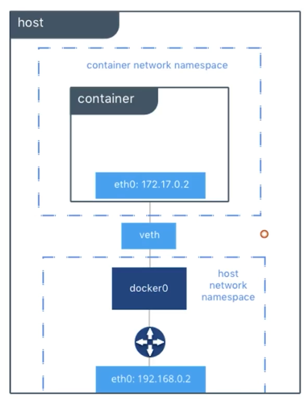


```bash
# docker run -d --privileged -p 8088:80 httpdcentos /sbin/init
31ff339b9356f4452f377e4b34d67ff95219fa46910d6e9b309fdc89e6118f32
# docker ps
CONTAINER ID   IMAGE         COMMAND        CREATED        STATUS              PORTS                                   NAMES
31ff339b9356   httpdcentos   "/sbin/init"   34 hours ago   Up About a minute   0.0.0.0:8088->80/tcp, :::8088->80/tcp   bold_bouman

# ip a
1: lo: <LOOPBACK,UP,LOWER_UP> mtu 65536 qdisc noqueue state UNKNOWN group default qlen 1000
    link/loopback 00:00:00:00:00:00 brd 00:00:00:00:00:00
    inet 127.0.0.1/8 scope host lo
       valid_lft forever preferred_lft forever
    inet6 ::1/128 scope host 
       valid_lft forever preferred_lft forever
2: ens160: <BROADCAST,MULTICAST,UP,LOWER_UP> mtu 1500 qdisc fq_codel state UP group default qlen 1000
    link/ether 00:0c:29:b6:9b:17 brd ff:ff:ff:ff:ff:ff
    altname enp3s0
    inet 192.168.1.240/24 brd 192.168.1.255 scope global noprefixroute ens160
       valid_lft forever preferred_lft forever
3: docker0: <BROADCAST,MULTICAST,UP,LOWER_UP> mtu 1500 qdisc noqueue state UP group default 
    link/ether 02:42:96:88:d3:21 brd ff:ff:ff:ff:ff:ff
    inet 172.17.0.1/16 brd 172.17.255.255 scope global docker0
       valid_lft forever preferred_lft forever
    inet6 fe80::42:96ff:fe88:d321/64 scope link 
       valid_lft forever preferred_lft forever
128: vethf44d9fa@if127: <BROADCAST,MULTICAST,UP,LOWER_UP> mtu 1500 qdisc noqueue master docker0 state UP group default 
    link/ether 5a:86:a3:9f:ed:2e brd ff:ff:ff:ff:ff:ff link-netnsid 0
    inet6 fe80::5886:a3ff:fe9f:ed2e/64 scope link 
       valid_lft forever preferred_lft forever

# docker exec -it bold_bouman  /bin/bash
[root@31ff339b9356 /]# ip a
1: lo: <LOOPBACK,UP,LOWER_UP> mtu 65536 qdisc noqueue state UNKNOWN group default qlen 1000
    link/loopback 00:00:00:00:00:00 brd 00:00:00:00:00:00
    inet 127.0.0.1/8 scope host lo
       valid_lft forever preferred_lft forever
127: eth0@if128: <BROADCAST,MULTICAST,UP,LOWER_UP> mtu 1500 qdisc noqueue state UP group default 
    link/ether 02:42:ac:11:00:02 brd ff:ff:ff:ff:ff:ff link-netnsid 0
    inet 172.17.0.2/16 brd 172.17.255.255 scope global eth0
       valid_lft forever preferred_lft forever
       
# docker network inspect bridge
[
    {
        "Name": "bridge",
        "Id": "6236b3d380dcd135aec85b1be1c033b2bf08bcd9b140b61009a6c317eb79d469",
        "Created": "2022-12-16T14:53:31.345859172+08:00",
        "Scope": "local",
        "Driver": "bridge",
        "EnableIPv6": false,
        "IPAM": {
            "Driver": "default",
            "Options": null,
            "Config": [
                {
                    "Subnet": "172.17.0.0/16",
                    "Gateway": "172.17.0.1"
                }
            ]
        },
        "Internal": false,
        "Attachable": false,
        "Ingress": false,
        "ConfigFrom": {
            "Network": ""
        },
        "ConfigOnly": false,
        "Containers": {
            "31ff339b9356f4452f377e4b34d67ff95219fa46910d6e9b309fdc89e6118f32": {
                "Name": "bold_bouman",
                "EndpointID": "9cc65c90c85e96c4b0ae91b6476f291413d2a5a0835638111bc18f3501b0d2c9",
                "MacAddress": "02:42:ac:11:00:02",
                "IPv4Address": "172.17.0.2/16",
                "IPv6Address": ""
            }
        },
        "Options": {
            "com.docker.network.bridge.default_bridge": "true",
            "com.docker.network.bridge.enable_icc": "true",
            "com.docker.network.bridge.enable_ip_masquerade": "true",
            "com.docker.network.bridge.host_binding_ipv4": "0.0.0.0",
            "com.docker.network.bridge.name": "docker0",
            "com.docker.network.driver.mtu": "1500"
        },
        "Labels": {}
    }
]


# docker inspect bold_bouman |grep -A 15 Networks
            "Networks": {
                "bridge": {
                    "IPAMConfig": null,
                    "Links": null,
                    "Aliases": null,
                    "NetworkID": "6236b3d380dcd135aec85b1be1c033b2bf08bcd9b140b61009a6c317eb79d469",
                    "EndpointID": "9cc65c90c85e96c4b0ae91b6476f291413d2a5a0835638111bc18f3501b0d2c9",
                    "Gateway": "172.17.0.1",
                    "IPAddress": "172.17.0.2",
                    "IPPrefixLen": 16,
                    "IPv6Gateway": "",
                    "GlobalIPv6Address": "",
                    "GlobalIPv6PrefixLen": 0,
                    "MacAddress": "02:42:ac:11:00:02",
                    "DriverOpts": null
                }
                
docker run 第二个容器：
# docker run -d -p 8092:80 nginx
ad90470fa726dff4b09e53bd6d6a77af5d6314abdc67aab2060d15479bf2d14f
# docker ps
CONTAINER ID   IMAGE         COMMAND                  CREATED         STATUS         PORTS                                   NAMES
ad90470fa726   nginx         "/docker-entrypoint.…"   4 seconds ago   Up 2 seconds   0.0.0.0:8092->80/tcp, :::8092->80/tcp   sleepy_bhaskara
31ff339b9356   httpdcentos   "/sbin/init"             34 hours ago    Up 7 minutes   0.0.0.0:8088->80/tcp, :::8088->80/tcp   bold_bouman

# ip a
1: lo: <LOOPBACK,UP,LOWER_UP> mtu 65536 qdisc noqueue state UNKNOWN group default qlen 1000
    link/loopback 00:00:00:00:00:00 brd 00:00:00:00:00:00
    inet 127.0.0.1/8 scope host lo
       valid_lft forever preferred_lft forever
    inet6 ::1/128 scope host 
       valid_lft forever preferred_lft forever
2: ens160: <BROADCAST,MULTICAST,UP,LOWER_UP> mtu 1500 qdisc fq_codel state UP group default qlen 1000
    link/ether 00:0c:29:b6:9b:17 brd ff:ff:ff:ff:ff:ff
    altname enp3s0
    inet 192.168.1.240/24 brd 192.168.1.255 scope global noprefixroute ens160
       valid_lft forever preferred_lft forever
3: docker0: <BROADCAST,MULTICAST,UP,LOWER_UP> mtu 1500 qdisc noqueue state UP group default 
    link/ether 02:42:96:88:d3:21 brd ff:ff:ff:ff:ff:ff
    inet 172.17.0.1/16 brd 172.17.255.255 scope global docker0
       valid_lft forever preferred_lft forever
    inet6 fe80::42:96ff:fe88:d321/64 scope link 
       valid_lft forever preferred_lft forever
128: vethf44d9fa@if127: <BROADCAST,MULTICAST,UP,LOWER_UP> mtu 1500 qdisc noqueue master docker0 state UP group default 
    link/ether 5a:86:a3:9f:ed:2e brd ff:ff:ff:ff:ff:ff link-netnsid 0
    inet6 fe80::5886:a3ff:fe9f:ed2e/64 scope link 
       valid_lft forever preferred_lft forever
130: vethf942135@if129: <BROADCAST,MULTICAST,UP,LOWER_UP> mtu 1500 qdisc noqueue master docker0 state UP group default 
    link/ether b2:1e:41:62:1a:01 brd ff:ff:ff:ff:ff:ff link-netnsid 1
    inet6 fe80::b01e:41ff:fe62:1a01/64 scope link 
       valid_lft forever preferred_lft forever

# route -n
Kernel IP routing table
Destination     Gateway         Genmask         Flags Metric Ref    Use Iface
0.0.0.0         192.168.1.1     0.0.0.0         UG    100    0        0 ens160
169.254.0.0     0.0.0.0         255.255.0.0     U     1000   0        0 ens160
172.17.0.0      0.0.0.0         255.255.0.0     U     0      0        0 docker0
192.168.1.0     0.0.0.0         255.255.255.0   U     100    0        0 ens160

# docker inspect sleepy_bhaskara |grep -A 15 Networks
            "Networks": {
                "bridge": {
                    "IPAMConfig": null,
                    "Links": null,
                    "Aliases": null,
                    "NetworkID": "6236b3d380dcd135aec85b1be1c033b2bf08bcd9b140b61009a6c317eb79d469",
                    "EndpointID": "34c2bf3ac825b9012ebe54df24734bf5684caab361baa9f168e21e7daa8c5c4f",
                    "Gateway": "172.17.0.1",
                    "IPAddress": "172.17.0.3",
                    "IPPrefixLen": 16,
                    "IPv6Gateway": "",
                    "GlobalIPv6Address": "",
                    "GlobalIPv6PrefixLen": 0,
                    "MacAddress": "02:42:ac:11:00:03",
                    "DriverOpts": null
                }
# docker network inspect bridge
[
    {
        "Name": "bridge",
        "Id": "6236b3d380dcd135aec85b1be1c033b2bf08bcd9b140b61009a6c317eb79d469",
        "Created": "2022-12-16T14:53:31.345859172+08:00",
        "Scope": "local",
        "Driver": "bridge",
        "EnableIPv6": false,
        "IPAM": {
            "Driver": "default",
            "Options": null,
            "Config": [
                {
                    "Subnet": "172.17.0.0/16",
                    "Gateway": "172.17.0.1"
                }
            ]
        },
        "Internal": false,
        "Attachable": false,
        "Ingress": false,
        "ConfigFrom": {
            "Network": ""
        },
        "ConfigOnly": false,
        "Containers": {
            "31ff339b9356f4452f377e4b34d67ff95219fa46910d6e9b309fdc89e6118f32": {
                "Name": "bold_bouman",
                "EndpointID": "9cc65c90c85e96c4b0ae91b6476f291413d2a5a0835638111bc18f3501b0d2c9",
                "MacAddress": "02:42:ac:11:00:02",
                "IPv4Address": "172.17.0.2/16",
                "IPv6Address": ""
            },
            "ad90470fa726dff4b09e53bd6d6a77af5d6314abdc67aab2060d15479bf2d14f": {
                "Name": "sleepy_bhaskara",
                "EndpointID": "34c2bf3ac825b9012ebe54df24734bf5684caab361baa9f168e21e7daa8c5c4f",
                "MacAddress": "02:42:ac:11:00:03",
                "IPv4Address": "172.17.0.3/16",
                "IPv6Address": ""
            }
        },
        "Options": {
            "com.docker.network.bridge.default_bridge": "true",
            "com.docker.network.bridge.enable_icc": "true",
            "com.docker.network.bridge.enable_ip_masquerade": "true",
            "com.docker.network.bridge.host_binding_ipv4": "0.0.0.0",
            "com.docker.network.bridge.name": "docker0",
            "com.docker.network.driver.mtu": "1500"
        },
        "Labels": {}
    }
]
```

###### 3.1.3.1.user-defined Bridge网络
```
用户可按需创建bridge网桥，成为user-defined bridge
```


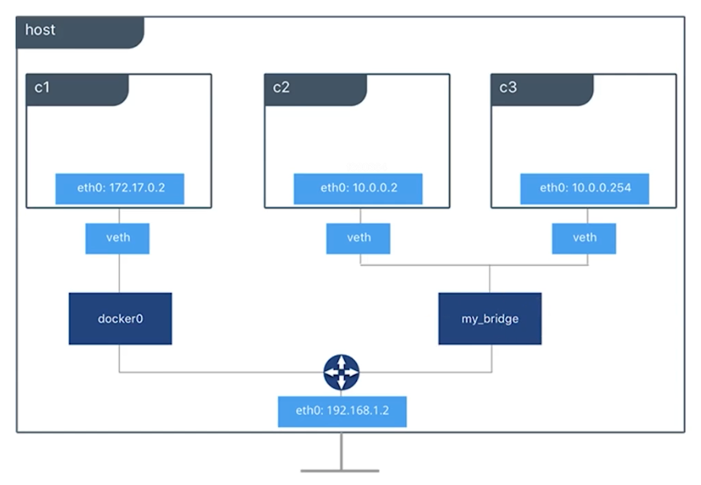


```bash
创建第一个网桥：
# docker network create --driver bridge net1
8a47db528c58e1c2ec3f299030e8d4dbf5658ebdad33d199533ff32c5202a9c5
# docker network ls
NETWORK ID     NAME      DRIVER    SCOPE
6236b3d380dc   bridge    bridge    local
4d726e7f4251   host      host      local
8a47db528c58   net1      bridge    local
b138d0f41e9b   none      null      local

# docker network inspect net1
[
    {
        "Name": "net1",
        "Id": "8a47db528c58e1c2ec3f299030e8d4dbf5658ebdad33d199533ff32c5202a9c5",
        "Created": "2023-02-06T21:52:30.419641306+08:00",
        "Scope": "local",
        "Driver": "bridge",
        "EnableIPv6": false,
        "IPAM": {
            "Driver": "default",
            "Options": {},
            "Config": [
                {
                    "Subnet": "172.19.0.0/16",
                    "Gateway": "172.19.0.1"
                }
            ]
        },
        "Internal": false,
        "Attachable": false,
        "Ingress": false,
        "ConfigFrom": {
            "Network": ""
        },
        "ConfigOnly": false,
        "Containers": {},
        "Options": {},
        "Labels": {}
    }
]

创建第二个网桥：
# docker network create --driver=bridge --subnet=172.20.0.0/24 --gateway=172.20.0.1 net2
b8087febf61e639f27fd9cf5fb57c8c583f991bc84e39c38243ed058f8496e25
# docker network ls
NETWORK ID     NAME      DRIVER    SCOPE
6236b3d380dc   bridge    bridge    local
4d726e7f4251   host      host      local
8a47db528c58   net1      bridge    local
b8087febf61e   net2      bridge    local
b138d0f41e9b   none      null      local

# docker inspect net2
[
    {
        "Name": "net2",
        "Id": "b8087febf61e639f27fd9cf5fb57c8c583f991bc84e39c38243ed058f8496e25",
        "Created": "2023-02-06T21:58:16.432573175+08:00",
        "Scope": "local",
        "Driver": "bridge",
        "EnableIPv6": false,
        "IPAM": {
            "Driver": "default",
            "Options": {},
            "Config": [
                {
                    "Subnet": "172.20.0.0/24",
                    "Gateway": "172.20.0.1"
                }
            ]
        },
        "Internal": false,
        "Attachable": false,
        "Ingress": false,
        "ConfigFrom": {
            "Network": ""
        },
        "ConfigOnly": false,
        "Containers": {},
        "Options": {},
        "Labels": {}
    }
]


启动3个centos容器，分别命名为c1、c2、c3
其中c1加入到net1，c2加入到net2，c3加入net2并配置静态IP

# docker ps
CONTAINER ID   IMAGE     COMMAND   CREATED   STATUS    PORTS     NAMES

# docker run -itd --network=net1 --name=c1 centos
496d4ddad025a9c624a5cc5741e944cfb3cb3441cbe4115a1c1689b593b64fe4

# docker run -itd --network=net2 --name=c2 centos
f4dc0cf34db6ffeb9b4ea8fa5a9bfc4934d265ac587b0156ba019cc09323f927

# docker run -itd --network=net2 --name=c3 --ip=172.20.0.100 centos
94e0bc6720f311d9bfbfb7ec63dbd08847b516bb3cd4d5fcd97d0ca3451602fc

# docker ps
CONTAINER ID   IMAGE     COMMAND       CREATED              STATUS              PORTS     NAMES
94e0bc6720f3   centos    "/bin/bash"   48 seconds ago       Up 46 seconds                 c3
f4dc0cf34db6   centos    "/bin/bash"   About a minute ago   Up About a minute             c2
496d4ddad025   centos    "/bin/bash"   About a minute ago   Up About a minute             c1

# ip a
1: lo: <LOOPBACK,UP,LOWER_UP> mtu 65536 qdisc noqueue state UNKNOWN group default qlen 1000
    link/loopback 00:00:00:00:00:00 brd 00:00:00:00:00:00
    inet 127.0.0.1/8 scope host lo
       valid_lft forever preferred_lft forever
    inet6 ::1/128 scope host 
       valid_lft forever preferred_lft forever
2: ens160: <BROADCAST,MULTICAST,UP,LOWER_UP> mtu 1500 qdisc fq_codel state UP group default qlen 1000
    link/ether 00:0c:29:b6:9b:17 brd ff:ff:ff:ff:ff:ff
    altname enp3s0
    inet 192.168.1.240/24 brd 192.168.1.255 scope global noprefixroute ens160
       valid_lft forever preferred_lft forever
3: docker0: <NO-CARRIER,BROADCAST,MULTICAST,UP> mtu 1500 qdisc noqueue state DOWN group default 
    link/ether 02:42:96:88:d3:21 brd ff:ff:ff:ff:ff:ff
    inet 172.17.0.1/16 brd 172.17.255.255 scope global docker0
       valid_lft forever preferred_lft forever
    inet6 fe80::42:96ff:fe88:d321/64 scope link 
       valid_lft forever preferred_lft forever
131: br-8a47db528c58: <BROADCAST,MULTICAST,UP,LOWER_UP> mtu 1500 qdisc noqueue state UP group default 
    link/ether 02:42:8e:76:7a:26 brd ff:ff:ff:ff:ff:ff
    inet 172.19.0.1/16 brd 172.19.255.255 scope global br-8a47db528c58
       valid_lft forever preferred_lft forever
    inet6 fe80::42:8eff:fe76:7a26/64 scope link 
       valid_lft forever preferred_lft forever
132: br-b8087febf61e: <BROADCAST,MULTICAST,UP,LOWER_UP> mtu 1500 qdisc noqueue state UP group default 
    link/ether 02:42:cc:85:2d:2f brd ff:ff:ff:ff:ff:ff
    inet 172.20.0.1/24 brd 172.20.0.255 scope global br-b8087febf61e
       valid_lft forever preferred_lft forever
    inet6 fe80::42:ccff:fe85:2d2f/64 scope link 
       valid_lft forever preferred_lft forever
140: vethf6fae61@if139: <BROADCAST,MULTICAST,UP,LOWER_UP> mtu 1500 qdisc noqueue master br-8a47db528c58 state UP group default 
    link/ether 8a:8c:16:32:67:66 brd ff:ff:ff:ff:ff:ff link-netnsid 0
    inet6 fe80::888c:16ff:fe32:6766/64 scope link 
       valid_lft forever preferred_lft forever
142: vethb90b0d4@if141: <BROADCAST,MULTICAST,UP,LOWER_UP> mtu 1500 qdisc noqueue master br-b8087febf61e state UP group default 
    link/ether d6:ab:98:43:2c:8b brd ff:ff:ff:ff:ff:ff link-netnsid 1
    inet6 fe80::d4ab:98ff:fe43:2c8b/64 scope link 
       valid_lft forever preferred_lft forever
144: veth6461145@if143: <BROADCAST,MULTICAST,UP,LOWER_UP> mtu 1500 qdisc noqueue master br-b8087febf61e state UP group default 
    link/ether ba:6c:88:2f:4b:b5 brd ff:ff:ff:ff:ff:ff link-netnsid 2
    inet6 fe80::b86c:88ff:fe2f:4bb5/64 scope link 
       valid_lft forever preferred_lft forever

# docker ps
CONTAINER ID   IMAGE     COMMAND       CREATED          STATUS          PORTS     NAMES
94e0bc6720f3   centos    "/bin/bash"   37 minutes ago   Up 37 minutes             c3
f4dc0cf34db6   centos    "/bin/bash"   38 minutes ago   Up 38 minutes             c2
496d4ddad025   centos    "/bin/bash"   38 minutes ago   Up 38 minutes             c1

查看容器IP地址：
# docker inspect c1 |grep -A 15 Networks
            "Networks": {
                "net1": {
                    "IPAMConfig": null,
                    "Links": null,
                    "Aliases": [
                        "496d4ddad025"
                    ],
                    "NetworkID": "8a47db528c58e1c2ec3f299030e8d4dbf5658ebdad33d199533ff32c5202a9c5",
                    "EndpointID": "61d79767658364f19da6591f339b2180ab07653472b90837ed6c215fc0ecb371",
                    "Gateway": "172.19.0.1",
                    "IPAddress": "172.19.0.2",
                    "IPPrefixLen": 16,
                    "IPv6Gateway": "",
                    "GlobalIPv6Address": "",
                    "GlobalIPv6PrefixLen": 0,
                    "MacAddress": "02:42:ac:13:00:02",
# docker inspect c2 |grep -A 15 Networks
            "Networks": {
                "net2": {
                    "IPAMConfig": null,
                    "Links": null,
                    "Aliases": [
                        "f4dc0cf34db6"
                    ],
                    "NetworkID": "b8087febf61e639f27fd9cf5fb57c8c583f991bc84e39c38243ed058f8496e25",
                    "EndpointID": "d1b73acbbf484f6f7ec4a63b054ae74cc123b23ca6555f15990c8f161a7b8288",
                    "Gateway": "172.20.0.1",
                    "IPAddress": "172.20.0.2",
                    "IPPrefixLen": 24,
                    "IPv6Gateway": "",
                    "GlobalIPv6Address": "",
                    "GlobalIPv6PrefixLen": 0,
                    "MacAddress": "02:42:ac:14:00:02",
# docker inspect c3 |grep -A 15 Networks
            "Networks": {
                "net2": {
                    "IPAMConfig": {
                        "IPv4Address": "172.20.0.100"
                    },
                    "Links": null,
                    "Aliases": [
                        "94e0bc6720f3"
                    ],
                    "NetworkID": "b8087febf61e639f27fd9cf5fb57c8c583f991bc84e39c38243ed058f8496e25",
                    "EndpointID": "4ff7ab19f2dbc0682c0c8487be5e60b059ed2a31139d6de34ff904aa1f3554c3",
                    "Gateway": "172.20.0.1",
                    "IPAddress": "172.20.0.100",
                    "IPPrefixLen": 24,
                    "IPv6Gateway": "",
                    "GlobalIPv6Address": "",

容器的IP必须在子网范围内，不然会报错：
# docker run -itd --name=c4 --network=net2 --ip=172.21.0.101 centos
32f6fd999f2b96345d665d1a7b35d64d5b2a320b6279107aefe7bef0b4ff4866
docker: Error response from daemon: Invalid address 172.21.0.101: It does not belong to any of this network's subnets.

# docker ps -a|grep c4
32f6fd999f2b   centos        "/bin/bash"              About a minute ago   Created    c4 


# docker inspect c1 |grep -i ipaddress
            "SecondaryIPAddresses": null,
            "IPAddress": "",
                    "IPAddress": "172.19.0.2",
# docker inspect c2 |grep -i ipaddress
            "SecondaryIPAddresses": null,
            "IPAddress": "",
                    "IPAddress": "172.20.0.2",
# docker inspect c3 |grep -i ipaddress
            "SecondaryIPAddresses": null,
            "IPAddress": "",
                    "IPAddress": "172.20.0.100",

容器c2与c3在同一个子网，可以相互通信，与c1不在一个子网，不能相互通信
# docker exec -it c1 ping -c 3 172.20.0.2
PING 172.20.0.2 (172.20.0.2) 56(84) bytes of data.
^C
--- 172.20.0.2 ping statistics ---
3 packets transmitted, 0 received, 100% packet loss, time 2027ms

# docker exec -it c3 ping -c 3 172.20.0.2
PING 172.20.0.2 (172.20.0.2) 56(84) bytes of data.
64 bytes from 172.20.0.2: icmp_seq=1 ttl=64 time=0.101 ms
64 bytes from 172.20.0.2: icmp_seq=2 ttl=64 time=0.072 ms
64 bytes from 172.20.0.2: icmp_seq=3 ttl=64 time=0.071 ms

--- 172.20.0.2 ping statistics ---
3 packets transmitted, 3 received, 0% packet loss, time 2037ms
rtt min/avg/max/mdev = 0.071/0.081/0.101/0.015 ms
# docker exec -it c2 ping -c 3 172.20.0.100
PING 172.20.0.100 (172.20.0.100) 56(84) bytes of data.
64 bytes from 172.20.0.100: icmp_seq=1 ttl=64 time=0.072 ms
64 bytes from 172.20.0.100: icmp_seq=2 ttl=64 time=0.103 ms
64 bytes from 172.20.0.100: icmp_seq=3 ttl=64 time=0.088 ms

--- 172.20.0.100 ping statistics ---
3 packets transmitted, 3 received, 0% packet loss, time 2055ms
rtt min/avg/max/mdev = 0.072/0.087/0.103/0.016 ms

# docker exec -it c2 ping -c3 172.19.0.2
PING 172.19.0.2 (172.19.0.2) 56(84) bytes of data.
^C
--- 172.19.0.2 ping statistics ---
3 packets transmitted, 0 received, 100% packet loss, time 2025ms

想要c1与c2或c3相互通信，可以为c1添加一块网卡，加入到net2网络
# docker network connect net2 c1

# ip a
1: lo: <LOOPBACK,UP,LOWER_UP> mtu 65536 qdisc noqueue state UNKNOWN group default qlen 1000
    link/loopback 00:00:00:00:00:00 brd 00:00:00:00:00:00
    inet 127.0.0.1/8 scope host lo
       valid_lft forever preferred_lft forever
    inet6 ::1/128 scope host 
       valid_lft forever preferred_lft forever
2: ens160: <BROADCAST,MULTICAST,UP,LOWER_UP> mtu 1500 qdisc fq_codel state UP group default qlen 1000
    link/ether 00:0c:29:b6:9b:17 brd ff:ff:ff:ff:ff:ff
    altname enp3s0
    inet 192.168.1.240/24 brd 192.168.1.255 scope global noprefixroute ens160
       valid_lft forever preferred_lft forever
3: docker0: <NO-CARRIER,BROADCAST,MULTICAST,UP> mtu 1500 qdisc noqueue state DOWN group default 
    link/ether 02:42:96:88:d3:21 brd ff:ff:ff:ff:ff:ff
    inet 172.17.0.1/16 brd 172.17.255.255 scope global docker0
       valid_lft forever preferred_lft forever
    inet6 fe80::42:96ff:fe88:d321/64 scope link 
       valid_lft forever preferred_lft forever
131: br-8a47db528c58: <BROADCAST,MULTICAST,UP,LOWER_UP> mtu 1500 qdisc noqueue state UP group default 
    link/ether 02:42:8e:76:7a:26 brd ff:ff:ff:ff:ff:ff
    inet 172.19.0.1/16 brd 172.19.255.255 scope global br-8a47db528c58
       valid_lft forever preferred_lft forever
    inet6 fe80::42:8eff:fe76:7a26/64 scope link 
       valid_lft forever preferred_lft forever
132: br-b8087febf61e: <BROADCAST,MULTICAST,UP,LOWER_UP> mtu 1500 qdisc noqueue state UP group default 
    link/ether 02:42:cc:85:2d:2f brd ff:ff:ff:ff:ff:ff
    inet 172.20.0.1/24 brd 172.20.0.255 scope global br-b8087febf61e
       valid_lft forever preferred_lft forever
    inet6 fe80::42:ccff:fe85:2d2f/64 scope link 
       valid_lft forever preferred_lft forever
140: vethf6fae61@if139: <BROADCAST,MULTICAST,UP,LOWER_UP> mtu 1500 qdisc noqueue master br-8a47db528c58 state UP group default 
    link/ether 8a:8c:16:32:67:66 brd ff:ff:ff:ff:ff:ff link-netnsid 0
    inet6 fe80::888c:16ff:fe32:6766/64 scope link 
       valid_lft forever preferred_lft forever
142: vethb90b0d4@if141: <BROADCAST,MULTICAST,UP,LOWER_UP> mtu 1500 qdisc noqueue master br-b8087febf61e state UP group default 
    link/ether d6:ab:98:43:2c:8b brd ff:ff:ff:ff:ff:ff link-netnsid 1
    inet6 fe80::d4ab:98ff:fe43:2c8b/64 scope link 
       valid_lft forever preferred_lft forever
144: veth6461145@if143: <BROADCAST,MULTICAST,UP,LOWER_UP> mtu 1500 qdisc noqueue master br-b8087febf61e state UP group default 
    link/ether ba:6c:88:2f:4b:b5 brd ff:ff:ff:ff:ff:ff link-netnsid 2
    inet6 fe80::b86c:88ff:fe2f:4bb5/64 scope link 
       valid_lft forever preferred_lft forever
146: veth7a1ad65@if145: <BROADCAST,MULTICAST,UP,LOWER_UP> mtu 1500 qdisc noqueue master br-b8087febf61e state UP group default 
    link/ether ba:f0:06:a8:e6:14 brd ff:ff:ff:ff:ff:ff link-netnsid 0
    inet6 fe80::b8f0:6ff:fea8:e614/64 scope link 
       valid_lft forever preferred_lft forever

# docker inspect c1|grep -i ipaddr
            "SecondaryIPAddresses": null,
            "IPAddress": "",
                    "IPAddress": "172.19.0.2",
                    "IPAddress": "172.20.0.3",
# docker inspect c2|grep -i ipaddr
            "SecondaryIPAddresses": null,
            "IPAddress": "",
                    "IPAddress": "172.20.0.2",
# docker inspect c3|grep -i ipaddr
            "SecondaryIPAddresses": null,
            "IPAddress": "",
                    "IPAddress": "172.20.0.100",
                    
# docker exec -it c1 ping -c 2 172.20.0.2
PING 172.20.0.2 (172.20.0.2) 56(84) bytes of data.
64 bytes from 172.20.0.2: icmp_seq=1 ttl=64 time=0.135 ms
64 bytes from 172.20.0.2: icmp_seq=2 ttl=64 time=0.078 ms

--- 172.20.0.2 ping statistics ---
2 packets transmitted, 2 received, 0% packet loss, time 1002ms
rtt min/avg/max/mdev = 0.078/0.106/0.135/0.030 ms
# docker exec -it c1 ping -c 2 172.20.0.100
PING 172.20.0.100 (172.20.0.100) 56(84) bytes of data.
64 bytes from 172.20.0.100: icmp_seq=1 ttl=64 time=0.128 ms
64 bytes from 172.20.0.100: icmp_seq=2 ttl=64 time=0.080 ms

--- 172.20.0.100 ping statistics ---
2 packets transmitted, 2 received, 0% packet loss, time 1003ms
rtt min/avg/max/mdev = 0.080/0.104/0.128/0.024 ms
# docker exec -it c2 ping -c 2 172.20.0.3
PING 172.20.0.3 (172.20.0.3) 56(84) bytes of data.
64 bytes from 172.20.0.3: icmp_seq=1 ttl=64 time=0.097 ms
64 bytes from 172.20.0.3: icmp_seq=2 ttl=64 time=0.075 ms

--- 172.20.0.3 ping statistics ---
2 packets transmitted, 2 received, 0% packet loss, time 1016ms
rtt min/avg/max/mdev = 0.075/0.086/0.097/0.011 ms
# docker exec -it c3 ping -c 2 172.20.0.3
PING 172.20.0.3 (172.20.0.3) 56(84) bytes of data.
64 bytes from 172.20.0.3: icmp_seq=1 ttl=64 time=0.077 ms
64 bytes from 172.20.0.3: icmp_seq=2 ttl=64 time=0.087 ms

--- 172.20.0.3 ping statistics ---
2 packets transmitted, 2 received, 0% packet loss, time 1019ms
rtt min/avg/max/mdev = 0.077/0.082/0.087/0.005 ms

# docker exec -it c1 /bin/bash
[root@496d4ddad025 /]# ip a
1: lo: <LOOPBACK,UP,LOWER_UP> mtu 65536 qdisc noqueue state UNKNOWN group default qlen 1000
    link/loopback 00:00:00:00:00:00 brd 00:00:00:00:00:00
    inet 127.0.0.1/8 scope host lo
       valid_lft forever preferred_lft forever
155: eth0@if156: <BROADCAST,MULTICAST,UP,LOWER_UP> mtu 1500 qdisc noqueue state UP group default 
    link/ether 02:42:ac:13:00:02 brd ff:ff:ff:ff:ff:ff link-netnsid 0
    inet 172.19.0.2/16 brd 172.19.255.255 scope global eth0
       valid_lft forever preferred_lft forever
163: eth1@if164: <BROADCAST,MULTICAST,UP,LOWER_UP> mtu 1500 qdisc noqueue state UP group default 
    link/ether 02:42:ac:14:00:03 brd ff:ff:ff:ff:ff:ff link-netnsid 0
    inet 172.20.0.3/24 brd 172.20.0.255 scope global eth`
       valid_lft forever preferred_lft forever

# docker network disconnect net2 c1

# docker inspect c1|grep -i ipaddr
            "SecondaryIPAddresses": null,
            "IPAddress": "",
                    "IPAddress": "172.19.0.2",
```

### 3.容器存储

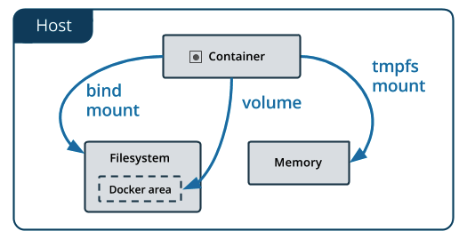


官方说明：

```bash
`Volumes` are stored in a part of the host filesystem which is managed by Docker (`/var/lib/docker/volumes/` on Linux). Non-Docker processes should not modify this part of the filesystem. Volumes are the best way to persist data in Docker.
docker run -v containerDir

`Bind mounts` may be stored anywhere on the host system. They may even be important system files or directories. Non-Docker processes on the Docker host or a Docker container can modify them at any time.
docker run -v hostDir:containerDir

`tmpfs` mounts are stored in the host system’s memory only, and are never written to the host system’s filesystem.
```


```bash
# man docker run

-v|--volume[=[[HOST-DIR:]CONTAINER-DIR[:OPTIONS]]]
          Create a bind mount. If you specify, -v /HOST-DIR:/CONTAINER-DIR, Docker
          bind mounts /HOST-DIR in the host to /CONTAINER-DIR in the Docker
          container. If 'HOST-DIR' is omitted,  Docker automatically creates the new
          volume on the host.  The OPTIONS are a comma delimited list and can be:

              • [rw|ro]

              • [z|Z]

              • [[r]shared|[r]slave|[r]private]

              • [delegated|cached|consistent]

              • [nocopy]

       The  CONTAINER-DIR  must be an absolute path such as /src/docs. The HOST-DIR can be an absolute
       path or a name value.
       
--volumes-from=[]
          Mount volumes from the specified container(s)
```

#### 3.1.持久存储之volume

测试volume：

```bash
# docker volume ls
DRIVER    VOLUME NAME

# docker run -d -p 8094:80 -v /usr/local/apache2/htdocs httpd
Unable to find image 'httpd:latest' locally
latest: Pulling from library/httpd
a2abf6c4d29d: Already exists 
dcc4698797c8: Pull complete 
41c22baa66ec: Pull complete 
67283bbdd4a0: Pull complete 
d982c879c57e: Pull complete 
Digest: sha256:0954cc1af252d824860b2c5dc0a10720af2b7a3d3435581ca788dff8480c7b32
Status: Downloaded newer image for httpd:latest
47bd9ceb4d9a11a880bb656035b9d823d9d1dbedbe5aeebe32ddcba5cd3fb32f

# docker volume inspect b5a51f86f4a32517d6d3cf491770fce8ac920fe2c89b063d00debbce07792411
[
    {
        "CreatedAt": "2023-02-07T10:21:32+08:00",
        "Driver": "local",
        "Labels": null,
        "Mountpoint": "/var/lib/docker/volumes/b5a51f86f4a32517d6d3cf491770fce8ac920fe2c89b063d00debbce07792411/_data",
        "Name": "b5a51f86f4a32517d6d3cf491770fce8ac920fe2c89b063d00debbce07792411",
        "Options": null,
        "Scope": "local"
    }
]

# docker ps
CONTAINER ID   IMAGE     COMMAND              CREATED         STATUS         PORTS                                   NAMES
47bd9ceb4d9a   httpd     "httpd-foreground"   7 seconds ago   Up 6 seconds   0.0.0.0:8094->80/tcp, :::8094->80/tcp   amazing_volhard

# docker volume ls
DRIVER    VOLUME NAME
local     b5a51f86f4a32517d6d3cf491770fce8ac920fe2c89b063d00debbce07792411

# docker inspect amazing_volhard |grep -A 8 Mounts
        "Mounts": [
            {
                "Type": "volume",
                "Name": "b5a51f86f4a32517d6d3cf491770fce8ac920fe2c89b063d00debbce07792411",
                "Source": "/var/lib/docker/volumes/b5a51f86f4a32517d6d3cf491770fce8ac920fe2c89b063d00debbce07792411/_data",
                "Destination": "/usr/local/apache2/htdocs",
                "Driver": "local",
                "Mode": "",
                "RW": true,

# cd /var/lib/docker/volumes/b5a51f86f4a32517d6d3cf491770fce8ac920fe2c89b063d00debbce07792411/_data

# ls
index.html

# cat index.html 
<html><body><h1>It works!</h1></body></html>

# curl localhost:8094
<html><body><h1>It works!</h1></body></html>

# echo haha > /var/lib/docker/volumes/b5a51f86f4a32517d6d3cf491770fce8ac920fe2c89b063d00debbce07792411/_data/index.html 

# curl localhost:8094
haha

# docker ps
CONTAINER ID   IMAGE     COMMAND              CREATED       STATUS       PORTS                                   NAMES
47bd9ceb4d9a   httpd     "httpd-foreground"   9 hours ago   Up 9 hours   0.0.0.0:8094->80/tcp, :::8094->80/tcp   amazing_volhard

# docker stop amazing_volhard 
amazing_volhard
# docker rm amazing_volhard 
amazing_volhard

# docker volume ls
DRIVER    VOLUME NAME
local     b5a51f86f4a32517d6d3cf491770fce8ac920fe2c89b063d00debbce07792411

# cat /var/lib/docker/volumes/b5a51f86f4a32517d6d3cf491770fce8ac920fe2c89b063d00debbce07792411/_data/index.html 
haha

# docker volume ls
DRIVER    VOLUME NAME
local     b5a51f86f4a32517d6d3cf491770fce8ac920fe2c89b063d00debbce07792411

# docker volume rm b5a51f86f4a32517d6d3cf491770fce8ac920fe2c89b063d00debbce07792411 
b5a51f86f4a32517d6d3cf491770fce8ac920fe2c89b063d00debbce07792411

# docker volume ls
DRIVER    VOLUME NAME

还可以指定volume的名称：
# docker run -d -p 8097:80 -v httpdvol:/usr/local/apache2/htdocs --name httpvol httpd
ad449fa1f1072f7e9c10cf0c0a89e93c9c26da2e393edd480596bbec1251b0ae

# docker ps
CONTAINER ID   IMAGE     COMMAND              CREATED         STATUS        PORTS                                   NAMES
ad449fa1f107   httpd     "httpd-foreground"   2 seconds ago   Up 1 second   0.0.0.0:8097->80/tcp, :::8097->80/tcp   httpvol

# docker volume ls
DRIVER    VOLUME NAME
local     httpdvol

# docker inspect httpvol |grep -A 8 Mounts
        "Mounts": [
            {
                "Type": "volume",
                "Name": "httpdvol",
                "Source": "/var/lib/docker/volumes/httpdvol/_data",
                "Destination": "/usr/local/apache2/htdocs",
                "Driver": "local",
                "Mode": "z",
                "RW": true,
```


#### 3.2.持久存储之bind mount

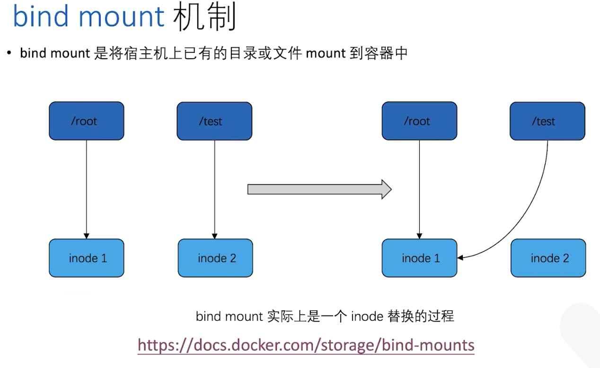


```bash
创建宿主机上要被挂载的目录和文件，也可以不创建，在docker run -v时，宿主机目录会被自动创建
# mkdir /root/htdocs
# echo hehe > /root/htdocs/index.html

# docker run -d -p 8095:80 -v /root/htdocs:/usr/local/apache2/htdocs httpd
98cb0b6c8d5acbc165423cdb9c67ba3269a6cb0ef1c8399fd84792d7b1d9dd45

# docker ps
CONTAINER ID   IMAGE     COMMAND              CREATED         STATUS         PORTS                                   NAMES
98cb0b6c8d5a   httpd     "httpd-foreground"   3 seconds ago   Up 2 seconds   0.0.0.0:8095->80/tcp, :::8095->80/tcp   peaceful_feynman

# docker volume ls
DRIVER    VOLUME NAME
local     2e79e8bbb087c8e1ca452b1a520c6b5d0113956000ce8c5c1ea25abf815ec953
local     8e3af73bed3661847a904a0022b621d748be628beae34a796ba230eb5275c4b4
local     9470255d89b8455f700907f934e40c3e76794f0f7d0a66490c38805e127f73e0
local     1715027545ac6842754f4c5911a9125e97d9bf80645062d509587373e125c327
local     a432c7e7cf5c739682be27442ec9246b34938e44e5a48294ee4b33ccc7eb4acb
local     ae8cf42eade17a00309e6039ed68b9e1e7b51d118cc759276896229a56b4d994
local     c22a51e19a433475ea9f149b604a7450e81b1ed890aa3f05e04d134247c80e73
local     d1b3e04182dd1953cf5ef024dc6af3a52726bb8f0d52f2280e5a450675dcea4d
local     d8699189b9b33c3221730ff230a3c1b33bdeeca34fc7f21e08800765c91215b2
local     de3b996f07dfaab734393b70847484b9eee2e4f9f669a1bc37ca8d45cdbbd69b

# docker inspect peaceful_feynman |grep -A 8 Mounts
        "Mounts": [
            {
                "Type": "bind",
                "Source": "/root/htdocs",
                "Destination": "/usr/local/apache2/htdocs",
                "Mode": "",
                "RW": true,
                "Propagation": "rprivate"
            }

# curl localhost:8095
hehe

# echo heihei > /root/htdocs/index.html 
# curl localhost:8095
heihei

# docker rm peaceful_feynman -f
peaceful_feynman
# docker ps
CONTAINER ID   IMAGE     COMMAND   CREATED   STATUS    PORTS     NAMES

# cat /root/htdocs/index.html 
heihei
```


#### 3.3.容器间数据共享之bind mount
##### 3.3.1.主机与容器间

```
主机与容器数据共享：
---volume：将Host上的数据copy到容器的volume中
           也可使用docker cp命令在容器和主机Host之间复制数据
---bind mount：将Host上的目录或文件mount到容器中
```


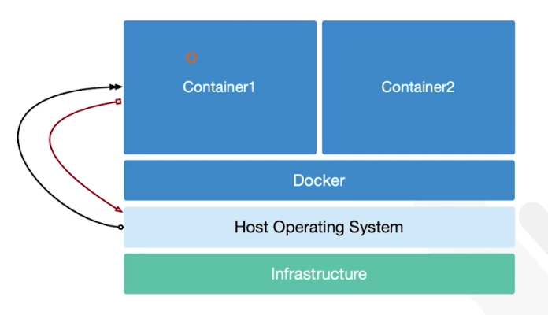


##### 3.3.2.容器与容器间

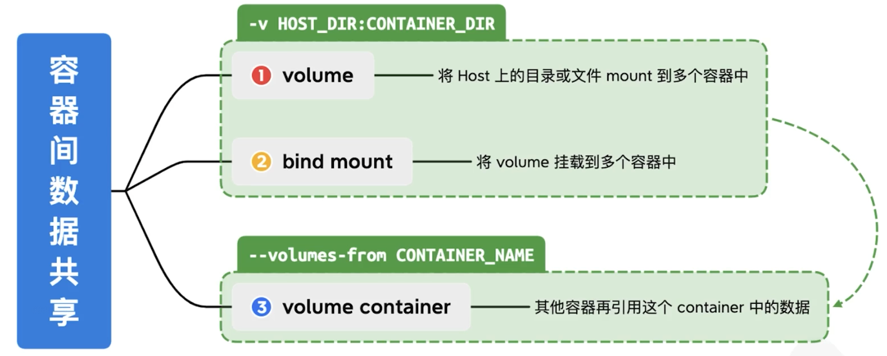


```bash
# docker run -d --name=h1 -p 8010:80 -v /root/htdocs:/usr/local/apache2/htdocs httpd 
eb790644f8d0c09eeee264d7666cd0a9ddd298fc9e87302a5bd7cd530fefccbd

# docker run -d --name=h2 -p 8011:80 -v /root/htdocs:/usr/local/apache2/htdocs httpd 
bc2edf6f056c34e9928cb7ebeade8e82f6bcc1aa074b690823574a63a78246d5

# docker ps
CONTAINER ID   IMAGE     COMMAND              CREATED          STATUS          PORTS                                   NAMES
bc2edf6f056c   httpd     "httpd-foreground"   3 seconds ago    Up 1 second     0.0.0.0:8011->80/tcp, :::8011->80/tcp   h2
eb790644f8d0   httpd     "httpd-foreground"   31 seconds ago   Up 29 seconds   0.0.0.0:8010->80/tcp, :::8010->80/tcp   h1

# cat /root/htdocs/index.html 
heihei

# curl localhost:8010
heihei
# curl localhost:8011
heihei

# echo new > /root/htdocs/index.html 

# curl localhost:8010
new
# curl localhost:8011
new
```


#### 3.4.容器间数据共享之volume container


```bash
# docker run -d --name vc -v /root/htdocs:/usr/local/apache2/htdocs httpdddbeb27b8a7d976f3e0d7e88f80f7a74a0509cb7860ec8fc42424503d6e8ad15
# docker ps
CONTAINER ID   IMAGE     COMMAND              CREATED         STATUS        PORTS     NAMES
ddbeb27b8a7d   httpd     "httpd-foreground"   2 seconds ago   Up 1 second   80/tcp    vc
# docker inspect vc|grep -A 8  Mounts
        "Mounts": [
            {
                "Type": "bind",
                "Source": "/root/htdocs",
                "Destination": "/usr/local/apache2/htdocs",
                "Mode": "",
                "RW": true,
                "Propagation": "rprivate"
            }

# docker run -d -p 8012:80 --volumes-from=vc --name h3 httpd
6cc18976bcd8f92a2c7c3b0b9d66a70cbf6a59f1671960f4ad80cdd6191c7dc5
# docker run -d -p 8013:80 --volumes-from=vc --name h4 httpd
d246e7b9c11307a003d50e5aaf4add140fe668b915d6667746774d3f0994b7ca
# docker ps
CONTAINER ID   IMAGE     COMMAND              CREATED              STATUS              PORTS                                   NAMES
d246e7b9c113   httpd     "httpd-foreground"   3 seconds ago        Up 1 second         0.0.0.0:8013->80/tcp, :::8013->80/tcp   h4
6cc18976bcd8   httpd     "httpd-foreground"   13 seconds ago       Up 11 seconds       0.0.0.0:8012->80/tcp, :::8012->80/tcp   h3
ddbeb27b8a7d   httpd     "httpd-foreground"   About a minute ago   Up About a minute   80/tcp                                  vc

# docker inspect h3|grep -A 8  Mounts
        "Mounts": [
            {
                "Type": "bind",
                "Source": "/root/htdocs",
                "Destination": "/usr/local/apache2/htdocs",
                "Mode": "",
                "RW": true,
                "Propagation": "rprivate"
            }
# docker inspect h4|grep -A 8  Mounts
        "Mounts": [
            {
                "Type": "bind",
                "Source": "/root/htdocs",
                "Destination": "/usr/local/apache2/htdocs",
                "Mode": "",
                "RW": true,
                "Propagation": "rprivate"
            }
            
# curl localhost:8012
new
# curl localhost:8013
new

# echo hehe > /root/htdocs/index.html 

# curl localhost:8012
hehe
# curl localhost:8013
hehe

# docker run -d -p 8014:80 --volumes-from vc --name h5 httpd
800a8adddb7273be76dcd0d6c606e8abee43ab3062de1f4761c140d9a74a424b
# docker ps
CONTAINER ID   IMAGE     COMMAND              CREATED         STATUS         PORTS                                   NAMES
800a8adddb72   httpd     "httpd-foreground"   2 seconds ago   Up 1 second    0.0.0.0:8014->80/tcp, :::8014->80/tcp   h5
d246e7b9c113   httpd     "httpd-foreground"   6 minutes ago   Up 6 minutes   0.0.0.0:8013->80/tcp, :::8013->80/tcp   h4
6cc18976bcd8   httpd     "httpd-foreground"   6 minutes ago   Up 6 minutes   0.0.0.0:8012->80/tcp, :::8012->80/tcp   h3
ddbeb27b8a7d   httpd     "httpd-foreground"   7 minutes ago   Up 7 minutes   80/tcp                                  vc

# curl localhost:8014
hehe
```


### 4.容器底层实现技术

```
容器技术发展历史：
```

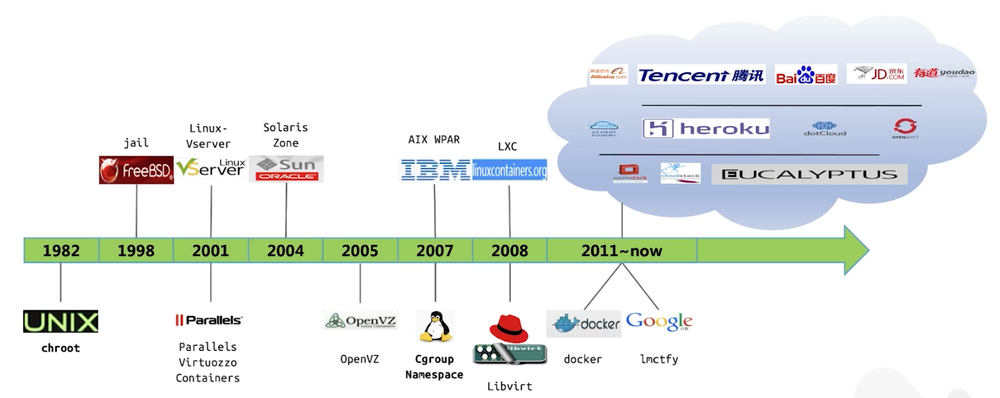

```
Docker容器实现原理：
---通过namespace技术实现进程隔离
---通过cgroup技术实现容器可用资源的限制(cpu/memory/blkio/network)

docker启动一个容器时，实际是创建了带多个namespace参数的进程
```


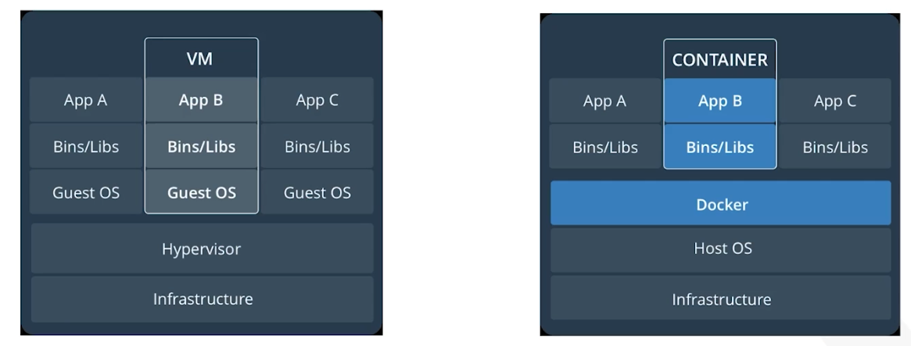


#### 4.1.Namespace和Cgroup

##### 4.1.1.Namespace

```
Namespace：命名空间
---作用：资源隔离
---原理：namespace将内核的全局资源进行封装，使得每一个namespace都有一份独立的资源。因此不同进程在各自namespace内对同一种资源         的使用不会相互干扰
```

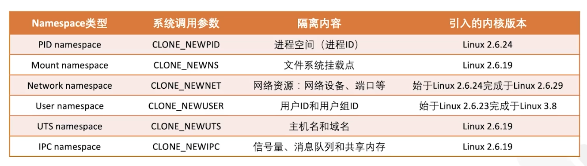

###### 4.1.1.1.PID namespace

```bash
以交互模式启动一个centos容器，并在其中运行/bin/bash程序
# docker run -itd centos /bin/bash
d43a850eabed98480e3a3d248fccff32eee43875ae372057ade6af2f42c27d38
# docker ps
CONTAINER ID   IMAGE     COMMAND       CREATED         STATUS         PORTS     NAMES
d43a850eabed   centos    "/bin/bash"   5 seconds ago   Up 4 seconds             admiring_gates

在容器中执行ps命令，查看到"/bin/bash"是PID=1的进程，即docker将其隔离于宿主机中的其他进程
 # docker exec -it admiring_gates ps axf
    PID TTY      STAT   TIME COMMAND
     15 pts/1    Rs+    0:00 ps axf
      1 pts/0    Ss+    0:00 /bin/bash

使用docker inspect查看容器进程在宿主机上的真实PID。实际上，该容器中运行的"/bin/bash"在宿主机上是PID=3600217的进程
# docker inspect admiring_gates |grep Pid
            "Pid": 3600217,
            "PidMode": "",
            "PidsLimit": null,

# ps -ef|grep 3600217
root     3600217 3600193  0 13:41 pts/0    00:00:00 /bin/bash
root     3602520 3599059  0 13:43 pts/1    00:00:00 grep --color=auto 3600217

在容器中查看该进程的相关namespace信息      
# docker exec -it admiring_gates ls -l /proc/1/ns
total 0
lrwxrwxrwx 1 root root 0 Feb  8 05:42 cgroup -> 'cgroup:[4026532792]'
lrwxrwxrwx 1 root root 0 Feb  8 05:42 ipc -> 'ipc:[4026532653]'
lrwxrwxrwx 1 root root 0 Feb  8 05:42 mnt -> 'mnt:[4026532651]'
lrwxrwxrwx 1 root root 0 Feb  8 05:42 net -> 'net:[4026532656]'
lrwxrwxrwx 1 root root 0 Feb  8 05:42 pid -> 'pid:[4026532655]'
lrwxrwxrwx 1 root root 0 Feb  8 05:42 pid_for_children -> 'pid:[4026532655]'
lrwxrwxrwx 1 root root 0 Feb  8 05:42 time -> 'time:[4026531834]'
lrwxrwxrwx 1 root root 0 Feb  8 05:42 time_for_children -> 'time:[4026531834]'
lrwxrwxrwx 1 root root 0 Feb  8 05:42 user -> 'user:[4026531837]'
lrwxrwxrwx 1 root root 0 Feb  8 05:42 uts -> 'uts:[4026532652]'

在宿主机上查看该进程的相关namespace信息，发现两者一致
# ls -l /proc/3600217/ns
total 0
lrwxrwxrwx 1 root root 0  2月  8 13:41 cgroup -> 'cgroup:[4026532792]'
lrwxrwxrwx 1 root root 0  2月  8 13:41 ipc -> 'ipc:[4026532653]'
lrwxrwxrwx 1 root root 0  2月  8 13:41 mnt -> 'mnt:[4026532651]'
lrwxrwxrwx 1 root root 0  2月  8 13:41 net -> 'net:[4026532656]'
lrwxrwxrwx 1 root root 0  2月  8 13:41 pid -> 'pid:[4026532655]'
lrwxrwxrwx 1 root root 0  2月  8 13:43 pid_for_children -> 'pid:[4026532655]'
lrwxrwxrwx 1 root root 0  2月  8 13:43 time -> 'time:[4026531834]'
lrwxrwxrwx 1 root root 0  2月  8 13:43 time_for_children -> 'time:[4026531834]'
lrwxrwxrwx 1 root root 0  2月  8 13:43 user -> 'user:[4026531837]'
lrwxrwxrwx 1 root root 0  2月  8 13:41 uts -> 'uts:[4026532652]'
```


##### 4.1.2.Cgroup

```bash
Cgroup: Linux Control Group
---作用：限制一个进程组对系统资源的使用上限，包含：cpu、内存、Block I/O等
        Cgroups还能设置进程优先级，对进程进行挂起和恢复等操作
---原理：将一组进程放在一个Cgroup中，通过给这个Cgroup分配指定的可用资源，达到控制这一组进程可用资源的目的
---实现：在Linux中，Cgroups以文件和目录的方式组织在操作系统的/sys/fs/cgroup路径下
        该路径中所有的资源种类均可被cgroup限制

默认路径：
Putting everything together to look at the memory metrics for a Docker container, take a look at the following paths:

/sys/fs/cgroup/memory/docker/<longid>/ on cgroup v1, cgroupfs driver
/sys/fs/cgroup/memory/system.slice/docker-<longid>.scope/ on cgroup v1, systemd driver
/sys/fs/cgroup/docker/<longid>/ on cgroup v2, cgroupfs driver
/sys/fs/cgroup/system.slice/docker-<longid>.scope/ on cgroup v2, systemd driver


# mount -t cgroup
cgroup on /sys/fs/cgroup/systemd type cgroup (rw,nosuid,nodev,noexec,relatime,xattr,release_agent=/usr/lib/systemd/systemd-cgroups-agent,name=systemd)
cgroup on /sys/fs/cgroup/devices type cgroup (rw,nosuid,nodev,noexec,relatime,devices)
cgroup on /sys/fs/cgroup/perf_event type cgroup (rw,nosuid,nodev,noexec,relatime,perf_event)
cgroup on /sys/fs/cgroup/net_cls,net_prio type cgroup (rw,nosuid,nodev,noexec,relatime,net_prio,net_cls)
cgroup on /sys/fs/cgroup/pids type cgroup (rw,nosuid,nodev,noexec,relatime,pids)
cgroup on /sys/fs/cgroup/freezer type cgroup (rw,nosuid,nodev,noexec,relatime,freezer)
cgroup on /sys/fs/cgroup/blkio type cgroup (rw,nosuid,nodev,noexec,relatime,blkio)
cgroup on /sys/fs/cgroup/hugetlb type cgroup (rw,nosuid,nodev,noexec,relatime,hugetlb)
cgroup on /sys/fs/cgroup/cpu,cpuacct type cgroup (rw,nosuid,nodev,noexec,relatime,cpuacct,cpu)
cgroup on /sys/fs/cgroup/memory type cgroup (rw,nosuid,nodev,noexec,relatime,memory)
cgroup on /sys/fs/cgroup/cpuset type cgroup (rw,nosuid,nodev,noexec,relatime,cpuset)

注意：当docker的cgroup driver为systemd时，没法查看mount -t cgroup和/sys/fs/cgroup/cpu/docker等信息，需改为cgroup v1才行
# cat /etc/os-release 
PRETTY_NAME="Ubuntu 22.04.1 LTS"

# docker info
Cgroup Driver: systemd
Cgroup Version: 2

# ls -lrth /sys/fs/cgroup/system.slice/
drwxr-xr-x 2 root root 0  2月  8 19:08  docker-3fa0ed36aeae4a1e1b69785fdd39ae41cea91130c8d3c98e59d016844dac0954.scope
drwxr-xr-x 2 root root 0  2月  8 19:08  docker-103c588f565583da77e44e7ac966ef95f1838015533a48b99768c122119558a3.scope
...输出省略...

# mount -t cgroup

# vi /etc/docker/daemon.json
添加：
"exec-opts": ["native.cgroupdriver=cgroupfs"],

# systemctl daemon-reload
# systemctl restart docker

# docker info
Cgroup Driver: cgroupfs
Cgroup Version: 2

修改cgroup版本到1
编辑 /etc/default/grub，在 GRUB_CMDLINE_LINUX 一行中增加 systemd.unified_cgroup_hierarchy=0 ，然后运行 sudo update-grub ，重启系统后version 被修改成 v1。

# docker info
Cgroup Driver: cgroupfs
Cgroup Version: 1

ls -l /sys/fs/cgroup/cpu/docker/
total 0
drwxr-xr-x 2 root root 0  2月  8 18:07 103c588f565583da77e44e7ac966ef95f1838015533a48b99768c122119558a3
drwxr-xr-x 2 root root 0  2月  8 18:07 3fa0ed36aeae4a1e1b69785fdd39ae41cea91130c8d3c98e59d016844dac0954
...输出省略...


```


#### 4.2.cpu/memory/Block IO等资源限制---以下基于cgroupfs v1

##### 4.2.1.cpu资源限制

```bash
可通过如下参数，对容器的可用cpu资源进行限制：
---权重值，表示该进程能使用的cpu资源的权重值
   --cpu-shares
   -c
---cpu个数
   --cpus=0.0
# man docker run
  /--cpu
  --cpu-shares , -c		CPU shares (relative weight). 比如：容器1 -c=1024，容器2 -c=512，那么容器1分2/3,容器2分1/3
           按权重分配CPU只会发生在CPU资源紧张的情况下，当容器1处于空闲状态，为了充分利用CPU资源，容器2会分配到全部可用的CPU
           
  --cpus=0.0		Number of CPUs. The default is 0.0 which means no limit.
```


```bash
--cpu 1 是progrium/stress里面的命令
# docker run -it --name yl1 -c 1024 progrium/stress --cpu 1
Unable to find image 'progrium/stress:latest' locally
latest: Pulling from progrium/stress
Image docker.io/progrium/stress:latest uses outdated schema1 manifest format. Please upgrade to a schema2 image for better future compatibility. More information at https://docs.docker.com/registry/spec/deprecated-schema-v1/
a3ed95caeb02: Pull complete 
871c32dbbb53: Pull complete 
dbe7819a64dd: Pull complete 
d14088925c6e: Pull complete 
58026d51efe4: Pull complete 
7d04a4fe1405: Pull complete 
1775fca35fb6: Pull complete 
5c319e267908: Pull complete 
Digest: sha256:e34d56d60f5caae79333cee395aae93b74791d50e3841986420d23c2ee4697bf
Status: Downloaded newer image for progrium/stress:latest
stress: info: [1] dispatching hogs: 1 cpu, 0 io, 0 vm, 0 hdd
stress: dbug: [1] using backoff sleep of 3000us
stress: dbug: [1] --> hogcpu worker 1 [7] forked


另起一个界面查询下当前宿主机的cpu使用情况
# top
asks: 299 total,   3 running, 296 sleeping,   0 stopped,   0 zombie
%Cpu(s): 90.8 us,  9.2 sy,  0.0 ni,  0.0 id,  0.0 wa,  0.0 hi,  0.0 si,  0.0 st
MiB Mem :   3924.2 total,    111.0 free,    598.3 used,   3215.0 buff/cache
MiB Swap:   2040.0 total,   1639.9 free,    400.1 used.   3043.1 avail Mem 

    PID USER      PR  NI    VIRT    RES    SHR S  %CPU  %MEM     TIME+ COMMAND                                            
9909 root      20   0    7320     96      0 R  90.0   0.0   0:28.91 stress          

在启动一个容器-c 512
# docker run -it --name yl2 -c 512 polinux/stress-ng --cpu 1
Unable to find image 'polinux/stress-ng:latest' locally
latest: Pulling from polinux/stress-ng
45a2e645736c: Pull complete 
34fe96c9bdec: Pull complete 
Digest: sha256:aa26e8ffd2c0a1192de691a22401a5fd008a940bb8f30dc2a4ddfe72e0dfdc10
Status: Downloaded newer image for polinux/stress-ng:latest
stress-ng: info:  [1] defaulting to a 86400 second run per stressor
stress-ng: info:  [1] dispatching hogs: 1 cpu
stress-ng: info:  [1] cache allocate: default cache size: 30720K

# 

另起一个界面查询下当前宿主机的cpu使用情况
# top
top - 17:24:37 up 56 days,  7:24,  4 users,  load average: 2.21, 2.03, 1.46
Tasks: 304 total,   4 running, 300 sleeping,   0 stopped,   0 zombie
%Cpu(s): 96.4 us,  3.6 sy,  0.0 ni,  0.0 id,  0.0 wa,  0.0 hi,  0.0 si,  0.0 st
MiB Mem :   3924.2 total,    107.6 free,    662.4 used,   3154.3 buff/cache
MiB Swap:   2040.0 total,   1638.1 free,    401.9 used.   2976.7 avail Mem 

    PID USER      PR  NI    VIRT    RES    SHR S  %CPU  %MEM     TIME+ COMMAND                                            
9909 root      20   0    7320     96      0 R  60.5   0.0  15:52.65 stress                                             
9973 root      20   0   66984   6352   3480 R  30.9   0.2   0:25.27 stress-ng-cpu 


# docker ps -f name=yl*
CONTAINER ID   IMAGE               COMMAND                  CREATED          STATUS          PORTS     NAMES
103c588f5655   polinux/stress-ng   "/usr/bin/stress-ng …"   12 minutes ago   Up 12 minutes             yl2
3fa0ed36aeae   progrium/stress     "/usr/bin/stress --v…"   31 minutes ago   Up 31 minutes             yl1

# docker inspect yl1|grep -w Pid
            "Pid": 9909,

# docker inspect yl2|grep -w Pid
            "Pid": 9973,


# ls -l /sys/fs/cgroup/cpu/docker/
total 0
drwxr-xr-x 2 root root 0  2月  8 18:07 103c588f565583da77e44e7ac966ef95f1838015533a48b99768c122119558a3
drwxr-xr-x 2 root root 0  2月  8 18:07 3fa0ed36aeae4a1e1b69785fdd39ae41cea91130c8d3c98e59d016844dac0954
-rw-r--r-- 1 root root 0  2月  8 18:07 cgroup.clone_children
-rw-r--r-- 1 root root 0  2月  8 18:07 cgroup.procs
-r--r--r-- 1 root root 0  2月  8 18:07 cpuacct.stat
-rw-r--r-- 1 root root 0  2月  8 18:07 cpuacct.usage
-r--r--r-- 1 root root 0  2月  8 18:07 cpuacct.usage_all
-r--r--r-- 1 root root 0  2月  8 18:07 cpuacct.usage_percpu
-r--r--r-- 1 root root 0  2月  8 18:07 cpuacct.usage_percpu_sys
-r--r--r-- 1 root root 0  2月  8 18:07 cpuacct.usage_percpu_user
-r--r--r-- 1 root root 0  2月  8 18:07 cpuacct.usage_sys
-r--r--r-- 1 root root 0  2月  8 18:07 cpuacct.usage_user
-rw-r--r-- 1 root root 0  2月  8 18:07 cpu.cfs_burst_us
-rw-r--r-- 1 root root 0  2月  8 18:07 cpu.cfs_period_us
-rw-r--r-- 1 root root 0  2月  8 18:07 cpu.cfs_quota_us
-rw-r--r-- 1 root root 0  2月  8 18:07 cpu.idle
-rw-r--r-- 1 root root 0  2月  8 18:07 cpu.shares
-r--r--r-- 1 root root 0  2月  8 18:07 cpu.stat
-rw-r--r-- 1 root root 0  2月  8 18:07 cpu.uclamp.max
-rw-r--r-- 1 root root 0  2月  8 18:07 cpu.uclamp.min
-rw-r--r-- 1 root root 0  2月  8 18:07 notify_on_release
-rw-r--r-- 1 root root 0  2月  8 18:07 tasks

# ls -l /sys/fs/cgroup/cpu/docker/3fa0ed36aeae4a1e1b69785fdd39ae41cea91130c8d3c98e59d016844dac0954/
total 0
-rw-r--r-- 1 root root 0  2月  8 18:09 cgroup.clone_children
-rw-r--r-- 1 root root 0  2月  8 18:07 cgroup.procs
-r--r--r-- 1 root root 0  2月  8 18:09 cpuacct.stat
-rw-r--r-- 1 root root 0  2月  8 18:09 cpuacct.usage
-r--r--r-- 1 root root 0  2月  8 18:09 cpuacct.usage_all
-r--r--r-- 1 root root 0  2月  8 18:09 cpuacct.usage_percpu
-r--r--r-- 1 root root 0  2月  8 18:09 cpuacct.usage_percpu_sys
-r--r--r-- 1 root root 0  2月  8 18:09 cpuacct.usage_percpu_user
-r--r--r-- 1 root root 0  2月  8 18:09 cpuacct.usage_sys
-r--r--r-- 1 root root 0  2月  8 18:09 cpuacct.usage_user
-rw-r--r-- 1 root root 0  2月  8 18:09 cpu.cfs_burst_us
-rw-r--r-- 1 root root 0  2月  8 18:09 cpu.cfs_period_us
-rw-r--r-- 1 root root 0  2月  8 18:09 cpu.cfs_quota_us
-rw-r--r-- 1 root root 0  2月  8 18:09 cpu.idle
-rw-r--r-- 1 root root 0  2月  8 18:07 cpu.shares
-r--r--r-- 1 root root 0  2月  8 18:09 cpu.stat
-rw-r--r-- 1 root root 0  2月  8 18:09 cpu.uclamp.max
-rw-r--r-- 1 root root 0  2月  8 18:09 cpu.uclamp.min
-rw-r--r-- 1 root root 0  2月  8 18:09 notify_on_release
-rw-r--r-- 1 root root 0  2月  8 18:09 tasks

# cat 3fa0ed36aeae4a1e1b69785fdd39ae41cea91130c8d3c98e59d016844dac0954/cpu.shares 
1024
root@ubuntu001-virtual-machine:/sys/fs/cgroup/cpu/docker# cat 3fa0ed36aeae4a1e1b69785fdd39ae41cea91130c8d3c98e59d016844dac0954/tasks
9909
9938

# cat /proc/9909/cgroup 
13:freezer:/docker/3fa0ed36aeae4a1e1b69785fdd39ae41cea91130c8d3c98e59d016844dac0954
12:hugetlb:/docker/3fa0ed36aeae4a1e1b69785fdd39ae41cea91130c8d3c98e59d016844dac0954
11:perf_event:/docker/3fa0ed36aeae4a1e1b69785fdd39ae41cea91130c8d3c98e59d016844dac0954
10:misc:/
9:pids:/docker/3fa0ed36aeae4a1e1b69785fdd39ae41cea91130c8d3c98e59d016844dac0954
8:net_cls,net_prio:/docker/3fa0ed36aeae4a1e1b69785fdd39ae41cea91130c8d3c98e59d016844dac0954
7:devices:/docker/3fa0ed36aeae4a1e1b69785fdd39ae41cea91130c8d3c98e59d016844dac0954
6:blkio:/docker/3fa0ed36aeae4a1e1b69785fdd39ae41cea91130c8d3c98e59d016844dac0954
5:cpuset:/docker/3fa0ed36aeae4a1e1b69785fdd39ae41cea91130c8d3c98e59d016844dac0954
4:cpu,cpuacct:/docker/3fa0ed36aeae4a1e1b69785fdd39ae41cea91130c8d3c98e59d016844dac0954
3:rdma:/docker/3fa0ed36aeae4a1e1b69785fdd39ae41cea91130c8d3c98e59d016844dac0954
2:memory:/docker/3fa0ed36aeae4a1e1b69785fdd39ae41cea91130c8d3c98e59d016844dac0954
1:name=systemd:/docker/3fa0ed36aeae4a1e1b69785fdd39ae41cea91130c8d3c98e59d016844dac0954
0::/docker/3fa0ed36aeae4a1e1b69785fdd39ae41cea91130c8d3c98e59d016844dac0954

# cat /proc/9938/cgroup 
13:freezer:/docker/3fa0ed36aeae4a1e1b69785fdd39ae41cea91130c8d3c98e59d016844dac0954
12:hugetlb:/docker/3fa0ed36aeae4a1e1b69785fdd39ae41cea91130c8d3c98e59d016844dac0954
11:perf_event:/docker/3fa0ed36aeae4a1e1b69785fdd39ae41cea91130c8d3c98e59d016844dac0954
10:misc:/
9:pids:/docker/3fa0ed36aeae4a1e1b69785fdd39ae41cea91130c8d3c98e59d016844dac0954
8:net_cls,net_prio:/docker/3fa0ed36aeae4a1e1b69785fdd39ae41cea91130c8d3c98e59d016844dac0954
7:devices:/docker/3fa0ed36aeae4a1e1b69785fdd39ae41cea91130c8d3c98e59d016844dac0954
6:blkio:/docker/3fa0ed36aeae4a1e1b69785fdd39ae41cea91130c8d3c98e59d016844dac0954
5:cpuset:/docker/3fa0ed36aeae4a1e1b69785fdd39ae41cea91130c8d3c98e59d016844dac0954
4:cpu,cpuacct:/docker/3fa0ed36aeae4a1e1b69785fdd39ae41cea91130c8d3c98e59d016844dac0954
3:rdma:/docker/3fa0ed36aeae4a1e1b69785fdd39ae41cea91130c8d3c98e59d016844dac0954
2:memory:/docker/3fa0ed36aeae4a1e1b69785fdd39ae41cea91130c8d3c98e59d016844dac0954
1:name=systemd:/docker/3fa0ed36aeae4a1e1b69785fdd39ae41cea91130c8d3c98e59d016844dac0954
0::/docker/3fa0ed36aeae4a1e1b69785fdd39ae41cea91130c8d3c98e59d016844dac0954

# ps -ef|grep 9909|grep -v grep
root        9909    9886  0 18:07 pts/0    00:00:00 /usr/bin/stress --verbose --cpu 1
root        9938    9909 60 18:07 pts/0    00:01:41 /usr/bin/stress --verbose --cpu 1

# ls -l /proc/9909/ns
total 0
lrwxrwxrwx 1 root root 0  2月  8 18:11 cgroup -> 'cgroup:[4026532785]'
lrwxrwxrwx 1 root root 0  2月  8 18:11 ipc -> 'ipc:[4026532648]'
lrwxrwxrwx 1 root root 0  2月  8 18:11 mnt -> 'mnt:[4026532646]'
lrwxrwxrwx 1 root root 0  2月  8 18:07 net -> 'net:[4026532650]'
lrwxrwxrwx 1 root root 0  2月  8 18:11 pid -> 'pid:[4026532649]'
lrwxrwxrwx 1 root root 0  2月  8 18:11 pid_for_children -> 'pid:[4026532649]'
lrwxrwxrwx 1 root root 0  2月  8 18:11 time -> 'time:[4026531834]'
lrwxrwxrwx 1 root root 0  2月  8 18:11 time_for_children -> 'time:[4026531834]'
lrwxrwxrwx 1 root root 0  2月  8 18:11 user -> 'user:[4026531837]'
lrwxrwxrwx 1 root root 0  2月  8 18:11 uts -> 'uts:[4026532647]'

# ls -l /proc/9938/ns
total 0
lrwxrwxrwx 1 root root 0  2月  8 18:11 cgroup -> 'cgroup:[4026532785]'
lrwxrwxrwx 1 root root 0  2月  8 18:11 ipc -> 'ipc:[4026532648]'
lrwxrwxrwx 1 root root 0  2月  8 18:11 mnt -> 'mnt:[4026532646]'
lrwxrwxrwx 1 root root 0  2月  8 18:11 net -> 'net:[4026532650]'
lrwxrwxrwx 1 root root 0  2月  8 18:11 pid -> 'pid:[4026532649]'
lrwxrwxrwx 1 root root 0  2月  8 18:11 pid_for_children -> 'pid:[4026532649]'
lrwxrwxrwx 1 root root 0  2月  8 18:11 time -> 'time:[4026531834]'
lrwxrwxrwx 1 root root 0  2月  8 18:11 time_for_children -> 'time:[4026531834]'
lrwxrwxrwx 1 root root 0  2月  8 18:11 user -> 'user:[4026531837]'
lrwxrwxrwx 1 root root 0  2月  8 18:11 uts -> 'uts:[4026532647]'

# cat 103c588f565583da77e44e7ac966ef95f1838015533a48b99768c122119558a3/cpu.shares 
512
# cat 103c588f565583da77e44e7ac966ef95f1838015533a48b99768c122119558a3/tasks
9973
10045

# ps -ef|grep 9973|grep -v grep
root       9973    9512  0 19:44 pts/0    00:00:00 /usr/bin/stress-ng --cpu 1
root       10045   9973 30 19:44 pts/0    00:01:26 /usr/bin/stress-ng --cpu 1

# cat /proc/9973/cgroup 
13:freezer:/docker/103c588f565583da77e44e7ac966ef95f1838015533a48b99768c122119558a3
12:hugetlb:/docker/103c588f565583da77e44e7ac966ef95f1838015533a48b99768c122119558a3
11:perf_event:/docker/103c588f565583da77e44e7ac966ef95f1838015533a48b99768c122119558a3
10:misc:/
9:pids:/docker/103c588f565583da77e44e7ac966ef95f1838015533a48b99768c122119558a3
8:net_cls,net_prio:/docker/103c588f565583da77e44e7ac966ef95f1838015533a48b99768c122119558a3
7:devices:/docker/103c588f565583da77e44e7ac966ef95f1838015533a48b99768c122119558a3
6:blkio:/docker/103c588f565583da77e44e7ac966ef95f1838015533a48b99768c122119558a3
5:cpuset:/docker/103c588f565583da77e44e7ac966ef95f1838015533a48b99768c122119558a3
4:cpu,cpuacct:/docker/103c588f565583da77e44e7ac966ef95f1838015533a48b99768c122119558a3
3:rdma:/docker/103c588f565583da77e44e7ac966ef95f1838015533a48b99768c122119558a3
2:memory:/docker/103c588f565583da77e44e7ac966ef95f1838015533a48b99768c122119558a3
1:name=systemd:/docker/103c588f565583da77e44e7ac966ef95f1838015533a48b99768c122119558a3
0::/docker/103c588f565583da77e44e7ac966ef95f1838015533a48b99768c122119558a3

# cat /proc/10045/cgroup 
13:freezer:/docker/103c588f565583da77e44e7ac966ef95f1838015533a48b99768c122119558a3
12:hugetlb:/docker/103c588f565583da77e44e7ac966ef95f1838015533a48b99768c122119558a3
11:perf_event:/docker/103c588f565583da77e44e7ac966ef95f1838015533a48b99768c122119558a3
10:misc:/
9:pids:/docker/103c588f565583da77e44e7ac966ef95f1838015533a48b99768c122119558a3
8:net_cls,net_prio:/docker/103c588f565583da77e44e7ac966ef95f1838015533a48b99768c122119558a3
7:devices:/docker/103c588f565583da77e44e7ac966ef95f1838015533a48b99768c122119558a3
6:blkio:/docker/103c588f565583da77e44e7ac966ef95f1838015533a48b99768c122119558a3
5:cpuset:/docker/103c588f565583da77e44e7ac966ef95f1838015533a48b99768c122119558a3
4:cpu,cpuacct:/docker/103c588f565583da77e44e7ac966ef95f1838015533a48b99768c122119558a3
3:rdma:/docker/103c588f565583da77e44e7ac966ef95f1838015533a48b99768c122119558a3
2:memory:/docker/103c588f565583da77e44e7ac966ef95f1838015533a48b99768c122119558a3
1:name=systemd:/docker/103c588f565583da77e44e7ac966ef95f1838015533a48b99768c122119558a3
0::/docker/103c588f565583da77e44e7ac966ef95f1838015533a48b99768c122119558a3

# ll /proc/9973/ns
total 0
dr-x--x--x 2 root root 0  2月  8 18:07 ./
dr-xr-xr-x 9 root root 0  2月  8 18:07 ../
lrwxrwxrwx 1 root root 0  2月  8 18:15 cgroup -> 'cgroup:[4026532848]'
lrwxrwxrwx 1 root root 0  2月  8 18:15 ipc -> 'ipc:[4026532790]'
lrwxrwxrwx 1 root root 0  2月  8 18:15 mnt -> 'mnt:[4026532788]'
lrwxrwxrwx 1 root root 0  2月  8 18:07 net -> 'net:[4026532792]'
lrwxrwxrwx 1 root root 0  2月  8 18:15 pid -> 'pid:[4026532791]'
lrwxrwxrwx 1 root root 0  2月  8 18:15 pid_for_children -> 'pid:[4026532791]'
lrwxrwxrwx 1 root root 0  2月  8 18:15 time -> 'time:[4026531834]'
lrwxrwxrwx 1 root root 0  2月  8 18:15 time_for_children -> 'time:[4026531834]'
lrwxrwxrwx 1 root root 0  2月  8 18:15 user -> 'user:[4026531837]'
lrwxrwxrwx 1 root root 0  2月  8 18:15 uts -> 'uts:[4026532789]'

# ll /proc/10045/ns
total 0
dr-x--x--x 2 root root 0  2月  8 18:15 ./
dr-xr-xr-x 9 root root 0  2月  8 18:07 ../
lrwxrwxrwx 1 root root 0  2月  8 18:15 cgroup -> 'cgroup:[4026532848]'
lrwxrwxrwx 1 root root 0  2月  8 18:15 ipc -> 'ipc:[4026532790]'
lrwxrwxrwx 1 root root 0  2月  8 18:15 mnt -> 'mnt:[4026532788]'
lrwxrwxrwx 1 root root 0  2月  8 18:15 net -> 'net:[4026532792]'
lrwxrwxrwx 1 root root 0  2月  8 18:15 pid -> 'pid:[4026532791]'
lrwxrwxrwx 1 root root 0  2月  8 18:15 pid_for_children -> 'pid:[4026532791]'
lrwxrwxrwx 1 root root 0  2月  8 18:15 time -> 'time:[4026531834]'
lrwxrwxrwx 1 root root 0  2月  8 18:15 time_for_children -> 'time:[4026531834]'
lrwxrwxrwx 1 root root 0  2月  8 18:15 user -> 'user:[4026531837]'
lrwxrwxrwx 1 root root 0  2月  8 18:15 uts -> 'uts:[4026532789]'
```


##### 4.2.2.memory资源限制

```bash
默认情况下，宿主机不限制容器对内存资源的使用。可使用如下参数来控制容器对内存资源的使用：
--memory: 设置内存资源的使用限额
--memory-swap: 设置内存和swap资源的使用限额

# man docker run
/--memory
--memory , -m		Memory limit
--memory-reservation		Memory soft limit
--memory-swap		Swap limit equal to memory plus swap: ‘-1’ to enable unlimited swap
--memory-swappiness	-1	Tune container memory swappiness (0 to 100)

对进程内存使用限制的详细配置参数在/sys/fs/cgroup/memory目录
# cd /sys/fs/cgroup/memory/
# ls
cgroup.clone_children           memory.kmem.tcp.max_usage_in_bytes  memory.swappiness
cgroup.event_control            memory.kmem.tcp.usage_in_bytes      memory.usage_in_bytes
cgroup.procs                    memory.kmem.usage_in_bytes          memory.use_hierarchy
cgroup.sane_behavior            memory.limit_in_bytes               notify_on_release
dev-hugepages.mount             memory.max_usage_in_bytes           proc-sys-fs-binfmt_misc.mount
dev-mqueue.mount                memory.memsw.failcnt                release_agent
docker                          memory.memsw.limit_in_bytes         sys-fs-fuse-connections.mount
memory.failcnt                  memory.memsw.max_usage_in_bytes     sys-kernel-config.mount
memory.force_empty              memory.memsw.usage_in_bytes         sys-kernel-debug.mount
memory.kmem.failcnt             memory.move_charge_at_immigrate     sys-kernel-tracing.mount
memory.kmem.limit_in_bytes      memory.numa_stat                    system.slice
memory.kmem.max_usage_in_bytes  memory.oom_control                  tasks
memory.kmem.slabinfo            memory.pressure_level               user.slice
memory.kmem.tcp.failcnt         memory.soft_limit_in_bytes
memory.kmem.tcp.limit_in_bytes  memory.stat
```


```bash
# free -m
               total        used        free      shared  buff/cache   available
Mem:            3924         523        1898          13        1502        3161
Swap:           2039           0        2039
# docker run -it -m 400M --memory-swap=500M progrium/stress --vm 1 --vm-bytes 450M 
stress: info: [1] dispatching hogs: 0 cpu, 0 io, 1 vm, 0 hdd
stress: dbug: [1] using backoff sleep of 3000us
stress: dbug: [1] --> hogvm worker 1 [7] forked
stress: dbug: [7] allocating 471859200 bytes ...
stress: dbug: [7] touching bytes in strides of 4096 bytes ...

stress: dbug: [7] freed 471859200 bytes
stress: dbug: [7] allocating 471859200 bytes ...
stress: dbug: [7] touching bytes in strides of 4096 bytes ...

stress: dbug: [7] freed 471859200 bytes
stress: dbug: [7] allocating 471859200 bytes ...
stress: dbug: [7] touching bytes in strides of 4096 bytes ...

...输出省略，循环：分配450M内存，释放450M内存...

另起一个ssh界面，查看内存使用情况
# free -m
               total        used        free      shared  buff/cache   available
Mem:            3924         925        1492          13        1506        2758
Swap:           2039         385        1654

结束容器后再次查看内存：
# free -m
               total        used        free      shared  buff/cache   available
Mem:            3924         564        1850          13        1509        3120
Swap:           2039           0        2039
```


##### 4.2.3.Block IO限制

```bash
Block IO指的是磁盘的读写，可通过如下3种方式限制容器读写磁盘的带宽：
---设置相对权重
   --blkio-weight
---设置bps：每秒读写的数据量
   --device-read-bps
   --device-write-bps
---设置iops：每秒IO次数
   --device-read-iops
   --device-write-iops

# man docker run
       --blkio-weight=0
          Block IO weight (relative weight) accepts a weight value between 10 and 1000,or 0 to disable (default 0).
          
       --device-read-bps=[]
          Limit read rate(bytes per second) from a device (e.g. --device-read-bps=/dev/sda:1mb)
          
       --device-write-bps=[]
          Limit write rate(bytes per second) to a device (e.g. --device-write-bps=/dev/sda:1mb)

       --device-read-iops=[]
          Limit read rate(IO per second) from a device (e.g. --device-read-iops=/dev/sda:1000)

       --device-write-iops=[]
          Limit write rate to(IO per second) a device (e.g. --device-write-iops=/dev/sda:1000)
```


### 5.PaaS概述
#### 5.1.什么是PaaS


| 缩写 |             IaaS             |           PaaS            |            SaaS            |      |
| :--: | :--------------------------: | :-----------------------: | :------------------------: | ---- |
| 全拼 | Infrastructurre-as-a-Service |   Platform-as-a-Service   |   Software-as-a-Service    |      |
| 中文 |        基础设施即服务        |        平台即服务         |         软件即服务         |      |
| 示例 |   亚马逊、阿里云、华为云等   | Google、Microsoft Azure等 | 阿里的钉钉、苹果的iCloud等 |      |
| 软件 |          OpenStack           |      Openshift、K8S       |         office 365         |      |


#### 5.2.Paas与编排工具概述
```
容器集群管理三巨头：
---kubernetes
https://github.com/kubernetes/kubernetes

---docker swarm
https://github.com/docker-archive/classicswarm

---mesos
https://github.com/apache/mesos
```


```
---docker swarm
docker swarm 项目开始于2014年，终止于2018年

---docker swarmkit
项目开始于2016年，与swarm不同，内嵌于docker engine
swarmkit所有节点对等，每个节点可以选择转化为manager或者worker
manager节点内嵌了raft协议，实现高可用，并存储集群状态

---apache mesos
2009年发起，Mesos可以将整个数据中心的资源(包括cpu、内存、存储、网络等)进行抽象和调度，使得多个应用同时运行在集群中分享资源，并无需关心资源的物理分布情况

---kubernetes
```


##### 5.2.1.swarm mode


```bash
Raft共识算法
Gossip network
```

##### 5.2.2.mesos


##### 5.2.3.kubernetes

```
---kubernetes是google发起的开源的项目，它的目标是管理跨多个主机的容器，提供基本的部署、维护以及应用伸缩，主要实现语言为go语言
---k8s的特点：
   1)便携：支持公有云、私有云、混合云，以及多种云平台
   2)可拓展：模块化，可拔插，可任意组合
   3)自修复：自动重调度，自动重启，自动复制
```

```bash
k8s架构：
---CRI(Container Runtime Interface)：远程调用接口，这个接口定义了容器运行时的各项核心操作，比如：启动一个容器需要的所有参数

---CNI(Container Network Interface)：该接口调用网络插件为容器配置网络

---CSI(Container Storage Interface)：调用存储插件为容器配置持久化存储
```


```
---grpc:  Remote Procedure Call
   https://grpc.io/

---protobuff
   https://developers.google.com/protocol-buffers

---cri
   https://cri-o.io/
```


```
k8s的"声明式API"
---Deployment
---Job
---CronJob
---DaemonSet
```


### 6.Kubernetes架构介绍

#### 6.1.k8s架构

```
---k8s：容器编排
---openstack：虚拟机编排
```

```
k8s架构：
一个基础的k8s集群包含一个master节点和多个node节点。每个节点可以是一台物理机，也可以是一台虚拟机
生产集群中：3个master和多个node

---master：master节点提供集群的控制，对集群做出全局性决策，例如调度等。通常在master节点上不运行用户容器

---node：节点组件运行在每一个node节点上，维护运行的pod并提供k8s运行时环境
```

```bash
master节点：
---kube-apiserver：对外暴露了k8s API。它是k8s的前端控制层。它被设计为水平扩展，即通过部署更多实例来缩放

---etcd：用于k8s的后端存储。所有集群数据都存储在此处，应该始终为k8s的etcd提供备份计划

---kube-controller-manager：运行控制器，是处理集群中常规任务的后台线程。逻辑上，每个控制器是一个单独的进程，但为了降低复杂性，他们都被编译成独立的可执行文件，并在单个进程中运行

---kube-scheduler：监视没有分配节点的新创建的pod，选择一个节点供他们运行

node节点：
---kube-proxy：用于管理service的访问入口，包括集群内pod到service的访问和集群外访问service

---kubelet：在集群内每个节点上运行的一个代理，用于保证pod的运行

---container runtime：通常使用docker来运行容器，也可以使用rkt/podman等作为替代方案
   rkt已经停止： https://github.com/rkt/rkt 
   
推荐Add-ons：
---Core-dns：为整个集群提供DNS服务

---Ingress Controller：为service提供外网访问入口

---Dashboard：提供图形化管理界面

---Heapster：提供集群资源监控

---Flannel：为k8s提供方便的网络规划服务


kubeadm：
---社区主推的快速创建k8s集群工具
---通过执行必要的操作来启动和运行一个最小可用的集群：
   1)Master节点：kubeadm init，快速初始化安装主节点组件
   2)Node节点：kubeadm join，将从节点加入集群
 
查看组件运行状态：
---systemctl status docker

---systemctl status kubelet

kubeadm容器化组件：
kubectl get pods --field-selector spec.nodeName=k8s-master --namespace=kube-system

# kubectl get pods --field-selector spec.nodeName=master01  --namespace=kube-system
NAME                                       READY   STATUS    RESTARTS     AGE
calico-kube-controllers-6b9fbfff44-8m4hf   1/1     Running   5 (8d ago)   438d
calico-node-jprb9                          1/1     Running   5 (8d ago)   438d
coredns-7d89d9b6b8-8rgqq                   1/1     Running   1 (8d ago)   72d
coredns-7d89d9b6b8-l9sqq                   1/1     Running   3 (8d ago)   362d
etcd-master01                              1/1     Running   4 (8d ago)   362d
kube-apiserver-master01                    1/1     Running   4 (8d ago)   362d
kube-controller-manager-master01           1/1     Running   4 (8d ago)   362d
kube-proxy-h7br8                           1/1     Running   3 (8d ago)   362d
kube-scheduler-master01                    1/1     Running   5 (8d ago)   362d

# kubectl get pods --field-selector spec.nodeName=node01 --namespace=kube-system
NAME                READY   STATUS    RESTARTS      AGE
calico-node-vfp2b   1/1     Running   2 (71d ago)   363d
kube-proxy-4w58n    1/1     Running   2 (71d ago)   362d


```


#### 6.2.kubeadm部署k8s集群

```
一个master节点：2核/4G/40G/192.168.1.234

两个node节点：2核/4G/20G/192.168.1.235/192.168.1.236

#以下脚本仅在k8s-master节点上执行
vi  k8sinstaller.sh

bash k8sinstaller.sh
```


```bash
#!/bin/bash

echo "######################################################################################################
#    Author：sw
#    Version： 2023-03-06
#
#    please make sure you have three node and have been done as below:
#
#    1. complete /etc/hosts file
#       vi /etc/hosts
#       :%s/^/#/g
#       127.0.0.1 localhost
#       192.168.1.234 k8s-master
#       192.168.1.235 k8s-docker1
#       192.168.1.236 k8s-docker2
#      
#       记得将127.0.0.1 localhost保留,将127.0.0.1 k8s-master等注释掉
#        
#       127.0.0.1 localhost
#       192.168.1.234 k8s-master
#       192.168.1.235 k8s-docker1
#       192.168.1.236 k8s-docker2
#      
#    2. root password has been set to 1 on all of node
#
#       tips:
#         sudo echo root:1 | chpasswd
#		
#    3. enable root ssh login on /etc/ssh/sshd_config
#
#       tips: 
#         sudo sed -i 's/^#PermitRootLogin.*/PermitRootLogin yes/' /etc/ssh/sshd_config
#         sudo systemctl restart sshd
#    4. test repo
#       ping mirror.nju.edu.cn
#
#    5. this tools will only install kubernetes v1.25.4 for CKA Exam upgrade, if you want other version, please modify kubeadm kubelet kubectl version in script
#
######################################################################################################"
echo
echo
echo -n Have you done the above? yes or no: 
read input
case $input in
yes)
  echo
	echo now starting deploy
;;
no)
	echo please correct it && exit 1
;;
*)
	echo please input yes or no
  exit 1
;;
esac

# if [ $input = "yes" ];then
#	sleep 1;
#else
#	echo you enter a word without yes && exit 1;
#fi

cat > /etc/apt/sources.list <<EOF
deb https://mirror.nju.edu.cn/ubuntu focal main restricted
deb https://mirror.nju.edu.cn/ubuntu focal-updates main restricted
deb https://mirror.nju.edu.cn/ubuntu focal universe
deb https://mirror.nju.edu.cn/ubuntu focal-updates universe
deb https://mirror.nju.edu.cn/ubuntu focal multiverse
deb https://mirror.nju.edu.cn/ubuntu focal-updates multiverse
deb https://mirror.nju.edu.cn/ubuntu focal-backports main restricted universe multiverse
deb https://mirror.nju.edu.cn/ubuntu focal-security main restricted
deb https://mirror.nju.edu.cn/ubuntu focal-security universe
deb https://mirror.nju.edu.cn/ubuntu focal-security multiverse
EOF

apt update && apt install sshpass wget bash-completion ansible -y
sed -i 's/^#host_key_checking = False/host_key_checking = False/' /etc/ansible/ansible.cfg

ls /root/.ssh/*.pub
case $? in
0)
	sleep 1
;;
*)
	ssh-keygen -t rsa -f /root/.ssh/id_rsa -N ''
;;
esac

sshpass -p 1 ssh-copy-id -o StrictHostKeyChecking=no root@k8s-master

sshpass -p 1 ssh-copy-id -o StrictHostKeyChecking=no root@k8s-docker1

sshpass -p 1 ssh-copy-id -o StrictHostKeyChecking=no root@k8s-docker2

cat > /etc/ansible/hosts <<EOF
[master]
k8s-master ansible_user=root ansible_password=1
[worker]
k8s-docker1 ansible_user=root ansible_password=1
k8s-docker2 ansible_user=root ansible_password=1

EOF

cat > create-k8s.yaml <<'EOF'
---
- name: Configure Kubernetes
  hosts: all
  remote_user: root
  tasks:
    - name: Modify Ubuntu Repository to Nanjing Edu
      shell: |
        cp /etc/apt/sources.list /etc/apt/sources.list.bak
        sed -i 's/^deb.*archive.ubuntu.com/deb https:\/\/mirrors.nju.edu.cn/' /etc/apt/sources.list
    - name: Deploy Nanjing Edu Docker Repository
      shell: |
        cp /usr/share/zoneinfo/Asia/Shanghai /etc/localtime
        apt-get update
        apt-get -y install apt-transport-https ca-certificates curl software-properties-common
        curl -fsSL https://mirror.nju.edu.cn/docker-ce/linux/ubuntu/gpg | sudo apt-key add -
        add-apt-repository "deb [arch=amd64] https://mirror.nju.edu.cn/docker-ce/linux/ubuntu $(lsb_release -cs) stable"
        apt-get -y update
    - name: clean apt lock
      shell: |
        sudo rm /var/lib/apt/lists/lock
        sudo rm /var/cache/apt/archives/lock
        sudo rm /var/lib/dpkg/lock*
        sudo dpkg --configure -a
        sudo apt update
    - name: Deploy chrony for make sure time on all node is same
      # apt install -y chrony
      # systemctl enable chrony --now
      apt:
        pkg:
          - chrony
    - name: restart chronyd service for timesync
      systemd:
        state: restarted
        daemon_reload: yes
        name: chronyd
        enabled: yes
    - name: Deploy Docker on all node
      # apt install -y docker-ce docker-ce-cli containerd.io docker-compose-plugin
      apt:
        pkg:
        - docker-ce
        - docker-ce-cli
        - containerd.io
        - docker-compose-plugin
    - name: ADD 163 docker mirror
      shell: |
        mkdir -p /etc/docker
        tee /etc/docker/daemon.json <<-'EOF'
        {
          "registry-mirrors": ["http://hub-mirror.c.163.com"],
          "exec-opts": ["native.cgroupdriver=systemd"]
        }
        EOF
    - name: starting docker service
      # systemctl daemon-reload&&systemctl restart docker
      systemd:
        state: restarted
        daemon_reload: yes
        name: docker
        enabled: yes

    # 取消cri-docker的安装,使用containerd作为sock
    #- block:
    #    - name: clean apt lock
    #      shell: |
    #        sudo rm /var/lib/apt/lists/lock
    #        sudo rm /var/cache/apt/archives/lock
    #        sudo rm /var/lib/dpkg/lock*
    #        sudo dpkg --configure -a
    #        sudo apt update  
    #    - name: Deploy CRI-Docker
           # curl -LO  https://ghproxy.com/https://github.com/Mirantis/cri-dockerd/releases/download/v0.2.6/cri-dockerd_0.2.6.3-0.ubuntu-focal_amd64.deb
           # apt install -y ./cri-dockerd_0.2.6.3-0.ubuntu-focal_amd64.deb
           # dpkg -i cri-dockerd_0.2.6.3-0.ubuntu-focal_amd64.deb
    #      apt:
    #        deb: https://ghproxy.com/https://github.com/Mirantis/cri-dockerd/releases/download/v0.2.6/cri-dockerd_0.2.6.3-0.ubuntu-focal_amd64.deb
    #
    #  rescue:
    #    - name: clean apt lock
    #      shell: |
    #        sudo rm /var/lib/apt/lists/lock
    #        sudo rm /var/cache/apt/archives/lock
    #        sudo rm /var/lib/dpkg/lock*
    #        sudo dpkg --configure -a
    #        sudo apt update  
    #    - name: Deploy CRI-Docker
    #      apt:
    #        deb: https://ghproxy.com/https://github.com/Mirantis/cri-dockerd/releases/download/v0.2.6/cri-dockerd_0.2.6.3-0.ubuntu-focal_amd64.deb

    #- name: modify sandbox image to aliyun
    ## ExecStart=/usr/bin/cri-dockerd --pod-infra-container-image=registry.aliyuncs.com/google_containers/pause:3.8 --container-runtime-endpoint fd:// --network-plugin=cni --cni-bin-dir=/opt/cni/bin --cni-cache-dir=/var/lib/cni/cache --cni-conf-dir=/etc/cni/net.d
    #  shell: |
    #    sed -i 's/ExecStart=.*/ExecStart=\/usr\/bin\/cri-dockerd --container-runtime-endpoint fd:\/\/ --network-plugin=cni --pod-infra-container-image=registry.cn-hangzhou.aliyuncs.com\/google_containers\/pause:3.8/' /lib/systemd/system/cri-docker.service
    #- name: starting cri-docker service
    #  systemd:
    #    state: restarted
    #    daemon_reload: yes
    #    name: cri-docker
    #    enabled: yes
    - name: disable swap on /etc/fstab
      # cat /etc/fstab
      # sed -i 's/^\/swap.img/#\/swap.img/' /etc/fstab
      # cat /etc/fstab
      # swapoff -a
      # rm -rfv /swap.img
      lineinfile:
        path: /etc/fstab
        regexp: '.*swap.*'
        state: absent
    - name: disable swap runtime
      shell: swapoff -a
    - name: configure iptables module
    # cat <<EOF | sudo tee /etc/modules-load.d/k8s.conf
    # br_netfilter
    # EOF
      lineinfile:
        path: /etc/modules-load.d/k8s.conf
        line: br_netfilter
        state: present
        create: true
    - name: configure iptables bridge
    # cat > /etc/sysctl.d/k8s.conf <<EOF
    # net.bridge.bridge-nf-call-ip6tables = 1
    # net.bridge.bridge-nf-call-iptables = 1
    # net.ipv4.ip_forward = 1
    # EOF
      lineinfile:
        path: /etc/sysctl.d/k8s.conf
        line: |
          net.bridge.bridge-nf-call-ip6tables = 1
          net.bridge.bridge-nf-call-iptables = 1
          net.ipv4.ip_forward = 1
        create: true
    - name: apply sysctl
      shell: |
        modprobe br_netfilter
        sysctl --system
    - name: add Nanjing Edu kubernetes repo on ubuntu
      shell: |
        cat > /etc/apt/sources.list.d/k8s.list <<EOF
        deb https://mirror.nju.edu.cn/kubernetes/apt/ kubernetes-xenial main
        EOF
        curl https://mirrors.aliyun.com/kubernetes/apt/doc/apt-key.gpg | apt-key add -
        apt update
      when: ansible_facts.distribution == 'Ubuntu'
      #- name: add kubernetes repo
      #  apt_repository:
      #  repo: deb https://mirrors.tuna.tsinghua.edu.cn/kubernetes/apt/ kubernetes-xenial main
      #  validate_certs: false
      #  state: present
      #  filename: k8s
      #  update_cache: true
    # - name: add kubernetes repo on RHEL
    #   shell: |
    #     cat > /etc/yum.repos.d/kubernetes.repo <<EOF
    #     [kubernetes]
    #     name=Kubernetes
    #     baseurl=https://mirrors.tuna.tsinghua.edu.cn/kubernetes/yum/repos/kubernetes-el7-x86_64/
    #     enabled=1
    #     gpgcheck=0
    #     EOF
    #   when: ansible_facts.distribution == 'RedHat' or ansible_facts.distribution == 'CentOS'
    - name: install kubeadm kubectl kubelet
    # apt install -y kubeadm=1.25.4-00 kubelet=1.25.4-00 kubectl=1.25.4-00 sshpass
      package:
        name:
          - kubeadm=1.25.4-00
          - kubelet=1.25.4-00
          - kubectl=1.25.4-00
          - sshpass
        state: present
    - name: clean apt lock
      shell: |
        sudo rm /var/lib/apt/lists/lock
        sudo rm /var/cache/apt/archives/lock
        sudo rm /var/lib/dpkg/lock*
        sudo dpkg --configure -a
        sudo apt update
    - name: integrate with docker
      # ps -ef|grep sock
      # vim /etc/containerd/config.toml
      # #disabled_plugins = ["cri"]
      # systemctl restart containerd
      # ps -ef|grep sock
      # crictl config --get runtime-endpoint
      shell: crictl config runtime-endpoint unix:///var/run/containerd/containerd.sock
      # systemctl stop cri-docker && systemctl disable cri-docker
      #shell: crictl config runtime-endpoint unix:///run/cri-dockerd.sock
    - name: modify /etc/containerd/config.toml
      shell: sed -i 's/^disabled_plugins/#disabled_plugins/g' /etc/containerd/config.toml
    - name: restart containerd
      shell: systemctl restart containerd
    - name: creating kubeadm.yaml
      shell: kubeadm config print init-defaults > kubeadm.yaml
      when: "'master' in group_names"
    - name: modify api server address
      lineinfile:
        path: kubeadm.yaml
        regexp: '.*advert.*'
        line: '  advertiseAddress: 192.168.1.234'
        state: present
      when: "'master' in group_names"
    - name: modify cluster name
      lineinfile:
        path: kubeadm.yaml
        regexp: '.*name.*'
        line: '  name: k8s-master'
        state: present
      when: "'master' in group_names"
    - name: modify image repository
      lineinfile:
        path: kubeadm.yaml
        regexp: 'imageRepo.*'
        line: 'imageRepository: registry.cn-hangzhou.aliyuncs.com/google_containers'
        state: present
      when: "'master' in group_names"
    #- name: modify crisock to cri-docker
    #  lineinfile:
    #  # criSocket: unix:///var/run/containerd/containerd.sock
    #    path: kubeadm.yaml
    #    regexp: '  criSocket.*'
    #    #line: '  criSocket: unix:///run/cri-dockerd.sock'
    #    line: '  criSocket: unix:///var/run/containerd/containerd.sock'
    #    state: present
    #  when: "'master' in group_names"  
    - name: modify crisock to containerd
      lineinfile:
      # criSocket: unix:///var/run/containerd/containerd.sock
        path: kubeadm.yaml
        regexp: '  criSocket.*'
        #line: '  criSocket: unix:///run/cri-dockerd.sock'
        line: '  criSocket: unix:///var/run/containerd/containerd.sock'
        state: present
      when: "'master' in group_names"  
    - name: scp kubeadm.yaml 
      shell: |
        scp /root/kubeadm.yaml k8s-docker1:/root/
        scp /root/kubeadm.yaml k8s-docker2:/root/
      when: "'master' in group_names"
    - name: Pull kubernetes images on all nodes
      # kubeadm config images list --config kubeadm.yaml
      # kubeadm config images pull --config kubeadm.yaml
      shell: kubeadm config images pull --config kubeadm.yaml
    - name: Modify kubernetes image pause tag on all nodes
      # ctr -n k8s.io image ls
      # ctr -n k8s.io image tag registry.cn-hangzhou.aliyuncs.com/google_containers/pause:3.8 registry.k8s.io/pause:3.6
      # ctr -n k8s.io image ls -q|grep pause
      shell: ctr -n k8s.io image tag registry.cn-hangzhou.aliyuncs.com/google_containers/pause:3.8 registry.k8s.io/pause:3.6  
    - name: Deploy kubernetes on Master node
      shell: kubeadm init --config kubeadm.yaml | tee -a /root/installdetails.log
      when: "'master' in group_names"
    - name: pause 30s after cluster init
      shell: sleep 30s
      when: "'master' in group_names"

    - name: set up admin role
      shell: |
        mkdir -p $HOME/.kube
        cp -i /etc/kubernetes/admin.conf $HOME/.kube/config
        chown $(id -u):$(id -g) $HOME/.kube/config
        sshpass -p 1 ssh -A -g -o StrictHostKeyChecking=no root@k8s-docker1 mkdir /root/.kube 
        sshpass -p 1 ssh -A -g -o StrictHostKeyChecking=no root@k8s-docker2 mkdir /root/.kube
        scp /etc/kubernetes/admin.conf root@k8s-docker1:/root/.kube/config
        scp /etc/kubernetes/admin.conf root@k8s-docker2:/root/.kube/config
        sleep 30s
      when: "'master' in group_names"
    - name: Deploy Calico
      shell: |
        kubectl create -f https://gitee.com/cnlxh/Kubernetes/raw/master/cka-yaml/calico.yaml
        sleep 30s
      when: "'master' in group_names"
    - name: join workers
      shell: |
        sleep 30s
        join=`sshpass -p 1 ssh -A -g -o StrictHostKeyChecking=no root@k8s-master kubeadm token create --print-join-command`
        # echo $join --cri-socket=unix:///var/run/cri-dockerd.sock | bash
        echo $join --cri-socket=unix:///var/run/containerd/containerd.sock | bash
      when: "'worker' in group_names"
    - name: assign worker role label to workers
      shell: |
        sleep 30
        kubectl label nodes k8s-docker2 k8s-docker1 node-role.kubernetes.io/worker=
      when: "'master' in group_names"
    - name: add TAB completion for kubernetes
      shell: |
        kubectl completion bash > /etc/bash_completion.d/kubectl
        kubeadm completion bash > /etc/bash_completion.d/kubeadm
        source /etc/bash_completion.d/kubectl
        source /etc/bash_completion.d/kubeadm
        #rm -rf /root/installdetails.log
      when: "'master' in group_names"
EOF

ansible-playbook create-k8s.yaml

#rm -rf create-k8s.yaml

echo

echo

echo "Please wait one minute for nodes ready"

echo

echo

sleep 1m

kubectl get nodes

echo

echo

echo 'if you want use TAB for completion your command, please type sudo -i here'

echo

echo
```


手动安装部署过程

```bash
0. this tools will only install kubernetes v1.25.4 for CKA Exam upgrad，三台服务器root密码为1
   除了单独指定在某台服务器上执行的命令，其余命令在三台服务器上要全部执行
1. 环境准备
1.0 sudo -i
1.1 complete /etc/hosts file
# sed -i 's/^/#/g' /etc/hosts

# cat >> /etc/hosts <<EOF
127.0.0.1 localhost
192.168.1.234 k8s-master
192.168.1.235 k8s-docker1
192.168.1.236 k8s-docker2
EOF

# cat /etc/hosts

  
1.2 enable root ssh login on /etc/ssh/sshd_config 
# sudo sed -i 's/^#PermitRootLogin.*/PermitRootLogin yes/' /etc/ssh/sshd_config
# sudo systemctl restart sshd
	
1.3 Modify Ubuntu Repository to Nanjing Edu

# cat > /etc/apt/sources.list <<EOF
deb https://mirror.nju.edu.cn/ubuntu focal main restricted
deb https://mirror.nju.edu.cn/ubuntu focal-updates main restricted
deb https://mirror.nju.edu.cn/ubuntu focal universe
deb https://mirror.nju.edu.cn/ubuntu focal-updates universe
deb https://mirror.nju.edu.cn/ubuntu focal multiverse
deb https://mirror.nju.edu.cn/ubuntu focal-updates multiverse
deb https://mirror.nju.edu.cn/ubuntu focal-backports main restricted universe multiverse
deb https://mirror.nju.edu.cn/ubuntu focal-security main restricted
deb https://mirror.nju.edu.cn/ubuntu focal-security universe
deb https://mirror.nju.edu.cn/ubuntu focal-security multiverse
EOF

# apt update && apt install sshpass wget bash-completion -y

或者执行：
# cp /etc/apt/sources.list /etc/apt/sources.list.bak
# sed -i 's/^deb.*archive.ubuntu.com/deb https:\/\/mirrors.nju.edu.cn/' /etc/apt/sources.list

# apt update && apt install sshpass wget bash-completion -y

1.4 disable swap on /etc/fstab
# cat /etc/fstab
# sed -i 's/^\/swap.img/#\/swap.img/' /etc/fstab
# cat /etc/fstab
# swapoff -a
# rm -rfv /swap.img
	  
1.5 Deploy chrony for make sure time 
# rm /var/lib/apt/lists/lock
# rm /var/cache/apt/archives/lock
# rm /var/lib/dpkg/lock*
# dpkg --configure -a
# apt update

# apt install -y chrony
# systemctl enable chrony --now

1.6 修改为东八区
# cp /usr/share/zoneinfo/Asia/Shanghai /etc/localtime
# data -R

1.7 生成ssh key
# ssh-keygen -t rsa -f /root/.ssh/id_rsa -N ''

# sshpass -p 1 ssh-copy-id -o StrictHostKeyChecking=no root@k8s-master

# sshpass -p 1 ssh-copy-id -o StrictHostKeyChecking=no root@k8s-docker1

# sshpass -p 1 ssh-copy-id -o StrictHostKeyChecking=no root@k8s-docker2

2. Configure Kubernetes
2.1 Deploy Nanjing Edu Docker Repository
# apt-get -y install apt-transport-https ca-certificates curl software-properties-common
# curl -fsSL https://mirror.nju.edu.cn/docker-ce/linux/ubuntu/gpg | sudo apt-key add -
# add-apt-repository "deb [arch=amd64] https://mirror.nju.edu.cn/docker-ce/linux/ubuntu $(lsb_release -cs) stable"
# apt-get -y update

2.2 Deploy Docker
# apt install -y docker-ce docker-ce-cli containerd.io docker-compose-plugin

ADD 163 docker mirror
# mkdir -p /etc/docker
# tee /etc/docker/daemon.json <<-'EOF'
{
  "registry-mirrors": ["http://hub-mirror.c.163.com"],
  "exec-opts": ["native.cgroupdriver=systemd"]
}
EOF

# systemctl daemon-reload&&systemctl restart docker

configure iptables module
# cat <<EOF | sudo tee /etc/modules-load.d/k8s.conf
br_netfilter
EOF

configure iptables bridge
# cat > /etc/sysctl.d/k8s.conf <<EOF
net.bridge.bridge-nf-call-ip6tables = 1
net.bridge.bridge-nf-call-iptables = 1
net.ipv4.ip_forward = 1
EOF

# modprobe br_netfilter
# sysctl --system

2.3 name: add Nanjing Edu kubernetes repo on ubuntu
# cat > /etc/apt/sources.list.d/k8s.list <<EOF
deb https://mirror.nju.edu.cn/kubernetes/apt/ kubernetes-xenial main
EOF

# curl https://mirrors.aliyun.com/kubernetes/apt/doc/apt-key.gpg | apt-key add -
# apt update
# apt-key list

name: install kubeadm kubectl kubelet
# apt install -y kubeadm=1.25.4-00 kubelet=1.25.4-00 kubectl=1.25.4-00 sshpass

name: clean apt lock
rm /var/lib/apt/lists/lock
rm /var/cache/apt/archives/lock
rm /var/lib/dpkg/lock*
dpkg --configure -a
apt update

2.4 name: integrate with docker
# ps -ef|grep sock
root       97567       1  0 11:50 ?        00:00:02 /usr/bin/dockerd -H fd:// --containerd=/run/containerd/containerd.sock

# sed -i 's/^disabled_plugins/#disabled_plugins/g' /etc/containerd/config.toml
# systemctl restart containerd

# cat /etc/containerd/config.toml |grep -v ^#
# cat /etc/containerd/config.toml |grep disabled
#disabled_plugins = ["cri"]

# crictl config --get runtime-endpoint

# crictl config runtime-endpoint unix:///var/run/containerd/containerd.sock
# crictl config --get runtime-endpoint
unix:///var/run/containerd/containerd.sock

2.5 name: creating kubeadm.yaml---`只在k8s-master节点`
# kubeadm config print init-defaults > kubeadm.yaml
name: modify api server address---`只在k8s-master节点`
# sed  -i 's/advertiseAddress: 1.2.3.4/advertiseAddress: 192.168.1.234/g' kubeadm.yaml

name: modify cluster name---`只在k8s-master节点`
# sed  -i 's/name: node/name: k8s-master/g' kubeadm.yaml

name: modify image repository---`只在k8s-master节点`
# sed  -i 's/imageRepository: registry.k8s.io/imageRepository: registry.cn-hangzhou.aliyuncs.com\/google_containers/g' kubeadm.yaml

name: 检查criSocket: unix:///var/run/containerd/containerd.sock

name: scp kubeadm.yaml---`只在k8s-master节点`
# scp /root/kubeadm.yaml k8s-docker1:/root/
# scp /root/kubeadm.yaml k8s-docker2:/root/

2.6 name: Pull kubernetes images on all nodes
# kubeadm config images list --config kubeadm.yaml
# kubeadm config images pull --config kubeadm.yaml

name: Modify kubernetes image pause tag on all nodes
# ctr -n k8s.io image ls
# ctr -n k8s.io image tag registry.cn-hangzhou.aliyuncs.com/google_containers/pause:3.8 registry.k8s.io/pause:3.6
# ctr -n k8s.io image ls -q|grep pause

2.7 name: Deploy kubernetes on Master node---`只在k8s-master节点`
# kubeadm init --config kubeadm.yaml | tee -a /root/installdetails.log

name: set up admin role
# mkdir -p $HOME/.kube
# cp -i /etc/kubernetes/admin.conf $HOME/.kube/config
# chown $(id -u):$(id -g) $HOME/.kube/config
# sshpass -p 1 ssh -A -g -o StrictHostKeyChecking=no root@k8s-docker1 mkdir /root/.kube 
# sshpass -p 1 ssh -A -g -o StrictHostKeyChecking=no root@k8s-docker2 mkdir /root/.kube
# scp /etc/kubernetes/admin.conf root@k8s-docker1:/root/.kube/config
# scp /etc/kubernetes/admin.conf root@k8s-docker2:/root/.kube/config

name: Deploy Calico
# kubectl create -f https://gitee.com/cnlxh/Kubernetes/raw/master/cka-yaml/calico.yaml

等待所有podRunning
# kubectl get pod -A
# kubectl get pod -A
NAMESPACE     NAME                                       READY   STATUS    RESTARTS   AGE
kube-system   calico-kube-controllers-655f995d4d-h55kn   1/1     Running   0          3m1s
kube-system   calico-node-6gt9f                          1/1     Running   0          3m1s
kube-system   coredns-7f8cbcb969-gmxrt                   1/1     Running   0          5m45s
kube-system   coredns-7f8cbcb969-mskms                   1/1     Running   0          5m45s
kube-system   etcd-k8s-master                            1/1     Running   0          5m50s
kube-system   kube-apiserver-k8s-master                  1/1     Running   0          5m50s
kube-system   kube-controller-manager-k8s-master         1/1     Running   0          5m50s
kube-system   kube-proxy-dkrq6                           1/1     Running   0          5m46s
kube-system   kube-scheduler-k8s-master                  1/1     Running   0          5m50s

2.8  name: join workers---仅在`k8s-docker1/k8s-docker2`上执行
# join=`sshpass -p 1 ssh -A -g -o StrictHostKeyChecking=no root@k8s-master kubeadm token create --print-join-command`
# echo $join --cri-socket=unix:///var/run/containerd/containerd.sock | bash

preflight] Running pre-flight checks
[preflight] Reading configuration from the cluster...
[preflight] FYI: You can look at this config file with 'kubectl -n kube-system get cm kubeadm-config -o yaml'
[kubelet-start] Writing kubelet configuration to file "/var/lib/kubelet/config.yaml"
[kubelet-start] Writing kubelet environment file with flags to file "/var/lib/kubelet/kubeadm-flags.env"
[kubelet-start] Starting the kubelet
[kubelet-start] Waiting for the kubelet to perform the TLS Bootstrap...

This node has joined the cluster:
* Certificate signing request was sent to apiserver and a response was received.
* The Kubelet was informed of the new secure connection details.

Run 'kubectl get nodes' on the control-plane to see this node join the cluster.

2.9 name: assign worker role label to workers---`只在k8s-master节点`
# kubectl get nodes
NAME          STATUS   ROLES           AGE     VERSION
k8s-docker1   Ready    <none>          4m21s   v1.25.4
k8s-docker2   Ready    <none>          4m21s   v1.25.4
k8s-master    Ready    control-plane   17m     v1.25.4
# kubectl label nodes k8s-docker2 k8s-docker1 node-role.kubernetes.io/worker=
node/k8s-docker2 labeled
node/k8s-docker1 labeled
# kubectl get nodes
NAME          STATUS   ROLES           AGE     VERSION
k8s-docker1   Ready    worker          4m30s   v1.25.4
k8s-docker2   Ready    worker          4m30s   v1.25.4
k8s-master    Ready    control-plane   17m     v1.25.4

3.0 name: add TAB completion for kubernetes
# kubectl completion bash > /etc/bash_completion.d/kubectl
# kubeadm completion bash > /etc/bash_completion.d/kubeadm
# source /etc/bash_completion.d/kubectl
# source /etc/bash_completion.d/kubeadm

# kubectl get nodes
# kubectl get pod -A

# kubectl get pod -A --field-selector spec.nodeName=k8s-master
NAMESPACE     NAME                                       READY   STATUS    RESTARTS   AGE
kube-system   calico-kube-controllers-655f995d4d-h55kn   1/1     Running   0          18m
kube-system   calico-node-6gt9f                          1/1     Running   0          18m
kube-system   coredns-7f8cbcb969-gmxrt                   1/1     Running   0          21m
kube-system   coredns-7f8cbcb969-mskms                   1/1     Running   0          21m
kube-system   etcd-k8s-master                            1/1     Running   0          21m
kube-system   kube-apiserver-k8s-master                  1/1     Running   0          21m
kube-system   kube-controller-manager-k8s-master         1/1     Running   0          21m
kube-system   kube-proxy-dkrq6                           1/1     Running   0          21m
kube-system   kube-scheduler-k8s-master                  1/1     Running   0          21m
# kubectl get pod -A --field-selector spec.nodeName=k8s-docker1
NAMESPACE     NAME                READY   STATUS    RESTARTS   AGE
kube-system   calico-node-c5kpq   1/1     Running   0          9m15s
kube-system   kube-proxy-c2qmh    1/1     Running   0          9m15s
# kubectl get pod -A --field-selector spec.nodeName=k8s-docker2
NAMESPACE     NAME                READY   STATUS    RESTARTS   AGE
kube-system   calico-node-jg9ck   1/1     Running   0          9m17s
kube-system   kube-proxy-bjz9j    1/1     Running   0          9m17s
```

```bash
kubeadm init日志：
# kubeadm init --config kubeadm.yaml | tee -a /root/installdetails.log
[init] Using Kubernetes version: v1.25.0
[preflight] Running pre-flight checks
[preflight] Pulling images required for setting up a Kubernetes cluster
[preflight] This might take a minute or two, depending on the speed of your internet connection
[preflight] You can also perform this action in beforehand using 'kubeadm config images pull'
[certs] Using certificateDir folder "/etc/kubernetes/pki"
[certs] Generating "ca" certificate and key
[certs] Generating "apiserver" certificate and key
[certs] apiserver serving cert is signed for DNS names [k8s-master kubernetes kubernetes.default kubernetes.default.svc kubernetes.default.svc.cluster.local] and IPs [10.96.0.1 192.168.1.234]
[certs] Generating "apiserver-kubelet-client" certificate and key
[certs] Generating "front-proxy-ca" certificate and key
[certs] Generating "front-proxy-client" certificate and key
[certs] Generating "etcd/ca" certificate and key
[certs] Generating "etcd/server" certificate and key
[certs] etcd/server serving cert is signed for DNS names [k8s-master localhost] and IPs [192.168.1.234 127.0.0.1 ::1]
[certs] Generating "etcd/peer" certificate and key
[certs] etcd/peer serving cert is signed for DNS names [k8s-master localhost] and IPs [192.168.1.234 127.0.0.1 ::1]
[certs] Generating "etcd/healthcheck-client" certificate and key
[certs] Generating "apiserver-etcd-client" certificate and key
[certs] Generating "sa" key and public key
[kubeconfig] Using kubeconfig folder "/etc/kubernetes"
[kubeconfig] Writing "admin.conf" kubeconfig file
[kubeconfig] Writing "kubelet.conf" kubeconfig file
[kubeconfig] Writing "controller-manager.conf" kubeconfig file
[kubeconfig] Writing "scheduler.conf" kubeconfig file
[kubelet-start] Writing kubelet environment file with flags to file "/var/lib/kubelet/kubeadm-flags.env"
[kubelet-start] Writing kubelet configuration to file "/var/lib/kubelet/config.yaml"
[kubelet-start] Starting the kubelet
[control-plane] Using manifest folder "/etc/kubernetes/manifests"
[control-plane] Creating static Pod manifest for "kube-apiserver"
[control-plane] Creating static Pod manifest for "kube-controller-manager"
[control-plane] Creating static Pod manifest for "kube-scheduler"
[etcd] Creating static Pod manifest for local etcd in "/etc/kubernetes/manifests"
[wait-control-plane] Waiting for the kubelet to boot up the control plane as static Pods from directory "/etc/kubernetes/manifests". This can take up to 4m0s
[apiclient] All control plane components are healthy after 13.002734 seconds
[upload-config] Storing the configuration used in ConfigMap "kubeadm-config" in the "kube-system" Namespace
[kubelet] Creating a ConfigMap "kubelet-config" in namespace kube-system with the configuration for the kubelets in the cluster
[upload-certs] Skipping phase. Please see --upload-certs
[mark-control-plane] Marking the node k8s-master as control-plane by adding the labels: [node-role.kubernetes.io/control-plane node.kubernetes.io/exclude-from-external-load-balancers]
[mark-control-plane] Marking the node k8s-master as control-plane by adding the taints [node-role.kubernetes.io/control-plane:NoSchedule]
[bootstrap-token] Using token: abcdef.0123456789abcdef
[bootstrap-token] Configuring bootstrap tokens, cluster-info ConfigMap, RBAC Roles
[bootstrap-token] Configured RBAC rules to allow Node Bootstrap tokens to get nodes
[bootstrap-token] Configured RBAC rules to allow Node Bootstrap tokens to post CSRs in order for nodes to get long term certificate credentials
[bootstrap-token] Configured RBAC rules to allow the csrapprover controller automatically approve CSRs from a Node Bootstrap Token
[bootstrap-token] Configured RBAC rules to allow certificate rotation for all node client certificates in the cluster
[bootstrap-token] Creating the "cluster-info" ConfigMap in the "kube-public" namespace
[kubelet-finalize] Updating "/etc/kubernetes/kubelet.conf" to point to a rotatable kubelet client certificate and key
[addons] Applied essential addon: CoreDNS
[addons] Applied essential addon: kube-proxy

Your Kubernetes control-plane has initialized successfully!

To start using your cluster, you need to run the following as a regular user:

  mkdir -p $HOME/.kube
  sudo cp -i /etc/kubernetes/admin.conf $HOME/.kube/config
  sudo chown $(id -u):$(id -g) $HOME/.kube/config

Alternatively, if you are the root user, you can run:

  export KUBECONFIG=/etc/kubernetes/admin.conf

You should now deploy a pod network to the cluster.
Run "kubectl apply -f [podnetwork].yaml" with one of the options listed at:
  https://kubernetes.io/docs/concepts/cluster-administration/addons/

Then you can join any number of worker nodes by running the following on each as root:

kubeadm join 192.168.1.234:6443 --token abcdef.0123456789abcdef \
	--discovery-token-ca-cert-hash sha256:f8ea63b813e503236287d5def1eb91832e82d28df5d93ed226523b03a86c8412 
	
# kubectl create -f https://gitee.com/cnlxh/Kubernetes/raw/master/cka-yaml/calico.yaml
poddisruptionbudget.policy/calico-kube-controllers created
serviceaccount/calico-kube-controllers created
serviceaccount/calico-node created
configmap/calico-config created
customresourcedefinition.apiextensions.k8s.io/bgpconfigurations.crd.projectcalico.org created
customresourcedefinition.apiextensions.k8s.io/bgppeers.crd.projectcalico.org created
customresourcedefinition.apiextensions.k8s.io/blockaffinities.crd.projectcalico.org created
customresourcedefinition.apiextensions.k8s.io/caliconodestatuses.crd.projectcalico.org created
customresourcedefinition.apiextensions.k8s.io/clusterinformations.crd.projectcalico.org created
customresourcedefinition.apiextensions.k8s.io/felixconfigurations.crd.projectcalico.org created
customresourcedefinition.apiextensions.k8s.io/globalnetworkpolicies.crd.projectcalico.org created
customresourcedefinition.apiextensions.k8s.io/globalnetworksets.crd.projectcalico.org created
customresourcedefinition.apiextensions.k8s.io/hostendpoints.crd.projectcalico.org created
customresourcedefinition.apiextensions.k8s.io/ipamblocks.crd.projectcalico.org created
customresourcedefinition.apiextensions.k8s.io/ipamconfigs.crd.projectcalico.org created
customresourcedefinition.apiextensions.k8s.io/ipamhandles.crd.projectcalico.org created
customresourcedefinition.apiextensions.k8s.io/ippools.crd.projectcalico.org created
customresourcedefinition.apiextensions.k8s.io/ipreservations.crd.projectcalico.org created
customresourcedefinition.apiextensions.k8s.io/kubecontrollersconfigurations.crd.projectcalico.org created
customresourcedefinition.apiextensions.k8s.io/networkpolicies.crd.projectcalico.org created
customresourcedefinition.apiextensions.k8s.io/networksets.crd.projectcalico.org created
clusterrole.rbac.authorization.k8s.io/calico-kube-controllers created
clusterrole.rbac.authorization.k8s.io/calico-node created
clusterrolebinding.rbac.authorization.k8s.io/calico-kube-controllers created
clusterrolebinding.rbac.authorization.k8s.io/calico-node created
daemonset.apps/calico-node created
deployment.apps/calico-kube-controllers created

kubeadm join日志：
# join=`sshpass -p 1 ssh -A -g -o StrictHostKeyChecking=no root@k8s-master kubeadm token create --print-join-command`
# echo $join --cri-socket=unix:///var/run/containerd/containerd.sock | bash
[preflight] Running pre-flight checks
[preflight] Reading configuration from the cluster...
[preflight] FYI: You can look at this config file with 'kubectl -n kube-system get cm kubeadm-config -o yaml'
[kubelet-start] Writing kubelet configuration to file "/var/lib/kubelet/config.yaml"
[kubelet-start] Writing kubelet environment file with flags to file "/var/lib/kubelet/kubeadm-flags.env"
[kubelet-start] Starting the kubelet
[kubelet-start] Waiting for the kubelet to perform the TLS Bootstrap...

This node has joined the cluster:
* Certificate signing request was sent to apiserver and a response was received.
* The Kubelet was informed of the new secure connection details.

Run 'kubectl get nodes' on the control-plane to see this node join the cluster.
```


### 7.Deployment管理和使用

#### 7.1.创建deployments

```bash
方式一： kubectl create deployment dp-name --image=imageName:tag

# kubectl -n lead create deployment nginx --image=nginx:latest

# kubectl -n lead get deployments
NAME    READY   UP-TO-DATE   AVAILABLE   AGE
nginx   2/2     2            2           28m
# kubectl -n lead describe deployments nginx

方式二： 首先创建deployment的yaml文件，然后kubectl create/apply -f dp-name.yaml
# kubectl apply -f nginx-lamp.yaml 
deployment.apps/nginx created
# kubectl -n lamp get all
NAME                         READY   STATUS              RESTARTS   AGE
pod/nginx-6b9797f6cc-blj4x   0/1     ContainerCreating   0          26s
pod/nginx-6b9797f6cc-lb224   0/1     ContainerCreating   0          26s

NAME                    READY   UP-TO-DATE   AVAILABLE   AGE
deployment.apps/nginx   0/2     2            0           26s

NAME                               DESIRED   CURRENT   READY   AGE
replicaset.apps/nginx-6b9797f6cc   2         2         0       26s

# kubectl -n lamp get all
NAME                         READY   STATUS              RESTARTS   AGE
pod/nginx-6b9797f6cc-blj4x   0/1     ContainerCreating   0          65s
pod/nginx-6b9797f6cc-lb224   1/1     Running             0          65s

NAME                    READY   UP-TO-DATE   AVAILABLE   AGE
deployment.apps/nginx   1/2     2            1           65s

NAME                               DESIRED   CURRENT   READY   AGE
replicaset.apps/nginx-6b9797f6cc   2         2         1       65s

```

```yaml
#nginx deployment
apiVersion: apps/v1
kind: Deployment
metadata: 
  name: nginx
  namespace: lead
spec:
  replicas: 2
  selector:
    matchLabels:
      app: nginx
  template:
    metadata:
      labels:
        app: nginx
    spec:
      containers:
      - name: nginx
        image: nginx:1.23.3
        imagePullPolicy: IfNotPresent        
```


#### 7.2.升级和扩缩容

##### 7.2.1.升级

```bash
方式一：通过编辑yaml文件，修改里面的image后面的数值，然后kubectl apply -f nginx-dp.yaml 来实现

方式二：直接通过kubectl edit命令来实现升级
```

##### 7.2.2.降级

```bash
方式一：通过编辑yaml文件，修改里面的image后面的数值，然后kubectl apply -f nginx-dp.yaml --record来实现

方式二：直接通过kubectl edit命令来实现升级；直接通过kubectl rollout history命令来实现降级

# cat nginx-lamp.yaml |grep image
        image: nginx:1.23.3
        imagePullPolicy: IfNotPresent
# cat nginx-v1.yaml |grep image
        image: nginx:1.19.7
# cat nginx-v2.yaml |grep image
        image: nginx:1.19.8
        
# kubectl apply -f nginx-v1.yaml 
deployment.apps/nginx configured
# kubectl apply -f nginx-v2.yaml 
deployment.apps/nginx configured

# kubectl -n lamp rollout history deployment nginx 
deployment.apps/nginx 
REVISION  CHANGE-CAUSE
1         <none>
2         <none>
3         <none>

# kubectl apply -f nginx-v1.yaml --record
deployment.apps/nginx configured
# kubectl apply -f nginx-v2.yaml --record
deployment.apps/nginx configured
# kubectl -n lamp rollout history deployment nginx 
deployment.apps/nginx 
REVISION  CHANGE-CAUSE
1         <none>
4         kubectl apply --filename=nginx-v1.yaml --record=true
5         kubectl apply --filename=nginx-v2.yaml --record=true

# kubectl -n lamp rollout history deployment nginx --revision=4
deployment.apps/nginx with revision #4
Pod Template:
  Labels:	app=nginx
	pod-template-hash=59f854fb7c
  Annotations:	kubernetes.io/change-cause: kubectl apply --filename=nginx-v1.yaml --record=true
  Containers:
   nginx:
    Image:	`nginx:1.19.7`
    Port:	80/TCP
    Host Port:	0/TCP
    Environment:	<none>
    Mounts:	<none>
  Volumes:	<none>

[root@docker01 k8s]# kubectl -n lamp rollout history deployment nginx --revision=5
deployment.apps/nginx with revision #5
Pod Template:
  Labels:	app=nginx
	pod-template-hash=575fc7645b
  Annotations:	kubernetes.io/change-cause: kubectl apply --filename=nginx-v2.yaml --record=true
  Containers:
   nginx:
    Image:	`nginx:1.19.8`
    Port:	80/TCP
    Host Port:	0/TCP
    Environment:	<none>
    Mounts:	<none>
  Volumes:	<none>

# kubectl -n lamp rollout 
history  pause    restart  resume   status   undo     
# kubectl -n lamp rollout undo deployment nginx --to-revision=4
deployment.apps/nginx rolled back

# kubectl -n lamp get pod
NAME                     READY   STATUS    RESTARTS   AGE
nginx-59f854fb7c-djbtz   1/1     Running   0          12s
nginx-59f854fb7c-qvfss   1/1     Running   0          14s

# kubectl -n lamp get pod
NAME                     READY   STATUS    RESTARTS   AGE
nginx-59f854fb7c-djbtz   1/1     Running   0          14s
nginx-59f854fb7c-qvfss   1/1     Running   0          16s

# kubectl -n lamp describe pod nginx-59f854fb7c-djbtz |grep nginx:
  nginx:
    Image:          `nginx:1.19.7`
  Normal  Pulled     46s   kubelet            Container image "nginx:1.19.7" already present on machine

```

##### 7.2.3.扩缩容

```bash
方式一：通过编辑yaml文件，修改里面的replicas后面的数值，然后kubectl apply -f nginx-dp.yaml 来实现

方式二：直接通过kubectl scale命令来实现
# kubectl -n lead get deployments
NAME    READY   UP-TO-DATE   AVAILABLE   AGE
nginx   2/2     2            2           58m

# kubectl -n lead scale deployment nginx --replicas=3
deployment.apps/nginx scaled

# kubectl -n lead get deployments
NAME    READY   UP-TO-DATE   AVAILABLE   AGE
nginx   3/3     3            3           59m

# kubectl -n lead get pod
NAME                     READY   STATUS    RESTARTS   AGE
nginx-6b689c98c5-8xzrc   1/1     Running   0          8s
nginx-6b689c98c5-cdz6s   1/1     Running   0          34m
nginx-6b689c98c5-jdxk9   1/1     Running   0          35m
```


### 8.Pod管理和应用

#### 8.1.Pod

```bash
---Pod是k8s管理的最小基础单元
---一个Pod封装了：
   1)一个或多个紧耦合的应用容器
   2)存储资源
   3)独立的IP
   4)容器运行的选项
```


```BASH
Pod的两种模式
---只包含一个应用容器的Pod
   1)"一个Pod一个容器"的模式是k8s中主流的使用场景
   2)在这种场景中，Pod可以被看作“包装纸”包着容器
---包含多个应用的Pod
   1)仅当两种容器紧耦合，且需要共享相同的资源时使用这一种模式
   2)这些在一个Pod内的容器形成一个统一的服务单元
     例如：一个容器从共享卷提供文件，而另一个容器刷新或更新资源
          Pod将这些容器和存储资源作为单个可管理的实体包装在一起
```

```bash
Pod内部结构
---一个Pod中会分配一个pause容器，这也被称为根容器
   1)pause容器的状态代表整个pod的状态
   2)Pod中多个容器共享pause容器的存储和IP，容器间可以通过localhost互访
```

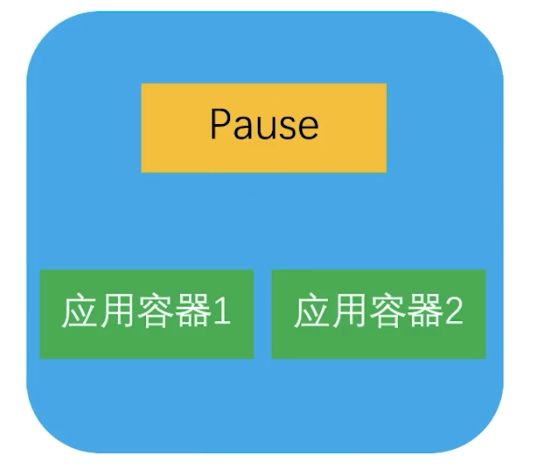

```bash
Pod生命周期
---Pod一旦被创建，会被master调度到某个具体的node上进行绑定
   Pod会呈现不同的状态
```


| **Value** | **Description**                                              |
| :-------- | ------------------------------------------------------------ |
| Pending   | The Pod has been accepted by the Kubernetes cluster, but one or more of the containers has not been set up and made ready to run. This includes time a Pod spends waiting to be scheduled as well as the time spent downloading container images over the network. |
| Running   | The Pod has been bound to a node, and all of the containers have been created. At least one container is still running, or is in the process of starting or restarting. |
| Succeeded | All containers in the Pod have terminated in success, and will not be restarted. |
| Failed    | All containers in the Pod have terminated, and at least one container has terminated in failure. That is, the container either exited with non-zero status or was terminated by the system. |
| Unknown   | For some reason the state of the Pod could not be obtained. This phase typically occurs due to an error in communicating with the node where the Pod should be running. |


```
Container states
As well as the phase of the Pod overall, Kubernetes tracks the state of each container inside a Pod. You can use container lifecycle hooks to trigger events to run at certain points in a container's lifecycle.

Once the scheduler assigns a Pod to a Node, the kubelet starts creating containers for that Pod using a container runtime. There are three possible container states: Waiting, Running, and Terminated.

To check the state of a Pod's containers, you can use kubectl describe pod <name-of-pod>. The output shows the state for each container within that Pod.

Each state has a specific meaning:

Waiting
If a container is not in either the Running or Terminated state, it is Waiting. A container in the Waiting state is still running the operations it requires in order to complete start up: for example, pulling the container image from a container image registry, or applying Secret data. When you use kubectl to query a Pod with a container that is Waiting, you also see a Reason field to summarize why the container is in that state.

Running
The Running status indicates that a container is executing without issues. If there was a postStart hook configured, it has already executed and finished. When you use kubectl to query a Pod with a container that is Running, you also see information about when the container entered the Running state.

Terminated
A container in the Terminated state began execution and then either ran to completion or failed for some reason. When you use kubectl to query a Pod with a container that is Terminated, you see a reason, an exit code, and the start and finish time for that container's period of execution.

If a container has a preStop hook configured, this hook runs before the container enters the Terminated state.


```


####  8.2.示例

```bash
第一个Pod：
# vi mypod.yaml
```

```yaml
apiVersion: v1
kind: Pod
metadata:
  name: mypod
spec:
  containers:
  - name: mypod
    image: busybox
    args:
    - /bin/sh
    - -c
    - echo "hello,world!" && sleep 3h
```

```bash
# kubectl create -f mypod.yaml 
pod/mypod created
# kubectl get pod
NAME    READY   STATUS              RESTARTS   AGE
mypod   0/1     ContainerCreating   0          3s
# kubectl get pod
NAME    READY   STATUS    RESTARTS   AGE
mypod   1/1     Running   0          4s
# kubectl get pod mypod 
NAME    READY   STATUS    RESTARTS   AGE
mypod   1/1     Running   0          11s
# kubectl get pod -owide
NAME    READY   STATUS    RESTARTS   AGE   IP             NODE          NOMINATED NODE   READINESS GATES
mypod   1/1     Running   0          10s   172.16.94.65   k8s-docker2   <none>           <none>
# kubectl logs -f mypod 
hello,world!
^C
# kubectl describe pod mypod 
Name:             mypod
Namespace:        default
Priority:         0
Service Account:  default
Node:             k8s-docker2/192.168.1.236
Start Time:       Wed, 08 Mar 2023 22:17:13 +0800
Labels:           <none>
Annotations:      cni.projectcalico.org/containerID: ce5597effe6382cb5a189e915ff777f2eb76390c80fef4a790de477fc24634f7
                  cni.projectcalico.org/podIP: 172.16.94.65/32
                  cni.projectcalico.org/podIPs: 172.16.94.65/32
Status:           Running
IP:               172.16.94.65
IPs:
  IP:  172.16.94.65
Containers:
  mypod:
    Container ID:  containerd://9e62823917b030d7bbd1640adf2a091e06150beda600b145eb1fd92f1b983ff0
    Image:         busybox
    Image ID:      docker.io/library/busybox@sha256:c118f538365369207c12e5794c3cbfb7b042d950af590ae6c287ede74f29b7d4
    Port:          <none>
    Host Port:     <none>
    Args:
      /bin/sh
      -c
      echo "hello,world!" && sleep 3h
    State:          Running
      Started:      Wed, 08 Mar 2023 22:17:20 +0800
    Ready:          True
    Restart Count:  0
    Environment:    <none>
    Mounts:
      /var/run/secrets/kubernetes.io/serviceaccount from kube-api-access-pqdc5 (ro)
Conditions:
  Type              Status
  Initialized       True 
  Ready             True 
  ContainersReady   True 
  PodScheduled      True 
Volumes:
  kube-api-access-pqdc5:
    Type:                    Projected (a volume that contains injected data from multiple sources)
    TokenExpirationSeconds:  3607
    ConfigMapName:           kube-root-ca.crt
    ConfigMapOptional:       <nil>
    DownwardAPI:             true
QoS Class:                   BestEffort
Node-Selectors:              <none>
Tolerations:                 node.kubernetes.io/not-ready:NoExecute op=Exists for 300s
                             node.kubernetes.io/unreachable:NoExecute op=Exists for 300s
Events:
  Type    Reason     Age   From               Message
  ----    ------     ----  ----               -------
  Normal  Scheduled  98s   default-scheduler  Successfully assigned default/mypod to k8s-docker2
  Normal  Pulling    97s   kubelet            Pulling image "busybox"
  Normal  Pulled     91s   kubelet            Successfully pulled image "busybox" in 6.439993681s
  Normal  Created    91s   kubelet            Created container mypod
  Normal  Started    91s   kubelet            Started container mypod

# ssh k8s-docker1 ctr -n k8s.io c ls|grep busybox
# ssh k8s-docker2 ctr -n k8s.io c ls|grep busybox
9e62823917b030d7bbd1640adf2a091e06150beda600b145eb1fd92f1b983ff0    docker.io/library/busybox:latest                                          io.containerd.runc.v2    
# ssh k8s-docker2 ctr -n k8s.io c info 9e62823917b030d7bbd1640adf2a091e06150beda600b145eb1fd92f1b983ff0
{
    "ID": "9e62823917b030d7bbd1640adf2a091e06150beda600b145eb1fd92f1b983ff0",
    "Labels": {
        "io.cri-containerd.kind": "container",
        "io.kubernetes.container.name": "mypod",
        "io.kubernetes.pod.name": "mypod",
        "io.kubernetes.pod.namespace": "default",
        "io.kubernetes.pod.uid": "3903ad86-dd5c-415f-9c1b-41f4518b1341"
    },
    "Image": "docker.io/library/busybox:latest",
    "Runtime": {
        "Name": "io.containerd.runc.v2",
        "Options": {
            "type_url": "containerd.runc.v1.Options"
        }
    },
    "SnapshotKey": "9e62823917b030d7bbd1640adf2a091e06150beda600b145eb1fd92f1b983ff0",
    "Snapshotter": "overlayfs",
    "CreatedAt": "2023-03-08T14:17:20.817335824Z",
    "UpdatedAt": "2023-03-08T14:17:20.817335824Z",
    "Extensions": {
        "io.cri-containerd.container.metadata": {
            "type_url": "github.com/containerd/cri/pkg/store/container/Metadata",
            "value": "...jwt.io...省略""
        }
    },
    "Spec": {
        "ociVersion": "1.0.2-dev",
        "process": {
            "user": {
                "uid": 0,
                "gid": 0,
                "additionalGids": [
                    0,
                    10
                ]
            },
            "args": [
                "/bin/sh",
                "-c",
                "echo \"hello,world!\" \u0026\u0026 sleep 3h"
            ],
            "env": [
                "PATH=/usr/local/sbin:/usr/local/bin:/usr/sbin:/usr/bin:/sbin:/bin",
                "HOSTNAME=mypod",
                "KUBERNETES_SERVICE_PORT_HTTPS=443",
                "KUBERNETES_PORT=tcp://10.96.0.1:443",
                "KUBERNETES_PORT_443_TCP=tcp://10.96.0.1:443",
                "KUBERNETES_PORT_443_TCP_PROTO=tcp",
                "KUBERNETES_PORT_443_TCP_PORT=443",
                "KUBERNETES_PORT_443_TCP_ADDR=10.96.0.1",
                "KUBERNETES_SERVICE_HOST=10.96.0.1",
                "KUBERNETES_SERVICE_PORT=443"
            ],
            "cwd": "/",
            "capabilities": {
                "bounding": [
                  ...省略...
                ],
                "effective": [
                  ...省略...
                ],
                "permitted": [
                  ...省略...
                ]
            },
            "apparmorProfile": "cri-containerd.apparmor.d",
            "oomScoreAdj": 1000
        },
        "root": {
            "path": "rootfs"
        },
        "mounts": [
            {
                "destination": "/proc",
                "type": "proc",
                "source": "proc",
                "options": [
                    "nosuid",
                    "noexec",
                    "nodev"
                ]
            },
            {
                "destination": "/dev",
                "type": "tmpfs",
                "source": "tmpfs",
                "options": [
                    "nosuid",
                    "strictatime",
                    "mode=755",
                    "size=65536k"
                ]
            },
            {
                "destination": "/dev/pts",
                "type": "devpts",
                "source": "devpts",
                "options": [
                    "nosuid",
                    "noexec",
                    "newinstance",
                    "ptmxmode=0666",
                    "mode=0620",
                    "gid=5"
                ]
            },
            {
                "destination": "/dev/mqueue",
                "type": "mqueue",
                "source": "mqueue",
                "options": [
                    "nosuid",
                    "noexec",
                    "nodev"
                ]
            },
            {
                "destination": "/sys",
                "type": "sysfs",
                "source": "sysfs",
                "options": [
                    "nosuid",
                    "noexec",
                    "nodev",
                    "ro"
                ]
            },
            {
                "destination": "/sys/fs/cgroup",
                "type": "cgroup",
                "source": "cgroup",
                "options": [
                    "nosuid",
                    "noexec",
                    "nodev",
                    "relatime",
                    "ro"
                ]
            },
            {
                "destination": "/etc/hosts",
                "type": "bind",
                "source": "/var/lib/kubelet/pods/3903ad86-dd5c-415f-9c1b-41f4518b1341/etc-hosts",
                "options": [
                    "rbind",
                    "rprivate",
                    "rw"
                ]
            },
            {
                "destination": "/dev/termination-log",
                "type": "bind",
                "source": "/var/lib/kubelet/pods/3903ad86-dd5c-415f-9c1b-41f4518b1341/containers/mypod/256ec88c",
                "options": [
                    "rbind",
                    "rprivate",
                    "rw"
                ]
            },
            {
                "destination": "/etc/hostname",
                "type": "bind",
                "source": "/var/lib/containerd/io.containerd.grpc.v1.cri/sandboxes/ce5597effe6382cb5a189e915ff777f2eb76390c80fef4a790de477fc24634f7/hostname",
                "options": [
                    "rbind",
                    "rprivate",
                    "rw"
                ]
            },
            {
                "destination": "/etc/resolv.conf",
                "type": "bind",
                "source": "/var/lib/containerd/io.containerd.grpc.v1.cri/sandboxes/ce5597effe6382cb5a189e915ff777f2eb76390c80fef4a790de477fc24634f7/resolv.conf",
                "options": [
                    "rbind",
                    "rprivate",
                    "rw"
                ]
            },
            {
                "destination": "/dev/shm",
                "type": "bind",
                "source": "/run/containerd/io.containerd.grpc.v1.cri/sandboxes/ce5597effe6382cb5a189e915ff777f2eb76390c80fef4a790de477fc24634f7/shm",
                "options": [
                    "rbind",
                    "rprivate",
                    "rw"
                ]
            },
            {
                "destination": "/var/run/secrets/kubernetes.io/serviceaccount",
                "type": "bind",
                "source": "/var/lib/kubelet/pods/3903ad86-dd5c-415f-9c1b-41f4518b1341/volumes/kubernetes.io~projected/kube-api-access-pqdc5",
                "options": [
                    "rbind",
                    "rprivate",
                    "ro"
                ]
            }
        ],
        "annotations": {
            "io.kubernetes.cri.container-name": "mypod",
            "io.kubernetes.cri.container-type": "container",
            "io.kubernetes.cri.image-name": "docker.io/library/busybox:latest",
            "io.kubernetes.cri.sandbox-id": "ce5597effe6382cb5a189e915ff777f2eb76390c80fef4a790de477fc24634f7",
            "io.kubernetes.cri.sandbox-name": "mypod",
            "io.kubernetes.cri.sandbox-namespace": "default",
            "io.kubernetes.cri.sandbox-uid": "3903ad86-dd5c-415f-9c1b-41f4518b1341"
        },
        "linux": {
            "resources": {
                "devices": [
                    {
                        "allow": false,
                        "access": "rwm"
                    }
                ],
                "memory": {},
                "cpu": {
                    "shares": 2,
                    "period": 100000
                }
            },
            "cgroupsPath": "kubepods-besteffort-pod3903ad86_dd5c_415f_9c1b_41f4518b1341.slice:cri-containerd:9e62823917b030d7bbd1640adf2a091e06150beda600b145eb1fd92f1b983ff0",
            "namespaces": [
                {
                    "type": "pid"
                },
                {
                    "type": "ipc",
                    "path": "/proc/689192/ns/ipc"
                },
                {
                    "type": "uts",
                    "path": "/proc/689192/ns/uts"
                },
                {
                    "type": "mount"
                },
                {
                    "type": "network",
                    "path": "/proc/689192/ns/net"
                }
            ],
            "maskedPaths": [
                "/proc/acpi",
                "/proc/kcore",
                "/proc/keys",
                "/proc/latency_stats",
                "/proc/timer_list",
                "/proc/timer_stats",
                "/proc/sched_debug",
                "/proc/scsi",
                "/sys/firmware"
            ],
            "readonlyPaths": [
                "/proc/asound",
                "/proc/bus",
                "/proc/fs",
                "/proc/irq",
                "/proc/sys",
                "/proc/sysrq-trigger"
            ]
        }
    }
}


# kubectl get pod
NAME    READY   STATUS    RESTARTS   AGE
mypod   1/1     Running   0          5m14s
# kubectl exec -it mypod /bin/sh
kubectl exec [POD] [COMMAND] is DEPRECATED and will be removed in a future version. Use kubectl exec [POD] -- [COMMAND] instead.
/ # 
/ # exit

# kubectl exec -it mypod -- /bin/sh
/ # ps x
PID   USER     TIME  COMMAND
    1 root      0:00 /bin/sh -c echo "hello,world!" && sleep 3h
   11 root      0:00 /bin/sh
   17 root      0:00 ps x
/ # exit

# kubectl exec -it mypod --
--as                        --container                 --password                  --token
--as-group                  --context                   --pod-running-timeout       --user
--as-uid                    --filename                  --profile                   --username
--cache-dir                 --insecure-skip-tls-verify  --profile-output            --v
--certificate-authority     --kubeconfig                --quiet                     --vmodule
--client-certificate        --log-flush-frequency       --request-timeout           --warnings-as-errors
--client-key                --match-server-version      --server                    
--cluster                   --namespace                 --tls-server-name           

# kubectl exec -it mypod --container mypod -- /bin/sh
/ # ps x
PID   USER     TIME  COMMAND
    1 root      0:00 /bin/sh -c echo "hello,world!" && sleep 3h
   18 root      0:00 /bin/sh
   24 root      0:00 ps x
/ # exit

# kubectl get pod -owide
NAME    READY   STATUS    RESTARTS   AGE     IP             NODE          NOMINATED NODE   READINESS GATES
mypod   1/1     Running   0          6m58s   172.16.94.65   k8s-docker2   <none>           <none>


```


```bash
第二个pod：
通过以下方式创建：
Kubectl apply -f- <<EOF
...省略内容...
EOF

状态是Succeeded
```

```bash
# kubectl apply -f- <<EOF
apiVersion: v1
kind: Pod
metadata:
  name: hello
  namespace: default
spec:
  restartPolicy: Never
  containers:
  - name: hello
    image: hello-world
EOF

pod/hello created
# kubectl get pod
NAME    READY   STATUS              RESTARTS        AGE
hello   0/1     ContainerCreating   0               5s
mypod   1/1     Running             31 (124m ago)   3d23h
# kubectl get pod
NAME    READY   STATUS      RESTARTS        AGE
hello   0/1     Completed   0               8s
mypod   1/1     Running     31 (124m ago)   3d23h

# kubectl describe pod hello 
Name:             hello
Namespace:        default
Priority:         0
Service Account:  default
Node:             k8s-docker1/192.168.1.235
Start Time:       Sun, 12 Mar 2023 21:22:50 +0800
Labels:           <none>
Annotations:      cni.projectcalico.org/containerID: 88ee28d450acd0ae81797c376e21e348b14acf53d0af31b79cde9d4036cb3566
                  cni.projectcalico.org/podIP: 
                  cni.projectcalico.org/podIPs: 
Status:           `Succeeded`
IP:               172.16.77.195
IPs:
  IP:  172.16.77.195
Containers:
  hello:
    Container ID:   containerd://605935380b92a9a55d74604bc4a1712989246c69660b91fc68db086db2278910
    Image:          hello-world
    Image ID:       docker.io/library/hello-world@sha256:6e8b6f026e0b9c419ea0fd02d3905dd0952ad1feea67543f525c73a0a790fefb
    Port:           <none>
    Host Port:      <none>
    State:          `Terminated`
      Reason:       Completed
      Exit Code:    0
      Started:      Sun, 12 Mar 2023 21:22:56 +0800
      Finished:     Sun, 12 Mar 2023 21:22:56 +0800
    Ready:          False
    Restart Count:  0
    Environment:    <none>
    Mounts:
      /var/run/secrets/kubernetes.io/serviceaccount from kube-api-access-6t87l (ro)
Conditions:
  Type              Status
  Initialized       True 
  Ready             False 
  ContainersReady   False 
  PodScheduled      True 
Volumes:
  kube-api-access-6t87l:
    Type:                    Projected (a volume that contains injected data from multiple sources)
    TokenExpirationSeconds:  3607
    ConfigMapName:           kube-root-ca.crt
    ConfigMapOptional:       <nil>
    DownwardAPI:             true
QoS Class:                   BestEffort
Node-Selectors:              <none>
Tolerations:                 node.kubernetes.io/not-ready:NoExecute op=Exists for 300s
                             node.kubernetes.io/unreachable:NoExecute op=Exists for 300s
Events:
  Type    Reason     Age   From               Message
  ----    ------     ----  ----               -------
  Normal  Scheduled  17s   default-scheduler  Successfully assigned default/hello to k8s-docker1
  Normal  Pulling    16s   kubelet            Pulling image "hello-world"
  Normal  Pulled     11s   kubelet            Successfully pulled image "hello-world" in 5.021766508s
  Normal  Created    11s   kubelet            Created container hello
  Normal  Started    11s   kubelet            Started container hello
```


### 9.标签和标签选择器
#### 9.1.标签

```
---Label是附在kubernetes对象(如Pod，deployment等)上的键值对(key-value)，可以在创建时指定，也可以在创建后指定
---Label的值本身不具备具体含义，但可以通过label来筛选对象特定的子集，源于管理
---每一个对象可以有多个标签

例如：
"metadata": {
  "labels": {
    "key1" : "value1",
    "key2" : "value2"
  }
}
```


```
标签的语法：
---标签由一组键值对组成
---Label key的组成：
   -key必须是唯一的
   -可以使用前缀，使用/分割，前缀必须是DNS子域，不得超过253个字符，系统中的自动化组件创建的label必须指定前缀，
    Kubernetes.io/由kubernetes保留
   -不得超过63个字符
   -起始必须是字母(大小写都可以)或数字，中间可以有连字符、下划线和点
---Label value的组成：
   -不得超过63个字符
   -起始必须是字母(大小写都可以)或数字，中间可以有连字符、下划线和点
```

```bash
# kubectl get nodes
NAME          STATUS   ROLES           AGE    VERSION
k8s-docker1   Ready    worker          5d3h   v1.25.4
k8s-docker2   Ready    worker          5d3h   v1.25.4
k8s-master    Ready    control-plane   5d3h   v1.25.4
# kubectl get nodes --show-
--show-kind            --show-labels          --show-managed-fields  
# kubectl get nodes --show-labels 
NAME          STATUS   ROLES           AGE    VERSION   LABELS
k8s-docker1   Ready    worker          5d3h   v1.25.4   beta.kubernetes.io/arch=amd64,beta.kubernetes.io/os=linux,kubernetes.io/arch=amd64,kubernetes.io/hostname=k8s-docker1,kubernetes.io/os=linux,node-role.kubernetes.io/worker=
k8s-docker2   Ready    worker          5d3h   v1.25.4   beta.kubernetes.io/arch=amd64,beta.kubernetes.io/os=linux,kubernetes.io/arch=amd64,kubernetes.io/hostname=k8s-docker2,kubernetes.io/os=linux,node-role.kubernetes.io/worker=
k8s-master    Ready    control-plane   5d3h   v1.25.4   beta.kubernetes.io/arch=amd64,beta.kubernetes.io/os=linux,kubernetes.io/arch=amd64,kubernetes.io/hostname=k8s-master,kubernetes.io/os=linux,node-role.kubernetes.io/control-plane=,node.kubernetes.io/exclude-from-external-load-balancers=

# kubectl get pod --show-labels 
NAME    READY   STATUS      RESTARTS        AGE     LABELS
hello   0/1     Completed   0               30m     <none>
mypod   1/1     Running     31 (154m ago)   3d23h   <none>
```


```bash
创建pod时指定标签：
---labelpod.yaml文件创建一个pod
---在创建时，指定两个label
   app: busybox
   version: new
```

```yaml
apiVersion: v1
kind: Pod
metadata: 
  name: labelpod
  labels:
    app: busybox
    version: new
  namespace: default
spec:
  containers:
  - name: labelpod
    image: busybox
    args:
    - /bin/sh
    - -c
    - echo "labelpod" && sleep 3000
```

```bash
# kubectl apply -f labelpod.yaml 
pod/labelpod created
# kubectl get pod 
NAME       READY   STATUS              RESTARTS        AGE
hello      0/1     Completed           0               34m
labelpod   0/1     ContainerCreating   0               4s
mypod      1/1     Running             31 (159m ago)   3d23h
# kubectl get pod 
NAME       READY   STATUS      RESTARTS        AGE
hello      0/1     Completed   0               35m
labelpod   1/1     Running     0               9s
mypod      1/1     Running     31 (159m ago)   3d23h

# kubectl logs -f labelpod 
labelpod
^C

# kubectl get pod --show-labels 
NAME       READY   STATUS      RESTARTS        AGE     LABELS
hello      0/1     Completed   0               35m     <none>
labelpod   1/1     Running     0               27s     app=busybox,version=new
mypod      1/1     Running     31 (159m ago)   3d23h   <none>

```


- 同样可以使用label指令在已创建的对象上添加标签

```bash
# kubectl get pod --show-labels 
NAME       READY   STATUS      RESTARTS        AGE     LABELS
hello      0/1     Completed   0               9s      <none>
labelpod   1/1     Running     0               3m52s   app=busybox,version=new
mypod      1/1     Running     31 (162m ago)   3d23h   <none>

# kubectl label pods labelpod time=2023
pod/labelpod labeled

# kubectl get pods --show-labels
NAME       READY   STATUS      RESTARTS        AGE     LABELS
hello      0/1     Completed   0               5m14s   <none>
labelpod   1/1     Running     0               8m57s   app=busybox,time=2023,version=new
mypod      1/1     Running     31 (168m ago)   3d23h   <none>

# kubectl label pods labelpod time=2025
error: 'time' already has a value (2023), and --overwrite is false

# kubectl get pods --show-labels
NAME       READY   STATUS      RESTARTS        AGE     LABELS
hello      0/1     Completed   0               6m58s   <none>
labelpod   1/1     Running     0               10m     app=busybox,time=2023,version=new
mypod      1/1     Running     31 (169m ago)   3d23h   <none>

# kubectl label pods labelpod time=2025 --overwrite 
pod/labelpod labeled

# kubectl get pods --show-labels
NAME       READY   STATUS      RESTARTS        AGE     LABELS
hello      0/1     Completed   0               7m27s   <none>
labelpod   1/1     Running     0               11m     app=busybox,time=2025,version=new
mypod      1/1     Running     31 (170m ago)   3d23h   <none>
```


- 删除标签

```bash
# kubectl get pods --show-labels
NAME       READY   STATUS      RESTARTS        AGE     LABELS
hello      0/1     Completed   0               7m27s   <none>
labelpod   1/1     Running     0               11m     app=busybox,time=2025,version=new
mypod      1/1     Running     31 (170m ago)   3d23h   <none>

# kubectl label pods labelpod time=2025-
error: invalid label value: "time=2025-": a valid label must be an empty string or consist of alphanumeric characters, '-', '_' or '.', and must start and end with an alphanumeric character (e.g. 'MyValue',  or 'my_value',  or '12345', regex used for validation is '(([A-Za-z0-9][-A-Za-z0-9_.]*)?[A-Za-z0-9])?')

# kubectl label pods labelpod time-
pod/labelpod unlabeled

# kubectl get pods --show-labels
NAME       READY   STATUS      RESTARTS        AGE     LABELS
hello      0/1     Completed   0               8m52s   <none>
labelpod   1/1     Running     0               12m     app=busybox,version=new
mypod      1/1     Running     31 (171m ago)   3d23h   <none>
```

#### 9.2.标签选择器

```
Labels Selectors:
---标签不具备唯一性，在通常情况下，多个不的对象有着相同的标签
---通过标签选择器，用户或客户端可以指定批量的对象进行操作
   标签选择器也是kubernetes的核心分组方式
---目前支持两种标签选择器：
   基于等值的(equality-based)和基于集合的(set-based)
```

- 基于等值的标签选择器

```
Equality-based标签选择器允许用标签的key和values过滤
有三种运算符可以使用：=/==/!=
前两种运算符同义，代表相等，后一种代表不相等
```

```bash
# kubectl get -h|grep -A 2 ^\ \ \ \ -l
    -l, --selector='':
	Selector (label query) to filter on, supports '=', '==', and '!='.(e.g. -l key1=value1,key2=value2). Matching objects must satisfy all of the specified label constraints.


# kubectl get pod --show-labels 
NAME        READY   STATUS      RESTARTS         AGE     LABELS
hello       0/1     Completed   0                12h     <none>
labelpod    1/1     Running     15 (4m59s ago)   12h     app=busybox,version=new
labelpod1   1/1     Running     0                3m8s    app=busybox,version=product
labelpod2   1/1     Running     0                3m8s    app=busybox,version=new
mypod       1/1     Running     36 (14m ago)     4d12h   <none>

# kubectl get pods -l version=new
NAME        READY   STATUS    RESTARTS         AGE
labelpod    1/1     Running   15 (5m14s ago)   12h
labelpod2   1/1     Running   0                3m23s
# kubectl get pods -l version=new --show-labels
NAME        READY   STATUS    RESTARTS         AGE     LABELS
labelpod    1/1     Running   15 (5m25s ago)   12h     app=busybox,version=new
labelpod2   1/1     Running   0                3m34s   app=busybox,version=new

# kubectl get pods -l version!=new --show-labels
NAME        READY   STATUS      RESTARTS       AGE     LABELS
hello       0/1     Completed   0              12h     <none>
labelpod1   1/1     Running     0              3m41s   app=busybox,version=product
mypod       1/1     Running     36 (15m ago)   4d12h   <none>

# kubectl get pods -l version=product --show-labels
NAME        READY   STATUS    RESTARTS   AGE     LABELS
labelpod1   1/1     Running   0          3m49s   app=busybox,version=product

```


- 基于集合标签选择器

```yaml
Set-based的标签条件允许使用一组value来过滤key
支持三种操作符：in/notin/exists
其中exists仅针对key符号

enviroment in (production, qa)
tier notin (frontend, backend)
partition
!partition

两种选择器也可以混用，如：
partition in (customerA, customerB), enviroment!=qa
```


- 标签列

```bash
# kubectl label pods labelpod time=2021
pod/labelpod labeled
# kubectl label pods labelpod1 time=2022
pod/labelpod1 labeled
# kubectl label pods labelpod2 time=2023
pod/labelpod2 labeled

# kubectl get pods --show-labels
NAME        READY   STATUS      RESTARTS       AGE     LABELS
hello       0/1     Completed   0              12h     <none>
labelpod    1/1     Running     15 (18m ago)   12h     app=busybox,time=2021,version=new
labelpod1   1/1     Running     0              16m     app=busybox,time=2022,version=product
labelpod2   1/1     Running     0              16m     app=busybox,time=2023,version=new
mypod       1/1     Running     36 (27m ago)   4d12h   <none>

# kubectl get  pods  -L version --show-labels
NAME        READY   STATUS      RESTARTS       AGE     VERSION   LABELS
hello       0/1     Completed   0              12h               <none>
labelpod    1/1     Running     15 (19m ago)   12h     new       app=busybox,time=2021,version=new
labelpod1   1/1     Running     0              17m     product   app=busybox,time=2022,version=product
labelpod2   1/1     Running     0              17m     new       app=busybox,time=2023,version=new
mypod       1/1     Running     36 (29m ago)   4d12h             <none>

# kubectl get  pods  -L time --show-labels
NAME        READY   STATUS      RESTARTS       AGE     TIME   LABELS
hello       0/1     Completed   0              12h            <none>
labelpod    1/1     Running     15 (19m ago)   12h     2021   app=busybox,time=2021,version=new
labelpod1   1/1     Running     0              17m     2022   app=busybox,time=2022,version=product
labelpod2   1/1     Running     0              17m     2023   app=busybox,time=2023,version=new
mypod       1/1     Running     36 (29m ago)   4d12h          <none>

```


- 给节点打上标签

```bash
# kubectl get nodes
NAME          STATUS   ROLES           AGE     VERSION
k8s-docker1   Ready    worker          5d16h   v1.25.4
k8s-docker2   Ready    worker          5d16h   v1.25.4
k8s-master    Ready    control-plane   5d17h   v1.25.4

# kubectl get nodes --show-labels
NAME          STATUS   ROLES           AGE     VERSION   LABELS
k8s-docker1   Ready    worker          5d16h   v1.25.4   beta.kubernetes.io/arch=amd64,beta.kubernetes.io/os=linux,kubernetes.io/arch=amd64,kubernetes.io/hostname=k8s-docker1,kubernetes.io/os=linux,node-role.kubernetes.io/worker=
k8s-docker2   Ready    worker          5d16h   v1.25.4   beta.kubernetes.io/arch=amd64,beta.kubernetes.io/os=linux,kubernetes.io/arch=amd64,kubernetes.io/hostname=k8s-docker2,kubernetes.io/os=linux,node-role.kubernetes.io/worker=
k8s-master    Ready    control-plane   5d17h   v1.25.4   beta.kubernetes.io/arch=amd64,beta.kubernetes.io/os=linux,kubernetes.io/arch=amd64,kubernetes.io/hostname=k8s-master,kubernetes.io/os=linux,node-role.kubernetes.io/control-plane=,node.kubernetes.io/exclude-from-external-load-balancers=

# kubectl label nodes k8s-docker1 env=test
node/k8s-docker1 labeled

# kubectl get nodes --show-labels
NAME          STATUS   ROLES           AGE     VERSION   LABELS
k8s-docker1   Ready    worker          5d16h   v1.25.4   beta.kubernetes.io/arch=amd64,beta.kubernetes.io/os=linux,env=test,kubernetes.io/arch=amd64,kubernetes.io/hostname=k8s-docker1,kubernetes.io/os=linux,node-role.kubernetes.io/worker=
k8s-docker2   Ready    worker          5d16h   v1.25.4   beta.kubernetes.io/arch=amd64,beta.kubernetes.io/os=linux,kubernetes.io/arch=amd64,kubernetes.io/hostname=k8s-docker2,kubernetes.io/os=linux,node-role.kubernetes.io/worker=
k8s-master    Ready    control-plane   5d17h   v1.25.4   beta.kubernetes.io/arch=amd64,beta.kubernetes.io/os=linux,kubernetes.io/arch=amd64,kubernetes.io/hostname=k8s-master,kubernetes.io/os=linux,node-role.kubernetes.io/control-plane=,node.kubernetes.io/exclude-from-external-load-balancers=

# kubectl get nodes -L env
NAME          STATUS   ROLES           AGE     VERSION   ENV
k8s-docker1   Ready    worker          5d16h   v1.25.4   test
k8s-docker2   Ready    worker          5d16h   v1.25.4   
k8s-master    Ready    control-plane   5d17h   v1.25.4   

# kubectl get nodes -l env=test
NAME          STATUS   ROLES    AGE     VERSION
k8s-docker1   Ready    worker   5d16h   v1.25.4

# kubectl get nodes -l env=test --show-labels 
NAME          STATUS   ROLES    AGE     VERSION   LABELS
k8s-docker1   Ready    worker   5d16h   v1.25.4   beta.kubernetes.io/arch=amd64,beta.kubernetes.io/os=linux,env=test,kubernetes.io/arch=amd64,kubernetes.io/hostname=k8s-docker1,kubernetes.io/os=linux,node-role.kubernetes.io/worker=

```


- 节点调度三种方式

```yaml
1)通过nodeName指定节点
nodeName: k8s-docker1

2)通过nodeSelector选择节点
nodeSelector:
  disk=ssd
  
3)通过 node affinity优先选择节点
affinity:
  nodeAffinity:
    requiredDuringSchedulingIgnoredDuringExecution:
      nodeSelectorTerms:
      - key: disk
        operator: In
        values:
        - ssd
```

- yaml示例

  - nodeName

  ```yaml
  apiVersion: apps/v1
  kind: Deployment
  metadata:
    name: nginx-dep1
    namespace: default
    labels:
      app: nginx
  spec:
    replicas: 3
    selector:
      matchLabels:
        app: nginx
    template:
      metadata:
        labels:
          app: nginx
      spec:
        nodeName: k8s-docker1
        containers:
          - name: nginx
            image: nginx:1.7.9
            ports:
            - containerPort: 80
  ```

  ```bash
  # kubectl apply -f nodeName.yaml 
  deployment.apps/nginx-dep1 created
  
  # kubectl get deployments.apps 
  NAME         READY   UP-TO-DATE   AVAILABLE   AGE
  nginx-dep1   3/3     3            3           71s
  # kubectl get pods --show-labels -l app=nginx
  NAME                          READY   STATUS    RESTARTS   AGE   LABELS
  nginx-dep1-5d579b96c7-9vjms   1/1     Running   0          92s   app=nginx,pod-template-hash=5d579b96c7
  nginx-dep1-5d579b96c7-n8cd2   1/1     Running   0          92s   app=nginx,pod-template-hash=5d579b96c7
  nginx-dep1-5d579b96c7-s55vx   1/1     Running   0          92s   app=nginx,pod-template-hash=5d579b96c7
  # kubectl get pods --show-labels -l app=nginx -owide
  NAME                          READY   STATUS    RESTARTS   AGE    IP              NODE          NOMINATED NODE   READINESS GATES   LABELS
  nginx-dep1-5d579b96c7-9vjms   1/1     Running   0          111s   172.16.77.200   k8s-docker1   <none>           <none>            app=nginx,pod-template-hash=5d579b96c7
  nginx-dep1-5d579b96c7-n8cd2   1/1     Running   0          111s   172.16.77.199   k8s-docker1   <none>           <none>            app=nginx,pod-template-hash=5d579b96c7
  nginx-dep1-5d579b96c7-s55vx   1/1     Running   0          111s   172.16.77.201   k8s-docker1   <none>           <none>            app=nginx,pod-template-hash=5d579b96c7
  
  # kubectl get pods -owide
  NAME                          READY   STATUS      RESTARTS        AGE     IP              NODE          NOMINATED NODE   READINESS GATES
  nginx-dep1-5d579b96c7-9vjms   1/1     Running     0               2m4s    172.16.77.200   k8s-docker1   <none>           <none>
  nginx-dep1-5d579b96c7-n8cd2   1/1     Running     0               2m4s    172.16.77.199   k8s-docker1   <none>           <none>
  nginx-dep1-5d579b96c7-s55vx   1/1     Running     0               2m4s    172.16.77.201   k8s-docker1   <none>           <none>
  ```

  

  - nodeSelector

  ```yaml
  apiVersion: apps/v1
  kind: Deployment
  metadata:
    name: nginx-dep2
    namespace: default
    labels:
      app: nginx
  spec:
    replicas: 3
    selector:
      matchLabels:
        app: nginx
    template:
      metadata:
        labels:
          app: nginx
      spec:
        nodeSelector:
          env: ssd
        containers:
          - name: nginx
            image: nginx:1.7.9
            ports:
            - containerPort: 80
  ```

  ```bash
  # kubectl get nodes -L env
  NAME          STATUS   ROLES           AGE     VERSION   ENV
  k8s-docker1   Ready    worker          5d17h   v1.25.4   test
  k8s-docker2   Ready    worker          5d17h   v1.25.4   
  k8s-master    Ready    control-plane   5d17h   v1.25.4   
  
  # kubectl label nodes k8s-docker2 env=ssd
  node/k8s-docker2 labeled
  
  # kubectl get nodes -L env
  NAME          STATUS   ROLES           AGE     VERSION   ENV
  k8s-docker1   Ready    worker          5d17h   v1.25.4   test
  k8s-docker2   Ready    worker          5d17h   v1.25.4   ssd
  k8s-master    Ready    control-plane   5d17h   v1.25.4   
  
  # kubectl apply -f nodeSelector.yaml 
  deployment.apps/nginx-dep2 created
  
  # kubectl get pods -owide
  NAME                          READY   STATUS      RESTARTS       AGE     IP              NODE          NOMINATED NODE   READINESS GATES
  nginx-dep1-5d579b96c7-9vjms   1/1     Running     0              10m     172.16.77.200   k8s-docker1   <none>           <none>
  nginx-dep1-5d579b96c7-n8cd2   1/1     Running     0              10m     172.16.77.199   k8s-docker1   <none>           <none>
  nginx-dep1-5d579b96c7-s55vx   1/1     Running     0              10m     172.16.77.201   k8s-docker1   <none>           <none>
  nginx-dep2-579fb45b55-6r66n   1/1     Running     0              34s     172.16.94.68    k8s-docker2   <none>           <none>
  nginx-dep2-579fb45b55-mqf78   1/1     Running     0              34s     172.16.94.67    k8s-docker2   <none>           <none>
  nginx-dep2-579fb45b55-xv2x5   1/1     Running     0              34s     172.16.94.69    k8s-docker2   <none>           <none>
  
  ```

  

  - node affinity

  ```yaml
  apiVersion: apps/v1
  kind: Deployment
  metadata:
    name: nginx-dep3
    namespace: default
    labels:
      app: nginx
  spec:
    replicas: 3
    selector:
      matchLabels:
        app: nginx
    template:
      metadata:
        labels:
          app: nginx
      spec:
        affinity:
          nodeAffinity:
            requiredDuringSchedulingIgnoredDuringExecution:
              nodeSelectorTerms:
              - matchExpressions:
                - key: env
                  operator: In
                  values:
                  - test
        containers:
          - name: nginx
            image: nginx:1.7.9
            ports:
            - containerPort: 80 
  
  ```

  ```bash
  # kubectl get nodes -L env
  NAME          STATUS   ROLES           AGE     VERSION   ENV
  k8s-docker1   Ready    worker          5d17h   v1.25.4   test
  k8s-docker2   Ready    worker          5d17h   v1.25.4   ssd
  k8s-master    Ready    control-plane   5d17h   v1.25.4   
  
  # kubectl apply -f nodeAffinity.yaml 
  deployment.apps/nginx-dep3 created
  
  # kubectl get pods -owide
  NAME                          READY   STATUS      RESTARTS       AGE     IP              NODE          NOMINATED NODE   READINESS GATES
  nginx-dep1-5d579b96c7-9vjms   1/1     Running     0              19m     172.16.77.200   k8s-docker1   <none>           <none>
  nginx-dep1-5d579b96c7-n8cd2   1/1     Running     0              19m     172.16.77.199   k8s-docker1   <none>           <none>
  nginx-dep1-5d579b96c7-s55vx   1/1     Running     0              19m     172.16.77.201   k8s-docker1   <none>           <none>
  nginx-dep2-579fb45b55-6r66n   1/1     Running     0              9m4s    172.16.94.68    k8s-docker2   <none>           <none>
  nginx-dep2-579fb45b55-mqf78   1/1     Running     0              9m4s    172.16.94.67    k8s-docker2   <none>           <none>
  nginx-dep2-579fb45b55-xv2x5   1/1     Running     0              9m4s    172.16.94.69    k8s-docker2   <none>           <none>
  nginx-dep3-5468bc7999-9xl9z   1/1     Running     0              3m27s   172.16.77.203   k8s-docker1   <none>           <none>
  nginx-dep3-5468bc7999-cttrv   1/1     Running     0              3m27s   172.16.77.204   k8s-docker1   <none>           <none>
  nginx-dep3-5468bc7999-nw6m2   1/1     Running     0              3m27s   172.16.77.202   k8s-docker1   <none>           <none>
  
  ```

### 10.Service服务发现

#### 10.1.Service基本概念

- Pod的特征

  - Pod有自己独立的IP
  - Pod可以被创建、销毁
  - 当扩缩容时，pod的数量会发生变更
  - 当pod故障时，replicaset会创建新的pod
  - 如何保证在pod进行如此多变化时，业务都能被访问？

- 一种解决方案

  - 通过逻辑对象

  

- Service

  - kubernetes service定义了这样一种抽象：

  ​       逻辑上的一组pod，一种可以访问它们的策略---通常称为微服务

  ​       这一组pod能够被service访问到，通常是通过Label Selector实现的

  - Service的实现类型
    - ClusterIP: 提供一个集群内部的虚拟IP地址以供pod访问(默认模式)
    - NodePort: 在node上打开一个端口以供外部访问
    - LoadBalancer: 通过外部的负载均衡器来访问

- Service模型

  

- Endpoint Controller

  - 负责生成和维护所有endpoint对象的控制器
  - 负责监听service和对应pod的变化
  - 监听到service被删除，则删除和该service同名的endpoint对象
  - 监听到新的service被创建，则根据新建service信息获取相关pod列表，然后创建对应endpoint对象
  - 监听到service被更新，则根据更新后的service信息获取相关pod列表，然后更新对应endpoint对象
  - 监听到pod事件，则更新对应的service的endpoint对象，将pod ip记录到endpoint中

- kube-proxy iptables

  

  

  - In this mode, kube-proxy watches the Kubernetes [control plane](https://kubernetes.io/docs/reference/glossary/?all=true#term-control-plane) for the addition and removal of Service and EndpointSlice [objects.](https://kubernetes.io/docs/concepts/overview/working-with-objects/kubernetes-objects/#kubernetes-objects) For each Service, it installs iptables rules, which capture traffic to the Service's `clusterIP` and `port`, and redirect that traffic to one of the Service's backend sets. For each endpoint, it installs iptables rules which select a backend Pod.

  

- kube-proxy ipvs

  

  

  - In `ipvs` mode, kube-proxy watches Kubernetes Services and EndpointSlices, calls `netlink` interface to create IPVS rules accordingly and synchronizes IPVS rules with Kubernetes Services and EndpointSlices periodically. This control loop ensures that IPVS status matches the desired state. When accessing a Service, IPVS directs traffic to one of the backend Pods.It uses a hash table as the underlying data structure and works in the kernel space.
  - IPVS provides more options for balancing traffic to backend Pods; these are:
    - `rr`: round-robin
    - `lc`: least connection (smallest number of open connections)
    - `dh`: destination hashing
    - `sh`: source hashing
    - `sed`: shortest expected delay
    - `nq`: never queue

- iptables VS IPVS


#### 10.2.服务发现

- 创建后端Deployment

  ```bash
  # kubectl create -f httpd.yaml
  deployment.apps/httpd created
  ```

  

  ```yaml
  # httpd.yaml
  apiVersion: apps/v1
  kind: Deployment
  metadata:
    name: httpd
    namespace: default
  spec:
    replicas: 3
    selector:
      matchLabels:
        app: httpd
    template:
      metadata:
        labels:
          app: httpd
      spec:
        containers:
        - name: httpd
          image: httpd
          ports:
          - containerPort: 80
  ```

  ```bash
  #第二种办法，直接创建deployment
  # kubectl get pod
  No resources found in default namespace.
  
  # kubectl create -f- <<EOF
  apiVersion: apps/v1
  kind: Deployment
  metadata:
    name: httpd
    namespace: default
  spec:
    replicas: 3
    selector:
      matchLabels:
        app: httpd
    template:
      metadata:
        labels:
          app: httpd
      spec:
        containers:
        - name: httpd
          image: httpd
          ports:
          - containerPort: 80
  EOF
  
  ```

  

- 创建对应的service---默认为ClusterIP类型

  - spec参数中添加selector字段，指定一组label的键值对，本实例中为app: httpd，该值和上面的deployment(httpd)中的相匹配
  - ports参数中，需要指定两个端口：
    - port为该service的端口，客户端访问该服务时使用
    - targetPort为后端pod的端口，需要与之前创建的pod提供服务端口(即containerPort)一致

  ```yam
  #httpd-svc.yaml
  apiVersion: v1
  kind: Service
  metadata:
    name: httpd-svc
    namespace: default
  spec:
    type: ClusterIP
    selector:
      app: httpd
    ports:
    - name: httpd-svc-port
      protocol: TCP
      port: 8080
      targetPort: 80
  ```

  ```bash
  # kubectl create -f httpd-svc.yaml
  service/httpd-svc created
  ```

- 也可以两个yaml一起创建，中间加上---分割

  ```bash
  kubectl create -f- <<EOF
  apiVersion: apps/v1
  kind: Deployment
  metadata:
    name: httpd
    namespace: default
  spec:
    replicas: 3
    selector:
      matchLabels:
        app: httpd
    template:
      metadata:
        labels:
          app: httpd
      spec:
        containers:
        - name: httpd
          image: httpd
          ports:
          - containerPort: 80
  ---
  apiVersion: v1
  kind: Service
  metadata:
    name: httpd-svc
    namespace: default
  spec:
    type: ClusterIP
    selector:
      app: httpd
    ports:
    - name: httpd-svc-port
      protocol: TCP
      port: 8080
      targetPort: 80
  EOF
  
  ```

  

- 查看service

  - 查看service简要信息

    ```bash
    # kubectl get service
    NAME         TYPE        CLUSTER-IP       EXTERNAL-IP   PORT(S)    AGE
    httpd-svc    ClusterIP   10.111.228.202   <none>        8080/TCP   108s
    kubernetes   ClusterIP   10.96.0.1        <none>        443/TCP    27d
    ```

  - 测试service是否正常提供服务

    ```bash
    # curl 10.111.228.202:8080
    <html><body><h1>It works!</h1></body></html>
    ```

  - 使用describe可以查看service详细信息

    ```bash
    # kubectl describe service httpd-svc 
    Name:              httpd-svc
    Namespace:         default
    Labels:            <none>
    Annotations:       <none>
    Selector:          app=httpd
    Type:              ClusterIP
    IP Family Policy:  SingleStack
    IP Families:       IPv4
    IP:                10.111.228.202
    IPs:               10.111.228.202
    Port:              httpd-svc-port  8080/TCP
    TargetPort:        80/TCP
    Endpoints:         172.16.77.248:80,172.16.94.85:80,172.16.94.90:80
    Session Affinity:  None
    Events:            <none>
    ```

  - 查看endpoints

    ```bash
    # kubectl get endpoints
    NAME         ENDPOINTS                                          AGE
    httpd-svc    172.16.77.248:80,172.16.94.85:80,172.16.94.90:80   6m56s
    kubernetes   192.168.1.234:6443                                 27d
    ```

  - 查看pod

    ```bash
    # kubectl get pods -owide
    NAME                     READY   STATUS    RESTARTS   AGE   IP              NODE          NOMINATED NODE   READINESS GATES
    httpd-85c6cdcddd-5ksrk   1/1     Running   0          16m   172.16.94.85    k8s-docker2   <none>           <none>
    httpd-85c6cdcddd-ddjkf   1/1     Running   0          16m   172.16.77.248   k8s-docker1   <none>           <none>
    httpd-85c6cdcddd-x2fj6   1/1     Running   0          16m   172.16.94.90    k8s-docker2   <none>           <none>
    ```

  - 查看所有信息

    ```bash
    # kubectl get all
    NAME                         READY   STATUS    RESTARTS   AGE
    pod/httpd-85c6cdcddd-5ksrk   1/1     Running   0          16m
    pod/httpd-85c6cdcddd-ddjkf   1/1     Running   0          16m
    pod/httpd-85c6cdcddd-x2fj6   1/1     Running   0          16m
    
    NAME                 TYPE        CLUSTER-IP       EXTERNAL-IP   PORT(S)    AGE
    service/httpd-svc    ClusterIP   10.111.228.202   <none>        8080/TCP   7m55s
    service/kubernetes   ClusterIP   10.96.0.1        <none>        443/TCP    27d
    
    NAME                    READY   UP-TO-DATE   AVAILABLE   AGE
    deployment.apps/httpd   3/3     3            3           16m
    
    NAME                               DESIRED   CURRENT   READY   AGE
    replicaset.apps/httpd-85c6cdcddd   3         3         3       16m
    
    # kubectl get all -owide
    NAME                         READY   STATUS    RESTARTS   AGE   IP              NODE          NOMINATED NODE   READINESS GATES
    pod/httpd-85c6cdcddd-5ksrk   1/1     Running   0          16m   172.16.94.85    k8s-docker2   <none>           <none>
    pod/httpd-85c6cdcddd-ddjkf   1/1     Running   0          16m   172.16.77.248   k8s-docker1   <none>           <none>
    pod/httpd-85c6cdcddd-x2fj6   1/1     Running   0          16m   172.16.94.90    k8s-docker2   <none>           <none>
    
    NAME                 TYPE        CLUSTER-IP       EXTERNAL-IP   PORT(S)    AGE    SELECTOR
    service/httpd-svc    ClusterIP   10.111.228.202   <none>        8080/TCP   8m4s   app=httpd
    service/kubernetes   ClusterIP   10.96.0.1        <none>        443/TCP    27d    <none>
    
    NAME                    READY   UP-TO-DATE   AVAILABLE   AGE   CONTAINERS   IMAGES   SELECTOR
    deployment.apps/httpd   3/3     3            3           16m   httpd        httpd    app=httpd
    
    NAME                               DESIRED   CURRENT   READY   AGE   CONTAINERS   IMAGES   SELECTOR
    replicaset.apps/httpd-85c6cdcddd   3         3         3       16m   httpd        httpd    app=httpd,pod-template-hash=85c6cdcddd
    ```

    

- 创建可供外部访问的Service---nodePort类型
  
      ```yaml
      #httpd-svc-np.yaml
      apiVersion: v1
      kind: Service
      metadata:
        name: httpd-svc-np
        namespace: default
      spec:
        type: NodePort
        selector:
          app: httpd
        ports:
        - name: httpd-svc-np-port
          protocol: TCP
          port: 8081
          targetPort: 80
          nodePort: 31228
      
      ```
      
      ```bash
      # kubectl create -f httpd-svc-np.yaml
      service/httpd-svc-np created
      ```
  
  - 可以使用nodePort字段指定对外服务端口，如果不进行指定，系统会自动分配空闲端口。端口范围：30000-32767
  
  - 访问时，通过访问"节点IP地址:端口"来进行服务使用
  
  - 访问新创建的service：httpd-svc-np
  
    ```bash
    # kubectl get svc
    NAME           TYPE        CLUSTER-IP       EXTERNAL-IP   PORT(S)          AGE
    httpd-svc      ClusterIP   10.111.228.202   <none>        8080/TCP         15m
    httpd-svc-np   NodePort    10.100.15.126    <none>        8081:31228/TCP   4s
    kubernetes     ClusterIP   10.96.0.1        <none>        443/TCP          27d
    
    # kubectl get endpoints
    NAME           ENDPOINTS                                          AGE
    httpd-svc      172.16.77.248:80,172.16.94.85:80,172.16.94.90:80   19m
    httpd-svc-np   172.16.77.248:80,172.16.94.85:80,172.16.94.90:80   3m28s
    kubernetes     192.168.1.234:6443                                 27d
    
    # curl 172.16.77.248:80
    <html><body><h1>It works!</h1></body></html>
    
    # curl 10.100.15.126:8081
    <html><body><h1>It works!</h1></body></html>
    
    # curl localhost:31228
    <html><body><h1>It works!</h1></body></html>
    ```
  
    

#### 10.3.集群中的DNS

- CoreDNS

  - kube-system命名空间下有coredns的pod

    ```bash
    # kubectl -n kube-system get pod |grep dns
    coredns-7f8cbcb969-gmxrt                   1/1     Running   0              28d
    coredns-7f8cbcb969-mskms                   1/1     Running   0              28d
    
    # kubectl -n kube-system get svc
    NAME       TYPE        CLUSTER-IP   EXTERNAL-IP   PORT(S)                  AGE
    kube-dns   ClusterIP   10.96.0.10   <none>        53/UDP,53/TCP,9153/TCP   28d
    ```

    

  - CoreDNS是一个轻量级的DNS服务器，通过插件的形式在kubernetes集群内实现，提供服务发现功能，使得用户除了可以用IP访问服务外，也可以用域名来访问服务


- 查看服务的完整域名(serviceName.namespace.svc.cluster.local)

  ```bash
  kubectl apply -f- <<EOF
  apiVersion: v1
  kind: Pod
  metadata:
    name: clientpod
  spec:
    containers:
    - name: clientpod
      image: busybox:1.28.3
      args:
      - /bin/sh
      - -c
      - sleep 3h
  EOF
  ```

  ```bash
  # kubectl get pods
  NAME                     READY   STATUS    RESTARTS   AGE
  clientpod                1/1     Running   0          34s
  httpd-85c6cdcddd-5ksrk   1/1     Running   0          9h
  httpd-85c6cdcddd-ddjkf   1/1     Running   0          9h
  httpd-85c6cdcddd-x2fj6   1/1     Running   0          9h
  
  # kubectl get svc
  NAME           TYPE        CLUSTER-IP       EXTERNAL-IP   PORT(S)          AGE
  httpd-svc      ClusterIP   10.111.228.202   <none>        8080/TCP         9h
  httpd-svc-np   NodePort    10.100.15.126    <none>        8081:31228/TCP   8h
  kubernetes     ClusterIP   10.96.0.1        <none>        443/TCP          28d
  
  kubectl exec -it clientpod -- /bin/sh
  / # nslookup httpd-svc
  Server:    10.96.0.10
  Address 1: 10.96.0.10 kube-dns.kube-system.svc.cluster.local
  
  Name:      httpd-svc
  Address 1: 10.111.228.202 httpd-svc.default.svc.cluster.local
  
  
  / # nslookup 10.111.228.202
  Server:    10.96.0.10
  Address 1: 10.96.0.10 kube-dns.kube-system.svc.cluster.local
  
  Name:      10.111.228.202
  Address 1: 10.111.228.202 httpd-svc.default.svc.cluster.local
  
  
  / # nslookup httpd-svc.default.svc.cluster.local
  Server:    10.96.0.10
  Address 1: 10.96.0.10 kube-dns.kube-system.svc.cluster.local
  
  Name:      httpd-svc.default.svc.cluster.local
  Address 1: 10.111.228.202 httpd-svc.default.svc.cluster.local
  / # 
  
  
  / # nslookup httpd-svc-np
  Server:    10.96.0.10
  Address 1: 10.96.0.10 kube-dns.kube-system.svc.cluster.local
  
  Name:      httpd-svc-np
  Address 1: 10.100.15.126 httpd-svc-np.default.svc.cluster.local
  
  
  / # nslookup 10.100.15.126
  Server:    10.96.0.10
  Address 1: 10.96.0.10 kube-dns.kube-system.svc.cluster.local
  
  Name:      10.100.15.126
  Address 1: 10.100.15.126 httpd-svc-np.default.svc.cluster.local
  
  
  / # nslookup kubernetes
  Server:    10.96.0.10
  Address 1: 10.96.0.10 kube-dns.kube-system.svc.cluster.local
  
  Name:      kubernetes
  Address 1: 10.96.0.1 kubernetes.default.svc.cluster.local
  
  
  / # wget httpd-svc:8080
  Connecting to httpd-svc:8080 (10.111.228.202:8080)
  index.html           100% |*******************************************************************************************************************************************|    45   0:00:00 ETA
  / # cat index.html 
  <html><body><h1>It works!</h1></body></html>
  
  / # wget httpd-svc-np:8081 -O index1.html
  Connecting to httpd-svc-np:8081 (10.100.15.126:8081)
  index1.html          100% |*******************************************************************************************************************************************|    45   0:00:00 ETA
  / # cat index1.html 
  <html><body><h1>It works!</h1></body></html>
  
  
  ```
  
  


- DNS记录


  - 服务的DNS记录名称为：<serviceName>.<namespace>.svc.cluster.local

  - 服务后端的deployment中pod的DNS记录名称为：<podIP>.<serviceName>.<namespace>.svc.cluster.local

  - clientPod访问服务时，可以使用<serviceName>.<namespace>便捷抵达服务，甚至在clientPod与服务在同一个namespace时，直接用<serviceName>进行访问

    ```bash
    # kubectl get pod
    NAME                     READY   STATUS    RESTARTS   AGE
    clientpod                1/1     Running   0          21m
    httpd-85c6cdcddd-5ksrk   1/1     Running   0          9h
    httpd-85c6cdcddd-ddjkf   1/1     Running   0          9h
    httpd-85c6cdcddd-x2fj6   1/1     Running   0          9h
    
    # kubectl get pod -owide
    NAME                     READY   STATUS    RESTARTS   AGE   IP              NODE          NOMINATED NODE   READINESS GATES
    clientpod                1/1     Running   0          21m   172.16.77.210   k8s-docker1   <none>           <none>
    httpd-85c6cdcddd-5ksrk   1/1     Running   0          9h    172.16.94.85    k8s-docker2   <none>           <none>
    httpd-85c6cdcddd-ddjkf   1/1     Running   0          9h    172.16.77.248   k8s-docker1   <none>           <none>
    httpd-85c6cdcddd-x2fj6   1/1     Running   0          9h    172.16.94.90    k8s-docker2   <none>           <none>
    
    # kubectl get svc
    NAME           TYPE        CLUSTER-IP       EXTERNAL-IP   PORT(S)          AGE
    httpd-svc      ClusterIP   10.111.228.202   <none>        8080/TCP         9h
    httpd-svc-np   NodePort    10.100.15.126    <none>        8081:31228/TCP   9h
    kubernetes     ClusterIP   10.96.0.1        <none>        443/TCP          28d
    
    # kubectl get svc -owide
    NAME           TYPE        CLUSTER-IP       EXTERNAL-IP   PORT(S)          AGE   SELECTOR
    httpd-svc      ClusterIP   10.111.228.202   <none>        8080/TCP         9h    app=httpd
    httpd-svc-np   NodePort    10.100.15.126    <none>        8081:31228/TCP   9h    app=httpd
    kubernetes     ClusterIP   10.96.0.1        <none>        443/TCP          28d   <none>
    
    # kubectl get endpoints
    NAME           ENDPOINTS                                          AGE
    httpd-svc      172.16.77.248:80,172.16.94.85:80,172.16.94.90:80   9h
    httpd-svc-np   172.16.77.248:80,172.16.94.85:80,172.16.94.90:80   9h
    kubernetes     192.168.1.234:6443                                 28d
    
    # kubectl exec -it clientpod -- /bin/sh
    / # nslookup 172.16.94.85
    Server:    10.96.0.10
    Address 1: 10.96.0.10 kube-dns.kube-system.svc.cluster.local
    
    Name:      172.16.94.85
    Address 1: 172.16.94.85 172-16-94-85.httpd-svc.default.svc.cluster.local
    / # nslookup httpd-85c6cdcddd-5ksrk
    Server:    10.96.0.10
    Address 1: 10.96.0.10 kube-dns.kube-system.svc.cluster.local
    
    nslookup: can't resolve 'httpd-85c6cdcddd-5ksrk'
    / # nslookup 172-16-94-85.httpd-svc.default.svc.cluster.local
    Server:    10.96.0.10
    Address 1: 10.96.0.10 kube-dns.kube-system.svc.cluster.local
    
    Name:      172-16-94-85.httpd-svc.default.svc.cluster.local
    Address 1: 172.16.94.85 172-16-94-85.httpd-svc.default.svc.cluster.local
    / # 
    
    / # wget httpd-svc:8080 -O index2.html
    Connecting to httpd-svc:8080 (10.111.228.202:8080)
    index2.html          100% |*******************************************************************************************************************************************|    45   0:00:00 ETA
    / # cat index2.html 
    <html><body><h1>It works!</h1></body></html>
    / # 
    
    ```

    


#### 10.4.Headless Service

- headless service

  - 有的时候不需要或者不想要负载均衡，以及单独的Service IP，可以通过指定Cluster IP的值为"none"来创建Headless Service

  - 对这类Service，并不会分配Cluster IP

    kube-proxy不会处理它们，并且平台也不会为它们进行负载均衡和路由

  - 对定义了selector的headless service，意味着后端有一些提供业务的pod，Endpoint Controller在API中创建了Endpoints记录，当通过域名访问服务时，流量会被直接转发到对应的pod上

- 创建及使用headless service

```yaml
#headless-svc.yaml
apiVersion: v1
kind: Service
metadata:
  name: headless-svc
spec:
  type: ClusterIP
  clusterIP: None
  selector:
    app: httpd
  ports:
  - port: 80
    targetPort: 80
    protocol: TCP
```

```bash
# kubectl create -f headless-svc.yaml
service/headless-svc created

# kubectl get svc
NAME           TYPE        CLUSTER-IP       EXTERNAL-IP   PORT(S)          AGE
headless-svc   ClusterIP   `None`           <none>        80/TCP           24s
httpd-svc      ClusterIP   10.111.228.202   <none>        8080/TCP         10h
httpd-svc-np   NodePort    10.100.15.126    <none>        8081:31228/TCP   10h
kubernetes     ClusterIP   10.96.0.1        <none>        443/TCP          28d

# kubectl get svc -owide
NAME           TYPE        CLUSTER-IP       EXTERNAL-IP   PORT(S)          AGE   SELECTOR
headless-svc   ClusterIP   `None`           <none>        80/TCP           29s   app=httpd
httpd-svc      ClusterIP   10.111.228.202   <none>        8080/TCP         10h   app=httpd
httpd-svc-np   NodePort    10.100.15.126    <none>        8081:31228/TCP   10h   app=httpd
kubernetes     ClusterIP   10.96.0.1        <none>        443/TCP          28d   <none>

# kubectl get ep
NAME           ENDPOINTS                                          AGE
headless-svc   172.16.77.248:80,172.16.94.85:80,172.16.94.90:80   6m38s
httpd-svc      172.16.77.248:80,172.16.94.85:80,172.16.94.90:80   10h
httpd-svc-np   172.16.77.248:80,172.16.94.85:80,172.16.94.90:80   10h
kubernetes     192.168.1.234:6443                                 28d

# kubectl exec -it clientpod -- /bin/sh

/ # nslookup headless-svc
Server:    10.96.0.10
Address 1: 10.96.0.10 kube-dns.kube-system.svc.cluster.local

Name:      headless-svc
Address 1: 172.16.94.85 172-16-94-85.httpd-svc.default.svc.cluster.local
Address 2: 172.16.77.248 172-16-77-248.httpd-svc.default.svc.cluster.local
Address 3: 172.16.94.90 172-16-94-90.httpd-svc.default.svc.cluster.local

/ # nslookup httpd-svc
Server:    10.96.0.10
Address 1: 10.96.0.10 kube-dns.kube-system.svc.cluster.local

Name:      httpd-svc
Address 1: 10.111.228.202 httpd-svc.default.svc.cluster.local
/ # 

/ # wget headless-svc:80 -O index3.html
Connecting to headless-svc:80 (172.16.94.90:80)
index3.html          100% |*******************************************************************************************************************************************|    45   0:00:00 ETA
/ # cat index3.html 
<html><body><h1>It works!</h1></body></html>
/ # 

```


### 11.DaemonSet与Job

#### 11.1.DaemonSet

- kube-proxy的特殊性

  - 在k8s组件章节中，我们介绍了kube-proxy组件，它被封装在pod中，并且时刻运行在每个Node节点中

  - Replicaset侧重保证pod数量的恒定，那该如何实现kube-proxy类应用的调度

    

    ```bash
    # kubectl -n kube-system get pods |grep kube-proxy
    kube-proxy-bjz9j                           1/1     Running   1 (7d4h ago)   28d
    kube-proxy-c2qmh                           1/1     Running   1 (7d4h ago)   28d
    kube-proxy-dkrq6                           1/1     Running   0              28d
    
    # kubectl -n kube-system get pods -owide|grep kube-proxy
    kube-proxy-bjz9j                           1/1     Running   1 (7d4h ago)   28d   192.168.1.236    k8s-docker2   <none>           <none>
    kube-proxy-c2qmh                           1/1     Running   1 (7d4h ago)   28d   192.168.1.235    k8s-docker1   <none>           <none>
    kube-proxy-dkrq6                           1/1     Running   0              28d   192.168.1.234    k8s-master    <none>           <none>
    ```

- DaemonSet的特性

  - DaemonSet部署的副本pod会分布在各个Node上，删除DaemonSet将会删除它创建的所有pod
  - DaemonSet经典场景：
    - 在集群的各个节点上运行存储Daemon，如glusterd,ceph
    - 在每个节点上运行监控Daemon，如Prometheus Node Exporter

- 创建DaemonSet

  - 创建DaemonSet的yaml文件和创建Deployment的yaml文件类似

  - DaemonSet的yaml文件不需要副本数量项

  - 默认情况下，DaemonSet会在所有的Node上创建pod

  - 如果将DaemonSet中的某一个pod强制删除，默认daemonset会自动启动一个新的pod

  - 当k8s集群出现节点故障时，daemonset中的pod数量会减少，不会像deployment一样受到影响的pod在其他节点上启动

    ```yaml
    #nginx-ds.yaml
    apiVersion: apps/v1
    kind: DaemonSet
    metadata:
      name: nginx-daemonset
      namespace: default
    spec:
      selector:
        matchLabels:
          app: nginx-ds
      template:
        metadata:
          labels:
            app: nginx-ds
        spec:
          containers:
          - name: nginx
            image: nginx:1.7.9
            ports:
            - containerPort: 80
    ```

    ```bash
    # kubectl apply -f nginx-ds.yaml 
    daemonset.apps/nginx-daemonset created
    
    # kubectl get daemonsets
    NAME              DESIRED   CURRENT   READY   UP-TO-DATE   AVAILABLE   NODE SELECTOR   AGE
    nginx-daemonset   2         2         1       2            1           <none>          19s
    # kubectl get daemonsets -owide
    NAME              DESIRED   CURRENT   READY   UP-TO-DATE   AVAILABLE   NODE SELECTOR   AGE   CONTAINERS   IMAGES        SELECTOR
    nginx-daemonset   2         2         2       2            2           <none>          23s   nginx        nginx:1.7.9   app=nginx-ds
    
    # kubectl get pods -owide
    NAME                     READY   STATUS    RESTARTS      AGE   IP              NODE          NOMINATED NODE   READINESS GATES
    nginx-daemonset-8c5js    1/1     Running   0             11m   172.16.77.216   k8s-docker1   <none>           <none>
    nginx-daemonset-whbl2    1/1     Running   0             11m   172.16.94.87    k8s-docker2   <none>           <none>
    
    # kubectl get daemonsets -n kube-system -owide
    NAME          DESIRED   CURRENT   READY   UP-TO-DATE   AVAILABLE   NODE SELECTOR            AGE   CONTAINERS    IMAGES                                                                   SELECTOR
    calico-node   3         3         3       3            3           kubernetes.io/os=linux   28d   calico-node   registry.cn-shanghai.aliyuncs.com/cnlxh/node:v3.24.5                     k8s-app=calico-node
    kube-proxy    3         3         3       3            3           kubernetes.io/os=linux   28d   kube-proxy    registry.cn-hangzhou.aliyuncs.com/google_containers/kube-proxy:v1.25.0   k8s-app=kube-proxy
    
    # kubectl get nodes
    NAME          STATUS   ROLES           AGE   VERSION
    k8s-docker1   Ready    worker          28d   v1.25.4
    k8s-docker2   Ready    worker          28d   v1.25.4
    k8s-master    Ready    control-plane   28d   v1.25.4
    ```

    

  - 如果想在master节点和node节点上都有daemonset的pod，那么可以在spec.template.spec中加上：tolerations: - operator: Exists

    ```yaml
    #nginx-ds.yaml
    apiVersion: apps/v1
    kind: DaemonSet
    metadata:
      name: nginx-daemonset
      namespace: default
    spec:
      selector:
        matchLabels:
          app: nginx-ds
      template:
        metadata:
          labels:
            app: nginx-ds
        spec:
          tolerations:
          - operator: Exists
          containers:
          - name: nginx
            image: nginx:1.7.9
            ports:
            - containerPort: 80
    ```

    

    ```bash
    # kubectl apply -f nginx-ds.yaml 
    daemonset.apps/nginx-daemonset configured
    
    # kubectl get daemonsets.apps nginx-daemonset 
    NAME              DESIRED   CURRENT   READY   UP-TO-DATE   AVAILABLE   NODE SELECTOR   AGE
    nginx-daemonset   3         3         3       3            3           <none>          47m
    
    # kubectl get pods -l app=nginx-ds -owide
    NAME                    READY   STATUS    RESTARTS   AGE   IP               NODE          NOMINATED NODE   READINESS GATES
    nginx-daemonset-kvpww   1/1     Running   0          28m   172.16.77.215    k8s-docker1   <none>           <none>
    nginx-daemonset-ltlq6   1/1     Running   0          28m   172.16.235.196   k8s-master    <none>           <none>
    nginx-daemonset-wpgnw   1/1     Running   0          28m   172.16.94.91     k8s-docker2   <none>           <none>
    
    # kubectl get pods -l app=nginx-ds
    NAME                    READY   STATUS    RESTARTS   AGE
    nginx-daemonset-kvpww   1/1     Running   0          28m
    nginx-daemonset-ltlq6   1/1     Running   0          28m
    nginx-daemonset-wpgnw   1/1     Running   0          28m
    
    # kubectl delete pod nginx-daemonset-kvpww
    pod "nginx-daemonset-kvpww" deleted
    root@k8s-master:~# kubectl get pods -l app=nginx-ds
    NAME                    READY   STATUS    RESTARTS   AGE
    nginx-daemonset-ltlq6   1/1     Running   0          31m
    nginx-daemonset-sv57c   1/1     Running   0          5s
    nginx-daemonset-wpgnw   1/1     Running   0          31m
    ```

#### 11.2.Job

- 一次性任务场景

  - 通过Deployment我们可以部署常驻型应用，它可以保证pod数量，保证应用的实时可用，也可以通过灵活的扩缩容让业务处于最佳状态

  - 通过DaemonSet我们可以部署守护进程，它使得每个Node上运行这个一个固定pod

  - 应该使用哪种方式解决如下问题？

    

    

- 运行一个Job

  - 相对于Deployment和DaemonSet通常提供持续的服务，Job执行一次性任务

  - restartPolicy只能选择Never或OnFailure

  - backoffLimit指定job失败后进行重试的次数

  - yaml文件

    ```yaml
    apiVersion: batch/v1
    kind: Job
    metadata:
      name: pi
      namespace: default
    spec:
      template:
        spec:
          containers:
          - name: pi
            image: perl: 5.30.1
            command: ["perl","-Mbignum=bpi","-wle","print bpi(2000)"]
          restartPolicy: Never
      backoffLimit: 4
    ```

    ```bash
    # kubectl create -f pi.yaml 
    job.batch/pi created
    
    # kubectl get pods
    NAME                     READY   STATUS              RESTARTS       AGE
    pi-rkhh4                 0/1     ContainerCreating   0              3s
    
    # kubectl get jobs.batch
    NAME   COMPLETIONS   DURATION   AGE
    pi     0/1           31s        32s
    
    # kubectl get pods
    NAME                     READY   STATUS      RESTARTS       AGE
    pi-4zd8m                 0/1     Completed   0              94s
    
    # kubectl get jobs.batch 
    NAME   COMPLETIONS   DURATION   AGE
    pi     1/1           67s        2m2s
    
    # kubectl logs -f pi-4zd8m 
    3.1415926535897......
    ```

#### 11.3.CronJob

- 在日常应用中，一种常见情景是需要Job在指定时间或周期运行，这种类型，我们称其为CronJob，主要管理基于时间的Job

  - 在给定的时间点只运行一次
  - 在给定的时间点周期性地运行

- 使用配置文件创建CronJob

- yaml

  ```yaml
  apiVersion: batch/v1
  kind: CronJob
  metadata: 
    name: hello
    namespace: default
  spec:
    schedule: "*/1 * * * *"
    jobTemplate:
      spec:
        template:
          spec:
            containers:
            - name: hello
              image: busybox
              args:
              - /bin/sh
              - -c
              - date; echo Hello from Kubernetes Cluster
            restartPolicy: OnFailure
           
  ```

  ```bash
  # kubectl apply -f hello.yaml 
  cronjob.batch/hello created
  
  # kubectl get jobs.batch
  NAME   COMPLETIONS   DURATION   AGE
  pi     1/1           67s        13m
  
  # kubectl get cronjobs.batch 
  NAME    SCHEDULE      SUSPEND   ACTIVE   LAST SCHEDULE   AGE
  hello   */1 * * * *   False     0        <none>          8s
  
  # kubectl get pods
  NAME                     READY   STATUS      RESTARTS       AGE
  pi-4zd8m                 0/1     Completed   0              14m
  
  # kubectl get cronjobs.batch 
  NAME    SCHEDULE      SUSPEND   ACTIVE   LAST SCHEDULE   AGE
  hello   */1 * * * *   False     0        <none>          33s
  
  # kubectl describe cronjobs.batch hello 
  Name:                          hello
  Namespace:                     default
  Labels:                        <none>
  Annotations:                   <none>
  Schedule:                      */1 * * * *
  Concurrency Policy:            Allow
  Suspend:                       False
  Successful Job History Limit:  3
  Failed Job History Limit:      1
  Starting Deadline Seconds:     <unset>
  Selector:                      <unset>
  Parallelism:                   <unset>
  Completions:                   <unset>
  Pod Template:
    Labels:  <none>
    Containers:
     hello:
      Image:      busybox
      Port:       <none>
      Host Port:  <none>
      Args:
        /bin/sh
        -c
        date; echo Hello from Kubernetes Cluster
      Environment:     <none>
      Mounts:          <none>
    Volumes:           <none>
  Last Schedule Time:  <unset>
  Active Jobs:         <none>
  Events:              <none>
  
  # kubectl describe cronjobs.batch hello 
  ........省略输出..........
  Last Schedule Time:  Wed, 05 Apr 2023 17:09:00 +0800
  Active Jobs:         <none>
  Events:
    Type    Reason            Age                From                Message
    ----    ------            ----               ----                -------
    Normal  SuccessfulCreate  5m11s              cronjob-controller  Created job hello-28011424
    Normal  SawCompletedJob   4m28s              cronjob-controller  Saw completed job: hello-28011424, status: Complete
    Normal  SuccessfulCreate  4m11s              cronjob-controller  Created job hello-28011425
    Normal  SawCompletedJob   4m6s               cronjob-controller  Saw completed job: hello-28011425, status: Complete
    Normal  SuccessfulCreate  3m11s              cronjob-controller  Created job hello-28011426
    Normal  SawCompletedJob   3m                 cronjob-controller  Saw completed job: hello-28011426, status: Complete
    Normal  SuccessfulCreate  2m11s              cronjob-controller  Created job hello-28011427
    Normal  SawCompletedJob   2m6s               cronjob-controller  Saw completed job: hello-28011427, status: Complete
    Normal  SuccessfulDelete  2m6s               cronjob-controller  Deleted job hello-28011424
    Normal  SuccessfulCreate  71s                cronjob-controller  Created job hello-28011428
    Normal  SawCompletedJob   66s (x2 over 66s)  cronjob-controller  Saw completed job: hello-28011428, status: Complete
    Normal  SuccessfulDelete  66s                cronjob-controller  Deleted job hello-28011425
    Normal  SuccessfulCreate  11s                cronjob-controller  Created job hello-28011429
    Normal  SawCompletedJob   6s                 cronjob-controller  Saw completed job: hello-28011429, status: Complete
    Normal  SuccessfulDelete  6s                 cronjob-controller  Deleted job hello-28011426
    
  ```


### 12.Pod健康检查

#### 12.1.Pod探针基本概念

- Pod状态

  - Pod的状态信息在pod status中定义，其中有一个phase字段，就是以下一些状态：

    

    ```bash
    # kubectl get pods
    NAME                     READY   STATUS      RESTARTS       AGE
    clientpod                1/1     Running     6 (172m ago)   20h
    pi-4zd8m                 0/1     Completed   0              37m
    
    # kubectl get pods clientpod -o yaml|grep phase
      phase: Running
    
    # kubectl get pods pi-4zd8m -o yaml|grep phase
      phase: Succeeded
    ```

- 更准确地判断pod状态

  - kubernetes借助探针(Probes)机制，探针会周期性的检测容器运行的状态，返回结果

    - Liveness探针：存活探针

      用户捕获容器的状态是否处于存活状态。如果探测失败，kubelet会根据重启的策略尝试恢复容器

    - Readiness探针：就绪探针

      如果readiness探针探测失败，则kubelet认为该容器没有准备好对外提供服务，则endpoint controller会从与pod匹配的所有service的endpoint中删除该pod的地址

- 容器探针

  - kubelet可以周期性的执行Container的诊断。

    为了执行诊断，kubelet调用Container实现的Handler，有三种Handler类型：

     - 1.ExecAction：在容器内执行指定命令。

       ​                          如果命令退出时返回码为0(表示命令执行成功了)，则认为诊断成功

     - 2.TCPSocketAction：对指定端口上的容器的IP地址进行TCP检查。

       ​                                     如果端口打开了，则认为诊断成功

     - 3.HTTPGetAction：对指定端口和路径上的容器IP地址执行HTTP Get请求。

       ​                                 如果响应的状态码>=200且<400，则诊断认为是成功的

  ```bash
  # kubectl explain deployment.spec.template.spec.containers.livenessProbe.exec
  KIND:     Deployment
  VERSION:  apps/v1
  
  RESOURCE: exec <Object>
  
  DESCRIPTION:
       Exec specifies the action to take.
  
       ExecAction describes a "run in container" action.
  
  FIELDS:
     command	<[]string>
       Command is the command line to execute inside the container, the working
       directory for the command is root ('/') in the container's filesystem. The
       command is simply exec'd, it is not run inside a shell, so traditional
       shell instructions ('|', etc) won't work. To use a shell, you need to
       explicitly call out to that shell. Exit status of 0 is treated as
       live/healthy and non-zero is unhealthy.
  
  # kubectl explain deployment.spec.template.spec.containers.livenessProbe.tcpSocket
  KIND:     Deployment
  VERSION:  apps/v1
  
  RESOURCE: tcpSocket <Object>
  
  DESCRIPTION:
       TCPSocket specifies an action involving a TCP port.
  
       TCPSocketAction describes an action based on opening a socket
  
  FIELDS:
     host	<string>
       Optional: Host name to connect to, defaults to the pod IP.
  
     port	<string> -required-
       Number or name of the port to access on the container. Number must be in
       the range 1 to 65535. Name must be an IANA_SVC_NAME.
  
  # kubectl explain deployment.spec.template.spec.containers.livenessProbe.httpGet
  KIND:     Deployment
  VERSION:  apps/v1
  
  RESOURCE: httpGet <Object>
  
  DESCRIPTION:
       HTTPGet specifies the http request to perform.
  
       HTTPGetAction describes an action based on HTTP Get requests.
  
  FIELDS:
     host	<string>
       Host name to connect to, defaults to the pod IP. You probably want to set
       "Host" in httpHeaders instead.
  
     httpHeaders	<[]Object>
       Custom headers to set in the request. HTTP allows repeated headers.
  
     path	<string>
       Path to access on the HTTP server.
  
     port	<string> -required-
       Name or number of the port to access on the container. Number must be in
       the range 1 to 65535. Name must be an IANA_SVC_NAME.
  
     scheme	<string>
       Scheme to use for connecting to the host. Defaults to HTTP.
       Possible enum values:
       - `"HTTP"` means that the scheme used will be http://
       - `"HTTPS"` means that the scheme used will be https://
  
  
  ```

  

- 检测结果

  

#### 12.2.使用存活探针

-  livenessProbe-exec

  ```yaml
  #liveness.yaml
  apiVersion: v1
  kind: Pod
  metadata:
    name: liveness-exec
    labels:
      test: liveness
  spec:
    containers:
    - name: liveness
      image: busybox
      args:
      - /bin/sh
      - -c
      - touch /tmp/healthy; sleep 30; rm -rf /tmp/healthy; sleep 600
      livenessProbe:
        exec:
          command:
          - cat
          - /tmp/healthy
        initialDelaySeconds: 5
        periodSeconds: 5
  
  ```

  

  ```bash
  # kubectl create -f liveness.yaml 
  pod/liveness-exec created
  
  # kubectl get pod liveness-exec 
  NAME            READY   STATUS    RESTARTS   AGE
  liveness-exec   1/1     Running   0          65s
  
  # kubectl get pod liveness-exec 
  NAME            READY   STATUS    RESTARTS      AGE
  liveness-exec   1/1     Running   1 (57s ago)   2m12s
  
  # kubectl get pod liveness-exec 
  NAME            READY   STATUS    RESTARTS      AGE
  liveness-exec   1/1     Running   2 (15s ago)   2m45s
  
  # kubectl describe pod liveness-exec 
  Name:             liveness-exec
  Namespace:        default
  Priority:         0
  Service Account:  default
  Node:             k8s-docker1/192.168.1.235
  Start Time:       Wed, 05 Apr 2023 21:20:32 +0800
  Labels:           test=liveness
  Annotations:      cni.projectcalico.org/containerID: 867a37af6f0af84353e702dd347e8bb2de270bf4cb72063d1a26322758fa8008
                    cni.projectcalico.org/podIP: 172.16.77.235/32
                    cni.projectcalico.org/podIPs: 172.16.77.235/32
  Status:           Running
  IP:               172.16.77.235
  IPs:
    IP:  172.16.77.235
  Containers:
    liveness:
      Container ID:  containerd://c9aa8916990fa6a18a2d18e911c4e69130aa5e50fde373006657deddde5a59b1
      Image:         busybox
      Image ID:      docker.io/library/busybox@sha256:b5d6fe0712636ceb7430189de28819e195e8966372edfc2d9409d79402a0dc16
      Port:          <none>
      Host Port:     <none>
      Args:
        /bin/sh
        -c
        touch /tmp/healthy; sleep 30; rm -rf /tmp/healthy; sleep 600
      State:          Running
        Started:      Wed, 05 Apr 2023 21:23:04 +0800
      Last State:     Terminated
        Reason:       Error
        Exit Code:    137
        Started:      Wed, 05 Apr 2023 21:21:49 +0800
        Finished:     Wed, 05 Apr 2023 21:23:02 +0800
      Ready:          True
      Restart Count:  2
      Liveness:       exec [cat /tmp/healthy] delay=5s timeout=1s period=5s #success=1 #failure=3
      Environment:    <none>
      Mounts:
        /var/run/secrets/kubernetes.io/serviceaccount from kube-api-access-ksp66 (ro)
  Conditions:
    Type              Status
    Initialized       True 
    Ready             True 
    ContainersReady   True 
    PodScheduled      True 
  Volumes:
    kube-api-access-ksp66:
      Type:                    Projected (a volume that contains injected data from multiple sources)
      TokenExpirationSeconds:  3607
      ConfigMapName:           kube-root-ca.crt
      ConfigMapOptional:       <nil>
      DownwardAPI:             true
  QoS Class:                   BestEffort
  Node-Selectors:              <none>
  Tolerations:                 node.kubernetes.io/not-ready:NoExecute op=Exists for 300s
                               node.kubernetes.io/unreachable:NoExecute op=Exists for 300s
  Events:
    Type     Reason     Age                  From               Message
    ----     ------     ----                 ----               -------
    Normal   Scheduled  2m47s                default-scheduler  Successfully assigned default/liveness-exec to k8s-docker1
    Normal   Pulled     2m45s                kubelet            Successfully pulled image "busybox" in 1.589214754s
    Normal   Pulled     90s                  kubelet            Successfully pulled image "busybox" in 1.619748988s
    Warning  Unhealthy  47s (x6 over 2m12s)  kubelet            Liveness probe failed: cat: can't open '/tmp/healthy': No such file or directory
    Normal   Killing    47s (x2 over 2m2s)   kubelet            Container liveness failed liveness probe, will be restarted
    Normal   Pulling    17s (x3 over 2m47s)  kubelet            Pulling image "busybox"
    Normal   Created    15s (x3 over 2m45s)  kubelet            Created container liveness
    Normal   Started    15s (x3 over 2m45s)  kubelet            Started container liveness
    Normal   Pulled     15s                  kubelet            Successfully pulled image "busybox" in 1.641853955s
  
  ```

  - 该实例存活探针的流程：

    

- 探针高级配置

  Liveness:       exec [cat /tmp/healthy] delay=5s timeout=1s period=5s #success=1 #failure=3

  Liveness:       tcp-socket :23 delay=60s timeout=1s period=20s #success=1 #failure=3

  Liveness:       http-get http://:8080/healthy delay=3s timeout=2s period=3s #success=1 #failure=4

  

  - delay=5s：initialDelaySeconds，表示探针在容器启动后5s开始进行第一次探测
  - timeout=1s：timeoutSeconds，表示容器必须在1s内反馈信息给探针，否则视为失败
  - period=5s：periodSeconds，表示每5s探针进行一次探测
  - #success=1：successThreshold，表示探测连续成功1次，表示成功
  - #failure=3：failureThreshold，表示探测连续失败3次，视为pod处于failure状态，重启容器

  

- livenessProbe-tcpSocket

  - tcpSocket探针检测能否建立连接。实验中部署一个telnet服务，探针探测23端口

  - yaml

    ```yaml
    #linveness-tcp.yaml
    apiVersion: v1
    kind: Pod
    metadata:
      name: liveness-tcp
      labels: 
        app: liveness
    spec:
      containers:
      - name: liveness
        image: ubuntu
        args:
        - /bin/sh
        - -c
        - apt-get update && apt-get -y install openbsd-inetd telnetd && /etc/init.d/openbsd-inetd start; sleep 3000
        livenessProbe:
          tcpSocket:
            port: 23
          initialDelaySeconds: 60
          periodSeconds: 20
    ```

    ```bash
    # kubectl create -f liveness-tcp.yaml 
    pod/liveness-tcp created
    # kubectl get pod -l app=liveness
    NAME           READY   STATUS    RESTARTS   AGE
    liveness-tcp   1/1     Running   0          27s
    
    # kubectl get pod -l app=liveness
    NAME           READY   STATUS    RESTARTS   AGE
    liveness-tcp   1/1     Running   0          3m3s
    # kubectl describe pod liveness-tcp 
    Name:             liveness-tcp
    Namespace:        default
    Priority:         0
    Service Account:  default
    Node:             k8s-docker1/192.168.1.235
    Start Time:       Wed, 05 Apr 2023 22:24:24 +0800
    Labels:           app=liveness
    Annotations:      cni.projectcalico.org/containerID: 8a3a675ba77650e582b1371ae0ef3209d19093f5cdd9291d42e326e2654c6a8a
                      cni.projectcalico.org/podIP: 172.16.77.251/32
                      cni.projectcalico.org/podIPs: 172.16.77.251/32
    Status:           Running
    IP:               172.16.77.251
    IPs:
      IP:  172.16.77.251
    Containers:
      liveness:
        Container ID:  containerd://b0a530fd0411b945496eef864dc256e9f7ab8d1f47d52eb54c83ebf1e9abdc3f
        Image:         ubuntu
        Image ID:      docker.io/library/ubuntu@sha256:67211c14fa74f070d27cc59d69a7fa9aeff8e28ea118ef3babc295a0428a6d21
        Port:          <none>
        Host Port:     <none>
        Args:
          /bin/sh
          -c
          apt-get update && apt-get -y install openbsd-inetd telnetd && /etc/init.d/openbsd-inetd start; sleep 3000
        State:          Running
          Started:      Wed, 05 Apr 2023 22:24:36 +0800
        Ready:          True
        Restart Count:  0
        Liveness:       tcp-socket :23 delay=60s timeout=1s period=20s #success=1 #failure=3
        Environment:    <none>
        Mounts:
          /var/run/secrets/kubernetes.io/serviceaccount from kube-api-access-xnqbm (ro)
    Conditions:
      Type              Status
      Initialized       True 
      Ready             True 
      ContainersReady   True 
      PodScheduled      True 
    Volumes:
      kube-api-access-xnqbm:
        Type:                    Projected (a volume that contains injected data from multiple sources)
        TokenExpirationSeconds:  3607
        ConfigMapName:           kube-root-ca.crt
        ConfigMapOptional:       <nil>
        DownwardAPI:             true
    QoS Class:                   BestEffort
    Node-Selectors:              <none>
    Tolerations:                 node.kubernetes.io/not-ready:NoExecute op=Exists for 300s
                                 node.kubernetes.io/unreachable:NoExecute op=Exists for 300s
    Events:
      Type    Reason     Age    From               Message
      ----    ------     ----   ----               -------
      Normal  Scheduled  3m4s   default-scheduler  Successfully assigned default/liveness-tcp to k8s-docker1
      Normal  Pulling    3m4s   kubelet            Pulling image "ubuntu"
      Normal  Pulled     2m53s  kubelet            Successfully pulled image "ubuntu" in 10.82878182s
      Normal  Created    2m53s  kubelet            Created container liveness
      Normal  Started    2m53s  kubelet            Started container liveness
    
    # kubectl get pod liveness-tcp -owide
    NAME           READY   STATUS    RESTARTS   AGE     IP              NODE          NOMINATED NODE   READINESS GATES
    liveness-tcp   1/1     Running   0          7m13s   172.16.77.251   k8s-docker1   <none>           <none>
    
    ## telnet 172.16.77.251 23
    Trying 172.16.77.251...
    Connected to 172.16.77.251.
    Escape character is '^]'.
    ^C
    Ubuntu 22.04.2 LTS
    
    liveness-tcp login: ^CConnection closed by foreign host.
    
    ```

    

- livenessProbe-httpGet

  - httpGet方法的存活探针，通过get方法定期向容器发送http请求。方法中定义了请求路径、端口、请求头等信息

  - 由于探针仅在返回码>=200&&返回码<400的情况下返回正常。如果探针失败，那么默认三次失败后，kubelet会重启容器

  - yaml

    ```yaml
    #liveness-http.yaml
    apiVersion: v1
    kind: Pod
    metadata:
      name: liveness-http
      labels:
        test: liveness
    spec:
      containers:
      - name: liveness
        image: mirrorgooglecontainers/liveness
        args:
        - /server
        livenessProbe:
          httpGet:
            path: /healthy
            port: 8080
            httpHeaders:
            - name: X-Custom-Header
              value: Awesome
          initialDelaySeconds: 3
          periodSeconds: 3
          timeoutSeconds: 2
          failureThreshold: 4
          successThreshold: 1
    
    ```

    ```bash
    # kubectl create -f liveness-http.yaml 
    pod/liveness-http created
    
    # kubectl get pod -l test=liveness
    NAME            READY   STATUS              RESTARTS   AGE
    liveness-http   0/1     ContainerCreating   0          10s
    
    # kubectl get pod -l test=liveness
    NAME            READY   STATUS    RESTARTS   AGE
    liveness-http   1/1     Running   4          2m6s
    
    # kubectl describe pod liveness-http 
    Name:         liveness-http
    Namespace:    default
    Priority:     0
    Node:         docker01/192.168.1.222
    Start Time:   Wed, 05 Apr 2023 22:09:21 +0800
    Labels:       test=liveness
    Annotations:  cni.projectcalico.org/podIP: 10.42.5.15/32
                  cni.projectcalico.org/podIPs: 10.42.5.15/32
    Status:       Running
    IP:           10.42.5.15
    IPs:
      IP:  10.42.5.15
    Containers:
      liveness:
        Container ID:  docker://8a4114d6387dc8fee660b127e9b80d795ba6da60bb67e3e4af601997433ee152
        Image:         mirrorgooglecontainers/liveness
        Image ID:      docker-pullable://mirrorgooglecontainers/liveness@sha256:854458862be990608ad916980f9d3c552ac978ff70ceb0f90508858ec8fc4a62
        Port:          <none>
        Host Port:     <none>
        Args:
          /server
        State:          Running
          Started:      Wed, 05 Apr 2023 22:11:21 +0800
        Last State:     Terminated
          Reason:       Error
          Exit Code:    2
          Started:      Wed, 05 Apr 2023 22:11:06 +0800
          Finished:     Wed, 05 Apr 2023 22:11:20 +0800
        Ready:          True
        Restart Count:  4
        Liveness:       http-get http://:8080/healthy delay=3s timeout=2s period=3s #success=1 #failure=4
        Environment:    <none>
        Mounts:
          /var/run/secrets/kubernetes.io/serviceaccount from default-token-rb29s (ro)
    Conditions:
      Type              Status
      Initialized       True 
      Ready             True 
      ContainersReady   True 
      PodScheduled      True 
    Volumes:
      default-token-rb29s:
        Type:        Secret (a volume populated by a Secret)
        SecretName:  default-token-rb29s
        Optional:    false
    QoS Class:       BestEffort
    Node-Selectors:  <none>
    Tolerations:     node.kubernetes.io/not-ready:NoExecute op=Exists for 300s
                     node.kubernetes.io/unreachable:NoExecute op=Exists for 300s
    Events:
      Type     Reason     Age                  From               Message
      ----     ------     ----                 ----               -------
      Normal   Scheduled  2m2s                 default-scheduler  Successfully assigned default/liveness-http to docker01
      Normal   Pulled     105s                 kubelet            Successfully pulled image "mirrorgooglecontainers/liveness" in 16.094717687s
      Normal   Pulled     77s                  kubelet            Successfully pulled image "mirrorgooglecontainers/liveness" in 15.255544337s
      Normal   Killing    63s (x2 over 93s)    kubelet            Container liveness failed liveness probe, will be restarted
      Normal   Pulling    63s (x3 over 2m1s)   kubelet            Pulling image "mirrorgooglecontainers/liveness"
      Normal   Created    47s (x3 over 105s)   kubelet            Created container liveness
      Normal   Started    47s (x3 over 105s)   kubelet            Started container liveness
      Normal   Pulled     47s                  kubelet            Successfully pulled image "mirrorgooglecontainers/liveness" in 15.24434599s
      Warning  Unhealthy  36s (x11 over 102s)  kubelet            Liveness probe failed: HTTP probe failed with statuscode: 404
    ```

    

    

#### 12.3.使用就绪探针

- 就绪探针

  - Pod处于存活状态并不意味着可以提供服务，pod创建完成后，通常需要进行诸如准备数据、安装和运行程序等步骤，才能对外提供服务
  - liveness探针指示Pod是否处于存活状态；readiness探针则可指示容器是否已经一切准备就绪，可以对外提供服务

- 存活探针和就绪探针对比

  - 就绪探针与存活探针一致，可以使用ExecAction,TCPSocketAction,HTTPGetAction三种方法

  - 就绪探针用于检测和显示pod是否已经准备好对外提供业务

    在实际场景中，就绪探针需要和业务绑定

    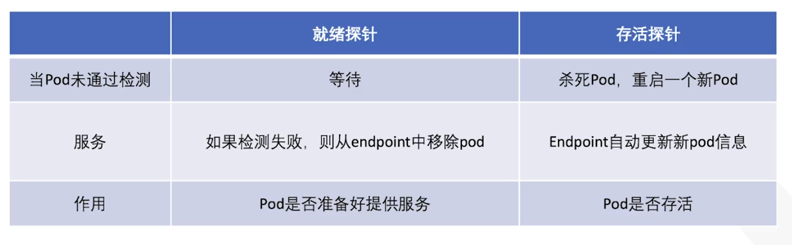

- 创建HTTP服务

  - 创建http的deployment和service，并在其中加入就绪探针，探测是否存在index.html文件

  - yaml

    ```yaml
    #rediness-test.yaml
    #httpd-deployment
    apiVersion: apps/v1
    kind: Deployment
    metadata:
      name: httpd-deployment
    spec:
      replicas: 3
      selector:
        matchLabels:
          app: httpd
      template:
        metadata:
          labels:
            app: httpd
        spec:
          containers:
          - name: httpd
            image: httpd
            ports:
            - containerPort: 80
            readinessProbe:
              exec:
                command:
                - cat
                - /usr/local/apache2/htdocs/index.html
              initialDelaySeconds: 5
              periodSeconds: 5
    ---
    #httpd-svc
    apiVersion: v1
    kind: Service
    metadata:
      name: httpd-svc
    spec:
      selector:
        app: httpd
      ports:
      - protocol: TCP
        port: 8080
        targetPort: 80
    ```

    ```bash
    # kubectl create -f rediness-test.yaml 
    deployment.apps/httpd-deployment created
    service/httpd-svc created
    
    # kubectl get deployments.apps httpd-deployment 
    NAME               READY   UP-TO-DATE   AVAILABLE   AGE
    httpd-deployment   3/3     3            3           115s
    
    # kubectl get pod -l app=httpd
    NAME                                READY   STATUS    RESTARTS   AGE
    httpd-deployment-78bc6f55d5-899vc   1/1     Running   0          2m2s
    httpd-deployment-78bc6f55d5-fg7dg   1/1     Running   0          2m2s
    httpd-deployment-78bc6f55d5-h775w   1/1     Running   0          2m2s
    
    # kubectl get svc
    NAME         TYPE        CLUSTER-IP       EXTERNAL-IP   PORT(S)    AGE
    httpd-svc    ClusterIP   10.105.188.170   <none>        8080/TCP   2m5s
    kubernetes   ClusterIP   10.96.0.1        <none>        443/TCP    3d16h
    
    # kubectl get endpoints
    NAME         ENDPOINTS                                           AGE
    httpd-svc    172.16.77.197:80,172.16.77.198:80,172.16.94.70:80   2m11s
    kubernetes   192.168.1.234:6443                                  3d16h
    
    # kubectl describe deployments.apps httpd-deployment |grep -i readiness
        Readiness:    exec [cat /usr/local/apache2/htdocs/index.html] delay=5s timeout=1s period=5s success=1 failure=3
    
    # kubectl exec -it httpd-deployment-78bc6f55d5-899vc -- /bin/bash
    root@httpd-deployment-78bc6f55d5-899vc:/usr/local/apache2# cd htdocs/
    root@httpd-deployment-78bc6f55d5-899vc:/usr/local/apache2/htdocs# ls
    index.html
    root@httpd-deployment-78bc6f55d5-899vc:/usr/local/apache2/htdocs# mv index.html index.html.bak
    root@httpd-deployment-78bc6f55d5-899vc:/usr/local/apache2/htdocs# exit
    exit
    
    # kubectl get pod -l app=httpd
    NAME                                READY   STATUS    RESTARTS       AGE
    httpd-deployment-78bc6f55d5-899vc   0/1     Running   0              76m
    httpd-deployment-78bc6f55d5-fg7dg   1/1     Running   0              76m
    httpd-deployment-78bc6f55d5-h775w   1/1     Running   0              76m
    root@k8s-master:~# kubectl get ep
    NAME         ENDPOINTS                          AGE
    httpd-svc    172.16.77.198:80,172.16.94.70:80   77m
    kubernetes   192.168.1.234:6443                 3d17h
    
    # kubectl describe pod httpd-deployment-78bc6f55d5-899vc|grep  -A 4 Events
    Events:
      Type     Reason     Age                     From     Message
      ----     ------     ----                    ----     -------
      Warning  Unhealthy  5m31s (x25 over 7m21s)  kubelet  Readiness probe failed: cat: /usr/local/apache2/htdocs/index.html: No such file or directory
    
    # kubectl describe deployments.apps httpd-deployment |grep ^\Replicas
    Replicas:               3 desired | 3 updated | 3 total | 2 available | 1 unavailable
    
    
    # kubectl exec -it httpd-deployment-78bc6f55d5-899vc -- /bin/bash
    root@httpd-deployment-78bc6f55d5-899vc:/usr/local/apache2# cd htdocs/
    root@httpd-deployment-78bc6f55d5-899vc:/usr/local/apache2/htdocs# ls
    index.html.bak
    root@httpd-deployment-78bc6f55d5-899vc:/usr/local/apache2/htdocs# mv index.html.bak index.html     
    root@httpd-deployment-78bc6f55d5-899vc:/usr/local/apache2/htdocs# exit
    exit
    command terminated with exit code 127
    
    # kubectl describe deployments.apps httpd-deployment |grep ^\Replicas
    Replicas:               3 desired | 3 updated | 3 total | 3 available | 0 unavailable
    
    # kubectl get pods -l app=httpd
    NAME                                READY   STATUS    RESTARTS   AGE
    httpd-deployment-78bc6f55d5-899vc   1/1     Running   0          81m
    httpd-deployment-78bc6f55d5-fg7dg   1/1     Running   0          81m
    httpd-deployment-78bc6f55d5-h775w   1/1     Running   0          81m
    # kubectl get ep
    NAME         ENDPOINTS                                           AGE
    httpd-svc    172.16.77.197:80,172.16.77.198:80,172.16.94.70:80   81m
    kubernetes   192.168.1.234:6443                                  3d17h
    ```

    

### 13.K8s网络

#### 13.1.K8s网络模型

- kubernetes的网络模型设计目标

  - kubernetes网络模型用于满足以下四种通信需求
    - 同一pod内容器间的通信(Container to Container)
    - pod间的通信(Pod to Pod)
    - Service到Pod间的通信(Service to Pod)
    - 集群外部与Service之间的通信(external to Service)

- 容器间通信

  - pod内各容器共享同一网络名称空间，该名称空间通常由基础架构容器所提供

    - 例如：由pause镜像启动容器

      所有运行于同一个pod内的容器与同一个主机上的多个进程类似，彼此之间可通过环回接口完成交互

      如图所示，pod N内的container1, container2,container3之间的通信即为容器间通信

      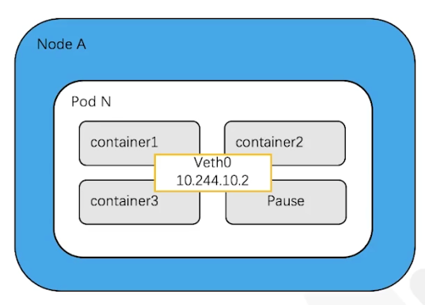

  - 不同pod之间不存在端口冲突的问题，因为每个pod都有自己的地址

- pod间通信

  - pod的IP是集群可见的，即集群中的任何其他pod和节点都可以通过IP直接与pod通信，这种通信不需要借助任何的网络地址转换、隧道或代理技术

  - pod内部和外部使用的是同一个IP，这也意味着标准的命名服务和发现机制，比如DNS可以直接使用

  - pod间通信示意图

    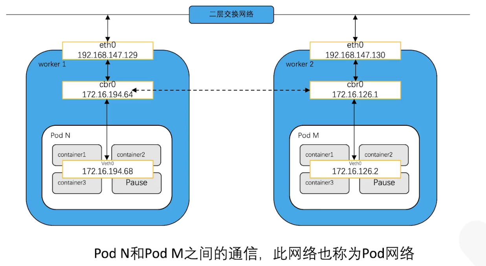

- Service与pod间的通信

  - Service资源的专用网络也称为集群网络(Cluster Network)

  - pod间可以直接通过IP地址通信，但前提是pod得知道对方的IP。在kubernetes集群中，pod可能会频繁的销毁和创建，也就是说pod的IP不是固定的

  - 为了解决这个问题，Service提供了访问pod的抽象层。无论后端的pod如何变化，Service都作为稳定的前端对外提供服务。同时，Service还是提供了高可用和负载均衡功能，Service复制将请求转发给正确的pod

    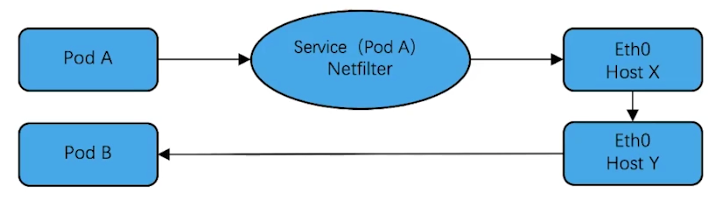

- 集群外部访问

  - kubernetes提供了两种方式让外界能够与pod通信

    - NodePort:

      Service通过Cluster节点的静态端口对外提供服务。外部可以通过<nodeIP>:<nodePort>访问Service

    - LoadBalance:

      Service利用load balancer(服务或设备)对外提供服务，LB负责将流量导向Service

      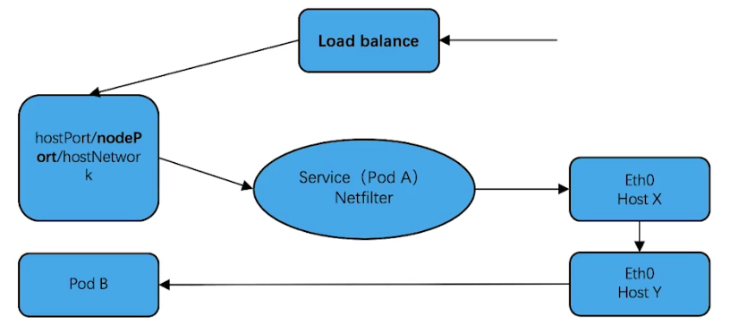

    

- Node与Pod之间通信实验

  1. 创建一个pod

     ```bash
     # kubectl run nginx --image=nginx --port=80
     pod/nginx created
     ```

     

  2. 查看该pod的IP地址及所处节点

     ```bash
     # kubectl get pod nginx -owide
     NAME    READY   STATUS    RESTARTS   AGE   IP             NODE          NOMINATED NODE   READINESS GATES
     nginx   1/1     Running   0          15s   172.16.94.71   k8s-docker2   <none>           <none>
     ```

     

  3. 从master节点访问该pod

     ```bash
     # curl 172.16.94.71
     <!DOCTYPE html>
     <html>
     <head>
     <title>Welcome to nginx!</title>
     ...输出省略...
      
     ```

     

- Pod和Pod之间通信实验

  1. 紧跟上个实验，创建一个client pod

     ```bash
     # kubectl run busybox --image=busybox -- sleep 3h
     pod/busybox created
     
     # kubectl get pod -o wide
     NAME                                READY   STATUS    RESTARTS   AGE     IP              NODE          NOMINATED NODE   READINESS GATES
     busybox                             1/1     Running   0          18s     172.16.94.72    k8s-docker2   <none>           <none>
     nginx                               1/1     Running   0          24m     172.16.94.71    k8s-docker2   <none>           <none>
     ```

     

  2. 容器间连通性ping测试

     ```bash
     # kubectl exec -it busybox -- /bin/sh
     / # ping 172.16.94.71 -c 1
     PING 172.16.94.71 (172.16.94.71): 56 data bytes
     64 bytes from 172.16.94.71: seq=0 ttl=63 time=0.236 ms
     
     --- 172.16.94.71 ping statistics ---
     1 packets transmitted, 1 packets received, 0% packet loss
     round-trip min/avg/max = 0.236/0.236/0.236 ms
     ```

     

  3. 在容器中访问nginx服务

     ```bash
     / # telnet 172.16.94.71 80
     Connected to 172.16.94.71
     get
     HTTP/1.1 400 Bad Request
     Server: nginx/1.23.4
     Date: Tue, 11 Apr 2023 07:03:12 GMT
     Content-Type: text/html
     Content-Length: 157
     Connection: close
     
     <html>
     <head><title>400 Bad Request</title></head>
     <body>
     <center><h1>400 Bad Request</h1></center>
     <hr><center>nginx/1.23.4</center>
     </body>
     </html>
     Connection closed by foreign host
     ```

     

- 集群外访问实验(NodePort方

  - 查看已运行pod的label

    ```bash
    # kubectl get pod --show-labels
    NAME                                READY   STATUS    RESTARTS   AGE     LABELS
    busybox                             1/1     Running   0          97m     run=busybox
    nginx                               1/1     Running   0          121m    run=nginx
    ```

    

  - 创建type为NodePort的Service的yaml文件

    ```yaml
    # nginx-np.yaml
    apiVersion: v1
    kind: Service
    metadata:
      name: nginx-access
    spec:
      selector:
        run: nginx
      ports:
      - protocol: TCP
        port: 80
        targetPort: 80
        nodePort: 30080
      type: NodePort
    ```

    

  - 访问

    ```bash
    # kubectl create -f nginx-np.yaml 
    service/nginx-access created
    
    ## kubectl get svc nginx-access 
    NAME           TYPE       CLUSTER-IP       EXTERNAL-IP   PORT(S)        AGE
    nginx-access   NodePort   10.105.179.221   <none>        80:30080/TCP   13s
    
    # kubectl get pod -owide|grep nginx
    nginx                               1/1     Running   0          153m    172.16.94.71    k8s-docker2   <none>           <none>
    
    新版本k8s无法在本地通过netstat或者ss查看nodeport的端口，只能通过iptables看到转发策略
    kube-proxy: remove port opener 
    # ss -anp|grep 30080
    # netstat -tnulp|grep 30080
    
    就算先创建docker占用30081端口，然后再次创建nodeport的svc用30081，还是默认走svc的pod，因为iptables中kube-services的优先级高于docker
     
    # iptables -t nat -nL|grep nginx-access
    KUBE-MARK-MASQ  all  --  0.0.0.0/0            0.0.0.0/0            /* masquerade traffic for default/nginx-access external destinations */
    KUBE-EXT-AELKM437PQO5UQ5T  tcp  --  0.0.0.0/0            0.0.0.0/0            /* default/nginx-access */ tcp dpt:30080
    KUBE-MARK-MASQ  all  --  172.16.94.71         0.0.0.0/0            /* default/nginx-access */
    DNAT       tcp  --  0.0.0.0/0            0.0.0.0/0            /* default/nginx-access */ tcp to:172.16.94.71:80
    KUBE-SVC-AELKM437PQO5UQ5T  tcp  --  0.0.0.0/0            10.105.179.221       /* default/nginx-access cluster IP */ tcp dpt:80
    KUBE-SEP-M6XJLPRUYO3TGBF3  all  --  0.0.0.0/0            0.0.0.0/0            /* default/nginx-access -> 172.16.94.71:80 */
    
    集群内访问：
    # curl 10.105.179.221
    <!DOCTYPE html>
    <html>
    <head>
    <title>Welcome to nginx!</title>
    ...输出省略...
    
    
    集群外访问：
    # curl k8s-master:30080
    <!DOCTYPE html>
    <html>
    <head>
    <title>Welcome to nginx!</title>
    ...输出省略...
    
    # curl k8s-docker1:30080
    <!DOCTYPE html>
    <html>
    <head>
    <title>Welcome to nginx!</title>
    ...输出省略...
    
    # curl k8s-docker2:30080
    <!DOCTYPE html>
    <html>
    <head>
    <title>Welcome to nginx!</title>
    ...输出省略...
    ```

    

#### 13.2.Pod网络实现方式

- Pod网络的实现方式

  - 每个pod对象内的基础架构容器均使用一个独立的网络名称空间

  - 该名称空间会共享给同一pod内其他容器使用

  - 每个网络名称空间均有其专有的独立网络协议栈及其相关的网络接口设备

  - 一个网络接口仅能属于一个网络名称空间

  - 运行多个pod必然要求使用多个网络名称空间，也就需要用到多个网络接口设备

    ```bash
    工作节点：
    
    # kubectl exec -it busybox -- /bin/sh
    / # 
    / # ip a
    1: lo: <LOOPBACK,UP,LOWER_UP> mtu 65536 qdisc noqueue qlen 1000
        link/loopback 00:00:00:00:00:00 brd 00:00:00:00:00:00
        inet 127.0.0.1/8 scope host lo
           valid_lft forever preferred_lft forever
        inet6 ::1/128 scope host 
           valid_lft forever preferred_lft forever
    2: tunl0@NONE: <NOARP> mtu 1480 qdisc noop qlen 1000
        link/ipip 0.0.0.0 brd 0.0.0.0
    4: eth0@if13: <BROADCAST,MULTICAST,UP,LOWER_UP,M-DOWN> mtu 1480 qdisc noqueue 
        link/ether fe:48:38:3e:49:c6 brd ff:ff:ff:ff:ff:ff
        inet 172.16.94.72/32 scope global eth0
           valid_lft forever preferred_lft forever
        inet6 fe80::fc48:38ff:fe3e:49c6/64 scope link 
           valid_lft forever preferred_lft forever
    / # exit
    
    # route -n
    Kernel IP routing table
    Destination     Gateway         Genmask         Flags Metric Ref    Use Iface
    0.0.0.0         192.168.1.1     0.0.0.0         UG    0      0        0 ens160
    172.16.77.192   192.168.1.235   255.255.255.192 UG    0      0        0 tunl0
    172.16.94.64    0.0.0.0         255.255.255.192 U     0      0        0 *
    172.16.94.70    0.0.0.0         255.255.255.255 UH    0      0        0 caliba8c8c1b7f8
    172.16.94.71    0.0.0.0         255.255.255.255 UH    0      0        0 calic440f455693
    172.16.94.72    0.0.0.0         255.255.255.255 UH    0      0        0 cali12d4a061371
    172.16.235.192  192.168.1.234   255.255.255.192 UG    0      0        0 tunl0
    192.168.1.0     0.0.0.0         255.255.255.0   U     0      0        0 ens160
    
    # ip a |grep -A 3 cali12d
    13: cali12d4a061371@if4: <BROADCAST,MULTICAST,UP,LOWER_UP> mtu 1480 qdisc noqueue state UP group default 
        link/ether ee:ee:ee:ee:ee:ee brd ff:ff:ff:ff:ff:ff link-netns cni-e8f23ffb-dae9-7c06-9795-cc0107ea14c8
        inet6 fe80::ecee:eeff:feee:eeee/64 scope link 
           valid_lft forever preferred_lft forever
           
    # ip netns list
    cni-e8f23ffb-dae9-7c06-9795-cc0107ea14c8 (id: 0)
    cni-0e348221-78d3-df2d-3423-6b9b6fbb6d3d (id: 2)
    cni-6c94c365-8dff-cc09-cffa-8da9670e5c3e (id: 1)
    ```

#### 13.3.CNI插件及常见的实现   

- 虚拟网络接口的实现方式

  - 用软件实现的虚拟网络接口及虚拟线缆将其连接至物理接口是一种较为流行的方案

  - 虚拟网络接口的实现方案常见的有虚拟网桥、多路复用及硬件交换三种

    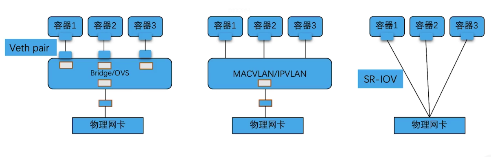

- 虚拟网络接口实现原理

  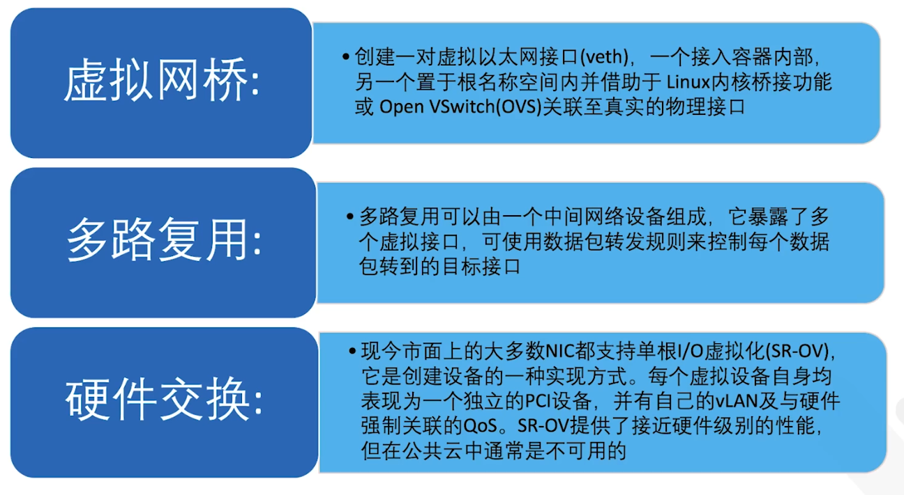
  


- 容器网络模型规范CNI

  - kubernetes设计了网络模型

  - CoreOS和Google联合制定了CNI(Container Network Interface)标准，连接了两个组件：容器管理系统和网络插件

  - CNI的设计思想是：

    容器runtime在创建容器时，提前创建好网络的名称空间(netns)，然后调用CNI插件为这个netns配置网络，然后再启动容器内的进程

- CNI drivers

  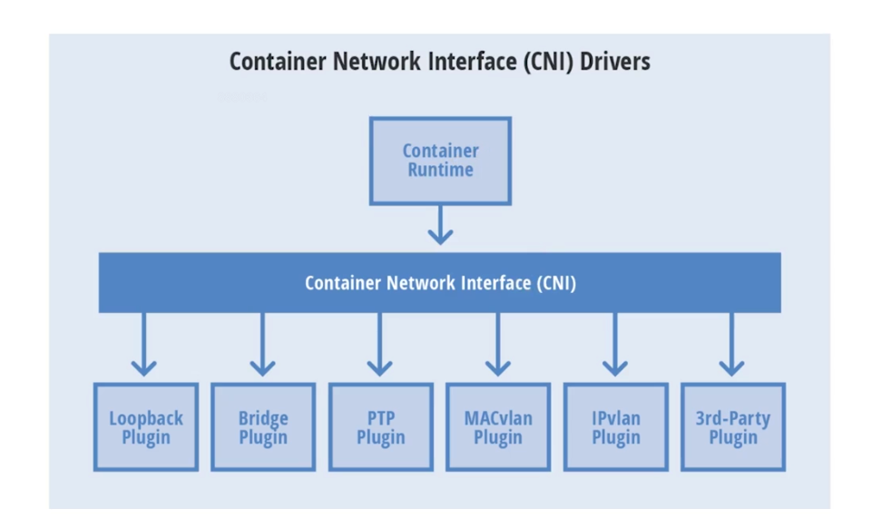

  CNI的优点是支持多种容器runtime，不仅仅是docker

  CNI的插件模型不同组织和公司开发的第三方插件，可以让我们灵活选择合适的网络方案

- CNI插件类型

  - CNI本身只是规范，付诸生产还需要有特定的实现

  - 插件分为三类：

    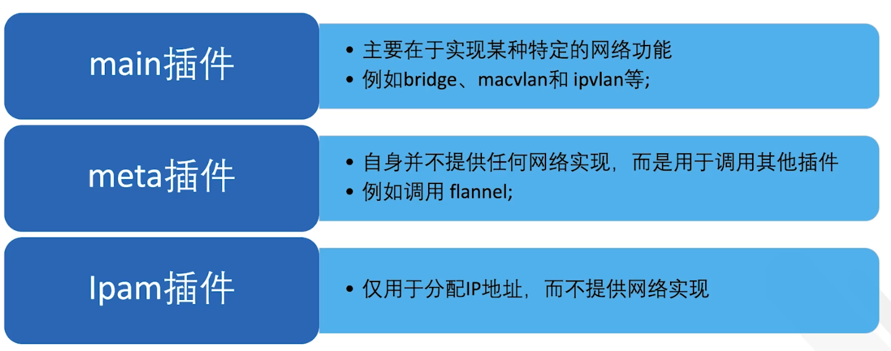

  

- 主流CNI插件项目

  - Flannel：

    一个为kubernetes提供叠加网络的网络插件，

    它基于Linux TUN/TAP，用UDP封装IP报文来创建叠加网络，并借助etcd维护网络的分配情况

  - Calico：

    一个基于BGP的三层网络插件，并且也支持网络策略来实现网络的访问控制；

    它在每台机器上运行一个vRouter，利用linux内核来转发网络数据包，并借助iptables实现防火墙的功能

  - Canal：

    由Flannel和caco联合发布的一个统一网络插件，提供CNI网络插件，并支持网络策略

  - Weave Net：

    一个多主机容器的网络方案，支持去中心化的控制平面，在各个host上的vRouter间建立Full mesh的TCP连接，并通过Gossip同步控制信息

  - Contiv：

    思科开源的容器网络方案，主要提供基于policy的网络管理，并与主流容器编排系统集成；Contiv最主要的优势是直接提供了多租户网络，支持L2(VLan)、L3(BGP)、Overlay(VXLAN)等

  - OpenContrail：

    Juniper推出的开源网络虚拟化平台，其商业版本为Contrail。由控制器和vRouter组成，控制器提供虚拟网络的配置、控制和分析功能，vRouter则提供分布式路由，负责虚拟路由器、虚拟网络的建立及数据转发
    
  - Romana：

    由Panic Networks于2016年释出的开源项目，旨在借鉴路由汇聚(route aggregation)的思路来解决叠加方案为网络带来的开销

  - NSX-T：

    由VMware提供，用于定义敏捷SDI(Software-Defined Infrastrature)以构建云原生应用环境；其旨在合并异构端点或技术栈的应用框架和架构，如vSphere、KVM、容器和bare metal等

  - kube-router：
    
    是kubernetes网络的一体化解决方案，它可取代kube-proxy实现基于ipvs的Service，能为pod提供网络，支持网络策略以及拥有完美兼容BGP的高级特性


### 14.K8s存储

#### 14.1.EmptyDir

- Volume

  - 在一个pod使用过程中，会进行很多操作，改变一些文件，安装一些程序等等。但当我们重启容器之后，会发现容器往往又回到了初始的状态，所有的修改都丢失了
  - 除了希望数据不在pod重启后丢失，我们有时候也需要在pod间共享文件，因此kubernetes抽象出了Volume对象来解决这两个问题

- Volume类型

  - kubernetes支持的卷类型非常丰富，包括：
    - NFS文件系统
    - Cephfs等分布式存储系统
    - awsElasticBlockStore，azureDisk等公有云存储服务
    - emptyDir，configMap，hostPath等kubernetes内置存储类型
    - ISCSI，FC等等...

- EmptyDir

  - 当pod指定到某个节点上时，首先创建的是一个空emptyDir卷，并且只要pod在该节点上运行，卷就一直存在。就像它的名称表示的那样，卷最初是空的。尽管pod中的容器挂载emptyDir卷的路径可能相同也可能不同，但是这些容器都可以读写emptyDir卷中相同的文件。当pod因为某些原因被从节点上删除时，emptyDir卷中的数据也会被永久删除

    

- 创建一个使用emptyDir的pod

  - 创建使用emptyDir时需要配置两个参数：

    - spec.containers.volumeMounts，设置volume的挂载点
    - spec.volumes，配置volume

  - 如果保持emptyDir的默认配置，可以用emptyDir: {}

    完整yaml

    ```yaml
    apiVersion: v1
    kind: Pod
    metadata:
      name: em
    spec:
      containers:
      - name: test-container
        image: ubuntu
        args:
        - /bin/sh
        - -c
        - sleep 3h
        volumeMounts:
        - name: cache-volume
          mountPath: /cache
      volumes:
      - name: cache-volume
        emptyDir: {}
    ```

    ```bash
    # kubectl create -f em.yaml 
    pod/em created
    
    # kubectl get pod em -o wide
    NAME   READY   STATUS    RESTARTS   AGE     IP              NODE          NOMINATED NODE   READINESS GATES
    em     1/1     Running   0          4m50s   172.16.77.200   k8s-docker1   <none>           <none>
    
    # kubectl describe pod em |grep -A 1 Mounts
        Mounts:
          /cache from cache-volume (rw)
    
    # kubectl describe pod em |grep -A 4 Volumes
    Volumes:
      cache-volume:
        Type:       EmptyDir (a temporary directory that shares a pod's lifetime)
        Medium:     
        SizeLimit:  <unset>
    
    # kubectl exec -it em -- /bin/sh
    # ls -l /cache
    total 0
    # echo em | tee -a /cache/em.log
    em
    # cat /cache/em.log
    em
    # df -h
    Filesystem                         Size  Used Avail Use% Mounted on
    overlay                             38G  7.8G   29G  22% /
    tmpfs                               64M     0   64M   0% /dev
    tmpfs                              2.0G     0  2.0G   0% /sys/fs/cgroup
    /dev/mapper/ubuntu--vg-ubuntu--lv   38G  7.8G   29G  22% /cache
    shm                                 64M     0   64M   0% /dev/shm
    tmpfs                              3.8G   12K  3.8G   1% /run/secrets/kubernetes.io/serviceaccount
    tmpfs                              2.0G     0  2.0G   0% /proc/acpi
    tmpfs                              2.0G     0  2.0G   0% /proc/scsi
    tmpfs                              2.0G     0  2.0G   0% /sys/firmware
    
    ```

    

  - 如果限制emptyDir容量(比如1G)，需配置

    ```yaml
    volumes:
    - name: cache-volume
      emptyDir:
        sizeLimit: 2G
    ```

    - 虽然限制容量为2G，但是在pod内查看的话，显示的是Host存储空间大小，并非2G

      /dev/mapper/ubuntu--vg-ubuntu--lv   38G  7.9G   29G  22% /cache

    - 当尝试在容器内写入一个2G的文件时，pod会报错：ContainerStatusUnknown

      

    完整yaml

    ```yaml
    apiVersion: v1
    kind: Pod
    metadata:
      name: em1
    spec:
      containers:
      - name: test-container
        image: ubuntu
        args:
        - /bin/sh
        - -c
        - sleep 3h
        volumeMounts:
        - name: cache-volume
          path: /cache
      volumes:
      - name: cache-volume
        emptyDir: 
          sizeLimit: 2G
    ```

    ```bash
    # kubectl create -f em1.yaml 
    pod/em1 created
    
    # kubectl get pod em1 -o wide
    NAME   READY   STATUS    RESTARTS   AGE   IP             NODE          NOMINATED NODE   READINESS GATES
    em1    1/1     Running   0          32s   172.16.94.74   k8s-docker2   <none>           <none>
    
    # kubectl describe pod em1 |grep -A 1 Mounts
        Mounts:
          /cache from cache-volume (rw)
    # kubectl describe pod em1 |grep -A 4 Volume
    Volumes:
      cache-volume:
        Type:       EmptyDir (a temporary directory that shares a pod's lifetime)
        Medium:     
        SizeLimit:  2G
    
    # kubectl exec -it em1 -- /bin/sh
    # ls -l /cache
    total 0
    # df -h
    Filesystem                         Size  Used Avail Use% Mounted on
    overlay                             38G  7.9G   29G  22% /
    tmpfs                               64M     0   64M   0% /dev
    tmpfs                              2.0G     0  2.0G   0% /sys/fs/cgroup
    /dev/mapper/ubuntu--vg-ubuntu--lv   38G  7.9G   29G  22% /cache
    shm                                 64M     0   64M   0% /dev/shm
    tmpfs                              3.8G   12K  3.8G   1% /run/secrets/kubernetes.io/serviceaccount
    tmpfs                              2.0G     0  2.0G   0% /proc/acpi
    tmpfs                              2.0G     0  2.0G   0% /proc/scsi
    tmpfs                              2.0G     0  2.0G   0% /sys/firmware
    # dd if=/dev/zero of=/cache/big.file bs=1M count=2048
    2048+0 records in
    2048+0 records out
    2147483648 bytes (2.1 GB, 2.0 GiB) copied, 5.49806 s, 391 MB/s
    # df -h
    Filesystem                         Size  Used Avail Use% Mounted on
    overlay                             38G  9.9G   27G  28% /
    tmpfs                               64M     0   64M   0% /dev
    tmpfs                              2.0G     0  2.0G   0% /sys/fs/cgroup
    /dev/mapper/ubuntu--vg-ubuntu--lv   38G  9.9G   27G  28% /cache
    shm                                 64M     0   64M   0% /dev/shm
    tmpfs                              3.8G   12K  3.8G   1% /run/secrets/kubernetes.io/serviceaccount
    tmpfs                              2.0G     0  2.0G   0% /proc/acpi
    tmpfs                              2.0G     0  2.0G   0% /proc/scsi
    tmpfs                              2.0G     0  2.0G   0% /sys/firmware
    # exit
    
    # kubectl get pod em1 
    NAME   READY   STATUS                   RESTARTS   AGE
    em1    0/1     ContainerStatusUnknown   1          6m16s
    
    # kubectl describe pod em1 |grep -A 12 Events
    Events:
      Type     Reason               Age    From               Message
      ----     ------               ----   ----               -------
      Normal   Scheduled            7m54s  default-scheduler  Successfully assigned default/em1 to k8s-docker2
      Normal   Pulling              7m54s  kubelet            Pulling image "ubuntu"
      Normal   Pulled               7m32s  kubelet            Successfully pulled image "ubuntu" in 22.069036767s (22.069041401s including waiting)
      Normal   Created              7m31s  kubelet            Created container test-container
      Normal   Started              7m31s  kubelet            Started container test-container
      Warning  Evicted              2m20s  kubelet            Usage of EmptyDir volume "cache-volume" exceeds the limit "2G".
      Normal   Killing              2m20s  kubelet            Stopping container test-container
      Warning  ExceededGracePeriod  2m10s  kubelet            Container runtime did not kill the pod within specified grace period.
    
    # kubectl exec -it em1 -- /bin/sh
    error: cannot exec into a container in a completed pod; current phase is Failed
    ```

    

#### 14.2.hostPath

- hostPath

  - hostPath卷能将主机节点文件系统上的文件或目录挂载到pod中

  - 比如希望pod使用一些docker引擎或系统已经包含的内部程序的时候，会使用到这种方式。如 以下为kube-proxy中配置的hostPath

    ```yaml
    # kubectl -n kube-system get pod -l k8s-app=kube-proxy
    NAME               READY   STATUS    RESTARTS   AGE
    kube-proxy-nmhnh   1/1     Running   0          4d21h
    kube-proxy-p2vws   1/1     Running   0          4d21h
    kube-proxy-zmzxx   1/1     Running   0          4d21h
    
    # kubectl -n kube-system get pod kube-proxy-nmhnh -o yaml | grep -A 4 volumeMounts
        volumeMounts:
        - mountPath: /var/lib/kube-proxy
          name: kube-proxy
        - mountPath: /run/xtables.lock
          name: xtables-lock
          
    # kubectl -n kube-system get pod kube-proxy-nmhnh -o yaml | grep -A 12 volumes
      volumes:
      - configMap:
          defaultMode: 420
          name: kube-proxy
        name: kube-proxy
      - hostPath:
          path: /run/xtables.lock
          type: FileOrCreate
        name: xtables-lock
      - hostPath:
          path: /lib/modules
          type: ""
        name: lib-modules
    
    # kubectl -n kube-system describe pod kube-proxy-nmhnh |grep -A 4 Mounts
        Mounts:
          /lib/modules from lib-modules (ro)
          /run/xtables.lock from xtables-lock (rw)
          /var/lib/kube-proxy from kube-proxy (rw)
          /var/run/secrets/kubernetes.io/serviceaccount from kube-api-access-gztxn (ro)
    # kubectl -n kube-system describe pod kube-proxy-nmhnh |grep -A 12 Volumes
    Volumes:
      kube-proxy:
        Type:      ConfigMap (a volume populated by a ConfigMap)
        Name:      kube-proxy
        Optional:  false
      xtables-lock:
        Type:          HostPath (bare host directory volume)
        Path:          /run/xtables.lock
        HostPathType:  FileOrCreate
      lib-modules:
        Type:          HostPath (bare host directory volume)
        Path:          /lib/modules
        HostPathType:  
    
    ```

    

- 创建使用hostPath的pod

  - hostPath配置与emptyDir类似，但类型需指定为hostPath，里面有两个参数：
    - path参数需配置为主机上已存在的目录
    - type参数指定hostPath的类型

  yaml

  ```yaml
  apiVersion: v1
  kind: Pod
  metadata:
    name: hppod
  spec:
    containers:
    - name: hp-container
      image: ubuntu
      args:
      - /bin/sh
      - -c
      - sleep 3h
      volumeMounts:
      - name: hp-volume
        mountPath: /hp-dir
    volumes:
    - name: hp-volume
      hostPath:
        path: /mnt/hostpathdir
        type: DirectoryOrCreate
  
  ```

  ```bash
  两个工作节点，检查/mnt目录
  # ls -l /mnt
  total 0
  
  # kubectl create -f hppod.yaml 
  pod/hppod created
  
  # kubectl get pod hppod -owide
  NAME    READY   STATUS    RESTARTS   AGE   IP             NODE          NOMINATED NODE   READINESS GATES
  hppod   1/1     Running   0          41s   172.16.94.76   k8s-docker2   <none>           <none>
  
  前往k8s-docker2节点，发现自动创建了
  # ls -l /mnt
  total 4
  drwxr-xr-x 2 root root 4096 Apr 12 17:15 hostpathdir
  
  
  # kubectl exec -it hppod -- /bin/sh
  # ls -l /hp-dir
  total 0
  # echo 123 > /hp-dir/abc
  # exit
  
  # ls /mnt/hostpathdir
  abc
  # cat /mnt/hostpathdir/abc
  123
  ```

  

- hostPath的类型

  - 创建hostPath时，需要指定类型(type)

    type的值可能为：

    | Value             | Behavior                                                     |
    | ----------------- | ------------------------------------------------------------ |
    |                   | Empty string (default) is for backward compatibility, which means that no checks will be performed before mounting the hostPath volume. |
    | DirectoryOrCreate | If nothing exists at the given path, an empty directory will be created there as needed with permission set to 0755, having the same group and ownership with Kubelet. |
    | Directory         | A directory must exist at the given path                     |
    | FileOrCreate      | If nothing exists at the given path, an empty file will be created there as needed with permission set to 0644, having the same group and ownership with Kubelet. |
    | File              | A file must exist at the given path                          |
    | Socket            | A UNIX socket must exist at the given path                   |
    | CharDevice        | A character device must exist at the given path              |
    | BlockDevice       | A block device must exist at the given path                  |
  
    

     - 如果选择类型不正确，或主机上不存在对应资源(如不存在指定文件夹)，kubernetes将无法继续创建pod，创建步骤终止。pod的状态长时间处于ContainerCreating中
  
  ```bash
  两个工作节点都没有目录 /mnt/hostpathdir01
  # ls /mnt
  total 0
  
  # kubectl create -f- <<EOF
  apiVersion: v1
  kind: Pod
  metadata:
    name: hppod01
  spec:
    containers:
    - name: hp-container
      image: ubuntu
      args:
      - /bin/sh
      - -c
      - sleep 3h
      volumeMounts:
      - name: hp-volume
        mountPath: /hp-dir
    volumes:
    - name: hp-volume
      hostPath:
        path: /mnt/hostpathdir01
        type: Directory
  EOF
  
  pod/hppod01 created
  
  # kubectl get pod hppod01 
  NAME      READY   STATUS              RESTARTS   AGE
  hppod01   0/1     ContainerCreating   0          50s
  
  # kubectl describe pod hppod01 |grep -A 4 Events
  Events:
    Type     Reason       Age                From               Message
    ----     ------       ----               ----               -------
    Normal   Scheduled    51s                default-scheduler  Successfully assigned default/hppod01 to k8s-docker1
    Warning  FailedMount  20s (x7 over 51s)  kubelet            MountVolume.SetUp failed for volume "hp-volume" : hostPath type check failed: /mnt/hostpathdir01 is not a directory
    
  
  # kubectl delete pod hppod01 
  pod "hppod01" deleted
  
  
  # kubectl create -f- <<EOF
  apiVersion: v1
  kind: Pod
  metadata:
    name: hppod01
  spec:
    containers:
    - name: hp-container
      image: ubuntu
      args:
      - /bin/sh
      - -c
      - sleep 3h
      volumeMounts:
      - name: hp-volume
        mountPath: /hp-dir
    volumes:
    - name: hp-volume
      hostPath:
        path: /mnt/hostpathdir01
  EOF
  
  pod/hppod01 created
  
  # kubectl get pod hppod01 
  NAME      READY   STATUS    RESTARTS   AGE
  hppod01   1/1     Running   0          56s
  
  # kubectl delete pod hppod01 
  pod "hppod01" deleted
  
  
  # ls /mnt
  total 0
  
  两个工作节点都要建立目录/mnt/hostpathdir01，再次创建含有type: Directory的pod没有问题了
  
  # mkdir -p /mnt/hostpathdir01
  
  # ls /mnt
  hostpathdir01
  
  # kubectl create -f- <<EOF
  apiVersion: v1
  kind: Pod
  metadata:
    name: hppod01
  spec:
    containers:
    - name: hp-container
      image: ubuntu
      args:
      - /bin/sh
      - -c
      - sleep 3h
      volumeMounts:
      - name: hp-volume
        mountPath: /hp-dir
    volumes:
    - name: hp-volume
      hostPath:
        path: /mnt/hostpathdir01
        type: Directory
  EOF
  
  pod/hppod01 created
  
  # kubectl get pod hppod01 
  NAME      READY   STATUS    RESTARTS   AGE
  hppod01   1/1     Running   0          56s
  
  ```
  
  
     

#### 14.3.PV和PVC

- pv和pvc概述

  - pv(persistentvolume)和pvc(persistentvolumeclaim)是k8s提供的两种API资源，用于抽象存储细节。

    管理员关注于如何通过pv提供存储功能而无需关注用户如何使用，同样的用户只需要挂载pvc到容器中而不需要关注存储卷采用何种技术实现

    - pv是集群中由管理员配置的一块存储空间

      它是集群中的资源，就像节点是集群中的资源一样。pv是卷插件，和之前介绍的volumes类似，但它有一个独立于单个pod的生命周期。pv的后端可以是NFS,ISCSI或者云存储等

    - pvc使用户的存储请求

      它类似于Pod：pod消耗节点资源，而pvc消耗pvc资源。pod可以请求特定级别的资源(cpu和内存)，pvc可以请求pv特定的接入模式(读写等)和大小

- 创建pv

  - 基本参数：

    - kind选择PersistentVolume

    - capacity指定pv的容量

    - accessModes指定访问模式

      - ReadWriteOnce：该卷能够以读写模式被加载到一个节点上
      - ReadOnlyMany：该卷能够以只读模式被加载到多个节点上
      - ReadWriteMany：该卷能够以读写模式被加多个节点同时加载

    - persistentVolumeReclaimPolicy：指定pv的回收策略

      - Retain(保留)：不删除，需要手动回收
      - Recycle(回收)：基本擦除，类似rm -rf，使其可供其他pvc申请
      - Delete(删除)：关联存储将被删除，如Azure disk或OpenStack Cinder卷

    - nfs：配置nfs服务器信息。

      在创建pv前，已搭建完NFS服务器，IP地址是192.168.1.227，共享的文件夹是/k8s

      两个工作节点也都安装了nfs-common，不然无法挂载nfs   # apt install -y nfs-common

      pv支持的挂载选项包括NFS、ISCIS、Cinder卷、CephFS等

  

  ```yaml
  # mypv.yaml
  apiVersion: v1
  kind: PersistentVolume
  metadata:
    name: mypv
  spec:
    capacity:
      storage: 1G
    accessModes:
      - ReadWriteOnce
    persistentVolumeReclaimPolicy: Recycle
    nfs:
      server: 192.168.1.227
      path: /k8s
  ```

  ```bash
  # kubectl create -f- <<EOF
  apiVersion: v1
  kind: PersistentVolume
  metadata:
    name: mypv
  spec:
    capacity:
      storage: 1G
    accessModes:
      - ReadWriteOnce
    persistentVolumeReclaimPolicy: Recycle
    nfs:
      server: 192.168.1.227
      path: /k8s
  EOF
  
  persistentvolume/mypv created
  
  # kubectl get pv mypv
  NAME   CAPACITY   ACCESS MODES   RECLAIM POLICY   STATUS      CLAIM   STORAGECLASS   REASON   AGE
  mypv   1G         RWO            Recycle          Available                                   42s
  
  ```

  

- 创建PVC

  - 基本参数
    - kind，类型指定为PersistentVolumeClaim
    - accessModes，保存与pv一致
    - volumeName，使用pv的名字，用于pvc找到正确的pv
    - resources.requests，指定pv的容量，如果不存在满足该容量需求的pv，则pvc无法绑定任何pv
    - 

  ```yaml
  # mypvc.yaml
  apiVersion: v1
  kind: PersistentVolumeClaim
  metadata:
    name: mypvc
  spec:
    accessModes:
      - ReadWriteOnce
    volumeName: mypv
    # 因为我前面默认安装了storageClassName: csi-hostpath-sc，为了冲突，这里名字留空
    storageClassName: "" 
    resources:
      requests:
        storage: 1G
  ```

  ```bash
  # kubectl get pv mypv
  NAME   CAPACITY   ACCESS MODES   RECLAIM POLICY   STATUS      CLAIM   STORAGECLASS   REASON   AGE
  mypv   1G         RWO            Recycle          Available                                   35m
  
  
  # kubectl create -f mypvc.yaml 
  persistentvolumeclaim/mypvc created
  
  # kubectl get pvc mypvc 
  NAME    STATUS    VOLUME   CAPACITY   ACCESS MODES   STORAGECLASS   AGE
  mypvc   Pending   mypv     0  
  
  # kubectl get pv mypv
  NAME   CAPACITY   ACCESS MODES   RECLAIM POLICY   STATUS   CLAIM           STORAGECLASS   REASON   AGE
  mypv   1G         RWO            Recycle          Bound    default/mypvc                           36m
  
  # kubectl get pvc mypvc
  NAME    STATUS   VOLUME   CAPACITY   ACCESS MODES   STORAGECLASS   AGE
  mypvc   Bound    mypv     1G         RWO                           9s
  
  ```

  

- pv与pvc的状态

  - pv状态，创建完成后为Available

    - Available---创建pvc--->Bound---删除pvc--->Release
    - Failed，storage不可用

  - pvc状态，创建完成后为pending

    - Pending---绑定pv--->Bound---删除pv--->Lost

    

    

  ```bash
  # kubectl delete pvc mypvc && kubectl get pod 
  mypvc deleted
  
  NAME                READY   STATUS             RESTARTS   AGE
  recycler-for-mypv   0/1     ContainerCreating   0          2m2s
  
  正常情况：
  # kubectl get pv mypv
  NAME   CAPACITY   ACCESS MODES   RECLAIM POLICY   STATUS      CLAIM   STORAGECLASS   REASON   AGE
  mypv   1G         RWO            Recycle          Available                                   71m
  
  
  如果recycler-for-mypv拉取镜像失败，那么会报错：
  # kubectl get pod recycler-for-mypv 
  NAME                READY   STATUS             RESTARTS   AGE
  recycler-for-mypv   0/1     ImagePullBackOff   0          2m5s
  
  # kubectl get pv mypv
  NAME   CAPACITY   ACCESS MODES   RECLAIM POLICY   STATUS   CLAIM           STORAGECLASS   REASON   AGE
  mypv   1G         RWO            Recycle          Failed   default/mypvc                           70m
  
  
  ```

  

  

  

- d


### 15.ConfigMap与Secret

#### 15.1.ConfigMap

#### 15.2.Secret

#### 

### 16.StatefulSet

#### 16.1.StatefulSet管理与使用

#### 16.2.使用StatefulSet

#### 

### 17.kubernetes服务质量

#### 17.1.Service基本概念

#### 17.2.服务发现

#### 17.3.集群中的DNS

#### 17.4.Headless Service

### 18.Kubernetes资源调度

#### 11.1.Service基本概念

#### 11.2.服务发现

#### 11.3.集群中的DNS

#### 11.4.Headless Service

### 11.

#### 11.1.Service基本概念

#### 11.2.服务发现

#### 11.3.集群中的DNS

#### 11.4.Headless Service

### 11.

#### 11.1.Service基本概念

#### 11.2.服务发现

#### 11.3.集群中的DNS

#### 11.4.Headless Service


---


### 附录
#### A1.学习方法

| step |                |                    |               示例                |
| :--: | :------------: | :----------------: | --------------------------------- |
|  1   |      word      |    查单词，释义    |            pull，拉取             |
|  2   | <kbd>Tab</kbd> | 一下不全，两下列出 | # doc<kbd>Tab</kbd><br /># docker <kbd>空格</kbd> <kbd>Tab</kbd><kbd>Tab</kbd> |
|  3   |   man,--help   |        帮助        | # man docker run <br># docker --help |
|  4   | echo $? | 查看回显 | 0 == 正确执行<br>非0 == 错误执行 |
|  5   |                |                    |                                   |


#### A2.相关软件

| step |   NAME   |                             URL                              |            FUNC            |
| :--: | :------: | :----------------------------------------------------------: | :------------------------: |
|  1   | 欧路词典 |                    https://www.eudic.net/                    |          翻译软件          |
|  2   |  Typora  |                     https://typoraio.cn                      |      MarkDown格式文档      |
|  3   |  VMware  |                   https://www.vmware.com/                    |         虚拟化软件         |
|  4   |  ubuntu  |                     https://ubuntu.com/                      |        系统光盘iso         |
|  5   |  docker  |       https://docs.docker.com/desktop/install/ubuntu/        |            国外            |
|      |          | https://developer.aliyun.com/mirror/docker-ce?spm=a2c6h.13651102.0.0.4ea21b11CvJUSb |         国内阿里云         |
|      |          | https://cr.console.aliyun.com/cn-hangzhou/instances/mirrors  |   仓库加速器daemon.json    |
|      |          |              https://docs.docker.com/reference/              | docker命令及dockerfile介绍 |
|  6   |          |                                                              |                            |


#### A3.ubuntu快捷键

| step |                            快捷键                            |       FUNC       |
| :--: | :----------------------------------------------------------: | :--------------: |
|  1   | <kbd>crtl</kbd>-<kbd>shift</kbd>-<kbd>=</kbd>\|<kbd>ctrl</kbd>-<kbd>+</kbd> |     字体放大     |
|  2   |        <kbd>crtl</kbd>-<kbd>shift</kbd>-<kbd>T</kbd>         | 新建terminal标签 |
|  3   |   <kbd>Alt</kbd>-<kbd>1</kbd>\|<kbd>Alt</kbd>-<kbd>2</kbd>   |     切换标签     |
|      |                                                              |                  |
|      |                                                              |                  |


#### A4.vim

```bash
# vim
# apt install vim
```


| mode |   模式   |                |              |                     |
| :--: | :------: | :------------: | :----------: | :-----------------: |
|  1   | 命令模式 |  <kbd>i</kbd>  |              |   默认的工作模式    |
|  2   | 输入模式 | <kbd>Esc</kbd> | -- INSERT -- |    退出输入模式     |
|  3   | 末行模式 |      :wq       |              | write quit 保存退出 |


| step |      快捷键       |                FUNC                 |
| :--: | :---------------: | :---------------------------------: |
|  1   |     :%s/^/#/g     |          全部行首快速添加#          |
|  2   |     :%s/$/#/g     |          全部行尾快速添加#          |
|  3   |   :r !seq 1 100   |              递归数字               |
|  4   |   :r dockerfile   | 导入所在文件夹下的dockerfile的内容  |
|  5   | :set paste ---> i | 解决在vim中直接粘贴内容时的缩进错乱 |


#### A5.typora快捷键

| step |                            快捷键                            |      FUNC      |
| :--: | :----------------------------------------------------------: | :------------: |
|  1   |                 <kbd>crtl</kbd>-<kbd>T</kbd>                 |    插入表格    |
|  2   |        <kbd>crtl</kbd>-<kbd>shift</kbd>-<kbd>K</kbd>         |   添加代码块   |
|  3   |          <kbd>-</kbd><kbd>-</kbd><kbd>-</kbd> 回车           | 添加一行分隔符 |
|  4   |        <kbd>crtl</kbd>-<kbd>shift</kbd>-<kbd>]</kbd>         |     小黑点     |
|  5   | <kbd>crtl</kbd>-<kbd>shift</kbd>-<kbd>]</kbd>，然后按回车+TAB键 |   空心小圆点   |

```

```


#### A6.dockerfile

Dockerfile常用命令


|         指令          |                       作用                        |                           命令格式                           | 例子                                                         |
| :-------------------: | :-----------------------------------------------: | :----------------------------------------------------------: | :----------------------------------------------------------- |
|         FROM          |                   指定base镜像                    |   FROM [--platform=<platform>] <image>[:<tag>] [AS <name>]   | FROM  centos                                                 |
| MAINTAINER<br />LABEL |                    维护者信息                     |     LABEL <key>=<value> <key>=<value> <key>=<value> ...      | LABEL "com.example.vendor"="ACME Incorporated" <br />LABEL com.example.label-with-value="foo" LABEL version="1.0" |
|          RUN          |                  运行指定的命令                   | RUN <command>：<br />Linux: /bin/sh -c, Windows: cmd /S /C<br />RUN ["executable", "param1", "param2"] | RUN /bin/bash -c 'source $HOME/.bashrc; echo $HOME'<br />RUN ["/bin/bash", "-c", "echo hello"]<br />RUN ["c:\\windows\\system32\\tasklist.exe"] |
|          ADD          | 将文件从build context复制到镜像中<br />可以解压缩 | ADD [--chown=<user>:<group>] [--checksum=<checksum>] <src>... <dest><br/>ADD [--chown=<user>:<group>] ["<src>",... "<dest>"] | ADD hom* /mydir/<br /><br />ADD --chown=55:mygroup files* /somedir/ |
|         COPY          |         将文件从build context复制到镜像中         | COPY [--chown=<user>:<group>] <src>... <dest><br/>COPY [--chown=<user>:<group>] ["<src>",... "<dest>"] | COPY hom* /mydir/<br />COPY --chown=55:mygroup files* /somedir/ |
|          ENV          |                   设置环境变量                    |                    ENV <key>=<value> ...                     | ENV MY_NAME="John Doe"<br/>ENV MY_DOG=Rex\ The\ Dog<br/>ENV MY_CAT=fluffy |
|        EXPOSE         |            指定容器中的应用坚挺的端口             |             EXPOSE <port> [<port>/<protocol>...]             | EXPOSE 80/tcp<br/>EXPOSE 80/udp                              |
|         USER          |                设置启动容器的用户                 |                    USER <user>[:<group>]                     | USER tommy                                                   |
|          CMD          |       设置在容器启动时运行指定的脚本或命令        | `CMD ["executable","param1","param2"]` (*exec* form, this is the preferred form) <br />`CMD ["param1","param2"]` (as *default parameters to ENTRYPOINT*) <br />`CMD command param1 param2` (*shell* form) | CMD echo "This is a test." \| wc -<br />CMD ["/usr/bin/wc","--help"] |
|      ENTRYPOINT       |      指定的是一个可执行的脚本或者程序的路径       |               ENTRYPOINT command param1 param2               | FROM ubuntu<br/>ENTRYPOINT ["top", "-b"]<br/>CMD ["-c"]<br /><br />FROM debian:stable<br/>RUN apt-get update && apt-get install -y --force-yes apache2<br/>EXPOSE 80 443<br/>VOLUME ["/var/www", "/var/log/apache2", "/etc/apache2"]<br/>ENTRYPOINT ["/usr/sbin/apache2ctl", "-D", "FOREGROUND"] |
|        VOLUME         |      将文件或目录声明为volume，挂载到容器中       |                       VOLUME ["/data"]                       | FROM ubuntu <br />RUN mkdir /myvol <br />RUN echo "hello world" > /myvol/greeting <br />VOLUME /myvol |
|        WORKDIR        |              设置镜像的当前工作目录               |                   WORKDIR /path/to/workdir                   | WORKDIR /a<br/>WORKDIR b<br/>WORKDIR c<br/>RUN pwd           |


> 官网https://docs.docker.com/engine/reference/builder/


#### 目录

